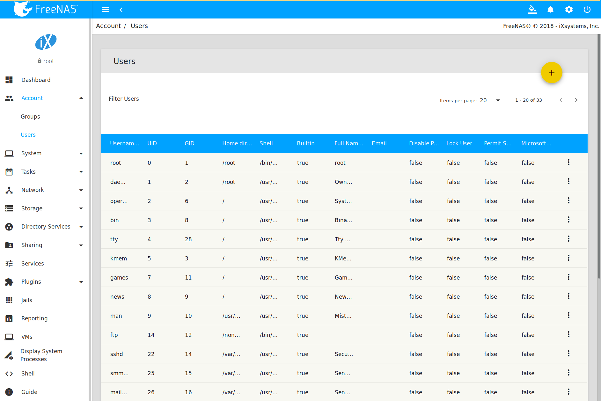

.. _Account:

Account
=======

The Account Configuration section of the administrative GUI describes
how to manually create and manage users and groups. This section
contains these entries:

* :ref:`Groups`: used to manage UNIX-style groups on the %brand%
  system.

* :ref:`Users`: used to manage UNIX-style accounts on the %brand%
  system.

Each entry is described in more detail in this section.

.. index:: Groups
.. _Groups:

Groups
------

The Groups interface provides management of UNIX-style groups on the
%brand% system.

.. note:: It is unnecessary to recreate the network users or groups
   when a directory service is running on the same network. Instead,
   import the existing account information into %brand%. Refer to
   :ref:`Directory Services` for details.

This section describes how to create a group and assign user
accounts to it. The next section, :ref:`Users`, describes creating
user accounts.

Click
:menuselection:`Groups --> View Groups`
to see a screen like
:numref:`Figure %s <group_man_fig>`.

.. _group_man_fig:

.. figure:: images/group1.png

   Group Management

The :guilabel:`Groups` page lists all groups, including those built-in
and used by the operating system. The table displays group names,
group IDs (GID), built-in groups, and if :command:`sudo` is permitted.
Clicking a group entry causes a :guilabel:`Members` button to appear.
Click the button to view and modify the group membership

.. index:: Add Group, New Group, Create Group

The :guilabel:`Add Group` button opens the screen shown in
:numref:`Figure %s <new_group_fig>`.
:numref:`Table %s <new_group_tab>`
summarizes the available options when creating a group.

.. _new_group_fig:

.. figure:: images/group2.png

   Creating a New Group

.. tabularcolumns:: |>{\RaggedRight}p{\dimexpr 0.25\linewidth-2\tabcolsep}
                    |>{\RaggedRight}p{\dimexpr 0.12\linewidth-2\tabcolsep}
                    |>{\RaggedRight}p{\dimexpr 0.63\linewidth-2\tabcolsep}|

.. _new_group_tab:

.. table:: Group Creation Options
   :class: longtable

   +------------------------+-------------+----------------------------------------------------------------------------------------------------------------------------+
   | Setting                | Value       | Description                                                                                                                |
   |                        |             |                                                                                                                            |
   +========================+=============+============================================================================================================================+
   | Group ID               | string      | The next available group ID is suggested. UNIX groups containing user accounts typically have an ID greater than 1000      |
   |                        |             | and groups required by a service have an ID equal to the default port number used by the service. Example: the sshd        |
   |                        |             | group has an ID of 22.                                                                                                     |
   |                        |             |                                                                                                                            |
   +------------------------+-------------+----------------------------------------------------------------------------------------------------------------------------+
   | Group Name             | string      | Required. Enter a descriptive name for the new group.                                                                      |
   |                        |             |                                                                                                                            |
   +------------------------+-------------+----------------------------------------------------------------------------------------------------------------------------+
   | Permit Sudo            | checkbox    | Set to allow group members to use `sudo <https://www.sudo.ws/>`__. When using :command:`sudo`, a user                      |
   |                        |             | is prompted for their own password.                                                                                        |
   |                        |             |                                                                                                                            |
   +------------------------+-------------+----------------------------------------------------------------------------------------------------------------------------+
   | Allow repeated GIDs    | checkbox    | Set to allow multiple groups to share the same group id (GID). This is useful when a GID is already associated with the    |
   |                        |             | UNIX permissions for existing data, but is generally not recommended.                                                      |
   |                        |             |                                                                                                                            |
   +------------------------+-------------+----------------------------------------------------------------------------------------------------------------------------+

After a group and users are created, users can be added to a group.
Highlight the group where users will be assigned, then click the
:guilabel:`Members` button. Highlight the user in the
:guilabel:`Member users` list. This shows all user accounts on the
system. Click :guilabel:`>>` to move that user to the right frame.
The user accounts which appear in the right frame are added as members
of the group.

:numref:`Figure %s <user_group_fig>`, shows user1 added as a member
of group data1.

.. _user_group_fig:

.. figure:: images/group3.png

   Assigning a User to a Group

.. index:: Delete Group, Remove Group

The :guilabel:`Delete Group` button deletes a group. The pop-up
message asks whether all members of that group should also be deleted.
Note that the built-in groups do not provide a
:guilabel:`Delete Group` button.

.. index:: Users
.. _Users:

Users
-----

%brand% supports users, groups, and permissions, allowing
flexibility in configuring which users have access to the data stored
on %brand%. To assign permissions to shares,
**one of these options** must be done:

#.  Create a guest account for all users, or create a user
    account for every user in the network where the name of each
    account is the same as a login name used on a computer. For
    example, if a Windows system has a login name of *bobsmith*,
    create a user account with the name *bobsmith* on %brand%.
    A common strategy is to create groups with different sets of
    permissions on shares, then assign users to those groups.

#.  If the network uses a directory service, import the existing
    account information using the instructions in
    :ref:`Directory Services`.

:menuselection:`Account --> Users --> View Users` lists
all system accounts installed with the %brand% operating system, as
shown in :numref:`Figure %s <managing_user_fig>`.

.. _managing_user_fig:

   Managing User Accounts

Each account entry indicates the user ID, username, primary group ID,
home directory, default shell, full name, whether it is a
built-in user that came with the %brand% installation, the email
address, if logins are disabled, if the user account is locked, whether
the user is allowed to use :command:`sudo`, and if the user connects
from a Windows 8 or newer system. To reorder the list, click the desired
column name. An arrow indicates which column controls the view sort
order. Click the arrow to reverse the sort order.

Click a user account to cause these buttons to appear:

* **Modify User:** used to modify the account's settings, as listed
  in :numref:`Table %s <user_account_conf_tab>`.

* **Change E-mail:** used to change the email address associated with
  the account.

.. note:: Setting the the email address for the built-in
   *root* user account is recommended as important system messages are
   sent to the *root* user. For security reasons, password logins are
   disabled for the *root* account and changing this setting is
   discouraged.

Except for the *root* user, the accounts that come with %brand%
are system accounts. Each system account is used by a service and
should not be used as a login account. For this reason, the default
shell on system accounts is
`nologin(8) <https://www.freebsd.org/cgi/man.cgi?query=nologin>`__.
For security reasons and to prevent breakage of system services, do
not modify the system accounts.

.. index:: Add User, Create User, New User

The :guilabel:`Add User` button opens the screen shown in
:numref:`Figure %s <add_user_fig>`.
Some settings are only available in :guilabel:`Advanced Mode`. To see
these settings, either click :guilabel:`Advanced Mode` or configure the
system to always display these settings by setting
:guilabel:`Show advanced fields by default` in
:menuselection:`System --> Advanced`.
:numref:`Table %s <user_account_conf_tab>`
summarizes the options which are available when user accounts are
created or modified.

.. warning:: When using :ref:`Active Directory`, Windows user
   passwords must be set from within Windows.

.. _add_user_fig:

.. figure:: images/user2.png

   Adding or Editing a User Account

.. tabularcolumns:: |>{\RaggedRight}p{\dimexpr 0.20\linewidth-2\tabcolsep}
                    |>{\RaggedRight}p{\dimexpr 0.16\linewidth-2\tabcolsep}
                    |>{\Centering}p{\dimexpr 0.10\linewidth-2\tabcolsep}
                    |>{\RaggedRight}p{\dimexpr 0.54\linewidth-2\tabcolsep}|

.. _user_account_conf_tab:

.. table:: User Account Configuration
   :class: longtable

   +------------------------+---------------+-------------+--------------------------------------------------------------------------------------------------------------------------------+
   | Setting                | Value         | Advanced    | Description                                                                                                                    |
   |                        |               | Mode        |                                                                                                                                |
   |                        |               |             |                                                                                                                                |
   +========================+===============+=============+================================================================================================================================+
   | User ID                | integer       |             | Grayed out if the user already exists. When creating an account, the next numeric ID is suggested. User accounts typically     |
   |                        |               |             | have an ID greater than 1000 and system accounts have an ID equal to the default port number used by the service.              |
   |                        |               |             |                                                                                                                                |
   +------------------------+---------------+-------------+--------------------------------------------------------------------------------------------------------------------------------+
   | Username               | string        |             | Grayed out if the user already exists. Maximum 16 characters, though a maximum of 8 is recommended for interoperability.       |
   |                        |               |             | Cannot begin with a hyphen :kbd:`-`, if a :literal:`$` is used it can only be the last character, and it cannot contain        |
   |                        |               |             | a space, tab, or the characters :literal:`, : + & # % ^ \ & ( ) ! @ ~ * ? < > =`.                                              |
   |                        |               |             |                                                                                                                                |
   +------------------------+---------------+-------------+--------------------------------------------------------------------------------------------------------------------------------+
   | Create a new           | checkbox      |             | A primary group with the same name as the user is created automatically. Unset to select a different primary group name.       |
   | primary group          |               |             |                                                                                                                                |
   +------------------------+---------------+-------------+--------------------------------------------------------------------------------------------------------------------------------+
   | Primary Group          | drop-down     |             | Unset :guilabel:`Create a new primary group` to access this menu. For security reasons, FreeBSD does not give a user           |
   |                        | menu          |             | :command:`su` permissions if *wheel* is their primary group. To give a user :command:`su` access, add them to the              |
   |                        |               |             | *wheel* group in :guilabel:`Auxiliary groups`.                                                                                 |
   |                        |               |             |                                                                                                                                |
   +------------------------+---------------+-------------+--------------------------------------------------------------------------------------------------------------------------------+
   | Create Home            | browse        |             | Browse to the name of an **existing** volume or dataset that the user will be assigned permission to access.                   |
   | Directory In           | button        |             |                                                                                                                                |
   |                        |               |             |                                                                                                                                |
   +------------------------+---------------+-------------+--------------------------------------------------------------------------------------------------------------------------------+
   | Home Directory Mode    | checkboxes    | ✓           | Sets default Unix permissions of the user's home directory. This is read-only for built-in users.                              |
   |                        |               |             |                                                                                                                                |
   |                        |               |             |                                                                                                                                |
   +------------------------+---------------+-------------+--------------------------------------------------------------------------------------------------------------------------------+
   | Shell                  | drop-down     |             | Select the shell to use for local and SSH logins. See :numref:`Table %s <shells_tab>` for an overview of available shells.     |
   |                        | menu          |             |                                                                                                                                |
   |                        |               |             |                                                                                                                                |
   +------------------------+---------------+-------------+--------------------------------------------------------------------------------------------------------------------------------+
   | Full Name              | string        |             | Required. This field may contain spaces.                                                                                       |
   |                        |               |             |                                                                                                                                |
   +------------------------+---------------+-------------+--------------------------------------------------------------------------------------------------------------------------------+
   | E-mail                 | string        |             | The email address associated with the account.                                                                                 |
   |                        |               |             |                                                                                                                                |
   +------------------------+---------------+-------------+--------------------------------------------------------------------------------------------------------------------------------+
   | Password               | string        |             | Required unless :guilabel:`Disable password login` is set. Cannot contain a :literal:`?`.                                      |
   |                        |               |             |                                                                                                                                |
   +------------------------+---------------+-------------+--------------------------------------------------------------------------------------------------------------------------------+
   | Password               | string        |             | This must match the value of :guilabel:`Password`.                                                                             |
   | confirmation           |               |             |                                                                                                                                |
   +------------------------+---------------+-------------+--------------------------------------------------------------------------------------------------------------------------------+
   | Disable password       | checkbox      |             | Set to disable password logins and authentication to SMB shares. To undo this setting, create a password for the               |
   | login                  |               |             | user by clicking :guilabel:`Modify User` for the user in the :guilabel:`View Users` screen. Setting this grays out             |
   |                        |               |             | :guilabel:`Lock user` and :guilabel:`Permit Sudo`.                                                                             |
   |                        |               |             |                                                                                                                                |
   +------------------------+---------------+-------------+--------------------------------------------------------------------------------------------------------------------------------+
   | Lock user              | checkbox      |             | Set to prevent the user from logging in until this box is unset. Setting this grays out :guilabel:`Disable password login`.    |
   |                        |               |             |                                                                                                                                |
   +------------------------+---------------+-------------+--------------------------------------------------------------------------------------------------------------------------------+
   | Permit Sudo            | checkbox      |             | Set to give group members permission to use `sudo <https://www.sudo.ws/>`__. When using :command:`sudo`, a user                |
   |                        |               |             | is prompted for their own password.                                                                                            |
   |                        |               |             |                                                                                                                                |
   +------------------------+---------------+-------------+--------------------------------------------------------------------------------------------------------------------------------+
   | Microsoft Account      | checkbox      |             | Set this when the user is connecting from a Windows 8 or newer system.                                                         |
   |                        |               |             |                                                                                                                                |
   +------------------------+---------------+-------------+--------------------------------------------------------------------------------------------------------------------------------+
   | SSH Public Key         | string        |             | Enter or paste the user's **public** SSH key to be used for key-based authentication. **Do not paste the private key!**        |
   |                        |               |             |                                                                                                                                |
   +------------------------+---------------+-------------+--------------------------------------------------------------------------------------------------------------------------------+
   | Auxiliary groups       | mouse         |             | Highlight groups to add the user. Click the :guilabel:`>>` to add the user to the highlighted groups.                          |
   |                        | selection     |             |                                                                                                                                |
   |                        |               |             |                                                                                                                                |
   +------------------------+---------------+-------------+--------------------------------------------------------------------------------------------------------------------------------+

.. note:: Some fields cannot be changed for built-in users and will be
   grayed out.

.. tabularcolumns:: |>{\RaggedRight}p{\dimexpr 0.16\linewidth-2\tabcolsep}
                    |>{\RaggedRight}p{\dimexpr 0.66\linewidth-2\tabcolsep}|

.. _shells_tab:

.. table:: Available Shells
   :class: longtable

   +--------------+-------------------------------------------------------------------------------------------------------+
   | Shell        | Description                                                                                           |
   |              |                                                                                                       |
   +==============+=======================================================================================================+
   | netcli.sh    | User is shown the Console Setup menu (:numref:`Figure %s <console_setup_menu_fig>`) on connection,    |
   |              | even if it is disabled in :menuselection:`System --> Advanced --> Enable Console Menu`. The user      |
   |              | must be *root* or have root permissions (effective user ID 0, like *toor*).                           |
   |              |                                                                                                       |
   +--------------+-------------------------------------------------------------------------------------------------------+
   | csh          | `C shell <https://en.wikipedia.org/wiki/C_shell>`__                                                   |
   |              |                                                                                                       |
   +--------------+-------------------------------------------------------------------------------------------------------+
   | sh           | `Bourne shell <https://en.wikipedia.org/wiki/Bourne_shell>`__                                         |
   |              |                                                                                                       |
   +--------------+-------------------------------------------------------------------------------------------------------+
   | tcsh         | `Enhanced C shell <https://en.wikipedia.org/wiki/Tcsh>`__                                             |
   |              |                                                                                                       |
   +--------------+-------------------------------------------------------------------------------------------------------+
   | nologin      | Use when creating a system account or to create a user account that can authenticate with shares      |
   |              | but which cannot login to the FreeNAS system using :command:`ssh`.                                    |
   |              |                                                                                                       |
   +--------------+-------------------------------------------------------------------------------------------------------+
   | bash         | `Bourne Again shell <https://en.wikipedia.org/wiki/Bash_%28Unix_shell%29>`__                          |
   |              |                                                                                                       |
   +--------------+-------------------------------------------------------------------------------------------------------+
   | ksh93        | `Korn shell <http://www.kornshell.com/>`__                                                            |
   |              |                                                                                                       |
   +--------------+-------------------------------------------------------------------------------------------------------+
   | mksh         | `mirBSD Korn shell <https://www.mirbsd.org/mksh.htm>`__                                               |
   |              |                                                                                                       |
   +--------------+-------------------------------------------------------------------------------------------------------+
   | rbash        | `Restricted bash <http://www.gnu.org/software/bash/manual/html_node/The-Restricted-Shell.html>`__     |
   |              |                                                                                                       |
   +--------------+-------------------------------------------------------------------------------------------------------+
   | rzsh         | `Restricted zsh <http://www.csse.uwa.edu.au/programming/linux/zsh-doc/zsh_14.html>`__                 |
   |              |                                                                                                       |
   +--------------+-------------------------------------------------------------------------------------------------------+
   | scponly      | Select `scponly <https://github.com/scponly/scponly/wiki>`__ to restrict the user's SSH usage         |
   |              | to only the :command:`scp` and :command:`sftp` commands.                                              |
   |              |                                                                                                       |
   +--------------+-------------------------------------------------------------------------------------------------------+
   | zsh          | `Z shell <http://www.zsh.org/>`__                                                                     |
   |              |                                                                                                       |
   +--------------+-------------------------------------------------------------------------------------------------------+
   | git-shell    | `restricted git shell <https://git-scm.com/docs/git-shell>`__                                         |
   |              |                                                                                                       |
   +--------------+-------------------------------------------------------------------------------------------------------+

.. index:: Remove User, Delete User

Built-in user accounts needed by the system cannot be removed. A
:guilabel:`Remove User` button appears for custom users that were
added by the system administrator. If the user to be removed is the
last user in a custom group, an option is presented to delete the
group as well.
