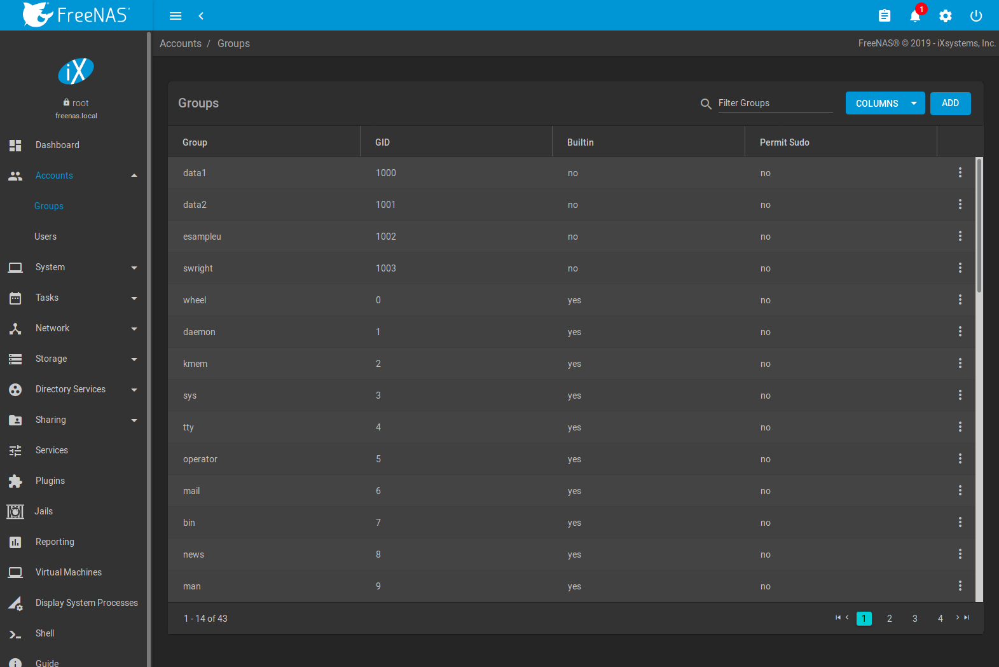
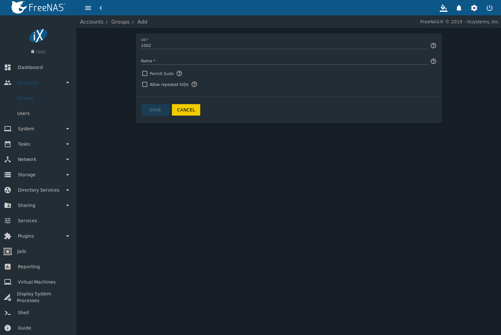
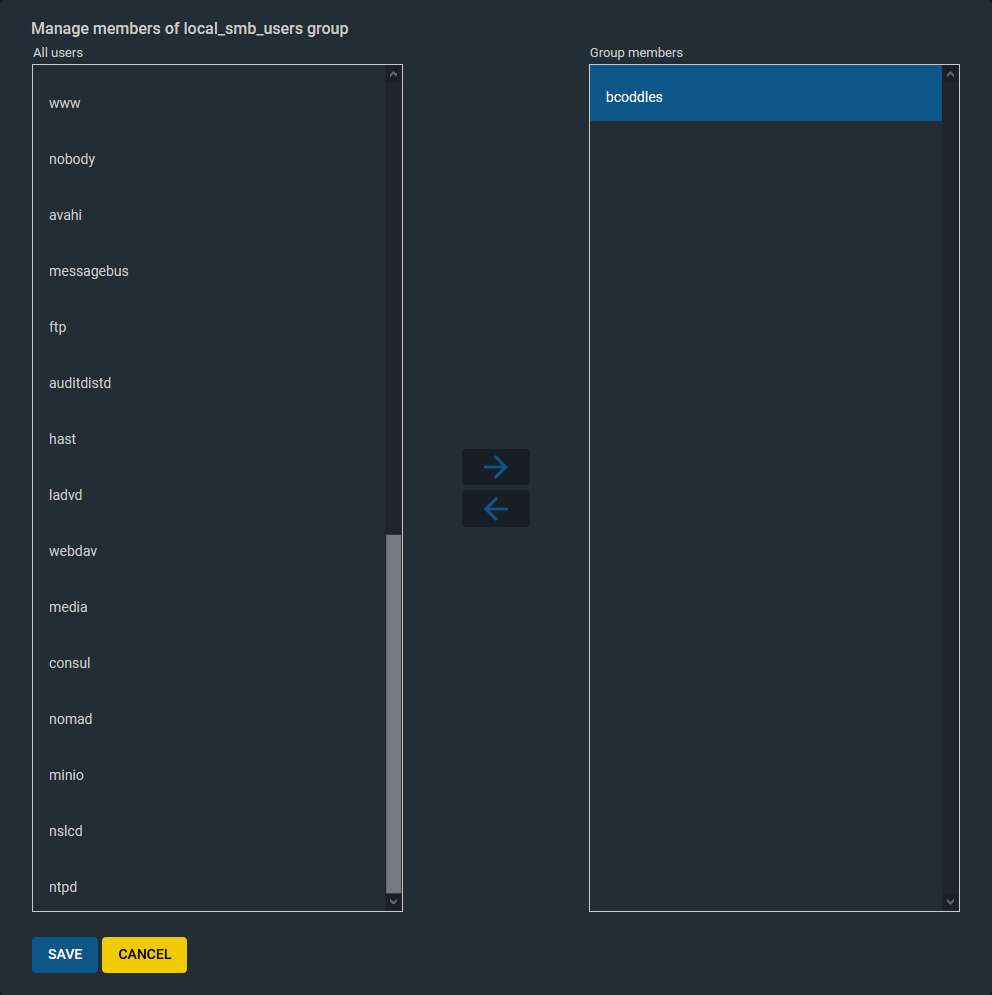
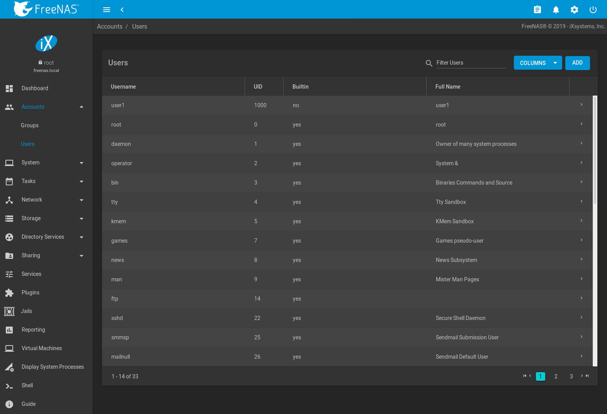
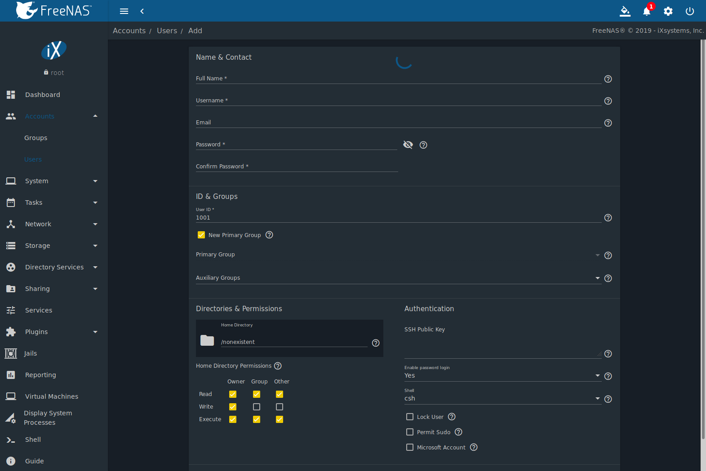

.. _Accounts:

Accounts
========

:menuselection:`Accounts`
is used to manage users and groups. This section contains these entries:

* :ref:`Groups`: used to manage UNIX-style groups on the %brand%
  system.

* :ref:`Users`: used to manage UNIX-style accounts on the %brand%
  system.

Each entry is described in more detail in this section.

.. index:: Groups
.. _Groups:

Groups
------

The Groups interface provides management of UNIX-style groups on the
%brand% system.

.. note:: It is unnecessary to recreate the network users or groups
   when a directory service is running on the same network. Instead,
   import the existing account information into %brand%. Refer to
   :ref:`Directory Services` for details.

This section describes how to create a group and assign user
accounts to it. The next section, :ref:`Users`, describes creating
user accounts.

Click
:menuselection:`Accounts --> Groups`
to see a screen like
:numref:`Figure %s <group_man_fig>`.

.. _group_man_fig:

   Group Management

The :guilabel:`Groups` page lists all groups, including those built in
and used by the operating system. The table displays group names, group
IDs (GID), built-in groups, and if :command:`sudo` is permitted.
Clicking the |ui-options| icon on a user created group entry displays
:guilabel:`Members`, :guilabel:`Edit`, and :guilabel:`Delete` options.
Click :guilabel:`Members` to view and modify the group membership.
Note built-in groups are required by the %brand% system so they
do not have :guilabel:`Edit`, and :guilabel:`Delete` buttons.

.. index:: Add Group, New Group, Create Group

The |ui-add| button opens the screen shown in
:numref:`Figure %s <new_group_fig>`.
:numref:`Table %s <new_group_tab>`
summarizes the available options when creating a group.

.. _new_group_fig:

   Creating a New Group

.. tabularcolumns:: |>{\RaggedRight}p{\dimexpr 0.25\linewidth-2\tabcolsep}
                    |>{\RaggedRight}p{\dimexpr 0.12\linewidth-2\tabcolsep}
                    |>{\RaggedRight}p{\dimexpr 0.63\linewidth-2\tabcolsep}|

.. _new_group_tab:

.. table:: Group Creation Options
   :class: longtable

   +---------------------+-----------+--------------------------------------------------------------------------------------------------------------------------+
   | Setting             | Value     | Description                                                                                                              |
   |                     |           |                                                                                                                          |
   |                     |           |                                                                                                                          |
   +=====================+===========+==========================================================================================================================+
   | GID                 | string    | The next available group ID is suggested. By convention, UNIX groups containing user accounts have an ID greater than    |
   |                     |           | 1000 and groups required by a service have an ID equal to the default port number used by the service. Example:          |
   |                     |           | the :literal:`sshd` group has an ID of 22.                                                                               |
   |                     |           |                                                                                                                          |
   +---------------------+-----------+--------------------------------------------------------------------------------------------------------------------------+
   | Name                | string    | Enter a name for the new group.                                                                                          |
   |                     |           |                                                                                                                          |
   +---------------------+-----------+--------------------------------------------------------------------------------------------------------------------------+
   | Permit Sudo         | checkbox  | Set to allow group members to use `sudo <https://www.sudo.ws/>`__. When using :command:`sudo`, a user is                 |
   |                     |           | prompted for their own password.                                                                                         |
   |                     |           |                                                                                                                          |
   +---------------------+-----------+--------------------------------------------------------------------------------------------------------------------------+
   | Allow repeated GIDs | checkbox  | Set to allow multiple groups to share the same group id (GID). This is useful when a GID is already associated           |
   |                     |           | with the UNIX permissions for existing data.                                                                             |
   |                     |           |                                                                                                                          |
   +---------------------+-----------+--------------------------------------------------------------------------------------------------------------------------+

After a group and users are created, users can be added to a group.
Click |ui-options| on the desired group then
:guilabel:`Members`. Select the users in the :guilabel:`Members` list.
This list shows all user accounts on the system. Next, click :guilabel:`->`
to move the users to the right frame. Press
:guilabel:`SAVE` to add the users on the right frame to the group.

:numref:`Figure %s <user_group_fig>`,
shows *user1* added as a member of group *data1*.

.. _user_group_fig:

   Assigning a User to a Group

.. index:: Delete Group, Remove Group

The :guilabel:`Delete` button deletes a group. The pop-up message asks
if all users with this primary group should also be deleted, and to
confirm the action. Note built-in groups do not have a
:guilabel:`Delete` button.

.. index:: Users
.. _Users:

Users
-----

%brand% supports users, groups, and permissions, allowing
flexibility in configuring which users have access to the data stored
on %brand%. To assign permissions to shares,
select one of these options:

#.  Create a guest account for all users, or create a user
    account for every user in the network where the name of each
    account is the same as a login name used on a computer. For
    example, if a Windows system has a login name of *bobsmith*,
    create a user account with the name *bobsmith* on %brand%.
    A common strategy is to create groups with different sets of
    permissions on shares, then assign users to those groups.

#.  If the network uses a directory service, import the existing
    account information using the instructions in
    :ref:`Directory Services`.

:menuselection:`Accounts --> Users` lists all system
accounts installed with the %brand% operating system, as shown in
:numref:`Figure %s <managing_user_fig>`.

.. _managing_user_fig:

   Managing User Accounts

By default, each user entry displays the username, home directory,
default shell, the user full name, and if the user is locked. This table
is adjustable by setting the different column checkboxes above it. Set
:guilabel:`Toggle` to display all options in the table.

Clicking a column name sorts the list by that value. An arrow
indicates which column controls the view sort order. Click the arrow to
reverse the sort order.

Click |ui-options| on the user created account to display
the :guilabel:`Edit` and :guilabel:`Delete` buttons. Note built-in users
do not have a :guilabel:`Delete` button.

.. note:: Setting the email address for the built-in
   *root* user account is recommended as important system messages
   are sent to the *root* user. For security reasons, password logins
   are disabled for the *root* account and changing this setting is
   highly discouraged.

Except for the *root* user, the accounts that come with %brand%
are system accounts. Each system account is used by a service and
should not be used as a login account. For this reason, the default
shell on system accounts is
`nologin(8) <https://www.freebsd.org/cgi/man.cgi?query=nologin>`__.
For security reasons and to prevent breakage of system services,
modifying the system accounts is discouraged.

.. index:: Add User, Create User, New User

The |ui-add| button opens the screen shown in
:numref:`Figure %s <add_user_fig>`.
:numref:`Table %s <user_account_conf_tab>`
summarizes the options that are available when user accounts are
created or modified.

.. warning:: When using :ref:`Active Directory`, Windows user
   passwords must be set from within Windows.

.. _add_user_fig:

   Adding or Editing a User Account

.. tabularcolumns:: |>{\RaggedRight}p{\dimexpr 0.25\linewidth-2\tabcolsep}
                    |>{\RaggedRight}p{\dimexpr 0.20\linewidth-2\tabcolsep}
                    |>{\RaggedRight}p{\dimexpr 0.55\linewidth-2\tabcolsep}|

.. _user_account_conf_tab:

.. table:: User Account Configuration
   :class: longtable

   +----------------------------+-----------------+-------------------------------------------------------------------------------------------------------------------------------+
   | Setting                    | Value           | Description                                                                                                                   |
   |                            |                 |                                                                                                                               |
   +============================+=================+===============================================================================================================================+
   | Username                   | string          | Enter an alphanumeric username of eight to sixteen characters. Keeping usernames to eight characters or less is recommended   |
   |                            |                 | for compatibility with legacy clients. Note that :literal:`$` can only be used as the last character. Usernames cannot begin  |
   |                            |                 | with a hyphen :kbd:`-` or contain a space, tab, or these characters: :literal:`, : + & # % ^ \ & ( ) ! @ ~ * ? < > =`         |
   |                            |                 |                                                                                                                               |
   +----------------------------+-----------------+-------------------------------------------------------------------------------------------------------------------------------+
   | Full Name                  | string          | This field is mandatory and may contain spaces.                                                                               |
   |                            |                 |                                                                                                                               |
   +----------------------------+-----------------+-------------------------------------------------------------------------------------------------------------------------------+
   | Email                      | string          | The email address associated with the account.                                                                                |
   |                            |                 |                                                                                                                               |
   +----------------------------+-----------------+-------------------------------------------------------------------------------------------------------------------------------+
   | Password                   | string          | Mandatory unless :guilabel:`Enable password login` is *No*. Cannot contain a :literal:`?`.                                    |
   |                            |                 | Click |ui-password-show| to view or obscure the password characters.                                                          |
   |                            |                 |                                                                                                                               |
   +----------------------------+-----------------+-------------------------------------------------------------------------------------------------------------------------------+
   | Confirm Password           | string          | Required to match the value of :guilabel:`Password`.                                                                          |
   |                            |                 |                                                                                                                               |
   +----------------------------+-----------------+-------------------------------------------------------------------------------------------------------------------------------+
   | User ID                    | integer         | Grayed out if the user already exists. When creating an account, the next numeric ID is suggested. By convention, user        |
   |                            |                 | accounts have an ID greater than 1000 and system accounts have an ID equal to the default port number used by the service.    |
   |                            |                 |                                                                                                                               |
   +----------------------------+-----------------+-------------------------------------------------------------------------------------------------------------------------------+
   | New Primary Group          | checkbox        | Set by default to create a new a primary group with the same name as the user. Unset to select a different                    |
   |                            |                 | primary group name.                                                                                                           |
   |                            |                 |                                                                                                                               |
   +----------------------------+-----------------+-------------------------------------------------------------------------------------------------------------------------------+
   | Primary Group              | drop-down menu  | Unset :guilabel:`New Primary Group` to access this menu. For security reasons, FreeBSD will not give a user                   |
   |                            |                 | :command:`su` permissions if *wheel* is their primary group. To give a user :command:`su` access, add them to the             |
   |                            |                 | *wheel* group in :guilabel:`Auxiliary groups`.                                                                                |
   |                            |                 |                                                                                                                               |
   +----------------------------+-----------------+-------------------------------------------------------------------------------------------------------------------------------+
   | Auxiliary groups           | drop-down menu  | Select which groups the user will be added to.                                                                                |
   |                            |                 |                                                                                                                               |
   +----------------------------+-----------------+-------------------------------------------------------------------------------------------------------------------------------+
   | Home Directory             | browse button   | Browse to the name of an **existing** pool or dataset where the user will be assigned permission to access.                   |
   |                            |                 |                                                                                                                               |
   +----------------------------+-----------------+-------------------------------------------------------------------------------------------------------------------------------+
   | Home Directory Permissions | checkboxes      | Sets default Unix permissions of user's home directory. This is **read-only** for built-in users.                             |
   |                            |                 |                                                                                                                               |
   +----------------------------+-----------------+-------------------------------------------------------------------------------------------------------------------------------+
   | SSH Public Key             | string          | Paste the user's **public** SSH key to be used for key-based authentication.                                                  |
   |                            |                 | **Do not paste the private key!**                                                                                             |
   |                            |                 |                                                                                                                               |
   +----------------------------+-----------------+-------------------------------------------------------------------------------------------------------------------------------+
   | Enable password login      | checkbox        | Set to disable password logins and authentication to SMB shares. To undo this setting, set a password for the                 |
   |                            |                 | user with the :guilabel:`Edit` button for the user in :guilabel:`Users`. Setting this option grays out                        |
   |                            |                 | :guilabel:`Lock user` and :guilabel:`Permit Sudo`, which are mutually exclusive.                                              |
   |                            |                 |                                                                                                                               |
   +----------------------------+-----------------+-------------------------------------------------------------------------------------------------------------------------------+
   | Shell                      | drop-down menu  | Select the shell to use for local and SSH logins. See :numref:`Table %s <shells_tab>` for an overview of available shells.    |
   |                            |                 |                                                                                                                               |
   +----------------------------+-----------------+-------------------------------------------------------------------------------------------------------------------------------+
   | Lock User                  | checkbox        | Set to prevent the user from logging in until the account is unlocked. Setting this                                           |
   |                            |                 | option grays out :guilabel:`Disable password login`, which is mutually exclusive.                                             |
   |                            |                 |                                                                                                                               |
   +----------------------------+-----------------+-------------------------------------------------------------------------------------------------------------------------------+
   | Permit Sudo                | checkbox        | Set to allow members of the group to use `sudo <https://www.sudo.ws/>`__. When using sudo, a user is                          |
   |                            |                 | prompted for their own password.                                                                                              |
   |                            |                 |                                                                                                                               |
   +----------------------------+-----------------+-------------------------------------------------------------------------------------------------------------------------------+
   | Microsoft Account          | checkbox        | Set if the user is connecting from a Windows 8 or higher system.                                                              |
   |                            |                 |                                                                                                                               |
   +----------------------------+-----------------+-------------------------------------------------------------------------------------------------------------------------------+

.. note:: Some fields cannot be changed for built-in users and are
   grayed out.

.. tabularcolumns:: |>{\RaggedRight}p{\dimexpr 0.16\linewidth-2\tabcolsep}
                    |>{\RaggedRight}p{\dimexpr 0.66\linewidth-2\tabcolsep}|

.. _shells_tab:

.. table:: Available Shells
   :class: longtable

   +--------------+----------------------------------------------------------------------------------------------------------------------+
   | Shell        | Description                                                                                                          |
   |              |                                                                                                                      |
   +==============+======================================================================================================================+
   | csh          | `C shell <https://en.wikipedia.org/wiki/C_shell>`__                                                                  |
   |              |                                                                                                                      |
   +--------------+----------------------------------------------------------------------------------------------------------------------+
   | sh           | `Bourne shell <https://en.wikipedia.org/wiki/Bourne_shell>`__                                                        |
   |              |                                                                                                                      |
   +--------------+----------------------------------------------------------------------------------------------------------------------+
   | tcsh         | `Enhanced C shell <https://en.wikipedia.org/wiki/Tcsh>`__                                                            |
   |              |                                                                                                                      |
   +--------------+----------------------------------------------------------------------------------------------------------------------+
   | bash         | `Bourne Again shell <https://en.wikipedia.org/wiki/Bash_%28Unix_shell%29>`__                                         |
   |              |                                                                                                                      |
   +--------------+----------------------------------------------------------------------------------------------------------------------+
   | ksh93        | `Korn shell <http://www.kornshell.com/>`__                                                                           |
   |              |                                                                                                                      |
   +--------------+----------------------------------------------------------------------------------------------------------------------+
   | mksh         | `mirBSD Korn shell <https://www.mirbsd.org/mksh.htm>`__                                                              |
   |              |                                                                                                                      |
   +--------------+----------------------------------------------------------------------------------------------------------------------+
   | rbash        | `Restricted bash <http://www.gnu.org/software/bash/manual/html_node/The-Restricted-Shell.html>`__                    |
   |              |                                                                                                                      |
   +--------------+----------------------------------------------------------------------------------------------------------------------+
   | rzsh         | `Restricted zsh <http://www.csse.uwa.edu.au/programming/linux/zsh-doc/zsh_14.html>`__                                |
   |              |                                                                                                                      |
   +--------------+----------------------------------------------------------------------------------------------------------------------+
   | scponly      | Select `scponly <https://github.com/scponly/scponly/wiki>`__ to restrict the user's SSH usage to only the            |
   |              | :command:`scp` and :command:`sftp` commands.                                                                         |
   |              |                                                                                                                      |
   +--------------+----------------------------------------------------------------------------------------------------------------------+
   | zsh          | `Z shell <http://www.zsh.org/>`__                                                                                    |
   |              |                                                                                                                      |
   +--------------+----------------------------------------------------------------------------------------------------------------------+
   | git-shell    | `restricted git shell <https://git-scm.com/docs/git-shell>`__                                                        |
   |              |                                                                                                                      |
   +--------------+----------------------------------------------------------------------------------------------------------------------+
   | nologin      | Use when creating a system account or to create a user account that can authenticate with shares but which cannot    |
   |              | login to the FreeNAS system using :command:`ssh`.                                                                    |
   |              |                                                                                                                      |
   +--------------+----------------------------------------------------------------------------------------------------------------------+

.. index:: Remove User, Delete User

Built-in user accounts needed by the system cannot be removed. A
:guilabel:`Delete` button appears for custom users that were added
by the system administrator. Clicking :guilabel:`Delete` opens a popup
window to confirm the action and offer an option to keep the
user primary group when the user is deleted.
