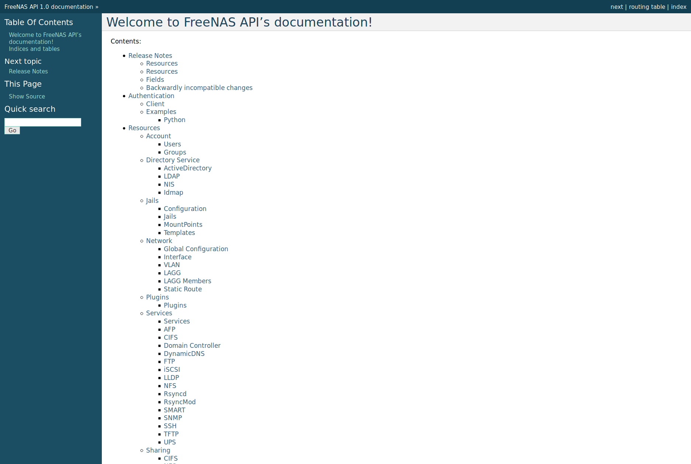

.. index:: API
.. _Using the API:

Using the API
=============

A `REST
<https://en.wikipedia.org/wiki/Representational_state_transfer>`__ API
is provided to be used as an alternate mechanism for remotely
controlling a %brand% system.

REST provides an easy-to-read, HTTP implementation of functions, known
as resources, which are available beneath a specified base URL. Each
resource is manipulated using the HTTP methods defined in :rfc:`2616`,
such as GET, PUT, POST, or DELETE.

As shown in
:numref:`Figure %s <api_fig>`,
an online version of the API is available at
`api.freenas.org <http://api.freenas.org>`__.

.. _api_fig:

   API Documentation

The rest of this section shows code examples to illustrate the use of
the API.

.. note:: A new API was released with %brand% 11.1. The previous API is
   still present and in use because it is feature-complete. Documentation
   for the new API is available on the %brand% system at the */api/docs/*
   URL. For example, if the %brand% system is at IP address 192.168.1.119,
   enter *http://192.168.1.119/api/docs/* in a browser to see the API
   documentation. Work is under way to make the new API feature-complete.
   The new APIv2 uses `WebSockets
   <https://developer.mozilla.org/en-US/docs/Web/API/WebSockets_API>`__.
   This advanced technology makes it possible to open interactive
   communication sessions between web browsers and servers, allowing
   event-driven responses without the need to poll the server for a reply.
   When APIv2 is feature complete, the %brand% documentation will include
   relevant examples that make use of the new API.

.. _A Simple API Example:

A Simple API Example
--------------------

.. highlight:: python
   :linenothreshold: 4

The `api directory of the FreeNAS® github repository
<https://github.com/freenas/freenas/tree/master/examples/api>`__
contains some API usage examples. This section provides a walk-through
of the :file:`newuser.py` script, shown below, as it provides a simple
example that creates a user.

A %brand% system running at least version 9.2.0 is required when
creating a customized script based on this example. To test the
scripts directly on the %brand% system, create a user account and
select an existing volume or dataset for the user's
:guilabel:`Home Directory`. After creating the user, start the SSH
service using
:menuselection:`Services --> Control Services`.
That user will now be able to :command:`ssh` to the IP address of the
%brand% system to create and run scripts. Alternately, scripts can be
tested on any system with the required software installed as shown in
the previous section.

To customize this script, copy the contents of this example into a
filename that ends in :file:`.py`. The text that is highlighted in red
below can be modified in the new version to match the needs of
the user being created. The text in black should not be changed.
After saving changes, run the script by typing
:command:`python scriptname.py`. If all goes well, the new user
account will appear in
:menuselection:`Account --> Users --> View Users`
in the %brand% GUI.

Here is the example script with an explanation of the line numbers
below it.
::

 import json
 import requests
 r = requests.post(
   'https://freenas.mydomain/api/v1.0/account/users/',
   auth=('root', 'freenas'),
   headers={'Content-Type': 'application/json'},
   verify=False,
   data=json.dumps({
        'bsdusr_uid': '1100',
        'bsdusr_username': 'myuser',
        'bsdusr_mode': '755',
        'bsdusr_creategroup': 'True',
        'bsdusr_password': '12345',
        'bsdusr_shell': '/usr/local/bin/bash',
        'bsdusr_full_name': 'Full Name',
        'bsdusr_email': 'name@provider.com',
    })
  )
  print r.text

Where:

**Lines 1-2:** import the Python modules used to make HTTP requests
and handle data in JSON format.

**Line 4:** replace *freenas.mydomain* with the :guilabel:`Hostname`
value in
:menuselection:`System --> System Information`.
Note that the script will fail if the machine running it is not able
to resolve that hostname. Change *https* to *http* to use HTTP rather
than HTTPS to access the %brand% system.

**Line 5:** replace *freenas* with the password used to access the
%brand% system.

**Line 7:** if you are using HTTPS and want to force validation of the
SSL certificate, change *False* to *True*.

**Lines 8-16:** set the values for the user being created. The
`Users
resource <http://api.freenas.org/resources/account.html#users>`__
describes this in more detail. Allowed parameters are listed in the
JSON Parameters section of that resource. Since this resource creates
a FreeBSD user, the values entered must be valid for a FreeBSD user
account.

:numref:`Table %s <api_json_parms_tab>`
summarizes acceptable values. This resource uses JSON, so the boolean
values are *True* or *False*.

.. tabularcolumns:: |>{\RaggedRight}p{\dimexpr 0.20\linewidth-2\tabcolsep}
                    |>{\RaggedRight}p{\dimexpr 0.16\linewidth-2\tabcolsep}
                    |>{\RaggedRight}p{\dimexpr 0.64\linewidth-2\tabcolsep}|

.. _api_json_parms_tab:

.. table:: JSON Parameters for Users Create Resource
   :class: longtable

   +--------------------------+----------+----------------------------------------------------------------------------------------------------------------------+
   | JSON Parameter           | Type     | Description                                                                                                          |
   |                          |          |                                                                                                                      |
   |                          |          |                                                                                                                      |
   +==========================+==========+======================================================================================================================+
   | bsdusr_username          | string   | maximum 32 characters, though a maximum of 8 is recommended for interoperability; can include numerals but cannot    |
   |                          |          | include a space                                                                                                      |
   |                          |          |                                                                                                                      |
   +--------------------------+----------+----------------------------------------------------------------------------------------------------------------------+
   | bsdusr_full_name         | string   | may contain spaces and uppercase characters                                                                          |
   |                          |          |                                                                                                                      |
   +--------------------------+----------+----------------------------------------------------------------------------------------------------------------------+
   | bsdusr_password          | string   | can include a mix of upper and lowercase letters, characters, and numbers                                            |
   |                          |          |                                                                                                                      |
   +--------------------------+----------+----------------------------------------------------------------------------------------------------------------------+
   | bsdusr_uid               | integer  | by convention, user accounts have an ID greater than 1000 with a maximum allowable value of 65,535                   |
   |                          |          |                                                                                                                      |
   +--------------------------+----------+----------------------------------------------------------------------------------------------------------------------+
   | bsdusr_group             | integer  | if :guilabel:`bsdusr_creategroup` is set to *False*, specify the numeric ID of the group to create                   |
   |                          |          |                                                                                                                      |
   +--------------------------+----------+----------------------------------------------------------------------------------------------------------------------+
   | bsdusr_creategroup       | boolean  | if set to *True*, a primary group with the same numeric ID as :guilabel:`bsdusr_uid` will be created automatically   |
   |                          |          |                                                                                                                      |
   +--------------------------+----------+----------------------------------------------------------------------------------------------------------------------+
   | bsdusr_mode              | string   | sets default numeric UNIX permissions of user's home directory                                                       |
   |                          |          |                                                                                                                      |
   +--------------------------+----------+----------------------------------------------------------------------------------------------------------------------+
   | bsdusr_shell             | string   | specify full path to a UNIX shell that is installed on the system                                                    |
   |                          |          |                                                                                                                      |
   +--------------------------+----------+----------------------------------------------------------------------------------------------------------------------+
   | bsdusr_password_disabled | boolean  | if set to *True*, user is not allowed to log in                                                                      |
   |                          |          |                                                                                                                      |
   +--------------------------+----------+----------------------------------------------------------------------------------------------------------------------+
   | bsdusr_locked            | boolean  | if set to *True*, user is not allowed to log in                                                                      |
   |                          |          |                                                                                                                      |
   +--------------------------+----------+----------------------------------------------------------------------------------------------------------------------+
   | bsdusr_sudo              | boolean  | if set to *True*, :command:`sudo` is enabled for the user                                                            |
   |                          |          |                                                                                                                      |
   +--------------------------+----------+----------------------------------------------------------------------------------------------------------------------+
   | bsdusr_sshpubkey         | string   | contents of SSH authorized keys file                                                                                 |
   |                          |          |                                                                                                                      |
   +--------------------------+----------+----------------------------------------------------------------------------------------------------------------------+

.. note:: When using boolean values, JSON returns raw lowercase values
   but Python uses uppercase values. So use *True* or *False* in
   Python scripts even though the example JSON responses in the API
   documentation are displayed as *true* or *false*.

.. _A More Complex Example:

A More Complex Example
----------------------

This section provides a walk-through of a more complex example found
in the :file:`startup.py` script. Use the searchbar within the API
documentation to quickly locate the JSON parameters used here. This
example defines a class and several methods to create a ZFS volume,
create a ZFS dataset, share the dataset over CIFS, and enable the CIFS
service. Responses from some methods are used as parameters in other
methods.  In addition to the import lines seen in the previous
example, two additional Python modules are imported to provide parsing
functions for command line arguments::

 import argparse
 import sys

It then creates a *Startup* class which is started with the hostname,
username, and password provided by the user via the command line::

 class Startup(object):
   def __init__(self, hostname, user, secret):
        self._hostname = hostname
        self._user = user
        self._secret = secret
        self._ep = 'http://%s/api/v1.0' % hostname
   def request(self, resource, method='GET', data=None):
        if data is None:
            data = ''
        r = requests.request(
            method,
            '%s/%s/' % (self._ep, resource),
            data=json.dumps(data),
            headers={'Content-Type': "application/json"},
            auth=(self._user, self._secret),
        )
        if r.ok:
            try:
                return r.json()
            except:
                return r.text
        raise ValueError(r)

A *get_disks* method is defined to get all the disks in the system as
a *disk_name* response. The *create_pool* method uses this information
to create a ZFS pool named *tank* which is created as a stripe. The
*volume_name* and *layout* JSON parameters are described in the
"Storage Volume" resource of the API documentation.::

 def _get_disks(self):
        disks = self.request('storage/disk')
        return [disk['disk_name'] for disk in disks]

 def create_pool(self):
        disks = self._get_disks()
        self.request('storage/volume', method='POST', data={
            'volume_name': 'tank',
            'layout': [
                {'vdevtype': 'stripe', 'disks': disks},
            ],
 })

The *create_dataset* method is defined which creates a dataset named
:file:`MyShare`:
::

 def create_dataset(self):
        self.request('storage/volume/tank/datasets', method='POST', data={
            'name': 'MyShare',
	})

The *create_cifs_share* method is used to share
:file:`/mnt/tank/MyShare` with guest-only access enabled. The
*cifs_name*, *cifs_path*, *cifs_guestonly* JSON parameters, as well as
the other allowable parameters, are described in the "Sharing CIFS"
resource of the API documentation.::

 def create_cifs_share(self):
        self.request('sharing/cifs', method='POST', data={
            'cifs_name': 'My Test Share',
            'cifs_path': '/mnt/tank/MyShare',
            'cifs_guestonly': True
 })

Finally, the *service_start* method enables the CIFS service. The
*srv_enable* JSON parameter is described in the Services resource.
::

 def service_start(self, name):
        self.request('services/services/%s' % name, method='PUT', data={
            'srv_enable': True,

 })
