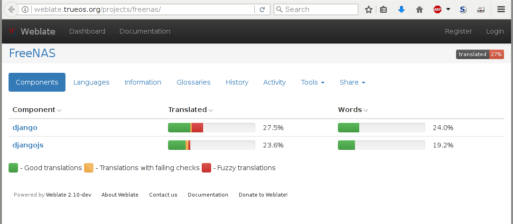
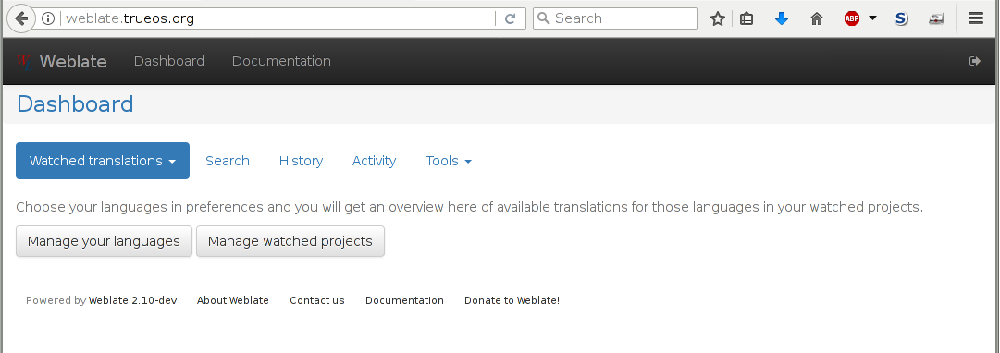
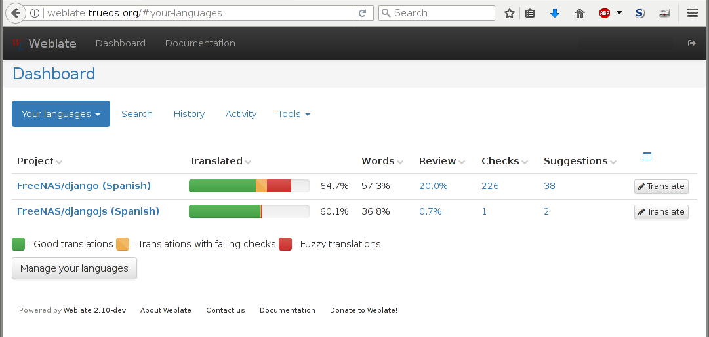
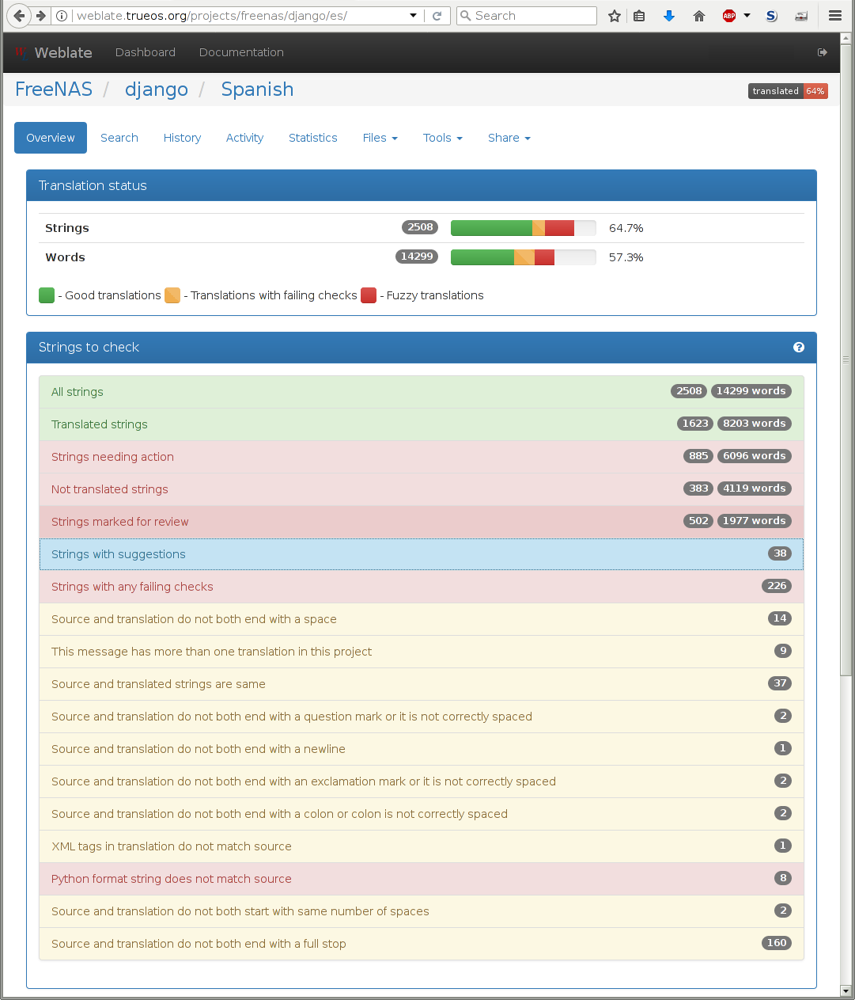
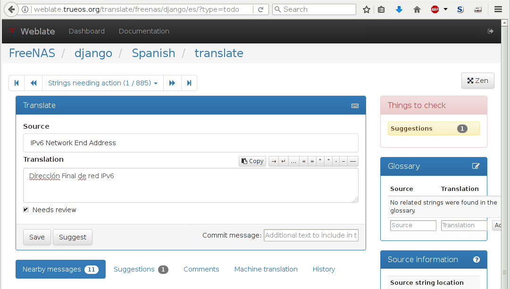

.. _Contributing to %brand%:

Contributing to %brand%
=================================

%brand% is an open source community, relying on the input and
expertise of its users to help grow and improve %brand%. When you
take time to assist the community, your contributions benefit everyone
who uses %brand%.

This section describes some areas of participation to get you started.
It is by no means an exhaustive list. If you have an idea that you
think would benefit the %brand% community, bring it up on one of the
resources mentioned in :ref:`Support Resources`.

This section demonstrates how you can:

* :ref:`Help with Translation <Translation>`

.. index:: Translation, Translate, Localize
.. _Translation:

Translation
-----------

Not everyone speaks English, and having a complete translation of the
user interface into native languages can make %brand% much more useful
to communities around the world.

%brand% uses
`Weblate <https://weblate.org/en/>`__
to manage the translation of text shown in the %brand% graphical
administrative interface. Weblate provides an easy-to-use web-based
editor and commenting system, making it possible for individuals to
assist with translation or comment on existing translations.

To see the status of translations, open
`<https://weblate.trueos.org/projects/freenas/>`__, as shown in
:numref:`Figure %s <contribute_weblate_fig>`.

.. _contribute_weblate_fig:

   %brand% Translation System

To assist with translating %brand%, create an account by clicking the
:guilabel:`Register` button. Enter the information requested, then a
confirmation email will be sent. Follow the link in the email to set a
password and complete the account creation. The Dashboard screen is
shown after logging in:

.. _contribute_weblate_dashboard:

   Weblate Dashboard

Click :guilabel:`Manage your languages` to choose languages for
translation. Select languages, then click :guilabel:`Save`. Click the
:guilabel:`Dashboard` link at the top of the screen to go back to the
dashboard, then choose :guilabel:`Your languages` from the drop-down
menu:

.. _contribute_weblate_languages:

   Selected Languages

*Projects* are a collection of text to be translated. In this example,
the Django and DjangoJS projects have both been partially translated
into Spanish. Click one of the entries under :guilabel:`Project` to
help translate that project.

The :guilabel:`Overview` screen shows the current translation status
along with categories of translatable strings:

.. _contribute_weblate_overview:

   Translation Overview

Click on a category of string, like
:guilabel:`Strings needing action`, to see the translation screen:

.. _contribute_weblate_translation:

   Translate Strings

Enter translations here, clicking :guilabel:`Save` to save the work.
The controls at the top of the screen can be used to skip forward and
back in the list of strings to be translated. Click
:guilabel:`Dashboard` at the top of the screen to return to the
Dashboard.

All assistance with translations helps to benefit the %brand%
community. Thank you!
