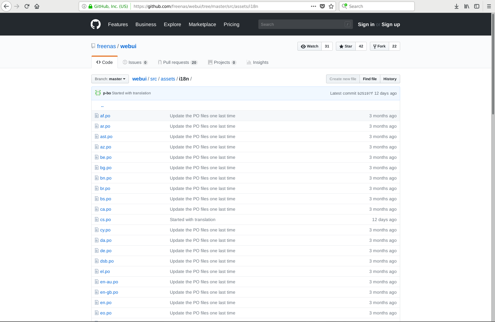

.. _Contributing to FreeNAS:

Contributing to FreeNAS :sup:`®`
================================

FreeNAS :sup:`®` is an open source community, relying on the input and
expertise of users to grow and improve. When users take time to assist
the community, their contributions benefit everyone.

This section describes how to participate and contribute to
FreeNAS :sup:`®`. It is by no means an exhaustive list. If you have an
idea that will benefit the community, bring it up on one of the
resources mentioned in :ref:`Support Resources`.

This section demonstrates how to:

* :ref:`Help with Translation <Translation>`

.. index:: Translation, Translate, Localize
.. _Translation:

Translation
-----------

FreeNAS :sup:`®` is developed and documented in English. Having
complete translations of the user interface into other languages helps
make FreeNAS :sup:`®` much more useful to communities around the
world.

FreeNAS :sup:`®` uses :file:`.po` files stored in the
`webui GitHub repository
<https://github.com/freenas/webui/tree/master/src/assets/i18n>`__
to manage the translation of text shown in the FreeNAS :sup:`®`
graphical administrative interface. GitHub provides an easy to use
web-based editor, making it possible for individuals to assist with
translation or comment on existing translations.

To view translation files, open the :file:`/src/assets/i18n` directory
of the FreeNAS :sup:`®`
`webui repository
<https://github.com/freenas/webui/tree/master/src/assets/i18n>`__,
as shown in :numref:`Figure %s <contribute_po_fig>`.

.. _contribute_po_fig:

   FreeNAS :sup:`®` Translation Files

To assist with translating FreeNAS :sup:`®`, first create an account
with
`GitHub <https://github.com/>`__.

There are two methods to contribute translations to the project:

1. Edit :file:`po` files and submit pull requests through the GitHub
   website.

OR

2. Copy the
   `freenas/webui <https://github.com/freenas/webui>`__
   repository, make changes using a :file:`po` editor, and submit
   these changes back "upstream" to the *freenas/webui* repository.

Translate with GitHub
~~~~~~~~~~~~~~~~~~~~~

Go to the
`freenas/webui <https://github.com/freenas/webui>`__
repository. Select
:menuselection:`src --> assets`
and click the
`i18n
<https://github.com/freenas/webui/tree/master/src/assets/i18n>`__
directory. Click on the desired language :file:`po` file to begin
translating.

.. tip:: Here is a list of `common language abbreviations
   <https://www.abbreviations.com/acronyms/LANGUAGES2L>`__

Click the :guilabel:`Pencil` icon in the upper right area to open the
online file editor. :numref:`Figure %s <contribute_github_editor_fig>`
shows the page that appears:

.. _contribute_github_editor_fig:

   GitHub Online Editor

There are numerous :literal:`msgid ""` and :literal:`msgstr ""`
entries in the file. Read  the :literal:`msgid` text and enter the
translation between the :literal:`msgstr` quotes.

Scroll to the bottom of the page when finished entering translations.
Enter a descriptive title and summary of changes for the edits and set
:guilabel:`Create a new branch`. Click :guilabel:`Propose file change`
to submit the translations to the FreeNAS :sup:`®` project.

Download and Translate Offline
~~~~~~~~~~~~~~~~~~~~~~~~~~~~~~

`Install Git
<https://git-scm.com/book/en/v2/Getting-Started-Installing-Git>`__.
There are numerous examples in these instructions of using
:command:`git`, but full documentation for :command:`git` is
`available online <https://git-scm.com/doc>`__.

Open a Command Line Interface (CLI). Navigate to or create a suitable
location to store the local copy of the :literal:`webui` repository.
Download the repository with :command:`git clone`:

:samp:`% git clone https://github.com/freenas/webui.git`

The download can take several minutes, depending on connection speed.

:command:`cd` into the :file:`webui` directory and create a new branch
of the repository to store the translation changes:

:samp:`% git checkout -b new_translations`

.. tip:: Type :command:`git status` at any time to see which branch of
   the repository is active.

Navigate to the :file:`i18n` directory:

:samp:`% cd src/assets/i18n/`

Use a :file:`po` editor to add translations to the desired language
file. Any capable editor will work, but
`poedit <https://poedit.net/>`__
and
`gtranslator <https://wiki.gnome.org/Apps/Gtranslator>`__
are two common options.

Commit any file changes with :command:`git commit`:

:samp:`% git commit ar.po`

Enter a descriptive message about the changes and save the commit.

When finished making commits to the branch, :command:`git push` the
branch to the online :literal:`freenas/webui` repository:

.. code-block:: none

   % git push origin new_translations
   Username for `https://github.com`:
   Password for `https://account@github.com`:
   Counting objects: 6, done.
   Delta compression using up to 4 threads.
   Compressing objects: 100% (6/6), done.
   Writing objects: 100% (6/6), 8.56 KiB | 4.28 MiB/s, done.
   Total 6 (delta 5), reused 0 (delta 0)
   remote: Resolving deltas: 100% (5/5), completed with 5 local objects.
   To https://github.com/freenas/webui.git
   * [new branch]        new_translations -> new_translations

Open a web browser and navigate to the
`freenas/webui <https://github.com/freenas/webui>`__
repository. GitHub automatically detects when a new branch is pushed
to the repository and displays a message with an option to
:guilabel:`Compare & pull request`. Click this, review the changes,
and click :guilabel:`Create pull request`.

Translation Pull Requests
~~~~~~~~~~~~~~~~~~~~~~~~~

The FreeNAS :sup:`®` project automatically tests pull requests for
compatibility. If there any issues with a pull request, either the
automated system will update the request or a FreeNAS :sup:`®` team
member will leave a message in the comment section of the request.

All assistance with translations helps to benefit the FreeNAS :sup:`®`
community. Thank you!
