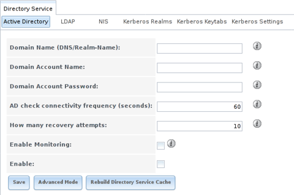
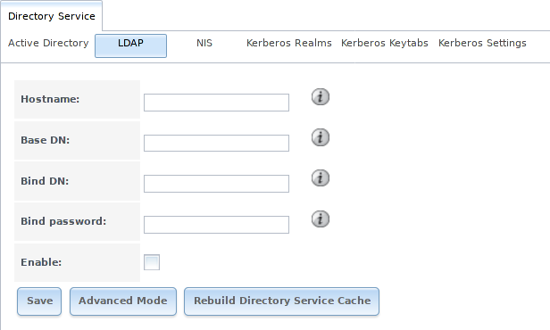
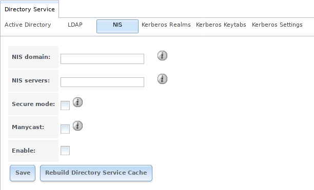
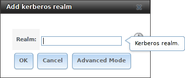
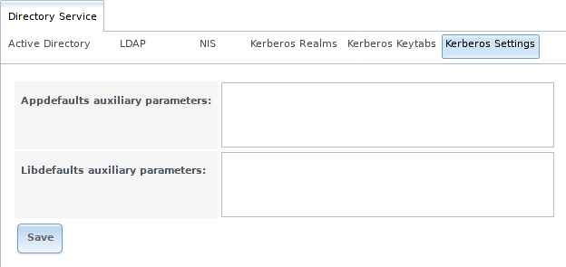

.. _Directory Services:

Directory Services
==================

%brand% supports integration with these directory services:

* :ref:`Active Directory` (for Windows 2000 and higher networks)

* :ref:`LDAP`

* :ref:`NIS`

It also supports :ref:`Kerberos Realms`, :ref:`Kerberos Keytabs`, and
the ability to add more parameters to :ref:`Kerberos Settings`.

This section summarizes each of these services and their available
configurations within the %brand% GUI.

.. _Active Directory:

Active Directory
----------------

Active Directory (AD) is a service for sharing resources in a Windows
network. AD can be configured on a Windows server that is running
Windows Server 2000 or higher or on a Unix-like operating system that
is running `Samba version 4
<https://wiki.samba.org/index.php/Setting_up_Samba_as_an_Active_Directory_Domain_Controller#Provisioning_a_Samba_Active_Directory>`__.
Since AD provides authentication and authorization services for the
users in a network, it is not necessary to recreate these user
accounts on the %brand% system. Instead, configure the Active
Directory service so that it can import the account information and
imported users can be authorized to access the SMB shares on the
%brand% system.

Many changes and improvements have been made to Active Directory
support within %brand%.  It is strongly recommended to update the
system to the latest %brand% |release| before attempting Active
Directory integration.

Ensure name resolution is properly configured before configuring the
Active Directory service. :command:`ping` the domain name of the
Active Directory domain controller from :ref:`Shell` on the %brand%
system. If the :command:`ping` fails, check the DNS server and default
gateway settings in
:menuselection:`Network --> Global Configuration`
on the %brand% system.

Add a DNS record for the %brand% system on the Windows server and
verify the hostname of the %brand% system can be pinged from the domain
controller.

Active Directory relies on Kerberos, which is a time-sensitive protocol.
The time on both the %brand% system and the Active Directory
Domain Controller cannot be out of sync by more than a few minutes. The
best way to ensure the same time is running on both systems is to
configure both systems to:

* use the same NTP server (set in
  :menuselection:`System --> NTP Servers`
  on the %brand% system)

* have the same timezone

* be set to either localtime or universal time at the BIOS level

:numref:`Figure %s <ad_fig>`
shows the screen that appears when
:menuselection:`Directory Service --> Active Directory`
is chosen.
:numref:`Table %s <ad_tab>`
describes the configurable options. Some settings are only available
in Advanced Mode. To see these settings, either click
:guilabel:`Advanced Mode` or configure the system to always display
these settings by checking
:guilabel:`Show advanced fields by default` in
:menuselection:`System --> Advanced`.

.. _ad_fig:

   Configuring Active Directory

.. tabularcolumns:: |>{\RaggedRight}p{\dimexpr 0.20\linewidth-2\tabcolsep}
                    |>{\RaggedRight}p{\dimexpr 0.14\linewidth-2\tabcolsep}
                    |>{\Centering}p{\dimexpr 0.12\linewidth-2\tabcolsep}
                    |>{\RaggedRight}p{\dimexpr 0.54\linewidth-2\tabcolsep}|

.. _ad_tab:

.. table:: Active Directory Configuration Options
   :class: longtable

   +--------------------------+---------------+-------------+---------------------------------------------------------------------------------------------------------------------+
   | Setting                  | Value         | Advanced    | Description                                                                                                         |
   |                          |               | Mode        |                                                                                                                     |
   |                          |               |             |                                                                                                                     |
   +==========================+===============+=============+=====================================================================================================================+
   | Domain Name              | string        |             | Name of Active Directory domain (*example.com*) or child domain (*sales.example.com*). This setting is mandatory    |
   | (DNS/Realm-Name)         |               |             | and the GUI will refuse to save the settings if the domain controller for the specified domain cannot be found.     |
   |                          |               |             |                                                                                                                     |
   +--------------------------+---------------+-------------+---------------------------------------------------------------------------------------------------------------------+
   | Domain Account Name      | string        |             | Name of the Active Directory administrator account. This setting is mandatory and the GUI will refuse to save       |
   |                          |               |             | the settings if it cannot connect to the domain controller using this account name.                                 |
   |                          |               |             |                                                                                                                     |
   +--------------------------+---------------+-------------+---------------------------------------------------------------------------------------------------------------------+
   | Domain Account           | string        |             | Password for the Active Directory administrator account. This setting is mandatory and the GUI will refuse          |
   | Password                 |               |             | to save the settings if it cannot connect to the domain controller using this password.                             |
   |                          |               |             |                                                                                                                     |
   +--------------------------+---------------+-------------+---------------------------------------------------------------------------------------------------------------------+
   | AD check connectivity    | integer       |             | How often to verify that Active Directory services are active.                                                      |
   | frequency (seconds)      |               |             |                                                                                                                     |
   +--------------------------+---------------+-------------+---------------------------------------------------------------------------------------------------------------------+
   | How many recovery        | integer       |             | Number of times to attempt reconnecting to the Active Directory server. Tries forever when set to *0*.              |
   | attempts                 |               |             |                                                                                                                     |
   +--------------------------+---------------+-------------+---------------------------------------------------------------------------------------------------------------------+
   | Enable Monitoring        | checkbox      |             | Restart Active Directory automatically if the service is disconnected.                                              |
   |                          |               |             |                                                                                                                     |
   +--------------------------+---------------+-------------+---------------------------------------------------------------------------------------------------------------------+
   | Encryption Mode          | drop-down     | ✓           | Choices are *Off*, *SSL*, or *TLS*.                                                                                 |
   |                          | menu          |             |                                                                                                                     |
   |                          |               |             |                                                                                                                     |
   +--------------------------+---------------+-------------+---------------------------------------------------------------------------------------------------------------------+
   | Certificate              | drop-down menu| ✓           | Select the certificate of the Active Directory server if  SSL connections are used. If a certificate does           |
   |                          |               |             | not exist yet, create a :ref:`CA <CAs>`, then create a certificate on the Active Directory server and import        |
   |                          |               |             | it to the %brand% system with :ref:`Certificates`.                                                                  |
   |                          |               |             |                                                                                                                     |
   +--------------------------+---------------+-------------+---------------------------------------------------------------------------------------------------------------------+
   | Verbose logging          | checkbox      | ✓           | Set to log attempts to join the domain to :file:`/var/log/messages`.                                                |
   |                          |               |             |                                                                                                                     |
   +--------------------------+---------------+-------------+---------------------------------------------------------------------------------------------------------------------+
   | UNIX extensions          | checkbox      | ✓           | **Only** set if the AD server is explicitly configured to map permissions for UNIX users. Enabling provides         |
   |                          |               |             | persistent UIDs and GUIDs, otherwise, users/groups are mapped to the UID/GUID range configured in Samba.            |
   |                          |               |             |                                                                                                                     |
   +--------------------------+---------------+-------------+---------------------------------------------------------------------------------------------------------------------+
   | Allow Trusted Domains    | checkbox      | ✓           | Only enable if the network has active `domain/forest trusts                                                         |
   |                          |               |             | <https://docs.microsoft.com/en-us/previous-versions/windows/it-pro/windows-server-2003/cc757352(v=ws.10)>`__        |
   |                          |               |             | and files need to be managed on multiple domains. Use with caution as it will generate more winbindd traffic,       |
   |                          |               |             | slowing down the ability to filter through user and group information.                                              |
   |                          |               |             |                                                                                                                     |
   +--------------------------+---------------+-------------+---------------------------------------------------------------------------------------------------------------------+
   | Use Default Domain       | checkbox      | ✓           | Unset to prepend the domain name to the username. If :guilabel:`Allow Trusted Domains` is set and multiple          |
   |                          |               |             | domains use the same usernames, unset to prevent name collisions.                                                   |
   |                          |               |             |                                                                                                                     |
   +--------------------------+---------------+-------------+---------------------------------------------------------------------------------------------------------------------+
   | Allow DNS updates        | checkbox      | ✓           | Unset to disable Samba from doing DNS updates when joining a domain.                                                |
   |                          |               |             |                                                                                                                     |
   +--------------------------+---------------+-------------+---------------------------------------------------------------------------------------------------------------------+
   | Disable Active           | checkbox      | ✓           | Set to disable caching of AD users and groups. This is useful if the system cannot bind to a domain with a          |
   | Directory user/group     |               |             | large number of users or groups.                                                                                    |
   | cache                    |               |             |                                                                                                                     |
   +--------------------------+---------------+-------------+---------------------------------------------------------------------------------------------------------------------+
   | Site Name                | string        | ✓           | The relative distinguished name of the site object in Active Directory.                                             |
   |                          |               |             |                                                                                                                     |
   +--------------------------+---------------+-------------+---------------------------------------------------------------------------------------------------------------------+
   | Domain Controller        | string        | ✓           | Automatically be added to the SRV record for the domain and, when multiple controllers are specified,               |
   |                          |               |             | %brand% selects the closest DC which responds. Uses the short form of the FQDN.                                     |
   |                          |               |             | An example is *sampleserver*.                                                                                       |
   |                          |               |             |                                                                                                                     |
   +--------------------------+---------------+-------------+---------------------------------------------------------------------------------------------------------------------+
   | Global Catalog Server    | string        | ✓           | If the hostname of the global catalog server to use is specified, make sure it is resolvable.                       |
   |                          |               |             |                                                                                                                     |
   +--------------------------+---------------+-------------+---------------------------------------------------------------------------------------------------------------------+
   | Kerberos Realm           | drop-down     | ✓           | Select the realm created using the instructions in :ref:`Kerberos Realms`.                                          |
   |                          | menu          |             |                                                                                                                     |
   +--------------------------+---------------+-------------+---------------------------------------------------------------------------------------------------------------------+
   | Kerberos Principal       | drop-down     | ✓           | Browse to the location of the keytab created using the instructions in :ref:`Kerberos Keytabs`.                     |
   |                          | menu          |             |                                                                                                                     |
   +--------------------------+---------------+-------------+---------------------------------------------------------------------------------------------------------------------+
   | AD timeout               | integer       | ✓           | In seconds, increase if the AD service does not start after connecting to the domain.                               |
   |                          |               |             |                                                                                                                     |
   +--------------------------+---------------+-------------+---------------------------------------------------------------------------------------------------------------------+
   | DNS timeout              | integer       | ✓           | In seconds, increase if AD DNS queries timeout.                                                                     |
   |                          |               |             |                                                                                                                     |
   +--------------------------+---------------+-------------+---------------------------------------------------------------------------------------------------------------------+
   | Idmap backend            | drop-down     | ✓           | Select the backend to use to map Windows security identifiers (SIDs) to UNIX UIDs and GIDs. See                     |
   |                          | menu and Edit |             | :numref:`Table %s <id_map_backends_tab>` for a summary of the available backends. Click the :guilabel:`Edit`        |
   |                          |               |             | link to configure the backend.                                                                                      |
   |                          |               |             |                                                                                                                     |
   +--------------------------+---------------+-------------+---------------------------------------------------------------------------------------------------------------------+
   | Windbind NSS Info        | drop-down     | ✓           | Defines the schema to use when querying AD for user/group info. *rfc2307* uses the RFC2307 schema included          |
   |                          | menu          |             | in Windows 2003 R2, *sfu20* is for Services For Unix 3.0 or 3.5, and *sfu* is for Services For Unix 2.0.            |
   |                          |               |             |                                                                                                                     |
   +--------------------------+---------------+-------------+---------------------------------------------------------------------------------------------------------------------+
   | SASL wrapping            | drop-down     | ✓           | Defines how LDAP traffic is transmitted. Choices are *plain* (plain text), *sign* (signed only), or                 |
   |                          | menu          |             | *seal* (signed and encrypted). Windows 2000 SP3 and newer can be configured to enforce signed LDAP connections.     |
   |                          |               |             |                                                                                                                     |
   +--------------------------+---------------+-------------+---------------------------------------------------------------------------------------------------------------------+
   | Enable                   | checkbox      |             | Enable the Active Directory service.                                                                                |
   |                          |               |             |                                                                                                                     |
   #ifdef freenas
   +--------------------------+---------------+-------------+---------------------------------------------------------------------------------------------------------------------+
   | NetBIOS name             | string        | ✓           | Limited to 15 characters. Automatically populated with the original hostname of the system. This **must**           |
   |                          |               |             | be different from the *Workgroup* name.                                                                             |
   |                          |               |             |                                                                                                                     |
   +--------------------------+---------------+-------------+---------------------------------------------------------------------------------------------------------------------+
   | NetBIOS alias            | string        | ✓           | Limited to 15 characters.                                                                                           |
   |                          |               |             |                                                                                                                     |
   #endif freenas
   #ifdef truenas
   +--------------------------+---------------+-------------+---------------------------------------------------------------------------------------------------------------------+
   | NetBIOS Name             | string        | ✓           | Limited to 15 characters. Automatically populated with the original hostname of the system. This **must**           |
   | (This Node)              |               |             | be different from the *Workgroup* name                                                                              |
   |                          |               |             |                                                                                                                     |
   +--------------------------+---------------+-------------+---------------------------------------------------------------------------------------------------------------------+
   | NetBIOS Name (Node B)    | string        | ✓           | Limited to 15 characters. When using :ref:`Failover`, set a unique NetBIOS name for the standby node.               |
   |                          |               |             |                                                                                                                     |
   +--------------------------+---------------+-------------+---------------------------------------------------------------------------------------------------------------------+
   | NetBIOS Alias            | string        | ✓           | Limited to 15 characters. When using :ref:`Failover`, this is the NetBIOS name that resolves to either node.        |
   |                          |               |             |                                                                                                                     |
   #endif truenas
   +--------------------------+---------------+-------------+---------------------------------------------------------------------------------------------------------------------+

:numref:`Table %s <id_map_backends_tab>`
summarizes the backends which are available in the
:guilabel:`Idmap backend` drop-down menu. Each backend has its own
`man page <http://samba.org.ru/samba/docs/man/manpages/>`__
which gives implementation details. Since selecting the wrong backend
will break Active Directory integration, a pop-up menu will appear
whenever changes are made to this setting.

.. tabularcolumns:: |>{\RaggedRight}p{\dimexpr 0.16\linewidth-2\tabcolsep}
                    |>{\RaggedRight}p{\dimexpr 0.66\linewidth-2\tabcolsep}|

.. _id_map_backends_tab:

.. table:: ID Mapping Backends
   :class: longtable

   +------------+---------------------------------------------------------------------------------------------------------------------------------------+
   | Value      | Description                                                                                                                           |
   |            |                                                                                                                                       |
   +============+=======================================================================================================================================+
   | ad         | AD server uses RFC2307 or Services For Unix schema extensions. Mappings must be provided in advance by adding                         |
   |            | the uidNumber attributes for users and gidNumber attributes for groups in the AD.                                                     |
   |            |                                                                                                                                       |
   +------------+---------------------------------------------------------------------------------------------------------------------------------------+
   | autorid    | Similar to :guilabel:`rid`, but automatically configures the range to be used for each domain, so there is                            |
   |            | no need to specify a specific range for each domain in the forest. The only needed configuration is the                               |
   |            | range of UID/GIDs to use for user/group mappings and an optional size for the ranges.                                                 |
   |            |                                                                                                                                       |
   +------------+---------------------------------------------------------------------------------------------------------------------------------------+
   | fruit      | Generate IDs the way Apple Mac OS X does, so UID and GID can be identical on all %brand% servers on the network.                      |
   |            | For use in :ref:`LDAP` environments where Apple's Open Directory is the authoritative LDAP server.                                    |
   |            |                                                                                                                                       |
   +------------+---------------------------------------------------------------------------------------------------------------------------------------+
   | ldap       | Stores and retrieves mapping tables in an LDAP directory service. Default for LDAP directory service.                                 |
   |            |                                                                                                                                       |
   +------------+---------------------------------------------------------------------------------------------------------------------------------------+
   | nss        | Provides a simple means of ensuring that the SID for a Unix user is reported as the one assigned to the corresponding domain user.    |
   |            |                                                                                                                                       |
   +------------+---------------------------------------------------------------------------------------------------------------------------------------+
   | rfc2307    | An AD server is required to provide the mapping between the name and SID and an LDAP server is required to provide                    |
   |            | the mapping between the name and the UID/GID.                                                                                         |
   |            |                                                                                                                                       |
   +------------+---------------------------------------------------------------------------------------------------------------------------------------+
   | rid        | Default for AD. Requires an explicit idmap configuration for each domain, using disjoint ranges where a                               |
   |            | writeable default idmap range is to be defined, using a backend like tdb or ldap.                                                     |
   |            |                                                                                                                                       |
   +------------+---------------------------------------------------------------------------------------------------------------------------------------+
   | script     | Stores mapping tables for clustered environments in the winbind_cache tdb.                                                            |
   |            |                                                                                                                                       |
   +------------+---------------------------------------------------------------------------------------------------------------------------------------+
   | tdb        | Default backend used by winbindd for storing mapping tables.                                                                          |
   |            |                                                                                                                                       |
   +------------+---------------------------------------------------------------------------------------------------------------------------------------+
   | tdb2       | Substitute for tdb used by winbindd in clustered environments.                                                                        |
   |            |                                                                                                                                       |
   +------------+---------------------------------------------------------------------------------------------------------------------------------------+

Click :guilabel:`Rebuild Directory Service Cache` if a new Active
Directory user needs immediate access to %brand%. This occurs
automatically once a day as a cron job.

.. note:: Active Directory places restrictions on which characters are
   allowed in Domain and NetBIOS names, a limits the length of those
   names to 15 characters. If there are problems connecting to the
   realm,
   `verify
   <https://support.microsoft.com/en-us/help/909264/naming-conventions-in-active-directory-for-computers-domains-sites-and>`__
   the settings do not include any disallowed characters. The
   Administrator account password cannot contain the *$* character. If a
   *$* exists in the domain administrator's password, :command:`kinit`
   will report a "Password Incorrect" error and :command:`ldap_bind`
   will report an "Invalid credentials (49)" error.

It can take a few minutes after configuring the Active Directory
service for the AD information to be populated to the %brand% system.
Once populated, the AD users and groups will be available in the
drop-down menus of the :guilabel:`Permissions` screen of a
volume/dataset. For performance reasons, every available user may not
show in the listing. However, it will autocomplete all applicable
users when typing in a username.

The Active Directory users and groups that are imported to the %brand%
system are shown by typing commands in the %brand% :ref:`Shell`:

* View users: :command:`wbinfo -u`

* View groups: :command:`wbinfo -g`

In addition, :command:`wbinfo -t` tests the connection and, if
successful, shows a message similar to:

.. code-block:: none

   checking the trust secret for domain YOURDOMAIN via RPC calls succeeded

To manually check that a specified user can authenticate, use
:samp:`net ads join -S dcname -U username`.

:command:`getent passwd` and :command:`getent group` can provide more
troubleshooting information if no users or groups are listed in the
output.

.. tip:: Sometimes network users do not appear in the drop-down menu of
   a :guilabel:`Permissions` screen but the :command:`wbinfo`
   commands display these users. This is typically due to the %brand%
   system taking longer than the default ten seconds to join Active
   Directory. Increase the value of :guilabel:`AD timeout` to 60 seconds.

To change a certificate, set the :guilabel:`Encryption Mode` to *Off*,
then disable AD by unchecking :guilabel:`Enable`. Click :guilabel:`Save`.
Select the new :guilabel:`Certificate`, set the
:guilabel:`Encryption Mode` as desired, check :guilabel:`Enable` to
re-enable AD, and click :guilabel:`Save` to restart AD.

.. _Troubleshooting Tips:

Troubleshooting Tips
~~~~~~~~~~~~~~~~~~~~

When running AD in a 2003/2008 mixed domain, `see this posting
<https://forums.freenas.org/index.php?threads/2008r2-2003-mixed-domain.1931/>`__
for instructions to prevent the secure channel key from becoming corrupt.

Active Directory uses DNS to determine the location of the domain
controllers and global catalog servers in the network. Use
:samp:`host -t srv _ldap._tcp.{domainname.com}` to determine the SRV
records of the network and change the weight and/or priority of the SRV
record to reflect the fastest server. More information about SRV records
can be found in the Technet article
`How DNS Support for Active Directory Works
<https://docs.microsoft.com/en-us/previous-versions/windows/it-pro/windows-server-2003/cc759550(v=ws.10)>`__.

The realm used depends upon the priority in the SRV DNS record. DNS can
override the system Active Directory settings. When unable to connect to
the correct realm, check the SRV records on the DNS server.

If the cache becomes out of sync due to an AD server being taken off
and back online, resync the cache using
:menuselection:`Directory Service --> Active Directory
--> Rebuild Directory Service Cache`.

An expired password for the administrator account will cause
:command:`kinit` to fail. Ensure the password is still valid. Also,
double-check the password on the AD account being used does not include
any spaces, special symbols, and is not unusually long.

If the Windows server version is lower than 2008 R2, try creating a
:guilabel:`Computer` entry on the Windows server's OU. When creating
this entry, enter the %brand% hostname in the :guilabel:`name` field.
Make sure it is under 15 characters, the same name as the one set in
the :guilabel:`Hostname` field in
:menuselection:`Network --> Global Configuration`, and the same
:guilabel:`NetBIOS Name` in
:menuselection:`Directory Service --> Active Directory`
settings. Make sure the hostname of the domain controller is set in
the :guilabel:`Domain Controller` field of
:menuselection:`Directory Service --> Active Directory`.

.. _If the System Does not Join the Domain:

If the System Does not Join the Domain
~~~~~~~~~~~~~~~~~~~~~~~~~~~~~~~~~~~~~~

If the system will not join the Active Directory domain, run these
commands in the order listed. :command:`echo` commands will return a
value of *0* and :command:`klist` will show a Kerberos ticket:

.. code-block:: none

   sqlite3 /data/freenas-v1.db "update directoryservice_activedirectory set ad_enable=1;"
   echo $?
   service ix-kerberos start
   service ix-nsswitch start
   service ix-kinit start
   service ix-kinit status
   echo $?
   klist

If the cache becomes out of sync due to an AD server being taken off
and back online, resync the cache using
:menuselection:`Directory Service --> Active Directory
--> Rebuild Directory Service Cache`.

.. note:: If any of the commands fail or result in a traceback,
   create a bug report at
   https://redmine.ixsystems.com/projects/freenas/issues
   that includes the commands in the order in which they were run and
   the exact wording of the error message or traceback.

Next, only run these two commands **if** :guilabel:`Unix extensions`
is set in :guilabel:`Advanced Mode` and a keytab has been uploaded using
:ref:`Kerberos Keytabs`:

.. code-block:: none

 service ix-sssd start
 service sssd start

Finally, run these commands. :command:`echo` returns a *0* unless
something has gone wrong:

.. code-block:: none

   python /usr/local/www/freenasUI/middleware/notifier.py start cifs
   service ix-activedirectory start
   service ix-activedirectory status
   echo $?
   python /usr/local/www/freenasUI/middleware/notifier.py restart cifs
   service ix-pam start
   service ix-cache start &

.. _LDAP:

LDAP
----

%brand% includes an
`OpenLDAP <http://www.openldap.org/>`__
client for accessing information from an LDAP server. An LDAP server
provides directory services for finding network resources such as
users and their associated permissions. Examples of LDAP servers
include Microsoft Server (2000 and newer), Mac OS X Server, Novell
eDirectory, and OpenLDAP running on a BSD or Linux system. If an LDAP
server is running on the network, configure the %brand% LDAP service
so network users can authenticate to the LDAP server and have
authorized access to the data stored on the %brand% system.

.. note:: LDAP authentication for SMB shares is disabled unless
   the LDAP directory has been configured for and populated with Samba
   attributes. The most popular script for performing this task is
   `smbldap-tools <https://wiki.samba.org/index.php/4.1_smbldap-tools>`__.
   In addition, the LDAP server must support SSL/TLS and the
   certificate for the LDAP server CA must be imported with
   :menuselection:`System --> Certificates --> Import Certificate`. Note
   that non-CA certificates are not supported at this time.

.. tip:: Apple's
   `Open Directory
   <https://manuals.info.apple.com/MANUALS/0/MA954/en_US/Open_Directory_Admin_v10.5_3rd_Ed.pdf>`__
   is an LDAP-compatible directory service into which %brand% can be
   integrated. See
   `FreeNAS with Open Directory in Mac OS X environments
   <https://forums.freenas.org/index.php?threads/howto-freenas-with-open-directory-in-mac-os-x-environments.46493/>`__.

:numref:`Figure %s <ldap_config_fig>`
shows the LDAP Configuration screen that is seen after clicking
:menuselection:`Directory Service --> LDAP`.

.. _ldap_config_fig:

   Configuring LDAP

:numref:`Table %s <ldap_config_tab>`
summarizes the available configuration options. Some settings are only
available in Advanced Mode. To see these settings, either click the
:guilabel:`Advanced Mode` button or configure the system to always
display these settings by checking the box
:guilabel:`Show advanced fields by default` in
:menuselection:`System --> Advanced`.

Those new to LDAP terminology should read the
`OpenLDAP Software 2.4 Administrator's Guide
<http://www.openldap.org/doc/admin24/>`__.

.. tabularcolumns:: |>{\RaggedRight}p{\dimexpr 0.20\linewidth-2\tabcolsep}
                    |>{\RaggedRight}p{\dimexpr 0.14\linewidth-2\tabcolsep}
                    |>{\Centering}p{\dimexpr 0.12\linewidth-2\tabcolsep}
                    |>{\RaggedRight}p{\dimexpr 0.54\linewidth-2\tabcolsep}|

.. _ldap_config_tab:

.. table:: LDAP Configuration Options
   :class: longtable

   +-------------------------+--------------+-------------+------------------------------------------------------------------------------------------------+
   | Setting                 | Value        | Advanced    | Description                                                                                    |
   |                         |              | Mode        |                                                                                                |
   |                         |              |             |                                                                                                |
   +=========================+==============+=============+================================================================================================+
   | Hostname                | string       |             | Hostname or IP address of the LDAP server.                                                     |
   |                         |              |             |                                                                                                |
   +-------------------------+--------------+-------------+------------------------------------------------------------------------------------------------+
   | Base DN                 | string       |             | Top level of the LDAP directory tree to be used when searching for resources.                  |
   |                         |              |             | Example: *dc=test,dc=org*.                                                                     |
   |                         |              |             |                                                                                                |
   +-------------------------+--------------+-------------+------------------------------------------------------------------------------------------------+
   | Bind DN                 | string       |             | Name of administrative account on the LDAP server. Example: *cn=Manager,dc=test,dc=org*.       |
   |                         |              |             |                                                                                                |
   +-------------------------+--------------+-------------+------------------------------------------------------------------------------------------------+
   | Bind password           | string       |             | Password for :guilabel:`Root bind DN`.                                                         |
   |                         |              |             |                                                                                                |
   +-------------------------+--------------+-------------+------------------------------------------------------------------------------------------------+
   | Allow Anonymous         | checkbox     | ✓           | Instructs the LDAP server to not provide authentication and to allow read                      |
   | Binding                 |              |             | and write access to any client.                                                                |
   |                         |              |             |                                                                                                |
   +-------------------------+--------------+-------------+------------------------------------------------------------------------------------------------+
   | User Suffix             | string       | ✓           | Optional. Can be added to the name when the user account is added to the LDAP directory.       |
   |                         |              |             | Example: dept. or company name.                                                                |
   |                         |              |             |                                                                                                |
   +-------------------------+--------------+-------------+------------------------------------------------------------------------------------------------+
   | Group Suffix            | string       | ✓           | Optional. Can be added to the name when the group is added to the LDAP directory.              |
   |                         |              |             | Example: dept. or company name.                                                                |
   |                         |              |             |                                                                                                |
   +-------------------------+--------------+-------------+------------------------------------------------------------------------------------------------+
   | Password Suffix         | string       | ✓           | Optional. Can be added to the password when the password is added to LDAP directory.           |
   |                         |              |             |                                                                                                |
   +-------------------------+--------------+-------------+------------------------------------------------------------------------------------------------+
   | Machine Suffix          | string       | ✓           | Optional. Can be added to the name when the system added to the LDAP directory.                |
   |                         |              |             | Example: server, accounting.                                                                   |
   |                         |              |             |                                                                                                |
   +-------------------------+--------------+-------------+------------------------------------------------------------------------------------------------+
   | SUDO Suffix             | string       | ✓           | Use if LDAP-based users need superuser access.                                                 |
   |                         |              |             |                                                                                                |
   +-------------------------+--------------+-------------+------------------------------------------------------------------------------------------------+
   | Kerberos Realm          | drop-down    | ✓           | Select the realm created using the instructions in :ref:`Kerberos Realms`.                     |
   |                         | menu         |             |                                                                                                |
   |                         |              |             |                                                                                                |
   +-------------------------+--------------+-------------+------------------------------------------------------------------------------------------------+
   | Kerberos Principal      | drop-down    | ✓           | Browse to the location of the principal in the keytab created as described in                  |
   |                         | menu         |             | :ref:`Kerberos Keytabs`.                                                                       |
   |                         |              |             |                                                                                                |
   +-------------------------+--------------+-------------+------------------------------------------------------------------------------------------------+
   | Encryption Mode         | drop-down    | ✓           | Choices are *Off*, *SSL*, or *TLS*. Note that either *SSL* or *TLS* and a                      |
   |                         | menu         |             | :guilabel:`Certificate` must be selected for authentication to work.                           |
   |                         |              |             |                                                                                                |
   +-------------------------+--------------+-------------+------------------------------------------------------------------------------------------------+
   | Certificate             | drop-down    | ✓           | Select the certificate of the LDAP CA (required if authentication is used).                    |
   |                         | menu         |             | The certificate for the LDAP server CA must first be imported with                             |
   |                         |              |             | :menuselection:`System --> Certificates --> Import Certificate`.                               |
   |                         |              |             |                                                                                                |
   +-------------------------+--------------+-------------+------------------------------------------------------------------------------------------------+
   | LDAP timeout            | integer      | ✓           | Increase this value (in seconds) if obtaining a Kerberos ticket times out.                     |
   |                         |              |             |                                                                                                |
   +-------------------------+--------------+-------------+------------------------------------------------------------------------------------------------+
   | DNS timeout             | integer      | ✓           | Increase this value (in seconds) if DNS queries timeout.                                       |
   |                         |              |             |                                                                                                |
   +-------------------------+--------------+-------------+------------------------------------------------------------------------------------------------+
   | Idmap backend           | drop-down    | ✓           | Select the backend to use to map Windows security identifiers (SIDs) to UNIX UIDs and GIDs.    |
   |                         | menu and     |             | See :numref:`Table %s <id_map_backends_tab>` for a summary of the available backends.          |
   |                         | Edit         |             | Click the :guilabel:`Edit` link to configure the selected backend.                             |
   |                         |              |             |                                                                                                |
   +-------------------------+--------------+-------------+------------------------------------------------------------------------------------------------+
   | Samba Schema            | checkbox     | ✓           | Set if LDAP authentication for SMB shares is needed **and** the LDAP server is **already**     |
   |                         |              |             | configured with Samba attributes.                                                              |
   |                         |              |             |                                                                                                |
   +-------------------------+--------------+-------------+------------------------------------------------------------------------------------------------+
   | Auxiliary Parameters    | string       | ✓           | Additional options for                                                                         |
   |                         |              |             | `sssd.conf(5) <https://jhrozek.fedorapeople.org/sssd/1.11.6/man/sssd.conf.5.html>`__.          |
   |                         |              |             |                                                                                                |
   +-------------------------+--------------+-------------+------------------------------------------------------------------------------------------------+
   | Schema                  | drop-down    | ✓           | If :guilabel:`Samba Schema` is set, select the schema to use. Choices are *rfc2307* and        |
   |                         | menu         |             | *rfc2307bis*.                                                                                  |
   |                         |              |             |                                                                                                |
   +-------------------------+--------------+-------------+------------------------------------------------------------------------------------------------+
   | Enable                  | checkbox     |             | Unset to disable the configuration without deleting it.                                        |
   |                         |              |             |                                                                                                |
   #ifdef freenas
   +-------------------------+--------------+-------------+------------------------------------------------------------------------------------------------+
   | NetBIOS Name            | string       | ✓           | Limited to 15 characters. Automatically populated with the original hostname of the system.    |
   |                         |              |             | This **must** be different from the *Workgroup* name                                           |
   |                         |              |             |                                                                                                |
   +-------------------------+--------------+-------------+------------------------------------------------------------------------------------------------+
   | NetBIOS Alias           | string       | ✓           | Limited to 15 characters.                                                                      |
   |                         |              |             |                                                                                                |
   #endif freenas
   #ifdef truenas
   +-------------------------+--------------+-------------+------------------------------------------------------------------------------------------------+
   | NetBIOS Name            | string       | ✓           | Limited to 15 characters. Automatically populated with the original hostname of the system.    |
   | (This Node)             |              |             | This **must** be different from the *Workgroup* name.                                          |
   |                         |              |             |                                                                                                |
   +-------------------------+--------------+-------------+------------------------------------------------------------------------------------------------+
   | NetBIOS Name (Node B)   | string       | ✓           | Limited to 15 characters. When using :ref:`Failover`, set a unique NetBIOS name for the        |
   |                         |              |             | standby node.                                                                                  |
   |                         |              |             |                                                                                                |
   +-------------------------+--------------+-------------+------------------------------------------------------------------------------------------------+
   | NetBIOS Alias           | string       | ✓           | Limited to 15 characters. When using :ref:`Failover`, this is the NetBIOS name that            |
   |                         |              |             | resolves to either node.                                                                       |
   |                         |              |             |                                                                                                |
   #endif truenas
   +-------------------------+--------------+-------------+------------------------------------------------------------------------------------------------+

Click the :guilabel:`Rebuild Directory Service Cache` button after
adding a user to LDAP who needs immediate access to %brand%. Otherwise
this occurs automatically once a day as a cron job.

.. note:: %brand% automatically appends the root DN. This means the
   scope and root DN are not to be included when configuring the
   user, group, password, and machine suffixes.

LDAP users and groups appear in the drop-down menus of the
guilabel:`Permissions` screen of a dataset after configuring the LDAP
service. Type :command:`getent passwd` from :ref:`Shell` to verify the
users have been imported. Type :command:`getent group` to verify the
groups have been imported.

If the users and groups are not listed, refer to
`Common errors encountered when using OpenLDAP Software
<http://www.openldap.org/doc/admin24/appendix-common-errors.html>`__
for common errors and how to fix them. When troubleshooting LDAP, open
:ref:`Shell` and look for error messages in :file:`/var/log/auth.log`.

To clear LDAP users and groups from %brand%, go to
:menuselection:`Directory Services --> LDAP`,
clear the :guilabel:`Hostname` field, unset :guilabel:`Enable`,
and click :guilabel:`Save`. Confirm LDAP users and groups are cleared
by going to the
:menuselection:`Shell`
and viewing the output of the :command:`getent passwd` and
:command:`getent group` commands.

.. _NIS:

NIS
---

The Network Information Service (NIS) maintains and distributes a
central directory of Unix user and group information, hostnames, email
aliases, and other text-based tables of information. If an NIS server is
running on the network, the %brand% system can be configured to import
the users and groups from the NIS directory.

.. note:: In Windows Server 2016, Microsoft removed the Identity
   Management for Unix (IDMU) and NIS Server Role. See
   `Clarification regarding the status of Identity Management for Unix
   (IDMU) & NIS Server Role in Windows Server 2016 Technical Preview
   and beyond
   <https://blogs.technet.microsoft.com/activedirectoryua/2016/02/09/identity-management-for-unix-idmu-is-deprecated-in-windows-server/>`__.

:numref:`Figure %s <nis_fig>` shows the configuration screen which opens
after navigating :menuselection:`Directory Service --> NIS`.
:numref:`Table %s <nis_config_tab>` summarizes the configuration options.

.. _nis_fig:

   NIS Configuration

.. tabularcolumns:: |>{\RaggedRight}p{\dimexpr 0.16\linewidth-2\tabcolsep}
                    |>{\RaggedRight}p{\dimexpr 0.20\linewidth-2\tabcolsep}
                    |>{\RaggedRight}p{\dimexpr 0.63\linewidth-2\tabcolsep}|

.. _nis_config_tab:

.. table:: NIS Configuration Options
   :class: longtable

   +----------------+-------------+------------------------------------------------------------------------------------------------------+
   | Setting        | Value       | Description                                                                                          |
   |                |             |                                                                                                      |
   +================+=============+======================================================================================================+
   | NIS domain     | string      | Name of NIS domain.                                                                                  |
   |                |             |                                                                                                      |
   +----------------+-------------+------------------------------------------------------------------------------------------------------+
   | NIS servers    | string      | Comma-delimited list of hostnames or IP addresses.                                                   |
   |                |             |                                                                                                      |
   +----------------+-------------+------------------------------------------------------------------------------------------------------+
   | Secure mode    | checkbox    | If set,                                                                                              |
   |                |             | `ypbind(8) <https://www.freebsd.org/cgi/man.cgi?query=ypbind>`__                                     |
   |                |             | will refuse to bind to any NIS server that is not running as root on a TCP port number over 1024.    |
   |                |             |                                                                                                      |
   +----------------+-------------+------------------------------------------------------------------------------------------------------+
   | Manycast       | checkbox    | If set, :command:`ypbind` will bind to the server that responds the fastest. This is useful when     |
   |                |             | no local NIS server is available on the same subnet                                                  |
   |                |             |                                                                                                      |
   +----------------+-------------+------------------------------------------------------------------------------------------------------+
   | Enable         | checkbox    | Unset to disable the configuration without deleting it.                                              |
   |                |             |                                                                                                      |
   +----------------+-------------+------------------------------------------------------------------------------------------------------+

Click the :guilabel:`Rebuild Directory Service Cache` button after
adding a user to NIS who needs immediate access to %brand%. Otherwise
this occurs automatically once a day as a cron job.

.. _Kerberos Realms:

Kerberos Realms
---------------

A default Kerberos realm is created for the local system in %brand%.
:menuselection:`Directory Service --> Kerberos Realms`
can be used to view and add Kerberos realms.  If the network contains
a KDC, click :guilabel:`Add kerberos realm` to add the realm. This
configuration screen is shown in :numref:`Figure %s <ker_realm_fig>`.

.. _ker_realm_fig:

   Adding a Kerberos Realm

:numref:`Table %s <ker_realm_config_tab>` summarizes the configurable
options. Some settings are only available in Advanced Mode. To see these
settings, either click :guilabel:`Advanced Mode` or configure the system
to always display these settings by checking the box
:guilabel:`Show advanced fields by default` in
:menuselection:`System --> Advanced`.

.. tabularcolumns:: |>{\RaggedRight}p{\dimexpr 0.20\linewidth-2\tabcolsep}
                    |>{\RaggedRight}p{\dimexpr 0.14\linewidth-2\tabcolsep}
                    |>{\Centering}p{\dimexpr 0.12\linewidth-2\tabcolsep}
                    |>{\RaggedRight}p{\dimexpr 0.54\linewidth-2\tabcolsep}|

.. _ker_realm_config_tab:

.. table:: Kerberos Realm Options
   :class: longtable

   +--------------------+-----------+-------------+------------------------------------------------------------+
   | Setting            | Value     | Advanced    | Description                                                |
   |                    |           | Mode        |                                                            |
   +====================+===========+=============+============================================================+
   | Realm              | string    |             | Mandatory. Name of the realm.                              |
   |                    |           |             |                                                            |
   +--------------------+-----------+-------------+------------------------------------------------------------+
   | KDC                | string    | ✓           | Name of the Key Distribution Center.                       |
   |                    |           |             |                                                            |
   +--------------------+-----------+-------------+------------------------------------------------------------+
   | Admin Server       | string    | ✓           | Server where all changes to the database are performed.    |
   |                    |           |             |                                                            |
   +--------------------+-----------+-------------+------------------------------------------------------------+
   | Password Server    | string    | ✓           | Server where all password changes are performed.           |
   |                    |           |             |                                                            |
   +--------------------+-----------+-------------+------------------------------------------------------------+

.. _Kerberos Keytabs:

Kerberos Keytabs
----------------

Kerberos keytabs are used to do Active Directory or LDAP joins without
a password. This means the password for the Active Directory or LDAP
administrator account does not need to be saved into the %brand%
configuration database, which is a security risk in some environments.

When using a keytab, it is recommended to create and use a less
privileged account for performing the required queries as the password
for that account will be stored in the %brand% configuration
database.  To create the keytab on a Windows system, use the
`ktpass
<https://docs.microsoft.com/en-us/windows-server/administration/windows-commands/ktpass>`__
command:

.. code-block:: none

   ktpass.exe /out freenas.keytab /princ http/useraccount@EXAMPLE.COM /mapuser useraccount /ptype KRB5_NT_PRINCIPAL /crypto ALL /pass userpass

where:

* :samp:`{freenas.keytab}` is the file to upload to the %brand% server.

* :samp:`{useraccount}` is the name of the user account for the %brand%
  server generated in `Active Directory Users and Computers
  <https://technet.microsoft.com/en-us/library/aa998508(v=exchg.65).aspx>`__.

* :samp:`{http/useraccount@EXAMPLE.COM}` is the principal name written
  in the format *host/user.account@KERBEROS.REALM*. By convention, the
  kerberos realm is written in all caps, but make sure the case
  used for the :ref:`Kerberos Realm <Kerberos Realms>` matches the realm
  name. See `this note
  <https://docs.microsoft.com/en-us/windows-server/administration/windows-commands/ktpass#BKMK_remarks>`__
  about using :literal:`/princ` for more details.

* :samp:`{userpass}` is the password associated with
  :samp:`{useraccount}`.

Setting :literal:`/crypto` to *ALL* allows using all supported
cryptographic types. These keys can be specified instead of *ALL*:

* *DES-CBC-CRC* is used for compatibility.

* *DES-CBC-MD5* adheres more closely to the MIT implementation and is
  used for compatibility.

* *RC4-HMAC-NT* uses 128-bit encryption.

* *AES256-SHA1* uses AES256-CTS-HMAC-SHA1-96 encryption.

* *AES128-SHA1* uses AES128-CTS-HMAC-SHA1-96 encryption.

This will create a keytab with sufficient privileges to grant tickets.

After the keytab is generated, use
:menuselection:`Directory Service --> Kerberos Keytabs
--> Add kerberos keytab`
to add it to the %brand% system.

To instruct the Active Directory service to use the keytab, select the
installed keytab using the drop-down :guilabel:`Kerberos keytab` menu
in
:menuselection:`Directory Service --> Active Directory`.
When using a keytab with Active Directory, make sure that the
"username" and "userpass" in the keytab matches the
"Domain Account Name" and "Domain Account Password" fields in
:menuselection:`Directory Service --> Active Directory`.

To instruct LDAP to use a principal from the keytab, select the
principal from the drop-down :guilabel:`Kerberos Principal`
menu in
:menuselection:`Directory Service --> LDAP`.

.. _Kerberos Settings:

Kerberos Settings
-----------------

To configure additional Kerberos parameters, use
:menuselection:`Directory Service --> Kerberos Settings`.
:numref:`Figure %s <ker_setting_fig>` shows the fields available:

* **Appdefaults auxiliary parameters:** contains settings used by some
  Kerberos applications. The available settings and their syntax are
  listed in the
  `[appdefaults] section of krb.conf(5)
  <http://web.mit.edu/kerberos/krb5-1.12/doc/admin/conf_files/krb5_conf.html#appdefaults>`__.

* **Libdefaults auxiliary parameters:** contains settings used by the
  Kerberos library. The available settings and their syntax are listed
  in the
  `[libdefaults] section of krb.conf(5)
  <http://web.mit.edu/kerberos/krb5-1.12/doc/admin/conf_files/krb5_conf.html#libdefaults>`__.

.. _ker_setting_fig:

   Additional Kerberos Settings
