.. _Installing and Upgrading %brand%:

Installing and Upgrading %brand%
==================================

Please note that the %brand% operating system must be installed on a
separate device from the drives which hold the storage data. In other
words, with only one disk drive, the %brand% graphical interface is
available, but there is no place to store any data. And storing data
is, after all, the whole point of a NAS system. Home users
experimenting with %brand% can install %brand% on an inexpensive USB
thumb drive and use the computer's disks for storage.

This section describes:

* :ref:`Getting %brand%`

* :ref:`Preparing the Media`

* :ref:`Performing the Installation`

* :ref:`Installation Troubleshooting`

* :ref:`Upgrading`

* :ref:`Virtualization`

.. index:: Getting %brand%, Download
.. _Getting %brand%:

Getting %brand%
-----------------

The latest STABLE version of %brand% |release| can be downloaded
from
`http://download.freenas.org/ <http://download.freenas.org/latest/>`_.

.. note:: %brand% will only install to 64-bit hardware and the
   installer will not work on 32-bit hardware.

The download page contains these types of files:

* **.iso:** this is a bootable installer that can be written to either
  a CD or USB flash as described in :ref:`Preparing the Media`.

* **.GUI_Upgrade.txz:** this is a compressed firmware upgrade image.
  To upgrade %brand%, download this file and see the section on
  :ref:`Upgrading`.

.. index:: Checksum

Each file has an associated :file:`sha256.txt` file which should be
used to verify the integrity of the downloaded file. The command to
verify the checksum varies by operating system:

* on a BSD system use the command
  :command:`sha256 name_of_file`

* on a Linux system use the command
  :command:`sha256sum name_of_file`

* on a Mac system use the command
  :command:`shasum -a 256 name_of_file`

* Windows or Mac users can install additional utilities like
  `HashCalc <http://www.slavasoft.com/hashcalc/>`_
  or
  `HashTab <http://implbits.com/products/hashtab/>`_

The value produced by running the command must match the value shown
in the :file:`sha256.txt` file.  Checksum values that do not match
indicate a corrupted installer file that should not be used.

.. index:: Burn ISO, ISO, USB Stick
.. _Preparing the Media:

Preparing the Media
-------------------

The %brand% installer can run from either a CD or a USB thumb
drive.

To burn the :file:`.iso` file to CD, use a CD burning utility.

The command which is used to burn the :file:`.iso` file to a compact
flash card or USB thumb drive depends on the operating system. This
section demonstrates utilities for several operating systems.

.. note:: to write the installation file to a USB stick, **two** USB
   ports are needed, each with an inserted USB device. One USB stick
   contains the installer.  The other USB stick is the destination for
   the %brand% installation. Take care to select the correct USB
   device for the %brand% installation. It is **not** possible to
   install %brand% onto the same USB stick containing the installer.
   After installation, remove the installer USB stick. It might also
   be necessary to adjust the BIOS configuration to boot from the new
   %brand% USB stick.

After writing the :file:`.iso` file to the installation media, make
sure that the boot order in the BIOS is set to boot from that device,
then boot the system to start the installation.

.. _On FreeBSD or Linux:

On FreeBSD or Linux
~~~~~~~~~~~~~~~~~~~

On a FreeBSD or Linux system, the :command:`dd` command can be used to
write the :file:`.iso` file to an inserted USB thumb drive or compact
flash device.
:ref:`Example: Writing the *.iso* file to a USB Thumb Drive
<install_write_iso_topic>`
demonstrates writing the image to the first USB device (*/dev/da0*) on
a FreeBSD system. Substitute the filename of the :file:`.iso` file and
the device name representing the device to write to on your system.

.. warning:: The :command:`dd` command is very powerful and can
   destroy any existing data on the specified device. Make
   **absolutely sure** of the device name to write to and do not
   mistype the device name when using :command:`dd`! If you are
   uncomfortable using this command, write the :file:`.iso` file to a
   CD instead.

.. topic:: Writing the *.iso* file to a USB Thumb Drive
   :name: install_write_iso_topic

   ::

    dd if=FreeNAS-9.10-RELEASE-x64.iso of=/dev/da0 bs=64k
    6117+0 records in
    6117+0 records out
    400883712 bytes transferred in 88.706398 secs (4519220 bytes/sec)

When using the :command:`dd` command:

* **if=** refers to the input file, or the name of the file to write
  to the device.

* **of=** refers to the output file; in this case, the device name of
  the flash card or removable USB drive. Note that USB device numbers
  are dynamic, and the target device might be *da1* or *da2* or
  another name depending on which devices are attached. Before
  attaching the target USB drive, use :command:`ls /dev/da*`.  Then
  attach the target USB drive, wait ten seconds, and run :command:`ls
  /dev/da*` again to see the new device name and number of the target
  USB drive. On Linux, use :file:`/dev/sdX`, where *X* refers to the
  letter of the USB device.

* **bs=** refers to the block size, the amount of data to write at a
  time. The larger 64K block size shown here helps speed up writes to
  the USB drive.

.. _On OS X:

On OS X
~~~~~~~

Insert the USB thumb drive. In the Finder, go to
:menuselection:`Applications --> Utilities --> Disk Utility`.
Unmount any mounted partitions on the USB thumb drive. Check that the
USB thumb drive has only one partition, or partition table errors will
be shown on boot. If needed, use Disk Utility to set up one partition
on the USB drive. Selecting :guilabel:`Free space` when creating the
partition works fine.

Determine the device name of the inserted USB thumb drive. From
TERMINAL, navigate to the Desktop, then type this command::

 diskutil list
 /dev/disk0

 #:	TYPE NAME		SIZE		IDENTIFIER
 0:	GUID_partition_scheme	*500.1 GB	disk0
 1:	EFI			209.7 MB	disk0s1
 2:	Apple_HFS Macintosh HD	499.2 GB	disk0s2
 3:	Apple_Boot Recovery HD	650.0 MB	disk0s3

 /dev/disk1
 #:	TYPE NAME		SIZE		IDENTIFIER
 0:	FDisk_partition_scheme	*8.0 GB		disk1
 1:	DOS_FAT_32 UNTITLED	8.0 GB		disk1s1

This shows which devices are available to the system. Locate the
target USB stick and record the path. If you are not sure which path
is the correct one for the USB stick, remove the device, run the
command again, and compare the difference. Once you are sure of the
device name, navigate to the Desktop from TERMINAL, unmount the USB
stick, and use the :command:`dd` command to write the image to the USB
stick. In
:ref:`Example: Using *dd* on an OS X System <install_dd_osx_topic>`,
the USB thumb drive is :file:`/dev/disk1`,
which is first unmounted. The :command:`dd` command uses
:file:`/dev/rdisk1` (note the extra *r*) to write to the raw device,
which is faster. When running these commands, substitute the name of
the installation file and the correct path to the USB thumb drive.

.. topic:: Example: Using *dd* on an OS X System
   :name: install_dd_osx_topic

   ::

    diskutil unmountDisk /dev/disk1
    Unmount of all volumes on disk1 was successful

    dd if=FreeNAS-9.10-RELEASE-x64.iso of=/dev/rdisk1 bs=64k

.. note:: If the error "Resource busy" is shown when the
   :command:`dd` command is run, go to
   :menuselection:`Applications --> Utilities --> Disk Utility`,
   find the USB thumb drive, and click on its partitions to make sure
   all of them are unmounted. If the error
   "dd: /dev/disk1: Permission denied" is shown, run the :command:`dd`
   command by typing
   :command:`sudo dd if=FreeNAS-9.10-RELEASE-x64.iso of=/dev/rdisk1 bs=64k`.
   This will prompt for your password.

The :command:`dd` command can take some minutes to complete. Wait
until the prompt returns and a message is displayed with information
about how long it took to write the image to the USB drive.

.. _On Windows:

On Windows
~~~~~~~~~~

Windows provides the USB/DVD Download Tool to create a USB bootable
image from an :file:`.iso` file. Follow
`these instructions
<https://www.microsoft.com/en-us/download/windows-usb-dvd-download-tool>`_,
but enter the name of the downloaded :file:`.iso` into the
:guilabel:`SOURCE FILE` box.

.. index:: Install
.. _Performing the Installation:

Performing the Installation
---------------------------

With the installation media inserted, boot the system from that media.
The %brand% installer GRUB menu is displayed as is shown in
:numref:`Figure %s <grub_menu_fig>`.

.. _grub_menu_fig:

.. figure:: images/install1.png

   Grub Menu

.. note:: If the installer does not boot, verify that the installation
   device is listed first in the boot order in the BIOS. When booting
   from a CD, some motherboards may require connecting the CD device
   to SATA0 (the first connector) to boot from CD. If the installer
   stalls during bootup, double-check the SHA256 hash of the
   :file:`.iso` file. If the hash does not match, re-download the
   file. If the hash is correct, burn the CD again at a lower speed or
   write the file to a different USB stick.

Wait for the menu to time out or press :kbd:`Enter` to boot into the
installer. After the media has finished booting, the console setup
menu is displayed as shown in
:numref:`Figure %s <console_setup_fig>`.

.. _console_setup_fig:

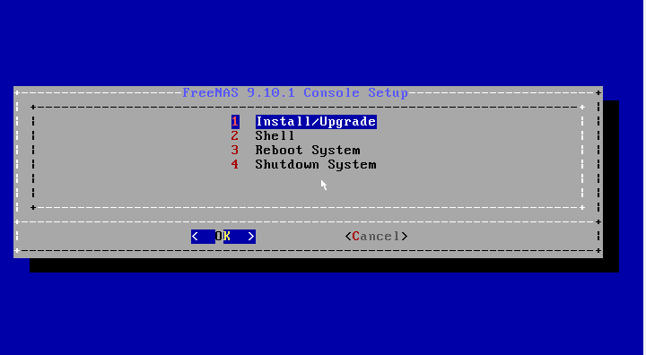

   Console Setup

Press :kbd:`Enter` to select the default option,
:guilabel:`1 Install/Upgrade`. The next menu, shown in
:numref:`Figure %s <select_drive_fig>`,
lists all available drives. This includes any inserted USB thumb
drives, which have names beginning with *da*.

In this example, the user is performing a test installation using
VirtualBox and has created an 8 GB virtual disk to hold the operating
system.

.. _select_drive_fig:

.. figure:: images/install3.png

   Selecting the Install Drive

Use the arrow keys to highlight the destination USB drive, compact
flash device, or virtual disk. Press the :kbd:`spacebar` to select it.
To mirror the boot device, move to the second device and press
:kbd:`spacebar` to select it as well. After making these selections,
press :kbd:`Enter`. %brand% displays the warning shown in
:numref:`Figure %s <install_warning_fig>`,
a reminder not to install the operating system on a drive that is
meant for storage. Press :kbd:`Enter` to continue on to the screen
shown in
:numref:`Figure %s <set_root_pass_fig>`.

.. _install_warning_fig:

.. figure:: images/cdrom3.png

   Installation Warning

.. note:: At this time, the installer does not check the size of the
   install media before attempting an installation. A minimum size of
   8 GB is required, but the install will appear to complete
   successfully on smaller devices, only to fail at boot. When using
   mirrored boot devices, it is recommended to use devices of the same
   size. If the device sizes are different, the mirror is limited to
   the size of the smallest device.

The installer recognizes existing installations of previous versions
of %brand% 8.x or 9.x. When an existing installation is present, the
menu shown in
:numref:`Figure %s <fresh_install_fig>`
is displayed.  To overwrite an existing installation, use the arrows
to move to :guilabel:`Fresh Install` and press :kbd:`Enter` twice to
continue to the screen shown in
:numref:`Figure %s <set_root_pass_fig>`.

.. _fresh_install_fig:

.. figure:: images/upgrade1.png

   Performing a Fresh Install

The screen shown in
:numref:`Figure %s <set_root_pass_fig>`
prompts for the *root* password
which is used to log in to the administrative graphical interface.

.. _set_root_pass_fig:

.. figure:: images/install4.png

   Set the Root Password

Setting a password is mandatory and the password cannot be blank.
Since this password provides access to the administrative GUI, it
should be hard to guess. Enter the password, press the down arrow key,
and confirm the password. Then press :kbd:`Enter` to continue with the
installation.

.. note:: For security reasons, the SSH service and *root* SSH logins
   are disabled by default. Unless these are set, the only way to
   access a shell as *root* is to gain physical access to the console
   menu or to access the web shell within the administrative GUI. This
   means that the %brand% system should be kept physically secure and
   that the administrative GUI should be behind a properly configured
   firewall and protected by a secure password.

The message in
:numref:`Figure %s <install_complete_fig>`
is shown after the installation is complete.

.. _install_complete_fig:

.. figure:: images/cdrom4.png

   Installation Complete

Press :kbd:`Enter` to return to the first menu, shown in
:numref:`Figure %s <grub_menu_fig>`.
Highlight :guilabel:`3 Reboot System` and press :kbd:`Enter`. If
booting from CD, remove the CDROM. As the system reboots, make sure
that the device where %brand% was installed is listed as the first
boot entry in the BIOS so the system will boot from it. %brand% boots
into the :guilabel:`Console Setup` menu described in
:ref:`Initial Configuration Wizard`.

.. _Installation Troubleshooting:

Installation Troubleshooting
----------------------------

If the system does not boot into %brand%, there are several things
that can be checked to resolve the situation.

Check the system BIOS and see if there is an option to change the USB
emulation from CD/DVD/floppy to hard drive. If it still will not boot,
check to see if the card/drive is UDMA compliant.

If the system BIOS does not support EFI with BIOS emulation, see if it
has an option to boot using legacy BIOS mode.

When the system starts to boot but hangs with this repeated error
message::

 run_interrupt_driven_hooks: still waiting after 60 seconds for xpt_config

go into the system BIOS and look for an onboard device configuration
for a 1394 Controller. If present, disable that device and try booting
again.

If the system starts to boot but hangs at a *mountroot>* prompt,
follow the instructions in
`Workaround/Semi-Fix for Mountroot Issues with 9.3
<https://forums.freenas.org/index.php?threads/workaround-semi-fix-for-mountroot-issues-with-9-3.26071/>`_.

If the burned image fails to boot and the image was burned using a
Windows system, wipe the USB stick before trying a second burn using a
utility such as
`Active@ KillDisk <http://how-to-erase-hard-drive.com/>`_.
Otherwise, the second burn attempt will fail as Windows does not
understand the partition which was written from the image file. Be
very careful to specify the correct USB stick when using a wipe
utility!

.. index:: Upgrade
.. _Upgrading:

Upgrading
---------

%brand% provides flexibility for keeping the operating system
up-to-date:

#. Upgrades to major releases, for example from version 9.3 to 9.10,
   can still be performed using either an ISO or the graphical
   administrative interface. Unless the Release Notes for the new
   major release indicate that the current version requires an ISO
   upgrade, either upgrade method can be used.

#. Minor releases have been replaced with signed updates. This means
   that it is not necessary to wait for a minor release to update the
   system with a system update or newer versions of drivers and
   features.  It is also no longer necessary to manually download an
   upgrade file and its associated checksum to update the system.

#. The updater automatically creates a boot environment, making
   updates a low-risk operation. Boot environments provide the
   option to return to the previous version of the operating system by
   rebooting the system and selecting the previous boot environment
   from the boot menu.

This section describes how to perform an upgrade from an earlier
version of %brand% to |release|. After |release| has been installed,
use the instructions in :ref:`Update` to keep the system updated.

.. _Caveats:

Caveats:
~~~~~~~~

Be aware of these caveats **before** attempting an upgrade to
|release|:

* **Upgrades from %brand% 0.7x are not supported.** The system has no
  way to import configuration settings from 0.7x versions of %brand%.
  The configuration must be manually recreated.  If supported, the
  %brand% 0.7x volumes or disks must be manually imported.

* **Upgrades on 32-bit hardware are not supported.** However, if the
  system is currently running a 32-bit version of %brand% **and** the
  hardware supports 64-bit, the system can be upgraded.  Any
  archived reporting graphs will be lost during the upgrade.

* **UFS is no longer supported.** If your data currently resides on
  **one** UFS-formatted disk, you will need to create a ZFS volume
  using **other** disks after the upgrade, then use the instructions
  in :ref:`Import Disk` to mount the UFS-formatted disk to copy the
  data to the ZFS volume. With only one disk, back up its data to
  another system or media before the upgrade, format the disk as ZFS
  after the upgrade, then restore the backup. If your data currently
  resides on a UFS RAID of disks, you will not be able to import that
  data to the ZFS volume. Instead, back up that data before the
  upgrade, create a ZFS volume after the upgrade, then restore the
  data from backup.

* The initial configuration wizard will not recognize an encrypted ZFS
  pool. If your ZFS pool is GELI-encrypted and the
  :ref:`Initial  Configuration Wizard` starts after the upgrade,
  cancel the wizard and use the instructions in
  :ref:`Importing an Encrypted Pool` to import the encrypted volume.
  You can then rerun the wizard afterwards if you wish to use it for
  post-configuration, and it will recognize that the volume has been
  imported and will not prompt to reformat the disks.

* **DO NOT upgrade the ZFS pool unless you are absolutely sure that
  you will never want to go back to the previous version.**
  For this reason, the update process will not automatically upgrade
  the ZFS pool, though the :ref:`Alert` system shows when newer
  feature flags are available for the pool. Unless you need a new
  feature flag, it is safe to leave the ZFS pool at its current
  version and uncheck the alert. If you do decide to upgrade the pool,
  you will not be able to boot into a previous version that does not
  support the newer feature flags.

* The *mps* driver for 6 G Avago SAS HBAs is version 21, which
  requires phase 20 firmware on the controller and the *mpr* driver
  for 12 G Avago SAS HBAs is version 13 which requires P12 firmware.
  It is recommended to upgrade the firmware before installing %brand%
  or immediately after upgrading %brand%, using the instructions in
  :ref:`Alert`. Running older firmware can cause many woes, including
  the failure to probe all of the attached disks, which can lead to
  degraded or unavailable arrays. While you can mismatch your firmware
  version with a higher version and things will "probably still work",
  there are no guarantees as that driver and firmware combination is
  untested.

* If you are upgrading from 9.3.x, read the
  `FAQ: Upgrading from 9.3 to 9.10
  <https://forums.freenas.org/index.php?threads/faq-upgrading-from-9-3-to-9-10.42964/>`_
  first.

.. _Initial Preparation:

Initial Preparation
~~~~~~~~~~~~~~~~~~~

Before upgrading the operating system, perform the following steps:

#.  **Back up the %brand% configuration** in
    :menuselection:`System --> General --> Save Config`.

#.  If any volumes are encrypted, **make sure** that you have set the
    passphrase and have a copy of the encryption key and the latest
    recovery key. After the upgrade is complete, use the instructions
    in :ref:`Importing an Encrypted Pool` to import the encrypted
    volume.

#.  Warn users that the %brand% shares will be unavailable during the
    upgrade; you should schedule the upgrade for a time that will
    least impact users.

#.  Stop all services in
    :menuselection:`Services --> Control Services`.

.. _Upgrading Using the ISO:

Upgrading Using the ISO
~~~~~~~~~~~~~~~~~~~~~~~

To perform an upgrade using this method,
`download <http://download.freenas.org/latest/>`_
the :file:`.iso` to the computer that will be used to prepare the
installation media. Burn the downloaded :file:`.iso` file to a CD or
USB thumb drive using the instructions in
:ref:`Preparing the Media`.

Insert the prepared media into the system and boot from it. Once the
media has finished booting into the installation menu, press
:kbd:`Enter` to select the default option of
:guilabel:`1 Install/Upgrade.` The installer presents a screen showing
all available drives; select the device %brand% is installed into and
press :kbd:`Enter`.

The installer will recognize that an earlier version of %brand% is
installed on the device and will present the message shown in
:numref:`Figure %s <upgrade_install_fig>`.

.. _upgrade_install_fig:

.. figure:: images/upgrade1.png

   Upgrading a %brand% Installation

.. note:: If you choose a :guilabel:`Fresh Install`, the backup of
   your configuration data must be restored using
   :menuselection:`System --> General --> Upload Config`
   after booting into the new operating system.

To perform an upgrade, press :kbd:`Enter` to accept the default of
:guilabel:`Upgrade Install`. Again, the installer will remind you that
the operating system should be installed on a disk that is not used
for storage. Press :kbd:`Enter` to start the upgrade. The installer
unpacks the new image and displays the menu shown in
:numref:`Figure %s <preserve_migrate_fig>`.
The database file that is preserved and migrated contains your %brand%
configuration settings.

.. _preserve_migrate_fig:

.. figure:: images/upgrade2.png

   Preserve and Migrate Settings

Press :kbd:`Enter` and %brand% will indicate that the upgrade is
complete and that you should reboot. Press :guilabel:`OK`, highlight
:guilabel:`3 Reboot System`, and press :kbd:`Enter` to reboot the
system. If the upgrade installer was booted from CD, remove the CDROM.

During the reboot there may be a conversion of the previous
configuration database to the new version of the database. This
happens during the "Applying database schema changes" line in the
reboot cycle. This conversion can take a long time to finish,
sometimes fifteen minutes or more, so be patient and the boot will
complete normally. If database errors are shown but the graphical
administrative interface is accessible, go to
:menuselection:`Settings --> General`
and use the :guilabel:`Upload Config` button to upload the
configuration that you saved before starting the upgrade.

.. _Upgrading From the GUI:

Upgrading From the GUI
~~~~~~~~~~~~~~~~~~~~~~

To perform an upgrade using this method, go to
:menuselection:`System --> Update`.

After the update is complete, you will temporarily lose your
connection as the %brand% system reboots into the new version of the
operating system. The %brand% system will normally receive the same
IP address from the DHCP server. Refresh your browser after a moment
to see if you can access the system.

.. _If Something Goes Wrong:

If Something Goes Wrong
~~~~~~~~~~~~~~~~~~~~~~~

If an update fails, an alert is issued and the details are written to
:file:`/data/update.failed`.

To return to a previous version of the operating system, physical or
IPMI access to the %brand% console is needed. Reboot the system and
watch for the boot menu. In the example shown in
:numref:`Figure %s <boot_menu_fig>`,
the first boot menu entry, *FreeNAS (default)*, refers to the initial
installation, before the update was applied. The second boot entry,
*FreeNAS-1415259326*, refers to the current version of the operating
system, after the update was applied. This second entry is highlighted
and begins with a star, indicating that this is the environment the
system will boot unless another entry is manually selected. Both
entries include a date and timestamp showing when that boot
environment was created.

.. _boot_menu_fig:

.. figure:: images/boot1.png

   Boot Menu

To boot into the previous version of the operating system, use the up
or down arrow to select it and press :kbd:`Enter`.

If a boot device fails and the system no longer boots, don't panic.
The data is still on your disks and you still have a copy of your
saved configuration. You can always:

#.  Perform a fresh installation on a new boot device.

#.  Import your volumes in
    :menuselection:`Storage --> Auto Import Volume`.

#.  Restore the configuration in
    :menuselection:`System --> General --> Upload Config`.

.. note:: You cannot restore a saved configuration which is newer than
   the installed version. For example, if you reboot into an older
   version of the operating system, you cannot restore a configuration
   that was created in a later version.

#ifdef freenas
#include snippets/upgradingazfspool.rst
#endif freenas

.. index:: Virtualization, VM
.. _Virtualization:

Virtualization
--------------

%brand% can be run inside a virtual environment for development,
experimentation, and educational purposes. Please note that running
%brand% in production as a virtual machine is `not recommended
<https://forums.freenas.org/index.php?threads/please-do-not-run-freenas-in-production-as-a-virtual-machine.12484/>`_.
If you decide to use %brand% within a virtual environment,
`read this post first
<https://forums.freenas.org/index.php?threads/absolutely-must-virtualize-freenas-a-guide-to-not-completely-losing-your-data.12714/>`_
as it contains useful guidelines for minimizing the risk of losing
data.

To install or run %brand% within a virtual environment, create a
virtual machine that meets these minimum requirements:

* **at least** 8192 MB (8 GB) base memory size

* a virtual disk **at least 8 GB in size** to hold the operating
  system and boot environments

* at least one additional virtual disk **at least 4 GB in size** to be
  used as data storage

* a bridged network adapter

This section demonstrates how to create and access a virtual machine
within VirtualBox and VMware ESXi environments.

.. _VirtualBox:

VirtualBox
~~~~~~~~~~

`VirtualBox <https://www.virtualbox.org/>`__
is an open source virtualization program originally created by Sun
Microsystems. VirtualBox runs on Windows, BSD, Linux, Macintosh, and
OpenSolaris. It can be configured to use a downloaded %brand%
:file:`.iso` file, and makes a good testing environment for practicing
configurations or learning how to use the features provided by
%brand%.

To create the virtual machine, start VirtualBox and click the
:guilabel:`New` button, shown in
:numref:`Figure %s <vb_initial_fig>`,
to start the new virtual machine wizard.

.. _vb_initial_fig:

.. figure:: images/virtualbox1.png

   Initial VirtualBox Screen

Click the :guilabel:`Next` button to see the screen in
:numref:`Figure %s <vb_nameos_fig>`.
Enter a name for the virtual machine, click the
:guilabel:`Operating System` drop-down menu and select BSD, and select
:guilabel:`FreeBSD (64-bit)` from the :guilabel:`Version` dropdown.

.. _vb_nameos_fig:

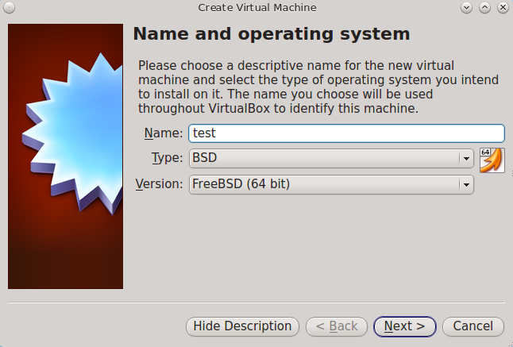

   Type in a Name and Select the Operating System for the New Virtual
   Machine

Click :guilabel:`Next` to see the screen in
:numref:`Figure %s <vb_mem_fig>`.
The base memory size must be changed to **at least 8192 MB**. When
finished, click :guilabel:`Next` to see the screen in
:numref:`Figure %s <vb_hd_fig>`.

.. _vb_mem_fig:

.. figure:: images/virtualbox3.png

   Select the Amount of Memory Reserved for the Virtual Machine

.. _vb_hd_fig:

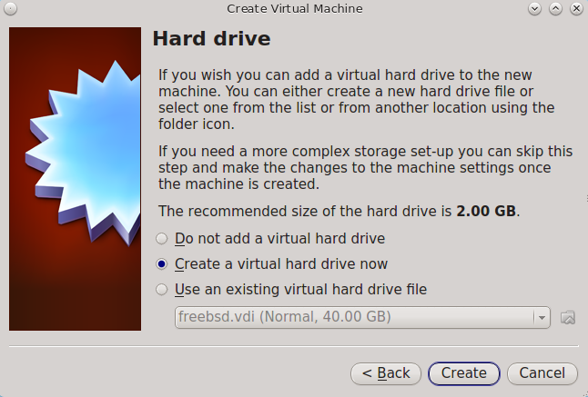

   Select Existing or Create a New Virtual Hard Drive

Click :guilabel:`Create` to launch the
:guilabel:`Create Virtual Hard Drive Wizard` shown in
:numref:`Figure %s <vb_virt_drive_fig>`.

.. _vb_virt_drive_fig:

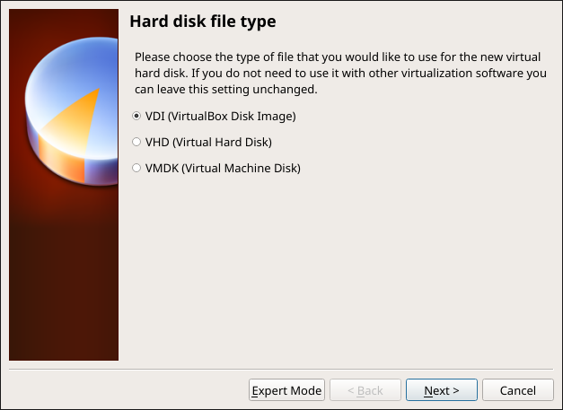

   Create New Virtual Hard Drive Wizard

Select :guilabel:`VDI` and click the :guilabel:`Next` button to see
the screen in
:numref:`Figure %s <vb_virt_type_fig>`.

.. _vb_virt_type_fig:

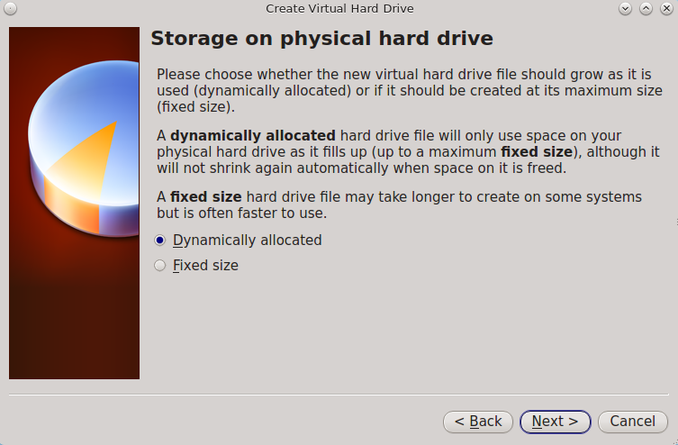

   Select Storage Type for Virtual Disk

Choose either :guilabel:`Dynamically allocated` or
:guilabel:`Fixed-size` storage. The first option uses disk space as
needed until it reaches the maximum size that is set in the next
screen. The second option creates a disk the full amount of disk
space, whether it is used or not. Choose the first option to conserve
disk space; otherwise, choose the second option, as it allows
VirtualBox to run slightly faster. After selecting :guilabel:`Next`,
the screen in
:numref:`Figure %s <vb_virt_filename_fig>`
is shown.

.. _vb_virt_filename_fig:

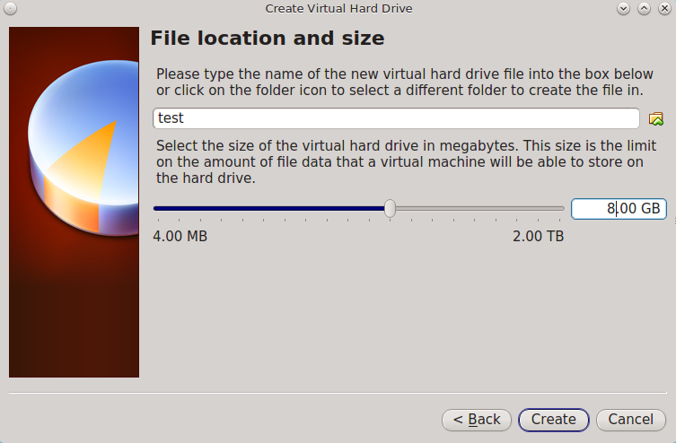

   Select File Name and Size of Virtual Disk

This screen is used to set the size (or upper limit) of the virtual
disk. **Increase the default size to 8 GB**. Use the folder icon to
browse to a directory on disk with sufficient space to hold the
virtual disk files.  Remember that there will be a system disk of
at least 8 GB and at least one data storage disk of at least 4 GB.

After making a selection and pressing :guilabel:`Next`, a summary of
the configuration options chosen is shown. Use the :guilabel:`Back`
button to return to a previous screen if any values need to be
modified. Otherwise, click :guilabel:`Finish` to complete the wizard.
The new virtual machine is listed in the left frame, as shown in the
example in
:numref:`Figure %s <vb_new_vm_fig>`.

.. _vb_new_vm_fig:

.. figure:: images/virtualbox8.png

   The New Virtual Machine

Create the virtual disks to be used for storage. Click the
:guilabel:`Storage` hyperlink in the right frame to access the storage
screen seen in
:numref:`Figure %s <vb_storage_settings_fig>`.

.. _vb_storage_settings_fig:

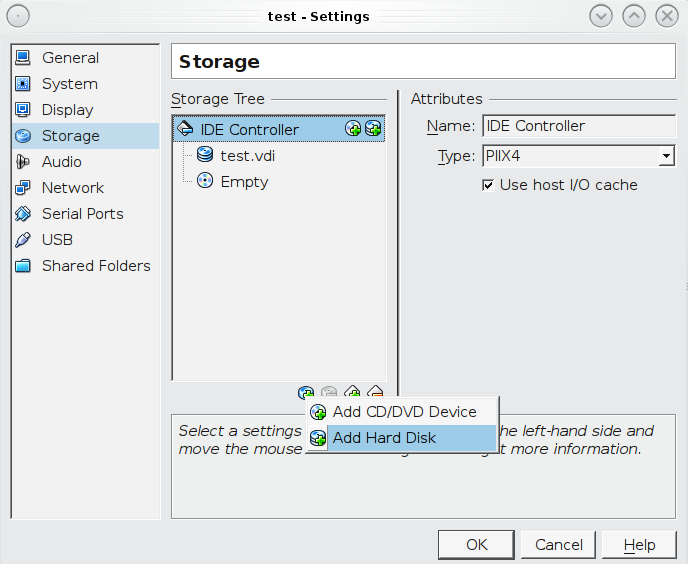

   Storage Settings of the Virtual Machine

Click the :guilabel:`Add Attachment` button, select
:guilabel:`Add Hard Disk` from the pop-up menu, then click the
:guilabel:`Create New Disk` button. This launches the Create New
Virtual Hard Drive Wizard (seen in
:numref:`Figure %s <vb_virt_drive_fig>`
and
:numref:`%s <vb_virt_type_fig>`).
This disk will be used for storage, so create a size
appropriate to your needs, making sure that it is **at least 4 GB**.
To practice with RAID configurations, create as many virtual disks as
needed. Two disks can be created on each IDE controller. For
additional disks, click the :guilabel:`Add Controller` button to
create another controller for attaching additional disks.

Create a device for the installation media. Highlight the word
"Empty", then click the :guilabel:`CD` icon as shown in
:numref:`Figure %s <vb_config_iso_fig>`.

.. _vb_config_iso_fig:

.. figure:: images/virtualbox10.png

   Configuring ISO Installation Media

Click :guilabel:`Choose a virtual CD/DVD disk file...` to browse to
the location of the :file:`.iso` file. If the :file:`.iso` was burned
to CD, select the detected :guilabel:`Host Drive`.

Depending on the extensions available in the host CPU, it might not be
possible to boot the VM from :file:`.iso`. If
"your CPU does not support long mode" is shown when trying to boot
the :file:`.iso`, the host CPU either does not have the required
extension or AMD-V/VT-x is disabled in the system BIOS.

.. note:: If you receive a kernel panic when booting into the ISO,
   stop the virtual machine. Then, go to :guilabel:`System` and check
   the box :guilabel:`Enable IO APIC`.

To configure the network adapter, go to
:menuselection:`Settings --> Network`.
In the :guilabel:`Attached to` drop-down menu select
:guilabel:`Bridged Adapter`, then choose the name of the physical
interface from the :guilabel:`Name` drop-down menu. In the example
shown in
:numref:`Figure %s <vb_bridged_fig>`,
the Intel Pro/1000 Ethernet card is attached to the network and has a
device name of *em0*.

.. _vb_bridged_fig:

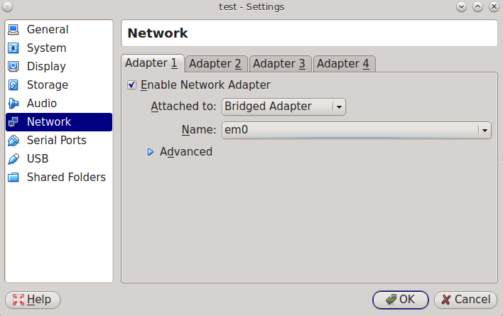

   Configuring a Bridged Adapter in VirtualBox

After configuration is complete, click the :guilabel:`Start` arrow and
install %brand% as described in `Performing the Installation`_. Once
%brand% is installed, press :kbd:`F12` when the VM starts to boot to
access the boot menu. Select the primary hard disk as the boot option.
You can permanently boot from disk by removing the :guilabel:`CD/DVD`
device in :guilabel:`Storage` or by unchecking :guilabel:`CD/DVD-ROM`
in the :guilabel:`Boot Order` section of :guilabel:`System`.

.. _VMware ESXi:

VMware ESXi
~~~~~~~~~~~

Before using ESXi, read `this post
<https://forums.freenas.org/index.php?threads/sync-writes-or-why-is-my-esxi-nfs-so-slow-and-why-is-iscsi-faster.12506/>`_
for an explanation of why iSCSI will be faster than NFS.

ESXi is is a bare-metal hypervisor architecture created by VMware Inc.
Commercial and free versions of the VMware vSphere Hypervisor
operating system (ESXi) are available from the
`VMware website
<http://www.vmware.com/products/esxi-and-esx/overview>`_.
After the operating system is installed on supported hardware, use a
web browser to connect to its IP address. The welcome screen provides
a link to download the VMware vSphere client which is used to create
and manage virtual machines.

Once the VMware vSphere client is installed, use it to connect to the
ESXi server. To create a new virtual machine, click
:menuselection:`File --> New --> Virtual Machine`.
The New Virtual Machine Wizard will launch as shown in
:numref:`Figure %s <esxi_new_vm_fig>`.

.. _esxi_new_vm_fig:

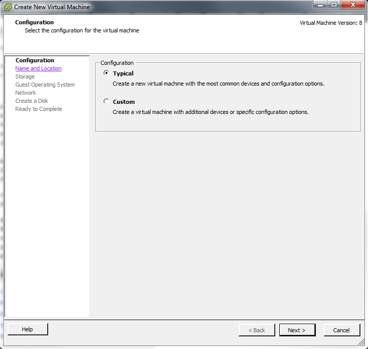

   New Virtual Machine Wizard

Click :guilabel:`Next` and enter a name for the virtual machine. Click
:guilabel:`Next` and highlight a datastore. An example is shown in
:numref:`Figure %s <esxi_datastore_fig>`.
Click :guilabel:`Next`. In the screen shown in
:numref:`Figure %s <esxi_os_fig>`,
click :guilabel:`Other`, then select a FreeBSD 64-bit architecture.

.. _esxi_datastore_fig:

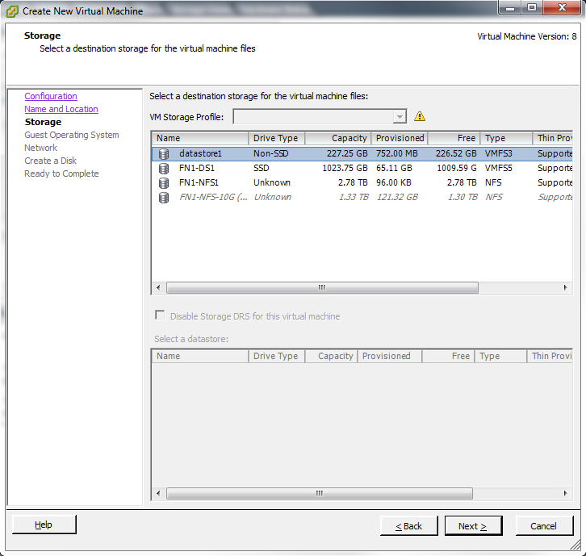

   Select Datastore

.. _esxi_os_fig:

.. figure:: images/esxi3a.png

   Select Operating System

Click :guilabel:`Next` and create a virtual disk file of **8 GB** to
hold the %brand% operating system, as shown in
:numref:`Figure %s <esxi_create_disk_fig>`.

.. _esxi_create_disk_fig:

.. figure:: images/esxi4a.png

   Create Disk for the Operating System

Click :guilabel:`Next` and :guilabel:`Finish`. The new virtual machine
is listed in the left frame. Right-click the virtual machine and
select :guilabel:`Edit Settings` to access the screen shown in
:numref:`Figure %s <esxi_vm_settings_fig>`.

.. _esxi_vm_settings_fig:

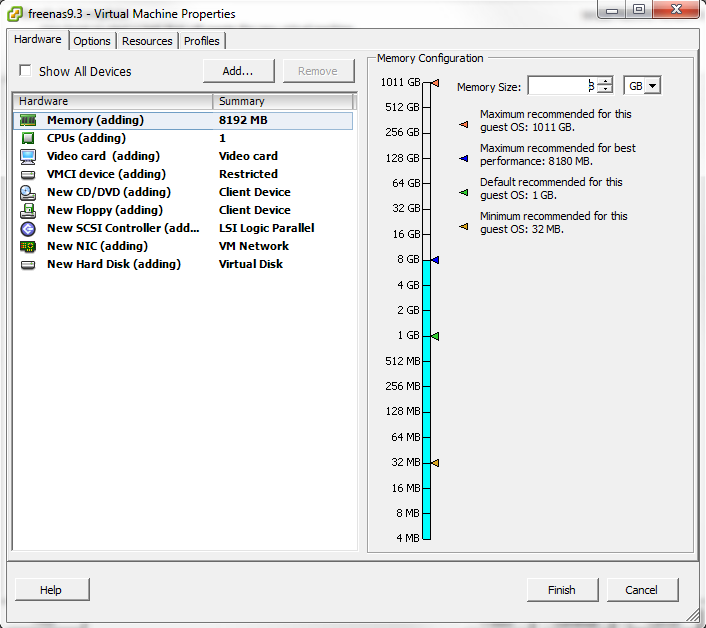

   Virtual Machine Settings

Increase the :guilabel:`Memory Configuration` to **at least 8192 MB**.

Under :guilabel:`CPUs`, make sure that only one virtual processor is
listed, otherwise it will not be possible to start any %brand%
services.

To create a storage disk,
click :menuselection:`Hard disk 1 --> Add`.
In the :guilabel:`Device Type` menu, highlight :guilabel:`Hard Disk`
and click :guilabel:`Next`. Select
:guilabel:`Create a new virtual disk` and click :guilabel:`Next`. In
the screen shown in
:numref:`Figure %s <esxi_create_storage_fig>`,
select the size of the disk. To dynamically allocate space as needed,
check the box
:guilabel:`Allocate and commit space on demand (Thin Provisioning)`.
Click :guilabel:`Next`, then :guilabel:`Next`, then :guilabel:`Finish`
to create the disk. Repeat to create the amount of storage disks
needed to meet your requirements.

.. _esxi_create_storage_fig:

.. figure:: images/esxi6a.png

   Creating a Storage Disk

For ESX 5.0, Workstation 8.0, or Fusion 4.0 or higher, additional
configuration is needed so that the virtual HPET setting does not
prevent the virtual machine from booting.

If you are running ESX, while in :guilabel:`Edit Settings`, click
:menuselection:`Options --> Advanced --> General
--> Configuration Parameters`.
Change :guilabel:`hpet0.present` from *true* to *false*, then click
:guilabel:`OK` twice to save the setting.

For Workstation or Player, while in :guilabel:`Edit Settings`,
click :menuselection:`Options --> Advanced --> File Locations`.
Locate the path for the Configuration file named :file:`filename.vmx`.
Open that file in a text editor, change :guilabel:`hpet0.present` from
*true* to *false*, and save the change.
