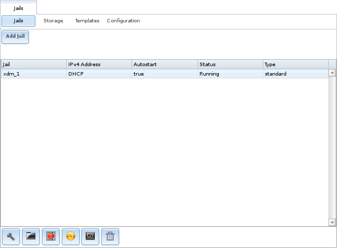
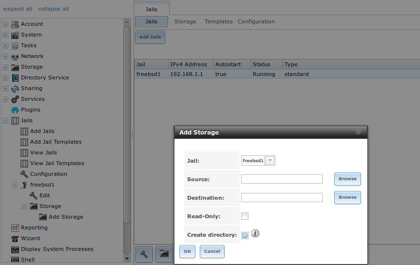
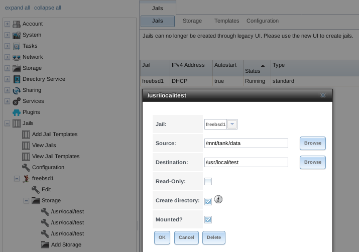
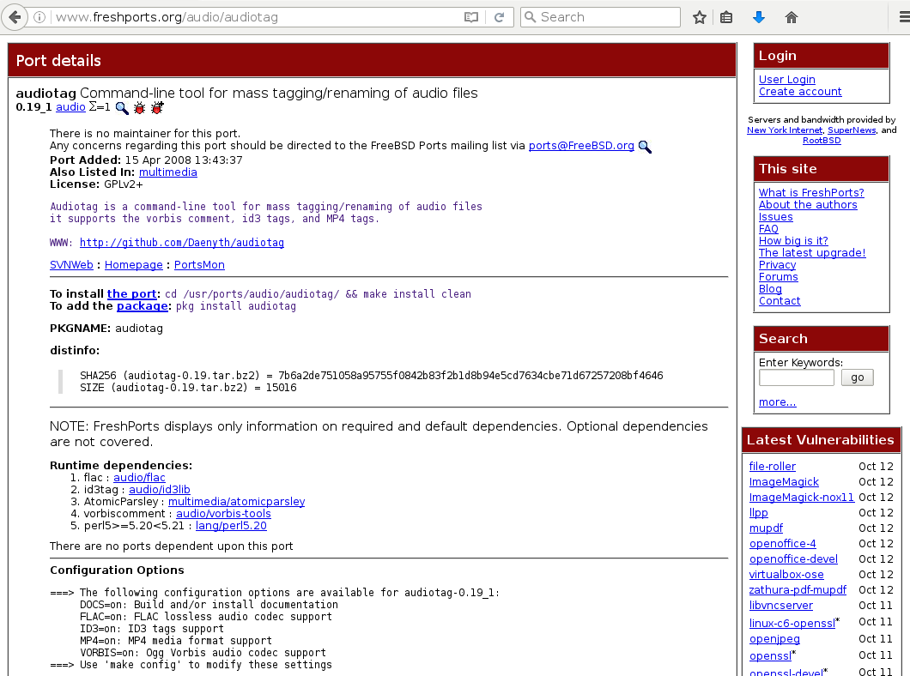
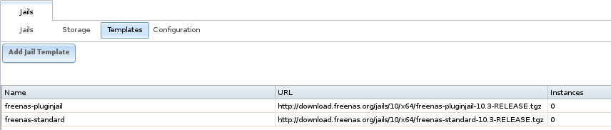
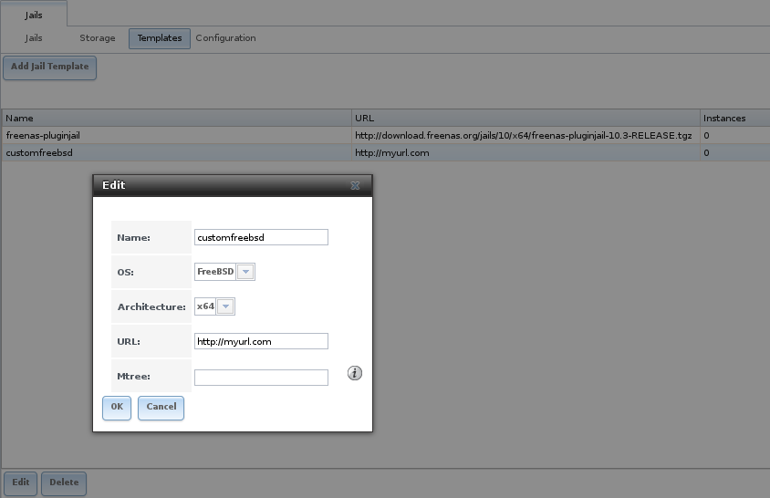

.. index:: Jails
.. _Jails:

Jails
=====

The previous section described how to find, install, and configure
software using :ref:`Plugins`.

This section describes how to use Jails, which allow users who are
comfortable with the command line to have more control over software
installation and management. Any software installed using Jails must
be managed from the command line of the jail. If you prefer to use a
GUI to manage software, use :ref:`Plugins` instead.

%brand% automatically creates a jail whenever a plugin is
installed, but does not let the user install multiple plugins into the
same jail. In contrast, using Jails allows users to create as many
jails as needed and to customize the operating system and installed
software within each jail.

By default, a
`FreeBSD jail <https://en.wikipedia.org/wiki/Freebsd_jail>`_
is created. This provides a very light-weight, operating system-level
virtualization. Consider it as another independent instance of FreeBSD
running on the same hardware, without all of the overhead usually
associated with virtualization.  The jail will install the FreeBSD
software management utilities so FreeBSD ports can be compiled and
FreeBSD packages can be installed from the command line of the jail.

It is important to understand that any users, groups, installed
software, and configurations within a jail are isolated from both the
%brand% operating system and any other jails running on that system.
During creation, the *VIMAGE* option can be selected which will also
provide that jail with its own, independent networking stack. This
allows that jail to do its own IP broadcasting, which is required by
some applications.

Advanced users can also create custom templates to automate the
creation of pre-installed and customized operating systems.

The ability to create multiple jails running different operating
systems offers great flexibility regarding software management. For
example, the administrator can choose to provide application
separation by installing different applications in each jail, or to
create one jail for all installed applications, or to mix and match
how software is installed into each jail.

The rest of this section describes:

* :ref:`Jails Configuration`

* :ref:`Adding Jails`

* :ref:`Managing Jail Templates`

.. _Jails Configuration:

Jails Configuration
-------------------

Jails are stored in a volume or dataset.
**Using a separate dataset for the**
:guilabel:`Jail Root` **is strongly recommended**. The volume
or dataset to be used must already exist or can be created with
:ref:`Volume Manager`.

.. note:: The :guilabel:`Jail Root` volume or dataset cannot be
   created on a :ref:`Share <Sharing>`.

Begin global jail configuration by choosing
:menuselection:`Jails --> Configuration`
to open the screen shown in
:numref:`Figure %s <global_jail_config_fig>`.
Jails are automatically installed into their own dataset under the
specified path as they are created. For example, if the
:guilabel:`Jail Root` is set to :file:`/mnt/volume1/dataset1` and a
jail named *jail1* is created, it is installed into its own dataset
named :file:`/mnt/volume1/dataset1/jail1`.

.. _global_jail_config_fig:

.. figure:: images/jails1.png

   Global Jail Configuration

.. warning:: If any :ref:`Plugins` have already been installed, the
   :guilabel:`Jail Root`, :guilabel:`IPv4 Network`,
   :guilabel:`IPv4 Network Start Address`, and
   :guilabel:`IPv4 Network End Address` are automatically filled.
   Double-check that the pre-configured IP address values are
   appropriate for the jails and do not conflict with addresses used
   by other systems on the network.

:numref:`Table %s <global_jail_config_opts_tab>`
summarizes the fields in this configuration screen. Refer to the text
below the table for more details on how to properly configure the
:guilabel:`Jail Root` and network settings.  Some settings are only
available in :guilabel:`Advanced Mode`. To see these settings, either
click the :guilabel:`Advanced Mode` button or configure the system to
always display these settings by checking the box
:guilabel:`Show advanced fields by default` in
:menuselection:`System --> Advanced`.

.. tabularcolumns:: |>{\RaggedRight}p{\dimexpr 0.20\linewidth-2\tabcolsep}
                    |>{\RaggedRight}p{\dimexpr 0.14\linewidth-2\tabcolsep}
                    |>{\Centering}p{\dimexpr 0.12\linewidth-2\tabcolsep}
                    |>{\RaggedRight}p{\dimexpr 0.54\linewidth-2\tabcolsep}|

.. _global_jail_config_opts_tab:

.. table:: Jail Configuration Options
   :class: longtable

   +----------------------------+---------------+----------+---------------------------------------------------------------------+
   | Setting                    | Value         | Advanced | Description                                                         |
   |                            |               | Mode     |                                                                     |
   |                            |               |          |                                                                     |
   +============================+===============+==========+=====================================================================+
   | Jail Root                  | browse button |          | mandatory; jails cannot be added until this is set                  |
   |                            |               |          |                                                                     |
   +----------------------------+---------------+----------+---------------------------------------------------------------------+
   | IPv4 DHCP                  | checkbox      |          | check this box if the network has a DHCP server                     |
   |                            |               |          |                                                                     |
   +----------------------------+---------------+----------+---------------------------------------------------------------------+
   | IPv4 Network               | string        | ✓        | format is IP address of *network/CIDR mask*                         |
   |                            |               |          |                                                                     |
   +----------------------------+---------------+----------+---------------------------------------------------------------------+
   | IPv4 Network Start Address | string        | ✓        | enter the first IP address in the reserved range in the format      |
   |                            |               |          | *host/CIDR mask*                                                    |
   |                            |               |          |                                                                     |
   +----------------------------+---------------+----------+---------------------------------------------------------------------+
   | IPv4 Network End Address   | string        | ✓        | enter the last IP address in the reserved range in the format       |
   |                            |               |          | *host/CIDR mask*                                                    |
   |                            |               |          |                                                                     |
   +----------------------------+---------------+----------+---------------------------------------------------------------------+
   | IPv6 Autoconfigure         | checkbox      |          | check this box if the network has a DHCPv6 server and IPv6          |
   |                            |               |          | will be used to access jails                                        |
   |                            |               |          |                                                                     |
   +----------------------------+---------------+----------+---------------------------------------------------------------------+
   | IPv6 Network               | string        | ✓        | enter the network address for a properly configured IPv6 network    |
   |                            |               |          |                                                                     |
   +----------------------------+---------------+----------+---------------------------------------------------------------------+
   | IPv6 Network Start Address | string        | ✓        | enter the first IP address in the reserved range for a properly     |
   |                            |               |          | configured IPv6 network                                             |
   +----------------------------+---------------+----------+---------------------------------------------------------------------+
   | IPv6 Network End Address   | string        | ✓        | enter the last IP address in the reserved range for a properly      |
   |                            |               |          | configured IPv6 network                                             |
   +----------------------------+---------------+----------+---------------------------------------------------------------------+
   | Collection URL             | string        | ✓        | changing the default may break the ability to install jails         |
   |                            |               |          |                                                                     |
   +----------------------------+---------------+----------+---------------------------------------------------------------------+

When selecting the :guilabel:`Jail Root`, ensure that the size of the
selected volume or dataset is sufficient to hold the number of jails
to be installed as well as any software, log files, and data to be
stored within each jail. At a bare minimum, budget at least 2 GB per
jail and do not select a dataset that is less than 2 GB in size.

.. note:: If you plan to add storage to a jail, be aware that the path
   size is limited to 88 characters. Make sure that the length of the
   volume name plus the dataset name plus the jail name does not
   exceed this limit.

If the network contains a DHCP server, it is recommended to check the
box :guilabel:`IPv4 DHCP` (or :guilabel:`IPv6 Autoconfigure`, for a
properly configured IPv6 network). This will prevent IP address
conflicts on the network as the DHCP server will automatically assign
the jail the next available lease and record the lease as in use.

If a static IP address is needed so that users always know the IP
address of the jail, enter the start and end address for the IPv4
and/or IPv6 network. The range defined by the start and end addresses
will be automatically assigned as jails are created. For example, if
you plan to create 5 jails on the 192.168.1.0 network, enter a
:guilabel:`IPv4 Network Start Address` of *192.168.1.100* and a
:guilabel:`IPv4 Network End Address` of *192.168.1.104*.

**If you create a start and end range on a network that contains a
DHCP server, it is very important that you also reserve those
addresses on the DHCP server.**
Otherwise, the DHCP server will not be aware that those addresses are
being used by jails and there will be IP address conflicts and weird
networking errors on the network. When troubleshooting jails that do
not install or which are unavailable, double-check that the IP address
being used by the jail is not also being used by another jail or
system in the network.

%brand% will automatically detect and display the
:guilabel:`IPv4 Network` to which the administrative interface is
connected. This setting is important. The IP addresses used by the
jails must be pingable from the %brand% system for the jails and any
installed software to be accessible. If the network topology requires
changing the default value, a default gateway and possibly a static
route need to be added to the specified network. After changing this
value, ensure that the subnet mask value is correct, as an incorrect
mask can make the IP network unreachable. When in doubt, keep the
default setting for :guilabel:`IPv4 Network`. With VMware, make sure
that the vswitch is set to "promiscuous mode".

After clicking the :guilabel:`Save` button to save the configuration,
the system is ready to create and manage jails as described in the
rest of this chapter.

.. index:: Add Jail, New Jail, Create Jail
.. _Adding Jails:

Adding Jails
------------

To create a jail, click
:menuselection:`Jails --> Add Jail`
to access the screen shown in
:numref:`Figure %s <creating_jail_fig>`.

.. note:: the :guilabel:`Add Jail` menu item will not appear until
   after you configure
   :menuselection:`Jails --> Configuration`.

.. _creating_jail_fig:

.. figure:: images/jails3a.png

   Creating a Jail

By default, the only required value to create a jail is a name.
FreeBSD jails are created by default.

:numref:`Table %s <jail_config_opts_tab>`
summarizes the available options. Most settings are only available in
:guilabel:`Advanced Mode` and are not needed if the intent is to
create a FreeBSD jail. To see these settings, either click the
:guilabel:`Advanced Mode` button or configure the system to always
display these settings by checking the box
:guilabel:`Show advanced fields by default` in
:menuselection:`System --> Advanced`.

.. tabularcolumns:: |>{\RaggedRight}p{\dimexpr 0.20\linewidth-2\tabcolsep}
                    |>{\RaggedRight}p{\dimexpr 0.14\linewidth-2\tabcolsep}
                    |>{\Centering}p{\dimexpr 0.12\linewidth-2\tabcolsep}
                    |>{\RaggedRight}p{\dimexpr 0.54\linewidth-2\tabcolsep}|

.. _jail_config_opts_tab:

.. table:: Jail Configuration Options
   :class: longtable

   +---------------------------+----------------+----------+------------------------------------------------------------------------------------------+
   | Setting                   | Value          | Advanced | Description                                                                              |
   |                           |                | Mode     |                                                                                          |
   |                           |                |          |                                                                                          |
   +===========================+================+==========+==========================================================================================+
   | Jail Name                 | string         |          | mandatory; can only contain letters, numbers, dashes, or the underscore character        |
   |                           |                |          |                                                                                          |
   +---------------------------+----------------+----------+------------------------------------------------------------------------------------------+
   | Template                  | drop-down menu | ✓        | contains any created custom templates as described in `Managing Jail Templates`_         |
   |                           |                |          |                                                                                          |
   +---------------------------+----------------+----------+------------------------------------------------------------------------------------------+
   | IPv4 DHCP                 | checkbox       | ✓        | if unchecked, make sure that the defined address does not conflict with the DHCP         |
   |                           |                |          | server's pool of available addresses                                                     |
   |                           |                |          |                                                                                          |
   +---------------------------+----------------+----------+------------------------------------------------------------------------------------------+
   | IPv4 address              | integer        | ✓        | this and the other IPv4 settings are grayed out if :guilabel:`IPv4 DHCP` is              |
   |                           |                |          | checked; enter a unique IP address that is in the local network and not already          |
   |                           |                |          | used by anyother computer                                                                |
   |                           |                |          |                                                                                          |
   +---------------------------+----------------+----------+------------------------------------------------------------------------------------------+
   | IPv4 netmask              | drop-down menu | ✓        | select the subnet mask associated with :guilabel:`IPv4 address`                          |
   |                           |                |          |                                                                                          |
   +---------------------------+----------------+----------+------------------------------------------------------------------------------------------+
   | IPv4 bridge address       | integer        | ✓        | grayed out unless :guilabel:`VIMAGE` is checked; see NOTE below                          |
   |                           |                |          |                                                                                          |
   +---------------------------+----------------+----------+------------------------------------------------------------------------------------------+
   | IPv4 bridge netmask       | drop-down menu | ✓        | select the subnet mask associated with :guilabel:`IPv4 bridge address`; grayed out       |
   |                           |                |          | unless :guilabel:`VIMAGE` is checked                                                     |
   |                           |                |          |                                                                                          |
   +---------------------------+----------------+----------+------------------------------------------------------------------------------------------+
   | IPv4 default gateway      | string         | ✓        | grayed out unless :guilabel:`VIMAGE` is checked                                          |
   |                           |                |          |                                                                                          |
   +---------------------------+----------------+----------+------------------------------------------------------------------------------------------+
   | IPv6 Autoconfigure        | checkbox       | ✓        | if unchecked, make sure that the defined address does not conflict with the DHCP         |
   |                           |                |          | server's pool of available addresses                                                     |
   |                           |                |          |                                                                                          |
   +---------------------------+----------------+----------+------------------------------------------------------------------------------------------+
   | IPv6 address              | integer        | ✓        | this and other IPv6 settings are grayed out if :guilabel:`IPv6 Autoconfigure` is         |
   |                           |                |          | checked; enter a unique IPv6 address that is in the local network and not already        |
   |                           |                |          | used by any other computer                                                               |
   |                           |                |          |                                                                                          |
   +---------------------------+----------------+----------+------------------------------------------------------------------------------------------+
   | IPv6 prefix length        | drop-down menu | ✓        | select the prefix length associated with :guilabel:`IPv6 address`                        |
   |                           |                |          |                                                                                          |
   +---------------------------+----------------+----------+------------------------------------------------------------------------------------------+
   | IPv6 bridge address       | integer        | ✓        | grayed out unless :guilabel:`VIMAGE` is checked; see NOTE below                          |
   |                           |                |          |                                                                                          |
   +---------------------------+----------------+----------+------------------------------------------------------------------------------------------+
   | IPv6 bridge prefix length | drop-down menu | ✓        | grayed out unless :guilabel:`VIMAGE` is checked; select the prefix length                |
   |                           |                |          | associated with :guilabel:`IPv6 address`                                                 |
   |                           |                |          |                                                                                          |
   +---------------------------+----------------+----------+------------------------------------------------------------------------------------------+
   | IPv6 default gateway      | string         | ✓        | grayed out unless :guilabel:`VIMAGE` is checked; used to set the jail's default          |
   |                           |                |          | gateway IPv6 address                                                                     |
   |                           |                |          |                                                                                          |
   +---------------------------+----------------+----------+------------------------------------------------------------------------------------------+
   | MAC                       | string         | ✓        | grayed out unless :guilabel:`VIMAGE` is checked; if a static MAC address is entered,     |
   |                           |                |          | unique static MAC addresses must be entered for every jail created                       |
   |                           |                |          |                                                                                          |
   +---------------------------+----------------+----------+------------------------------------------------------------------------------------------+
   | NIC                       | drop-down menu | ✓        | grayed out if :guilabel:`VIMAGE` is checked; can be used to specify the interface        |
   |                           |                |          | to use for jail connections                                                              |
   |                           |                |          |                                                                                          |
   +---------------------------+----------------+----------+------------------------------------------------------------------------------------------+
   | Sysctls                   | string         | ✓        | comma-delimited list of sysctls to set inside jail                                       |
   |                           |                |          | (like *allow.sysvipc=1,allow.raw_sockets=1*)                                             |
   |                           |                |          |                                                                                          |
   +---------------------------+----------------+----------+------------------------------------------------------------------------------------------+
   | Autostart                 | checkbox       | ✓        | uncheck if the jail will be started manually                                             |
   |                           |                |          |                                                                                          |
   +---------------------------+----------------+----------+------------------------------------------------------------------------------------------+
   | VIMAGE                    | checkbox       | ✓        | gives a jail its own virtualized network stack;  requires promiscuous mode be            |
   |                           |                |          | enabled on the interface                                                                 |
   |                           |                |          |                                                                                          |
   +---------------------------+----------------+----------+------------------------------------------------------------------------------------------+
   | NAT                       | checkbox       | ✓        | grayed out for Linux jails or if :guilabel:`VIMAGE` is unchecked; enables                |
   |                           |                |          | Network Address Translation for the jail                                                 |
   |                           |                |          |                                                                                          |
   +---------------------------+----------------+----------+------------------------------------------------------------------------------------------+

.. note:: The IPv4 and IPv6 bridge interface is used to bridge the
   `epair(4) <http://www.freebsd.org/cgi/man.cgi?query=epair>`_
   device, which is automatically created for each started jail, to a
   physical network device. The default network device is the one that
   is configured with a default gateway. So, if *em0* is the FreeBSD
   name of the physical interface and three jails are running, these
   virtual interfaces are automatically created:
   *bridge0*,
   *epair0a*,
   *epair1a*, and
   *epair2a.* The physical interface
   *em0* will be added to the bridge, as well as each epair device.
   The other half of the epair will be placed inside the jail and will
   be assigned the IP address specified for that jail. The bridge
   interface will be assigned an alias of the default gateway for that
   jail, if configured, or the bridge IP, if configured; either is
   correct.

   The only time an IP address and mask are required for the bridge is
   when the jail will be on a different network than the %brand%
   system. For example, if the %brand% system is on the *10.0.0.0/24*
   network and the jail will be on the *192.168.0.0/24* network, set
   the :guilabel:`IPv4 bridge address` and
   :guilabel:`IPv4 bridge netmask` fields for the jail.

If both the :guilabel:`VIMAGE` and :guilabel:`NAT` boxes are
unchecked, the jail must be configured with an IP address within the
same network as the interface it is bound to, and that address will be
assigned as an alias on that interface. To use a :guilabel:`VIMAGE`
jail on the same subnet, uncheck :guilabel:`NAT` and configure an IP
address within the same network. In both of these cases, configure
only an IP address and do not configure a bridge or a gateway address.

After making selections, click the :guilabel:`OK` button. The jail is
created and added to the :guilabel:`Jails` tab as well as in the tree
menu under :guilabel:`Jails`. Jails start automatically.  To prevent
this, uncheck the :guilabel:`Autostart` box.

The first time a jail is added or used as a template, the GUI
automatically downloads the necessary components from the internet. A
progress bar indicates the status of the download and provides an
estimated time for the process to complete. If it is unable to connect
to the internet, jail creation fails.

#ifdef freenas
.. warning:: Failure to download is often caused by the default
   gateway not being set, preventing internet access. See the Network
   :ref:`Global Configuration` section for information on setting the
   default gateway.
#endif freenas

After the first jail is created or a template has been used,
subsequent jails will be added very quickly because the downloaded
base for creating the jail has been saved to the
:guilabel:`Jail Root`.

.. _Managing Jails:

Managing Jails
~~~~~~~~~~~~~~

Click :guilabel:`Jails` to view and configure the added jails. In the
example shown in
:numref:`Figure %s <view_added_jails_fig>`,
the list entry for the jail named *xdm_1* has been clicked to enable
that jail's configuration options. The entry indicates the jail name,
IP address, whether it will start automatically at system boot, if it
is currently running, and jail type: *standard* for a FreeBSD jail, or
*pluginjail* if it was installed using :ref:`Plugins`.

.. _view_added_jails_fig:

   Viewing Jails

From left to right, these configuration icons are available:

**Edit Jail:** edit the jail settings which were described in
:numref:`Table %s <jail_config_opts_tab>`.

After a jail has been created, the jail name and type cannot be
changed, so these fields will be grayed out.

.. note:: To modify the IP address information for a jail, use the
   :guilabel:`Edit Jail` button instead of the associated networking
   commands from the command line of the jail.

**Add Storage:** configure the jail to access an area of
storage as described in :ref:`Add Storage`.

**Upload Plugin:** manually upload a plugin previously downloaded from
the
`plugins repository <http://download.freenas.org/plugins/9/x64/>`_.

**Start/Stop:** this icon changes appearance depending on the current
:guilabel:`Status` of the jail. When the jail is not running, the icon
is green and clicking it starts the jail. When the jail is already
running, the icon is red and clicking it stops the jail. A stopped
jail and its applications are inaccessible until it is restarted.

**Restart:** restart the jail.

**Shell:** access a *root* command prompt to configure the selected
jail from the command line. When finished, type :command:`exit` to
close the shell.

**Delete:** delete the jail and any periodic snapshots of it. The
contents of the jail are entirely removed.

  .. warning:: Back up data and programs in the jail before deleting
     it. There is no way to recover the contents of a jail after
     deletion.

.. _Accessing a Jail Using SSH:

Accessing a Jail Using SSH
^^^^^^^^^^^^^^^^^^^^^^^^^^

:command:`ssh` can be used to access a jail instead of the jail's
:guilabel:`Shell` icon. This requires starting the :command:`ssh`
service and creating a user account for :command:`ssh` access. Start
by clicking the :guilabel:`Shell` icon for the desired jail.

Find the :samp:`sshd_enable=` line in the jail's
:file:`/etc/rc.conf` and set it to *"YES"*:

.. code-block:: none

   sshd_enable="YES"

Then start the SSH daemon:

.. code-block:: none

   service sshd start

The first time the service runs, the jail's RSA key pair is generated
and the key fingerprint and random art image displayed.

Add a user account by typing :command:`adduser` and following the
prompts. If the user needs superuser privileges, they must be added to
the *wheel* group. For those users, enter *wheel* at this prompt:

.. code-block:: none

   Login group is user1. Invite user1 into other groups? []: wheel

After creating the user, set the *root* password so that the new user
will be able to use the :command:`su` command to gain superuser
privilege. To set the password, type :command:`passwd` then enter and
confirm the desired password.

Finally, test from another system that the user can successfully
:command:`ssh` in and become the superuser. In this example, a user
named *user1* uses :command:`ssh` to access the jail at 192.168.2.3.
The first time the user logs in, they will be asked to verify the
fingerprint of the host:

.. code-block:: none

   ssh user1@192.168.2.3
   The authenticity of host '192.168.2.3 (192.168.2.3)' can't be established.
   RSA key fingerprint is 6f:93:e5:36:4f:54:ed:4b:9c:c8:c2:71:89:c1:58:f0.
   Are you sure you want to continue connecting (yes/no)? yes
   Warning: Permanently added '192.168.2.3' (RSA) to the list of known hosts.
   Password: type_password_here

.. note:: Each jail has its own user accounts and service
   configuration. These steps must be repeated for each jail that
   requires SSH access.

.. _Add Storage:

Add Storage
^^^^^^^^^^^

It is possible to give a FreeBSD jail access to an area of storage on
the %brand% system. This is useful for applications that store a
large amount of data or if an application in a jail needs access to
the data stored on the %brand% system. One example is transmission,
which stores torrents. The storage is added using the
`mount_nullfs(8)
<http://www.freebsd.org/cgi/man.cgi?query=mount_nullfs>`_
mechanism, which links data that resides outside of the jail as a
storage area within the jail.

To add storage, click the :guilabel:`Add Storage` button for a
highlighted jail's entry to open the screen shown in
:numref:`Figure %s <adding_storage_jail_fig>`.
This screen can also be accessed by expanding the jail name in the
tree view and clicking
:menuselection:`Storage --> Add Storage`.

.. _adding_storage_jail_fig:

   Adding Storage to a Jail

Browse to the :guilabel:`Source` and :guilabel:`Destination`, where:

* **Source:** is the directory or dataset on the %brand% system
  which will be accessed by the jail. This directory **must** reside
  outside of the volume or dataset being used by the jail. This is why
  it is recommended to create a separate dataset to store jails, so
  the dataset holding the jails is always separate from any datasets
  used for storage on the %brand% system.

* **Destination:** select an **existing, empty** directory within the
  jail to link to the :guilabel:`Source` storage area. If that
  directory does not exist yet, enter the desired directory name and
  check the :guilabel:`Create directory` box.

Storage is typically added because the user and group account
associated with an application installed inside of a jail needs to
access data stored on the %brand% system. Before selecting the
:guilabel:`Source`, it is important to first ensure that the
permissions of the selected directory or dataset grant permission to
the user/group account inside of the jail. This is not the default, as
the users and groups created inside of a jail are totally separate
from the users and groups of the %brand% system.

The workflow for adding storage usually goes like this:

#.  Determine the name of the user and group account used by the
    application. For example, the installation of the transmission
    application automatically creates a user account named
    *transmission* and a group account also named *transmission*. When
    in doubt, check the files :file:`/etc/passwd` (to find the user
    account) and :file:`/etc/group` (to find the group account) inside
    the jail. Typically, the user and group names are similar to
    the application name. Also, the UID and GID are usually the same
    as the port number used by the service.

    A *media* user and group (GID 8675309) are part of the base
    system. Having applications run as this group or user makes it
    possible to share storage between multiple applications in a
    single jail, between multiple jails, or even between the host and
    jails.

#.  On the %brand% system, create a user account and group account
    that match the user and group names used by the application in
    the jail.

#.  Decide whether the jail should have access to existing data or if
    a new area of storage will be set aside for the jail to use.

#.  If the jail will access existing data, edit the permissions of
    the volume or dataset so the user and group accounts have the
    desired read and write access. If multiple applications or jails
    are to have access to the same data, create a new group and add
    each needed user account to that group.

#.  If an area of storage is being set aside for that jail or
    individual application, create a dataset. Edit the permissions of
    that dataset so the user and group account has the desired read
    and write access.

#.  Use the :guilabel:`Add Storage` button of the jail and select the
    configured volume/dataset as the :guilabel:`Source`.

To prevent writes to the storage, check the box :guilabel:`Read-Only`.

By default, the :guilabel:`Create directory` box is checked. This
means that the directory will automatically be created under the
specified :guilabel:`Destination` path if the directory does not
already exist.

After storage has been added or created, it appears in the tree
under the specified jail. In the example shown in
:numref:`Figure %s <jail_example_storage_fig>`,
a dataset named :file:`volume1/data` has been chosen as the
:guilabel:`Source` as it contains the files stored on the %brand%
system. When the storage was created, the user browsed to
:file:`volume1/jails/freebsd1/usr/local` in the
:guilabel:`Destination` field, then entered *test* as the directory.
Since this directory did not already exist, it was created, because
the :guilabel:`Create directory` box was left checked. The resulting
storage was added to the *freenas1* entry in the tree as
:file:`/usr/local/test`. The user has clicked this
:file:`/usr/local/test` entry to access the :guilabel:`Edit` screen.

.. _jail_example_storage_fig:

   Example Storage

Storage is normally mounted as it is created. To unmount the storage,
uncheck the :guilabel:`Mounted?` box.

.. note:: A mounted dataset will not automatically mount any of its
   child datasets. While the child datasets may appear to be browsable
   inside the jail, any changes will not be visible. Since each
   dataset is considered to be its own filesystem, each child dataset
   must have its own mount point, so separate storage must be created
   for any child datasets which need to be mounted.

To delete the storage, click its :guilabel:`Delete` button.

.. warning:: It is important to realize that added storage is really
   just a pointer to the selected storage directory on the %brand%
   system. It does **not** copy that data to the jail.
   **Files that are deleted from the**
   :guilabel:`Destination`
   **directory in the jail are really deleted from the**
   :guilabel:`Source`
   **directory on the** %brand% **system.**
   However, removing the jail storage entry only removes the pointer,
   leaving the data intact but not accessible from the jail.

.. _Installing FreeBSD Packages:

Installing FreeBSD Packages
~~~~~~~~~~~~~~~~~~~~~~~~~~~

The quickest and easiest way to install software inside the jail is to
install a FreeBSD package. FreeBSD packages are pre-compiled.  They
contains all the binaries and a list of dependencies required for the
software to run on a FreeBSD system.

A huge amount of software has been ported to FreeBSD, currently over
24,000 applications, and most of that software is available as a
package. One way to find FreeBSD software is to use the search bar at
`FreshPorts.org <http://www.freshports.org/>`_.

After finding the name of the desired package, use the
:command:`pkg install` command to install it. For example, to install
the audiotag package, use this command:

.. code-block:: none

   pkg install audiotag

When prompted, type **y** to complete the installation. The
installation messages will indicate if the package and its
dependencies successfully download and install.

.. warning:: Some older versions of FreeBSD used package systems
   which are now obsolete. Do not use commands from those obsolete
   package systems in a %brand% jail, as they will cause
   inconsistencies in the jail's package management database. Use the
   current FreeBSD package system as shown in these examples.

A successful installation can be confirmed by querying the package
database:

.. code-block:: none

 pkg info -f audiotag
 audiotag-0.19_1
 Name:		 audiotag
 Version:	 0.19_1
 Installed on:   Fri Nov 21 10:10:34 PST 2014
 Origin:	 audio/audiotag
 Architecture:	 freebsd:9:x86:64
 Prefix:	 /usr/local
 Categories:	 multimedia audio
 Licenses:	 GPLv2
 Maintainer:	 ports@FreeBSD.org
 WWW:		 http://github.com/Daenyth/audiotag
 Comment:	 Command-line tool for mass tagging/renaming of audio files
 Options:
   DOCS:	 on
   FLAC:	 on
   ID3:		 on
   MP4:		 on
   VORBIS:	 on
 Annotations:
   repo_type:    binary
   repository:   FreeBSD
 Flat size:	 62.8KiB
 Description:	Audiotag is a command-line tool for mass tagging/renaming of audio files
		it supports the vorbis comment, id3 tags, and MP4 tags.
 WWW:		http://github.com/Daenyth/audiotag

To show what was installed by the package:

.. code-block:: none

   pkg info -l audiotag
   audiotag-0.19_1:
   /usr/local/bin/audiotag
   /usr/local/share/doc/audiotag/COPYING
   /usr/local/share/doc/audiotag/ChangeLog
   /usr/local/share/doc/audiotag/README
   /usr/local/share/licenses/audiotag-0.19_1/GPLv2
   /usr/local/share/licenses/audiotag-0.19_1/LICENSE
   /usr/local/share/licenses/audiotag-0.19_1/catalog.mk

In FreeBSD, third-party software is always stored in
:file:`/usr/local` to differentiate it from the software that came
with the operating system. Binaries are almost always located in a
subdirectory called :file:`bin` or :file:`sbin` and configuration
files in a subdirectory called :file:`etc`.

.. _Compiling FreeBSD Ports:

Compiling FreeBSD Ports
~~~~~~~~~~~~~~~~~~~~~~~

Software is typically installed into FreeBSD jails using packages. But
sometimes there are good reasons to compile a port instead. Compiling
ports offers these advantages:

* Not every port has an available package. This is usually due to
  licensing restrictions or known, unaddressed security
  vulnerabilities.

* Sometimes the package is out-of-date and a feature is needed that
  only became available in the newer version.

* Some ports provide compile options that are not available in the
  pre-compiled package. These options are used to add or remove
  features or options.

Compiling a port has these disadvantages:

* It takes time. Depending upon the size of the application, the
  amount of dependencies, the speed of the CPU, the amount of RAM
  available, and the current load on the %brand% system, the time
  needed can range from a few minutes to a few hours or even to a few
  days.

.. note:: If the port does not provide any compile options, it saves
   time and preserves the %brand% system's resources to just use the
   :command:`pkg install` command instead.

The
`FreshPorts.org <http://www.freshports.org/>`_
listing shows whether a port has any configurable compile options.
:numref:`Figure %s <config_opts_audiotag_fig>`
shows the :guilabel:`Configuration Options` for audiotag.

.. _config_opts_audiotag_fig:

   Configuration Options for Audiotag

This port has five configurable options (DOCS, FLAC, ID3, MP4,
and VORBIS) and each option is enabled (on) by default.

FreeBSD packages are always built using the default options. When
compiling a port yourself, those options are presented in a menu,
allowing the default values to be changed.

The Ports Collection must be installed in a jail before ports can be
compiled. Inside the jail, use the :command:`portsnap`
utility. This command downloads the ports collection and extracts
it to the jail's :file:`/usr/ports/` directory:

.. code-block:: none

   portsnap fetch extract

.. note:: To install additional software at a later date, make sure
   the ports collection is updated with
   :command:`portsnap fetch update`.

To compile a port, :command:`cd` into a subdirectory of
:file:`/usr/ports/`. The entry for the port at FreshPorts provides the
location to :command:`cd` into and the :command:`make` command to run.
This example compiles and installs the audiotag port:

.. code-block:: none

   cd /usr/ports/audio/audiotag
   make install clean

Since this port has configurable options, the first time this command
is run, the configure screen shown in
:numref:`Figure %s <config_set_audiotag_fig>`
is displayed:

.. _config_set_audiotag_fig:

.. figure:: images/ports2.png

   Configuration Options for Audiotag Port

Use the arrow keys to select an option and press :kbd:`spacebar`
to toggle the value. When all the values are as desired, press
:kbd:`Enter`.  The port will begin to compile and install.

.. note:: The configuration screen will not be shown again, even
   if the build is stopped and restarted. It can be redisplayed
   by typing :command:`make config`.  Change the settings, then
   rebuild with :command:`make clean install clean`.

Many ports depend on other ports. Those other ports can also have
configuration screens that will be shown before compiling begins. It
is a good idea to keep an eye on the compile until it finishes and the
command prompt returns.

When the port is installed, it is registered in the same package
database that manages packages. The same :command:`pkg info` command
can be used to determine what was installed, as described in the
previous section.

.. _Starting Installed Software:

Starting Installed Software
~~~~~~~~~~~~~~~~~~~~~~~~~~~

After packages or ports are installed, they need to be configured and
started. If you are familiar with the software, look for the
configuration file in :file:`/usr/local/etc` or a subdirectory of it.
Many FreeBSD packages contain a sample configuration file as a
reference. If you are unfamiliar with the software, you will need to
spend some time at the software's website to learn which configuration
options are available and which configuration files require editing.

Most FreeBSD packages that contain a startable service include a
startup script which is automatically installed to
:file:`/usr/local/etc/rc.d/`. After the configuration is complete, the
starting of the service can be tested by running the script with the
:command:`onestart` option. As an example, if openvpn is installed
into the jail, these commands run its startup script and verify that
the service started:

.. code-block:: none

   /usr/local/etc/rc.d/openvpn onestart
   Starting openvpn.

   /usr/local/etc/rc.d/openvpn onestatus
   openvpn is running as pid 45560.

   sockstat -4
   USER	COMMAND		PID	FD	PROTO	LOCAL ADDRESS	FOREIGN ADDRESS
   root	openvpn		48386 	4	udp4	*:54789		*:*

If it produces an error:

.. code-block:: none

   /usr/local/etc/rc.d/openvpn onestart
   Starting openvpn.
   /usr/local/etc/rc.d/openvpn: WARNING: failed to start openvpn

Run :command:`tail /var/log/messages` to see if any error messages
hint at the problem. Most startup failures are related to a
misconfiguration: either a typo or a missing option in a
configuration file.

After verifying that the service starts and is working as intended,
add a line to :file:`/etc/rc.conf` to start the
service automatically when the jail is started. The line to
start a service always ends in *_enable="YES"* and typically starts
with the name of the software. For example, this is the entry for the
openvpn service:

.. code-block:: none

   openvpn_enable="YES"

When in doubt, the startup script shows the line to put in
:file:`/etc/rc.conf`. This is the description in
:file:`/usr/local/etc/rc.d/openvpn`:

.. code-block:: none

   # This script supports running multiple instances of openvpn.
   # To run additional instances link this script to something like
   # % ln -s openvpn openvpn_foo

   # and define additional openvpn_foo_* variables in one of
   # /etc/rc.conf, /etc/rc.conf.local or /etc/rc.conf.d /openvpn_foo

   #
   # Below NAME should be substituted with the name of this script. By default
   # it is openvpn, so read as openvpn_enable. If you linked the script to
   # openvpn_foo, then read as openvpn_foo_enable etc.
   #
   # The following variables are supported (defaults are shown).
   # You can place them in any of
   # /etc/rc.conf, /etc/rc.conf.local or /etc/rc.conf.d/NAME
   #
   # NAME_enable="NO"
   # set to YES to enable openvpn

The startup script also indicates if any additional parameters are
available:

.. code-block:: none

   # NAME_if=
   # driver(s) to load, set to "tun", "tap" or "tun tap"
   #
   # it is OK to specify the if_ prefix.
   #
   # # optional:
   # NAME_flags=
   # additional command line arguments
   # NAME_configfile="/usr/local/etc/openvpn/NAME.conf"
   # --config file
   # NAME_dir="/usr/local/etc/openvpn"
   # --cd directory

.. _Managing Jail Templates:

Managing Jail Templates
-----------------------

%brand% supports the ability to add custom templates to the
:guilabel:`Templates` drop-down menu described in
:numref:`Table %s <jail_config_opts_tab>`.

To create a custom template, first install the desired operating
system and configure it as needed. The installation can be either to
an existing jail or on another system.

Next, create an mtree specification using this command, replacing
*/path/to/jail* with the actual path to the jail:

.. code-block:: none

   mtree -c -p /path/to/jail -k sha256digest > file.mtree

After configuration is complete, create a tarball of the entire
operating system to be used as a template. This tarball needs to be
compressed with :command:`gzip` and end in a :file:`.tgz` extension.
Be careful when creating the tarball as it is possible to end up in a
recursive loop. In other words, the resulting tarball must be saved
outside of the operating system being tarballed, such as to an
external USB drive or network share. Alternately, create a temporary
directory within the operating system and use the *--exclude* switch
to :command:`tar` to exclude this directory from the tarball. The
exact :command:`tar` command to use will vary, depending upon the
operating system being used to create the tarball.

Save the generated :file:`.mtree` and :file:`.tgz` files to either an
FTP share or an HTTP server. The FTP or HTTP URL is needed to add the
template to the list of available templates.

To add the template, click
:menuselection:`Jails --> Templates --> Add Jail Templates`
which opens the screen shown in
:numref:`Figure %s <adding_custom_jail_template_fig>`.

.. _adding_custom_jail_template_fig:

.. figure:: images/jails11a.png

   Adding A Custom Jail Template

:numref:`Table %s <jail_template_opts_tab>`
summarizes the fields in this screen.

.. tabularcolumns:: |>{\RaggedRight}p{\dimexpr 0.16\linewidth-2\tabcolsep}
                    |>{\RaggedRight}p{\dimexpr 0.20\linewidth-2\tabcolsep}
                    |>{\RaggedRight}p{\dimexpr 0.63\linewidth-2\tabcolsep}|

.. _jail_template_opts_tab:

.. table:: Jail Template Options
   :class: longtable

   +--------------+----------------+-----------------------------------------------------------------------------------------------+
   | Setting      | Value          | Description                                                                                   |
   |              |                |                                                                                               |
   +==============+================+===============================================================================================+
   | Name         | string         | value appears in the :guilabel:`Name` column of :guilabel:`View Jail Templates`               |
   |              |                |                                                                                               |
   +--------------+----------------+-----------------------------------------------------------------------------------------------+
   | OS           | drop-down menu | choices are  *FreeBSD* or                                                                     |
   |              |                | *Linux*                                                                                       |
   |              |                |                                                                                               |
   |              |                |                                                                                               |
   +--------------+----------------+-----------------------------------------------------------------------------------------------+
   | Architecture | drop-down menu | choices are *x86* (32-bit) or                                                                 |
   |              |                | *x64* (64-bit)                                                                                |
   |              |                |                                                                                               |
   +--------------+----------------+-----------------------------------------------------------------------------------------------+
   | URL          | string         | enter the full URL to the :file:`.tgz` file, including the protocol (*ftp://* or              |
   |              |                | or *http://*)                                                                                 |
   |              |                |                                                                                               |
   +--------------+----------------+-----------------------------------------------------------------------------------------------+
   | Mtree        | string         | paste the mtree specification for the template                                                |
   |              |                |                                                                                               |
   +--------------+----------------+-----------------------------------------------------------------------------------------------+
   | Read-only    | checkbox       | when checked, the :guilabel:`Name` and :guilabel:`URL` of the template cannot be changed      |
   |              |                | after creation                                                                                |
   +--------------+----------------+-----------------------------------------------------------------------------------------------+

Once added, the template will appear in
:menuselection:`Jails --> Templates`.
An example is seen in
:numref:`Figure %s <default_jail_templates_fig>`.

.. _default_jail_templates_fig:

   Viewing Available Templates

The listing contains these columns:

* **Name:** appears in the :guilabel:`Template` drop-down menu when
  adding a new jail.

* **URL:** when adding a new jail using this template, the template
  is downloaded from this location.

* **Instances:** indicates if the template has been used to create a
  jail. In this example, the template has not yet been used so its
  :guilabel:`Instances` shows *0*.   

Click the entry for a template to access its :guilabel:`Edit` and
:guilabel:`Delete` buttons. Clicking a template's :guilabel:`Edit`
button opens the configuration screen shown in
:numref:`Figure %s <edit_jail_template_fig>`.

.. _edit_jail_template_fig:

   Editing Template Options

Clicking a template's :guilabel:`Delete` button shows a warning
message that prompts for confirmation of the deletion. Note that once
a template is deleted, it is removed from the :guilabel:`Templates`
drop-down menu and will no longer be available for creating new jails.

.. index:: bhyve, iohyve
.. _Using iohve:

Using iohyve
------------

Beginning with %brand% 9.10, the
`iohyve <https://github.com/pr1ntf/iohyve>`_
command line utility is included for creating, managing, and launching
`bhyve <https://en.wikipedia.org/wiki/Bhyve>`_ guests.

.. note:: This type of virtualization requires an Intel processor with
   Extended Page Tables (EPT) or an AMD processor with Rapid
   Virtualization Indexing (RVI) or Nested Page Tables (NPT).

   To verify that an Intel processor has the required features, use
   :ref:`Shell` to run :command:`grep VT-x /var/run/dmesg.boot`. If
   the *EPT* and *UG* features are shown, this processor can be used
   with *bhyve* and *iohyve*.

   To verify that an AMD processor has the required features, use
   :ref:`Shell` to run :command:`grep POPCNT /var/run/dmesg.boot`. If
   the output shows the POPCNT feature, this processor can be used
   with *bhyve* and *iohyve*.

Run this command to initialize iohyve, substituting the name of
the pool to hold the bhyve guests and the name of the network
interface:

.. code-block:: none

   iohyve setup pool=volume1 kmod=1 net=em0
   Setting up iohyve pool...
   Loading kernel modules...
   Setting up bridge0 on em0...
   net.link.tap.up_onopen: 0 -> 1

   ln -s /mnt/iohyve /iohyve

The next step is to tell :command:`iohyve` which installation ISO to
download. This example shows fetching the 64-bit version of FreeBSD
10.3, then verify that the fetch was successful:

.. code-block:: none

   iohyve fetch ftp://ftp.freebsd.org/pub/FreeBSD/releases/amd64/amd64/ISO-IMAGES/10.3/FreeBSD-10.3-RELEASE-amd64-bootonly.iso
   Fetching ftp://ftp.freebsd.org/pub/FreeBSD/releases/amd64/amd64/ISO-IMAGES/10.3/FreeBSD-10.3-RELEASE-amd64-bootonly.iso...
   /iohyve/ISO/FreeBSD-10.3-RELEASE-amd64-bootonly.iso 100% of 232 MB 2443 kBps 01m38s

   iohyve isolist
   Listing ISO's...
   FreeBSD-10.3-RELEASE-amd64-bootonly.iso

Specify the name and size of the guest to create it and verify its
status:

.. code-block:: none

 iohyve create freebsd10.3 8G
 Creating freebsd10.3...

 iohyve list
 Guest		VMM?	Running?	rcboot?		Description
 freebsd10.3    NO      NO              NO              Thu_Mar_24_09:37:30_PDT_2016

The newly created guest is not yet running, nor is it set to
automatically start (rcboot) when :command:`iohyve` starts.

Install a guest using a specified ISO:

.. code-block:: none

   iohyve install freebsd10.3 FreeBSD-10.3-RELEASE-amd64-bootonly.iso
   Installing freebsd10.3...

More information on iohyve:

  * `Forum post on iohyve
    <https://forums.freenas.org/index.php?threads/virtualbox-vs-iohyve-bhyve-for-crashplan.45067/#post-304017>`_

  * `Running virtual machines using iohyve on FreeNAS® 9.10
    <https://www.youtube.com/watch?v=rCDh9K16Q5Q>`_
