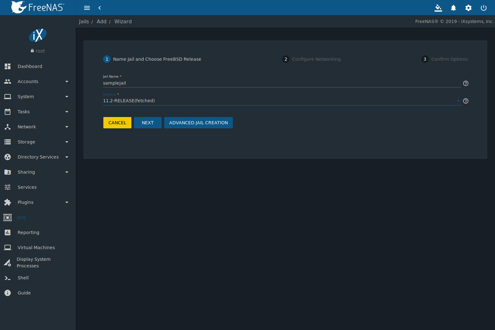
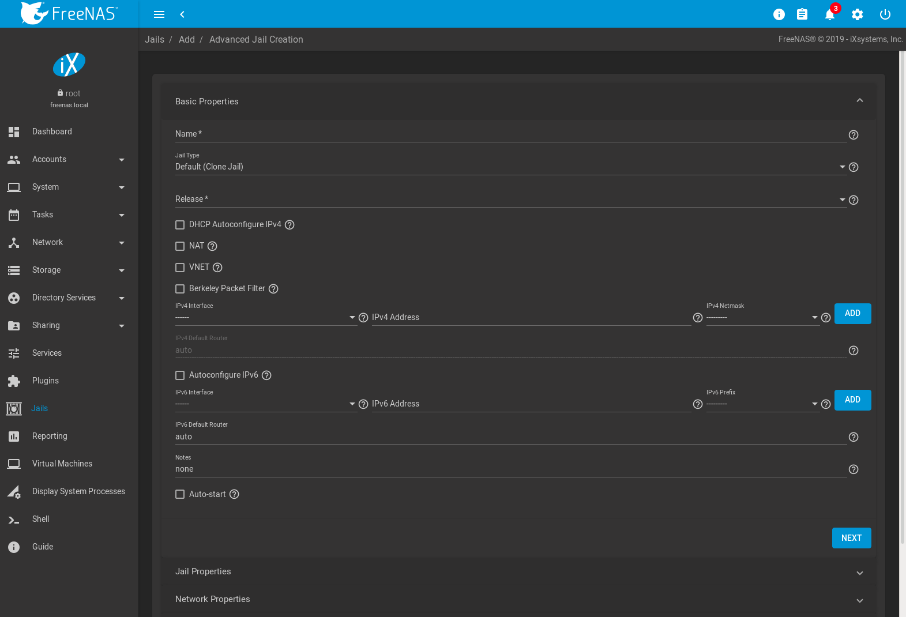
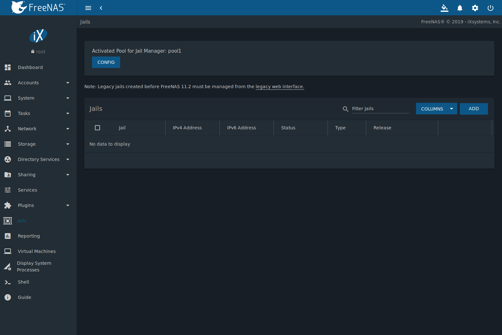
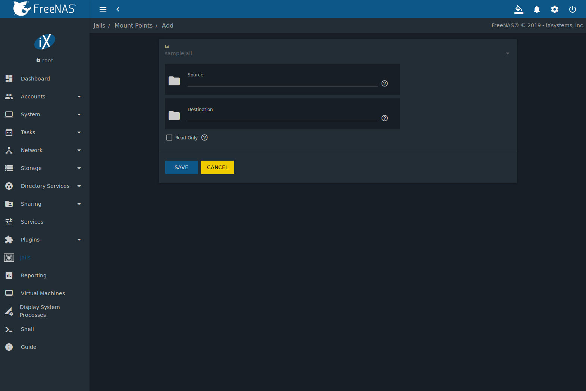
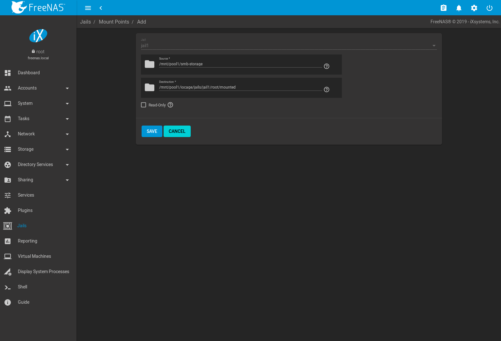
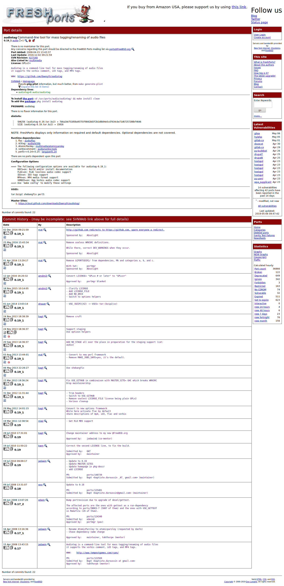

.. index:: Jails
.. _Jails:

Jails
=====

.. warning:: This section describes installing and using jails on %brand%
   version 11.2 or later. Any jails created with a previous version of
   %brand% must be managed with the :ref:`Legacy Web Interface`.

Jails are a lightweight, operating-system-level virtualization.
One or multiple services can run in a jail, isolating those services
from the host %brand% system. %brand% uses the
`iocage <https://github.com/iocage/iocage>`__ utility for jail
management. Jails are also used as the basis for %brand% :ref:`Plugins`.
The main differences between a user-created jail and a plugin are that
plugins are preconfigured and usually provide only a single service.

By default, jails run the
`FreeBSD <https://www.freebsd.org/>`__
operating system. These jails are independent instances of FreeBSD.
The jail uses the host hardware and runs on the host kernel, avoiding
most of the overhead usually associated with virtualization. The jail
installs FreeBSD software management utilities so FreeBSD packages or
ports can be installed from the jail command line. This allows for
FreeBSD ports to be compiled and FreeBSD packages to be installed from
the command line of the jail.

It is important to understand that users, groups, installed software,
and configurations within a jail are isolated from both the %brand%
host operating system and any other jails running on that system.

During creation, set the :guilabel:`VNET` option to provide
the jail with an independent networking stack. The jail is then able
to broadcast an IP address, which is required by some applications.

The ability to create multiple jails offers flexibility
regarding software management. For example, an administrator can
choose to provide application separation by installing different
applications in each jail, to create one jail for all installed
applications, or to mix and match how software is installed into each
jail.

.. index:: Jail Storage
.. _Jail Storage:

Jail Storage
------------

A :ref:`pool <Creating Pools>` must be created before using jails or
:ref:`Plugins`. Make sure the pool has enough storage for all the
intended jails and plugins. The
:menuselection:`Jails`
screen displays a message and button to :guilabel:`CREATE POOL` if no
pools exist on the %brand% system.

Multiple pools can be activated to store iocage jails and plugins. After
a pool is created, the
:menuselection:`Jails`
page displays an :guilabel:`Activated Pool` section. This shows which
pool and iocage dataset is active with %brand%. Click :guilabel:`CONFIG`
to view the option to choose another pool or dataset to activate with
iocage. :guilabel:`ACTIVATE` another pool to refresh the
:menuselection:`Jails`
list with any jails that exist on the chosen pool or dataset.

Jails and downloaded FreeBSD release files are stored in a dataset named
:file:`iocage/`.

Notes about the :file:`iocage/` dataset:

* At least 10 GiB of free space is recommended.

* Cannot be located on a :ref:`Share <Sharing>`.

* `iocage <http://iocage.readthedocs.io/en/latest/index.html>`__
  automatically uses the first pool that is not a root pool for the
  %brand% system.

* A :file:`defaults.json` file contains default settings used when
  a new jail is created. The file is created automatically if not
  already present. If the file is present but corrupted,
  :command:`iocage` shows a warning and uses default settings from
  memory.

* Each new jail installs into a new child dataset of :file:`iocage/`.
  For example, with the :file:`iocage/jails` dataset in :file:`pool1`,
  a new jail called *jail1* installs into a new dataset named
  :file:`pool1/iocage/jails/jail1`.

* FreeBSD releases are fetched as a child dataset into the
  :file:`/iocage/download` dataset. This datset is then extracted into
  the :file:`/iocage/releases` dataset to be used in jail creation. The
  dataset in :file:`/iocage/download` can then be removed without
  affecting the availability of fetched releases or an existing jail.

* :file:`iocage/` datasets on activated pools are independent of each
  other and do **not** share any data.

.. index:: Add Jail, New Jail, Create Jail
.. _Creating Jails:

Creating Jails
--------------

%brand% has two options to create a jail. The :guilabel:`Jail Wizard`
makes it easy to quickly create a jail. :guilabel:`ADVANCED JAIL CREATION`
is an alternate method, where every possible jail option is configurable.
There are numerous options spread across four different primary
sections. This form is recommended for advanced users with very specific
requirements for a jail.

.. index:: Jail Wizard
.. _Jail Wizard:

Jail Wizard
~~~~~~~~~~~

New jails can be created quickly by going to
:menuselection:`Jails -->` |ui-add|.
This opens the wizard screen shown in
:numref:`Figure %s <jail_wizard_fig>`.

.. _jail_wizard_fig:

   Jail Creation Wizard

The wizard provides the simplest process to create and configure
a new jail. Enter a :guilabel:`Jail Name`. Jail names can
only contain alphanumeric characters (:literal:`Aa-Zz`, :literal:`123`),
dashes (:literal:`-`), and underscores (:literal:`_`). Choose the version
of FreeBSD to install for this jail. Previously downloaded versions
display :literal:`(fetched)` next to their entry in the list.

Click :guilabel:`NEXT` to see a simplified list of networking options.
The jail can be set to automatically configure IPv4 with :guilabel:`DHCP`
and :guilabel:`VNET` or IPv4 and IPv6 can be configured manually.
Multiple interfaces are supported in the :guilabel:`IPv4 Address` and
:guilabel:`IPv6 Address` fields by entering a comma delimited list of
interfaces, addresses, and netmask in the format
:literal:`interface|ipaddress/netmask`.

Click :guilabel:`NEXT` to view a summary screen of the chosen jail
options. Click :guilabel:`SUBMIT` to create the new jail. After a few
moments, the new jail is added to the primary jails list.

.. tip:: Versions of FreeBSD are downloaded the first time they are
   used in a jail. Additional jails created with the same version of
   FreeBSD are created faster because the download has already been
   completed.

.. index:: Advanced Jail Creation
.. _Advanced Jail Creation:

Advanced Jail Creation
~~~~~~~~~~~~~~~~~~~~~~

The advanced jail creation form is opened by clicking
:menuselection:`Jails -->` |ui-add|
then :guilabel:`Advanced Jail Creation`. The screen in
:numref:`Figure %s <creating_jail_fig>` is shown.

.. _creating_jail_fig:

   Creating a Jail

A usable jail can be quickly created by setting only the required
values, the :guilabel:`Jail Name` and :guilabel:`Release`. Additional
settings are in the :guilabel:`Jail Properties`,
:guilabel:`Network Properties`, and :guilabel:`Custom Properties`
sections. :numref:`Table %s <jail_basic_props_tab>`
shows the available options of the :guilabel:`Basic Properties` of
a new jail.

.. tabularcolumns:: |>{\RaggedRight}p{\dimexpr 0.25\linewidth-2\tabcolsep}
                    |>{\RaggedRight}p{\dimexpr 0.15\linewidth-2\tabcolsep}
                    |>{\RaggedRight}p{\dimexpr 0.60\linewidth-2\tabcolsep}|

.. _jail_basic_props_tab:

.. table:: Basic Properties
   :class: longtable

   +---------------------------+-------------------+---------------------------------------------------------------------------------------------------------+
   | Setting                   | Value             | Description                                                                                             |
   |                           |                   |                                                                                                         |
   +===========================+===================+=========================================================================================================+
   | Name                      | string            | Required. Jail names can only contain alphanumeric characters (:literal:`Aa-Zz`, :literal:`123`),       |
   |                           |                   | dashes (:literal:`-`), and underscores (:literal:`_`).                                                  |
   |                           |                   |                                                                                                         |
   +---------------------------+-------------------+---------------------------------------------------------------------------------------------------------+
   | Release                   | drop-down menu    | Required. Choose the version of FreeBSD to download and install for the jail. Previously downloaded     |
   |                           |                   | versions of FreeBSD display :literal:`(fetched)` next to the entry in the list and do not need to be    |
   |                           |                   | fetched again.                                                                                          |
   |                           |                   |                                                                                                         |
   +---------------------------+-------------------+---------------------------------------------------------------------------------------------------------+
   | DHCP Autoconfigure        | checkbox          | Automatically configure IPv4 networking with an independent VNET stack. :guilabel:`VNET` and            |
   | IPv4                      |                   | :guilabel:`Berkeley Packet Filter` must also be checked. If not set, ensure the defined address         |
   |                           |                   | in :guilabel:`IPv4 Address` does not conflict with an existing address.                                 |
   |                           |                   |                                                                                                         |
   +---------------------------+-------------------+---------------------------------------------------------------------------------------------------------+
   | VNET                      | checkbox          | Use VNET to emulate network devices for this jail and a create a fully virtualized per-jail             |
   |                           |                   | network stack. See                                                                                      |
   |                           |                   | `VNET(9) <https://www.freebsd.org/cgi/man.cgi?query=vnet>`__                                            |
   |                           |                   | for more details.                                                                                       |
   |                           |                   |                                                                                                         |
   +---------------------------+-------------------+---------------------------------------------------------------------------------------------------------+
   | Berkeley Packet Filter    | checkbox          | Use the Berkeley Packet Filter to data link layers in a protocol independent fashion. Unset by default  |
   |                           |                   | to avoid security vulnerabilities. See                                                                  |
   |                           |                   | `BPF(4) <https://www.freebsd.org/cgi/man.cgi?query=bpf>`__                                              |
   |                           |                   | for more details.                                                                                       |
   |                           |                   |                                                                                                         |
   +---------------------------+-------------------+---------------------------------------------------------------------------------------------------------+
   | IPv4 Interface            | drop-down menu    | Choose a network interface to use for this IPv4 connection.                                             |
   |                           |                   |                                                                                                         |
   +---------------------------+-------------------+---------------------------------------------------------------------------------------------------------+
   | IPv4 Address              | string            | This and the other IPv4 settings are grayed out if :guilabel:`DHCP autoconfigure IPv4` is set.          |
   |                           |                   | Configures the interface to use for network or internet access for the jail.                            |
   |                           |                   |                                                                                                         |
   |                           |                   | Enter an IPv4 address for this IP jail. Example: *192.168.0.10*.                                        |
   |                           |                   |                                                                                                         |
   +---------------------------+-------------------+---------------------------------------------------------------------------------------------------------+
   | IPv4 Netmask              | drop-down menu    | Choose a subnet mask for this IPv4 Address.                                                             |
   |                           |                   |                                                                                                         |
   +---------------------------+-------------------+---------------------------------------------------------------------------------------------------------+
   | IPv4 Default Router       | string            | Type :literal:`none` or a valid IP address. Setting this property to anything other than *none*         |
   |                           |                   | configures a default route inside a VNET jail.                                                          |
   |                           |                   |                                                                                                         |
   +---------------------------+-------------------+---------------------------------------------------------------------------------------------------------+
   | Auto Configure IPv6       | checkbox          | Set to use SLAAC (Stateless Address Auto Configuration) to autoconfigure IPv6 in the jail.              |
   |                           |                   |                                                                                                         |
   +---------------------------+-------------------+---------------------------------------------------------------------------------------------------------+
   | IPv6 Interface            | drop-down menu    | Choose a network interface to use for this IPv6 connection.                                             |
   |                           |                   |                                                                                                         |
   +---------------------------+-------------------+---------------------------------------------------------------------------------------------------------+
   | IPv6 Address              | string            | Configures network or internet access for the jail.                                                     |
   |                           |                   |                                                                                                         |
   |                           |                   | Type the IPv6 address for VNET and shared IP jails.                                                     |
   |                           |                   | Example: *2001:0db8:85a3:0000:0000:8a2e:0370:7334*.                                                     |
   |                           |                   |                                                                                                         |
   +---------------------------+-------------------+---------------------------------------------------------------------------------------------------------+
   | IPv6 Prefix               | drop-down menu    | Choose a prefix for this IPv6 Address.                                                                  |
   |                           |                   |                                                                                                         |
   +---------------------------+-------------------+---------------------------------------------------------------------------------------------------------+
   | IPv6 Default Router       | string            | Type :literal:`none` or a valid IP address. Setting this property to anything other than *none*         |
   |                           |                   | configures a default route inside a VNET jail.                                                          |
   |                           |                   |                                                                                                         |
   +---------------------------+-------------------+---------------------------------------------------------------------------------------------------------+
   | Notes                     | string            | Enter any notes or comments about the jail.                                                             |
   |                           |                   |                                                                                                         |
   +---------------------------+-------------------+---------------------------------------------------------------------------------------------------------+
   | Auto-start                | checkbox          | Start the jail at system startup.                                                                       |
   |                           |                   |                                                                                                         |
   +---------------------------+-------------------+---------------------------------------------------------------------------------------------------------+

Similar to the :ref:`Jail Wizard`, configuring the basic properties,
then clicking :guilabel:`SAVE` is often all that is needed to quickly
create a new jail. To continue configuring more settings, click
:guilabel:`NEXT` to proceed to the :guilabel:`Jail Properties` section
of the form.  :numref:`Table %s <jail_jail_props_tab>` describes each
of these options.

.. tabularcolumns:: |>{\RaggedRight}p{\dimexpr 0.25\linewidth-2\tabcolsep}
                    |>{\RaggedRight}p{\dimexpr 0.15\linewidth-2\tabcolsep}
                    |>{\RaggedRight}p{\dimexpr 0.60\linewidth-2\tabcolsep}|

.. _jail_jail_props_tab:

.. table:: Jail Properties
   :class: longtable

   +--------------------------+--------------+---------------------------------------------------------------------------------------------------------------------+
   | Setting                  | Value        | Description                                                                                                         |
   |                          |              |                                                                                                                     |
   +==========================+==============+=====================================================================================================================+
   | devfs_ruleset            | integer      | Number of the `devfs(8)                                                                                             |
   |                          |              | <https://www.freebsd.org/cgi/man.cgi?query=devfs>`__                                                                |
   |                          |              | ruleset to enforce when mounting *devfs* in the jail. The default value of *0* means no ruleset is enforced.        |
   |                          |              | Mounting *devfs* inside a jail is only possible when the :guilabel:`allow_mount` and                                |
   |                          |              | :guilabel:`allow_mount_devfs` permissions are enabled and :guilabel:`enforce_statfs` is set to a value lower        |
   |                          |              | than *2*.                                                                                                           |
   |                          |              |                                                                                                                     |
   +--------------------------+--------------+---------------------------------------------------------------------------------------------------------------------+
   | exec.start               | string       | Commands to run in the jail environment when a jail is created. Example: :samp:`sh /etc/rc`. See                    |
   |                          |              | `jail(8) <https://www.freebsd.org/cgi/man.cgi?query=jail>`__                                                        |
   |                          |              | for more details.                                                                                                   |
   |                          |              |                                                                                                                     |
   +--------------------------+--------------+---------------------------------------------------------------------------------------------------------------------+
   | exec.stop                | string       | Commands to run in the jail environment before a jail is removed and after any :guilabel:`exec_prestop` commands    |
   |                          |              | are complete. Example: :samp:`sh /etc/rc.shutdown`.                                                                 |
   |                          |              |                                                                                                                     |
   +--------------------------+--------------+---------------------------------------------------------------------------------------------------------------------+
   | exec_prestart            | string       | Commands to run in the system environment before a jail is started.                                                 |
   |                          |              |                                                                                                                     |
   +--------------------------+--------------+---------------------------------------------------------------------------------------------------------------------+
   | exec_poststart           | string       | Commands to run in the system environment after a jail is started and after any :guilabel:`exec_start`              |
   |                          |              | commands are finished.                                                                                              |
   |                          |              |                                                                                                                     |
   +--------------------------+--------------+---------------------------------------------------------------------------------------------------------------------+
   | exec_prestop             | string       | Commands to run in the system environment before a jail is stopped.                                                 |
   |                          |              |                                                                                                                     |
   +--------------------------+--------------+---------------------------------------------------------------------------------------------------------------------+
   | exec_poststop            | string       | Commands to run in the system environment after a jail is started and after any :guilabel:`exec_start`              |
   |                          |              | commands are finished.                                                                                              |
   |                          |              |                                                                                                                     |
   +--------------------------+--------------+---------------------------------------------------------------------------------------------------------------------+
   | exec.clean               | checkbox     | Run commands in a clean environment. The current environment is discarded except for $HOME, $SHELL, $TERM and       |
   |                          |              | $USER.                                                                                                              |
   |                          |              |                                                                                                                     |
   |                          |              | $HOME and $SHELL are set to the target login. $USER is set to the target login. $TERM is imported from the          |
   |                          |              | current environment. The environment variables from the login class capability database for the                     |
   |                          |              | target login are also set.                                                                                          |
   |                          |              |                                                                                                                     |
   +--------------------------+--------------+---------------------------------------------------------------------------------------------------------------------+
   | exec_timeout             | integer      | The maximum amount of time in seconds to wait for a command to complete. If a command is still running after the    |
   |                          |              | allotted time, the jail is terminated.                                                                              |
   |                          |              |                                                                                                                     |
   +--------------------------+--------------+---------------------------------------------------------------------------------------------------------------------+
   | stop_timeout             | integer      | The maximum amount of time in seconds to wait for the jail processes to exit after sending a SIGTERM signal.        |
   |                          |              | This happens after any :guilabel:`exec_stop` commands are complete. After the specified time, the jail is           |
   |                          |              | removed, killing any remaining processes. If set to *0*, no SIGTERM is sent and the jail is immeadility removed.    |
   |                          |              |                                                                                                                     |
   +--------------------------+--------------+---------------------------------------------------------------------------------------------------------------------+
   | exec_jail_user           | string       | Enter either :literal:`root` or a valid *username*. Inside the jail, commands run as this user.                     |
   |                          |              |                                                                                                                     |
   +--------------------------+--------------+---------------------------------------------------------------------------------------------------------------------+
   | exec_system_jail_user    | string       | Set to *True* to look for the :guilabel:`exec.jail_user` in the system                                              |
   |                          |              | `passwd(5) <https://www.freebsd.org/cgi/man.cgi?query=passwd>`__                                                    |
   |                          |              | file *instead* of the jail :file:`passwd`.                                                                          |
   |                          |              |                                                                                                                     |
   +--------------------------+--------------+---------------------------------------------------------------------------------------------------------------------+
   | exec_system_user         | string       | Run commands in the jail as this user. By default, commands are run as the current user.                            |
   |                          |              |                                                                                                                     |
   +--------------------------+--------------+---------------------------------------------------------------------------------------------------------------------+
   | mount_devfs              | checkbox     | Mount a                                                                                                             |
   |                          |              | `devfs(5) <https://www.freebsd.org/cgi/man.cgi?query=devfs>`__                                                      |
   |                          |              | filesystem on the chrooted :file:`/dev` directory and apply the ruleset in the :guilabel:`devfs_ruleset`            |
   |                          |              | parameter to restrict the devices visible inside the jail.                                                          |
   |                          |              |                                                                                                                     |
   +--------------------------+--------------+---------------------------------------------------------------------------------------------------------------------+
   | mount_fdescfs            | checkbox     | Mount an                                                                                                            |
   |                          |              | `fdescfs(5) <https://www.freebsd.org/cgi/man.cgi?query=fdescfs>`__                                                  |
   |                          |              | filesystem in the jail :file:`/dev/fd` directory.                                                                   |
   |                          |              |                                                                                                                     |
   +--------------------------+--------------+---------------------------------------------------------------------------------------------------------------------+
   | enforce_statfs           | drop-down    | Determine which information processes in a jail are able to obtain about mount points. The behavior                 |
   |                          |              | of multiple syscalls is affected:                                                                                   |
   |                          |              | `statfs(2) <https://www.freebsd.org/cgi/man.cgi?query=statfs>`__,                                                   |
   |                          |              | `fstatfs(2) <https://www.freebsd.org/cgi/man.cgi?query=statfs>`__,                                                  |
   |                          |              | `getfsstat(2) <https://www.freebsd.org/cgi/man.cgi?query=getfsstat>`__,                                             |
   |                          |              | `fhstatfs(2) <https://www.freebsd.org/cgi/man.cgi?query=fhstatfs>`__,                                               |
   |                          |              | and other similar compatibility syscalls.                                                                           |
   |                          |              |                                                                                                                     |
   |                          |              | All mount points are available without any restrictions if this is set to *0*.                                      |
   |                          |              | Only mount points below the jail chroot directory are available if this is set to *1*.                              |
   |                          |              | Set to *2*, the default option only mount points where the jail chroot directory is located are available.          |
   |                          |              |                                                                                                                     |
   +--------------------------+--------------+---------------------------------------------------------------------------------------------------------------------+
   | children_max             | integer      | Number of child jails allowed to be created by the jail or other jails under this jail. A limit of *0*              |
   |                          |              | restricts the jail from creating child jails. *Hierarchical Jails* in the `jail(8)                                  |
   |                          |              | <https://www.freebsd.org/cgi/man.cgi?query=jail>`__                                                                 |
   |                          |              | man page explains the finer details.                                                                                |
   |                          |              |                                                                                                                     |
   +--------------------------+--------------+---------------------------------------------------------------------------------------------------------------------+
   | login_flags              | string       | Flags to pass to                                                                                                    |
   |                          |              | `login(1) <https://www.freebsd.org/cgi/man.cgi?query=login>`__                                                      |
   |                          |              | when logging in to the jail using the **console** function.                                                         |
   |                          |              |                                                                                                                     |
   +--------------------------+--------------+---------------------------------------------------------------------------------------------------------------------+
   | securelevel              | integer      | Value of the jail `securelevel <https://www.freebsd.org/doc/faq/security.html>`__ sysctl. A jail                    |
   |                          |              | never has a lower securelevel than the host system. Setting this parameter allows a higher securelevel.             |
   |                          |              | If the host system securelevel is changed, jail securelevel will be at least as secure.                             |
   |                          |              | Securelevel options are: *3*, *2*, *1*, *0*, and *-1*.                                                              |
   |                          |              |                                                                                                                     |
   +--------------------------+--------------+---------------------------------------------------------------------------------------------------------------------+
   | sysvmsg                  | drop-down    | Allow or deny access to SYSV IPC message primitives.                                                                |
   |                          |              | Set to *Inherit*: All IPC objects on the system are visible to the jail.                                            |
   |                          |              | Set to *New*: Only objects the jail created using the private key namespace are visible. The system and parent      |
   |                          |              | jails have access to the jail objects but not private keys.                                                         |
   |                          |              | Set to *Disable*: The jail cannot perform any sysvmsg related system calls.                                         |
   |                          |              |                                                                                                                     |
   +--------------------------+--------------+---------------------------------------------------------------------------------------------------------------------+
   | sysvsem                  | drop-down    | Allow or deny access to SYSV IPC semaphore primitives.                                                              |
   |                          |              | Set to *Inherit*: All IPC objects on the system are visible to the jail.                                            |
   |                          |              | Set to *New*: Only objects the jail creates using the private key namespace are visible. The system and parent      |
   |                          |              | jails have access to the jail objects but not private keys.                                                         |
   |                          |              | Set to *Disable*: The jail cannot perform any **sysvmem** related system calls.                                     |
   |                          |              |                                                                                                                     |
   +--------------------------+--------------+---------------------------------------------------------------------------------------------------------------------+
   | sysvshm                  | drop-down    | Allow or deny access to SYSV IPC shared memory primitives.                                                          |
   |                          |              | Set to *Inherit*: All IPC objects on the system are visible to the jail.                                            |
   |                          |              | Set to *New*: Only objects the jail creates using the private key namespace are visible. The system and parent      |
   |                          |              | jails have access to the jail objects but not private keys.                                                         |
   |                          |              | Set to *Disable*: The jail cannot perform any sysvshm related system calls.                                         |
   |                          |              |                                                                                                                     |
   +--------------------------+--------------+---------------------------------------------------------------------------------------------------------------------+
   | allow_set_hostname       | checkbox     | Allow the jail hostname to be changed with                                                                          |
   |                          |              | `hostname(1) <https://www.freebsd.org/cgi/man.cgi?query=hostname>`__                                                |
   |                          |              | or                                                                                                                  |
   |                          |              | `sethostname(3) <https://www.freebsd.org/cgi/man.cgi?query=sethostname>`__.                                         |
   |                          |              |                                                                                                                     |
   +--------------------------+--------------+---------------------------------------------------------------------------------------------------------------------+
   | allow_sysvipc            | checkbox     | Choose whether a process in the jail has access to System V IPC primitives. Equivalent to setting                   |
   |                          |              | :guilabel:`sysvmsg`, :guilabel:`sysvsem`, and :guilabel:`sysvshm` to *Inherit*.                                     |
   |                          |              |                                                                                                                     |
   |                          |              | *Deprecated in FreeBSD 11.0 and later!* Use :guilabel:`sysvmsg`, :guilabel:`sysvsem`,and :guilabel:`sysvshm`        |
   |                          |              | instead.                                                                                                            |
   |                          |              |                                                                                                                     |
   +--------------------------+--------------+---------------------------------------------------------------------------------------------------------------------+
   | allow_raw_sockets        | checkbox     | Allow raw sockets. Utilities like                                                                                   |
   |                          |              | `ping(8) <https://www.freebsd.org/cgi/man.cgi?query=ping>`__ and                                                    |
   |                          |              | `traceroute(8) <https://www.freebsd.org/cgi/man.cgi?query=traceroute>`__                                            |
   |                          |              | require raw sockets to operate inside a jail. When set, the source IP addresses are enforced to comply with the     |
   |                          |              | IP address bound to the jail, ignoring the IP_HDRINCL flag on the socket.                                           |
   |                          |              |                                                                                                                     |
   +--------------------------+--------------+---------------------------------------------------------------------------------------------------------------------+
   | allow_chflags            | checkbox     | Treat jail users as privileged and allow the manipulation of system file flags. *securelevel* constraints           |
   |                          |              | are still enforced.                                                                                                 |
   |                          |              |                                                                                                                     |
   +--------------------------+--------------+---------------------------------------------------------------------------------------------------------------------+
   | allow_mlock              | checkbox     | Allow jail to run services that use `mlock(2) <https://www.freebsd.org/cgi/man.cgi?query=mlock>`__ to               |
   |                          |              | lock physical pages in memory.                                                                                      |
   +--------------------------+--------------+---------------------------------------------------------------------------------------------------------------------+
   | allow_mount              | checkbox     | Allow privileged users inside the jail to mount and unmount filesystem types marked as jail-friendly.               |
   |                          |              |                                                                                                                     |
   +--------------------------+--------------+---------------------------------------------------------------------------------------------------------------------+
   | allow_mount_devfs        | checkbox     | Allow privileged users inside the jail to mount and unmount the `devfs(5) device filesystem                         |
   |                          |              | <https://www.freebsd.org/cgi/man.cgi?query=devfs>`__.                                                               |
   |                          |              | This permission is only effective when :guilabel:`allow_mount` is set and :guilabel:`enforce_statfs` is set to a    |
   |                          |              | value lower than *2*.                                                                                               |
   |                          |              |                                                                                                                     |
   +--------------------------+--------------+---------------------------------------------------------------------------------------------------------------------+
   | allow_mount_nullfs       | checkbox     | Allow privileged users inside the jail to mount and unmount the `nullfs(5) file system                              |
   |                          |              | <https://www.freebsd.org/cgi/man.cgi?query=nullfs>`__.                                                              |
   |                          |              | This permission is only effective when :guilabel:`allow_mount` is set and :guilabel:`enforce_statfs` is set to a    |
   |                          |              | value lower than *2*.                                                                                               |
   |                          |              |                                                                                                                     |
   +--------------------------+--------------+---------------------------------------------------------------------------------------------------------------------+
   | allow_mount_procfs       | checkbox     | Allow privileged users inside the jail to mount and unmount the `procfs(5) file system                              |
   |                          |              | <https://www.freebsd.org/cgi/man.cgi?query=procfs>`__.                                                              |
   |                          |              | This permission is only effective when :guilabel:`allow_mount` is set and :guilabel:`enforce_statfs` is set to a    |
   |                          |              | value lower than *2*.                                                                                               |
   |                          |              |                                                                                                                     |
   +--------------------------+--------------+---------------------------------------------------------------------------------------------------------------------+
   | allow_mount_tmpfs        | checkbox     | Allow privileged users inside the jail to mount and unmount the `tmpfs(5) file system                               |
   |                          |              | <https://www.freebsd.org/cgi/man.cgi?query=tmpfs>`__.                                                               |
   |                          |              | This permission is only effective when :guilabel:`allow_mount` is set and :guilabel:`enforce_statfs` is set to a    |
   |                          |              | value lower than *2*.                                                                                               |
   |                          |              |                                                                                                                     |
   +--------------------------+--------------+---------------------------------------------------------------------------------------------------------------------+
   | allow_mount_zfs          | checkbox     | Allow privileged users inside the jail to mount and unmount the ZFS file system. This permission is only            |
   |                          |              | effective when :guilabel:`allow_mount` is set and :guilabel:`enforce_statfs` is set to a value lower than *2*.      |
   |                          |              | The `ZFS(8)                                                                                                         |
   |                          |              | <https://www.freebsd.org/cgi/man.cgi?query=zfs>`__                                                                  |
   |                          |              | man page has information on how to configure the ZFS filesystem to operate from within a jail.                      |
   |                          |              |                                                                                                                     |
   +--------------------------+--------------+---------------------------------------------------------------------------------------------------------------------+
   | allow_quotas             | checkbox     | Allow the jail root to administer quotas on the jail filesystems. This includes filesystems the jail shares         |
   |                          |              | with other jails or with non-jailed parts of the system.                                                            |
   |                          |              |                                                                                                                     |
   +--------------------------+--------------+---------------------------------------------------------------------------------------------------------------------+
   | allow_socket_af          | checkbox     | Allow access to other protocol stacks beyond IPv4, IPv6, local (UNIX), and route. **Warning**: jail                 |
   |                          |              | functionality does not exist for all protocal stacks.                                                               |
   |                          |              |                                                                                                                     |
   +--------------------------+--------------+---------------------------------------------------------------------------------------------------------------------+
   | vnet_interfaces          | string       | Space-delimited list of network interfaces to attach to a VNET-enabled jail after it is created. Interfaces are     |
   |                          |              | automatically released when the jail is removed.                                                                    |
   |                          |              |                                                                                                                     |
   +--------------------------+--------------+---------------------------------------------------------------------------------------------------------------------+

Click :guilabel:`NEXT` to view all jail
:guilabel:`Network Properties`. These are shown in
:numref:`Table %s <jail_network_props_tab>`:

.. tabularcolumns:: |>{\RaggedRight}p{\dimexpr 0.25\linewidth-2\tabcolsep}
                    |>{\RaggedRight}p{\dimexpr 0.15\linewidth-2\tabcolsep}
                    |>{\RaggedRight}p{\dimexpr 0.60\linewidth-2\tabcolsep}|

.. _jail_network_props_tab:

.. table:: Network Properties
   :class: longtable

   +------------------------+--------------+---------------------------------------------------------------------------------------------------------+
   | Setting                | Value        | Description                                                                                             |
   |                        |              |                                                                                                         |
   +========================+==============+=========================================================================================================+
   | interfaces             | string       | Enter up to four interface configurations in the format *interface:bridge*, separated by a comma        |
   |                        |              | (:kbd:`,`). The left value is the virtual VNET interface name and the right value is the bridge name    |
   |                        |              | where the virtual interface is attached.                                                                |
   +------------------------+--------------+---------------------------------------------------------------------------------------------------------+
   | host_domainname        | string       | Enter an `NIS Domain name <https://www.freebsd.org/doc/handbook/network-nis.html>`__ for the jail.      |
   |                        |              |                                                                                                         |
   +------------------------+--------------+---------------------------------------------------------------------------------------------------------+
   | host_hostname          | string       | Enter a hostname for the jail. By default, the system uses the jail NAME/UUID.                          |
   |                        |              |                                                                                                         |
   +------------------------+--------------+---------------------------------------------------------------------------------------------------------+
   | exec_fib               | integer      | Enter a number to define the routing table (FIB) to set when running commands inside the jail.          |
   |                        |              |                                                                                                         |
   +------------------------+--------------+---------------------------------------------------------------------------------------------------------+
   | ip4_saddrsel           | checkbox     | Only available when the jail is not configured to use VNET. Disables IPv4 source address selection      |
   |                        |              | for the jail in favor of the primary IPv4 address of the jail.                                          |
   |                        |              |                                                                                                         |
   +------------------------+--------------+---------------------------------------------------------------------------------------------------------+
   | ip4                    | drop-down    | Control the availability of IPv4 addresses. Set to *Inherit*: allow unrestricted access to all          |
   |                        |              | system addresses. Set to *New*: restrict addresses with :guilabel:`ip4_addr`.                           |
   |                        |              | Set to *Disable*: stop the jail from using IPv4 entirely.                                               |
   |                        |              |                                                                                                         |
   +------------------------+--------------+---------------------------------------------------------------------------------------------------------+
   | ip6_saddrsel           | string       | Only available when the jail is not configured to use VNET. Disables IPv6 source address selection      |
   |                        |              | for the jail in favor of the primary IPv6 address of the jail.                                          |
   |                        |              |                                                                                                         |
   +------------------------+--------------+---------------------------------------------------------------------------------------------------------+
   | ip6                    | drop-down    | Control the availability of IPv6 addresses. Set to *Inherit*: allow unrestricted access to all          |
   |                        |              | system addresses. Set to *New*: restrict addresses with :guilabel:`ip6_addr`.                           |
   |                        |              | Set to *Disable*: stop the jail from using IPv6 entirely.                                               |
   |                        |              |                                                                                                         |
   +------------------------+--------------+---------------------------------------------------------------------------------------------------------+
   | resolver               | string       | Add lines to :file:`resolv.conf` in file. Example: *nameserver IP;search domain.local*.                 |
   |                        |              | Fields must be delimited with a semicolon (:kbd:`;`), this is translated as new lines in                |
   |                        |              | :file:`resolv.conf`. Enter :literal:`none` to inherit :file:`resolv.conf` from the host.                |
   +------------------------+--------------+---------------------------------------------------------------------------------------------------------+
   | mac_prefix             | string       | Optional. Enter a valid MAC address vendor prefix. Example: *E4F4C6*                                    |
   |                        |              |                                                                                                         |
   +------------------------+--------------+---------------------------------------------------------------------------------------------------------+
   | vnet_default_interface | drop-down    | Default network interface used for the VNET bridge interface in the jail.                               |
   |                        |              | Only takes effect when *VNET* is set and bridge interfaces are not active.                              |
   |                        |              |                                                                                                         |
   +------------------------+--------------+---------------------------------------------------------------------------------------------------------+
   | vnet0_mac              | string       | Leave this blank to generate random MAC addresses for the host and jail. To assign fixed MAC            |
   |                        |              | addresses, enter the host MAC address and the jail MAC address separated by a space.                    |
   |                        |              |                                                                                                         |
   +------------------------+--------------+---------------------------------------------------------------------------------------------------------+
   | vnet1_mac              | string       | Leave this blank to generate random MAC addresses for the host and jail. To assign fixed MAC            |
   |                        |              | addresses, enter the host MAC address and the jail MAC address separated by a space.                    |
   |                        |              |                                                                                                         |
   +------------------------+--------------+---------------------------------------------------------------------------------------------------------+
   | vnet2_mac              | string       | Leave this blank to generate random MAC addresses for the host and jail. To assign fixed MAC            |
   |                        |              | addresses, enter the host MAC address and the jail MAC address separated by a space.                    |
   |                        |              |                                                                                                         |
   +------------------------+--------------+---------------------------------------------------------------------------------------------------------+
   | vnet3_mac              | string       | Leave this blank to generate random MAC addresses for the host and jail. To assign fixed MAC            |
   |                        |              | addresses, enter the host MAC address and the jail MAC address separated by a space.                    |
   |                        |              |                                                                                                         |
   +------------------------+--------------+---------------------------------------------------------------------------------------------------------+

The final set of jail properties are contained in the
:guilabel:`Custom Properties` section.
:numref:`Table %s <jail_custom_props_tab>` describes these options.

.. tabularcolumns:: |>{\RaggedRight}p{\dimexpr 0.25\linewidth-2\tabcolsep}
                    |>{\RaggedRight}p{\dimexpr 0.15\linewidth-2\tabcolsep}
                    |>{\RaggedRight}p{\dimexpr 0.60\linewidth-2\tabcolsep}|

.. _jail_custom_props_tab:

.. table:: Custom Properties
   :class: longtable

   +------------------------+-------------+---------------------------------------------------------------------------------------------------------+
   | Setting                | Value       | Description                                                                                             |
   |                        |             |                                                                                                         |
   +========================+=============+=========================================================================================================+
   | owner                  | string      | The owner of the jail. Can be any string.                                                               |
   |                        |             |                                                                                                         |
   +------------------------+-------------+---------------------------------------------------------------------------------------------------------+
   | priority               | integer     | The numeric start priority for the jail at boot time. **Smaller** values mean a **higher** priority.    |
   |                        |             | At system shutdown, the priority is *reversed*. Example: 99                                             |
   |                        |             |                                                                                                         |
   +------------------------+-------------+---------------------------------------------------------------------------------------------------------+
   | hostid                 | string      | A new a jail hostid, if necessary. Example hostid: *1a2bc345-678d-90e1-23fa-4b56c78901de*.              |
   |                        |             |                                                                                                         |
   +------------------------+-------------+---------------------------------------------------------------------------------------------------------+
   | hostid_strict_check    | checkbox    | Check the jail :guilabel:`hostid` property. Prevents the jail from starting if the :guilabel:`hostid`   |
   |                        |             | does not match the host.                                                                                |
   +------------------------+-------------+---------------------------------------------------------------------------------------------------------+
   | comment                | string      | Comments about the jail.                                                                                |
   |                        |             |                                                                                                         |
   +------------------------+-------------+---------------------------------------------------------------------------------------------------------+
   | depends                | string      | Specify any jails the jail depends on. Child jails must already exist before the parent jail            |
   |                        |             | can be created.                                                                                         |
   |                        |             |                                                                                                         |
   +------------------------+-------------+---------------------------------------------------------------------------------------------------------+
   | mount_procfs           | checkbox    | Allow mounting of a                                                                                     |
   |                        |             | `procfs(5) <https://www.freebsd.org/cgi/man.cgi?query=procfs>`__                                        |
   |                        |             | filesystems in the jail :file:`/dev/proc` directory.                                                    |
   |                        |             |                                                                                                         |
   +------------------------+-------------+---------------------------------------------------------------------------------------------------------+
   | mount_linprocfs        | checkbox    | Allow mounting of a                                                                                     |
   |                        |             | `linprocfs(5) <https://www.freebsd.org/cgi/man.cgi?query=linprocfs>`__                                  |
   |                        |             | filesystem in the jail.                                                                                 |
   |                        |             |                                                                                                         |
   +------------------------+-------------+---------------------------------------------------------------------------------------------------------+
   | host_time              | checkbox    | Synchronize the time between jail and host.                                                             |
   |                        |             |                                                                                                         |
   +------------------------+-------------+---------------------------------------------------------------------------------------------------------+
   | jail_zfs               | checkbox    | Enable automatic ZFS jailing inside the jail. The assigned ZFS dataset is fully                         |
   |                        |             | controlled by the jail.                                                                                 |
   |                        |             |                                                                                                         |
   |                        |             | Note: :guilabel:`allow_mount`, :guilabel:`enforce_statfs`, and :guilabel:`allow_mount_zfs`              |
   |                        |             | must all be set for ZFS management inside the jail to work correctly.                                   |
   |                        |             |                                                                                                         |
   +------------------------+-------------+---------------------------------------------------------------------------------------------------------+
   | jail_zfs_dataset       | string      | Define the dataset to be jailed and fully handed over to a jail. Enter a ZFS filesystem name            |
   |                        |             | without a pool name. :guilabel:`jail_zfs` must be set for this option to work.                          |
   |                        |             |                                                                                                         |
   +------------------------+-------------+---------------------------------------------------------------------------------------------------------+
   | jail_zfs_mountpoint    | string      | The mountpoint for the :guilabel:`jail_zfs_dataset`. Example: */data/example-dataset-name*              |
   |                        |             |                                                                                                         |
   +------------------------+-------------+---------------------------------------------------------------------------------------------------------+
   | allow_tun              | checkbox    | Expose host `tun(4) <https://www.freebsd.org/cgi/man.cgi?query=tun>`__ devices in the jail. Allow       |
   |                        |             | the jail to create tun devices.                                                                         |
   +------------------------+-------------+---------------------------------------------------------------------------------------------------------+

Click :guilabel:`SAVE` when the desired jail properties have been set.
New jails are added to the primary list in the :guilabel:`Jails` menu.

.. index:: Managing Jails
.. _Managing Jails:

Managing Jails
--------------

Clicking :menuselection:`Jails` shows a list of installed jails. An
example is shown in :numref:`Figure %s <jail_overview_fig>`.

.. _jail_overview_fig:

   Jail Overview Section

:numref:`Table %s <jail_overview_tab>` describes each column.

.. tabularcolumns:: |>{\RaggedRight}p{\dimexpr 0.25\linewidth-2\tabcolsep}
                    |>{\RaggedRight}p{\dimexpr 0.75\linewidth-2\tabcolsep}|

.. _jail_overview_tab:

.. table:: Jail Overview Information
   :class: longtable

   +-------------------+----------------------------------------------------+
   | Column Name       | Description                                        |
   |                   |                                                    |
   +===================+====================================================+
   | Jail              | The name of the jail.                              |
   |                   |                                                    |
   +-------------------+----------------------------------------------------+
   | IPv4 Address      | Listing of configured IPv4 addresses.              |
   |                   |                                                    |
   +-------------------+----------------------------------------------------+
   | IPv6 Address      | Listing of configured IPv6 addresses.              |
   |                   |                                                    |
   +-------------------+----------------------------------------------------+
   | Status            | *up* indicates the jail is running and             |
   |                   | *down* indicates the jail is stopped.              |
   |                   |                                                    |
   +-------------------+----------------------------------------------------+
   | Type              | Indicates the installation method where *jail*     |
   |                   | was installed using :ref:`Jails` and *pluginv2*    |
   |                   | was installed using :ref:`Plugins`.                |
   |                   |                                                    |
   +-------------------+----------------------------------------------------+
   | Release           | The FreeBSD version the jail is based on.          |
   |                   |                                                    |
   +-------------------+----------------------------------------------------+
   | |ui-options|      | Click to display the options shown in              |
   |                   | :numref:`Figure %s <jail_option_menu_fig>`.        |
   |                   |                                                    |
   +-------------------+----------------------------------------------------+

Operations can be applied to multiple jails by selecting those jails
with the checkboxes on the left. After selecting one or more jails,
icons appear which can be used to |ui-jail-start|, |ui-jail-stop|,
|ui-jail-update|, or |ui-jail-delete| those jails.

Click |ui-options| for a jail to see all options for that jail.
:numref:`Figure %s <jail_option_menu_fig>` shows the menu that
appears.

.. _jail_option_menu_fig:

.. figure:: images/jails-actions.png

   Jail Options Menu

:numref:`Table %s <jail_option_menu_tab>` describes each option
available for a jail.

.. warning:: Modify the IP address information for a jail by using
   |ui-options| :guilabel:`Edit` instead of issuing the networking
   commands directly from the command line of the jail. This
   ensures the changes are saved and will survive a jail or %brand%
   reboot.

.. tabularcolumns:: |>{\RaggedRight}p{\dimexpr 0.25\linewidth-2\tabcolsep}
                    |>{\RaggedRight}p{\dimexpr 0.75\linewidth-2\tabcolsep}|

.. _jail_option_menu_tab:

.. table:: Jail Option Menu Entry Descriptions
   :class: longtable

   +--------------+---------------------------------------------------------------+
   | Option       | Description                                                   |
   |              |                                                               |
   +==============+===============================================================+
   | Edit         | Used to modify the settings described in                      |
   |              | :numref:`Table %s <jail_overview_tab>`. A popup error will    |
   |              | display if the jail's :guilabel:`Status` is *up*.             |
   |              | A jail cannot be edited while it is running.                  |
   |              |                                                               |
   +--------------+---------------------------------------------------------------+
   | Mount        | Open the :guilabel:`Mount Points` list. Select an existing    |
   | points       | mount point to :guilabel:`Edit` or click |ui-add| to open     |
   |              | the :guilabel:`Add Mount Point` screen. A mount point         |
   |              | gives a jail access to storage located elsewhere on the       |
   |              | system. A jail must be stopped before adding, editing, or     |
   |              | deleting a :guilabel:`Mount Point`. See                       |
   |              | :ref:`Additional Storage` for more details.                   |
   |              |                                                               |
   +--------------+---------------------------------------------------------------+
   | Restart      | Stop and immediately start an :literal:`up` jail.             |
   |              |                                                               |
   +--------------+---------------------------------------------------------------+
   | Start        | Start a jail that has a current :guilabel:`Status` of         |
   |              | *down*.                                                       |
   |              |                                                               |
   +--------------+---------------------------------------------------------------+
   | Stop         | Stop a jail that has a current :guilabel:`Status` of          |
   |              | *up*.                                                         |
   |              |                                                               |
   +--------------+---------------------------------------------------------------+
   | Update       | Runs `freebsd-update                                          |
   |              | <https://www.freebsd.org/cgi/man.cgi?query=freebsd-update>`__ |
   |              | to update the jail to the lateset patch level of the          |
   |              | installed FreeBSD release.                                    |
   |              |                                                               |
   +--------------+---------------------------------------------------------------+
   | Shell        | Access a *root* command prompt to interact with a jail        |
   |              | directly from the command line. Type :command:`exit` to       |
   |              | leave the command prompt.                                     |
   |              |                                                               |
   +--------------+---------------------------------------------------------------+
   | Delete       | Delete the jail, all of the jail's contents, and all          |
   |              | associated :ref:`Snapshots`. Back up the jail's data,         |
   |              | configuration, and programs first. There is no way to         |
   |              | recover the contents of a jail after deletion!                |
   |              |                                                               |
   +--------------+---------------------------------------------------------------+

.. note:: Menu entries change depending on the jail state. For example,
   a stopped jail does not have a :guilabel:`Stop` or :guilabel:`Shell`
   option.

.. index:: Updating a Jail, Upgrading a Jail
.. _Jail Updates and Upgrades:

Jail Updates and Upgrades
~~~~~~~~~~~~~~~~~~~~~~~~~

Click |ui-options|
:menuselection:`--> Update`
to update a jail to the most current patch level of the installed
FreeBSD release. This does **not** change the release.

To *upgrade* a jail to newer release of FreeBSD, stop the jail and click
|ui-options|
:menuselection:`--> Edit`
for the jail. Open the :guilabel:`Release` drop-down menu, choose a
newer RELEASE of FreeBSD, and click :guilabel:`SAVE`. Upgrading a jail
can take an extended amount of time, depending on connection speed and
if the chosen RELEASE is already fetched on the system.

.. tip:: It is possible to
   :ref:`manually remove <storage dataset options>` unused releases from
   the :file:`/iocage/releases/` dataset after upgrading a jail. The
   release **must** not be in use by any jail on the system!

.. index:: Accessing a Jail Using SSH, SSH
.. _Accessing a Jail Using SSH:

Accessing a Jail Using SSH
~~~~~~~~~~~~~~~~~~~~~~~~~~

The ssh daemon
`sshd(8) <https://www.freebsd.org/cgi/man.cgi?query=sshd>`__
must be enabled in a jail to allow SSH access to that jail from another
system.

The jail :guilabel:`Status` must be up before the :guilabel:`Shell`
option is available. If the jail is not up, start it by clicking
:menuselection:`Jails -->` |ui-options| :menuselection:`--> Start`
for the desired jail. Click
|ui-options| :menuselection:`--> Shell`
to start a shell on the jail. A jail root shell is shown in this
example:

.. code-block:: none

   Last login: Fri Apr 6 07:57:04 on pts/12
   FreeBSD 11.1-STABLE (FreeNAS.amd64) #0 0ale9f753(freenas/11-stable): FriApr 6 04:46:31 UTC 2018

   Welcome to FreeBSD!

   Release Notes, Errata: https://www.FreeBSD.org/releases/
   Security Advisories:   https://www.FreeBSD.org/security/
   FreeBSD Handbook:      https://www.FreeBSD.org/handbook/
   FreeBSD FAQ:           https://www.FreeBSD.org/faq/
   Questions List: https://lists.FreeBSD.org/mailman/listinfo/freebsd-questions/
   FreeBSD Forums:        https://forums.FreeBSD.org/

   Documents installed with the system are in the /usr/local/share/doc/freebsd/
   directory, or can be installed later with: pkg install en-freebsd-doc
   For other languages, replace "en" with a language code like de or fr.

   Show the version of FreeBSD installed: freebsd-version ; uname -a
   Please include that output and any error messages when posting questions.
   Introduction to manual pages: man man
   FreeBSD directory layout:     man hier

   Edit /etc/motd to change this login announcement.
   root@jailexamp:~ #

.. tip:: A root shell can also be opened for a jail using the %brand% UI
   :guilabel:`Shell`. Open the :guilabel:`Shell`, then type
   :samp:`iocage console {jailname}`.

Enable sshd:

.. code-block:: none

   sysrc sshd_enable="YES"
   sshd_enable: NO -> YES

.. tip:: Using :command:`sysrc` to enable sshd verifies that sshd is
   enabled.

Start the SSH daemon: :samp:`service sshd start`

The first time the service runs, the jail RSA key pair is generated
and the key fingerprint is displayed.

Add a user account with :command:`adduser`. Follow the prompts,
:kbd:`Enter` will accept the default value offered. Users that require
*root* access must also be a member of the *wheel* group. Enter
*wheel* when prompted to *invite user into other groups? []:*

.. code-block:: none

   root@jailexamp:~ # adduser
   Username: jailuser
   Full name: Jail User
   Uid (Leave empty for default):
   Login group [jailuser]:
   Login group is jailuser. Invite jailuser into other groups? []: wheel
   Login class [default]:
   Shell (sh csh tcsh git-shell zsh rzsh nologin) [sh]: csh
   Home directory [/home/jailuser]:
   Home directory permissions (Leave empty for default):
   Use password-based authentication? [yes]:
   Use an empty password? (yes/no) [no]:
   Use a random password? (yes/no) [no]:
   Enter password:
   Enter password again:
   Lock out the account after creation? [no]:
   Username   : jailuser
   Password   : *****
   Full Name  : Jail User
   Uid        : 1002
   Class      :
   Groups     : jailuser wheel
   Home       : /home/jailuser
   Home Mode  :
   Shell      : /bin/csh
   Locked     : no
   OK? (yes/no): yes
   adduser: INFO: Successfully added (jailuser) to the user database.
   Add another user? (yes/no): no
   Goodbye!
   root@jailexamp:~

After creating the user, set the jail *root* password to allow users to
use :command:`su` to gain superuser privileges. To set the jail *root*
password, use :command:`passwd`. Nothing is echoed back when using
*passwd*

.. code-block:: none

   root@jailexamp:~ # passwd
   Changing local password for root
   New Password:
   Retype New Password:
   root@jailexamp:~ #

Finally, test that the user can successfully :command:`ssh` into the
jail from another system and gain superuser privileges. In the
example, a user named *jailuser* uses :command:`ssh` to access the jail
at 192.168.2.3. The host RSA key fingerprint must be verified the first
time a user logs in.

.. code-block:: none

   ssh jailuser@192.168.2.3
   The authenticity of host '192.168.2.3 (192.168.2.3)' can't be established.
   RSA key fingerprint is 6f:93:e5:36:4f:54:ed:4b:9c:c8:c2:71:89:c1:58:f0.
   Are you sure you want to continue connecting (yes/no)? yes
   Warning: Permanently added '192.168.2.3' (RSA) to the list of known hosts.
   Password:

.. note:: Every jail has its own user accounts and service configuration.
   These steps must be repeated for each jail that requires SSH access.

.. index:: Additional Storage, Add Storage, Adding Storage
.. _Additional Storage:

Additional Storage
~~~~~~~~~~~~~~~~~~

Jails can be given access to an area of storage outside of the jail that
is configured on the %brand% system. It is possible to give a FreeBSD
jail access to an area of storage on the %brand% system. This is useful
for applications or plugins that store large amounts of data or if an
application in a jail needs access to data stored on the %brand% system.
For example, Transmission is a plugin that stores data using BitTorrent.
The %brand$ external storage is added using the
`mount_nullfs(8) <https://www.freebsd.org/cgi/man.cgi?query=mount_nullfs>`__
mechanism, which links data that resides outside of the jail as a
storage area within a jail.

The :guilabel:`Mount points` section of a jail shows any added storage
and allows adding more storage.

.. note:: A jail must have a :guilabel:`Status` of *down* before adding
   a new mount point. Click |ui-options| and :guilabel:`Stop` for a jail
   to change the jail :guilabel:`Status` to *down*.

Storage can be added by clicking
:menuselection:`Jails -->` |ui-options| :menuselection:`--> Mount points`
for the desired jail. The :guilabel:`Mount points` section is a list
of all of the currently defined mount points.

Go to
:menuselection:`Mount points -->` |ui-add|
to add storage to a jail.
This opens the screen shown in
:numref:`Figure %s <adding_storage_jail_fig>`.

.. _adding_storage_jail_fig:

   Adding Storage to a Jail

*Browse* to the :guilabel:`Source` and :guilabel:`Destination`, where:

* :guilabel:`Source`: is the directory or dataset on the %brand% system
  which will be accessed by the jail. %brand% creates the directory
  if it does not exist. This directory must reside outside of the pool
  or dataset being used by the jail. This is why it is recommended to
  create a separate dataset to store jails, so the dataset holding the
  jails is always separate from any datasets used for storage on the
  %brand% system.

* :guilabel:`Destination`: Browse to an existing and **empty** directory
  within the jail to link to the :guilabel:`Source` storage area. It is
  also possible to add :literal:`/` and a name to the end of the path
  and %brand% automatically creates a new directory. New directories
  created must be **within** the jail directory structure. Example:
  :samp:`/mnt/iocage/jails/samplejail/root/new-destination-directory`.

Storage is typically added because the user and group account
associated with an application installed inside of a jail needs to
access data stored on the %brand% system. Before selecting the
:guilabel:`Source`, it is important to first ensure that the
permissions of the selected directory or dataset grant permission to
the user/group account inside of the jail. This is not the default, as
the users and groups created inside of a jail are totally separate
from the users and groups of the %brand% system.

The workflow for adding storage usually goes like this:

#.  Determine the name of the user and group account used by the
    application. For example, the installation of the transmission
    application automatically creates a user account named
    *transmission* and a group account also named *transmission*. When
    in doubt, check the files :file:`/etc/passwd` (to find the user
    account) and :file:`/etc/group` (to find the group account) inside
    the jail. Typically, the user and group names are similar to
    the application name. Also, the UID and GID are usually the same
    as the port number used by the service.

    A *media* user and group (GID 8675309) are part of the base
    system. Having applications run as this group or user makes it
    possible to share storage between multiple applications in a
    single jail, between multiple jails, or even between the host and
    jails.

#.  On the %brand% system, create a user account and group account
    that match the user and group names used by the application in
    the jail.

#.  Decide whether the jail will be given access to existing data or
    a new storage area will be allocated.

#.  If the jail accesses existing data, edit the permissions of
    the pool or dataset so the user and group accounts have the
    desired read and write access. If multiple applications or jails
    are to have access to the same data, create a new group and add
    each needed user account to that group.

#.  If an area of storage is being set aside for that jail or
    individual application, create a dataset. Edit the permissions of
    that dataset so the user and group account has the desired read
    and write access.

#.  Use the jail
    :menuselection:`Mount points -->` |ui-add|
    to select the the :guilabel:`Source` of the data and the
    :guilabel:`Destination` where it will be mounted in the jail.

To prevent writes to the storage, click :guilabel:`Read-Only`.

After storage has been added or created, it appears in the
:guilabel:`Mount points` for that jail. In the example shown in
:numref:`Figure %s <jail_example_storage_fig>`,
a dataset named :file:`pool1/smb-storage` has been chosen as the
:guilabel:`Source` as it contains the files stored on the %brand%
system. The user entered
:file:`/mnt/iocage/jails/samplejail/root/mounted` as the directory
to be mounted in the :guilabel:`Destination` field. To users inside
the jail, this data will appear to be in the :file:`/root/mounted`
directory.

.. _jail_example_storage_fig:

   Example Storage

Storage is automatically mounted as it is created.

.. note:: Mounting a dataset does not automatically mount any
   child datasets inside it. Each dataset is a separate filesystem, so
   child datasets must each have separate mount points.

Click
|ui-options| :menuselection:`--> Delete`
to delete the storage.

.. warning:: Remember that added storage is
   just a pointer to the selected storage directory on the %brand%
   system. It does **not** copy that data to the jail.
   **Files that are deleted from the**
   :guilabel:`Destination`
   **directory in the jail are really deleted from the**
   :guilabel:`Source`
   **directory on the** %brand% **system.**
   However, removing the jail storage entry only removes the pointer.
   This leaves the data intact but not accessible from the jail.

.. _Jail Software:

Jail Software
-------------

A jail is created with no software aside from the core packages
installed as part of the selected version of FreeBSD. Software in a
jail is managed by going to the
:menuselection:`Shell`
and logging into the jail with :command:`iocage console {jailname}`. In
this example, the user has logged into *testjail01*:

.. code-block:: none

   [root@freenas ~]# iocage console testjail01
   FreeBSD 11.1-STABLE (FreeNAS.amd64) #0 35e0ef284(freenas/11-stable): Mon Apr  9 17:44:36 UTC 2018

   Welcome to FreeBSD!

   Release Notes, Errata: https://www.FreeBSD.org/releases/
   Security Advisories:   https://www.FreeBSD.org/security/
   FreeBSD Handbook:      https://www.FreeBSD.org/handbook/
   FreeBSD FAQ:           https://www.FreeBSD.org/faq/
   Questions List: https://lists.FreeBSD.org/mailman/listinfo/freebsd-questions/
   FreeBSD Forums:        https://forums.FreeBSD.org/

   Documents installed with the system are in the /usr/local/share/doc/freebsd/
   directory, or can be installed later with:  pkg install en-freebsd-doc
   For other languages, replace "en" with a language code like de or fr.

   Show the version of FreeBSD installed:  freebsd-version ; uname -a
   Please include that output and any error messages when posting questions.
   Introduction to manual pages:  man man
   FreeBSD directory layout:      man hier

   Edit /etc/motd to change this login announcement.
   root@testjail01:~ #

.. tip:: See :ref:`Using iocage` for more details about different
   :command:`iocage` commands.

.. _Installing FreeBSD Packages:

Installing FreeBSD Packages
~~~~~~~~~~~~~~~~~~~~~~~~~~~

The quickest and easiest way to install software inside the jail is to
install a FreeBSD package. FreeBSD packages are precompiled and
contain all the binaries and a list of dependencies required for the
software to run on a FreeBSD system.

A huge amount of software has been ported to FreeBSD. Most of that
software is available as packages. One way to find FreeBSD software is
to use the search bar at
`FreshPorts.org <https://www.freshports.org/>`__.

After finding the name of the desired package, use the
:command:`pkg install` command to install it. For example, to install
the audiotag package, use the command :command:`pkg install audiotag`

When prompted, press :kbd:`y` to complete the installation. Messages
will show the download and installation status.

A successful installation can be confirmed by querying the package
database:

.. code-block:: none

 pkg info -f audiotag
 audiotag-0.19_1
 Name:		 audiotag
 Version:	 0.19_1
 Installed on:   Fri Nov 21 10:10:34 PST 2014
 Origin:	 audio/audiotag
 Architecture:	 freebsd:9:x86:64
 Prefix:	 /usr/local
 Categories:	 multimedia audio
 Licenses:	 GPLv2
 Maintainer:	 ports@FreeBSD.org
 WWW:		 http://github.com/Daenyth/audiotag
 Comment:	 Command-line tool for mass tagging/renaming of audio files
 Options:
   DOCS:	 on
   FLAC:	 on
   ID3:		 on
   MP4:		 on
   VORBIS:	 on
 Annotations:
   repo_type:    binary
   repository:   FreeBSD
 Flat size:	 62.8KiB
 Description:	Audiotag is a command-line tool for mass tagging/renaming of audio files
		it supports the vorbis comment, id3 tags, and MP4 tags.
 WWW:		http://github.com/Daenyth/audiotag

To show what was installed by the package:

.. code-block:: none

   pkg info -l audiotag
   audiotag-0.19_1:
   /usr/local/bin/audiotag
   /usr/local/share/doc/audiotag/COPYING
   /usr/local/share/doc/audiotag/ChangeLog
   /usr/local/share/doc/audiotag/README
   /usr/local/share/licenses/audiotag-0.19_1/GPLv2
   /usr/local/share/licenses/audiotag-0.19_1/LICENSE
   /usr/local/share/licenses/audiotag-0.19_1/catalog.mk

In FreeBSD, third-party software is always stored in
:file:`/usr/local` to differentiate it from the software that came
with the operating system. Binaries are almost always located in a
subdirectory called :file:`bin` or :file:`sbin` and configuration
files in a subdirectory called :file:`etc`.

.. _Compiling FreeBSD Ports:

Compiling FreeBSD Ports
~~~~~~~~~~~~~~~~~~~~~~~

Compiling a port is another option. Compiling
ports offer these advantages:

* Not every port has an available package. This is usually due to
  licensing restrictions or known, unaddressed security
  vulnerabilities.

* Sometimes the package is out-of-date and a feature is needed that
  only became available in the newer version.

* Some ports provide compile options that are not available in the
  pre-compiled package. These options are used to add or remove
  features or options.

Compiling a port has these disadvantages:

* It takes time. Depending upon the size of the application, the
  amount of dependencies, the speed of the CPU, the amount of RAM
  available, and the current load on the %brand% system, the time
  needed can range from a few minutes to a few hours or even to a few
  days.

.. note:: If the port does not provide any compile options, it saves
   time and preserves the %brand% system resources to use the
   :command:`pkg install` command instead.

The
`FreshPorts.org <https://www.freshports.org/>`__
listing shows whether a port has any configurable compile options.
:numref:`Figure %s <config_opts_audiotag_fig>`
shows the :guilabel:`Configuration Options` for audiotag.

.. _config_opts_audiotag_fig:

   Configuration Options for Audiotag

This port has five configurable options: *DOCS*, *FLAC*, *ID3*, *MP4*,
and *VORBIS*. Stars (:literal:`*`) show which options are enabled.

Packages use default options. Ports let the user select options.

The Ports Collection must be installed in the jail before ports can be
compiled. Inside the jail, use the :command:`portsnap`
utility. This command downloads the ports collection and extracts
it to the :file:`/usr/ports/` directory of the jail:

.. code-block:: none

   portsnap fetch extract

.. note:: To install additional software at a later date, make sure
   the ports collection is updated with
   :command:`portsnap fetch update`.

To compile a port, :command:`cd` into a subdirectory of
:file:`/usr/ports/`. The entry for the port at FreshPorts provides the
location to :command:`cd` into and the :command:`make` command to run.
This example compiles and installs the audiotag port:

.. code-block:: none

   cd /usr/ports/audio/audiotag
   make install clean

The first time this command is run, the configure screen shown in
:numref:`Figure %s <config_set_audiotag_fig>`
is displayed:

.. _config_set_audiotag_fig:

.. figure:: images/jails-audio-tag-port.png

   Configuration Options for Audiotag Port

Use the arrow keys to select an option and press :kbd:`spacebar`
to toggle the value. Press :kbd:`Enter` when satisfied with the jail
options. The port begins to compile and install.

.. note:: After options have been set, the configuration screen is
   normally not shown again. Use :command:`make config` to display the
   screen and change options before rebuilding the port with
   :command:`make clean install clean`.

Many ports depend on other ports. Those other ports also have
configuration screens that are shown before compiling begins. It
is a good idea to watch the compile until it finishes and the
command prompt returns.

Installed ports are registered in the same package database that manages
packages. The :command:`pkg info` can be used to determine which ports
were installed.

.. _Starting Installed Software:

Starting Installed Software
~~~~~~~~~~~~~~~~~~~~~~~~~~~

After packages or ports are installed, they must be configured and
started. Configuration files are usually in :file:`/usr/local/etc` or a
subdirectory of it. Many FreeBSD packages contain a sample configuration
file as a reference. Take some time to read the software documentation
to learn which configuration options are available and which
configuration files require editing.

Most FreeBSD packages that contain a startable service include a
startup script which is automatically installed to
:file:`/usr/local/etc/rc.d/`. After the configuration is complete, test
starting the service by running the script with the :command:`onestart`
option. For example, with openvpn installed in the jail, these
commands are run to verify that the service started:

.. code-block:: none

   /usr/local/etc/rc.d/openvpn onestart
   Starting openvpn.

   /usr/local/etc/rc.d/openvpn onestatus
   openvpn is running as pid 45560.

   sockstat -4
   USER	COMMAND		PID	FD	PROTO	LOCAL ADDRESS	FOREIGN ADDRESS
   root	openvpn		48386   4	udp4	*:54789		*:*

If it produces an error:

.. code-block:: none

   /usr/local/etc/rc.d/openvpn onestart
   Starting openvpn.
   /usr/local/etc/rc.d/openvpn: WARNING: failed to start openvpn

Run :command:`tail /var/log/messages` to see any error messages
if an issue is found. Most startup failures are related to a
misconfiguration in a configuration file.

After verifying that the service starts and is working as intended,
add a line to :file:`/etc/rc.conf` to start the
service automatically when the jail is started. The line to
start a service always ends in *_enable="YES"* and typically starts
with the name of the software. For example, this is the entry for the
openvpn service:

.. code-block:: none

   openvpn_enable="YES"

When in doubt, the startup script shows the line to put in
:file:`/etc/rc.conf`. This is the description in
:file:`/usr/local/etc/rc.d/openvpn`:

.. code-block:: none

   # This script supports running multiple instances of openvpn.
   # To run additional instances link this script to something like
   # % ln -s openvpn openvpn_foo

   # and define additional openvpn_foo_* variables in one of
   # /etc/rc.conf, /etc/rc.conf.local or /etc/rc.conf.d /openvpn_foo

   #
   # Below NAME should be substituted with the name of this script. By default
   # it is openvpn, so read as openvpn_enable. If you linked the script to
   # openvpn_foo, then read as openvpn_foo_enable etc.
   #
   # The following variables are supported (defaults are shown).
   # You can place them in any of
   # /etc/rc.conf, /etc/rc.conf.local or /etc/rc.conf.d/NAME
   #
   # NAME_enable="NO"
   # set to YES to enable openvpn

The startup script also indicates if any additional parameters are
available:

.. code-block:: none

   # NAME_if=
   # driver(s) to load, set to "tun", "tap" or "tun tap"
   #
   # it is OK to specify the if_ prefix.
   #
   # # optional:
   # NAME_flags=
   # additional command line arguments
   # NAME_configfile="/usr/local/etc/openvpn/NAME.conf"
   # --config file
   # NAME_dir="/usr/local/etc/openvpn"
   # --cd directory

.. index:: iocage
.. _Using iocage:

Using iocage
------------

Beginning with %brand% 11.0, the
`iocage <https://github.com/iocage/iocage>`__
command line utility is included for creating and managing jails.
Click the :guilabel:`Shell` option to  open the command line and begin
using :command:`iocage`.

:command:`iocage` has several options to help users:

* There is built-in help displayed by entering
  :samp:`iocage --help | less`. Each subcommand also has help.
  Display help by adding the :literal:`--help` flag after the subcommand
  name. For example, :command:`iocage activate --help` shows help for
  the :command:`activate` subcommand.

* The iocage manual page is accessed by typing
  :samp:`man iocage | less`.

* The iocage project also has documentation available on
  `readthedocs.io <http://iocage.readthedocs.io/en/latest/index.html>`__.

Managing iocage Jails
~~~~~~~~~~~~~~~~~~~~~

Creating a jail automatically starts the iocage configuration process
for the %brand% system. Jail properties can also be specified with the
:command:`iocage create` command.

In this example a new jail named *examplejail* has been created. Additional
properties are a manually designated IP address of *192.168.1.10*, a
netmask of */24* on the *em0* interface, and using the FreeBSD
11.1-RELEASE:

.. code-block:: none

   [root@freenas ~]# iocage create -n examplejail ip4_addr="em0|192.168.1.10/24" -r
   11.1-RELEASE
   ...
   examplejail successfully created!

Jail creation may take a few moments. After completion, start the new
jail with :command:`iocage start`:

.. code-block:: none

   [root@freenas ~]# iocage start examplejail
   * Starting examplejail
   + Started OK
   + Starting services OK

To open the console in the started jail, use :command:`iocage console`

.. code-block:: none

   [root@freenas ~]# iocage console examplejail
   FreeBSD 11.1-STABLE (FreeNAS.amd64) #0 35e0ef284(freenas/11-stable): Wed Oct 18
   17:44:36 UTC 2017

   Welcome to FreeBSD!

   Release Notes, Errata: https://www.FreeBSD.org/releases/
   Security Advisories:   https://www.FreeBSD.org/security/
   FreeBSD Handbook:      https://www.FreeBSD.org/handbook/
   FreeBSD FAQ:           https://www.FreeBSD.org/faq/
   Questions List: https://lists.FreeBSD.org/mailman/listinfo/freebsd-questions/
   FreeBSD Forums:        https://forums.FreeBSD.org/

   Documents installed with the system are in the /usr/local/share/doc/freebsd/
   directory, or can be installed later with:  pkg install en-freebsd-doc
   For other languages, replace "en" with a language code like de or fr.

   Show the version of FreeBSD installed:  freebsd-version ; uname -a
   Please include that output and any error messages when posting questions.
   Introduction to manual pages:  man man
   FreeBSD directory layout:      man hier

   Edit /etc/motd to change this login announcement.
   root@examplejail:~ #

Exit the jail console with :command:`logout`:

.. code-block:: none

   root@examplejail:~ # logout
   [root@freenas ~]#

Jails are shut down with :command:`iocage stop`:

.. code-block:: none

   [root@freenas ~]# iocage stop examplejail
   * Stopping examplejail
     + Running prestop OK
     + Stopping services OK
     + Removing jail process OK
     + Running poststop OK

Jails are deleted with :command:`iocage destroy`:

.. code-block:: none

   [root@freenas ~]# iocage destroy examplejail

   This will destroy jail examplejail

   Are you sure? [y/N]: y
   Destroying examplejail

To adjust the properties of a jail, use :command:`iocage set` and
:command:`iocage get`. All properties of a jail are viewed with
:command:`iocage get all`:

.. tip:: This example shows an abbreviated list of the properties for
   **examplejail**. The iocage manual page (:command:`man iocage`)
   describes even more configurable properties for jails.

.. code-block:: none

   [root@freenas ~]# iocage get all examplejail | less
   allow_mount:0
   allow_mount_devfs:0
   allow_sysvipc:0
   available:readonly
   basejail:no
   boot:off
   bpf:no
   children_max:0
   cloned_release:11.1-RELEASE
   comment:none
   compression:lz4
   compressratio:readonly
   coredumpsize:off
   count:1
   cpuset:off
   cputime:off
   datasize:off
   dedup:off
   defaultrouter:none
   defaultrouter6:none
   ...

To adjust a jail property, use :command:`iocage set`:

.. code-block:: none

   [root@freenas ~]# iocage set notes="This is a testing jail." examplejail
   Property: notes has been updated to This is a testing jail.
