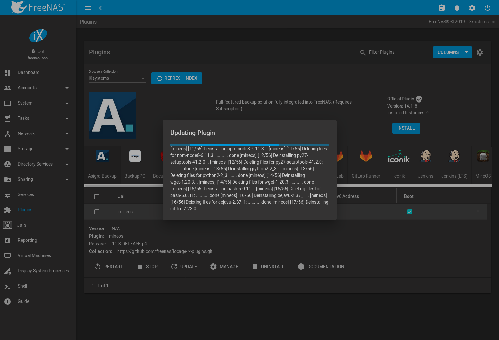

.. index:: Plugin
.. _Plugins:

Plugins
=======

.. warning:: This section describes the plugin system implemented in the
   11.2 release of %brand%. Any plugins created or installed with a
   previous version of %brand% must be managed with the
   :ref:`Legacy Web Interface`.

%brand% provides the ability to extend the built-in NAS
services by providing two methods for installing additional software.

:ref:`Plugins` allow the user to browse, install, and configure
pre-packaged software from the |web-ui|. This method is easy to use, but
provides a limited amount of available software. Each plugin is
automatically installed into its own limited
`FreeBSD jail <https://en.wikipedia.org/wiki/Freebsd_jail>`__ that
cannot install additional software.

:ref:`Jails` provide more control over software installation, but
requires working from the command line and a good understanding of
networking basics and software installation on FreeBSD-based systems.

Look through the :ref:`Plugins` and :ref:`Jails` sections to become
familiar with the features and limitations of each. Choose the method
that best meets the needs of the application.

.. note:: :ref:`Jail Storage` must be configured before plugins are
   available on %brand%. This means having a suitable
   :ref:`pool <Creating Pools>` created to store plugins.

.. _Installing Plugins:

Install
-------

A plugin is a self-contained application installer designed to
integrate into the %brand% |web-ui|. A plugin offers several advantages:

* the %brand% |web-ui| provides a browser for viewing the list of
  available plugins

* the %brand% |web-ui| provides buttons for installing, starting,
  managing, and deleting plugins

* if the plugin has configuration options, a screen will be added to
  the %brand% |web-ui| for these options to be configured

To install a plugin, click
:menuselection:`Plugins --> Available`.
:numref:`Figure %s <view_list_plugins_fig>` shows some of the available
plugins.

.. _view_list_plugins_fig:

.. figure:: images/plugins-available.png

   Viewing the List of Available Plugins

The :guilabel:`Available Plugins` page lists the plugin name,
description, current version, and whether the plugin is officially
supported.

.. note:: If the list of available plugins is not displayed, open
   :ref:`Shell` and verify that the %brand% system can :command:`ping`
   an address on the Internet. If it cannot, add a default gateway
   address and/or DNS server address in
   :menuselection:`Network --> Global Configuration`.

Click |ui-options| and :guilabel:`Install` for the desired plugin. Set
:guilabel:`DHCP` to automatically configure IP settings, or manually
enter an IPv4 or IPv6 address. Click
:guilabel:`ADVANCED PLUGIN INSTALLATION` to show all options for the
plugin jail. The options are described in :ref:`Advanced Jail Creation`.

Click :guilabel:`SAVE` when finished configuring the plugin jail.
In the example shown in :numref:`Figure %s <installing_plugin_fig>`,
Plex Media Server is selected for installation.

.. _installing_plugin_fig:

.. figure:: images/plugins-install-example.png

   Installing the Plex Plugin

The installation takes a few minutes because the system downloads and
configures a jail to store the plugin application. A confirmation
message displays at the bottom of the screen after successfully
installing a plugin. When applicable, post-install notes are displayed
after a successful install. Installed plugins appear in the
:menuselection:`Plugins --> Installed`
page as shown in :numref:`Figure %s <view_installed_plugins_fig>`.

.. note:: Plugins are also added to
   :menuselection:`Jails`
   as a *pluginv2* jail. This type of jail is editable like a
   standard jail, but the *UUID* cannot be altered.
   See :ref:`Managing Jails` for more details about modifying
   jails.

.. _view_installed_plugins_fig:

.. figure:: images/plugins-installed.png

   Viewing Installed Plugins

The entry in the
:menuselection:`Plugins --> Installed`
section displays the plugin jail name, status, IPv4 and IPv6 addresses,
plugin application version, and FreeBSD release.

The plugin must be started before the installed application is
available. Click |ui-options| and :guilabel:`Start`. The plugin
:guilabel:`Status` changes to :literal:`up` when it starts successfully.

Stop and immediately start an :literal:`up` plugin by clicking
|ui-options| and :guilabel:`Restart`.

Click |ui-options| and :guilabel:`Management` to open a management
or configuration screen for the application. For example, clicking
:guilabel:`Management` for an installed Plex plugin opens the Plex
web interface in a new browser tab.

.. note:: Not all plugins have a functional management option. See
   :ref:`Managing Jails` for more instructions about interacting with
   a plugin jail with the shell.

Always review plugin configuration options before attempting to
start it. Some plugins have options that need to be set before their
service will successfully start. To help with installing a new
application, check the website of the application to see what
documentation is available.

If the application requires access to the data stored on the %brand%
system, click the entry for the associated jail in the
:menuselection:`Jails` page and add a storage as described in
:ref:`Additional Storage`.

Click |ui-options| and :guilabel:`Shell` for the plugin jail in the
:menuselection:`Jails` page. This will give access to the shell of the
jail containing the application to complete or test the configuration.

If a plugin jail fails to start, open the plugin jail shell from the
:menuselection:`Jail` page and type :command:`tail /var/log/messages` to
see if any errors were logged.

.. _Updating Plugins:

Update
------

When a newer version of a plugin becomes available in the official
repository, update the plugin jail by navigating to the
:menuselection:`Jails` page and clicking |ui-options| and
:guilabel:`Update`.

An update is a fix for issues in the current release of the plugin.
Plugins can be updated by running :samp:`iocage update {PLUGIN}` on the
command line.

An upgrade replaces the old release with a new release. Plugins can be
upgraded by running :samp:`iocage upgrade {PLUGIN}` on the command line.

#ifdef comment
# jails/update shows nothing unless an update is available
:numref:`Figure %s <updating_installed_plugin_fig>`
shows updating a plugin jail.

.. _updating_installed_plugin_fig:

   Updating an Installed Plugin
#endif comment

.. _Deleting Plugins:

Delete
------

Installing a plugin creates an associated jail. Deleting a plugin
deletes the associated jail because it is no longer required.
**Before** deleting a plugin, make sure that there is no data
or configuration in the jail that needs to be saved. Back up
that data **first** if needed.

In the example shown in
:numref:`Figure %s <deleting_installed_plugin_fig>`,
*plex* has been installed and the :guilabel:`Delete` button has
been clicked. A pop-up message asks for verification that the plugin
is to be deleted. **This is the only warning.** The plugin and the
associated jail are permanently deleted when :guilabel:`Confirm` is
set and :guilabel:`DELETE` is clicked.

.. _deleting_installed_plugin_fig:

.. figure:: images/plugins-delete-example.png

   Deleting an Installed Plugin

.. _Creating Plugins:

Create a Plugin
---------------

If an application is not available as a plugin, it is possible to
create a new plugin for %brand% in a few steps. This requires an
existing `GitHub <https://github.com>`__ account.

**Create a new artifact repository on** `GitHub <https://github.com>`__.

Refer to :numref:`table %s <plugin-artifact-files>` for the files to add
to the artifact repository.

.. tabularcolumns:: |>{\RaggedRight}p{\dimexpr 0.33\linewidth-2\tabcolsep}
                    |>{\RaggedRight}p{\dimexpr 0.67\linewidth-2\tabcolsep}|

.. _plugin-artifact-files:

.. table:: %brand% Plugin Artifact Files
   :class: longtable

   +-------------------------+----------------------------------------------------------------------+
   | Directory/File          | Description                                                          |
   +=========================+======================================================================+
   | :file:`post_install.sh` | This script is run *inside* the jail after it is created and any     |
   |                         | packages installed. Enable services in :file:`/etc/rc.conf` that     |
   |                         | need to start with the jail and apply any configuration              |
   |                         | customizations with this this script.                                |
   |                         |                                                                      |
   +-------------------------+----------------------------------------------------------------------+
   | :file:`ui.json`         | JSON file that accepts the  key or value options. For example:       |
   |                         |                                                                      |
   |                         | :samp:`adminportal: "http://%%IP%%/"`                                |
   |                         |                                                                      |
   |                         | designates the web-interface of the plugin.                          |
   |                         |                                                                      |
   +-------------------------+----------------------------------------------------------------------+
   | :file:`overlay/`        | Directory of files overlaid on the jail after install.               |
   |                         | For example, :file:`usr/local/bin/myfile` is placed in the           |
   |                         | :file:`/usr/local/bin/myfile` location of the jail. Can be used to   |
   |                         | supply custom files and configuration data, scripts, and             |
   |                         | any other type of customized files to the plugin jail.               |
   +-------------------------+----------------------------------------------------------------------+
   | :file:`settings.json`   | JSON file that manages the settings interface of the plugin.         |
   |                         | Required fields include:                                             |
   |                         |                                                                      |
   |                         | * :samp:`"servicerestart" : "service foo restart"`                   |
   |                         |                                                                      |
   |                         | Command to run when restarting the plugin service after              |
   |                         | changing settings.                                                   |
   |                         |                                                                      |
   |                         | * :samp:`"serviceget" : "/usr/local/bin/myget"`                      |
   |                         |                                                                      |
   |                         | Command used to get values for plugin configuration.                 |
   |                         | Provided by the plugin creator. The command accepts                  |
   |                         | two arguments for key or value pair.                                 |
   |                         |                                                                      |
   |                         | * :samp:`"options" : { }`                                            |
   |                         |                                                                      |
   |                         | This subsection contains arrays of elements, starting with the "key" |
   |                         | name and required arguments for that particular type of setting.     |
   |                         |                                                                      |
   |                         | See :ref:`options subsection example <plugin-json-options>`          |
   |                         | below.                                                               |
   |                         |                                                                      |
   +-------------------------+----------------------------------------------------------------------+

This example :file:`settings.json` file is used for the
:guilabel:`Quasselcore` plugin. It is also available online in the
`iocage-plugin-quassel artifact repository
<https://github.com/freenas/iocage-plugin-quassel/blob/master/settings.json>`__.

.. The above URL will need to be changed once Quasselcore is migated
   to the new ix-plugin-hub (https://github.com/ix-plugin-hub).

.. _plugin-json-options:

.. code-block:: json

   {
	   "servicerestart":"service quasselcore restart",
	   "serviceget": "/usr/local/bin/quasselget",
	   "serviceset": "/usr/local/bin/quasselset",
	   "options": {
		   "adduser": {
			   "type": "add",
			   "name": "Add User",
			   "description": "Add new quasselcore user",
			   "requiredargs": {
				   "username": {
					   "type": "string",
					   "description": "Quassel Client Username"
				   },
				   "password": {
					   "type": "password",
					   "description": "Quassel Client Password"
				   },
				   "fullname": {
					   "type": "string",
					   "description": "Quassel Client Full Name"
				   }
			   },
			   "optionalargs": {
				   "adminuser": {
					   "type": "bool",
					   "description": "Can this user administrate quasselcore?"
				   }
			   }
		   },
		   "port": {
			   "type": "int",
			   "name": "Quassel Core Port",
			   "description": "Port for incoming quassel connections",
			   "range": "1024-32000",
			   "default": "4242",
			   "requirerestart": true
		   },
		   "sslmode": {
			   "type": "bool",
			   "name": "SSL Only",
			   "description": "Only accept SSL connections",
			   "default": true,
			   "requirerestart": true

		   },
		   "ssloption": {
			   "type": "combo",
			   "name": "SSL Options",
			   "description": "SSL Connection Options",
			   "requirerestart": true,
			   "default": "tlsallow",
			   "options": {
					   "tlsrequire": "Require TLS",
					   "tlsallow": "Allow TLS",
					   "tlsdisable": "Disable TLS"
			   }
		   },
		   "deluser": {
			   "type": "delete",
			   "name": "Delete User",
			   "description": "Remove a quasselcore user"
		   }

	   }
   }

**Create and submit a new JSON file for the plugin:**

Clone the
`ix-plugin-hub <https://github.com/ix-plugin-hub>`__
GitHub repository.

.. tip:: Full tutorials and documentation for GitHub and :command:`git`
   commands are available on
   `GitHub Guides <https://guides.github.com/>`__.

On the local copy of :file:`ix-plugin-hub`, create a new file for
the plugin to be added to %brand%. The naming convention is
:file:`pluginname.json`. For example, the :guilabel:`Transmission`
plugin has a .json file named :file:`transmission.json`.

Add fields to this .json file.
:numref:`table %s <plugins-plugin-jsonfile-contents>` lists and
describes each required entry.

.. tabularcolumns:: |>{\RaggedRight}p{\dimexpr 0.33\linewidth-2\tabcolsep}
                    |>{\RaggedRight}p{\dimexpr 0.67\linewidth-2\tabcolsep}|

.. _plugins-plugin-jsonfile-contents:

.. table:: Plugin JSON File Contents
   :class: longtable

   +------------------------------+-------------------------------------------------------------------------------+
   | Data Field                   | Description                                                                   |
   +==============================+===============================================================================+
   | :literal:`"name":`           | Name of the plugin.                                                           |
   |                              |                                                                               |
   +------------------------------+-------------------------------------------------------------------------------+
   | :literal:`"plugin_schema":`  | Optional. Enter *2* if simplified post-install information has                |
   |                              | been supplied in :file:`post_install.sh`. After specifying *2*,               |
   |                              | echo the information to be presented to the user in                           |
   |                              | :file:`/root/PLUGIN_INFO` inside the                                          |
   |                              | :file:`post_install.sh` file.                                                 |
   |                              | See the :ref:`rslsync.json <rslsync-plugin-schema>` and                       |
   |                              | :ref:`rslsync post_install.sh <rslsync-post-install>` examples.               |
   |                              |                                                                               |
   +------------------------------+-------------------------------------------------------------------------------+
   | :literal:`"release":`        | FreeBSD RELEASE to use for the plugin jail.                                   |
   |                              |                                                                               |
   +------------------------------+-------------------------------------------------------------------------------+
   | :literal:`"artifact":`       | URL of the plugin artifact repository.                                        |
   |                              |                                                                               |
   +------------------------------+-------------------------------------------------------------------------------+
   | :literal:`"pkgs":`           | The dependent pkgs for the plugin to work.                                    |
   |                              |                                                                               |
   +------------------------------+-------------------------------------------------------------------------------+
   | :literal:`"packagesite":`    | Content Delivery Network (CDN) the plugin jail uses. Default for              |
   |                              | the TrueOS CDN is :literal:`http://pkg.cdn.trueos.org/iocage`.                |
   |                              |                                                                               |
   +------------------------------+-------------------------------------------------------------------------------+
   | :literal:`"fingerprints":`   | :literal:`"function":`                                                        |
   |                              |                                                                               |
   |                              | Default is                                                                    |
   |                              | :literal:`sha256`.                                                            |
   |                              |                                                                               |
   |                              | :literal:`"fingerprint":`                                                     |
   |                              |                                                                               |
   |                              | The pkg fingerprint for the artifact repository. Default is                   |
   |                              | :literal:`226efd3a126fb86e71d60a37353d17f57af816d1c7ecad0623c21f0bf73eb0c7`   |
   |                              |                                                                               |
   +------------------------------+-------------------------------------------------------------------------------+
   | :literal:`"official":`       | Define whether this is an official iXsystems-supported plugin.                |
   |                              | Enter :literal:`true` or :literal:`false`.                                    |
   |                              |                                                                               |
   +------------------------------+-------------------------------------------------------------------------------+

.. _rslsync-plugin-schema:

.. code-block:: json
   :caption: rslsync.json
   :linenos:
   :emphasize-lines: 3

   {
     "name": "rslsync",
     "plugin_schema": "2",
     "release": "11.2-RELEASE",
     "artifact": "https://github.com/freenas/iocage-plugin-btsync.git",
     "pkgs": [
       "net-p2p/rslsync"
     ],
     "packagesite": "http://pkg.cdn.trueos.org/iocage/unstable",
     "fingerprints": {
	     "iocage-plugins": [
		     {
		     "function": "sha256",
		     "fingerprint": "226efd3a126fb86e71d60a37353d17f57af816d1c7ecad0623c21f0bf73eb0c7"
	     }
	     ]
     },
     "official": true
   }

.. _rslsync-post-install:

.. code-block:: sh
   :caption: post_install.sh
   :name: rslsync-post_install
   :linenos:
   :emphasize-lines: 9

   #!/bin/sh -x

   # Enable the service
   sysrc -f /etc/rc.conf rslsync_enable="YES"
   # Start the service
   service rslsync start 2>/dev/null

   echo "rslsync now installed" > /root/PLUGIN_INFO
   echo "foo" >> /root/PLUGIN_INFO

Here is :file:`quasselcore.json` reproduced as an example:

.. code-block:: json

   {
     "name": "Quasselcore",
     "release": "11.1-RELEASE",
     "artifact": "https://github.com/freenas/iocage-plugin-quassel.git",
     "pkgs": [
       "irc/quassel-core"
     ],
     "packagesite": "http://pkg.cdn.trueos.org/iocage",
     "fingerprints": {
             "iocage-plugins": [
                     {
                     "function": "sha256",
                     "fingerprint": "226efd3a126fb86e71d60a37353d17f57af816d1c7ecad0623c21f0bf73eb0c7"
             }
             ]
     },
     "official": true
   }

The correct directory and package name of the plugin application must be
used for the :samp:`"pkgs":` value. Find the package name and directory
by searching `FreshPorts <https://www.freshports.org/>`__ and checking
the "To install the port:" line. For example, the *Quasselcore* plugin
uses the directory and package name :file:`/irc/quassel-core`.

Now edit :file:`iocage-ix-plugins/INDEX`. Add an entry for the new
plugin that includes these fields:

* :literal:`"MANIFEST":` Add the name of the newly created
  :file:`plugin.json` file here.

* :literal:`"name":` Use the same name used within the :file:`.json`
  file.

* :literal:`"icon":` Most plugins will have a specific icon. Search the
  web and save the icon to the :file:`icons/` directory as a
  :file:`.png`. The naming convention is :file:`pluginname.png`. For
  example, the :guilabel:`Transmission` plugin has the icon file
  :file:`transmission.png`.

* :literal:`"description":` Describe the plugin in a single sentence.

* :literal:`"official":` Specify if the plugin is supported by
  iXsystems. Enter :literal:`false`.

See the
`INDEX <https://github.com/freenas/iocage-ix-plugins/blob/master/INDEX>`__
for examples of :file:`INDEX` entries.

.. The INDEX URL above will need to be updated once the INDEX file is
   migrated to the ix-plugin-hub (https://github.com/ix-plugin-hub).

**Submit the plugin**

Open a pull request for the
`ix-plugin-hub repo <https://github.com/ix-plugin-hub>`__.
Make sure the pull request contains:

* the new :file:`plugin.json` file.

* the plugin icon :file:`.png` added to the :file:`icons/` directory.

* an update to the :file:`INDEX` file with an entry for the new plugin.

* a link to the artifact repository populated with all required plugin
  files.

.. _Test a plugin:

Test a Plugin
~~~~~~~~~~~~~

.. warning:: Installing experimental plugins is not recommended for
   general use of %brand%. This feature is meant to help plugin creators
   test their work before it becomes generally available on %brand%.

Plugin pull requests are merged into the :literal:`master` branch of the
`iocage-ix-plugins <https://github.com/freenas/iocage-ix-plugins>`__
repository. These plugins are not available in the |web-ui| until they
are tested and added to a *RELEASE* branch of the repository. It is
possible to test an in-development plugin by using this
:command:`iocage` command:
:samp:`iocage fetch -P --name {PLUGIN} {IPADDRESS_PROPS} --branch 'master'`

This will install the plugin, configure it with any chosen properties,
and specifically use the :literal:`master` branch of the repository to
download the plugin.

Here is an example of downloading and configuring an experimental plugin
with the %brand%
:menuselection:`Shell`:

.. code-block:: none

   [root@freenas ~]# iocage fetch -P --name mineos ip4_addr="em0|10.231.1.37/24" --branch 'master'
   Plugin: mineos
     Official Plugin: False
     Using RELEASE: 11.2-RELEASE
     Using Branch: master
     Post-install Artifact: https://github.com/jseqaert/iocage-plugin-mineos.git
     These pkgs will be installed:
   ...

   ...
   Running post_install.sh
   Command output:
   ...

   ...
   Admin Portal:
   http://10.231.1.37:8443
   [root@freenas ~]#

This plugin appears in the
:menuselection:`Jails` and
:menuselection:`Plugins --> Installed`
screens as :literal:`mineos` and can be tested with the %brand% system.

.. _Official Plugins:

Official Plugins
----------------

:numref:`table %s <plugins-official-plugins>` lists and describes all
plugins supported by iXsystems. Adding "unofficial" plugins to %brand%
is supported by following the process outlined in
:ref:`Create a Plugin <Creating Plugins>`.

.. tabularcolumns:: |>{\RaggedRight}p{\dimexpr 0.33\linewidth-2\tabcolsep}
                    |>{\RaggedRight}p{\dimexpr 0.67\linewidth-2\tabcolsep}|

.. _plugins-official-plugins:

.. table:: Official %brand% plugins
   :class: longtable

   +-------------------------------------------------------------------------+------------------------------------------------------------------------+
   | Name                                                                    | Description                                                            |
   |                                                                         |                                                                        |
   +=========================================================================+========================================================================+
   | `BackupPC                                                               | BackupPC is a high-performance, enterprise-grade system for backing up |
   | <http://backuppc.sourceforge.net/>`__                                   | Linux, WinXX and MacOSX PCs and laptops to a server disk.              |
   |                                                                         |                                                                        |
   +-------------------------------------------------------------------------+------------------------------------------------------------------------+
   | `Bacula <https://www.baculasystems.com/>`__                             | Bacula is an open-source, enterprise-level computer backup system for  |
   |                                                                         | heterogeneous networks.                                                |
   |                                                                         |                                                                        |
   +-------------------------------------------------------------------------+------------------------------------------------------------------------+
   | `BRU Server                                                             | BRU Server™ Backup and Recovery Software by TOLIS Group, Inc.          |
   | <http://www.tolisgroup.com/client-server-cross-platform-backup.html>`__ |                                                                        |
   |                                                                         |                                                                        |
   +-------------------------------------------------------------------------+------------------------------------------------------------------------+
   | `ClamAV <https://www.clamav.net/>`__                                    | ClamAV is an open source antivirus engine for detecting trojans,       |
   |                                                                         | viruses, malware & other malicious threats.                            |
   |                                                                         |                                                                        |
   +-------------------------------------------------------------------------+------------------------------------------------------------------------+
   | `CouchPotato <https://couchpota.to/>`__                                 | CouchPotato is an automatic NZB and torrent downloader.                |
   |                                                                         |                                                                        |
   +-------------------------------------------------------------------------+------------------------------------------------------------------------+
   | `Deluge <https://deluge-torrent.org/>`__                                | Bittorrent client using Python, and libtorrent-rasterbar.              |
   |                                                                         |                                                                        |
   +-------------------------------------------------------------------------+------------------------------------------------------------------------+
   | `Emby <https://emby.media/>`__                                          | Home media server built using mono and other open source technologies. |
   |                                                                         |                                                                        |
   +-------------------------------------------------------------------------+------------------------------------------------------------------------+
   | `GitLab <https://about.gitlab.com/>`__                                  | GitLab is a fully integrated software development platform.            |
   |                                                                         |                                                                        |
   +-------------------------------------------------------------------------+------------------------------------------------------------------------+
   | `irssi <https://irssi.org/>`__                                          | Irssi is an IRC client.                                                |
   |                                                                         |                                                                        |
   +-------------------------------------------------------------------------+------------------------------------------------------------------------+
   | `Jenkins <https://jenkins.io/>`__                                       | Jenkins is a self-contained, open source automation server which can   |
   |                                                                         | be used to automate all sorts of tasks related to building, testing,   |
   |                                                                         | and delivering or deploying software.                                  |
   |                                                                         |                                                                        |
   +-------------------------------------------------------------------------+------------------------------------------------------------------------+
   | `Jenkins (LTS) <https://jenkins.io/download/lts/>`__                    | Jenkins Long-Term Support releases.                                    |
   |                                                                         |                                                                        |
   +-------------------------------------------------------------------------+------------------------------------------------------------------------+
   | `Madsonic <http://beta.madsonic.org/pages/index.jsp>`__                 | Open-source web-based media streamer and jukebox.                      |
   |                                                                         |                                                                        |
   +-------------------------------------------------------------------------+------------------------------------------------------------------------+
   | `MineOS <https://minecraft.codeemo.com/>`__                             | Self-contained Minecraft server.                                       |
   |                                                                         |                                                                        |
   +-------------------------------------------------------------------------+------------------------------------------------------------------------+
   | `Nextcloud <https://nextcloud.com/>`__                                  | Access, share and protect files, calendars, contacts, communication    |
   |                                                                         | and more at home and in the enterprise environment.                    |
   +-------------------------------------------------------------------------+------------------------------------------------------------------------+
   | `PlexMediaServer <https://www.plex.tv/>`__                              | The Plex media server system.                                          |
   |                                                                         |                                                                        |
   +-------------------------------------------------------------------------+------------------------------------------------------------------------+
   | `Plex Media Server (PlexPass) <https://www.plex.tv/plex-pass/>`__       | Premium service for Plex media server system.                          |
   |                                                                         |                                                                        |
   +-------------------------------------------------------------------------+------------------------------------------------------------------------+
   | `qBittorrent <http://qbittorrent.org/>`__                               | qBittorrent is a cross-platform client for the BitTorrent protocol     |
   |                                                                         | that is released under the GNU GPL, version 2.                         |
   |                                                                         |                                                                        |
   +-------------------------------------------------------------------------+------------------------------------------------------------------------+
   | `Quasselcore <https://quassel-irc.org/>`__                              | Quassel Core is a daemon/headless IRC client, part of Quassel, that    |
   |                                                                         | supports 24/7 connectivity. Quassel Client can also be attached to it. |
   |                                                                         |                                                                        |
   +-------------------------------------------------------------------------+------------------------------------------------------------------------+
   | `radarr <https://radarr.video/>`__                                      | A fork of Sonarr to work with movies in the style of Couchpotato.      |
   +-------------------------------------------------------------------------+------------------------------------------------------------------------+
   | `Redmine <http://www.redmine.org/>`__                                   | Flexible project management web application.                           |
   |                                                                         |                                                                        |
   +-------------------------------------------------------------------------+------------------------------------------------------------------------+
   | `Resilio Sync <https://www.resilio.com/>`__                             | Formerly known as BitTorrent Sync. Resilient, fast and scalable file   |
   |                                                                         | sync software for enterprises and individuals.                         |
   |                                                                         |                                                                        |
   +-------------------------------------------------------------------------+------------------------------------------------------------------------+
   | `Sonarr <https://sonarr.tv/>`__                                         | PVR for Usenet and BitTorrent users.                                   |
   |                                                                         |                                                                        |
   +-------------------------------------------------------------------------+------------------------------------------------------------------------+
   | `Subsonic <http://www.subsonic.org/pages/index.jsp>`__                  | Open-source web-based media streamer and jukebox.                      |
   |                                                                         |                                                                        |
   +-------------------------------------------------------------------------+------------------------------------------------------------------------+
   | `Syncthing <https://syncthing.net/>`__                                  | Personal cloud sync.                                                   |
   |                                                                         |                                                                        |
   +-------------------------------------------------------------------------+------------------------------------------------------------------------+
   | `Tarsnap <https://www.tarsnap.com/>`__                                  | Online encrypted backup service (client).                              |
   |                                                                         |                                                                        |
   +-------------------------------------------------------------------------+------------------------------------------------------------------------+
   | `Transmission <https://transmissionbt.com/>`__                          | Fast and lightweight daemon BitTorrent client.                         |
   |                                                                         |                                                                        |
   +-------------------------------------------------------------------------+------------------------------------------------------------------------+
#ifdef comment
   | `TinyTinyRSS <https://tt-rss.org/>`__                                   | Open source web-based news feed (RSS/Atom) aggregator, designed to     |
   |                                                                         | allow reading news from any location.                                  |
   |                                                                         |                                                                        |
   +-------------------------------------------------------------------------+------------------------------------------------------------------------+
#endif comment
   | `WeeChat <https://weechat.org/>`__                                      | WeeChat is a free and open-source Internet Relay Chat client, which is |
   |                                                                         | designed to be light and fast.                                         |
   |                                                                         |                                                                        |
   +-------------------------------------------------------------------------+------------------------------------------------------------------------+
   | `XMRig <https://github.com/xmrig/xmrig>`__                              | XMRig is a high performance Monero (XMR) CPU miner                     |
   |                                                                         |                                                                        |
   +-------------------------------------------------------------------------+------------------------------------------------------------------------+
   | `ZoneMinder <https://zoneminder.com/>`__                                | A full-featured, open source, state-of-the-art video surveillance      |
   |                                                                         | software system.                                                       |
   +-------------------------------------------------------------------------+------------------------------------------------------------------------+

If there are any difficulties using a plugin, refer to the official
documentation for that application.
