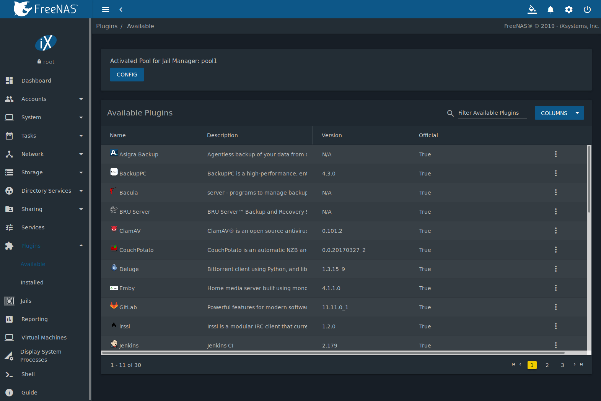
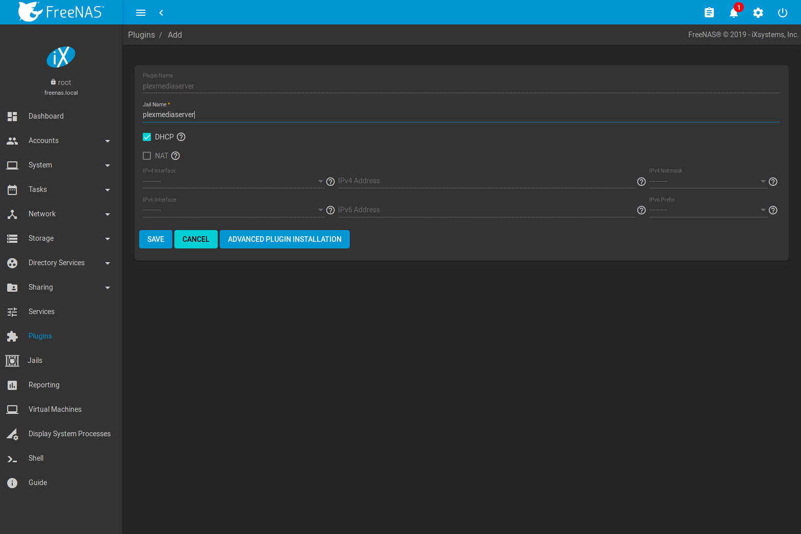
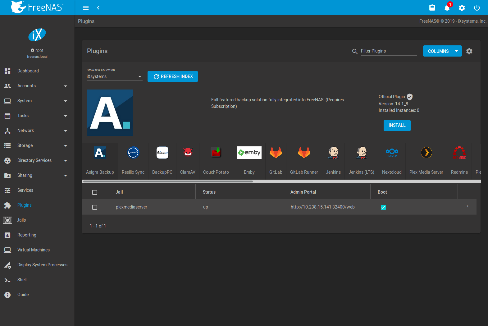
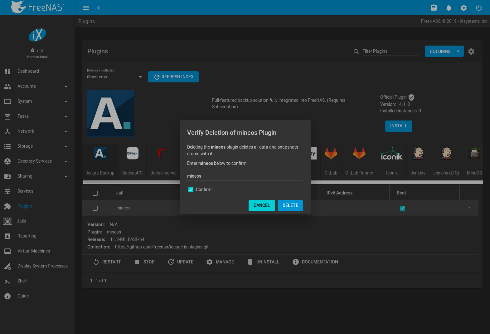

.. index:: Plugin
.. _Plugins:

Plugins
=======

%brand% 8.2.0 introduced the ability to extend the built-in NAS
services by providing a mechanism for installing additional software.
This mechanism is known as the Plugins architecture and is based on
`FreeBSD jails <https://en.wikipedia.org/wiki/Freebsd_jail>`__.
This allows the installation and configuration of additional
applications of a created jail.

%brand% 9.x simplifies this procedure by providing two methods for
software installation. The Plugins method is used to browse for,
install, and configure available software using the GUI.
This method is very easy to use, but is limited in the amount of
software that is available. Each application is automatically installed
into a jail. This method may not be suitable if running multiple
applications within the same jail is desired.

The Jails method provides much more control over software installation.
It requires working from the command line and a good understanding of
networking basics and software installation on FreeBSD-based systems.

Look through the :ref:`Plugins` and :ref:`Jails` sections to become
familiar with the features and limitations of each. Choose the best
method that meets the software needs.

.. note:: Plugins created for %brand% 9.3 or later are expected to
   work on the current release. Plugins created for earlier releases
   of %brand% must be reinstalled.

.. _Installing Plugins:

Install
-------

A plugin is a self-contained application installer designed to
integrate into the %brand% GUI. A plugin offers several advantages:

* the %brand% GUI provides a browser for viewing the list of
  available plugins

* the %brand% GUI provides buttons for installing, starting,
  managing, and deleting plugins

* if the plugin has configuration options, a screen will be added to
  the %brand% GUI for these options to be configured

To install a plugin, click
:menuselection:`Plugins --> Available`.
:numref:`Figure %s <view_list_plugins_fig>` shows some of the available
plugins.

.. _view_list_plugins_fig:

   Viewing the List of Available Plugins

.. note:: If the list of available plugins is not displayed, open
   :ref:`Shell` and verify that the %brand% system can :command:`ping`
   an address on the Internet. If it cannot, add a default gateway
   address and/or DNS server address in
   :menuselection:`Network --> Global Configuration`.

Click |ui-options| and :guilabel:`install` for the desired plugin. Set
:guilabel:`DHCP` to automatically configure IP settings, or manually
enter an IPv4 or IPv6 address. Click :guilabel:`Save`. In the example
shown in :numref:`Figure %s <installing_plugin_fig>`, Plex Media
Server is selected for installation.

.. _installing_plugin_fig:

   Installing the Plex Plugin

The installation takes a few minutes because the system
downloads and configures a jail to store the plugin application. It
then installs the plugin and adds it to the
:menuselection:`Plugins --> Installed`
page as shown in :numref:`Figure %s <view_installed_plugins_fig>`.

.. tip:: Installed plugins are also added to the
   :menuselection:`Jails`
   page. This page is also used to manage plugins.

.. _view_installed_plugins_fig:

   Viewing Installed Plugins

The entry in the
:menuselection:`Plugins --> Installed`
section displays the plugin name, boot status, state, release, IP4 and
IP6 addresses, and whether it is a template.

The plugin must be started before the installed application is
available. Click |ui-options| and :guilabel:`Start`. The plugin
:guilabel:`State` updates to *up* when it starts successfully.

Click |ui-options| and :guilabel:`Management` to open a management
or configuration screen for the application. For example, clicking
:guilabel:`Management` for an installed Plex plugin opens the Plex
web interface in a new browser tab.

.. note:: Not all plugins have a functional management option. See
   :ref:`Managing Jails` for more instructions about interacting with
   a plugin jail with the shell.

Always review plugin configuration options before attempting to
start it. Some plugins have options that need to be set before their
service will successfully start. To help with installing a new
application, check the website of the application to see what
documentation is available.

If the application requires access to the data stored on the %brand%
system, click the entry for the associated jail in the
:menuselection:`Jails` page and add a storage as described in
:ref:`Additional Storage`.

Click |ui-options| and :guilabel:`Shell` for the plugin jail in the
:menuselection:`Jails` page. This will give access to the shell of the
jail containing the application to complete or test the configuration.

If a plugin jail fails to start, open the plugin jail shell from the
:menuselection:`Jail` page and type :command:`tail /var/log/messages` to
see if any errors were logged.

.. _Updating Plugins:

Update
------

When a newer version of a plugin becomes available in the official
repository, update the plugin jail by navigating to the
:menuselection:`Jails` page and clicking |ui-options| and
:guilabel:`Update`.
#ifdef comment
# jails/update shows nothing unless an update is available
:numref:`Figure %s <updating_installed_plugin_fig>`
shows updating a plugin jail.

.. _updating_installed_plugin_fig:

.. figure:: images/plugins4.png

   Updating an Installed Plugin
#endif comment

.. _Deleting Plugins:

Delete
------

Installing a plugin creates an associated jail. Deleting a plugin
deletes the associated jail because it is no longer required.
**Before** deleting a plugin, make sure that there is no data
or configuration in the jail that needs to be saved. Back up
that data **first** if needed.

In the example shown in
:numref:`Figure %s <deleting_installed_plugin_fig>`,
Quasselcore has been installed and the :guilabel:`Delete` button has
been clicked. A pop-up message asks the user if they are sure that they
want to delete. **This is the only warning.** The plugin and the
associated jail are permanently deleted when :guilabel:`Confirm` is set
and :guilabel:`Delete` is clicked.

.. _deleting_installed_plugin_fig:

   Deleting an Installed Plugin

.. _Creating Plugins:

Create a Plugin
---------------

Create a new plugin for %brand% in a few steps:

**Create a new artifact repository on `GitHub <https://github.com>`__.**

Refer to :numref:`table %s <plugin-artifact-files>` and add these
files to the artifact repository:

.. tabularcolumns:: |>{\RaggedRight}p{\dimexpr 0.33\linewidth-2\tabcolsep}
                    |>{\RaggedRight}p{\dimexpr 0.67\linewidth-2\tabcolsep}|

.. _plugin-artifact-files:

.. table:: %brand% Plugin Artifact Files
   :class: longtable

   +-------------------------+----------------------------------------------------------------------+
   | Directory/File          | Description                                                          |
   +=========================+======================================================================+
   | :file:`post_install.sh` | This script is run *inside* the jail after it is created and any     |
   |                         | packages installed. Enable services in :file:`/etc/rc.conf` that     |
   |                         | need to start with the jail and apply any configuration              |
   |                         | customizations with this this script.                                |
   |                         |                                                                      |
   +-------------------------+----------------------------------------------------------------------+
   | :file:`ui.json`         | JSON file that accepts the  key or value options. For example:       |
   |                         |                                                                      |
   |                         | :samp:`adminportal: "http://%%IP%%/"`                                |
   |                         |                                                                      |
   |                         | designates the web-interface of the plugin.                          |
   |                         |                                                                      |
   +-------------------------+----------------------------------------------------------------------+
   | :file:`overlay/`        | Directory of files overlaid on the jail after install.               |
   |                         | For example, :file:`usr/local/bin/myfile` is placed in the           |
   |                         | :file:`/usr/local/bin/myfile` location of the jail. Can be used to   |
   |                         | supply custom files and configuration data, scripts, and             |
   |                         | any other type of customized files to the plugin jail.               |
   +-------------------------+----------------------------------------------------------------------+
   | :file:`settings.json`   | JSON file that manages the settings interface of the plugin.         |
   |                         | Required fields include:                                             |
   |                         |                                                                      |
   |                         | * :samp:`"servicerestart" : "service foo restart"`                   |
   |                         |                                                                      |
   |                         | Command to run when restarting the plugin service after              |
   |                         | changing settings.                                                   |
   |                         |                                                                      |
   |                         | * :samp:`"serviceget" : "/usr/local/bin/myget"`                      |
   |                         |                                                                      |
   |                         | Command used to get values for plugin configuration.                 |
   |                         | Provided by the plugin creator. The command accepts                  |
   |                         | two arguments for key or value pair.                                 |
   |                         |                                                                      |
   |                         | * :samp:`"options" : { }`                                            |
   |                         |                                                                      |
   |                         | This subsection contains arrays of elements, starting with the "key" |
   |                         | name and required arguments for that particular type of setting.     |
   |                         |                                                                      |
   |                         | See :ref:`options subection example <plugin-json-options>`           |
   |                         | below.                                                               |
   |                         |                                                                      |
   +-------------------------+----------------------------------------------------------------------+

This example :file:`settings.json` file is used for the
:guilabel:`Quasselcore` plugin. It is also available online in the
`iocage-plugin-quassel artifact repository
<https://github.com/freenas/iocage-plugin-quassel/blob/master/settings.json>`__.

.. _plugin-json-options:

.. code-block:: json

   {
	   "servicerestart":"service quasselcore restart",
	   "serviceget": "/usr/local/bin/quasselget",
	   "serviceset": "/usr/local/bin/quasselset",
	   "options": {
		   "adduser": {
			   "type": "add",
			   "name": "Add User",
			   "description": "Add new quasselcore user",
			   "requiredargs": {
				   "username": {
					   "type": "string",
					   "description": "Quassel Client Username"
				   },
				   "password": {
					   "type": "password",
					   "description": "Quassel Client Password"
				   },
				   "fullname": {
					   "type": "string",
					   "description": "Quassel Client Full Name"
				   }
			   },
			   "optionalargs": {
				   "adminuser": {
					   "type": "bool",
					   "description": "Can this user administrate quasselcore?"
				   }
			   }
		   },
		   "port": {
			   "type": "int",
			   "name": "Quassel Core Port",
			   "description": "Port for incoming quassel connections",
			   "range": "1024-32000",
			   "default": "4242",
			   "requirerestart": true
		   },
		   "sslmode": {
			   "type": "bool",
			   "name": "SSL Only",
			   "description": "Only accept SSL connections",
			   "default": true,
			   "requirerestart": true

		   },
		   "ssloption": {
			   "type": "combo",
			   "name": "SSL Options",
			   "description": "SSL Connection Options",
			   "requirerestart": true,
			   "default": "tlsallow",
			   "options": {
					   "tlsrequire": "Require TLS",
					   "tlsallow": "Allow TLS",
					   "tlsdisable": "Disable TLS"
			   }
		   },
		   "deluser": {
			   "type": "delete",
			   "name": "Delete User",
			   "description": "Remove a quasselcore user"
		   }

	   }
   }

**Create and submit a new JSON file for the plugin:**

Clone the
`iocage-ix-plugins <https://github.com/freenas/iocage-ix-plugins>`__
GitHub repository.

.. tip:: Full tutorials and documentation for GitHub and :command:`git`
   commands are available on
   `GitHub Guides <https://guides.github.com/>`__.

On the local copy of :file:`iocage-ix-plugins`, create a new file for
the plugin to be added to %brand%. The naming convention is
:file:`pluginname.json`. For example, the :guilabel:`Transmission`
plugin has a .json file named :file:`transmission.json`.

Add fields to this .json file.
:numref:`table %s <plugins-plugin-jsonfile-contents>` lists and
describes each required entry.

.. tabularcolumns:: |>{\RaggedRight}p{\dimexpr 0.33\linewidth-2\tabcolsep}
                    |>{\RaggedRight}p{\dimexpr 0.67\linewidth-2\tabcolsep}|

.. _plugins-plugin-jsonfile-contents:

.. table:: Plugin json File Contents
   :class: longtable

   +-------------------------+--------------------------------------------------------------------+
   | Data Field              | Description                                                        |
   +=========================+====================================================================+
   | :samp:`"name":`         | Name of the plugin.                                                |
   |                         |                                                                    |
   +-------------------------+--------------------------------------------------------------------+
   | :samp:`"release":`      | FreeBSD release to use for the plugin jail.                        |
   |                         |                                                                    |
   +-------------------------+--------------------------------------------------------------------+
   | :samp:`"artifact":`     | URL of the plugin artifact repo.                                   |
   |                         |                                                                    |
   +-------------------------+--------------------------------------------------------------------+
   | :samp:`"pkgs":`         | Port of the plugin.                                                |
   |                         |                                                                    |
   +-------------------------+--------------------------------------------------------------------+
   | :samp:`"packagesite":`  | CDN the plugin jail uses. Default for the TrueOS CDN is            |
   |                         | http://pkg.cdn.trueos.org/iocage .                                 |
   |                         |                                                                    |
   +-------------------------+--------------------------------------------------------------------+
   | :samp:`"fingerprints":` | :samp:`"function":`                                                |
   |                         |                                                                    |
   |                         | Default is *sha256*.                                               |
   |                         |                                                                    |
   |                         | :samp:`"fingerprint":`                                             |
   |                         |                                                                    |
   |                         | The pkg fingerprint for the artifact repo. Default is              |
   |                         | *226efd3a126fb86e71d60a37353d17f57af816d1c7ecad0623c21f0bf73eb0c7* |
   |                         |                                                                    |
   +-------------------------+--------------------------------------------------------------------+
   | :samp:`"official":`     | Defines if this an official iXsystems supported plugin.            |
   |                         | Enter *true* or *false*.                                           |
   |                         |                                                                    |
   +-------------------------+--------------------------------------------------------------------+

Here is :file:`quasselcore.json` reproduced as an example:

.. code-block:: json

   {
     "name": "Quasselcore",
     "release": "11.1-RELEASE",
     "artifact": "https://github.com/freenas/iocage-plugin-quassel.git",
     "pkgs": [
       "irc/quassel-core"
     ],
     "packagesite": "http://pkg.cdn.trueos.org/iocage",
     "fingerprints": {
             "iocage-plugins": [
                     {
                     "function": "sha256",
                     "fingerprint": "226efd3a126fb86e71d60a37353d17f57af816d1c7ecad0623c21f0bf73eb0c7"
             }
             ]
     },
     "official": true
   }

The correct directory and package name of the plugin application must be
used for the :samp:`"pkgs":` value. Find the package name and directory
by searching `FreshPorts <https://www.freshports.org/>`__ and checking
the "To install the port:" line. For example, the *Quasselcore* plugin
uses the directory and package name :file:`/irc/quassel-core`.

Now edit :file:`iocage-ix-plugins/INDEX`. Add an entry for the new
plugin that includes these fields:

* "MANIFEST": Add the newly created :file:`plugin.json` file here.

* "name": Use the same name from the :file:`.json` file.

* "icon": Most plugins will have a specific icon. Search the web and
  save the icon to the :file:`icons/` directory as a :file:`.png`. The
  naming convention is :file:`pluginname.png`. For example, the
  :guilabel:`Transmission` plugin has the icon file
  :file:`transmission.png`.

* "description": Add any notes about the plugin.

* "official": Specify if the plugin is supported by iXsystems. Enter
  *false*.

See the
`INDEX <https://github.com/freenas/iocage-ix-plugins/blob/master/INDEX>`__
for examples of :file:`INDEX` entries.

**Submit the plugin**

Open a pull request for the
`iocage-ix-plugins repo <https://github.com/freenas/iocage-ix-plugins>`__.
Make sure the pull request contains:

* the new :file:`plugin.json` file.

* the plugin icon :file:`.png` added to the :file:`icons/` directory.

* an update to the :file:`INDEX` file with an entry for the new plugin.

* a link to the artifact repository populated with all required plugin
  files.

.. _Official Plugins:

Official Plugins
----------------

:numref:`table %s <plugins-official-plugins>` lists and describes all
plugins supported by iXsystems. Adding "unofficial" plugins to %brand%
is supported by following the process outlined in
:ref:`Create a Plugin <Creating Plugins>`.

.. tabularcolumns:: |>{\RaggedRight}p{\dimexpr 0.33\linewidth-2\tabcolsep}
                    |>{\RaggedRight}p{\dimexpr 0.67\linewidth-2\tabcolsep}|

.. _plugins-official-plugins:

.. table:: Official %brand% plugins
   :class: longtable

   +-------------------------------------------------------------------------+------------------------------------------------------------------------+
   | Name                                                                    | Description                                                            |
   |                                                                         |                                                                        |
   +=========================================================================+========================================================================+
   | `BackupPC                                                               | BackupPC is a high-performance, enterprise-grade system for backing up |
   | <http://backuppc.sourceforge.net/>`__                                   | Linux, WinXX and MacOSX PCs and laptops to a server's disk.            |
   |                                                                         |                                                                        |
   +-------------------------------------------------------------------------+------------------------------------------------------------------------+
   | `Bacula <https://www.baculasystems.com/>`__                             | Bacula is an open-source, enterprise-level computer backup system for  |
   |                                                                         | heterogeneous networks.                                                |
   |                                                                         |                                                                        |
   +-------------------------------------------------------------------------+------------------------------------------------------------------------+
   | `BRU Server                                                             | BRU Server™ Backup and Recovery Software by TOLIS Group, Inc.          |
   | <http://www.tolisgroup.com/client-server-cross-platform-backup.html>`__ |                                                                        |
   |                                                                         |                                                                        |
   +-------------------------------------------------------------------------+------------------------------------------------------------------------+
   | `BitTorrentSync <https://www.resilio.com/>`__                           | Resilient, fast and scalable file sync software for enterprises and    |
   |                                                                         | individuals.                                                           |
   |                                                                         |                                                                        |
   +-------------------------------------------------------------------------+------------------------------------------------------------------------+
   | `ClamAV <https://www.clamav.net/>`__                                    | ClamAV® is an open source antivirus engine for detecting trojans,      |
   |                                                                         | viruses, malware & other malicious threats.                            |
   |                                                                         |                                                                        |
   +-------------------------------------------------------------------------+------------------------------------------------------------------------+
   | `CouchPotato <https://couchpota.to/>`__                                 | CouchPotato is an automatic NZB and torrent downloader.                |
   |                                                                         |                                                                        |
   +-------------------------------------------------------------------------+------------------------------------------------------------------------+
   | `Deluge <https://deluge-torrent.org/>`__                                | Bittorrent client using Python, and libtorrent-rasterbar.              |
   |                                                                         |                                                                        |
   +-------------------------------------------------------------------------+------------------------------------------------------------------------+
   | `Emby <https://emby.media/>`__                                          | Home media server built using mono and other open source technologies. |
   |                                                                         |                                                                        |
   +-------------------------------------------------------------------------+------------------------------------------------------------------------+
   | `GitLab <https://about.gitlab.com/>`__                                  | GitLab is a fully integrated software development platform.            |
   |                                                                         |                                                                        |
   +-------------------------------------------------------------------------+------------------------------------------------------------------------+
   | `irssi <https://irssi.org/>`__                                          | Irssi is an IRC client.                                                |
   |                                                                         |                                                                        |
   +-------------------------------------------------------------------------+------------------------------------------------------------------------+
   | `Jenkins <https://jenkins.io/>`__                                       | Jenkins is a self-contained, open source automation server which can   |
   |                                                                         | be used to automate all sorts of tasks related to building, testing,   |
   |                                                                         | and delivering or deploying software.                                  |
   |                                                                         |                                                                        |
   +-------------------------------------------------------------------------+------------------------------------------------------------------------+
   | `Jenkins (LTS) <https://jenkins.io/download/lts/>`__                    | Jenkins Long-Term Support releases.                                    |
   |                                                                         |                                                                        |
   +-------------------------------------------------------------------------+------------------------------------------------------------------------+
   | `Madsonic <http://beta.madsonic.org/pages/index.jsp>`__                 | Open-source web-based media streamer and jukebox.                      |
   |                                                                         |                                                                        |
   +-------------------------------------------------------------------------+------------------------------------------------------------------------+
   | `Nextcloud <https://nextcloud.com/>`__                                  | Access, share and protect files, calendars, contacts, communication &  |
   |                                                                         | more at home and in the enterprise environment.                        |
   |                                                                         |                                                                        |
   +-------------------------------------------------------------------------+------------------------------------------------------------------------+
   | `PlexMediaServer <https://www.plex.tv/>`__                              | The Plex media server system.                                          |
   |                                                                         |                                                                        |
   +-------------------------------------------------------------------------+------------------------------------------------------------------------+
   | `Plex Media Server (PlexPass) <https://www.plex.tv/plex-pass/>`__       | Premium service for Plex media server system.                          |
   |                                                                         |                                                                        |
   +-------------------------------------------------------------------------+------------------------------------------------------------------------+
   | `qBittorrent <http://qbittorrent.org/>`__                               | qBittorrent is a cross-platform client for the BitTorrent protocol     |
   |                                                                         | that is released under the GNU GPL, version 2.                         |
   |                                                                         |                                                                        |
   +-------------------------------------------------------------------------+------------------------------------------------------------------------+
   | `Quasselcore <https://quassel-irc.org/>`__                              | Quassel Core is a daemon/headless IRC client, part of Quassel, that    |
   |                                                                         | supports 24/7 connectivity. Quassel Client can also be attached to it. |
   |                                                                         |                                                                        |
   +-------------------------------------------------------------------------+------------------------------------------------------------------------+
   | `SickRage <https://github.com/SiCKRAGETV/SickRage>`__                   | Automatic Video Library Manager for TV Shows.                          |
   |                                                                         |                                                                        |
   +-------------------------------------------------------------------------+------------------------------------------------------------------------+
   | `Sonarr <https://sonarr.tv/>`__                                         | PVR for Usenet and BitTorrent users.                                   |
   |                                                                         |                                                                        |
   +-------------------------------------------------------------------------+------------------------------------------------------------------------+
   | `Subsonic <http://www.subsonic.org/pages/index.jsp>`__                  | Open-source web-based media streamer and jukebox.                      |
   |                                                                         |                                                                        |
   +-------------------------------------------------------------------------+------------------------------------------------------------------------+
   | `Syncthing <https://syncthing.net/>`__                                  | Personal cloud sync.                                                   |
   |                                                                         |                                                                        |
   +-------------------------------------------------------------------------+------------------------------------------------------------------------+
   | `Tarsnap <https://www.tarsnap.com/>`__                                  | Online encrypted backup service (client).                              |
   |                                                                         |                                                                        |
   +-------------------------------------------------------------------------+------------------------------------------------------------------------+
   | `Transmission <https://transmissionbt.com/>`__                          | Fast and lightweight daemon BitTorrent client.                         |
   |                                                                         |                                                                        |
   +-------------------------------------------------------------------------+------------------------------------------------------------------------+
   | `TinyTinyRSS <https://tt-rss.org/>`__                                   | Open source web-based news feed (RSS/Atom) aggregator, designed to     |
   |                                                                         | allow reading news from any location.                                  |
   |                                                                         |                                                                        |
   +-------------------------------------------------------------------------+------------------------------------------------------------------------+
   | `WeeChat <weechat.org/>`__                                              | WeeChat is a free and open-source Internet Relay Chat client, which is |
   |                                                                         | designed to be light and fast.                                         |
   |                                                                         |                                                                        |
   +-------------------------------------------------------------------------+------------------------------------------------------------------------+
   | `XMRig <https://github.com/xmrig/xmrig>`__                              | XMRig is a high performance Monero (XMR) CPU miner                     |
   |                                                                         |                                                                        |
   +-------------------------------------------------------------------------+------------------------------------------------------------------------+

If there are any difficulties using a plugin application, refer to the
application documentation.
