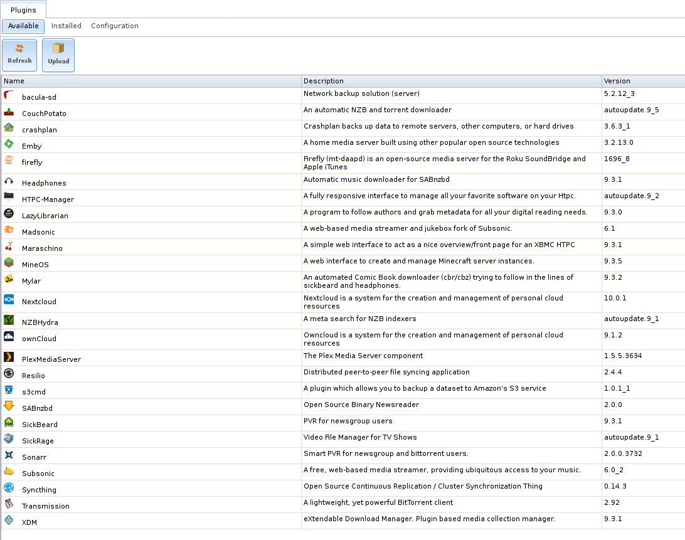

.. index:: Plugin
.. _Plugins:

Plugins
=======

%brand% 8.2.0 introduced the ability to extend the built-in NAS
services by providing a mechanism for installing additional software.
This mechanism is known as the Plugins architecture and is based on
`FreeBSD jails <https://en.wikipedia.org/wiki/Freebsd_jail>`__.
This allows the installation and configuration of additional
applications of a created jail.

%brand% 9.x simplifies this procedure by providing two methods for
software installation. The Plugins method is used to browse for,
install, and configure available software using the GUI.
This method is very easy to use, but is limited in the amount of
software that is available. Each application is automatically installed
into a jail. This method may not be suitable if running multiple
applications within the same jail is desired.

The Jails method provides much more control over software installation.
It requires working from the command line and a good understanding of
networking basics and software  installation on FreeBSD-based systems.

Look through the :ref:`Plugins` and :ref:`Jails` sections to become
familiar with the features and limitations of each. Choose the
best method that meets the software needs.

.. note:: Plugins created for %brand% 9.3 or later are expected to
   work on the current release. Plugins created for earlier releases
   of %brand% must be reinstalled.

.. _Installing Plugins:

Installing
----------

A plugin is a self-contained application installer designed to
integrate into the %brand% GUI. A plugin offers several advantages:

* the %brand% GUI provides a browser for viewing the list of
  available plugins

* the %brand% GUI provides buttons for installing, starting,
  managing, and deleting plugins

* if the plugin has configuration options, a screen will be added to
  the %brand% GUI for these options to be configured

To install a plugin, click
:menuselection:`Plugins --> Available`.
As seen in :numref:`Figure %s <view_list_plugins_fig>`. The list of
available plugins is displayed.

.. _view_list_plugins_fig:

   Viewing the List of Available Plugins

.. note:: If the list of available plugins is not displayed, open
   :ref:`Shell` and verify that the %brand% system can :command:`ping`
   an address on the Internet. If it cannot, add a default gateway
   address and/or DNS server address in
   :menuselection:`Network --> Global Configuration`.

CLick the
:menuselection:`menu icon --> install`.
Check the :guilabel:`dhcp` checkbox to automatically configure IP
settings, or manually enter the IPv4 or IPv6 addresses. Click
:guilabel:`Save`. In the example shown in
:numref:`Figure %s <installing_plugin_fig>`, Plex Media Server is
selected for installation.

.. Have the screenshot showing the menu icon dropdown with "install"
   highlighted. Perhaps add another screenshot showing the network
   form that appears after clicking install.

.. _installing_plugin_fig:

.. figure:: images/plugins2.png

   Installing a Plugin

The installation takes a few minutes because the system
downloads and configures a jail to contain the installed software. It
then installs the plugin and adds it to the
:menuselection:`Plugins --> Installed`
section as shown in :numref:`Figure %s <view_installed_plugins_fig>`.

.. _view_installed_plugins_fig:

.. figure:: images/plugins3a.png

   Viewing Installed PBIs

The entry in the
:menuselection:`Plugins --> Installed`
section displays the
plugin name, boot status, state, release, IP4 and IP6 addresses, and if
it is a template.

.. note:: The :guilabel:`Service status` of a plugin must be turned to
   :guilabel:`ON` before the installed application is available.
   Before starting the service, check to see if it has a configuration
   menu by clicking its entry in the :guilabel:`Plugins` section of
   the tree. If the application is configurable, this will open a
   screen that contains the available configuration options. Plugins
   which are not configurable will instead display a message with a
   hyperlink for accessing the software. However, that hyperlink does
   **not** work until the plugin is started.

Always review plugin configuration options before attempting to
start it. Some plugins have options that need to be set before their
service will successfully start. To help with installing a new
application, check the website of the application to see what
documentation is available. A link to the website for each available
plugin is found in :ref:`Available Plugins`.

If the application requires access to the data stored on the %brand%
system, click the entry for the associated jail in the
:guilabel:`Jails` section of the tree and add a storage as described
in :ref:`Add Storage`.

Click the entry for the associated jail in the :guilabel:`Jails`
section of the tree. This will give access to the shell of the jail
containing the application to complete or test the configuration.
Then, click the "shell" icon as described in :ref:`Managing Jails`.

Once the configuration is complete, click the red :guilabel:`OFF`
button for the entry for the plugin. If the service starts
successfully, it will change to a blue :guilabel:`ON`. If it fails to
start, click the jail's :guilabel:`Shell` icon and type
:command:`tail /var/log/messages` to see if any errors were logged.

.. _Updating Plugins:

Updating
--------

When a newer version of a plugin becomes available in the official
repository, an :guilabel:`Update` button is added to the entry for the
plugin in the :guilabel:`Installed` tab. In the example shown in
:numref:`Figure %s <updating_installed_plugin_fig>`,
a newer version of Transmission is available.

.. _updating_installed_plugin_fig:

.. figure:: images/plugins4.png

   Updating an Installed Plugin

Click the :guilabel:`OK` button to start the download and installation
of the latest version of the plugin. Once the update is complete, the
entry for the plugin will be refreshed to show the new version number
and the :guilabel:`Update` button will disappear.

.. _Uploading Plugins:

Uploading
---------

The :guilabel:`Available` tab of :guilabel:`Plugins` contains an
:guilabel:`Upload` button. This button allows installation of plugins
that are not yet available in the official repository or which are
still being tested. These plugins must be manually downloaded and
end in a :file:`.pbi` extension. When downloading a plugin,
make sure that it is 64-bit and that it was developed for 9.x. as 8.x
and 10.x applications will not work on a 9.x %brand% system.

Click the :guilabel:`Upload` button to upload the new plugin. The
example in :numref:`Figure %s <install_pbi_plugin_fig>` shows how to
browse to the location of the plugin file. Select the file and click
:guilabel:`Upload` to begin the installation.

.. _install_pbi_plugin_fig:

.. figure:: images/plugins5.png

   Installing a Previously Downloaded *.pbi File*

When the installation is complete, an entry for the plugin will be
added to the :guilabel:`Installed` tab and its associated jail is
listed under :guilabel:`Jails`. However, if it is not a %brand%
plugin, it will not be added to :guilabel:`Plugins` in the tree. In
this case, any required jail configuration must be done from the
command line of the jail's shell instead of from the GUI.

.. _Deleting Plugins:

Deleting
--------

Installing a plugin creates an associated jail. Deleting a plugin
deletes the associated jail because it is no longer required.
**Before** deleting a plugin, make sure that there is no data
or configuration in the jail that needs to be saved. Back up
that data **first** if needed.

In the example shown in
:numref:`Figure %s <deleting_installed_plugin_fig>`,
Sabnzbd has been installed and the :guilabel:`Delete` button has been
clicked. A pop-up message asks the user if they are sure that they want
to delete. **This is the only warning.** The plugin and the associated
jail are permanently deleted when :guilabel:`Yes` is clicked.

.. _deleting_installed_plugin_fig:

.. figure:: images/plugins6.png

   Deleting an Installed Plugin

.. _Creating Plugins:

Creating
--------

Create a plugin for FreeNAS\ :sup:`®` by follwing these steps:

* create an artifact repo

The correct port must be used. Find the correct port by searching for
the plugin at `<https://www.freshports.org/>`__ .

Refer to :numref:`table %s <Artifact Files>` and add the necessary files
to the artifact repo.

.. _Artifact Files:

.. table:: Artifact Files
   :class: longtable

   +-------------------------+----------------------------------------------------------------------+
   | File                    | Description                                                          |
   +=========================+======================================================================+
   | :file:`post_install.sh` | This script is run *inside* the jail after                           |
   |                         | it has been created and packages installed.                          |
   |                         | Enable services in /etc/rc.conf that need to start                   |
   |                         | with the jail startup, apply configuration settings,                 |
   |                         | and more.                                                            |
   +-------------------------+----------------------------------------------------------------------+
   | :file:`ui.json`         | JSON file that accepts the  key or value options:                    |
   |                         |                                                                      |
   |                         | :samp:`adminportal: "http://%%IP%%/"`                                |
   |                         |                                                                      |
   |                         | The web-interface of the plugin for control and                      |
   |                         | configuration .                                                      |
   +-------------------------+----------------------------------------------------------------------+
   | :file:`overlay/`        | Directory of files overlaid on the jail after install.               |
   |                         | For example, :file:`usr/local/bin/myfile` is placed in the           |
   |                         | /usr/local/bin/myfile locationof the jail. Can be used to            |
   |                         | supply custom files and configuration data, scripts, and             |
   |                         | any other type of customized files.                                  |
   +-------------------------+----------------------------------------------------------------------+
   | :file:`settings.json`   | JSON file that manages the settings interface of the plugin.         |
   |                         | The required fields include:                                         |
   |                         |                                                                      |
   |                         | * :samp:`"servicerestart" : "service plexmediaserver restart"`       |
   |                         |                                                                      |
   |                         | Command to run when restarting the plugin service after              |
   |                         | changing settings.                                                   |
   |                         |                                                                      |
   |                         | * :samp:`"serviceget" : "/usr/local/bin/myget"`                      |
   |                         |                                                                      |
   |                         | Command used to get values for plugin configuration.                 |
   |                         | Provided by the plugin creator. The command accpets                  |
   |                         | two arguments for key or value pair.                                 |
   |                         |                                                                      |
   |                         | * :samp:`"options" : { }`                                            |
   |                         |                                                                      |
   |                         | This subsection contains arrays of elements, starting with the "key" |
   |                         | name and required arguments for that particular type of setting.     |
   |                         |                                                                      |
   |                         | See :ref:`options subection example <plugin-json-options>`           |
   |                         | below.                                                               |
   |                         |                                                                      |
   +-------------------------+----------------------------------------------------------------------+

.. _plugin-json-options:

.. code-block:: none

   "options": {
			"adduser": {
				"type": "add",
				"name": "Add User",
				"description": "Add new quasselcore user",
				"requiredargs": {
					"username": {
						"type": "string",
						"description": Quassel Client Username",
						},
						"password": {
							"type": "password",
							"description": "Quassel Client Password",
						},
						"fullname": {
							"type": "string",
							"description": "Quassel Client Full Name",
						}
				},
				"optionalargs": {
						"adminuser": {
							"type": "bool",
							"description": "Can this user administrate quasselcore?",
						}
				}
			},
			"port": {
				"type": "int",
				"name": "Quassel Core Port",
				"description": "Port for incoming quassel connections",
				"range": "1024-32000",
				"default": "4242",
				"requirerestart": true,
			},
			"sslmode": {
				"type": "combo",
				"name": "SSL Options",
				"description": "SSL Connection Options",
				"requirerestart": true,
				"default": "tlsallow",
				"options": {
							"tlsrequire": "Require TLS",
							"tlsallow": "Allow TLS",
							"tlsdisable": "Disable TLS",
				}
			},
			"deluser": {
				"type": "delete",
				"name": "Delete User",
				"description": "Remove a quasselcore user",
			}
   }

Refer to the quassel
`artifact repo <https://github.com/freenas/iocage-plugin-quassel>`__
for an example.

* create the JSON file for the plugin

The naming convention is :file:`{pluginname}.json`. For example, a
json file for the plugin transmission has the name
:file:`transmission.json`. Refer to :numref:`table %s <json contents>`
for the data fields and a description of each.

.. _json contents:

.. table:: Json File Contents
   :class: longtable

   +-------------------------+------------------------------------------------------------------+
   | Data Field              | Description                                                      |
   +=========================+==================================================================+
   | :samp:`"name":`         | Name of the plugin.                                              |
   +-------------------------+------------------------------------------------------------------+
   | :samp:`"release":`      | Release used for the plugin.                                     |
   +-------------------------+------------------------------------------------------------------+
   | :samp:`"artifact":`     | URL of the artifact repo                                         |
   +-------------------------+------------------------------------------------------------------+
   | :samp:`"pkgs":`         | Port of the plugin                                               |
   +-------------------------+------------------------------------------------------------------+
   | :samp:`"packagesite":`  | CDN the plugins use. Default                                     |
   |                         | for the TrueOS CDN is                                            |
   |                         | `<http://pkg.cdn.trueos.org/iocage>`__.                          |
   +-------------------------+------------------------------------------------------------------+
   | :samp:`"fingerprints":` | :samp:`"function":`                                              |
   |                         |                                                                  |
   |                         | Default is *sha256*.                                             |
   |                         |                                                                  |
   |                         | :samp:`"fingerprint":`                                           |
   |                         |                                                                  |
   |                         | The pkg fingerprint for the artifact repo.                       |
   |                         | Default is                                                       |
   |                         | 226efd3a126fb86e71d60a37353d17f57af816d1c7ecad0623c21f0bf73eb0c7 |
   +-------------------------+------------------------------------------------------------------+

Update the :file:`INDEX` file when adding a new JSON file. Refer to the
`INDEX <https://github.com/freenas/iocage-ix-plugins/blob/master/INDEX>`__
file as an example.

* save the icon for the plugin

Most plugins will have a specific icon. Search the web and save the icon
as a png file. The naming convention for the png file is
:file:`{pluginname}.png`. For example, the plugin transmisison has the
icon file :file:`transmission.png`.

* submit a pull request

Lastly, submit a pull request to the
`iocage-ix-plugins repo <https://github.com/freenas/iocage-ix-plugins>`__.
Make sure the pull request contains:

* the new JSON file created

* the addition of an icon to the :file:`icons` directory

* an update to the :file:`INDEX` file with an entry for the new plugin.

* a link to the artifact repository with the built form of the plugin.

.. _Available Plugins:

Available Plugins
-----------------

These plugins are available for %brand% |release|:

* `bacula-sd (storage daemon) <http://bacula.org/>`_

* `CouchPotato <https://couchpota.to/>`_

* `crashplan <http://www.code42.com/crashplan/>`_

* `Emby <http://emby.media/>`_

* `firefly <https://en.wikipedia.org/wiki/Firefly_Media_Server>`_

* `Headphones <https://github.com/rembo10/headphones>`_

* `HTPC-Manager <http://htpc.io/>`_

* `LazyLibrarian <https://github.com/lazylibrarian/LazyLibrarian>`_

* `Madsonic <http://madsonic.org/>`_

* `Maraschino <http://www.maraschinoproject.com/>`_

* `MineOS <http://minecraft.codeemo.com/>`_

* `Mylar <https://github.com/evilhero/mylar>`_

* `Nextcloud <https://nextcloud.com/>`_

* `NZBHydra <https://github.com/theotherp/nzbhydra>`_

* `ownCloud <https://owncloud.org/>`_

* `PlexMediaServer <https://plex.tv/>`_

* `Resilio <https://www.resilio.com/>`_

* `s3cmd <http://s3tools.org/s3cmd>`_

* `SABnzbd <http://sabnzbd.org/>`_

* `SickBeard <http://sickbeard.com/>`_

* `SickRage <https://github.com/SiCKRAGETV/SickRage>`_

* `Sonarr <https://sonarr.tv/>`_

* `Subsonic <http://www.subsonic.org/pages/index.jsp>`_

* `Syncthing <https://syncthing.net/>`_

* `Transmission <http://www.transmissionbt.com/>`_

* `XDM <https://github.com/lad1337/XDM>`_

* `XMRig <https://github.com/xmrig/xmrig>`_

The %brand% Plugins system makes it simple to install software.
However, refer to the documentation for that application if there are
troubles.
