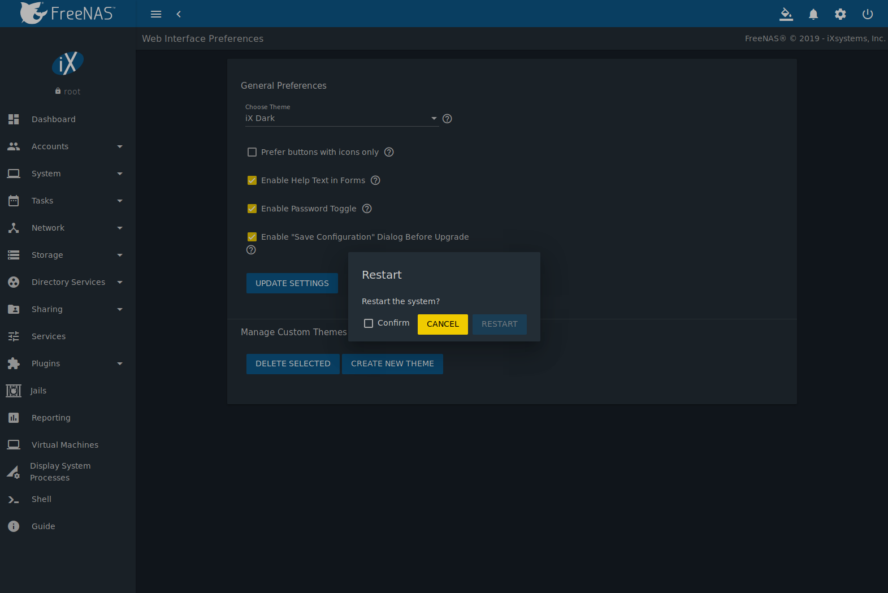

.. index:: Log Out, Restart, or Shut Down
.. _Log Out, Restart, or Shut Down:

Log Out, Restart, or Shut Down
==============================

The |ui-power| button is used to log out of the web interface or
restart or shut down the %brand% system.

.. index:: Log Out
.. _Log Out:

Log Out
-------

To log out, click |ui-power|, then :guilabel:`Log Out`. After logging
out, the login screen is displayed.

.. index:: Restart
.. _Restart:

Restart
-------

To restart the system, click |ui-power|, then :guilabel:`Restart`.
A confirmation screen asks for verification of the restart.
:numref:`Figure %s <restart_warning_fig>`.
Click :guilabel:`Confirm` to confirm the action, then click
:guilabel:`RESTART` to restart the system.

.. _restart_warning_fig:

  Restart Warning Message

An additional warning message appears when a restart is attempted when
a scrub or resilver is in progress. When that warning appears, the
recommended steps are to :guilabel:`Cancel` the restart request and to
periodically run :command:`zpool status` from :ref:`Shell` until it
shows that the scrub or verify has completed. Then the restart request
can be entered again.

To complete the restart request, click the :guilabel:`Confirm`
checkbox and then the :guilabel:`Ok` button. Restarting the system
disconnects all clients, including the web administration interface.
Wait a few minutes for the system to boot, then use the back button in
the browser to return to the IP address of the %brand% system. The
login screen appears after a successful reboot. If the login screen
does not appear, using a monitor and keyboard to physically access the
%brand% system is required to determine the issue preventing the
system from resuming normal operation.

.. index:: Shutdown
.. _Shutdown:

Shut Down
---------

Click |ui-power| and :guilabel:`Shut Down` to shut down the system.
The warning message shown in
:numref:`Figure %s <shutdown_warning_fig>` is displayed.

.. _shutdown_warning_fig:

.. figure:: images/power-shut-down.png

   Shut Down Warning Message

Click :guilabel:`Confirm` and then :guilabel:`SHUT DOWN` to shut
down the system. Shutting down the system disconnects all clients,
including the web administration GUI. Physical access to the %brand%
system is required to turn it back on.
