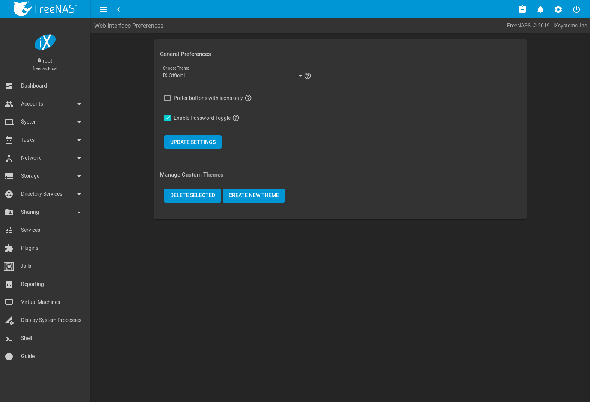
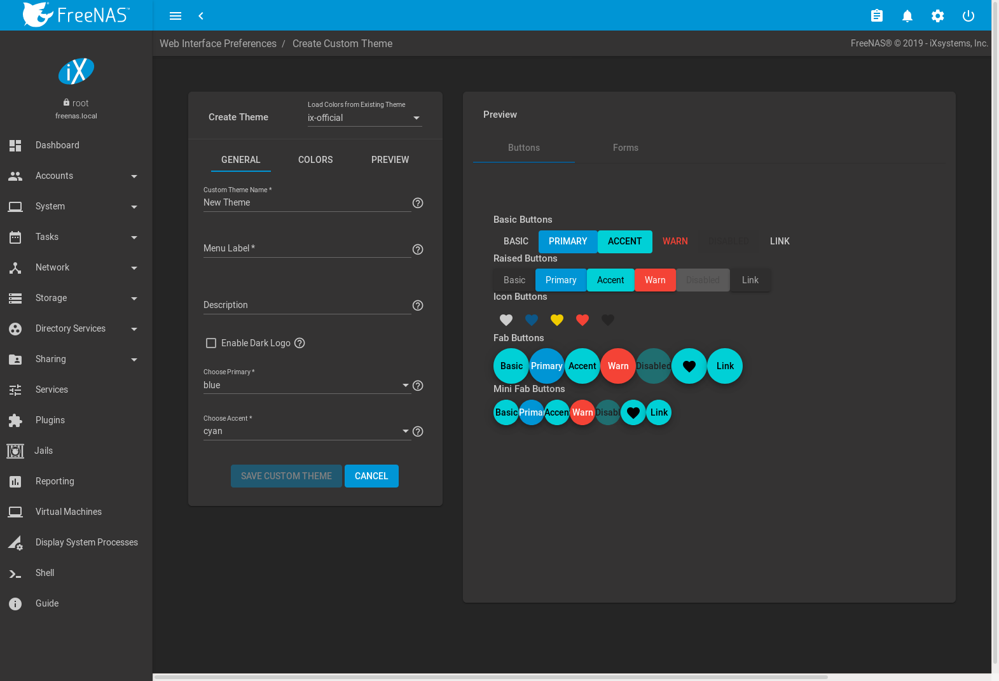

.. _Preferences:

Preferences
===========

The %brand% User Interface can be adjusted to match the user
preferences. Go to the :guilabel:`Web Interface Preferences` page by
clicking the |ui-settings| menu in the upper-right and clicking
:guilabel:`Preferences`.

.. index:: User Interface Preferences
.. _User Interface Preferences:

User Interface Preferences
--------------------------

This page has options to adjust global settings in the |web-ui|, manage
customthemes, and create new themes.
:numref:`Figure %s <ui_preferences_fig>` shows the different options:

.. _ui_preferences_fig:

   User Interface Preferences

These options are applied to the entire |web-ui|:

:guilabel:`Choose Theme`: Change the active theme. Custom themes are
added to this list.

:guilabel:`View Type Preference` selects the default view for many of
the overview pages in the |web-ui|. Choose *Cards* to display each
item on a page in a self-contained "card". *Tables* condenses each
item into a simplified table. *Auto* dynamically adjusts the view
according to the number of items visible on the specific page.

:guilabel:`Enable Helpful Tooltips in Forms`: Set to add viewable help
text to each form in the |web-ui|. Unset to hide all help text icons.

Make any changes and click :guilabel:`Update Settings` to save the new
selections.

.. _Themes:

Themes
------

The %brand% |web-ui| supports dynamically changing the active theme and
creating new, fully customizable themes.

.. index:: Change Theme
.. _Theme Selector:

Theme Selector
~~~~~~~~~~~~~~

Quickly change the active theme by using the theme selector. Look for
the paint bucket icon in the upper-right corner of the |web-ui|. Click the
icon to see a list of different default and favorite themes.
:numref:`Figure %s <themes_select_fig>` shows an example:

.. _themes_select_fig:

.. figure:: images/themes-selector.png

   Changing the %brand% |web-ui| theme

Click a theme to activate it.

Select :guilabel:`Manage Themes` to open the
:guilabel:`User Preferences` page. The :guilabel:`Manage Custom Themes`
column displays any created custom themes. Delete these themes by
setting the options and clicking :guilabel:`Delete Selected`.

Click :guilabel:`Create New Theme` to go to the
:guilabel:`Create Custom Theme` page.

.. index:: Create New Themes
.. _Create New Themes:

Create New Themes
~~~~~~~~~~~~~~~~~

This page is used to create and preview custom %brand% themes.
:numref:`Figure %s <theme_custom_fig>` shows many of the theming and
preview options:

.. _theme_custom_fig:

   Create and Preview a Custom Theme

Select an existing theme from the :guilabel:`Load Colors from Theme`
drop-down menu in the upper-right to use the colors from that theme as
the starting values for the new custom theme.
:numref:`Table %s <custom_theme__general_options_table>` describes each
option:

.. tabularcolumns:: |>{\RaggedRight}p{\dimexpr 0.20\linewidth-2\tabcolsep}
                    |>{\RaggedRight}p{\dimexpr 0.11\linewidth-2\tabcolsep}
                    |>{\RaggedRight}p{\dimexpr 0.68\linewidth-2\tabcolsep}|

.. _custom_theme__general_options_table:

.. table:: General Options for a New Theme
   :class: longtable

   +-------------------+-----------+------------------------------------------------------------------------------------------+
   | Setting           | Value     | Description                                                                              |
   |                   |           |                                                                                          |
   +===================+===========+==========================================================================================+
   | Custom Theme Name | string    | Enter a name to identify the new theme.                                                  |
   |                   |           |                                                                                          |
   +-------------------+-----------+------------------------------------------------------------------------------------------+
   | Menu Label        | string    | Enter a short name to use for the %brand% menus.                                         |
   |                   |           |                                                                                          |
   +-------------------+-----------+------------------------------------------------------------------------------------------+
   | Menu Swatch       | drop-down | Choose a color from the theme to display next to the menu entry of the custom theme.     |
   |                   | menu      |                                                                                          |
   +-------------------+-----------+------------------------------------------------------------------------------------------+
   | Description       | string    | Enter a short description of the new theme.                                              |
   |                   |           |                                                                                          |
   +-------------------+-----------+------------------------------------------------------------------------------------------+
   | Add to Favorites  | checkbox  | Set to add this theme to the :ref:`Theme Selector`.                                      |
   |                   |           |                                                                                          |
   +-------------------+-----------+------------------------------------------------------------------------------------------+
   | Enable Dark Logo  | checkbox  | Set this to give the FreeNAS Logo a dark fill color.                                     |
   |                   |           |                                                                                          |
   +-------------------+-----------+------------------------------------------------------------------------------------------+
   | Choose Primary    | drop-down | Choose from either a generic color or import a specific color setting to use as the      |
   |                   | menu      | primary theme color. The primary color changes the top bar of the |web-ui|               |
   |                   |           | and the color of many of the buttons.                                                    |
   |                   |           |                                                                                          |
   +-------------------+-----------+------------------------------------------------------------------------------------------+
   | Choose Accent     | drop-down | Choose from either a generic color or import a specific color setting to use as the      |
   |                   | menu      | accent color for the theme. This color is used for many of the buttons and smaller       |
   |                   |           | elements in the |web-ui|.                                                                |
   |                   |           |                                                                                          |
   +-------------------+-----------+------------------------------------------------------------------------------------------+

Choose the different :guilabel:`Colors` for this new theme after setting
these general options. Click the color swatch to open a small popup with
sliders to adjust the color. Color values can also be entered as a
hexadecimal value.

Changing any color value automatically updates the
:guilabel:`Theme Preview` column. This section is completely interactive
and shows how the custom theme is applied to all the different elements
in the |web-ui|.

Click :guilabel:`Save Custom Theme` when finished with all the
:guilabel:`General` and :guilabel:`Colors` options. The new theme will
be immediately added to the list of available themes in
:guilabel:`User Preferences`.

Click :guilabel:`Global Preview` to apply the unsaved custom theme to
the current session of the %brand% |web-ui|. Activating
:guilabel:`Global Preview` allows going to other pages in the |web-ui|
and live testing the new custom theme.

.. note:: Setting a custom theme as a :guilabel:`Global Preview` does
   **not** save that theme! Be sure to go back to
   :menuselection:`Preferences --> Create Custom Theme`
   , complete any remaining options, and click
   :guilabel:`Save Custom Theme` to save the current settings as a new
   theme.
