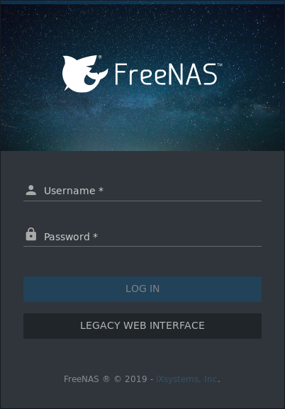
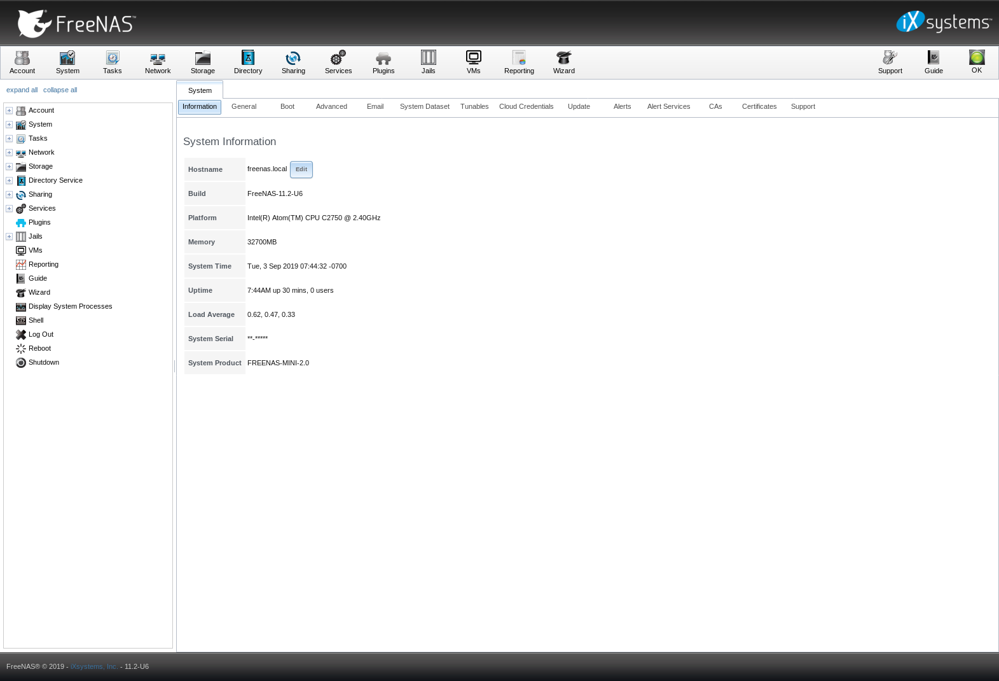

.. _Booting:

Booting
-------

#include snippets/console_menu.rst

.. _Obtaining_an_IP_Address:

Obtaining an IP Address
^^^^^^^^^^^^^^^^^^^^^^^

During boot, %brand% automatically attempts to connect to a DHCP
server from all live network interfaces. If it successfully receives
an IP address, the address is displayed so it can be used to access
the graphical user interface. The example in
:numref:`Figure %s <console_setup_menu_fig>` shows a
%brand% system that is accessible at *http://192.168.1.119*.

Some %brand% systems are set up without a monitor, making it
challenging to determine which IP address has been assigned. On
networks that support Multicast DNS (mDNS), the hostname and domain
can be entered into the address bar of a browser. By default, this
value is *freenas.local*.

If the %brand% server is not connected to a network with a DHCP
server, use the console network configuration menu to manually
configure the interface as shown here. In this example, the %brand%
system has one network interface, *em0*.

.. code-block:: none

   Enter an option from 1-12: 1
   1) em0
   Select an interface (q to quit): 1
   Reset network configuration (y/n) n
   Configure interface for DHCP? (y/n) n
   Configure IPv4? (y/n) y
   Interface name:     (press enter, the name can be blank)
   Several input formats are supported
   Example 1 CIDR Notation:
       192.168.1.1/24
   Example 2 IP and Netmask separate:
       IP: 192.168.1.1
       Netmask: 255.255.255.0, or /24 or 24
   IPv4 Address: 192.168.1.108/24
   Saving interface configuration: Ok
   Configure IPv6? (y/n) n
   Restarting network: ok

   ...

   The web user interface is at
   http://192.168.1.108

After the system has an IP address, enter that address into a
graphical web browser from a computer connected to the same network as
the %brand% system.

.. _Logging_In:

Logging In
^^^^^^^^^^

By default, the login screen shown in
:numref:`Figure %s <quick_enter_root_pass_fig>` prompts to log into the
new UI.

.. _quick_enter_root_pass_fig:

   Enter the Root Password

To instead log into the legacy UI, click the :guilabel:`Legacy UI` link.

Enter the password for the root user that was chosen during the
installation. The administrative GUI for the legacy UI is displayed as
shown in :numref:`Figure %s <quick_graphic_config_menu_fig>`.

.. _quick_graphic_config_menu_fig:

   %brand% Graphical Configuration Menu

.. note:: The rest of this Guide describes the legacy UI. To access the
   Guide for the new UI, log into the new UI and click :guilabel:`Guide`
   or access it online at doc.freenas.org/11.2/freenas.html.

If the %brand% system does not respond to the IP address or mDNS name
entered in a browser:

* If proxy settings are enabled in the browser configuration, disable
  them and try connecting again.

* If the page does not load, check whether the %brand% system's IP
  address responds to a :command:`ping` from another computer on the
  same network. If the %brand% IP address is in a private IP address
  range, it can only be accessed from within that private network.

* If the user interface loads but is unresponsive or seems to be
  missing menu items, try a different web browser. IE9 has known
  issues and does not display the graphical administrative interface
  correctly if compatibility mode is turned on.
  `Firefox <https://www.mozilla.org/en-US/firefox/all/>`__ is
  recommended.

* If :guilabel:`An error occurred!` messages are shown when attempting
  to configure an item in the GUI, make sure that the browser is set
  to allow cookies from the %brand% system.

This `blog post
<http://fortysomethinggeek.blogspot.com/2012/10/ipad-iphone-connect-with-freenas-or-any.html>`__
describes some applications which can be used to access the %brand%
system from an iPad or iPhone.

Initial Configuration
^^^^^^^^^^^^^^^^^^^^^

The first time the %brand% GUI is accessed, the :ref:`Wizard` starts
automatically to help configure the %brand% device quickly and easily.
