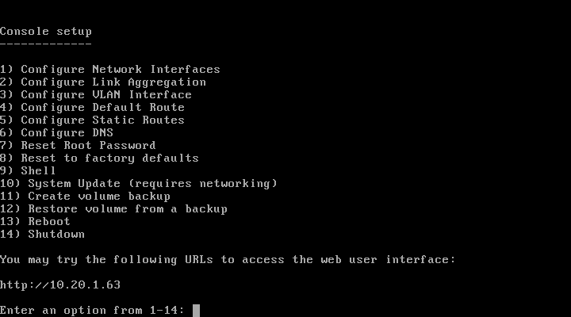
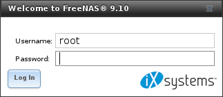

.. _Booting:

Booting
-------

The Console Setup menu, shown in
:numref:`Figure %s <console_setup_menu_fig>`,
appears at the end of the boot process. If the %brand% system has a
keyboard and monitor, this Console Setup menu can be used to
administer the system.

.. note:: The Console Setup menu can be accessed from within the
   %brand% GUI by typing :command:`/etc/netcli` from :ref:`Shell`.
   The Console Setup menu can be disabled by unchecking the
   :guilabel:`Enable Console Menu` in
   :menuselection:`System --> Settings --> Advanced`.

.. _console_setup_menu_fig:

   Console Setup Menu

The menu provides these options:

**1) Configure Network Interfaces:** provides a configuration wizard
to configure the system's network interfaces.

**2) Configure Link Aggregation:** allows creating a new link
aggregation or deleting an existing link aggregation.

**3) Configure VLAN Interface:** is used to create or delete a VLAN
interface.

**4) Configure Default Route:** is used to set the IPv4 or IPv6
default gateway. When prompted, enter the IP address of the default
gateway.

**5) Configure Static Routes:** prompts for the destination network
and gateway IP address. Re-enter this option for each route needed.

**6) Configure DNS:** prompts for the name of the DNS domain and the
IP address of the first DNS server. When adding multiple DNS servers,
press :kbd:`Enter` to enter the next one. Press :kbd:`Enter` twice to
leave this option.

**7) Reset Root Password:** if you are unable to log in to the
graphical administrative interface, select this option and follow the
prompts to set the *root* password.

**8) Reset to factory defaults:** to delete **all** of the
configuration changes made in the administrative GUI, select this
option. Once the configuration is reset, the system will reboot. It
will be necessary to use
:menuselection:`Storage --> Volumes --> Import Volume` to re-import
any volumes.

**9) Shell:** starts a shell for running FreeBSD commands. To leave
the shell, type :command:`exit`.

**10) System Update:** checks for system updates. If any new updates
are available, they are automatically be downloaded and applied. This
is a simplified version of the :ref:`Update` option available in the
web interface. Updates are applied immediately for the currently
selected train and access to the GUI is not required. For more
advanced update options like switching trains, use :ref:`Update`.

**11) Create volume backup:** backs up the %brand% configuration and
ZFS layout, and, optionally, the data, to a remote system over an
encrypted connection. The remote system must have sufficient space to
hold the backup and be running an SSH server on port 22. The remote
system does not have to be formatted with ZFS, as the backup will be
saved as a binary file. When this option is selected, it prompts for
the hostname or IP address of the remote system, the name of a user
account on that system, the user account password, the full path to a
directory on the remote system to save the backup, whether to also
back up all of the data, whether to compress the data, and a
confirmation to save the values. *y* starts the backup, *n* repeats
the configuration, and *q* quits the backup wizard. If the password is
left empty, key-based authentication is used instead. This requires
that the public key of the *root* user has been stored in
:file:`~root/.ssh/authorized_keys` on the remote system and that
they key is **not** protected by a passphrase. Refer to
:ref:`Rsync over SSH Mode` for instructions on generating a key pair.

**12) Restore volume from a backup:** restores from an existing backup
created with :guilabel:`11) Create volume backup` or
:menuselection:`System --> Advanced --> Backup`. It prompts for the
hostname or IP address of the remote system holding the backup, the
username that was used, the password (leave empty if key-based
authentication was used), the full path of the remote directory
storing the backup, and a confirmation that the values are correct.
*y* starts the restore, *n* repeats the configuration, and *q* quits
the restore wizard. The restore indicates if it can log into the
remote system, find the backup, and whether the backup contains data.
It then prompts to restore %brand% from that backup. Note that if *y*
is pressed to perform the restore, the system will be returned to the
database configuration, ZFS layout, and optionally the data, at the
point in time when the backup was created. The system reboots after
the restore completes.

.. warning:: The backup and restore options are meant for disaster
   recovery. If you restore a system, it is returned to the point
   in time that the backup was created. If you select the option to
   save the data, any data created after the backup was made will be
   lost. If you do **not** select the option to save the data, the
   system will be recreated with the same ZFS layout, but with **no**
   data.

.. warning:: The backup function **IGNORES ENCRYPTED POOLS**. Do not
   use it to back up systems with encrypted pools.

**13) Reboot:** reboots the system.

**14) Shutdown:** halts the system.

.. _Obtaining_an_IP_Address:

Obtaining an IP Address
^^^^^^^^^^^^^^^^^^^^^^^

During boot, %brand% automatically attempts to connect to a DHCP
server from all live network interfaces. If it successfully receives
an IP address, the address is displayed so it can be used to access
the graphical user interface. The example in
:numref:`Figure %s <console_setup_menu_fig>` shows a
%brand% system that is accessible at *http://192.168.1.119*.

Some %brand% systems are set up without a monitor, making it
challenging to determine which IP address has been assigned. On
networks that support Multicast DNS (mDNS), the hostname and domain
can be entered into the address bar of a browser. By default, this
value is *freenas.local*.

If the %brand% server is not connected to a network with a DHCP
server, use the console network configuration menu to manually
configure the interface as seen in
:ref:`Example: Manually Setting an IP Address from the Console Menu
<quick_manual_ip_topic>`.
In this example, the %brand% system has one network interface, *em0*.

.. topic:: Manually Setting an IP Address from the Console Menu
   :name: quick_manual_ip_topic

   .. code-block:: none

      Enter an option from 1-14: 1
      1) em0
      Select an interface (q to quit): 1
      Reset network configuration (y/n) n
      Configure interface for DHCP? (y/n) n
      Configure IPv4? (y/n) y
      Interface name: (press enter as can be blank)
      Several input formats are supported
      Example 1 CIDR Notation: 192.168.1.1/24
      Example 2 IP and Netmask separate:
      IP: 192.168.1.1
      Netmask: 255.255.255.0, or /24 or 24
      IPv4 Address: 192.168.1.108/24
      Saving interface configuration: Ok
      Configure IPv6? (y/n) n
      Restarting network: ok
      You may try the following URLs to access the web user interface:
      http://192.168.1.108

After the system has an IP address, enter that address into a
graphical web browser from a computer connected to the same network as
the %brand% system.

.. _Logging_In:

Logging In
^^^^^^^^^^

The password for the root user is requested as shown in
:numref:`Figure %s <quick_enter_root_pass_fig>`.

.. _quick_enter_root_pass_fig:

   Enter the Root Password

Enter the password chosen during the installation. The administrative
GUI is displayed as shown in
:numref:`Figure %s <quick_graphic_config_menu_fig>`.

.. _quick_graphic_config_menu_fig:

.. figure:: images/initial1c.png

   %brand% Graphical Configuration Menu

If the %brand% system does not respond to the IP address or mDNS name
entered in a browser:

* If proxy settings are enabled in the browser configuration, disable
  them and try connecting again.

* If the page does not load, check whether the %brand% system's IP
  address responds to a :command:`ping` from another computer on the
  same network. If the %brand% IP address is in a private IP address
  range, it can only be accessed from within that private network.

* If the user interface loads but is unresponsive or seems to be
  missing menu items, try a different web browser. IE9 has known
  issues and does not display the graphical administrative interface
  correctly if compatibility mode is turned on.
  `Firefox <https://www.mozilla.org/en-US/firefox/all/>`_ is
  recommended.

* If :guilabel:`An error occurred!` messages are shown when attempting
  to configure an item in the GUI, make sure that the browser is set
  to allow cookies from the %brand% system.

This `blog post
<http://fortysomethinggeek.blogspot.com/2012/10/ipad-iphone-connect-with-freenas-or-any.html>`_
describes some applications which can be used to access the %brand%
system from an iPad or iPhone.

Initial Configuration
^^^^^^^^^^^^^^^^^^^^^

The first time the %brand% GUI is accessed, the :ref:`Wizard` starts
automatically to help configure the %brand% device quickly and easily.
