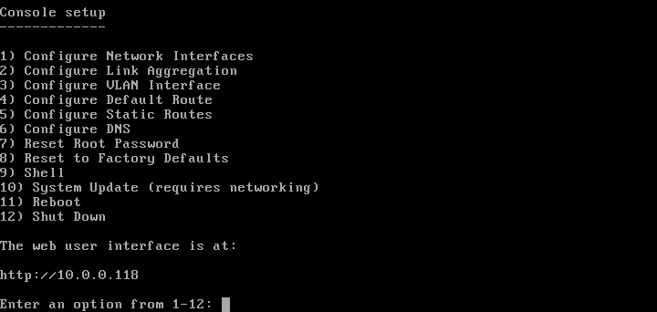
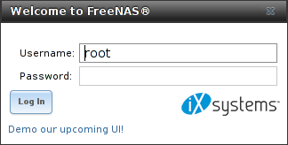

.. _Booting:

Booting
-------

The Console Setup menu, shown in
:numref:`Figure %s <console_setup_menu_fig>`,
appears at the end of the boot process. If the %brand% system has a
keyboard and monitor, this Console Setup menu can be used to
administer the system.

#include snippets/consolesetupnote.rst

.. _console_setup_menu_fig:

   Console Setup Menu

The menu provides these options:

**1) Configure Network Interfaces** provides a configuration wizard
to set up the system's network interfaces.

**2) Configure Link Aggregation** is for creating or deleting link
aggregations.

**3) Configure VLAN Interface** is used to create or delete VLAN
interfaces.

**4) Configure Default Route** is used to set the IPv4 or IPv6
default gateway. When prompted, enter the IP address of the default
gateway.

**5) Configure Static Routes** prompts for the destination network
and gateway IP address. Re-enter this option for each static route
needed.

**6) Configure DNS** prompts for the name of the DNS domain and the
IP address of the first DNS server. When adding multiple DNS servers,
press :kbd:`Enter` to enter the next one. Press :kbd:`Enter` twice to
leave this option.

**7) Reset Root Password** is used to reset a lost or forgotten *root*
password. Select this option and follow the prompts to set the
password.

**8) Reset to Factory Defaults** *Caution*! This option deletes
**all** of the configuration settings made in the administrative GUI
and is used to reset a %brand% system back to defaults. **Before
selecting this option, make a full backup of all data and make sure
all encryption keys and passphrases are known!** After this option is
selected, the configuration is cleared and the system reboots.
:menuselection:`Storage --> Volumes --> Import Volume` can be used to
re-import volumes.

**9) Shell** starts a shell for running FreeBSD commands. To leave
the shell, type :command:`exit`.

**10) System Update** checks for system updates. If any new updates
are available, they are automatically downloaded and applied. This
is a simplified version of the :ref:`Update` option available in the
web interface. Updates are applied immediately for the currently
selected train and access to the GUI is not required. For more
advanced update options like switching trains, use :ref:`Update`.

**11) Reboot** reboots the system.

**12) Shut Down** halts the system.

.. _Obtaining_an_IP_Address:

Obtaining an IP Address
^^^^^^^^^^^^^^^^^^^^^^^

During boot, %brand% automatically attempts to connect to a DHCP
server from all live network interfaces. If it successfully receives
an IP address, the address is displayed so it can be used to access
the graphical user interface. The example in
:numref:`Figure %s <console_setup_menu_fig>` shows a
%brand% system that is accessible at *http://192.168.1.119*.

Some %brand% systems are set up without a monitor, making it
challenging to determine which IP address has been assigned. On
networks that support Multicast DNS (mDNS), the hostname and domain
can be entered into the address bar of a browser. By default, this
value is *freenas.local*.

If the %brand% server is not connected to a network with a DHCP
server, use the console network configuration menu to manually
configure the interface as seen in
:ref:`Example: Manually Setting an IP Address from the Console Menu
<quick_manual_ip_topic>`.
In this example, the %brand% system has one network interface, *em0*.

.. topic:: Manually Setting an IP Address from the Console Menu
   :name: quick_manual_ip_topic

   .. code-block:: none

      Enter an option from 1-14: 1
      1) em0
      Select an interface (q to quit): 1
      Reset network configuration (y/n) n
      Configure interface for DHCP? (y/n) n
      Configure IPv4? (y/n) y
      Interface name: (press enter as can be blank)
      Several input formats are supported
      Example 1 CIDR Notation: 192.168.1.1/24
      Example 2 IP and Netmask separate:
      IP: 192.168.1.1
      Netmask: 255.255.255.0, or /24 or 24
      IPv4 Address: 192.168.1.108/24
      Saving interface configuration: Ok
      Configure IPv6? (y/n) n
      Restarting network: ok
      You may try the following URLs to access the web user interface:
      http://192.168.1.108

After the system has an IP address, enter that address into a
graphical web browser from a computer connected to the same network as
the %brand% system.

.. _Logging_In:

Logging In
^^^^^^^^^^

The password for the root user is requested as shown in
:numref:`Figure %s <quick_enter_root_pass_fig>`.

.. _quick_enter_root_pass_fig:

   Enter the Root Password

.. note:: The %brand% UI is in the process of being rewritten in Angular,
   with a new, asynchronous middleware. To see a preview of the new UI,
   click the "Try the Beta UI!" link in the login box. Note that the new
   UI is not expected to be feature complete with the classic %brand% UI
   until version 11.2. Until then, this Guide only demonstrates the classic
   UI.

Enter the password chosen during the installation. The administrative
GUI is displayed as shown in
:numref:`Figure %s <quick_graphic_config_menu_fig>`.

.. _quick_graphic_config_menu_fig:

.. figure:: images/initial1c.png

   %brand% Graphical Configuration Menu

If the %brand% system does not respond to the IP address or mDNS name
entered in a browser:

* If proxy settings are enabled in the browser configuration, disable
  them and try connecting again.

* If the page does not load, check whether the %brand% system's IP
  address responds to a :command:`ping` from another computer on the
  same network. If the %brand% IP address is in a private IP address
  range, it can only be accessed from within that private network.

* If the user interface loads but is unresponsive or seems to be
  missing menu items, try a different web browser. IE9 has known
  issues and does not display the graphical administrative interface
  correctly if compatibility mode is turned on.
  `Firefox <https://www.mozilla.org/en-US/firefox/all/>`_ is
  recommended.

* If :guilabel:`An error occurred!` messages are shown when attempting
  to configure an item in the GUI, make sure that the browser is set
  to allow cookies from the %brand% system.

This `blog post
<http://fortysomethinggeek.blogspot.com/2012/10/ipad-iphone-connect-with-freenas-or-any.html>`_
describes some applications which can be used to access the %brand%
system from an iPad or iPhone.

Initial Configuration
^^^^^^^^^^^^^^^^^^^^^

The first time the %brand% GUI is accessed, the :ref:`Wizard` starts
automatically to help configure the %brand% device quickly and easily.
