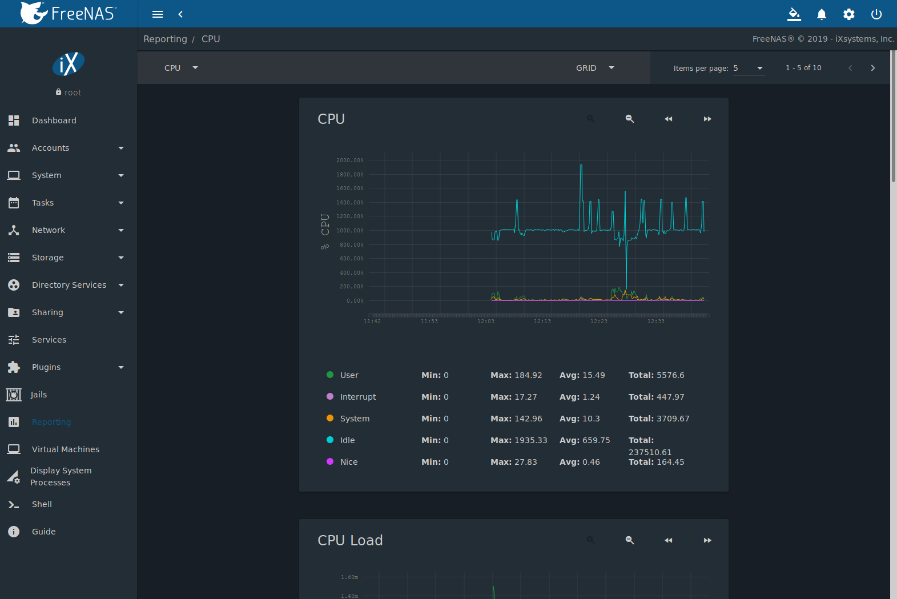

.. index:: Reporting
.. _Reporting:

Reporting
=========

Reporting displays several graphs, as seen in
:numref:`Figure %s <reporting_graphs_fig>`. Choose a category from the
drop-down menu to view those graphs. There are also options to change
the graph view and number of graphs on each page.

.. _reporting_graphs_fig:

   Reporting Graphs

%brand% uses
`collectd <https://collectd.org/>`__
to provide reporting statistics. For a clearer picture, hover over a
point in the graph to show exact numbers for that point in time. Use the
magnifier buttons next to each graph to increase or decrease the
displayed time increment from 10 minutes, hourly, daily, weekly, or
monthly. The :guilabel:`<<` and :guilabel:`>>` buttons scroll through
the output.

Graphs are grouped by category on the Reporting page:

* :guilabel:`CPU`

  * `CPU <https://collectd.org/wiki/index.php/Plugin:CPU>`__
    shows the amount of time spent by the CPU in various states
    such as executing user code, executing system code, and being
    idle. It also shows the load on the CPU for a short term, mid term,
    and long term.

* :guilabel:`Disk`

  * `Disk <https://collectd.org/wiki/index.php/Plugin:Disk>`__
    shows read and write statistics on I/O, percent busy, latency,
    operations per second, pending I/O requests, and disk temperature.
    Choose the :guilabel:`DEVICES` and :guilabel:`METRICS` to view the
    selected metrics for the chosen devices.

* :guilabel:`Memory`

  * `Memory <https://collectd.org/wiki/index.php/Plugin:Memory>`__
    displays memory usage.

  * `Swap <https://collectd.org/wiki/index.php/Plugin:Swap>`__
    displays the amount of free and used swap space.

* :guilabel:`Network`

  * `Interface
    <https://collectd.org/wiki/index.php/Plugin:Interface>`__
    shows received and transmitted traffic in bits per second for
    each configured interface.

* :guilabel:`Partition`

  * `Disk space
    <https://collectd.org/wiki/index.php/Plugin:DF>`__
    displays free, used, and reserved space for each pool and dataset.
    However, the disk space used by an individual zvol is not
    displayed as it is a block device.

* :guilabel:`System`

  * `Processes
    <https://collectd.org/wiki/index.php/Plugin:Processes>`__
    displays the number of processes. It is grouped by state.

* :guilabel:`Target`

  * Target shows bandwidth statistics for iSCSI ports.

* :guilabel:`ZFS`

  * `ZFS <https://collectd.org/wiki/index.php/Plugin:ZFS_ARC>`__
    shows compressed physical ARC size, hit ratio, demand data, demand
    metadata, and prefetch data.

Reporting data is saved to permit viewing and monitoring usage trends
over time. This data is preserved across system upgrades and restarts.

Data files are saved in :file:`/var/db/collectd/rrd/`.

The reporting data file recording method is controlled by the
:menuselection:`System --> System Dataset`
:guilabel:`Reporting database` option. When deselected, data files
are recorded in a temporary filesystem and copied hourly to on-disk
files.

When
:menuselection:`System --> System Dataset`
:guilabel:`Reporting database` is enabled, data files are written
directly to the :ref:`System Dataset`.

.. warning:: Reporting data is frequently written and should not be
   stored on the boot pool or boot device.

`Update on using Graphite with FreeNAS
<http://cmhramblings.blogspot.com/2015/12/update-on-using-graphite-with-freenas.html>`__
contains instructions for sending the collected information to a
`Graphite <http://graphiteapp.org/>`__ server.
