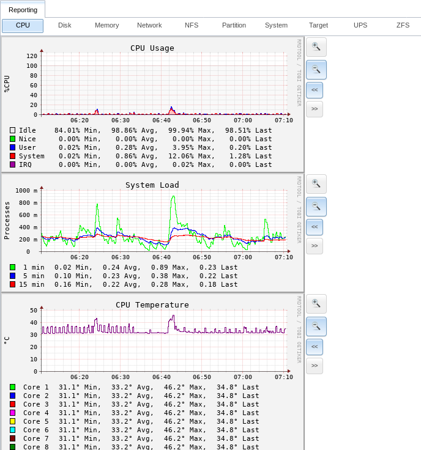

.. index:: Reporting
.. _Reporting:

Reporting
=========

Reporting displays several graphs, as seen in the example in
:numref:`Figure %s <reporting_graphs_fig>`.
Click the tab for a device type to see its graphs.

.. _reporting_graphs_fig:

   Reporting Graphs

%brand% uses
`collectd <https://collectd.org/>`__
to provide reporting statistics. The resulting graphs are grouped into
several tabs on the Reporting page:

* :guilabel:`CPU`

  * `CPU <https://collectd.org/wiki/index.php/Plugin:CPU>`__
    shows the amount of time spent by the CPU in various states
    such as executing user code, executing system code, and being
    idle.

* :guilabel:`Disk`

  * `Disk <https://collectd.org/wiki/index.php/Plugin:Disk>`__
    shows statistics on I/O, percent busy, latency, operations per
    second, and pending I/O requests.

* :guilabel:`Memory`

  * `Memory <https://collectd.org/wiki/index.php/Plugin:Memory>`__
    displays memory usage.

  * `Swap <https://collectd.org/wiki/index.php/Plugin:Swap>`__
    displays the amount of free and used swap space.

* :guilabel:`Network`

  * `Interface
    <https://collectd.org/wiki/index.php/Plugin:Interface>`__
    shows received and transmitted traffic in bits per second for
    each configured interface.

* :guilabel:`Partition`

  * `Disk space
    <https://collectd.org/wiki/index.php/Plugin:DF>`__
    displays free and used space for each volume and dataset.
    However, the disk space used by an individual zvol is not
    displayed as it is a block device.

* :guilabel:`System`

  * `Processes and Uptime
    <https://collectd.org/wiki/index.php/Plugin:Processes>`__
    displays the number of processes, grouped by state.

  * `Uptime <https://collectd.org/wiki/index.php/Plugin:Uptime>`__
    keeps track of the system uptime, the average running time, and
    the maximum reached uptime.

* :guilabel:`Target`

  * Target shows bandwidth statistics for iSCSI ports.

* :guilabel:`ZFS`

  * `ZFS <https://collectd.org/wiki/index.php/Plugin:ZFS_ARC>`__
    shows ARC size, hit ratio, and requests.

Reporting data is saved to permit viewing and monitoring usage trends
over time. This data is preserved across system upgrades and restarts.

Data files are saved in :file:`/var/db/collectd/rrd/`.

The reporting data file recording method is controlled by the
:menuselection:`System --> System Dataset`
:guilabel:`Reporting database` checkbox. When unchecked, data files
are recorded in a temporary filesystem and copied hourly to on-disk
files.

When
:menuselection:`System --> System Dataset`
:guilabel:`Reporting database` is checked, data files are written
directly to the :ref:`System Dataset`.

.. warning:: Reporting data is frequently written and should not be
   stored on the boot pool or boot device.

Use the magnifier buttons next to each graph to increase or decrease
the displayed time increment from 10 minutes, hourly, daily, weekly,
or monthly. The :guilabel:`<<` and :guilabel:`>>` buttons can be
used to scroll through the output.

`Update on using Graphite with FreeNAS
<http://cmhramblings.blogspot.com/2015/12/update-on-using-graphite-with-freenas.html>`_
contains instructions for sending the collected information to a
`Graphite <http://graphite.wikidot.com/>`__ server.
