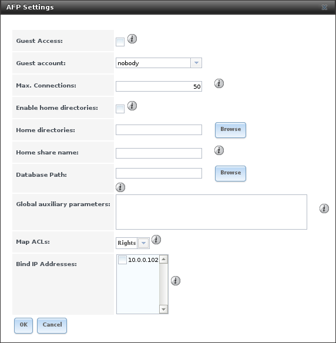
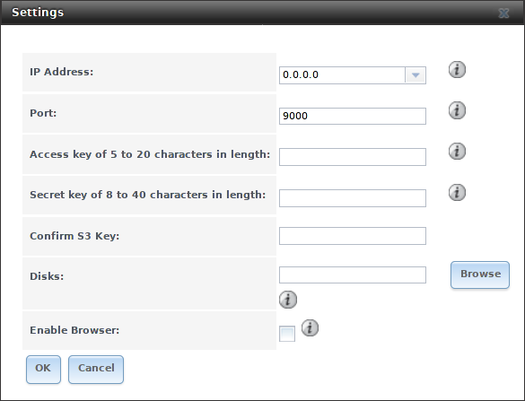
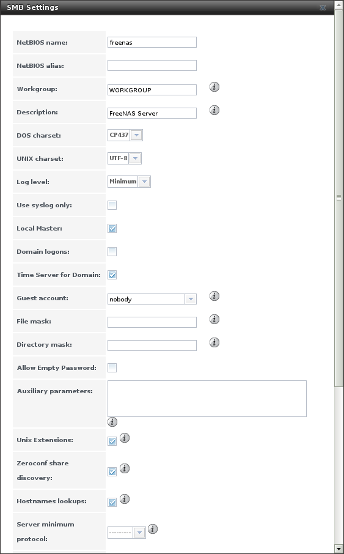
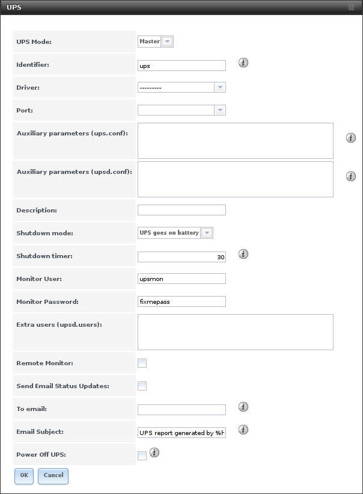

.. index:: Services
.. _Services:

Services
========

The Services section of the GUI is where various services that ship
with the %brand% system are configured, started, or stopped. %brand%
includes these built-in services:

* :ref:`AFP`

* :ref:`Domain Controller`

* :ref:`Dynamic DNS`

* :ref:`FTP`

* :ref:`iSCSI`

* :ref:`LLDP`

* :ref:`NFS`

* :ref:`Rsync`

* :ref:`S3`

* :ref:`S.M.A.R.T.`

* :ref:`SMB`

* :ref:`SNMP`

* :ref:`SSH`

* :ref:`TFTP`

* :ref:`UPS`

* :ref:`WebDAV`

This section demonstrates starting a %brand% service and the available
configuration options for each %brand% service.

.. index:: Start Service, Stop Service
.. _Control Services:

Control Services
----------------

:menuselection:`Services --> Control Services`, shown in
:numref:`Figure %s <control_services_fig>`,
shows which services are currently running and can start, stop, or
configure them. The S.M.A.R.T. service is enabled by default, but only
runs if the storage devices support
`S.M.A.R.T. data <http://en.wikipedia.org/wiki/S.M.A.R.T.>`_
Other services default to off until started.

.. _control_services_fig:

.. figure:: images/services1e.png

   Control Services

Stopped services show a red stop symbol and a :guilabel:`Start Now`
button. Running services show a green light with a
:guilabel:`Stop Now` button.

.. tip:: Using a proxy server can prevent the list of services from
   being displayed. If a proxy server is used, configure it to not
   proxy local network connections or websocket connections. VPN
   software can also cause problems. If the list of services is
   displayed when connecting on the local network but not when
   connecting through the VPN, check the VPN software configuration.

Services are configured by clicking the wrench icon or the name of the
service in the :guilabel:`Services` section of the tree menu.

If a service does not start, go to
:menuselection:`System --> Advanced`
and check the box :guilabel:`Show console messages in the footer`.
Console messages appear at the bottom of the browser. Clicking
the console message area makes it into a pop-up window, allowing
scrolling through or copying the messages. Watch these messages for
errors when stopping or starting the problematic service.

To read the system logs for more information about a service failure,
open :ref:`Shell` and type :command:`more /var/log/messages`.

.. index:: AFP, Apple Filing Protocol
.. _AFP:

AFP
---

The settings that are configured when creating AFP Shares in
:menuselection:`Sharing --> Apple (AFP) Shares --> Add Apple (AFP)
Share` are specific to each configured AFP Share. In contrast, global
settings which apply to all AFP shares are configured in
:menuselection:`Services --> AFP`.

:numref:`Figure %s <global_afp_config_fig>`
shows the available global AFP configuration options
which are described in
:numref:`Table %s <global_afp_config_opts_tab>`.

.. _global_afp_config_fig:

   Global AFP Configuration

.. tabularcolumns:: |>{\RaggedRight}p{\dimexpr 0.16\linewidth-2\tabcolsep}
                    |>{\RaggedRight}p{\dimexpr 0.20\linewidth-2\tabcolsep}
                    |>{\RaggedRight}p{\dimexpr 0.63\linewidth-2\tabcolsep}|

.. _global_afp_config_opts_tab:

.. table:: Global AFP Configuration Options
   :class: longtable

   +-------------------------+----------------+-----------------------------------------------------------------------------------------------------------------+
   | Setting                 | Value          | Description                                                                                                     |
   |                         |                |                                                                                                                 |
   +=========================+================+=================================================================================================================+
   | Guest Access            | checkbox       | if checked, clients will not be prompted to authenticate before accessing AFP shares                            |
   |                         |                |                                                                                                                 |
   +-------------------------+----------------+-----------------------------------------------------------------------------------------------------------------+
   | Guest account           | drop-down menu | select account to use for guest access; the selected account must have permissions to the volume or dataset     |
   |                         |                | being shared                                                                                                    |
   |                         |                |                                                                                                                 |
   +-------------------------+----------------+-----------------------------------------------------------------------------------------------------------------+
   | Max Connections         | integer        | maximum number of simultaneous connections                                                                      |
   |                         |                |                                                                                                                 |
   +-------------------------+----------------+-----------------------------------------------------------------------------------------------------------------+
   | Enable home directories | checkbox       | if checked, any user home directories located under :guilabel:`Home directories` will be available              |
   |                         |                | over the share                                                                                                  |
   +-------------------------+----------------+-----------------------------------------------------------------------------------------------------------------+
   | Home directories        | browse button  | select the volume or dataset which contains user home directories                                               |
   |                         |                |                                                                                                                 |
   +-------------------------+----------------+-----------------------------------------------------------------------------------------------------------------+
   | Home share name         | string         | overrides default home folder name with the specified value                                                     |
   |                         |                |                                                                                                                 |
   +-------------------------+----------------+-----------------------------------------------------------------------------------------------------------------+
   | Database Path           | browse button  | select the path to store the CNID databases used by AFP (default is the root of the volume); the path must be   |
   |                         |                | writable                                                                                                        |
   +-------------------------+----------------+-----------------------------------------------------------------------------------------------------------------+
   | Global auxiliary        | string         | additional `afp.conf(5) <http://netatalk.sourceforge.net/3.0/htmldocs/afp.conf.5.html>`_                        |
   | parameters              |                | parameters not covered elsewhere in this screen                                                                 |
   |                         |                |                                                                                                                 |
   +-------------------------+----------------+-----------------------------------------------------------------------------------------------------------------+
   | Map ACLs                | drop-down menu | choose mapping of effective permissions for authenticated users; *Rights* (default, Unix-style permissions),    |
   |                         |                | *Mode* (ACLs), or *None*                                                                                        |
   |                         |                |                                                                                                                 |
   +-------------------------+----------------+-----------------------------------------------------------------------------------------------------------------+
   | Bind IP Addresses       | selection      | specify the IP addresses to listen for FTP connections; highlight the desired IP addresses in the               |
   |                         |                | :guilabel:`Available` list and use the :guilabel:`>>` button to add to the :guilabel:`Selected` list            |
   |                         |                |                                                                                                                 |
   +-------------------------+----------------+-----------------------------------------------------------------------------------------------------------------+

When configuring home directories, it is recommended to create a
dataset to hold the home directories which contains a child dataset
for each user. As an example, create a dataset named
:file:`volume1/homedirs` and browse to this dataset when configuring
the :guilabel:`Home directories` field of the AFP service. Then, as
you create each user, first create a child dataset for that user. For
example, create a dataset named :file:`volume1/homedirs/user1`. When
you create the *user1* user, browse to the
:file:`volume1/homedirs/user1` dataset in the
:guilabel:`Home Directory` field of the :guilabel:`Add New User`
screen.

.. _Troubleshooting AFP:

Troubleshooting AFP
~~~~~~~~~~~~~~~~~~~

You can determine which users are connected to an AFP share by typing
:command:`afpusers`.

If :guilabel:`Something wrong with the volume's CNID DB` is shown,
run this command from :ref:`Shell`, replacing the path to the
problematic AFP share:

.. code-block:: none

   dbd -rf /path/to/share

This command may take a while, depending upon the size of the volume
or dataset being shared. This command will wipe the CNID database and
rebuild it from the CNIDs stored in the AppleDouble files.

.. index:: Domain Controller, DC
.. _Domain Controller:

Domain Controller
-----------------

%brand% can be configured to act either as the domain controller for
a network or to join an existing :ref:`Active Directory` network as a
domain controller.

.. note:: This section demonstrates how to configure the %brand%
   system to act as a domain controller. If the goal is to integrate
   with an existing :ref:`Active Directory` network to access its
   authentication and authorization services, configure
   :ref:`Active Directory` instead.

Be aware that configuring a domain controller is a complex process
that requires a good understanding of how :ref:`Active Directory`
works. While
:menuselection:`Services --> Domain Controller`
makes it easy to input the needed settings into the administrative
graphical interface, it is important to understand what those settings
should be. Before beginning configuration, read through the
`Samba AD DC HOWTO
<https://wiki.samba.org/index.php/Samba_AD_DC_HOWTO>`_.
After %brand% is configured, use the RSAT utility from a Windows
system to manage the domain controller. The Samba AD DC HOWTO includes
instructions for installing and configuring RSAT.

:numref:`Figure %s <domain_controller_settings_fig>`
shows the configuration screen for creating a domain controller and
:numref:`Table %s <domain_controller_opts_tab>`
summarizes the available options.

.. _domain_controller_settings_fig:

.. figure:: images/services-domain-controller.png

   Domain Controller Settings

.. tabularcolumns:: |>{\RaggedRight}p{\dimexpr 0.16\linewidth-2\tabcolsep}
                    |>{\RaggedRight}p{\dimexpr 0.20\linewidth-2\tabcolsep}
                    |>{\RaggedRight}p{\dimexpr 0.63\linewidth-2\tabcolsep}|

.. _domain_controller_opts_tab:

.. table:: Domain Controller Configuration Options
   :class: longtable

   +------------------------+----------------+-------------------------------------------------------------------------------------------------------------------------------------------------------------------------------------------+
   | Setting                | Value          | Description                                                                                                                                                                               |
   |                        |                |                                                                                                                                                                                           |
   |                        |                |                                                                                                                                                                                           |
   +========================+================+===========================================================================================================================================================================================+
   | Realm                  | string         | capitalized DNS realm name                                                                                                                                                                |
   |                        |                |                                                                                                                                                                                           |
   +------------------------+----------------+-------------------------------------------------------------------------------------------------------------------------------------------------------------------------------------------+
   | Domain                 | string         | capitalized domain name                                                                                                                                                                   |
   |                        |                |                                                                                                                                                                                           |
   +------------------------+----------------+-------------------------------------------------------------------------------------------------------------------------------------------------------------------------------------------+
   | Server Role            | drop-down menu | at this time, the only supported role is as the domain controller for a new domain                                                                                                        |
   |                        |                |                                                                                                                                                                                           |
   +------------------------+----------------+-------------------------------------------------------------------------------------------------------------------------------------------------------------------------------------------+
   | DNS Forwarder          | string         | IP address of DNS forwarder; required for recursive queries when *SAMBA_INTERNAL* is selected                                                                                             |
   |                        |                |                                                                                                                                                                                           |
   +------------------------+----------------+-------------------------------------------------------------------------------------------------------------------------------------------------------------------------------------------+
   | Domain Forest Level    | drop-down menu | choices are *2000*,                                                                                                                                                                       |
   |                        |                | *2003*,                                                                                                                                                                                   |
   |                        |                | *2008*, or                                                                                                                                                                                |
   |                        |                | *2008_R2*; refer to                                                                                                                                                                       |
   |                        |                | `Understanding Active Directory Domain Services (AD DS) Functional Levels <https://technet.microsoft.com/en-us/library/understanding-active-directory-functional-levels(WS.10).aspx>`_    |
   |                        |                | for details                                                                                                                                                                               |
   |                        |                |                                                                                                                                                                                           |
   +------------------------+----------------+-------------------------------------------------------------------------------------------------------------------------------------------------------------------------------------------+
   | Administrator password | string         | password to be used for the :ref:`Active Directory` administrator account                                                                                                                 |
   |                        |                |                                                                                                                                                                                           |
   +------------------------+----------------+-------------------------------------------------------------------------------------------------------------------------------------------------------------------------------------------+
   | Kerberos Realm         | drop-down menu | auto-populates with information from the :guilabel:`Realm` when the settings in this screen are saved                                                                                     |
   |                        |                |                                                                                                                                                                                           |
   +------------------------+----------------+-------------------------------------------------------------------------------------------------------------------------------------------------------------------------------------------+

.. _Samba Domain Controller Backup:

Samba Domain Controller Backup
~~~~~~~~~~~~~~~~~~~~~~~~~~~~~~

A :command:`samba_backup` script is available to back up Samba4 domain
controller settings is available. From the :ref:`Shell`, run
:samp:`/usr/local/bin/samba_backup --usage` to show the input options.

.. index:: Dynamic DNS, DDNS
.. _Dynamic DNS:

Dynamic DNS
-----------

Dynamic DNS (DDNS) is useful if the %brand% system is connected to
an ISP that periodically changes the IP address of the system. With
dynamic DNS, the system can automatically associate its current IP
address with a domain name, allowing you to access the %brand% system
even if the IP address changes. DDNS requires you to register with a
DDNS service such as `DynDNS <http://dyn.com/dns/>`_.

:numref:`Figure %s <config_ddns_fig>`
shows the DDNS configuration screen and
:numref:`Table %s <ddns_config_opts_tab>`
summarizes the configuration options. The values to enter will be
provided by the DDNS provider. After configuring DDNS, remember to
start the DDNS service in
:menuselection:`Services --> Control Services`.

.. _config_ddns_fig:

.. figure:: images/ddns.png

   Configuring DDNS

.. tabularcolumns:: |>{\RaggedRight}p{\dimexpr 0.16\linewidth-2\tabcolsep}
                    |>{\RaggedRight}p{\dimexpr 0.20\linewidth-2\tabcolsep}
                    |>{\RaggedRight}p{\dimexpr 0.63\linewidth-2\tabcolsep}|

.. _ddns_config_opts_tab:

.. table:: DDNS Configuration Options
   :class: longtable

   +----------------------+----------------+--------------------------------------------------------------------------------------------------------------------+
   | Setting              | Value          | Description                                                                                                        |
   |                      |                |                                                                                                                    |
   +======================+================+====================================================================================================================+
   | Provider             | drop-down menu | several providers are supported; if your provider is not listed, leave this field blank and specify the custom     |
   |                      |                | provider in the :guilabel:`Auxiliary parameters` field                                                             |
   |                      |                |                                                                                                                    |
   +----------------------+----------------+--------------------------------------------------------------------------------------------------------------------+
   | IP Server            | string         | can be used to specify the hostname and port of the IP check server                                                |
   |                      |                |                                                                                                                    |
   +----------------------+----------------+--------------------------------------------------------------------------------------------------------------------+
   | Domain name          | string         | fully qualified domain name (e.g. *yourname.dyndns.org*)                                                           |
   |                      |                |                                                                                                                    |
   +----------------------+----------------+--------------------------------------------------------------------------------------------------------------------+
   | Username             | string         | username used to logon to the provider and update the record                                                       |
   |                      |                |                                                                                                                    |
   +----------------------+----------------+--------------------------------------------------------------------------------------------------------------------+
   | Password             | string         | password used to logon to the provider and update the record                                                       |
   |                      |                |                                                                                                                    |
   +----------------------+----------------+--------------------------------------------------------------------------------------------------------------------+
   | Update period        | integer        | how often the IP is checked in seconds                                                                             |
   +----------------------+----------------+--------------------------------------------------------------------------------------------------------------------+
   | Forced update period | integer        | how often the IP should be updated, even it has not changed, in seconds                                            |
   |                      |                |                                                                                                                    |
   +----------------------+----------------+--------------------------------------------------------------------------------------------------------------------+
   | Auxiliary parameters | string         | additional parameters passed to the provider during record update; an example of specifying a custom provider is   |
   |                      |                | *dyndns_system default@provider.com*                                                                               |
   |                      |                |                                                                                                                    |
   +----------------------+----------------+--------------------------------------------------------------------------------------------------------------------+

When using "freedns.afraid.org", see `this forum post
<https://forums.freenas.org/index.php?threads/dynamic-dns-and-freeedns-afraid-org.24455/#post-151746>`_
for an example configuration.

When using "he.net", enter the domain name for
:guilabel:`Username` and enter the DDNS key generated for that
domain's A entry at the `<he.net>`_ website for :guilabel:`Password`.

.. index:: FTP, File Transfer Protocol
.. _FTP:

FTP
---

%brand% uses the `proftpd <http://www.proftpd.org/>`_ FTP server to
provide FTP services. Once the FTP service is configured and started,
clients can browse and download data using a web browser or FTP client
software. The advantage of FTP is that easy-to-use cross-platform
utilities are available to manage uploads to and downloads from the
%brand% system. The disadvantage of FTP is that it is considered to
be an insecure protocol, meaning that it should not be used to
transfer sensitive files. If you are concerned about sensitive data,
see Encrypting FTP.

This section provides an overview of the FTP configuration options. It
then provides examples for configuring anonymous FTP, specified user
access within a chroot environment, encrypting FTP connections, and
troubleshooting tips.

:numref:`Figure %s <configuring_ftp_fig>`
shows the configuration screen for
:menuselection:`Services --> FTP`. Some settings are only available in
:guilabel:`Advanced Mode`. To see these settings, either click the
:guilabel:`Advanced Mode` button or configure the system to always
display these settings by checking the box
:guilabel:`Show advanced fields by default` in
:menuselection:`System --> Advanced`.

.. _configuring_ftp_fig:

.. figure:: images/ftp1.png

   Configuring FTP

:numref:`Table %s <ftp_config_opts_tab>`
summarizes the available options when configuring the FTP server.

.. tabularcolumns:: |>{\RaggedRight}p{\dimexpr 0.20\linewidth-2\tabcolsep}
                    |>{\RaggedRight}p{\dimexpr 0.14\linewidth-2\tabcolsep}
                    |>{\Centering}p{\dimexpr 0.12\linewidth-2\tabcolsep}
                    |>{\RaggedRight}p{\dimexpr 0.54\linewidth-2\tabcolsep}|

.. _ftp_config_opts_tab:

.. table:: FTP Configuration Options
   :class: longtable

   +---------------------------------------------------------------+----------------+----------+-------------------------------------------------------------------------------------+
   | Setting                                                       | Value          | Advanced | Description                                                                         |
   |                                                               |                | Mode     |                                                                                     |
   +===============================================================+================+==========+=====================================================================================+
   | Port                                                          | integer        |          | port the FTP service listens on                                                     |
   |                                                               |                |          |                                                                                     |
   +---------------------------------------------------------------+----------------+----------+-------------------------------------------------------------------------------------+
   | Clients                                                       | integer        |          | maximum number of simultaneous clients                                              |
   |                                                               |                |          |                                                                                     |
   +---------------------------------------------------------------+----------------+----------+-------------------------------------------------------------------------------------+
   | Connections                                                   | integer        |          | maximum number of connections per IP address where *0* means unlimited              |
   |                                                               |                |          |                                                                                     |
   +---------------------------------------------------------------+----------------+----------+-------------------------------------------------------------------------------------+
   | Login Attempts                                                | integer        |          | maximum number of attempts before client is disconnected; increase this if          |
   |                                                               |                |          | users are prone to typos                                                            |
   |                                                               |                |          |                                                                                     |
   +---------------------------------------------------------------+----------------+----------+-------------------------------------------------------------------------------------+
   | Timeout                                                       | integer        |          | maximum client idle time in seconds before client is disconnected                   |
   |                                                               |                |          |                                                                                     |
   +---------------------------------------------------------------+----------------+----------+-------------------------------------------------------------------------------------+
   | Allow Root Login                                              | checkbox       |          | discouraged as increases security risk                                              |
   |                                                               |                |          |                                                                                     |
   +---------------------------------------------------------------+----------------+----------+-------------------------------------------------------------------------------------+
   | Allow Anonymous Login                                         | checkbox       |          | enables anonymous FTP logins with access to the directory specified in              |
   |                                                               |                |          | :guilabel:`Path`                                                                    |
   |                                                               |                |          |                                                                                     |
   +---------------------------------------------------------------+----------------+----------+-------------------------------------------------------------------------------------+
   | Path                                                          | browse button  |          | root directory for anonymous FTP connections                                        |
   |                                                               |                |          |                                                                                     |
   +---------------------------------------------------------------+----------------+----------+-------------------------------------------------------------------------------------+
   | Allow Local User Login                                        | checkbox       |          | required if :guilabel:`Anonymous Login` is disabled                                 |
   |                                                               |                |          |                                                                                     |
   +---------------------------------------------------------------+----------------+----------+-------------------------------------------------------------------------------------+
   | Display Login                                                 | string         |          | message displayed to local login users after authentication; not displayed          |
   |                                                               |                |          | to anonymous login users                                                            |
   |                                                               |                |          |                                                                                     |
   +---------------------------------------------------------------+----------------+----------+-------------------------------------------------------------------------------------+
   | File Permission                                               | checkboxes     | ✓        | sets default permissions for newly created files                                    |
   |                                                               |                |          |                                                                                     |
   +---------------------------------------------------------------+----------------+----------+-------------------------------------------------------------------------------------+
   | Directory Permission                                          | checkboxes     | ✓        | sets default permissions for newly created directories                              |
   |                                                               |                |          |                                                                                     |
   +---------------------------------------------------------------+----------------+----------+-------------------------------------------------------------------------------------+
   | Enable                                                        | checkbox       | ✓        | enables File eXchange Protocol which is discouraged as it makes the server          |
   | `FXP <https://en.wikipedia.org/wiki/File_eXchange_Protocol>`_ |                |          | vulnerable to FTP bounce attacks                                                    |
   |                                                               |                |          |                                                                                     |
   +---------------------------------------------------------------+----------------+----------+-------------------------------------------------------------------------------------+
   | Allow Transfer Resumption                                     | checkbox       |          | allows FTP clients to resume interrupted transfers                                  |
   |                                                               |                |          |                                                                                     |
   +---------------------------------------------------------------+----------------+----------+-------------------------------------------------------------------------------------+
   | Always Chroot                                                 | checkbox       |          | a local user is only allowed access to their home directory unless the user         |
   |                                                               |                |          | is a member of group *wheel*                                                        |
   |                                                               |                |          |                                                                                     |
   +---------------------------------------------------------------+----------------+----------+-------------------------------------------------------------------------------------+
   | Require IDENT Authentication                                  | checkbox       | ✓        | will result in timeouts if :command:`identd` is not running on the client           |
   |                                                               |                |          |                                                                                     |
   +---------------------------------------------------------------+----------------+----------+-------------------------------------------------------------------------------------+
   | Perform Reverse DNS Lookups                                   | checkbox       |          | perform reverse DNS lookups on client IPs; can cause long delays if reverse         |
   |                                                               |                |          | DNS is not configured                                                               |
   |                                                               |                |          |                                                                                     |
   +---------------------------------------------------------------+----------------+----------+-------------------------------------------------------------------------------------+
   | Masquerade address                                            | string         |          | public IP address or hostname; set if FTP clients cannot connect through a          |
   |                                                               |                |          | NAT device                                                                          |
   |                                                               |                |          |                                                                                     |
   +---------------------------------------------------------------+----------------+----------+-------------------------------------------------------------------------------------+
   | Minimum passive port                                          | integer        | ✓        | used by clients in PASV mode, default of *0* means any port above 1023              |
   |                                                               |                |          |                                                                                     |
   +---------------------------------------------------------------+----------------+----------+-------------------------------------------------------------------------------------+
   | Maximum passive port                                          | integer        | ✓        | used by clients in PASV mode, default of *0* means any port above 1023              |
   |                                                               |                |          |                                                                                     |
   +---------------------------------------------------------------+----------------+----------+-------------------------------------------------------------------------------------+
   | Local user upload bandwidth                                   | integer        | ✓        | in KB/s, default of *0* means unlimited                                             |
   |                                                               |                |          |                                                                                     |
   +---------------------------------------------------------------+----------------+----------+-------------------------------------------------------------------------------------+
   | Local user download bandwidth                                 | integer        | ✓        | in KB/s, default of *0* means unlimited                                             |
   |                                                               |                |          |                                                                                     |
   +---------------------------------------------------------------+----------------+----------+-------------------------------------------------------------------------------------+
   | Anonymous user upload bandwidth                               | integer        | ✓        | in KB/s, default of *0* means unlimited                                             |
   |                                                               |                |          |                                                                                     |
   +---------------------------------------------------------------+----------------+----------+-------------------------------------------------------------------------------------+
   | Anonymous user download bandwidth                             | integer        | ✓        | in KB/s, default of *0* means unlimited                                             |
   |                                                               |                |          |                                                                                     |
   +---------------------------------------------------------------+----------------+----------+-------------------------------------------------------------------------------------+
   | Enable TLS                                                    | checkbox       | ✓        | enables encrypted connections and requires a certificate to be created or           |
   |                                                               |                |          | imported using :ref:`Certificates`                                                  |
   |                                                               |                |          |                                                                                     |
   +---------------------------------------------------------------+----------------+----------+-------------------------------------------------------------------------------------+
   | TLS policy                                                    | drop-down menu | ✓        | the selected policy defines whether the control channel, data channel,              |
   |                                                               |                |          | both channels, or neither channel of an FTP session must occur over SSL/TLS;        |
   |                                                               |                |          | the policies are described                                                          |
   |                                                               |                |          | `here <http://www.proftpd.org/docs/directives/linked/config_ref_TLSRequired.html>`_ |
   |                                                               |                |          |                                                                                     |
   +---------------------------------------------------------------+----------------+----------+-------------------------------------------------------------------------------------+
   | TLS allow client renegotiations                               | checkbox       | ✓        | checking this box is **not** recommended as it breaks several                       |
   |                                                               |                |          | security measures; for this and the rest of the TLS fields, refer to                |
   |                                                               |                |          | `mod_tls <http://www.proftpd.org/docs/contrib/mod_tls.html>`_                       |
   |                                                               |                |          | for more details                                                                    |
   |                                                               |                |          |                                                                                     |
   +---------------------------------------------------------------+----------------+----------+-------------------------------------------------------------------------------------+
   | TLS allow dot login                                           | checkbox       | ✓        | if checked, the user's home directory is checked for a                              |
   |                                                               |                |          | :file:`.tlslogin` file which contains one or more PEM-encoded                       |
   |                                                               |                |          | certificates; if not found, the user is prompted for password                       |
   |                                                               |                |          | authentication                                                                      |
   |                                                               |                |          |                                                                                     |
   +---------------------------------------------------------------+----------------+----------+-------------------------------------------------------------------------------------+
   | TLS allow per user                                            | checkbox       | ✓        | if checked, the user's password may be sent unencrypted                             |
   |                                                               |                |          |                                                                                     |
   +---------------------------------------------------------------+----------------+----------+-------------------------------------------------------------------------------------+
   | TLS common name required                                      | checkbox       | ✓        | if checked, the common name in the certificate must match the FQDN                  |
   |                                                               |                |          | of the host                                                                         |
   |                                                               |                |          |                                                                                     |
   +---------------------------------------------------------------+----------------+----------+-------------------------------------------------------------------------------------+
   | TLS enable diagnostics                                        | checkbox       | ✓        | if checked when troubleshooting a connection, logs more verbosely                   |
   |                                                               |                |          |                                                                                     |
   +---------------------------------------------------------------+----------------+----------+-------------------------------------------------------------------------------------+
   | TLS export certificate data                                   | checkbox       | ✓        | if checked, exports the certificate environment variables                           |
   |                                                               |                |          |                                                                                     |
   +---------------------------------------------------------------+----------------+----------+-------------------------------------------------------------------------------------+
   | TLS no certificate request                                    | checkbox       | ✓        | try checking this box if the client cannot connect and it is suspected              |
   |                                                               |                |          | that the client software is not properly handling the server's                      |
   |                                                               |                |          | certificate request                                                                 |
   |                                                               |                |          |                                                                                     |
   +---------------------------------------------------------------+----------------+----------+-------------------------------------------------------------------------------------+
   | TLS no empty fragments                                        | checkbox       | ✓        | checking this box is **not** recommended as it bypasses a security mechanism        |
   |                                                               |                |          |                                                                                     |
   +---------------------------------------------------------------+----------------+----------+-------------------------------------------------------------------------------------+
   | TLS no session reuse required                                 | checkbox       | ✓        | checking this box reduces the security of the connection, so only                   |
   |                                                               |                |          | use it if the client does not understand reused SSL sessions                        |
   |                                                               |                |          |                                                                                     |
   +---------------------------------------------------------------+----------------+----------+-------------------------------------------------------------------------------------+
   | TLS export standard vars                                      | checkbox       | ✓        | if checked, sets several environment variables                                      |
   |                                                               |                |          |                                                                                     |
   +---------------------------------------------------------------+----------------+----------+-------------------------------------------------------------------------------------+
   | TLS DNS name required                                         | checkbox       | ✓        | if checked, the client's DNS name must resolve to its IP address and                |
   |                                                               |                |          | the cert must contain the same DNS name                                             |
   |                                                               |                |          |                                                                                     |
   +---------------------------------------------------------------+----------------+----------+-------------------------------------------------------------------------------------+
   | TLS IP address required                                       | checkbox       | ✓        | if checked, the client's certificate must contain the IP address that               |
   |                                                               |                |          | matches the IP address of the client                                                |
   |                                                               |                |          |                                                                                     |
   +---------------------------------------------------------------+----------------+----------+-------------------------------------------------------------------------------------+
   | Certificate                                                   | drop-down menu |          | the SSL certificate to be used for TLS FTP connections; to create a                 |
   |                                                               |                |          | certificate, use :menuselection:`System --> Certificates`                           |
   |                                                               |                |          |                                                                                     |
   +---------------------------------------------------------------+----------------+----------+-------------------------------------------------------------------------------------+
   | Auxiliary parameters                                          | string         | ✓        | used to add                                                                         |
   |                                                               |                |          | `proftpd(8) <http://linux.die.net/man/8/proftpd>`_                                  |
   |                                                               |                |          | parameters not covered elsewhere in this screen                                     |
   |                                                               |                |          |                                                                                     |
   +---------------------------------------------------------------+----------------+----------+-------------------------------------------------------------------------------------+

This example demonstrates the auxiliary parameters that prevent all
users from performing the FTP DELETE command:

.. code-block:: none

   <Limit DELE>
   DenyAll
   </Limit>

.. _Anonymous FTP:

Anonymous FTP
~~~~~~~~~~~~~

Anonymous FTP may be appropriate for a small network where the
%brand% system is not accessible from the Internet and everyone in
your internal network needs easy access to the stored data. Anonymous
FTP does not require you to create a user account for every user. In
addition, passwords are not required so it is not necessary to manage
changed passwords on the %brand% system.

To configure anonymous FTP:

#.  Give the built-in ftp user account permissions to the
    volume/dataset to be shared in
    :menuselection:`Storage --> Volumes` as follows:

    * :guilabel:`Owner(user)`: select the built-in *ftp* user from the
      drop-down menu

    * :guilabel:`Owner(group)`: select the built-in *ftp* group from
      the drop-down menu

    * :guilabel:`Mode`: review that the permissions are appropriate
      for the share

    .. note:: For FTP, the type of client does not matter when it
       comes to the type of ACL. This means that you always use Unix
       ACLs, even if Windows clients will be accessing %brand% via
       FTP.

#.  Configure anonymous FTP in
    :menuselection:`Services --> FTP`
    by setting the following attributes:

    * check the box :guilabel:`Allow Anonymous Login`

    * :guilabel:`Path`: browse to the volume/dataset/directory to be
      shared

#.  Start the FTP service in
    :menuselection:`Services --> Control Services`.
    Click the :guilabel:`Start Now` button next to :guilabel:`FTP`.
    The FTP service takes a second or so to start. The indicator
    changes to green to show that the service is running, and the
    button changes to :guilabel:`Stop Now`.

#.  Test the connection from a client using a utility such as
    `Filezilla <https://filezilla-project.org/>`_.

In the example shown in
:numref:`Figure %s <ftp_filezilla_fig>`,
the user has enter the following information into the Filezilla
client:

* IP address of the %brand% server: *192.168.1.113*

* :guilabel:`Username`: *anonymous*

* :guilabel:`Password`: the email address of the user

.. _ftp_filezilla_fig:

.. figure:: images/filezilla.png

   Connecting Using Filezilla

The messages within the client indicate that the FTP connection is
successful. The user can now navigate the contents of the root folder
on the remote site—this is the volume/dataset that was specified in
the FTP service configuration. The user can also transfer files
between the local site (their system) and the remote site (the
%brand% system).

.. _FTP in chroot:

FTP in chroot
~~~~~~~~~~~~~

If you require your users to authenticate before accessing the data on
the %brand% system, you will need to either create a user account for
each user or import existing user accounts using
:ref:`Active Directory` or LDAP. If you then create a ZFS dataset for
:each user, you can chroot each user so that they are limited to the
contents of their own home directory. Datasets provide the added
benefit of configuring a quota so that the size of the user's home
directory is limited to the size of the quota.

To configure this scenario:

#.  Create a ZFS dataset for each user in
    :menuselection:`Storage --> Volumes`.
    Click an existing
    :menuselection:`ZFS volume --> Create ZFS Dataset`
    and set an appropriate quota for each dataset. Repeat this process
    to create a dataset for every user that needs access to the FTP
    service.

#.  If you are not using AD or LDAP, create a user account for each
    user in
    :menuselection:`Account --> Users --> Add User`.
    For each user, browse to the dataset created for that user in the
    :guilabel:`Home Directory` field. Repeat this process to create a
    user account for every user that needs access to the FTP service,
    making sure to assign each user their own dataset.

#.  Set the permissions for each dataset in
    :menuselection:`Storage --> Volumes`.
    Click the :guilabel:`Change Permissions` button for a dataset to
    assign a user account as :guilabel:`Owner` of that dataset and to
    set the desired permissions for that user. Repeat for each
    dataset.

    .. note:: For FTP, the type of client does not matter when it
       comes to the type of ACL. This means that you always use Unix
       ACLs, even if Windows clients will be accessing %brand% via
       FTP.

#.  Configure FTP in
    :menuselection:`Services --> FTP`
    with these attributes:

    * :guilabel:`Path`: browse to the parent volume containing the
      datasets

    * make sure the boxes for :guilabel:`Allow Anonymous Login` and
      :guilabel:`Allow Root Login` are **unchecked**

    * check the box :guilabel:`Allow Local User Login`

    * check the box :guilabel:`Always Chroot`

#.  Start the FTP service in
    :menuselection:`Services --> Control Services`.
    Click the :guilabel:`Start Now` button next to :guilabel:`FTP`.
    The FTP service takes a second or so to start. The indicator
    changes to green to show that the service is running, and the
    button changes to :guilabel:`Stop Now`.

#.  Test the connection from a client using a utility such as
    Filezilla.

To test this configuration in Filezilla, use the IP address of the
%brand% system, the Username of a user that has been associated with
a dataset, and the Password for that user. The messages should
indicate that the authorization and the FTP connection are successful.
The user can now navigate the contents of the root folder on the
remote site—this time it is not the entire volume but the dataset that
was created for that user. The user should be able to transfer files
between the local site (their system) and the remote site (their
dataset on the %brand% system).

.. _Encrypting FTP:

Encrypting FTP
~~~~~~~~~~~~~~

To configure any FTP scenario to use encrypted connections:

#.  Import or create a certificate authority using the instructions in
    :ref:`CAs`. Then, import or create the certificate to use for
    encrypted connections using the instructions in
    :ref:`Certificates`.

#.  In
    :menuselection:`Services --> FTP`,
    check the box :guilabel:`Enable TLS` and select the certificate in
    the :guilabel:`Certificate` drop-down menu.

#.  Specify secure FTP when accessing the %brand% system. For
    example, in Filezilla input *ftps://IP_address* (for an implicit
    connection) or *ftpes://IP_address* (for an explicit connection)
    as the Host when connecting. The first time a user connects, they
    will be presented with the certificate of the %brand% system.
    Click :guilabel:`OK` to accept the certificate and negotiate an
    encrypted connection.

#.  To force encrypted connections, select *on* for the
    :guilabel:`TLS Policy`.

.. _Troubleshooting FTP:

Troubleshooting FTP
~~~~~~~~~~~~~~~~~~~

The FTP service will not start if it cannot resolve the system's
hostname to an IP address using DNS. To see if the FTP service is
running, open :ref:`Shell` and issue the command:

.. code-block:: none

   sockstat -4p 21

If there is nothing listening on port 21, the FTP service is not
running. To see the error message that occurs when %brand% tries to
start the FTP service, go to
:menuselection:`System --> Advanced`,
check the box :guilabel:`Show console messages in the footer` and
click :guilabel:`Save`. Next, go to
:menuselection:`Services --> Control Services`
and switch the FTP service off, then back on. Watch the console
messages at the bottom of the browser for errors.

If the error refers to DNS, either create an entry in the local DNS
server with the %brand% system's hostname and IP address or add an
entry for the IP address of the %brand% system in the
:guilabel:`Host name database` field of
:menuselection:`Network --> Global Configuration`.

.. _iSCSI:

iSCSI
-----

Refer to :ref:`Block (iSCSI)` for instructions on configuring iSCSI.
To start the iSCSI service, click its entry in :guilabel:`Services`.

.. note:: A warning message is shown if you stop the iSCSI service
   when initiators are connected. Type :command:`ctladm islist` to
   determine the names of the connected initiators.

.. index:: LLDP, Link Layer Discovery Protocol
.. _LLDP:

LLDP
----

The Link Layer Discovery Protocol (LLDP) is used by network devices to
advertise their identity, capabilities, and neighbors on an Ethernet
network. %brand% uses the
`ladvd <https://github.com/sspans/ladvd>`_
LLDP implementation. If your network contains managed switches,
configuring and starting the LLDP service will tell the %brand%
system to advertise itself on the network.

:numref:`Figure %s <config_lldp_fig>`
shows the LLDP configuration screen and
:numref:`Table %s <lldP_config_opts_tab>`
summarizes the configuration options for the LLDP service.

.. _config_lldp_fig:

.. figure:: images/lldp.png

   Configuring LLDP

.. tabularcolumns:: |>{\RaggedRight}p{\dimexpr 0.16\linewidth-2\tabcolsep}
                    |>{\RaggedRight}p{\dimexpr 0.20\linewidth-2\tabcolsep}
                    |>{\RaggedRight}p{\dimexpr 0.63\linewidth-2\tabcolsep}|

.. _lldp_config_opts_tab:

.. table:: LLDP Configuration Options
   :class: longtable

   +------------------------+------------+---------------------------------------------------------------------------------------------------------------------+
   | Setting                | Value      | Description                                                                                                         |
   |                        |            |                                                                                                                     |
   +========================+============+=====================================================================================================================+
   | Interface Description  | checkbox   | when checked, receive mode is enabled and received peer information is saved in interface descriptions              |
   |                        |            |                                                                                                                     |
   +------------------------+------------+---------------------------------------------------------------------------------------------------------------------+
   | Country Code           | string     | required for LLDP location support; input 2 letter ISO 3166 country code                                            |
   |                        |            |                                                                                                                     |
   +------------------------+------------+---------------------------------------------------------------------------------------------------------------------+
   | Location               | string     | optional; specify the physical location of the host                                                                 |
   |                        |            |                                                                                                                     |
   +------------------------+------------+---------------------------------------------------------------------------------------------------------------------+

.. index:: NFS, Network File System
.. _NFS:

NFS
---

The settings that are configured when creating NFS Shares in
:menuselection:`Sharing --> Unix (NFS) Shares
--> Add Unix (NFS) Share`
are specific to each configured NFS Share. In contrast, global
settings which apply to all NFS shares are configured in
:menuselection:`Services --> NFS`.

#ifdef truenas
*VAAI for NAS* is supported through the NFS service. See
:ref:`VAAI_for_NAS` for more details.
#endif truenas

:numref:`Figure %s <config_nfs_fig>`
shows the configuration screen and
:numref:`Table %s <nfs_config_opts_tab>`
summarizes the configuration options for the NFS service.

.. _config_nfs_fig:

.. figure:: images/nfs1c.png

   Configuring NFS

.. tabularcolumns:: |>{\RaggedRight}p{\dimexpr 0.16\linewidth-2\tabcolsep}
                    |>{\RaggedRight}p{\dimexpr 0.20\linewidth-2\tabcolsep}
                    |>{\RaggedRight}p{\dimexpr 0.63\linewidth-2\tabcolsep}|

.. _nfs_config_opts_tab:

.. table:: NFS Configuration Options
   :class: longtable

   +------------------------+------------+---------------------------------------------------------------------------------------------------------------------+
   | Setting                | Value      | Description                                                                                                         |
   |                        |            |                                                                                                                     |
   +========================+============+=====================================================================================================================+
   | Number of servers      | integer    | the number of servers can be increased if NFS client responses are slow; to limit CPU context switching, keep       |
   |                        |            | this number less than or equal to the number of CPUs reported by :samp:`sysctl -n kern.smp.cpus`.                   |
   |                        |            |                                                                                                                     |
   +------------------------+------------+---------------------------------------------------------------------------------------------------------------------+
   | Serve UDP NFS clients  | checkbox   | check if NFS clients need to use UDP                                                                                |
   |                        |            |                                                                                                                     |
   +------------------------+------------+---------------------------------------------------------------------------------------------------------------------+
   | Bind IP Addresses      | checkboxes | IP addresses to listen on for NFS requests; when unchecked, NFS listens on all available addresses                  |
   |                        |            |                                                                                                                     |
   +------------------------+------------+---------------------------------------------------------------------------------------------------------------------+
   | Allow non-root mount   | checkbox   | check this box only if the NFS client requires it                                                                   |
   |                        |            |                                                                                                                     |
   +------------------------+------------+---------------------------------------------------------------------------------------------------------------------+
   | Enable NFSv4           | checkbox   | NFSv3 is the default, check this box to switch to NFSv4                                                             |
   |                        |            |                                                                                                                     |
   +------------------------+------------+---------------------------------------------------------------------------------------------------------------------+
   | NFSv3 ownership model  | checkbox   | grayed out unless :guilabel:`Enable NFSv4` is checked and, in turn, will gray out :guilabel:`Support>16 groups`     |
   | for NFSv4              |            | which is incompatible; check this box if NFSv4 ACL support is needed without requiring the client and               |
   |                        |            | the server to sync users and groups                                                                                 |
   +------------------------+------------+---------------------------------------------------------------------------------------------------------------------+
   | Require Kerberos for   | checkbox   | when checked, NFS shares will fail if the Kerberos ticket is unavailable                                            |
   | NFSv4                  |            |                                                                                                                     |
   |                        |            |                                                                                                                     |
   +------------------------+------------+---------------------------------------------------------------------------------------------------------------------+
   | mountd(8) bind port    | integer    | optional; specify port that                                                                                         |
   |                        |            | `mountd(8) <http://www.freebsd.org/cgi/man.cgi?query=mountd>`__                                                     |
   |                        |            | binds to                                                                                                            |
   |                        |            |                                                                                                                     |
   +------------------------+------------+---------------------------------------------------------------------------------------------------------------------+
   | rpc.statd(8) bind port | integer    | optional; specify port that                                                                                         |
   |                        |            | `rpc.statd(8) <http://www.freebsd.org/cgi/man.cgi?query=rpc.statd>`__                                               |
   |                        |            | binds to                                                                                                            |
   |                        |            |                                                                                                                     |
   +------------------------+------------+---------------------------------------------------------------------------------------------------------------------+
   | rpc.lockd(8) bind port | integer    | optional; specify port that                                                                                         |
   |                        |            | `rpc.lockd(8) <http://www.freebsd.org/cgi/man.cgi?query=rpc.lockd>`__                                               |
   |                        |            | binds to                                                                                                            |
   |                        |            |                                                                                                                     |
   +------------------------+------------+---------------------------------------------------------------------------------------------------------------------+
   | Support>16 groups      | checkbox   | check this box if any users are members of more than 16 groups (useful in AD environments); note that this assumes  |
   |                        |            | that group membership has been configured correctly on the NFS server                                               |
   |                        |            |                                                                                                                     |
   +------------------------+------------+---------------------------------------------------------------------------------------------------------------------+
   | Log mountd(8) requests | checkbox   | enable logging of `mountd(8) <http://www.freebsd.org/cgi/man.cgi?query=mountd>`__                                   |
   |                        |            | requests by syslog                                                                                                  |
   |                        |            |                                                                                                                     |
   +------------------------+------------+---------------------------------------------------------------------------------------------------------------------+
   | Log rpc.statd(8)       | checkbox   | enable logging of `rpc.statd(8) <http://www.freebsd.org/cgi/man.cgi?query=rpc.statd>`__ and                         |
   | and rpc.lockd(8)       |            | `rpc.lockd(8) <http://www.freebsd.org/cgi/man.cgi?query=rpc.lockd>`__ requests by syslog                            |
   |                        |            |                                                                                                                     |
   +------------------------+------------+---------------------------------------------------------------------------------------------------------------------+

.. note:: NFSv4 sets all ownership to *nobody:nobody* if user and
   group do not match on client and server.

.. index:: Rsync
.. _Rsync:

Rsync
-----

:menuselection:`Services --> Rsync`
is used to configure an rsync server when using rsync module mode. Refer
to :ref:`Rsync Module Mode` for a configuration example.

This section describes the configurable options for the
:command:`rsyncd` service and rsync modules.

.. _Configure Rsyncd:

Configure Rsyncd
~~~~~~~~~~~~~~~~

:numref:`Figure %s <rsyncd_config_tab>`
shows the rsyncd configuration screen which is accessed from
:menuselection:`Services --> Rsync --> Configure Rsyncd`.

.. _rsyncd_config_tab:

.. figure:: images/rsyncd.png

   Rsyncd Configuration

:numref:`Table %s <rsyncd_config_opts_tab>`
summarizes the options that can be configured for the rsync daemon:

.. tabularcolumns:: |>{\RaggedRight}p{\dimexpr 0.16\linewidth-2\tabcolsep}
                    |>{\RaggedRight}p{\dimexpr 0.20\linewidth-2\tabcolsep}
                    |>{\RaggedRight}p{\dimexpr 0.63\linewidth-2\tabcolsep}|

.. _rsyncd_config_opts_tab:

.. table:: Rsyncd Configuration Options
   :class: longtable

   +----------------------+-----------+----------------------------------------------------------------------+
   | Setting              | Value     | Description                                                          |
   |                      |           |                                                                      |
   |                      |           |                                                                      |
   +======================+===========+======================================================================+
   | TCP Port             | integer   | port for :command:`rsyncd` to listen on, default is *873*            |
   |                      |           |                                                                      |
   +----------------------+-----------+----------------------------------------------------------------------+
   | Auxiliary parameters | string    | additional parameters from                                           |
   |                      |           | `rsyncd.conf(5) <https://www.samba.org/ftp/rsync/rsyncd.conf.html>`_ |
   |                      |           |                                                                      |
   +----------------------+-----------+----------------------------------------------------------------------+

.. _Rsync Modules:

Rsync Modules
~~~~~~~~~~~~~

:numref:`Figure %s <add_rsync_module_fig>`
shows the configuration screen that appears after clicking
:menuselection:`Services --> Rsync --> Rsync Modules
--> Add Rsync Module`.

:numref:`Table %s <rsync_module_opts_tab>`
summarizes the options that can be configured when creating a rsync
module.

.. _add_rsync_module_fig:

.. figure:: images/rsync3.png

   Adding an Rsync Module

.. tabularcolumns:: |>{\RaggedRight}p{\dimexpr 0.16\linewidth-2\tabcolsep}
                    |>{\RaggedRight}p{\dimexpr 0.20\linewidth-2\tabcolsep}
                    |>{\RaggedRight}p{\dimexpr 0.63\linewidth-2\tabcolsep}|

.. _rsync_module_opts_tab:

.. table:: Rsync Module Configuration Options
   :class: longtable

   +----------------------+----------------+-------------------------------------------------------------------------------+
   | Setting              | Value          | Description                                                                   |
   |                      |                |                                                                               |
   |                      |                |                                                                               |
   +======================+================+===============================================================================+
   | Module name          | string         | mandatory; needs to match the setting on the rsync client                     |
   |                      |                |                                                                               |
   +----------------------+----------------+-------------------------------------------------------------------------------+
   | Comment              | string         | optional description                                                          |
   |                      |                |                                                                               |
   +----------------------+----------------+-------------------------------------------------------------------------------+
   | Path                 | browse button  | volume/dataset to hold received data                                          |
   |                      |                |                                                                               |
   +----------------------+----------------+-------------------------------------------------------------------------------+
   | Access Mode          | drop-down menu | choices are *Read and Write*,                                                 |
   |                      |                | *Read-only*, or                                                               |
   |                      |                | *Write-only*                                                                  |
   |                      |                |                                                                               |
   |                      |                |                                                                               |
   +----------------------+----------------+-------------------------------------------------------------------------------+
   | Maximum connections  | integer        | *0* is unlimited                                                              |
   |                      |                |                                                                               |
   +----------------------+----------------+-------------------------------------------------------------------------------+
   | User                 | drop-down menu | select user that file transfers to and from that module should take place as  |
   |                      |                |                                                                               |
   +----------------------+----------------+-------------------------------------------------------------------------------+
   | Group                | drop-down menu | select group that file transfers to and from that module should take place as |
   |                      |                |                                                                               |
   +----------------------+----------------+-------------------------------------------------------------------------------+
   | Hosts allow          | string         | see                                                                           |
   |                      |                | `rsyncd.conf(5) <https://www.samba.org/ftp/rsync/rsyncd.conf.html>`_          |
   |                      |                | for allowed formats                                                           |
   |                      |                |                                                                               |
   +----------------------+----------------+-------------------------------------------------------------------------------+
   | Hosts deny           | string         | see rsyncd.conf(5) for allowed formats                                        |
   |                      |                |                                                                               |
   +----------------------+----------------+-------------------------------------------------------------------------------+
   | Auxiliary parameters | string         | additional parameters from rsyncd.conf(5)                                     |
   |                      |                |                                                                               |
   +----------------------+----------------+-------------------------------------------------------------------------------+

.. index:: S3, Minio
.. _S3:

S3
--

S3 is a distributed or clustered filesystem protocol compatible with
Amazon S3 cloud storage. The %brand% S3 service uses
`Minio <https://minio.io/>`_
to provide S3 storage hosted on the %brand% system itself. Minio also
provides features beyond the limits of the basic Amazon S3
specifications.

:numref:`Figure %s <config_s3_fig>`
shows the S3 service configuration screen and
:numref:`Table %s <s3_config_opts_tab>`
summarizes the configuration options.
After configuring the S3 service, start it in
:menuselection:`Services --> Control Services`.

.. _config_s3_fig:

   Configuring S3

.. tabularcolumns:: |>{\RaggedRight}p{\dimexpr 0.16\linewidth-2\tabcolsep}
                    |>{\RaggedRight}p{\dimexpr 0.20\linewidth-2\tabcolsep}
                    |>{\RaggedRight}p{\dimexpr 0.63\linewidth-2\tabcolsep}|

.. _s3_config_opts_tab:

.. table:: S3 Configuration Options
   :class: longtable

   +-----------------+----------------+----------------------------------------------------------------------------------------------------------+
   | Setting         | Value          | Description                                                                                              |
   |                 |                |                                                                                                          |
   +=================+================+==========================================================================================================+
   | IP Address      | drop-down menu | the IP address on which to run the S3 service; *0.0.0.0* sets the server to listen on all addresses      |
   |                 |                |                                                                                                          |
   +-----------------+----------------+----------------------------------------------------------------------------------------------------------+
   | Port            | string         | TCP port on which to provide the S3 service (default 9000)                                               |
   |                 |                |                                                                                                          |
   +-----------------+----------------+----------------------------------------------------------------------------------------------------------+
   | Access Key      | string         | the S3 user name                                                                                         |
   |                 |                |                                                                                                          |
   +-----------------+----------------+----------------------------------------------------------------------------------------------------------+
   | Secret Key      | string         | the password to be used by connecting S3 systems; must be at least 8 but no more than 40                 |
   |                 |                | characters long                                                                                          |
   +-----------------+----------------+----------------------------------------------------------------------------------------------------------+
   | Confirm S3 Key  | string         | re-enter the S3 password to confirm                                                                      |
   |                 |                |                                                                                                          |
   +-----------------+----------------+----------------------------------------------------------------------------------------------------------+
   | Disks           | string         | S3 filesystem directory                                                                                  |
   |                 |                |                                                                                                          |
   +-----------------+----------------+----------------------------------------------------------------------------------------------------------+
   | Enable Browser  | checkbox       | Enable the web user interface for the S3 service                                                         |
   |                 |                |                                                                                                          |
   +-----------------+----------------+----------------------------------------------------------------------------------------------------------+

.. index:: S.M.A.R.T.
.. _S.M.A.R.T.:

S.M.A.R.T.
----------

`S.M.A.R.T., or Self-Monitoring, Analysis, and Reporting Technology
<http://en.wikipedia.org/wiki/S.M.A.R.T.>`_,
is an industry standard for disk monitoring and testing. Drives can be
monitored for status and problems, and several types of self-tests can
be run to check the drive health.

Tests run internally on the drive. Most tests can run at the same time
as normal disk usage. However, a running test can greatly reduce drive
performance, so they should be scheduled at times when the system is
not busy or in normal use. It is very important to avoid scheduling
disk-intensive tests at the same time. For example, do not schedule
S.M.A.R.T. tests to run at the same time, or preferably, even on the
same days as :ref:`Scrubs`.

Of particular interest in a NAS environment are the *Short* and *Long*
S.M.A.R.T. tests. Details vary between drive manufacturers, but a
Short test generally does some basic tests of a drive that takes a few
minutes. The Long test scans the entire disk surface, and can take
several hours on larger drives.

%brand% uses the
`smartd(8)
<http://www.smartmontools.org/browser/trunk/smartmontools/smartd.8.in>`_
service to monitor S.M.A.R.T. information. A complete configuration
consists of:

#.  Scheduling when S.M.A.R.T. tests are run in
    :menuselection:`Tasks --> S.M.A.R.T. Tests
    --> Add S.M.A.R.T. Test`.

#.  Enabling or disabling S.M.A.R.T. for each disk member of a volume
    in
    :menuselection:`Volumes --> View Disks`.
    This setting is enabled by default for disks that support
    S.M.A.R.T.

#.  Checking the configuration of the S.M.A.R.T. service as described
    in this section.

#.  Starting the S.M.A.R.T. service with
    :menuselection:`Services --> Control Services`.

:numref:`Figure %s <smart_config_opts_fig>`
shows the configuration screen that appears after clicking
:menuselection:`Services --> S.M.A.R.T.`

.. _smart_config_opts_fig:

.. figure:: images/smart2.png

   S.M.A.R.T Configuration Options

.. note:: :command:`smartd` wakes up at the configured
   :guilabel:`Check Interval`. It checks the times configured in
   :menuselection:`Tasks --> S.M.A.R.T. Tests`
   to see whether tests should be run. Since the smallest time
   increment for a test is an hour (60 minutes), it does not make
   sense to set a :guilabel:`Check Interval` value higher than 60
   minutes. For example, if the :guilabel:`Check Interval` is set to
   *120* minutes and the smart test to every hour, the test will only
   be run every two hours because :command:`smartd` only wakes up
   every two hours.

:numref:`Table %s <smart_config_opts_tab>`
summarizes the options in the S.M.A.R.T configuration screen.

.. tabularcolumns:: |>{\RaggedRight}p{\dimexpr 0.16\linewidth-2\tabcolsep}
                    |>{\RaggedRight}p{\dimexpr 0.20\linewidth-2\tabcolsep}
                    |>{\RaggedRight}p{\dimexpr 0.63\linewidth-2\tabcolsep}|

.. _smart_config_opts_tab:

.. table:: S.M.A.R.T Configuration Options
   :class: longtable

   +-----------------+----------------------------+-------------------------------------------------------------------------------------------------------------+
   | Setting         | Value                      | Description                                                                                                 |
   |                 |                            |                                                                                                             |
   |                 |                            |                                                                                                             |
   +=================+============================+=============================================================================================================+
   | Check interval  | integer                    | in minutes, how often :command:`smartd` wakes up to check if any tests have been configured to run          |
   |                 |                            |                                                                                                             |
   +-----------------+----------------------------+-------------------------------------------------------------------------------------------------------------+
   | Power mode      | drop-down menu             | tests are not performed if the system enters the specified power mode; choices are:                         |
   |                 |                            | *Never*,                                                                                                    |
   |                 |                            | *Sleep*,                                                                                                    |
   |                 |                            | *Standby*, or                                                                                               |
   |                 |                            | *Idle*                                                                                                      |
   |                 |                            |                                                                                                             |
   +-----------------+----------------------------+-------------------------------------------------------------------------------------------------------------+
   | Difference      | integer in degrees Celsius | default of *0* disables this check, otherwise reports if the temperature of a drive has changed by N        |
   |                 |                            | degrees Celsius since last report                                                                           |
   |                 |                            |                                                                                                             |
   +-----------------+----------------------------+-------------------------------------------------------------------------------------------------------------+
   | Informational   | integer in degrees Celsius | default of *0* disables this check, otherwise will message with a log level of LOG_INFO if the temperature  |
   |                 |                            | is higher than specified degrees in Celsius                                                                 |
   |                 |                            |                                                                                                             |
   +-----------------+----------------------------+-------------------------------------------------------------------------------------------------------------+
   | Critical        | integer in degrees Celsius | default of *0* disables this check, otherwise will message with a log level of LOG_CRIT and send an email   |
   |                 |                            | if the temperature is higher than specified degrees in Celsius                                              |
   |                 |                            |                                                                                                             |
   +-----------------+----------------------------+-------------------------------------------------------------------------------------------------------------+
   | Email to report | string                     | email address of person or alias to receive S.M.A.R.T. alerts                                               |
   |                 |                            |                                                                                                             |
   +-----------------+----------------------------+-------------------------------------------------------------------------------------------------------------+

.. index:: CIFS, Samba, Windows File Share, SMB
.. _SMB:

SMB
---

The settings that are configured when creating SMB Shares in
:menuselection:`Sharing --> Windows (SMB) Shares
--> Add Windows (SMB) Share`
are specific to each configured SMB Share. In contrast, global
settings which apply to all SMB shares are configured in
:menuselection:`Services --> SMB`.

.. note:: After starting the SMB service, it can take several minutes
   for the `master browser election
   <http://www.samba.org/samba/docs/man/Samba-HOWTO-Collection/NetworkBrowsing.html#id2581357>`_
   to occur and for the %brand% system to become available in
   Windows Explorer.

:numref:`Figure %s <global_smb_config_fig>`
shows the global SMB configuration options which are
described in
:numref:`Table %s <global_smb_config_opts_tab>`.
This configuration screen is really a front-end to
`smb4.conf
<https://www.freebsd.org/cgi/man.cgi?query=smb4.conf&manpath=FreeBSD+11.0-RELEASE+and+Ports>`_.

.. _global_smb_config_fig:

#ifdef freenas

   Global SMB Configuration
#endif freenas
#ifdef truenas
.. figure:: images/tn_cifs1b.png

   Global SMB Configuration
#endif truenas

.. tabularcolumns:: |>{\RaggedRight}p{\dimexpr 0.16\linewidth-2\tabcolsep}
                    |>{\RaggedRight}p{\dimexpr 0.20\linewidth-2\tabcolsep}
                    |>{\RaggedRight}p{\dimexpr 0.63\linewidth-2\tabcolsep}|

.. _global_smb_config_opts_tab:

.. table:: Global SMB Configuration Options
   :class: longtable

   +----------------------------------+----------------+-------------------------------------------------------------------------------------------------------+
   | Setting                          | Value          | Description                                                                                           |
   |                                  |                |                                                                                                       |
   +==================================+================+=======================================================================================================+
   #ifdef freenas
   | NetBIOS Name                     | string         | automatically populated with the system's original hostname; limited to 15 characters; it **must**    |
   |                                  |                | be different from the *Workgroup* name                                                                |
   +----------------------------------+----------------+-------------------------------------------------------------------------------------------------------+
   | NetBIOS Alias                    | string         | limited to 15 characters                                                                              |
   +----------------------------------+----------------+-------------------------------------------------------------------------------------------------------+
   #endif freenas
   #ifdef truenas
   | NetBIOS Name (This Node)         | string         | automatically populated with the system's original hostname; limited to 15 characters; it **must**    |
   |                                  |                | be different from the *Workgroup* name                                                                |
   |                                  |                |                                                                                                       |
   +----------------------------------+----------------+-------------------------------------------------------------------------------------------------------+
   | NetBIOS Name (Node B)            | string         | limited to 15 characters; when using :ref:`Failover`, set a unique NetBIOS name for the               |
   |                                  |                | standby node                                                                                          |
   +----------------------------------+----------------+-------------------------------------------------------------------------------------------------------+
   | NetBIOS Alias                    | string         | limited to 15 characters; when using :ref:`Failover`, this is the NetBIOS name that resolves          |
   |                                  |                | to either node                                                                                        |
   +----------------------------------+----------------+-------------------------------------------------------------------------------------------------------+
   #endif truenas
   | Workgroup                        | string         | must match Windows workgroup name; this setting is ignored if the :ref:`Active Directory`             |
   |                                  |                | or :ref:`LDAP` service is running                                                                     |
   |                                  |                |                                                                                                       |
   +----------------------------------+----------------+-------------------------------------------------------------------------------------------------------+
   | Description                      | string         | optional                                                                                              |
   |                                  |                |                                                                                                       |
   +----------------------------------+----------------+-------------------------------------------------------------------------------------------------------+
   | DOS charset                      | drop-down menu | the character set Samba uses when communicating with DOS and Windows 9x/ME clients; default is        |
   |                                  |                | *CP437*                                                                                               |
   |                                  |                |                                                                                                       |
   +----------------------------------+----------------+-------------------------------------------------------------------------------------------------------+
   | UNIX charset                     | drop-down menu | default is *UTF-8* which supports all characters in all languages                                     |
   |                                  |                |                                                                                                       |
   +----------------------------------+----------------+-------------------------------------------------------------------------------------------------------+
   | Log level                        | drop-down menu | choices are *Minimum*,                                                                                |
   |                                  |                | *Normal*, or                                                                                          |
   |                                  |                | *Debug*                                                                                               |
   |                                  |                |                                                                                                       |
   +----------------------------------+----------------+-------------------------------------------------------------------------------------------------------+
   | Use syslog only                  | checkbox       | when checked, authentication failures are logged to :file:`/var/log/messages` instead of the default  |
   |                                  |                | of :file:`/var/log/samba4/log.smbd`                                                                   |
   |                                  |                |                                                                                                       |
   +----------------------------------+----------------+-------------------------------------------------------------------------------------------------------+
   | Local Master                     | checkbox       | determines whether or not the system participates in a browser election; should be disabled           |
   |                                  |                | when network contains an AD or LDAP server and is not necessary if Vista or Windows 7 machines are    |
   |                                  |                | present                                                                                               |
   |                                  |                |                                                                                                       |
   +----------------------------------+----------------+-------------------------------------------------------------------------------------------------------+
   | Domain logons                    | checkbox       | only check if need to provide the netlogin service for older Windows clients                          |
   |                                  |                |                                                                                                       |
   +----------------------------------+----------------+-------------------------------------------------------------------------------------------------------+
   | Time Server for Domain           | checkbox       | determines whether or not the system advertises itself as a time server to Windows clients;           |
   |                                  |                | should be disabled when network contains an AD or LDAP server                                         |
   |                                  |                |                                                                                                       |
   +----------------------------------+----------------+-------------------------------------------------------------------------------------------------------+
   | Guest Account                    | drop-down menu | account to be used for guest access; default is *nobody*; account must have permission to access      |
   |                                  |                | the shared volume/dataset; if Guest Account user is deleted, resets to *nobody*                       |
   |                                  |                |                                                                                                       |
   +----------------------------------+----------------+-------------------------------------------------------------------------------------------------------+
   | File mask                        | integer        | overrides default file creation mask of 0666 which creates files with read and write access for       |
   |                                  |                | everybody                                                                                             |
   |                                  |                |                                                                                                       |
   +----------------------------------+----------------+-------------------------------------------------------------------------------------------------------+
   | Directory mask                   | integer        | overrides default directory creation mask of 0777 which grants directory read, write and execute      |
   |                                  |                | access for everybody                                                                                  |
   |                                  |                |                                                                                                       |
   +----------------------------------+----------------+-------------------------------------------------------------------------------------------------------+
   |                                  |                |                                                                                                       |
   | Allow Empty Password             | checkbox       | if checked, users can just press :kbd:`Enter` when prompted for a password; requires that the         |
   |                                  |                | username/password be the same as the Windows user account                                             |
   |                                  |                |                                                                                                       |
   +----------------------------------+----------------+-------------------------------------------------------------------------------------------------------+
   | Auxiliary parameters             | string         | :file:`smb.conf` options not covered elsewhere in this screen; see                                    |
   |                                  |                | `the Samba Guide <http://www.oreilly.com/openbook/samba/book/appb_02.html>`_                          |
   |                                  |                | for additional settings                                                                               |
   |                                  |                |                                                                                                       |
   +----------------------------------+----------------+-------------------------------------------------------------------------------------------------------+
   | Unix Extensions                  | checkbox       | allows non-Windows SMB clients to access symbolic links and hard links, has no effect on Windows      |
   |                                  |                | clients                                                                                               |
   |                                  |                |                                                                                                       |
   +----------------------------------+----------------+-------------------------------------------------------------------------------------------------------+
   | Zeroconf share discovery         | checkbox       | enable if Mac clients will be connecting to the SMB share                                             |
   |                                  |                |                                                                                                       |
   +----------------------------------+----------------+-------------------------------------------------------------------------------------------------------+
   | Hostname lookups                 | checkbox       | allows using hostnames rather than IP addresses in the :guilabel:`Hosts Allow` or                     |
   |                                  |                | :guilabel:`Hosts Deny` fields of a SMB share; uncheck if IP addresses are used to avoid the           |
   |                                  |                | delay of a host lookup                                                                                |
   +----------------------------------+----------------+-------------------------------------------------------------------------------------------------------+
   | Server minimum protocol          | drop-down menu | the minimum protocol version the server will support; default selects *LANMAN1*; SMB clients          |
   |                                  |                | automatically negotiate the highest supported protocol version that meets or exceeds this value;      |
   |                                  |                | refer to :numref:`Table %s <smb_protocol_ver_tab>` for descriptions                                   |
   +----------------------------------+----------------+-------------------------------------------------------------------------------------------------------+
   | Server maximum protocol          | drop-down menu | the maximum protocol version the server will support; refer to                                        |
   |                                  |                | :numref:`Table %s <smb_protocol_ver_tab>` for descriptions                                            |
   +----------------------------------+----------------+-------------------------------------------------------------------------------------------------------+
   | Allow execute always             | checkbox       | if checked, Samba will allow the user to execute a file, even if that user's permissions are not set  |
   |                                  |                | to execute                                                                                            |
   |                                  |                |                                                                                                       |
   +----------------------------------+----------------+-------------------------------------------------------------------------------------------------------+
   | Obey pam restrictions            | checkbox       | uncheck this box to allow cross-domain authentication, to allow users and groups to be managed on     |
   |                                  |                | another forest, or to allow permissions to be delegated from :ref:`Active Directory` users and        |
   |                                  |                | groups to domain admins on another forest                                                             |
   |                                  |                |                                                                                                       |
   +----------------------------------+----------------+-------------------------------------------------------------------------------------------------------+
   | NTLMv1 auth                      | checkbox       | when checked, allow NTLMv1 authentication, required by Windows XP clients and sometimes by clients    |
   |                                  |                | in later versions of Windows                                                                          |
   +----------------------------------+----------------+-------------------------------------------------------------------------------------------------------+
   | Bind IP Addresses                | checkboxes     | check the IP addresses on which SMB should listen                                                     |
   |                                  |                |                                                                                                       |
   +----------------------------------+----------------+-------------------------------------------------------------------------------------------------------+
   | Idmap Range Low                  | integer        | the beginning UID/GID for which this system is authoritative; any UID/GID lower than this value is    |
   |                                  |                | ignored, providing a way to avoid accidental UID/GID overlaps between local and remotely defined IDs  |
   |                                  |                |                                                                                                       |
   +----------------------------------+----------------+-------------------------------------------------------------------------------------------------------+
   | Idmap Range High                 | integer        | the ending UID/GID for which this system is authoritative; any UID/GID higher than this value is      |
   |                                  |                | ignored, providing a way to avoid accidental UID/GID overlaps between local and remotely defined IDs  |
   |                                  |                |                                                                                                       |
   +----------------------------------+----------------+-------------------------------------------------------------------------------------------------------+

.. tabularcolumns:: |>{\RaggedRight}p{\dimexpr 0.16\linewidth-2\tabcolsep}
                    |>{\RaggedRight}p{\dimexpr 0.20\linewidth-2\tabcolsep}
                    |>{\RaggedRight}p{\dimexpr 0.63\linewidth-2\tabcolsep}|

.. _smb_protocol_ver_tab:

.. table:: SMB Protocol Versions
   :class: longtable

   +----------------+------------------------------------------------------------+
   | Value          | Description                                                |
   |                |                                                            |
   +================+============================================================+
   | CORE           | used by DOS                                                |
   |                |                                                            |
   +----------------+------------------------------------------------------------+
   | COREPLUS       | used by DOS                                                |
   |                |                                                            |
   +----------------+------------------------------------------------------------+
   | LANMAN1        | used by Windows for Workgroups, OS/2, and Windows 9x       |
   |                |                                                            |
   +----------------+------------------------------------------------------------+
   | LANMAN2        | used by Windows for Workgroups, OS/2, and Windows 9x       |
   |                |                                                            |
   +----------------+------------------------------------------------------------+
   | NT1            | used by Windows NT                                         |
   |                |                                                            |
   +----------------+------------------------------------------------------------+
   | SMB2           | used by Windows 7; same as SMB2_10                         |
   |                |                                                            |
   +----------------+------------------------------------------------------------+
   | SMB2_02        | used by Windows Vista                                      |
   |                |                                                            |
   +----------------+------------------------------------------------------------+
   | SMB2_10        | used by Windows 7                                          |
   |                |                                                            |
   +----------------+------------------------------------------------------------+
   | SMB3           | used by Windows 10; same as SMB3_11                        |
   |                |                                                            |
   +----------------+------------------------------------------------------------+
   | SMB3_00        | used by Windows 8                                          |
   |                |                                                            |
   +----------------+------------------------------------------------------------+
   | SMB3_02        | used by Windows 8.1 and Windows Server 2012                |
   |                |                                                            |
   +----------------+------------------------------------------------------------+
   | SMB3_11        | used by Windows 10                                         |
   |                |                                                            |
   +----------------+------------------------------------------------------------+

Changes to SMB settings take effect immediately. Changes to share
settings only take effect after the client and server negotiate a new
session.

.. note:: Do not set the *directory name cache size* as an
   :guilabel:`Auxiliary parameter`. Due to differences in how Linux
   and BSD handle file descriptors, directory name caching is disabled
   on BSD systems to improve performance.

.. note:: :ref:`SMB` cannot be disabled while :ref:`Active Directory`
   is enabled.

.. _Troubleshooting SMB:

Troubleshooting SMB
~~~~~~~~~~~~~~~~~~~

#ifdef freenas
Do not connect to SMB shares as :literal:`root`, and do not add the
root user in the SMB user database. There are security implications in
attempting to do so, and Samba 4 and later take measures to
prevent such actions. This can produce
:literal:`auth_check_ntlm_password` and
:literal:`FAILED with error NT_STATUS_WRONG_PASSWORD` errors.

Samba is single threaded, so CPU speed makes a big difference in SMB
performance. A typical 2.5Ghz Intel quad core or greater should be
capable of handling speeds in excess of Gb LAN while low power CPUs
such as Intel Atoms and AMD C-30s\E-350\E-450 will not be able to
achieve more than about 30-40MB/sec typically. Remember that other
loads such as ZFS will also require CPU resources and may cause Samba
performance to be less than optimal.

Samba's *write cache* parameter has been reported to improve write
performance in some configurations and can be added to the
:guilabel:`Auxiliary parameters` field. Use an integer value which is
a multiple of _SC_PAGESIZE (typically *4096*) to avoid memory
fragmentation. This will increase Samba's memory requirements and
should not be used on systems with limited RAM.
#endif freenas

Windows automatically caches file sharing information. If changes are
made to an SMB share or to the permissions of a volume/dataset being
shared by SMB and the share becomes inaccessible, try logging out and
back into the Windows system. Alternately, users can type
:command:`net use /delete` from the command line to clear their
SMB sessions.

Windows also automatically caches login information. To require users
to log in every time access is required, reduce the cache settings on
the client computers.

Where possible, avoid using a mix of case in filenames as this can
cause confusion for Windows users. `Representing and resolving
filenames with Samba
<http://www.oreilly.com/openbook/samba/book/ch05_04.html>`_ explains
in more detail.

If a particular user cannot connect to a SMB share, make sure that
their password does not contain the :literal:`?` character. If it
does, have the user change the password and try again.

If permissions work for Windows users but not for OS X users, try
disabling :guilabel:`Unix Extensions` and restarting the SMB service.

If the SMB service will not start, run this command from :ref:`Shell`
to see if there is an error in the configuration:

.. code-block:: none

   testparm /usr/local/etc/smb4.conf

If clients have problems connecting to the SMB share, go to
:menuselection:`Services --> SMB` and verify that
:guilabel:`Server maximum protocol` is set to :guilabel:`SMB2`.

It is recommended to use a dataset for SMB sharing. When creating the
dataset, make sure that the :guilabel:`Share type` is set to Windows.

**Do not** use :command:`chmod` to attempt to fix the permissions on a
SMB share as it destroys the Windows ACLs. The correct way to manage
permissions on a SMB share is to manage the share security from a
Windows system as either the owner of the share or a member of the
group that owns the share. To do so, right-click on the share, click
:guilabel:`Properties` and navigate to the :guilabel:`Security` tab.
If you already destroyed the ACLs using :command:`chmod`,
:command:`winacl` can be used to fix them. Type :command:`winacl` from
:ref:`Shell` for usage instructions.

The `Common Errors
<http://www.samba.org/samba/docs/man/Samba-HOWTO-Collection/domain-member.html#id2573692>`_
section of the Samba documentation contains additional troubleshooting
tips.

The Samba
`Performance Tuning
<https://wiki.samba.org/index.php/Performance_Tuning>`_
page describes options to improve performance.

Directory listing speed in folders with a large number of files is
sometimes a problem.  A few specific changes can help improve the
performance. However, changing these settings can affect other usage.
In general, the defaults are adequate. **Do not change these settings
unless there is a specific need.**

* Use at least the *SMB2* version of the protocol when possible.
  Enable this on the client if possible. The default settings for
  :guilabel:`Server minimum protocol` (*----*) and
  :guilabel:`Server maximum protocol` (*SMB3*) in the
  :ref:`global SMB service options <global_smb_config_opts_tab>`
  allow clients to connect and negotiate higher and faster levels of
  the protocol. If these have been changed from the default, they
  might reduce performance. Note that Windows XP does not support
  SMB2, so it is particularly important to leave
  :guilabel:`Server minimum protocol` at the default on networks
  with XP clients.

* :guilabel:`Hostname Lookups` and :guilabel:`Log Level` can also have
  a performance penalty. When not needed, they can be disabled or
  reduced in the
  :ref:`global SMB service options <global_smb_config_opts_tab>`.

* Make Samba datasets case insensitive by setting
  :guilabel:`Case Sensitivity` to *Insensitive* when creating them.
  This ZFS property is only available when creating a dataset. It
  cannot be changed on an existing dataset. To convert such datasets,
  back up the data, create a new case-insensitive dataset, create an
  SMB share on it, set the share level auxiliary parameter
  *case sensitive = true*, then copy the data from the old one onto
  it. After the data has been checked and verified on the new share,
  the old one can be deleted.

* If present, remove options for extended attributes and DOS
  attributes in the share's
  :ref:`Auxiliary Parameters <smb_share_opts_tab>`.

* Disable as many :guilabel:`VFS Objects` as possible in the
  :ref:`share settings <smb_share_opts_tab>`. Many have performance
  overhead.

.. index:: SNMP, Simple Network Management Protocol
.. _SNMP:

SNMP
----

SNMP (Simple Network Management Protocol) is used to monitor
network-attached devices for conditions that warrant administrative
attention. %brand% uses
`Net-SNMP <http://net-snmp.sourceforge.net/>`_
to provide SNMP. When you start the SNMP service, the following port
will be enabled on the %brand% system:

* UDP 161 (listens here for SNMP requests)

Available MIBS are located in :file:`/usr/local/share/snmp/mibs`.

:numref:`Figure %s <config_snmp_fig>`
shows the SNMP configuration screen.
:numref:`Table %s <snmp_config_opts_tab>`
summarizes the configuration options.

.. _config_snmp_fig:

.. figure:: images/snmp2a.png

   Configuring SNMP

.. tabularcolumns:: |>{\RaggedRight}p{\dimexpr 0.16\linewidth-2\tabcolsep}
                    |>{\RaggedRight}p{\dimexpr 0.20\linewidth-2\tabcolsep}
                    |>{\RaggedRight}p{\dimexpr 0.63\linewidth-2\tabcolsep}|

.. _snmp_config_opts_tab:

.. table:: SNMP Configuration Options
   :class: longtable

   +----------------------+----------------+--------------------------------------------------------------------------------------------------+
   | Setting              | Value          | Description                                                                                      |
   |                      |                |                                                                                                  |
   +======================+================+==================================================================================================+
   | Location             | string         | optional description of system's location                                                        |
   |                      |                |                                                                                                  |
   +----------------------+----------------+--------------------------------------------------------------------------------------------------+
   | Contact              | string         | optional email address of administrator                                                          |
   |                      |                |                                                                                                  |
   +----------------------+----------------+--------------------------------------------------------------------------------------------------+
   | SNMP v3 Support      | checkbox       | check this box to enable support for SNMP version 3                                              |
   |                      |                |                                                                                                  |
   +----------------------+----------------+--------------------------------------------------------------------------------------------------+
   | Community            | string         | default is *public* and **should be changed for security reasons**; can only contain             |
   |                      |                | alphanumeric characters, underscores, dashes, periods, and spaces; this value can be empty for   |
   |                      |                | SNMPv3 networks                                                                                  |
   |                      |                |                                                                                                  |
   +----------------------+----------------+--------------------------------------------------------------------------------------------------+
   | Username             | string         | only applies if :guilabel:`SNMP v3 Support` is checked; specify the username to register         |
   |                      |                | with this service; refer to                                                                      |
   |                      |                | `snmpd.conf(5) <http://net-snmp.sourceforge.net/docs/man/snmpd.conf.html>`_ for more             |
   |                      |                | information regarding the configuration of this setting as well as the                           |
   |                      |                | :guilabel:`Authentication Type`, :guilabel:`Password`, :guilabel:`Privacy Protocol`,             |
   |                      |                | and "Privacy Passphrase" fields                                                                  |
   +----------------------+----------------+--------------------------------------------------------------------------------------------------+
   | Authentication Type  | drop-down menu | only applies if :guilabel:`SNMP v3 Support` is checked; choices are *MD5* or                     |
   |                      |                | *SHA*                                                                                            |
   |                      |                |                                                                                                  |
   +----------------------+----------------+--------------------------------------------------------------------------------------------------+
   | Password             | string         | only applies if :guilabel:`SNMP v3 Support` is checked; specify and confirm a password           |
   |                      |                | of at least eight characters                                                                     |
   +----------------------+----------------+--------------------------------------------------------------------------------------------------+
   | Privacy Protocol     | drop-down menu | only applies if :guilabel:`SNMP v3 Support` is checked; choices are *AES* or                     |
   |                      |                | *DES*                                                                                            |
   |                      |                |                                                                                                  |
   +----------------------+----------------+--------------------------------------------------------------------------------------------------+
   | Privacy Passphrase   | string         | if not specified, :guilabel:`Password` is used                                                   |
   |                      |                |                                                                                                  |
   +----------------------+----------------+--------------------------------------------------------------------------------------------------+
   | Log Level            | drop-down menu | choices range from the least log entries (:guilabel:`Emergency`) to the most (:guilabel:`Debug`) |
   |                      |                |                                                                                                  |
   +----------------------+----------------+--------------------------------------------------------------------------------------------------+
   | Auxiliary Parameters | string         | additional `snmpd.conf(5) <http://net-snmp.sourceforge.net/docs/man/snmpd.conf.html>`_ options   |
   |                      |                | not covered in this screen, one per line                                                         |
   |                      |                |                                                                                                  |
   +----------------------+----------------+--------------------------------------------------------------------------------------------------+

.. index:: SSH, Secure Shell
.. _SSH:

SSH
---

Secure Shell (SSH) allows for files to be transferred securely over an
encrypted network. If you configure your %brand% system as an SSH
server, the users in your network will need to use `SSH client
software <https://en.wikipedia.org/wiki/Comparison_of_SSH_clients>`_
to transfer files with SSH.

This section shows the %brand% SSH configuration options,
demonstrates an example configuration that restricts users to their
home directory, and provides some troubleshooting tips.

:numref:`Figure %s <ssh_config_fig>`
shows the
:menuselection:`Services --> SSH`
configuration screen. After configuring SSH, remember to start it in
:menuselection:`Services --> Control Services`.

.. _ssh_config_fig:

.. figure:: images/ssh1.png

   SSH Configuration

:numref:`Table %s <ssh_conf_opts_tab>`
summarizes the configuration options. Some settings are only available
in :guilabel:`Advanced Mode`. To see these settings, either click the
:guilabel:`Advanced Mode` button, or configure the system to always
display these settings by checking the box
:guilabel:`Show advanced fields by default` in
:menuselection:`System --> Advanced`.

.. tabularcolumns:: |>{\RaggedRight}p{\dimexpr 0.20\linewidth-2\tabcolsep}
                    |>{\RaggedRight}p{\dimexpr 0.14\linewidth-2\tabcolsep}
                    |>{\Centering}p{\dimexpr 0.12\linewidth-2\tabcolsep}
                    |>{\RaggedRight}p{\dimexpr 0.54\linewidth-2\tabcolsep}|

.. _ssh_conf_opts_tab:

.. table:: SSH Configuration Options
   :class: longtable

   +-------------------------------+----------------+----------+-----------------------------------------------------------------------------------------------------+
   | Setting                       | Value          | Advanced | Description                                                                                         |
   |                               |                | Mode     |                                                                                                     |
   +===============================+================+==========+=====================================================================================================+
   | Bind Interfaces               | selection      | ✓        | by default, SSH listens on all interfaces unless specific interfaces are highlighted in the         |
   |                               |                |          | :guilabel:`Available` field and added to the :guilabel:`Selected` field                             |
   |                               |                |          |                                                                                                     |
   +-------------------------------+----------------+----------+-----------------------------------------------------------------------------------------------------+
   | TCP Port                      | integer        |          | port to open for SSH connection requests; *22* by default                                           |
   |                               |                |          |                                                                                                     |
   +-------------------------------+----------------+----------+-----------------------------------------------------------------------------------------------------+
   | Login as Root with password   | checkbox       |          | **for security reasons, root logins are discouraged and disabled by default** if enabled,           |
   |                               |                |          | password must be set for *root* user in :guilabel:`View Users`                                      |
   |                               |                |          |                                                                                                     |
   +-------------------------------+----------------+----------+-----------------------------------------------------------------------------------------------------+
   | Allow Password Authentication | checkbox       |          | if unchecked, key-based authentication for all users is required; requires                          |
   |                               |                |          | `additional setup <http://the.earth.li/%7Esgtatham/putty/0.55/htmldoc/Chapter8.html>`_              |
   |                               |                |          | on both the SSH client and server                                                                   |
   |                               |                |          |                                                                                                     |
   +-------------------------------+----------------+----------+-----------------------------------------------------------------------------------------------------+
   | Allow Kerberos Authentication | checkbox       |          | before checking this box, ensure that :ref:`Kerberos Realms` and :ref:`Kerberos Keytabs`            |
   |                               |                |          | have been configured and that the %brand% system can communicate with the KDC                       |
   |                               |                |          |                                                                                                     |
   +-------------------------------+----------------+----------+-----------------------------------------------------------------------------------------------------+
   | Allow TCP Port Forwarding     | checkbox       |          | allows users to bypass firewall restrictions using SSH's                                            |
   |                               |                |          | `port forwarding feature <http://www.symantec.com/connect/articles/ssh-port-forwarding>`_           |
   |                               |                |          |                                                                                                     |
   +-------------------------------+----------------+----------+-----------------------------------------------------------------------------------------------------+
   | Compress Connections          | checkbox       |          | may reduce latency over slow networks                                                               |
   |                               |                |          |                                                                                                     |
   +-------------------------------+----------------+----------+-----------------------------------------------------------------------------------------------------+
   | SFTP Log Level                | drop-down menu | ✓        | select the                                                                                          |
   |                               |                |          | `syslog(3) <http://www.freebsd.org/cgi/man.cgi?query=syslog>`_                                      |
   |                               |                |          | level of the SFTP server                                                                            |
   |                               |                |          |                                                                                                     |
   +-------------------------------+----------------+----------+-----------------------------------------------------------------------------------------------------+
   | SFTP Log Facility             | drop-down menu | ✓        | select the                                                                                          |
   |                               |                |          | `syslog(3) <http://www.freebsd.org/cgi/man.cgi?query=syslog>`_                                      |
   |                               |                |          | facility of the SFTP server                                                                         |
   |                               |                |          |                                                                                                     |
   +-------------------------------+----------------+----------+-----------------------------------------------------------------------------------------------------+
   | Extra Options                 | string         | ✓        | additional                                                                                          |
   |                               |                |          | `sshd_config(5) <http://www.freebsd.org/cgi/man.cgi?query=sshd_config>`_                            |
   |                               |                |          | options not covered in this screen, one per line; these options are case-sensitive                  |
   |                               |                |          | and misspellings may prevent the SSH service from starting                                          |
   |                               |                |          |                                                                                                     |
   +-------------------------------+----------------+----------+-----------------------------------------------------------------------------------------------------+

A few `sshd_config(5)
<http://www.freebsd.org/cgi/man.cgi?query=sshd_config>`_
options that are useful to enter in the :guilabel:`Extra Options`
field include:

*  increase the *ClientAliveInterval* if SSH connections tend to drop

* *ClientMaxStartup* defaults to *10*; increase this value if you need
  more concurrent SSH connections

.. index:: SCP, Secure Copy
.. _SCP Only:

SCP Only
~~~~~~~~

When you configure SSH, authenticated users with a user account
created using
:menuselection:`Account --> Users --> Add User`
can use the :command:`ssh` command to login to the %brand% system over
the network. A user's home directory will be the volume/dataset
specified in the :guilabel:`Home Directory` field of their %brand%
user account. While the SSH login will default to the user's home
directory, users are able to navigate outside of their home directory,
which can pose a security risk.

It is possible to allow users to use the :command:`scp` and
:command:`sftp` commands to transfer files between their local
computer and their home directory on the %brand% system, while
restricting them from logging into the system using :command:`ssh`. To
configure this scenario, go to
:menuselection:`Account --> Users --> View Users`,
select the user and click :guilabel:`Modify User`, and change the
user's :guilabel:`Shell` to *scponly*. Repeat for each user that needs
restricted SSH access.

Test the configuration from another system by running the
:command:`sftp`, :command:`ssh`, and :command:`scp` commands as the
user. The :command:`sftp` and :command:`scp` commands should work but
the :command:`ssh` should fail.

.. note:: Some utilities such as WinSCP and Filezilla can bypass the
   scponly shell. This section assumes that users are accessing the
   system using the command line versions of :command:`scp` and
   :command:`sftp`.

.. _Troubleshooting SSH:

Troubleshooting SSH
~~~~~~~~~~~~~~~~~~~

When adding any :guilabel:`Extra Options`, be aware that the keywords
listed in
`sshd_config(5)
<http://www.freebsd.org/cgi/man.cgi?query=sshd_config>`_
are case sensitive. This means that your configuration will fail to do
what you intended if you do not match the upper and lowercase letters
of the keyword.

If your clients are receiving "reverse DNS" or timeout errors, add an
entry for the IP address of the %brand% system in the
:guilabel:`Host name database` field of
:menuselection:`Network --> Global Configuration`.

When configuring SSH, always test your configuration as an SSH user
account to ensure that the user is limited to what you have configured
and that they have permission to transfer files within the intended
directories. If the user account is experiencing problems, the SSH
error messages are usually pretty specific to what the problem is.
Type the following command within :ref:`Shell` to read these messages
as they occur:

.. code-block:: none

   tail -f /var/log/messages

Additional messages regarding authentication errors may be found in
:file:`/var/log/auth.log`.

.. index:: TFTP, Trivial File Transfer Protocol
.. _TFTP:

TFTP
----

Trivial File Transfer Protocol (TFTP) is a light-weight version of FTP
usually used to transfer configuration or boot files between machines,
such as routers, in a local environment. TFTP provides an extremely
limited set of commands and provides no authentication.

If the %brand% system will be used to store images and configuration
files for the network's devices, configure and start the TFTP service.
Starting the TFTP service will open UDP port 69.

:numref:`Figure %s <tftp_config_fig>`
shows the TFTP configuration screen and
:numref:`Table %s <tftp_config_opts_tab>`
summarizes the available options:

.. _tftp_config_fig:

.. figure:: images/tftp.png

   TFTP Configuration

.. tabularcolumns:: |>{\RaggedRight}p{\dimexpr 0.25\linewidth-2\tabcolsep}
                    |>{\RaggedRight}p{\dimexpr 0.12\linewidth-2\tabcolsep}
                    |>{\RaggedRight}p{\dimexpr 0.63\linewidth-2\tabcolsep}|

.. _tftp_config_opts_tab:

.. table:: TFTP Configuration Options
   :class: longtable

   +-----------------+---------------+--------------------------------------------------------------------------------------------------------------------------+
   | Setting         | Value         | Description                                                                                                              |
   |                 |               |                                                                                                                          |
   +=================+===============+==========================================================================================================================+
   | Directory       | browse button | browse to an **existing** directory to be used for storage; some devices require a specific directory name, refer to the |
   |                 |               | device's documentation for details                                                                                       |
   |                 |               |                                                                                                                          |
   +-----------------+---------------+--------------------------------------------------------------------------------------------------------------------------+
   | Allow New Files | checkbox      | enable if network devices need to send files to the system (for example, to back up their configuration)                 |
   |                 |               |                                                                                                                          |
   +-----------------+---------------+--------------------------------------------------------------------------------------------------------------------------+
   | Port            | integer       | UDP port to listen for TFTP requests, *69* by default                                                                    |
   |                 |               |                                                                                                                          |
   +-----------------+---------------+--------------------------------------------------------------------------------------------------------------------------+
   | Username        | drop-down     | account used for tftp requests; must have permission to the :guilabel:`Directory`                                        |
   |                 | menu          |                                                                                                                          |
   |                 |               |                                                                                                                          |
   |                 |               |                                                                                                                          |
   +-----------------+---------------+--------------------------------------------------------------------------------------------------------------------------+
   | Umask           | integer       | umask for newly created files, default is *022* (everyone can read, nobody can write); some devices require a less       |
   |                 |               | strict umask                                                                                                             |
   |                 |               |                                                                                                                          |
   +-----------------+---------------+--------------------------------------------------------------------------------------------------------------------------+
   | Extra options   | string        | additional                                                                                                               |
   |                 |               | `tftpd(8) <http://www.freebsd.org/cgi/man.cgi?query=tftpd>`_                                                             |
   |                 |               | options not shown in this screen, one per line                                                                           |
   |                 |               |                                                                                                                          |
   +-----------------+---------------+--------------------------------------------------------------------------------------------------------------------------+

.. index:: UPS, Uninterruptible Power Supply
.. _UPS:

UPS
---

%brand% uses
`NUT <http://www.networkupstools.org/>`_
(Network UPS Tools) to provide UPS support. If the %brand% system is
connected to a UPS device, configure the UPS service then start it in
:menuselection:`Services --> Control Services`.

:numref:`Figure %s <ups_config_fig>`
shows the UPS configuration screen:

.. _ups_config_fig:

   UPS Configuration Screen

:numref:`Table %s <ups_config_opts_tab>`
summarizes the options in the UPS Configuration screen.

.. tabularcolumns:: |>{\RaggedRight}p{\dimexpr 0.25\linewidth-2\tabcolsep}
                    |>{\RaggedRight}p{\dimexpr 0.12\linewidth-2\tabcolsep}
                    |>{\RaggedRight}p{\dimexpr 0.63\linewidth-2\tabcolsep}|

.. _ups_config_opts_tab:

.. table:: UPS Configuration Options
   :class: longtable

   +-------------------------------+----------------+-------------------------------------------------------------------------------------------------------+
   | Setting                       | Value          | Description                                                                                           |
   |                               |                |                                                                                                       |
   |                               |                |                                                                                                       |
   +===============================+================+=======================================================================================================+
   | UPS Mode                      | drop-down menu | select from *Master* or                                                                               |
   |                               |                | *Slave*                                                                                               |
   |                               |                |                                                                                                       |
   +-------------------------------+----------------+-------------------------------------------------------------------------------------------------------+
   | Identifier                    | string         | can contain alphanumeric, period, comma, hyphen, and underscore characters                            |
   |                               |                |                                                                                                       |
   +-------------------------------+----------------+-------------------------------------------------------------------------------------------------------+
   | Driver                        | drop-down menu | supported UPS devices are listed at                                                                   |
   |                               |                | `http://www.networkupstools.org/stable-hcl.html <http://www.networkupstools.org/stable-hcl.html>`_    |
   |                               |                |                                                                                                       |
   +-------------------------------+----------------+-------------------------------------------------------------------------------------------------------+
   | Port                          | drop-down      | select the serial or USB port the UPS is plugged into (see  NOTE below)                               |
   |                               | menu           |                                                                                                       |
   |                               |                |                                                                                                       |
   +-------------------------------+----------------+-------------------------------------------------------------------------------------------------------+
   | Auxiliary Parameters          | string         | additional options from                                                                               |
   | (ups.conf)                    |                | `ups.conf(5) <http://www.networkupstools.org/docs/man/ups.conf.html>`_                                |
   |                               |                |                                                                                                       |
   +-------------------------------+----------------+-------------------------------------------------------------------------------------------------------+
   | Auxiliary Parameters          | string         | additional options from                                                                               |
   | (upsd.conf)                   |                | `upsd.conf(5) <http://www.networkupstools.org/docs/man/upsd.conf.html>`_                              |
   |                               |                |                                                                                                       |
   +-------------------------------+----------------+-------------------------------------------------------------------------------------------------------+
   | Description                   | string         | optional                                                                                              |
   |                               |                |                                                                                                       |
   +-------------------------------+----------------+-------------------------------------------------------------------------------------------------------+
   | Shutdown mode                 | drop-down menu | choices are *UPS goes on battery* and                                                                 |
   |                               |                | *UPS reaches low battery*                                                                             |
   |                               |                |                                                                                                       |
   +-------------------------------+----------------+-------------------------------------------------------------------------------------------------------+
   | Shutdown timer                | integer        | in seconds; will initiate shutdown after this many seconds after UPS enters *UPS goes on battery*,    |
   |                               |                | unless power is restored                                                                              |
   |                               |                |                                                                                                       |
   +-------------------------------+----------------+-------------------------------------------------------------------------------------------------------+
   | Shutdown Command              | string         | the command to run to shut down the computer when battery power is low or shutdown timer runs out     |
   |                               |                |                                                                                                       |
   +-------------------------------+----------------+-------------------------------------------------------------------------------------------------------+
   | No Communication Warning Time | string         | the frequency, in seconds, of email notifications during the loss of UPS communications; the default  |
   |                               |                | is *300*                                                                                              |
   +-------------------------------+----------------+-------------------------------------------------------------------------------------------------------+
   | Monitor User                  | string         | default is *upsmon*                                                                                   |
   |                               |                |                                                                                                       |
   +-------------------------------+----------------+-------------------------------------------------------------------------------------------------------+
   | Monitor Password              | string         | default is known value *fixmepass* and should be changed; cannot contain a space or #                 |
   |                               |                |                                                                                                       |
   +-------------------------------+----------------+-------------------------------------------------------------------------------------------------------+
   | Extra users                   | string         | defines the accounts that have administrative access; see                                             |
   |                               |                | `upsd.users(5) <http://www.networkupstools.org/docs/man/upsd.users.html>`_                            |
   |                               |                | for examples                                                                                          |
   |                               |                |                                                                                                       |
   +-------------------------------+----------------+-------------------------------------------------------------------------------------------------------+
   | Remote monitor                | checkbox       | if enabled, be aware that the default is to listen on all interfaces and to use the known values user |
   |                               |                | *upsmon* and password                                                                                 |
   |                               |                | *fixmepass*                                                                                           |
   |                               |                |                                                                                                       |
   +-------------------------------+----------------+-------------------------------------------------------------------------------------------------------+
   | Send Email Status Updates     | checkbox       | if checked, activates the :guilabel:`To email` field                                                  |
   |                               |                |                                                                                                       |
   +-------------------------------+----------------+-------------------------------------------------------------------------------------------------------+
   | To email                      | email address  | if :guilabel:`Send Email` box checked, email address to receive status updates;                       |
   |                               |                | separate multiple email addresses with a semicolon                                                    |
   |                               |                |                                                                                                       |
   +-------------------------------+----------------+-------------------------------------------------------------------------------------------------------+
   | Email Subject                 | string         | subject line to be used in the email                                                                  |
   +-------------------------------+----------------+-------------------------------------------------------------------------------------------------------+
   | Power Off UPS                 | checkbox       | if checked, the UPS will also power off after shutting down the FreeNAS system                        |
   |                               |                |                                                                                                       |
   +-------------------------------+----------------+-------------------------------------------------------------------------------------------------------+

.. note:: For USB devices, the easiest way to determine the correct
   device name is to check the box :guilabel:`Show console messages`
   in
   :menuselection:`System --> Advanced`.
   Plug in the USB device and console messages show the name of the
   */dev/ugenX.X* device, where the X's are the numbers that show on
   the console.

`upsc(8) <http://www.networkupstools.org/docs/man/upsc.html>`_
can be used to get status variables from the UPS daemon such as the
current charge and input voltage. It can be run from Shell using the
following syntax. The man page gives some other usage examples.

.. code-block:: none

   upsc ups@localhost

`upscmd(8) <http://www.networkupstools.org/docs/man/upscmd.html>`_
can be used to send commands directly to the UPS, assuming that the
hardware supports the command being sent. Only users with
administrative rights can use this command. These users are created in
the :guilabel:`Extra users` field.

.. _Multiple Computers with One UPS:

Multiple Computers with One UPS
~~~~~~~~~~~~~~~~~~~~~~~~~~~~~~~

A UPS with adequate capacity can be used to power multiple computers.
One computer is connected to the UPS data port with a serial or USB
cable. This *master* makes UPS status available on the network for
other computers. These *slave* computers are powered by the UPS, but
receive UPS status data from the master computer. See the
`NUT User Manual
<http://networkupstools.org/docs/user-manual.chunked/index.html>`_
and
`NUT User Manual Pages
<http://networkupstools.org/docs/man/index.html#User_man>`_.

.. index:: WebDAV
.. _WebDAV:

WebDAV
------

The WebDAV service can be configured to provide a file browser over a
web connection. Before starting this service, you must create at least
one WebDAV share using
:menuselection:`Sharing --> WebDAV Shares --> Add WebDAV Share`.
Refer to :ref:`WebDAV Shares` for instructions on how to create a
share and then how to connect to it once the service is configured and
started.

The settings in the WebDAV service apply to all WebDAV shares.
:numref:`Figure %s <webdav_config_fig>`
shows the WebDAV configuration screen.
:numref:`Table %s <webdav_config_opts_tab>`
summarizes the available options.

.. _webdav_config_fig:

.. figure:: images/webdav2.png

   WebDAV Configuration Screen

.. tabularcolumns:: |>{\RaggedRight}p{\dimexpr 0.25\linewidth-2\tabcolsep}
                    |>{\RaggedRight}p{\dimexpr 0.12\linewidth-2\tabcolsep}
                    |>{\RaggedRight}p{\dimexpr 0.63\linewidth-2\tabcolsep}|

.. _webdav_config_opts_tab:

.. table:: WebDAV Configuration Options
   :class: longtable

   +---------------------------+----------------+-------------------------------------------------------------------------------------------------------+
   | Setting                   | Value          | Description                                                                                           |
   |                           |                |                                                                                                       |
   |                           |                |                                                                                                       |
   +===========================+================+=======================================================================================================+
   | Protocol                  | drop-down menu | choices are *HTTP* (connection always unencrypted),                                                   |
   |                           |                | *HTTPS* (connection always encrypted), or                                                             |
   |                           |                | *HTTP+HTTPS* (both types of connections allowed)                                                      |
   |                           |                |                                                                                                       |
   +---------------------------+----------------+-------------------------------------------------------------------------------------------------------+
   | HTTP Port                 | string         | only appears if the selected :guilabel:`Protocol` is *HTTP* or                                        |
   |                           |                | *HTTP+HTTPS* and is used to specify the port to be used for unencrypted connections; the default      |
   |                           |                | of *8080* should work, if you change it,                                                              |
   |                           |                | **do not** use a port number already being used by another service                                    |
   |                           |                |                                                                                                       |
   +---------------------------+----------------+-------------------------------------------------------------------------------------------------------+
   | HTTPS Port                | string         | only appears if the selected :guilabel:`Protocol` is *HTTPS* or                                       |
   |                           |                | *HTTP+HTTPS* and is used to specify the port to be used for encrypted connections; the default        |
   |                           |                | of *8081* should work, if you change it,                                                              |
   |                           |                | **do not** use a port number already being used by another service                                    |
   |                           |                |                                                                                                       |
   +---------------------------+----------------+-------------------------------------------------------------------------------------------------------+
   | Webdav SSL Certificate    | drop-down menu | only appears if the selected :guilabel:`Protocol` is *HTTPS* or                                       |
   |                           |                | *HTTP+HTTPS*; select the SSL certificate to be used for encrypted connections; to create a            |
   |                           |                | certificate, use :menuselection:`System --> Certificates`                                             |
   |                           |                |                                                                                                       |
   +---------------------------+----------------+-------------------------------------------------------------------------------------------------------+
   | HTTP Authentication       | drop-down menu | choices are *Basic Authentication* (unencrypted) or                                                   |
   |                           |                | *Digest Authentication* (encrypted)                                                                   |
   |                           |                |                                                                                                       |
   +---------------------------+----------------+-------------------------------------------------------------------------------------------------------+
   | Webdav Password           | string         | default is *davtest*; this should be changed as it is a known value                                   |
   |                           |                |                                                                                                       |
   +---------------------------+----------------+-------------------------------------------------------------------------------------------------------+
