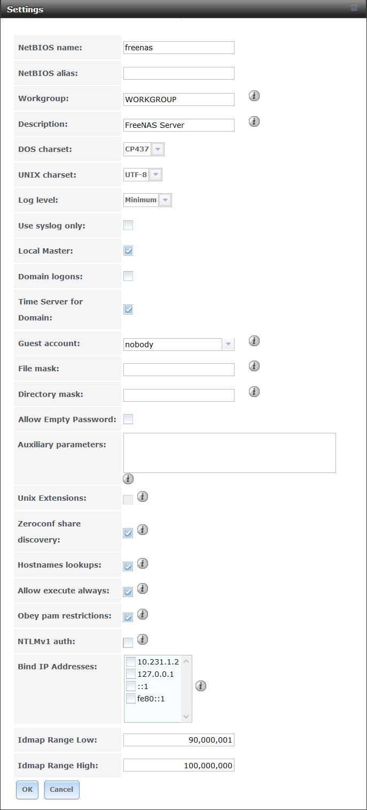
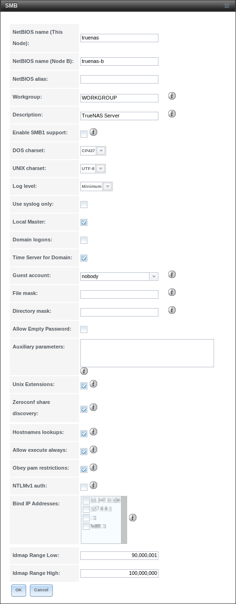
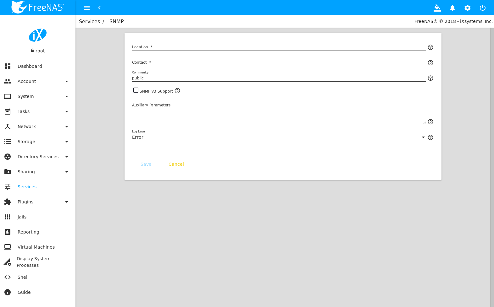

.. index:: Services
.. _Services:

Services
========

Services that ship with %brand% are configured, started, or stopped
in :guilabel:`Services`.
%brand% includes these built-in services:

* :ref:`AFP`

#ifdef truenas
* :ref:`Asigra DS-System`
#endif truenas

* :ref:`Domain Controller`

* :ref:`Dynamic DNS`

* :ref:`FTP`

* :ref:`iSCSI`

* :ref:`LLDP`

* :ref:`Netdata`

* :ref:`NFS`

* :ref:`Rsync`

* :ref:`S3`

* :ref:`S.M.A.R.T.`

* :ref:`SMB`

* :ref:`SNMP`

* :ref:`SSH`

* :ref:`TFTP`

* :ref:`UPS`

* :ref:`WebDAV`

This section demonstrates starting a %brand% service and the available
configuration options for each %brand% service.

.. index:: Start Service, Stop Service
.. _Control Services:

Control Services
----------------

:menuselection:`Services --> Control Services`, shown in
:numref:`Figure %s <control_services_fig>`,
lists all services. It also shows where to start, stop, or
configure the available services. The S.M.A.R.T. service is enabled by
default, but only runs if the storage devices support
`S.M.A.R.T. data <https://en.wikipedia.org/wiki/S.M.A.R.T.>`__
Other services default to off until started.

.. _control_services_fig:

.. figure:: images/services1f.png

   Control Services

Stopped services show a red stop symbol and a :guilabel:`Start Now`
button. Running services show a green light with a
:guilabel:`Stop Now` button.

.. tip:: Using a proxy server can prevent the list of services from
   being displayed. If a proxy server is used, do not configure it to
   proxy local network connections or websocket connections. VPN
   software can also cause problems. If the list of services is
   displayed when connecting on the local network but not when
   connecting through the VPN, check the VPN software configuration.

Services are configured by clicking the wrench icon or the name of the
service in the :guilabel:`Services` section of the tree menu.

If a service does not start, go to
:menuselection:`System --> Advanced`
and enable :guilabel:`Show console messages in the footer`.
Console messages appear at the bottom of the browser. Clicking
the console message area makes it into a pop-up window, allowing
scrolling through or copying the messages. Watch these messages for
errors when stopping or starting the problematic service.

To read the system logs for more information about a service failure,
open :ref:`Shell` and type :command:`more /var/log/messages`.

.. index:: AFP, Apple Filing Protocol
.. _AFP:

AFP
---

The settings that are configured when creating AFP Shares in
:menuselection:`Sharing --> Apple (AFP) Shares --> Add Apple (AFP)
Share` are specific to each configured AFP Share. In contrast, global
settings which apply to all AFP shares are configured in
:menuselection:`Services --> AFP`.

:numref:`Figure %s <global_afp_config_fig>`
shows the available global AFP configuration options
which are described in
:numref:`Table %s <global_afp_config_opts_tab>`.

.. _global_afp_config_fig:

#ifdef freenas
.. figure:: images/services-afp.png

   Global AFP Configuration
#endif freenas
#ifdef truenas
.. figure:: images/tn_services-afp.png

   Global AFP Configuration
#endif truenas

.. tabularcolumns:: |>{\RaggedRight}p{\dimexpr 0.16\linewidth-2\tabcolsep}
                    |>{\RaggedRight}p{\dimexpr 0.20\linewidth-2\tabcolsep}
                    |>{\RaggedRight}p{\dimexpr 0.63\linewidth-2\tabcolsep}|

.. _global_afp_config_opts_tab:

.. table:: Global AFP Configuration Options
   :class: longtable

   +----------------------------+-------------------+--------------------------------------------------------------------------------------------------------------+
   | Setting                    | Value             | Description                                                                                                  |
   |                            |                   |                                                                                                              |
   +============================+===================+==============================================================================================================+
   | Guest Access               | checkbox          | Set to disable the password prompt that appears before clients access AFP shares.                            |
   |                            |                   |                                                                                                              |
   +----------------------------+-------------------+--------------------------------------------------------------------------------------------------------------+
   | Guest account              | drop-down menu    | Select an account to use for guest access. The account must have permissions to the volume or dataset        |
   |                            |                   | being shared.                                                                                                |
   |                            |                   |                                                                                                              |
   +----------------------------+-------------------+--------------------------------------------------------------------------------------------------------------+
   | Max Connections            | integer           | Maximum number of simultaneous connections.                                                                  |
   |                            |                   |                                                                                                              |
   +----------------------------+-------------------+--------------------------------------------------------------------------------------------------------------+
   #ifdef truenas
   | Enable home directories    | checkbox          | If checked, any user home directories located under :guilabel:`Home directories`                             |
   |                            |                   | will be available over the share.                                                                            |
   |                            |                   |                                                                                                              |
   +----------------------------+-------------------+--------------------------------------------------------------------------------------------------------------+
   | Home directories           | browse button     | Select the volume or dataset which contains user home directories.                                           |
   |                            |                   |                                                                                                              |
   +----------------------------+-------------------+--------------------------------------------------------------------------------------------------------------+
   | Home share name            | string            | Overrides default home folder name with the specified value.                                                 |
   |                            |                   |                                                                                                              |
   +----------------------------+-------------------+--------------------------------------------------------------------------------------------------------------+
   | Home Share Time Machine    | checkbox          | When checked, enables Time Machine lock stealing. Apple recommends that shares designated                    |
   |                            |                   | for Time Machine backups be used exclusively for Time Machine backups.                                       |
   |                            |                   |                                                                                                              |
   +----------------------------+-------------------+--------------------------------------------------------------------------------------------------------------+
   #endif truenas
   | Database Path              | browse button     | Sets the database information to be stored in the path. Default is the root of the volume.                   |
   |                            |                   | The path must be writable even if the volume is read only.                                                   |
   |                            |                   |                                                                                                              |
   +----------------------------+-------------------+--------------------------------------------------------------------------------------------------------------+
   | Global auxiliary           | string            | Add any additional `afp.conf(5) <https://www.freebsd.org/cgi/man.cgi?query=afp.conf>`__                      |
   | parameters                 |                   | parameters not covered elsewhere in this screen.                                                             |
   |                            |                   |                                                                                                              |
   +----------------------------+-------------------+--------------------------------------------------------------------------------------------------------------+
   | Map ACLs                   | drop-down menu    | Choose mapping of effective permissions for authenticated users. Choices are: *Rights*                       |
   |                            |                   | (default, Unix-style permissions), *Mode* (ACLs), or *None*                                                  |
   |                            |                   |                                                                                                              |
   +----------------------------+-------------------+--------------------------------------------------------------------------------------------------------------+
   | Chmod Request              | drop-down menu    | Sets how Access Control Lists are handled. *Ignore*: ignores requests and gives the parent directory ACL     |
   |                            |                   | inheritance full control over new items. *Preserve*: preserves ZFS Access Control Entries for named users    |
   |                            |                   | and groups or the POSIX ACL group mask. *Simple*: is set to chmod() as requested without any extra steps.    |
   |                            |                   |                                                                                                              |
   +----------------------------+-------------------+--------------------------------------------------------------------------------------------------------------+
   | Bind IP Addresses          | selection         | Specify the IP addresses to listen for FTP connections. Highlight the desired IP addresses in the            |
   |                            |                   | :guilabel:`Available` list and use the :guilabel:`>>` button to add to the :guilabel:`Selected` list.        |
   |                            |                   |                                                                                                              |
   +----------------------------+-------------------+--------------------------------------------------------------------------------------------------------------+

.. _Troubleshooting AFP:

Troubleshooting AFP
~~~~~~~~~~~~~~~~~~~

Check for error messages in :file:`/var/log/afp.log`.

Determine which users are connected to an AFP share by typing
:command:`afpusers`.

If :guilabel:`Something wrong with the volume's CNID DB` is shown,
run this command from :ref:`Shell`, replacing the path to the
problematic AFP share:

.. code-block:: none

   dbd -rf /path/to/share

This command can take some time, depending upon the size of the pool or
dataset being shared. The CNID database is wiped and rebuilt from the
CNIDs stored in the AppleDouble files.

#ifdef truenas
.. index:: Asigra
.. _Asigra DS-System:

Asigra DS-System
----------------

Asigra Backup allows administrators to back up data from network-connected
computers and mobile devices. Asigra leverages standard API calls from a
single on-site Asigra service (DS-Client) to reach into these devices and
does not require any agent software on the endpoints to access the data.

Licensed Asigra Backup software can use %brand% as the storage backend.

.. note:: To learn more about Asigra or to enquire about licensing,
   contact sales@ixsystems.com.

For the initial backend configuration, click
:menuselection:`Services --> Asigra DS-System`. When prompted to choose
the :guilabel:`Base Filesystem`, select the dataset to store the Asigra
backups, then click :guilabel:`OK`. Any required database entries are created and the service is started.

.. note:: Asigra DS-Operator requires a working installation of
   `Java JRE <https://www.oracle.com/technetwork/java/javase/downloads/jre8-downloads-2133155.html>`__
   and a security exception for the %brand% system. To add the exception,
   use :menuselection:`Configure Java --> Security --> Edit Site List --> Add`
   and enter the URL to the %brand% system. If the browser prompts for
   the application to open *DSOP.jnlp* with, select Java Web Start
   Launcher (:command:`javaws`).

While the service is running, the :guilabel:`Open DS-Operator Web Interface`
button appears in
:menuselection:`Services --> Asigra DS-System`.
Click :guilabel:`Open DS-Operator Web Interface` to download and launch the
Asigra management application.

.. _asigra settings:

.. figure:: images/services-asigra.png
   :width: 50%

   Asigra settings

`Contact Asigra <https://www.asigra.com/contact-us>`__
for further documentation on using DS-Operator.

#endif truenas

.. index:: Domain Controller, DC
.. _Domain Controller:

Domain Controller
-----------------

%brand% can be configured to act either as the domain controller for
a network or to join an existing :ref:`Active Directory` network as a
domain controller.

This section demonstrates how to configure the %brand%
system to act as a domain controller. If the goal is to integrate
with an existing :ref:`Active Directory` network to access its
authentication and authorization services, configure
:ref:`Active Directory` instead.

.. note:: The Domain Controller service cannot be configured when
   :guilabel:`Enable Monitoring` is set in
   :menuselection:`Directory Services --> Active Directory`

Configuring a domain controller is a complex process
that requires a good understanding of how :ref:`Active Directory`
works. While
:menuselection:`Services --> Domain Controller`
makes it easy to enter the needed settings into the |web-ui|,
it is important to understand what those settings
should be. Before beginning configuration, read through the
`Samba AD DC HOWTO
<https://wiki.samba.org/index.php/Samba_AD_DC_HOWTO>`__.
After %brand% is configured, use the RSAT utility from a Windows
system to manage the domain controller. The Samba AD DC HOWTO includes
instructions for installing and configuring RSAT.

:numref:`Figure %s <domain_controller_settings_fig>`
shows the configuration screen for creating a domain controller and
:numref:`Table %s <domain_controller_opts_tab>`
summarizes the available options.

.. _domain_controller_settings_fig:

.. figure:: images/services-domain-controller.png

   Domain Controller Settings

.. tabularcolumns:: |>{\RaggedRight}p{\dimexpr 0.16\linewidth-2\tabcolsep}
                    |>{\RaggedRight}p{\dimexpr 0.20\linewidth-2\tabcolsep}
                    |>{\RaggedRight}p{\dimexpr 0.63\linewidth-2\tabcolsep}|

.. _domain_controller_opts_tab:

.. table:: Domain Controller Configuration Options
   :class: longtable

   +---------------------------+-------------------+------------------------------------------------------------------------------------------------------------------------------+
   | Setting                   | Value             | Description                                                                                                                  |
   |                           |                   |                                                                                                                              |
   +===========================+===================+==============================================================================================================================+
   | Realm                     | string            | Enter a capitalized DNS realm name.                                                                                          |
   |                           |                   |                                                                                                                              |
   +---------------------------+-------------------+------------------------------------------------------------------------------------------------------------------------------+
   | Domain                    | string            | Enter a capitalized domain name.                                                                                             |
   |                           |                   |                                                                                                                              |
   +---------------------------+-------------------+------------------------------------------------------------------------------------------------------------------------------+
   | Server Role               | drop-down menu    | At this time, the only supported role is as the domain controller for a new domain.                                          |
   |                           |                   |                                                                                                                              |
   +---------------------------+-------------------+------------------------------------------------------------------------------------------------------------------------------+
   | DNS Forwarder             | string            | Enter the IP address of the DNS forwarder. Required for recursive queries when *SAMBA_INTERNAL* is selected.                 |
   |                           |                   |                                                                                                                              |
   +---------------------------+-------------------+------------------------------------------------------------------------------------------------------------------------------+
   | Domain Forest Level       | drop-down menu    | Choices are *2000*, *2003*, *2008*, *2008_R2*, *2012*, or *2012_R2*. Refer to                                                |
   |                           |                   | `Understanding Active Directory Domain Services (AD DS) Functional Levels                                                    |
   |                           |                   | <https://docs.microsoft.com/en-us/previous-versions/windows/it-pro/windows-server-2008-R2-and-2008/cc754918(v=ws.10)>`__.    |
   |                           |                   |                                                                                                                              |
   +---------------------------+-------------------+------------------------------------------------------------------------------------------------------------------------------+
   | Administrator password    | string            | Enter the password to be used for the :ref:`Active Directory` administrator account.                                         |
   |                           |                   |                                                                                                                              |
   +---------------------------+-------------------+------------------------------------------------------------------------------------------------------------------------------+
   | Kerberos Realm            | drop-down menu    | Auto-populates with information from the :guilabel:`Realm` when the settings in this screen are saved.                       |
   |                           |                   |                                                                                                                              |
   +---------------------------+-------------------+------------------------------------------------------------------------------------------------------------------------------+

.. _Samba Domain Controller Backup:

Samba Domain Controller Backup
~~~~~~~~~~~~~~~~~~~~~~~~~~~~~~

A :command:`samba_backup` script is available to back up Samba4 domain
controller settings is available. From the :ref:`Shell`, run
:samp:`/usr/local/bin/samba_backup --usage` to show the input options.

.. index:: Dynamic DNS, DDNS
.. _Dynamic DNS:

Dynamic DNS
-----------

Dynamic DNS (DDNS) is useful if the %brand% system is connected to an
ISP that periodically changes the IP address of the system. With dynamic
DNS, the system can automatically associate its current IP address with
a domain name, allowing access to the %brand% system even if the IP
address changes. DDNS requires registration with a DDNS service such
as `DynDNS <https://dyn.com/dns/>`__.

:numref:`Figure %s <config_ddns_fig>` shows the DDNS configuration
screen and :numref:`Table %s <ddns_config_opts_tab>` summarizes the
configuration options. The values for these fields are provided by the
DDNS provider. After configuring DDNS, remember to start the DDNS
service in
:menuselection:`Services --> Control Services`.

.. _config_ddns_fig:

.. figure:: images/services-ddns.png

   Configuring DDNS

.. tabularcolumns:: |>{\RaggedRight}p{\dimexpr 0.16\linewidth-2\tabcolsep}
                    |>{\RaggedRight}p{\dimexpr 0.20\linewidth-2\tabcolsep}
                    |>{\RaggedRight}p{\dimexpr 0.63\linewidth-2\tabcolsep}|

.. _ddns_config_opts_tab:

.. table:: DDNS Configuration Options
   :class: longtable

   +-----------------------+-------------------+-----------------------------------------------------------------------------------------------------------------+
   | Setting               | Value             | Description                                                                                                     |
   |                       |                   |                                                                                                                 |
   +=======================+===================+=================================================================================================================+
   | Provider              | drop-down menu    | Several providers are supported. If a specific provider is not listed, select *Custom Provider*                 |
   |                       |                   | and enter the information in the *Custom Server* and *Custom Path* fields.                                      |
   |                       |                   |                                                                                                                 |
   +-----------------------+-------------------+-----------------------------------------------------------------------------------------------------------------+
   | CheckIP Server SSL    | string            | Set to use HTTPS for the connection to the *CheckIP Server*.                                                    |
   |                       |                   |                                                                                                                 |
   +-----------------------+-------------------+-----------------------------------------------------------------------------------------------------------------+
   | CheckIP Server        | string            | Enter the name and port of the server that reports the external IP address. Example: *server.name.org:port*.    |
   |                       |                   |                                                                                                                 |
   +-----------------------+-------------------+-----------------------------------------------------------------------------------------------------------------+
   | CheckIP Path          | string            | Enter the path that is requested by the *CheckIP Server* to determine the user IP address.                      |
   |                       |                   |                                                                                                                 |
   +-----------------------+-------------------+-----------------------------------------------------------------------------------------------------------------+
   | Use SSL               | checkbox          | Set to use HTTPS for the connection to the server that updates the DNS record.                                  |
   |                       |                   |                                                                                                                 |
   +-----------------------+-------------------+-----------------------------------------------------------------------------------------------------------------+
   | Domain name           | string            | Enter a fully qualified domain name. Separate multiple domains with a space, comma (:literal:`,`), or           |
   |                       |                   | semicolon (:literal:`;`). Example: *yourname.dyndns.org;myname.dyndns.org*                                      |
   |                       |                   |                                                                                                                 |
   +-----------------------+-------------------+-----------------------------------------------------------------------------------------------------------------+
   | Username              | string            | Enter the username used to log in to the provider and update the record.                                        |
   |                       |                   |                                                                                                                 |
   +-----------------------+-------------------+-----------------------------------------------------------------------------------------------------------------+
   | Password              | string            | Enter the password used to log in to the provider and update the record.                                        |
   |                       |                   |                                                                                                                 |
   +-----------------------+-------------------+-----------------------------------------------------------------------------------------------------------------+
   | Update period         | integer           | How often the IP is checked in seconds.                                                                         |
   |                       |                   |                                                                                                                 |
   +-----------------------+-------------------+-----------------------------------------------------------------------------------------------------------------+

When using :literal:`he.net`, enter the domain name for
:guilabel:`Username` and enter the DDNS key generated for that
domain's A entry at the `he.net <https://he.net>`__ website for
:guilabel:`Password`.

.. index:: FTP, File Transfer Protocol
.. _FTP:

FTP
---

%brand% uses the `proftpd <http://www.proftpd.org/>`__ FTP server to
provide FTP services. Once the FTP service is configured and started,
clients can browse and download data using a web browser or FTP client
software. The advantage of FTP is that easy-to-use cross-platform
utilities are available to manage uploads to and downloads from the
%brand% system. The disadvantage of FTP is that it is considered to
be an insecure protocol, meaning that it should not be used to
transfer sensitive files. If concerned about sensitive data,
see :ref:`Encrypting FTP`.

This section provides an overview of the FTP configuration options. It
then provides examples for configuring anonymous FTP, specified user
access within a chroot environment, encrypting FTP connections, and
troubleshooting tips.

:numref:`Figure %s <configuring_ftp_fig>` shows the configuration screen
for :menuselection:`Services --> FTP`. Some settings are only available
in :guilabel:`Advanced Mode`. To see these settings, either click the
:guilabel:`Advanced Mode` button or configure the system to always
display these settings by enabling the
:guilabel:`Show advanced fields by default` setting in
:menuselection:`System --> Advanced`.

.. _configuring_ftp_fig:

.. figure:: images/ftp1.png

   Configuring FTP

:numref:`Table %s <ftp_config_opts_tab>`
summarizes the available options when configuring the FTP server.

.. tabularcolumns:: |>{\RaggedRight}p{\dimexpr 0.20\linewidth-2\tabcolsep}
                    |>{\RaggedRight}p{\dimexpr 0.14\linewidth-2\tabcolsep}
                    |>{\Centering}p{\dimexpr 0.12\linewidth-2\tabcolsep}
                    |>{\RaggedRight}p{\dimexpr 0.54\linewidth-2\tabcolsep}|

.. _ftp_config_opts_tab:

.. table:: FTP Configuration Options
   :class: longtable

   +--------------------------------------------------------------+---------------+-------------+------------------------------------------------------------------------------------+
   | Setting                                                      | Value         | Advanced    | Description                                                                        |
   |                                                              |               | Mode        |                                                                                    |
   |                                                              |               |             |                                                                                    |
   +==============================================================+===============+=============+====================================================================================+
   | Port                                                         | integer       |             | Set the port the FTP service listens on.                                           |
   |                                                              |               |             |                                                                                    |
   +--------------------------------------------------------------+---------------+-------------+------------------------------------------------------------------------------------+
   | Clients                                                      | integer       |             | Set the maximum number of simultaneous clients.                                    |
   |                                                              |               |             |                                                                                    |
   +--------------------------------------------------------------+---------------+-------------+------------------------------------------------------------------------------------+
   | Connections                                                  | integer       |             | Set the maximum number of connections per IP address where *0* means unlimited.    |
   |                                                              |               |             |                                                                                    |
   +--------------------------------------------------------------+---------------+-------------+------------------------------------------------------------------------------------+
   | Login Attempts                                               | integer       |             | Enter the maximum number of attempts before client is disconnected.                |
   |                                                              |               |             | Increase this if users are prone to typos.                                         |
   |                                                              |               |             |                                                                                    |
   +--------------------------------------------------------------+---------------+-------------+------------------------------------------------------------------------------------+
   | Timeout                                                      | integer       |             | Enter the maximum client idle time in seconds before client is disconnected.       |
   |                                                              |               |             |                                                                                    |
   +--------------------------------------------------------------+---------------+-------------+------------------------------------------------------------------------------------+
   | Allow Root Login                                             | checkbox      |             | Enabling this option is discouraged as increases security risk.                    |
   |                                                              |               |             |                                                                                    |
   +--------------------------------------------------------------+---------------+-------------+------------------------------------------------------------------------------------+
   | Allow Anonymous Login                                        | checkbox      |             | Set to enable anonymous FTP logins with access to the directory specified in       |
   |                                                              |               |             | :guilabel:`Path`.                                                                  |
   |                                                              |               |             |                                                                                    |
   +--------------------------------------------------------------+---------------+-------------+------------------------------------------------------------------------------------+
   | Path                                                         | browse        |             | Set the root directory for anonymous FTP connections.                              |
   |                                                              | button        |             |                                                                                    |
   |                                                              |               |             |                                                                                    |
   +--------------------------------------------------------------+---------------+-------------+------------------------------------------------------------------------------------+
   | Allow Local User Login                                       | checkbox      |             | Required if :guilabel:`Anonymous Login` is disabled.                               |
   |                                                              |               |             |                                                                                    |
   +--------------------------------------------------------------+---------------+-------------+------------------------------------------------------------------------------------+
   | Display Login                                                | string        |             | Specify the message displayed to local login users after authentication.           |
   |                                                              |               |             | Not displayed to anonymous login users.                                            |
   |                                                              |               |             |                                                                                    |
   +--------------------------------------------------------------+---------------+-------------+------------------------------------------------------------------------------------+
   | File Permission                                              | checkboxes    | ✓           | Set the default permissions for newly created files.                               |
   |                                                              |               |             |                                                                                    |
   +--------------------------------------------------------------+---------------+-------------+------------------------------------------------------------------------------------+
   | Directory Permission                                         | checkboxes    | ✓           | Set the default permissions for newly created directories.                         |
   |                                                              |               |             |                                                                                    |
   +--------------------------------------------------------------+---------------+-------------+------------------------------------------------------------------------------------+
   | Enable `FXP                                                  | checkbox      | ✓           | Set to enable the File eXchange Protocol. This setting makes the server            |
   | <https://en.wikipedia.org/wiki/File_eXchange_Protocol>`__    |               |             | vulnerable to FTP bounce attacks so it is not recommended                          |
   |                                                              |               |             |                                                                                    |
   +--------------------------------------------------------------+---------------+-------------+------------------------------------------------------------------------------------+
   | Allow Transfer Resumption                                    | checkbox      |             | Set to allow FTP clients to resume interrupted transfers.                          |
   |                                                              |               |             |                                                                                    |
   +--------------------------------------------------------------+---------------+-------------+------------------------------------------------------------------------------------+
   | Always Chroot                                                | checkbox      |             | When set, a local user is only allowed access to their home directory unless       |
   |                                                              |               |             | the user is a member of group *wheel*.                                             |
   |                                                              |               |             |                                                                                    |
   +--------------------------------------------------------------+---------------+-------------+------------------------------------------------------------------------------------+
   | Require IDENT Authentication                                 | checkbox      | ✓           | Setting this option results in timeouts if :command:`identd` is not running on     |
   |                                                              |               |             | the client.                                                                        |
   +--------------------------------------------------------------+---------------+-------------+------------------------------------------------------------------------------------+
   | Perform Reverse DNS Lookups                                  | checkbox      |             | Set to perform reverse DNS lookups on client IPs. Can cause long delays            |
   |                                                              |               |             | if reverse DNS is not configured.                                                  |
   |                                                              |               |             |                                                                                    |
   +--------------------------------------------------------------+---------------+-------------+------------------------------------------------------------------------------------+
   | Masquerade address                                           | string        |             | Public IP address or hostname. Set if FTP clients cannot connect through a         |
   |                                                              |               |             | NAT device.                                                                        |
   |                                                              |               |             |                                                                                    |
   +--------------------------------------------------------------+---------------+-------------+------------------------------------------------------------------------------------+
   | Minimum passive port                                         | integer       | ✓           | Used by clients in PASV mode, default of *0* means any port above 1023.            |
   |                                                              |               |             |                                                                                    |
   +--------------------------------------------------------------+---------------+-------------+------------------------------------------------------------------------------------+
   | Maximum passive port                                         | integer       | ✓           | Used by clients in PASV mode, default of *0* means any port above 1023.            |
   |                                                              |               |             |                                                                                    |
   +--------------------------------------------------------------+---------------+-------------+------------------------------------------------------------------------------------+
   | Local user upload bandwidth                                  | integer       | ✓           | Defined in KiB/s, default of *0* means unlimited.                                  |
   |                                                              |               |             |                                                                                    |
   +--------------------------------------------------------------+---------------+-------------+------------------------------------------------------------------------------------+
   | Local user download bandwidth                                | integer       | ✓           | Defined in KiB/s, default of *0* means unlimited.                                  |
   |                                                              |               |             |                                                                                    |
   +--------------------------------------------------------------+---------------+-------------+------------------------------------------------------------------------------------+
   | Anonymous user upload bandwidth                              | integer       | ✓           | Defined in KiB/s, default of *0* means unlimited.                                  |
   |                                                              |               |             |                                                                                    |
   +--------------------------------------------------------------+---------------+-------------+------------------------------------------------------------------------------------+
   | Anonymous user download bandwidth                            | integer       | ✓           | Defined in KiB/s, default of *0* means unlimited.                                  |
   |                                                              |               |             |                                                                                    |
   +--------------------------------------------------------------+---------------+-------------+------------------------------------------------------------------------------------+
   | Enable TLS                                                   | checkbox      | ✓           | Set to enable encrypted connections. Requires a certificate to be created or       |
   |                                                              |               |             | imported using :ref:`Certificates`.                                                |
   |                                                              |               |             |                                                                                    |
   +--------------------------------------------------------------+---------------+-------------+------------------------------------------------------------------------------------+
   | TLS policy                                                   | drop-down     | ✓           | The selected policy defines whether the control channel, data channel,             |
   |                                                              | menu          |             | both channels, or neither channel of an FTP session must occur over SSL/TLS.       |
   |                                                              |               |             | The policies are described                                                         |
   |                                                              |               |             | `here                                                                              |
   |                                                              |               |             | <http://www.proftpd.org/docs/directives/linked/config_ref_TLSRequired.html>`__.    |
   |                                                              |               |             |                                                                                    |
   +--------------------------------------------------------------+---------------+-------------+------------------------------------------------------------------------------------+
   | TLS allow client renegotiations                              | checkbox      | ✓           | Enabling this option is **not** recommended as it breaks several                   |
   |                                                              |               |             | security measures. For this and the rest of the TLS fields, refer to               |
   |                                                              |               |             | `mod_tls <http://www.proftpd.org/docs/contrib/mod_tls.html>`__                     |
   |                                                              |               |             | for more details.                                                                  |
   |                                                              |               |             |                                                                                    |
   +--------------------------------------------------------------+---------------+-------------+------------------------------------------------------------------------------------+
   | TLS allow dot login                                          | checkbox      | ✓           | If set, the user home directory is checked for a :file:`.tlslogin` file which      |
   |                                                              |               |             | contains one or more PEM-encoded certificates. If not found, the user              |
   |                                                              |               |             | is prompted for password authentication.                                           |
   |                                                              |               |             |                                                                                    |
   +--------------------------------------------------------------+---------------+-------------+------------------------------------------------------------------------------------+
   | TLS allow per user                                           | checkbox      | ✓           | If set, the user password can be sent unencrypted.                                 |
   |                                                              |               |             |                                                                                    |
   +--------------------------------------------------------------+---------------+-------------+------------------------------------------------------------------------------------+
   | TLS common name required                                     | checkbox      | ✓           | Set to require the certificate common name to match the FQDN of the host.          |
   |                                                              |               |             |                                                                                    |
   +--------------------------------------------------------------+---------------+-------------+------------------------------------------------------------------------------------+
   | TLS enable diagnostics                                       | checkbox      | ✓           | If set when troubleshooting a connection, logs more verbosely.                     |
   |                                                              |               |             |                                                                                    |
   +--------------------------------------------------------------+---------------+-------------+------------------------------------------------------------------------------------+
   | TLS export certificate data                                  | checkbox      | ✓           | If set, exports the certificate environment variables.                             |
   |                                                              |               |             |                                                                                    |
   +--------------------------------------------------------------+---------------+-------------+------------------------------------------------------------------------------------+
   | TLS no certificate request                                   | checkbox      | ✓           | Try enabling this option if the client cannot connect and it is suspected          |
   |                                                              |               |             | the client software is not properly handling server certificate requests.          |
   |                                                              |               |             |                                                                                    |
   +--------------------------------------------------------------+---------------+-------------+------------------------------------------------------------------------------------+
   | TLS no empty fragments                                       | checkbox      | ✓           | Enabling this is **not** recommended as it bypasses a security mechanism.          |
   |                                                              |               |             |                                                                                    |
   +--------------------------------------------------------------+---------------+-------------+------------------------------------------------------------------------------------+
   | TLS no session reuse required                                | checkbox      | ✓           | Enabling this reduces the security of the connection. Only use this if the         |
   |                                                              |               |             | client does not understand reused SSL sessions.                                    |
   |                                                              |               |             |                                                                                    |
   +--------------------------------------------------------------+---------------+-------------+------------------------------------------------------------------------------------+
   | TLS export standard vars                                     | checkbox      | ✓           | If enabled, sets several environment variables.                                    |
   |                                                              |               |             |                                                                                    |
   +--------------------------------------------------------------+---------------+-------------+------------------------------------------------------------------------------------+
   | TLS DNS name required                                        | checkbox      | ✓           | If set, the client DNS name must resolve to its IP address and the cert must       |
   |                                                              |               |             | contain the same DNS name.                                                         |
   |                                                              |               |             |                                                                                    |
   +--------------------------------------------------------------+---------------+-------------+------------------------------------------------------------------------------------+
   | TLS IP address required                                      | checkbox      | ✓           | If set, the client certificate must contain the IP address that matches the        |
   |                                                              |               |             | IP address of the client.                                                          |
   |                                                              |               |             |                                                                                    |
   +--------------------------------------------------------------+---------------+-------------+------------------------------------------------------------------------------------+
   | Certificate                                                  | drop-down     |             | The SSL certificate to be used for TLS FTP connections. To create a                |
   |                                                              | menu          |             | certificate, use :menuselection:`System --> Certificates`.                         |
   |                                                              |               |             |                                                                                    |
   +--------------------------------------------------------------+---------------+-------------+------------------------------------------------------------------------------------+
   | Auxiliary parameters                                         | string        | ✓           | Add any additional `proftpd(8)                                                     |
   |                                                              |               |             | <https://www.freebsd.org/cgi/man.cgi?query=proftpd>`__ parameters not covered      |
   |                                                              |               |             | elsewhere in this screen.                                                          |
   |                                                              |               |             |                                                                                    |
   +--------------------------------------------------------------+---------------+-------------+------------------------------------------------------------------------------------+

This example demonstrates the auxiliary parameters that prevent all
users from performing the FTP DELETE command:

.. code-block:: none

   <Limit DELE>
   DenyAll
   </Limit>

.. _Anonymous FTP:

Anonymous FTP
~~~~~~~~~~~~~

Anonymous FTP may be appropriate for a small network where the
%brand% system is not accessible from the Internet and everyone in
the internal network needs easy access to the stored data. Anonymous
FTP does not require a user account for every user. In addition,
passwords are not required so it is not necessary to manage changed
passwords on the %brand% system.

To configure anonymous FTP:

#.  Give the built-in ftp user account permissions to the
    volume/dataset to be shared in
    :menuselection:`Storage --> Volumes` as follows:

    * :guilabel:`Owner(user)`: select the built-in *ftp* user from the
      drop-down menu

    * :guilabel:`Owner(group)`: select the built-in *ftp* group from
      the drop-down menu

    * :guilabel:`Mode`: review that the permissions are appropriate
      for the share

    .. note:: For FTP, the type of client does not matter when it
       comes to the type of ACL. This means that Unix
       ACLs are always used, even if Windows clients are accessing
       %brand% via FTP.

#.  Configure anonymous FTP in
    :menuselection:`Services --> FTP`
    by setting these attributes:

    * :guilabel:`Allow Anonymous Login`: enable this option

    * :guilabel:`Path`: browse to the volume/dataset/directory to be
      shared

#.  Start the FTP service in
    :menuselection:`Services --> Control Services`.
    Click the :guilabel:`Start Now` button next to :guilabel:`FTP`.
    The FTP service takes a second or so to start. The indicator
    changes to green when the service is running, and the
    button changes to :guilabel:`Stop Now`.

#.  Test the connection from a client using a utility such as
    `Filezilla <https://filezilla-project.org/>`__.

In the example shown in
:numref:`Figure %s <ftp_filezilla_fig>`,
the user has entered this information into the Filezilla client:

* IP address of the %brand% server: *192.168.1.113*

* :guilabel:`Username`: *anonymous*

* :guilabel:`Password`: the email address of the user

.. _ftp_filezilla_fig:

.. figure:: images/filezilla.png

   Connecting Using Filezilla

The messages within the client indicate the FTP connection is
successful. The user can now navigate the contents of the root folder
on the remote site. This is the pool or dataset specified in the FTP
service configuration. The user can also transfer files between the
local site (their system) and the remote site (the %brand% system).

.. _FTP in chroot:

FTP in chroot
~~~~~~~~~~~~~

If users are required to authenticate before accessing the data on
the %brand% system, either create a user account for each user or import
existing user accounts using :ref:`Active Directory` or :ref:`LDAP`.
Then create a ZFS dataset for *each* user. Next, chroot each user so
they are limited to the contents of their own home directory. Datasets
provide the added benefit of configuring a quota so that the size of a
user home directory is limited to the size of the quota.

To configure this scenario:

#.  Create a ZFS dataset for each user in
    :menuselection:`Storage --> Volumes`.
    Click an existing
    :menuselection:`ZFS volume --> Create ZFS Dataset`
    and set an appropriate quota for each dataset. Repeat this process
    to create a dataset for every user that needs access to the FTP
    service.

#.  When not using AD or LDAP, create a user account for 
    each user in
    :menuselection:`Account --> Users --> Add User`.
    For each user, browse to the dataset created for that user in the
    :guilabel:`Home Directory` field. Repeat this process to create a
    user account for every user that needs access to the FTP service,
    making sure to assign each user their own dataset.

#.  Set the permissions for each dataset in
    :menuselection:`Storage --> Volumes`.
    Click the :guilabel:`Change Permissions` button for a dataset to
    assign a user account as :guilabel:`Owner` of that dataset and to
    set the desired permissions for that user. Repeat for each
    dataset.

    .. note:: For FTP, the type of client does not matter when it
       comes to the type of ACL. This means Unix ACLs are always
       used, even if Windows clients will be accessing %brand% with
       FTP.

#.  Configure FTP in
    :menuselection:`Services --> FTP`
    with these attributes:

    * :guilabel:`Path`: browse to the parent volume containing the
      datasets.

    * Make sure the options for :guilabel:`Allow Anonymous Login` and
      :guilabel:`Allow Root Login` are **unselected**.

    * Select the :guilabel:`Allow Local User Login` option to enable it.

    * Enable the :guilabel:`Always Chroot` option.

#.  Start the FTP service in
    :menuselection:`Services --> Control Services`.
    Click the :guilabel:`Start Now` button next to :guilabel:`FTP`.
    The FTP service takes a second or so to start. The indicator
    changes to green to show that the service is running, and the
    button changes to :guilabel:`Stop Now`.

#.  Test the connection from a client using a utility such as
    Filezilla.

To test this configuration in Filezilla, use the *IP address* of the
%brand% system, the *Username* of a user that is associated with
a dataset, and the *Password* for that user. The messages will indicate
the authorization and the FTP connection are successful. The user can
now navigate the contents of the root folder on the remote site. This
time it is not the entire pool but the dataset created for that user.
The user can transfer files between the local site (their system) and
the remote site (their dataset on the %brand% system).

.. _Encrypting FTP:

Encrypting FTP
~~~~~~~~~~~~~~

To configure any FTP scenario to use encrypted connections:

#.  Import or create a certificate authority using the instructions in
    :ref:`CAs`. Then, import or create the certificate to use for
    encrypted connections using the instructions in
    :ref:`Certificates`.

#.  In
    :menuselection:`Services --> FTP`,
    choose the certificate in the
    :guilabel:`Certificate`, and set the :guilabel:`Enable TLS` option.

#.  Specify secure FTP when accessing the %brand% system. For
    example, in Filezilla enter *ftps://IP_address* (for an implicit
    connection) or *ftpes://IP_address* (for an explicit connection)
    as the Host when connecting. The first time a user connects, they
    will be presented with the certificate of the %brand% system.
    Click :guilabel:`OK` to accept the certificate and negotiate an
    encrypted connection.

#.  To force encrypted connections, select *on* for the
    :guilabel:`TLS Policy`.

.. _Troubleshooting FTP:

Troubleshooting FTP
~~~~~~~~~~~~~~~~~~~

The FTP service will not start if it cannot resolve the system
hostname to an IP address with DNS. To see if the FTP service is
running, open :ref:`Shell` and issue the command:

.. code-block:: none

   sockstat -4p 21

If there is nothing listening on port 21, the FTP service is not
running. To see the error message that occurs when %brand% tries to
start the FTP service, go to
:menuselection:`System --> Advanced`,
check :guilabel:`Show console messages in the footer`, and click
:guilabel:`Save`. Go to
:menuselection:`Services --> Control Services`
and switch the FTP service off, then back on. Watch the console
messages at the bottom of the browser for errors.

If the error refers to DNS, either create an entry in the local DNS
server with the %brand% system hostname and IP address, or add an entry
for the IP address of the %brand% system in the
:menuselection:`Network --> Global Configuration`
:guilabel:`Host name data base` field.

.. _iSCSI:

iSCSI
-----

Refer to :ref:`Block (iSCSI)` for instructions on configuring iSCSI.
To start the iSCSI service, click its entry in :guilabel:`Services`.

.. note:: A warning message is shown if the iSCSI service is stopped
   when initiators are connected. Open the :ref:`Shell` and type
   :command:`ctladm islist` to determine the names of the connected
   initiators.

.. index:: LLDP, Link Layer Discovery Protocol
.. _LLDP:

LLDP
----

The Link Layer Discovery Protocol (LLDP) is used by network devices to
advertise their identity, capabilities, and neighbors on an Ethernet
network. %brand% uses the
`ladvd <https://github.com/sspans/ladvd>`__
LLDP implementation. If the network contains managed switches,
configuring and starting the LLDP service will tell the %brand%
system to advertise itself on the network.

:numref:`Figure %s <config_lldp_fig>`
shows the LLDP configuration screen and
:numref:`Table %s <lldP_config_opts_tab>`
summarizes the configuration options for the LLDP service.

.. _config_lldp_fig:

.. figure:: images/lldp.png

   Configuring LLDP

.. tabularcolumns:: |>{\RaggedRight}p{\dimexpr 0.16\linewidth-2\tabcolsep}
                    |>{\RaggedRight}p{\dimexpr 0.20\linewidth-2\tabcolsep}
                    |>{\RaggedRight}p{\dimexpr 0.63\linewidth-2\tabcolsep}|

.. _lldp_config_opts_tab:

.. table:: LLDP Configuration Options
   :class: longtable

   +--------------------------+-------------+------------------------------------------------------------------------------------------------+
   | Setting                  | Value       | Description                                                                                    |
   |                          |             |                                                                                                |
   +==========================+=============+================================================================================================+
   | Interface Description    | checkbox    | Set to enable receive mode and to save received peer information in interface descriptions.    |
   |                          |             |                                                                                                |
   +--------------------------+-------------+------------------------------------------------------------------------------------------------+
   | Country Code             | string      | Required for LLDP location support. Enter a two-letter ISO 3166 country code.                  |
   |                          |             |                                                                                                |
   +--------------------------+-------------+------------------------------------------------------------------------------------------------+
   | Location                 | string      | Optional. Specify the physical location of the host.                                           |
   |                          |             |                                                                                                |
   +--------------------------+-------------+------------------------------------------------------------------------------------------------+

.. index:: Netdata
.. _Netdata:

Netdata
-------

Netdata is a real-time performance and monitoring system. It displays
data as web dashboards.

Start the Netdata service from the :ref:`Services` screen. Click the
wrench icon to display the Netdata settings dialog shown in
:numref:`Figure %s <services_netdata_settings_fig>`.

.. _services_netdata_settings_fig:

.. figure:: images/services-netdata-config.png

   Netdata Settings Dialog

Click the :guilabel:`Take me to the Netdata UI` button to view the web
dashboard as shown in
:numref:`Figure %s <services_netdata_fig>`.

.. _services_netdata_fig:

.. figure:: images/services-netdata.png

   Netdata Web Dashboard

More information on configuring and using Netdata is available at the
`Netdata website <https://my-netdata.io/>`__.

.. index:: NFS, Network File System
.. _NFS:

NFS
---

The settings that are configured when creating NFS Shares in
:menuselection:`Sharing --> Unix (NFS) Shares
--> Add Unix (NFS) Share`
are specific to each configured NFS Share. In contrast, global
settings which apply to all NFS shares are configured in
:menuselection:`Services --> NFS`.

:numref:`Figure %s <config_nfs_fig>`
shows the configuration screen and
:numref:`Table %s <nfs_config_opts_tab>`
summarizes the configuration options for the NFS service.

.. _config_nfs_fig:

.. figure:: images/services-nfs.png

   Configuring NFS

.. tabularcolumns:: |>{\RaggedRight}p{\dimexpr 0.16\linewidth-2\tabcolsep}
                    |>{\RaggedRight}p{\dimexpr 0.20\linewidth-2\tabcolsep}
                    |>{\RaggedRight}p{\dimexpr 0.63\linewidth-2\tabcolsep}|

.. _nfs_config_opts_tab:

.. table:: NFS Configuration Options
   :class: longtable

   +--------------------------+---------------+--------------------------------------------------------------------------------------------------------------------+
   | Setting                  | Value         | Description                                                                                                        |
   |                          |               |                                                                                                                    |
   +==========================+===============+====================================================================================================================+
   | Number of servers        | integer       | Specify how many servers to create. Increase if NFS client responses are slow. To limit CPU context switching,     |
   |                          |               | keep this number less than or equal to the number of CPUs reported by :samp:`sysctl -n kern.smp.cpus`.             |
   |                          |               |                                                                                                                    |
   +--------------------------+---------------+--------------------------------------------------------------------------------------------------------------------+
   | Serve UDP NFS clients    | checkbox      | Set if NFS clients need to use UDP.                                                                                |
   |                          |               |                                                                                                                    |
   +--------------------------+---------------+--------------------------------------------------------------------------------------------------------------------+
   | Bind IP Addresses        | checkboxes    | Select the IP addresses to listen on for NFS requests. When unselected, NFS listens on all available addresses.    |
   |                          |               |                                                                                                                    |
   +--------------------------+---------------+--------------------------------------------------------------------------------------------------------------------+
   | Allow non-root mount     | checkbox      | Set only if the NFS client requires it.                                                                            |
   |                          |               |                                                                                                                    |
   +--------------------------+---------------+--------------------------------------------------------------------------------------------------------------------+
   | Enable NFSv4             | checkbox      | Set to switch from NFSv3 to NFSv4. The default is NFSv3.                                                           |
   |                          |               |                                                                                                                    |
   +--------------------------+---------------+--------------------------------------------------------------------------------------------------------------------+
   | NFSv3 ownership          | checkbox      | Grayed out unless :guilabel:`Enable NFSv4` is checked and, in turn, grays out :guilabel:`Support>16 groups`        |
   | model for NFSv4          |               | which is incompatible. Set this option if NFSv4 ACL support is needed without requiring the client and             |
   |                          |               | the server to sync users and groups.                                                                               |
   |                          |               |                                                                                                                    |
   +--------------------------+---------------+--------------------------------------------------------------------------------------------------------------------+
   | Require Kerberos         | checkbox      | Set to force NFS shares to fail if the Kerberos ticket is unavailable.                                             |
   | for NFSv4                |               |                                                                                                                    |
   |                          |               |                                                                                                                    |
   +--------------------------+---------------+--------------------------------------------------------------------------------------------------------------------+
   | mountd(8) bind port      | integer       | Optional. Specify the port that                                                                                    |
   |                          |               | `mountd(8) <https://www.freebsd.org/cgi/man.cgi?query=mountd>`__ binds to.                                         |
   |                          |               |                                                                                                                    |
   +--------------------------+---------------+--------------------------------------------------------------------------------------------------------------------+
   | rpc.statd(8)             | integer       | Optional. Specify the port that                                                                                    |
   | bind port                |               | `rpc.statd(8) <https://www.freebsd.org/cgi/man.cgi?query=rpc.statd>`__ binds to.                                   |
   |                          |               |                                                                                                                    |
   +--------------------------+---------------+--------------------------------------------------------------------------------------------------------------------+
   | rpc.lockd(8)             | integer       | Optional. Specify the port that                                                                                    |
   | bind port                |               | `rpc.lockd(8) <https://www.freebsd.org/cgi/man.cgi?query=rpc.lockd>`__ binds to.                                   |
   |                          |               |                                                                                                                    |
   +--------------------------+---------------+--------------------------------------------------------------------------------------------------------------------+
   | Support>16 groups        | checkbox      | Set this option if any users are members of more than 16 groups (useful in AD environments). Note this assumes     |
   |                          |               | group membership is configured correctly on the NFS server.                                                        |
   |                          |               |                                                                                                                    |
   +--------------------------+---------------+--------------------------------------------------------------------------------------------------------------------+
   | Log mountd(8)            | checkbox      | Enable logging of `mountd(8) <https://www.freebsd.org/cgi/man.cgi?query=mountd>`__                                 |
   | requests                 |               | requests by syslog.                                                                                                |
   |                          |               |                                                                                                                    |
   +--------------------------+---------------+--------------------------------------------------------------------------------------------------------------------+
   | Log rpc.statd(8)         | checkbox      | Enable logging of `rpc.statd(8) <https://www.freebsd.org/cgi/man.cgi?query=rpc.statd>`__ and                       |
   | and rpc.lockd(8)         |               | `rpc.lockd(8) <https://www.freebsd.org/cgi/man.cgi?query=rpc.lockd>`__ requests by syslog.                         |
   |                          |               |                                                                                                                    |
   +--------------------------+---------------+--------------------------------------------------------------------------------------------------------------------+

.. note:: NFSv4 sets all ownership to *nobody:nobody* if user and
   group do not match on client and server.

.. index:: Rsync
.. _Rsync:

Rsync
-----

:menuselection:`Services --> Rsync`
is used to configure an rsync server when using rsync module mode. Refer
to :ref:`Rsync Module Mode` for a configuration example.

This section describes the configurable options for the
:command:`rsyncd` service and rsync modules.

.. _Configure Rsyncd:

Configure Rsyncd
~~~~~~~~~~~~~~~~

:numref:`Figure %s <rsyncd_config_tab>`
shows the rsyncd configuration screen which is accessed from
:menuselection:`Services --> Rsync --> Configure Rsyncd`.

.. _rsyncd_config_tab:

.. figure:: images/rsyncd.png

   Rsyncd Configuration

:numref:`Table %s <rsyncd_config_opts_tab>`
summarizes the configuration options for the rsync daemon:

.. tabularcolumns:: |>{\RaggedRight}p{\dimexpr 0.16\linewidth-2\tabcolsep}
                    |>{\RaggedRight}p{\dimexpr 0.20\linewidth-2\tabcolsep}
                    |>{\RaggedRight}p{\dimexpr 0.63\linewidth-2\tabcolsep}|

.. _rsyncd_config_opts_tab:

.. table:: Rsyncd Configuration Options
   :class: longtable

   +---------------+------------+---------------------------------------------------------------------------+
   | Setting       | Value      | Description                                                               |
   |               |            |                                                                           |
   +===============+============+===========================================================================+
   | TCP Port      | integer    | Port for :command:`rsyncd` to listen on. Default is *873*.                |
   |               |            |                                                                           |
   +---------------+------------+---------------------------------------------------------------------------+
   | Auxiliary     | string     | Enter any additional parameters from `rsyncd.conf(5)                      |
   | parameters    |            | <https://www.freebsd.org/cgi/man.cgi?query=rsyncd.conf>`__.               |
   |               |            |                                                                           |
   +---------------+------------+---------------------------------------------------------------------------+

.. _Rsync Modules:

Rsync Modules
~~~~~~~~~~~~~

:numref:`Figure %s <add_rsync_module_fig>`
shows the configuration screen that appears after clicking
:menuselection:`Services --> Rsync --> Rsync Modules
--> Add Rsync Module`.

:numref:`Table %s <rsync_module_opts_tab>`
summarizes the configuration options available when creating a rsync
module.

.. _add_rsync_module_fig:

.. figure:: images/rsync3.png

   Adding an Rsync Module

.. tabularcolumns:: |>{\RaggedRight}p{\dimexpr 0.16\linewidth-2\tabcolsep}
                    |>{\RaggedRight}p{\dimexpr 0.20\linewidth-2\tabcolsep}
                    |>{\RaggedRight}p{\dimexpr 0.63\linewidth-2\tabcolsep}|

.. _rsync_module_opts_tab:

.. table:: Rsync Module Configuration Options
   :class: longtable

   +------------------------+-------------------+--------------------------------------------------------------------------+
   | Setting                | Value             | Description                                                              |
   |                        |                   |                                                                          |
   +========================+===================+==========================================================================+
   | Module name            | string            | Mandatory. This is required to match the setting on the rsync client.    |
   |                        |                   |                                                                          |
   +------------------------+-------------------+--------------------------------------------------------------------------+
   | Comment                | string            | Optional description.                                                    |
   |                        |                   |                                                                          |
   +------------------------+-------------------+--------------------------------------------------------------------------+
   | Path                   | browse button     | Browse to the volume or dataset to hold received data.                   |
   |                        |                   |                                                                          |
   +------------------------+-------------------+--------------------------------------------------------------------------+
   | Access Mode            | drop-down menu    | Choices are *Read and Write*, *Read-only*, or *Write-only*.              |
   |                        |                   |                                                                          |
   +------------------------+-------------------+--------------------------------------------------------------------------+
   | Maximum connections    | integer           | *0* is unlimited.                                                        |
   |                        |                   |                                                                          |
   +------------------------+-------------------+--------------------------------------------------------------------------+
   | User                   | drop-down menu    | Select the user to control file transfers to and from the module.        |
   |                        |                   |                                                                          |
   +------------------------+-------------------+--------------------------------------------------------------------------+
   | Group                  | drop-down menu    | Select the group to control file transfers to and from the module.       |
   |                        |                   |                                                                          |
   +------------------------+-------------------+--------------------------------------------------------------------------+
   | Hosts allow            | string            | See `rsyncd.conf(5)                                                      |
   |                        |                   | <https://www.freebsd.org/cgi/man.cgi?query=rsyncd.conf>`__               |
   |                        |                   | Enter a list of patterns to match with the hostname and IP address       |
   |                        |                   | of a connecting client. Separate patterns with whitespace or comma.      |
   |                        |                   |                                                                          |
   +------------------------+-------------------+--------------------------------------------------------------------------+
   | Hosts deny             | string            | See `rsyncd.conf(5)                                                      |
   |                        |                   | <https://www.freebsd.org/cgi/man.cgi?query=rsyncd.conf>`__ for           |
   |                        |                   | allowed formats.                                                         |
   |                        |                   |                                                                          |
   +------------------------+-------------------+--------------------------------------------------------------------------+
   | Auxiliary              | string            | Enter any additional parameters from `rsyncd.conf(5)                     |
   | parameters             |                   | <https://www.freebsd.org/cgi/man.cgi?query=rsyncd.conf>`__.              |
   |                        |                   |                                                                          |
   +------------------------+-------------------+--------------------------------------------------------------------------+

.. index:: S3, Minio
.. _S3:

S3
--

S3 is a distributed or clustered filesystem protocol compatible with
Amazon S3 cloud storage. The %brand% S3 service uses
`Minio <https://minio.io/>`__
to provide S3 storage hosted on the %brand% system itself. Minio also
provides features beyond the limits of the basic Amazon S3
specifications.

:numref:`Figure %s <config_s3_fig>` shows the S3 service configuration
screen and :numref:`Table %s <s3_config_opts_tab>` summarizes the
configuration options. After configuring the S3 service, start it in
:menuselection:`Services --> Control Services`.

.. _config_s3_fig:

.. figure:: images/services-s3.png

   Configuring S3

.. tabularcolumns:: |>{\RaggedRight}p{\dimexpr 0.16\linewidth-2\tabcolsep}
                    |>{\RaggedRight}p{\dimexpr 0.20\linewidth-2\tabcolsep}
                    |>{\RaggedRight}p{\dimexpr 0.63\linewidth-2\tabcolsep}|

.. _s3_config_opts_tab:

.. table:: S3 Configuration Options
   :class: longtable

   +-------------------+-------------------+------------------------------------------------------------------------------------------------------+
   | Setting           | Value             | Description                                                                                          |
   |                   |                   |                                                                                                      |
   +===================+===================+======================================================================================================+
   | IP Address        | drop-down menu    | Enter the IP address to run the S3 service. *0.0.0.0* sets the server to listen on all addresses.    |
   |                   |                   |                                                                                                      |
   +-------------------+-------------------+------------------------------------------------------------------------------------------------------+
   | Port              | string            | Enter the TCP port on which to provide the S3 service. Default is *9000*.                            |
   |                   |                   |                                                                                                      |
   +-------------------+-------------------+------------------------------------------------------------------------------------------------------+
   | Access Key        | string            | Enter the S3 user name. This username must contain **only** alphanumeric characters                  |
   |                   |                   | and be between 5 and 20 characters long.                                                             |
   |                   |                   |                                                                                                      |
   +-------------------+-------------------+------------------------------------------------------------------------------------------------------+
   | Secret Key        | string            | Enter the password to be used by connecting S3 systems. The key must contain **only**                |
   |                   |                   | alphanumeric characters and be at least 8 but no more than 40 characters long.                       |
   |                   |                   |                                                                                                      |
   +-------------------+-------------------+------------------------------------------------------------------------------------------------------+
   | Confirm S3 Key    | string            | Re-enter the S3 password to confirm.                                                                 |
   |                   |                   |                                                                                                      |
   +-------------------+-------------------+------------------------------------------------------------------------------------------------------+
   | Disks             | string            | Required. Directory where the S3 filesystem will be mounted. Ownership of this                       |
   |                   |                   | directory and all subdirectories is set to *minio:minio*.                                            |
   |                   |                   | :ref:`Create a separate dataset <Create Dataset>`                                                    |
   |                   |                   | for Minio to avoid issues with conflicting directory permissions or ownership.                       |
   |                   |                   |                                                                                                      |
   +-------------------+-------------------+------------------------------------------------------------------------------------------------------+
   | Certificate       | drop-down menu    | The SSL certificate to be used for secure S3 connections. To create a  certificate, use              |
   |                   |                   | :menuselection:`System --> Certificates`.                                                            |
   |                   |                   |                                                                                                      |
   +-------------------+-------------------+------------------------------------------------------------------------------------------------------+
   | Enable Browser    | checkbox          | Set to enable the web user interface for the S3 service.                                             |
   |                   |                   |                                                                                                      |
   +-------------------+-------------------+------------------------------------------------------------------------------------------------------+

.. index:: S.M.A.R.T.
.. _S.M.A.R.T.:

S.M.A.R.T.
----------

`S.M.A.R.T., or Self-Monitoring, Analysis, and Reporting Technology
<https://en.wikipedia.org/wiki/S.M.A.R.T.>`__,
is an industry standard for disk monitoring and testing. Drives can be
monitored for status and problems, and several types of self-tests can
be run to check the drive health.

Tests run internally on the drive. Most tests can run at the same time
as normal disk usage. However, a running test can greatly reduce drive
performance, so they should be scheduled at times when the system is
not busy or in normal use. It is very important to avoid scheduling
disk-intensive tests at the same time. For example, do not schedule
S.M.A.R.T. tests to run at the same time, or preferably, even on the
same days as :ref:`Scrubs`.

Of particular interest in a NAS environment are the *Short* and *Long*
S.M.A.R.T. tests. Details vary between drive manufacturers, but a
*Short* test generally does some basic tests of a drive that takes a few
minutes. The *Long* test scans the entire disk surface, and can take
several hours on larger drives.

%brand% uses the
`smartd(8) <https://www.smartmontools.org/browser/trunk/smartmontools/smartd.8.in>`__
service to monitor S.M.A.R.T. information, including disk temperature. A
complete configuration consists of:

#.  Scheduling when S.M.A.R.T. tests are run in
    :menuselection:`Tasks --> S.M.A.R.T. Tests
    --> Add S.M.A.R.T. Test`.

#.  Enabling or disabling S.M.A.R.T. for each disk member of a volume
    in
    :menuselection:`Volumes --> View Disks`.
    This setting is enabled by default for disks that support
    S.M.A.R.T.

#.  Checking the configuration of the S.M.A.R.T. service as described
    in this section.

#.  Starting the S.M.A.R.T. service with
    :menuselection:`Services --> Control Services`.

:numref:`Figure %s <smart_config_opts_fig>`
shows the configuration screen that appears after clicking
:menuselection:`Services --> S.M.A.R.T.`

.. _smart_config_opts_fig:

.. figure:: images/smart2.png

   S.M.A.R.T Configuration Options

.. note:: :command:`smartd` wakes up at the configured
   :guilabel:`Check Interval`. It checks the times configured in
   :menuselection:`Tasks --> S.M.A.R.T. Tests`
   to see if a test must begin. Since the smallest time increment for a
   test is an hour, it does not make sense to set a
   :guilabel:`Check Interval` value higher than 60 minutes. For example,
   if the :guilabel:`Check Interval` is set to *120* minutes and the
   smart test to every hour, the test will only be run every two hours
   because :command:`smartd` only activates every two hours.

:numref:`Table %s <smart_config_opts_tab>`
summarizes the options in the S.M.A.R.T configuration screen.

.. tabularcolumns:: |>{\RaggedRight}p{\dimexpr 0.16\linewidth-2\tabcolsep}
                    |>{\RaggedRight}p{\dimexpr 0.20\linewidth-2\tabcolsep}
                    |>{\RaggedRight}p{\dimexpr 0.63\linewidth-2\tabcolsep}|

.. _smart_config_opts_tab:

.. table:: S.M.A.R.T Configuration Options
   :class: longtable

   +--------------------+-----------------------+---------------------------------------------------------------------------------------------------------------+
   | Setting            | Value                 | Description                                                                                                   |
   |                    |                       |                                                                                                               |
   +====================+=======================+===============================================================================================================+
   | Check interval     | integer               | Define in minutes how often :command:`smartd` activates to check if any tests are configured to run.          |
   |                    |                       |                                                                                                               |
   +--------------------+-----------------------+---------------------------------------------------------------------------------------------------------------+
   | Power mode         | drop-down menu        | Tests are not performed if the system enters the specified power mode: *Never*, *Sleep*, *Standby*, or        |
   |                    |                       | *Idle*.                                                                                                       |
   |                    |                       |                                                                                                               |
   +--------------------+-----------------------+---------------------------------------------------------------------------------------------------------------+
   | Difference         | integer in degrees    | Enter number of degrees in Celsius. S.M.A.R.T reports if the temperature of a drive has changed by N          |
   |                    | Celsius               | degrees Celsius since the last report. Default of *0* disables this option.                                   |
   |                    |                       |                                                                                                               |
   +--------------------+-----------------------+---------------------------------------------------------------------------------------------------------------+
   | Informational      | integer in degrees    | Enter a threshold temperature in Celsius. S.M.A.R.T will message with a log level of LOG_INFO if the          |
   |                    | Celsius               | temperature is higher than specified degrees in Celsius. Default of *0* disables this option.                 |
   |                    |                       |                                                                                                               |
   +--------------------+-----------------------+---------------------------------------------------------------------------------------------------------------+
   | Critical           | integer in degrees    | Enter a threshold temperature in Celsius. S.M.A.R.T will message with a log level of LOG_CRIT and send an     |
   |                    | Celsius               | email if the temperature is higher than specified degrees in Celsius. Default of *0* disables this option.    |
   |                    |                       |                                                                                                               |
   +--------------------+-----------------------+---------------------------------------------------------------------------------------------------------------+
   | Email to report    | string                | Email address to receive S.M.A.R.T. alerts. Use a space to separate multiple email addresses.                 |
   |                    |                       |                                                                                                               |
   +--------------------+-----------------------+---------------------------------------------------------------------------------------------------------------+

.. index:: CIFS, Samba, Windows File Share, SMB
.. _SMB:

SMB
---

The settings configured when creating SMB Shares in
:menuselection:`Sharing --> Windows (SMB) Shares
--> Add Windows (SMB) Share`
are specific to each configured SMB Share. In contrast, global
settings which apply to all SMB shares are configured in
:menuselection:`Services --> SMB`.

.. note:: After starting the SMB service, it can take several minutes
   for the `master browser election
   <https://www.samba.org/samba/docs/old/Samba3-HOWTO/NetworkBrowsing.html#id2581357>`__
   to occur and for the %brand% system to become available in
   Windows Explorer.

:numref:`Figure %s <global_smb_config_fig>` shows the global SMB
configuration options which are described in
:numref:`Table %s <global_smb_config_opts_tab>`. This configuration
screen is really a front-end to
`smb4.conf <https://www.freebsd.org/cgi/man.cgi?query=smb4.conf>`__.

.. _global_smb_config_fig:

#ifdef freenas

   Global SMB Configuration
#endif freenas
#ifdef truenas

   Global SMB Configuration
#endif truenas

.. tabularcolumns:: |>{\RaggedRight}p{\dimexpr 0.16\linewidth-2\tabcolsep}
                    |>{\RaggedRight}p{\dimexpr 0.20\linewidth-2\tabcolsep}
                    |>{\RaggedRight}p{\dimexpr 0.63\linewidth-2\tabcolsep}|

.. _global_smb_config_opts_tab:

.. table:: Global SMB Configuration Options
   :class: longtable

   +-----------------------------+-------------------+------------------------------------------------------------------------------------------------------+
   | Setting                     | Value             | Description                                                                                          |
   |                             |                   |                                                                                                      |
   +=============================+===================+======================================================================================================+
   #ifdef freenas
   | NetBIOS Name                | string            | Automatically populated with the original hostname of the system. Limited to 15 characters. It       |
   |                             |                   | **must** be different from the *Workgroup* name.                                                     |
   |                             |                   |                                                                                                      |
   +-----------------------------+-------------------+------------------------------------------------------------------------------------------------------+
   | NetBIOS Alias               | string            | Enter an alias. Limited to 15 characters                                                             |
   |                             |                   |                                                                                                      |
   +-----------------------------+-------------------+------------------------------------------------------------------------------------------------------+
   #endif freenas
   #ifdef truenas
   | NetBIOS Name (This Node)    | string            | Automatically populated with the original hostname of the system. Limited to 15 characters. It       |
   |                             |                   | **must** be different from the *Workgroup* name.                                                     |
   |                             |                   |                                                                                                      |
   +-----------------------------+-------------------+------------------------------------------------------------------------------------------------------+
   | NetBIOS Name (Node B)       | string            | Limited to 15 characters. When using :ref:`Failover`, set a unique NetBIOS name for the              |
   |                             |                   | standby node                                                                                         |
   |                             |                   |                                                                                                      |
   +-----------------------------+-------------------+------------------------------------------------------------------------------------------------------+
   | NetBIOS Alias               | string            | Limited to 15 characters. When using :ref:`Failover`, this is the NetBIOS name that resolves         |
   |                             |                   | to either node.                                                                                      |
   |                             |                   |                                                                                                      |
   +-----------------------------+-------------------+------------------------------------------------------------------------------------------------------+
   #endif truenas
   | Workgroup                   | string            | Must match Windows workgroup name. This setting is ignored if the :ref:`Active Directory`            |
   |                             |                   | or :ref:`LDAP` service is running.                                                                   |
   |                             |                   |                                                                                                      |
   +-----------------------------+-------------------+------------------------------------------------------------------------------------------------------+
   | Description                 | string            | Enter an optional server description.                                                                |
   |                             |                   |                                                                                                      |
   +-----------------------------+-------------------+------------------------------------------------------------------------------------------------------+
   | Enable SMB1 support         | checkbox          | Allow legacy SMB clients to connect to the server. **Warning:** SMB1 is not secure and has been      |
   |                             |                   | deprecated by Microsoft. See                                                                         |
   |                             |                   | `Do Not Use SMB1 <https://www.ixsystems.com/blog/library/do-not-use-smb1/>`__.                       |
   |                             |                   |                                                                                                      |
   +-----------------------------+-------------------+------------------------------------------------------------------------------------------------------+
   | DOS charset                 | drop-down menu    | The character set Samba uses when communicating with DOS and Windows 9x/ME clients. Default is       |
   |                             |                   | *CP437*.                                                                                             |
   |                             |                   |                                                                                                      |
   +-----------------------------+-------------------+------------------------------------------------------------------------------------------------------+
   | UNIX charset                | drop-down menu    | Default is *UTF-8* which supports all characters in all languages.                                   |
   |                             |                   |                                                                                                      |
   +-----------------------------+-------------------+------------------------------------------------------------------------------------------------------+
   | Log level                   | drop-down menu    | Choices are *Minimum*, *Normal*, or *Debug*.                                                         |
   |                             |                   |                                                                                                      |
   +-----------------------------+-------------------+------------------------------------------------------------------------------------------------------+
   | Use syslog only             | checkbox          | Set to log authentication failures to :file:`/var/log/messages` instead of the default               |
   |                             |                   | of :file:`/var/log/samba4/log.smbd`.                                                                 |
   |                             |                   |                                                                                                      |
   +-----------------------------+-------------------+------------------------------------------------------------------------------------------------------+
   | Local Master                | checkbox          | Set to determine if the system will participate in a browser election. Disable when network          |
   |                             |                   | contains an AD or LDAP server or Vista or Windows 7 machines are present.                            |
   |                             |                   |                                                                                                      |
   +-----------------------------+-------------------+------------------------------------------------------------------------------------------------------+
   | Domain logons               | checkbox          | Set if it is necessary to provide the netlogin service for older Windows clients.                    |
   |                             |                   |                                                                                                      |
   +-----------------------------+-------------------+------------------------------------------------------------------------------------------------------+
   | Time Server for Domain      | checkbox          | Determines if the system advertises itself as a time server to Windows clients. Disable when         |
   |                             |                   | network contains an AD or LDAP server.                                                               |
   |                             |                   |                                                                                                      |
   +-----------------------------+-------------------+------------------------------------------------------------------------------------------------------+
   | Guest Account               | drop-down menu    | Select the account to be used for guest access. Default is *nobody*. Account must have permission    |
   |                             |                   | to access the shared volume/dataset. If Guest Account user is deleted, resets to *nobody*.           |
   |                             |                   |                                                                                                      |
   +-----------------------------+-------------------+------------------------------------------------------------------------------------------------------+
   | File mask                   | integer           | Overrides default file creation mask of 0666 which creates files with read and write access for      |
   |                             |                   | everybody.                                                                                           |
   |                             |                   |                                                                                                      |
   +-----------------------------+-------------------+------------------------------------------------------------------------------------------------------+
   | Directory mask              | integer           | Overrides default directory creation mask of 0777 which grants directory read, write and execute     |
   |                             |                   | access for everybody.                                                                                |
   |                             |                   |                                                                                                      |
   +-----------------------------+-------------------+------------------------------------------------------------------------------------------------------+
   | Allow Empty Password        | checkbox          | Set to allow users to press :kbd:`Enter` when prompted for a password.                               |
   |                             |                   | Requires the username/password to be the same as the Windows user account.                           |
   |                             |                   |                                                                                                      |
   +-----------------------------+-------------------+------------------------------------------------------------------------------------------------------+
   | Auxiliary parameters        | string            | Add any :file:`smb.conf` options not covered elsewhere in this screen. See                           |
   |                             |                   | `the Samba Guide <http://www.oreilly.com/openbook/samba/book/appb_02.html>`__                        |
   |                             |                   | for additional settings.                                                                             |
   |                             |                   |                                                                                                      |
   +-----------------------------+-------------------+------------------------------------------------------------------------------------------------------+
   | Unix Extensions             | checkbox          | Set to allow non-Windows SMB clients to access symbolic links and hard links, has no effect on       |
   |                             |                   | Windows clients.                                                                                     |
   |                             |                   |                                                                                                      |
   +-----------------------------+-------------------+------------------------------------------------------------------------------------------------------+
   | Zeroconf share discovery    | checkbox          | Enable if Mac clients will be connecting to the SMB share.                                           |
   |                             |                   |                                                                                                      |
   +-----------------------------+-------------------+------------------------------------------------------------------------------------------------------+
   | Hostname lookups            | checkbox          | Set to allow using hostnames rather than IP addresses in the :guilabel:`Hosts Allow` or              |
   |                             |                   | :guilabel:`Hosts Deny` fields of a SMB share. Unset if IP addresses are used to avoid the            |
   |                             |                   | delay of a host lookup.                                                                              |
   +-----------------------------+-------------------+------------------------------------------------------------------------------------------------------+
   | Allow execute always        | checkbox          | If set, Samba will allow the user to execute a file, even if that user's permissions are not set     |
   |                             |                   | to execute.                                                                                          |
   |                             |                   |                                                                                                      |
   +-----------------------------+-------------------+------------------------------------------------------------------------------------------------------+
   | Obey pam restrictions       | checkbox          | Unset this option to allow: Cross-domain authentication. Users and groups to be managed on           |
   |                             |                   | another forest. Permissions to be delegated from :ref:`Active Directory` users                       |
   |                             |                   | and groups to domain admins on another forest.                                                       |
   |                             |                   |                                                                                                      |
   +-----------------------------+-------------------+------------------------------------------------------------------------------------------------------+
   | NTLMv1 auth                 | checkbox          | Set to allow NTLMv1 authentication. Required by Windows XP clients and sometimes by clients          |
   |                             |                   | in later versions of Windows.                                                                        |
   |                             |                   |                                                                                                      |
   +-----------------------------+-------------------+------------------------------------------------------------------------------------------------------+
   | Bind IP Addresses           | checkboxes        | Select the IPv4 and IPv6 addresses SMB will listen on. Always add the loopback interface             |
   |                             |                   | *127.0.0.1* as `Samba utilities connect to the loopback IP                                           |
   |                             |                   | <https://wiki.samba.org/index.php/Configure_Sama_to_Bind_to_Specific_Interfaces>`__ if no host       |
   |                             |                   | name is provided.                                                                                    |
   |                             |                   |                                                                                                      |
   +-----------------------------+-------------------+------------------------------------------------------------------------------------------------------+
   | Idmap Range Low             | integer           | The beginning UID/GID for which this system is authoritative. Any UID/GID lower than this value      |
   |                             |                   | is ignored, providing a way to avoid accidental UID/GID overlaps between local and remotely          |
   |                             |                   | defined IDs.                                                                                         |
   |                             |                   |                                                                                                      |
   +-----------------------------+-------------------+------------------------------------------------------------------------------------------------------+
   | Idmap Range High            | integer           | The ending UID/GID for which this system is authoritative. Any UID/GID higher than this value is     |
   |                             |                   | ignored, providing a way to avoid accidental UID/GID overlaps between local and remotely             |
   |                             |                   | defined IDs.                                                                                         |
   |                             |                   |                                                                                                      |
   +-----------------------------+-------------------+------------------------------------------------------------------------------------------------------+

Changes to SMB settings take effect immediately. Changes to share
settings only take effect after the client and server negotiate a new
session.

.. note:: Do not set the *directory name cache size* as an
   :guilabel:`Auxiliary parameter`. Due to differences in how Linux
   and BSD handle file descriptors, directory name caching is disabled
   on BSD systems to improve performance.

.. note:: :ref:`SMB` cannot be disabled while :ref:`Active Directory`
   is enabled.

.. _Troubleshooting SMB:

Troubleshooting SMB
~~~~~~~~~~~~~~~~~~~

#ifdef freenas
Do not connect to SMB shares as :literal:`root`, and do not add the
root user in the SMB user database. There are security implications in
attempting to do so, and Samba 4 and later take measures to
prevent such actions. This can produce
:literal:`auth_check_ntlm_password` and
:literal:`FAILED with error NT_STATUS_WRONG_PASSWORD` errors.

Samba is single threaded, so CPU speed makes a big difference in SMB
performance. A typical 2.5Ghz Intel quad core or greater should be
capable of handling speeds in excess of GiB LAN while low power CPUs
such as Intel Atoms and AMD C-30s\E-350\E-450 will not be able to
achieve more than about 30-40 MiB/sec typically. Remember that other
loads such as ZFS will also require CPU resources and may cause Samba
performance to be less than optimal.

Samba's *write cache* parameter has been reported to improve write
performance in some configurations and can be added to the
:guilabel:`Auxiliary parameters` field. Use an integer value which is
a multiple of _SC_PAGESIZE (typically *4096*) to avoid memory
fragmentation. This will increase Samba's memory requirements and
should not be used on systems with limited RAM.
#endif freenas

Windows automatically caches file sharing information. If changes are
made to an SMB share or to the permissions of a volume/dataset being
shared by SMB and the share becomes inaccessible, try logging out and
back in to the Windows system. Alternately, users can type
:command:`net use /delete` from the command line to clear their
SMB sessions.

Windows also automatically caches login information. To require users
to log in every time they access they system, reduce the cache settings on
the client computers.

Where possible, avoid using a mix of case in filenames as this can
cause confusion for Windows users. `Representing and resolving
filenames with Samba
<http://www.oreilly.com/openbook/samba/book/ch05_04.html>`__ explains
in more detail.

If a particular user cannot connect to a SMB share, ensure
their password does not contain the :literal:`?` character. If it
does, have the user change the password and try again.

If permissions work for Windows users but not for macOS users, try
disabling :guilabel:`Unix Extensions` and restarting the SMB service.

If the SMB service will not start, run this command from :ref:`Shell`
to see if there is an error in the configuration:

.. code-block:: none

   testparm /usr/local/etc/smb4.conf

If clients have problems connecting to the SMB share, go to
:menuselection:`Services --> SMB` and verify that
:guilabel:`Server maximum protocol` is set to :guilabel:`SMB2`.

Using a dataset for SMB sharing is recommended. When creating the
dataset, make sure that the :guilabel:`Share type` is set to Windows.

**Do not** use :command:`chmod` to attempt to fix the permissions on a
SMB share as it destroys the Windows ACLs. The correct way to manage
permissions on a SMB share is to manage the share security from a
Windows system as either the owner of the share or a member of the
group that owns the share. To do so, right-click on the share, click
:guilabel:`Properties` and navigate to the :guilabel:`Security` tab.
If the ACLs are already destroyed by using :command:`chmod`,
:command:`winacl` can be used to fix them. Type :command:`winacl` from
:ref:`Shell` for usage instructions.

The `Common Errors
<https://www.samba.org/samba/docs/old/Samba3-HOWTO/domain-member.html#id2573692>`__
section of the Samba documentation contains additional troubleshooting
tips.

The Samba
`Performance Tuning
<https://wiki.samba.org/index.php/Performance_Tuning>`__
page describes options to improve performance.

Directory listing speed in folders with a large number of files is
sometimes a problem. A few specific changes can help improve the
performance. However, changing these settings can affect other usage.
In general, the defaults are adequate. **Do not change these settings
unless there is a specific need.**

* :guilabel:`Hostname Lookups` and :guilabel:`Log Level` can also have
  a performance penalty. When not needed, they can be disabled or
  reduced in the
  :ref:`global SMB service options <global_smb_config_opts_tab>`.

* Make Samba datasets case insensitive by setting
  :guilabel:`Case Sensitivity` to *Insensitive* when creating them.
  This ZFS property is only available when creating a dataset. It
  cannot be changed on an existing dataset. To convert such datasets,
  back up the data, create a new case-insensitive dataset, create an
  SMB share on it, set the share level auxiliary parameter
  *case sensitive = true*, then copy the data from the old one onto
  it. After the data has been checked and verified on the new share,
  the old one can be deleted.

* If present, remove options for extended attributes and DOS
  attributes in
  :ref:`Auxiliary Parameters <smb_share_opts_tab>` for the share.

* Disable as many :guilabel:`VFS Objects` as possible in the
  :ref:`share settings <smb_share_opts_tab>`. Many have performance
  overhead.

The SMB1 protocol is deprecated and vulnerable. Before enabling it,
see
`Do Not Use SMB1 <https://www.ixsystems.com/blog/library/do-not-use-smb1/>`__.

.. index:: SNMP, Simple Network Management Protocol
.. _SNMP:

SNMP
----

SNMP (Simple Network Management Protocol) is used to monitor
network-attached devices for conditions that warrant administrative
attention. %brand% uses
`Net-SNMP <http://net-snmp.sourceforge.net/>`__
to provide SNMP. When starting the SNMP service, this port will be
enabled on the %brand% system:

* UDP 161 (listens here for SNMP requests)

Available MIBS are located in :file:`/usr/local/share/snmp/mibs`.

:numref:`Figure %s <config_snmp_fig>`
shows the SNMP configuration screen.
:numref:`Table %s <snmp_config_opts_tab>`
summarizes the configuration options.

.. _config_snmp_fig:

   Configuring SNMP

.. tabularcolumns:: |>{\RaggedRight}p{\dimexpr 0.16\linewidth-2\tabcolsep}
                    |>{\RaggedRight}p{\dimexpr 0.20\linewidth-2\tabcolsep}
                    |>{\RaggedRight}p{\dimexpr 0.63\linewidth-2\tabcolsep}|

.. _snmp_config_opts_tab:

.. table:: SNMP Configuration Options
   :class: longtable

   +-----------------------+--------------+-------------------------------------------------------------------------------------------+
   | Setting               | Value        | Description                                                                               |
   |                       |              |                                                                                           |
   +=======================+==============+===========================================================================================+
   | Location              | string       | Optional description of the system location.                                              |
   |                       |              |                                                                                           |
   +-----------------------+--------------+-------------------------------------------------------------------------------------------+
   | Contact               | string       | Optional. Enter the administrator email address.                                          |
   |                       |              |                                                                                           |
   +-----------------------+--------------+-------------------------------------------------------------------------------------------+
   | SNMP v3 Support       | checkbox     | Set to enable support for SNMP version 3.                                                 |
   |                       |              |                                                                                           |
   +-----------------------+--------------+-------------------------------------------------------------------------------------------+
   | Community             | string       | Default is *public*. **Change this for security reasons!** The value can only contain     |
   |                       |              | alphanumeric characters, underscores, dashes, periods, and spaces.                        |
   |                       |              | This value can be empty for SNMPv3 networks.                                              |
   |                       |              |                                                                                           |
   +-----------------------+--------------+-------------------------------------------------------------------------------------------+
   | Username              | string       | Only applies if :guilabel:`SNMP v3 Support` is set. Specify the username to register      |
   |                       |              | with this service. Refer to `snmpd.conf(5)                                                |
   |                       |              | <http://net-snmp.sourceforge.net/docs/man/snmpd.conf.html>`__ for more information        |
   |                       |              | about configuring this and the :guilabel:`Authentication Type`, :guilabel:`Password`,     |
   |                       |              | :guilabel:`Privacy Protocol`, and :guilabel:`Privacy Passphrase` fields.                  |
   |                       |              |                                                                                           |
   +-----------------------+--------------+-------------------------------------------------------------------------------------------+
   | Authentication        | drop-down    | Only applies if :guilabel:`SNMP v3 Support` is enabled. Choices are: *MD5* or *SHA*.      |
   | Type                  | menu         |                                                                                           |
   +-----------------------+--------------+-------------------------------------------------------------------------------------------+
   | Password              | string       | Only applies if :guilabel:`SNMP v3 Support` is enabled. Specify and confirm a password    |
   |                       |              | of at least eight characters.                                                             |
   |                       |              |                                                                                           |
   +-----------------------+--------------+-------------------------------------------------------------------------------------------+
   | Privacy Protocol      | drop-down    | Only applies if :guilabel:`SNMP v3 Support` is enabled.                                   |
   |                       | menu         | Choices are: *AES* or *DES*.                                                              |
   +-----------------------+--------------+-------------------------------------------------------------------------------------------+
   | Privacy Passphrase    | string       | If not specified, :guilabel:`Password` is used.                                           |
   |                       |              |                                                                                           |
   +-----------------------+--------------+-------------------------------------------------------------------------------------------+
   | Log Level             | drop-down    | Choices range from fewest log entries (:guilabel:`Emergency`)                             |
   |                       | menu         | to the most (:guilabel:`Debug`).                                                          |
   |                       |              |                                                                                           |
   +-----------------------+--------------+-------------------------------------------------------------------------------------------+
   | Auxiliary             | string       | Enter additional `snmpd.conf(5)                                                           |
   | Parameters            |              | <http://net-snmp.sourceforge.net/docs/man/snmpd.conf.html>`__                             |
   |                       |              | options not covered in this screen. One option per line.                                  |
   |                       |              |                                                                                           |
   +-----------------------+--------------+-------------------------------------------------------------------------------------------+

.. index:: SSH, Secure Shell
.. _SSH:

SSH
---

Secure Shell (SSH) is used to transfer files securely over an
encrypted network. When a %brand% system is used as an SSH server, the
users in the network must use `SSH client software
<https://en.wikipedia.org/wiki/Comparison_of_SSH_clients>`__
to transfer files with SSH.

This section shows the %brand% SSH configuration options,
demonstrates an example configuration that restricts users to their
home directory, and provides some troubleshooting tips.

:numref:`Figure %s <ssh_config_fig>`
shows the
:menuselection:`Services --> SSH`
configuration screen. After configuring SSH, remember to start it in
:menuselection:`Services --> Control Services`.

.. _ssh_config_fig:

.. figure:: images/ssh1.png

   SSH Configuration

:numref:`Table %s <ssh_conf_opts_tab>`
summarizes the configuration options. Some settings are only available
in :guilabel:`Advanced Mode`. To see these settings, either click the
:guilabel:`Advanced Mode` button, or configure the system to always
display these settings by enabling the
:guilabel:`Show advanced fields by default` option in
:menuselection:`System --> Advanced`.

.. tabularcolumns:: |>{\RaggedRight}p{\dimexpr 0.20\linewidth-2\tabcolsep}
                    |>{\RaggedRight}p{\dimexpr 0.14\linewidth-2\tabcolsep}
                    |>{\Centering}p{\dimexpr 0.12\linewidth-2\tabcolsep}
                    |>{\RaggedRight}p{\dimexpr 0.54\linewidth-2\tabcolsep}|

.. _ssh_conf_opts_tab:

.. table:: SSH Configuration Options
   :class: longtable

   +-------------------------+--------------+-------------+----------------------------------------------------------------------------------------------+
   | Setting                 | Value        | Advanced    | Description                                                                                  |
   |                         |              | Mode        |                                                                                              |
   +=========================+==============+=============+==============================================================================================+
   | Bind Interfaces         | selection    | ✓           | By default, SSH listens on all interfaces unless specific interfaces are highlighted         |
   |                         |              |             | in the :guilabel:`Available` field and added to the :guilabel:`Selected` field.              |
   |                         |              |             |                                                                                              |
   +-------------------------+--------------+-------------+----------------------------------------------------------------------------------------------+
   | TCP Port                | integer      |             | Port to open for SSH connection requests. *22* by default.                                   |
   |                         |              |             |                                                                                              |
   +-------------------------+--------------+-------------+----------------------------------------------------------------------------------------------+
   | Login as Root           | checkbox     |             | **As a security precaution, root logins are discouraged and disabled by default.**           |
   | with password           |              |             | If enabled, a password must be set for the *root* user in :guilabel:`View Users`.            |
   |                         |              |             |                                                                                              |
   +-------------------------+--------------+-------------+----------------------------------------------------------------------------------------------+
   | Allow Password          | checkbox     |             | Unset to require key-based authentication for all users. Requires `additional setup          |
   | Authentication          |              |             | <http://the.earth.li/~sgtatham/putty/0.55/htmldoc/Chapter8.html>`__                          |
   |                         |              |             | on both the SSH client and server.                                                           |
   |                         |              |             |                                                                                              |
   +-------------------------+--------------+-------------+----------------------------------------------------------------------------------------------+
   | Allow Kerberos          | checkbox     | ✓           | Before setting this option, ensure :ref:`Kerberos Realms` and :ref:`Kerberos Keytabs` are    |
   | Authentication          |              |             | configured and %brand% can communicate with the Kerberos Domain Controller (KDC).            |
   |                         |              |             |                                                                                              |
   +-------------------------+--------------+-------------+----------------------------------------------------------------------------------------------+
   | Allow TCP Port          | checkbox     |             | Set to allow users to bypass firewall restrictions using the SSH `port forwarding feature    |
   | Forwarding              |              |             | <https://www.symantec.com/connect/articles/ssh-port-forwarding>`__.                          |
   |                         |              |             |                                                                                              |
   +-------------------------+--------------+-------------+----------------------------------------------------------------------------------------------+
   | Compress Connections    | checkbox     |             | Set to attempt to reduce latency over slow networks.                                         |
   |                         |              |             |                                                                                              |
   +-------------------------+--------------+-------------+----------------------------------------------------------------------------------------------+
   | SFTP Log Level          | drop-down    | ✓           | Select the `syslog(3)                                                                        |
   |                         | menu         |             | <https://www.freebsd.org/cgi/man.cgi?query=syslog>`__                                        |
   |                         |              |             | level of the SFTP server.                                                                    |
   |                         |              |             |                                                                                              |
   +-------------------------+--------------+-------------+----------------------------------------------------------------------------------------------+
   | SFTP Log Facility       | drop-down    | ✓           | Select the `syslog(3)                                                                        |
   |                         | menu         |             | <https://www.freebsd.org/cgi/man.cgi?query=syslog>`__                                        |
   |                         |              |             | facility of the SFTP server.                                                                 |
   |                         |              |             |                                                                                              |
   +-------------------------+--------------+-------------+----------------------------------------------------------------------------------------------+
   | Extra Options           | string       | ✓           | Add any additional `sshd_config(5)                                                           |
   |                         |              |             | <https://www.freebsd.org/cgi/man.cgi?query=sshd_config>`__                                   |
   |                         |              |             | options not covered in this screen, one per line. These options are case-sensitive           |
   |                         |              |             | and misspellings can prevent the SSH service from starting.                                  |
   |                         |              |             |                                                                                              |
   +-------------------------+--------------+-------------+----------------------------------------------------------------------------------------------+

A few `sshd_config(5)
<https://www.freebsd.org/cgi/man.cgi?query=sshd_config>`__
options that are useful to enter in the :guilabel:`Extra Options`
field include:

*  increase the *ClientAliveInterval* if SSH connections tend to drop

* *ClientMaxStartup* defaults to *10*. Increase this value if more
  concurrent SSH connections are required.

.. index:: SCP, Secure Copy
.. _SCP Only:

SCP Only
~~~~~~~~

When SSH is configured, authenticated users with a user account
created using
:menuselection:`Account --> Users --> Add User`
can use :command:`ssh` to log into the %brand% system over the network.
The user home directory is the pool or dataset specified in the
:guilabel:`Home Directory` field of the %brand% account for that user.
While the SSH login defaults to the user home directory, users are able
to navigate outside their home directory, which can pose a security
risk.

It is possible to allow users to use :command:`scp` and :command:`sftp`
to transfer files between their local computer and their home directory
on the %brand% system, while restricting them from logging into the
system using :command:`ssh`. To configure this scenario, go to
:menuselection:`Account --> Users --> View Users`,
select the user, and click :guilabel:`Modify User`. Change the
:guilabel:`Shell` to *scponly*. Repeat for each user that needs
restricted SSH access.

Test the configuration from another system by running the
:command:`sftp`, :command:`ssh`, and :command:`scp` commands as the
user. :command:`sftp` and :command:`scp` will work but :command:`ssh`
will fail.

.. note:: Some utilities like WinSCP and Filezilla can bypass the
   scponly shell. This section assumes that users are accessing the
   system using the command line versions of :command:`scp` and
   :command:`sftp`.

.. _Troubleshooting SSH:

Troubleshooting SSH
~~~~~~~~~~~~~~~~~~~

Keywords listed in `sshd_config(5)
<https://www.freebsd.org/cgi/man.cgi?query=sshd_config>`__ are case
sensitive. This is important to remember when adding any
:guilabel:`Extra options`. The configuration will not function as
intended if the upper and lowercase letters of the keyword are not an
exact match.

If clients are receiving "reverse DNS" or timeout errors, add an entry
for the IP address of the %brand% system in the
:guilabel:`Host name database` field of
:menuselection:`Network --> Global Configuration`.

When configuring SSH, always test the configuration as an SSH user
account to ensure the user is limited by the configuration and they have
permission to transfer files within the intended directories. If the
user account is experiencing problems, the SSH error messages are
specific in describing the problem. Type this command within
:ref:`Shell` to read these messages as they occur:

.. code-block:: none

   tail -f /var/log/messages

Additional messages regarding authentication errors are found in
:file:`/var/log/auth.log`.

.. index:: TFTP, Trivial File Transfer Protocol
.. _TFTP:

TFTP
----

Trivial File Transfer Protocol (TFTP) is a light-weight version of FTP
typically used to transfer configuration or boot files between machines,
such as routers, in a local environment. TFTP provides an extremely
limited set of commands and provides no authentication.

If the %brand% system will be used to store images and configuration
files for network devices, configure and start the TFTP service.
Starting the TFTP service opens UDP port 69.

:numref:`Figure %s <tftp_config_fig>` shows the TFTP configuration
screen and :numref:`Table %s <tftp_config_opts_tab>` summarizes the
available options.

.. _tftp_config_fig:

#ifdef freenas
.. figure:: images/tftp.png

   TFTP Configuration
#endif freenas
#ifdef truenas
.. figure:: images/tn_tftp.png

   TFTP Configuration
#endif truenas

.. tabularcolumns:: |>{\RaggedRight}p{\dimexpr 0.25\linewidth-2\tabcolsep}
                    |>{\RaggedRight}p{\dimexpr 0.12\linewidth-2\tabcolsep}
                    |>{\RaggedRight}p{\dimexpr 0.63\linewidth-2\tabcolsep}|

.. _tftp_config_opts_tab:

.. table:: TFTP Configuration Options
   :class: longtable

   +------------------+---------------+----------------------------------------------------------------------------------------------------------------+
   | Setting          | Value         | Description                                                                                                    |
   |                  |               |                                                                                                                |
   +==================+===============+================================================================================================================+
   | Directory        | browse        | Browse to an **existing** directory to be used for storage. Some devices require a specific directory name.    |
   |                  | button        | Refer to the device documentation for details.                                                                 |
   |                  |               |                                                                                                                |
   +------------------+---------------+----------------------------------------------------------------------------------------------------------------+
   | Allow New Files  | checkbox      | Enable if network devices need to send files to the system (for example, to back up their configuration).      |
   |                  |               |                                                                                                                |
   +------------------+---------------+----------------------------------------------------------------------------------------------------------------+
   | Host             | IP address    | The default host to use for TFTP transfers. Enter an IP address. Example: *192.0.2.1*.                         |
   |                  |               |                                                                                                                |
   +------------------+---------------+----------------------------------------------------------------------------------------------------------------+
   | Port             | integer       | The UDP port number that listens for TFTP requests. Example: *8050*.                                           |
   |                  |               |                                                                                                                |
   +------------------+---------------+----------------------------------------------------------------------------------------------------------------+
   | Username         | drop-down     | Select the account to be used for TFTP requests. The account must have permission to access                    |
   |                  | menu          | the :guilabel:`Directory`.                                                                                     |
   |                  |               |                                                                                                                |
   +------------------+---------------+----------------------------------------------------------------------------------------------------------------+
   #ifdef freenas
   | File Permissions | checkboxes    | Set permissions for newly created files. The default is everyone can read and only the owner can write.        |
   |                  |               | Some devices require less strict permissions.                                                                  |
   |                  |               |                                                                                                                |
   +------------------+---------------+----------------------------------------------------------------------------------------------------------------+
   #endif freenas
   #ifdef truenas
   | Umask            | checkboxes    | Set permissions for newly created files. The default is everyone can read and only the owner can write.        |
   |                  |               | Some devices require less strict permissions.                                                                  |
   |                  |               |                                                                                                                |
   +------------------+---------------+----------------------------------------------------------------------------------------------------------------+
   #endif truenas
   | Extra options    | string        | Add any additional `tftpd(8) <https://www.freebsd.org/cgi/man.cgi?query=tftpd>`__                              |
   |                  |               | options not shown in this screen. Add one option on each line.                                                 |
   |                  |               |                                                                                                                |
   +------------------+---------------+----------------------------------------------------------------------------------------------------------------+

.. index:: UPS, Uninterruptible Power Supply
.. _UPS:

UPS
---

%brand% uses `NUT <http://networkupstools.org/>`__ (Network UPS Tools)
to provide UPS support. If the %brand% system is connected to a UPS
device, configure the UPS service then start it in
:menuselection:`Services --> Control Services`.

:numref:`Figure %s <ups_config_fig>` shows the UPS configuration screen:

.. _ups_config_fig:

.. figure:: images/services-ups.png

   UPS Configuration Screen

:numref:`Table %s <ups_config_opts_tab>` summarizes the options in the
UPS Configuration screen.

.. tabularcolumns:: |>{\RaggedRight}p{\dimexpr 0.25\linewidth-2\tabcolsep}
                    |>{\RaggedRight}p{\dimexpr 0.12\linewidth-2\tabcolsep}
                    |>{\RaggedRight}p{\dimexpr 0.63\linewidth-2\tabcolsep}|

.. _ups_config_opts_tab:

.. table:: UPS Configuration Options
   :class: longtable

   +-------------------------+--------------+------------------------------------------------------------------------------------------------------------------------+
   | Setting                 | Value        | Description                                                                                                            |
   |                         |              |                                                                                                                        |
   +=========================+==============+========================================================================================================================+
   | UPS Mode                | drop-down    | Select *Master* if the UPS is plugged directly into the system serial port.                                            |
   |                         | menu         | The UPS will remain the last item to shut down.                                                                        |
   |                         |              | Select *Slave* to have the system shut down before *Master*.                                                           |
   |                         |              |                                                                                                                        |
   +-------------------------+--------------+------------------------------------------------------------------------------------------------------------------------+
   | Identifier              | string       | Describe the UPS device. Can contain alphanumeric, period, comma, hyphen, and underscore characters.                   |
   |                         |              |                                                                                                                        |
   +-------------------------+--------------+------------------------------------------------------------------------------------------------------------------------+
   | Driver / Remote Host    | drop-down    | For a list of supported devices, see the                                                                               |
   |                         | menu         | `Network UPS Tools compatibility list <https://networkupstools.org/stable-hcl.html>`__.                                |
   |                         |              |                                                                                                                        |
   |                         |              | The :guilabel:`Driver` field changes to :guilabel:`Remote Host` when :guilabel:`UPS Mode` is set to *Slave*. Enter     |
   |                         |              | the IP address of the system configured as the UPS *Master* system. See this `post                                     |
   |                         |              | <https://forums.freenas.org/index.php?resources/configuring-ups-support-for-single-or-multiple-freenas-servers.30/>`__ |
   |                         |              | for more details about configuring multiple systems with a single UPS.                                                 |
   |                         |              |                                                                                                                        |
   +-------------------------+--------------+------------------------------------------------------------------------------------------------------------------------+
   | Port / Remote Port      | drop-down    | :guilabel:`Port`: Enter the serial or USB port connected to the UPS (see :ref:`NOTE <UPS USB>`).                       |
   |                         | menu         | Enter the IP address or hostname of the SNMP UPS device when an SNMP driver is selected.                               |
   |                         |              |                                                                                                                        |
   |                         |              | :guilabel:`Port` becomes :guilabel:`Remote Port` when the :guilabel:`UPS Mode` is set to *Slave*.                      |
   |                         |              | Enter the open network port number of the UPS *Master* system. The default port is *3493*.                             |
   |                         |              |                                                                                                                        |
   +-------------------------+--------------+------------------------------------------------------------------------------------------------------------------------+
   | Auxiliary Parameters    | string       | Enter any additional options from `ups.conf(5) <https://www.freebsd.org/cgi/man.cgi?query=ups.conf>`__.                |
   | (ups.conf)              |              |                                                                                                                        |
   +-------------------------+--------------+------------------------------------------------------------------------------------------------------------------------+
   | Auxiliary Parameters    | string       | Enter any additional options from `upsd.conf(5) <https://www.freebsd.org/cgi/man.cgi?query=upsd.conf>`__.              |
   | (upsd.conf)             |              |                                                                                                                        |
   +-------------------------+--------------+------------------------------------------------------------------------------------------------------------------------+
   | Description             | string       | Optional. Enter any notes about the UPS service.                                                                       |
   |                         |              |                                                                                                                        |
   +-------------------------+--------------+------------------------------------------------------------------------------------------------------------------------+
   | Shutdown mode           | drop-down    | Choose when the UPS initiates shutdown. Choices are *UPS goes on battery* and *UPS reaches low battery*.               |
   |                         | menu         |                                                                                                                        |
   +-------------------------+--------------+------------------------------------------------------------------------------------------------------------------------+
   | Shutdown timer          | integer      | Select a value in seconds for the UPS to wait before initiating shutdown.                                              |
   |                         |              | Shutdown will not occur if the power is restored while the timer is counting down.                                     |
   |                         |              | The value only applies when *Shutdown Mode* is set to *UPS goes on battery*.                                           |
   |                         |              |                                                                                                                        |
   +-------------------------+--------------+------------------------------------------------------------------------------------------------------------------------+
   | Shutdown Command        | string       | Enter the command to run to shut down the computer when battery power is low or shutdown timer runs out.               |
   |                         |              |                                                                                                                        |
   +-------------------------+--------------+------------------------------------------------------------------------------------------------------------------------+
   | No Communication        | string       | Enter a value in seconds to wait before alerting that the service cannot reach any UPS.                                |
   | Warning Time            |              | Warnings continue until the situation is fixed.                                                                        |
   |                         |              |                                                                                                                        |
   +-------------------------+--------------+------------------------------------------------------------------------------------------------------------------------+
   | Monitor User            | string       | Enter a user to associate with this service. The recommended default user is *upsmon*.                                 |
   |                         |              |                                                                                                                        |
   +-------------------------+--------------+------------------------------------------------------------------------------------------------------------------------+
   | Monitor Password        | string       | Default is the known value *fixmepass*. Change this to enhance system security.                                        |
   |                         |              | Cannot contain a space or :literal:`#`.                                                                                |
   |                         |              |                                                                                                                        |
   +-------------------------+--------------+------------------------------------------------------------------------------------------------------------------------+
   | Extra users             | string       | Enter the accounts with administrative access. See `upsd.users(5)                                                      |
   |                         |              | <http://networkupstools.org/docs/man/upsd.users.html>`__ for examples.                                                 |
   |                         |              |                                                                                                                        |
   +-------------------------+--------------+------------------------------------------------------------------------------------------------------------------------+
   | Remote monitor          | checkbox     | Set for the default configuration to listen on all interfaces using                                                    |
   |                         |              | the known values of user *upsmon* and password *fixmepass*.                                                            |
   |                         |              |                                                                                                                        |
   +-------------------------+--------------+------------------------------------------------------------------------------------------------------------------------+
   | Send Email              | checkbox     | Set to enable the %brand% system to send email updates to the configured                                               |
   | Status Updates          |              | :guilabel:`To email` address.                                                                                          |
   |                         |              |                                                                                                                        |
   +-------------------------+--------------+------------------------------------------------------------------------------------------------------------------------+
   | To email                | email        | Enter the email address to receive status updates.                                                                     |
   |                         | address      | Separate multiple email addresses with a semicolon (:literal:`;`).                                                     |
   |                         |              |                                                                                                                        |
   +-------------------------+--------------+------------------------------------------------------------------------------------------------------------------------+
   | Email Subject           | string       | Enter a subject line to be used in email status updates.                                                               |
   |                         |              |                                                                                                                        |
   +-------------------------+--------------+------------------------------------------------------------------------------------------------------------------------+
   | Power Off UPS           | checkbox     | Set to power off the UPS after shutting down the FreeNAS system.                                                       |
   |                         |              |                                                                                                                        |
   +-------------------------+--------------+------------------------------------------------------------------------------------------------------------------------+
   | Host Sync               | integer      | Enter a time in seconds for :file:`UPSMON(8)` to wait in master mode for the slaves to disconnect during a shutdown.   |
   |                         |              |                                                                                                                        |
   +-------------------------+--------------+------------------------------------------------------------------------------------------------------------------------+

.. _UPS USB:

.. note:: For USB devices, the easiest way to determine the correct
   device name is to enable the :guilabel:`Show console messages`
   option in
   :menuselection:`System --> Advanced`.
   Plug in the USB device and look for a */dev/ugen* or */dev/uhid*
   device name in the console messages.

.. tip:: Some UPS models might be unresponsive with the default polling
   frequency. This can show in %brand% logs as a recurring error like:
   :literal:`libusb_get_interrupt: Unknown error`.

   If this error occurs, increase the polling frequency by adding
   an entry to :guilabel:`Auxiliary Parameters (ups.conf)`:
   :literal:`pollinterval = 10`. The default polling frequency is two
   seconds.

`upsc(8) <http://networkupstools.org/docs/man/upsc.html>`__ can be used
to get status variables from the UPS daemon such as the current charge
and input voltage. It can be run from :ref:`Shell` using this syntax:

.. code-block:: none

   upsc ups@localhost

The *upsc(8)* man page gives some other usage examples.

`upscmd(8) <http://networkupstools.org/docs/man/upscmd.html>`__
can be used to send commands directly to the UPS, assuming the
hardware supports the command being sent. Only users with administrative
rights can use this command. These users are created in the
:guilabel:`Extra users` field.

.. _Multiple Computers with One UPS:

Multiple Computers with One UPS
~~~~~~~~~~~~~~~~~~~~~~~~~~~~~~~

A UPS with adequate capacity can power multiple computers.
One computer is connected to the UPS data port with a serial or USB
cable. This *master* makes UPS status available on the network for
other computers. These *slave* computers are powered by the UPS, but
receive UPS status data from the master computer. See the
`NUT User Manual
<http://networkupstools.org/docs/user-manual.chunked/index.html>`__
and
`NUT User Manual Pages
<http://networkupstools.org/docs/man/index.html#User_man>`__.

.. index:: WebDAV
.. _WebDAV:

WebDAV
------

The WebDAV service can be configured to provide a file browser over a
web connection. Before starting this service, at least one WebDAV share
must be created using
:menuselection:`Sharing --> WebDAV Shares --> Add WebDAV Share`.
Refer to :ref:`WebDAV Shares` for instructions on how to create a share
and connect to it when the service is configured and started.

:numref:`Figure %s <webdav_config_fig>` shows the WebDAV configuration
screen. :numref:`Table %s <webdav_config_opts_tab>` summarizes the
available options.

.. _webdav_config_fig:

.. figure:: images/webdav2.png

   WebDAV Configuration Screen

.. tabularcolumns:: |>{\RaggedRight}p{\dimexpr 0.25\linewidth-2\tabcolsep}
                    |>{\RaggedRight}p{\dimexpr 0.12\linewidth-2\tabcolsep}
                    |>{\RaggedRight}p{\dimexpr 0.63\linewidth-2\tabcolsep}|

.. _webdav_config_opts_tab:

.. table:: WebDAV Configuration Options
   :class: longtable

   +--------------------+--------------+----------------------------------------------------------------------------------+
   | Setting            | Value        | Description                                                                      |
   |                    |              |                                                                                  |
   +====================+==============+==================================================================================+
   | Protocol           | drop-down    | *HTTP* keeps the connection always unencrypted.                                  |
   |                    | menu         | *HTTPS* always encrypts the connection.                                          |
   |                    |              | *HTTP+HTTPS* allows both types of connections.                                   |
   |                    |              |                                                                                  |
   +--------------------+--------------+----------------------------------------------------------------------------------+
   | HTTP Port          | string       | Specify a port for unencrypted connections.                                      |
   |                    |              | Only appears if the selected :guilabel:`Protocol` is *HTTP* or *HTTP+HTTPS*.     |
   |                    |              | The default of *8080* is recommended.                                            |
   |                    |              | **Do not** reuse a port number.                                                  |
   |                    |              |                                                                                  |
   +--------------------+--------------+----------------------------------------------------------------------------------+
   | HTTPS Port         | string       | Specify a port for encrypted connections.                                        |
   |                    |              | Only appears if the selected :guilabel:`Protocol` is *HTTPS* or *HTTP+HTTPS*.    |
   |                    |              | The default of *8081* is recommended.                                            |
   |                    |              | **Do not** reuse a port number.                                                  |
   |                    |              |                                                                                  |
   +--------------------+--------------+----------------------------------------------------------------------------------+
   | Webdav SSL         | drop-down    | Select the SSL certificate to use for encrypted connections.                     |
   | Certificate        | menu         | Only appears if the selected :guilabel:`Protocol` is *HTTPS* or *HTTP+HTTPS*.    |
   |                    |              | To create a certificate, use                                                     |
   |                    |              | :menuselection:`System --> Certificates`.                                        |
   |                    |              |                                                                                  |
   +--------------------+--------------+----------------------------------------------------------------------------------+
   | HTTP               | drop-down    | Choices are *No Authentication*, *Basic Authentication* (unencrypted), or        |
   | Authentication     | menu         | *Digest Authentication* (encrypted).                                             |
   |                    |              |                                                                                  |
   +--------------------+--------------+----------------------------------------------------------------------------------+
   | Webdav Password    | string       | Default is *davtest*. This is a known value and is recommended to be changed.    |
   |                    |              |                                                                                  |
   +--------------------+--------------+----------------------------------------------------------------------------------+
