.. _Sharing:

Sharing
=======

*Shares* are created to make part or all of a pool accessible to
other computers on the network. The type of share to create depends
on factors like which operating systems are being used by computers
on the network, security requirements, and expectations for network
transfer speeds.

.. note:: Shares are created to provide and control access to an area
   of storage. Before creating shares, making a
   list of the users that need access to storage data, which operating
   systems these users are using, whether all users should have the
   same permissions to the stored data, and whether these users should
   authenticate before accessing the data is recommended.
   This information can help determine which type of shares are
   needed, whether multiple datasets are needed to divide the storage
   into areas with different access and permissions, and how complex
   it will be to set up those permission requirements.
   Note that shares are used to provide
   access to data. When a share is deleted, it removes access to data
   but does not delete the data itself.

These types of shares and services are available:

* :ref:`AFP <Apple (AFP) Shares>`: Apple Filing Protocol shares are
  used when the client computers all run macOS. Apple has deprecated
  AFP in favor of :ref:`SMB <Windows (SMB) Shares>`. Using AFP in
  modern networks is no longer recommended.

* :ref:`Unix (NFS) <Unix (NFS) Shares>`: Network File System shares
  are accessible from macOS, Linux, BSD, and the professional and
  enterprise versions (but not the home editions) of Windows. This can
  be are a good choice when the client computers do not all run the
  same operating system but NFS client software is available for all
  of them.

* :ref:`WebDAV <WebDAV Shares>`: WebDAV shares are accessible using an
  authenticated web browser (read-only) or
  `WebDAV client <https://en.wikipedia.org/wiki/WebDAV#Client_support>`__
  running on any operating system.

* :ref:`SMB <Windows (SMB) Shares>`: Server Message Block shares, also
  known as Common Internet File System (CIFS) shares, are accessible
  by Windows, macOS, Linux, and BSD computers. Access is slower
  than an NFS share due to the single-threaded design of Samba. SMB
  provides more configuration options than NFS and is a good choice
  on a network for Windows or Mac systems. However, it is a poor choice
  if the CPU on the %brand% system is limited. If it is maxed out,
  upgrade the CPU or consider a different type of share.

* :ref:`Block (iSCSI)`: Block or iSCSI shares appear as an unformatted
  disk to clients running iSCSI initiator software or a virtualization
  solution such as VMware. These are usually used as virtual drives.

Fast access from any operating system can be obtained by configuring
the :ref:`FTP` service instead of a share and using a cross-platform
FTP file manager application such as
`Filezilla <https://filezilla-project.org/>`__.
Secure FTP can be configured if the data needs to be encrypted.

When data security is a concern and the network users are familiar
with SSH command line utilities or
`WinSCP <https://winscp.net/eng/index.php>`__,
consider using the :ref:`SSH` service instead of a share. It is slower
than unencrypted FTP due to the encryption overhead, but the data
passing through the network is encrypted.

.. note:: It is generally a mistake to share a pool or dataset with
   more than one share type or access method. Different types of
   shares and services use different file locking methods. For
   example, if the same pool is configured to use both NFS and FTP,
   NFS will lock a file for editing by an NFS user, but an FTP user
   can simultaneously edit or delete that file. This results in lost
   edits and confused users. Another example: if a pool is configured
   for both AFP and SMB, Windows users can be confused by the "extra"
   filenames used by Mac files and delete them. This corrupts the
   files on the AFP share. Pick the one type of share or service that
   makes the most sense for the types of clients accessing that pool,
   and use that single type of share or service. To support multiple
   types of shares, divide the pool into datasets and use one dataset
   per share.

This section demonstrates configuration and fine-tuning of AFP, NFS,
SMB, WebDAV, and iSCSI shares. FTP and SSH configurations are
described in :ref:`Services`.

.. index:: AFP, Apple Filing Protocol
.. _Apple (AFP) Shares:

Apple (AFP) Shares
------------------

%brand% uses the
`Netatalk <http://netatalk.sourceforge.net/>`__
AFP server to share data with Apple systems. This section describes
the configuration screen for fine-tuning AFP shares. It then provides
configuration examples for configuring Time Machine to back up to a
dataset on the %brand% system and for connecting to the share from a
macOS client.

Create a share by clicking
:menuselection:`Sharing --> Apple (AFP)`, then |ui-add|.

New AFP shares are visible in the
:menuselection:`Sharing --> Apple (AFP)` menu.

The configuration options shown in :numref:`Figure %s <creating_afp_share_fig>`
appear after clicking |ui-options| on an existing share, and
selecting the :guilabel:`Edit` option.
The values showing for these options will vary, depending upon the
information given when the share was created.

.. _creating_afp_share_fig:

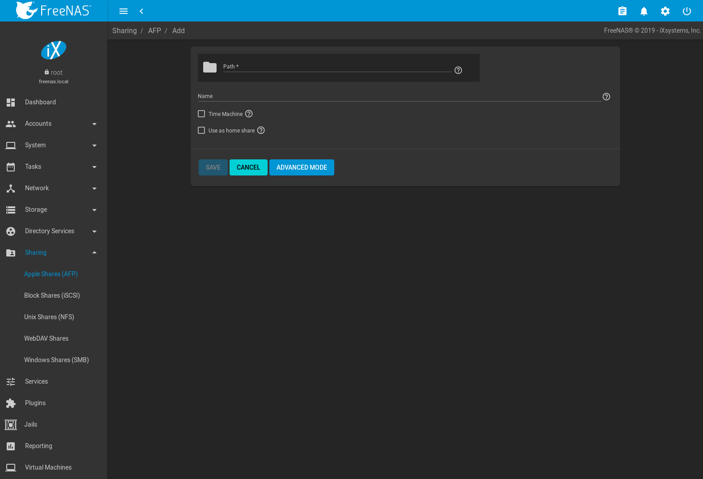

   Creating an AFP Share

.. note:: :numref:`Table %s <afp_share_config_opts_tab>`
   summarizes the options available to fine-tune an AFP share. Leaving
   these options at the default settings is recommended as changing
   them can cause unexpected behavior. Most settings are only
   available with :guilabel:`Advanced Mode`. Do **not** change an
   advanced option without fully understanding the function of that
   option. Refer to
   `Setting up Netatalk
   <http://netatalk.sourceforge.net/2.2/htmldocs/configuration.html>`__
   for a more detailed explanation of these options.

.. tabularcolumns:: |>{\RaggedRight}p{\dimexpr 0.20\linewidth-2\tabcolsep}
                    |>{\RaggedRight}p{\dimexpr 0.14\linewidth-2\tabcolsep}
                    |>{\Centering}p{\dimexpr 0.12\linewidth-2\tabcolsep}
                    |>{\RaggedRight}p{\dimexpr 0.54\linewidth-2\tabcolsep}|

.. _afp_share_config_opts_tab:

.. table:: AFP Share Configuration Options
   :class: longtable

   +------------------------------+---------------+----------+---------------------------------------------------------------------------------------------------------------+
   | Setting                      | Value         | Advanced | Description                                                                                                   |
   |                              |               | Mode     |                                                                                                               |
   +==============================+===============+==========+===============================================================================================================+
   | Path                         | browse button |          | Browse to the pool or dataset to share. Do not nest additional pools, datasets, or symbolic                   |
   |                              |               |          | links beneath this path because Netatalk does not fully support that.                                         |
   |                              |               |          |                                                                                                               |
   +------------------------------+---------------+----------+---------------------------------------------------------------------------------------------------------------+
   | Name                         | string        |          | Enter the pool name that appears in macOS after selecting :menuselection:`Go --> Connect to server`           |
   |                              |               |          | in the Finder menu. Limited to 27 characters and cannot contain a period.                                     |
   |                              |               |          |                                                                                                               |
   +------------------------------+---------------+----------+---------------------------------------------------------------------------------------------------------------+
   | Comment                      | string        | ✓        | Optional comment.                                                                                             |
   |                              |               |          |                                                                                                               |
   +------------------------------+---------------+----------+---------------------------------------------------------------------------------------------------------------+
   | Allow list                   | string        | ✓        | Comma-delimited list of allowed users and/or groups where groupname begins with a :literal:`@`. Note          |
   |                              |               |          | that adding an entry will deny any user/group that is not specified.                                          |
   |                              |               |          |                                                                                                               |
   +------------------------------+---------------+----------+---------------------------------------------------------------------------------------------------------------+
   | Deny list                    | string        | ✓        | Comma-delimited list of denied users and/or groups where groupname begins with a :literal:`@`. Note           |
   |                              |               |          | that adding an entry will allow all users/groups that are not specified.                                      |
   |                              |               |          |                                                                                                               |
   +------------------------------+---------------+----------+---------------------------------------------------------------------------------------------------------------+
   | Read Only Access             | string        | ✓        | Comma-delimited list of users and/or groups who only have read access where groupname begins with a           |
   |                              |               |          | :literal:`@`.                                                                                                 |
   |                              |               |          |                                                                                                               |
   +------------------------------+---------------+----------+---------------------------------------------------------------------------------------------------------------+
   | Read/Write Access            | string        | ✓        | Comma-delimited list of users and/or groups who have read and write access where groupname begins with a      |
   |                              |               |          | :literal:`@`.                                                                                                 |
   |                              |               |          |                                                                                                               |
   +------------------------------+---------------+----------+---------------------------------------------------------------------------------------------------------------+
   | Time Machine                 | checkbox      |          | Set to advertise %brand% as a Time Machine disk so it can be found by Macs.                                   |
   |                              |               |          | Setting multiple shares for Time Machine use is not recommended. When multiple Macs share the same pool,      |
   |                              |               |          | low diskspace issues and intermittently failed backups can occur.                                             |
   |                              |               |          |                                                                                                               |
   +------------------------------+---------------+----------+---------------------------------------------------------------------------------------------------------------+
   | Use as home share            | checkbox      |          | Set to allow the share to host user home directories. Only one share can be used as the home share.           |
   |                              |               |          |                                                                                                               |
   +------------------------------+---------------+----------+---------------------------------------------------------------------------------------------------------------+
   | Zero Device Numbers          | checkbox      | ✓        | Enable when the device number is not constant across a reboot.                                                |
   |                              |               |          |                                                                                                               |
   +------------------------------+---------------+----------+---------------------------------------------------------------------------------------------------------------+
   | No Stat                      | checkbox      | ✓        | If set, AFP does not stat the pool path when enumerating the pools list. Useful for                           |
   |                              |               |          | automounting or pools created by a preexec script.                                                            |
   |                              |               |          |                                                                                                               |
   +------------------------------+---------------+----------+---------------------------------------------------------------------------------------------------------------+
   | AFP3 UNIX Privs              | checkbox      | ✓        | Set to enable Unix privileges supported by Mac OS X 10.5 and higher. Do not enable if the network has         |
   |                              |               |          | Mac OS X 10.4 or lower clients. Those systems do not support this feature.                                    |
   |                              |               |          |                                                                                                               |
   +------------------------------+---------------+----------+---------------------------------------------------------------------------------------------------------------+
   | Default file permissions     | checkboxes    | ✓        | Only works with Unix ACLs. New files created on the share are set with the selected permissions.              |
   |                              |               |          |                                                                                                               |
   |                              |               |          |                                                                                                               |
   +------------------------------+---------------+----------+---------------------------------------------------------------------------------------------------------------+
   | Default directory permissions| checkboxes    | ✓        | Only works with Unix ACLs. New directories created on the share are set with the selected permissions.        |
   |                              |               |          |                                                                                                               |
   |                              |               |          |                                                                                                               |
   +------------------------------+---------------+----------+---------------------------------------------------------------------------------------------------------------+
   | Default umask                | integer       |  ✓       | Umask is used for newly created files. Default is *000* (anyone can read, write, and execute).                |
   |                              |               |          |                                                                                                               |
   |                              |               |          |                                                                                                               |
   +------------------------------+---------------+----------+---------------------------------------------------------------------------------------------------------------+
   | Hosts Allow                  | string        |  ✓       | Enter a list of allowed hostnames or IP addresses. Separate entries with a comma, space, or tab.              |
   |                              |               |          |                                                                                                               |
   +------------------------------+---------------+----------+---------------------------------------------------------------------------------------------------------------+
   | Hosts Deny                   | string        |  ✓       | Enter a list of denied hostnames or IP addresses. Separate entries with a comma, space, or tab.               |
   |                              |               |          |                                                                                                               |
   +------------------------------+---------------+----------+---------------------------------------------------------------------------------------------------------------+
   | Auxiliary Parameters         | string        |          | Enter any additional `afp.conf <https://www.freebsd.org/cgi/man.cgi?query=afp.conf>`__ parameters             |
   |                              |               |          | not covered by other option fields.                                                                           |
   |                              |               |          |                                                                                                               |
   +------------------------------+---------------+----------+---------------------------------------------------------------------------------------------------------------+

.. _Creating AFP Guest Shares:

Creating AFP Guest Shares
~~~~~~~~~~~~~~~~~~~~~~~~~

AFP supports guest logins, meaning that macOS users can access the
AFP share without requiring their user accounts to first be created on
or imported into the %brand% system.

.. note:: When a guest share is created along with a share that
   requires authentication, AFP only maps users who log in as *guest*
   to the guest share. If a user logs in to the share that requires
   authentication, permissions on the guest share can prevent that
   user from writing to the guest share. The only way to allow both
   guest and authenticated users to write to a guest share is to set
   the permissions on the guest share to *777* or to add the
   authenticated users to a guest group and set the permissions to
   *77x*.

Before creating a guest share, go to :menuselection:`Services --> AFP`
and click the sliding button to turn on the service. Click
|ui-configure| to open the screen shown in
:numref:`Figure %s <creating_guest_afp_share_fig>`. For
:guilabel:`Guest Account`, use the drop-down to select
:guilabel:`Nobody`, set :guilabel:`Guest Access`, and click
:guilabel:`SAVE`.

.. _creating_guest_afp_share_fig:

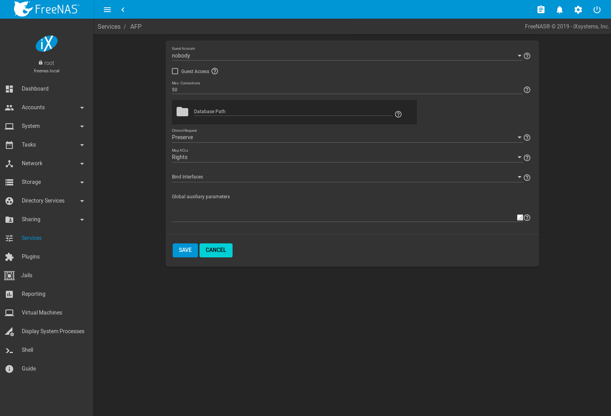

   Creating a Guest AFP Share

Next, create a dataset for the guest share. Refer to
:ref:`Adding Datasets` for more information about dataset creation.

After creating the dataset for the guest share, go to
:menuselection:`Storage --> Pools`,
click the |ui-options| button for the dataset, then
click :guilabel:`Edit Permissions`. Complete the fields shown in
:numref:`Figure %s <creating_guest_afp_dataset_fig>`.

#. **ACL Type:** Select :guilabel:`Mac`.

#. **User:** Use the drop-down to select :guilabel:`Nobody`.

#. Click :guilabel:`SAVE`.

.. _creating_guest_afp_dataset_fig:

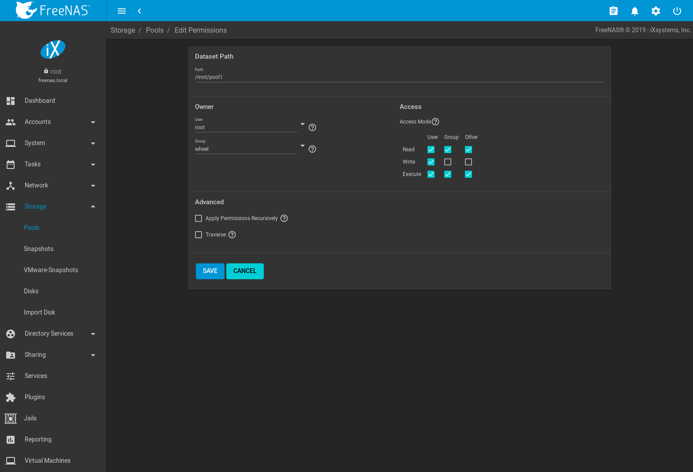

   Editing Dataset Permissions for Guest AFP Share

To create a guest AFP share:

#. Go to :menuselection:`Sharing --> Apple (AFP) Shares` and
   click |ui-add|.
#. :guilabel:`Browse` to the dataset created for the guest share.
#. Fill out the other required fields, then press :guilabel:`SAVE`.

macOS users can use Finder to connect to the guest AFP share by clicking
:menuselection:`Go --> Connect to Server`.
In the example shown in :numref:`Figure %s <afp_connect_server_fig>`,
the user entered :literal:`afp://` followed by the IP address of the
%brand% system.

Click the :guilabel:`Connect` button. Once connected, Finder opens
automatically. The name of the AFP share is displayed in the SHARED
section in the left frame and the contents of any data saved in the
share is displayed in the right frame.

.. _afp_connect_server_fig:

.. figure:: images/sharing-afp-connect-server.png

   Connect to Server Dialog

To disconnect from the pool, click the :guilabel:`eject` button in the
:guilabel:`Shared` sidebar.

.. index:: Time Machine
.. _Creating Authenticated and Time Machine Shares:

Creating Authenticated and Time Machine Shares
~~~~~~~~~~~~~~~~~~~~~~~~~~~~~~~~~~~~~~~~~~~~~~

macOS includes the Time Machine feature which can be used to perform
automatic back ups. In this configuration example, a Time Machine user
is configured to back up to an AFP share on a %brand% system. The
process for creating an authenticated share for a user is the same as
creating a Time Machine share for that user.

Before creating a Time Machine or authenticated share, go to
:menuselection:`Storage --> Pools` to make a dataset for the share.
For more information about dataset creation, refer to
:ref:`Adding Datasets`.

After creating the dataset for the guest share, go to
:menuselection:`Storage --> Pools`,
click the |ui-options| button for the dataset, then
:guilabel:`Edit Permissions`.

Enter the following information as shown in
:numref:`Figure %s <creating_an_authenticated_share_fig>`.

#. **ACL Type:** Select :guilabel:`Mac`.

#. **User:** Use the drop-down to select the desired user account.
   If the user does not yet exist on the %brand% system, go to
   :menuselection:`Accounts --> Users` to create one. Refer to
   :ref:`users <Users>` in this guide for more information
   about creating a user.

#. **Group:** Use the drop-down to select the desired group name.
   If the group does not yet exist on the %brand% system, go to
   :menuselection:`Accounts --> Groups` to create one. Refer to
   :ref:`groups <Groups>` in this guide for more information about
   creating a group.

#. Click :guilabel:`SAVE`.

To create an authenticated or Time Machine share:

#. Go to :menuselection:`Sharing --> AFP` and
   click |ui-add|.

#. :guilabel:`Browse` to the dataset created for
   the share.

#. When creating a Time Machine share, enable the
   :guilabel:`Time Machine` option.

#. Fill out the other required fields.

#. Click :guilabel:`SAVE`.

To configure multiple authenticated or Time Machine shares, repeat
this process for each user. The new shares appear in
:menuselection:`Sharing --> Apple (AFP)`.

.. _creating_an_authenticated_share_fig:

   Creating an Authenticated or Time Machine Share

At this point, it may be desirable to configure a quota for each Time
Machine share, to restrict backups from using all of the available
space on the %brand% system. The first time Time Machine makes a
backup, it will create a full backup after waiting two minutes. It
will then create a one hour incremental backup for the next 24 hours,
and then one backup each day, each week and each month.
**Since the oldest backups are deleted when a Time Machine share
becomes full, make sure that the quota size is sufficient to hold the
desired number of backups.**
Note that a default installation of macOS is ~21 GiB in size.

To configure a quota, go to
:menuselection:`Sharing --> Apple (AFP)`,
click |ui-options| on the existing Time Machine share, then
:guilabel:`Edit`. In the example shown in
:numref:`Figure %s <set_quota_fig>`,
the Time Machine share name is *backup_user1*. Enter a value in the
:guilabel:`Time Machine Quota` field, then click
:guilabel:`SAVE`. In this example, the Time Machine share is restricted
to 200 GiB.

.. _set_quota_fig:

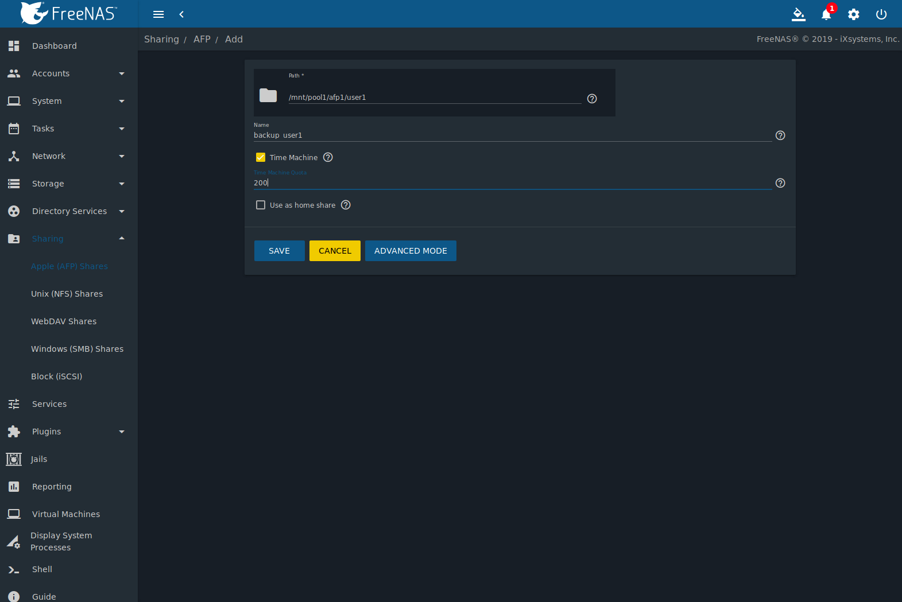

   Setting a Quota

.. note:: An alternative is to create a global quota using the
   instructions in
   `Set up Time Machine for multiple machines with OSX Server-Style Quotas
   <https://forums.freenas.org/index.php?threads/how-to-set-up-time-machine-for-multiple-machines-with-osx-server-style-quotas.47173/>`__.

To configure Time Machine on the macOS client, go to
:menuselection:`System Preferences --> Time Machine`
which opens the screen shown in
:numref:`Figure %s <config_tm_osx>`.
Click :guilabel:`ON` and a pop-up menu shows the %brand% system as a
backup option. In this example, it is listed as
*backup_user1 on "freenas"*. Highlight the %brand% system and click
:guilabel:`Use Backup Disk`. A connection bar opens and prompts for
the user account's password--in this example, the password that was
set for the *user1* account.

.. _config_tm_osx:

.. figure:: images/sharing-afp-time-machine.png

   Configuring Time Machine on macOS

If :literal:`Time Machine could not complete the backup. The backup disk
image could not be created (error 45)` is shown when backing up to the
%brand% system, a sparsebundle image must be created using
`these instructions
<https://community.netgear.com/t5/Stora-Legacy/Solution-to-quot-Time-Machine-could-not-complete-the-backup/td-p/294697>`__.

If :literal:`Time Machine completed a verification of your backups.
To improve reliability, Time Machine must create a new backup for you.`
is shown, follow the instructions in `this post
<http://www.garth.org/archives/2011,08,27,169,fix-time-machine-sparsebundle-nas-based-backup-errors.html>`__
to avoid making another backup or losing past backups.

.. index:: NFS, Network File System
.. _Unix (NFS) Shares:

Unix (NFS) Shares
-----------------

%brand% supports sharing pools, datasets, and directories over the
Network File System (NFS). Clients use the :command:`mount` command to
mount the share. Mounted NFS shares appear as another directory on the
client system. Some Linux distros require the installation of additional
software to mount an NFS share. Windows systems must enable
Services for NFS in the Ultimate or Enterprise editions or install an
NFS client application.

#ifdef freenas
.. note:: For performance reasons, iSCSI is preferred to NFS shares
   when %brand% is installed on ESXi. When considering creating NFS
   shares on ESXi, read through the performance analysis presented in
   `Running ZFS over NFS as a VMware Store
   <https://tinyurl.com/archive-zfs-over-nfs-vmware>`__.
#endif freenas

Create an NFS share by going to
:menuselection:`Sharing --> Unix (NFS) Shares`
and clicking |ui-add|. :numref:`Figure %s <nfs_share_wiz_fig>` shows
an example of creating an NFS share.

.. _nfs_share_wiz_fig:

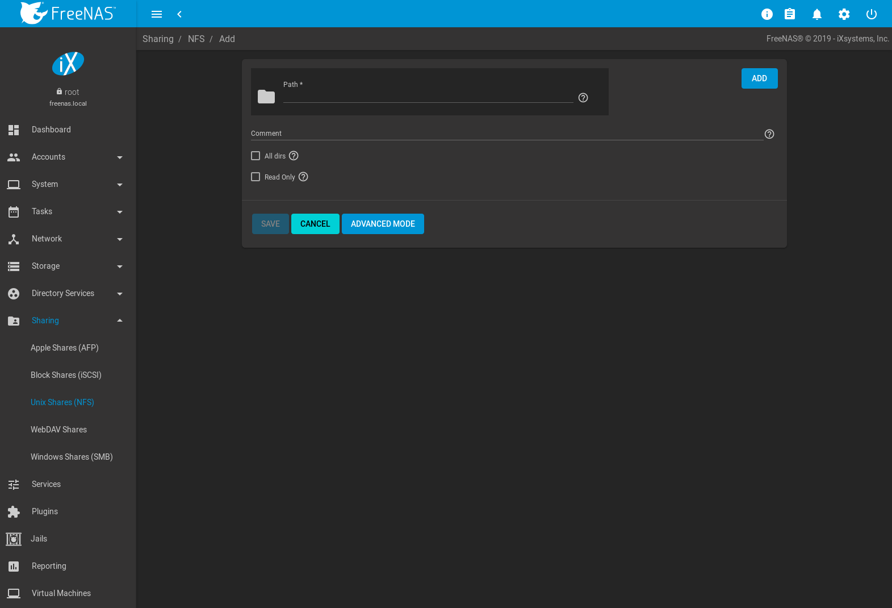

   NFS Share Creation

Remember these points when creating NFS shares:

#.  Clients specify the :guilabel:`Path` when mounting the share.

#.  The :guilabel:`Maproot` and :guilabel:`Mapall` options cannot
    both be enabled. The :guilabel:`Mapall` options supersede the
    :guilabel:`Maproot` options. To restrict only the *root* user
    permissions, set the :guilabel:`Maproot` option. To restrict
    permissions of all users, set the :guilabel:`Mapall` options.

#.  Each pool or dataset is considered to be a unique filesystem.
    Individual NFS shares cannot cross filesystem boundaries. Adding
    paths to share more directories only works if those directories
    are within the same filesystem.

#.  The network and host must be unique to both each created share and
    the filesystem or directory included in that share. Because
    :file:`/etc/exports` is not an access control list (ACL), the rules
    contained in :file:`/etc/exports` become undefined with overlapping
    networks or when using the same share with multiple hosts.

#.  The :guilabel:`All dirs` option can only be used once per share per
    filesystem.

To better understand these restrictions, consider scenarios where there
are:

* two networks, *10.0.0.0/8* and *20.0.0.0/8*

* a ZFS pool named :file:`pool1` with 2 datasets named
  :file:`dataset1` and :file:`dataset2`

* :file:`dataset1` contains directories named :file:`directory1`,
  :file:`directory2`, and :file:`directory3`

Because of restriction #3, an error is shown when trying to create one
NFS share like this:

* :guilabel:`Authorized Networks` set to *10.0.0.0/8 20.0.0.0/8*

* :guilabel:`Path` set to the dataset :file:`/mnt/pool1/dataset1`.
  An additional path to directory
  :file:`/mnt/pool1/dataset1/directory1` is added.

The correct method to configure this share is to set the
:guilabel:`Path` to :file:`/mnt/pool1/dataset1` and set the
:guilabel:`All dirs` box. This allows the client to also mount
:file:`/mnt/pool1/dataset1/directory1` when
:file:`/mnt/pool1/dataset1` is mounted.

Additional paths are used to define specific directories to be shared.
For example, :file:`dataset1` has three directories. To share only
:file:`/mnt/pool1/dataset1/directory1` and
:file:`/mnt/pool1/dataset1/directory2`, create paths for
:file:`directory1` and :file:`directory2` within the share.
This excludes :file:`directory3` from the share.

Restricting a specific directory to a single network is done by
creating a share for the volume or dataset and a share for the
directory within that volume or dataset. Define the authorized networks
for both shares.

First NFS share:

* :guilabel:`Authorized Networks` set to *10.0.0.0/8*

* :guilabel:`Path` set to :file:`/mnt/pool1/dataset1`

Second NFS share:

* :guilabel:`Authorized Networks` set to *20.0.0.0/8*

* :guilabel:`Path` set to :file:`/mnt/pool1/dataset1/directory1`

This requires the creation of two shares. It cannot be done with only
one share.

:numref:`Table %s <nfs_share_opts_tab>`
summarizes the available configuration options in the
:guilabel:`Sharing/NFS/Add` screen. Click :guilabel:`ADVANCED MODE` to
see all settings.

.. tabularcolumns:: |>{\RaggedRight}p{\dimexpr 0.20\linewidth-2\tabcolsep}
                    |>{\RaggedRight}p{\dimexpr 0.14\linewidth-2\tabcolsep}
                    |>{\Centering}p{\dimexpr 0.12\linewidth-2\tabcolsep}
                    |>{\RaggedRight}p{\dimexpr 0.54\linewidth-2\tabcolsep}|

.. _nfs_share_opts_tab:

.. table:: NFS Share Options
   :class: longtable

   +--------------------+--------------+-------------+---------------------------------------------------------------------------------------------------+
   | Setting            | Value        | Advanced    | Description                                                                                       |
   |                    |              | Mode        |                                                                                                   |
   |                    |              |             |                                                                                                   |
   +====================+==============+=============+===================================================================================================+
   | Path               | browse       |             | :guilabel:`Browse` to the pool, dataset, or directory to be shared.                               |
   |                    | button       |             | Click :guilabel:`Add extra Path` to add multiple directories to this share.                       |
   |                    |              |             |                                                                                                   |
   +--------------------+--------------+-------------+---------------------------------------------------------------------------------------------------+
   | Comment            | string       |             | Text describing the share. Typically used to name the share.                                      |
   |                    |              |             | If left empty, this shows the :guilabel:`Path` entries of the share.                              |
   |                    |              |             |                                                                                                   |
   +--------------------+--------------+-------------+---------------------------------------------------------------------------------------------------+
   | All dirs           | checkbox     |             | Allow the client to also mount any subdirectories of the selected pool or dataset.                |
   |                    |              |             |                                                                                                   |
   +--------------------+--------------+-------------+---------------------------------------------------------------------------------------------------+
   | Read only          | checkbox     |             | Prohibit writing to the share.                                                                    |
   |                    |              |             |                                                                                                   |
   +--------------------+--------------+-------------+---------------------------------------------------------------------------------------------------+
   | Quiet              | checkbox     | ✓           | Restrict some syslog diagnostics to avoid some error messages. See                                |
   |                    |              |             | `exports(5) <https://www.freebsd.org/cgi/man.cgi?query=exports>`__ for examples.                  |
   |                    |              |             |                                                                                                   |
   +--------------------+--------------+-------------+---------------------------------------------------------------------------------------------------+
   | Authorized         | string       | ✓           | Space-delimited list of allowed networks in network/mask CIDR notation.                           |
   | networks           |              |             | Example: *1.2.3.0/24*. Leave empty to allow all.                                                  |
   |                    |              |             |                                                                                                   |
   +--------------------+--------------+-------------+---------------------------------------------------------------------------------------------------+
   | Authorized Hosts   | string       | ✓           | Space-delimited list of allowed IP addresses or hostnames.                                        |
   | and IP addresses   |              |             | Leave empty to allow all.                                                                         |
   |                    |              |             |                                                                                                   |
   +--------------------+--------------+-------------+---------------------------------------------------------------------------------------------------+
   | Maproot User       | drop-down    | ✓           | When a user is selected, the *root* user is limited to permissions of that user.                  |
   |                    | menu         |             |                                                                                                   |
   |                    |              |             |                                                                                                   |
   +--------------------+--------------+-------------+---------------------------------------------------------------------------------------------------+
   | Maproot Group      | drop-down    | ✓           | When a group is selected, the *root* user is also limited to permissions of that group.           |
   |                    | menu         |             |                                                                                                   |
   |                    |              |             |                                                                                                   |
   +--------------------+--------------+-------------+---------------------------------------------------------------------------------------------------+
   | Mapall User        | drop-down    | ✓           | All clients use the permissions of the specified user.                                            |
   |                    | menu         |             |                                                                                                   |
   |                    |              |             |                                                                                                   |
   +--------------------+--------------+-------------+---------------------------------------------------------------------------------------------------+
   | Mapall Group       | drop-down    | ✓           | All clients use the permissions of the specified group.                                           |
   |                    | menu         |             |                                                                                                   |
   |                    |              |             |                                                                                                   |
   +--------------------+--------------+-------------+---------------------------------------------------------------------------------------------------+
   | Security           | selection    | ✓           | Only appears if :guilabel:`Enable NFSv4` is enabled in                                            |
   |                    |              |             | :menuselection:`Services --> NFS`.                                                                |
   |                    |              |             | Choices are *sys* or these Kerberos options: *krb5* (authentication only),                        |
   |                    |              |             | *krb5i* (authentication and integrity), or *krb5p* (authentication and privacy).                  |
   |                    |              |             | If multiple security mechanisms are added to the :guilabel:`Selected` column using the arrows,    |
   |                    |              |             | use the :guilabel:`Up` or :guilabel:`Down` buttons to list in order of preference.                |
   |                    |              |             |                                                                                                   |
   +--------------------+--------------+-------------+---------------------------------------------------------------------------------------------------+

Go to
:menuselection:`Sharing --> Unix (NFS)`
and click |ui-options| and :guilabel:`Edit` to edit an existing share.
:numref:`Figure %s <nfs_share_settings_fig>` shows the configuration
screen for the existing *nfs_share1* share. Options are the same as
described in :ref:`nfs_share_opts_tab`.

.. _nfs_share_settings_fig:

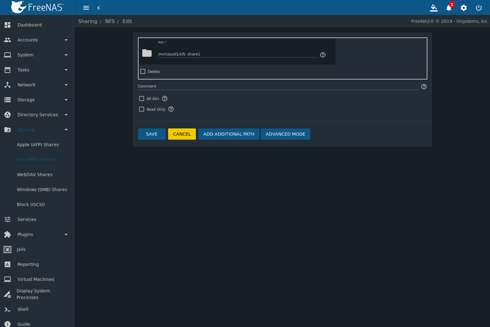

   NFS Share Settings

.. _Example Configuration:

Example Configuration
~~~~~~~~~~~~~~~~~~~~~

By default, the :guilabel:`Mapall` fields are not set. This means
that when a user connects to the NFS share, the user has the
permissions associated with their user account. This is a security
risk if a user is able to connect as *root* as they will have complete
access to the share.

A better option is to do this:

#.  Specify the built-in *nobody* account to be used for NFS access.

#.  In the :guilabel:`Change Permissions` screen of the pool or
    dataset that is being shared, change the owner and group to
    *nobody* and set the permissions according to the desired
    requirements.

#.  Select *nobody* in the :guilabel:`Mapall User` and
    :guilabel:`Mapall Group` drop-down menus for the share in
    :menuselection:`Sharing --> Unix (NFS) Shares`.

With this configuration, it does not matter which user account
connects to the NFS share, as it will be mapped to the *nobody* user
account and will only have the permissions that were specified on the
pool or dataset. For example, even if the *root* user is able to
connect, it will not gain *root* access to the share.

.. _Connecting to the Share:

Connecting to the Share
~~~~~~~~~~~~~~~~~~~~~~~

The following examples share this configuration:

#.  The %brand% system is at IP address *192.168.2.2*.

#.  A dataset named :file:`/mnt/pool1/nfs_share1` is created and the
    permissions set to the *nobody* user account and the *nobody*
    group.

#.  An NFS share is created with these attributes:

    * :guilabel:`Path`: :file:`/mnt/pool1/nfs_share1`

    * :guilabel:`Authorized Networks`: *192.168.2.0/24*

    * :guilabel:`All dirs` option is enabled

    * :guilabel:`MapAll User` is set to *nobody*

    * :guilabel:`MapAll Group` is set to *nobody*

.. _From BSD or Linux:

From BSD or Linux
^^^^^^^^^^^^^^^^^

NFS shares are mounted on BSD or Linux clients with this command
executed as the superuser (*root*) or with :command:`sudo`:

.. code-block:: none

   mount -t nfs 192.168.2.2:/mnt/pool1/nfs_share1 /mnt

* **-t nfs** specifies the filesystem type of the share

* **192.168.2.2** is the IP address of the %brand% system

* **/mnt/pool/nfs_share1** is the name of the directory to be
  shared, a dataset in this case

* **/mnt** is the mountpoint on the client system. This must be an
  existing, *empty* directory. The data in the NFS share appears
  in this directory on the client computer.

Successfully mounting the share returns to the command prompt without
any status or error messages.

.. note:: If this command fails on a Linux system, make sure that the
   `nfs-utils <https://sourceforge.net/projects/nfs/files/nfs-utils/>`__
   package is installed.

This configuration allows users on the client system to copy files to
and from :file:`/mnt` (the mount point). All files are owned by
*nobody:nobody*. Changes to any files or directories in :file:`/mnt`
write to the %brand% system :file:`/mnt/pool1/nfs_share1` dataset.

NFS share settings cannot be changed when the share is mounted on a
client computer. The :command:`umount` command is used to unmount the
share on BSD and Linux clients. Run it as the superuser or with
:command:`sudo` on each client computer:

.. code-block:: none

   umount /mnt

.. _From Microsoft:

From Microsoft
^^^^^^^^^^^^^^

Windows NFS client support varies with versions and releases. For
best results, use :ref:`Windows (SMB) Shares`.

.. _From macOS:

From macOS
^^^^^^^^^^

A macOS client uses Finder to mount the NFS volume. Go to
:menuselection:`Go --> Connect to Server`.
In the :guilabel:`Server Address` field, enter *nfs://* followed by
the IP address of the %brand% system, and the name of the
pool or dataset being shared by NFS. The example shown in
:numref:`Figure %s <mount_nfs_osx_fig>`
continues with the example of *192.168.2.2:/mnt/pool1/nfs_share1*.

Finder opens automatically after connecting. The IP address of the
%brand% system displays in the SHARED section of the left frame and the
contents of the share display in the right frame.
:numref:`Figure %s <view_nfs_finder_fig>` shows an example where
:file:`/mnt/data` has one folder named :file:`images`. The user can
now copy files to and from the share.

.. _mount_nfs_osx_fig:

.. figure:: images/sharing-nfs-mac.png

   Mounting the NFS Share from macOS

.. _view_nfs_finder_fig:

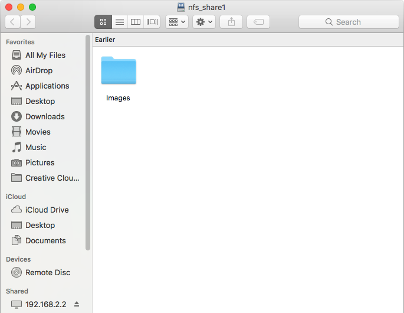

   Viewing the NFS Share in Finder

.. _Troubleshooting NFS:

Troubleshooting NFS
~~~~~~~~~~~~~~~~~~~

Some NFS clients do not support the NLM (Network Lock Manager)
protocol used by NFS. This is the case if the client receives an error
that all or part of the file may be locked when a file transfer is
attempted. To resolve this error, add the option :samp:`-o nolock`
when running the :command:`mount` command on the client to allow write
access to the NFS share.

If a "time out giving up" error is shown when trying to mount the
share from a Linux system, make sure that the portmapper service is
running on the Linux client. If portmapper is running and timeouts are
still shown, force the use of TCP by including :samp:`-o tcp` in the
:command:`mount` command.

If a :literal:`RPC: Program not registered` error is shown, upgrade to
the latest version of %brand% and restart the NFS service after the
upgrade to clear the NFS cache.

If clients see "reverse DNS" errors, add the %brand% IP address in the
:guilabel:`Host name database` field of
:menuselection:`Network --> Global Configuration`.

If clients receive timeout errors when trying to mount the share, add
the client IP address and hostname to the
:guilabel:`Host name database` field in
:menuselection:`Network --> Global Configuration`.

Some older versions of NFS clients default to UDP instead of TCP and
do not auto-negotiate for TCP. By default, %brand% uses TCP. To
support UDP connections, go to
:menuselection:`Services --> NFS --> Configure`
and enable the :guilabel:`Serve UDP NFS clients` option.

The :samp:`nfsstat -c` or :samp:`nfsstat -s` commands can be helpful
to detect problems from the :ref:`Shell`. A high proportion of retries
and timeouts compared to reads usually indicates network problems.

.. index:: WebDAV
.. _WebDAV Shares:

WebDAV Shares
-------------

In %brand%, WebDAV shares can be created so that authenticated users
can browse the contents of the specified pool, dataset, or directory
from a web browser.

Configuring WebDAV shares is a two step process. First, create the
WebDAV shares to specify which data can be accessed. Then, configure
the WebDAV service by specifying the port, authentication type, and
authentication password. Once the configuration is complete, the share
can be accessed using a URL in the format:

.. code-block:: none

   protocol://IP_address:port_number/share_name

where:

* **protocol:** is either
  *http* or
  *https*, depending upon the :guilabel:`Protocol` configured in
  :menuselection:`Services --> WebDAV --> CONFIGURE`.

* **IP address:** is the IP address or hostname of the %brand%
  system. Take care when configuring a public IP address to ensure
  that the network firewall only allows access to authorized
  systems.

* **port_number:** is configured in
  :menuselection:`Services --> WebDAV --> CONFIGURE`. If the %brand%
  system is to be accessed using a public IP address, consider
  changing the default port number and ensure that the network
  firewall only allows access to authorized systems.

* **share_name:** is configured by clicking
  :menuselection:`Sharing --> WebDAV Shares`, then |ui-add|.

Entering the URL in a web browser brings up an authentication pop-up
message. Enter a username of *webdav* and the password configured in
:menuselection:`Services --> WebDAV --> CONFIGURE`.

.. warning:: At this time, only the *webdav* user is supported. For
   this reason, it is important to set a good password for this
   account and to only give the password to users which should have
   access to the WebDAV share.

To create a WebDAV share, go to
:menuselection:`Sharing --> WebDAV Shares` and click |ui-add|,
which will open the screen shown in
:numref:`Figure %s <add_webdav_share_fig>`.

.. _add_webdav_share_fig:

.. figure:: images/sharing-webdav-add.png

   Adding a WebDAV Share

:numref:`Table %s <webdav_share_opts_tab>`
summarizes the available options.

.. tabularcolumns:: |>{\RaggedRight}p{\dimexpr 0.20\linewidth-2\tabcolsep}
                    |>{\RaggedRight}p{\dimexpr 0.16\linewidth-2\tabcolsep}
                    |>{\RaggedRight}p{\dimexpr 0.64\linewidth-2\tabcolsep}|

.. _webdav_share_opts_tab:

.. table:: WebDAV Share Options
   :class: longtable

   +------------------------------+---------------+-------------------------------------------------------------------------------------------------------------+
   | Setting                      | Value         | Description                                                                                                 |
   |                              |               |                                                                                                             |
   +==============================+===============+=============================================================================================================+
   | Share Name                   | string        | Enter a name for the share.                                                                                 |
   |                              |               |                                                                                                             |
   +------------------------------+---------------+-------------------------------------------------------------------------------------------------------------+
   | Comment                      | string        | Optional.                                                                                                   |
   |                              |               |                                                                                                             |
   +------------------------------+---------------+-------------------------------------------------------------------------------------------------------------+
   | Path                         | browse button | Browse to the pool or dataset to share.                                                                     |
   |                              |               |                                                                                                             |
   +------------------------------+---------------+-------------------------------------------------------------------------------------------------------------+
   | Read Only                    | checkbox      | Set to prohibit users from writing to the share.                                                            |
   |                              |               |                                                                                                             |
   +------------------------------+---------------+-------------------------------------------------------------------------------------------------------------+
   | Change User & Group          | checkbox      | Enable to automatically set the share contents to the *webdav* user and group.                              |
   | Ownership                    |               |                                                                                                             |
   +------------------------------+---------------+-------------------------------------------------------------------------------------------------------------+

Click :guilabel:`SAVE` to create the share. Then,
go to :menuselection:`Services --> WebDAV` and click the |ui-power|
button to turn on the service.

After the service starts, review the settings in
:menuselection:`Services --> WebDAV --> CONFIGURE`
as they are used to determine which URL is used to access the WebDAV
share and whether or not authentication is required to access the
share. These settings are described in :ref:`WebDAV`.

.. index:: CIFS, Samba, Windows Shares, SMB
.. _Windows (SMB) Shares:

Windows (SMB) Shares
---------------------

%brand% uses `Samba <https://www.samba.org/>`__ to share pools using
Microsoft's SMB protocol. SMB is built into the Windows and macOS
operating systems and most Linux and BSD systems pre-install the Samba
client in order to provide support for SMB. If the distro did not,
install the Samba client using the distro software repository.

The SMB protocol supports many different types of configuration
scenarios, ranging from the simple to complex. The complexity of the
scenario depends upon the types and versions of the client operating
systems that will connect to the share, whether the network has a
Windows server, and whether Active Directory is being used. Depending on
the authentication requirements, it might be necessary to create or
import users and groups.

Samba supports server-side copy of files on the same share with clients
from Windows 8 and higher. Copying between two different shares is not
server-side. Windows 7 clients support server-side copying with
`Robocopy
<https://docs.microsoft.com/en-us/previous-versions/windows/it-pro/windows-server-2012-R2-and-2012/cc733145(v=ws.11)>`__.

This chapter starts by summarizing the available configuration options.
It demonstrates some common configuration scenarios as well as offering
some troubleshooting tips. Reading through this entire chapter before
creating any SMB shares is recommended to gain a better understanding of
the configuration scenario that meets the specific network requirements.

.. warning:: SMB1 is disabled by default for security. If legacy
   clients are unable to connect to the share, open :ref:`Shell`, type
   :command:`sysctl freenas.services.smb.config.server_min_protocol=NT1`,
   then restart the :ref:`SMB` service. If legacy clients can then
   connect to the share, the change can be made permanent by going to
   :ref:`Tunables`, creating a tunable with a :guilabel:`Variable` of
   *freenas.services.smb.config.server_min_protocol*, a
   :guilabel:`Value` of *NT1*, and a :guilabel:`Type` of *Sysctl*.

.. tip:: `SMB Tips and Tricks
   <https://forums.freenas.org/index.php?resources/smb-tips-and-tricks.15/>`__
   shows helpful hints for configuring and managing SMB networking.
   The `FreeNAS and Samba (CIFS) permissions
   <https://www.youtube.com/watch?v=RxggaE935PM>`__
   and
   `Advanced Samba (CIFS) permissions on FreeNAS
   <https://www.youtube.com/watch?v=QhwOyLtArw0>`__
   videos clarify setting up permissions on SMB shares. Another
   helpful reference is
   `Methods For Fine-Tuning Samba Permissions
   <https://forums.freenas.org/index.php?threads/methods-for-fine-tuning-samba-permissions.50739/>`__.

.. tip:: Run :command:`smbstatus` from the :ref:`Shell` for a list of
   active connections and users.

:numref:`Figure %s <adding_smb_share_fig>`
shows the configuration screen that appears after clicking
:menuselection:`Sharing --> Windows (SMB Shares)`,
then |ui-add|.

.. _adding_smb_share_fig:

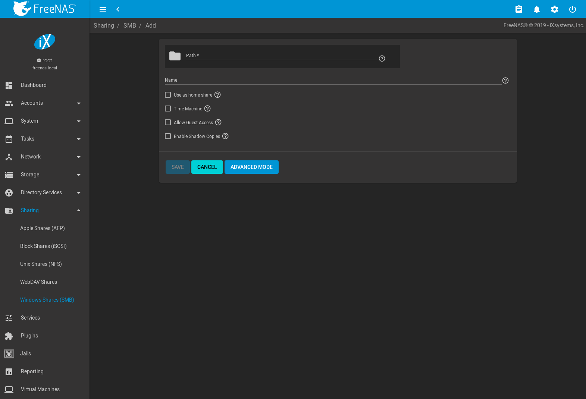

   Adding an SMB Share

:numref:`Table %s <smb_share_opts_tab>`
summarizes the options available when creating a SMB share. Some
settings are only configurable after clicking the
:guilabel:`ADVANCED MODE` button. For simple sharing scenarios,
:guilabel:`ADVANCED MODE` options are not needed. For more complex
sharing scenarios, only change an :guilabel:`ADVANCED MODE` option after
fully understanding the function of that option.
`smb.conf(5) <https://www.freebsd.org/cgi/man.cgi?query=smb.conf>`__
provides more details for each configurable option.

.. tabularcolumns:: |>{\RaggedRight}p{\dimexpr 0.20\linewidth-2\tabcolsep}
                    |>{\RaggedRight}p{\dimexpr 0.14\linewidth-2\tabcolsep}
                    |>{\Centering}p{\dimexpr 0.12\linewidth-2\tabcolsep}
                    |>{\RaggedRight}p{\dimexpr 0.54\linewidth-2\tabcolsep}|

.. _smb_share_opts_tab:

.. table:: Options for a SMB Share
   :class: longtable

   +--------------------------------+---------------+----------+-------------------------------------------------------------------------------------------------------------+
   | Setting                        | Value         | Advanced | Description                                                                                                 |
   |                                |               | Mode     |                                                                                                             |
   +================================+===============+==========+=============================================================================================================+
   | Path                           | browse button |          | Select pool or dataset/directory to share.                                                                  |
   |                                |               |          |                                                                                                             |
   +--------------------------------+---------------+----------+-------------------------------------------------------------------------------------------------------------+
   | Name                           | string        |          | Enter a mandatory name for the share.                                                                       |
   |                                |               |          |                                                                                                             |
   +--------------------------------+---------------+----------+-------------------------------------------------------------------------------------------------------------+
   | Use as home share              | checkbox      |          | Set to allow this share to hold user home directories. Only one share can be the home share. Note that      |
   |                                |               |          | lower case names for user home directories are strongly recommended, as Samba maps usernames to all lower   |
   |                                |               |          | case. For example, the username John will be mapped to a home directory named john. If the :guilabel:`Path` |
   |                                |               |          | to the home share includes an upper case username, delete the existing user and recreate it in              |
   |                                |               |          | :menuselection:`Accounts --> Users` with an all lower case :guilabel:`Username`. Return to                  |
   |                                |               |          | :menuselection:`Sharing --> SMB` to create the home share, and select the :guilabel:`Path` that contains    |
   |                                |               |          | the new lower case username.                                                                                |
   |                                |               |          |                                                                                                             |
   +--------------------------------+---------------+----------+-------------------------------------------------------------------------------------------------------------+
   | Default Permissions            | checkbox      |          | When enabled, the ACLs grant read and write for owner or group and read-only for others. Only leave unset   |
   |                                |               |          | if creating a share on a system that already has custom ACLs configured.                                    |
   |                                |               |          |                                                                                                             |
   +--------------------------------+---------------+----------+-------------------------------------------------------------------------------------------------------------+
   | Export Read Only               | checkbox      | ✓        | Set to prohibit write access to this share.                                                                 |
   |                                |               |          |                                                                                                             |
   +--------------------------------+---------------+----------+-------------------------------------------------------------------------------------------------------------+
   | Browsable to Network Clients   | checkbox      | ✓        | When set, users see the contents of */homes*, which includes the home directories of other users.           |
   |                                |               |          | When unset, users only see their own home directory.                                                        |
   |                                |               |          |                                                                                                             |
   +--------------------------------+---------------+----------+-------------------------------------------------------------------------------------------------------------+
   | Export Recycle Bin             | checkbox      | ✓        | When set, deleted files are moved to a hidden :file:`.recycle` in the root folder of the share. The         |
   |                                |               |          | :file:`.recycle` directory can be deleted to reclaim space and is automatically recreated when a file       |
   |                                |               |          | is deleted.                                                                                                 |
   +--------------------------------+---------------+----------+-------------------------------------------------------------------------------------------------------------+
   | Show Hidden Files              | checkbox      | ✓        | Set to disable the Windows *hidden* attribute on a new Unix hidden file. Unix hidden filenames start with   |
   |                                |               |          | a dot: :file:`.foo`. Existing files are not affected.                                                       |
   |                                |               |          |                                                                                                             |
   +--------------------------------+---------------+----------+-------------------------------------------------------------------------------------------------------------+
   | Allow Guest Access             | checkbox      |          | Set to allow access to this share without a password. See :ref:`SMB` service for more information           |
   |                                |               |          | about guest user permissions.                                                                               |
   |                                |               |          |                                                                                                             |
   +--------------------------------+---------------+----------+-------------------------------------------------------------------------------------------------------------+
   | Only Allow Guest Access        | checkbox      | ✓        | Requires :guilabel:`Allow guest access` to also be enabled. Forces guest access for all connections.        |
   |                                |               |          |                                                                                                             |
   +--------------------------------+---------------+----------+-------------------------------------------------------------------------------------------------------------+
   | Hosts Allow                    | string        | ✓        | Enter a list of allowed hostnames or IP addresses. Separate entries with a comma, space, or tab.            |
   |                                |               |          |                                                                                                             |
   +--------------------------------+---------------+----------+-------------------------------------------------------------------------------------------------------------+
   | Hosts Deny                     | string        | ✓        | Enter a list of denied hostnames or IP addresses. Allowed hosts take                                        |
   |                                |               |          | Specify *ALL* and list any hosts from :guilabel:`Hosts Allow` to have those hosts take precedence.          |
   |                                |               |          |                                                                                                             |
   +--------------------------------+---------------+----------+-------------------------------------------------------------------------------------------------------------+
   | VFS Objects                    | selection     | ✓        | Adds virtual file system modules to enhance functionality.                                                  |
   |                                |               |          | :numref:`Table %s <avail_vfs_modules_tab>` summarizes the available modules.                                |
   |                                |               |          |                                                                                                             |
   +--------------------------------+---------------+----------+-------------------------------------------------------------------------------------------------------------+
   | Periodic Snapshot Task         | drop-down     | ✓        | Used to configure directory shadow copies on a per-share basis. Select the pre-configured periodic          |
   |                                | menu          |          | snapshot task to use for the share's shadow copies. Periodic snapshot must be recursive.                    |
   |                                |               |          |                                                                                                             |
   +--------------------------------+---------------+----------+-------------------------------------------------------------------------------------------------------------+
   | Auxiliary Parameters           | string        | ✓        | Additional :file:`smb4.conf` parameters not covered by other option fields.                                 |
   |                                |               |          |                                                                                                             |
   +--------------------------------+---------------+----------+-------------------------------------------------------------------------------------------------------------+

Here are some notes about :guilabel:`ADVANCED MODE` settings:

* Hostname lookups add some time to accessing the SMB share. If
  only using IP addresses, unset the :guilabel:`Hostnames Lookups`
  setting in
  :menuselection:`Services --> SMB -->` |ui-configure|.

* When the :guilabel:`Browsable to Network Clients` option is selected,
  the share is visible through Windows File Explorer or
  through :command:`net view`. When the
  :guilabel:`Use as home share` option is selected, deselecting the
  :guilabel:`Browsable to Network Clients` option hides the share named
  *homes* so that only the dynamically generated share containing the
  authenticated user home directory will be visible. By default, the
  *homes* share and the user home directory are both visible. Users
  are not automatically granted read or write permissions on browsable
  shares. This option provides no real security because shares that
  are not visible in Windows File Explorer can still be accessed with
  a *UNC* path.

* If some files on a shared pool should be hidden and inaccessible
  to users, put a *veto files=* line in the
  :guilabel:`Auxiliary Parameters` field. The syntax for the
  :guilabel:`veto files` option and some examples can be found in the
  `smb.conf manual page
  <https://www.freebsd.org/cgi/man.cgi?query=smb.conf>`__.

Samba disables NTLMv1 authentication by default for security. Standard
configurations of Windows XP and some configurations of later clients
like Windows 7 will not be able to connect with NTLMv1 disabled.
`Security guidance for NTLMv1 and LM network authentication
<https://support.microsoft.com/en-us/help/2793313/security-guidance-for-ntlmv1-and-lm-network-authentication>`__
has information about the security implications and ways to enable
NTLMv2 on those clients. If changing the client configuration is not
possible, NTLMv1 authentication can be enabled by selecting the
:guilabel:`NTLMv1 auth` option in
:menuselection:`Services --> SMB -->` |ui-configure|.

:numref:`Table %s <avail_vfs_modules_tab>`
provides an overview of the available VFS modules. Be sure to research
each module **before** adding or deleting it from the
:guilabel:`Selected` column of the :guilabel:`VFS Objects` field of
the share. Some modules need additional configuration after they are
added. Refer to `Stackable VFS modules
<https://www.samba.org/samba/docs/old/Samba3-HOWTO/VFS.html>`__
and the
`vfs_* man pages <https://www.samba.org/samba/docs/current/man-html/>`__
for more details.

.. tabularcolumns:: |>{\RaggedRight}p{\dimexpr 0.20\linewidth-2\tabcolsep}
                    |>{\RaggedRight}p{\dimexpr 0.47\linewidth-2\tabcolsep}|

.. _avail_vfs_modules_tab:

.. table:: Available VFS Modules

   +---------------------+--------------------------------------------------------------------------------------------------------------------------------------------+
   | Value               | Description                                                                                                                                |
   |                     |                                                                                                                                            |
   +=====================+============================================================================================================================================+
   | acl_tdb             | Stores NTFS ACLs in a tdb file to enable full mapping of Windows ACLs.                                                                     |
   |                     |                                                                                                                                            |
   +---------------------+--------------------------------------------------------------------------------------------------------------------------------------------+
   | acl_xattr           | Stores NTFS ACLs in Extended Attributes (EAs) to enable the full mapping of Windows ACLs.                                                  |
   |                     |                                                                                                                                            |
   +---------------------+--------------------------------------------------------------------------------------------------------------------------------------------+
   | aio_fork            | Enables async I/O.                                                                                                                         |
   |                     |                                                                                                                                            |
   +---------------------+--------------------------------------------------------------------------------------------------------------------------------------------+
   | audit               | Logs share access, connects/disconnects, directory opens/creates/removes, and file opens/closes/renames/unlinks/chmods to syslog.          |
   |                     |                                                                                                                                            |
   +---------------------+--------------------------------------------------------------------------------------------------------------------------------------------+
   | cacheprime          | Primes the kernel file data cache.                                                                                                         |
   |                     |                                                                                                                                            |
   +---------------------+--------------------------------------------------------------------------------------------------------------------------------------------+
   | cap                 | Translates filenames to and from the CAP encoding format, commonly used in Japanese language environments.                                 |
   |                     |                                                                                                                                            |
   +---------------------+--------------------------------------------------------------------------------------------------------------------------------------------+
   | catia               | Improves Mac interoperability by translating characters that are unsupported by Windows.                                                   |
   |                     |                                                                                                                                            |
   +---------------------+--------------------------------------------------------------------------------------------------------------------------------------------+
   | commit              | Tracks the amount of data written to a file and synchronizes it to disk when a specified amount accumulates.                               |
   |                     |                                                                                                                                            |
   +---------------------+--------------------------------------------------------------------------------------------------------------------------------------------+
   | crossrename         | Allows server side rename operations even if source and target are on different physical devices.                                          |
   |                     |                                                                                                                                            |
   +---------------------+--------------------------------------------------------------------------------------------------------------------------------------------+
   | default_quota       | Stores the default quotas that are reported to a windows client in the quota record of a user.                                             |
   |                     |                                                                                                                                            |
   +---------------------+--------------------------------------------------------------------------------------------------------------------------------------------+
   | dfs_samba4          | Distributed file system for providing an alternative name space, load balancing, and automatic failover.                                   |
   |                     |                                                                                                                                            |
   +---------------------+--------------------------------------------------------------------------------------------------------------------------------------------+
   | dirsort             | Sorts directory entries alphabetically before sending them to the client.                                                                  |
   |                     |                                                                                                                                            |
   +---------------------+--------------------------------------------------------------------------------------------------------------------------------------------+
   | expand_msdfs        | Enables support for Microsoft Distributed File System (DFS).                                                                               |
   |                     |                                                                                                                                            |
   +---------------------+--------------------------------------------------------------------------------------------------------------------------------------------+
   | extd_audit          | Sends :guilabel:`audit` logs to both syslog and the Samba log files.                                                                       |
   |                     |                                                                                                                                            |
   +---------------------+--------------------------------------------------------------------------------------------------------------------------------------------+
   | fake_acls           | Stores file ownership and ACLs as extended attributes.                                                                                     |
   |                     |                                                                                                                                            |
   +---------------------+--------------------------------------------------------------------------------------------------------------------------------------------+
   | fake_perms          | Allows roaming profile files and directories to be set as read-only.                                                                       |
   |                     |                                                                                                                                            |
   +---------------------+--------------------------------------------------------------------------------------------------------------------------------------------+
   | fruit               | Enhances macOS support by providing the SMB2 AAPL extension and Netatalk interoperability. Automatically loads *catia* and *streams_xattr* |
   |                     | but read the caveat in NOTE below table.                                                                                                   |
   |                     |                                                                                                                                            |
   +---------------------+--------------------------------------------------------------------------------------------------------------------------------------------+
   | full_audit          | Record selected client operations to the system log.                                                                                       |
   |                     |                                                                                                                                            |
   |                     |                                                                                                                                            |
   +---------------------+--------------------------------------------------------------------------------------------------------------------------------------------+
   | ixnas               | Experimental module to improve ACL compatibility with Windows and store DOS attributes as file flags.                                      |
   |                     |                                                                                                                                            |
   +---------------------+--------------------------------------------------------------------------------------------------------------------------------------------+
   | linux_xfs_sgid      | Used to work around an old Linux XFS bug.                                                                                                  |
   |                     |                                                                                                                                            |
   +---------------------+--------------------------------------------------------------------------------------------------------------------------------------------+
   | media_harmony       | Allows Avid editorial workstations to share a network drive.                                                                               |
   |                     |                                                                                                                                            |
   +---------------------+--------------------------------------------------------------------------------------------------------------------------------------------+
   | netatalk            | Eases the co-existence of SMB and AFP shares.                                                                                              |
   |                     |                                                                                                                                            |
   +---------------------+--------------------------------------------------------------------------------------------------------------------------------------------+
   | offline             | Marks all files in the share with the DOS *offline* attribute. This can prevent Windows Explorer from reading files just to make           |
   |                     | thumbnail images.                                                                                                                          |
   |                     |                                                                                                                                            |
   +---------------------+--------------------------------------------------------------------------------------------------------------------------------------------+
   | posix_eadb          | Provides Extended Attributes (EAs) support so they can be used on filesystems which do not provide native support for EAs.                 |
   |                     |                                                                                                                                            |
   +---------------------+--------------------------------------------------------------------------------------------------------------------------------------------+
   | preopen             | Useful for video streaming applications that want to read one file per frame.                                                              |
   |                     |                                                                                                                                            |
   +---------------------+--------------------------------------------------------------------------------------------------------------------------------------------+
   | readahead           | Useful for Windows Vista clients reading data using Windows Explorer.                                                                      |
   |                     |                                                                                                                                            |
   +---------------------+--------------------------------------------------------------------------------------------------------------------------------------------+
   | readonly            | Marks a share as read-only for all clients connecting within the configured time period.                                                   |
   |                     |                                                                                                                                            |
   +---------------------+--------------------------------------------------------------------------------------------------------------------------------------------+
   | shadow_copy         | Allows Microsoft shadow copy clients to browse shadow copies on Windows shares.                                                            |
   |                     |                                                                                                                                            |
   +---------------------+--------------------------------------------------------------------------------------------------------------------------------------------+
   | shadow_copy_test    | Shadow copy testing.                                                                                                                       |
   |                     |                                                                                                                                            |
   +---------------------+--------------------------------------------------------------------------------------------------------------------------------------------+
   | shell_snap          | Provides shell-script callouts for snapshot creation and deletion operations issued by remote clients using the File Server Remote VSS     |
   |                     | Protocol (FSRVP).                                                                                                                          |
   |                     |                                                                                                                                            |
   +---------------------+--------------------------------------------------------------------------------------------------------------------------------------------+
   | skel_opaque         | Implements dummy versions of all VFS modules (useful to VFS module developers).                                                            |
   |                     |                                                                                                                                            |
   +---------------------+--------------------------------------------------------------------------------------------------------------------------------------------+
   | skel_transparent    | Implements dummy passthrough functions of all VFS modules (useful to VFS module developers).                                               |
   |                     |                                                                                                                                            |
   +---------------------+--------------------------------------------------------------------------------------------------------------------------------------------+
   | snapper             | Provides the ability for remote SMB clients to access shadow copies of FSRVP snapshots using Windows Explorer.                             |
   |                     |                                                                                                                                            |
   +---------------------+--------------------------------------------------------------------------------------------------------------------------------------------+
   | streams_depot       | **Experimental** module to store alternate data streams in a central directory. The association with the primary file can be lost due      |
   |                     | to inode numbers changing when a directory is copied to a new location. See `<https://marc.info/?l=samba&m=132542069802160&w=2>`__.        |
   +---------------------+--------------------------------------------------------------------------------------------------------------------------------------------+
   | streams_xattr       | Enabled by default. Enables storing of NTFS alternate data streams in the file system.                                                     |
   |                     |                                                                                                                                            |
   +---------------------+--------------------------------------------------------------------------------------------------------------------------------------------+
   | syncops             | Ensures metadata operations are performed synchronously.                                                                                   |
   |                     |                                                                                                                                            |
   +---------------------+--------------------------------------------------------------------------------------------------------------------------------------------+
   | time_audit          | Logs system calls that take longer than the number of defined milliseconds.                                                                |
   |                     |                                                                                                                                            |
   +---------------------+--------------------------------------------------------------------------------------------------------------------------------------------+
   | unityed_media       | Allows multiple Avid clients to share a network drive.                                                                                     |
   |                     |                                                                                                                                            |
   +---------------------+--------------------------------------------------------------------------------------------------------------------------------------------+
   | winmsa              | Emulate Microsoft's MoveSecurityAttributes=0 registry option, setting the ACL for file and directory hierarchies to inherit from the       |
   |                     | parent directory into which they are moved.                                                                                                |
   +---------------------+--------------------------------------------------------------------------------------------------------------------------------------------+
   | worm                | Controls the writability of files and folders depending on their change time and an adjustable grace period.                               |
   |                     |                                                                                                                                            |
   +---------------------+--------------------------------------------------------------------------------------------------------------------------------------------+
   | xattr_tdb           | Stores Extended Attributes (EAs) in a tdb file so they can be used on filesystems which do not provide support for EAs.                    |
   |                     |                                                                                                                                            |
   +---------------------+--------------------------------------------------------------------------------------------------------------------------------------------+
   | zfs_space           | Correctly calculates ZFS space used by the share, including space used by ZFS snapshots, quotas, and resevations. Enabled by default.      |
   |                     |                                                                                                                                            |
   +---------------------+--------------------------------------------------------------------------------------------------------------------------------------------+
   | zfsacl              | Provide ACL extensions for proper integration with ZFS. Enabled by default.                                                                |
   |                     |                                                                                                                                            |
   +---------------------+--------------------------------------------------------------------------------------------------------------------------------------------+

.. note:: Be careful when using multiple SMB shares, some with and some
   without *fruit*. macOS clients negotiate SMB2 AAPL protocol
   extensions on the first connection to the server, so mixing shares
   with and without fruit will globally disable AAPL if the first
   connection occurs without fruit. To resolve this, all macOS clients
   need to disconnect from all SMB shares and the first reconnection to
   the server has to be to a fruit-enabled share.

These VFS objects do not appear in the drop-down menu:

* **recycle:** moves deleted files to the recycle directory instead of
  deleting them. Controlled by :guilabel:`Export Recycle Bin` in the
  :ref:`SMB share options <smb_share_opts_tab>`.

* **shadow_copy2:** a more recent implementation of
  :guilabel:`shadow_copy` with some additional features.
  *shadow_copy2* and the associated parameters are automatically added
  to the :file:`smb4.conf` when a :guilabel:`Periodic Snapshot Task`
  is selected.

.. _Configuring Unauthenticated Access:

Configuring Unauthenticated Access
~~~~~~~~~~~~~~~~~~~~~~~~~~~~~~~~~~

SMB supports guest logins, meaning that users can access the SMB
share without needing to provide a username or password. This type of
share is convenient as it is easy to configure, easy to access, and
does not require any users to be configured on the %brand% system.
This type of configuration is also the least secure as anyone on the
network can access the contents of the share. Additionally, since all
access is as the guest user, even if the user inputs a username or
password, there is no way to differentiate which users accessed or
modified the data on the share. This type of configuration is best
suited for small networks where quick and easy access to the share is
more important than the security of the data on the share.

To configure an unauthenticated SMB share:

#. Go to
   :menuselection:`Sharing --> Windows (SMB) Shares`
   and click |ui-add|.

#. Fill out the the fields as shown in
   :numref:`Figure %s <create_unauth_smb_share_fig>`.

#. Enable the :guilabel:`Allow guest access` option.

#. Press :guilabel:`SAVE`.

.. note:: If a dataset for the share has not been created, refer to
   :ref:`Adding Datasets` to find out more about dataset creation.

.. _create_unauth_smb_share_fig:

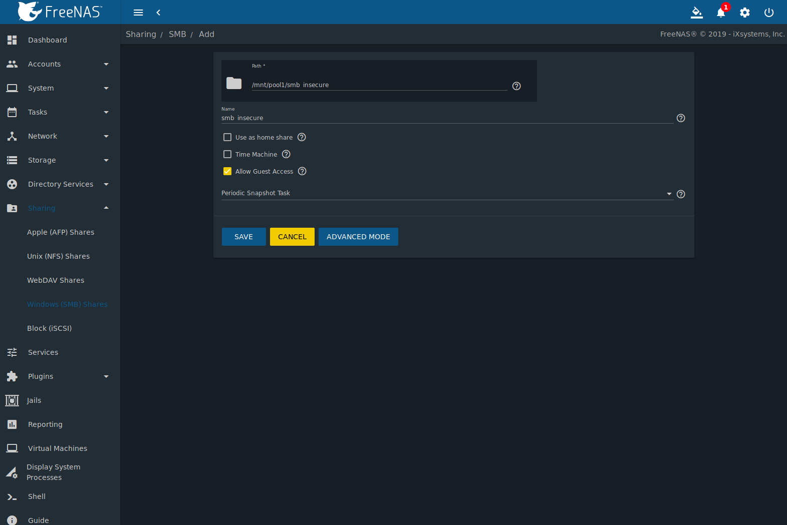

   Creating an Unauthenticated SMB Share

The new share appears in
:menuselection:`Sharing --> Windows (SMB) Shares`.

Users can now access the share from any SMB client and will not be
prompted for their username or password. For example, to access the
share from a Windows system, open Explorer and click on
:guilabel:`Network`. For this configuration example, a system named
*FREENAS* appears with a share named :guilabel:`insecure_smb`. The
user can copy data to and from the unauthenticated SMB share.

.. _Configuring Authenticated Access With Local Users:

Configuring Authenticated Access With Local Users
~~~~~~~~~~~~~~~~~~~~~~~~~~~~~~~~~~~~~~~~~~~~~~~~~

Most configuration scenarios require each user to have their own user
account and to authenticate before accessing the share. This allows
the administrator to control access to data, provide appropriate
permissions to that data, and to determine who accesses and modifies
stored data. A Windows domain controller is not needed for authenticated
SMB shares, which means that additional licensing costs are not
required. However, because there is no domain controller to provide
authentication for the network, each user account must be created on the
%brand% system. This type of configuration scenario is often used in
home and small networks as it does not scale well if many user accounts
are needed.

Before configuring this scenario, determine which users need
authenticated access. While not required for the configuration, it
eases troubleshooting if the username and password that will be
created on the %brand% system matches that information on the client
system. Next, determine if each user should have their own share to
store their own data or if several users will be using the same share.
The simpler configuration is to make one share per user as it does not
require the creation of groups, adding the correct users to the
groups, and ensuring that group permissions are set correctly.

Before creating an authenticated SMB share, go to
:menuselection:`Storage --> Pools` to make a dataset for the share.
For more information about dataset creation, refer to :ref:`Adding Datasets`.

After creating the dataset, go to
:menuselection:`Storage --> Pools` and click the
|ui-options| button for the desired dataset. Click
:guilabel:`Edit Permissions` and fill out the information as shown in
:numref:`Figure %s <edit_permissions_smb_share_fig>`.

#. **ACL Type:** Select :guilabel:`Windows`.

#. **User:** If the user does not yet exist on the %brand% system, go
   to
   :menuselection:`Accounts --> Users`
   to create one. Refer to :ref:`Users` for more information about
   creating a user. After the user has been created, use the drop-down
   to select the user account.

#. **Group:** Use the drop-down to select the desired group name.
   If the group does not yet exist on the %brand% system, go to
   :menuselection:`Accounts --> Groups` to create one. Refer to
   :ref:`Groups` for more information about creating a group.

#. Click :guilabel:`SAVE`.

.. _edit_permissions_smb_share_fig:

.. figure:: images/storage-pools-edit-permissions.png

   Editing Dataset Permissions for Authenticated SMB Share

To create an authenticated SMB share, go to
:menuselection:`Sharing --> Windows (SMB) Shares`
and click |ui-add|, as shown in
:numref:`Figure %s <create_auth_smb_share_fig>`.
Browse to the dataset created for the share and enter a name for the
share. Press :guilabel:`SAVE` to create the share.

.. _create_auth_smb_share_fig:

   Creating an Authenticated SMB Share

To configure multiple authenticated shares, repeat for each user. The
new shares are also added to
:menuselection:`Sharing --> Windows (SMB) Shares`.

The authenticated share can now be tested from any SMB client. For
example, to test an authenticated share from a Windows system, open
Explorer and click on :guilabel:`Network`. For this configuration
example, a system named *FREENAS* appears with a share named
*smb_user1*. After clicking *smb_user1*, a Windows Security pop-up
screen prompts for that user's username and password. Enter the values
that were configured for that share, in this case user *user1*. After
authentication, the user can copy data to and from the SMB share.

To prevent Windows Explorer from hanging when accessing the share, map
the share as a network drive. To do this, right-click the share and
select :guilabel:`Map network drive...`. Choose a drive letter from
the drop-down menu and click the :guilabel:`Finish` button.

Note that Windows systems cache a user's credentials. This can cause
issues when testing or accessing multiple authenticated shares as only
one authentication is allowed at a time. When authenticating to
a share, if problems occur and the username and password are correct,
type :command:`cmd` in the :guilabel:`Search programs and files` box and
use the following command to see if the share is already authenticated.
In this example, the user has already authenticated to the
:literal:`smb_user1` share:

.. code-block:: none

   net use
   New connections will be remembered.

   Status         Local   Remote                  Network
   ------------------------------------------------------------------------
   OK                     \\FREENAS\smb_user1 Microsoft Windows Network
   The command completed successfully.

To clear the cache:

.. code-block:: none

   net use * /DELETE
   You have these remote connections:
                  \\FREENAS\smb_user1
   Continuing will cancel the connections.

   Do you want to continue this operation? <Y/N> [N]: y

An additional warning is shown if the share is currently open in
Explorer:

.. code-block:: none

   There are open files and/or incomplete directory searches pending on the connection
   to \\FREENAS|smb_user1.

   Is it OK to continue disconnecting and force them closed? <Y/N> [N]: y
   The command completed successfully.

The next time a share is accessed with Explorer, a prompt to
authenticate appears.

.. index:: Shadow Copies
.. _Configuring Shadow Copies:

Configuring Shadow Copies
~~~~~~~~~~~~~~~~~~~~~~~~~

`Shadow Copies <https://en.wikipedia.org/wiki/Shadow_copy>`__,
also known as the Volume Shadow Copy Service (VSS) or Previous
Versions, is a Microsoft service for creating volume snapshots. Shadow
copies can be used to restore previous versions of files from
within Windows Explorer. Shadow Copy support is built into Vista and
Windows 7. Windows XP or 2000 users need to install the
`Shadow Copy client
<http://www.microsoft.com/en-us/download/details.aspx?displaylang=en&id=16220>`__.

When a periodic snapshot task is created on a ZFS pool that is
configured as a SMB share in %brand%, it is automatically configured
to support shadow copies.

Before using shadow copies with %brand%, be aware of the following
caveats:

* If the Windows system is not fully patched to the latest service
  pack, Shadow Copies may not work. If no
  previous versions of files to restore are visible, use Windows Update
  to ensure the system is fully up-to-date.

* Shadow copy support only works for ZFS pools or datasets. This means
  that the SMB share must be configured on a pool or dataset, not
  on a directory.

* Datasets are filesystems and shadow copies cannot traverse
  filesystems. To see the shadow copies in the
  child datasets, create separate shares for them.

* Shadow copies will not work with a manual snapshot. Creating
  a periodic snapshot task for the pool or dataset being shared by
  SMB or a recursive task for a parent dataset is recommended.

* The periodic snapshot task should be created and at least one
  snapshot should exist **before** creating the SMB share. If the
  SMB share was created first, restart the SMB service in
  :menuselection:`Services`.

* Appropriate permissions must be configured on the pool or dataset
  being shared by SMB.

* Users cannot delete shadow copies on the Windows system due to the
  way Samba works. Instead, the administrator can remove snapshots
  from the %brand% |web-ui|. The only way to disable shadow
  copies completely is to remove the periodic snapshot task and delete
  all snapshots associated with the SMB share.

To configure shadow copy support, use the instructions in
:ref:`Configuring Authenticated Access With Local Users` to create the
desired number of shares. In this configuration example, a Windows 7
computer has two users: *user1* and *user2*. For this example, two
authenticated shares are created so that each user account has their own
share. The first share is named *user1* and the second share is named
*user2*. Then:

#. Go to
   :menuselection:`Tasks --> Periodic Snapshot Tasks`
   and click |ui-add| to create at least one periodic snapshot task.
   There are two options for snapshot tasks. One is to create a
   snapshot task for each user's dataset. In this example the datasets
   are :file:`/mnt/volume1/user1` and :file:`/mnt/volume1/user2`.
   Another option is to create one periodic snapshot task for the
   entire volume, :file:`/mnt/volume1` in this case.
   **Before continuing to the next step,** confirm that at least one
   snapshot for each defined task is displayed in the
   :menuselection:`Storage --> Snapshots`
   tab. When creating the schedule for the periodic snapshot tasks,
   keep in mind how often the users need to access modified files and
   during which days and time of day they are likely to make changes.

#. Go to
   :menuselection:`Sharing --> Windows (SMB) Shares` and click
   |ui-options| on an existing share. Click :guilabel:`Edit` then
   :guilabel:`ADVANCED MODE`. Use the :guilabel:`Periodic Snapshot Task`
   drop-down menu to select the periodic snapshot task to use for that
   share. Repeat for each share being configured as a shadow copy. For
   this example, the share named :file:`/mnt/pool1/user1` is configured
   to use a periodic snapshot task that was configured to take snapshots
   of the :file:`/mnt/pool1/user1` dataset and the share named
   :file:`/mnt/pool1/user2` is configured to use a periodic snapshot
   task that was configured to take snapshots of the
   :file:`/mnt/pool1/user2` dataset.

#. Verify that the SMB service is running in
   :menuselection:`Services`.

:numref:`Figure %s <view_shadow_explorer_fig>`
provides an example of using shadow copies while logged in as *user1*
on the Windows system. In this example, the user right-clicked
*modified file* and selected :guilabel:`Restore previous versions`
from the menu. This particular file has three versions: the current
version, plus two previous versions stored on the %brand% system. The
user can choose to open one of the previous versions, copy a previous
version to the current folder, or restore one of the previous
versions, overwriting the existing file on the Windows system.

.. _view_shadow_explorer_fig:

.. figure:: images/sharing-windows-shadow-copies.png

   Viewing Previous Versions within Explorer

.. index:: iSCSI, Internet Small Computer System Interface
.. _Block (iSCSI):

Block (iSCSI)
-------------

iSCSI is a protocol standard for the consolidation of storage data.
iSCSI allows %brand% to act like a storage area network (SAN) over an
existing Ethernet network. Specifically, it exports disk devices over
an Ethernet network that iSCSI clients (called initiators) can attach
to and mount. Traditional SANs operate over fibre channel networks
which require a fibre channel infrastructure such as fibre channel
HBAs, fibre channel switches, and discrete cabling. iSCSI can be used
over an existing Ethernet network, although dedicated networks can be
built for iSCSI traffic in an effort to boost performance. iSCSI also
provides an advantage in an environment that uses Windows shell
programs; these programs tend to filter "Network Location" but iSCSI
mounts are not filtered.

Before configuring the iSCSI service, be familiar with this iSCSI
terminology:

**CHAP:** an authentication method which uses a shared secret and
three-way authentication to determine if a system is authorized to
access the storage device and to periodically confirm that the session
has not been hijacked by another system. In iSCSI, the initiator
(client) performs the CHAP authentication.

**Mutual CHAP:** a superset of CHAP in that both ends of the
communication authenticate to each other.

**Initiator:** a client which has authorized access to the storage
data on the %brand% system. The client requires initiator software to
initiate the connection to the iSCSI share.

**Target:** a storage resource on the %brand% system. Every target
has a unique name known as an iSCSI Qualified Name (IQN).

**Internet Storage Name Service (iSNS):** protocol for the automated
discovery of iSCSI devices on a TCP/IP network.

**Extent:** the storage unit to be shared. It can either be a file or
a device.

**Portal:** indicates which IP addresses and ports to listen on for
connection requests.

**LUN:** *Logical Unit Number* representing a logical SCSI device. An
initiator negotiates with a target to establish connectivity to a LUN.
The result is an iSCSI connection that emulates a connection to a SCSI
hard disk. Initiators treat iSCSI LUNs as if they were a raw SCSI or
SATA hard drive. Rather than mounting remote directories, initiators
format and directly manage filesystems on iSCSI LUNs. When configuring
multiple iSCSI LUNs, create a new target for each LUN. Since iSCSI
multiplexes a target with multiple LUNs over the same TCP connection,
there can be TCP contention when more than one target accesses the
same LUN. %brand% supports up to 1024 LUNs.

#ifdef truenas
**ALUA:** *Asymmetric Logical Unit Access* allows a client computer to
discover the best path to the storage on a %brand% system. HA storage
clusters can provide multiple paths to the same storage. For example,
the disks are directly connected to the primary computer and provide
high speed and bandwidth when accessed through that primary computer.
The same disks are also available through the secondary computer, but
because they are not directly connected to it, speed and bandwidth are
restricted. With ALUA, clients automatically ask for and use the best
path to the storage. If one of the %brand% HA computers becomes
inaccessible, the clients automatically switch to the next best
alternate path to the storage. When a better path becomes available,
as when the primary host becomes available again, the clients
automatically switch back to that better path to the storage.

.. note:: Do not enable ALUA on %brand% unless it is supported by
      and enabled on the client computers also. ALUA only works
      properly when enabled on both the client and server.

#endif truenas
In %brand%, iSCSI is built into the kernel. This version of iSCSI
supports
`Microsoft Offloaded Data Transfer (ODX)
<https://docs.microsoft.com/en-us/previous-versions/windows/it-pro/windows-server-2012-R2-and-2012/hh831628(v=ws.11)>`__,
meaning that file copies happen locally, rather than over the network.
It also supports the :ref:`VAAI` (vStorage APIs for Array Integration)
primitives for efficient operation of storage tasks directly on the
NAS. To take advantage of the VAAI primitives, create a zvol using the
instructions in :ref:`Adding Zvols` and use it to create a device
extent, as described in :ref:`Extents`.

To configure iSCSI:

#.  Review the target global configuration parameters.

#.  Create at least one portal.

#.  Determine which hosts are allowed to connect using iSCSI and
    create an initiator.

#.  Decide if authentication will be used, and if so, whether it will
    be CHAP or mutual CHAP. If using authentication, create an
    authorized access.

#.  Create a target.

#.  Create either a device or a file extent to be used as storage.

#.  Associate a target with an extent.

#.  Start the iSCSI service in
    :menuselection:`Services`.

The rest of this section describes these steps in more detail.

#ifdef truenas
.. note:: If the system has been licensed for Fibre Channel, the
   screens will vary slightly from those found in the rest of this
   section. Refer to the section on :ref:`Fibre Channel Ports` for
   details.
#endif truenas

.. _Target Global Configuration:

Target Global Configuration
~~~~~~~~~~~~~~~~~~~~~~~~~~~

:menuselection:`Sharing --> Block (iSCSI)
--> Target Global Configuration`, shown in
:numref:`Figure %s <iscsi_targ_global_var_fig>`, contains settings that
apply to all iSCSI shares.
:numref:`Table %s <iscsi_targ_global_config_tab>`
summarizes the settings that are configured in the Target Global
Configuration screen.

Some built-in values affect iSNS usage. Fetching of allowed initiators
from iSNS is not implemented, so target ACLs must be configured
manually. To make iSNS registration useful, iSCSI targets should have
explicitly configured port IP addresses. This avoids initiators
attempting to discover unconfigured target portal addresses like
*0.0.0.0*.

The iSNS registration period is *900* seconds. Registered Network
Entities not updated during this period are unregistered. The timeout
for iSNS requests is *5* seconds.

#ifdef freenas
.. _iscsi_targ_global_var_fig:
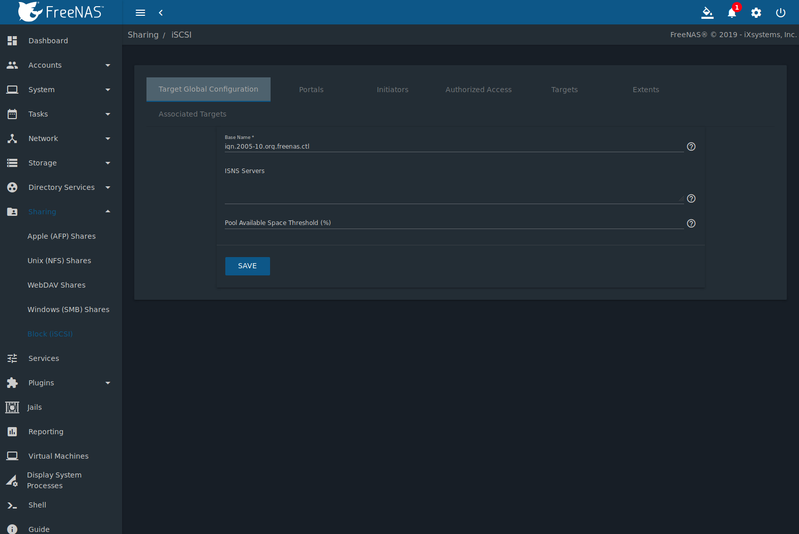

   iSCSI Target Global Configuration Variables
#endif freenas
#ifdef truenas
.. _iscsi_targ_global_var_fig:
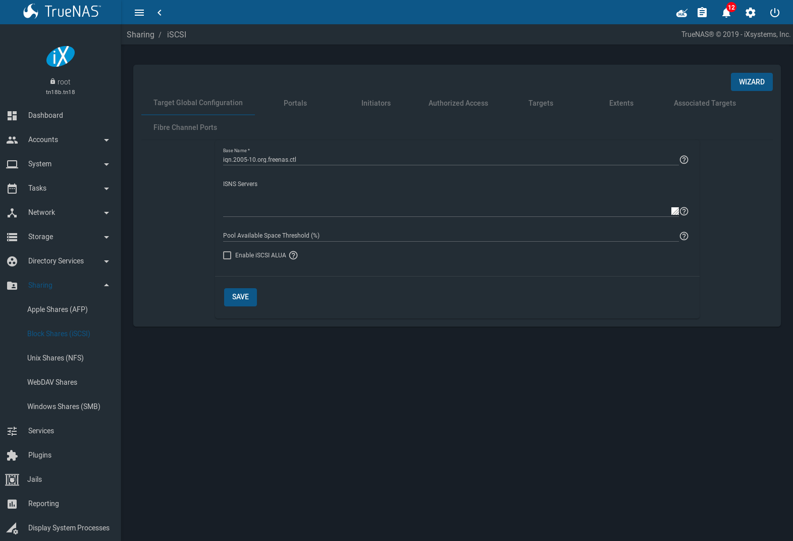

  iSCSI Target Global Configuration Variables
#endif truenas

.. tabularcolumns:: |>{\RaggedRight}p{\dimexpr 0.25\linewidth-2\tabcolsep}
                    |>{\RaggedRight}p{\dimexpr 0.12\linewidth-2\tabcolsep}
                    |>{\RaggedRight}p{\dimexpr 0.63\linewidth-2\tabcolsep}|

.. _iscsi_targ_global_config_tab:

.. table:: Target Global Configuration Settings
   :class: longtable

   +---------------------------------+------------------------------+-------------------------------------------------------------------------------------------+
   | Setting                         | Value                        | Description                                                                               |
   |                                 |                              |                                                                                           |
   |                                 |                              |                                                                                           |
   +=================================+==============================+===========================================================================================+
   | Base Name                       | string                       | Lowercase alphanumeric characters plus dot (.), dash (-), and colon (:) are allowed.      |
   |                                 |                              | See the "Constructing iSCSI names using the iqn. format" section of :rfc:`3721`.          |
   |                                 |                              |                                                                                           |
   +---------------------------------+------------------------------+-------------------------------------------------------------------------------------------+
   | ISNS Servers                    | string                       | Enter the hostnames or IP addresses of ISNS servers to be registered with iSCSI targets   |
   |                                 |                              | and portals of the system. Separate each entry with a space.                              |
   |                                 |                              |                                                                                           |
   +---------------------------------+------------------------------+-------------------------------------------------------------------------------------------+
   | Pool Available Space Threshold  | integer                      | Enter the percentage of free space to in the pool. When this percentage                   |
   |                                 |                              | is reached, the system issues an alert, but only if zvols are used. See :ref:`VAAI`       |
   |                                 |                              | Threshold Warning for more information.                                                   |
   +---------------------------------+------------------------------+-------------------------------------------------------------------------------------------+
#ifdef truenas
   | Enable iSCSI ALUA               | checkbox                     | Enable ALUA for automatic best path discovery when supported by clients. This option      |
   |                                 |                              | is only available on HA systems.                                                          |
   +---------------------------------+------------------------------+-------------------------------------------------------------------------------------------+
#endif truenas

.. _Portals:

Portals
~~~~~~~

A portal specifies the IP address and port number to be used for iSCSI
connections.
Go to :menuselection:`Sharing --> Block (iSCSI) --> Portals`
and click |ui-add| to display the screen shown in
:numref:`Figure %s <iscsi_add_portal_fig>`.

:numref:`Table %s <iscsi_add_portal_fig>`
summarizes the settings that can be configured when adding a portal.
To assign additional IP addresses to the portal, click the link
:guilabel:`Add extra Portal IP`.

.. _iscsi_add_portal_fig:

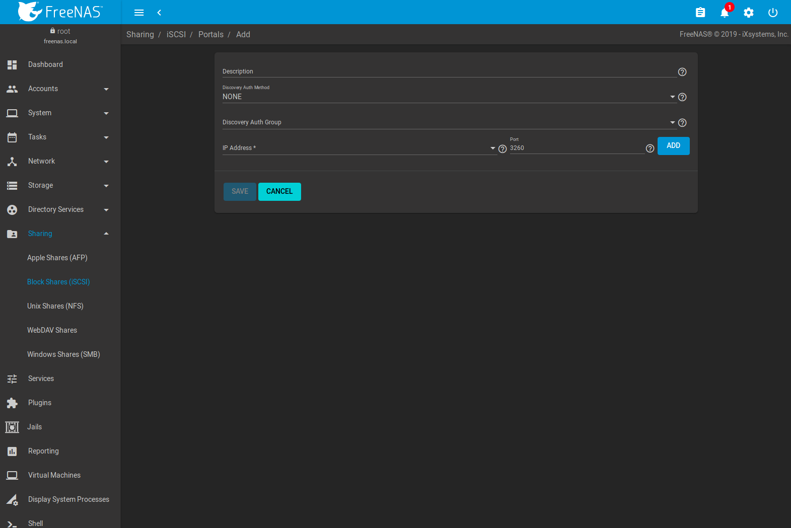

   Adding an iSCSI Portal

.. tabularcolumns:: |>{\RaggedRight}p{\dimexpr 0.25\linewidth-2\tabcolsep}
                    |>{\RaggedRight}p{\dimexpr 0.12\linewidth-2\tabcolsep}
                    |>{\RaggedRight}p{\dimexpr 0.63\linewidth-2\tabcolsep}|

.. _iscsi_portal_conf_tab:

.. table:: Portal Configuration Settings
   :class: longtable

   +-----------------------+----------------+-----------------------------------------------------------------------------+
   | Setting               | Value          | Description                                                                 |
   |                       |                |                                                                             |
   |                       |                |                                                                             |
   +=======================+================+=============================================================================+
   | Comment               | string         | Enter an optional description. Portals are automatically assigned a         |
   |                       |                | numeric group ID.                                                           |
   +-----------------------+----------------+-----------------------------------------------------------------------------+
   | Discovery Auth Method | drop-down menu | :ref:`iSCSI` supports multiple authentication methods that are used by the  |
   |                       |                | target to discover valid devices. *None* allows anonymous discovery while   |
   |                       |                | *CHAP* and *Mutual CHAP* both require authentication.                       |
   |                       |                |                                                                             |
   |                       |                |                                                                             |
   +-----------------------+----------------+-----------------------------------------------------------------------------+
   | Discovery Auth Group  | drop-down menu | Select a user created in :guilabel:`Authorized Access` if the               |
   |                       |                | :guilabel:`Discovery Auth Method` is set to *CHAP* or                       |
   |                       |                | *Mutual CHAP*.                                                              |
   |                       |                |                                                                             |
   +-----------------------+----------------+-----------------------------------------------------------------------------+
   | IP address            | drop-down menu | Select the IPv4 or IPv6 address associated with an interface or the         |
   |                       |                | wildcard address of *0.0.0.0* (any interface).                              |
   |                       |                |                                                                             |
   +-----------------------+----------------+-----------------------------------------------------------------------------+
   | Port                  | integer        | TCP port used to access the iSCSI target. Default is *3260*.                |
   |                       |                |                                                                             |
   +-----------------------+----------------+-----------------------------------------------------------------------------+

%brand% systems with multiple IP addresses or interfaces can use a
portal to provide services on different interfaces or subnets. This
can be used to configure multi-path I/O (MPIO). MPIO is more efficient
than a link aggregation.

If the %brand% system has multiple configured interfaces, portals can
also be used to provide network access control. For example, consider
a system with four interfaces configured with these addresses:

192.168.1.1/24

192.168.2.1/24

192.168.3.1/24

192.168.4.1/24

A portal containing the first two IP addresses (group
ID 1) and a portal containing the remaining two IP addresses (group ID
2) could be created. Then, a target named A with a Portal Group ID of 1
and a second target named B with a Portal Group ID of 2 could be created.
In this scenario, the iSCSI service would listen on all four interfaces,
but connections to target A would be limited to the first two networks
and connections to target B would be limited to the last two networks.

Another scenario would be to create a portal which includes every IP
address **except** for the one used by a management interface. This
would prevent iSCSI connections to the management interface.

.. _Initiators:

Initiators
~~~~~~~~~~

The next step is to configure authorized initiators, or the systems
which are allowed to connect to the iSCSI targets on the %brand%
system. To configure which systems can connect, go to
:menuselection:`Sharing --> Block (iSCSI) --> Initiators`
and click |ui-add| as shown in
:numref:`Figure %s <iscsi_add_initiator_fig>`.

.. _iscsi_add_initiator_fig:

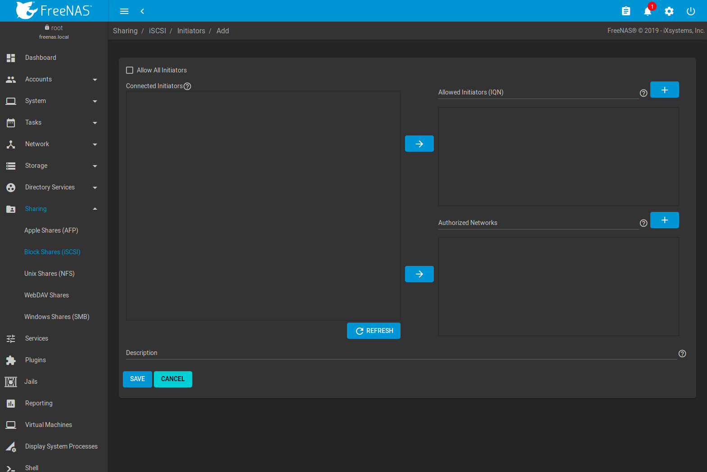

   Adding an iSCSI Initiator

:numref:`Table %s <iscsi_initiator_conf_tab>`
summarizes the settings that can be configured when adding an
initiator.

.. tabularcolumns:: |>{\RaggedRight}p{\dimexpr 0.25\linewidth-2\tabcolsep}
                    |>{\RaggedRight}p{\dimexpr 0.12\linewidth-2\tabcolsep}
                    |>{\RaggedRight}p{\dimexpr 0.63\linewidth-2\tabcolsep}|

.. _iscsi_initiator_conf_tab:

.. table:: Initiator Configuration Settings
   :class: longtable

   +---------------------+-----------+--------------------------------------------------------------------------------------+
   | Setting             | Value     | Description                                                                          |
   |                     |           |                                                                                      |
   +=====================+===========+======================================================================================+
   | Initiators          | string    | Use *ALL* keyword or a list of initiator hostnames separated by spaces.              |
   |                     |           |                                                                                      |
   +---------------------+-----------+--------------------------------------------------------------------------------------+
   | Authorized Networks | string    | Network addresses that can use this initiator. Use :literal:`ALL` or list network    |
   |                     |           | addresses with a `CIDR                                                               |
   |                     |           | <https://en.wikipedia.org/wiki/Classless_Inter-Domain_Routing>`__ mask. Separate     |
   |                     |           | multiple addresses with a space: :samp:`192.168.2.0/24 192.168.2.1/12`.              |
   |                     |           |                                                                                      |
   +---------------------+-----------+--------------------------------------------------------------------------------------+
   | Comment             | string    | Notes or a description of the initiator.                                             |
   |                     |           |                                                                                      |
   +---------------------+-----------+--------------------------------------------------------------------------------------+

In the example shown in
:numref:`Figure %s <iscsi_initiator_conf_sample_fig>`,
two groups are created. Group 1 allows connections from any
initiator on any network. Group 2 allows connections from any
initiator on the *10.10.1.0/24* network. Click |ui-options| on an
initiator entry to display its :guilabel:`Edit` and :guilabel:`Delete`
buttons.

.. note:: Attempting to delete an initiator causes a warning that
   indicates if any targets or target/extent mappings depend upon the
   initiator. Confirming the delete causes these to be deleted also.

.. _iscsi_initiator_conf_sample_fig:

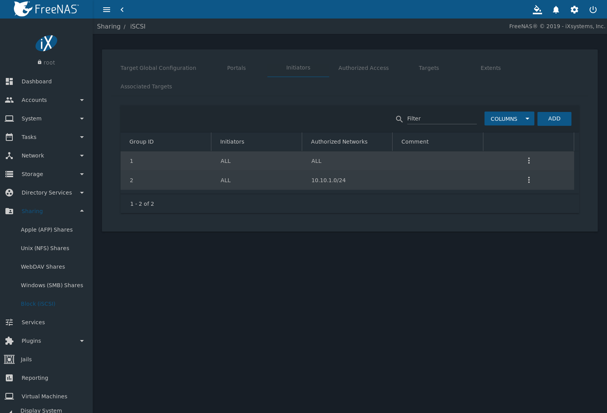

   Sample iSCSI Initiator Configuration

.. _Authorized Accesses:

Authorized Accesses
~~~~~~~~~~~~~~~~~~~

When using CHAP or mutual CHAP to provide authentication,
creating an authorized access is recommended. Do this by going to
:menuselection:`Sharing --> Block (iSCSI) --> Authorized Access`
and clicking |ui-add|. The screen is shown in
:numref:`Figure %s <iscsi_add_auth_access_fig>`.

.. note:: This screen sets login authentication. This is different
   from discovery authentication which is set in
   :ref:`Global Configuration`.

.. _iscsi_add_auth_access_fig:

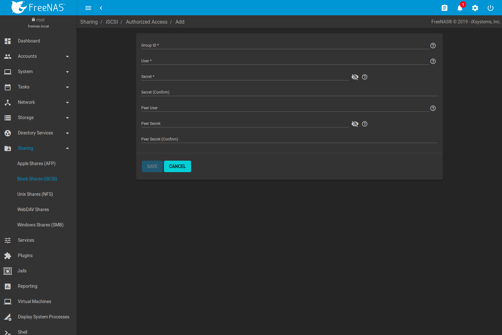

   Adding an iSCSI Authorized Access

:numref:`Table %s <iscsi_auth_access_config_tab>`
summarizes the settings that can be configured when adding an
authorized access:

.. tabularcolumns:: |>{\RaggedRight}p{\dimexpr 0.16\linewidth-2\tabcolsep}
                    |>{\RaggedRight}p{\dimexpr 0.16\linewidth-2\tabcolsep}
                    |>{\RaggedRight}p{\dimexpr 0.63\linewidth-2\tabcolsep}|

.. _iscsi_auth_access_config_tab:

.. table:: Authorized Access Configuration Settings
   :class: longtable

   +-------------+-----------+----------------------------------------------------------------------------------------------------------------------------------+
   | Setting     | Value     | Description                                                                                                                      |
   |             |           |                                                                                                                                  |
   +=============+===========+==================================================================================================================================+
   | Group ID    | integer   | Allows different groups to be configured with different authentication profiles. Example: all users with a Group ID of *1*       |
   |             |           | will inherit the authentication profile associated with Group *1*                                                                |
   |             |           |                                                                                                                                  |
   +-------------+-----------+----------------------------------------------------------------------------------------------------------------------------------+
   | User        | string    | Enter name of user account to create for CHAP authentication with the user on the remote system. Many initiators default         |
   |             |           | to using the initiator name as the user.                                                                                         |
   |             |           |                                                                                                                                  |
   +-------------+-----------+----------------------------------------------------------------------------------------------------------------------------------+
   | Secret      | string    | Enter and confirm a password for :guilabel:`User`. Must be between 12 and 16 characters.                                         |
   |             |           |                                                                                                                                  |
   +-------------+-----------+----------------------------------------------------------------------------------------------------------------------------------+
   | Peer User   | string    | Only input when configuring mutual CHAP. In most cases it will need to be the same value as :guilabel:`User`.                    |
   |             |           |                                                                                                                                  |
   +-------------+-----------+----------------------------------------------------------------------------------------------------------------------------------+
   | Peer Secret | string    | Enter and confirm the mutual secret password which **must be different than the** :guilabel:`Secret`. Required if                |
   |             |           | :guilabel:`Peer User` is set.                                                                                                    |
   +-------------+-----------+----------------------------------------------------------------------------------------------------------------------------------+

.. note:: CHAP does not work with GlobalSAN initiators on macOS.

New authorized accesses are visible from the
:menuselection:`Sharing --> Block (iSCSI) --> Authorized Access` menu.
In the example shown in :numref:`Figure %s <iscsi_view_auth_access_fig>`,
three users (*test1*, *test2*, and *test3*) and two groups
(*1* and *2*) have been created, with group 1 consisting of one CHAP
user and group 2 consisting of one mutual CHAP user and one CHAP user.
Click an authorized access entry to display its :guilabel:`Edit` and
:guilabel:`Delete` buttons.

.. _iscsi_view_auth_access_fig:

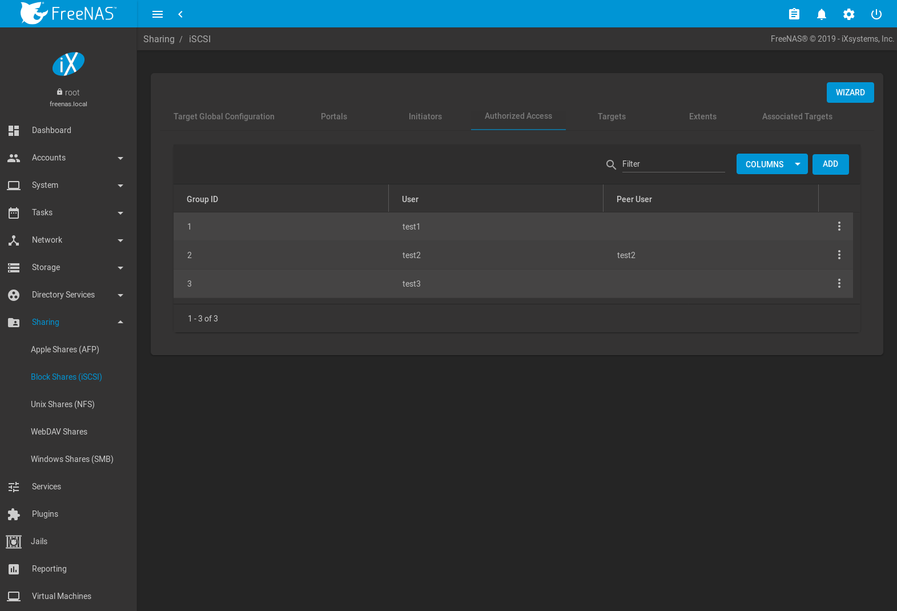

   Viewing Authorized Accesses

.. _Targets:

Targets
~~~~~~~

Next, create a Target by going to
:menuselection:`Sharing --> Block (iSCSI) --> Targets` and clicking
|ui-add| as shown in
:numref:`Figure %s <iscsi_add_target_fig>`.
A target combines a portal ID, allowed initiator ID, and an
authentication method.
:numref:`Table %s <iscsi_target_settings_tab>`
summarizes the settings that can be configured when creating a Target.

.. note:: An iSCSI target creates a block device that may be
   accessible to multiple initiators. A clustered filesystem is
   required on the block device, such as VMFS used by VMware ESX/ESXi,
   in order for multiple initiators to mount the block device
   read/write. If a traditional filesystem such as EXT, XFS, FAT,
   NTFS, UFS, or ZFS is placed on the block device, care must be taken
   that only one initiator at a time has read/write access or the
   result will be filesystem corruption. If multiple clients need
   access to the same data on a non-clustered filesystem, use SMB or
   NFS instead of iSCSI, or create multiple iSCSI targets (one per
   client).

.. _iscsi_add_target_fig:

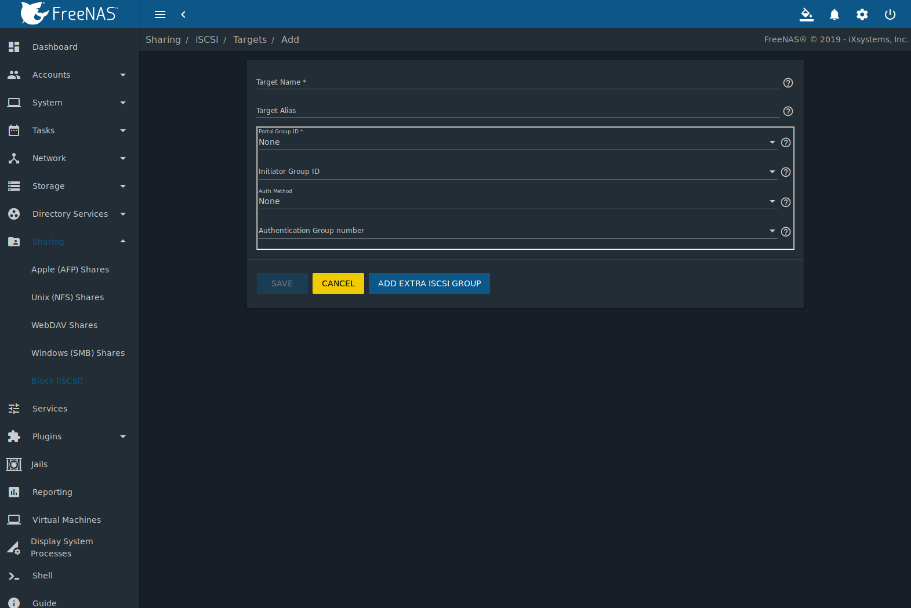

   Adding an iSCSI Target

.. tabularcolumns:: |>{\RaggedRight}p{\dimexpr 0.25\linewidth-2\tabcolsep}
                    |>{\RaggedRight}p{\dimexpr 0.12\linewidth-2\tabcolsep}
                    |>{\RaggedRight}p{\dimexpr 0.63\linewidth-2\tabcolsep}|

.. _iscsi_target_settings_tab:

.. table:: Target Settings
   :class: longtable

   +-----------------------------+----------------+-------------------------------------------------------------------------------------------------------------+
   | Setting                     | Value          | Description                                                                                                 |
   |                             |                |                                                                                                             |
   |                             |                |                                                                                                             |
   +=============================+================+=============================================================================================================+
   | Target Name                 | string         | Required. The base name is automatically prepended if the target name does not start with *iqn*.            |
   |                             |                | Lowercase alphanumeric characters plus dot (.), dash (-), and colon (:) are allowed.                        |
   |                             |                | See the "Constructing iSCSI names using the iqn. format" section of :rfc:`3721`.                            |
   +-----------------------------+----------------+-------------------------------------------------------------------------------------------------------------+
   | Target Alias                | string         | Enter an optional user-friendly name.                                                                       |
   |                             |                |                                                                                                             |
   +-----------------------------+----------------+-------------------------------------------------------------------------------------------------------------+
   | Portal Group ID             | drop-down menu | Leave empty or select number of existing portal to use.                                                     |
   |                             |                |                                                                                                             |
   +-----------------------------+----------------+-------------------------------------------------------------------------------------------------------------+
   | Initiator Group ID          | drop-down menu | Select which existing initiator group has access to the target.                                             |
   |                             |                |                                                                                                             |
   +-----------------------------+----------------+-------------------------------------------------------------------------------------------------------------+
   | Auth Method                 | drop-down menu | Choices are: *None*,                                                                                        |
   |                             |                | *Auto*,                                                                                                     |
   |                             |                | *CHAP*, or                                                                                                  |
   |                             |                | *Mutual CHAP*.                                                                                              |
   |                             |                |                                                                                                             |
   +-----------------------------+----------------+-------------------------------------------------------------------------------------------------------------+
   | Authentication Group number | drop-down menu | Select *None* or an integer. This number represents the number of existing authorized accesses.             |
   |                             |                |                                                                                                             |
   +-----------------------------+----------------+-------------------------------------------------------------------------------------------------------------+

.. _Extents:

Extents
~~~~~~~

iSCSI targets provide virtual access to resources on the %brand%
system. *Extents* are used to define resources to share with clients.
There are two types of extents: *device* and *file*.

**Device extents** provide virtual storage access to zvols, zvol
snapshots, or physical devices like a disk, an SSD, a hardware RAID
volume, or a
`HAST device
<https://www.freebsd.org/doc/en_US.ISO8859-1/books/handbook/disks-hast.html>`__.

**File extents** provide virtual storage access to an individual file.

.. tip:: **For typical use as storage for virtual machines where the
   virtualization software is the iSCSI initiator, device extents
   with zvols provide the best performance and most features.**
   For other applications, device extents sharing a raw device can be
   appropriate. File extents do not have the performance or features
   of device extents, but do allow creating multiple extents on a
   single filesystem.

Virtualized zvols support all the %brand% :ref:`VAAI` primitives and
are recommended for use with virtualization software as the iSCSI
initiator.

The ATS, WRITE SAME, XCOPY and STUN, primitives are supported by both
file and device extents. The UNMAP primitive is supported by zvols and
raw SSDs. The threshold warnings primitive is fully supported by zvols
and partially supported by file extents.

Virtualizing a raw device like a single disk or hardware RAID volume
limits performance to the abilities of the device. Because this
bypasses ZFS, such devices do not benefit from ZFS caching or provide
features like block checksums or snapshots.

Virtualizing a zvol adds the benefits of ZFS, such as read and write
cache. Even if the client formats a device extent with a different
filesystem, the data still resides on a ZFS pool and benefits from
ZFS features like block checksums and snapshots.

.. warning:: For performance reasons and to avoid excessive
   fragmentation, keep the used space of the pool below 80% when using
   iSCSI. The capacity of an existing extent can be increased as shown
   in :ref:`Growing LUNs`.

To add an extent, go to
:menuselection:`Sharing --> Block (iSCSI) --> Extents`
and click |ui-add|. In the example shown in
:numref:`Figure %s <iscsi_adding_extent_fig>`,
the device extent is using the :file:`export` zvol that was previously
created from the :file:`/mnt/pool1` pool.

:numref:`Table %s <iscsi_extent_conf_tab>`
summarizes the settings that can be configured when creating an
extent. Note that **file extent creation fails unless the name of the
file to be created is appended to the pool or dataset name.**

.. _iscsi_adding_extent_fig:

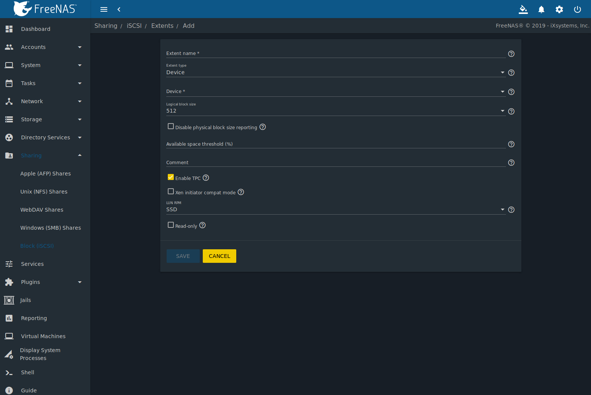

   Adding an iSCSI Extent

.. tabularcolumns:: |>{\RaggedRight}p{\dimexpr 0.25\linewidth-2\tabcolsep}
                    |>{\RaggedRight}p{\dimexpr 0.12\linewidth-2\tabcolsep}
                    |>{\RaggedRight}p{\dimexpr 0.63\linewidth-2\tabcolsep}|

.. _iscsi_extent_conf_tab:

.. table:: Extent Configuration Settings
   :class: longtable

   +--------------------+----------------+----------------------------------------------------------------------------------------------------------------------+
   | Setting            | Value          | Description                                                                                                          |
   |                    |                |                                                                                                                      |
   +====================+================+======================================================================================================================+
   | Extent name        | string         | Enter the extent name. If the :guilabel:`Extent size` is not *0*, it cannot be an existing file within the           |
   |                    |                | pool or dataset.                                                                                                     |
   +--------------------+----------------+----------------------------------------------------------------------------------------------------------------------+
   | Extent type        | drop-down menu | Select from *File* or                                                                                                |
   |                    |                | *Device*.                                                                                                            |
   |                    |                |                                                                                                                      |
   +--------------------+----------------+----------------------------------------------------------------------------------------------------------------------+
   | Path to the extent | browse button  | Only appears if *File* is selected. Browse to an existing file and use *0* as the :guilabel:`Extent size`,           |
   |                    |                | **or** browse to the pool or dataset, click :guilabel:`Close`, append the :guilabel:`Extent Name` to the path,       |
   |                    |                | and specify a value in :guilabel:`Extent size`. Extents cannot be created inside the jail root directory.            |
   |                    |                |                                                                                                                      |
   +--------------------+----------------+----------------------------------------------------------------------------------------------------------------------+
   | Extent size        | integer        | Only appears if *File* is selected. If the size is specified as                                                      |
   |                    |                | *0*, the file must already exist and the actual file size will be used. Otherwise, specify the size of the file to   |
   |                    |                | create.                                                                                                              |
   |                    |                |                                                                                                                      |
   +--------------------+----------------+----------------------------------------------------------------------------------------------------------------------+
   | Device             | drop-down menu | Only appears if *Device* is selected. Select the unformatted disk, controller, zvol, zvol snapshot, or HAST device.  |
   |                    |                |                                                                                                                      |
   +--------------------+----------------+----------------------------------------------------------------------------------------------------------------------+
   | Logical block size | drop-down menu | Only override the default if the initiator requires a different block size.                                          |
   |                    |                |                                                                                                                      |
   +--------------------+----------------+----------------------------------------------------------------------------------------------------------------------+
   | Disable physical   | checkbox       | Set if the initiator does not support physical block size values over 4K (MS SQL). Setting can also prevent          |
   | block size         |                | `constant block size warnings                                                                                        |
   | reporting          |                | <https://www.virten.net/2016/12/the-physical-block-size-reported-by-the-device-is-not-supported/>`__                 |
   |                    |                | when using this share with ESXi.                                                                                     |
   |                    |                |                                                                                                                      |
   +--------------------+----------------+----------------------------------------------------------------------------------------------------------------------+
   | Available space    | string         | Only appears if *File* or a zvol is selected. When the specified percentage of free space is reached, the system     |
   | threshold          |                | issues an alert. See :ref:`VAAI` Threshold Warning.                                                                  |
   |                    |                |                                                                                                                      |
   +--------------------+----------------+----------------------------------------------------------------------------------------------------------------------+
   | Comment            | string         | Enter an optional comment.                                                                                           |
   |                    |                |                                                                                                                      |
   +--------------------+----------------+----------------------------------------------------------------------------------------------------------------------+
   | Enable TPC         | checkbox       | If enabled, an initiator can bypass normal access control and access any scannable target. This allows               |
   |                    |                | :command:`xcopy` operations otherwise blocked by access control.                                                     |
   |                    |                |                                                                                                                      |
   +--------------------+----------------+----------------------------------------------------------------------------------------------------------------------+
   | Xen initiator      | checkbox       | Set this option when using Xen as the iSCSI initiator.                                                               |
   | compat mode        |                |                                                                                                                      |
   |                    |                |                                                                                                                      |
   +--------------------+----------------+----------------------------------------------------------------------------------------------------------------------+
   | LUN RPM            | drop-down menu | Do **NOT** change this setting when using Windows as the initiator. Only needs to be changed in large environments   |
   |                    |                | where the number of systems using a specific RPM is needed for accurate reporting statistics.                        |
   |                    |                |                                                                                                                      |
   +--------------------+----------------+----------------------------------------------------------------------------------------------------------------------+
   | Read-only          | checkbox       | Set this option to prevent the initiator from initializing this LUN.                                                 |
   |                    |                |                                                                                                                      |
   +--------------------+----------------+----------------------------------------------------------------------------------------------------------------------+

New extents are added to
:menuselection:`Sharing --> Block (iSCSI) --> Extents`.
The associated :guilabel:`Serial` and Network Address Authority
(:guilabel:`NAA`) are shown along with the extent name.

.. _Associated Targets:

Associated Targets
~~~~~~~~~~~~~~~~~~

The last step is associating an extent to a target by going to
:menuselection:`Sharing --> Block (iSCSI) --> Associated Targets`
and clicking |ui-add|. The screen is shown in
:numref:`Figure %s <iscsi_target_extent_fig>`.
Use the drop-down menus to select the existing target and extent.
Click :guilabel:`SAVE` to add an entry for the LUN.

.. _iscsi_target_extent_fig:

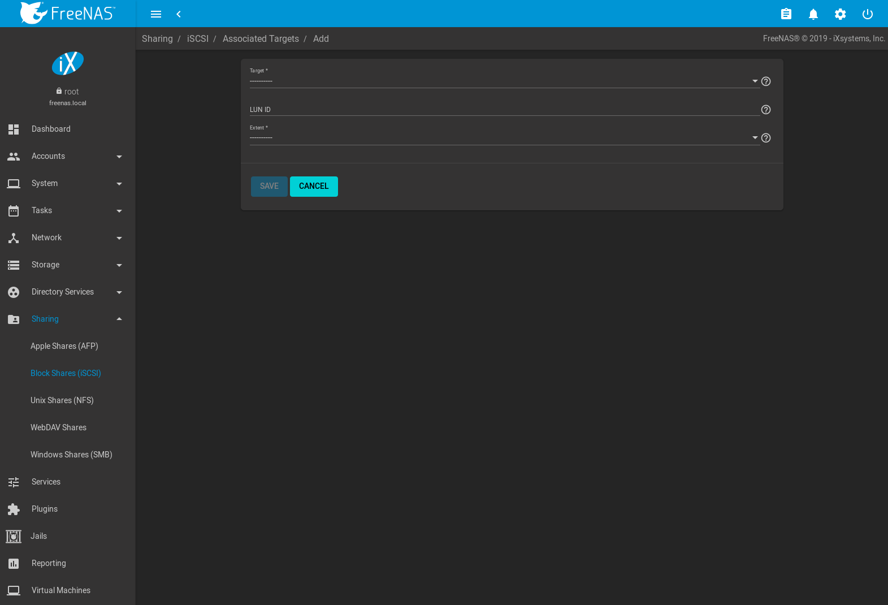

   Associating a Target With an Extent

:numref:`Table %s <iscsi_target_extent_config_tab>`
summarizes the settings that can be configured when associating targets
and extents.

.. tabularcolumns:: |>{\RaggedRight}p{\dimexpr 0.16\linewidth-2\tabcolsep}
                    |>{\RaggedRight}p{\dimexpr 0.20\linewidth-2\tabcolsep}
                    |>{\RaggedRight}p{\dimexpr 0.63\linewidth-2\tabcolsep}|

.. _iscsi_target_extent_config_tab:

.. table:: Associated Target Configuration Settings
   :class: longtable

   +-------------+----------------+--------------------------------------------------------+
   | Setting     | Value          | Description                                            |
   |             |                |                                                        |
   +=============+================+========================================================+
   | Target      | drop-down menu | Select an existing target.                             |
   |             |                |                                                        |
   +-------------+----------------+--------------------------------------------------------+
   | LUN ID      | integer        | Type a value between *0* and *1023*. Note that some    |
   |             |                | initiators expect a a value below *256*. Enter *0*     |
   |             |                | to statically assign the next available ID.            |
   +-------------+----------------+--------------------------------------------------------+
   | Extent      | drop-down menu | Select an existing extent.                             |
   |             |                |                                                        |
   +-------------+----------------+--------------------------------------------------------+

Always associating extents to targets in a
one-to-one manner is recommended, even though the |web-ui| will allow
multiple extents to be associated with the same target.

.. note:: Each LUN entry has :guilabel:`Edit` and :guilabel:`Delete`
   buttons for modifying the settings or deleting the LUN entirely.
   A verification popup appears when the :guilabel:`Delete` button is
   clicked. If an initiator has an active connection to the LUN, it is
   indicated in red text. Clearing the initiator connections to a LUN
   before deleting it is recommended.

After iSCSI has been configured, remember to start the service in
:menuselection:`Services --> iSCSI`
by clicking the |ui-power| button.

#ifdef truenas
.. _Fibre Channel Ports:

Fibre Channel Ports
~~~~~~~~~~~~~~~~~~~

If the %brand% system has Fibre Channel ports,
:menuselection:`Sharing --> Block (iSCSI)`
appears as
:menuselection:`Sharing --> Block (iSCSI/FC)`
and an extra :guilabel:`Fibre Channel Ports` tab is added. An example
is shown in
:numref:`Figure %s <tn_fibre1>`.

.. _tn_fibre1:

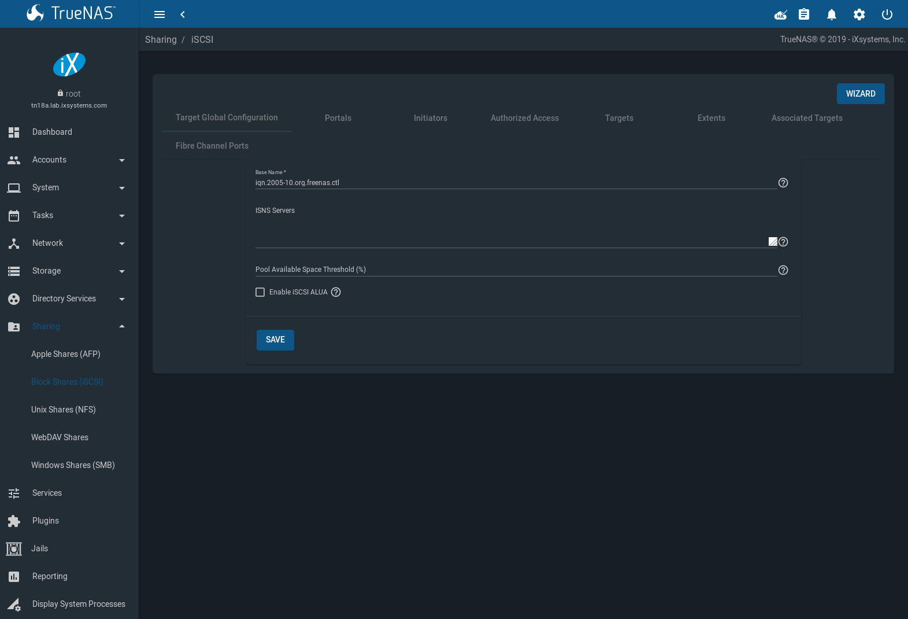

   Block (iSCSI) Screen

Otherwise, the :guilabel:`Target Global Configuration` screen is the
same as described in :ref:`Target Global Configuration`.

Since the :guilabel:`Portals`, :guilabel:`Initiators`, and
:guilabel:`Authorized Access` screens only apply to iSCSI, they are
marked as such and can be ignored when configuring Fibre Channel.

As shown in :numref:`Figure %s <tn_fibre2>`,
an extra :guilabel:`Target Mode` option appears after going to
:menuselection:`Targets`
and clicking |ui-add|. This new option is to select whether the
target to create is iSCSI, Fibre Channel, or both.

.. _tn_fibre2:

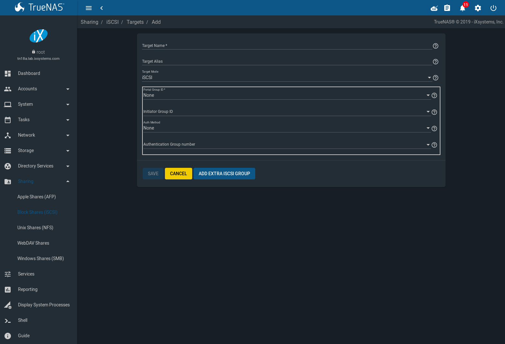

   Add Target Screen

When :guilabel:`Fibre Channel` is selected, this screen changes so
only the :guilabel:`Target Name` and :guilabel:`Target Alias` fields
remain, as those are the only applicable fields for a Fibre Channel
connection. An example is shown in
:numref:`Figure %s <tn_fibre3>`.

.. _tn_fibre3:

.. figure:: images/truenas/fibre3.png

   Configuring a Fibre Channel Target

The screens for adding an extent and associating a target are the same
as described in :ref:`Extents` and :ref:`Associated Targets`.

An example of the :guilabel:`Fibre Channel Ports` screen is shown in
:numref:`Figure %s <tn_fibre_port_fig>`.

.. _tn_fibre_port_fig:

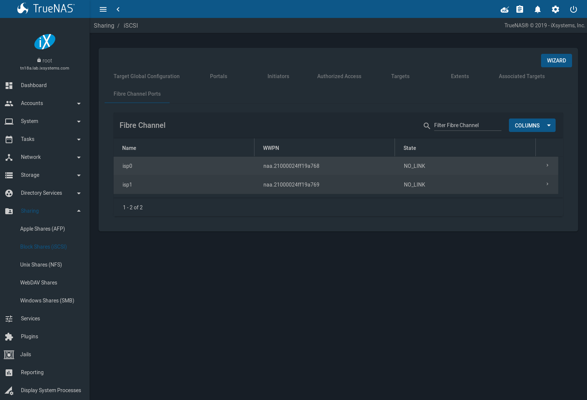

   Configuring a Fibre Channel Port

This screen shows the status of each attached fibre channel port,
where:

* **Initiator:** indicates that the port is acting as a client and has
  access to any physically attached storage.

* **Target:** indicates that clients are connecting to the specified
  target through this port.

* **Disabled:** indicates that this fibre channel port is not in use.

.. note:: The :guilabel:`Target` tab of :ref:`Reporting` provides
   Fibre Channel port bandwidth graphs.

This example has also been configured for NPIV
(N_Port ID Virtualization). Note that the physical interface *isp0*
has two virtual ports (*isp0/1* and *isp0/2*) displayed in
:numref:`Figure %s: <tn_fibre_port_fig>`.
NPIV allows the administrator to use switch zoning to configure
each virtual port as if it was a physical port in order to provide
access control. This is important in an environment with a mix of
Windows systems and virtual machines in order to prevent automatic
or accidental reformatting of targets containing unrecognized
filesystems. It can also be used to segregate data; for example, to
prevent the engineering department from accessing data from the
human resources department. Refer to the switch documentation for
details on how to configure zoning of virtual ports.

To create the virtual ports on the %brand% system, go to
:menuselection:`System --> Tunables`,
click |ui-add|, and enter these options:

   * **Variable:** input *hint.isp.X.vports*, replacing X with the
     number of the physical interface.

   * **Value:** input the number of virtual ports to create. Note that
     there cannot be more then 125 SCSI target ports and that number
     includes all physical Fibre Channel ports, all virtual ports, and
     all configured combinations of iSCSI portals and targets.

   * **Type:** make sure *loader* is selected.

In the example shown in
:numref:`Figure %s <tn_npiv>`,
two physical interfaces were each assigned 4 virtual ports. Note that
two tunables were required, one for each physical interface. After the
tunables are created, the configured number of virtual ports appears
in the :guilabel:`Fibre Channel Ports` screen so they can be
associated with targets. They will also be advertised to the switch so
zoning can be configured on the switch. After a virtual port has been
associated with a target, it is added to the :guilabel:`Target` tab of
:ref:`Reporting` where its bandwidth usage can be viewed.

.. _tn_npiv:

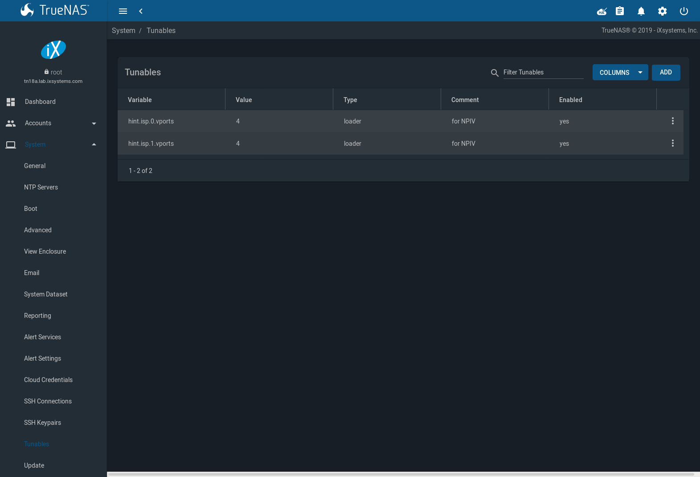

   Adding Virtual Ports
#endif truenas

.. _Connecting to iSCSI:

Connecting to iSCSI
~~~~~~~~~~~~~~~~~~~

To access the iSCSI target, clients must use iSCSI initiator software.

An iSCSI Initiator client is pre-installed with Windows 7. A detailed
how-to for this client can be found
`here
<http://techgenix.com/Connecting-Windows-7-iSCSI-SAN/>`__.
A client for Windows 2000, XP, and 2003 can be found `here
<http://www.microsoft.com/en-us/download/details.aspx?id=18986>`__.
This
`how-to
<https://www.pluralsight.com/blog/software-development/freenas-8-iscsi-target-windows-7>`__
shows how to create an iSCSI target for a Windows 7 system.

macOS does not include an initiator.
`globalSAN
<http://www.studionetworksolutions.com/globalsan-iscsi-initiator/>`__
is a commercial, easy-to-use Mac initiator.

BSD systems provide command line initiators:
`iscontrol(8) <https://www.freebsd.org/cgi/man.cgi?query=iscontrol>`__
comes with FreeBSD versions 9.x and lower,
`iscsictl(8) <https://www.freebsd.org/cgi/man.cgi?query=iscsictl>`__
comes with FreeBSD versions 10.0 and higher,
`iscsi-initiator(8)
<http://netbsd.gw.com/cgi-bin/man-cgi?iscsi-initiator++NetBSD-current>`__
comes with NetBSD, and
`iscsid(8)
<http://man.openbsd.org/cgi-bin/man.cgi/OpenBSD-current/man8/iscsid.8?query=iscsid>`__
comes with OpenBSD.

Some Linux distros provide the command line utility
:command:`iscsiadm` from `Open-iSCSI <http://www.open-iscsi.com/>`__.
Use a web search to see if a package exists for the distribution
should the command not exist on the Linux system.

If a LUN is added while :command:`iscsiadm` is already connected, it
will not see the new LUN until rescanned with
:command:`iscsiadm -m node -R`. Alternately, use
:command:`iscsiadm -m discovery -t st -p portal_IP`
to find the new LUN and :command:`iscsiadm -m node -T LUN_Name -l`
to log into the LUN.

Instructions for connecting from a VMware ESXi Server can be found at
`How to configure FreeNAS 8 for iSCSI and connect to ESX(i)
<https://www.vladan.fr/how-to-configure-freenas-8-for-iscsi-and-connect-to-esxi/>`__.
Note that the requirements for booting vSphere 4.x off iSCSI differ
between ESX and ESXi. ESX requires a hardware iSCSI adapter while ESXi
requires specific iSCSI boot firmware support. The magic is on the
booting host side, meaning that there is no difference to the %brand%
configuration. See the
`iSCSI SAN Configuration Guide
<https://www.vmware.com/pdf/vsphere4/r41/vsp_41_iscsi_san_cfg.pdf>`__
for details.

The VMware firewall only allows iSCSI connections on port *3260* by
default. If a different port has been selected, outgoing connections
to that port must be manually added to the firewall before those
connections will work.

If the target can be seen but does not connect, check the
:guilabel:`Discovery Auth` settings in
:guilabel:`Target Global Configuration`.

If the LUN is not discovered by ESXi, make sure that promiscuous mode
is set to :guilabel:`Accept` in the vSwitch.

.. _Growing LUNs:

Growing LUNs
~~~~~~~~~~~~

The method used to grow the size of an existing iSCSI LUN depends on
whether the LUN is backed by a file extent or a zvol. Both methods are
described in this section.

Enlarging a LUN with one of the methods below gives it more
unallocated space, but does not automatically resize filesystems or
other data on the LUN. This is the same as binary-copying a smaller
disk onto a larger one. More space is available on the new disk, but
the partitions and filesystems on it must be expanded to use this new
space. Resizing virtual disk images is usually done from virtual
machine management software. Application software to resize
filesystems is dependent on the type of filesystem and client, but is
often run from within the virtual machine. For instance, consider a
Windows VM with the last partition on the disk holding an NTFS
filesystem. The LUN is expanded and the partition table edited to add
the new space to the last partition. The Windows disk manager must
still be used to resize the NTFS filesystem on that last partition to
use the new space.

.. _Zvol Based LUN:

Zvol Based LUN
^^^^^^^^^^^^^^

To grow a zvol-based LUN, go to
:menuselection:`Storage --> Pools`,
click |ui-options| on the zvol to be grown, then click
:guilabel:`Edit zvol`. In the example shown in
:numref:`Figure %s <iscsi_zvol_lun_fig>`,
the current size of the zvol named *zvol1* is 4 GiB.

.. _iscsi_zvol_lun_fig:

#ifdef freenas
.. figure:: images/storage-pools-zvol-edit.png

   Editing an Existing Zvol
#endif freenas
#ifdef truenas
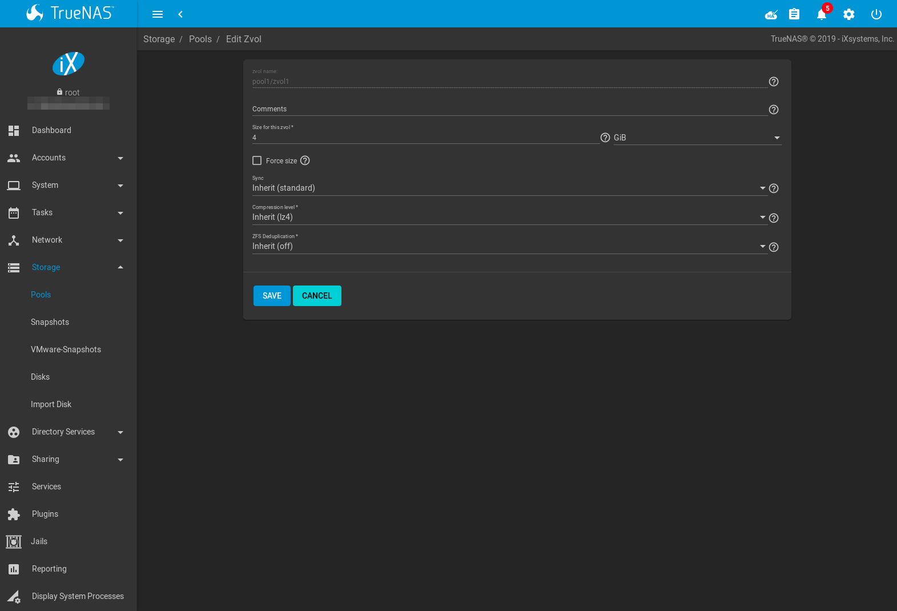

   Editing an Existing Zvol
#endif truenas

Enter the new size for the zvol in the :guilabel:`Size for this zvol`
field and click :guilabel:`SAVE`. The new size
for the zvol is immediately shown in the :guilabel:`Used` column of
the :menuselection:`Storage --> Pools` table.

.. note:: The |web-ui| does not allow reducing the size of the
   zvol, as doing so could result in loss of data. It also does not
   allow increasing the size of the zvol past 80% of the pool size.

.. _File Extent Based LUN:

File Extent Based LUN
^^^^^^^^^^^^^^^^^^^^^

To grow a file extent-based LUN:

Go to
:menuselection:`Services --> iSCSI --> CONFIGURE --> Extents`.
Click |ui-options|, then :guilabel:`Edit`. Ensure the
:guilabel:`Extent Type` is set to file and enter the
:guilabel:`Path to the extent`.
Open the :ref:`Shell` to grow the file extent. This example
grows :file:`/mnt/pool1/data` by 2 GiB:

.. code-block:: none

   truncate -s +2g /mnt/pool1/data

Return to
:menuselection:`Services --> iSCSI --> CONFIGURE --> Extents`, click
|ui-options| on the desired file extent, then click :guilabel:`Edit`.
Set the size to *0* as this causes the iSCSI target to use the new
size of the file.
