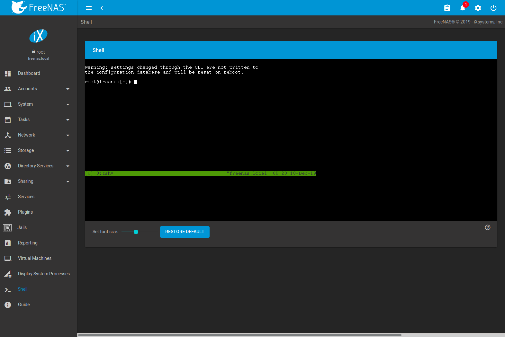

.. index:: Shell
.. _Shell:

Shell
=====

Beginning with version 8.2.0, the %brand% GUI provides a web shell,
making it convenient to run command line tools from the web browser as
the *root* user. The link to Shell is the second entry from the bottom
of the menu tree. In
:numref:`Figure %s <web_shell_fig>`,
the link has been clicked and Shell is open.

.. _web_shell_fig:

   Web Shell

The prompt indicates that the current user is *root*, the hostname is
*freenas*, and the current working directory is :file:`~`
(*root*'s home directory).

.. note:: The default shell for a new install of %brand% is
   :command:`zsh`. %brand% systems that are upgraded from an earlier
   version will continue to use :command:`csh` as the default shell.
   The default shell can be changed by clicking
   :menuselection:`Account --> Users`, clicking |ui-options| of the
   desired user, then selecting
   :menuselection:`--> Edit`.
   Choose the desired shell from the :guilabel:`Shell` drop-down.

The :guilabel:`Set font size` slider adjusts the size of text
displayed in the Shell.

.. If using Firefox, highlight the text and use the Open menu in the top
   right of the browser to copy the text from the Shell. Use the edit
   option in the Open menu again to paste text into the Shell.

   Commented the above out because it was found to be inconsistent with
   different versions (we think) of firefox and/or OS.

Shell provides a history of commands used. Use the arrow keys to see
previously entered commands and press :kbd:`Enter` to repeat the
command.The keys :kbd:`Home`, :kbd:`End`, and :kbd:`Delete` are also
supported in the shell. The shell also provides tab completion. Type a
few letters and press tab to complete a command name or filename in the
current directory. Type :command:`exit` to leave the session.

GUI menus cannot be accessed while using Shell.
To access a prompt while using the GUI
menus, use :ref:`tmux` as it supports multiple shell sessions
and the detachment and reattachment of sessions.

.. note:: Not all Shell features render correctly in Chrome.
   Firefox is the recommended browser for using Shell.

Most FreeBSD command line utilities are available in Shell. Additional
troubleshooting utilities that are provided by %brand% are described
in :ref:`Command Line Utilities`.
