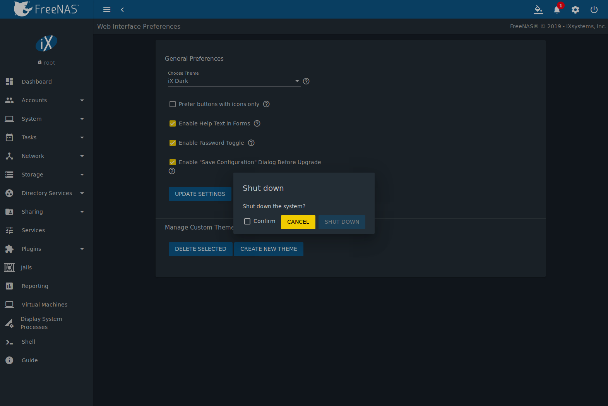

.. index:: Shutdown
.. _Shutdown:

Shutdown
========

Clicking |ui-settings| and :guilabel:`Shutdown`
opens the warning message shown in
:numref:`Figure %s <shutdown_warning_fig>`.

.. _shutdown_warning_fig:

   Shutdown Warning Message

:guilabel:`Confirm` the command and click :guilabel:`Ok` to shutdown
the system. Shutting down the system disconnects all clients, including
the web administration GUI. Physical access to the %brand% system is
required to turn it back on.
