.. _Storage:

Storage
=======

The Storage section of the |web-ui| allows configuration of
these options:

* :ref:`Pools`: create and manage storage pools.

* :ref:`Snapshots`: manage local snapshots.

* :ref:`VMware-Snapshots`: coordinate OpenZFS snapshots with a VMware
  datastore.

* :ref:`Disks`: view and manage disk options.

* :ref:`Importing a Disk`: import a **single** disk that is
  formatted with the UFS, NTFS, MSDOS, or EXT2 filesystem.

* :ref:`Swap Space`: Change the swap space size.

#ifdef truenas
.. note:: When using an HA (High Availability) %brand% system,
   connecting to the |web-ui| on the passive node only
   shows a screen indicating that it is the passive node. All of the
   options discussed in this chapter can only be configured on the
   active node.
#endif truenas

.. index:: Swap Memory
.. _Swap Memory:

Swap Memory
-----------

Swap is space on a disk set aside to be used
as memory. When the %brand% system runs low on memory,
less-used data can be "swapped" onto the disk, freeing up memory.

For reliability, %brand% creates swap space as mirrors of swap partitions on pairs of individual disks.
For example, if the system has three hard disks, a swap mirror is created
with two of the drives, and the third drive is not used. A system with four
drives creates two swap mirrors.

Swap space is allocated when drives are added to a :ref:`vdev`.
Swap space is 2 GiB by default. The size of space to allocate is set in
:menuselection:`System --> Advanced`
in the *Swap size in Gib* field. Changing the
value does not affect the amount of swap on existing disks,
only disks added after the change. This does not affect log or cache devices,
as they are created without swap. Enter *0* to disable swap completely
which is **strongly discouraged.**

.. index:: Pools
.. _Pools:

Pools
-----

:menuselection:`Storage --> Pools` is used to create and manage ZFS
pools, datasets, and zvols.

Proper storage design is important for any NAS.
**Please read through this entire chapter before configuring storage
disks. Features are described to help make it clear which are
beneficial for particular uses, and caveats or hardware restrictions
which limit usefulness.**

.. _Creating Pools:

Creating Pools
~~~~~~~~~~~~~~

Before creating a pool, determine the level of required redundancy,
how many disks will be added, and if any data exists on those disks.
Creating a pool overwrites disk data, so save any required data to
different media before adding disks to a pool.

Navigate to :menuselection:`Storage --> Pools`
and click |ui-add| to open the screen shown in
:numref:`Figure %s <create_pool_poolman_fig>`.

.. _create_pool_poolman_fig:

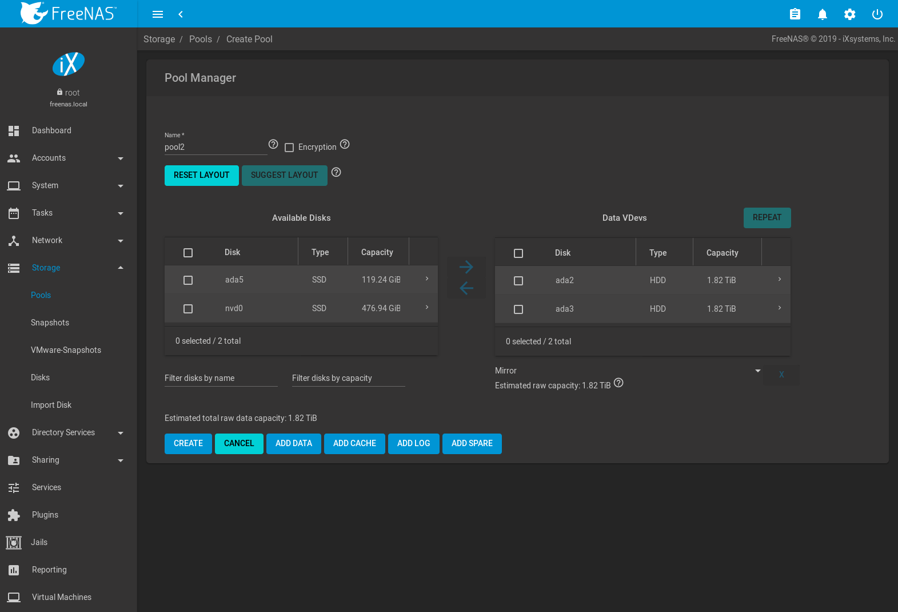

   Creating a Pool

Select :guilabel:`Create new pool` and click :guilabel:`CREATE POOL`
to continue.

Enter a name for the pool in the :guilabel:`Name` field. Ensure
that the chosen name conforms to these
`naming conventions <https://docs.oracle.com/cd/E23824_01/html/821-1448/gbcpt.html>`__.
Choosing a name that will stick out in the logs is recommended,
rather than generic names like "data" or "freenas".

To encrypt data on the underlying disks as a protection against
physical theft, set the :guilabel:`Encryption` option. A pop-up
message shows a reminder to :literal:`Always back up the key!`.
Without the key, the data on the disks is inaccessible. Select
:guilabel:`Confirm` then click :guilabel:`I UNDERSTAND`.

.. warning:: Refer to the warnings in :ref:`Managing Encrypted Pools`
   before enabling encryption!

In the :guilabel:`Available Disks` section, select the disks that will
be added to the pool. Enter a value to
:guilabel:`Filter disks by name` or
:guilabel:`Filter disks by capacity` to change the order of displayed
disks.

.. note:: The usable space of each disk in a pool is limited to the
   size of the smallest disk in the pool. Because of this, creating
   pools with disks of the same size is recommended.

After selecting the desired disks, click the right arrow to add them
to the :guilabel:`Data VDevs` section. Any disks that appear in
:guilabel:`Data VDevs` are used to create the pool. To remove a disk
from that section, select the disk and use the left arrow to return it
to the :guilabel:`Available Disks` section.

To add multiple :guilabel:`Data VDevs`, click :guilabel:`Add Data` for
each required additional vdev.

Alternately, click the :guilabel:`SUGGEST LAYOUT` button which will
add all of the disks and suggest an optimal layout for both redundancy
and capacity.

The pool layout is dependent upon the number of disks added to
:guilabel:`Data VDevs` and the number of available layouts increases as
disks are added. To view the available layouts, ensure that at least one
disk appears in :guilabel:`Data VDevs` and select the drop-down menu
under this section. The |web-ui| will automatically update the
:guilabel:`Estimated total raw data capacity` when a layout is selected.
These layouts are supported:

* **Stripe:** requires at least one disk

* **Mirror:** requires at least two disks

* **RAIDZ1:** requires at least three disks

* **RAIDZ2:** requires at least four disks

* **RAIDZ3:** requires at least five disks

.. warning:: Refer to the :ref:`ZFS Primer` for more information on
   redundancy and disk layouts. When more than five disks are used,
   consideration must be given to the optimal layout for the best
   performance and scalability.It is important to realize that different
   layouts of virtual devices (*vdevs*) affect which operations can be
   performed on that pool later. For example, drives can be added to a
   mirror to increase redundancy, but that is not possible with RAIDZ
   arrays.

After the desired layout is configured, click :guilabel:`CREATE`. A
pop-up warning serves as a reminder that all disk contents will be
erased. Click :guilabel:`Confirm`, then :guilabel:`CREATE POOL` to
create the pool.

.. note:: To instead preserve existing data, click the
   :guilabel:`CANCEL` button and refer to :ref:`Importing a Disk` and
   :ref:`Importing a Pool` to see if the existing format is supported.
   If so, perform that action instead. If the current storage format
   is not supported, it is necessary to back up the data to external
   media, create the pool, then restore the data to the new pool.

Depending on the size and number of disks, the type of controller, and
whether encryption is selected, creating the pool may take some time.
If the :guilabel:`Encryption` option was selected, a popup message
provides a link to :guilabel:`Download Recovery Key`. Click the link
and save the key to a safe location. When finished, click
:guilabel:`DONE`.

The screen refreshes after the pool is created, showing the new pool
in :menuselection:`Storage --> Pools`.

In the example shown in :numref:`Figure %s <zfs_vol_fig>`, the created
pool is named *pool1*. The description indicates that it is healthy.
The :guilabel:`Used` and :guilabel:`Free` entries reflect the total
size of the pool including disk parity.

Click the down arrow to see more details about the pool. This second
entry has the same name and represents the implicit or root dataset. The
:guilabel:`Used` and :guilabel:`Available` entries indicate the amount
of disk space available for storage, after disk parity is subtracted. It also
indicates the type of compression, the
compression ratio, whether it is mounted as read-only,
whether deduplication has been enabled, the mountpoint path,
and any comments entered for the pool.

There is an option to :guilabel:`Upgrade Pool`. This upgrades the
pool to the latest ZFS features, as described in
:ref:`Upgrading a ZFS Pool`. This button does not appear
if the pool is running the latest version of feature flags.

.. _zfs_vol_fig:

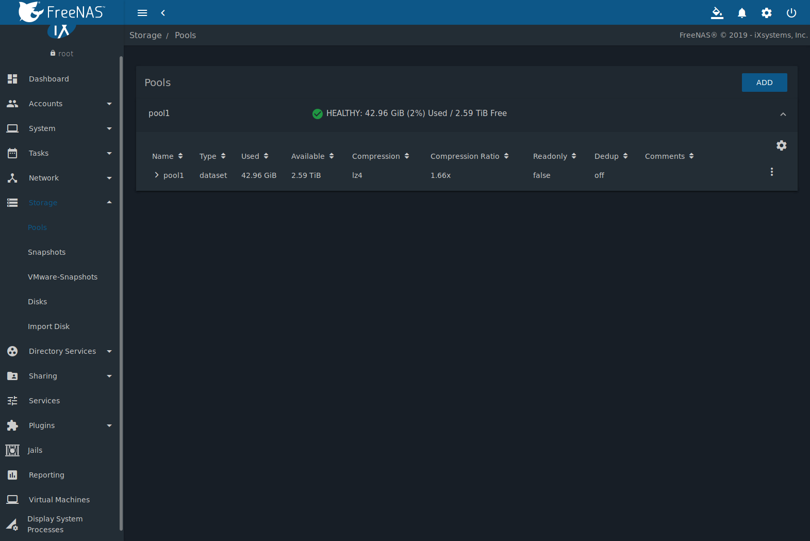

   Viewing Pools

.. index:: Encryption
.. _Managing Encrypted Pools:

Managing Encrypted Pools
~~~~~~~~~~~~~~~~~~~~~~~~

.. note:: The encryption facility used by %brand% is designed to
   protect against physical theft of the disks. It is not designed to
   protect against unauthorized software access. Ensure that only
   authorized users have access to the |web-ui| and that
   proper permissions are set on shares if sensitive data is stored on
   the system.

%brand% supports `GELI
<https://www.freebsd.org/cgi/man.cgi?query=geli>`__ full disk encryption
for ZFS pools. It is important to understand the details before creating
a pool with encryption:

* %brand% encryption is different from the encryption used in
  Oracle's proprietary, non-open source version of ZFS.

* In %brand%, entire disk partitions are encrypted, not individual
  filesystems. A partition table is created on an unencrypted drive.
  Data partitions are then created and encrypted data is stored in
  those partitions. These are generally called "encrypted drives", even
  though the partition table is not encrypted. To use the drive firmware
  to completely encrypt the drive, see :ref:`Self-Encrypting Drives`.

* This type of encryption is primarily useful for users wanting the
  ability to remove disks from the pool without having to first wipe the
  disks of any sensitive data.

* The %brand% encryption design is only suitable for safe disposal of
  disks independent of the encryption key. As long as the key and the
  disks are intact, the system is vulnerable to being decrypted. The
  key should be protected by a strong passphrase and any backups of
  the key should be securely stored.

* If the encryption key is lost, the data on the disks is
  inaccessible. Always back up the key!

* Encryption keys are per ZFS pool and each pool has a separate
  encryption key. Technical details about how encryption keys are
  used, stored, and managed within %brand% are described in this
  `forum post
  <https://forums.freenas.org/index.php?threads/recover-encryption-key.16593/#post-85497>`__.

* Data in memory, including ARC, is not encrypted. ZFS data on disk,
  including ZIL and SLOG, are encrypted if the underlying disks are
  encrypted. Swap data on disk is always encrypted.

* All drives in an encrypted pool are encrypted, including L2ARC
  (read cache) and SLOG (write cache). Drives added to an existing
  encrypted pool are encrypted with the same method specified when
  the pool was created.

* At present, there is no automated method to encrypt an existing,
  unencrypted pool. Instead, the data must be backed up, the
  existing pool destroyed, a new encrypted pool created, and the
  backup restored to the new pool.

* Hybrid pools are not supported. Added vdevs must match the existing
  encryption scheme. :ref:`Extending a Pool` automatically encrypts a
  new vdev being added to an existing encrypted pool.

Encryption performance depends upon the number of disks encrypted. The
more drives in an encrypted pool, the more encryption and decryption
overhead, and the greater the impact on performance.
**Encrypted pools composed of more than eight drives can suffer severe
performance penalties**.
If encryption is desired, please benchmark such pools before using
them in production.
#ifdef freenas

.. note:: Processors with support for the
   `AES-NI <https://en.wikipedia.org/wiki/AES_instruction_set>`__
   instruction set are strongly recommended. These processors can
   handle encryption of a small number of disks with negligible
   performance impact. They also retain performance better as the
   number of disks increases. Older processors without the AES-NI
   instructions see significant performance impact with even a single
   encrypted disk. This `forum post
   <https://forums.freenas.org/index.php?threads/encryption-performance-benchmarks.12157/>`__
   compares the performance of various processors.

#endif freenas

%brand% generates and stores a randomized *encryption key* whenever
a new encrypted pool is created. This key is required to read and
decrypt any data on the pool.

Encryption keys can also be downloaded as a safety measure, to allow
decryption on a different system in the event of failure, or to allow
the locally stored key to be deleted for extra security. Encryption
keys can be optionally protected with a *passphrase* for additional
security. The combination of encryption key location and whether a
passphrase is used provide several different security scenarios:

* *Key stored locally, no passphrase*: the encrypted pool is decrypted
  and accessible when the system running. Protects "data at rest" only.

* *Key stored locally, with passphrase*: the encrypted pool is not
  accessible until the passphrase is entered by the %brand%
  administrator.

* *Key not stored locally*: the encrypted pool is not accessible
  until the %brand% administrator provides the key. If a passphrase is
  set on the key, it must also be entered before the encrypted pool
  can be accessed (`two factor authentication
  <https://en.wikipedia.org/wiki/Multi-factor_authentication>`__).

Encrypted data cannot be accessed when the disks are removed or the
system has been shut down. On a running system, encrypted data
cannot be accessed when the pool is locked and the key is not available.
If the key is protected with a passphrase, both the key and passphrase
are required for decryption.

Encryption applies to a pool, not individual users. When a pool is
unlocked, data is accessible to all users with permissions to access
it.

.. note:: `GELI <https://www.freebsd.org/cgi/man.cgi?query=geli>`__
   uses *two* randomized encryption keys for each disk. The first has
   been discussed here. The second, the disk "master key", is
   encrypted and stored in the on-disk GELI metadata. Loss of a disk
   master key due to disk corruption is equivalent to any other disk
   failure, and in a redundant pool, other disks will contain
   accessible copies of the uncorrupted data. While it is *possible*
   to separately back up disk master keys, it is usually not necessary
   or useful.

To manage the passphrase and keys on an encrypted pool, select the
pool name in
:menuselection:`Storage --> Pools`,
click the :guilabel:`Encryption Operations` (lock) icon, and select one of
these operations:

**Lock:** Only appears after a passphrase has been created. When a pool
is locked, its data is not accessible until the pool is unlocked by
supplying the passphrase. For this reason, selecting this action will
prompt to confirm. Once the pool is locked, its status will change to
*LOCKED (Locked Used / Locked Free)*, :guilabel:`Pool Operations` are
limited to *Detach* and *Extend*, and the
:guilabel:`Encryption Operations` icon changes to the :guilabel:`Unlock`
button.

Unlock the pool by clicking the :guilabel:`Unlock` icon and entering
the passphrase *or* use the :guilabel:`Browse` button to load the
recovery key. Only the passphrase is used when both a passphrase and a
recovery key are entered. The services listed in
:guilabel:`Restart Services` will restart when the pool is unlocked.
This allows them to see the new pool and share or access data on it.
Individual services can be prevented from restarting by clicking the
:guilabel:`Restart Services` drop-down and unselecting them. However,
a service that is not restarted might not be able to access the unlocked
pool.

**Create Passphrase:** set and confirm a passphrase associated with the
GELI encryption key.

#ifdef comment
# not visible in UI yet
A red warning is a reminder to
:guilabel:`Remember to add a new recovery key` as this action
invalidates the previous recovery key`.
#endif comment

Unlike a password, a passphrase can contain spaces and is typically a
series of words. A good passphrase is easy to remember (like the line
to a song or piece of literature) but hard to guess (people you know
should not be able to guess the passphrase). **Remember this
passphrase. An encrypted pool cannot be reimported without it.** In
other words, if the passphrase is forgotten, the data on the pool can
become inaccessible if it becomes necessary to reimport the pool.
Protect this passphrase, as anyone who knows it could reimport the
encrypted pool, thwarting the reason for encrypting the disks in the
first place.

.. _zfs_encrypt_passphrase_fig:

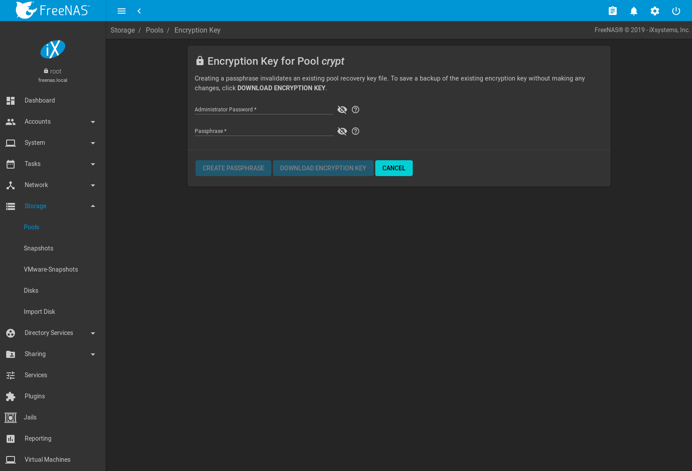

   Add a Passphrase to an Encrypted Pool

After the passphrase is set, the name of this button changes to
:guilabel:`Change Passphrase` and the :guilabel:`Root Password` is also
required to change the passphrase. After setting or changing the
passphrase, it is important to *immediately* create a new recovery key
by clicking the :guilabel:`Add Recovery Key` button. This way, if the
passphrase is forgotten, the associated recovery key can be used
instead.

**Add Recovery Key:** generate a new recovery key. This screen
prompts for the %brand% administrative password and then the directory
in which to save the key. Note that the recovery key is saved to the
client system, not on the %brand% system. This recovery key can be
used if the passphrase is forgotten. **Always immediately add a
recovery key whenever the passphrase is changed.**

**Delete Recovery Key:** Typically this is only performed when the
administrator suspects that the current recovery key may be
compromised. **Immediately** create a new passphrase and recovery key.

.. note:: Protect the passphrase, recovery key, and encryption key.
   Do not reveal the passphrase to others. On the system
   containing the downloaded keys, take care that the system and its
   backups are protected. Anyone who has the keys has the ability to
   re-import the disks if they are discarded or stolen.

.. warning:: If a re-key fails on a multi-disk system, an alert is
   generated. **Do not ignore this alert** as doing so may result in
   the loss of data.

**Encryption Rekey:** generate a new GELI encryption key. Typically
this is only performed when the administrator suspects that the
current key may be compromised. This action also removes the current
passphrase.
#ifdef truenas

.. note:: A re-key is not allowed if :ref:`Failover`
   (High Availability) has been enabled and the standby node is down.
#endif truenas

**Download Encrypt Key:** download a backup copy of the GELI encryption
key. The encryption key is saved to the client system, not on the
%brand% system. The %brand% administrative password must be entered,
then the directory in which to store the key is chosen. Since the GELI
encryption key is separate from the %brand% configuration database,
**it is highly recommended to make a backup of the key. If the key is
ever lost or destroyed and there is no backup key, the data on the
disks is inaccessible.**

.. _Adding Cache or Log Devices:

Adding Cache or Log Devices
~~~~~~~~~~~~~~~~~~~~~~~~~~~

:ref:`Pools` can be used either during or after pool creation to add an
SSD as a cache or log device to improve performance of the pool under
specific use cases. Before adding a cache or log device, refer to the
:ref:`ZFS Primer` to determine if the system will benefit or suffer from
the addition of the device.

To add a Cache or Log device during pool creation, click the
:guilabel:`Add Cache` or :guilabel:`Add Log` button. Select the disk
from :guilabel:`Available Disks` and use the :guilabel:`right arrow`
next to :guilabel:`Cache VDev` or :guilabel:`Log VDev` to add it to that
section.

To add a device to an existing pool in
:menuselection:`Storage --> Pools`, click the pool name,
|ui-settings|, then :guilabel:`Extend`. Click
:guilabel:`Confirm` and :guilabel:`CONTINUE` to bypass the warning
message. This will reopen the pool creation screen described in the
previous paragraph, but with the pool name displayed as read-only.

.. index:: Remove cache or log device
.. _Removing Cache or Log Devices:

Removing Cache or Log Devices
~~~~~~~~~~~~~~~~~~~~~~~~~~~~~

Cache or log devices can be removed by going to
:menuselection:`Storage --> Pools`.
Choose the desired pool and click
|ui-settings| :menuselection:`--> Status`.
Choose the log or cache device to remove, then click
|ui-options| :menuselection:`--> Remove`.

.. index:: Hot Spares, Spares
.. _Adding Spare Devices:

Adding Spare Devices
~~~~~~~~~~~~~~~~~~~~

ZFS provides the ability to have "hot" *spares*. These are drives that
are connected to a pool, but not in use. If the pool experiences
the failure of a data drive, the system uses the hot spare as a
temporary replacement. If the failed drive is replaced with a new
drive, the hot spare drive is no longer needed and reverts to being a
hot spare. If the failed drive is instead removed from the pool, the
spare is promoted to a full member of the pool.

Hot spares can be added to a pool during or after creation. On
%brand%, hot spare actions are implemented by
`zfsd(8) <https://www.freebsd.org/cgi/man.cgi?query=zfsd>`__.

To add a spare during pool creation, click the :guilabel:`Add Spare`.
button. Select the disk from :guilabel:`Available Disks` and use the
:guilabel:`right arrow` next to :guilabel:`Spare VDev` to add it to
the section.

To add a device to an existing pool, click the pool name,
|ui-settings| icon, then
:guilabel:`Extend`. Click :guilabel:`Confirm` and
:guilabel:`CONTINUE` to bypass the warning message. This will reopen the
pool creation screen described in the previous paragraph, but with the
pool name displayed as read-only.

.. danger:: When adding a spare disk to an encrypted pool the
   passphrase and recovery key are reset. Click
   :guilabel:`Download Recovery Key` after adding the spare device. Then,
   create a new passphrase by clicking
   |pool-lock| :menuselection:`--> Create Passphrase`.
   Since creating a new passphrase invalidates the recovery key, click
   |pool-lock| :menuselection:`--> Add Recovery Key`
   to add a new one.

.. _Extending a Pool:

Extending a Pool
~~~~~~~~~~~~~~~~

To increase the capacity of an existing pool, click the pool name,
|ui-settings|, then
:guilabel:`Extend`. A popup warning displays a reminder to stripe vdevs
of the same size and type. Click :guilabel:`Confirm` and
:guilabel:`CONTINUE` to continue.

.. note:: If the existing pool is encrypted, an additional warning
   message shows a reminder that **extending a pool resets the
   passphrase and recovery key**. After extending the pool, another
   popup message will provide a link to
   :guilabel:`Download Recovery Key`. Click the link and save the key to
   a safe location. When finished, click :guilabel:`DONE`.

When adding disks to increase the capacity of a pool, ZFS supports
the addition of virtual devices, or *vdevs*, to an existing ZFS
pool. A vdev can be a single disk, a stripe, a mirror, a RAIDZ1,
RAIDZ2, or a RAIDZ3.
**After a vdev is created, more drives cannot be added to that vdev**.
However, a new vdev can be striped with another
of the **same type of existing vdev** to increase the overall size of
the pool. Extending a pool often involves striping similar vdevs.
Here are some examples:

* to extend a ZFS stripe, add one or more disks. Since there is no
  redundancy, disks do not have to be added in the same quantity as
  the existing stripe.

* to extend a ZFS mirror, add the same number of drives. The resulting
  striped mirror is a RAID 10. For example, if ten new drives are
  available, a mirror of two drives could be created initially, then
  extended by creating another mirror of two drives, and repeating
  three more times until all ten drives have been added.

* to extend a three drive RAIDZ1, add three additional drives. The
  result is a RAIDZ+0, similar to RAID 50 on a hardware controller.

* to extend a RAIDZ2 requires a minimum of four additional drives. The
  result is a RAIDZ2+0, similar to RAID 60 on a hardware controller.

.. warning:: Make sure to select the same number of disks and disk
   layout when extending the pool!

.. _Detaching a Pool:

Detaching a Pool
~~~~~~~~~~~~~~~~

To export or destroy an existing pool, click the pool name,
|ui-settings|, then
:guilabel:`Detach`. The choice to retain or delete the contents of the
pool depends upon the selections made in the screen shown in
:numref:`Figure %s <zfs_detach_vol_fig>`.

  .. _zfs_detach_vol_fig:

  .. figure:: images/storage-pools-actions-detach.png

     Detach or Delete a Pool

#ifdef truenas
.. note:: When the system has :ref:`High Availability (HA) <Failover>`
   active, pools cannot be exported or destroyed.

#endif truenas
.. warning:: Do not detach an encrypted pool if the passphrase has not
   been set! **An encrypted pool cannot be reimported without a
   passphrase!** When in doubt, use the instructions in
   :ref:`Managing Encrypted Pools` to set a passphrase.

The :guilabel:`Detach Pool` screen provides the options
:guilabel:`Destroy data on this pool?`, :guilabel:`Confirm detach`, and
:guilabel:`Delete configuration of shares that used this pool?`. An
encrypted pool also displays a button to :guilabel:`DOWNLOAD KEY` for
that pool.

.. tabularcolumns:: |>{\RaggedRight}p{\dimexpr 0.5\linewidth-2\tabcolsep}
                    |>{\RaggedRight}p{\dimexpr 0.5\linewidth-2\tabcolsep}|

.. _detach_pool_options:

.. table:: Detach Pool Options
   :class: longtable

   +-----------------------------------+-------------------------------------+
   | Setting                           | Description                         |
   |                                   |                                     |
   +===================================+=====================================+
   | Destroy data on this pool?        | Leave unset to keep existing        |
   |                                   | data stored on the pool.            |
   |                                   |                                     |
   +-----------------------------------+-------------------------------------+
   | Delete configuration of shares    | Leave unset to save the settings    |
   | that used this pool?              | of the shares on the pool.          |
   |                                   |                                     |
   +-----------------------------------+-------------------------------------+
   | Confirm Detach                    | Confirm the detach process.         |
   |                                   |                                     |
   +-----------------------------------+-------------------------------------+

To detach the pool while retaining the data and share configurations,
set the :guilabel:`Confirm detach` option and click
:guilabel:`DETACH`. This operation allows the pool to be
re-imported at a later time. For example, when moving a pool from one
system to another, perform this detach action first to flush any
unwritten data to disk, write data to the disk indicating that the
export was done, and remove all knowledge of the pool from this system.

To instead destroy the data and share configurations on the pool, set
all three options. This instructs the system to destroy the data on the
pool, datasets, zvols, and the configuration of each share. It returns
the individual disk to a raw state.

.. danger:: Before destroying a pool, ensure that any needed data has
   been backed up to a different pool or system.

.. _Importing a Pool:

Importing a Pool
~~~~~~~~~~~~~~~~

This action can be used to reimport a detached pool, import a pool that
was created on another system, or to import a pool after reinstalling an
existing %brand% system.

When physically installing ZFS pool disks from another system, use the
:samp:`zpool export {poolname}` command or a |web-ui| equivalent to export
the pool on that system. Then shut it down and connect the drives to
the %brand% system. This prevents an "in use by another machine" error
during the import to %brand%.

Existing ZFS pools can be imported by clicking
:menuselection:`Storage --> Pools`
and |ui-add|. Select :guilabel:`Import an existing pool`, then click
:guilabel:`NEXT` as shown in
:numref:`Figure %s <zfs_import_vol_fig>`.

.. _zfs_import_vol_fig:

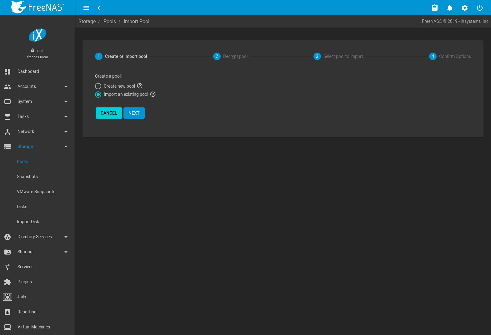

   Pool Import

To import a pool, click :guilabel:`No, continue with import` then
:guilabel:`NEXT` as shown in :numref:`Figure %s <zfs_import_vol_fig2>`.

.. _zfs_import_vol_fig2:

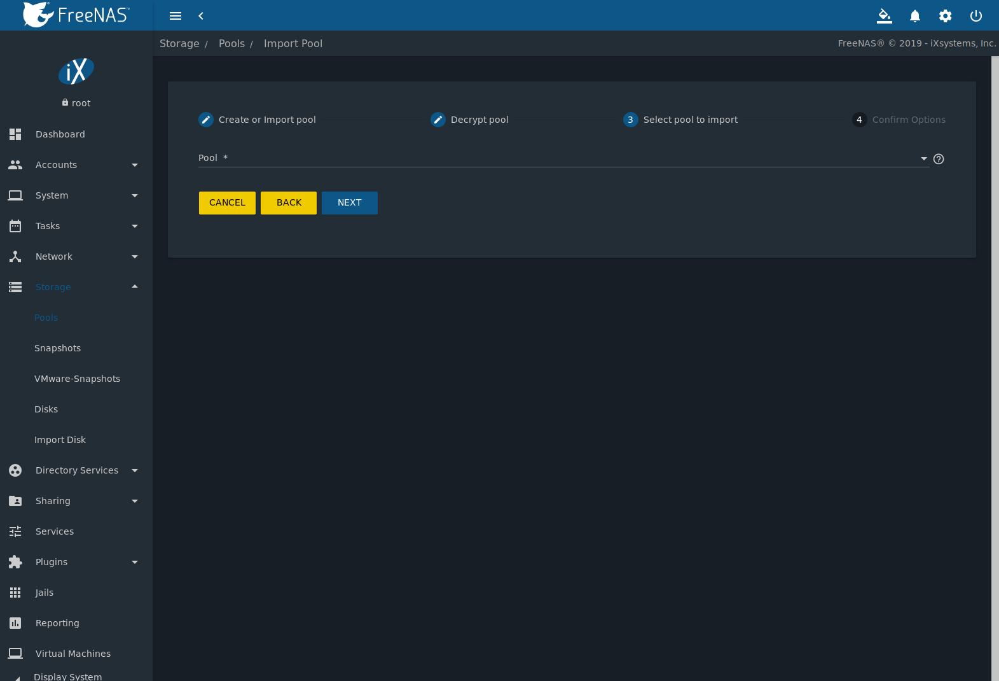

   Importing a Pool

Select the pool from the :guilabel:`Pool *` drop-down menu and click
:guilabel:`NEXT` to confirm the options and :guilabel:`IMPORT` it.

#ifdef freenas
If hardware is not being detected, run
:command:`camcontrol devlist` from :ref:`Shell`. If the disk does not
appear in the output, check to see if the controller driver is
supported or if it needs to be loaded using :ref:`Tunables`.
#endif freenas

Before importing a GELI-encrypted pool, disks must first be decrypted.
Click :guilabel:`Yes, decrypt the disks`. This is
shown in :numref:`Figure %s <zfs_decrypt_import_fig>`.

.. _zfs_decrypt_import_fig:

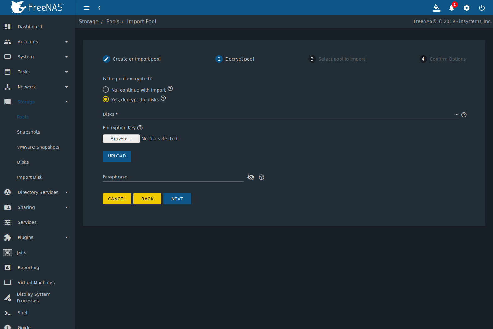

   Decrypting Disks Before Importing a Pool

Use the :guilabel:`Disks` dropdown menu to select the disks to decrypt.
Click :guilabel:`Browse` to select an encryption key to upload.
Enter the :guilabel:`Passphrase` associated with the key, then click
:guilabel:`NEXT` to continue importing the pool.

.. note:: The encryption key is required to decrypt the pool. If the
   pool cannot be decrypted, it cannot be re-imported after a failed
   upgrade or lost configuration. This means that it is
   **very important** to save a copy of the key and to remember the
   passphrase that was configured for the key. Refer to
   :ref:`Managing Encrypted Pools` for instructions on managing keys.

Select the pool to import and confirm the settings. Click
:guilabel:`IMPORT` to finish the process.

.. note:: For security reasons, GELI keys for encrypted pools are
   not saved in a configuration backup file. When %brand% has been
   installed to a new device and a saved configuration file restored
   to it, the GELI keys for encrypted disks will not be present, and
   the system will not request them. To correct this, export the
   encrypted pool with Detach Pool, making sure that the
   :guilabel:`Destroy data on this pool?` is **not** selected. Then
   import the pool again. During the import, the GELI keys can be
   entered as described above.

.. index:: Scrubs
.. _Viewing Pool Scrub Status:

Viewing Pool Scrub Status
~~~~~~~~~~~~~~~~~~~~~~~~~~~~~

Scrubs and how to set their schedule are described in more
detail in :ref:`Scrub Tasks`.

To view the scrub status of a pool, click the pool name, |ui-settings|,
then :guilabel:`Status`.
The resulting screen will display the status of a running scrub or the
statistics from the last completed scrub.

A :guilabel:`CANCEL` button is provided to cancel a scrub in progress.
When a scrub is cancelled, it is abandoned. The next scrub to run starts
from the beginning, not where the cancelled scrub left off.

.. index:: Add Dataset
.. _Adding Datasets:

Adding Datasets
~~~~~~~~~~~~~~~

An existing pool can be divided into datasets. Permissions,
compression, deduplication, and quotas can be set on a per-dataset
basis, allowing more granular control over access to storage data.
Like a folder or directory, permissions can be set on dataset.
Datasets are also similar to filesystems in that properties such as
quotas and compression can be set, and snapshots created.

.. note:: ZFS provides thick provisioning using quotas and thin
   provisioning using reserved space.

To create a dataset, select an existing pool in
:menuselection:`Storage --> Pools`, click |ui-options|, then select
:guilabel:`Add Dataset` This will display the screen shown in
:numref:`Figure %s <zfs_create_dataset>`.

.. _zfs_create_dataset:

#ifdef freenas
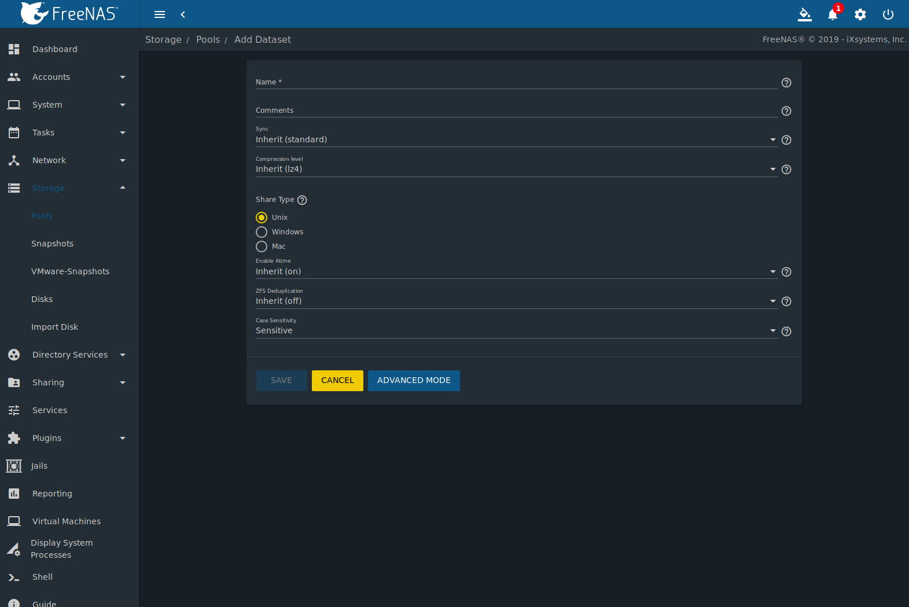

   Creating a ZFS Dataset
#endif freenas
#ifdef truenas
.. _tn_dataset1:

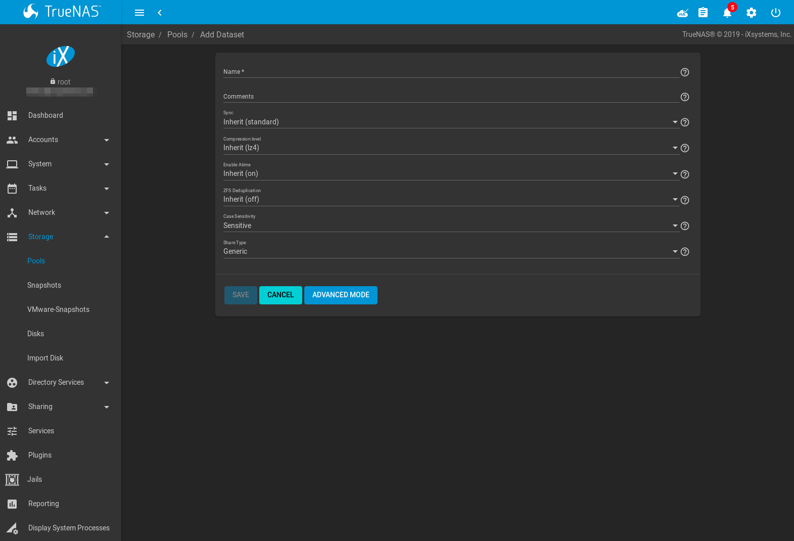

   Adding a ZFS Dataset
#endif truenas

:numref:`Table %s <zfs_dataset_opts_tab>`
shows the options available when creating a dataset.

Some settings are only available in :guilabel:`ADVANCED MODE`. To see
these settings, either click the :guilabel:`ADVANCED MODE` button, or
configure the system to always display advanced settings by enabling the
:guilabel:`Show advanced fields by default` option in
:menuselection:`System --> Advanced`.

.. tabularcolumns:: |>{\RaggedRight}p{\dimexpr 0.20\linewidth-2\tabcolsep}
                    |>{\RaggedRight}p{\dimexpr 0.10\linewidth-2\tabcolsep}
                    |>{\RaggedRight}p{\dimexpr 0.10\linewidth-2\tabcolsep}
                    |>{\RaggedRight}p{\dimexpr 0.59\linewidth-2\tabcolsep}|

.. _zfs_dataset_opts_tab:

.. table:: Dataset Options
   :class: longtable

   +--------------------------+---------------------+---------------+-----------------------------------------------------------------------------------------------------------+
   | Setting                  | Value               | Advanced Mode | Description                                                                                               |
   |                          |                     |               |                                                                                                           |
   +==========================+=====================+===============+===========================================================================================================+
   | Name                     | string              |               | This setting is mandatory. Enter a unique name for the dataset.                                           |
   |                          |                     |               |                                                                                                           |
   +--------------------------+---------------------+---------------+-----------------------------------------------------------------------------------------------------------+
   | Comments                 | string              |               | Enter any additional comments or user notes about this dataset.                                           |
   |                          |                     |               |                                                                                                           |
   +--------------------------+---------------------+---------------+-----------------------------------------------------------------------------------------------------------+
   | Sync                     | drop-down menu      |               | Sets the data write synchronization. *Inherit* inherits the sync settings from the parent dataset,        |
   |                          |                     |               | *Standard* uses the sync settings that have been requested by the client software, *Always* waits for     |
   |                          |                     |               | data writes to complete, and *Disabled* never waits for writes to complete.                               |
   |                          |                     |               |                                                                                                           |
   +--------------------------+---------------------+---------------+-----------------------------------------------------------------------------------------------------------+
   | Compression Level        | drop-down menu      |               | Refer to the section on :ref:`Compression` for a description of the available algorithms.                 |
   |                          |                     |               |                                                                                                           |
   +--------------------------+---------------------+---------------+-----------------------------------------------------------------------------------------------------------+
   | Share type               | drop-down menu      |               | Select the type of share that will be used on the dataset. Choices are *UNIX* for an NFS share,           |
   |                          |                     |               | *Windows* for a SMB share, or *Mac* for an AFP share.                                                     |
   |                          |                     |               |                                                                                                           |
   +--------------------------+---------------------+---------------+-----------------------------------------------------------------------------------------------------------+
   | Enable atime             | Inherit, On, or Off |               | Choose *On* to update the access time for files when they are read. Choose *Off* to prevent               |
   |                          |                     |               | producing log traffic when reading files. This can result in significant performance gains.               |
   |                          |                     |               |                                                                                                           |
   +--------------------------+---------------------+---------------+-----------------------------------------------------------------------------------------------------------+
   | Quota for this dataset   | integer             | ✓             | Default of *0* disables quotas. Specifying a value means to use no more than the specified size and is    |
   |                          |                     |               | suitable for user datasets to prevent users from hogging available space.                                 |
   |                          |                     |               |                                                                                                           |
   +--------------------------+---------------------+---------------+-----------------------------------------------------------------------------------------------------------+
   | Quota for this dataset   | integer             | ✓             | A specified value applies to both this dataset and any child datasets.                                    |
   | and all children         |                     |               |                                                                                                           |
   +--------------------------+---------------------+---------------+-----------------------------------------------------------------------------------------------------------+
   | Reserved space for this  | integer             | ✓             | Default of *0* is unlimited. Specifying a value means to keep at least this much space free and is        |
   | dataset                  |                     |               | suitable for datasets containing logs which could otherwise take up all available free space.             |
   |                          |                     |               |                                                                                                           |
   +--------------------------+---------------------+---------------+-----------------------------------------------------------------------------------------------------------+
   | Reserved space for this  | integer             | ✓             | A specified value applies to both this dataset and any child datasets.                                    |
   | dataset and all children |                     |               |                                                                                                           |
   +--------------------------+---------------------+---------------+-----------------------------------------------------------------------------------------------------------+
   #ifdef freenas
   | ZFS Deduplication        | drop-down menu      |               | Read the section on :ref:`Deduplication` before making a change to this setting.                          |
   |                          |                     |               |                                                                                                           |
   #endif freenas
   #ifdef truenas
   | ZFS Deduplication        | drop-down menu      |               | Do not change this setting unless instructed to do so by your iXsystems support engineer.                 |
   |                          |                     |               |                                                                                                           |
   #endif truenas
   +--------------------------+---------------------+---------------+-----------------------------------------------------------------------------------------------------------+
   | Exec                     | drop-down menu      | ✓             | Choices are *Inherit (on)*, *On*, or *Off*. Setting to                                                    |
   |                          |                     |               | *Off* will prevent the installation of :ref:`Plugins` or :ref:`Jails`.                                    |
   |                          |                     |               |                                                                                                           |
   +--------------------------+---------------------+---------------+-----------------------------------------------------------------------------------------------------------+
   | Read-only                | drop-down menu      | ✓             | Choices are *Inherit (off)*, *On*, or *Off*.                                                              |
   |                          |                     |               |                                                                                                           |
   +--------------------------+---------------------+---------------+-----------------------------------------------------------------------------------------------------------+
   | Snapshot directory       | drop-down menu      | ✓             | Choose if the :file:`.zfs` snapshot directory is Visible or Invisible on this dataset.                    |
   |                          |                     |               |                                                                                                           |
   +--------------------------+---------------------+---------------+-----------------------------------------------------------------------------------------------------------+
   | Copies                   | drop-down menu      | ✓             | Set the number of data copies on this dataset.                                                            |
   |                          |                     |               |                                                                                                           |
   +--------------------------+---------------------+---------------+-----------------------------------------------------------------------------------------------------------+
   | Record Size              | drop-down menu      | ✓             | While ZFS automatically adapts the record size dynamically to adapt to data, if the data has a fixed size |
   |                          |                     |               | (such as database records), matching its size might result in better performance. **Warning:** choosing   |
   |                          |                     |               | a smaller record size than the suggested value can reduce disk performance and space efficiency.          |
   +--------------------------+---------------------+---------------+-----------------------------------------------------------------------------------------------------------+
   | Case Sensitivity         | drop-down menu      |               | Choices are *sensitive* (default, assumes filenames are case sensitive), *insensitive* (assumes filenames |
   |                          |                     |               | are not case sensitive), or *mixed* (understands both types of filenames).                                |
   |                          |                     |               |                                                                                                           |
   +--------------------------+---------------------+---------------+-----------------------------------------------------------------------------------------------------------+

After a dataset is created it appears in
:menuselection:`Storage --> Pools.`
Click |ui-options| on an existing dataset to configure these options:

.. _storage dataset options:

**Add Dataset:** create a nested dataset, or a dataset within a dataset.

**Add Zvol:** add a zvol to the dataset. Refer to :ref:`Adding Zvols`
for more information about zvols.

**Edit Options:** edit the pool properties described in
:numref:`Table %s <zfs_create_dataset>`. Note that the
:guilabel:`Dataset Name`, and :guilabel:`Case Sensitivity` are read-only
as they cannot be edited after dataset creation.

**Edit Permissions:** refer to :ref:`Setting Permissions` for more
information about permissions.

**Delete Dataset:** clicking this option will popup a warning as a
reminder that this irreversible action will also delete all snapshots
for the dataset. Set the :guilabel:`Confirm` option then click
:guilabel:`DELETE DATASET` to destroy the dataset and all of its
contents.

**Promote Dataset:** only appears on clones. When a clone is promoted,
the origin filesystem becomes a clone of the clone making it possible
to destroy the filesystem that the clone was created from. Otherwise,
a clone cannot be deleted while the origin filesystem exists.

**Create Snapshot:** create a one-time snapshot. To schedule the
regular creation of snapshots, instead use
:ref:`Periodic Snapshot Tasks`.

#ifdef freenas
.. index:: Deduplication
.. _Deduplication:

Deduplication
^^^^^^^^^^^^^

Deduplication is the process of ZFS transparently reusing a single
copy of duplicated data to save space. Depending on the amount of
duplicate data, deduplicaton can improve storage capacity, as less
data is written and stored. However, deduplication is RAM intensive. A
general rule of thumb is 5 GiB of RAM per terabyte of deduplicated
storage. **In most cases, compression provides storage gains
comparable to deduplication with less impact on performance.**

In %brand%, deduplication can be enabled during dataset creation. Be
forewarned that **there is no way to undedup the data within a dataset
once deduplication is enabled**, as disabling deduplication has
**NO EFFECT** on existing data. The more data written to a deduplicated
dataset, the more RAM it requires. When the system starts storing the
DDTs (dedup tables) on disk because they no longer fit into RAM,
performance craters. Further, importing an unclean pool can require
between 3-5 GiB of RAM per terabyte of deduped data, and if the system
does not have the needed RAM, it will panic. The only solution is to add
more RAM or recreate the pool. **Think carefully before enabling dedup!**
This `article
<https://constantin.glez.de/2011/07/27/zfs-to-dedupe-or-not-dedupe/>`__
provides a good description of the value versus cost considerations
for deduplication.

**Unless a lot of RAM and a lot of duplicate data is available, do not
change the default deduplication setting of "Off".**
For performance reasons, consider using compression rather than
turning this option on.

If deduplication is changed to *On*, duplicate data blocks are removed
synchronously. The result is that only unique data is stored and common
components are shared among files. If deduplication is changed to
*Verify*, ZFS will do a byte-to-byte comparison when two blocks have the
same signature to make sure that the block contents are identical. Since
hash collisions are extremely rare, *Verify* is usually not worth the
performance hit.

.. note:: After deduplication is enabled, the only way to disable it
   is to use the :samp:`zfs set dedup=off {dataset_name}` command
   from :ref:`Shell`. However, any data that has already been
   deduplicated will not be un-deduplicated. Only newly stored data
   after the property change will not be deduplicated. The only way to
   remove existing deduplicated data is to copy all of the data off of
   the dataset, set the property to off, then copy the data back in
   again. Alternately, create a new dataset with
   :guilabel:`ZFS Deduplication` left at *Off*, copy the data to the
   new dataset, and destroy the original dataset.
#endif freenas

.. tip:: Deduplication is often considered when using a group of very
   similar virtual machine images. However, other features of ZFS can
   provide dedup-like functionality more efficiently. For example,
   create a dataset for a standard VM, then clone a snapshot of that
   dataset for other VMs. Only the difference between each created VM
   and the main dataset are saved, giving the effect of deduplication
   without the overhead.

.. index:: Compression
.. _Compression:

Compression
^^^^^^^^^^^

When selecting a compression type, balancing performance
with the amount of disk space saved by compression is recommended.
Compression is transparent to the client and applications as ZFS
automatically compresses data as it is written to a compressed dataset
or zvol and automatically decompresses that data as it is read. These
compression algorithms are supported:

* **LZ4:** default and recommended compression method as it allows
  compressed datasets to operate at near real-time speed. This algorithm
  only compresses files that will benefit from compression.

* **GZIP:** levels 1, 6, and 9 where *gzip fastest* (level 1)
  gives the least compression and *gzip maximum* (level 9) provides
  the best compression but is discouraged due to its performance
  impact.

* **ZLE:** fast but simple algorithm which eliminates runs of zeroes.

If *OFF* is selected as the :guilabel:`Compression level` when creating
a dataset or zvol, compression will not be used on that dataset/zvol.
This is not recommended as using *LZ4* has a negligible performance
impact and allows for more storage capacity.

.. index:: ZVOL
.. _Adding Zvols:

Adding Zvols
~~~~~~~~~~~~

A zvol is a feature of ZFS that creates a raw block device over ZFS.
The zvol can be used as an :ref:`iSCSI` device extent.

To create a zvol, select an existing ZFS pool or dataset, click
|ui-options|, then :guilabel:`Add Zvol` to open the screen shown in
:numref:`Figure %s <zfs_create_zvol_fig>`.

.. _zfs_create_zvol_fig:

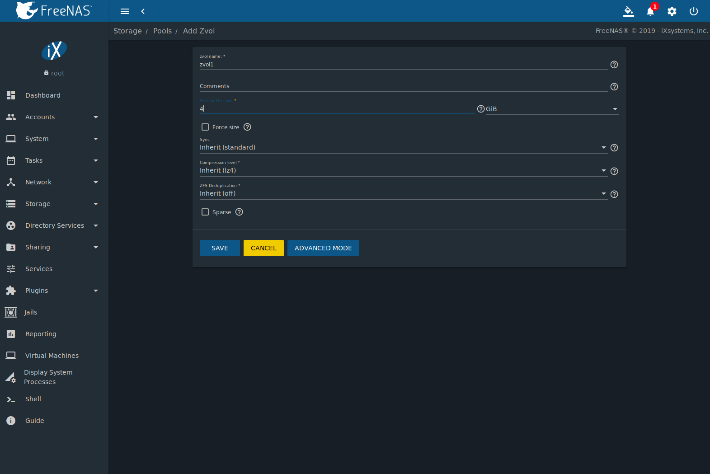

   Adding a Zvol

The configuration options are described in
:numref:`Table %s <zfs_zvol_config_opts_tab>`.

.. tabularcolumns:: |>{\RaggedRight}p{\dimexpr 0.20\linewidth-2\tabcolsep}
                    |>{\RaggedRight}p{\dimexpr 0.10\linewidth-2\tabcolsep}
                    |>{\RaggedRight}p{\dimexpr 0.10\linewidth-2\tabcolsep}
                    |>{\RaggedRight}p{\dimexpr 0.60\linewidth-2\tabcolsep}|

.. _zfs_zvol_config_opts_tab:

.. table:: zvol Configuration Options
   :class: longtable

   +--------------------+----------------+----------+----------------------------------------------------------------------------------------------------------------------+
   | Setting            | Value          | Advanced | Description                                                                                                          |
   |                    |                | Mode     |                                                                                                                      |
   |                    |                |          |                                                                                                                      |
   +====================+================+==========+======================================================================================================================+
   | zvol name          | string         |          | Enter a short name for the zvol. Using a zvol name longer than 63-characters                                         |
   |                    |                |          | can prevent accessing zvols as devices. For example, a zvol with a 70-character                                      |
   |                    |                |          | filename or path cannot be used as an iSCSI extent. This setting is mandatory.                                       |
   +--------------------+----------------+----------+----------------------------------------------------------------------------------------------------------------------+
   | Comments           | string         |          | Enter any notes about this zvol.                                                                                     |
   |                    |                |          |                                                                                                                      |
   +--------------------+----------------+----------+----------------------------------------------------------------------------------------------------------------------+
   | Size for this zvol | integer        |          | Specify size and value such as *10 Gib*. If the size is more than 80% of the available capacity, the creation will   |
   |                    |                |          | fail with an "out of space" error unless :guilabel:`Force size` is also enabled.                                     |
   |                    |                |          |                                                                                                                      |
   +--------------------+----------------+----------+----------------------------------------------------------------------------------------------------------------------+
   | Force size         | checkbox       |          | By default, the system will not create a zvol if that operation will bring the pool to over 80% capacity.            |
   |                    |                |          | **While NOT recommended**, enabling this option will force the creation of the zvol.                                 |
   |                    |                |          |                                                                                                                      |
   +--------------------+----------------+----------+----------------------------------------------------------------------------------------------------------------------+
   | Sync               | drop-down menu |          | Sets the data write synchronization. *Inherit* inherits the sync settings from the parent dataset,                   |
   |                    |                |          | *Standard* uses the sync settings that have been requested by the client software, *Always* waits for                |
   |                    |                |          | data writes to complete, and *Disabled* never waits for writes to complete.                                          |
   |                    |                |          |                                                                                                                      |
   +--------------------+----------------+----------+----------------------------------------------------------------------------------------------------------------------+
   | Compression level  | drop-down menu |          | Compress data to save space. Refer to :ref:`Compression` for a description of the available algorithms.              |
   |                    |                |          |                                                                                                                      |
   +--------------------+----------------+----------+----------------------------------------------------------------------------------------------------------------------+
   #ifdef freenas
   | ZFS Deduplication  | drop-down menu |          | ZFS feature to transparently reuse a single copy of duplicated data to save space. **Warning:** this option is RAM   |
   |                    |                |          | intensive. Read the section on :ref:`Deduplication` before making a change to this setting.                          |
   |                    |                |          |                                                                                                                      |
   #endif freenas
   #ifdef truenas
   | ZFS Deduplication  | drop-down menu |          | Do not change this setting unless instructed to do so by your iXsystems support engineer.                            |
   |                    |                |          |                                                                                                                      |
   #endif truenas
   +--------------------+----------------+----------+----------------------------------------------------------------------------------------------------------------------+
   | Sparse             | checkbox       |          | Used to provide thin provisioning. Use with caution as writes will fail when the pool is low on space.               |
   |                    |                |          |                                                                                                                      |
   +--------------------+----------------+----------+----------------------------------------------------------------------------------------------------------------------+
   | Block size         | drop-down menu | ✓        | The default is based on the number of disks in the pool. This can be set to match the block size of the filesystem   |
   |                    |                |          | which will be formatted onto the iSCSI target. **Warning:** Choosing a smaller record size than the suggested value  |
   |                    |                |          | can reduce disk performance and space efficiency.                                                                    |
   +--------------------+----------------+----------+----------------------------------------------------------------------------------------------------------------------+

Click |ui-options| next to the desired zvol in
:menuselection:`Storage --> Pools`
to access the :guilabel:`Delete zvol`, :guilabel:`Edit Zvol`,
:guilabel:`Create Snapshot`, and, for an existing zvol snapshot,
:guilabel:`Promote Dataset` options.

Similar to datasets, a zvol name cannot be
changed, and destroying a zvol requires confirmation.

.. _Setting Permissions:

Setting Permissions
~~~~~~~~~~~~~~~~~~~

Setting permissions is an important aspect of managing data access. The
|web-ui| is meant to set the **initial**
permissions for a pool or dataset to make it available as a
share. Once a share is available, the client operating system is
used to fine-tune the permissions of the files and directories that
are created by the client.

:ref:`Sharing` contains configuration examples for several types of
permission scenarios. This section provides an overview of the options
available for configuring the initial set of permissions.

.. note:: For users and groups to be available, they must either be
   first created using the instructions in :ref:`Accounts` or imported
   from a directory service using the instructions in
   :ref:`Directory Services`. If more than 50 users or groups are
   available, the drop-down menus described in this section will
   automatically truncate their display to 50 for performance reasons.
   In this case, start to type in the desired user or group name so
   that the display narrows its search to matching results.

To set the permissions on a pool or dataset, select its entry in
:menuselection:`Storage --> Pools`, click |ui-options|, then
:guilabel:`Edit Permissions`. This displays the screen shown in
:numref:`Figure %s <storage_permissions_fig>`.
:numref:`Table %s <storage_permissions_tab>` lists the options in this
screen.

.. _storage_permissions_fig:

.. figure:: images/storage-pools-edit-permissions.png

   Changing Permissions on a Dataset

.. tabularcolumns:: |>{\RaggedRight}p{\dimexpr 0.25\linewidth-2\tabcolsep}
                    |>{\RaggedRight}p{\dimexpr 0.12\linewidth-2\tabcolsep}
                    |>{\RaggedRight}p{\dimexpr 0.63\linewidth-2\tabcolsep}|

.. _storage_permissions_tab:

.. table:: Permission Options
   :class: longtable

   +-------------------------------+------------------+------------------------------------------------------------------------------------------------------------+
   | Setting                       | Value            | Description                                                                                                |
   |                               |                  |                                                                                                            |
   +===============================+==================+============================================================================================================+
   | Path                          | string           | Displays the path to the dataset or zvol directory.                                                        |
   |                               |                  |                                                                                                            |
   +-------------------------------+------------------+------------------------------------------------------------------------------------------------------------+
   | ACL Type                      | bullet selection | Select the type that matches the type of client accessing. Choices are *Unix*, *Windows* or *Mac*.         |
   |                               |                  | See description below this table.                                                                          |
   |                               |                  |                                                                                                            |
   +-------------------------------+------------------+------------------------------------------------------------------------------------------------------------+
   | Apply User                    | checkbox         | Deselect to prevent new permission change from being applied to :guilabel:`User`, as described in the Note |
   |                               |                  | below this table.                                                                                          |
   +-------------------------------+------------------+------------------------------------------------------------------------------------------------------------+
   | User                          | drop-down menu   | Select the user to control the permissions. Users manually created or imported from a directory service    |
   |                               |                  | will appear in the drop-down menu.                                                                         |
   |                               |                  |                                                                                                            |
   +-------------------------------+------------------+------------------------------------------------------------------------------------------------------------+
   | Apply Group                   | checkbox         | Deselect to prevent new permission change from being applied to :guilabel:`Group`, as described in the     |
   |                               |                  | Note below this table.                                                                                     |
   +-------------------------------+------------------+------------------------------------------------------------------------------------------------------------+
   | Group                         | drop-down menu   | Select the group to own the pool or dataset. Groups manually created or imported from a                    |
   |                               |                  | directory service will appear in the drop-down menu.                                                       |
   |                               |                  |                                                                                                            |
   +-------------------------------+------------------+------------------------------------------------------------------------------------------------------------+
   | Apply Mode                    | checkbox         | Unset to prevent new permission change from being applied to :guilabel:`Mode`, as described in the Note    |
   |                               |                  | below this table.                                                                                          |
   +-------------------------------+------------------+------------------------------------------------------------------------------------------------------------+
   | Mode                          | checkboxes       | Only applies to the *Unix* or *Mac* :guilabel:`ACL Type` so does not appear if *Windows* is selected. Sets |
   |                               |                  | the Unix-style permissions for owner, group, and other.                                                    |
   |                               |                  |                                                                                                            |
   +-------------------------------+------------------+------------------------------------------------------------------------------------------------------------+
   | Apply permissions recursively | checkbox         | If set, permissions will also apply to subdirectories. If data is already present on the pool or           |
   |                               |                  | dataset, changing the permissions on the **client side** is recommended to prevent a                       |
   |                               |                  | performance lag.                                                                                           |
   +-------------------------------+------------------+------------------------------------------------------------------------------------------------------------+

.. note:: The :guilabel:`Apply User`, :guilabel:`Apply Group`, and
   :guilabel:`Apply Mode` options allow fine-tuning of the change
   permissions behavior. By default, all three options are enabled and
   %brand% resets the :guilabel:`User`, :guilabel:`Group`, and
   :guilabel:`Mode` when the :guilabel:`SAVE` button is clicked. These
   options allow choosing which settings to change. For example, to
   change just the :guilabel:`Group` setting, unset the options for
   :guilabel:`Apply User` and :guilabel:`Apply Mode`.

The *Windows* :guilabel:`ACL Type` is used for
:ref:`Windows (SMB) Shares` or when the %brand% system is a member of
an Active Directory domain. This type adds ACLs to traditional Unix
permissions. When the *Windows* :guilabel:`ACL Type` is selected, ACLs
are set to the Windows defaults for new files and directories. A Windows
client can be used to further fine-tune permissions as needed.

.. warning:: Changing a pool or dataset with *Windows* permissions back
   to *Unix* permissions will overwrite and destroy some of the
   extended permissions provided by Windows ACLs.

The *Unix* :guilabel:`ACL Type` is usually used with
:ref:`Unix (NFS) Shares`. Unix permissions are compatible with most
network clients and generally work well with a mix of operating systems
or clients. However, *Unix* permissions do not support Windows ACLs and
should not be used with :ref:`Windows (SMB) Shares`.

The *Mac* :guilabel:`ACL Type` can be used with :ref:`Apple (AFP) Shares`.

.. _View Multipaths:

View Multipaths
~~~~~~~~~~~~~~~

%brand% uses
`gmultipath(8) <https://www.freebsd.org/cgi/man.cgi?query=gmultipath>`__
to provide
`multipath I/O <https://en.wikipedia.org/wiki/Multipath_I/O>`__
support on systems containing hardware that is capable of multipath.
An example would be a dual SAS expander backplane in the chassis or an
external JBOD.

Multipath hardware adds fault tolerance to a NAS as the data is still
available even if one disk I/O path has a failure.

%brand% automatically detects active/active and active/passive
multipath-capable hardware. Any multipath-capable devices that are
detected will be placed in multipath units with the parent devices
hidden. The configuration will be displayed in
:menuselection:`Storage --> Pools --> View Multipaths`.
Note that this option is not be displayed in the
:menuselection:`Storage --> Pools`
tree on systems that do not contain multipath-capable hardware.

.. index:: Snapshots
.. _Snapshots:

Snapshots
-------------

Snapshots are scheduled using
:menuselection:`Tasks --> Periodic Snapshot Tasks`.
To view and manage the listing of created snapshots, use
:menuselection:`Storage --> Snapshots`.
An example is shown in :numref:`Figure %s <zfs_view_avail_snapshots_fig>`.

.. note:: If snapshots do not appear, check that the current time
   configured in :ref:`Periodic Snapshot Tasks` does not conflict with
   the :guilabel:`Begin`, :guilabel:`End`, and :guilabel:`Interval`
   settings. If the snapshot was attempted but failed, an entry is
   added to :file:`/var/log/messages`. This log file can be viewed in
   :ref:`Shell`.

.. _zfs_view_avail_snapshots_fig:

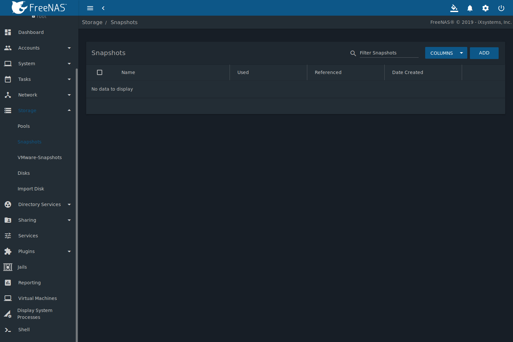

   Viewing Available Snapshots

Each entry in the listing includes the name of the snapshot, based on
the pool/dataset name and time of the snapshot, the amount of used
and referenced data, and the snapshot creation date.

**Used** is the amount of space consumed by this dataset and all of
its descendants. This value is checked against the dataset quota and
reservation. The space used does not include the dataset reservation,
but does take into account the reservations of any descendent datasets.
The amount of space that a dataset consumes from its parent, as well as
the amount of space freed if this dataset is recursively deleted, is
the greater of its space used and its reservation. When a snapshot is
created, the space is initially shared between the snapshot and the
filesystem, and possibly with previous snapshots. As the filesystem
changes, space that was previously shared becomes unique to the snapshot,
and is counted in the used space of the snapshot. Deleting a snapshot
can increase the amount of space unique to, and used by, other snapshots.
The amount of space used, available, or referenced does not take into
account pending changes. While pending changes are generally accounted
for within a few seconds, disk changes do not necessarily guarantee
that the space usage information is updated immediately.

.. tip:: Space used by individual snapshots can be seen by running
   :samp:`zfs list -t snapshot` from :ref:`Shell`.

**Referenced** indicates the amount of data accessible by this dataset,
which may or may not be shared with other datasets in the pool. When a
snapshot or clone is created, it initially references the same amount
of space as the filesystem or snapshot it was created from, since its
contents are identical.

**Date Created** shows the exact time and date of the snapshot creation.

To manage a snapshot, click |ui-options| next to its entry. These
actions are available from that menu:

**Delete** a pop-up message asks for confirmation. Child
clones must be deleted before their parent snapshot can be
deleted. While creating a snapshot is instantaneous, deleting a
snapshot can be I/O intensive and can take a long time, especially
when deduplication is enabled. In order to delete a block in a
snapshot, ZFS has to walk all the allocated blocks to see if that
block is used anywhere else; if it is not, it can be freed.

**Clone** prompts for the name of the clone to create. A default name
is provided that is based upon the name of the original snapshot but
can be edited. Click the :guilabel:`SAVE` button to finish cloning the
snapshot.

A clone is a writable copy of the snapshot. Since a clone is actually a
dataset which can be mounted, it appears in the :guilabel:`Pools` screen
rather than the :guilabel:`Snapshots` screen. By default,
:literal:`-clone` is added to the name of a snapshot when a clone is
created.

**Rollback:** only appears on the most recent snapshot.
Clicking the icon asks for confirmation before rolling back to this
snapshot state. Confirming by clicking :guilabel:`YES` causes any
files that have changed since the snapshot was taken to be reverted
back to their state at the time of the snapshot.

.. note:: Rollback is a potentially dangerous operation and causes
   any configured replication tasks to fail as the replication system
   uses the existing snapshot when doing an incremental backup. To
   restore the data within a snapshot, the recommended steps are:

   #.  Clone the desired snapshot.

   #.  Share the clone with the share type or service running on the
       %brand% system.

   #.  After users have recovered the needed data, delete the clone
       in the :guilabel:`Active Pools` tab.

   This approach does not destroy any on-disk data and has no impact
   on replication.

A range of snapshots can be deleted. Set the left column checkboxes for
each snapshot and click the :guilabel:`Delete` icon above the table. Be
careful when deleting multiple snapshots.

Periodic snapshots can be configured to appear as shadow copies in
newer versions of Windows Explorer, as described in
:ref:`Configuring Shadow Copies`. Users can access the files in the
shadow copy using Explorer without requiring any interaction with the
%brand% |web-ui|.

To quickly search through the snapshots list by name, type a matching
criteria into the :guilabel:`Filter Snapshots` text area. The listing
will change to only display the snapshot names that match the filter
text.

The :guilabel:`Items per page` drop-down menu is used to reduce or
increase the amount of entries per page. Use the left or right arrows
to scroll through a multi-page listing.

.. warning:: A snapshot and any files it contains will not be accessible
   or searchable if the mount path of the snapshot is longer than 88
   characters. The data  within the snapshot will be safe, and the
   snapshot will become accessible again when the mount path is
   shortened. For details of this limitation, and how to shorten a long
   mount path, see :ref:`Path and Name Lengths`.

.. _Browsing a Snapshot Collection:

Browsing a Snapshot Collection
~~~~~~~~~~~~~~~~~~~~~~~~~~~~~~

All snapshots for a dataset are accessible as an ordinary hierarchical
filesystem, which can be reached from a hidden :file:`.zfs` file located
at the root of every dataset. A user with permission to access that file
can view and explore all snapshots for a dataset like any other files -
from the :command:`CLI` or via :menuselection:`File Sharing` services
such as
:menuselection:`Samba`, :menuselection:`NFS` and :menuselection:`FTP`.
This is an advanced capability which requires some command line actions
to achieve. In summary, the main changes to settings that are required
are:

* Snapshot visibility must be manually enabled in the ZFS properties of
  the dataset.

* In Samba auxillary settings, the :command:`veto files` command must be
  modified  to not hide the :file:`.zfs` file, and the setting
  :command:`zfsacl:expose_snapdir=true` must be added.

The effect will be that any user who can access the dataset contents
will be able to view the list of snapshots by navigating to the
:file:`.zfs` directory of the dataset. They will also be able to browse
and search any files they have permission to access throughout the
entire snapshot collection of the dataset.

A user's ability to view files within a snapshot will be limited by any
permissions or ACLs set on the files when the snapshot was taken.
Snapshots are fixed as "read-only", so this access does not permit the
user to change any files in the snapshots, or to modify or delete any
snapshot, even if they had write permission at the time when the
snapshot was taken.

.. note:: ZFS has a :command:`zfs diff` command which can list the files
   that have changed between any two snapshot versions within a dataset,
   or between any snapshot and the current data.

.. index:: VMware Snapshot
.. _VMware-Snapshots:

VMware-Snapshots
----------------

:menuselection:`Storage --> VMware-Snapshots`
is used to coordinate ZFS snapshots when using %brand% as a VMware
datastore. Once this type of snapshot is created, %brand% will
automatically snapshot any running VMware virtual machines before
taking a scheduled or manual ZFS snapshot of the dataset or zvol backing
that VMware datastore. The temporary VMware snapshots are then deleted
on the VMware side but still exist in the ZFS snapshot and can be used
as stable resurrection points in that snapshot. These coordinated
snapshots will be listed in :ref:`Snapshots`.

:numref:`Figure %s <zfs_add_vmware_snapshot_fig>`
shows the menu for adding a VMware snapshot and
:numref:`Table %s <zfs_vmware_snapshot_opts_tab>`
summarizes the available options.

.. _zfs_add_vmware_snapshot_fig:

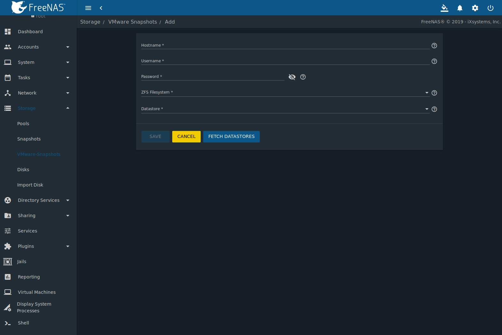

   Adding a VMware Snapshot

.. tabularcolumns:: |>{\RaggedRight}p{\dimexpr 0.16\linewidth-2\tabcolsep}
                    |>{\RaggedRight}p{\dimexpr 0.20\linewidth-2\tabcolsep}
                    |>{\RaggedRight}p{\dimexpr 0.63\linewidth-2\tabcolsep}|

.. _zfs_vmware_snapshot_opts_tab:

.. table:: VMware Snapshot Options
   :class: longtable

   +----------------+-----------------------------+-------------------------------------------------------------------------------------------------------------+
   | Setting        | Value                       | Description                                                                                                 |
   |                |                             |                                                                                                             |
   |                |                             |                                                                                                             |
   +================+=============================+=============================================================================================================+
   | Hostname       | string                      | Enter the IP address or hostname of the VMware host. When clustering, use the IP of the vCenter server for  |
   |                |                             | the cluster.                                                                                                |
   |                |                             |                                                                                                             |
   +----------------+-----------------------------+-------------------------------------------------------------------------------------------------------------+
   | Username       | string                      | Enter the username on the VMware host with permission to snapshot virtual machines.                         |
   |                |                             |                                                                                                             |
   +----------------+-----------------------------+-------------------------------------------------------------------------------------------------------------+
   | Password       | string                      | Enter the password associated with :guilabel:`Username`.                                                    |
   |                |                             |                                                                                                             |
   +----------------+-----------------------------+-------------------------------------------------------------------------------------------------------------+
   | ZFS Filesystem | browse button               | :guilabel:`Browse` to the filesystem to snapshot.                                                           |
   |                |                             |                                                                                                             |
   +----------------+-----------------------------+-------------------------------------------------------------------------------------------------------------+
   | Datastore      | drop-down menu              | After entering the :guilabel:`Hostname`, :guilabel:`Username`, and :guilabel:`Password`, click              |
   |                |                             | :guilabel:`FETCH DATASTORES` to populate the menu, then select the datastore to be synchronized.            |
   |                |                             |                                                                                                             |
   +----------------+-----------------------------+-------------------------------------------------------------------------------------------------------------+

.. index:: Disks
.. _Disks:

Disks
-----

To view all of the disks recognized by the %brand% system, use
:menuselection:`Storage --> Disks`. As seen in the example in
:numref:`Figure %s <viewing_disks_fig>`, each disk entry displays its
device name, pool membership, serial number, size, advanced power
management settings, acoustic level settings, and if :ref:`S.M.A.R.T.`
testing is enabled. This table is adjustable by setting the different
column checkboxes above it. Set :guilabel:`Toggle` to display all
options in the table.

.. _viewing_disks_fig:

#ifdef freenas
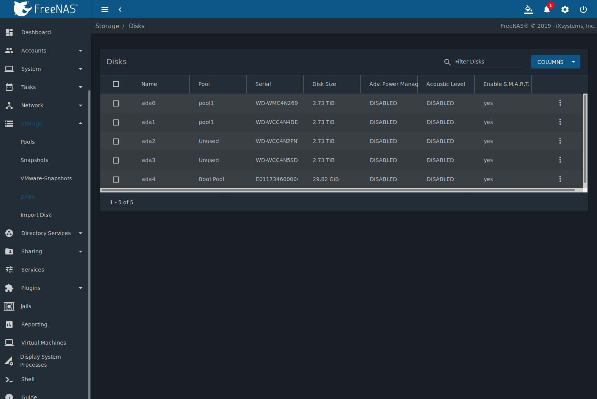

   Viewing Disks
#endif freenas
#ifdef truenas
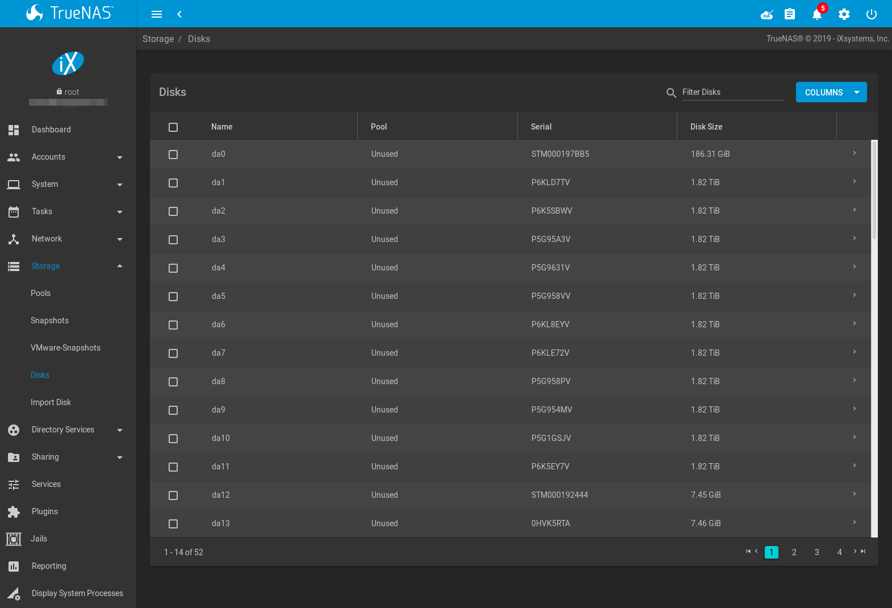

   Viewing Disks
#endif truenas

To edit the options for a disk, click |ui-options| on a disk, then
:guilabel:`Edit` to open the screen shown in
:numref:`Figure %s <zfs_edit_disk_fig>`.
:numref:`Table %s <zfs_disk_opts_tab>`
lists the configurable options.

To bulk edit disks, set the checkbox for each disk in the table then
click |ui-edit-disks|. The :guilabel:`Bulk Edit Disks` page displays
which disks are being edited and a short list of configurable options.
The :ref:`Disk Options table <zfs_disk_opts_tab>` indicates the options
available when editing multiple disks.

To offline, online, or or replace the device, see
:ref:`Replacing a Failed Disk`.

.. _zfs_edit_disk_fig:

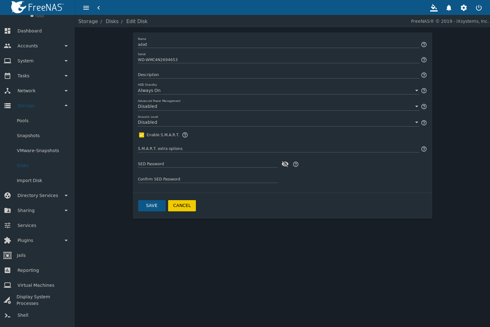

   Editing a Disk

.. tabularcolumns:: |>{\RaggedRight}p{\dimexpr 0.20\linewidth-2\tabcolsep}
                    |>{\RaggedRight}p{\dimexpr 0.10\linewidth-2\tabcolsep}
                    |>{\RaggedRight}p{\dimexpr 0.10\linewidth-2\tabcolsep}
                    |>{\RaggedRight}p{\dimexpr 0.60\linewidth-2\tabcolsep}|

.. _zfs_disk_opts_tab:

.. table:: Disk Options
   :class: longtable

   +------------------------------+-----------+------------+--------------------------------------------------------------------------------------------------------------------------+
   | Setting                      | Value     | Bulk Edit  | Description                                                                                                              |
   |                              |           |            |                                                                                                                          |
   +==============================+===========+============+==========================================================================================================================+
   | Name                         | string    |            | This is the FreeBSD device name for the disk.                                                                            |
   |                              |           |            |                                                                                                                          |
   +------------------------------+-----------+------------+--------------------------------------------------------------------------------------------------------------------------+
   | Serial                       | string    |            | This is the serial number of the disk.                                                                                   |
   |                              |           |            |                                                                                                                          |
   +------------------------------+-----------+------------+--------------------------------------------------------------------------------------------------------------------------+
   | Description                  | string    |            | Enter any notes about this disk.                                                                                         |
   |                              |           |            |                                                                                                                          |
   +------------------------------+-----------+------------+--------------------------------------------------------------------------------------------------------------------------+
   | HDD Standby                  | drop-down | ✓          | Indicates the time of inactivity in minutes before the drive enters standby mode to conserve energy. This                |
   |                              | menu      |            | `forum post <https://forums.freenas.org/index.php?threads/how-to-find-out-if-a-drive-is-spinning-down-properly.2068/>`__ |
   |                              |           |            | demonstrates how to determine if a drive has spun down.                                                                  |
   |                              |           |            |                                                                                                                          |
   +------------------------------+-----------+------------+--------------------------------------------------------------------------------------------------------------------------+
   | Advanced Power Management    | drop-down | ✓          | Select a power management profile from the menu. The default value is *Disabled*.                                        |
   |                              | menu      |            |                                                                                                                          |
   +------------------------------+-----------+------------+--------------------------------------------------------------------------------------------------------------------------+
   | Acoustic Level               | drop-down | ✓          | Default is *Disabled*. Other values can be selected for disks that understand                                            |
   |                              | menu      |            | `AAM <https://en.wikipedia.org/wiki/Automatic_acoustic_management>`__.                                                   |
   |                              |           |            |                                                                                                                          |
   +------------------------------+-----------+------------+--------------------------------------------------------------------------------------------------------------------------+
   | Enable S.M.A.R.T.            | checkbox  | ✓          | Enabled by default if the disk supports S.M.A.R.T. Unsetting this option will disable any configured                     |
   |                              |           |            | :ref:`S.M.A.R.T. Tests` for the disk.                                                                                    |
   |                              |           |            |                                                                                                                          |
   +------------------------------+-----------+------------+--------------------------------------------------------------------------------------------------------------------------+
   | S.M.A.R.T. extra options     | string    | ✓          | Enter additional `smartctl(8) <https://www.smartmontools.org/browser/trunk/smartmontools/smartctl.8.in>`__  options.     |
   |                              |           |            |                                                                                                                          |
   +------------------------------+-----------+------------+--------------------------------------------------------------------------------------------------------------------------+
   | SED Password                 | string    |            | Enter and confirm the password which will be used for this device instead of the global SED password. Refer to           |
   |                              |           |            | :ref:`Self-Encrypting Drives` for more information.                                                                      |
   +------------------------------+-----------+------------+--------------------------------------------------------------------------------------------------------------------------+

.. tip:: If the serial number for a disk is not displayed in this
   screen, use the :command:`smartctl` command from :ref:`Shell`. For
   example, to determine the serial number of disk *ada0*, type
   :command:`smartctl -a /dev/ada0 | grep Serial`.

The :guilabel:`Wipe` function is used to discard an unused disk.

.. warning:: Ensure all data is backed up and
   the disk is no longer in use. Triple-check that the correct disk is
   being selected to be wiped, as recovering data from a wiped disk is
   usually impossible. If there is any doubt, physically remove the
   disk, verify that all data is still present on the %brand% system,
   and wipe the disk in a separate computer.

Clicking :guilabel:`Wipe` offers several choices. *Quick* erases only
the partitioning information on a disk, making it easy to reuse but
without clearing other old data. For more security, *Full with zeros*
overwrites the entire disk with zeros, while *Full with random data*
overwrites the entire disk with random binary data.

Quick wipes take only a few seconds. A *Full with zeros* wipe of a
large disk can take several hours, and a *Full with random data* takes
longer. A progress bar is displayed during the wipe to track status.

.. index:: Replace Failed Drive
.. _Replacing a Failed Disk:

Replacing a Failed Disk
~~~~~~~~~~~~~~~~~~~~~~~

#ifdef freenas
With any form of redundant RAID, failed drives must be replaced as
soon as possible to repair the degraded state of the RAID. Depending
on the hardware capabilities, it might be necessary to reboot to
replace the failed drive. Hardware that supports AHCI does not require
a reboot.
#endif freenas
#ifdef truenas
Replace failed drives as soon as possible to repair the degraded
state of the RAID.
#endif truenas

.. note:: Striping (RAID0) does not provide redundancy. If a disk in
   a stripe fails, the pool will be destroyed and must be recreated
   and the data restored from backup.

.. note:: If the pool is encrypted with GELI, refer to
   :ref:`Replacing an Encrypted Disk` before proceeding.

Before physically removing the failed device, go to
:menuselection:`Storage --> Pools`.
Select the pool name then click |ui-settings|. Select :guilabel:`Status`
and locate the failed disk. Then perform these steps:

#ifdef freenas
#.  Click |ui-options| on the disk entry, then :guilabel:`Offline` to
    change the disk status to OFFLINE. This step removes the device from
    the pool and prevents swap issues. If the hardware supports
    hot-pluggable disks, click the disk :guilabel:`Offline` button and
    pull the disk, then skip to step 3. If there is no
    :guilabel:`Offline` button but only a :guilabel:`Replace` button,
    the disk is already offlined and this step can be skipped.
#endif freenas
#ifdef truenas
#.  Click the disk entry, then the :guilabel:`Offline` button to change
    the disk status to OFFLINE. This step removes the device from the
    pool and prevents swap issues. Click the disk :guilabel:`Offline`
    button and pull the disk. If there is no :guilabel:`Offline` button
    but only a :guilabel:`Replace` button, the disk is already offlined
    and this step can be skipped.
#endif truenas

    .. note:: If the process of changing the disk status to OFFLINE
       fails with a "disk offline failed - no valid replicas" message,
       the pool must be scrubbed first with the :guilabel:`Scrub Pool`
       button in
       :menuselection:`Storage --> Pools`.
       After the scrub completes, try :guilabel:`Offline` again before
       proceeding.

#ifdef freenas
#.  If the hardware is not AHCI capable, shut down the system to
    physically replace the disk. When finished, return to the |web-ui|
    and locate the OFFLINE disk.
#endif freenas

#.  After the disk is replaced and is showing as OFFLINE, click
    |ui-options| on the disk again and then :guilabel:`Replace`.
    Select the replacement disk from the drop-down menu and click the
    :guilabel:`REPLACE DISK` button.  After clicking the
    :guilabel:`REPLACE DISK` button, the pool begins resilvering.

#. After the drive replacement process is complete, re-add the
   replaced disk in the :ref:`S.M.A.R.T. Tests` screen.

In the example shown in
:numref:`Figure %s <zfs_replace_failed_fig>`,
a failed disk is being replaced by disk *ada3* in the pool named
:file:`pool1`.

.. _zfs_replace_failed_fig:

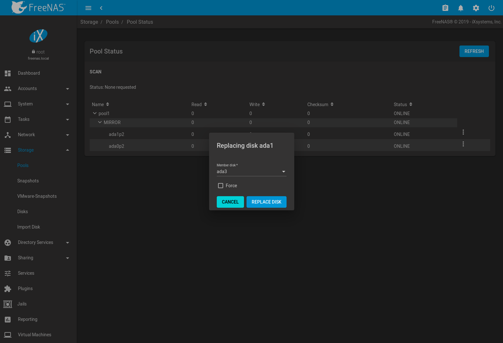

   Replacing a Failed Disk

After the resilver is complete, :guilabel:`Pools` shows a
:guilabel:`Completed` resilver status and indicates any errors.
:numref:`Figure %s <zfs_disk_replacement_fig>`
indicates that the disk replacement was successful in this example.

.. note:: A disk that is failing but has not completely failed can be
   replaced in place, without first removing it. Whether this is a
   good idea depends on the overall condition of the failing disk. A
   disk with a few newly-bad blocks that is otherwise functional can
   be left in place during the replacement to provide data redundancy.
   A drive that is experiencing continuous errors can actually slow
   down the replacement. In extreme cases, a disk with serious
   problems might spend so much time retrying failures that it could
   prevent the replacement resilvering from completing before another
   drive fails.

.. _zfs_disk_replacement_fig:

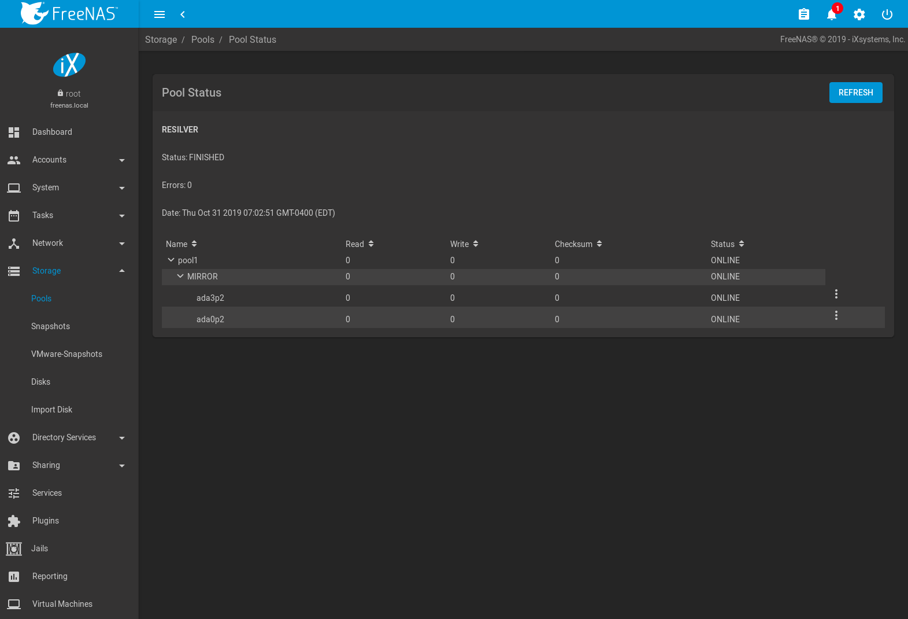

   Disk Replacement is Complete

.. _Replacing an Encrypted Disk:

Replacing an Encrypted Disk
^^^^^^^^^^^^^^^^^^^^^^^^^^^

If the ZFS pool is encrypted, additional steps are needed when
replacing a failed drive.

First, make sure that a passphrase has been set using the instructions
in :ref:`Managing Encrypted Pools` **before** attempting to replace
the failed drive. Then, follow steps 1 and 2 as described above.
During step 3, there will be a prompt to enter and confirm the
passphrase for the pool. Enter this information, then click
:guilabel:`REPLACE DISK`. Immediately restore the encryption keys to the
pool. **If this additional step is not performed before the next
reboot, access to the pool might be permanently lost.**

#.  Highlight the pool that contains the recently replaced disk
    and click :guilabel:`Add Recovery Key` to save the new
    recovery key. The old recovery key will no longer function, so it
    can be safely discarded.

.. _Removing a Log or Cache Device:

Removing a Log or Cache Device
^^^^^^^^^^^^^^^^^^^^^^^^^^^^^^

Added log or cache devices appear in
:menuselection:`Storage --> Pools --> Pool Status`.
Clicking the device enables the :guilabel:`Replace` and
:guilabel:`Remove` buttons.

Log and cache devices can be safely removed or replaced with these
buttons. Both types of devices improve performance, and throughput can
be impacted by their removal.

.. _Replacing Disks to Grow a Pool:

Replacing Disks to Grow a Pool
~~~~~~~~~~~~~~~~~~~~~~~~~~~~~~

The recommended method for expanding the size of a ZFS pool is to
pre-plan the number of disks in a vdev and to stripe additional vdevs
using :ref:`Pools` as additional capacity is needed.

However, this is not an option if there are no open drive ports and a
SAS/SATA HBA card cannot be added. In this case, one disk at a time
can be replaced with a larger disk, waiting for the resilvering
process to incorporate the new disk into the pool, then repeating with
another disk until all of the original disks have been replaced.

The safest way to perform this is to use a spare drive port or an
eSATA port and a hard drive dock. The process follows these steps:

#. Shut down the system.

#. Install one new disk.

#. Start up the system.

#. Go to
   :menuselection:`Storage --> Pools`,
   select the pool to expand. Click |ui-settings| then :guilabel:`Status`
   Select a disk, click |ui-options|, then :guilabel:`Replace`.
   Choose the new disk as the replacement.

#. The status of the resilver process can be viewed by running
   :command:`zpool status`. When the new disk has resilvered, the old
   one will be automatically offlined. The system is then shut down to
   physically remove the replaced disk. One advantage of this approach
   is that there is no loss of redundancy during the resilver.

If a spare drive port is not available, a drive can be replaced with a
larger one using the instructions in :ref:`Replacing a Failed Disk`.
This process is slow and places the system in a degraded state. Since
a failure at this point could be disastrous, **do not attempt this
method unless the system has a reliable backup.** Replace one drive at
a time and wait for the resilver process to complete on the replaced
drive before replacing the next drive. After all the drives are
replaced and the final resilver completes, the added space will appear
in the pool.

.. _Importing a Disk:

Importing a Disk
----------------

The :menuselection:`Pool --> Import Disk` screen, shown in
:numref:`Figure %s <zfs_import_disk_fig>`, is used to import
disks that are formatted with UFS (BSD Unix), FAT(MSDOS) or
NTFS (Windows), or EXT2 (Linux) filesystems. This is a designed to be
used as a one-time import, copying the data from that disk into a
dataset on the %brand% system. Only one disk can be imported at a time.

.. note:: Imports of EXT3 or EXT4 filesystems are possible in some
   cases, although neither is fully supported. EXT3 journaling is not
   supported, so those filesystems must have an external *fsck*
   utility, like the one provided by
   `E2fsprogs utilities <http://e2fsprogs.sourceforge.net/>`__,
   run on them before import. EXT4 filesystems with extended
   attributes or inodes greater than 128 bytes are not supported.
   EXT4 filesystems with EXT3 journaling must have an *fsck* run on
   them before import, as described above.

.. _zfs_import_disk_fig:

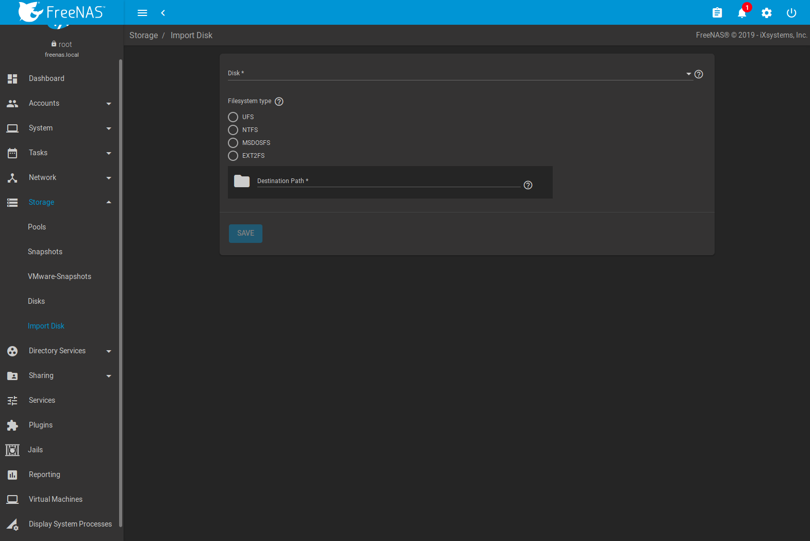

   Importing a Disk

Use the drop-down menu to select the disk to import, select the type
of filesystem on the disk, and browse to the ZFS dataset that will hold
the copied data. If the :guilabel:`MSDOSFS` filesystem is selected, an
additional :guilabel:`MSDOSFS locale` drop-down menu will display. Use
this menu to select the locale if non-ASCII characters are present on
thedisk.

After clicking :guilabel:`SAVE`, the disk is mounted and its contents
are copied to the specified dataset. The disk is unmounted after the
copy operation completes.
