.. _Storage:

Storage
=======

The Storage section of the graphical interface allows configuration of
these options:

* :ref:`Volumes` create and manage storage volumes.

* :ref:`Periodic Snapshot Tasks` schedule automatic creation of
  filesystem snapshots.

* :ref:`Replication Tasks` automate the replication of snapshots to
  a remote system.

* :ref:`Resilver Priority` control the priority of resilvers.

* :ref:`Scrubs` schedule scrubs as part of ongoing disk maintenance.

* :ref:`Snapshots` manage local snapshots.

* :ref:`VMware-Snapshot` coordinate OpenZFS snapshots with a
  VMware datastore.

#ifdef truenas
.. note:: When using an HA (High Availability) %brand% system,
   connecting to the graphical interface on the passive node only
   shows a screen indicating that it is the passive node. All of the
   options discussed in this chapter can only be configured on the
   active node.
#endif truenas

.. index:: Volumes
.. _Volumes:

Volumes
-------

The :guilabel:`Volumes` section of the %brand% graphical interface is
used to format volumes, attach a disk to copy data onto an existing
volume, or import a ZFS volume. It is also used to create ZFS
datasets and zvols and to manage their permissions.

.. note:: In ZFS terminology, groups of storage devices managed by ZFS
   are referred to as a *pool*. The %brand% graphical interface uses
   the term *volume* to refer to a ZFS pool.

Proper storage design is important for any NAS.
**Please read through this entire chapter before configuring storage
disks. Features are described to help make it clear which are
beneficial for particular uses, and caveats or hardware restrictions
which limit usefulness.**

.. _Volume Manager:

Volume Manager
~~~~~~~~~~~~~~

Before creating a volume, determine the level of required redundancy, how
many disks will be added, and if any data exists on those disks. Creating
a volume overwrites disk data, so save any required data to different
media before adding disks to a pool. Refer to the :ref:`ZFS Primer` for
information on ZFS redundancy with multiple disks before using
:guilabel:`Volume Manager`. It is important to realize that different
layouts of virtual devices (*vdevs*) affect which operations can be
performed on that volume later. For example, drives can be added to a
mirror to increase redundancy, but that is not possible with RAIDZ
arrays.

To create a volume, click
:menuselection:`Storage --> Volumes --> Volume Manager`. This opens
a screen like the example shown in
:numref:`Figure %s <create_zfs_pool_volman_fig>`.

.. _create_zfs_pool_volman_fig:

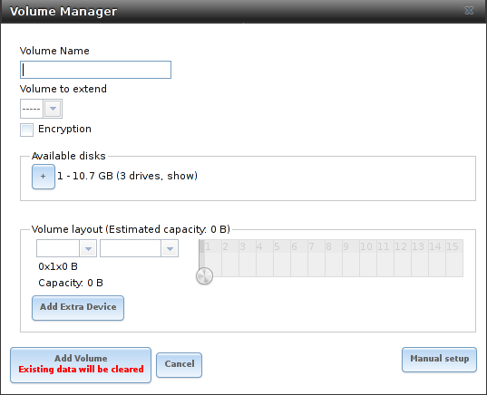

   Creating a ZFS Pool Using Volume Manager

:numref:`Table %s <zfs_vol_opts_tab>`
summarizes the configuration options of this screen.

.. tabularcolumns:: |>{\RaggedRight}p{\dimexpr 0.25\linewidth-2\tabcolsep}
                    |>{\RaggedRight}p{\dimexpr 0.12\linewidth-2\tabcolsep}
                    |>{\RaggedRight}p{\dimexpr 0.63\linewidth-2\tabcolsep}|

.. _zfs_vol_opts_tab:

.. table:: ZFS Volume Creation Options
   :class: longtable

   +------------------+-------------+---------------------------------------------------------------------------------+
   | Setting          | Value       | Description                                                                     |
   |                  |             |                                                                                 |
   +==================+=============+=================================================================================+
   | Volume name      | string      | ZFS volumes must conform to these `naming conventions                           |
   |                  |             | <https://docs.oracle.com/cd/E23824_01/html/821-1448/gbcpt.html>`__              |
   |                  |             | Choose a memorable name that sticks out in the logs and avoid generic names.    |
   |                  |             |                                                                                 |
   +------------------+-------------+---------------------------------------------------------------------------------+
   | Volume to        | drop-down   | Extend an existing ZFS pool.                                                    |
   | extend           | menu        | See :ref:`Extending a ZFS Volume` for more details.                             |
   |                  |             |                                                                                 |
   +------------------+-------------+---------------------------------------------------------------------------------+
   | Encryption       | checkbox    | See the warnings in :ref:`Encryption` before enabling encryption.               |
   |                  |             |                                                                                 |
   +------------------+-------------+---------------------------------------------------------------------------------+
   | Available        | display     | Display the number and size of available disks.                                 |
   | disks            |             | Hover over :guilabel:`show` to list the available device names,                 |
   |                  |             | and click the *+* to add all of the disks to the pool.                          |
   |                  |             |                                                                                 |
   +------------------+-------------+---------------------------------------------------------------------------------+
   | Volume layout    | drag and    | Click and drag the icon to select the desired number of disks for a vdev.       |
   |                  | drop        | When at least one disk is selected, the layouts supported by the                |
   |                  |             | selected number of disks are added to the drop-down menu.                       |
   |                  |             |                                                                                 |
   +------------------+-------------+---------------------------------------------------------------------------------+
   | Add Extra        | button      | Configure multiple vdevs or add log or cache devices during pool creation.      |
   | Device           |             |                                                                                 |
   |                  |             |                                                                                 |
   +------------------+-------------+---------------------------------------------------------------------------------+
   | Manual setup     | button      | Create a pool manually, which is not recommended.                               |
   |                  |             | See :ref:`Manual Setup` for more details.                                       |
   |                  |             |                                                                                 |
   +------------------+-------------+---------------------------------------------------------------------------------+

Click the :guilabel:`Volume name` field and enter a name for the pool.
Ensure that the chosen name conforms to these
`naming conventions <http://docs.oracle.com/cd/E23824_01/html/821-1448/gbcpt.html>`__.

If the underlying disks need to be encrypted as a protection against
physical theft, enable the :guilabel:`Encryption` option.

.. warning:: Refer to the warnings in :ref:`Encryption` before enabling
   encryption! Be aware that this form of encryption will be replaced by
   OpenZFS native encryption in a future version. Pools created with the
   current encryption mechanism will have to be backed up and destroyed
   to be recreated with native encryption when it becomes available.

Drag the slider to select the desired number of disks.
:guilabel:`Volume Manager` displays the resulting storage capacity,
taking reserved swap space into account. To change the layout or the
number of disks, drag the slider to the desired volume layout. The
:guilabel:`Volume layout` drop-down menu can also be clicked if a
different level of redundancy is required.

.. note:: For performance and capacity reasons, this screen does not
   allow creating a volume from disks of differing sizes. While it is
   not recommended, it is possible to create a volume of
   differently-sized disks with the :guilabel:`Manual setup` button.
   Follow the instructions in :ref:`Manual Setup`.

:guilabel:`Volume Manager` only allows choosing a configuration if
enough disks have been selected to create that configuration. These
layouts are supported:

* **Stripe:** requires at least one disk

* **Mirror:** requires at least two disks

* **RAIDZ1:** requires at least three disks

* **RAIDZ2:** requires at least four disks

* **RAIDZ3:** requires at least five disks

* **log device:** requires at least one dedicated device,
  a fast, low-latency, power-protected SSD is recommended

* **cache device:** requires at least one dedicated device,
  SSD is recommended

When more than five disks are used, consideration must be given
to the optimal layout for the best performance and scalability. An
overview of the recommended disk group sizes as well as more
information about log and cache devices can be found in the
:ref:`ZFS Primer`.

The :guilabel:`Add Volume` button warns that
**existing data will be cleared**. In other words, creating a new
volume **reformats the selected disks**. To preserve existing data,
click the :guilabel:`Cancel` button and refer to :ref:`Import Disk`
and :ref:`Import Volume` to see if the existing format is supported.
If so, perform that action instead. If the current storage format is
not supported, it is necessary to back up the data to external media,
format the disks, then restore the data to the new volume.

Depending on the size and number of disks, the type of controller, and
whether encryption is selected, creating the volume may take some
time. After the volume is created, the screen refreshes and the new
volume is listed in the tree under
:menuselection:`Storage --> Volumes`.
Click the *+* next to the volume name to access
:ref:`Change Permissions`, :ref:`Create Dataset`, and
:ref:`Create zvol` options for that volume.

.. index:: Encryption
.. _Encryption:

Encryption
^^^^^^^^^^

.. note:: The encryption facility used by %brand% is designed to
   protect against physical theft of the disks. It is not designed to
   protect against unauthorized software access. Ensure that only
   authorized users have access to the administrative GUI and that
   proper permissions are set on shares if sensitive data is stored on
   the system.

%brand% supports
`GELI <https://www.freebsd.org/cgi/man.cgi?query=geli>`__
full disk encryption for ZFS volumes. It is important to understand
the details when considering whether encryption is right for the
intended use:

* %brand% encryption is different from the encryption used in
  Oracle's proprietary, non-open source version of ZFS.

* In %brand%, entire disks are encrypted, not individual filesystems.
  Encrypted devices are created from the underlying drives, then the
  volume (pool) is created on top of the encrypted devices. Data is
  encrypted as it is written and decrypted as it is read.

* This type of encryption is primarily useful for users storing
  sensitive data but wanting the ability to remove disks from the pool
  without having to first wipe the disk contents.

* The %brand% encryption design is only suitable for safe disposal of
  disks independent of the encryption key. As long as the key and the
  disks are intact, the system is vulnerable to being decrypted.
  Protect the key with a strong passphrase and secure all backups of
  it.

* If the encryption key is lost, the data on the disks is
  inaccessible. Always back up the key!

* Encryption keys are per ZFS volume (pool). Each pool has a separate
  encryption key. Technical details about how encryption keys are
  used, stored, and managed within %brand% are described in this
  `forum post
  <https://forums.freenas.org/index.php?threads/recover-encryption-key.16593/#post-85497>`__.

* Data in memory, including ARC, is not encrypted. ZFS data on disk,
  including ZIL and SLOG, are encrypted if the underlying disks are
  encrypted. Swap data on disk is always encrypted.

  .. warning:: Data stored in Cache (L2ARC) drives is not encrypted.
     Do not use Cache (L2ARC) with encrypted volumes.

* At present, there is no one-step way to encrypt an existing,
  unencrypted volume. Instead, the data must be backed up, the
  existing pool destroyed, a new encrypted volume created, and the
  backup restored to the new volume.

* Hybrid pools are not supported. Added vdevs must match the existing
  encryption scheme. :ref:`Volume Manager` automatically encrypts a new
  vdev being added to an existing encrypted pool.

To create an encrypted volume, enable the :guilabel:`Encryption` option
shown in
:numref:`Figure %s <create_zfs_pool_volman_fig>`.
A pop-up message shows a reminder that
**it is extremely important to make a backup of the key**. Without
the key, the data on the disks is inaccessible. See
:ref:`Managing Encrypted Volumes` for instructions.

.. _Encryption Performance:

Encryption Performance
^^^^^^^^^^^^^^^^^^^^^^

Encryption performance depends upon the number of disks encrypted. The
more drives in an encrypted volume, the more encryption and decryption
overhead, and the greater the impact on performance. **Encrypted
volumes composed of more than eight drives can suffer severe
performance penalties**. If encryption is desired, please benchmark
such volumes before using them in production.

#ifdef freenas
.. note:: Processors with support for the
   `AES-NI <https://en.wikipedia.org/wiki/AES_instruction_set#Supporting_x86_CPUs>`__
   instruction set are strongly recommended. These processors can
   handle encryption of a small number of disks with negligible
   performance impact. They also retain performance better as the
   number of disks increases. Older processors without the AES-NI
   instructions see significant performance impact with even a single
   encrypted disk. This `forum post
   <https://forums.freenas.org/index.php?threads/encryption-performance-benchmarks.12157/>`__
   compares the performance of various processors.
#endif freenas

.. _Manual Setup:

Manual Setup
^^^^^^^^^^^^

The :guilabel:`Manual Setup` button shown in
:numref:`Figure %s <create_zfs_pool_volman_fig>`
can be used to create a ZFS volume manually. While this is **not**
recommended, it can, for example, be used to create a non-optimal
volume containing disks of different sizes.

.. note:: The usable space of each disk in a volume is limited to the
   size of the smallest disk in the volume. Because of this, creating
   volumes with disks of the same size through the
   :guilabel:`Volume Manager` is recommended.

:numref:`Figure %s <zfs_create_nonopt_vol_fig>`
shows the :guilabel:`Manual Setup` screen.
:numref:`Table %s <zfs_manual_opts_tab>`
shows the available options.

.. _zfs_create_nonopt_vol_fig:

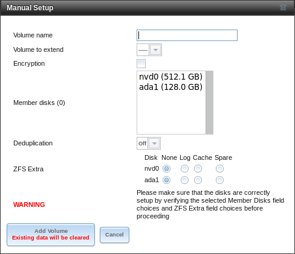

   Manually Creating a ZFS Volume

.. note:: Because of the disadvantages of creating volumes with disks
   of different sizes, the displayed list of disks is sorted by size.

.. tabularcolumns:: |>{\RaggedRight}p{\dimexpr 0.25\linewidth-2\tabcolsep}
                    |>{\RaggedRight}p{\dimexpr 0.12\linewidth-2\tabcolsep}
                    |>{\RaggedRight}p{\dimexpr 0.63\linewidth-2\tabcolsep}|

.. _zfs_manual_opts_tab:

.. table:: Manual Setup Options
   :class: longtable

   +------------------+--------------+--------------------------------------------------------------------------------------------+
   | Setting          | Value        | Description                                                                                |
   |                  |              |                                                                                            |
   +==================+==============+============================================================================================+
   | Volume name      | string       | ZFS volumes must conform to these `naming conventions                                      |
   |                  |              | <https://docs.oracle.com/cd/E53394_01/index.html>`__.                                      |
   |                  |              | Choosing a memorable name is recommended.                                                  |
   |                  |              |                                                                                            |
   +------------------+--------------+--------------------------------------------------------------------------------------------+
   | Encryption       | checkbox     | See the warnings in :ref:`Encryption` before using encryption.                             |
   |                  |              |                                                                                            |
   +------------------+--------------+--------------------------------------------------------------------------------------------+
   | Member disks     | list         | Highlight desired number of disks from list of available disks.                            |
   |                  |              |                                                                                            |
   +------------------+--------------+--------------------------------------------------------------------------------------------+
   #ifdef freenas
   | Deduplication    | drop-down    | Choices are *Off*, *Verify*, and *On*.                                                     |
   |                  | menu         | Carefully consider the section on :ref:`Deduplication` before changing this setting.       |
   |                  |              |                                                                                            |
   #endif freenas
   #ifdef truenas
   | Deduplication    | drop-down    | Do not change this setting unless instructed to do so by an iXsystems support engineer.    |
   |                  | menu         |                                                                                            |
   #endif truenas
   +------------------+--------------+--------------------------------------------------------------------------------------------+
   | ZFS Extra        | bullet       | Specify disk usage: storage (*None*), a log device, a cache device, or a spare.            |
   |                  | selection    |                                                                                            |
   +------------------+--------------+--------------------------------------------------------------------------------------------+

.. _Extending a ZFS Volume:

Extending a ZFS Volume
^^^^^^^^^^^^^^^^^^^^^^

The :guilabel:`Volume to extend` drop-down menu in
:menuselection:`Storage --> Volumes --> Volume Manager`,
shown in
:numref:`Figure %s <create_zfs_pool_volman_fig>`,
is used to add disks to an existing ZFS volume to increase capacity.
This menu is empty if there are no ZFS volumes yet.

If more than one disk is added, the arrangement of the new disks into
stripes, mirrors, or RAIDZ vdevs can be specified. Mirrors and RAIDZ
arrays provide redundancy for data protection if an individual drive
fails.

.. note:: If the existing volume is encrypted, a warning message shows
   a reminder that **extending a volume resets the passphrase and
   recovery key**. After extending the volume, immediately recreate
   both using the instructions in :ref:`Managing Encrypted Volumes`.

After an existing volume has been selected from the drop-down menu,
drag and drop the desired disks and select the desired volume
layout. For example, disks can be added to increase the capacity of
the volume.

When adding disks to increase the capacity of a volume, ZFS supports
the addition of virtual devices, or *vdevs*, to an existing ZFS
pool. A vdev can be a single disk, a stripe, a mirror, a RAIDZ1,
RAIDZ2, or a RAIDZ3. **After a vdev is created, more drives cannot be
added to that vdev**. However, a new vdev can be striped with another
of the **same type of existing vdev** to increase the overall size of
the volume. Extending a volume often involves striping similar vdevs.
Here are some examples:

* to extend a ZFS stripe, add one or more disks. Since there is no
  redundancy, disks do not have to be added in the same quantity as
  the existing stripe.

* to extend a ZFS mirror, add the same number of drives. The resulting
  striped mirror is a RAID 10. For example, if ten new drives are
  available, a mirror of two drives could be created initially, then
  extended by creating another mirror of two drives, and repeating
  three more times until all ten drives have been added.

* to extend a three drive RAIDZ1, add three additional drives. The
  result is a RAIDZ+0, similar to RAID 50 on a hardware controller.

* to extend a RAIDZ2 requires a minimum of four additional drives. The
  result is a RAIDZ2+0, similar to RAID 60 on a hardware controller.

If an attempt is made to add a non-matching number of disks to the
existing vdev, an error message appears, indicating the number of
disks that are required. Select the correct number of disks to
continue.

.. _Adding L2ARC or SLOG Devices:

Adding L2ARC or SLOG Devices
""""""""""""""""""""""""""""

:menuselection:`Storage --> Volumes --> Volume Manager` (see
:numref:`Figure %s <create_zfs_pool_volman_fig>`) is also used to add
L2ARC or SLOG SSDs to improve volume performance for specific use cases.
Refer to the :ref:`ZFS Primer` to determine if the system will benefit or
suffer from the addition of the device.

Once the SSD has been physically installed, click the
:guilabel:`Volume Manager` button and choose the volume from the
:guilabel:`Volume to extend` drop-down menu. Click the
:guilabel:`+` next to the SSD in the :guilabel:`Available disks` list.
In the :guilabel:`Volume layout` drop-down menu, select
*Cache (L2ARC)* to add a cache device, or *Log (ZIL)* to add a
log device. Finally, click :guilabel:`Extend Volume` to add the SSD.

.. _Removing L2ARC or SLOG Devices:

Removing L2ARC or SLOG Devices
""""""""""""""""""""""""""""""

Cache or log devices can be removed by going to
:menuselection:`Storage --> Volumes`.
Choose the desired pool and click :guilabel:`Volume Status`.
Choose the log or cache device to remove, then click :guilabel:`Remove`.

.. _Change Permissions:

Change Permissions
~~~~~~~~~~~~~~~~~~

Setting permissions is an important aspect of managing data access. The
graphical administrative interface is meant to set the **initial**
permissions for a volume or dataset to make it available as a
share. After a share has been created, the client operating system is
used to fine-tune the permissions of the files and directories that
are created by the client.

:ref:`Sharing` contains configuration examples for several types of
permission scenarios. This section provides an overview of the options
available for configuring the initial set of permissions.

.. note:: For users and groups to be available, they must either be
   first created using the instructions in :ref:`Account` or imported
   from a directory service using the instructions in
   :ref:`Directory Services`. If more than 50 users or groups are
   available, the drop-down menus described in this section will
   automatically truncate their display to 50 for performance reasons.
   In this case, start to type in the desired user or group name so
   that the display narrows its search to matching results.

After a volume or dataset is created, it is listed by its mount point
name in
:menuselection:`Storage --> Volumes`.
Clicking the :guilabel:`Change Permissions` icon for a specific
volume or dataset displays the screen shown in
:numref:`Figure %s <zfs_change_permissions_vol_fig>`.
:numref:`Table %s <zfs_opts_permissions_tab>`
summarizes the options in this screen.

.. _zfs_change_permissions_vol_fig:

.. figure:: images/perms1.png

   Changing Permissions on a Volume or Dataset

.. tabularcolumns:: |>{\RaggedRight}p{\dimexpr 0.25\linewidth-2\tabcolsep}
                    |>{\RaggedRight}p{\dimexpr 0.12\linewidth-2\tabcolsep}
                    |>{\RaggedRight}p{\dimexpr 0.63\linewidth-2\tabcolsep}|

.. _zfs_opts_permissions_tab:

.. table:: Options When Changing Permissions
   :class: longtable

   +--------------------+---------------+----------------------------------------------------------------------------------------------------+
   | Setting            | Value         | Description                                                                                        |
   |                    |               |                                                                                                    |
   +====================+===============+====================================================================================================+
   | Apply Owner        | checkbox      | Deselect to prevent new permission change from being applied                                       |
   | (user)             |               | to :guilabel:`Owner (user)`, see Note below.                                                       |
   |                    |               |                                                                                                    |
   +--------------------+---------------+----------------------------------------------------------------------------------------------------+
   | Owner (user)       | drop-down     | Select the user to control the volume or dataset.                                                  |
   |                    | menu          | Users manually created or imported from a directory service will appear in the drop-down menu.     |
   |                    |               |                                                                                                    |
   +--------------------+---------------+----------------------------------------------------------------------------------------------------+
   | Apply Owner        | checkbox      | Deselect to prevent new permission change from being applied to :guilabel:`Owner (group)`,         |
   | (group)            |               | see Note below for more information.                                                               |
   |                    |               |                                                                                                    |
   +--------------------+---------------+----------------------------------------------------------------------------------------------------+
   | Owner (group)      | drop-down     | Select the group to control the volume or dataset.                                                 |
   |                    | menu          | Groups manually created or imported from a directory service will appear in the drop-down menu.    |
   |                    |               |                                                                                                    |
   +--------------------+---------------+----------------------------------------------------------------------------------------------------+
   | Apply Mode         | checkbox      | Deselect to prevent new permission change from being applied to :guilabel:`Mode`,                  |
   |                    |               | see Note below.                                                                                    |
   |                    |               |                                                                                                    |
   +--------------------+---------------+----------------------------------------------------------------------------------------------------+
   | Mode               | checkboxes    | Only applies to the *Unix* or *Mac* "Permission Type".                                             |
   |                    |               | Will be grayed out if *Windows* is selected.                                                       |
   |                    |               |                                                                                                    |
   +--------------------+---------------+----------------------------------------------------------------------------------------------------+
   | Permission Type    | bullet        | Select the type which matches the type of client accessing the volume or dataset.                  |
   |                    | selection     | Choices are *Unix*, *Mac*, or *Windows*.                                                           |
   |                    |               |                                                                                                    |
   +--------------------+---------------+----------------------------------------------------------------------------------------------------+
   | Set permission     | checkbox      | If enabled, permissions will also apply to subdirectories of the volume or dataset.                |
   | recursively        |               | If data already exists on the volume or dataset, change the permissions on the                     |
   |                    |               | **client side** to prevent a performance lag.                                                      |
   |                    |               |                                                                                                    |
   +--------------------+---------------+----------------------------------------------------------------------------------------------------+

.. note:: The :guilabel:`Apply Owner (user)`,
   :guilabel:`Apply Owner (group)`, and :guilabel:`Apply Mode`
   options allow fine-tuning of the change permissions behavior. By
   default, all options are enabled and %brand% resets the owner, group,
   and mode when the :guilabel:`Change` button is clicked. These
   optionss allow choosing which settings to change. For example, to
   change just the :guilabel:`Owner (group)` setting, deselect the
   :guilabel:`Apply Owner (user)` and :guilabel:`Apply Mode` options.

The *Windows* :guilabel:`Permission Type` is used for
:ref:`Windows (SMB) Shares` or when the %brand% system is a member of an
Active Directory domain. This type adds ACLs to traditional *Unix*
permissions. When the *Windows* :guilabel:`Permission Type` is set, ACLs
are set to the Windows defaults for new files and directories. A Windows
client can be used to further fine-tune permissions as needed. After a
volume or dataset has been set to *Windows*, it cannot be changed to
*Unix* permissions because that would clobber the extended permissions
provided by *Windows* ACLs.

The *Unix* :guilabel:`Permission Type` is usually used with
:ref:`Unix (NFS) Shares`. Unix permissions are compatible with most
network clients and generally work well with a mix of operating systems
or clients. However, *Unix* permissions do not support Windows ACLs. Do
not use them with :ref:`Windows (SMB) Shares`.

The *Mac* :guilabel:`Permission Type` can be used with
:ref:`Apple (AFP) Shares`.

.. index:: Create Dataset
.. _Create Dataset:

Create Dataset
~~~~~~~~~~~~~~

An existing ZFS volume can be divided into datasets. Permissions,
compression, deduplication, and quotas can be set on a per-dataset
basis, allowing more granular control over access to storage data.
Like a folder or directory, permissions can be set on dataset.
Datasets are also similar to filesystems in that properties such as
quotas and compression can be set, and snapshots created.

.. note:: ZFS provides thick provisioning using quotas and thin
   provisioning using reserved space.

Selecting an existing ZFS volume in the tree and clicking
:guilabel:`Create Dataset` shows the screen in
:numref:`Figure %s <zfs_create_dataset>`.

.. _zfs_create_dataset:

#ifdef freenas
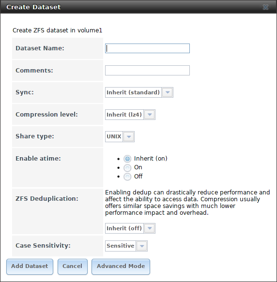

   Creating a ZFS Dataset
#endif freenas
#ifdef truenas
.. _tn_dataset1:

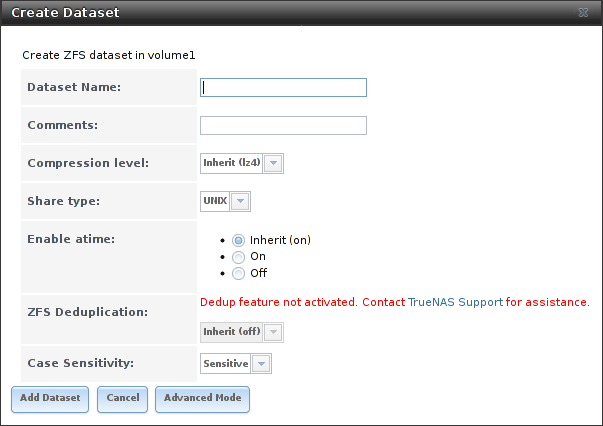

   Creating a ZFS Dataset
#endif truenas

:numref:`Table %s <zfs_dataset_opts_tab>`
shows the options available when creating a dataset. Some settings are
only available in :guilabel:`Advanced Mode`. To see these settings,
either click the :guilabel:`Advanced Mode` button, or configure the
system to always display advanced settings by enabling the
:guilabel:`Show advanced fields by default` option in
:menuselection:`System --> Advanced`.
Most attributes, except for the :guilabel:`Dataset Name`,
:guilabel:`Case Sensitivity`, and :guilabel:`Record Size`, can be
changed after dataset creation by highlighting the dataset name and
clicking the :guilabel:`Edit Options` button in
:menuselection:`Storage --> Volumes`.

.. tabularcolumns:: |>{\RaggedRight}p{\dimexpr 0.25\linewidth-2\tabcolsep}
                    |>{\RaggedRight}p{\dimexpr 0.12\linewidth-2\tabcolsep}
                    |>{\RaggedRight}p{\dimexpr 0.63\linewidth-2\tabcolsep}|

.. _zfs_dataset_opts_tab:

.. table:: ZFS Dataset Options
   :class: longtable

   +-----------------------+-----------------+-------------------------------------------------------------------------------------------------------------+
   | Setting               | Value           | Description                                                                                                 |
   |                       |                 |                                                                                                             |
   +=======================+=================+=============================================================================================================+
   | Dataset Name          | string          | Enter a mandatory unique name for the dataset.                                                              |
   |                       |                 |                                                                                                             |
   +-----------------------+-----------------+-------------------------------------------------------------------------------------------------------------+
   | Comments              | string          | Enter optional comments or notes about this dataset.                                                        |
   |                       |                 |                                                                                                             |
   +-----------------------+-----------------+-------------------------------------------------------------------------------------------------------------+
   | Sync                  | drop-down       | Sets the data write synchronization.                                                                        |
   |                       | menu            | *Inherit* inherits the sync settings from the parent dataset.                                               |
   |                       |                 | *Always* always waits.                                                                                      |
   |                       |                 | *Standard* uses the sync settings that are requested by the client software for data writes to complete.    |
   |                       |                 | *Disabled* never waits for writes to complete.                                                              |
   |                       |                 |                                                                                                             |
   +-----------------------+-----------------+-------------------------------------------------------------------------------------------------------------+
   | Compression           | drop-down       | Refer to the section on :ref:`Compression` for a description of the available algorithms.                   |
   | Level                 | menu            |                                                                                                             |
   |                       |                 |                                                                                                             |
   +-----------------------+-----------------+-------------------------------------------------------------------------------------------------------------+
   | Share type            | drop-down       | Select the type of share that will be used on the dataset.                                                  |
   |                       | menu            | Choices are *UNIX* for an NFS share, *Windows* for a SMB share, or *Mac* for an AFP share.                  |
   |                       |                 |                                                                                                             |
   +-----------------------+-----------------+-------------------------------------------------------------------------------------------------------------+
   | Enable atime          | Inherit, On,    | Choose *On* to update the access time for files when they are read.                                         |
   |                       | or Off          | Choose *Off* to prevent producing log traffic when reading files.                                           |
   |                       |                 | This can result in significant performance gains.                                                           |
   |                       |                 |                                                                                                             |
   +-----------------------+-----------------+-------------------------------------------------------------------------------------------------------------+
   | Quota for             | integer         | Only available in :guilabel:`Advanced Mode`.                                                                |
   | this dataset          |                 | Default of *0* disables quotas.                                                                             |
   |                       |                 | Specifying a value uses no more than the specified size and is suitable for user datasets to                |
   |                       |                 | prevent users from taking all available space.                                                              |
   |                       |                 |                                                                                                             |
   +-----------------------+-----------------+-------------------------------------------------------------------------------------------------------------+
   | Quota for this        | integer         | Only available in :guilabel:`Advanced Mode`.                                                                |
   | dataset and all       |                 | A specified value applies to both this dataset and any child datasets.                                      |
   | children              |                 |                                                                                                             |
   |                       |                 |                                                                                                             |
   +-----------------------+-----------------+-------------------------------------------------------------------------------------------------------------+
   | Reserved space for    | integer         | Only available in :guilabel:`Advanced Mode`.                                                                |
   | this dataset          |                 | Default of *0* is unlimited.                                                                                |
   |                       |                 | Specifying a value keeps at least this much space free and is suitable for datasets with logs               |
   |                       |                 | that could take all free space.                                                                             |
   |                       |                 |                                                                                                             |
   +-----------------------+-----------------+-------------------------------------------------------------------------------------------------------------+
   | Reserved space for    | integer         | Only available in :guilabel:`Advanced Mode`.                                                                |
   | this dataset and      |                 | A specified value applies to both this dataset and any child datasets.                                      |
   | all children          |                 |                                                                                                             |
   |                       |                 |                                                                                                             |
   +-----------------------+-----------------+-------------------------------------------------------------------------------------------------------------+
   #ifdef freenas
   | ZFS Deduplication     | drop-down       | Read the section on :ref:`Deduplication` before making a change to this setting.                            |
   |                       | menu            |                                                                                                             |
   |                       |                 |                                                                                                             |
   #endif freenas
   #ifdef truenas
   | ZFS Deduplication     | drop-down       | Do not change this setting unless instructed to do so by an iXsystems support engineer.                     |
   |                       | menu            |                                                                                                             |
   |                       |                 |                                                                                                             |
   #endif truenas
   +-----------------------+-----------------+-------------------------------------------------------------------------------------------------------------+
   | Read-Only             | drop-down       | Only available in :guilabel:`Advanced Mode`.                                                                |
   |                       | menu            | Choices are *Inherit (off)*, *On*, or *Off*.                                                                |
   |                       |                 |                                                                                                             |
   +-----------------------+-----------------+-------------------------------------------------------------------------------------------------------------+
   | Exec                  | drop-down       | Only available in :guilabel:`Advanced Mode`.                                                                |
   |                       | menu            | Choices are *Inherit (on)*, *On*, or *Off*.                                                                 |
   #ifdef freenas
   |                       |                 | Setting to *Off* prevents the installation of :ref:`Plugins` or :ref:`Jails`.                               |
   |                       |                 |                                                                                                             |
   #endif freenas
   +-----------------------+-----------------+-------------------------------------------------------------------------------------------------------------+
   | Record Size           | drop-down       | Only available in :guilabel:`Advanced Mode`.                                                                |
   |                       | menu            | While ZFS automatically adapts the record size dynamically to adapt to data,                                |
   |                       |                 | if the data has a fixed size, matching that size can result in better performance.                          |
   |                       |                 |                                                                                                             |
   +-----------------------+-----------------+-------------------------------------------------------------------------------------------------------------+
   | Case Sensitivity      | drop-down       | *Sensitive* is the default and assumes filenames are case sensitive.                                        |
   |                       | menu            | *Insensitive* assumes filenames are not case sensitive.                                                     |
   |                       |                 | *Mixed* understands both types of filenames.                                                                |
   |                       |                 |                                                                                                             |
   +-----------------------+-----------------+-------------------------------------------------------------------------------------------------------------+

Create a nested dataset by clicking on an existing dataset and selecting
:guilabel:`Create Dataset`. A zvol can also be created within a dataset.

#ifdef freenas
.. index:: Deduplication
.. _Deduplication:

Deduplication
^^^^^^^^^^^^^

Deduplication is the process of ZFS transparently reusing a single
copy of duplicated data to save space. Depending on the amount of
duplicate data, deduplicaton can improve storage capacity, as less
data is written and stored. However, deduplication is RAM intensive. A
general rule of thumb is 5 GiB of RAM per terabyte of deduplicated
storage. **In most cases, compression provides storage gains
comparable to deduplication with less impact on performance.**

In %brand%, deduplication can be enabled during dataset creation. Be
forewarned that **there is no way to undedup the data within a dataset
once deduplication is enabled**, as disabling deduplication has
**NO EFFECT** on existing data. The more data written to a
deduplicated dataset, the more RAM it requires. When the system starts
storing the DDTs (dedup tables) on disk because they no longer fit
into RAM, performance craters. Further, importing an unclean pool can
require between 3-5 GiB of RAM per terabyte of deduped data, and if the
system does not have the needed RAM, it will panic. The only solution
is to add more RAM or recreate the pool.
**Think carefully before enabling dedup!**
This `article
<https://constantin.glez.de/2011/07/27/zfs-to-dedupe-or-not-dedupe/>`__
provides a good description of the value versus cost considerations
for deduplication.

**Unless a lot of RAM and a lot of duplicate data is available, do not
change the default deduplication setting of "Off".**
For performance reasons, consider using compression rather than
turning this option on.

If deduplication is changed to *On*, duplicate data blocks are removed
synchronously. The result is that only unique data is stored and
common components are shared among files. If deduplication is changed
to *Verify*, ZFS will do a byte-to-byte comparison when two blocks
have the same signature to make sure that the block contents are
identical. Since hash collisions are extremely rare, *Verify* is
usually not worth the performance hit.

.. note:: After deduplication is enabled, the only way to disable it
   is to use the :samp:`zfs set dedup=off {dataset_name}` command
   from :ref:`Shell`. However, any data that has already been
   deduplicated will not be un-deduplicated. Only newly stored data
   after the property change will not be deduplicated. The only way to
   remove existing deduplicated data is to copy all of the data off of
   the dataset, set the property to off, then copy the data back in
   again. Alternately, create a new dataset with
   :guilabel:`ZFS Deduplication` left disabled, copy the data to the
   new dataset, and destroy the original dataset.
#endif freenas

.. tip:: Deduplication is often considered when using a group of very
   similar virtual machine images. However, other features of ZFS can
   provide dedup-like functionality more efficiently. For example, create
   a dataset for a standard VM, then clone a snapshot of that dataset for
   other VMs. Only the difference between each created VM and the main
   dataset are saved, giving the effect of deduplication without the
   overhead.

.. index:: Compression
.. _Compression:

Compression
^^^^^^^^^^^

When selecting a compression type, try to balance performance
with the amount of disk space saved by compression. Compression is
transparent to the client and applications as ZFS automatically
compresses data as it is written to a compressed dataset or zvol and
automatically decompresses that data as it is read. These compression
algorithms are supported:

* **lz4:** default and recommended compression method as it allows
  compressed datasets to operate at near real-time speed. This algorithm
  only compresses the files that will benefit from compression.

* **gzip:** varies from levels 1 to 9 where *gzip fastest* (level 1)
  gives the least compression and *gzip maximum* (level 9) provides
  the best compression but is discouraged due to its performance
  impact.

* **zle:** fast but simple algorithm which eliminates runs of zeroes.

* **lzjb:** provides decent data compression, but is considered
  deprecated as *lz4* provides much better performance.

If selecting *Off* as the :guilabel:`Compression level` when creating
a dataset or zvol, compression will not be used on that dataset/zvol.
This is not recommended as using *lz4* has a negligible performance
impact and allows for more storage capacity.

.. index:: ZVOL
.. _Create zvol:

Create zvol
~~~~~~~~~~~

A zvol is a feature of ZFS that creates a raw block device over ZFS.
The zvol can be used as an :ref:`iSCSI` device extent.

To create a zvol, select an existing ZFS volume or dataset from the
tree then click :guilabel:`Create zvol` to open the screen shown in
:numref:`Figure %s <zfs_create_zvol_fig>`.

.. _zfs_create_zvol_fig:

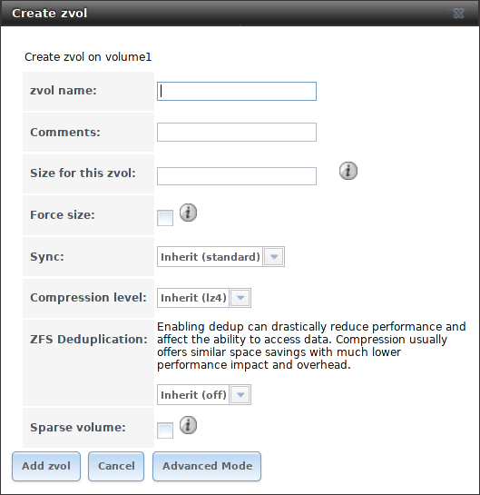

   Creating a Zvol

The configuration options are described in
:numref:`Table %s <zfs_zvol_config_opts_tab>`.
Some settings are only available in :guilabel:`Advanced Mode`. To see
these settings, either click the :guilabel:`Advanced Mode` button or
configure the system to always display these settings by enabling
:guilabel:`Show advanced fields by default` in
:menuselection:`System --> Advanced`.

.. tabularcolumns:: |>{\RaggedRight}p{\dimexpr 0.25\linewidth-2\tabcolsep}
                    |>{\RaggedRight}p{\dimexpr 0.12\linewidth-2\tabcolsep}
                    |>{\RaggedRight}p{\dimexpr 0.63\linewidth-2\tabcolsep}|

.. _zfs_zvol_config_opts_tab:

.. table:: zvol Configuration Options
   :class: longtable

   +----------------+--------------+------------------------------------------------------------------------------------------------+
   | Setting        | Value        | Description                                                                                    |
   |                |              |                                                                                                |
   +================+==============+================================================================================================+
   | zvol Name      | string       | Enter a short name for the zvol.                                                               |
   |                |              | Using a zvol name longer than 63-characters can prevent accessing zvols as devices.            |
   |                |              | For example, a zvol with a 70-character filename or path cannot be used as an iSCSI extent.    |
   |                |              | This setting is mandatory.                                                                     |
   |                |              |                                                                                                |
   +----------------+--------------+------------------------------------------------------------------------------------------------+
   | Comments       | string       | Enter any notes about this zvol.                                                               |
   |                |              |                                                                                                |
   +----------------+--------------+------------------------------------------------------------------------------------------------+
   | Size for       | integer      | Specify size and value such as *10Gib*.                                                        |
   | this zvol      |              | If the size is more than 80% of the available capacity, the creation will fail with an         |
   |                |              | "out of space" error unless :guilabel:`Force size` is also enabled.                            |
   |                |              |                                                                                                |
   +----------------+--------------+------------------------------------------------------------------------------------------------+
   | Force size     | checkbox     | By default, the system does not create a zvol when it brings the pool above 80% capacity.      |
   |                |              | **While NOT recommended**, enabling this option will force the creation of the zvol.           |
   |                |              |                                                                                                |
   +----------------+--------------+------------------------------------------------------------------------------------------------+
   | Compression    | drop-down    | Refer to the section on :ref:`Compression` for a description of the available algorithms.      |
   | level          | menu         |                                                                                                |
   |                |              |                                                                                                |
   +----------------+--------------+------------------------------------------------------------------------------------------------+
   | Sparse         | checkbox     | Used to provide thin provisioning.                                                             |
   | volume         |              | **Caution:** when this option is set, writes will fail when the pool is low on space.          |
   |                |              |                                                                                                |
   +----------------+--------------+------------------------------------------------------------------------------------------------+
   | Block size     | drop-down    | Only available in :guilabel:`Advanced Mode`.                                                   |
   |                | menu         | The default is based on the number of disks in the pool.                                       |
   |                |              | Can be set to match the block size of the filesystem to be formatted onto the iSCSI target.    |
   |                |              |                                                                                                |
   +----------------+--------------+------------------------------------------------------------------------------------------------+

.. _Import Disk:

Import Disk
~~~~~~~~~~~~~

The
:menuselection:`Volume --> Import Disk`
screen, shown in
:numref:`Figure %s <zfs_import_disk_fig>`,
is used to import a **single** disk that has been formatted with the
UFS, NTFS, MSDOS, or EXT2 filesystem. The import is meant to be a
temporary measure to copy the data from a disk to an existing ZFS
dataset. Only one disk can be imported at a time.

.. note:: Imports of EXT3 or EXT4 filesystems are possible in some
   cases, although neither is fully supported.  EXT3 journaling is not
   supported, so those filesystems must have an external *fsck*
   utility, like the one provided by
   `E2fsprogs utilities <http://e2fsprogs.sourceforge.net/>`__,
   run on them before import.  EXT4 filesystems with extended
   attributes or inodes greater than 128 bytes are not supported.
   EXT4 filesystems with EXT3 journaling must have an *fsck* run on
   them before import, as described above.

.. _zfs_import_disk_fig:

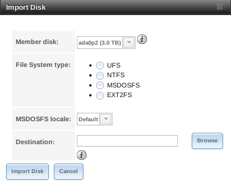

   Importing a Disk

Use the drop-down menu to select the disk to import, select the type
of filesystem on the disk, and browse to the ZFS dataset that will
hold the copied data. If the :guilabel:`MSDOSFS` filesystem is selected,
the :guilabel:`MSDOSFS locale` drop-down menu can be used to select the
locale when non-ascii characters are present on the disk.

Once :guilabel:`Import Disk` is clicked, the disk is mounted, its contents
are copied to the specified ZFS dataset, and the disk is unmounted after
the copy operation completes.

.. _Import Volume:

Import Volume
~~~~~~~~~~~~~

Click
:menuselection:`Storage --> Volumes --> Import Volume`,
to configure %brand% to use an **existing** ZFS pool. This
action is typically performed when an existing %brand% system is
re-installed. Since the operating system is separate from the storage
disks, a new installation does not affect the data on the disks.
However, the new operating system needs to be configured to use the
existing volume.

:numref:`Figure %s <zfs_import_vol_fig>`
shows the initial pop-up window that appears when a volume is imported.

.. _zfs_import_vol_fig:

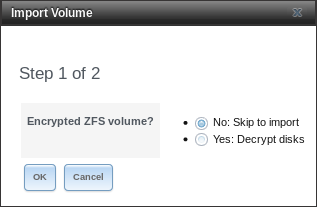

   Initial Import Volume Screen

If importing an unencrypted ZFS pool, select
:guilabel:`No: Skip to import` to open the screen shown in
:numref:`Figure %s <zfs_import_nonencrypt_fig>`.

.. _zfs_import_nonencrypt_fig:

.. figure:: images/auto2.png

   Importing a Non-Encrypted Volume

Existing volumes are available for selection from the drop-down
menu. In the example shown in
:numref:`Figure %s <zfs_import_nonencrypt_fig>`,
the %brand% system has an existing, unencrypted ZFS pool. Once the
volume is selected, click the :guilabel:`OK` button to import the
volume.

If an existing ZFS pool does not show in the drop-down menu, run
:command:`zpool import` from :ref:`Shell` to import the pool.

If physically installing ZFS formatted disks from another
system, ensure to export the drives on that system to prevent an
"in use by another machine" error during the import.

#ifdef freenas
If the hardware is not being detected, run
:command:`camcontrol devlist` from :ref:`Shell`. If the disk does not
appear in the output, check to see if the controller driver is
supported or if it needs to be loaded using :ref:`Tunables`.
#endif freenas

.. _Importing an Encrypted Pool:

Importing an Encrypted Pool
^^^^^^^^^^^^^^^^^^^^^^^^^^^

Disks in existing GELI-encrypted ZFS pools must be decrypted before
importing the pool. In the Import Volume dialog shown in
:numref:`Figure %s <zfs_import_vol_fig>`,
select :guilabel:`Yes: Decrypt disks`. The screen shown in
:numref:`Figure %s <zfs_decrypt_import_fig>`
is then displayed.

.. _zfs_decrypt_import_fig:

.. figure:: images/decrypt.png

   Decrypting Disks Before Importing a ZFS Pool

Select the disks in the encrypted pool, browse to the location of the
saved encryption key, enter the passphrase associated with the key,
then click :guilabel:`OK` to decrypt the disks.

.. note:: The encryption key is required to decrypt the pool. If the
   pool cannot be decrypted, it cannot be re-imported after a failed
   upgrade or lost configuration. This means that it is
   **very important** to save a copy of the key and to remember the
   passphrase that was configured for the key. Refer to
   :ref:`Managing Encrypted Volumes` for instructions on how to
   manage the keys for encrypted volumes.

After the pool is decrypted, it appears in the drop-down menu of
:numref:`Figure %s <zfs_import_nonencrypt_fig>`.
Click the :guilabel:`OK` button to finish the volume import.

.. note:: For security reasons, GELI keys for encrypted volumes are
   not saved in a configuration backup file. When %brand% has been
   installed to a new device and a saved configuration file restored
   to it, the GELI keys for encrypted disks will not be present, and
   the system will not request them. To correct this, export the
   encrypted volume with Detach Volume, making sure that the
   options :guilabel:`Mark the disks as new (destroy data)` or
   :guilabel:`Also delete the share's configuration` are **not**
   selected. Then import the volume again. During the import,
   the GELI keys can be entered as described above.

.. _View Disks:

View Disks
~~~~~~~~~~

:menuselection:`Storage --> Volumes --> View Disks`
shows all of the disks recognized by the %brand% system. An example is
shown in
:numref:`Figure %s <viewing_disks_fig>`.

.. _viewing_disks_fig:

#ifdef freenas
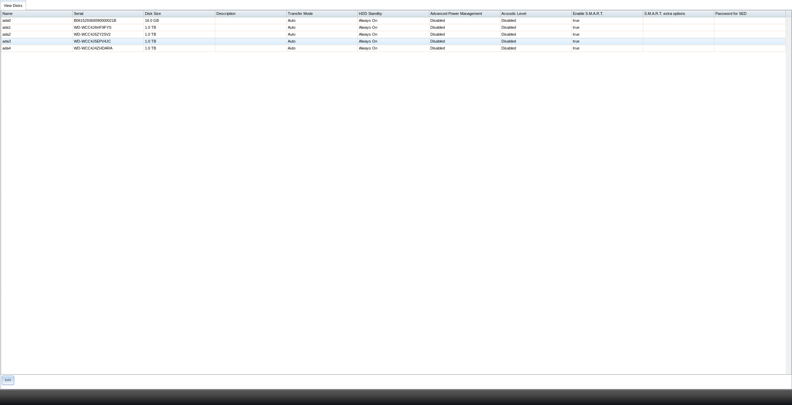

   Viewing Disks
#endif freenas
#ifdef truenas
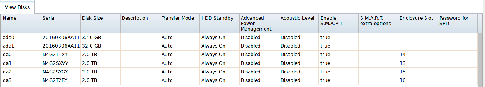

   Viewing Disks
#endif truenas

The current configuration of each device is displayed. Click a disk
entry and the :guilabel:`Edit` button to change its configuration. The
configurable options are described in
:numref:`Table %s <zfs_disk_opts_tab>`.

To bulk edit disks, hold :kbd:`Shift` and click each disk to edit.
:guilabel:`Edit` changes to :guilabel:`Edit In Bulk`. Click it to open
the :guilabel:`Edit In Bulk` window. This window displays which disks
are being edited and a short list of configurable options. The
:ref:`Disk Options table <zfs_disk_opts_tab>` indicates the options
available when editing multiple disks.

.. tabularcolumns:: |>{\RaggedRight}p{\dimexpr 0.20\linewidth-2\tabcolsep}
                    |>{\RaggedRight}p{\dimexpr 0.10\linewidth-2\tabcolsep}
                    |>{\RaggedRight}p{\dimexpr 0.10\linewidth-2\tabcolsep}
                    |>{\RaggedRight}p{\dimexpr 0.60\linewidth-2\tabcolsep}|

.. _zfs_disk_opts_tab:

.. table:: Disk Options
   :class: longtable

   +------------------------------+-----------+------------+--------------------------------------------------------------------------------------------------------------------------+
   | Setting                      | Value     | Bulk Edit  | Description                                                                                                              |
   |                              |           |            |                                                                                                                          |
   +==============================+===========+============+==========================================================================================================================+
   | Name                         | string    |            | This is the FreeBSD device name for the disk.                                                                            |
   |                              |           |            |                                                                                                                          |
   +------------------------------+-----------+------------+--------------------------------------------------------------------------------------------------------------------------+
   | Serial                       | string    |            | This is the serial number of the disk.                                                                                   |
   |                              |           |            |                                                                                                                          |
   +------------------------------+-----------+------------+--------------------------------------------------------------------------------------------------------------------------+
   | Description                  | string    |            | Enter any notes about this disk.                                                                                         |
   |                              |           |            |                                                                                                                          |
   +------------------------------+-----------+------------+--------------------------------------------------------------------------------------------------------------------------+
   | HDD Standby                  | drop-down | ✓          | Indicates the time of inactivity in minutes before the drive enters standby mode to conserve energy. This                |
   |                              | menu      |            | `forum post <https://forums.freenas.org/index.php?threads/how-to-find-out-if-a-drive-is-spinning-down-properly.2068/>`__ |
   |                              |           |            | demonstrates how to determine if a drive has spun down.                                                                  |
   |                              |           |            |                                                                                                                          |
   +------------------------------+-----------+------------+--------------------------------------------------------------------------------------------------------------------------+
   | Advanced Power Management    | drop-down | ✓          | Select a power management profile from the menu. The default value is *Disabled*.                                        |
   |                              | menu      |            |                                                                                                                          |
   +------------------------------+-----------+------------+--------------------------------------------------------------------------------------------------------------------------+
   | Acoustic Level               | drop-down | ✓          | Default is *Disabled*. Other values can be selected for disks that understand                                            |
   |                              | menu      |            | `AAM <https://en.wikipedia.org/wiki/Automatic_acoustic_management>`__.                                                   |
   |                              |           |            |                                                                                                                          |
   +------------------------------+-----------+------------+--------------------------------------------------------------------------------------------------------------------------+
   | Enable S.M.A.R.T.            | checkbox  | ✓          | Enabled by default if the disk supports S.M.A.R.T. Unsetting this option will disable any configured                     |
   |                              |           |            | :ref:`S.M.A.R.T. Tests` for the disk.                                                                                    |
   |                              |           |            |                                                                                                                          |
   +------------------------------+-----------+------------+--------------------------------------------------------------------------------------------------------------------------+
   | S.M.A.R.T. extra options     | string    | ✓          | Enter additional `smartctl(8) <https://www.smartmontools.org/browser/trunk/smartmontools/smartctl.8.in>`__  options.     |
   |                              |           |            |                                                                                                                          |
   +------------------------------+-----------+------------+--------------------------------------------------------------------------------------------------------------------------+
   | Password for SED             | string    |            | Enter and confirm the password which will be used for this device instead of the global SED password. Refer to           |
   |                              |           |            | :ref:`Self-Encrypting Drives` for more information.                                                                      |
   +------------------------------+-----------+------------+--------------------------------------------------------------------------------------------------------------------------+
   | Reset Password               | checkbox  |            | Set to clear the SED password.                                                                                           |
   |                              |           |            |                                                                                                                          |
   +------------------------------+-----------+------------+--------------------------------------------------------------------------------------------------------------------------+

.. note:: If the serial number of a disk is not displayed in this screen,
   use the :command:`smartctl` command from :ref:`Shell`. For example,
   to determine the serial number of disk *ada0*, type
   :command:`smartctl -a /dev/ada0 | grep Serial`.

The :guilabel:`Wipe` function is provided for when an unused disk is
to be discarded.

.. warning:: Make certain that all data has been backed up and that
   the disk is no longer in use. Triple-check that the correct disk is
   being selected to be wiped, as recovering data from a wiped disk is
   usually impossible. If there is any doubt, physically remove the
   disk, verify that all data is still present on the %brand% system,
   and wipe the disk in a separate computer.

Clicking :guilabel:`Wipe` offers several choices. *Quick* erases only
the partitioning information on a disk, making it easy to reuse but
without clearing other old data. For more security, *Full with zeros*
overwrites the entire disk with zeros, while *Full with random data*
overwrites the entire disk with random binary data.

Quick wipes take only a few seconds. A *Full with zeros* wipe of a
large disk can take several hours, and a *Full with random data* takes
longer. A progress bar is displayed during the wipe to track status.

.. _View Volumes:

Volumes
~~~~~~~

:menuselection:`Storage --> Volumes`
is used to view and further configure existing ZFS pools, datasets,
and zvols. The example shown in
:numref:`Figure %s <zfs_vol_fig>`
shows one ZFS pool (*volume1*) with two datasets (the one
automatically created with the pool, *volume1*, and *dataset1*) and
one zvol (*zvol1*).

Note that in this example, there are two datasets named *volume1*. The
first represents the ZFS pool and its :guilabel:`Used` and
:guilabel:`Available` entries reflect the total size of the pool,
including disk parity. The second represents the implicit or root
dataset and its :guilabel:`Used` and :guilabel:`Available` entries
indicate the amount of disk space available for storage.

Buttons are provided for quick access to :guilabel:`Volume Manager`,
:guilabel:`Import Disk`, :guilabel:`Import Volume`, and
:guilabel:`View Disks`. If the system has multipath-capable hardware,
an extra button will be added, :guilabel:`View Multipaths`. For each
entry, the columns indicate the :guilabel:`Name`, how much disk space
is :guilabel:`Used`, how much disk space is :guilabel:`Available`, the
type of :guilabel:`Compression`, the :guilabel:`Compression Ratio`,
the :guilabel:`Status`, whether it is mounted as read-only, and any
:guilabel:`Comments` entered for the volume.

.. _zfs_vol_fig:

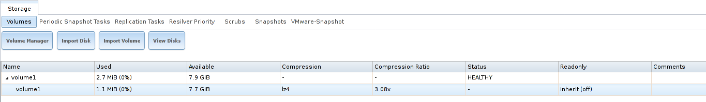

   Viewing Volumes

Clicking the entry for a pool causes several buttons to appear at the
bottom of the screen.

#ifdef truenas
.. note:: When the system has :ref:`High Availability (HA) <Failover>`
   active, volumes cannot be exported or destroyed.
#endif truenas

**Detach Volume:** allows exporting the pool or deleting the contents
of the pool, depending upon the choice made in the screen shown in
:numref:`Figure %s <zfs_detach_vol_fig>`.
The :guilabel:`Detach Volume` screen displays the current used space
and indicates whether there are any shares. It provides options to
:guilabel:`Mark the disks as new (destroy data)` and
:guilabel:`Also delete the share's configuration`.
The browser window turns red to indicate that some choices will make the
data inaccessible.**When the option to select the disks as new is left
deselected, the volume is exported.** The data is not destroyed and the
volume can be re-imported at a later time. When moving a ZFS pool from
one system to another, perform this export action first as it flushes
any unwritten data to disk, writes data to the disk indicating that the
export was done, and removes all knowledge of the pool from the system.

**When the option to mark the disks as new is selected, the pool and all
the data in its datasets, zvols, and shares is destroyed and the
individual disks are returned to their raw state. Desired data must
be backed up to another disk or device before using this option.**

  .. _zfs_detach_vol_fig:

  .. figure:: images/storage-detach.png

     Detach or Delete a Volume

**Scrub Volume:** scrubs and scheduling them are described in more
detail in :ref:`Scrubs`. This button allows manually initiating a
scrub. Scrubs are I/O intensive and can negatively impact performance.
Avoid initiating a scrub when the system is busy.

A :guilabel:`Cancel` button is provided to cancel a scrub. When a
scrub is cancelled, it is abandoned. The next scrub to run starts
from the beginning, not where the cancelled scrub left off.

The status of a running scrub or the statistics from the last
completed scrub can be seen by clicking the :guilabel:`Volume Status`
button.

**Volume Status:** as shown in the example in
:numref:`Figure %s <volume_status_fig>`,
this screen shows the device name and status of each disk in the ZFS
pool as well as any read, write, or checksum errors. It also indicates
the status of the latest ZFS scrub. Clicking the entry for a device
causes buttons to appear to edit the device options (shown in
:numref:`Figure %s <zfs_edit_disk_fig>`),
offline or online the device, or replace the device (as described in
:ref:`Replacing a Failed Drive`).

**Upgrade:** used to upgrade the pool to the latest ZFS features, as
described in :ref:`Upgrading a ZFS Pool`. This button does not appear
if the pool is running the latest version of feature flags.

.. _volume_status_fig:

#ifdef freenas
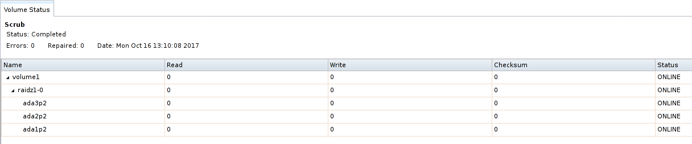

   Volume Status
#endif freenas
#ifdef truenas
.. figure:: images/tn_volume2.png

   Volume Status
#endif truenas

Selecting a disk in :guilabel:`Volume Status` and clicking its
:guilabel:`Edit Disk` button shows the screen in
:numref:`Figure %s <zfs_edit_disk_fig>`.
:numref:`Table %s <zfs_disk_opts_tab>`
summarizes the configurable options.

.. _zfs_edit_disk_fig:

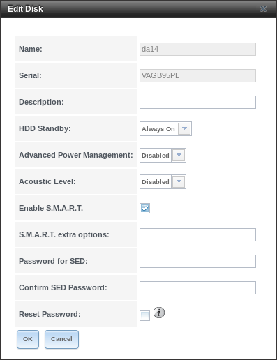

   Editing a Disk

#ifdef freenas
.. note:: Versions of %brand% prior to 8.3.1 required a reboot to
   apply changes to the :guilabel:`HDD Standby`,
   :guilabel:`Advanced Power Management`, and
   :guilabel:`Acoustic Level` settings. As of 8.3.1, changes to these
   settings are applied immediately.
#endif freenas

Clicking a dataset in
:menuselection:`Storage --> Volumes`
causes buttons to appear at the bottom of the screen, providing these
options:

**Change Permissions:** edit the dataset permissions as described in
:ref:`Change Permissions`.

**Create Snapshot:** create a one-time snapshot. To schedule the
regular creation of snapshots, instead use
:ref:`Periodic Snapshot Tasks`.

**Promote Dataset:** only applies to clones. When a clone is promoted,
the origin filesystem becomes a clone of the clone making it possible
to destroy the filesystem that the clone was created from. Otherwise,
a clone cannot be destroyed while the origin filesystem exists.

**Destroy Dataset:** clicking the :guilabel:`Destroy Dataset` button
causes the browser window to turn red to indicate that this is a
destructive action. Clicking :guilabel:`Yes` proceeds with the deletion.

**Edit Options:** edit the volume properties described in
:numref:`Table %s <zfs_create_dataset>`.
Note that it will not allow changing the dataset name.

**Create Dataset:** used to create a child dataset within this
dataset.

**Create zvol:** create a child zvol within this
dataset.

Clicking a zvol in
:menuselection:`Storage --> Volumes` causes
icons to appear at the bottom of the screen:
:guilabel:`Create Snapshot`, :guilabel:`Edit zvol`, and
:guilabel:`Destroy zvol`. Similar to datasets, a zvol name cannot be
changed, and destroying a zvol requires confirmation.

.. _Managing Encrypted Volumes:

Managing Encrypted Volumes
^^^^^^^^^^^^^^^^^^^^^^^^^^

%brand% generates and stores a randomized *encryption key* whenever
a new encrypted volume is created. This key is required to read and
decrypt any data on the volume.

Encryption keys can also be downloaded as a safety measure, to allow
decryption on a different system in the event of failure, or to allow
the locally stored key to be deleted for extra security. Encryption
keys can also be optionally protected with a *passphrase* for
additional security. The combination of encryption key location and
whether a passphrase is used provide several different security
scenarios:

* *Key stored locally, no passphrase*: the encrypted volume is
  decrypted and accessible when the system running. Protects "data at
  rest" only.

* *Key stored locally, with passphrase*: the encrypted volume is not
  accessible until the passphrase is entered by the %brand%
  administrator.

* *Key not stored locally*: the encrypted volume is not accessible
  until the %brand% administrator provides the key. If a passphrase is
  set on the key, it must also be entered before the encrypted volume
  can be accessed (`two factor authentication
  <https://en.wikipedia.org/wiki/Multi-factor_authentication>`__).

Encrypted data cannot be accessed when the disks are removed or the
system has been shut down. On a running system, encrypted data
cannot be accessed when the volume is locked (see below) and the key
is not available. If the key is protected with a passphrase, both the
key and passphrase are required for decryption.

Encryption applies to a volume, not individual users. When a volume is
unlocked, data is accessible to all users with permissions to access
it.

.. note:: `GELI <https://www.freebsd.org/cgi/man.cgi?query=geli>`__
   uses *two* randomized encryption keys for each disk. The first has
   been discussed here. The second, the disk's "master key", is
   encrypted and stored in the on-disk GELI metadata. Loss of a disk
   master key due to disk corruption is equivalent to any other disk
   failure, and in a redundant pool, other disks will contain
   accessible copies of the uncorrupted data. While it is *possible*
   to separately back up disk master keys, it is usually not necessary
   or useful.

.. _Additional Controls for Encrypted Volumes:

Additional Controls for Encrypted Volumes
^^^^^^^^^^^^^^^^^^^^^^^^^^^^^^^^^^^^^^^^^

If the :guilabel:`Encryption` option is enabled during the creation of a
pool, additional buttons appear in the entry for the volume in
:menuselection:`Storage --> Volumes`.
An example is shown in
:numref:`Figure %s <zfs_encrypt_pool_icons_fig>`.

.. _zfs_encrypt_pool_icons_fig:

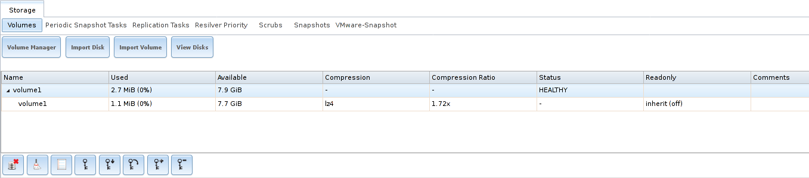

   Encryption Icons Associated with an Encrypted Volume

These additional encryption buttons are used to:

**Create/Change Passphrase:** set and confirm a passphrase
associated with the GELI encryption key. The desired passphrase is
entered and repeated for verification. A red warning is a reminder to
:guilabel:`Remember to add a new recovery key as this action
invalidates the previous recovery key`. Unlike a password, a
passphrase can contain spaces and is typically a series of words. A
good passphrase is easy to remember (like the line to a song or piece
of literature) but hard to guess. **Remember this passphrase. An
encrypted volume cannot be reimported without it.** In other words,
if the passphrase is forgotten, the data on the volume can become
inaccessible if it becomes necessary to reimport the pool. Protect
this passphrase, as anyone who knows it could reimport the encrypted
volume, thwarting the reason for encrypting the disks in the first
place.

.. _zfs_encrypt_passphrase_fig:

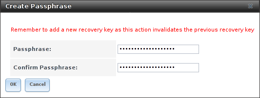

   Add or Change a Passphrase to an Encrypted Volume

After the passphrase is set, the name of this button changes to
:guilabel:`Change Passphrase`. After setting or changing the
passphrase, it is important to *immediately* create a new recovery key
by clicking the :guilabel:`Add recovery key` button. This way, if the
passphrase is forgotten, the associated recovery key can be used
instead.

Encrypted volumes with a passphrase display an additional lock button:

.. _zfs_encrypt_lock_fig:

   Lock Button

These encrypted volumes can be *locked*. The data is not accessible
until the volume is unlocked by suppying the passphrase or encryption
key, and the button changes to an unlock button:

.. _zfs_encrypt_unlock_fig:

   Unlock Button

To unlock the volume, click the unlock button to display the Unlock
dialog:

.. _zfs_encrypt_unlock_dialog_fig:

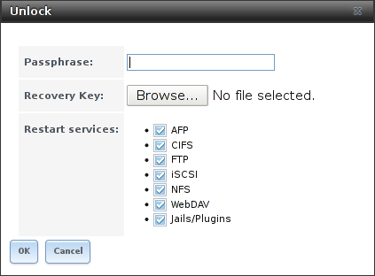

   Unlock Locked Volume

Unlock the volume by entering a passphrase *or* using the
:guilabel:`Browse` button to load the recovery key. Only the passphrase
is used when both a passphrase and a recovery key are entered. The
services listed in :guilabel:`Restart Services` will restart when the
pool is unlocked. This allows them to see the new volume and share or
access data on it. Individual services can be prevented from restarting
by deselecting them. However, a service that is not restarted might not
be able to access the unlocked volume.

**Download Key:** download a backup copy of the GELI encryption key.
The encryption key is saved to the client system, not on the %brand%
system. The %brand% administrative password must be entered,
then the directory in which to store the key is chosen. Since the GELI
encryption key is separate from the %brand% configuration database,
**it is highly recommended to make a backup of the key. If the key is
ever lost or destroyed and there is no backup key, the data on the
disks is inaccessible.**

**Encryption Re-key:** generate a new GELI encryption key. Typically
this is only performed when the administrator suspects that the
current key may be compromised. This action also removes the current
passphrase.
#ifdef truenas

.. note:: A re-key is not allowed if :ref:`Failover`
   (High Availability) has been enabled and the standby node is down.
#endif truenas

**Add recovery key:** generate a new recovery key. This screen
prompts for the %brand% administrative password and then the directory
in which to save the key. Note that the recovery key is saved to the
client system, not on the %brand% system. This recovery key can be
used if the passphrase is forgotten. **Always immediately add a
recovery key whenever the passphrase is changed.**

**Remove recovery key:** Typically this is only performed when the
administrator suspects that the current recovery key may be
compromised. **Immediately** create a new passphrase and recovery key.

.. note:: The passphrase, recovery key, and encryption key must be
   protected. Do not reveal the passphrase to others. On the system
   containing the downloaded keys, take care that the system and its
   backups are protected. Anyone who has the keys has the ability to
   re-import the disks if they are discarded or stolen.

.. warning:: If a re-key fails on a multi-disk system, an alert is
   generated. **Do not ignore this alert** as doing so may result in
   the loss of data.

.. _View Multipaths:

View Multipaths
~~~~~~~~~~~~~~~

%brand% uses
`gmultipath(8) <https://www.freebsd.org/cgi/man.cgi?query=gmultipath>`__
to provide
`multipath I/O <https://en.wikipedia.org/wiki/Multipath_I/O>`__
support on systems containing hardware that is capable of multipath.
An example would be a dual SAS expander backplane in the chassis or an
external JBOD.

Multipath hardware adds fault tolerance to a NAS as the data is still
available even if one disk I/O path has a failure.

%brand% automatically detects active/active and active/passive
multipath-capable hardware. Any multipath-capable devices that are
detected will be placed in multipath units with the parent devices
hidden. The configuration will be displayed in
:menuselection:`Storage --> Volumes --> View Multipaths`.
Note that this option is not be displayed in the
:menuselection:`Storage --> Volumes`
tree on systems that do not contain multipath-capable hardware.

.. index:: Replace Failed Drive
.. _Replacing a Failed Drive:

Replacing a Failed Drive
~~~~~~~~~~~~~~~~~~~~~~~~

#ifdef freenas
With any form of redundant RAID, failed drives must be replaced as
soon as possible to repair the degraded state of the RAID. Depending
on the hardware capabilities, it might be necessary to reboot to
replace the failed drive. Hardware that supports AHCI does not require
a reboot.
#endif freenas
#ifdef truenas
Replace failed drives as soon as possible to repair the degraded
state of the RAID.
#endif truenas

.. note:: Striping (RAID0) does not provide redundancy. If a disk in
   a stripe fails, the volume will be destroyed and must be recreated
   and the data restored from backup.

.. note:: If the volume is encrypted with GELI, refer to
   :ref:`Replacing an Encrypted Drive` before proceeding.

Before physically removing the failed device, go to
:menuselection:`Storage --> Volumes`.
Select the volume name. At the bottom of the interface are
several icons, one of which is :guilabel:`Volume Status`. Click the
:guilabel:`Volume Status` icon and locate the failed disk. Then
perform these steps:

#ifdef freenas
#.  Click the disk entry, then its :guilabel:`Offline` button to
    change the disk status to OFFLINE. This step
    removes the device from the ZFS pool and prevents swap issues. If
    the hardware supports hot-pluggable disks, click the disk
    :guilabel:`Offline` button and pull the disk, then skip to step 3.
    If there is no :guilabel:`Offline` button but only a
    :guilabel:`Replace` button, the disk is already offlined and this
    step can be skipped.
#endif freenas
#ifdef truenas
#.  Click the disk entry, then its :guilabel:`Offline` button to
    change that disk status to OFFLINE. This step is needed to
    properly remove the device from the ZFS pool and to prevent swap
    issues. Click the disk :guilabel:`Offline` button and pull the
    disk. If there is no :guilabel:`Offline` button but only a
    :guilabel:`Replace` button, the disk is already offlined and this
    step can be skipped.
#endif truenas

    .. note:: If the process of changing the disk status to OFFLINE
       fails with a "disk offline failed - no valid replicas" message,
       the ZFS volume must be scrubbed first with the
       :guilabel:`Scrub Volume` button in
       :menuselection:`Storage --> Volumes`.
       After the scrub completes, try to :guilabel:`Offline` the disk
       again before proceeding.

#ifdef freenas
#.  If the hardware is not AHCI capable, shut down the system to
    physically replace the disk. When finished, return to the GUI
    and locate the OFFLINE disk.
#endif freenas

#.  After the disk has been replaced and is showing as OFFLINE, click
    the disk again and then click its :guilabel:`Replace` button.
    Select the replacement disk from the drop-down menu and click the
    :guilabel:`Replace Disk` button.  After clicking the
    :guilabel:`Replace Disk` button, the ZFS pool begins resilvering.

#. After the drive replacement process is complete, re-add the
   replaced disk in the :ref:`S.M.A.R.T. Tests` screen.

In the example shown in
:numref:`Figure %s <zfs_replace_failed_fig>`,
a failed disk is being replaced by disk *ada5* in the volume named
:file:`volume1`.

.. _zfs_replace_failed_fig:

.. figure:: images/replace.png

   Replacing a Failed Disk

After the resilver is complete, :guilabel:`Volume Status` shows a
:guilabel:`Completed` resilver status and indicates any errors.
:numref:`Figure %s <zfs_disk_replacement_fig>`
indicates that the disk replacement was successful in this example.

.. note:: A disk that is failing but has not completely failed can be
   replaced in place, without first removing it. Whether this is a
   good idea depends on the overall condition of the failing disk. A
   disk with a few newly-bad blocks that is otherwise functional can
   be left in place during the replacement to provide data redundancy.
   A drive that is experiencing continuous errors can actually slow
   down the replacement. In extreme cases, a disk with serious
   problems might spend so much time retrying failures that it could
   prevent the replacement resilvering from completing before another
   drive fails.

.. _zfs_disk_replacement_fig:

.. figure:: images/replace2.png

   Disk Replacement is Complete

.. _Replacing an Encrypted Drive:

Replacing an Encrypted Drive
^^^^^^^^^^^^^^^^^^^^^^^^^^^^

If the ZFS pool is encrypted, additional steps are needed when
replacing a failed drive.

First, make sure that a passphrase has been set using the instructions
in :ref:`Encryption` **before** attempting to replace the failed
drive. Then, follow the steps 1 and 2 as described above. During step
3, a prompt will appear to input and confirm the passphrase for the
pool. Enter this information then click the :guilabel:`Replace Disk`
button. Wait until the resilvering is complete.

Next, restore the encryption keys to the pool.
**If this additional step is not performed before the next
reboot, access to the pool might be permanently lost.**

#.  Highlight the pool that contains the disk that was just replaced
    and click the :guilabel:`Add Recovery Key` button to save the new
    recovery key. The old recovery key will no longer function, so it
    can be safely discarded.

.. _Removing a Log or Cache Device:

Removing a Log or Cache Device
^^^^^^^^^^^^^^^^^^^^^^^^^^^^^^

Added log or cache devices appear in
:menuselection:`Storage --> Volumes --> Volume Status`.
Clicking the device enables its :guilabel:`Replace` and
:guilabel:`Remove` buttons.

Log and cache devices can be safely removed or replaced with these
buttons. Both types of devices improve performance, and throughput can
be impacted by their removal.

.. _Replacing Drives to Grow a ZFS Pool:

Replacing Drives to Grow a ZFS Pool
~~~~~~~~~~~~~~~~~~~~~~~~~~~~~~~~~~~

The recommended method for expanding the size of a ZFS pool is to
pre-plan the number of disks in a vdev and to stripe additional vdevs
using :ref:`Volume Manager` as additional capacity is needed.

However, this is not an option if there are no open drive ports and a
SAS/SATA HBA card cannot be added. In this case, one disk at a time
can be replaced with a larger disk, waiting for the resilvering
process to incorporate the new disk into the pool, then repeating with
another disk until all of the original disks have been replaced.

The safest way to perform this is to use a spare drive port or an
eSATA port and a hard drive dock. The process follows these steps:

#. Shut down the system.

#. Install one new disk.

#. Start up the system.

#. Go to
   :menuselection:`Storage --> Volumes`,
   select the pool to expand and click the :guilabel:`Volume Status`
   button. Select a disk and click the :guilabel:`Replace` button.
   Choose the new disk as the replacement.

#. The status of the resilver process can be viewed by running
   :command:`zpool status`. When the new disk has resilvered, the old
   one will be automatically offlined. The system is then shut down to
   physically remove the replaced disk. One advantage of this approach
   is that there is no loss of redundancy during the resilver.

If a spare drive port is not available, a drive can be replaced with a
larger one using the instructions in :ref:`Replacing a Failed Drive`.
This process is slow and places the system in a degraded state. Since
a failure at this point could be disastrous, **do not attempt this
method unless the system has a reliable backup.** Replace one drive at
a time and wait for the resilver process to complete on the replaced
drive before replacing the next drive. After all the drives are
replaced and the final resilver completes, the added space will appear
in the pool.

.. index:: Hot Spares, Spares
.. _Hot Spares:

Hot Spares
~~~~~~~~~~

ZFS provides the ability to have "hot" *spares*. These are drives that
are connected to a volume, but not in use. If the volume experiences
the failure of a data drive, the system uses the hot spare as a
temporary replacement. If the failed drive is replaced with a new
drive, the hot spare drive is no longer needed and reverts to being a
hot spare. If the failed drive is instead removed from the volume, the
spare is promoted to a full member of the volume.

Hot spares can be added to a volume during or after creation. On
%brand%, hot spare actions are implemented by
`zfsd(8) <https://www.freebsd.org/cgi/man.cgi?query=zfsd>`__.

.. index:: Periodic Snapshot, Snapshot
.. _Periodic Snapshot Tasks:

Periodic Snapshot Tasks
-----------------------

A periodic snapshot task allows scheduling the creation of read-only
versions of ZFS volumes and datasets at a given point in time.
Snapshots can be created quickly and, if little data changes, new
snapshots take up very little space. For example, a snapshot where no
files have changed takes 0 MiB of storage, but as changes are made to
files, the snapshot size changes to reflect the size of the changes.

Snapshots provide a clever way of keeping a history of files,
providing a way to recover an older copy or even a deleted file. For
this reason, many administrators take snapshots often (perhaps every
fifteen minutes), store them for a period of time (possibly a month),
and store them on another system (typically using
:ref:`Replication Tasks`). Such a strategy allows the administrator to
roll the system back to a specific point in time. If there is a
catastrophic loss, an off-site snapshot can be used to restore the
system up to the time of the last snapshot.

An existing ZFS volume is required before creating a snapshot.
Creating a volume is described in :ref:`Volume Manager`.

To create a periodic snapshot task, click
:menuselection:`Storage --> Periodic Snapshot Tasks
--> Add Periodic Snapshot`
which opens the screen shown in
:numref:`Figure %s <zfs_periodic_snapshot_fig>`.
:numref:`Table %s <zfs_periodic_snapshot_opts_tab>`
summarizes the fields in this screen.

.. note:: If only a one-time snapshot is needed, instead use
   :menuselection:`Storage --> Volumes`
   and click the :guilabel:`Create Snapshot` button for the volume or
   dataset to snapshot.

.. _zfs_periodic_snapshot_fig:

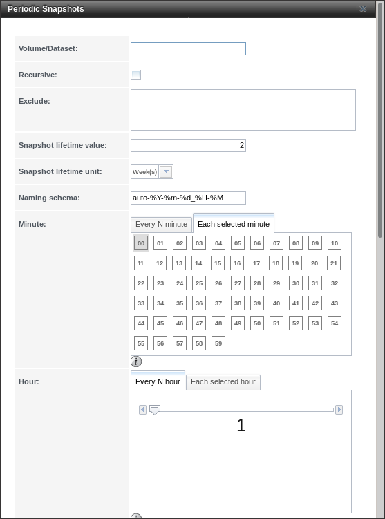

   Creating a Periodic Snapshot

.. tabularcolumns:: |>{\RaggedRight}p{\dimexpr 0.16\linewidth-2\tabcolsep}
                    |>{\RaggedRight}p{\dimexpr 0.20\linewidth-2\tabcolsep}
                    |>{\RaggedRight}p{\dimexpr 0.63\linewidth-2\tabcolsep}|

.. _zfs_periodic_snapshot_opts_tab:

.. table:: Options When Creating a Periodic Snapshot
   :class: longtable

   +-------------------+-------------------+--------------------------------------------------------------------------------------------+
   | Setting           | Value             | Description                                                                                |
   |                   |                   |                                                                                            |
   +===================+===================+============================================================================================+
   | Volume/Dataset    | drop-down menu    | Select an existing ZFS volume, dataset, or zvol.                                           |
   |                   |                   |                                                                                            |
   +-------------------+-------------------+--------------------------------------------------------------------------------------------+
   | Recursive         | checkbox          | Set to take separate snapshots of the volume or dataset and each of its child datasets.    |
   |                   |                   | Unset to take a single snapshot of only the specified volume or dataset.                   |
   |                   |                   |                                                                                            |
   +-------------------+-------------------+--------------------------------------------------------------------------------------------+
   | Snapshot          | integer and       | Define a length of time to retain the snapshot on this system.                             |
   | Lifetime          | drop-down menu    | After the time expires, the snapshot is removed.                                           |
   |                   |                   | Snapshots replicated to other systems are not affected.                                    |
   |                   |                   |                                                                                            |
   +-------------------+-------------------+--------------------------------------------------------------------------------------------+
   | Begin             | drop-down menu    | Choose the hour and minute when the system can begin taking snapshots.                     |
   |                   |                   |                                                                                            |
   +-------------------+-------------------+--------------------------------------------------------------------------------------------+
   | End               | drop-down menu    | Choose the hour and minute when the system will stop taking snapshots.                     |
   |                   |                   |                                                                                            |
   +-------------------+-------------------+--------------------------------------------------------------------------------------------+
   | Interval          | drop-down menu    | Define how often the system takes snapshots between the :guilabel:`Begin`                  |
   |                   |                   | and :guilabel:`End` times.                                                                 |
   |                   |                   |                                                                                            |
   +-------------------+-------------------+--------------------------------------------------------------------------------------------+
   | Weekday           | checkboxes        | Choose the days of the week to take snapshots.                                             |
   |                   |                   |                                                                                            |
   +-------------------+-------------------+--------------------------------------------------------------------------------------------+
   | Enabled           | checkbox          | Unset to disable this task without deleting it.                                            |
   |                   |                   |                                                                                            |
   +-------------------+-------------------+--------------------------------------------------------------------------------------------+

If the :guilabel:`Recursive` option is enabled, child datasets of this
dataset are included in the snapshot and there is no need to create
snapshots for each child dataset. The downside is that there is no way
to exclude particular child  datasets from a recursive snapshot.

Click the :guilabel:`OK` button to save the task. Entries for each
task are shown in :guilabel:`View Periodic Snapshot Tasks`. Click an
entry to display :guilabel:`Edit` and :guilabel:`Delete` buttons for
it.

.. index:: Replication
.. _Replication Tasks:

Replication Tasks
-----------------

*Replication* is the duplication of snapshots from one %brand% system
to another computer. When a new snapshot is created on the source
computer, it is automatically replicated to the destination computer.
Replication is typically used to keep a copy of files on a separate
system, with that system sometimes being at a different physical
location.

The basic configuration requires a source system with the original
data and a destination system where the data will be replicated.
The destination system is prepared to receive replicated data, a
:ref:`periodic snapshot <Periodic Snapshot Tasks>` of the data on the
source system is created, and then a replication task is created. As
snapshots are automatically created on the source computer, they are
automatically replicated to the destination computer.

.. note:: Replicated data is not visible on the receiving system until
   the replication task completes.

.. note:: The target dataset on the receiving system is automatically
   created in read-only mode to protect the data. To mount or browse
   the data on the receiving system, create a clone of the snapshot
   and use the clone. Clones are created in read/write mode, making it
   possible to browse or mount them. See :ref:`Snapshots` for more
   information on creating clones.

.. _replication_common_config:

Examples: Common Configuration
~~~~~~~~~~~~~~~~~~~~~~~~~~~~~~

The examples shown here use the same setup of source and destination
computers.

*Alpha* (Source)
^^^^^^^^^^^^^^^^

*Alpha* is the source computer with the data to be replicated. It is
at IP address *10.0.0.102*. A :ref:`volume <Volumes>` named *alphavol*
has already been created, and a :ref:`dataset <Create Dataset>` named
*alphadata* has been created on that volume. This dataset contains the
files which will be snapshotted and replicated onto *Beta*.

This new dataset has been created for this example, but a new dataset
is not required. Most users will already have datasets containing the
data they wish to replicate.

Create a periodic snapshot of the source dataset by selecting
:menuselection:`Storage --> Periodic Snapshot Tasks`.
Click the *alphavol/alphadata* dataset to highlight it. Create a
:ref:`periodic snapshot <Periodic Snapshot Tasks>` of it by clicking
:guilabel:`Periodic Snapshot Tasks`, then
:guilabel:`Add Periodic Snapshot` as shown in
:numref:`Figure %s <zfs_create_periodic_replication_fig>`.

This example creates a snapshot of the *alphavol/alphadata* dataset
every two hours from Monday through Friday between the hours of 9:00
and 18:00 (6:00 PM). Snapshots are automatically deleted after their
chosen lifetime of two weeks expires.

.. _zfs_create_periodic_replication_fig:

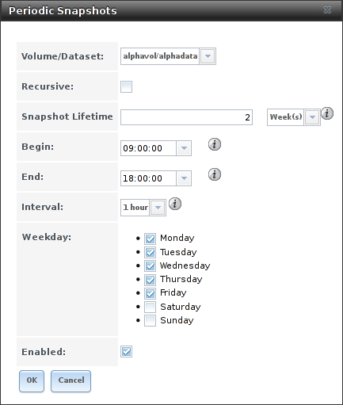

   Create a Periodic Snapshot for Replication

*Beta* (Destination)
^^^^^^^^^^^^^^^^^^^^

*Beta* is the destination computer where the replicated data will be
copied.  It is at IP address *10.0.0.118*. A :ref:`volume <Volumes>`
named *betavol* has already been created.

Snapshots are transferred with :ref:`SSH`. To allow incoming
connections, this service is enabled on *Beta*. The service is not
required for outgoing connections, and so does not need to be enabled
on *Alpha*.

Example: %brand% to %brand% Semi-Automatic Setup
~~~~~~~~~~~~~~~~~~~~~~~~~~~~~~~~~~~~~~~~~~~~~~~~~~~~~~~~~~~~~~~~~~~~

%brand% offers a special semi-automatic setup mode that simplifies
setting up replication.  Create the replication task on *Alpha* by
clicking :guilabel:`Replication Tasks` and
:guilabel:`Add Replication`. *alphavol/alphadata* is selected as the
dataset to replicate. *betavol* is the destination volume where
*alphadata* snapshots are replicated. The :guilabel:`Setup mode`
dropdown is set to *Semi-automatic* as shown in
:numref:`Figure %s <zfs_create_repl2_fig>`.
The IP address of *Beta* is entered in the :guilabel:`Remote hostname`
field. A hostname can be entered here if local DNS resolves for that
hostname.

.. note:: If :guilabel:`WebGUI HTTP --> HTTPS Redirect` has been
   enabled in
   :menuselection:`System --> General`
   on the destination computer,
   :guilabel:`Remote HTTP/HTTPS Port` must be set to the HTTPS port
   (usually *443*) and :guilabel:`Remote HTTPS` must be enabled when
   creating the replication on the source computer.

.. _zfs_create_repl2_fig:

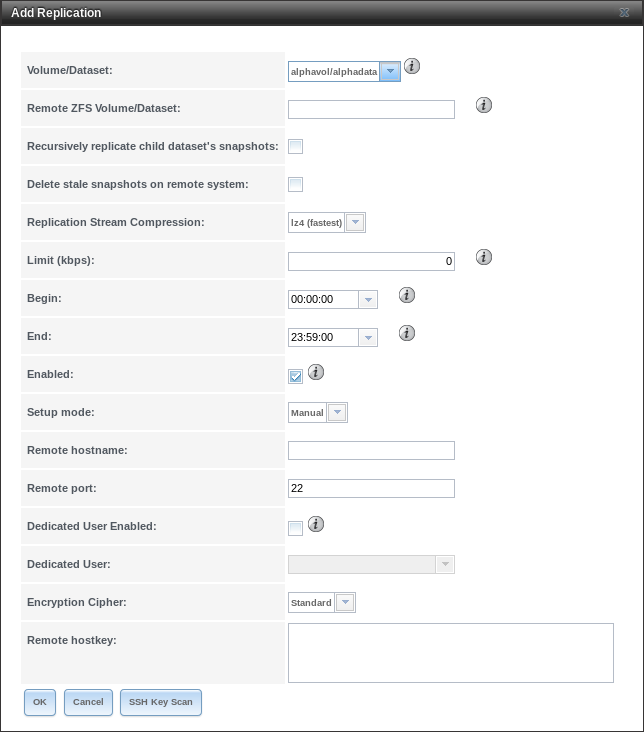

   Add Replication Dialog, Semi-Automatic

The :guilabel:`Remote Auth Token` field expects a special token from
the *Beta* computer. On *Beta*, choose
:menuselection:`Storage --> Replication Tasks`,
then click :guilabel:`Temporary Auth Token`. A dialog showing the
temporary authorization token is shown as in
:numref:`Figure %s <zfs_auth_token_fig>`.

Highlight the temporary authorization token string with the mouse and
copy it.

.. _zfs_auth_token_fig:

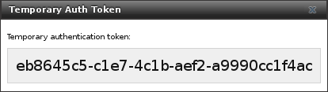

   Temporary Authentication Token on Destination

On the *Alpha* system, paste the copied temporary authorization token
string into the :guilabel:`Remote Auth Token` field as shown in
:numref:`Figure %s <zfs_auth_token_paste_fig>`.

.. _zfs_auth_token_paste_fig:

   Temporary Authentication Token Pasted to Source

Finally, click the :guilabel:`OK` button to create the replication
task. After each periodic snapshot is created, a replication task will
copy it to the destination system. See
:ref:`Limiting Replication Times` for information about restricting
when replication is allowed to run.

.. note::  The temporary authorization token is only valid for a few
   minutes. If a *Token is invalid* message is shown, get a new
   temporary authorization token from the destination system, clear
   the :guilabel:`Remote Auth Token` field, and paste in the new one.

Example: %brand% to %brand% Dedicated User Replication
~~~~~~~~~~~~~~~~~~~~~~~~~~~~~~~~~~~~~~~~~~~~~~~~~~~~~~~~~~~~~~~~~~~~~~~~~~

A *dedicated user* can be used for replications rather than the root
user. This example shows the process using the semi-automatic
replication setup between two %brand% systems with a dedicated user
named *repluser*. SSH key authentication is used to allow the user to
log in remotely without a password.

In this example, the periodic snapshot task has not been created yet.
If the periodic snapshot shown in the
:ref:`example configuration <replication_common_config>` has already
been created, go to
:menuselection:`Storage --> Periodic Snapshot Tasks`,
click on the task to select it, and click :guilabel:`Delete` to remove
it before continuing.

On *Alpha*, select
:menuselection:`Account --> Users`.
Click the :guilabel:`Add User`. Enter *repluser* for
:guilabel:`Username`, enter */mnt/alphavol/repluser* in the
:guilabel:`Create Home Directory In` field, enter
*Replication Dedicated User* for the :guilabel:`Full Name`, and set
the :guilabel:`Disable password login` option. Leave the other
fields at their default values, but note the :guilabel:`User ID`
number. Click :guilabel:`OK` to create the user.

On *Beta*, the same dedicated user must be created as was created on
the sending computer. Select
:menuselection:`Account --> Users`.
Click the :guilabel:`Add User`. Enter the *User ID* number from
*Alpha*, *repluser* for :guilabel:`Username`, enter
*/mnt/betavol/repluser* in the :guilabel:`Create Home Directory In`
field, enter *Replication Dedicated User* for the
:guilabel:`Full Name`, and set the :guilabel:`Disable password login`
option. Leave the other fields at their default values. Click
:guilabel:`OK` to create the user.

A dataset with the same name as the original must be created on the
destination computer, *Beta*. Select
:menuselection:`Storage --> Volumes`,
click on *betavol*, then click the :guilabel:`Create Dataset` icon at
the bottom. Enter *alphadata* as the :guilabel:`Dataset Name`, then
click :guilabel:`Add Dataset`.

The replication user must be given permissions to the destination
dataset. Still on *Beta*, open a :ref:`Shell` and enter this command:

.. code-block:: none

   zfs allow -ldu repluser create,destroy,diff,mount,readonly,receive,release,send,userprop betavol/alphadata

The destination dataset must also be set to read-only. Enter this
command in the :ref:`Shell`:

.. code-block:: none

   zfs set readonly=on betavol/alphadata

Close the :ref:`Shell` by typing :command:`exit` and pressing
:kbd:`Enter`.

The replication user must also be able to mount datasets. Still on
*Beta*, go to
:menuselection:`System --> Tunables`.
Click :guilabel:`Add Tunable`. Enter *vfs.usermount* for the
:guilabel:`Variable`, *1* for the :guilabel:`Value`, and choose
*Sysctl* from the :guilabel:`Type` drop-down. Click :guilabel:`OK` to
save the tunable settings.

Back on *Alpha*, create a periodic snapshot of the source dataset by
selecting
:menuselection:`Storage --> Periodic Snapshot Tasks`.
Click the *alphavol/alphadata* dataset to highlight it. Create a
:ref:`periodic snapshot <Periodic Snapshot Tasks>` of it by clicking
:guilabel:`Periodic Snapshot Tasks`, then
:guilabel:`Add Periodic Snapshot` as shown in
:numref:`Figure %s <zfs_create_periodic_replication_fig>`.

Still on *Alpha*, create the replication task by clicking
:guilabel:`Replication Tasks` and :guilabel:`Add Replication`.
*alphavol/alphadata* is selected as the dataset to replicate.
*betavol/alphadata* is the destination volume and dataset where
*alphadata* snapshots are replicated.

The :guilabel:`Setup mode` dropdown is set to *Semi-automatic* as
shown in
:numref:`Figure %s <zfs_create_repl2_fig>`.
The IP address of *Beta* is entered in the :guilabel:`Remote hostname`
field. A hostname can be entered here if local DNS resolves for that
hostname.

.. note:: If :guilabel:`WebGUI HTTP --> HTTPS Redirect` has been
   enabled in
   :menuselection:`System --> General`
   on the destination computer,
   :guilabel:`Remote HTTP/HTTPS Port` must be set to the HTTPS port
   (usually *443*) and :guilabel:`Remote HTTPS` must be enabled when
   creating the replication on the source computer.

The :guilabel:`Remote Auth Token` field expects a special token from
the *Beta* computer. On *Beta*, choose
:menuselection:`Storage --> Replication Tasks`,
then click :guilabel:`Temporary Auth Token`. A dialog showing the
temporary authorization token is shown as in
:numref:`Figure %s <zfs_auth_token_fig>`.

Highlight the temporary authorization token string with the mouse and
copy it.

On the *Alpha* system, paste the copied temporary authorization token
string into the :guilabel:`Remote Auth Token` field as shown in
:numref:`Figure %s <zfs_auth_token_paste_fig>`.

Set the :guilabel:`Dedicated User` option. Choose *repluser* in the
:guilabel:`Dedicated User` drop-down.

Click the :guilabel:`OK` button to create the replication task.

.. note::  The temporary authorization token is only valid for a few
   minutes. If a *Token is invalid* message is shown, get a new
   temporary authorization token from the destination system, clear
   the :guilabel:`Remote Auth Token` field, and paste in the new one.

#ifdef comment
Still on *Alpha*, click on the :guilabel:`View Public Key` button at
the top of the :guilabel:`Replication Tasks` screen. Copy the key
value with the mouse.

This might not be necessary with semi-auto replication
On *Beta*, select
:menuselection:`Account --> Users`. Click the *repluser* line to
select it, then click :guilabel:`Modify User`. Paste the value in the
:guilabel:`SSH Public Key` field. (overwrite existing if present?)\
#endif comment

Replication will begin when the periodic snapshot task runs.

Additional replications can use the same dedicated user that has
already been set up. The permissions and read only settings made
through the :ref:`Shell` must be set on each new destination dataset.

Example: %brand% to %brand% or Other Systems, Manual Setup
~~~~~~~~~~~~~~~~~~~~~~~~~~~~~~~~~~~~~~~~~~~~~~~~~~~~~~~~~~~~~~~~~~~~~~~~~~~~~~

This example uses the same basic configuration of source and
destination computers shown above, but the destination computer is not
required to be a %brand% system. Other operating systems can receive
the replication if they support SSH, ZFS, and the same features that
are in use on the source system. The details of creating volumes and
datasets, enabling SSH, and copying encryption keys will vary when the
destination computer is not a %brand% system.

Encryption Keys
^^^^^^^^^^^^^^^

A public encryption key must be copied from *Alpha* to *Beta* to
allow a secure connection without a password prompt. On *Alpha*,
select
:menuselection:`Storage --> Replication Tasks --> View Public Key`,
producing the window shown in
:numref:`Figure %s <zfs_copy_replication_key_fig>`.
Use the mouse to highlight the key data shown in the window, then copy
it.

.. _zfs_copy_replication_key_fig:

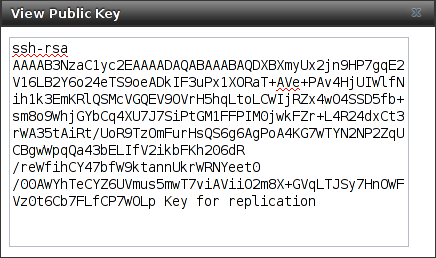

   Copy the Replication Key

On *Beta*, select
:menuselection:`Account --> Users --> View Users`. Click the *root*
account to select it, then click :guilabel:`Modify User`. Paste the
copied key into the :guilabel:`SSH Public Key` field and click
:guilabel:`OK` as shown in
:numref:`Figure %s <zfs_paste_replication_key_fig>`.

.. _zfs_paste_replication_key_fig:

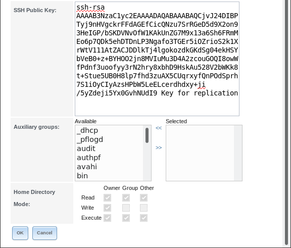

   Paste the Replication Key

Back on *Alpha*, create the replication task by clicking
:guilabel:`Replication Tasks` and :guilabel:`Add Replication`.
*alphavol/alphadata* is selected as the dataset to replicate. The
destination volume is *betavol*. The *alphadata* dataset and snapshots
are replicated there. The IP address of *Beta* is entered in the
:guilabel:`Remote hostname` field as shown in
:numref:`Figure %s <zfs_create_repl1_fig>`.
A hostname can be entered here if local DNS resolves for that
hostname.

Click the :guilabel:`SSH Key Scan` button to retrieve the
SSH host keys from *Beta* and fill the :guilabel:`Remote hostkey`
field. Finally, click :guilabel:`OK` to create the replication task.
After each periodic snapshot is created, a replication task will copy
it to the destination system. See :ref:`Limiting Replication Times`
for information about restricting when replication is allowed to run.

.. _zfs_create_repl1_fig:

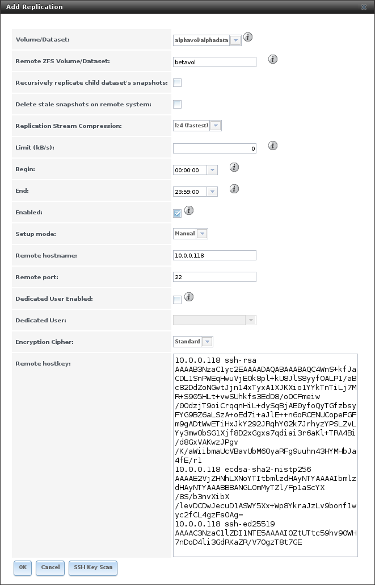

   Add Replication Dialog

Replication Options
~~~~~~~~~~~~~~~~~~~

:numref:`Table %s <zfs_add_replication_task_opts_tab>` describes the
options in the replication task dialog.

.. tabularcolumns:: |>{\RaggedRight}p{\dimexpr 0.25\linewidth-2\tabcolsep}
                    |>{\RaggedRight}p{\dimexpr 0.12\linewidth-2\tabcolsep}
                    |>{\RaggedRight}p{\dimexpr 0.63\linewidth-2\tabcolsep}|

.. _zfs_add_replication_task_opts_tab:

.. table:: Replication Task Options
   :class: longtable

   +-----------------------+--------------+--------------------------------------------------------------------------------------------------------------+
   | Setting               | Value        | Description                                                                                                  |
   |                       |              |                                                                                                              |
   +=======================+==============+==============================================================================================================+
   | Volume/Dataset        | drop-down    | On the source computer with snapshots to replicate, choose an existing ZFS pool or dataset with an           |
   |                       | menu         | active periodic snapshot task.                                                                               |
   |                       |              |                                                                                                              |
   +-----------------------+--------------+--------------------------------------------------------------------------------------------------------------+
   | Remote ZFS            | string       | Enter the ZFS volume or dataset on the remote or destination computer which will store the snapshots.        |
   | Volume/Dataset        |              | Example: poolname/datasetname, not the mount point or filesystem path.                                       |
   |                       |              |                                                                                                              |
   +-----------------------+--------------+--------------------------------------------------------------------------------------------------------------+
   | Recursively           | checkbox     | When enabled, include snapshots of child datasets from the primary dataset.                                  |
   | replicate child       |              |                                                                                                              |
   | dataset snapshots     |              |                                                                                                              |
   +-----------------------+--------------+--------------------------------------------------------------------------------------------------------------+
   | Delete stale          | checkbox     | Set to delete previous snapshots from the remote or destination system                                       |
   | snapshots             |              | which are no longer present on the source computer.                                                          |
   |                       |              |                                                                                                              |
   +-----------------------+--------------+--------------------------------------------------------------------------------------------------------------+
   | Replication Stream    | drop-down    | Choices are *lz4 (fastest)*, *pigz (all rounder)*, *plzip (best compression)*, or *Off* (no compression).    |
   | Compression           | menu         | Selecting a compression algorithm can reduce the size of the data being replicated.                          |
   |                       |              |                                                                                                              |
   +-----------------------+--------------+--------------------------------------------------------------------------------------------------------------+
   | Limit (kbps)          | integer      | Limit replication speed to the specified value in kilobits/second.                                           |
   |                       |              | Default of *0* is unlimited.                                                                                 |
   +-----------------------+--------------+--------------------------------------------------------------------------------------------------------------+
   | Begin                 | drop-down    | Define a time to start the replication task.                                                                 |
   |                       | menu         |                                                                                                              |
   |                       |              |                                                                                                              |
   +-----------------------+--------------+--------------------------------------------------------------------------------------------------------------+
   | End                   | drop-down    | Define the point in time by which replication must start.                                                    |
   |                       | menu         | A started replication task conitinues until it is finished.                                                  |
   |                       |              |                                                                                                              |
   +-----------------------+--------------+--------------------------------------------------------------------------------------------------------------+
   | Enabled               | checkbox     | Deselect to disable the scheduled replication task without deleting it.                                      |
   |                       |              |                                                                                                              |
   +-----------------------+--------------+--------------------------------------------------------------------------------------------------------------+
   | Setup mode            | drop-down    | Choose the configuration mode for the remote.                                                                |
   |                       | menu         | Choices are *Manual* or *Semi-automatic*.                                                                    |
   |                       |              | Note semi-automatic only works with remote version 9.10.2 or later.                                          |
   +-----------------------+--------------+--------------------------------------------------------------------------------------------------------------+
   | Remote hostname       | string       | Enter the IP address or DNS name of remote system to receive the replication data.                           |
   |                       |              |                                                                                                              |
   +-----------------------+--------------+--------------------------------------------------------------------------------------------------------------+
   | Remote port           | string       | Enter the port number used by the SSH server on the remote or destination computer.                          |
   |                       |              |                                                                                                              |
   +-----------------------+--------------+--------------------------------------------------------------------------------------------------------------+
   | Dedicated User        | checkbox     | Select the user account other than root to be used for replication.                                          |
   | Enabled               |              |                                                                                                              |
   +-----------------------+--------------+--------------------------------------------------------------------------------------------------------------+
   | Dedicated User        | drop-down    | Only available if :guilabel:`Dedicated User Enabled` is enabled.                                             |
   |                       | menu         | Select the user account to be used for replication.                                                          |
   +-----------------------+--------------+--------------------------------------------------------------------------------------------------------------+
   | Encryption Cipher     | drop-down    | *Standard*, *Fast*, or *Disabled*.                                                                           |
   |                       | menu         |                                                                                                              |
   +-----------------------+--------------+--------------------------------------------------------------------------------------------------------------+
   | Remote hostkey        | string       | Click :guilabel:`SSH Key Scan` to retrieve the public host key of the remote or destination                  |
   |                       |              | computer and populate this field with that key.                                                              |
   +-----------------------+--------------+--------------------------------------------------------------------------------------------------------------+

The replication task runs after a new periodic snapshot is created.
The periodic snapshot and any new manual snapshots of the same dataset
are replicated onto the destination computer.

When multiple replications have been created, replication tasks run
serially, one after another. Completion time depends on the number and
size of snapshots and the bandwidth available between the source and
destination computers.

The first time a replication runs, it must duplicate data structures
from the source to the destination computer. This can take much longer
to complete than subsequent replications, which only send differences
in data.

.. warning:: Snapshots record incremental changes in data. If the
   receiving system does not have at least one snapshot that can be
   used as a basis for the incremental changes in the snapshots from
   the sending system, there is no way to identify only the data that
   has changed. In this situation, the snapshots in the receiving
   system target dataset are removed so a complete initial copy of the
   new replicated data can be created.

Selecting
:menuselection:`Storage --> Replication Tasks` displays
:numref:`Figure %s <zfs_repl_task_list_fig>`, the list of
replication tasks. The :guilabel:`Last snapshot sent to remote side`
column shows the name of the last snapshot that was successfully
replicated, and :guilabel:`Status` shows the current status of each
replication task. The display is updated every five seconds, always
showing the latest status.

.. _zfs_repl_task_list_fig:

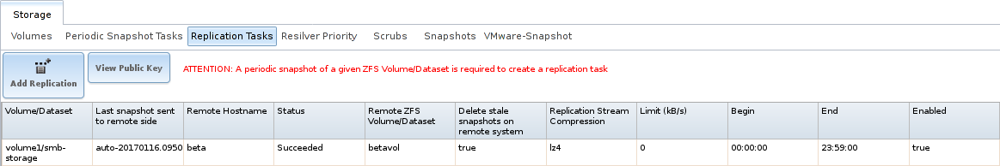

   Replication Task List

.. note:: The encryption key that was copied from the source computer
   (*Alpha*) to the destination computer (*Beta*) is an RSA public
   key located in the :file:`/data/ssh/replication.pub` file on the
   source computer. The host public key used to identify the
   destination computer (*Beta*) is from the
   :file:`/etc/ssh/ssh_host_rsa_key.pub` file on the destination
   computer.

.. _Replication Encryption:

Replication Encryption
~~~~~~~~~~~~~~~~~~~~~~

The default :guilabel:`Encryption Cipher` *Standard* setting provides
good security. *Fast* is less secure than *Standard* but can give
reasonable transfer rates for devices with limited cryptographic
speed. For networks where the entire path between source and
destination computers is trusted, the *Disabled* option can be chosen
to send replicated data without encryption.

.. _Limiting Replication Times:

Limiting Replication Times
~~~~~~~~~~~~~~~~~~~~~~~~~~

The :guilabel:`Begin` and :guilabel:`End` times in a replication task
make it possible to restrict when replication is allowed. These times
can be set to only allow replication after business hours, or at other
times when disk or network activity will not slow down other
operations like snapshots or :ref:`Scrubs`. The default settings allow
replication to occur at any time.

These times control when replication task are allowed to start, but
will not stop a replication task that is already running. Once a
replication task has begun, it will run until finished.

#ifdef truenas
.. _Replication Topolgies and Scenarios:

Replication Topologies and Scenarios
~~~~~~~~~~~~~~~~~~~~~~~~~~~~~~~~~~~~

The replication examples shown above are known as *simple* or *A to B*
replication, where one machine replicates data to one other machine.
Replication can also be set up in more sophisticated topologies to
suit various purposes and needs.

.. _Star Replication:

Star Replication
^^^^^^^^^^^^^^^^

In a *star* topology, a single %brand% computer replicates data to
multiple destination computers. This can provide data redundancy with
the multiple copies of data, and geographical redundancy if the
destination computers are located at different sites.

An *Alpha* computer with three separate replication tasks to replicate
data to *Beta*, then *Gamma*, and finally *Delta* computers
demonstrates this arrangement. *A to B* replication is really just a
star arrangement with only one target computer.

The star topology is simple to configure and manage, but it can place
relatively high I/O and network loads on the source computer, which
must run an individual replication task for each target computer.

Tiered Replication
^^^^^^^^^^^^^^^^^^

In *tiered* replication, the data is replicated from the source
computer onto one or a few destination computers. The destination
computers then replicate the same data onto other computers. This
allows much of the network and I/O load to be shifted away from the
source computer.

For example, consider both *Alpha* and *Beta* computers to be located
inside the same data center. Replicating data from *Alpha* to *Beta*
does not protect that data from events that would involve the whole
data center, like flood, fire, or earthquake. Two more computers,
called *Gamma* and *Delta*, are set up. To provide geographic
redundancy, *Gamma* is in a data center on the other side of the
country, and *Delta* is in a data center on another continent. A
single periodic snapshot replicates data from *Alpha* to *Beta*.
*Beta* then replicates the data onto *Gamma*, and again onto *Delta*.

Tiered replication shifts most of the network and I/O overhead of
repeated replication off the source computer onto the target
computers. The source computer only replicates to the second-tier
computers, which then handle replication to the third tier, and so on.
In this example, *Alpha* only replicates data onto *Beta*. The I/O and
network load of repeated replications is shifted onto *Beta*.

N-way Replication
^^^^^^^^^^^^^^^^^

*N-way* replication topologies recognize that hardware is sometimes
idle, and computers can be used for more than a single dedicated
purpose. An individual computer can be used as both a source and
destination for replication. For example, the *Alpha* system can
replicate a dataset to *Beta*, while *Beta* can replicate datasets to
both *Alpha* and *Gamma*.

With careful setup, this topology can efficiently use I/O, network
bandwidth, and computers, but can quickly become complex to manage.

Disaster Recovery
^^^^^^^^^^^^^^^^^

*Disaster recovery* is the ability to recover complete datasets from a
replication destination computer. The replicated dataset is replicated
back to new hardware after an incident caused the source computer to
fail.

Recovering data onto a replacement computer can be done manually with
the :command:`zfs send` and :command:`zfs recv` commands, or a
replication task can be defined on the target computer containing the
backup data. This replication task would normally be disabled.
If a disaster damages the source computer, the target computer's
replication task is temporarily enabled, replicating the data onto the
replacement source computer. After the disaster recovery replication
completes, the replication task on the target computer is disabled
again.
#endif truenas

.. _Troubleshooting Replication:

Troubleshooting Replication
~~~~~~~~~~~~~~~~~~~~~~~~~~~

Replication depends on SSH, disks, network, compression, and
encryption to work. A failure or misconfiguration of any of these can
prevent successful replication.

SSH
^^^

:ref:`SSH` must be able to connect from the source system to the
destination system with an encryption key. This can be tested from
:ref:`Shell` by making an :ref:`SSH` connection from the source
system to the destination system. From the previous example, this is a
connection from *Alpha* to *Beta* at *10.0.0.118*.
Start the :ref:`Shell` on the source machine (*Alpha*), then enter
this command:

.. code-block:: none

   ssh -vv -i /data/ssh/replication 10.0.0.118

On the first connection, the system might say

.. code-block:: none

   No matching host key fingerprint found in DNS.
   Are you sure you want to continue connecting (yes/no)?

Verify that this is the correct destination computer from the
preceding information on the screen and type :literal:`yes`. At this
point, an :ref:`SSH` shell connection is open to the destination
system, *Beta*.

If a password is requested, SSH authentication is not working. See
:numref:`Figure %s <zfs_copy_replication_key_fig>` above. This key
value must be present in the :file:`/root/.ssh/authorized_keys` file
on *Beta*, the destination computer. The :file:`/var/log/auth.log`
file can show diagnostic errors for login problems on the destination
computer also.

Compression
^^^^^^^^^^^

Matching compression and decompression programs must be available on
both the source and destination computers. This is not a problem when
both computers are running %brand%, but other operating systems might
not have *lz4*, *pigz*, or *plzip* compression programs installed by
default. An easy way to diagnose the problem is to set
:guilabel:`Replication Stream Compression` to *Off*. If the
replication runs, select the preferred compression method and check
:file:`/var/log/debug.log` on the %brand% system for errors.

Manual Testing
^^^^^^^^^^^^^^

On *Alpha*, the source computer, the :file:`/var/log/messages` file
can also show helpful messages to locate the problem.

On the source computer, *Alpha*, open a :ref:`Shell` and manually send
a single snapshot to the destination computer, *Beta*. The snapshot
used in this example is named :file:`auto-20161206.1110-2w`. As
before, it is located in the *alphavol/alphadata* dataset. A
:literal:`@` symbol separates the name of the dataset from the name of
the snapshot in the command.

.. code-block:: none

   zfs send alphavol/alphadata@auto-20161206.1110-2w | ssh -i /data/ssh/replication 10.0.0.118 zfs recv betavol

If a snapshot of that name already exists on the destination computer,
the system will refuse to overwrite it with the new snapshot. The
existing snapshot on the destination computer can be deleted by
opening a :ref:`Shell` on *Beta* and running this command:

.. code-block:: none

   zfs destroy -R betavol/alphadata@auto-20161206.1110-2w

Then send the snapshot manually again. Snapshots on the destination
system, *Beta*, can be listed from the :ref:`Shell` with
:samp:`zfs list -t snapshot` or by going to
:menuselection:`Storage --> Snapshots`.

Error messages here can indicate any remaining problems.

.. index:: Resilver Priority
.. _Resilver Priority:

Resilver Priority
-----------------

Resilvering, or the process of copying data to a replacement disk, is
best completed as quickly as possible. Increasing the priority of
resilvers can help them to complete more quickly. The
:guilabel:`Resilver Priority` tab makes it possible to increase the
priority of resilvering at times where the additional I/O or CPU usage
will not affect normal usage. Select
:menuselection:`Storage --> Resilver Priority`
to display the screen shown in
:numref:`Figure %s <storage_resilver_pri_fig>`.
:numref:`Table %s <storage_resilver_pri_opts_tab>`
describes the fields on this screen.

.. _storage_resilver_pri_fig:

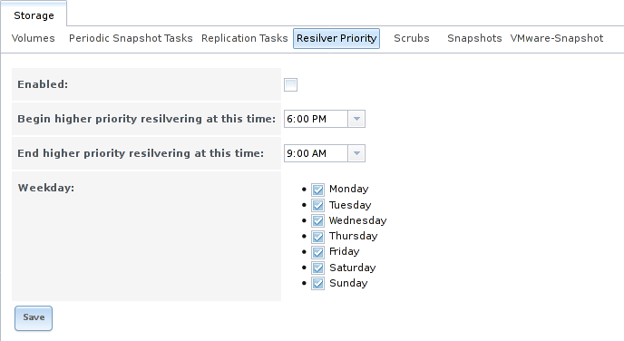

   Resilver Priority

.. tabularcolumns:: |>{\RaggedRight}p{\dimexpr 0.3\linewidth-2\tabcolsep}
                    |>{\RaggedRight}p{\dimexpr 0.2\linewidth-2\tabcolsep}
                    |>{\RaggedRight}p{\dimexpr 0.5\linewidth-2\tabcolsep}|

.. _storage_resilver_pri_opts_tab:

.. table:: Resilver Priority Options
   :class: longtable

   +-------------------------+-------------+---------------------------------------------------------------+
   | Setting                 | Value       | Description                                                   |
   |                         |             |                                                               |
   +=========================+=============+===============================================================+
   | Enabled                 | checkbox    | Set to enable higher-priority resilvering.                    |
   |                         |             |                                                               |
   +-------------------------+-------------+---------------------------------------------------------------+
   | Begin higher            | drop-down   | Start time to begin higher-priority resilvering.              |
   | priority resilvering    |             |                                                               |
   | at this time            |             |                                                               |
   |                         |             |                                                               |
   +-------------------------+-------------+---------------------------------------------------------------+
   | End higher priority     | drop-down   | End time to begin higher-priority resilvering.                |
   | resilvering at this     |             |                                                               |
   | time                    |             |                                                               |
   |                         |             |                                                               |
   +-------------------------+-------------+---------------------------------------------------------------+
   | Weekday                 | checkboxes  | Use higher-priority resilvering on these days of the week.    |
   |                         |             |                                                               |
   +-------------------------+-------------+---------------------------------------------------------------+

.. index:: Scrub
.. _Scrubs:

Scrubs
----------

A scrub is the process of ZFS scanning through the data on a volume.
Scrubs help to identify data integrity problems, detect silent data
corruptions caused by transient hardware issues, and provide early
alerts of impending disk failures. %brand% makes it easy to schedule
periodic automatic scrubs.

Each volume should be scrubbed at least once a month.
Bit errors in critical data can be detected by ZFS, but only when that
data is read. Scheduled scrubs can find bit errors in rarely-read data.
The amount of time needed for a scrub is proportional to the quantity of
data on the volume. Typical scrubs take several hours or longer.

The scrub process is I/O intensive and can negatively impact
performance. Schedule scrubs for evenings or weekends to minimize
impact to users. Make certain that scrubs and other disk-intensive
activity like :ref:`S.M.A.R.T. Tests` are scheduled to run on
different days to avoid disk contention and extreme performance
impacts.

Scrubs only check used disk space. To check unused disk space,
schedule :ref:`S.M.A.R.T. Tests` of :guilabel:`Type` *Long Self-Test*
to run once or twice a month.

Scrubs are scheduled and managed with
:menuselection:`Storage --> Scrubs`.

When a volume is created, a ZFS scrub is automatically scheduled. An
entry with the same volume name is added to
:menuselection:`Storage --> Scrubs`.
A summary of this entry can be viewed with
:menuselection:`Storage --> Scrubs --> View Scrubs`.
:numref:`Figure %s <zfs_view_volume_scrub_fig>`
displays the default settings for the volume named :file:`volume1`. In
this example, the entry has been highlighted and the :guilabel:`Edit`
button clicked to display the :guilabel:`Edit` screen.
:numref:`Table %s <zfs_scrub_opts_tab>`
summarizes the options in this screen.

.. _zfs_view_volume_scrub_fig:

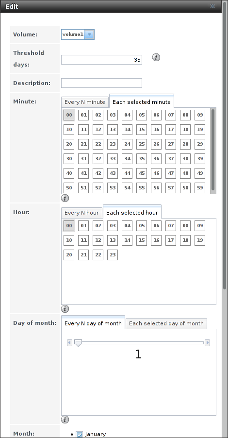

   Viewing Volume Default Scrub Settings

.. tabularcolumns:: |>{\RaggedRight}p{\dimexpr 0.16\linewidth-2\tabcolsep}
                    |>{\RaggedRight}p{\dimexpr 0.16\linewidth-2\tabcolsep}
                    |>{\RaggedRight}p{\dimexpr 0.66\linewidth-2\tabcolsep}|

.. _zfs_scrub_opts_tab:

.. table:: ZFS Scrub Options
   :class: longtable

   +----------------+---------------------+-------------------------------------------------------------------------------------------------------------+
   | Setting        | Value               | Description                                                                                                 |
   |                |                     |                                                                                                             |
   +================+=====================+=============================================================================================================+
   | Volume         | drop-down menu      | Choose a volume to be scrubbed.                                                                             |
   |                |                     |                                                                                                             |
   +----------------+---------------------+-------------------------------------------------------------------------------------------------------------+
   | Threshold      | integer             | Define the number of days to prevent a scrub from running after the last has completed.                     |
   | days           |                     | This ignores any other calendar schedule.                                                                   |
   |                |                     | The default is a multiple of 7 to ensure that the scrub always occurs on the same day of the week.          |
   |                |                     |                                                                                                             |
   +----------------+---------------------+-------------------------------------------------------------------------------------------------------------+
   | Description    | string              | Optional text description of scrub.                                                                         |
   |                |                     |                                                                                                             |
   +----------------+---------------------+-------------------------------------------------------------------------------------------------------------+
   | Minute         | slider or minute    | If the slider is used, a scrub occurs every N minutes.                                                      |
   |                | selections          | If specific minutes are chosen, a scrub runs only at the selected minute values.                            |
   |                |                     |                                                                                                             |
   +----------------+---------------------+-------------------------------------------------------------------------------------------------------------+
   | Hour           | slider or hour      | If the slider is used, a scrub occurs every N hours.                                                        |
   |                | selections          | If specific hours are chosen, a scrub runs only at the selected hour values.                                |
   |                |                     |                                                                                                             |
   +----------------+---------------------+-------------------------------------------------------------------------------------------------------------+
   | Day of         | slider or month     | If the slider is used, a scrub occurs every N days.                                                         |
   | Month          | selections          | If specific days of the month are chosen, a scrub runs only on the selected days of the selected months.    |
   |                |                     |                                                                                                             |
   +----------------+---------------------+-------------------------------------------------------------------------------------------------------------+
   | Month          | checkboxes          | Define the day of the month to run the scrub.                                                               |
   |                |                     |                                                                                                             |
   +----------------+---------------------+-------------------------------------------------------------------------------------------------------------+
   | Day of         | checkboxes          | A scrub occurs on the selected days.                                                                        |
   | week           |                     | The default is *Sunday* to least impact users.                                                              |
   |                |                     | Note that this field and the :guilabel:`Day of Month` field are ORed together:                              |
   |                |                     | setting :guilabel:`Day of Month` to *01,15* and :guilabel:`Day of week` to *Thursday* will cause scrubs     |
   |                |                     | to run on the 1st and 15th days of the month, but also on any Thursday.                                     |
   |                |                     |                                                                                                             |
   +----------------+---------------------+-------------------------------------------------------------------------------------------------------------+
   | Enabled        | checkbox            | Unset to disable the scheduled scrub without deleting it.                                                   |
   |                |                     |                                                                                                             |
   +----------------+---------------------+-------------------------------------------------------------------------------------------------------------+

Review the default selections and, if necessary, modify them to meet
the needs of the environment. Note that the :guilabel:`Threshold`
field is used to prevent scrubs from running too often, and overrides
the schedule chosen in the other fields. Also, if a pool is locked or
unmounted when a scrub is scheduled to occur, it will not be scrubbed.

Scheduled scrubs can be deleted with the :guilabel:`Delete` button, but
this is not recommended. **Scrubs can provide an early indication of
disk issues before a disk failure.** If a scrub is too intensive for
the hardware, consider temporarily deselecting the :guilabel:`Enabled`
button for the scrub until the hardware can be upgraded.

.. index:: Snapshots
.. _Snapshots:

Snapshots
-------------

Snapshots are scheduled using
:menuselection:`Storage --> Periodic Snapshot Tasks`. To view and
manage the listing of created snapshots, use
:menuselection:`Storage --> Snapshots`. An example listing is shown in
:numref:`Figure %s <zfs_view_avail_snapshots_fig>`.

.. note:: If snapshots do not appear, check that the current time
   configured in :ref:`Periodic Snapshot Tasks` does not conflict with
   the :guilabel:`Begin`, :guilabel:`End`, and :guilabel:`Interval`
   settings. If the snapshot was attempted but failed, an entry is
   added to :file:`/var/log/messages`. This log file can be viewed in
   :ref:`Shell`.

.. _zfs_view_avail_snapshots_fig:

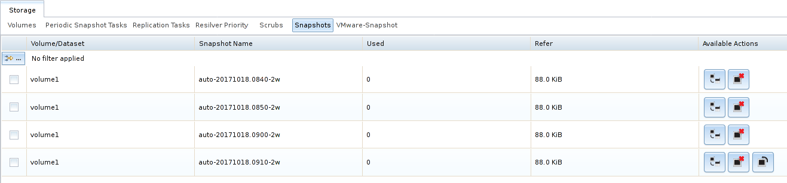

   Viewing Available Snapshots

The listing includes the name of the volume or dataset, the name
of each snapshot, and the amount of used and referenced data.

**Used** is the amount of space consumed by this dataset and all of
its descendants. This value is checked against the dataset quota and
reservation. The space used does not include the dataset
reservation, but does take into account the reservations of any
descendent datasets. The amount of space that a dataset consumes from
its parent, as well as the amount of space that are freed if this
dataset is recursively destroyed, is the greater of its space used and
its reservation. When a snapshot is created, the space is initially
shared between the snapshot and the filesystem, and possibly with
previous snapshots. As the filesystem changes, space that was
previously shared becomes unique to the snapshot, and is counted in
the used space of the snapshot. Additionally, deleting snapshots can
increase the amount of space unique to (and used by) other snapshots.
The amount of space used, available, or referenced does not take into
account pending changes. While pending changes are generally accounted
for within a few seconds, disk changes do not necessarily guarantee
that the space usage information is updated immediately.

.. tip:: Space used by individual snapshots can be seen by running
   :samp:`zfs list -t snapshot` from :ref:`Shell`.

**Refer** indicates the amount of data accessible by this dataset,
which may or may not be shared with other datasets in the pool. When a
snapshot or clone is created, it initially references the same amount
of space as the filesystem or snapshot it was created from, since its
contents are identical.

Snapshots have icons on the right side for several actions.

**Clone Snapshot** prompts for the name of the clone to create. A
clone is a writable copy of the snapshot. Since a clone is actually a
dataset which can be mounted, it appears in the :guilabel:`Volumes`
tab rather than the :guilabel:`Snapshots` tab. By default,
:literal:`-clone` is added to the name of a snapshot when a clone is
created.

**Destroy Snapshot** a pop-up message asks for confirmation. Child
clones must be destroyed before their parent snapshot can be
destroyed. While creating a snapshot is instantaneous, deleting a
snapshot can be I/O intensive and can take a long time, especially
when deduplication is enabled. To delete a block in a
snapshot, ZFS has to walk all the allocated blocks to see if that
block is used anywhere else. If it is not used, it can be freed.

The most recent snapshot also has a **Rollback Snapshot** icon.
Clicking the icon asks for confirmation before rolling back to this
snapshot state. Confirming by clicking :guilabel:`Yes` causes any
files that have changed since the snapshot was taken to be reverted
back to their state at the time of the snapshot.

.. note:: Rollback is a potentially dangerous operation and causes
   any configured replication tasks to fail as the replication system
   uses the existing snapshot when doing an incremental backup. To
   restore the data within a snapshot, the recommended steps are:

   #.  Clone the desired snapshot.

   #.  Share the clone with the share type or service running on the
       %brand% system.

   #.  After users have recovered the needed data, destroy the clone
       in the :guilabel:`Active Volumes` tab.

   This approach does not destroy any on-disk data and has no impact
   on replication.

A range of snapshots can be selected with the mouse. Click on the
option in the left column of the first snapshot, then press and hold
:kbd:`Shift` and click on the option for the end snapshot. This can
be used to select a range of obsolete snapshots to be deleted with the
:guilabel:`Destroy` icon at the bottom. Be cautious and careful when
deleting ranges of snapshots.

Periodic snapshots can be configured to appear as shadow copies in
newer versions of Windows Explorer, as described in
:ref:`Configuring Shadow Copies`. Users can access the files in the
shadow copy using Explorer without requiring any interaction with the
%brand% graphical administrative interface.

The ZFS Snapshots screen allows the creation of filters to view
snapshots by selected criteria. To create a filter, click the
:guilabel:`Define filter` icon
(near the text :guilabel:`No filter applied`). When creating a filter:

* Select the column or leave the default of :guilabel:`Any Column`.

* Select the condition. Possible conditions are: *contains* (default),
  *is*, *starts with*, *ends with*, *does not contain*, *is not*,
  *does not start with*, *does not end with*, and *is empty*.

* Enter a value that meets the view criteria.

* Click the :guilabel:`Filter` button to save the filter and exit the
  define filter screen. Alternately, click the :guilabel:`+` button to
  add another filter.

When creating multiple filters, select the filter to use before
leaving the define filter screen. After a filter is selected, the
:guilabel:`No filter applied` text changes to
:guilabel:`Clear filter`. Clicking :guilabel:`Clear filter` produces a
pop-up message indicates that this removes the filter and all
available snapshots are listed.

.. warning:: A snapshot and any files it contains will not be accessible
   or searchable if the mount path of the snapshot is longer than 88 ascii
   characters. The data within the snapshot will be safe, and the
   snapshot will become accessible again when the mount path is shortened.
   For details of this limitation, and how to shorten a long mount path,
   see :ref:`Path and Name Lengths`.

Browsing a snapshot collection
~~~~~~~~~~~~~~~~~~~~~~~~~~~~~~

All snapshots for a dataset are accessible as an ordinary hierarchical
filesystem, which can be reached from a hidden :file:`.zfs` file located
at the root of every dataset. A user with permission to access that file
can view and explore all snapshots for a dataset like any other files -
from the :command:`CLI` or via :menuselection:`File Sharing` services
such as :menuselection:`Samba`, :menuselection:`NFS` and
:menuselection:`FTP`. This is an advanced capability which requires some
:command:`command line` actions to achieve. In summary, the main changes
to settings that are required are:

* Snapshot visibility must be manually enabled in the ZFS properties of
  the dataset.

* In Samba auxiliary settings, the :command:`veto files` command must be
  modified to not hide the :file:`.zfs` file, and the setting
  :command:`zfsacl:expose_snapdir=true` must be added.

The effect will be that any user who can access the dataset contents,
will also be able to view the list of snapshots by navigating to the
:file:`.zfs` directory of the dataset, and to browse and search any
files they have permission to access throughout the entire snapshot
collection of the dataset. A user's ability to view files within a
snapshot will be limited by any permissions or ACLs set on the files
when the snapshot was taken. Snapshots are fixed as "read-only",
so this access does not permit the user to change any files in the
snapshots, or to modify or delete any snapshot, even if they had write
permission at the time when the snapshot was taken.

.. note:: ZFS has a :command:`zfs diff` command which can list the files
   that have changed between any two snapshot versions within a dataset,
   or between any snapshot and the current data.

.. index:: VMware Snapshot
.. _VMware-Snapshot:

VMware-Snapshot
---------------

:menuselection:`Storage --> VMware-Snapshot`
is used to coordinate ZFS snapshots when using %brand% as a VMware
datastore. Once this type of snapshot is created, %brand% will
automatically snapshot any running VMware virtual machines before
taking a scheduled or manual ZFS snapshot of the dataset or zvol
backing that VMware datastore. The temporary VMware snapshots are then
deleted on the VMware side but still exist in the ZFS snapshot and can
be used as stable resurrection points in that snapshot.  These
coordinated snapshots will be listed in :ref:`Snapshots`.

:numref:`Figure %s <zfs_add_vmware_snapshot_fig>`
shows the menu for adding a VMware snapshot and
:numref:`Table %s <zfs_vmware_snapshot_opts_tab>`
summarizes the available options.

.. _zfs_add_vmware_snapshot_fig:

.. figure:: images/vmware1a.png

   Adding a VMware Snapshot

.. tabularcolumns:: |>{\RaggedRight}p{\dimexpr 0.16\linewidth-2\tabcolsep}
                    |>{\RaggedRight}p{\dimexpr 0.20\linewidth-2\tabcolsep}
                    |>{\RaggedRight}p{\dimexpr 0.63\linewidth-2\tabcolsep}|

.. _zfs_vmware_snapshot_opts_tab:

.. table:: VMware Snapshot Options
   :class: longtable

   +-------------------+--------------+----------------------------------------------------------------------------------------------------------------+
   | Setting           | Value        | Description                                                                                                    |
   |                   |              |                                                                                                                |
   +===================+==============+================================================================================================================+
   | Hostname          | string       | Enter the IP address or hostname of VMware host.                                                               |
   |                   |              | When clustering, this is the vCenter server for the cluster.                                                   |
   |                   |              |                                                                                                                |
   +-------------------+--------------+----------------------------------------------------------------------------------------------------------------+
   | Username          | string       | Enter the username on the VMware host with permission to snapshot virtual machines.                            |
   |                   |              |                                                                                                                |
   +-------------------+--------------+----------------------------------------------------------------------------------------------------------------+
   | Password          | string       | Enter the password associated with :guilabel:`Username`.                                                       |
   |                   |              |                                                                                                                |
   +-------------------+--------------+----------------------------------------------------------------------------------------------------------------+
   | ZFS Filesystem    | drop-down    | Select the filesystem to snapshot.                                                                             |
   |                   | menu         |                                                                                                                |
   |                   |              |                                                                                                                |
   +-------------------+--------------+----------------------------------------------------------------------------------------------------------------+
   | Datastore         | drop-down    | Enter the :guilabel:`Hostname`, :guilabel:`Username`, and :guilabel:`Password`.                                |
   |                   | menu         | Click :guilabel:`Fetch Datastores` to populate the menu and select the datastore with which to synchronize.    |
   |                   |              |                                                                                                                |
   +-------------------+--------------+----------------------------------------------------------------------------------------------------------------+
