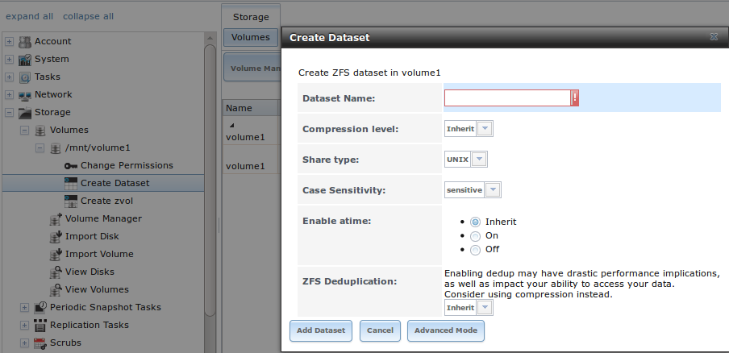
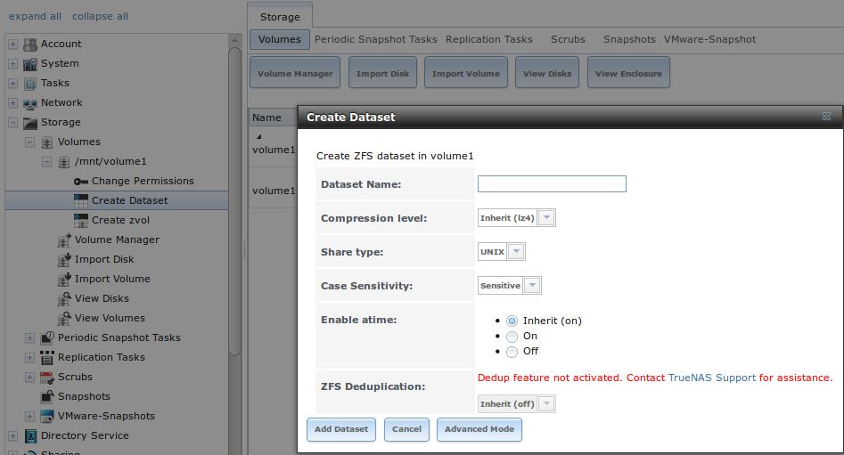
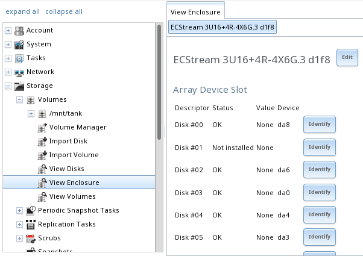

.. _Storage:

Storage
=======

The Storage section of the graphical interface allows configuration of
these options:

* :ref:`Volumes`: used to create and manage storage volumes.

* :ref:`Periodic Snapshot Tasks`: used to schedule the automatic
  creation of filesystem snapshots.

* :ref:`Replication Tasks`: used to schedule the replication of
  snapshots to a remote system.

* :ref:`Scrubs`: used to schedule scrubs as part of ongoing disk
  maintenance.

* :ref:`Snapshots`: used to manage local snapshots.

* :ref:`VMware-Snapshot`: is used to coordinate ZFS snapshots with a
  VWware datastore.

These configurations are described in more detail in this section.

#ifdef truenas
.. note:: if the %brand% system has been configured as the passive
   node in a failover configuration, the screens shown in this chapter
   will be replaced by a message indicating that this node is passive.
   All of the options discussed in this chapter can only be configured
   on the active node.
#endif truenas

.. index:: Volumes
.. _Volumes:

Volumes
-------

The :guilabel:`Volumes` section of the %brand% graphical interface can
be used to format ZFS pools, import a disk to copy its data into an
existing pool, or import an existing ZFS pool. It can also be used to
create ZFS datasets and zvols and to manage their permissions.

.. note:: In ZFS terminology, the storage that is managed by ZFS is
   referred to as a pool. The %brand% graphical interface uses the
   term *volume* to refer to a ZFS pool.

Proper storage design is important for any NAS.
**Please read through this entire chapter before configuring storage
disks. All of the features are described to help make it clear which
will be the most benefit for your uses, and caveats or caveats or
hardware restrictions which could limit their use.**

.. _Volume Manager:

Volume Manager
~~~~~~~~~~~~~~

:guilabel:`Volume Manager` is used to add disks to a ZFS pool. Any
old data on added disks is overwritten, so save it elsewhere before
reusing a disk. Please see the :ref:`ZFS Primer` for information on
ZFS redundancy with multiple disks before using
:guilabel:`Volume Manager`.

Selecting
:menuselection:`Storage --> Volumes --> Volume Manager` opens
a screen like the example shown in
:numref:`Figure %s <create_zfs_pool_volman_fig>`.

.. _create_zfs_pool_volman_fig:

.. figure:: images/zfs1a.png

   Creating a ZFS Pool Using Volume Manager

:numref:`Table %s <zfs_vol_opts_tab>`
summarizes the configuration options of this screen.

.. tabularcolumns:: |>{\RaggedRight}p{\dimexpr 0.25\linewidth-2\tabcolsep}
                    |>{\RaggedRight}p{\dimexpr 0.12\linewidth-2\tabcolsep}
                    |>{\RaggedRight}p{\dimexpr 0.63\linewidth-2\tabcolsep}|

.. _zfs_vol_opts_tab:

.. table:: Options When Creating a ZFS Volume
   :class: longtable

   +------------------+----------------+--------------------------------------------------------------------------------------------+
   | Setting          | Value          | Description                                                                                |
   |                  |                |                                                                                            |
   +==================+================+============================================================================================+
   | Volume name      | string         | ZFS volumes must conform to these                                                          |
   |                  |                | `naming conventions <http://docs.oracle.com/cd/E23824_01/html/821-1448/gbcpt.html>`__;     |
   |                  |                | it is recommended to choose a name that will stick out in the logs (e.g. **not**           |
   |                  |                | :file:`data` or :file:`freenas`)                                                           |
   |                  |                |                                                                                            |
   +------------------+----------------+--------------------------------------------------------------------------------------------+
   | Volume to extend | drop-down menu | used to extend an existing ZFS pool; see :ref:`Extending a ZFS Volume` for instructions    |
   |                  |                |                                                                                            |
   +------------------+----------------+--------------------------------------------------------------------------------------------+
   | Encryption       | checkbox       | read the section on :ref:`Encryption` before choosing to use encryption                    |
   |                  |                |                                                                                            |
   +------------------+----------------+--------------------------------------------------------------------------------------------+
   | Available disks  | display        | displays the number and size of available disks; hover over :guilabel:`show` to            |
   |                  |                | list the available device names; click the *+* to add all of the disks to the pool         |
   |                  |                |                                                                                            |
   +------------------+----------------+--------------------------------------------------------------------------------------------+
   | Volume layout    | drag and drop  | click and drag the icon to select the desired number of disks for a vdev; once at least    |
   |                  |                | one disk is selected, the layouts supported by the selected number of disks will be        |
   |                  |                | added to the drop-down menu                                                                |
   |                  |                |                                                                                            |
   +------------------+----------------+--------------------------------------------------------------------------------------------+
   | Add Extra Device | button         | used to configure multiple vdevs or to add log or cache devices during pool creation       |
   |                  |                |                                                                                            |
   +------------------+----------------+--------------------------------------------------------------------------------------------+
   | Manual setup     | button         | used to make a non-optimal pool (not recommended); see :ref:`Manual Setup` for details     |
   |                  |                |                                                                                            |
   +------------------+----------------+--------------------------------------------------------------------------------------------+

Drag the slider to select the desired number of disks.
:guilabel:`Volume Manager` will display the resulting storage
capacity, taking swap space into account. To change the layout or the
number of disks, use the mouse to drag the slider to the desired
volume layout. The :guilabel:`Volume layout` drop-down menu can also
be clicked if a different level of redundancy is required.

.. note:: For performance and capacity reasons, this screen does not
   allow creating a volume from disks of differing sizes. While it is
   not recommended, it is possible to create a volume in this
   situation by using the :guilabel:`Manual setup` button and
   following the instructions in :ref:`Manual Setup`.

.. raw:: latex

   \newpage

:guilabel:`Volume Manager` only allows choosing a configuration if
enough disks have been selected to create that configuration. These
layouts are supported:

* **Stripe:** requires at least one disk

* **Mirror:** requires at least two disks

* **RAIDZ1:** requires at least three disks

* **RAIDZ2:** requires at least four disks

* **RAIDZ3:** requires at least five disks

* **log device:** requires at least one dedicated device,
  SSD is recommended

* **cache device:** requires at least one dedicated device,
  SSD is recommended

When more than five disks are being used, consideration must be give
to the optimal layout for the best performance and scalability. An
overview of the recommended disk group sizes as well as more
information about log and cache devices can be found in the
:ref:`ZFS Primer`.

The :guilabel:`Add Volume` button warns that
**existing data will be cleared**. In other words, creating a new
volume reformats the selected disks. If the existing data is meant to
be preserved, click the :guilabel:`Cancel` button and refer to
:ref:`Import Disk` and :ref:`Import Volume` to see if the existing
format is supported. If so, perform that supported action instead. If
the current storage format is not supported, it is necessary to back
up the data to external media, format the disks, then restore the data
to the new volume.

Depending upon the size and number of disks, the type of controller,
and whether encryption is selected, creating the volume may take some
time. After the volume is created, the screen will refresh and the new
volume is listed in the tree under
:menuselection:`Storage --> Volumes`.
Click the *+* next to the volume name to access its
:ref:`Change Permissions`, :ref:`Create Dataset`, and
:ref:`Create zvol` options.

.. index:: Encryption
.. _Encryption:

Encryption
^^^^^^^^^^

Beginning with 8.3.1, %brand% supports
`GELI <http://www.freebsd.org/cgi/man.cgi?query=geli>`_
full disk encryption when creating ZFS volumes. It is important to
understand the following when considering whether or not encryption is
right for your %brand% system:

* This is **not** the encryption method used by Oracle's version of
  ZFS as that version is not open source and is the property of
  Oracle.

* This is full disk encryption and **not** per-filesystem encryption.
  The underlying drives are first encrypted, then the pool is created
  on top of the encrypted devices.

* This type of encryption is primarily targeted at users who store
  sensitive data and want to retain the ability to remove disks from
  the pool without having to first wipe the disk's contents.

* This design is only suitable for safe disposal of disks independent
  of the encryption key. As long as the key and the disks are intact,
  the system is vulnerable to being decrypted. The key should be
  protected by a strong passphrase and any backups of the key should
  be securely stored.

* On the other hand, if the key is lost, the data on the disks is
  inaccessible. Always back up the key!

* The encryption key is per ZFS volume (pool). If you create multiple
  pools, each pool has its own encryption key.

#ifdef freenas
* If the system has a lot of disks, there will be a performance hit if
  the CPU does not support
  `AES-NI <https://en.wikipedia.org/wiki/AES-NI#Supporting_CPUs>`_
  or if no crypto hardware is installed. Without hardware
  acceleration, there will be about a 20% performance hit for a single
  disk. Performance degradation will continue to increase with more
  disks. As data is written, it is automatically encrypted and as data
  is read, it is decrypted on the fly. If the processor does support
  the AES-NI instruction set, there should be very little, if any,
  degradation in performance when using encryption. This
  `forum post
  <https://forums.freenas.org/index.php?threads/encryption-performance-benchmarks.12157/>`__
  compares the performance of various CPUs.
#endif freenas

* Data in the ARC cache and the contents of RAM are unencrypted.

* Swap is always encrypted, even on unencrypted volumes.

* There is no way to convert an existing, unencrypted volume. Instead,
  the data must be backed up, the existing pool must be destroyed, a
  new encrypted volume must be created, and the backup restored to the
  new volume.

* Hybrid pools are not supported. In other words, newly created vdevs
  must match the existing encryption scheme. When extending a volume,
  Volume Manager will automatically encrypt the new vdev being added
  to the existing encrypted pool.

.. note:: The encryption facility used by %brand% is designed to
   protect against physical theft of the disks. It is not designed to
   protect against unauthorized software access. Ensure that only
   authorized users have access to the administrative GUI and that
   proper permissions are set on shares if sensitive data is stored on
   the system.

To create an encrypted volume, check the :guilabel:`Encryption` box
shown in
:numref:`Figure %s <create_zfs_pool_volman_fig>`.
A pop-up message will remind you that **it is extremely important**
to make a backup of the key as without it the data on the disks is
inaccessible. Refer to :ref:`Managing Encrypted Volumes` for
instructions.

.. _Manual Setup:

Manual Setup
^^^^^^^^^^^^

The :guilabel:`Manual Setup` button shown in
:numref:`Figure %s <create_zfs_pool_volman_fig>`
can be used to create a non-optimal ZFS volume. While this is **not**
recommended, it can, for example, be used to create a volume
containing disks of different sizes.

.. note:: When using disks of differing sizes, the volume is limited
   by the size of the smallest disk. For this reason, it is
   recommended to instead use :guilabel:`Volume Manager` with
   same-size disks.

:numref:`Figure %s <zfs_create_nonopt_vol_fig>`
shows the :guilabel:`Manual Setup` screen and
:numref:`Table %s <zfs_manual_opts_tab>`
summarizes the available options.

.. _zfs_create_nonopt_vol_fig:

.. figure:: images/manual.png

   Creating a Non-Optimal ZFS Volume

.. tabularcolumns:: |>{\RaggedRight}p{\dimexpr 0.25\linewidth-2\tabcolsep}
                    |>{\RaggedRight}p{\dimexpr 0.12\linewidth-2\tabcolsep}
                    |>{\RaggedRight}p{\dimexpr 0.63\linewidth-2\tabcolsep}|

.. _zfs_manual_opts_tab:

.. table:: Manual Setup Options
   :class: longtable

   +---------------+------------------+------------------------------------------------------------------------------------------------+
   | Setting       | Value            | Description                                                                                    |
   |               |                  |                                                                                                |
   |               |                  |                                                                                                |
   +===============+==================+================================================================================================+
   | Volume name   | string           | ZFS volumes must conform to these                                                              |
   |               |                  | `naming conventions <http://docs.oracle.com/cd/E19082-01/817-2271/gbcpt/index.html>`_ ;        |
   |               |                  | it is recommended to choose a name that will stick out in the logs (e.g.                       |
   |               |                  | **not** :file:`data` or :file:`freenas`)                                                       |
   |               |                  |                                                                                                |
   +---------------+------------------+------------------------------------------------------------------------------------------------+
   | Encryption    | checkbox         | read the section on `Encryption`_ before choosing to use encryption                            |
   |               |                  |                                                                                                |
   +---------------+------------------+------------------------------------------------------------------------------------------------+
   | Member disks  | list             | highlight desired number of disks from list of available disks                                 |
   |               |                  |                                                                                                |
   +---------------+------------------+------------------------------------------------------------------------------------------------+
   #ifdef freenas
   | Deduplication | drop-down menu   | choices are *Off*,                                                                             |
   |               |                  | *Verify*, and                                                                                  |
   |               |                  | *On*; carefully consider the section on `Deduplication`_ before changing this setting          |
   |               |                  |                                                                                                |
   #endif freenas
   #ifdef truenas
   | Deduplication | drop-down menu   | do not change this setting unless instructed to do so by your iXsystems support engineer       |
   |               |                  |                                                                                                |
   #endif truenas
   +---------------+------------------+------------------------------------------------------------------------------------------------+
   | ZFS Extra     | bullet selection | used to specify if disk is used for storage (*None*), a log device, a cache device, or a spare |
   |               |                  |                                                                                                |
   +---------------+------------------+------------------------------------------------------------------------------------------------+

.. _Extending a ZFS Volume:

Extending a ZFS Volume
^^^^^^^^^^^^^^^^^^^^^^

The :guilabel:`Volume to extend` drop-down menu in
:menuselection:`Storage --> Volumes --> Volume Manager`,
shown in
:numref:`Figure %s <create_zfs_pool_volman_fig>`,
can be used to add additional disks to an existing ZFS volume. This
drop-down menu will be empty if no ZFS volume exists.

.. note:: If the existing volume is encrypted, a warning message will
   remind you that the operation of extending a volume will reset the
   passphrase and recovery key. After extending the volume, you should
   immediately recreate both using the instructions in
   :ref:`Managing Encrypted Volumes`.

After an existing volume has been selected from the drop-down menu,
drag and drop the desired disks and select the desired volume
layout. For example, you can:

* select an SSD with a volume layout of :guilabel:`Log (ZIL)` to add a
  log device to the ZFS pool. Selecting 2 SSDs will create a mirrored
  log device.

* select an SSD with a volume layout of :guilabel:`Cache (L2ARC)` to
  add a cache device to the ZFS pool.

* add additional disks to increase the capacity of the ZFS pool. The
  caveats to doing this are described below.

When adding disks to increase the capacity of a volume, ZFS supports
the addition of virtual devices, known as vdevs, to an existing ZFS
pool. A vdev can be a single disk, a stripe, a mirror, a RAIDZ1,
RAIDZ2, or a RAIDZ3. **After a vdev is created, more drives cannot be
added to that vdev**; however, you can stripe a new vdev (and its
disks) with another of the **same type of existing vdev** to increase
the overall size of ZFS the pool. In other words, when you extend a
ZFS volume, you are really striping similar vdevs. Here are some
examples:

* to extend a ZFS stripe, add one or more disks. Since there is no
  redundancy, you do not have to add the same amount of disks as the
  existing stripe.

* to extend a ZFS mirror, add the same number of drives. The resulting
  striped mirror is a RAID 10. For example, if you have 10 drives, you
  could start by creating a mirror of two drives, extending this
  mirror by creating another mirror of two drives, and repeating three
  more times until all 10 drives have been added.

* to extend a three drive RAIDZ1, add three additional drives. The
  result is a RAIDZ+0, similar to RAID 50 on a hardware controller.

* to extend a RAIDZ2 requires a minimum of four additional drives. The
  result is a RAIDZ2+0, similar to RAID 60 on a hardware controller.

If you try to add an incorrect number of disks to the existing vdev,
an error message will appear, indicating the number of disks that are
needed. You will need to select the correct number of disks in order
to continue.

.. _Change Permissions:

Change Permissions
~~~~~~~~~~~~~~~~~~

Setting permissions is an important aspect of configuring volumes. The
graphical administrative interface is meant to set the **initial**
permissions for a volume or dataset in order to make it available as a
share. Once a share is available, the client operating system should
be used to fine-tune the permissions of the files and directories that
are created by the client.

The chapter on :ref:`Sharing` contains configuration examples for
several types of permission scenarios. This section provides an
overview of the screen that is used to set permissions.

.. note:: For users and groups to be available, they must either be
   first created using the instructions in :ref:`Account` or imported
   from a directory service using the instructions in
   :ref:`Directory Service`. If more than 50 users or groups are
   available, the drop-down menus described in this section will
   automatically truncate their display to 50 for performance reasons.
   In this case, start to type in the desired user or group name so
   that the display narrows its search to matching results.

After a volume or dataset is created, it is listed by its mount point
name in
:menuselection:`Storage --> Volumes --> View Volumes`.
Clicking the :guilabel:`Change Permissions` icon for a specific
volume/dataset displays the screen shown in
:numref:`Figure %s <zfs_change_permissions_vol_fig>`.
:numref:`Table %s <zfs_opts_permissions_tab>`
summarizes the options in this screen.

.. _zfs_change_permissions_vol_fig:

.. figure:: images/perms1.png

   Changing Permissions on a Volume or Dataset

.. tabularcolumns:: |>{\RaggedRight}p{\dimexpr 0.25\linewidth-2\tabcolsep}
                    |>{\RaggedRight}p{\dimexpr 0.12\linewidth-2\tabcolsep}
                    |>{\RaggedRight}p{\dimexpr 0.63\linewidth-2\tabcolsep}|

.. _zfs_opts_permissions_tab:

.. table:: Options When Changing Permissions
   :class: longtable

   +----------------------------+------------------+------------------------------------------------------------------------------------------------------------+
   | Setting                    | Value            | Description                                                                                                |
   |                            |                  |                                                                                                            |
   |                            |                  |                                                                                                            |
   +============================+==================+============================================================================================================+
   | Apply Owner (user)         | checkbox         | uncheck to prevent new permission change from being applied to :guilabel:`Owner (user)`,                   |
   |                            |                  | see Note below                                                                                             |
   +----------------------------+------------------+------------------------------------------------------------------------------------------------------------+
   | Owner (user)               | drop-down menu   | user to control the volume/dataset; users which were manually created or imported from a directory service |
   |                            |                  | will appear in the drop-down menu                                                                          |
   |                            |                  |                                                                                                            |
   +----------------------------+------------------+------------------------------------------------------------------------------------------------------------+
   | Apply Owner (group)        | checkbox         | uncheck to prevent new permission change from being applied to :guilabel:`Owner (group)`,                  |
   |                            |                  | see Note below                                                                                             |
   +----------------------------+------------------+------------------------------------------------------------------------------------------------------------+
   | Owner (group)              | drop-down menu   | group to control the volume/dataset; groups which were manually created or imported from a directory       |
   |                            |                  | service will appear in the drop-down menu                                                                  |
   |                            |                  |                                                                                                            |
   +----------------------------+------------------+------------------------------------------------------------------------------------------------------------+
   | Apply Mode                 | checkbox         | uncheck to prevent new permission change from being applied to :guilabel:`Mode`,                           |
   |                            |                  | see Note below                                                                                             |
   +----------------------------+------------------+------------------------------------------------------------------------------------------------------------+
   | Mode                       | checkboxes       | only applies to the *Unix*                                                                                 |
   |                            |                  | or *Mac* "Permission Type" so will be grayed out if                                                        |
   |                            |                  | *Windows* is selected                                                                                      |
   |                            |                  |                                                                                                            |
   +----------------------------+------------------+------------------------------------------------------------------------------------------------------------+
   | Permission Type            | bullet selection | choices are *Unix*,                                                                                        |
   |                            |                  | *Mac* or                                                                                                   |
   |                            |                  | *Windows*; select the type which matches the type of client accessing the volume/dataset                   |
   |                            |                  |                                                                                                            |
   +----------------------------+------------------+------------------------------------------------------------------------------------------------------------+
   | Set permission recursively | checkbox         | if checked, permissions will also apply to subdirectories of the volume/dataset; if data already exists    |
   |                            |                  | on the volume/dataset, change the permissions on the **client side** to prevent a performance lag          |
   |                            |                  |                                                                                                            |
   +----------------------------+------------------+------------------------------------------------------------------------------------------------------------+

.. note:: The :guilabel:`Apply Owner (user)`,
   :guilabel:`Apply Owner (group)`, and :guilabel:`Apply Mode`
   checkboxes allow fine-tuning of the change permissions behavior. By
   default, all boxes are checked and %brand% resets the owner, group,
   and mode when the :guilabel:`Change` button is clicked. These
   checkboxes allow choosing which settings to change. For example, to
   change just the :guilabel:`Owner (group)` setting, uncheck the
   boxes :guilabel:`Apply Owner (user)` and :guilabel:`Apply Mode`.

If a mix of operating systems or clients will be accessing the
volume/dataset using a non-SMB share, select the *Unix*
:guilabel:`Permission Type`, as all clients understand them.

The *Windows* :guilabel:`Permission Type` augments traditional *Unix*
permissions with ACLs. Use the *Windows* :guilabel:`Permission Type`
for SMB shares or when the %brand% system is a member of an Active
Directory domain.

If you change your mind about the :guilabel:`Permission Type`, it is
not necessary to recreate the volume/dataset, as existing data is not
lost. However, changing from *Windows* to *Unix* or *Mac* will remove
the extended permissions provided by ACLs from existing files.

When the *Windows* :guilabel:`Permission Type` is set, the ACLs are
set to what Windows sets on new files and directories by default. The
Windows client should then be used to fine-tune the permissions as
required.

.. index:: Create Dataset
.. _Create Dataset:

Create Dataset
~~~~~~~~~~~~~~

An existing ZFS volume can be divided into datasets. Permissions,
compression, deduplication, and quotas can be set on a per-dataset
basis, allowing more granular control over access to storage data. A
dataset is similar to a folder in that you can set permissions; it is
also similar to a filesystem in that you can set properties such as
quotas and compression as well as create snapshots.

.. note:: ZFS provides thick provisioning using quotas and thin
   provisioning using reserved space.

Selecting an existing ZFS volume in the tree and clicking
:guilabel:`Create Dataset` shows the screen in
:numref:`Figure %s <zfs_create_dataset>`.

.. _zfs_create_dataset:

#ifdef freenas

   Creating a ZFS Dataset
#endif freenas
#ifdef truenas
.. _tn_dataset1:

   Creating a ZFS Dataset
#endif truenas

:numref:`Table %s <zfs_dataset_opts_tab>`
summarizes the options available when creating a ZFS
dataset. Some settings are only available in
:guilabel:`Advanced Mode`. To see these settings, either click the
:guilabel:`Advanced Mode` button, or configure the system to always
display these settings by checking the box
:guilabel:`Show advanced fields by default` in
:menuselection:`System --> Advanced`.
Most attributes, except for the :guilabel:`Dataset Name`,
:guilabel:`Case Sensitivity`, and :guilabel:`Record Size`, can be
changed after dataset creation by highlighting the dataset name and
clicking its :guilabel:`Edit Options` button in
:menuselection:`Storage --> Volumes --> View Volumes`.

.. tabularcolumns:: |>{\RaggedRight}p{\dimexpr 0.25\linewidth-2\tabcolsep}
                    |>{\RaggedRight}p{\dimexpr 0.12\linewidth-2\tabcolsep}
                    |>{\RaggedRight}p{\dimexpr 0.63\linewidth-2\tabcolsep}|

.. _zfs_dataset_opts_tab:

.. table:: ZFS Dataset Options
   :class: longtable

   +--------------------------+---------------------+-----------------------------------------------------------------------------------------------------------+
   | Setting                  | Value               | Description                                                                                               |
   |                          |                     |                                                                                                           |
   +==========================+=====================+===========================================================================================================+
   | Dataset Name             | string              | mandatory; input a unique name for the dataset                                                            |
   |                          |                     |                                                                                                           |
   +--------------------------+---------------------+-----------------------------------------------------------------------------------------------------------+
   | Compression Level        | drop-down menu      | see the section on :ref:`Compression` for a description of the available algorithms                       |
   |                          |                     |                                                                                                           |
   +--------------------------+---------------------+-----------------------------------------------------------------------------------------------------------+
   | Share type               | drop-down menu      | select the type of share that will be used on the dataset; choices are *UNIX* for an NFS share,           |
   |                          |                     | *Windows* for a SMB share, or                                                                             |
   |                          |                     | *Mac* for an AFP share                                                                                    |
   |                          |                     |                                                                                                           |
   +--------------------------+---------------------+-----------------------------------------------------------------------------------------------------------+
   | Case Sensitivity         | drop-down menu      | choices are *sensitive* (default, assumes filenames are case sensitive),                                  |
   |                          |                     | *insensitive* (assumes filenames are not case sensitive), or                                              |
   |                          |                     | *mixed* (understands both types of filenames)                                                             |
   |                          |                     |                                                                                                           |
   +--------------------------+---------------------+-----------------------------------------------------------------------------------------------------------+
   | Enable atime             | Inherit, On, or Off | controls whether the access time for files is updated when they are read; setting this property to *Off*  |
   |                          |                     | avoids producing log traffic when reading files and can result in significant performance gains           |
   |                          |                     |                                                                                                           |
   +--------------------------+---------------------+-----------------------------------------------------------------------------------------------------------+
   | Quota for this dataset   | integer             | only available in :guilabel:`Advanced Mode`; default of *0* disables quotas; specifying a                 |
   |                          |                     | value means to use no more than the specified size and is suitable for user datasets to                   |
   |                          |                     | prevent users from hogging available space                                                                |
   |                          |                     |                                                                                                           |
   +--------------------------+---------------------+-----------------------------------------------------------------------------------------------------------+
   | Quota for this dataset   | integer             | only available in :guilabel:`Advanced Mode`; a specified value applies to both this dataset               |
   | and all children         |                     | and any child datasets                                                                                    |
   |                          |                     |                                                                                                           |
   +--------------------------+---------------------+-----------------------------------------------------------------------------------------------------------+
   | Reserved space for this  | integer             | only available in :guilabel:`Advanced Mode`; default of *0* is unlimited; specifying a value              |
   | dataset                  |                     | means to keep at least this much space free and is suitable for datasets containing logs which            |
   |                          |                     | could take up all available free space                                                                    |
   |                          |                     |                                                                                                           |
   +--------------------------+---------------------+-----------------------------------------------------------------------------------------------------------+
   | Reserved space for this  | integer             | only available in :guilabel:`Advanced Mode`; a specified value applies to both this dataset               |
   | dataset and all children |                     | and any child datasets                                                                                    |
   |                          |                     |                                                                                                           |
   +--------------------------+---------------------+-----------------------------------------------------------------------------------------------------------+
   #ifdef freenas
   | ZFS Deduplication        | drop-down menu      | read the section on :ref:`Deduplication` before making a change to this setting                           |
   |                          |                     |                                                                                                           |
   #endif freenas
   #ifdef truenas
   | ZFS Deduplication        | drop-down menu      | do not change this setting unless instructed to do so by your iXsystems support engineer                  |
   |                          |                     |                                                                                                           |
   #endif truenas
   +--------------------------+---------------------+-----------------------------------------------------------------------------------------------------------+
   | Record Size              | drop-down menu      | only available in :guilabel:`Advanced Mode`; while ZFS automatically adapts the record                    |
   |                          |                     | size dynamically to adapt to data, if the data has a fixed size (e.g. a database), matching               |
   |                          |                     | that size may result in better performance                                                                |
   +--------------------------+---------------------+-----------------------------------------------------------------------------------------------------------+

After a dataset is created, you can click on that dataset and select
:guilabel:`Create Dataset`, thus creating a nested dataset, or a
dataset within a dataset. A zvol can also be created within a dataset.
When creating datasets, double-check that you are using the
:guilabel:`Create Dataset` option for the intended volume or dataset.
If you get confused when creating a dataset on a volume, click all
existing datasets to close them--the remaining
:guilabel:`Create Dataset` will be for the volume.

#ifdef freenas
.. index:: Deduplication
.. _Deduplication:

Deduplication
^^^^^^^^^^^^^

Deduplication is the process of not creating duplicate copies of data
in order to save space. Depending upon the amount of duplicate data,
deduplicaton can improve storage capacity as less data is written and
stored. However, the process of deduplication is RAM intensive and a
general rule of thumb is 5 GB RAM per TB of storage to be
deduplicated. **In most cases, using compression instead of
deduplication will provide a comparable storage gain with less impact
on performance.**

In %brand%, deduplication can be enabled during dataset creation. Be
forewarned that **there is no way to undedup the data within a dataset
once deduplication is enabled**, as disabling deduplication has
**NO EFFECT** on existing data. The more data you write to a
deduplicated dataset, the more RAM it requires and when the system
starts storing the DDTs (dedup tables) on disk because they no longer
fit into RAM, performance craters. Furthermore, importing an unclean
pool can require between 3-5 GB of RAM per TB of deduped data, and if
the system does not have the needed RAM, it will panic, with the only
solution being to add more RAM or to recreate the pool.
**Think carefully before enabling dedup!**
This `article
<http://constantin.glez.de/blog/2011/07/zfs-dedupe-or-not-dedupe>`_
provides a good description of the value versus cost considerations
for deduplication.

**Unless you have a lot of RAM and a lot of duplicate data, do not
change the default deduplication setting of "Off".**
For performance reasons, consider using compression rather than
turning this option on.

If deduplication is changed to *On*, duplicate data blocks are removed
synchronously. The result is that only unique data is stored and
common components are shared among files. If deduplication is changed
to *Verify*, ZFS will do a byte-to-byte comparison when two blocks
have the same signature to make sure that the block contents are
identical. Since hash collisions are extremely rare, *Verify* is
usually not worth the performance hit.

.. note:: once deduplication is enabled, the only way to disable it is
   to use the :command:`zfs set dedup=off dataset_name` command from
   :ref:`Shell`. However, any data that is already stored as
   deduplicated will not be un-deduplicated as only newly stored data
   after the property change will not be deduplicated. The only way to
   remove existing deduplicated data is to copy all of the data off of
   the dataset, set the property to off, then copy the data back in
   again. Alternately, create a new dataset with
   :guilabel:`ZFS Deduplication` left disabled, copy the data to the
   new dataset, and destroy the original dataset.
#endif freenas

.. index:: Compression
.. _Compression:

Compression
^^^^^^^^^^^

When selecting a compression type, you need to balance performance
with the amount of disk space saved by compression. Compression is
transparent to the client and applications as ZFS automatically
compresses data as it is written to a compressed dataset or zvol and
automatically decompresses that data as it is read. These compression
algorithms are supported:

* **lz4:** recommended compression method as it allows compressed
  datasets to operate at near real-time speed. This algorithm only
  compresses the files that will benefit from compression. By default,
  ZFS pools made using %brand% 9.2.1 or higher use this compression
  method, meaning that this algorithm is used if the
  :guilabel:`Compression level` is left at *Inherit* when creating a
  dataset or zvol.

* **gzip:** varies from levels 1 to 9 where *gzip fastest* (level 1)
  gives the least compression and *gzip maximum* (level 9) provides
  the best compression but is discouraged due to its performance
  impact.

* **zle:** fast but simple algorithm to eliminate runs of zeroes.

* **lzjb:** provides decent data compression, but is considered
  deprecated as *lz4* provides much better performance.

If you select *Off* as the :guilabel:`Compression level` when creating
a dataset or zvol, compression will not be used on the dataset/zvol.
This is not recommended as using *lz4* has a negligible performance
impact and allows for more storage capacity.

.. index:: ZVOL
.. _Create zvol:

Create zvol
~~~~~~~~~~~

A zvol is a feature of ZFS that creates a raw block device over ZFS.
This allows you to use a zvol as an :ref:`iSCSI` device extent.

To create a zvol, select an existing ZFS volume or dataset from the
tree then click :guilabel:`Create zvol` to open the screen shown in
:numref:`Figure %s <zfs_create_zvol_fig>`.

.. _zfs_create_zvol_fig:

.. figure:: images/zvol1.png

   Creating a zvol

The configuration options are described in
:numref:`Table %s <zfs_zvol_config_opts_tab>`.
Some settings are only available in :guilabel:`Advanced Mode`. To see
these settings, either click the :guilabel:`Advanced Mode` button or
configure the system to always display these settings by checking
:guilabel:`Show advanced fields by default` in
:menuselection:`System --> Advanced`.

.. tabularcolumns:: |>{\RaggedRight}p{\dimexpr 0.25\linewidth-2\tabcolsep}
                    |>{\RaggedRight}p{\dimexpr 0.12\linewidth-2\tabcolsep}
                    |>{\RaggedRight}p{\dimexpr 0.63\linewidth-2\tabcolsep}|

.. _zfs_zvol_config_opts_tab:

.. table:: zvol Configuration Options
   :class: longtable

   +--------------------+----------------+----------------------------------------------------------------------------------------------------------------------+
   | Setting            | Value          | Description                                                                                                          |
   |                    |                |                                                                                                                      |
   |                    |                |                                                                                                                      |
   +====================+================+======================================================================================================================+
   | zvol Name          | string         | mandatory; input a name for the zvol                                                                                 |
   |                    |                |                                                                                                                      |
   +--------------------+----------------+----------------------------------------------------------------------------------------------------------------------+
   | Size for this zvol | integer        | specify size and value such as *10Gib*; if the size is more than 80% of the available capacity, the creation will    |
   |                    |                | fail with an "out of space" error unless :guilabel:`Force size` is checked                                           |
   |                    |                |                                                                                                                      |
   +--------------------+----------------+----------------------------------------------------------------------------------------------------------------------+
   | Force size         | checkbox       | by default, the system will not let you create a zvol if that operation will bring the pool to over 80% capacity;    |
   |                    |                | **while NOT recommended**, checking this box will force the creation of the zvol in this situation                   |
   |                    |                |                                                                                                                      |
   +--------------------+----------------+----------------------------------------------------------------------------------------------------------------------+
   | Compression level  | drop-down menu | see the section on :ref:`Compression` for a description of the available algorithms                                  |
   |                    |                |                                                                                                                      |
   +--------------------+----------------+----------------------------------------------------------------------------------------------------------------------+
   | Sparse volume      | checkbox       | used to provide thin provisioning; use with caution for when this option is selected, writes will fail when the      |
   |                    |                | pool is low on space                                                                                                 |
   |                    |                |                                                                                                                      |
   +--------------------+----------------+----------------------------------------------------------------------------------------------------------------------+
   | Block size         | drop-down menu | only available in :guilabel:`Advanced Mode` and by default is based on the number of disks in pool;                  |
   |                    |                | can be set to match the block size of the filesystem which will be formatted onto the iSCSI target                   |
   |                    |                |                                                                                                                      |
   +--------------------+----------------+----------------------------------------------------------------------------------------------------------------------+

.. raw:: latex

   \newpage

.. _Import Disk:

Import Disk
~~~~~~~~~~~~~

The
:menuselection:`Volume --> Import Disk`
screen, shown in
:numref:`Figure %s <zfs_import_disk_fig>`,
is used to import a **single** disk that has been formatted with the
UFS, NTFS, MSDOS, or EXT2 filesystem. The import is meant to be a
temporary measure to copy the data from a disk to an existing ZFS
dataset. Only one disk can be imported at a time.

.. note:: Imports of EXT3 or EXT4 filesystems are possible in some
   cases, although neither is fully supported.  EXT3 journaling is not
   supported, so those filesystems must have an external *fsck*
   utility, like the one provided by
   `E2fsprogs utilities <http://e2fsprogs.sourceforge.net/>`__,
   run on them before import.  EXT4 filesystems with extended
   attributes or inodes greater than 128 bytes are not supported.
   EXT4 filesystems with EXT3 journaling must have an *fsck* run on
   them before import, as described above.

.. _zfs_import_disk_fig:

.. figure:: images/import1.png

   Importing a Disk

Use the drop-down menu to select the disk to import, select the type
of filesystem on the disk, and browse to the ZFS dataset that will
hold the copied data. When you click :guilabel:`Import Volume`, the
disk is mounted, its contents are copied to the specified ZFS dataset,
and the disk is unmounted after the copy operation completes.

.. _Import Volume:

Import Volume
~~~~~~~~~~~~~

If you click
:menuselection:`Storage --> Volumes --> Import Volume`,
you can configure %brand% to use an **existing** ZFS pool. This
action is typically performed when an existing %brand% system is
re-installed. Since the operating system is separate from the storage
disks, a new installation does not affect the data on the disks.
However, the new operating system needs to be configured to use the
existing volume.

:numref:`Figure %s <zfs_import_vol_fig>`
shows the initial pop-up window that appears when you import a volume.

.. _zfs_import_vol_fig:

.. figure:: images/auto1.png

   Initial Import Volume Screen

If you are importing an unencrypted ZFS pool, select
:guilabel:`No: Skip to import` to open the screen shown in
:numref:`Figure %s <zfs_import_nonencrypt_fig>`.

.. _zfs_import_nonencrypt_fig:

.. figure:: images/auto2.png

   Importing a Non-Encrypted Volume

Existing volumes should be available for selection from the drop-down
menu. In the example shown in
:numref:`Figure %s <zfs_import_nonencrypt_fig>`,
the %brand% system has an existing, unencrypted ZFS pool. Once the
volume is selected, click the :guilabel:`OK` button to import the
volume.

If an existing ZFS pool does not show in the drop-down menu, run
:command:`zpool import` from :ref:`Shell` to import the pool.

If you plan to physically install ZFS formatted disks from another
system, be sure to export the drives on that system to prevent an
"in use by another machine" error during the import.

#ifdef freenas
If you suspect that your hardware is not being detected, run
:command:`camcontrol devlist` from :ref:`Shell`. If the disk does not
appear in the output, check to see if the controller driver is
supported or if it needs to be loaded using :ref:`Tunables`.
#endif freenas

.. _Importing an Encrypted Pool:

Importing an Encrypted Pool
^^^^^^^^^^^^^^^^^^^^^^^^^^^

If you are importing an existing GELI-encrypted ZFS pool, you must
decrypt the disks before importing the pool. In
:numref:`Figure %s <zfs_import_vol_fig>`,
select :guilabel:`Yes: Decrypt disks` to access the screen shown in
:numref:`Figure %s <zfs_decrypt_import_fig>`.

.. _zfs_decrypt_import_fig:

.. figure:: images/decrypt.png

   Decrypting Disks Before Importing a ZFS Pool

Select the disks in the encrypted pool, browse to the location of the
saved encryption key, input the passphrase associated with the key,
then click :guilabel:`OK` to decrypt the disks.

.. note:: The encryption key is required to decrypt the pool. If the
   pool cannot be decrypted, it cannot be re-imported after a failed
   upgrade or lost configuration. This means that it is
   **very important** to save a copy of the key and to remember the
   passphrase that was configured for the key. Refer to
   :ref:`Managing Encrypted Volumes` for instructions on how to
   manage the keys for encrypted volumes.

Once the pool is decrypted, it will appear in the drop-down menu of
:numref:`Figure %s <zfs_import_nonencrypt_fig>`.
Click the :guilabel:`OK` button to finish the volume import.

.. _View Disks:

View Disks
~~~~~~~~~~

:menuselection:`Storage --> Volumes --> View Disks`
shows all of the disks recognized by the %brand% system. An example is
shown in
:numref:`Figure %s <viewing_disks_fig>`.

.. _viewing_disks_fig:

#ifdef freenas
.. figure:: images/view.png

   Viewing Disks
#endif freenas
#ifdef truenas
.. figure:: images/tn_view.png

   Viewing Disks
#endif truenas

The current configuration of each device is displayed. Click a disk's
entry and then its :guilabel:`Edit` button to change its
configuration. The configurable options are described in
:numref:`Table %s <zfs_disk_opts_tab>`.

.. tabularcolumns:: |>{\RaggedRight}p{\dimexpr 0.25\linewidth-2\tabcolsep}
                    |>{\RaggedRight}p{\dimexpr 0.12\linewidth-2\tabcolsep}
                    |>{\RaggedRight}p{\dimexpr 0.63\linewidth-2\tabcolsep}|

.. _zfs_disk_opts_tab:

.. table:: Disk Options
   :class: longtable

   +------------------------------------+----------------+--------------------------------------------------------------------------------------------------------------------------+
   | Setting                            | Value          | Description                                                                                                              |
   |                                    |                |                                                                                                                          |
   +====================================+================+==========================================================================================================================+
   | Name                               | string         | read-only value showing FreeBSD device name for disk                                                                     |
   |                                    |                |                                                                                                                          |
   +------------------------------------+----------------+--------------------------------------------------------------------------------------------------------------------------+
   | Serial                             | string         | read-only value showing the disk's serial number                                                                         |
   |                                    |                |                                                                                                                          |
   +------------------------------------+----------------+--------------------------------------------------------------------------------------------------------------------------+
   | Description                        | string         | optional                                                                                                                 |
   |                                    |                |                                                                                                                          |
   +------------------------------------+----------------+--------------------------------------------------------------------------------------------------------------------------+
   | HDD Standby                        | drop-down menu | indicates the time of inactivity (in minutes) before the drive enters standby mode in order to conserve energy; this     |
   |                                    |                | `forum post <https://forums.freenas.org/index.php?threads/how-to-find-out-if-a-drive-is-spinning-down-properly.2068/>`__ |
   |                                    |                | demonstrates how to determine if a drive has spun down                                                                   |
   |                                    |                |                                                                                                                          |
   +------------------------------------+----------------+--------------------------------------------------------------------------------------------------------------------------+
   | Advanced Power Management          | drop-down menu | default is *Disabled*, can select a power management profile from the menu                                               |
   |                                    |                |                                                                                                                          |
   +------------------------------------+----------------+--------------------------------------------------------------------------------------------------------------------------+
   | Acoustic Level                     | drop-down menu | default is *Disabled*; can be modified for disks that understand                                                         |
   |                                    |                | `AAM <https://en.wikipedia.org/wiki/Automatic_acoustic_management>`_                                                     |
   |                                    |                |                                                                                                                          |
   +------------------------------------+----------------+--------------------------------------------------------------------------------------------------------------------------+
   | Enable S.M.A.R.T.                  | checkbox       | enabled by default if the disk supports S.M.A.R.T.; unchecking this box will disable any configured                      |
   |                                    |                | :ref:`S.M.A.R.T. Tests` for the disk                                                                                     |
   |                                    |                |                                                                                                                          |
   +------------------------------------+----------------+--------------------------------------------------------------------------------------------------------------------------+
   | S.M.A.R.T. extra options           | string         | additional `smartctl(8) <http://linux.die.net/man/8/smartctl>`_  options                                                 |
   |                                    |                |                                                                                                                          |
   +------------------------------------+----------------+--------------------------------------------------------------------------------------------------------------------------+

Clicking a disk's entry will also display its :guilabel:`Wipe` button
which can be used to blank a disk while providing a progress bar of
the wipe's status. Use this option before discarding a disk.

.. note:: If a disk's serial number is not displayed in this screen,
   use the :command:`smartctl` command from :ref:`Shell`. For example,
   to determine the serial number of disk *ada0*, type
   :command:`smartctl -a /dev/ada0 | grep Serial`.

#ifdef truenas
.. _View Enclosure:

View Enclosure
~~~~~~~~~~~~~~

Click :menuselection:`Storage --> Volumes --> View Enclosure` to
receive a status summary of the appliance's disks and hardware. An
example is shown in
:numref:`Figure %s <tn_enclosure1>`.

.. _tn_enclosure1:

   View Enclosure

This screen is divided into the following sections:

**Array Device Slot:** has an entry for each slot in the storage
array, indicating the disk's current status and FreeBSD device name.
To blink the status light for that disk as a visual indicator, click
its :guilabel:`Identify` button.

**Cooling:** has an entry for each fan, its status, and its RPM.

**Enclosure:** shows the status of the enclosure.

**Power Supply:** shows the status of each power supply.

**SAS Expander:** shows the status of the expander.

**Temperature Sensor:** shows the current temperature of each expander
and the disk chassis.

**Voltage Sensor:** shows the current voltage for each sensor, VCCP,
and VCC.
#endif truenas

.. _View Volumes:

View Volumes
~~~~~~~~~~~~

:menuselection:`Storage --> Volumes --> View Volumes`
is used to view and further configure existing ZFS pools, datasets,
and zvols. The example shown in
:numref:`Figure %s <zfs_view_vol_fig>`
shows one ZFS pool (*volume1*) with two datasets (the one
automatically created with the pool, *volume1*, and *dataset1*) and
one zvol (*zvol1*).

Note that in this example, there are two datasets named *volume1*. The
first represents the ZFS pool and its :guilabel:`Used` and
:guilabel:`Available` entries reflect the total size of the pool,
including disk parity. The second represents the implicit or root
dataset and its :guilabel:`Used` and :guilabel:`Available` entries
indicate the amount of disk space available for storage.

Buttons are provided for quick access to :guilabel:`Volume Manager`,
:guilabel:`Import Disk`, :guilabel:`Import Volume`, and
:guilabel:`View Disks`. If the system has multipath-capable hardware,
an extra button will be added, :guilabel:`View Multipaths`. For each
entry, the columns indicate the :guilabel:`Name`, how much disk space
is :guilabel:`Used`, how much disk space is :guilabel:`Available`, the
type of :guilabel:`Compression`, the :guilabel:`Compression Ratio`,
the :guilabel:`Status`, and whether it is mounted as read-only.

.. _zfs_view_vol_fig:

.. figure:: images/volume1b.png

   Viewing Volumes

Clicking the entry for a pool causes several buttons to appear at the
bottom of the screen. The buttons perform these actions:

**Detach Volume:** allows you to either export the pool or to delete
the contents of the pool, depending upon the choice you make in the
screen shown in
:numref:`Figure %s <zfs_detach_vol_fig>`.
The :guilabel:`Detach Volume` screen displays the current used space
and indicates if there are any shares, provides checkboxes to
:guilabel:`Mark the disks as new (destroy data)` and to
:guilabel:`Also delete the share's configuration`, asks if you are
sure that you want to do this, and the browser will turn red to alert
you that you are about to do something that will make the data
inaccessible.
**If you do not check the box to mark the disks as new, the volume
will be exported.** This means that the data is not destroyed and the
volume can be re-imported at a later time. If you will be moving a ZFS
pool from one system to another, perform this export action first as
it flushes any unwritten data to disk, writes data to the disk
indicating that the export was done, and removes all knowledge of the
pool from the system. **If you do check the box to mark the disks as
new, the pool and all the data in its datasets, zvols, and shares will
be destroyed and the underlying disks will be returned to their raw
state.**

  .. _zfs_detach_vol_fig:

  .. figure:: images/detach1.png

     Detach or Delete a Volume

**Scrub Volume:** scrubs and how to schedule them are described in
more detail in :ref:`Scrubs`. This button allows you to manually
initiate a scrub. Since a scrub is I/O intensive and can negatively
impact performance, you should not initiate one while the system is
busy. A :guilabel:`Cancel` button is provided to cancel a scrub.
If a scrub is cancelled, the next scrub will start over from the
beginning, not where the cancelled scrub left off. To view the current
status of a running scrub or the statistics from the last completed
scrub, click the :guilabel:`Volume Status` button.

**Volume Status:** as shown in the example in
:numref:`Figure %s <volume_status_fig>`,
this screen shows the device name and status of each disk in the ZFS
pool as well as any read, write, or checksum errors. It also indicates
the status of the latest ZFS scrub. Clicking the entry for a device
causes buttons to appear to edit the device's options (shown in
:numref:`Figure %s <zfs_edit_disk_fig>`),
offline or online the device, or replace the device (as described in
:ref:`Replacing a Failed Drive`).

**Upgrade:** used to upgrade the pool to the latest ZFS features, as
described in :ref:`Upgrading a ZFS Pool`. This button will not appear
if the pool is running the latest versions of feature flags.

.. _volume_status_fig:

#ifdef freenas
.. figure:: images/volume2.png

   Volume Status
#endif freenas
#ifdef truenas
.. figure:: images/tn_volume2.png

   Volume Status
#endif truenas

Selecting a disk in :guilabel:`Volume Status` and clicking its
:guilabel:`Edit Disk` button shows the screen in
:numref:`Figure %s <zfs_edit_disk_fig>`.
:numref:`Table %s <zfs_disk_opts_tab>`
summarizes the configurable options.

.. _zfs_edit_disk_fig:

.. figure:: images/disk.png

   Editing a Disk

#ifdef freenas
.. note:: Versions of %brand% prior to 8.3.1 required a reboot to
   apply changes to the :guilabel:`HDD Standby`,
   :guilabel:`Advanced Power Management`, and
   :guilabel:`Acoustic Level` settings. As of 8.3.1, changes to these
   settings are applied immediately.
#endif freenas

Clicking a dataset in
:menuselection:`Storage --> Volumes --> View Volumes`
causes buttons to appear at the bottom of the screen, providing these
options:

**Change Permissions:** edit the dataset's permissions as described in
:ref:`Change Permissions`.

**Create Snapshot:** create a one-time snapshot. To schedule the
regular creation of snapshots, instead use
:ref:`Periodic Snapshot Tasks`.

**Destroy Dataset:** clicking the :guilabel:`Destroy Dataset` button
causes the browser window to turn red to indicate that this is a
destructive action. The :guilabel:`Destroy Dataset` screen forces you
to check the box
:guilabel:`I'm aware this will destroy all child datasets and
snapshots within this dataset` before it will perform this action.

**Edit Options:** edit the volume's properties described in
:numref:`Table %s <zfs_create_dataset>`.
Note that it will not allow changing the dataset's name.

**Create Dataset:** used to create a child dataset within this
dataset.

**Create zvol:** create a child zvol within this
dataset.

Clicking a zvol in
:menuselection:`Storage --> Volumes --> View Volumes` causes
icons to appear at the bottom of the screen:
:guilabel:`Create Snapshot`, :guilabel:`Edit zvol`, and
:guilabel:`Destroy zvol`. Similar to datasets, a zvol's name cannot be
changed, and destroying a zvol requires confirmation.

.. _Managing Encrypted Volumes:

Managing Encrypted Volumes
^^^^^^^^^^^^^^^^^^^^^^^^^^

If the :guilabel:`Encryption` box is checked during the creation of a
pool, additional buttons appear in the entry for the pool in
:menuselection:`Storage --> Volumes --> View Volumes`.
An example is shown in
:numref:`Figure %s <zfs_encrypt_pool_icons_fig>`.

.. _zfs_encrypt_pool_icons_fig:

.. figure:: images/encrypt1.png

   Encryption Icons Associated with an Encrypted Pool

These additional encryption buttons are used to:

**Create/Change Passphrase:** click this button to set and confirm the
passphrase associated with the GELI encryption key. You will be
prompted to enter and repeat the desired passphrase and a red warning
reminds you to
:guilabel:`Remember to add a new recovery key as this action
invalidates the previous recovery key`. Unlike a password, a
passphrase can contain spaces and is typically a series of words. A
good passphrase is easy to remember (like the line to a song or piece
of literature) but hard to guess (people who know you should not be
able to guess the passphrase). **Remember this passphrase as you
cannot re-import an encrypted volume without it.** In other words, if
you forget the passphrase, the data on the volume can become
inaccessible if you need to re-import the pool. Protect this
passphrase as anyone who knows it could re-import your encrypted
volume, thwarting the reason for encrypting the disks in the first
place.

Once the passphrase is set, the name of this button will change to
:guilabel:`Change Passphrase`. After setting or changing the
passphrase, it is important to immediately create a new recovery key
by clicking the :guilabel:`Add recovery key` button. This way, if the
passphrase is forgotten, the associated recovery key can be used
instead.

**Download Key:** click this icon to download a backup copy of the
GELI encryption key. The encryption key is saved to the client system,
not on the %brand% system. You will be prompted to input the password
used to access the %brand% administrative GUI before the selecting
the directory in which to store the key. Since the GELI encryption key
is separate from the %brand% configuration database, **it is highly
recommended to make a backup of the key. If the key is every lost or
destroyed and there is no backup key, the data on the disks is
inaccessible.**

**Encryption Re-key:** generates a new GELI encryption key. Typically
this is only performed when the administrator suspects that the
current key may be compromised. This action also removes the current
passphrase.
#ifdef truenas

.. note:: A re-key is not allowed if :ref:`Failover`
   (High Availability) has been enabled and the standby node is down.
#endif truenas

**Add recovery key:** generates a new recovery key. This screen
prompts for entry of the password used to access the %brand%
administrative GUI and then to select the directory in which to save
the key. Note that the recovery key is saved to the client system, not
on the %brand% system. This recovery key can be used if the
passphrase is forgotten. **Always immediately** add a recovery key
whenever the passphrase is changed.

**Remove recover key:** Typically this is only performed when the
administrator suspects that the current recovery key may be
compromised. **Immediately** create a new passphrase and recovery key.

.. note:: The passphrase, recovery key, and encryption key must be
   protected. Do not reveal the passphrase to others. On the system
   containing the downloaded keys, take care that the system and its
   backups are protected. Anyone who has the keys has the ability to
   re-import the disks if they are discarded or stolen.

.. warning:: If a re-key fails on a multi-disk system, an alert is
   generated. **Do not ignore this alert** as doing so may result in
   the loss of data.

.. _View Multipaths:

View Multipaths
~~~~~~~~~~~~~~~

%brand% uses
`gmultipath(8) <http://www.freebsd.org/cgi/man.cgi?query=gmultipath>`_
to provide
`multipath I/O <https://en.wikipedia.org/wiki/Multipath_I/O>`_
support on systems containing hardware that is capable of multipath.
An example would be a dual SAS expander backplane in the chassis or an
external JBOD.

Multipath hardware adds fault tolerance to a NAS as the data is still
available even if one disk I/O path has a failure.

%brand% automatically detects active/active and active/passive
multipath-capable hardware. Any multipath-capable devices that are
detected will be placed in multipath units with the parent devices
hidden. The configuration will be displayed in
:menuselection:`Storage --> Volumes --> View Multipaths`.
Note that this option is not be displayed in the
:menuselection:`Storage --> Volumes`
tree on systems that do not contain multipath-capable hardware.

.. index:: Replace Failed Drive
.. _Replacing a Failed Drive:

Replacing a Failed Drive
~~~~~~~~~~~~~~~~~~~~~~~~

#ifdef freenas
With any form of redundant RAID, failed drives must be replaced as
soon as possible to repair the degraded state of the RAID. Depending
on the hardware's capabilities, it might be necessary to reboot to
replace the failed drive. Hardware that supports AHCI does not require
a reboot.
#endif freenas
#ifdef truenas
Replace failed drives as soon as possible to repair the degraded
state of the RAID.
#endif truenas

.. note:: Striping (RAID0) does not provide redundancy. If a disk in
   a stripe fails, the volume will be destroyed and must be recreated
   and the data restored from backup.

.. note:: If your pool is encrypted with GELI, refer to
   :ref:`Replacing an Encrypted Drive` before proceeding.

Before physically removing the failed device, go to
:menuselection:`Storage --> Volumes --> View Volumes`.
Select the volume's name. At the bottom of the interface are
several icons, one of which is :guilabel:`Volume Status`. Click the
:guilabel:`Volume Status` icon and locate the failed disk. Then
perform these steps:

#ifdef freenas
#.  If the disk is formatted with ZFS, click the disk's entry then its
    :guilabel:`Offline` button in order to change that disk's status
    to OFFLINE. This step is needed to properly remove the device from
    the ZFS pool and to prevent swap issues. If the hardware supports
    hot-pluggable disks, click the disk's :guilabel:`Offline` button,
    pull the disk, then skip to step 3. If there is no
    :guilabel:`Offline` button but only a :guilabel:`Replace` button,
    the disk is already offlined and you can safely skip this step.
#endif freenas
#ifdef truenas
#.  Click the disk's entry, then its :guilabel:`Offline` button to
    change that disk's status to OFFLINE. This step is needed to
    properly remove the device from the ZFS pool and to prevent swap
    issues. Click the disk's :guilabel:`Offline` button and pull the
    disk. If there is no :guilabel:`Offline` button but only a
    :guilabel:`Replace` button, the disk is already offlined and you
    can safely skip this step.
#endif truenas

    .. note:: If the process of changing the disk's status to OFFLINE
       fails with a "disk offline failed - no valid replicas" message,
       the ZFS volume must be scrubbed first with the
       :guilabel:`Scrub Volume` button in
       :menuselection:`Storage --> Volumes --> View Volumes`.
       After the scrub completes, try to :guilabel:`Offline` the disk
       again before proceeding.

#ifdef freenas
#.  If the hardware is not AHCI capable, shut down the system to
    physically replace the disk. When finished, return to the GUI
    and locate the OFFLINE disk.
#endif freenas

#.  After the disk has been replaced and is showing as OFFLINE, click
    the disk again and then click its :guilabel:`Replace` button.
    Select the replacement disk from the drop-down menu and click the
    :guilabel:`Replace Disk` button.  After clicking the
    :guilabel:`Replace Disk` button, the ZFS pool starts to resilver
    and the status of the resilver is displayed.

#. After the drive replacement process is complete, re-add the
   replaced disk in the :ref:`S.M.A.R.T. Tests` screen.

In the example shown in
:numref:`Figure %s <zfs_replace_failed_fig>`,
a failed disk is being replaced by disk *ada5* in the volume named
:file:`volume1`.

.. _zfs_replace_failed_fig:

.. figure:: images/replace.png

   Replacing a Failed Disk

After the resilver is complete, :guilabel:`Volume Status` shows a
:guilabel:`Completed` resilver status and indicates any errors.
:numref:`Figure %s <zfs_disk_replacement_fig>`
indicates that the disk replacement was successful in this example.

.. _zfs_disk_replacement_fig:

.. figure:: images/replace2.png

   Disk Replacement is Complete

.. _Replacing an Encrypted Drive:

Replacing an Encrypted Drive
^^^^^^^^^^^^^^^^^^^^^^^^^^^^

If the ZFS pool is encrypted, additional steps are needed when
replacing a failed drive.

First, make sure that a passphrase has been set using the instructions
in :ref:`Encryption` **before** attempting to replace the failed
drive. Then, follow the steps 1 and 2 as described above. During step
3, you will be prompted to input and confirm the passphrase for the
pool. Enter this information then click the :guilabel:`Replace Disk`
button. Wait until the resilvering is complete.

Next, restore the encryption keys to the pool.
**If the following additional steps are not performed before the next
reboot, you may lose access to the pool permanently.**

#.  Highlight the pool that contains the disk you just replaced and
    click the :guilabel:`Encryption Re-key` button in the GUI. You
    will need to enter the *root* password.
    #ifdef truenas

    .. note:: A re-key is not allowed if :ref:`Failover`
       (High Availability) has been enabled and the standby node is
       down.
    #endif truenas

#.  Highlight the pool that contains the disk you just replaced and
    click :guilabel:`Create Passphrase` and enter the new passphrase.
    The old passphrase can be reused if desired.

#.  Highlight the pool that contains the disk you just replaced and
    click the :guilabel:`Download Key` button in order to save the new
    encryption key. Since the old key will no longer function, any old
    keys can be safely discarded.

#.  Highlight the pool that contains the disk you just replaced and
    click the :guilabel:`Add Recovery Key` button in order to save the
    new recovery key. The old recovery key will no longer function, so
    it can be safely discarded.

.. _Removing a Log or Cache Device:

Removing a Log or Cache Device
^^^^^^^^^^^^^^^^^^^^^^^^^^^^^^

Added log or cache devices appear in
:menuselection:`Storage --> Volumes --> View Volumes
--> Volume Status`.
Clicking the device enables its :guilabel:`Replace` and
:guilabel:`Remove` buttons.

Log and cache devices can be safely removed or replaced with these
buttons. Both types of devices improve performance, and throughput can
be impacted by their removal.

.. _Replacing Drives to Grow a ZFS Pool:

Replacing Drives to Grow a ZFS Pool
~~~~~~~~~~~~~~~~~~~~~~~~~~~~~~~~~~~

The recommended method for expanding the size of a ZFS pool is to
pre-plan the number of disks in a vdev and to stripe additional vdevs
using :ref:`Volume Manager` as additional capacity is needed.

However, this is not an option if there are no open drive ports and a
SAS/SATA HBA card cannot be added. In this case, one disk at a time
can be replaced with a larger disk, waiting for the resilvering
process to incorporate the new disk into the pool, then repeating with
another disk until all of the original disks have been replaced.

The safest way to perform this is to use a spare drive port or an
eSATA port and a hard drive dock. The process follows these steps:

#. Shut down the system.

#. Install one new disk.

#. Start up the system.

#. Go to
   :menuselection:`Storage --> Volumes`,
   select the pool to expand and click the :guilabel:`Volume Status`
   button. Select a disk and click the :guilabel:`Replace` button.
   Choose the new disk as the replacement.

#. The status of the resilver process can be viewed by running
   :command:`zpool status`. When the new disk has resilvered, the old
   one will be automatically offlined. The system is then shut down to
   physically remove the replaced disk. One advantage of this approach
   is that there is no loss of redundancy during the resilver.

If a spare drive port is not available, a drive can be replaced with a
larger one using the instructions in :ref:`Replacing a Failed Drive`.
This process is slow and places the :system in a degraded state. Since
a failure at this point could be disastrous, **do not attempt this
method unless the system has a reliable backup.** Replace one drive at
a time and wait for the resilver process to complete on the replaced
drive before replacing the next drive. After all the drives are
replaced and the final resilver completes, the added space will appear
in the pool.

.. index:: Periodic Snapshot, Snapshot
.. _Periodic Snapshot Tasks:

Periodic Snapshot Tasks
-----------------------

A periodic snapshot task allows scheduling the creation of read-only
versions of ZFS volumes and datasets at a given point in time.
Snapshots can be created quickly and, if little data changes, new
snapshots take up very little space. For example, a snapshot where no
files have changed takes 0 MB of storage, but as changes are made to
files, the snapshot size changes to reflect the size of the changes.

Snapshots provide a clever way of keeping a history of files,
providing a way to recover an older copy or even a deleted file. For
this reason, many administrators take snapshots often (perhas every 15
minutes), store them for a period of time (possibly a
month), and store them on another system (typically using Replication
Tasks). Such a strategy allows the administrator to roll the system
back to a specific time or, if there is a catastrophic loss, an
off-site snapshot can restore the system up to the last snapshot
interval.

An existing ZFS volume is required before creating a snapshot.
Creating a volume is described in :ref:`Volume Manager`.

To create a periodic snapshot task, click
:menuselection:`Storage --> Periodic Snapshot Tasks
--> Add Periodic Snapshot`
which opens the screen shown in
:numref:`Figure %s <zfs_periodic_snapshot_fig>`.
:numref:`Table %s <zfs_periodic_snapshot_opts_tab>`
summarizes the fields in this screen.

.. note:: If only a one-time snapshot is needed, instead use
   :menuselection:`Storage --> Volumes --> View Volumes`
   and click the :guilabel:`Create Snapshot` button for the volume or
   dataset to snapshot.

.. _zfs_periodic_snapshot_fig:

.. figure:: images/periodic1a.png

   Creating a Periodic Snapshot

.. tabularcolumns:: |>{\RaggedRight}p{\dimexpr 0.16\linewidth-2\tabcolsep}
                    |>{\RaggedRight}p{\dimexpr 0.20\linewidth-2\tabcolsep}
                    |>{\RaggedRight}p{\dimexpr 0.63\linewidth-2\tabcolsep}|

.. _zfs_periodic_snapshot_opts_tab:

.. table:: Options When Creating a Periodic Snapshot
   :class: longtable

   +----------------+----------------------------+--------------------------------------------------------------------------------------------------------------+
   | Setting        | Value                      | Description                                                                                                  |
   |                |                            |                                                                                                              |
   +================+============================+==============================================================================================================+
   | Volume/Dataset | drop-down menu             | select an existing ZFS volume, dataset, or zvol                                                              |
   |                |                            |                                                                                                              |
   +----------------+----------------------------+--------------------------------------------------------------------------------------------------------------+
   | Recursive      | checkbox                   | select this box to take separate snapshots of the volume/dataset and each of its child datasets; if          |
   |                |                            | unchecked, a single snapshot is taken of only the specified volume/dataset, but not any child                |
   |                |                            | datasets                                                                                                     |
   +----------------+----------------------------+--------------------------------------------------------------------------------------------------------------+
   | Lifetime       | integer and drop-down menu | how long to keep the snapshot on this system; if the snapshot is replicated, it is not removed from the      |
   |                |                            | receiving system when the lifetime expires                                                                   |
   |                |                            |                                                                                                              |
   +----------------+----------------------------+--------------------------------------------------------------------------------------------------------------+
   | Begin          | drop-down menu             | do not create snapshots before this time of day                                                              |
   |                |                            |                                                                                                              |
   +----------------+----------------------------+--------------------------------------------------------------------------------------------------------------+
   | End            | drop-down menu             | do not create snapshots after this time of day                                                               |
   |                |                            |                                                                                                              |
   +----------------+----------------------------+--------------------------------------------------------------------------------------------------------------+
   | Interval       | drop-down menu             | how often to take snapshot between :guilabel:`Begin` and                                                     |
   |                |                            | :guilabel:`End` times                                                                                        |
   |                |                            |                                                                                                              |
   +----------------+----------------------------+--------------------------------------------------------------------------------------------------------------+
   | Weekday        | checkboxes                 | which days of the week to take snapshots                                                                     |
   |                |                            |                                                                                                              |
   +----------------+----------------------------+--------------------------------------------------------------------------------------------------------------+
   | Enabled        | checkbox                   | uncheck to disable the scheduled snapshot task without deleting it                                           |
   |                |                            |                                                                                                              |
   +----------------+----------------------------+--------------------------------------------------------------------------------------------------------------+

If the :guilabel:`Recursive` box is checked, you do not need to create
snapshots for every dataset individually as they are included in the
snapshot. The downside is that there is no way to exclude certain
datasets from being included in a recursive snapshot.

When the :guilabel:`OK` button is clicked, a snapshot is taken and the
task will be repeated according to your settings.

After creating a periodic snapshot task, an entry for the snapshot
task will be added to :guilabel:`View Periodic Snapshot Tasks`. Click
an entry to access its :guilabel:`Edit` and :guilabel:`Delete`
buttons.

.. index:: Replication
.. _Replication Tasks:

Replication Tasks
-----------------

A replication task makes it possible to automate the copy of ZFS
snapshots to another system over an encrypted connection. This allows
you to create an off-site backup of a ZFS dataset or pool.

This section will refer to the system generating the ZFS snapshots as
*PUSH* and the system receiving a copy of the ZFS snapshots as *PULL*.

These prerequisites must be met before replication tasks can be
configured:

* a ZFS pool must exist on both *PUSH* and *PULL*.

* a periodic snapshot task must be created on *PUSH*. You will not be
  able to create a replication task before the first snapshot exists.

* the SSH service must be enabled on *PULL*. The first time the
  service is enabled, it will generate the required SSH keys.

A replication task uses the following keys:

* :file:`/data/ssh/replication.pub`: the RSA public key used for
  authenticating the *PUSH* replication user. This key needs to be
  copied to the replication user account on *PULL*.

* :file:`/etc/ssh/ssh_host_rsa_key.pub`: the RSA host public key of
  *PULL* used to authenticate the receiving side in order to prevent a
  man-in-the-middle attack. This key needs to be copied to the
  replication task on *PUSH*.

This section demonstrates how to configure a replication task between
these two %brand% systems:

* *192.168.2.2* will be referred to as *PUSH*. This system has a
  periodic snapshot task for the ZFS dataset :file:`/mnt/local/data`.

* *192.168.2.6* will be referred to as *PULL*. This system has an
  existing ZFS volume named :file:`/mnt/remote` which will store the
  pushed snapshots.

.. _Configure PULL:

Configure PULL
~~~~~~~~~~~~~~

A copy of the public key for the replication user on *PUSH* needs to
be pasted to the public key of the replication user on the *PULL*
system.

To obtain a copy of the replication key: on *PUSH* go to
:menuselection:`Storage --> Replication Tasks
--> View Replication Tasks`.
Click the :guilabel:`View Public Key` button and copy its contents. An
example is shown in
:numref:`Figure %s <zfs_copy_replication_key_fig>`.

.. _zfs_copy_replication_key_fig:

.. figure:: images/replication1a.png

   Copy the Replication Key

Go to *PULL* and click
:menuselection:`Account --> Users --> View Users`.
Click the :guilabel:`Modify User` button for the user account you will
be using for replication (by default this is the *root* user). Paste
the copied key into the :guilabel:`SSH Public Key` field and click
:guilabel:`OK`. If a key already exists, append the new text after the
existing key.

On *PULL*, ensure that the SSH service is enabled in
:menuselection:`Services --> Control Services`.
Start it if it is not already running.

.. _Configure PUSH:

Configure PUSH
~~~~~~~~~~~~~~

On *PUSH*, verify that a periodic snapshot task has been created and
that at least one snapshot is listed in
:menuselection:`Storage --> Snapshots`.

To create the replication task, click
:menuselection:`Storage --> Replication Tasks --> Add Replication`
which opens the screen shown in
:numref:`Figure %s <zfs_add_replication_task_fig>`.
For this example, the required configuration is as follows:

* the Volume/Dataset is :file:`local/data`

* the Remote ZFS Volume/Dataset is :file:`remote`

* the Remote hostname is *192.168.2.6*

* the Begin and End times are at their default values, meaning that
  replication will occur whenever a snapshot is created

* once the Remote hostname is input, click the
  :guilabel:`SSH Key Scan` button; if the address is reachable and the
  SSH service is running on *PULL*, its key will automatically be
  populated to the :guilabel:`Remote hostkey` box

.. _zfs_add_replication_task_fig:

.. figure:: images/replication2c.png

  Adding a Replication Task

:numref:`Table %s <zfs_add_replication_task_opts_tab>`
summarizes the available options in the :guilabel:`Add Replication`
screen.

.. tabularcolumns:: |>{\RaggedRight}p{\dimexpr 0.25\linewidth-2\tabcolsep}
                    |>{\RaggedRight}p{\dimexpr 0.12\linewidth-2\tabcolsep}
                    |>{\RaggedRight}p{\dimexpr 0.63\linewidth-2\tabcolsep}|

.. _zfs_add_replication_task_opts_tab:

.. table:: Adding a Replication Task
   :class: longtable

   +---------------------------+----------------+--------------------------------------------------------------------------------------------------------------+
   | Setting                   | Value          | Description                                                                                                  |
   |                           |                |                                                                                                              |
   |                           |                |                                                                                                              |
   +===========================+================+==============================================================================================================+
   | Volume/Dataset            | drop-down menu | the ZFS volume or dataset on *PUSH* containing the snapshots to be replicated; the drop-down menu will be    |
   |                           |                | empty if a snapshot does not already exist                                                                   |
   |                           |                |                                                                                                              |
   +---------------------------+----------------+--------------------------------------------------------------------------------------------------------------+
   | Remote ZFS Volume/Dataset | string         | the ZFS volume on *PULL* that will store the snapshots;                                                      |
   |                           |                | :file:`/mnt/` is assumed and should not be included in the path                                              |
   |                           |                |                                                                                                              |
   +---------------------------+----------------+--------------------------------------------------------------------------------------------------------------+
   | Recursively replicate     | checkbox       | if checked will also replicate child datasets                                                                |
   |                           |                |                                                                                                              |
   |                           |                |                                                                                                              |
   +---------------------------+----------------+--------------------------------------------------------------------------------------------------------------+
   | Delete stale snapshots    | checkbox       | if checked, will delete any previous snapshots on *PULL* which are no longer stored on                       |
   |                           |                | *PUSH*                                                                                                       |
   |                           |                |                                                                                                              |
   +---------------------------+----------------+--------------------------------------------------------------------------------------------------------------+
   | Replication Stream        | drop-down menu | choices are *lz4 (fastest)*,                                                                                 |
   | Compression               |                | *pigz (all rounder)*,                                                                                        |
   |                           |                | *plzip (best compression)*, or                                                                               |
   |                           |                | *Off* (no compression); selecting a compression algorithm can reduce the size of the data being replicated   |
   |                           |                |                                                                                                              |
   +---------------------------+----------------+--------------------------------------------------------------------------------------------------------------+
   | Limit (kB/s)              | integer        | limits replication speed to specified value in kilobytes/second; default of *0* is unlimited                 |
   |                           |                |                                                                                                              |
   +---------------------------+----------------+--------------------------------------------------------------------------------------------------------------+
   | Begin                     | drop-down menu | the replication cannot start before this time; the times selected in the :guilabel:`Begin` and               |
   |                           |                | :guilabel:`End` fields set the replication window for when replication can occur                             |
   |                           |                |                                                                                                              |
   +---------------------------+----------------+--------------------------------------------------------------------------------------------------------------+
   | End                       | drop-down menu | the replication must start by this time; once started, replication will occur until it is finished (see NOTE |
   |                           |                | below)                                                                                                       |
   |                           |                |                                                                                                              |
   +---------------------------+----------------+--------------------------------------------------------------------------------------------------------------+
   | Enabled                   | checkbox       | uncheck to disable the scheduled replication task without deleting it                                        |
   |                           |                |                                                                                                              |
   +---------------------------+----------------+--------------------------------------------------------------------------------------------------------------+
   | Remote hostname           | string         | IP address or DNS name of *PULL*                                                                             |
   |                           |                |                                                                                                              |
   +---------------------------+----------------+--------------------------------------------------------------------------------------------------------------+
   | Remote port               | string         | must match port being used by SSH service on *PULL*                                                          |
   |                           |                |                                                                                                              |
   +---------------------------+----------------+--------------------------------------------------------------------------------------------------------------+
   | Dedicated User Enabled    | checkbox       | allows a user account other than root to be used for replication                                             |
   |                           |                |                                                                                                              |
   +---------------------------+----------------+--------------------------------------------------------------------------------------------------------------+
   | Dedicated User            | drop-down menu | only available if :guilabel:`Dedicated User Enabled` is checked; select the user account                     |
   |                           |                | to be used for replication                                                                                   |
   +---------------------------+----------------+--------------------------------------------------------------------------------------------------------------+
   | Encryption Cipher         | drop-down menu | choices are *Standard* or                                                                                    |
   |                           |                | *Fast*                                                                                                       |
   |                           |                |                                                                                                              |
   +---------------------------+----------------+--------------------------------------------------------------------------------------------------------------+
   | Remote hostkey            | string         | use the :guilabel:`SSH Key Scan` button to retrieve the public key of *PULL*                                 |
   |                           |                |                                                                                                              |
   +---------------------------+----------------+--------------------------------------------------------------------------------------------------------------+

By default, replication occurs when snapshots occur. For example, if
snapshots are scheduled for every 2 hours, replication occurs every 2
hours. The initial replication can take a significant period of time,
from many hours to possibly days, as the structure of the entire ZFS
pool needs to be recreated on the remote system. The actual time will
depend upon the size of the pool and the speed of the network.
Subsequent replications will take far less time, as only the modified
data will be replicated.

The :guilabel:`Begin` and :guilabel:`End` times can be used to create
a window of time where replication occurs. The default times allow
replication to occur at any time of the day a snapshot occurs. Change
these times if snapshot tasks are scheduled during office hours but
the replication itself should occur after office hours. For the
:guilabel:`End` time, consider how long replication will take so that
it finishes before the next day's office hours begin.

After the replication task is saved, *PUSH* will immediately attempt
to replicate its latest snapshot to *PULL*. If the replication is
successful, the snapshot appears in the
:menuselection:`Storage --> Snapshots`
tab of *PULL*. Also, the :guilabel:`Last snapshot sent to remote side`
and :guilabel:`Status` fields of
:menuselection:`Storage --> Snapshots`
on *PUSH* indicate when the last snapshot was successfully sent
to that :guilabel:`Remote Hostname`. If the snapshot is not
replicated, refer to
:ref:`Troubleshooting Replication` for troubleshooting tips.

.. _Troubleshooting Replication:

Troubleshooting Replication
~~~~~~~~~~~~~~~~~~~~~~~~~~~

If you have followed all of the steps above and *PUSH* snapshots
are not replicating to *PULL*, check to see if SSH is working
properly. On *PUSH*, open Shell and try to :command:`ssh` into *PULL*.
Replace **hostname_or_ip** with the value for *PULL*:

.. code-block:: none

   ssh -vv -i /data/ssh/replication hostname_or_ip

This command should not ask for a password. If it asks for a password,
SSH authentication is not working. Go to
:menuselection:`Storage --> Replication Tasks`
and click the :guilabel:`View Public Key` button. Make sure that it
matches one of the values in :file:`/~/.ssh/authorized_keys` on
*PULL*, where :file:`~` represents the home directory of the
replication user.

Also check :file:`/var/log/auth.log` on *PULL* and
:file:`/var/log/messages` on *PUSH* to see if either log gives an
indication of the error.

If the key is correct and replication is still not working, try
deleting all snapshots on *PULL* except for the most recent one. In
:menuselection:`Storage --> Snapshots`
check the box next to every snapshot except for the last one (the one
with 3 icons instead of 2), then click the global :guilabel:`Destroy`
button at the bottom of the screen.

Once you have only one snapshot, open Shell on *PUSH* and use the
:command:`zfs send` command. To continue our example, the ZFS snapshot
on the *local/data* dataset of *PUSH* is named
:file:`auto-20110922.1753-2h`, the IP address of *PULL* is
*192.168.2.6*, and the ZFS volume on *PULL* is :file:`remote`. Note
that the **@** is used to separate the volume/dataset name from the
snapshot name:

.. code-block:: none

   zfs send local/data@auto-20110922.1753-2h | ssh -i /data/ssh/replication 192.168.2.6 zfs receive local/data@auto-20110922.1753-2h

.. note:: If the :command:`zfs send` fails, open :ref:`Shell` on
   *PULL* and use the
   :command:`zfs destroy -R volume_name@snapshot_name`
   command to delete the stuck snapshot. You can then use the
   :command:`zfs list -t snapshot` on *PULL* to confirm if the
   snapshot successfully replicated.

After successfully transmitting the snapshot, check again after the
time period between snapshots lapses to see if the next snapshot
successfully transmitted. If it is still not working, you can manually
send the specified snapshot with this command:

.. code-block:: none

   zfs send local/data@auto-20110922.1753-2h | ssh -i /data/ssh/replication 192.168.2.6 zfs receive local/data@auto-20110922.1753-2h

.. index:: Scrub
.. _Scrubs:

Scrubs
----------

:menuselection:`Storage --> Scrubs`
allows scheduling and managing scrubs on a ZFS volume. Performing a
ZFS scrub on a regular basis helps to identify data integrity
problems, detects silent data corruptions caused by transient hardware
issues, and provides early alerts to disk failures. If you have
consumer-quality drives, consider a weekly scrubbing schedule. If you
have datacenter-quality drives, consider a monthly scrubbing schedule.

Depending upon the amount of data, a scrub can take a long time.
Scrubs are I/O intensive and can negatively impact performance. They
should be scheduled for evenings or weekends to minimize the impact to
users.

A ZFS scrub only checks used disk space. To check unused disk space,
schedule :ref:`S.M.A.R.T. Tests` of :guilabel:`Type` of
*Long Self-Test* to run once or twice a month.

When you create a volume that is formatted with ZFS, a ZFS scrub is
automatically scheduled. An entry of the same volume name is added to
:menuselection:`Storage --> Scrubs`
and a summary of this entry can be viewed in
:menuselection:`Storage --> Scrubs --> View Scrubs`.
:numref:`Figure %s <zfs_view_volume_scrub_fig>`
displays the default settings for the volume named :file:`volume1`. In
this example, the entry has been highlighted and the :guilabel:`Edit`
button clicked to display the :guilabel:`Edit` screen.
:numref:`Table %s <zfs_scrub_opts_tab>`
summarizes the options in this screen.

.. _zfs_view_volume_scrub_fig:

.. figure:: images/scrub1.png

   Viewing a Volume's Default Scrub Settings

.. tabularcolumns:: |>{\RaggedRight}p{\dimexpr 0.16\linewidth-2\tabcolsep}
                    |>{\RaggedRight}p{\dimexpr 0.16\linewidth-2\tabcolsep}
                    |>{\RaggedRight}p{\dimexpr 0.66\linewidth-2\tabcolsep}|

.. _zfs_scrub_opts_tab:

.. table:: ZFS Scrub Options
   :class: longtable

   +----------------+-----------------------------+-------------------------------------------------------------------------------------------------------------+
   | Setting        | Value                       | Description                                                                                                 |
   |                |                             |                                                                                                             |
   |                |                             |                                                                                                             |
   +================+=============================+=============================================================================================================+
   | Volume         | drop-down menu              | select ZFS volume to scrub                                                                                  |
   |                |                             |                                                                                                             |
   +----------------+-----------------------------+-------------------------------------------------------------------------------------------------------------+
   | Threshold days | integer                     | number of days since the last scrub completed before the next scrub can occur, regardless of the calendar   |
   |                |                             | schedule; the default is a multiple of 7 which should ensure that the scrub always occurs on the same day   |
   |                |                             | of the week                                                                                                 |
   |                |                             |                                                                                                             |
   +----------------+-----------------------------+-------------------------------------------------------------------------------------------------------------+
   | Description    | string                      | optional                                                                                                    |
   |                |                             |                                                                                                             |
   +----------------+-----------------------------+-------------------------------------------------------------------------------------------------------------+
   | Minute         | slider or minute selections | if use the slider, scrub occurs every N minutes; if use minute selections, scrub starts at the highlighted  |
   |                |                             | minutes                                                                                                     |
   |                |                             |                                                                                                             |
   +----------------+-----------------------------+-------------------------------------------------------------------------------------------------------------+
   | Hour           | slider or hour selections   | if use the slider, scrub occurs every N hours; if use hour selections, scrub occurs at the highlighted      |
   |                |                             | hours                                                                                                       |
   |                |                             |                                                                                                             |
   +----------------+-----------------------------+-------------------------------------------------------------------------------------------------------------+
   | Day of Month   | slider or month selections  | if use the slider, scrub occurs every N days; if use month selections, scrub occurs on the highlighted days |
   |                |                             | of the selected months                                                                                      |
   |                |                             |                                                                                                             |
   +----------------+-----------------------------+-------------------------------------------------------------------------------------------------------------+
   | Month          | checkboxes                  | scrub occurs on the selected months                                                                         |
   |                |                             |                                                                                                             |
   +----------------+-----------------------------+-------------------------------------------------------------------------------------------------------------+
   | Day of week    | checkboxes                  | scrub occurs on the selected days; default is *Sunday* to least impact users                                |
   |                |                             |                                                                                                             |
   +----------------+-----------------------------+-------------------------------------------------------------------------------------------------------------+
   | Enabled        | checkbox                    | uncheck to disable the scheduled scrub without deleting it                                                  |
   |                |                             |                                                                                                             |
   +----------------+-----------------------------+-------------------------------------------------------------------------------------------------------------+

Review the default selections and, if necessary, modify them to meet
the needs of your environment.

While a :guilabel:`Delete` button is provided,
**deleting a scrub is not recommended as a scrub provides an early
indication of disk issues that could lead to a disk failure.** If you
find that a scrub is too intensive for your hardware, consider
unchecking the :guilabel:`Enabled` button for the scrub as a temporary
measure until the hardware can be upgraded.

.. raw:: latex

   \newpage

.. index:: Snapshots
.. _Snapshots:

Snapshots
-------------

The :guilabel:`Snapshots` tab can be used to review the listing of
available snapshots. An example is shown in
:numref:`Figure %s <zfs_view_avail_snapshots_fig>`.

.. note:: If snapshots do not appear, check that the current time
   configured in :ref:`Periodic Snapshot Tasks` does not conflict with
   the :guilabel:`Begin`, :guilabel:`End`, and :guilabel:`Interval`
   settings. If the snapshot was attempted but failed, an entry is
   added to :file:`/var/log/messages`. This log file can be viewed in
   :ref:`Shell`.

.. _zfs_view_avail_snapshots_fig:

.. figure:: images/periodic3a.png

   Viewing Available Snapshots

The listing will include the name of the volume or dataset, the name
of each snapshot, and the amount of used and referenced data, where:

**Used:** indicates the amount of space consumed by this dataset and
all its descendents. This value is checked against this dataset's
quota and reservation. The space used does not include this dataset's
reservation, but does take into account the reservations of any
descendent datasets. The amount of space that a dataset consumes from
its parent, as well as the amount of space that are freed if this
dataset is recursively destroyed, is the greater of its space used and
its reservation. When a snapshot is created, its space is initially
shared between the snapshot and the filesystem, and possibly with
previous snapshots. As the filesystem changes, space that was
previously shared becomes unique to the snapshot, and is counted in
the snapshot's space used. Additionally, deleting snapshots can
increase the amount of space unique to (and used by) other snapshots.
The amount of space used, available, or referenced does not take into
account pending changes. While pending changes are generally accounted
for within a few seconds, disk changes do not necessarily guarantee
that the space usage information is updated immediately.

**Refer:** indicates the amount of data that is accessible by this
dataset, which may or may not be shared with other datasets in the
pool. When a snapshot or clone is created, it initially references the
same amount of space as the file system or snapshot it was created
from, since its contents are identical.

It will also indicate if the snapshot has been replicated to a remote
system.

The most recent snapshot shows icons that allow:

**Clone Snapshot:** prompt for the name of the clone to create.
The clone will be a writable copy of the snapshot. Since a clone is
really a dataset which can be mounted, the clone will appear in the
:guilabel:`Active Volumes` tab, instead of the
:guilabel:`Periodic Snapshots` tab, and will have the word *clone* in
its name.

**Destroy Snapshot:** a pop-up message will ask you to confirm this
action. Child clones must be destroyed before their parent snapshot
can be destroyed. While creating a snapshot is instantaneous, deleting
a snapshot can be I/O intensive and can take a long time, especially
when deduplication is enabled. In order to delete a block in a
snapshot, ZFS has to walk all the allocated blocks to see if that
block is used anywhere else; if it is not, it can be freed.

**Rollback Snapshot:** a pop-up message will ask if you are sure that
you want to rollback to this snapshot state. If you click
:guilabel:`Yes`, any files that have changed since the snapshot was
taken will be reverted back to their state at the time of the
snapshot.

.. note:: Rollback is a potentially dangerous operation and will cause
   any configured replication tasks to fail as the replication system
   uses the existing snapshot when doing an incremental backup. If you
   do need to restore the data within a snapshot, the recommended
   steps are:

   #.  Clone the desired snapshot.

   #.  Share the clone with the share type or service running on the
       %brand% system.

   #.  Once users have recovered the needed data, destroy the clone in
       the Active Volumes tab.

   This approach will never destroy any on-disk data and has no impact
   on replication.

Periodic snapshots can be configured to appear as shadow copies in
newer versions of Windows Explorer, as described in
:ref:`Configuring Shadow Copies`. Users can access the files in the
shadow copy using Explorer without requiring any interaction with the
%brand% graphical administrative interface.

The ZFS Snapshots screen allows the creation of filters to view
snapshots by selected criteria. To create a filter, click the
:guilabel:`Define filter` icon
(near the text :guilabel:`No filter applied`). When creating a filter:

* select the column or leave the default of :guilabel:`Any Column`.

* select the condition. Possible conditions are: *contains* (default),
  *is*, *starts with*, *ends with*, *does not contain*, *is not*,
  *does not start with*, *does not end with*, and *is empty*.

* enter a value that meets your view criteria.

* click the :guilabel:`Filter` button to save your filter and exit the
  define filter screen. Alternately, click the :guilabel:`+` button to
  add another filter.

If you create multiple filters, select the filter to use before
leaving the define filter screen. Once a filter is selected, the
:guilabel:`No filter applied` text changes to
:guilabel:`Clear filter`. If you click :guilabel:`Clear filter`, a
pop-up message indicates that this removes the filter and all
available snapshots are listed.

.. index:: VMware Snapshot
.. _VMware-Snapshot:

VMware-Snapshot
---------------

:menuselection:`Storage --> VMware-Snapshot`
allows you to coordinate ZFS snapshots when using %brand% as a VMware
datastore. Once this type of snapshot is created, %brand% will
automatically snapshot any running VMware virtual machines before
taking a scheduled or manual ZFS snapshot of the dataset or zvol
backing that VMware datastore. The temporary VMware snapshots are then
deleted on the VMware side but still exist in the ZFS snapshot and can
be used as stable resurrection points in that snapshot.  These
coordinated snapshots will be listed in :ref:`Snapshots`.

:numref:`Figure %s <zfs_add_vmware_snapshot_fig>`
shows the menu for adding a VMware snapshot and
:numref:`Table %s <zfs_vmware_snapshot_opts_tab>`
summarizes the available options.

.. _zfs_add_vmware_snapshot_fig:

.. figure:: images/vmware1a.png

   Adding a VMware Snapshot

.. tabularcolumns:: |>{\RaggedRight}p{\dimexpr 0.16\linewidth-2\tabcolsep}
                    |>{\RaggedRight}p{\dimexpr 0.20\linewidth-2\tabcolsep}
                    |>{\RaggedRight}p{\dimexpr 0.63\linewidth-2\tabcolsep}|

.. _zfs_vmware_snapshot_opts_tab:

.. table:: VMware Snapshot Options
   :class: longtable

   +----------------+-----------------------------+-------------------------------------------------------------------------------------------------------------+
   | Setting        | Value                       | Description                                                                                                 |
   |                |                             |                                                                                                             |
   |                |                             |                                                                                                             |
   +================+=============================+=============================================================================================================+
   | Hostname       | string                      | IP address or hostname of VMware host; when clustering, this is the vCenter server for the cluster          |
   |                |                             |                                                                                                             |
   +----------------+-----------------------------+-------------------------------------------------------------------------------------------------------------+
   | Username       | string                      | user on VMware host with enough permission to snapshot virtual machines                                     |
   |                |                             |                                                                                                             |
   +----------------+-----------------------------+-------------------------------------------------------------------------------------------------------------+
   | Password       | string                      | password associated with :guilabel:`Username`                                                               |
   |                |                             |                                                                                                             |
   +----------------+-----------------------------+-------------------------------------------------------------------------------------------------------------+
   | ZFS Filesystem | drop-down menu              | the filesystem to snapshot                                                                                  |
   |                |                             |                                                                                                             |
   +----------------+-----------------------------+-------------------------------------------------------------------------------------------------------------+
   | Datastore      | drop-down menu              | after entering the :guilabel:`Hostname`, :guilabel:`Username`, and :guilabel:`Password`, click              |
   |                |                             | :guilabel:`Fetch Datastores` to populate the menu and select the datastore with which to synchronize        |
   |                |                             |                                                                                                             |
   +----------------+-----------------------------+-------------------------------------------------------------------------------------------------------------+
