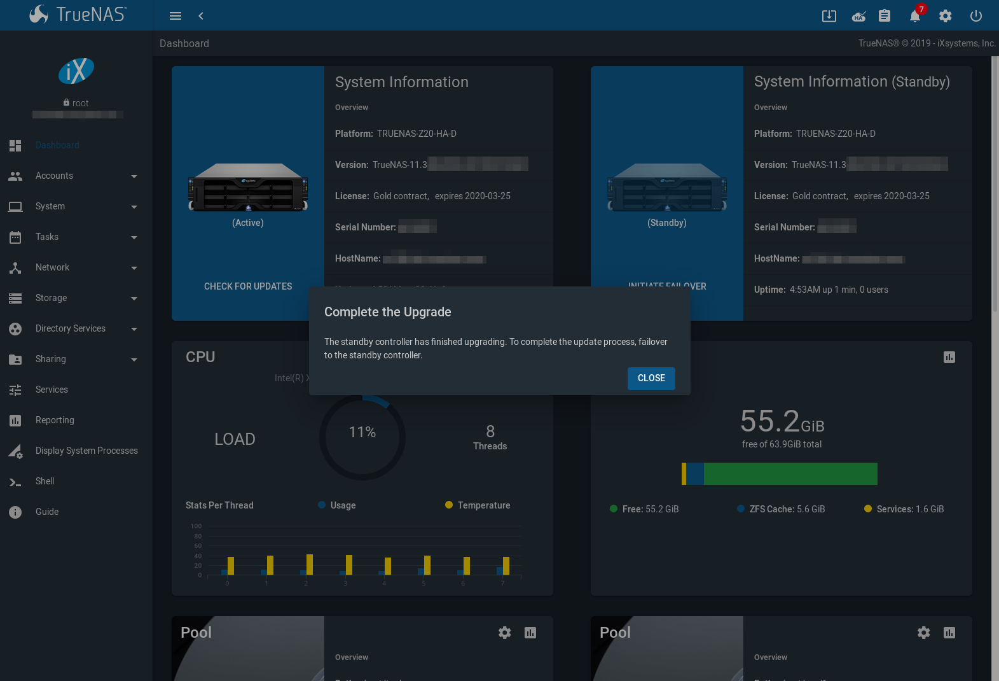
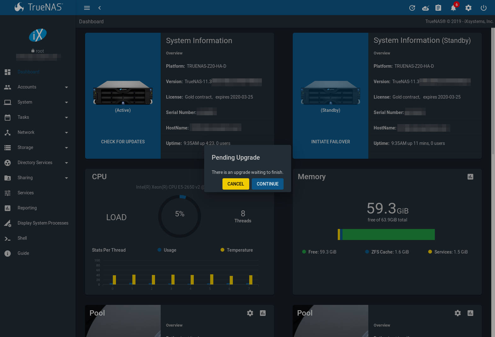

.. _System:

System
======

The System section of the |web-ui| contains these entries:

* :ref:`General` configures general settings such as HTTPS access, the
  language, and the timezone

* :ref:`NTP Servers` adds, edits, and deletes Network Time Protocol
  servers

* :ref:`Boot` creates, renames, and deletes boot
  environments. It also shows the condition of the Boot Pool.

* :ref:`Advanced` configures advanced settings such as the serial
  console, swap space, and console messages

#ifdef truenas
* :ref:`View Enclosure`: view status of disk enclosures.
#endif truenas

* :ref:`Email` configures the email address to receive notifications

* :ref:`System Dataset` configures the location where logs and
  reporting graphs are stored

* :ref:`Alert Services` configures services used to notify the
  administrator about system events.

* :ref:`Alert Settings` lists the available :ref:`Alert` conditions and
  provides configuration of the notification frequency for each alert.

* :ref:`Cloud Credentials` is used to enter connection credentials for
  remote cloud service providers

* :ref:`SSH Connections` manages connecting to a remote system with SSH.

* :ref:`SSH Keypairs` manages all private and public SSH key pairs.

* :ref:`Tunables` provides a front-end for tuning in real-time and to
  load additional kernel modules at boot time

* :ref:`Update` performs upgrades and checks for system
  updates

* :ref:`CAs`: import or create internal or intermediate CAs
  (Certificate Authorities)

#ifdef freenas
* :ref:`Certificates`: import existing certificates, create
  self-signed certificates, or configure ACME certificates.

* :ref:`ACME DNS`: automate domain authentication for compatible CAs and
  certificates.
#endif freenas

#ifdef truenas
* :ref:`Certificates`: import existing certificates or create
  self-signed certificates.

* :ref:`Failover`: manage High Availability.
#endif truenas

#ifdef freenas
* :ref:`Support`: report a bug or request a new feature.
#endif freenas
#ifdef truenas
* :ref:`Support`: view licensing information or create a support
  ticket.
#endif truenas

#ifdef truenas
* :ref:`Proactive Support`: enable and configure automatic proactive
  support (Silver or Gold support coverage only).
#endif truenas

Each of these is described in more detail in this section.

.. _General:

General
-------

:menuselection:`System --> General`
contains options for configuring the |web-ui| and other basic system
settings.

.. _system_general_fig:
.. figure:: %imgpath%/system-general.png

   General System Options

.. tabularcolumns:: |>{\RaggedRight}p{\dimexpr 0.25\linewidth-2\tabcolsep}
                    |>{\RaggedRight}p{\dimexpr 0.12\linewidth-2\tabcolsep}
                    |>{\RaggedRight}p{\dimexpr 0.63\linewidth-2\tabcolsep}|

.. _system_general_tab:

.. table:: General Configuration Settings
   :class: longtable

   +----------------------+----------------+--------------------------------------------------------------------------------------------------------------------------+
   | Setting              | Value          | Description                                                                                                              |
   |                      |                |                                                                                                                          |
   +======================+================+==========================================================================================================================+
   | GUI SSL Certificate  | drop-down menu | The system uses a self-signed :ref:`certificate <Certificates>` to enable encrypted |web-ui| connections. To change      |
   |                      |                | the default certificate, select a different created or imported certificate.                                             |
   +----------------------+----------------+--------------------------------------------------------------------------------------------------------------------------+
   | WebGUI IPv4 Address  | drop-down menu | Choose recent IP addresses to limit the usage when accessing the |web-ui|. The                                           |
   |                      |                | built-in HTTP server binds to the wildcard address of *0.0.0.0* (any address) and issues an                              |
   |                      |                | alert if the specified addresses become unavailable.                                                                     |
   |                      |                |                                                                                                                          |
   +----------------------+----------------+--------------------------------------------------------------------------------------------------------------------------+
   | WebGUI IPv6 Address  | drop-down menu | Choose recent IPv6 addresses to limit the usage when accessing the |web-ui|. The                                         |
   |                      |                | built-in HTTP server binds to any address and issues an alert                                                            |
   |                      |                | if the specified addresses become unavailable.                                                                           |
   |                      |                |                                                                                                                          |
   +----------------------+----------------+--------------------------------------------------------------------------------------------------------------------------+
   | WebGUI HTTP Port     | integer        | Allow configuring a non-standard port for accessing the |web-ui| over HTTP. Changing this setting                        |
   |                      |                | can also require changing a                                                                                              |
   |                      |                | `Firefox configuration setting                                                                                           |
   |                      |                | <https://www.redbrick.dcu.ie/~d_fens/articles/Firefox:_This_Address_is_Restricted>`__.                                   |
   |                      |                |                                                                                                                          |
   +----------------------+----------------+--------------------------------------------------------------------------------------------------------------------------+
   | WebGUI HTTPS Port    | integer        | Allow configuring a non-standard port for accessing the |web-ui| over HTTPS.                                             |
   |                      |                |                                                                                                                          |
   +----------------------+----------------+--------------------------------------------------------------------------------------------------------------------------+
   | WebGUI HTTP ->       | checkbox       | Redirect *HTTP* connections to *HTTPS*. A :guilabel:`GUI SSL Certificate` is required for *HTTPS*. Activating this also  |
   | HTTPS Redirect       |                | sets the `HTTP Strict Transport Security (HSTS) <https://en.wikipedia.org/wiki/HTTP_Strict_Transport_Security>`__        |
   |                      |                | maximum age to *31536000* seconds (one year). This means that after a browser connects to the %brand%                    |
   |                      |                | |web-ui| for the first time, the browser continues to use HTTPS and renews this setting every year.                      |
   +----------------------+----------------+--------------------------------------------------------------------------------------------------------------------------+
   | Language             | combo box      | Select a language from the drop-down menu. The list can be sorted by :guilabel:`Name` or                                 |
   |                      |                | `Language code <https://en.wikipedia.org/wiki/List_of_ISO_639-1_codes>`__.                                               |
   |                      |                | View the translated status of a language in the                                                                          |
   |                      |                | `webui GitHub repository <https://github.com/freenas/webui/tree/master/src/assets/i18n>`__.                              |
#ifdef freenas
   |                      |                | Refer to :ref:`Contributing to %brand%` for more information about assisting with translations.                          |
#endif freenas
   |                      |                |                                                                                                                          |
   +----------------------+----------------+--------------------------------------------------------------------------------------------------------------------------+
   | Console Keyboard Map | drop-down menu | Select a keyboard layout.                                                                                                |
   |                      |                |                                                                                                                          |
   +----------------------+----------------+--------------------------------------------------------------------------------------------------------------------------+
   | Timezone             | drop-down menu | Select a timezone.                                                                                                       |
   |                      |                |                                                                                                                          |
   +----------------------+----------------+--------------------------------------------------------------------------------------------------------------------------+
   | Syslog level         | drop-down menu | When :guilabel:`Syslog server` is defined, only logs matching this level are sent.                                       |
   |                      |                |                                                                                                                          |
   +----------------------+----------------+--------------------------------------------------------------------------------------------------------------------------+
   | Syslog server        | string         | Select an *IP address_or_hostname:optional_port_number* to send logs to. Set to write log entries                        |
   |                      |                | to both the console and the remote server.                                                                               |
   |                      |                |                                                                                                                          |
   +----------------------+----------------+--------------------------------------------------------------------------------------------------------------------------+
   | Crash reporting      | checkbox       | Send anonymous crash reports to iXsystems.                                                                               |
   |                      |                |                                                                                                                          |
   +----------------------+----------------+--------------------------------------------------------------------------------------------------------------------------+
   | Usage Collection     | checkbox       | Send anonymous usage statistics to iXsystems.                                                                            |
   |                      |                |                                                                                                                          |
   +----------------------+----------------+--------------------------------------------------------------------------------------------------------------------------+

After making any changes, click :guilabel:`SAVE`. Changes to
:guilabel:`WebGUI` fields can interrupt |web-ui| connectivity while the
new settings are applied.

This screen also contains these buttons:

.. _saveconfig:

* :guilabel:`SAVE CONFIG`: save a backup copy of the current configuration
  database in the format *hostname-version-architecture* to the computer
  accessing the |web-ui|. Saving the configuration after
  making any configuration changes is highly recommended. %brand%
  automatically backs up the configuration database to the system
  dataset every morning at 3:45. However, this backup does not occur if
  the system is shut down at that time. If the system dataset is stored
  on the boot pool and the boot pool becomes unavailable, the backup
  will also not be available. The location of the system dataset can be
  viewed or set using
  :menuselection:`System --> System Dataset`.

  .. note:: :ref:`SSH` keys are not stored in the configuration database
     and must be backed up separately. System host keys are files with
     names beginning with :file:`ssh_host_` in :file:`/usr/local/etc/ssh/`.
     The root user keys are stored in :file:`/root/.ssh`.

  There are two types of passwords. User account passwords for the base
  operating system are stored as hashed values, do not need to be
  encrypted to be secure, and are saved in the system configuration
  backup. Other passwords, like iSCSI CHAP passwords, Active Directory
  bind credentials, and cloud credentials are stored in an encrypted form
  to prevent them from being visible as plain text in the saved system
  configuration. The key or *seed* for this encryption is normally stored
  only on the |os-device|. When :guilabel:`Save Config` is chosen, a
  dialog gives two options. :guilabel:`Export Password Secret Seed`
  includes passwords in the configuration file which allows the
  configuration file to be restored to a different |os-device| where the
  decryption seed is not already present. Configuration backups
  containing the seed must be physically secured to prevent decryption
  of passwords and unauthorized access.

  .. warning:: The :guilabel:`Export Password Secret Seed` option is off
     by default and should only be used when making a configuration
     backup that will be stored securely. After moving a configuration
     to new hardware, media containing a configuration backup with a
     decryption seed should be securely erased before reuse.

  :guilabel:`Export Pool Encryption Keys` includes the encryption keys of
  encrypted pools in the configuration file. The encyrption keys are
  restored if the configuration file is uploaded to the system using
  :guilabel:`UPLOAD CONFIG`.

* :guilabel:`UPLOAD CONFIG`: allows browsing to the location of a
  previously saved configuration file to restore that configuration.

* :guilabel:`RESET CONFIG`: reset the configuration database
  to the default base version. This does not delete user SSH keys or any
  other data stored in a user home directory. Since configuration
  changes stored in the configuration database are erased, this option
  is useful when a mistake has been made or to return a test system to
  the original configuration.

.. index:: NTP Servers,
.. _NTP Servers:

NTP Servers
-----------

The network time protocol (NTP) is used to synchronize the time on the
computers in a network. Accurate time is necessary for the successful
operation of time sensitive applications such as Active Directory or
other directory services. By default, %brand% is pre-configured to use
three public NTP servers. If the network is using a directory service,
ensure that the %brand% system and the server running the directory
service have been configured to use the same NTP servers.

Available NTP servers can be found at
`<https://support.ntp.org/bin/view/Servers/NTPPoolServers>`__.
For time accuracy, choose NTP servers that are geographically close to
the physical location of the %brand% system.

Click :menuselection:`System --> NTP Servers` and |ui-add|
to add an NTP server. :numref:`Figure %s <ntp_server_fig>` shows the
configuration options.
:numref:`Table %s <ntp_server_conf_opts_tab>`
summarizes the options available when adding or editing an NTP server.
`ntp.conf(5) <https://www.freebsd.org/cgi/man.cgi?query=ntp.conf>`__
explains these options in more detail.

.. _ntp_server_fig:

.. figure:: %imgpath%/system-ntp-servers-add.png

   Add an NTP Server

.. tabularcolumns:: |>{\RaggedRight}p{\dimexpr 0.25\linewidth-2\tabcolsep}
                    |>{\RaggedRight}p{\dimexpr 0.12\linewidth-2\tabcolsep}
                    |>{\RaggedRight}p{\dimexpr 0.63\linewidth-2\tabcolsep}|

.. _ntp_server_conf_opts_tab:

.. table:: NTP Servers Configuration Options
   :class: longtable

   +-------------+-----------+----------------------------------------------------------------------------------------------------+
   | Setting     | Value     | Description                                                                                        |
   |             |           |                                                                                                    |
   |             |           |                                                                                                    |
   +=============+===========+====================================================================================================+
   | Address     | string    | Enter the hostname or IP address of the NTP server.                                                |
   |             |           |                                                                                                    |
   +-------------+-----------+----------------------------------------------------------------------------------------------------+
   | Burst       | checkbox  | Recommended when :guilabel:`Max. Poll` is greater than *10*. Only use on personal servers.         |
   |             |           | **Do not** use with a public NTP server.                                                           |
   |             |           |                                                                                                    |
   +-------------+-----------+----------------------------------------------------------------------------------------------------+
   | IBurst      | checkbox  | Speed up the initial synchronization, taking seconds rather than minutes.                          |
   |             |           |                                                                                                    |
   +-------------+-----------+----------------------------------------------------------------------------------------------------+
   | Prefer      | checkbox  | This option is only recommended for highly accurate NTP servers, such as those with                |
   |             |           | time monitoring hardware.                                                                          |
   |             |           |                                                                                                    |
   +-------------+-----------+----------------------------------------------------------------------------------------------------+
   | Min. Poll   | integer   | Minimum polling time in seconds. Must be a power of 2, and cannot be lower than                    |
   |             |           | *4* or higher than :guilabel:`Max. Poll`.                                                          |
   |             |           |                                                                                                    |
   +-------------+-----------+----------------------------------------------------------------------------------------------------+
   | Max. Poll   | integer   | Maximum polling time in seconds. Must be a power of 2, and cannot be higher than                   |
   |             |           | *17* or lower than :guilabel:`Min. Poll`.                                                          |
   |             |           |                                                                                                    |
   +-------------+-----------+----------------------------------------------------------------------------------------------------+
   | Force       | checkbox  | Force the addition of the NTP server, even if it is currently unreachable.                         |
   |             |           |                                                                                                    |
   +-------------+-----------+----------------------------------------------------------------------------------------------------+

.. index:: Boot Environments, Multiple Boot Environments, Boot
.. _Boot:

Boot
----

%brand% supports a ZFS feature known as multiple boot environments.
With multiple boot environments, the process of updating the operating
system becomes a low-risk operation. The updater automatically creates
a snapshot of the current boot environment and adds it to the boot
menu before applying the update.

#ifdef freenas
If an update fails, reboot the system and select the previous boot
environment, using the instructions in :ref:`If Something Goes Wrong`,
to instruct the system to go back to that system state.
#endif freenas

.. note:: Boot environments are separate from the configuration
   database. Boot environments are a snapshot of the
   *operating system* at a specified time. When a %brand% system
   boots, it loads the specified boot environment, or operating
   system, then reads the configuration database to load the
   current configuration values. If the intent is to make
   configuration changes rather than operating system changes, make a
   backup of the configuration database first using
   :menuselection:`System --> General --> SAVE CONFIG`.

As seen in :numref:`Figure %s <view_boot_env_fig>`, %brand% displays the
condition and statistics of the *Boot Pool*. It also shows the two boot
environments that are created when %brand% is installed. The system will
boot into the *default* boot environment and users can make their
changes and update from this version. The *Initial-Install* boot
environment can be booted into if the system needs to be returned to a
non-configured version of the installation.

.. _view_boot_env_fig:
.. figure:: %imgpath%/system-boot-environments.png

   Viewing Boot Environments

Each boot environment entry contains this information:

* **Name:** the name of the boot entry as it will appear in the boot
  menu.

* **Active:** indicates which entry will boot by default if the user
  does not select another entry in the boot menu.

* **Created:** indicates the date and time the boot entry was created.

* **Space:** displays the size of the boot environment.

* **Keep:** indicates whether or not this boot environment can be
  pruned if an update does not have enough space to proceed. Click
  |ui-options| and :guilabel:`Keep` for an entry if that boot
  environment should not be automatically pruned.

Click |ui-options| on an entry to see these configuration buttons:

* **Delete:** used to delete the highlighted entry, which also removes
  that entry from the boot menu. Since an activated entry
  cannot be deleted, this button does not appear for the active boot
  environment. To delete an entry that is currently
  activated, first activate another entry, which will clear the
  *On reboot* field of the currently activated entry. Note that this
  button does not appear for the *default* boot environment as
  this entry is needed to return the system to the original
  installation state.

* **Clone:** makes a new boot environment from the selected boot
  environment.

* **Rename:** used to change the name of the boot environment.

* **Activate:** only appears on entries which are not currently set to
  :guilabel:`Active`. Changes the selected entry to the default boot
  entry on next boot. The status changes to :guilabel:`Reboot` and
  the current :guilabel:`Active` entry changes from
  :guilabel:`Now/Reboot` to :guilabel:`Now`, indicating that it
  was used on the last boot but will not be used on the next boot.

* **Keep:** used to toggle whether or not the updater can prune
  (automatically delete) this boot environment if there is not enough
  space to proceed with the update.

There are also other options available.

* **ADD:** Click :guilabel:`ADD` to make a new boot environment from
  the active environment. The active boot environment contains the
  text :literal:`Now/Reboot` in the :guilabel:`Active` column. Only
  alphanumeric characters, underscores, and dashes are allowed in the
  name.

* **Scrub:** :guilabel:`SCRUB BOOT POOL` is used to perform a
  manual scrub of the |os-device|. By default, the |os-device| is
  scrubbed every 7 days. To change the default interval, change the
  number in the :guilabel:`Automatic scrub interval (in days)` field of
  the :guilabel:`Boot` screen. The date and results of the
  last scrub are also listed in this screen. The condition of the
  |os-device| should be listed as *HEALTHY*.

* **Status:** click :guilabel:`BOOT POOL STATUS` to see the status of
  the |os-device|. :numref:`Figure %s <status_boot_dev_fig>`,
  shows only one |os-device|, which is *ONLINE*.

.. note:: Using :guilabel:`Clone` to clone the active boot environment
   functions the same as using :guilabel:`Create`.

.. _status_boot_dev_fig:
.. figure:: %imgpath%/system-boot-environments-status.png

   Viewing the Status of the |OS-Device|

#ifdef freenas
If the system has a mirrored boot pool, there will be a
:guilabel:`Detach` option in addition to the :guilabel:`Replace` option.
To remove a device from the boot pool, click |ui-options| for the device
and click :guilabel:`Detach`. Alternately, if one of the |os-devices|
has an *OFFLINE* :guilabel:`Status`, click the device to replace, then
click :guilabel:`Replace` to rebuild the boot mirror.
#endif freenas
#ifdef truenas
If one of the |os-devices| has a :guilabel:`Status` of *OFFLINE*,
click the device to replace, select the new replacement device, and
click :guilabel:`Replace Disk` to rebuild the boot mirror.
#endif truenas

#ifdef freenas
Note that |os-device| **cannot be replaced if it is the only**
|os-device| because it contains the operating system itself.
#endif freenas

.. index:: Mirroring the |OS-Device|
.. _Mirroring the |OS-Device|:

Mirroring the |OS-Device|
~~~~~~~~~~~~~~~~~~~~~~~~~~~~~~~~~~~~~~~~~~~~

If the system is currently booting from a device, another device
can be added to create a mirrored |os-device|. If one device in a
mirror fails, the remaining device can still be used to boot the system.

.. note:: When adding another |os-device| for a mirror, the new device
   must have at least the same capacity as the existing |os-device|.
   Larger capacity devices can be added, but the mirror will only have
   the capacity of the smallest device. Different models of devices
   which advertise the same nominal size are not necessarily the same
   actual size. For this reason, adding another of the same model of
   |os-device| is recommended.

In the example shown in
:numref:`Figure %s <mirror_boot_dev_fig>`, the user has gone to
:menuselection:`System --> Boot`,
and clicked the :guilabel:`BOOT POOL STATUS` button to display the
current status of the |os-device|. As shown in
:numref:`Figure %s <status_boot_dev_fig>`, the *freenas-boot* pool
is made of a single device, *ada0p2*. There is only one disk, indicated
by the word *stripe*. To create a mirrored |os-device|, click
|ui-options| then :guilabel:`attach`. If another device is available, it
appears in the :guilabel:`Member disk` drop-down menu. Select the
desired device.

The :guilabel:`Use all disk space` option gives control of how much
of the new device is made available to ZFS. The new device is
partitioned to the same size as the existing device by default. Select
:guilabel:`Use all disk space` to use all available space on the
new device. If either device in the mirror fails, it can be
replaced with another of the same size as the original |os-device|.

When :guilabel:`Use all disk space` is enabled, the entire capacity of
the new device is used. If the original |os-device| fails and is
removed, the boot mirror will consist of just the newer drive, and
will grow to whatever capacity it provides. However, new devices added
to this mirror must now be as large as the new capacity.

Click :guilabel:`SAVE` to attach the new disk to the mirror.

.. _mirror_boot_dev_fig:

.. figure:: %imgpath%/system-boot-attach.png

   Mirroring a |OS-Device|

After the mirror is created, the :guilabel:`Boot Pool Status` screen
indicates that it is now a *mirror*. The number of devices in the mirror
are shown as in :numref:`Figure %s <mirror_boot_status_fig>`.

.. _mirror_boot_status_fig:

.. figure:: %imgpath%/system-boot-mirror.png

   Viewing the Status of a Mirrored |OS-Device|

.. _Advanced:

Advanced
--------

:menuselection:`System --> Advanced`
is shown in
:numref:`Figure %s <system_adv_fig>`.
The configurable settings are summarized in
:numref:`Table %s <adv_config_tab>`.

.. _system_adv_fig:
.. figure:: %imgpath%/system-advanced.png

   Advanced Screen

.. tabularcolumns:: |>{\RaggedRight}p{\dimexpr 0.25\linewidth-2\tabcolsep}
                    |>{\RaggedRight}p{\dimexpr 0.12\linewidth-2\tabcolsep}
                    |>{\RaggedRight}p{\dimexpr 0.63\linewidth-2\tabcolsep}|

.. _adv_config_tab:

.. table:: Advanced Configuration Settings
   :class: longtable

   +------------------------------------------+--------------------+--------------------------------------------------------------------------------------------------+
   | Setting                                  | Value              | Description                                                                                      |
   |                                          |                    |                                                                                                  |
   +==========================================+====================+==================================================================================================+
   | Show Text Console without Password       | checkbox           | Set for the text console to be available without entering a password.                            |
   | Prompt                                   |                    |                                                                                                  |
   +------------------------------------------+--------------------+--------------------------------------------------------------------------------------------------+
   | Enable Serial Console                    | checkbox           | **Do not** enable this option if the serial port is disabled. Adds the *Serial Port* and         |
   |                                          |                    | *Serial Speed* fields.                                                                           |
   +------------------------------------------+--------------------+--------------------------------------------------------------------------------------------------+
   | Serial Port                              | string             | Select the serial port address in hex.                                                           |
   |                                          |                    |                                                                                                  |
   +------------------------------------------+--------------------+--------------------------------------------------------------------------------------------------+
   | Serial Speed                             | drop-down menu     | Select the speed in bps used by the serial port.                                                 |
   |                                          |                    |                                                                                                  |
   #ifdef freenas
   +------------------------------------------+--------------------+--------------------------------------------------------------------------------------------------+
   | Swap size in GiB                         | non-zero number    | By default, all data disks are created with this amount of swap. This setting does not affect    |
   |                                          |                    | log or cache devices as they are created without swap. Setting to *0* disables swap creation     |
   |                                          |                    | completely. This is *strongly* discouraged.                                                      |
   |                                          |                    |                                                                                                  |
   #endif freenas
   #ifdef truenas
   +------------------------------------------+--------------------+--------------------------------------------------------------------------------------------------+
   | Enable Legacy User Interface             | checkbox           | WARNING: The legacy user interface is deprecated. All management should be performed through the |
   |                                          |                    | new user interface. Shows legacy UI login buttons on the |web-ui| log in screen and              |
   |                                          |                    | :ref:`settings` menu. These buttons allow switching to the interface that was available with     |
   |                                          |                    | %brand% 11.2 and earlier.                                                                        |
   #endif truenas
   +------------------------------------------+--------------------+--------------------------------------------------------------------------------------------------+
   | Enable autotune                          | checkbox           | Enable the :ref:`autotune` script which attempts to optimize the system based on                 |
   |                                          |                    | the installed  hardware. *Warning*: Autotuning is only used as a temporary measure and is        |
   |                                          |                    | not a permanent fix for system hardware issues.                                                  |
   |                                          |                    |                                                                                                  |
   +------------------------------------------+--------------------+--------------------------------------------------------------------------------------------------+
   | Enable Debug Kernel                      | checkbox           | Use a debug version of the kernel on the next boot.                                              |
   |                                          |                    |                                                                                                  |
   +------------------------------------------+--------------------+--------------------------------------------------------------------------------------------------+
   | Show console messages                    | checkbox           | Display console messages from :file:`/var/log/console.log` in real time at bottom of browser     |
   |                                          |                    | window. Click the console to bring up a scrollable screen. Set the :guilabel:`Stop refresh`      |
   |                                          |                    | option in the scrollable screen to pause updates. Unset to continue watching messages as they    |
   |                                          |                    | occur. When this option is set, a button to show the console log appears on busy spinner dialogs.|
   |                                          |                    |                                                                                                  |
   +------------------------------------------+--------------------+--------------------------------------------------------------------------------------------------+
   | MOTD banner                              | string             | This message is shown when a user logs in with SSH.                                              |
   |                                          |                    |                                                                                                  |
   +------------------------------------------+--------------------+--------------------------------------------------------------------------------------------------+
   | Show tracebacks in case of fatal error   | checkbox           | Open a pop-up window of diagnostic information if a fatal error occurs.                          |
   |                                          |                    |                                                                                                  |
   +------------------------------------------+--------------------+--------------------------------------------------------------------------------------------------+
   | Show advanced fields by default          | checkbox           | Show :guilabel:`Advanced Mode` fields by default.                                                |
   |                                          |                    |                                                                                                  |
   +------------------------------------------+--------------------+--------------------------------------------------------------------------------------------------+
   | Remote Graphite Server Hostname          | string             | IP address or hostname of a remote server running                                                |
   |                                          |                    | `Graphite. <http://graphiteapp.org/>`__                                                          |
   |                                          |                    |                                                                                                  |
   +------------------------------------------+--------------------+--------------------------------------------------------------------------------------------------+
   | Use FQDN for logging                     | checkbox           | Include the Fully-Qualified Domain Name (FQDN) in logs to precisely identify systems             |
   |                                          |                    | with similar hostnames.                                                                          |
   |                                          |                    |                                                                                                  |
   +------------------------------------------+--------------------+--------------------------------------------------------------------------------------------------+
   | Report CPU usage in percentage           | checkbox           | Display CPU usage as percentages in :ref:`Reporting`.                                            |
   |                                          |                    |                                                                                                  |
   +------------------------------------------+--------------------+--------------------------------------------------------------------------------------------------+
   | ATA Security User                        | drop-down menu     | User passed to :command:`camcontrol security -u` for unlocking SEDs. Values are                  |
   |                                          |                    | *User* or *Master*.                                                                              |
   |                                          |                    |                                                                                                  |
   +------------------------------------------+--------------------+--------------------------------------------------------------------------------------------------+
   | SED Password                             | string             | Global password used to unlock :ref:`Self-Encrypting Drives`.                                    |
   |                                          |                    |                                                                                                  |
   +------------------------------------------+--------------------+--------------------------------------------------------------------------------------------------+
   | Reset SED Password                       | checkbox           | Select to clear the :guilabel:`Password for SED` column of                                       |
   |                                          |                    | :menuselection:`Storage --> Disks`.                                                              |
   |                                          |                    |                                                                                                  |
   +------------------------------------------+--------------------+--------------------------------------------------------------------------------------------------+

Click the :guilabel:`SAVE` button after making any changes.

This tab also contains this button:

:guilabel:`SAVE DEBUG`: used to generate text files that contain diagnostic
information. After the debug data is collected, the system prompts for
a location to save the compressed .tgz file.

.. index:: Autotune
.. _Autotune:

Autotune
~~~~~~~~

#ifdef freenas
%brand% provides an autotune script which optimizes the system
depending on the installed hardware. For example, if a pool exists on
a system with limited RAM, the autotune script automatically adjusts
some ZFS sysctl values in an attempt to minimize memory starvation
issues. It should only be used as a temporary measure on a system that
hangs until the underlying hardware issue is addressed by adding more
RAM. Autotune will always slow such a system, as it caps the ARC.

The :guilabel:`Enable autotune` option in
:menuselection:`System --> Advanced`
is off by default. Enable this option to run the autotuner at boot.
To run the script immediately, reboot the system.

If the autotune script adjusts any settings, the changed values appear
in
:menuselection:`System --> Tunables`.
These values can be modified and overridden. Note that deleting
tunables that were created by autotune only affects the current
session, as autotune-set tunables are recreated at boot.

When attempting to increase the performance of the %brand% system, and
particularly when the current hardware may be limiting performance,
try enabling autotune.

For those who wish to see which checks are performed, the autotune
script is located in :file:`/usr/local/bin/autotune`.
#endif freenas
#ifdef truenas
%brand% provides an autotune script which optimizes the system. The
:guilabel:`Enable autotune` option in
:menuselection:`System --> Advanced` is enabled by default, so this
script runs automatically. Leaving autotune enabled is recommended
unless advised otherwise by an iXsystems support engineer.

If the autotune script adjusts any settings, the changed values appear
in
:menuselection:`System --> Tunables`.
While these values can be modified and overridden, speak to a
support engineer first. Manual changes can have a negative
impact on system performance. Note that deleting tunables that
were created by autotune only affects the current session, as
autotune-set tunables are recreated at boot.

For those who wish to see which checks are performed, the autotune
script is located in :file:`/usr/local/bin/autotune`.
#endif truenas

.. index:: Self-Encrypting Drives
.. _Self-Encrypting Drives:

Self-Encrypting Drives
~~~~~~~~~~~~~~~~~~~~~~

%brand% version 11.1-U5 introduced Self-Encrypting Drive (SED) support.

These SED specifications are supported:

* Legacy interface for older ATA devices. **Not recommended for
  security-critical environments**

* `TCG Opal 1 <https://trustedcomputinggroup.org/wp-content/uploads/Opal_SSC_1.00_rev3.00-Final.pdf>`_
  legacy specification

* `TCG OPAL 2 <https://trustedcomputinggroup.org/wp-content/uploads/TCG_Storage-Opal_SSC_v2.01_rev1.00.pdf>`__
  standard for newer consumer-grade devices

* `TCG Opalite <https://trustedcomputinggroup.org/wp-content/uploads/TCG_Storage-Opalite_SSC_FAQ.pdf>`__
  is a reduced form of OPAL 2

* TCG Pyrite
  `Version 1 <https://trustedcomputinggroup.org/wp-content/uploads/TCG_Storage-Pyrite_SSC_v1.00_r1.00.pdf>`__
  and
  `Version 2 <https://trustedcomputinggroup.org/wp-content/uploads/TCG_Storage-Pyrite_SSC_v2.00_r1.00_PUB.pdf>`__
  are similar to Opalite, but hardware encryption is removed. Pyrite
  provides a logical equivalent of the legacy ATA security for non-ATA
  devices. Only the drive firmware is used to protect the device.

  .. danger:: Pyrite Version 1 SEDs do not have PSID support and **can
     become unusable if the password is lost.**

* `TCG Enterprise <https://trustedcomputinggroup.org/wp-content/uploads/TCG_Storage-SSC_Enterprise-v1.01_r1.00.pdf>`__
  is designed for systems with many data disks. These SEDs do not have
  the functionality to be unlocked before the operating system boots.

See this
Trusted Computing Group\ :sup:`®` and NVM Express\ :sup:`®`
`joint white paper <https://nvmexpress.org/wp-content/uploads/TCGandNVMe_Joint_White_Paper-TCG_Storage_Opal_and_NVMe_FINAL.pdf>`__
for more details about these specifications.

%brand% implements the security capabilities of
`camcontrol <https://www.freebsd.org/cgi/man.cgi?query=camcontrol>`__
for legacy devices and
`sedutil-cli <https://www.mankier.com/8/sedutil-cli>`__
for TCG devices. When managing a SED from the command line, it is
important to use :command:`sedutil-cli` rather than camcontrol to access
the full capabilities of the device. %brand% provides the
:command:`sedhelper` wrapper script to ease SED administration from the
command line.

By default, SEDs are not locked until the administrator takes ownership
of them. Ownership is taken by explicitly configuring a global or
per-device password in the %brand% |web-ui| and adding the password to
the SEDs. Adding SED passwords to %brand% also allows %brand% to
automatically unlock SEDs.

A password-protected SED protects the data stored on the device
when the device is physically removed from the %brand% system. This
allows secure disposal of the device without having to first wipe the
contents. Repurposing a SED on another system requires the SED password.

.. _Deploying SEDs:

Deploying SEDs
^^^^^^^^^^^^^^

Run :command:`sedutil-cli --scan` in the :ref:`Shell` to detect and list
devices. The second column of the results identifies the drive type:

* **no** indicates a non-SED device
* **1** indicates a legacy TCG OPAL 1 device
* **2** indicates a modern TCG OPAL 2 device
* **L** indicates a TCG Opalite device
* **p** indicates a TCG Pyrite 1 device
* **P** indicates a TCG Pyrite 2 device
* **E** indicates a TCG Enterprise device

Example:

.. code-block:: none

   root@truenas1:~ # sedutil-cli --scan
   Scanning for Opal compliant disks
   /dev/ada0  No  32GB SATA Flash Drive SFDK003L
   /dev/ada1  No  32GB SATA Flash Drive SFDK003L
   /dev/da0   No  HGST    HUS726020AL4210  A7J0
   /dev/da1   No  HGST    HUS726020AL4210  A7J0
   /dev/da10    E WDC     WUSTR1519ASS201  B925
   /dev/da11    E WDC     WUSTR1519ASS201  B925

%brand% supports setting a global password for all detected SEDs or
setting individual passwords for each SED. Using a global password for
all SEDs is strongly recommended to simplify deployment and avoid
maintaining separate passwords for each SED.

.. _Setting a global password for SEDs:

Setting a global password for SEDs
..................................

Go to
:menuselection:`System --> Advanced --> SED Password`
and enter the password. **Record this password and store it in a safe
place!**

Now the SEDs must be configured with this password. Go to the
:ref:`Shell` and enter :samp:`sedhelper setup {password}`, where
*password* is the global password entered in
:menuselection:`System --> Advanced --> SED Password`.

:command:`sedhelper` ensures that all detected SEDs are properly
configured to use the provided password:

.. code-block:: none

   root@truenas1:~ # sedhelper setup abcd1234
   da9			[OK]
   da10			[OK]
   da11			[OK]

Rerun :samp:`sedhelper setup {password}` every time a new SED is placed
in the system to apply the global password to the new SED.

.. _Creating separate passwords for each SED:

Creating separate passwords for each SED
........................................

Go to
:menuselection:`Storage --> Disks`.
Click |ui-options| for the confirmed SED, then :guilabel:`Edit`.
Enter and confirm the password in the :guilabel:`SED Password` and
:guilabel:`Confirm SED Password` fields.

The
:menuselection:`Storage --> Disks`
screen shows which disks have a configured SED password. The
:guilabel:`SED Password` column shows a mark when the disk has a
password. Disks that are not a SED or are unlocked using the global
password are not marked in this column.

The SED must be configured to use the new password. Go to the
:ref:`Shell` and enter :samp:`sedhelper setup --disk {da1} {password}`,
where *da1* is the SED to configure and *password* is the created
password from
:menuselection:`Storage --> Disks --> Edit Disks --> SED Password`.

This process must be repeated for each SED and any SEDs added to the
system in the future.

.. danger:: Remember SED passwords! If the SED password is lost, SEDs
   cannot be unlocked and their data is unavailable. While it is
   possible to specify the PSID number on the label of the device with
   :command:`sedutil-cli`, doing so **erases the contents** of the
   device rather than unlock it. Always record SED passwords whenever
   they are configured or modified and store them in a secure place!

.. _Check SED Functionality:

Check SED Functionality
^^^^^^^^^^^^^^^^^^^^^^^

When SED devices are detected during system boot, %brand% checks for
configured global and device-specific passwords.

Unlocking SEDs allows a pool to contain a mix of SED and non-SED
devices. Devices with individual passwords are unlocked with their
password. Devices without a device-specific password are unlocked using
the global password.

To verify SED locking is working correctly, go to the :ref:`Shell`.
Enter :samp:`sedutil-cli --listLockingRange 0 {password} dev/{da1}`,
where *da1* is the SED and *password* is the global or individual
password for that SED. The command returns :literal:`ReadLockEnabled: 1`,
:literal:`WriteLockEnabled: 1`, and :literal:`LockOnReset: 1` for drives
with locking enabled:

.. code-block:: none

   root@truenas1:~ # sedutil-cli --listLockingRange 0 abcd1234 /dev/da9
   Band[0]:
       Name:            Global_Range
       CommonName:      Locking
       RangeStart:      0
       RangeLength:     0
       ReadLockEnabled: 1
       WriteLockEnabled:1
       ReadLocked:      0
       WriteLocked:     0
       LockOnReset:     1

#ifdef truenas
.. _View Enclosure:

View Enclosure
--------------

Click
:menuselection:`Storage --> Pools --> View Enclosure`
to display the status of connected disks and hardware.

.. _tn_enclosure1:
.. figure:: %imgpath%/system-view-enclosure.png

   View Enclosure

Detected %brand% hardware is added to a column on the right side of the
screen. Click an enclosure to show details about that hardware.

The screen is divided into different tabs. These tabs reflect the
sensors that are active in the chosen hardware.

:guilabel:`Disks` shows a graphic representation of the %brand% hardware
and details about connected disks. Click any disk slot to see specific
details about the disk like the FreeBSD device name, vdev assignment and
function, serial number, and current drive settings. The
:guilabel:`IDENTIFY DRIVE` button flashes the identification LED for the
chosen drive.

The :guilabel:`Disks Overview` shows statistics about the enclosure
pools, status, and detected expanders. There are options to show more
details about pools in the enclosure, disk status, and expansion shelf
status. Clicking any of the buttons changes the graphic to show the
requested details.

:guilabel:`Cooling` has an entry for each fan with status and RPM.

:guilabel:`Enclosure Services Controller Electronics` shows the
enclosure status.

:guilabel:`Power Supply` shows the status of each power supply.

:guilabel:`SAS Connector` shows the status of the expansion shelf.

:guilabel:`Temperature Sensor` shows the current temperature of each
expansion shelf and the disk chassis.

:guilabel:`Voltage Sensor` shows the current voltage for each sensor,
VCCP, and VCC.
#endif truenas

.. index:: Email
.. _Email:

Email
-----

An automatic script sends a nightly email to the *root* user account
containing important information such as the health of the disks.
:ref:`Alert` events are also emailed to the *root* user account.
Problems with :ref:`Scrub Tasks` are reported separately in an email
sent at 03:00AM.

.. note:: :ref:`S.M.A.R.T.` reports are mailed separately to the
   address configured in that service.

The administrator typically does not read email directly on
the %brand% system. Instead, these emails are usually sent to an
external email address where they can be read more conveniently. It is
important to configure the system so it can send these emails to the
administrator's remote email account so they are aware of problems or
status changes.

The first step is to set the remote address where email will be sent.
Go to
:menuselection:`Accounts --> Users`,
click |ui-options| and :guilabel:`Edit` for the *root* user. In the
:guilabel:`Email` field, enter the email address on the remote system
where email is to be sent, like *admin@example.com*. Click
:guilabel:`SAVE` to save the settings.

Additional configuration is performed with
:menuselection:`System --> Email`,
shown in
:numref:`Figure %s <email_conf_fig>`.

.. _email_conf_fig:
.. figure:: %imgpath%/system-email.png

   Email Screen

.. tabularcolumns:: |p{1.2in}|p{1.2in}|p{3.6in}|
.. tabularcolumns:: |>{\RaggedRight}p{\dimexpr 0.20\linewidth-2\tabcolsep}
                    |>{\RaggedRight}p{\dimexpr 0.20\linewidth-2\tabcolsep}
                    |>{\RaggedRight}p{\dimexpr 0.60\linewidth-2\tabcolsep}|

.. _email_conf_tab:

.. table:: Email Configuration Settings
   :class: longtable

   +----------------------+----------------------+-------------------------------------------------------------------------------------------------+
   | Setting              | Value                | Description                                                                                     |
   |                      |                      |                                                                                                 |
   +======================+======================+=================================================================================================+
   | From E-mail          | string               | The envelope From address shown in the email. This can be set to make filtering mail            |
   |                      |                      | on the receiving system easier.                                                                 |
   |                      |                      |                                                                                                 |
   +----------------------+----------------------+-------------------------------------------------------------------------------------------------+
   | From Name            | string               | The friendly name to show in front of the sending email address.                                |
   |                      |                      |                                                                                                 |
   +----------------------+----------------------+-------------------------------------------------------------------------------------------------+
   | Outgoing Mail Server | string or IP address | Hostname or IP address of SMTP server used for sending this email.                              |
   |                      |                      |                                                                                                 |
   +----------------------+----------------------+-------------------------------------------------------------------------------------------------+
   | Mail Server Port     | integer              | SMTP port number. Typically *25*,                                                               |
   |                      |                      | *465* (secure SMTP), or                                                                         |
   |                      |                      | *587* (submission).                                                                             |
   |                      |                      |                                                                                                 |
   +----------------------+----------------------+-------------------------------------------------------------------------------------------------+
   | Security             | drop-down menu       | Choose an encryption type. Choices are *Plain (No Encryption)*,                                 |
   |                      |                      | *SSL (Implicit TLS)*, or                                                                        |
   |                      |                      | *TLS (STARTTLS)*.                                                                               |
   |                      |                      |                                                                                                 |
   +----------------------+----------------------+-------------------------------------------------------------------------------------------------+
   | SMTP                 | checkbox             | Enable or disable                                                                               |
   | Authentication       |                      | `SMTP AUTH <https://en.wikipedia.org/wiki/SMTP_Authentication>`__                               |
   |                      |                      | using PLAIN SASL. Setting this enables the required :guilabel:`Username` and optional           |
   |                      |                      | :guilabel:`Password` fields.                                                                    |
   |                      |                      |                                                                                                 |
   +----------------------+----------------------+-------------------------------------------------------------------------------------------------+
   | Username             | string               | Enter the SMTP username when the SMTP server requires authentication.                           |
   |                      |                      |                                                                                                 |
   +----------------------+----------------------+-------------------------------------------------------------------------------------------------+
   | Password             | string               | Enter the SMTP account password if needed for authentication. Only plain text characters        |
   |                      |                      | (7-bit ASCII) are allowed in passwords. UTF or composed characters are not allowed.             |
   |                      |                      |                                                                                                 |
   +----------------------+----------------------+-------------------------------------------------------------------------------------------------+

Click the :guilabel:`SEND TEST MAIL` button to verify that the
configured email settings are working. If the test email fails,
double-check that the :guilabel:`Email` field of the *root* user is
correctly configured by clicking the :guilabel:`Edit` button for
the *root* account in :menuselection:`Accounts --> Users`.

Configuring email for TLS/SSL email providers is described in
`Are you having trouble getting FreeNAS to email you in Gmail?
<https://forums.freenas.org/index.php?threads/are-you-having-trouble-getting-freenas-to-email-you-in-gmail.22517/>`__.

.. index:: System Dataset
.. _System Dataset:

System Dataset
--------------

:menuselection:`System --> System Dataset`,
shown in
:numref:`Figure %s <system_dataset_fig>`,
is used to select the pool which contains the persistent system
dataset. The system dataset stores debugging core files,
:ref:`encryption keys <Encryption and Recovery Keys>` for encrypted
pools, and Samba4 metadata such as the user/group cache and share level
permissions.

.. _system_dataset_fig:
.. figure:: %imgpath%/system-system-dataset.png

   System Dataset Screen

Use the :guilabel:`System Dataset Pool` drop-down menu to select the
volume (pool) to contain the system dataset. The system dataset can be
moved to unencrypted volumes (pools) or encrypted volumes which do not
have passphrases. If the system dataset is moved to an encrypted volume,
that volume is no longer allowed to be locked or have a passphrase set.

Moving the system dataset also requires
#ifdef truenas
rebooting the passive |ctrlr-term| for :ref:`High Availability <Failover>`
%brand% systems and
#endif truenas
restarting the :ref:`SMB` service. A dialog warns that the SMB service
must be restarted, causing a temporary outage of any active SMB
connections.

System logs can also be stored on the system
dataset. Storing this information on the system dataset is recommended
when large amounts of data is being generated and the system has limited
memory or a limited capacity |os-device|.

Set :guilabel:`Syslog` to store system logs on the system dataset. Leave
unset to store system logs in :file:`/var` on the |os-device|.

Click :guilabel:`SAVE` to save changes.

If the pool storing the system dataset is changed at a later time,
%brand% migrates the existing data in the system dataset to the new
location.

.. note:: Depending on configuration, the system dataset can occupy a
   large amount of space and receive frequent writes. Do not put the
   system dataset on a flash drive or other media with limited space
   or write life.

.. index:: Reporting, Reporting settings
.. _System Reporting:

Reporting
---------

This section contains settings to customize some of the reporting tools.
These settings are described in
:numref:`Table %s <reporting_options>`

.. tabularcolumns:: |>{\RaggedRight}p{\dimexpr 0.16\linewidth-2\tabcolsep}
                    |>{\RaggedRight}p{\dimexpr 0.20\linewidth-2\tabcolsep}
                    |>{\RaggedRight}p{\dimexpr 0.64\linewidth-2\tabcolsep}|

.. _reporting_options:

.. table:: Reporting Settings
   :class: longtable

   +---------------------+-----------+-----------------------------------------------------+
   | Setting             | Value     | Description                                         |
   +=====================+===========+=====================================================+
   | Report CPU usage    | checkbox  | Report CPU usage in percent instead of jiffies.     |
   | in percent          |           |                                                     |
   |                     |           |                                                     |
   +---------------------+-----------+-----------------------------------------------------+
   | Graphite Server     | string    | Destination hostname or IP address for collectd     |
   |                     |           | data sent by the Graphite plugin.                   |
   |                     |           |                                                     |
   +---------------------+-----------+-----------------------------------------------------+
   | Graph Age           | integer   | Maximum time a graph is stored in months.           |
   |                     |           | Changing this value causes the                      |
   |                     |           | :guilabel:`Confirm RRD Destroy` checkbox to         |
   |                     |           | appear. Changes do not take effect until the        |
   |                     |           | existing reporting database is destroyed.           |
   |                     |           |                                                     |
   +---------------------+-----------+-----------------------------------------------------+
   | Graph Points        | integer   | Number of points for each hourly, daily, weekly,    |
   |                     |           | monthly, or yearly graph. Do not set this less than |
   |                     |           | the width of the graphs in pixels. Changing this    |
   |                     |           | value causes the :guilabel:`Confirm RRD Destroy`    |
   |                     |           | checkbox to appear. Changes do not take effect      |
   |                     |           | until the existing reporting database is destroyed. |
   |                     |           |                                                     |
   +---------------------+-----------+-----------------------------------------------------+
   | Confirm RRD Destroy | checkbox  | Destroy the reporting database. Appears when        |
   |                     |           | :guilabel:`Graph Age` or :guilabel:`Graph Points`   |
   |                     |           | are changed. Required for changes to                |
   |                     |           | :guilabel:`Graph Age` or :guilabel:`Graph Points`   |
   |                     |           | to take effect.                                     |
   |                     |           |                                                     |
   +---------------------+-----------+-----------------------------------------------------+

.. index:: Alert Services
.. _Alert Services:

Alert Services
--------------

%brand% can use a number of methods to notify the administrator of
system events that require attention. These events are system
:ref:`Alerts <Alert>`.

Available alert services:

* `AWS-SNS <https://aws.amazon.com/sns/>`__

* E-mail

* `Hipchat <https://www.stride.com>`__

* `InfluxDB <https://www.influxdata.com/>`__

* `Mattermost <https://about.mattermost.com/>`__

* `OpsGenie <https://www.opsgenie.com/>`__

* `PagerDuty <https://www.pagerduty.com/>`__

* `Slack <https://slack.com/>`__

* `SNMP Trap <http://www.dpstele.com/snmp/trap-basics.php>`__

* `VictorOps <https://victorops.com/>`__

.. warning:: These alert services might use a third party commercial
   vendor not directly affiliated with iXsystems. Please investigate
   and fully understand that vendor's pricing policies and services
   before using their alert service. iXsystems is not responsible for
   any charges incurred from the use of third party vendors with the
   Alert Services feature.

Select
:menuselection:`System --> Alert Services` to show the Alert Services
screen, :numref:`Figure %s <alert_services_fig>`.

.. _alert_services_fig:

.. figure:: %imgpath%/system-alert-services.png

   Alert Services

Click |ui-add| to display the :guilabel:`Add Alert Service` form,
:numref:`Figure %s <alert_service_add_fig>`.

.. _alert_service_add_fig:

.. figure:: %imgpath%/system-alert-services-add.png

   Add Alert Service

Select the :guilabel:`Type` to choose an alert service to configure.

Alert services can be set for a particular severity :guilabel:`Level`.
All alerts of that level are then sent out with that alert service. For
example, if the *E-Mail* alert service :guilabel:`Level` is set to
*Info*, any *Info* level alerts are sent by that service. Multiple alert
services can be set to the same level. For instance, *Critical* alerts
can be sent both by email and PagerDuty by setting both alert services
to the *Critical* level.

The configurable fields and required information differ for each alert
service. Set :guilabel:`Enabled` to activate the service. Enter any
other required information and click :guilabel:`SAVE`.

Click :guilabel:`SEND TEST ALERT` to test the chosen alert service.

All saved alert services are displayed in
:menuselection:`System --> Alert Services`.
To delete an alert service, click |ui-options| and :guilabel:`Delete`.
To disable an alert service
temporarily, click |ui-options| and :guilabel:`Edit`, then unset the
:guilabel:`Enabled` option.

.. index:: Alert Settings

.. _Alert Settings:

Alert Settings
--------------

:menuselection:`System --> Alert Settings` displays the notification
frequency for each type of :ref:`Alert`. An example is shown in
:numref:`Figure %s <alert_settings_fig>`.

.. _alert_settings_fig:

.. figure:: %imgpath%/system-alert-settings.png

   Configure Alert Notification Frequency

To change the notification frequency of an alert, click its drop-down
menu and select *IMMEDIATELY*, *HOURLY*, *DAILY*, or *NEVER*.

.. note:: To configure where alerts are sent, use
   :ref:`Alert Services`.

.. index:: Cloud Credentials
.. _Cloud Credentials:

Cloud Credentials
-----------------

%brand% can use cloud services for features like :ref:`Cloud Sync Tasks`.
The `rclone <https://rclone.org/>`__ credentials to provide secure
connections with cloud services are entered here. Amazon S3, Backblaze
B2, Box, Dropbox, FTP, Google Cloud Storage, Google Drive, HTTP, hubiC,
Mega, Microsoft Azure Blob Storage, Microsoft OneDrive, pCloud, SFTP,
WebDAV, and Yandex are available.

.. note:: The hubiC cloud service has
	  `suspended creation of new accounts <https://www.ovh.co.uk/subscriptions-hubic-ended/>`__.

.. warning:: Cloud Credentials are stored in encrypted form. To be able
   to restore Cloud Credentials from a
   :ref:`saved configuration<General>`, "Export Password Secret Seed"
   must be set when saving that configuration.

Click
:menuselection:`System --> Cloud Credentials`
to see the screen shown in :numref:`Figure %s <cloud_creds_fig>`.

.. _cloud_creds_fig:

.. figure:: %imgpath%/system-cloud-credentials.png

   Cloud Credentials List

The list shows the :guilabel:`Account Name` and :guilabel:`Provider`
for each credential. There are options to :guilabel:`Edit` and
:guilabel:`Delete` a credential after clicking |ui-options| for a
credential.

Click |ui-add| to add a new cloud credential. Choose a
:guilabel:`Provider` to display any specific options for that
provider. :numref:`Figure %s <cloud_creds_add_fig>` shows the form for
an *Amazon S3* provider:

.. _cloud_creds_add_fig:

.. figure:: %imgpath%/system-cloud-credentials-add-example.png

   Add Amazon S3 Credential

Enter a descriptive and unique name for the cloud credential in the
:guilabel:`Name` field. The remaining options vary by
:guilabel:`Provider`, and are shown in
:numref:`Table %s <cloud_cred_tab>`. Clicking a provider name opens a
new browser tab to the
`rclone documentation <https://rclone.org/docs/>`__ for that provider.

.. tabularcolumns:: |>{\RaggedRight}p{\dimexpr 0.16\linewidth-2\tabcolsep}
                    |>{\RaggedRight}p{\dimexpr 0.20\linewidth-2\tabcolsep}
                    |>{\RaggedRight}p{\dimexpr 0.64\linewidth-2\tabcolsep}|

.. _cloud_cred_tab:

.. table:: Cloud Credential Options
   :class: longtable

   +---------------------------------------------+----------------------+-----------------------------------------------------------------------------------------------------------+
   | Provider                                    | Setting              | Description                                                                                               |
   +=============================================+======================+===========================================================================================================+
   | `Amazon S3 <https://rclone.org/s3/>`__      | Access Key ID        | Enter the Amazon Web Services Key ID. This is found on `Amazon AWS <https://aws.amazon.com>`__ by going   |
   |                                             |                      | through *My Account --> Security Credentials --> Access Keys*.                                            |
   +---------------------------------------------+----------------------+-----------------------------------------------------------------------------------------------------------+
   | `Amazon S3 <https://rclone.org/s3/>`__      | Secret Access Key    | Enter the Amazon Web Services password. If the Secret Access Key cannot be found or remembered, go to     |
   |                                             |                      | *My Account --> Security Credentials --> Access Keys* and create a new key pair.                          |
   +---------------------------------------------+----------------------+-----------------------------------------------------------------------------------------------------------+
   | `Amazon S3 <https://rclone.org/s3/>`__      | Endpoint URL         | Set :guilabel:`Advanced Settings` to access this option. S3 API                                           |
   |                                             |                      | `endpoint URL <https://docs.aws.amazon.com/AmazonS3/latest/dev/WebsiteEndpoints.html>`__. When using AWS, |
   |                                             |                      | the endpoint field can be empty to use the default endpoint for the region, and available buckets are     |
   |                                             |                      | automatically fetched. Refer to the AWS Documentation for a list of `Simple Storage Service Website       |
   |                                             |                      | Endpoints <https://docs.aws.amazon.com/general/latest/gr/rande.html#s3_website_region_endpoints>`__.      |
   +---------------------------------------------+----------------------+-----------------------------------------------------------------------------------------------------------+
   | `Amazon S3 <https://rclone.org/s3/>`__      | Region               | `AWS resources in a geographic area <https://docs.aws.amazon.com/general/latest/gr/rande-manage.html>`__. |
   |                                             |                      | Leave empty to automatically detect the correct public region for the bucket. Entering a private region   |
   |                                             |                      | name allows interacting with Amazon buckets created in that region. For example, enter                    |
   |                                             |                      | :literal:`us-gov-east-1` to discover buckets created in the eastern                                       |
   |                                             |                      | `AWS GovCloud <https://docs.aws.amazon.com/govcloud-us/latest/UserGuide/whatis.html>`__ region.           |
   +---------------------------------------------+----------------------+-----------------------------------------------------------------------------------------------------------+
   | `Amazon S3 <https://rclone.org/s3/>`__      | Disable Endpoint     | Set :guilabel:`Advanced Settings` to access this option. Skip automatic detection of the                  |
   |                                             | Region               | :guilabel:`Endpoint URL` region. Set this when configuring a custom :guilabel:`Endpoint URL`.             |
   +---------------------------------------------+----------------------+-----------------------------------------------------------------------------------------------------------+
   | `Amazon S3 <https://rclone.org/s3/>`__      | Use Signature        | Set :guilabel:`Advanced Settings` to access this option. Force using                                      |
   |                                             | Version 2            | `Signature Version 2 <https://docs.aws.amazon.com/general/latest/gr/signature-version-2.html>`__          |
   |                                             |                      | to sign API requests. Set this when configuring a custom :guilabel:`Endpoint URL`.                        |
   +---------------------------------------------+----------------------+-----------------------------------------------------------------------------------------------------------+
   | `Backblaze B2 <https://rclone.org/b2/>`__   | Key ID, Application  | Alphanumeric `Backblaze B2 <https://www.backblaze.com/b2/cloud-storage.html>`__ application keys. To      |
   |                                             | Key                  | generate a new application key, log in to the Backblaze account, go to the :guilabel:`App Keys` page, and |
   |                                             |                      | add a new application key. Copy the :literal:`keyID` and :literal:`applicationKey` strings into the       |
   |                                             |                      | %brand%           |web-ui| fields.                                                                        |
   +---------------------------------------------+----------------------+-----------------------------------------------------------------------------------------------------------+
   | `Box <https://rclone.org/box/>`__           | Access Token         | Configured with :ref:`Open Authentication <OAuth Config>`.                                                |
   +---------------------------------------------+----------------------+-----------------------------------------------------------------------------------------------------------+
   | `Dropbox <https://rclone.org/dropbox/>`__   | Access Token         | Configured with :ref:`Open Authentication <OAuth Config>`. The access token can be manually created by    |
   |                                             |                      | going to the Dropbox `App Console <https://www.dropbox.com/developers/apps>`__. After creating an app, go |
   |                                             |                      | to *Settings* and click :guilabel:`Generate` under the Generated access token field.                      |
   +---------------------------------------------+----------------------+-----------------------------------------------------------------------------------------------------------+
   | `FTP <https://rclone.org/ftp/>`__           | Host, Port           | Enter the FTP host and port.                                                                              |
   +---------------------------------------------+----------------------+-----------------------------------------------------------------------------------------------------------+
   | `FTP <https://rclone.org/ftp/>`__           | Username, Password   | Enter the FTP username and password.                                                                      |
   +---------------------------------------------+----------------------+-----------------------------------------------------------------------------------------------------------+
   | `Google Cloud Storage                       | JSON Service Account | Upload a Google `Service Account credential file                                                          |
   | <https://rclone.org/googlecloudstorage/>`__ | Key                  | <https://rclone.org/googlecloudstorage/#service-account-support>`__. The file is created with the         |
   |                                             |                      | `Google Cloud Platform Console <https://console.cloud.google.com/apis/credentials>`__.                    |
   +---------------------------------------------+----------------------+-----------------------------------------------------------------------------------------------------------+
   | `Google Drive                               | Access Token,        | The :guilabel:`Access Token` is configured with :ref:`Open Authentication <OAuth Config>`.                |
   | <https://rclone.org/drive/>`__              | Team Drive ID        | :guilabel:`Team Drive ID` is only used when connecting to a `Team Drive                                   |
   |                                             |                      | <https://developers.google.com/drive/api/v3/reference/teamdrives>`__. The ID is also the ID of the top    |
   |                                             |                      | level folder of the Team Drive.                                                                           |
   +---------------------------------------------+----------------------+-----------------------------------------------------------------------------------------------------------+
   | `HTTP <https://rclone.org/http/>`__         | URL                  | Enter the HTTP host URL.                                                                                  |
   +---------------------------------------------+----------------------+-----------------------------------------------------------------------------------------------------------+
   | `hubiC <https://rclone.org/hubic/>`__       | Access Token         | Enter the access token. See the `Hubic guide <https://api.hubic.com/sandbox/>`__ for instructions to      |
   |                                             |                      | obtain an access token.                                                                                   |
   +---------------------------------------------+----------------------+-----------------------------------------------------------------------------------------------------------+
   | `Mega <https://rclone.org/mega/>`__         | Username, Password   | Enter the `Mega <https://mega.nz/>`__ username and password.                                              |
   +---------------------------------------------+----------------------+-----------------------------------------------------------------------------------------------------------+
   | `Microsoft Azure Blob Storage               | Account Name,        | Enter the Azure Blob Storage account name and key.                                                        |
   | <https://rclone.org/azureblob/>`__          | Account Key          |                                                                                                           |
   +---------------------------------------------+----------------------+-----------------------------------------------------------------------------------------------------------+
   | `Microsoft OneDrive                         | Access Token,        | The :guilabel:`Access Token` is configured with :ref:`Open Authentication <OAuth Config>`.                |
   | <https://rclone.org/onedrive/>`__           | Drive Account Type,  |                                                                                                           |
   |                                             | Drive ID,            | Choose the account type: *PERSONAL*, *BUSINESS*, or                                                       |
   |                                             |                      | `SharePoint <https://products.office.com/en-us/sharepoint/collaboration>`__ *DOCUMENT_LIBRARY*.           |
   |                                             |                      |                                                                                                           |
   |                                             |                      | To find the *Drive ID*, `log in to the OneDrive account <https://onedrive.live.com>`__ and copy the       |
   |                                             |                      | string that appears in the browser address bar after :literal:`cid=`. Example:                            |
   |                                             |                      | :samp:`https://onedrive.live.com/?id=root&cid={12A34567B89C10D1}`, where *12A34567B89C10D1*               |
   |                                             |                      | is the drive ID.                                                                                          |
   +---------------------------------------------+----------------------+-----------------------------------------------------------------------------------------------------------+
   | `pCloud <https://rclone.org/pcloud/>`__     | Access Token         | Configured with :ref:`Open Authentication <OAuth Config>`.                                                |
   +---------------------------------------------+----------------------+-----------------------------------------------------------------------------------------------------------+
   | `SFTP <https://rclone.org/sftp/>`__         | Host, Port,          | Enter the SFTP host and port. Enter an account user name that has SSH access to the host. Enter the       |
   |                                             | Username, Password,  | password for that account *or* choose an existing :ref:`SSH key <SSH Keypairs>` to authenticate the       |
   |                                             | Private Key ID       | connection.                                                                                               |
   +---------------------------------------------+----------------------+-----------------------------------------------------------------------------------------------------------+
   | `WebDAV <https://rclone.org/webdav/>`__     | URL, WebDAV service  | Enter the URL and use the dropdown to select the WebDAV service.                                          |
   +---------------------------------------------+----------------------+-----------------------------------------------------------------------------------------------------------+
   | `WebDAV <https://rclone.org/webdav/>`__     | Username, Password   | Enter the username and password.                                                                          |
   +---------------------------------------------+----------------------+-----------------------------------------------------------------------------------------------------------+
   | `Yandex <https://rclone.org/yandex/>`__     | Access Token         | Configured with :ref:`Open Authentication <OAuth Config>`.                                                |
   +---------------------------------------------+----------------------+-----------------------------------------------------------------------------------------------------------+

For Amazon S3, :guilabel:`Access Key` and
:guilabel:`Secret Key` values are found on the Amazon AWS
website by clicking on the account name, then
:guilabel:`My Security Credentials` and
:guilabel:`Access Keys (Access Key ID and Secret Access Key)`.
Copy the Access Key value to the %brand% Cloud Credential
:guilabel:`Access Key` field, then enter the :guilabel:`Secret Key`
value saved when the key pair was created. If the Secret Key value is
unknown, a new key pair can be created on the same Amazon screen.

.. _OAuth Config:

`Open Authentication (OAuth) <https://openauthentication.org/>`__
is used with some cloud providers. These providers have a
:guilabel:`LOGIN TO PROVIDER` button that opens a dialog to log in to
that provider and fill the :guilabel:`Access Token` field with
valid credentials.

Enter the information and click :guilabel:`VERIFY CREDENTIAL`.
:literal:`The Credential is valid.` displays when the credential
information is verified.

More details about individual :guilabel:`Provider` settings are
available in the `rclone documentation <https://rclone.org/about/>`__.

.. index:: SSH Connections
.. _SSH Connections:

SSH Connections
---------------

`Secure Socket Shell (SSH) <https://searchsecurity.techtarget.com/definition/Secure-Shell>`__
is a network protocol that provides a secure method to access and
transfer files between two hosts while using an unsecure network. SSH
can use user account credentials to establish secure connections, but
often uses key pairs shared between host systems for authentication.

%brand% uses
:menuselection:`System --> SSH Connections`
to quickly create SSH connections and show any saved connections. These
connections are required when creating a new
:ref:`replication <Replication Tasks>` to back up dataset snapshots.

The remote system must be configured to allow SSH connections. Some
situations can also require allowing root account access to the remote
system. For %brand% systems, go to
:menuselection:`Services`
and edit the :ref:`SSH` service to allow SSH connections and root
account access.

To add a new SSH connection, go to
:menuselection:`System --> SSH Connections`
and click |ui-add|.

.. _system_ssh_connections_add_fig:

.. figure:: %imgpath%/system-ssh-connections-add.png

.. tabularcolumns:: |>{\RaggedRight}p{\dimexpr 0.16\linewidth-2\tabcolsep}
                    |>{\RaggedRight}p{\dimexpr 0.20\linewidth-2\tabcolsep}
                    |>{\RaggedRight}p{\dimexpr 0.64\linewidth-2\tabcolsep}|

.. _system_ssh_connections_tab:

.. table:: SSH Connection Options

   +-----------------+----------------+-------------------------------------------------------------------------------------+
   | Setting         | Value          | Description                                                                         |
   |                 |                |                                                                                     |
   +=================+================+=====================================================================================+
   | Name            | string         | Descriptive name of this SSH connection. SSH connection names must be unique.       |
   +-----------------+----------------+-------------------------------------------------------------------------------------+
   | Setup Method    | drop-down menu | How to configure the connection:                                                    |
   |                 |                |                                                                                     |
   |                 |                | *Manual* requires configuring authentication on the remote system. This can require |
   |                 |                | copying SSH keys and modifying the *root* user account on that system. See          |
   |                 |                | :ref:`Manual Setup`.                                                                |
   |                 |                |                                                                                     |
   |                 |                | *Semi-automatic* is only functional when configuring an SSH connection between      |
   |                 |                | %brand% systems. After authenticating the connection, all remaining                 |
   |                 |                | connection options are automatically configured. See :ref:`Semi-Automatic Setup`.   |
   +-----------------+----------------+-------------------------------------------------------------------------------------+
   | Host            | string         | Enter the hostname or IP address of the remote system. Only available with *Manual* |
   |                 |                | configurations.                                                                     |
   +-----------------+----------------+-------------------------------------------------------------------------------------+
   | Port            | integer        | Port number on the remote system to use for the SSH connection. Only available with |
   |                 |                | *Manual* configurations.                                                            |
   +-----------------+----------------+-------------------------------------------------------------------------------------+
   | FreeNAS URL     | string         | Hostname or IP address of the remote %brand% system. Only available                 |
   |                 |                | with *Semi-automatic* configurations. A valid URL scheme is required. Example:      |
   |                 |                | :samp:`https://{10.231.3.76}`                                                       |
   +-----------------+----------------+-------------------------------------------------------------------------------------+
   | Username        | string         | User account name to use for logging in to the remote system                        |
   +-----------------+----------------+-------------------------------------------------------------------------------------+
   | Password        | string         | User account password used to log in to the %brand% system. Only                    |
   |                 |                | available with *Semi-automatic* configurations.                                     |
   +-----------------+----------------+-------------------------------------------------------------------------------------+
   | Private Key     | drop-down menu | Choose a saved :ref:`SSH Keypair <SSH Keypairs>` or select *Generate New* to create |
   |                 |                | a new keypair and apply it to this connection.                                      |
   +-----------------+----------------+-------------------------------------------------------------------------------------+
   | Remote Host Key | string         | Remote system SSH key for this system to authenticate the connection. Only          |
   |                 |                | available with *Manual* configurations. When all other fields are properly          |
   |                 |                | configured, click :guilabel:`DISCOVER REMOTE HOST KEY` to query the remote system   |
   |                 |                | and automatically populate this field.                                              |
   +-----------------+----------------+-------------------------------------------------------------------------------------+
   | Cipher          | drop-down menu | Connection security level:                                                          |
   |                 |                |                                                                                     |
   |                 |                | * *Standard* is most secure, but has the greatest impact on connection speed.       |
   |                 |                | * *Fast* is less secure than *Standard* but can give reasonable transfer rates for  |
   |                 |                |   devices with limited cryptographic speed.                                         |
   |                 |                | * *Disabled* removes all security in favor of maximizing connection speed.          |
   |                 |                |   Disabling the security should only be used within a secure, trusted network.      |
   |                 |                |                                                                                     |
   +-----------------+----------------+-------------------------------------------------------------------------------------+
   | Connect Timeout | integer        | Time (in seconds) before the system stops attempting to establish a connection with |
   |                 |                | the remote system.                                                                  |
   +-----------------+----------------+-------------------------------------------------------------------------------------+

Saved connections can be edited or deleted. Deleting an SSH connection
also deletes or disables paired :ref:`SSH Keypairs`,
:ref:`Replication Tasks`, and :ref:`Cloud Credentials`.

.. _Manual Setup:

Manual Setup
~~~~~~~~~~~~

Choosing to manually set up the SSH connection requires copying a public
encryption key from the local to remote system. This allows a secure
connection without a password prompt.

The examples here and in :ref:`Semi-Automatic Setup` refer to the
%brand% system that is configuring a new connection in
:menuselection:`System --> SSH Connections`
as |ssh-host1|. The %brand% system that is receiving the encryption key
is |ssh-host2|.

On |ssh-host1|, go to
:menuselection:`System --> SSH Keypairs`
and create a new :ref:`SSH Keypair <SSH Keypairs>`. Highlight the entire
:guilabel:`Public Key` text, right-click in the highlighted area, and
click :guilabel:`Copy`.

Log in to |ssh-host2| and go to
:menuselection:`Accounts --> Users`.
Click |ui-options| for the *root* account, then :guilabel:`Edit`.
Paste the copied key into the :guilabel:`SSH Public Key` field and click
:guilabel:`SAVE` as shown in
:numref:`Figure %s <zfs_paste_replication_key_fig>`.

.. _zfs_paste_replication_key_fig:

.. figure:: %imgpath%/accounts-users-edit-ssh-key.png

   Paste the Replication Key

Switch back to |ssh-host1| and go to
:menuselection:`System --> SSH Connections`
and click |ui-add|. Set the :guilabel:`Setup Method` to *Manual*, select
the previously created keypair as the :guilabel:`Private Key`, and fill
in the rest of the connection details for |ssh-host2|. Click
:guilabel:`DISCOVER REMOTE HOST KEY` to obtain the remote system key.
Click :guilabel:`SAVE` to store this SSH connection.

.. _Semi-Automatic Setup:

Semi-Automatic Setup
~~~~~~~~~~~~~~~~~~~~

%brand% offers a semi-automatic setup mode that simplifies setting up an
SSH connection with another FreeNAS or TrueNAS system. When
administrator account credentials are known for |ssh-host2|,
semi-automatic setup allows configuring the SSH connection without
logging in to |ssh-host2| to transfer SSH keys.

In |ssh-host1|, go to
:menuselection:`System --> SSH Keypairs`
and create a new :ref:`SSH Keypair <SSH Keypairs>`.
Go to
:menuselection:`System --> SSH Connections`
and click |ui-add|.

Choose *Semi-automatic* as the :guilabel:`Setup Method`. Enter the
|ssh-host2| URL in :guilabel:`FreeNAS URL` using the format
:samp:`http://{freenas.remote}`, where *freenas.remote* is the
|ssh-host2| hostname or IP address.

Enter credentials for an |ssh-host2| user account that can accept SSH
connection requests and modify |ssh-host2|. This is typically the
*root* account.

Select the SSH keypair that was just created for the
:guilabel:`Private Key`.

Fill in the remaining connection configuration fields and click
:guilabel:`SAVE`. |ssh-host1| can use this saved configuration to
establish a connection to |ssh-host2| and exchange the remaining
authentication keys.

.. index:: SSH Keypairs
.. _SSH Keypairs:

SSH Keypairs
------------

%brand% generates and stores
`RSA-encrypted <https://en.wikipedia.org/wiki/RSA_%28cryptosystem%29>`__
SSH public and private keypairs in
:menuselection:`System --> SSH Keypairs`.
These are generally used when configuring :ref:`SSH Connections` or
*SFTP* :ref:`Cloud Credentials`. Encrypted keypairs or keypairs with
passphrases are not supported.

To generate a new keypair, click |ui-add|, enter a name, and click
:guilabel:`GENERATE KEYPAIR`. The :guilabel:`Private Key` and
:guilabel:`Public Key` fields fill with the key strings. SSH key pair
names must be unique.

.. _system_ssh_keypairs_add_fig:

.. figure:: %imgpath%/system-ssh-keypairs-add.png

   Example Keypair

Click :guilabel:`SAVE` to store the new keypair. These saved keypairs
can be selected later in the |web-ui| wihout having to manually copy
the key values.

Keys are viewed or modified by going to
:menuselection:`System --> SSH Keypairs`
and clicking |ui-options| and :guilabel:`Edit` for the keypair name.

Deleting an SSH Keypair also deletes any associated
:ref:`SSH Connections`. :ref:`Replication Tasks` or SFTP
:ref:`Cloud Credentials` that use this keypair are disabled but not
removed.

.. index:: Tunables
.. _Tunables:

Tunables
--------

:menuselection:`System --> Tunables`
can be used to manage:

#. **FreeBSD sysctls:** a
   `sysctl(8) <https://www.freebsd.org/cgi/man.cgi?query=sysctl>`__
   makes changes to the FreeBSD kernel running on a %brand% system
   and can be used to tune the system.

#. **FreeBSD loaders:** a loader is only loaded when a FreeBSD-based
   system boots and can be used to pass a parameter to the kernel or
   to load an additional kernel module such as a FreeBSD hardware
   driver.

#. **FreeBSD rc.conf options:**
   `rc.conf(5) <https://www.freebsd.org/cgi/man.cgi?query=rc.conf>`__
   is used to pass system configuration options to the system startup
   scripts as the system boots. Since %brand% has been optimized for
   storage, not all of the services mentioned in rc.conf(5) are
   available for configuration. Note that in %brand%, customized
   rc.conf options are stored in
   :file:`/tmp/rc.conf.freenas`.

.. warning:: Adding a sysctl, loader, or :file:`rc.conf` option is an
   advanced feature. A sysctl immediately affects the kernel running
   the %brand% system and a loader could adversely affect the ability
   of the %brand% system to successfully boot.
   **Do not create a tunable on a production system before
   testing the ramifications of that change.**

Since sysctl, loader, and rc.conf values are specific to the kernel
parameter to be tuned, the driver to be loaded, or the service to
configure, descriptions and suggested values can be found in the man
page for the specific driver and in many sections of the
`FreeBSD Handbook
<https://www.freebsd.org/doc/en_US.ISO8859-1/books/handbook/>`__.

To add a loader, sysctl, or :file:`rc.conf` option, go to
:menuselection:`System --> Tunables`
and click |ui-add| to access the screen shown in
:numref:`Figure %s <add_tunable_fig>`.

.. _add_tunable_fig:

.. figure:: %imgpath%/system-tunables-add.png

   Adding a Tunable

:numref:`Table %s <add_tunable_tab>`
summarizes the options when adding a tunable.

.. tabularcolumns:: |>{\RaggedRight}p{\dimexpr 0.16\linewidth-2\tabcolsep}
                    |>{\RaggedRight}p{\dimexpr 0.20\linewidth-2\tabcolsep}
                    |>{\RaggedRight}p{\dimexpr 0.64\linewidth-2\tabcolsep}|

.. _add_tunable_tab:

.. table:: Adding a Tunable
   :class: longtable

   +-------------+-------------------+-------------------------------------------------------------------------------------+
   | Setting     | Value             | Description                                                                         |
   |             |                   |                                                                                     |
   |             |                   |                                                                                     |
   +=============+===================+=====================================================================================+
   | Variable    | string            | The name of the sysctl or driver to load.                                           |
   |             |                   |                                                                                     |
   +-------------+-------------------+-------------------------------------------------------------------------------------+
   | Value       | integer or string | Set a value for the :guilabel:`Variable`. Refer to the man page for the specific    |
   |             |                   | driver or the                                                                       |
   |             |                   | `FreeBSD Handbook <https://www.freebsd.org/doc/en_US.ISO08859-1/books/handbook/>`__ |
   |             |                   | for suggested values.                                                               |
   |             |                   |                                                                                     |
   +-------------+-------------------+-------------------------------------------------------------------------------------+
   | Type        | drop-down menu    | Choices are *Loader*, *rc.conf*, and *Sysctl*.                                      |
   |             |                   |                                                                                     |
   +-------------+-------------------+-------------------------------------------------------------------------------------+
   | Comment     | string            | Optional. Enter a description of this tunable.                                      |
   |             |                   |                                                                                     |
   +-------------+-------------------+-------------------------------------------------------------------------------------+
   | Enabled     | checkbox          | Deselect this option to disable the tunable without deleting it.                    |
   |             |                   |                                                                                     |
   +-------------+-------------------+-------------------------------------------------------------------------------------+

.. note:: As soon as a *Sysctl* is added or edited, the running kernel
   changes that variable to the value specified. However, when a
   *Loader* or *rc.conf* value is changed, it does not take effect
   until the system is rebooted. Regardless of the type of tunable,
   changes persist at each boot and across upgrades unless the tunable
   is deleted or the :guilabel:`Enabled` option is deselected.

Existing tunables are listed in
:menuselection:`System --> Tunables`.
To change the value of an existing tunable, click |ui-options| and
:guilabel:`Edit`. To remove a tunable, click |ui-options| and
:guilabel:`Delete`.

Restarting the %brand% system after making sysctl changes is
recommended. Some sysctls only take effect at system startup, and
restarting the system guarantees that the setting values correspond
with what is being used by the running system.

The |web-ui| does not display the sysctls that are pre-set when %brand% is
installed. %brand% |release| ships with the sysctls set:

#ifdef freenas
.. code-block:: none

   kern.corefile=/var/tmp/%N.core
   kern.metadelay=3
   kern.dirdelay=4
   kern.filedelay=5
   kern.coredump=1
   kern.sugid_coredump=1
   vfs.timestamp_precision=3
   net.link.lagg.lacp.default_strict_mode=0
   vfs.zfs.min_auto_ashift=12
#endif freenas
#ifdef truenas
.. code-block:: none

   kern.metadelay=3
   kern.dirdelay=4
   kern.filedelay=5
   kern.coredump=1
   net.inet.carp.preempt=1
   debug.ddb.textdump.pending=1
   vfs.nfsd.tcpcachetimeo=300
   vfs.nfsd.tcphighwater=150000
   vfs.zfs.vdev.larger_ashift_minimal=0
   net.inet.carp.senderr_demotion_factor=0
   net.inet.carp.ifdown_demotion_factor=0
#endif truenas

**Do not add or edit these default sysctls** as doing so may render
the system unusable.

The |web-ui| does not display the loaders that are pre-set when %brand% is
installed. %brand% |release| ships with these loaders set:

#ifdef freenas
.. code-block:: none

   product="FreeNAS"
   autoboot_delay="5"
   loader_logo="FreeNAS"
   loader_menu_title="Welcome to FreeNAS"
   loader_brand="FreeNAS"
   loader_version=" "
   kern.cam.boot_delay="30000"
   debug.debugger_on_panic=1
   debug.ddb.textdump.pending=1
   hw.hptrr.attach_generic=0
   vfs.mountroot.timeout="30"
   ispfw_load="YES"
   ipmi_load="YES"
   freenas_sysctl_load="YES"
   hint.isp.0.role=2
   hint.isp.1.role=2
   hint.isp.2.role=2
   hint.isp.3.role=2
   module_path="/boot/kernel;/boot/modules;/usr/local/modules"
   net.inet6.ip6.auto_linklocal="0"
   vfs.zfs.vol.mode=2
   kern.geom.label.disk_ident.enable=0
   kern.geom.label.ufs.enable=0
   kern.geom.label.ufsid.enable=0
   kern.geom.label.reiserfs.enable=0
   kern.geom.label.ntfs.enable=0
   kern.geom.label.msdosfs.enable=0
   kern.geom.label.ext2fs.enable=0
   hint.ahciem.0.disabled="1"
   hint.ahciem.1.disabled="1"
   kern.msgbufsize="524288"
   hw.mfi.mrsas_enable="1"
   hw.usb.no_shutdown_wait=1
   vfs.nfsd.fha.write=0
   vfs.nfsd.fha.max_nfsds_per_fh=32
   vm.lowmem_period=0
#endif freenas
#ifdef truenas
.. code-block:: none

   autoboot_delay="2"
   loader_logo="truenas-logo"
   loader_menu_title="Welcome to TrueNAS"
   loader_brand="truenas-brand"
   loader_version=" "
   kern.cam.boot_delay="10000"
   debug.debugger_on_panic=1
   debug.ddb.textdump.pending=1
   hw.hptrr.attach_generic=0
   ispfw_load="YES"
   freenas_sysctl_load="YES"
   hint.isp.0.topology="nport-only"
   hint.isp.1.topology="nport-only"
   hint.isp.2.topology="nport-only"
   hint.isp.3.topology="nport-only"
   module_path="/boot/kernel;/boot/modules;/usr/local/modules"
   net.inet6.ip6.auto_linklocal="0"
   vfs.zfs.vol.mode=2
   kern.geom.label.disk_ident.enable=0
   kern.geom.label.ufs.enable=0
   kern.geom.label.ufsid.enable=0
   kern.geom.label.reiserfs.enable=0
   kern.geom.label.ntfs.enable=0
   kern.geom.label.msdosfs.enable=0
   kern.geom.label.ext2fs.enable=0
   hint.ahciem.0.disabled="1"
   hint.ahciem.1.disabled="1"
   kern.msgbufsize="524288"
   hw.mfi.mrsas_enable="1"
   hw.usb.no_shutdown_wait=1
   vfs.nfsd.fha.write=0
   vfs.nfsd.fha.max_nfsds_per_fh=32
   kern.ipc.nmbclusters="262144"
   kern.hwpmc.nbuffers="4096"
   kern.hwpmc.nsamples="4096"
   hw.memtest.tests="0"
   vfs.zfs.trim.enabled="0"
   kern.cam.ctl.ha_mode=2
   hint.ntb_hw.0.config="ntb_pmem:1:4:0,ntb_transport"
   hint.ntb_transport.0.config=":3"
   hw.ntb.msix_mw_idx="-1"
#endif truenas

**Do not add or edit the default tunables.** Changing the default
tunables can make the system unusable.

The ZFS version used in |release| deprecates these tunables:

.. code-block:: none

   kvfs.zfs.write_limit_override
   vfs.zfs.write_limit_inflated
   vfs.zfs.write_limit_max
   vfs.zfs.write_limit_min
   vfs.zfs.write_limit_shift
   vfs.zfs.no_write_throttle

After upgrading from an earlier version of %brand%, these tunables are
automatically deleted. Please do not manually add them back.

.. _Update:

Update
------

%brand% has an integrated update system to make it easy to keep up to
date.

.. _Preparing for Updates:

Preparing for Updates
~~~~~~~~~~~~~~~~~~~~~

#ifdef freenas
It is best to perform updates at times the %brand% system is idle,
with no clients connected and no scrubs or other disk activity going
on. Most updates require a system reboot. Plan updates around scheduled
maintenance times to avoid disrupting user activities.

The update process will not proceed unless there is enough free space
in the boot pool for the new update files. If a space warning is
shown, go to :ref:`Boot` to remove unneeded boot environments.
#endif freenas

#ifdef truenas
An update usually takes between thirty minutes and an hour. A reboot
is required after the update, so it is recommended to schedule updates
during a maintenance window, allowing two to three hours to update,
test, and possibly roll back if issues appear. On very large systems, a
proportionally longer maintenance window is recommended.

For individual support during an upgrade, please open a ticket at
https://support.ixsystems.com, or call 408-943-4100 to schedule
one. Scheduling at least two days in advance of a planned upgrade
gives time to make sure a specialist is available for assistance.

Updates from older versions of %brand% before 9.3 must be scheduled
with support.

The update process will not proceed unless there is enough free space
in the boot pool for the new update files. If a space warning is
shown, go to :ref:`Boot` to remove unneeded boot
environments.

Operating system updates only modify the |os-devices| and do not
affect end-user data on storage drives.

Available ZFS version upgrades are indicated by an :ref:`Alert` in the
|web-ui|. However, upgrading the ZFS version on
storage drives is not recommended until after verifying that rolling
back to previous versions of the operating system will not be
necessary, and that interchanging the devices with some other system
using an older ZFS version is not needed. After a ZFS version upgrade,
the storage devices will not be accessible by older versions of
%brand%.
#endif truenas

.. _Updates and Trains:

Updates and Trains
~~~~~~~~~~~~~~~~~~

Cryptographically signed update files are used to update %brand%.
Update files provide flexibility in deciding when to upgrade the system.
Go to :ref:`Boot <If Something Goes Wrong>` to test an update.

%brand% defines software branches, known as *trains*.
#ifdef freenas
There are several trains available for updates, but the |web-ui| only
displays trains that can be selected as an upgrade.

Update trains are labeled with a numeric version followed by a short
description. The current version receives regular bug fixes and new
features. Supported older versions of %brand% only receive maintenance
updates. Several specific words are used to describe the type of train:

* **STABLE:** Bug fixes and new features are available from this train.
  Upgrades available from a *STABLE* train are tested and ready to apply
  to a production environment.

* **Nightlies:**  Experimental train used for testing future versions of
  %brand%.

* **SDK:** Software Developer Kit train. This has additional tools for
  testing and debugging %brand%.

.. warning:: The UI will warn if the currently selected train is not
   suited for production use. Before using a non-production train,
   be prepared to experience bugs or problems. Testers are encouraged to
   submit bug reports at
   |bug-tracker-link|.
#endif freenas
#ifdef truenas
There are several trains available for updates:

**For Production Use**

* **TrueNAS-11-STABLE** (Recommended)

  After new fixes and features have been tested as production-ready,
  they are added to this train. Following this train and applying any
  pending updates from it is recommended.

**Legacy Versions**

* **TrueNAS-9.10-STABLE**

  Maintenance-only updates for the previous branch of %brand%.

* **TrueNAS-9.3-STABLE**

  Maintenance-only updates for the older 9.3 branch of %brand%. Use
  this train only at the recommendation of an iXsystems support engineer.

.. warning:: **Only Production trains are recommended for regular usage.**
   Other trains are made available for pre-production testing and
   updates to legacy versions. Pre-production testing trains are
   provided only to permit testing of new versions before switching to
   a new branch. Before using a non-production train, be prepared to
   experience bugs or problems. Testers are encouraged to submit bug
   reports at |bug-tracker-link|.
#endif truenas

.. _Checking for Updates:

Checking for Updates
~~~~~~~~~~~~~~~~~~~~

:numref:`Figure %s <update_options_fig>`
shows an example of the
:menuselection:`System --> Update`
screen.

.. _update_options_fig:
.. figure:: %imgpath%/system-update.png

   Update Options

The system checks daily for updates and downloads an update if one
is available. An alert is issued when a new update becomes
available. The automatic check and download of updates is disabled by
unsetting :guilabel:`Check for Updates Daily and Download if Available`.
Click |ui-refresh| to perform another check for updates.

To change the train, use the drop-down menu to make a different
selection.

.. note:: The train selector does not allow downgrades. For example,
   the STABLE train cannot be selected while booted into a Nightly
   boot environment, or a 9.10 train cannot be selected while booted
   into a 11 boot environment. To go back to an earlier version
   after testing or running a more recent version, reboot and select a
   boot environment for that earlier version. This screen can then be
   used to check for updates that train.

In the example shown in
:numref:`Figure %s <review_updates_fig>`, information about the update
is displayed along with a link to the :guilabel:`release notes`. It is
important to read the release notes before updating to determine if any
of the changes in that release impact the use of the system.

.. _review_updates_fig:

.. figure:: %imgpath%/system-update.png

   Reviewing Updates

.. _Saving_The_Configuration_File:

Saving the Configuration File
~~~~~~~~~~~~~~~~~~~~~~~~~~~~~

A dialog to save the system
:ref:`configuration file <saveconfig>` appears before installing
updates.

.. figure:: %imgpath%/save-config.png

.. warning:: Keep the system configuration file secure after saving
   it. The security information in the configuration file could be
   used for unauthorized access to the %brand% system.

Applying Updates
~~~~~~~~~~~~~~~~

Make sure the system is in a low-usage state as described above in
:ref:`Preparing for Updates`.

Click :guilabel:`FETCH AND INSTALL UPDATES` to immediately download
and install an update.

The :ref:`Save Configuration <Saving_The_Configuration_File>` dialog
appears so the current configuration can be saved to external media.

A confirmation window appears before the update is installed. When
:guilabel:`Apply updates and reboot system after downloading` is
set and, clicking :guilabel:`CONTINUE` downloads, applies the
updates, and then automatically reboots the system.
The update can be downloaded for a later manual installation by
unsetting the
:guilabel:`Apply updates and reboot system after downloading` option.

:guilabel:`APPLY PENDING UPDATE` is visible when an update is
downloaded and ready to install. Click the button to see a
confirmation window. Setting :guilabel:`Confirm` and clicking
:guilabel:`CONTINUE` installs the update and reboots the system.

.. warning:: Each update creates a boot environment. If the update
   process needs more space, it attempts to remove old boot
   environments. Boot environments marked with the *Keep* attribute as
   shown in :ref:`Boot` are not removed. If space for
   a new boot environment is not available, the upgrade fails. Space
   on the |os-device| can be manually freed using
   :menuselection:`System --> Boot`.
   Review the boot environments and remove the *Keep* attribute or
   delete any boot environments that are no longer needed.

Manual Updates
~~~~~~~~~~~~~~

Updates can also be manually downloaded and applied in
:menuselection:`System --> Update`.

.. note:: Manual updates cannot be used to upgrade from older major
   versions.

Go to
`<https://download.freenas.org/>`__
and find an update file of the desired version. Manual update file
names end with :file:`-manual-update-unsigned.tar`.

Download the file to a desktop or laptop computer. Connect to %brand%
with a browser and go to
:menuselection:`System --> Update`.
Click :guilabel:`INSTALL MANUAL UPDATE FILE`.

The :ref:`Save Configuration <Saving_The_Configuration_File>` dialog
opens. This makes it possible to save a copy of the current
configuration to external media for backup in case of an update
problem.

After the dialog closes, the manual update screen is shown:

.. figure:: %imgpath%/system-manualupdate.png

The current version of %brand% is shown for verification.

Select the manual update file with the :guilabel:`Browse` button. Set
:guilabel:`Reboot After Update` to reboot the system after the update
has been installed. Click :guilabel:`APPLY UPDATE` to begin the
update.

.. _Update in Progress:

Update in Progress
~~~~~~~~~~~~~~~~~~~

Starting an update shows a progress dialog. When an update is in
progress, the |web-ui| shows an |ui-update| icon in the top row. Dialogs
also appear in every active |web-ui| session to warn that a system
update is in progress. **Do not** interrupt a system update.

#ifdef truenas
.. _Updating from the CLI:

Updating from the Shell
~~~~~~~~~~~~~~~~~~~~~~~

Updates can also be performed from the :ref:`Shell` with an update
file. Make the update file available by copying it to the %brand%
system, then run the update program, giving it the path to the file:
:samp:`freenas-update {update_file}`.

.. _Updating an HA System:

Updating an HA System
~~~~~~~~~~~~~~~~~~~~~

If the %brand% array has been configured for High Availability
(HA), the update process must be started on the active |ctrlr-term|.

%brand% downloads the update files to both |ctrlrs-term|, then updates
and reboots the standby |ctrlr-term|. The %brand% user manually initiates
a :ref:`Failover` to activate the standby |ctrlr-term|. %brand%
completes the update process by installing the update on the previously
active |ctrlr-term|.

A dialog describing this process is shown when an HA update is started.
Clicking :guilabel:`CONTINUE` starts the update.

.. note:: Other users logged in to the |web-ui| are notified that an
   update is in progress and that the system will restart when the
   update is complete.

The standby |ctrlr-term| reboots after installing the update. This can
take several minutes. When the standby |ctrlr-term| is back online, a
manual :ref:`Failover` is required to continue the update process.

Activate the standby |ctrlr-term| by going to the
:menuselection:`Dashboard`
and clicking :guilabel:`INITIATE FAILOVER`. Wait for the :ref:`failover`
process to finish and login to the |web-ui|. If the log in screen is
not shown, enter the IP address of the previously standby |ctrlr-term|
in the browser address bar and log in. The dashboard shows that the
previously standby |ctrlr-term| is now active.

The previously active |ctrlr-term| can take several minutes to come back
online. When both |ctrlrs-term| are online and HA is available, the
|web-ui| prompts to complete the pending upgrade.

Click :guilabel:`CONTINUE` to finish updating the standby |ctrlr-term|.
The |ctrlr-term| reboots one more time. The update process is complete
when the standby |ctrlr-term| comes back online and the
:guilabel:`HA Enabled` icon appears in the top row of the |web-ui|. To
verify both |ctrlrs-term| are updated, go to the
:menuselection:`Dashboard`
and confirm the :guilabel:`Version` is identical for both the
active and standby |ctrlrs-term|.

.. _If Something Goes Wrong:

If Something Goes Wrong
~~~~~~~~~~~~~~~~~~~~~~~

If an update fails, an alert is issued and the details are written to
:file:`/data/update.failed`.

To return to a previous version of the operating system, physical or
IPMI access to the %brand% console is required. Reboot the system and
press the space bar when the boot menu appears, pausing the boot.
Select an entry with a date prior to the update, then press
:kbd:`Enter` to boot into that version of the operating system before
the update was applied.

#include snippets/upgradingazfspool.rst
#endif truenas

.. index:: CA, Certificate Authority
.. _CAs:

CAs
---

%brand% can act as a Certificate Authority (CA). When encrypting SSL
or TLS connections to the %brand% system, either import an existing
certificate, or create a CA on the %brand% system, then create a
certificate. This certificate will appear in the drop-down menus for
services that support SSL or TLS.

For secure LDAP, the public key of an existing CA can be imported with
:guilabel:`Import CA`, or a new CA created on the %brand% system and
used on the LDAP server also.

:numref:`Figure %s <cas_fig>`
shows the screen after clicking
:menuselection:`System --> CAs`.

.. _cas_fig:
.. figure:: %imgpath%/system-cas.png

   Initial CA Screen

If the organization already has a CA, the CA certificate and key
can be imported. Click |ui-add| and set the :guilabel:`Type` to
*Import CA* to see the configuration options shown in
:numref:`Figure %s <import_ca_fig>`.
The configurable options are summarized in
:numref:`Table %s <import_ca_opts_tab>`.

.. _import_ca_fig:

.. figure:: %imgpath%/system-cas-add-import-ca.png

   Importing a CA

.. tabularcolumns:: |>{\RaggedRight}p{\dimexpr 0.16\linewidth-2\tabcolsep}
                    |>{\RaggedRight}p{\dimexpr 0.20\linewidth-2\tabcolsep}
                    |>{\RaggedRight}p{\dimexpr 0.64\linewidth-2\tabcolsep}|

.. _import_ca_opts_tab:

.. table:: Importing a CA Options
   :class: longtable

   +----------------------+--------------------+---------------------------------------------------------------------------------------------------+
   | Setting              | Value              | Description                                                                                       |
   |                      |                    |                                                                                                   |
   +======================+====================+===================================================================================================+
   | Identifier           | string             | Enter a descriptive name for the CA using only alphanumeric,                                      |
   |                      |                    | underscore (:literal:`_`), and dash (:literal:`-`) characters.                                    |
   |                      |                    |                                                                                                   |
   +----------------------+--------------------+---------------------------------------------------------------------------------------------------+
   | Type                 | drop-down menu     | Choose the type of CA. Choices are *Internal CA*, *Intermediate CA*, and *Import CA*.             |
   |                      |                    |                                                                                                   |
   +----------------------+--------------------+---------------------------------------------------------------------------------------------------+
   | Certificate          | string             | Mandatory. Paste in the certificate for the CA.                                                   |
   |                      |                    |                                                                                                   |
   +----------------------+--------------------+---------------------------------------------------------------------------------------------------+
   | Private Key          | string             | If there is a private key associated with the :guilabel:`Certificate`, paste it here.             |
   |                      |                    | Private keys must be at least 1024 bits long.                                                     |
   |                      |                    |                                                                                                   |
   +----------------------+--------------------+---------------------------------------------------------------------------------------------------+
   | Passphrase           | string             | If the :guilabel:`Private Key` is protected by a passphrase, enter it here and repeat             |
   |                      |                    | it in the "Confirm Passphrase" field.                                                             |
   |                      |                    |                                                                                                   |
   +----------------------+--------------------+---------------------------------------------------------------------------------------------------+

To create a new CA, first decide if it will be the only CA
which will sign certificates for internal use or if the CA will be
part of a
`certificate chain <https://en.wikipedia.org/wiki/Root_certificate>`__.

To create a CA for internal use only, click |ui-add| and set the
:guilabel:`Type` to *Internal CA*. :numref:`Figure %s <create_ca_fig>`
shows the available options.

.. _create_ca_fig:

.. figure:: %imgpath%/system-cas-add-internal-ca.png

   Creating an Internal CA

The configurable options are described in
:numref:`Table %s <internal_ca_opts_tab>`.
When completing the fields for the certificate authority, supply the
information for the organization.

.. tabularcolumns:: |>{\RaggedRight}p{\dimexpr 0.16\linewidth-2\tabcolsep}
                    |>{\RaggedRight}p{\dimexpr 0.20\linewidth-2\tabcolsep}
                    |>{\RaggedRight}p{\dimexpr 0.64\linewidth-2\tabcolsep}|

.. _internal_ca_opts_tab:

.. table:: Internal CA Options
   :class: longtable

   +-------------------------+----------------------+-------------------------------------------------------------------------------------------------+
   | Setting                 | Value                | Description                                                                                     |
   |                         |                      |                                                                                                 |
   +=========================+======================+=================================================================================================+
   | Identifier              | string               | Enter a descriptive name for the CA using only alphanumeric,                                    |
   |                         |                      | underscore (:literal:`_`), and dash (:literal:`-`) characters.                                  |
   |                         |                      |                                                                                                 |
   +-------------------------+----------------------+-------------------------------------------------------------------------------------------------+
   | Type                    | drop-down menu       | Choose the type of CA. Choices are *Internal CA*, *Intermediate CA*, and *Import CA*.           |
   |                         |                      |                                                                                                 |
   +-------------------------+----------------------+-------------------------------------------------------------------------------------------------+
   | Key Type                | drop-down menu       | Cryptosystem for the certificate authority key. Choose between *RSA*                            |
   |                         |                      | (`Rivest-Shamir-Adleman <https://en.wikipedia.org/wiki/RSA_(cryptosystem)>`__) and *EC*         |
   |                         |                      | (`Elliptic-curve <https://en.wikipedia.org/wiki/Elliptic-curve_cryptography>`__) encryption.    |
   +-------------------------+----------------------+-------------------------------------------------------------------------------------------------+
   | EC Curve                | drop-down menu       | Elliptic curve to apply to the certificate authority key. Choose from different *Brainpool* or  |
   |                         |                      | *SEC* curve parameters. See `RFC 5639 <https://tools.ietf.org/html/rfc5639>`__ and              |
   |                         |                      | `SEC 2 <http://www.secg.org/sec2-v2.pdf>`__ for more details. Applies to *EC* keys only.        |
   +-------------------------+----------------------+-------------------------------------------------------------------------------------------------+
   | Key Length              | drop-down menu       | For security reasons, a minimum of *2048* is recommended. Applies to *RSA* keys only.           |
   |                         |                      |                                                                                                 |
   +-------------------------+----------------------+-------------------------------------------------------------------------------------------------+
   | Digest Algorithm        | drop-down menu       | The default is acceptable unless the organization requires a different algorithm.               |
   |                         |                      |                                                                                                 |
   +-------------------------+----------------------+-------------------------------------------------------------------------------------------------+
   | Lifetime                | integer              | The lifetime of a CA is specified in days.                                                      |
   |                         |                      |                                                                                                 |
   +-------------------------+----------------------+-------------------------------------------------------------------------------------------------+
   | Country                 | drop-down menu       | Select the country for the organization.                                                        |
   |                         |                      |                                                                                                 |
   +-------------------------+----------------------+-------------------------------------------------------------------------------------------------+
   | State                   | string               | Enter the state or province of the organization.                                                |
   |                         |                      |                                                                                                 |
   +-------------------------+----------------------+-------------------------------------------------------------------------------------------------+
   | Locality                | string               | Enter the location of the organization.                                                         |
   |                         |                      |                                                                                                 |
   +-------------------------+----------------------+-------------------------------------------------------------------------------------------------+
   | Organization            | string               | Enter the name of the company or organization.                                                  |
   |                         |                      |                                                                                                 |
   +-------------------------+----------------------+-------------------------------------------------------------------------------------------------+
   | Organizational Unit     | string               | Organizational unit of the entity.                                                              |
   |                         |                      |                                                                                                 |
   +-------------------------+----------------------+-------------------------------------------------------------------------------------------------+
   | Email                   | string               | Enter the email address for the person responsible for the CA.                                  |
   |                         |                      |                                                                                                 |
   +-------------------------+----------------------+-------------------------------------------------------------------------------------------------+
   | Common Name             | string               | Enter the fully-qualified hostname (FQDN) of the system. The :guilabel:`Common Name`            |
   |                         |                      | **must** be unique within a certificate chain.                                                  |
   |                         |                      |                                                                                                 |
   +-------------------------+----------------------+-------------------------------------------------------------------------------------------------+
   | Subject Alternate Names | string               | Multi-domain support. Enter additional space separated domain names.                            |
   |                         |                      |                                                                                                 |
   |                         |                      |                                                                                                 |
   +-------------------------+----------------------+-------------------------------------------------------------------------------------------------+

To create an intermediate CA which is part of a certificate
chain, set the :guilabel:`Type` to *Intermediate CA*. This
screen adds one more option to the screen shown in
:numref:`Figure %s <create_ca_fig>`:

* **Signing Certificate Authority:** this drop-down menu is used to
  specify the root CA in the certificate chain. This CA must first be
  imported or created.

Imported or created CAs are added as entries in
:menuselection:`System --> CAs`.
The columns in this screen indicate the name of the CA, whether it is
an internal CA, whether the issuer is self-signed, the CA lifetime (in
days), the common name of the CA, the date and time the CA was created,
and the date and time the CA expires.

Click |ui-options| on an existing CA to access these configuration
buttons:

* **View:** use this option to view the contents of an existing
  :guilabel:`Certificate`, :guilabel:`Private Key`, or to edit the
  :guilabel:`Identifier`.

* **Sign CSR:** used to sign internal Certificate Signing Requests
  created using
  :menuselection:`System --> Certificates --> Create CSR`.
  Signing a request adds a new certificate to
  :menuselection:`System --> Certificates`.

* **Export Certificate:** prompts to browse to the location to save a
  copy of the CA's X.509 certificate on the computer being used to
  access the %brand% system.

* **Export Private Key:** prompts to browse to the location to save a
  copy of the CA's private key on the computer being used to access
  the %brand% system. This option only appears if the CA has a private
  key.

* **Delete:** prompts for confirmation before deleting the CA.

.. index:: Certificates
.. _Certificates:

Certificates
------------

%brand% can import existing certificates or certificate signing requests,
create new certificates, and issue certificate signing requests so that
created certificates can be signed by the CA which was previously
imported or created in :ref:`CAs`.

Go to
:menuselection:`System --> Certificates`
to add or view certificates.

.. _initial_cert_scr_fig:
.. figure:: %imgpath%/system-certificates.png

   Certificates

%brand% uses a self-signed certificate to enable encrypted access to the
|web-ui|. This certificate is generated at boot and cannot be deleted
until a different certificate is chosen as the
:ref:`GUI SSL Certificate <system_general_tab>`.

To import an existing certificate, click |ui-add| and set the
:guilabel:`Type` to *Import Certificate*.
:numref:`Figure %s <import_cert_fig>` shows the options.
When importing a certificate chain, paste the primary certificate,
followed by any intermediate certificates, followed by the root CA
certificate.

#ifdef truenas
On %brand% :ref:`High Availability (HA) <Failover>` systems, the
imported certificate must include the IP addresses or DNS hostnames of
both |ctrlrs-term| and the CARP virtual IP address. These IP addresses
or DNS hostnames can be placed in the
:guilabel:`Subject Alternative Name` (SAN) x509 extension field.

#endif truenas
The configurable options are summarized in
:numref:`Table %s <cert_import_opt_tab>`.

.. _import_cert_fig:

.. figure:: %imgpath%/system-certificates-add-import-certificate.png

   Importing a Certificate

.. tabularcolumns:: |>{\RaggedRight}p{\dimexpr 0.16\linewidth-2\tabcolsep}
                    |>{\RaggedRight}p{\dimexpr 0.20\linewidth-2\tabcolsep}
                    |>{\RaggedRight}p{\dimexpr 0.64\linewidth-2\tabcolsep}|

.. _cert_import_opt_tab:

.. table:: Certificate Import Options
   :class: longtable

   +----------------------+----------------+-------------------------------------------------------------------------------------------------+
   | Setting              | Value          | Description                                                                                     |
   +======================+================+=================================================================================================+
   | Identifier           | string         | Enter a descriptive name for the certificate using only alphanumeric,                           |
   |                      |                | underscore (:literal:`_`), and dash (:literal:`-`) characters.                                  |
   +----------------------+----------------+-------------------------------------------------------------------------------------------------+
   | Type                 | drop-down menu | Choose the type of certificate. Choices are *Internal Certificate*,                             |
   |                      |                | *Certificate Signing Request*, *Import Certificate*, and *Import Certificate Signing Request*.  |
   +----------------------+----------------+-------------------------------------------------------------------------------------------------+
   | CSR exists on this   | checkbox       | Set when the certificate being imported already has a Certificate Signing Request (CSR) on the  |
   | system               |                | system.                                                                                         |
   +----------------------+----------------+-------------------------------------------------------------------------------------------------+
   | Signing Certificate  | drop-down menu | Select a previously created or imported CA. Active when :guilabel:`CSR exists on this system`   |
   | Authority            |                | is set.                                                                                         |
   +----------------------+----------------+-------------------------------------------------------------------------------------------------+
   | Certificate          | string         | Paste the contents of the certificate.                                                          |
   +----------------------+----------------+-------------------------------------------------------------------------------------------------+
   | Private Key          | string         | Paste the private key associated with the certificate. Private keys must be at least 1024 bits  |
   |                      |                | long. Active when :guilabel:`CSR exists on this system` is unset.                               |
   +----------------------+----------------+-------------------------------------------------------------------------------------------------+
   | Passphrase           | string         | If the private key is protected by a passphrase, enter it here and repeat it in                 |
   |                      |                | the :guilabel:`Confirm Passphrase` field. Active when :guilabel:`CSR exists on this system`     |
   |                      |                | is unset.                                                                                       |
   +----------------------+----------------+-------------------------------------------------------------------------------------------------+

Importing a certificate signing request requires copying the contents of
the signing request and key files into the form. Having the signing
request :literal:`CERTIFICATE REQUEST` and :literal:`PRIVATE KEY`
strings visible in a separate window simplifies the import process.

.. tabularcolumns:: |>{\RaggedRight}p{\dimexpr 0.16\linewidth-2\tabcolsep}
                    |>{\RaggedRight}p{\dimexpr 0.20\linewidth-2\tabcolsep}
                    |>{\RaggedRight}p{\dimexpr 0.64\linewidth-2\tabcolsep}|

.. _csr_import_opt_tab:

.. table:: Certificate Signing Request Import Options
   :class: longtable

   +----------------------+----------------+-------------------------------------------------------------------------------------------------+
   | Setting              | Value          | Description                                                                                     |
   +======================+================+=================================================================================================+
   | Identifier           | string         | Enter a descriptive name for the certificate using only alphanumeric,                           |
   |                      |                | underscore (:literal:`_`), and dash (:literal:`-`) characters.                                  |
   +----------------------+----------------+-------------------------------------------------------------------------------------------------+
   | Type                 | drop-down menu | Choose the type of certificate. Choices are *Internal Certificate*,                             |
   |                      |                | *Certificate Signing Request*, *Import Certificate*, and *Import Certificate Signing Request*.  |
   +----------------------+----------------+-------------------------------------------------------------------------------------------------+
   | Signing Request      | drop-down menu | Paste the :literal:`CERTIFICATE REQUEST` string from the signing request.                       |
   +----------------------+----------------+-------------------------------------------------------------------------------------------------+
   | Private Key          | string         | Paste the private key associated with the certificate signing request. Private keys must be at  |
   |                      |                | least 1024 bits long.                                                                           |
   +----------------------+----------------+-------------------------------------------------------------------------------------------------+
   | Passphrase           | string         | If the private key is protected by a passphrase, enter it here and repeat it in                 |
   |                      |                | the :guilabel:`Confirm Passphrase` field.                                                       |
   +----------------------+----------------+-------------------------------------------------------------------------------------------------+

To create a new self-signed certificate, set the :guilabel:`Type` to
*Internal Certificate* to see the options shown in
:numref:`Figure %s <create_new_cert_fig>`. The configurable options are
summarized in :numref:`Table %s <cert_create_opts_tab>`. When completing
the fields for the certificate authority, use the information for the
organization. Since this is a self-signed certificate, use the CA that
was imported or created with :ref:`CAs` as the signing authority.

.. _create_new_cert_fig:

.. figure:: %imgpath%/system-certificates-add-internal-certificate.png

   Creating a New Certificate

.. tabularcolumns:: |>{\RaggedRight}p{\dimexpr 0.20\linewidth-2\tabcolsep}
                    |>{\RaggedRight}p{\dimexpr 0.20\linewidth-2\tabcolsep}
                    |>{\RaggedRight}p{\dimexpr 0.60\linewidth-2\tabcolsep}|

.. _cert_create_opts_tab:

.. table:: Certificate Creation Options
   :class: longtable

   +-------------------------+----------------+-------------------------------------------------------------------------------------------------+
   | Setting                 | Value          | Description                                                                                     |
   +=========================+================+=================================================================================================+
   | Identifier              | string         | Enter a descriptive name for the certificate using only alphanumeric,                           |
   |                         |                | underscore (:literal:`_`), and dash (:literal:`-`) characters.                                  |
   +-------------------------+----------------+-------------------------------------------------------------------------------------------------+
   | Type                    | drop-down menu | Choose the type of certificate. Choices are *Internal Certificate*,                             |
   |                         |                | *Certificate Signing Request*, and *Import Certificate*.                                        |
   +-------------------------+----------------+-------------------------------------------------------------------------------------------------+
   | Signing Certificate     | drop-down menu | Select the CA which was previously imported or created using :ref:`CAs`.                        |
   | Authority               |                |                                                                                                 |
   +-------------------------+----------------+-------------------------------------------------------------------------------------------------+
   | Key Type                | drop-down menu | Cryptosystem for the certificate key. Choose between *RSA*                                      |
   |                         |                | (`Rivest-Shamir-Adleman <https://en.wikipedia.org/wiki/RSA_(cryptosystem)>`__) and *EC*         |
   |                         |                | (`Elliptic-curve <https://en.wikipedia.org/wiki/Elliptic-curve_cryptography>`__) encryption.    |
   +-------------------------+----------------+-------------------------------------------------------------------------------------------------+
   | EC Curve                | drop-down menu | Elliptic curve to apply to the certificate key. Choose from different *Brainpool* or *SEC*      |
   |                         |                | curve parameters. See `RFC 5639 <https://tools.ietf.org/html/rfc5639>`__ and                    |
   |                         |                | `SEC 2 <http://www.secg.org/sec2-v2.pdf>`__ for more details. Applies to *EC* keys only.        |
   +-------------------------+----------------+-------------------------------------------------------------------------------------------------+
   | Key Length              | drop-down menu | For security reasons, a minimum of *2048* is recommended. Applies to *RSA* keys only.           |
   +-------------------------+----------------+-------------------------------------------------------------------------------------------------+
   | Digest Algorithm        | drop-down menu | The default is acceptable unless the organization requires a different algorithm.               |
   +-------------------------+----------------+-------------------------------------------------------------------------------------------------+
   | Lifetime                | integer        | The lifetime of the certificate is specified in days.                                           |
   +-------------------------+----------------+-------------------------------------------------------------------------------------------------+
   | Country                 | drop-down menu | Select the country for the organization.                                                        |
   +-------------------------+----------------+-------------------------------------------------------------------------------------------------+
   | State                   | string         | State or province of the organization.                                                          |
   +-------------------------+----------------+-------------------------------------------------------------------------------------------------+
   | Locality                | string         | Location of the organization.                                                                   |
   +-------------------------+----------------+-------------------------------------------------------------------------------------------------+
   | Organization            | string         | Name of the company or organization.                                                            |
   +-------------------------+----------------+-------------------------------------------------------------------------------------------------+
   | Organizational Unit     | string         | Organizational unit of the entity.                                                              |
   +-------------------------+----------------+-------------------------------------------------------------------------------------------------+
   | Email                   | string         | Enter the email address for the person responsible for the CA.                                  |
   +-------------------------+----------------+-------------------------------------------------------------------------------------------------+
   | Common Name             | string         | Enter the fully-qualified hostname (FQDN) of the system. The :guilabel:`Common Name`            |
   |                         |                | **must** be unique within a certificate chain.                                                  |
   +-------------------------+----------------+-------------------------------------------------------------------------------------------------+
   | Subject Alternate Names | string         | Multi-domain support. Enter additional domain names and separate them with a space.             |
   +-------------------------+----------------+-------------------------------------------------------------------------------------------------+

If the certificate is signed by an external CA,
such as Verisign, instead create a certificate signing request. To do
so, set the :guilabel:`Type` to *Certificate Signing Request*. The
options from :numref:`Figure %s <create_new_cert_fig>` display, but
without the :guilabel:`Signing Certificate Authority` and
:guilabel:`Lifetime` fields.

Certificates that are imported, self-signed, or for which a
certificate signing request is created are added as entries to
:menuselection:`System --> Certificates`.
In the example shown in
:numref:`Figure %s <manage_cert_fig>`,
a self-signed certificate and a certificate signing request have been
created for the fictional organization *My Company*. The self-signed
certificate was issued by the internal CA named *My Company* and the
administrator has not yet sent the certificate signing request to
Verisign so that it can be signed. Once that certificate is signed
and returned by the external CA, it should be imported with a new
certificate set to *Import Certificate*. This makes the certificate
available as a configurable option for encrypting connections.

.. _manage_cert_fig:

.. figure:: %imgpath%/system-certificates-manage.png

   Managing Certificates

Clicking |ui-options| for an entry shows these configuration buttons:

* **View:** use this option to view the contents of an existing
  :guilabel:`Certificate`, :guilabel:`Private Key`, or to edit the
  :guilabel:`Identifier`.

#ifdef freenas
* **Create ACME Certificate:** use an :ref:`ACME DNS` authenticator
  to verify, issue, and renew a certificate. Only visible with
  certificate signing requests.
#endif freenas

* **Export Certificate** saves a copy of the certificate or
  certificate signing request to the system being used to access the
  %brand% system. For a certificate signing request, send the
  exported certificate to the external signing authority so that it
  can be signed.

* **Export Private Key** saves a copy of the private key associated
  with the certificate or certificate signing request to the system
  being used to access the %brand% system.

* **Delete** is used to delete a certificate or certificate signing
  request.

#ifdef truenas

.. index:: Failover

.. _Failover:

Failover
--------

When the %brand% array has been licensed for High Availability (HA),
a :guilabel:`Failover` option appears in :guilabel:`System`.

%brand% uses an active/standby configuration of dual |ctrlrs-term| for
HA. Dual-ported disk drives are connected to both |ctrlrs-term|
simultaneously. One |ctrlr-term| is active, the other standby. The
active |ctrlr-term| sends periodic announcements to the network. If a
fault occurs and the active |ctrlr-term| stops sending the announcements,
the standby |ctrlr-term| detects this and initiates a failover. Storage
and cache devices are imported on the standby |ctrlr-term|, then I/O
operations switch over to it. The standby |ctrlr-term| then becomes the
active |ctrlr-term|. This failover operation can happen in seconds
rather than the minutes of other configurations, significantly reducing
the chance of a client timeout.

The Common Address Redundancy Protocol
(`CARP <http://www.openbsd.org/faq/pf/carp.html>`__)
is used to provide high availability and failover. CARP was originally
developed by the OpenBSD project and provides an open source, non
patent-encumbered alternative to the VRRP and HSRP protocols.

.. warning:: Seamless failover is only available with iSCSI or NFSv4.
   Other protocols do failover, but connections are disrupted by the
   failover event.

Configure HA by turning on both units in the array. Use the instructions
in the :ref:`Console Setup Menu` to log in to the |web-ui| for one of
the units (it does not matter which one). The :guilabel:`Upload License`
screen is automatically displayed for the first login. Otherwise, click
:menuselection:`System --> Support --> Upload License`.

Paste the HA license received from iXsystems and press :guilabel:`OK`
to activate it. The license contains the serial numbers for both units
in the chassis.

Activating the license adds the :guilabel:`Failover`
option to :guilabel:`System`. Some fields are modified in
:guilabel:`Network` so that the peer IP address, peer hostname, and
virtual IP can be configured. An extra drop-down is added to
:guilabel:`IPMI` to allow configuring :ref:`IPMI` for each |ctrlr-term|.
The
:menuselection:`Dashboard`
also updates to add an entry for the passive |ctrlr-term|. This entry
includes a button to manually initiate a failover.

Fields modified by activating the HA license use *1* or *2* to identify
the |ctrlrs-term|. These numbers correspond to the |ctrlr-term| labels
on the %brand% chassis.

To :ref:`configure HA networking <Global Configuration>`, go to
:menuselection:`Network --> Global Configuration`.
The :guilabel:`Hostname` field is replaced by two fields:

* :guilabel:`Hostname`: enter the hostname to use for |Ctrlr-term-1|.

* :guilabel:`Hostname (`\ |Ctrlr-term-2|\ :guilabel:`)`: enter the
  hostname to use for |ctrlr-term-2|.

Next, go to
:menuselection:`Network --> Interfaces`
and click :guilabel:`ADD`. The HA license adds several fields to the
:ref:`Interfaces` screen:

* :guilabel:`Critical`: set this option when a failover should
  occur if this interface becomes unavailable. How many seconds
  it takes for the failover to occur depends on the :guilabel:`Timeout`
  value, as described in :numref:`Table %s <failover_opts_tab>`.
  This option is interface-specific, allowing different settings for a
  management network and a data network. Setting this option requires
  the *Virtual IP* to be set and that at least one interface needs to be
  set as :guilabel:`Critical` to configure failover.

* :guilabel:`Failover Group`: allows grouping multiple,
  critical-for-failover interfaces. Groups apply to single systems. A
  failover occurs when every interface in the group fails. Groups with a
  single interface trigger a failover when that interface fails.
  Configuring the system to failover when any interface fails requires
  marking each interface as critical and placing them in separate groups.

* :guilabel:`Failover VHID`: use a unique Virtual Host ID (VHID) on the
  broadcast segment of the network. Configuring multiple Virtual IP
  addresses requires a separate VHID for each address.

* :guilabel:`IP Address (`\ |Ctrlr-term-1|\ :guilabel:`)`: a
  static IP address and netmask. Required when |ctrlr-term-1| is not
  using DHCP.

* :guilabel:`Failover IP Address (`\ |Ctrlr-term-2|\ :guilabel:`)`:
  a static IP address and netmask. Required when |ctrlr-term-2| is not
  using DHCP.

* :guilabel:`Virtual IP Address`: enter the IP address to use for
  administrative access to the array. The netmask :literal:`/32` is
  reserved for this value and cannot be changed.

After the network configuration is complete, log out and log back in,
this time using the virtual IP address. Pools and shares can now be
configured as usual and configuration automatically synchronizes between
the active and the standby |ctrlr-term|.

All subsequent logins should use the virtual IP address. Connecting
directly to the passive or standby |ctrlr-term| with a browser does not
allow |web-ui| logins. The screen shows the HA status, |ctrlr-term|
state, and the configuration management virtual IP address.

After HA is configured, an :guilabel:`HA Enabled` icon appears in the
upper-right section of the |web-ui|

When HA is disabled by the system administrator, the status icon
changes to :guilabel:`HA Disabled`. If the standby |ctrlr-term| is not
available because it is powered off, still starting up, disconnected
from the network, or if failover has not been configured, the status
icon changes to :guilabel:`HA Unavailable`.

The remaining failover options are found in
:menuselection:`System --> Failover`.

.. _failover_fig:

.. figure:: %imgpath%/system-failover.png

.. tabularcolumns:: |>{\RaggedRight}p{\dimexpr 0.20\linewidth-2\tabcolsep}
                    |>{\RaggedRight}p{\dimexpr 0.16\linewidth-2\tabcolsep}
                    |>{\RaggedRight}p{\dimexpr 0.64\linewidth-2\tabcolsep}|

.. _failover_opts_tab:

.. table:: Failover Options
   :class: longtable

   +-------------------+----------------+----------------------------------------------------------------------------------------------------------------------------------------------------+
   | Setting           | Value          | Description                                                                                                                                        |
   |                   |                |                                                                                                                                                    |
   +===================+================+====================================================================================================================================================+
   | Disabled          | checkbox       | Disables failover. Activates the :guilabel:`Master` checkbox. The :guilabel:`HA Enabled` icon changes to :guilabel:`HA Disabled`.                  |
   |                   |                | An error message is generated if the standby |ctrlr-term| is not responding or failover is not configured.                                         |
   |                   |                |                                                                                                                                                    |
   +-------------------+----------------+----------------------------------------------------------------------------------------------------------------------------------------------------+
   | Master            | checkbox       | Only available when :guilabel:`Disabled` is set. Set to mark the currently active |ctrlr-term| as *master*. The *master* |ctrlr-term|              |
   |                   |                | is the default *active* controller when both |ctrlrs-term| are online and HA is enabled.                                                           |
   +-------------------+----------------+----------------------------------------------------------------------------------------------------------------------------------------------------+
   | Timeout           | integer        | Number of seconds to wait after a network failure before triggering a failover. *0* indicates that a failover either occurs immediately or after   |
   |                   |                | two seconds when the system is using a link aggregation.                                                                                           |
   +-------------------+----------------+----------------------------------------------------------------------------------------------------------------------------------------------------+
   | SYNC TO PEER      | button         | Force synchronizing the %brand% configuration from the active                                                                                      |
   |                   |                | |ctrlr-term| to the standby |ctrlr-term|. The standby |ctrlr-term| must be rebooted after the synchronization is complete to                       |
   |                   |                | load the new configuration. Synchronization occurs automatically in %brand% and this option is only used when troubleshooting                      |
   |                   |                | HA configurations. **Do not use this unless requested by an iXsystems Support Engineer.**                                                          |
   +-------------------+----------------+----------------------------------------------------------------------------------------------------------------------------------------------------+
   | SYNC FROM PEER    | button         | Force synchronizing the %brand% configuration from the standby                                                                                     |
   |                   |                | |ctrlr-term| to the active |ctrlr-term|. Synchronization occurs automatically in %brand% and this option is only used                              |
   |                   |                | when troubleshooting HA configurations. **Do not use this unless requested by an iXsystems Support Engineer.**                                     |
   +-------------------+----------------+----------------------------------------------------------------------------------------------------------------------------------------------------+

**Notes about High Availability and failovers:**

Booting an HA pair with failover disabled causes both |ctrlrs-term| to
come up in standby mode. The |web-ui| shows an additional
:guilabel:`Force Takeover` button which can be used to force that
|ctrlr-term| to take control.

Failover is not allowed if both |ctrlrs-term| have the same CARP state.
A critical :ref:`Alert` is generated and the HA icon shows
:guilabel:`HA Unavailable`.

The %brand% version of the :command:`ifconfig` command adds two
additional fields to the output to help with failover troubleshooting:
:samp:`CriticalGroup{n}` and :samp:`Interlink`.

If both |ctrlrs-term| reboot simultaneously, the GELI passphrase for an
:ref:`encrypted <Managing Encrypted Pools>` pool must be entered at the
|web-ui| login screen.

If there are a different number of disks connected to each |ctrlr-term|,
an :ref:`Alert` is generated and the HA icon switches to
:guilabel:`HA Unavailable`.

#endif truenas

#ifdef freenas
.. _ACME Certificates:

ACME Certificates
~~~~~~~~~~~~~~~~~

`Automatic Certificate Management Environment (ACME) <https://ietf-wg-acme.github.io/acme/draft-ietf-acme-acme.html>`__
is available for automating certificate issuing and renewal. The user
must verify ownership of the domain before certificate automation is
allowed.

ACME certificates can be created for existing certificate signing
requests. These certificates use an :ref:`ACME DNS` authenticator to
confirm domain ownership, then are automatically issued and renewed. To
create a new ACME certificate, go to
:menuselection:`System --> Certificates`,
click |ui-options| for an existing certificate signing request, and
click :guilabel:`Create ACME Certificate`.

.. _ACME_cert_fig:

.. figure:: %imgpath%/system-acme-cert-add.png

   ACME Certificate Options

.. tabularcolumns:: |>{\RaggedRight}p{\dimexpr 0.22\linewidth-2\tabcolsep}
                    |>{\RaggedRight}p{\dimexpr 0.15\linewidth-2\tabcolsep}
                    |>{\RaggedRight}p{\dimexpr 0.62\linewidth-2\tabcolsep}|

.. _ACME Certificate Options:

.. table:: ACME Certificate Options
   :class: longtable

   +--------------------------------------+----------------+-------------------------------------------------------------------------------------+
   | Setting                              | Value          | Description                                                                         |
   +======================================+================+=====================================================================================+
   | Identifier                           | string         | Internal identifier of the certificate. Only alphanumeric characters, dash          |
   |                                      |                | (:literal:`-`), and underline (:literal:`_`) are allowed.                           |
   +--------------------------------------+----------------+-------------------------------------------------------------------------------------+
   | Terms of Service                     | checkbox       | Please accept the terms of service for the given ACME Server.                       |
   +--------------------------------------+----------------+-------------------------------------------------------------------------------------+
   | Renew Certificate Day                | integer        | Number of days to renew certificate before expiring.                                |
   +--------------------------------------+----------------+-------------------------------------------------------------------------------------+
   | ACME Server Directory URI            | drop-down menu | URI of the ACME Server Directory. Choose a preconfigured URI or enter a custom URI. |
   +--------------------------------------+----------------+-------------------------------------------------------------------------------------+
   | Authenticator for {Domain Name}      | drop-down menu | Authenticator to validate the Domain. Choose a previously configured                |
   | ({Domain Name} dynamically changes)  |                | :ref:`ACME DNS` authenticator.                                                      |
   +--------------------------------------+----------------+-------------------------------------------------------------------------------------+

.. index:: ACME DNS
.. _ACME DNS:

ACME DNS
--------

Go to
:menuselection:`System --> ACME DNS`
and click :guilabel:`ADD` to show options to add a new DNS
authenticator to %brand%. This is used to create
:ref:`ACME Certificates` that are automatically issued and renewed
after being validated.

.. _ACME_DNS_fig:

.. figure:: %imgpath%/system-acmedns-add.png

   DNS Authenticator Options

Enter a name for the authenticator. This is only used to identify the
authenticator in the %brand% |web-ui|. Choose a DNS provider and
configure any required :guilabel:`Authenticator Attributes`:

* **Route 53:** Amazon DNS web service. Requires entering an Amazon
  account :guilabel:`Access ID Key` and :guilabel:`Secret Access Key`.
  See the
  `AWS documentation <https://docs.aws.amazon.com/IAM/latest/UserGuide/id_credentials_access-keys.html>`__
  for more details about generating these keys.

Click :guilabel:`SAVE` to register the DNS Authenticator and add it to
the list of authenticator options for :ref:`ACME Certificates`.
#endif freenas

.. index:: Support
.. _Support:

Support
-------

#ifdef freenas
The %brand% :guilabel:`Support` option, shown in
:numref:`Figure %s <support_fig>`, provides a built-in ticketing system
for generating bug reports and feature requests.

.. _support_fig:

.. figure:: %imgpath%/system-support.png

   Support Menu

This screen provides a built-in interface to the %brand% issue
tracker located at |bug-tracker-link|.

An account is required to create tickets and receive notifications
as issues are addressed.

Log in to an existing account to enter an issue. If you do not have an
account yet, go to |bug-tracker-link|, click :guilabel:`Register`, and
fill out the form. Reply to the registration email to validate the
account before logging in.

Before creating a bug report or feature request, ensure that an
existing report does not already exist at |bug-tracker-link|. If a
similar issue is already present and has not been marked *Closed* or
*Resolved*, comment on that issue, adding new information to help solve
it. When similar issues are *Closed* or *Resolved*, create a new issue
and refer to the previous issue.

.. note:: Update the system to the latest version of STABLE
   and retest before reporting an issue. Newer versions of the software
   might have already fixed the problem.

To generate a report using the built-in :guilabel:`Support` screen,
complete these fields:

* **Username:** enter the login name created when registering at
  |bug-tracker-link|.

* **Password:** enter the password associated with the registered
  login name.

* **Type:** select *Bug* when reporting an issue or *Feature* when
  requesting a new feature.

* **Category:** this drop-down menu is empty until a registered
  :guilabel:`Username` and :guilabel:`Password` are entered. The field
  remains empty if either value is incorrect. After the
  :guilabel:`Username` and :guilabel:`Password` are validated, possible
  categories are populated to the drop-down menu. Select the one that
  best describes the bug or feature being reported.

* **Attach Debug:** enabling this option is recommended so an
  overview of the system hardware, build string, and configuration is
  automatically generated and included with the ticket. Generating and
  attaching a debug to the ticket can take some time.

  Debug file attachments are limited to 20 MiB. If the debug file is
  too large to include, unset the option to generate the debug file
  and let the system create an issue ticket as shown below. Manually
  create a debug file by going to
  :menuselection:`System --> Advanced`
  and clicking :guilabel:`SAVE DEBUG`.

  Go to the ticket at |bug-tracker-link| and add the debug file as a
  private attachment.

* **Subject:** enter a descriptive title for the ticket. A good
  *Subject* makes it easy to find similar reports.

* **Description:** enter a one- to three-paragraph summary of the
  issue that describes the problem, and if applicable, what steps can
  be taken to reproduce it.

* **Attach screenshots:** select screenshots on the client system to
  include with the report.

Click :guilabel:`SUBMIT` to automatically generate and upload the
report to the issue tracker (|bug-tracker-link|). This process can
take several minutes while information is collected and sent. All
files included with the report are added to the issue tracker ticket
as private attachments and can only be accessed by the creator of the
ticket and iXsystems.

After the new ticket is created, the ticket URL is shown for viewing
or updating with more information.
#endif freenas

#ifdef truenas
The %brand% :guilabel:`Support` page, shown in
:numref:`Figure %s <tn_support1>`,
is used to view or update the system license information, activate
:ref:`Proactive Support`, or generate
:ref:`Support requests <Contact Support>`.

.. _tn_support1:
.. figure:: %imgpath%/system-support.png

   Support Options

.. _License Information:

License Information
~~~~~~~~~~~~~~~~~~~

Systems with a valid license display the hardware model, system serial
number, support contract type, licensed period, customer name, licensed
features, and additional supported hardware.

If the license expires or additional hardware, features, or
contract type are required,
:ref:`contact iXsystems Support <Contacting iXsystems>`. After a new
license has been provided, click :guilabel:`UPDATE LICENSE`, paste in
the new license, and click :guilabel:`SAVE LICENSE`. An additional
dialog prompts to reload the |web-ui| and show the new license details.

There are also options to mark the system for production use or to send
an initial debug to iXsystems. To update the status, set either option
and click :guilabel:`UPDATE STATUS`.

.. index:: Proactive Support
.. _Proactive Support:

Proactive Support
~~~~~~~~~~~~~~~~~

The Proactive Support feature can notify iXsystems by email when
hardware conditions on the system require attention.

.. note:: The fields on this tab are only enabled for Silver and Gold
   support coverage level customers. Please
   :ref:`contact iXsystems <Contacting iXsystems>` for information on
   upgrading from other support levels.

Before enabling proactive support, provide primary and secondary contact
information. This ensures iX Support can promptly communicate and
quickly resolve any issues.

To enable proactive support, make sure all contact information is
correct, set :guilabel:`Enable iXsystems Proactive Support`, and click
:guilabel:`SAVE`.

.. _Contact Support:

Contact Support
~~~~~~~~~~~~~~~

To generate a support ticket, fill in the fields:

* :guilabel:`Name` is the name of the person the iXsystems Support
  Representative should contact to assist with the issue.

* :guilabel:`Email` is the email address of the person to contact.

* :guilabel:`Phone` is the phone number of the person to contact.

* :guilabel:`Type` is a drop-down menu to select the ticket type:
  a software bug, a hardware failure, a request for help with installing
  or configuring the system, or a request for help with diagnosing a
  performance bottleneck.

* :guilabel:`Environment` is a drop-down menu to indicate the role of
  the affected system.

  .. tabularcolumns:: |>{\RaggedRight}p{\dimexpr 0.20\linewidth-2\tabcolsep}
                      |>{\RaggedRight}p{\dimexpr 0.46\linewidth-2\tabcolsep}|

  .. _environment options:

  .. table:: Environment Options
     :class: longtable

     +---------------------+----------------------------------------------------------+
     | Environment         | Description                                              |
     +=====================+==========================================================+
     | Production          | This is a production system in daily use.                |
     |                     |                                                          |
     +---------------------+----------------------------------------------------------+
     | Staging             | The system is being prepared for production.             |
     |                     |                                                          |
     +---------------------+----------------------------------------------------------+
     | Testing             | This system is only being used for testing purposes.     |
     |                     |                                                          |
     +---------------------+----------------------------------------------------------+
     | Prototyping         | The system is unique. It is likely to be a proof of      |
     |                     | concept.                                                 |
     |                     |                                                          |
     +---------------------+----------------------------------------------------------+
     | Initial Deployment/ | This is a new system being prepared for deployment into  |
     | Setup               | production.                                              |
     |                     |                                                          |
     +---------------------+----------------------------------------------------------+

* :guilabel:`Criticality` is a drop-down menu to indicate the
  criticality level. Choices are *Inquiry*, *Loss of Functionality*, or
  *Total Down*.

* :guilabel:`Attach Debug Info` leaving this option selected is
  recommended so that an overview of the system hardware, build string,
  and configuration is automatically generated and included with the
  ticket. Generating and attaching a debug to the ticket can take some
  time.

  Debug file attachments are limited to 20 MiB. If the debug file is
  too large to include, unset the option to generate the debug file
  and let the system create an issue ticket as shown below. Manually
  create a debug file by going to
  :menuselection:`System --> Advanced`
  and clicking :guilabel:`SAVE DEBUG`.

  Go to the ticket at
  `iXsystems Support <https://support.ixsystems.com/>`__
  and upload the debug file.

* :guilabel:`Subject` is a descriptive title for the ticket.

* :guilabel:`Description` is a one- to three-paragraph summary of the
  issue that describes the problem, and if applicable, steps to
  reproduce it.

* :guilabel:`Attach screenshots` is an optional field where screenshots
  of any errors or tracebacks can be included.

Click :guilabel:`SUBMIT` to generate and send the support ticket to
iXsystems. This process can take several minutes while information is
collected and sent. %brand% sends an email alert if ticket creation
fails while Proactive Support is active.

After the new ticket is created, the URL is shown for viewing or
updating with more information. An
`iXsystems Support <https://support.ixsystems.com/>`__
account is required to view the ticket. Click the URL to log in or
register with the support portal. Use the same e-mail address submitted
with the ticket when registering.

:guilabel:`UPDATE LICENSE` functions identically to the button in the
:ref:`License Information` section.

:guilabel:`USER GUIDE` opens a new browser tab to the iXsystems %brand%
`Information Library <https://www.ixsystems.com/blog/knowledgebase_category/truenas/>`__.
The %brand% User Guide, product datasheets, %brand% hardware setup
guides, and task assistance articles are all available in this library.

:guilabel:`EULA` shows the %brand% End User License Agreement.

#endif truenas
