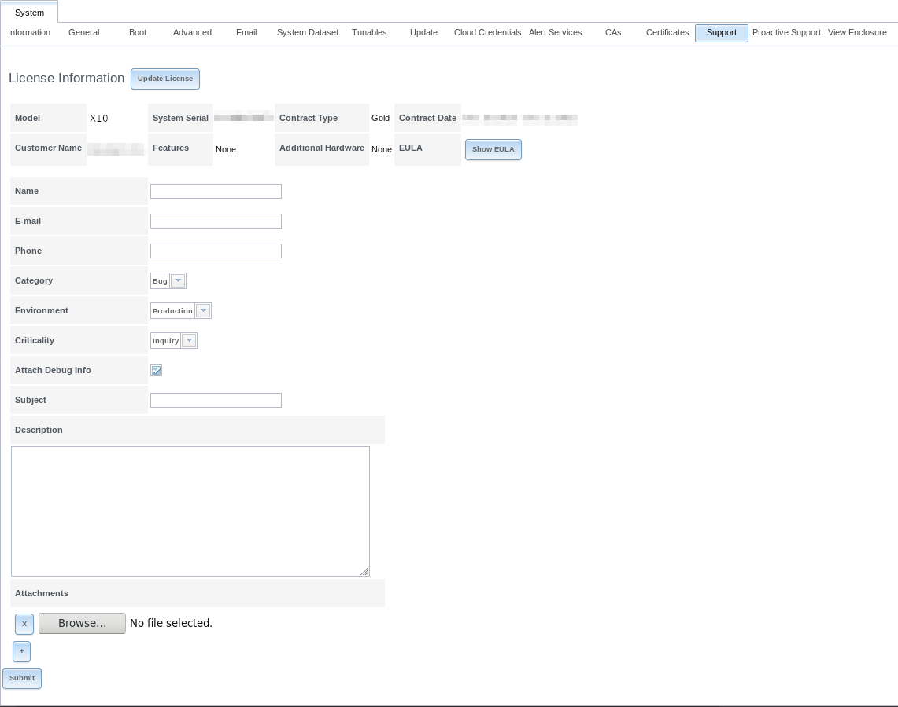

.. _System:

System
======

The System section of the administrative GUI contains these entries:

* :ref:`Information` provides general %brand% system information
  such as hostname, operating system version, platform, and uptime

* :ref:`General` configures general settings such as HTTPS access, the
  language, and the timezone

* :ref:`Boot` creates, renames, and deletes boot environments

* :ref:`Advanced` configures advanced settings such as the serial
  console, swap space, and console messages

* :ref:`Email` configures the email address to receive notifications

* :ref:`System Dataset` configures the location where logs and
  reporting graphs are stored

* :ref:`Tunables` provides a front-end for tuning in real-time and to
  load additional kernel modules at boot time

* :ref:`Update` performs upgrades and checks for system
  updates

#ifdef truenas
* :ref:`Cloud Credentials` is used to enter connection credentials for
  remote cloud service providers
#endif truenas

* :ref:`CAs`: used to import or create an internal or intermediate
  CA (Certificate Authority)

* :ref:`Certificates`: used to import existing certificates or to
  create self-signed certificates

#ifdef freenas
* :ref:`Support`: used to report a bug or request a new feature.
#endif freenas

#ifdef truenas
* :ref:`Support`: used to view licensing information or create a
  support ticket.

* :ref:`Failover`: used to manage High Availability.
#endif truenas

Each of these is described in more detail in this section.

.. _Information:

Information
-----------

:menuselection:`System --> Information`
displays general information about the %brand% system. An example is
seen in
:numref:`Figure %s <system_info_fig>`.

The information includes the hostname, the build version, type of CPU
(platform), the amount of memory, the current system time, the
system's uptime, and the current load average.

To change the system's hostname, click its :guilabel:`Edit` button,
type in the new hostname, and click :guilabel:`OK`. The hostname must
include the domain name. If the network does not use a domain name add
*.local* to the end of the hostname.

.. _system_info_fig:

#ifdef freenas
.. figure:: images/system1d.png

   System Information Tab
#endif freenas
#ifdef truenas
.. figure:: images/tn_system-information.png

   System Information Tab
#endif truenas

.. _General:

General
-------

:menuselection:`System --> General`
is shown in
:numref:`Figure %s <system_general_fig>`.

.. _system_general_fig:

#ifdef freenas
.. figure:: images/system2b.png

   General Screen
#endif freenas
#ifdef truenas
.. figure:: images/tn_system-general.png

   General Screen
#endif truenas

:numref:`Table %s <system_general_tab>` summarizes the settings that
can be configured using the General tab:

.. tabularcolumns:: |>{\RaggedRight}p{\dimexpr 0.25\linewidth-2\tabcolsep}
                    |>{\RaggedRight}p{\dimexpr 0.12\linewidth-2\tabcolsep}
                    |>{\RaggedRight}p{\dimexpr 0.63\linewidth-2\tabcolsep}|

.. _system_general_tab:

.. table:: General Configuration Settings
   :class: longtable

   +----------------------+----------------+--------------------------------------------------------------------------------------------------------------------------+
   | Setting              | Value          | Description                                                                                                              |
   |                      |                |                                                                                                                          |
   +======================+================+==========================================================================================================================+
   | Protocol             | drop-down menu | protocol to use when connecting to the administrative GUI from a browser; if modified from the default of *HTTP* to      |
   |                      |                | *HTTPS* or to                                                                                                            |
   |                      |                | *HTTP+HTTPS*, select the certificate to use in :guilabel:`Certificate`; if you do not have a certificate, first          |
   |                      |                | create a CA (in `CAs`_), then the certificate itself (in `Certificates`_)                                                |
   |                      |                |                                                                                                                          |
   +----------------------+----------------+--------------------------------------------------------------------------------------------------------------------------+
   | Certificate          | drop-down menu | required for *HTTPS*; browse to the location of the certificate to use for encrypted connections                         |
   |                      |                |                                                                                                                          |
   +----------------------+----------------+--------------------------------------------------------------------------------------------------------------------------+
   | WebGUI IPv4 Address  | drop-down menu | choose from a list of recent IP addresses to limit the one to use when accessing the administrative GUI; the             |
   |                      |                | built-in HTTP server will automatically bind to the wildcard address of *0.0.0.0* (any address) and will issue an        |
   |                      |                | alert if the specified address becomes unavailable                                                                       |
   |                      |                |                                                                                                                          |
   +----------------------+----------------+--------------------------------------------------------------------------------------------------------------------------+
   | WebGUI IPv6 Address  | drop-down menu | choose from a list of recent IPv6 addresses to limit the one to use when accessing the administrative GUI; the           |
   |                      |                | built-in HTTP server will automatically bind to any address and will issue an alert                                      |
   |                      |                | if the specified address becomes unavailable                                                                             |
   |                      |                |                                                                                                                          |
   +----------------------+----------------+--------------------------------------------------------------------------------------------------------------------------+
   | WebGUI HTTP Port     | integer        | allows configuring a non-standard port for accessing the administrative GUI over HTTP; changing this setting             |
   |                      |                | might also require                                                                                                       |
   |                      |                | `changing a Firefox configuration setting                                                                                |
   |                      |                | <http://www.redbrick.dcu.ie/%7Ed_fens/articles/Firefox:_This_Address_is_Restricted>`_                                    |
   +----------------------+----------------+--------------------------------------------------------------------------------------------------------------------------+
   | WebGUI HTTPS Port    | integer        | allows configuring a non-standard port for accessing the administrative GUI over HTTPS                                   |
   |                      |                |                                                                                                                          |
   +----------------------+----------------+--------------------------------------------------------------------------------------------------------------------------+
   | WebGUI HTTP -->      | checkbox       | when this box is checked, *HTTP* connections are automatically redirected to                                             |
   | HTTPS Redirect       |                | *HTTPS* if                                                                                                               |
   |                      |                | *HTTPS* is selected in :guilabel:`Protocol`, otherwise such connections will fail                                        |
   |                      |                |                                                                                                                          |
   |                      |                |                                                                                                                          |
   +----------------------+----------------+--------------------------------------------------------------------------------------------------------------------------+
   | Language             | drop-down menu | select the localization from the drop-down menu and reload the browser; view the status of localization at               |
   |                      |                | `pootle.freenas.org <http://pootle.freenas.org/>`_                                                                       |
   |                      |                |                                                                                                                          |
   +----------------------+----------------+--------------------------------------------------------------------------------------------------------------------------+
   | Console Keyboard Map | drop-down menu | select the keyboard layout                                                                                               |
   |                      |                |                                                                                                                          |
   +----------------------+----------------+--------------------------------------------------------------------------------------------------------------------------+
   | Timezone             | drop-down menu | select the timezone from the drop-down menu                                                                              |
   |                      |                |                                                                                                                          |
   +----------------------+----------------+--------------------------------------------------------------------------------------------------------------------------+
   | Syslog level         | drop-down menu | when :guilabel:`Syslog server` is defined, only logs matching this level are sent                                        |
   |                      |                |                                                                                                                          |
   +----------------------+----------------+--------------------------------------------------------------------------------------------------------------------------+
   | Syslog server        | string         | *IP address_or_hostname:optional_port_number* of remote syslog server to send logs to; once set, log entries             |
   |                      |                | are written to both the console and the remote server                                                                    |
   |                      |                |                                                                                                                          |
   +----------------------+----------------+--------------------------------------------------------------------------------------------------------------------------+

After making any changes, click the :guilabel:`Save` button.

This screen also contains these buttons:

**Factory Restore:** resets the configuration database to the default
base version. However, it does not delete user SSH keys or any other
data stored in a user's home directory. Since any configuration
changes stored in the configuration database will be erased, this
option is handy if a mistake has been made or to return a test system
to the original configuration.

**Save Config:** saves a backup copy of the current configuration
database in the format *hostname-version-architecture* to the system
being used to access the administrative interface. It is recommended
to always save the configuration after making any configuration
changes. %brand% automatically backs up the configuration database to
the system dataset every morning at 3:45. However, this backup will
not occur if the system is shut down at that time. If the system
dataset is stored on the boot pool and the boot pool becomes
unavailable, the backup will not be available. The location of the
system dataset can be viewed or set using
:menuselection:`System --> System Dataset`.

.. warning:: Passwords are backed up with the system configuration.
   There are two types of passwords. User account passwords for the
   base operating system are stored as hashed values, do not need to
   be encrypted to be secure, and are saved in the system
   configuration backup. Other passwords, like iSCSI CHAP passwords or
   Active Directory bind credentials, must be stored in an encrypted
   form to prevent them from being visible as plain text in the saved
   system configuration. The key for this encryption is stored on the
   boot device. If %brand% is installed on a new boot device and a
   backup system configuration is moved to that new boot device, the
   key is not present and these other passwords must be re-entered.

**Upload Config:** allows browsing to the location of a previously
saved configuration file to restore that configuration. The screen
turns red as an indication that the system will need to reboot to load
the restored configuration.

**NTP Servers:** The network time protocol (NTP) is used to
synchronize the time on the computers in a network. Accurate time is
necessary for the successful operation of time sensitive applications
such as Active Directory or other directory services. By default,
%brand% is pre-configured to use three public NTP servers. If your
network is using a directory service, ensure that the %brand% system
and the server running the directory service have been configured to
use the same NTP servers.

Available NTP servers can be found at
`<https://support.ntp.org/bin/view/Servers/NTPPoolServers>`_.
For time accuracy, choose NTP servers that are geographically close to
the %brand% system's physical location.

NTP servers are added by clicking on
:menuselection:`NTP Servers --> Add NTP Server`
to open the screen shown in
:numref:`Figure %s <ntp_server_fig>`.
:numref:`Table %s <ntp_server_conf_opts_tab>`
summarizes the options available when adding an NTP server.
`ntp.conf(5) <http://www.freebsd.org/cgi/man.cgi?query=ntp.conf>`_
explains these options in more detail.

.. _ntp_server_fig:

.. figure:: images/ntp1.png

   Add an NTP Server

.. tabularcolumns:: |>{\RaggedRight}p{\dimexpr 0.25\linewidth-2\tabcolsep}
                    |>{\RaggedRight}p{\dimexpr 0.12\linewidth-2\tabcolsep}
                    |>{\RaggedRight}p{\dimexpr 0.63\linewidth-2\tabcolsep}|

.. _ntp_server_conf_opts_tab:

.. table:: NTP Servers Configuration Options
   :class: longtable

   +-------------+-----------+----------------------------------------------------------------------------------------------------+
   | Setting     | Value     | Description                                                                                        |
   |             |           |                                                                                                    |
   |             |           |                                                                                                    |
   +=============+===========+====================================================================================================+
   | Address     | string    | name of NTP server                                                                                 |
   |             |           |                                                                                                    |
   +-------------+-----------+----------------------------------------------------------------------------------------------------+
   | Burst       | checkbox  | recommended when :guilabel:`Max. Poll` is greater than *10*; only use on your own servers i.e.     |
   |             |           | **do not** use with a public NTP server                                                            |
   |             |           |                                                                                                    |
   +-------------+-----------+----------------------------------------------------------------------------------------------------+
   | IBurst      | checkbox  | speeds the initial synchronization (seconds instead of minutes)                                    |
   |             |           |                                                                                                    |
   +-------------+-----------+----------------------------------------------------------------------------------------------------+
   | Prefer      | checkbox  | should only be used for NTP servers that are known to be highly accurate, such as those with       |
   |             |           | time monitoring hardware                                                                           |
   +-------------+-----------+----------------------------------------------------------------------------------------------------+
   | Min. Poll   | integer   | power of 2 in seconds; cannot be lower than                                                        |
   |             |           | *4* or higher than :guilabel:`Max. Poll`                                                           |
   |             |           |                                                                                                    |
   +-------------+-----------+----------------------------------------------------------------------------------------------------+
   | Max. Poll   | integer   | power of 2 in seconds; cannot be higher than                                                       |
   |             |           | *17* or lower than :guilabel:`Min. Poll`                                                           |
   |             |           |                                                                                                    |
   +-------------+-----------+----------------------------------------------------------------------------------------------------+
   | Force       | checkbox  | forces the addition of the NTP server, even if it is currently unreachable                         |
   |             |           |                                                                                                    |
   +-------------+-----------+----------------------------------------------------------------------------------------------------+

.. index:: Boot Environments, Multiple Boot Environments
.. _Boot:

Boot
----

%brand% supports a ZFS feature known as multiple boot environments.
With multiple boot environments, the process of updating the operating
system becomes a low-risk operation. The updater automatically creates
a snapshot of the current boot environment and adds it to the boot
menu before applying the update. If the update fails, reboot the
system and select the previous boot environment from the boot menu to
instruct the system to go back to that system state.

.. note:: Boot environments are separate from the configuration
   database. Boot environments are a snapshot of the
   *operating system* at a specified time. When a %brand% system
   boots, it loads the specified boot environment, or operating
   system, then reads the configuration database in order to load the
   current configuration values. If the intent is to make
   configuration changes rather than operating system changes, make a
   backup of the configuration database first using
   :menuselection:`System --> General --> Save Config`.

As seen in
:numref:`Figure %s <view_boot_env_fig>`,
two boot environments are created when %brand% is installed. The
system will boot into the *default* boot environment and users can
make their changes and update from this version. The other boot
environment, named *Initial-Install* can be booted into if the system
needs to be returned to a pristine, non-configured version of the
installation.

If the :ref:`Wizard` was used, a third boot environment called
:samp:`Wizard-{date}` is also created, indicating the date and time
the :ref:`Wizard` was run.

.. _view_boot_env_fig:

#ifdef freenas
.. figure:: images/be1g.png

   Viewing Boot Environments
#endif freenas
#ifdef truenas
.. figure:: images/be1b.png

   Viewing Boot Environments
#endif truenas

Each boot environment entry contains this information:

* **Name:** the name of the boot entry as it will appear in the boot
  menu.

* **Active:** indicates which entry will boot by default if the user
  does not select another entry in the boot menu.

* **Created:** indicates the date and time the boot entry was created.

* **Keep:** indicates whether or not this boot environment can be
  pruned if an update does not have enough space to proceed. Click the
  entry's :guilabel:`Keep` button if that boot environment should not
  be automatically pruned.

Highlight an entry to view its configuration buttons.  These
configuration buttons are shown:

* **Rename:** used to change the name of the boot environment.

* **Keep/Unkeep:** used to toggle whether or not the updater can prune
  (automatically delete) this boot environment if there is not enough
  space to proceed with the update.

* **Clone:** used to create a copy of the highlighted boot
  environment.

* **Delete:** used to delete the highlighted entry, which also removes
  that entry from the boot menu. Since you cannot delete an entry that
  has been activated, this button will not appear for the active boot
  environment. If you need to delete an entry that  is currently
  activated, first activate another entry, which will clear the
  *On reboot* field of the currently activated entry. Note that this
  button will not be displayed for the *default* boot environment as
  this entry is needed in order to return the system to the original
  installation state.

* **Activate:** only appears on entries which are not currently set to
  :guilabel:`Active`. Changes the selected entry to the default boot
  entry on next boot. Its status changes to :guilabel:`On Reboot` and
  the current :guilabel:`Active` entry changes from
  :guilabel:`On Reboot, Now` to :guilabel:`Now`, indicating that it
  was used on the last boot but will not be used on the next boot.

The buttons above the boot entries can be used to:

* **Create:** a manual boot environment. A pop-up menu will prompt you
  to input a "Name" for the boot environment. When entering the name,
  only alphanumeric characters, underscores, and dashes are allowed.

* **Scrub Boot:** can be used to perform a manual scrub of the boot
  devices. By default, the boot device is scrubbed every 35 days. To
  change the default interval, input a different number in the
  :guilabel:`Automatic scrub interval (in days)` field. The date and
  results of the last scrub are also listed in this screen. The
  condition of the boot device should be listed as *HEALTHY*.

* **Status:** click this button to see the status of the boot devices.
  In the example shown in
  :numref:`Figure %s <status_boot_dev_fig>`,
  there is only one boot device and it is *ONLINE*.

.. _status_boot_dev_fig:

#ifdef freenas
.. figure:: images/be2.png

   Viewing the Status of the Boot Device
#endif freenas
#ifdef truenas
.. figure:: images/tn_be2.png

   Viewing the Status of the Boot Device
#endif truenas

#ifdef freenas
If this system has a mirrored boot device and one of the boot devices
has a :guilabel:`Status` of *OFFLINE*, click the device to replace,
then click its :guilabel:`Replace` button to rebuild the boot mirror.
#endif freenas
#ifdef truenas
If one of the boot devices has a :guilabel:`Status` of *OFFLINE*,
click the device to replace, select the new replacement device, and
click :guilabel:`Replace Disk` to rebuild the boot mirror.
#endif truenas

#ifdef freenas
Note that
**you cannot replace the boot device if it is the only boot device**
as it contains the operating system itself.
#endif freenas

:numref:`Figure %s <be_in_menu_fig>`
shows a sample boot menu.

.. _be_in_menu_fig:

#ifdef freenas
.. figure:: images/be3c.png

   Boot Environments in Boot Menu
#endif freenas
#ifdef truenas
.. figure:: images/tn_be3a.png

   Boot Environments in Boot Menu
#endif truenas

The first entry is the active boot environment, or the one that the
system has been configured to boot into. To boot into a different boot
environment, press the :kbd:`spacebar` to pause this screen, use the
down arrow to select :guilabel:`Boot Environment Menu`, and press
:kbd:`Enter`. A menu displays the other available boot environments.
Use the up/down arrows to select the desired boot environment and
press :kbd:`Enter` to boot into it. To always boot into that boot
environment, go to :menuselection:`System --> Boot`, highlight that
entry, and click the :guilabel:`Activate` button.

#ifdef freenas
.. index:: Mirroring the Boot Device
.. _Mirroring the Boot Device:

Mirroring the Boot Device
~~~~~~~~~~~~~~~~~~~~~~~~~

If the system is currently booting from one device, you can add
another device to create a mirrored boot device. This way, if one
device fails, the system still has a copy of the boot file system and
can be configured to boot from the remaining device in the mirror.

.. note:: When adding another boot device, it must be the same size
   (or larger) as the existing boot device. Different models of USB
   devices which advertise the same size may not necessarily be the
   same size. For this reason, it is recommended to use the same model
   of USB drive.

In the example shown in
:numref:`Figure %s <mirror_boot_dev_fig>`,
the user has clicked
:menuselection:`System --> Boot --> Status`
to display the current status of the boot device. The example
indicates that there is currently one device, *ada0p2*, its status is
*ONLINE*, and it is currently the only boot device as indicated by the
word *stripe*. To create a mirrored boot device, click either the
entry called *freenas-boot* or *stripe*, then click the
:guilabel:`Attach` button. If another device is available, it appears
in the :guilabel:`Member disk` drop-down menu. Select the desired
device, then click :guilabel:`Attach Disk`.

.. _mirror_boot_dev_fig:

.. figure:: images/mirror1.png

   Mirroring a Boot Device

Once the mirror is created, the :guilabel:`Status` screen indicates
that it is now a *mirror*. The number of devices in the mirror are
shown, as seen in the example in
:numref:`Figure %s <mirror_boot_status_fig>`.

.. _mirror_boot_status_fig:

.. figure:: images/mirror2.png

   Viewing the Status of a Mirrored Boot Device
#endif freenas

.. _Advanced:

Advanced
--------

:menuselection:`System --> Advanced`
is shown in
:numref:`Figure %s <system_adv_fig>`.
The configurable settings are summarized in
:numref:`Table %s <adv_config_tab>`.

.. _system_adv_fig:

#ifdef freenas
.. figure:: images/system3b.png

   Advanced Screen
#endif freenas
#ifdef truenas
.. figure:: images/tn_system-advanced1.png

   Advanced Screen
#endif truenas

.. tabularcolumns:: |>{\RaggedRight}p{\dimexpr 0.25\linewidth-2\tabcolsep}
                    |>{\RaggedRight}p{\dimexpr 0.12\linewidth-2\tabcolsep}
                    |>{\RaggedRight}p{\dimexpr 0.63\linewidth-2\tabcolsep}|

.. _adv_config_tab:

.. table:: Advanced Configuration Settings
   :class: longtable

   +-----------------------------------------+----------------------------------+------------------------------------------------------------------------------+
   | Setting                                 | Value                            | Description                                                                  |
   |                                         |                                  |                                                                              |
   +=========================================+==================================+==============================================================================+
   | Enable Console Menu                     | checkbox                         | unchecking this box removes the console menu shown in                        |
   |                                         |                                  | :numref:`Figure %s <console_setup_menu_fig>`                                 |
   +-----------------------------------------+----------------------------------+------------------------------------------------------------------------------+
   | Use Serial Console                      | checkbox                         | **do not** check this box if the serial port is disabled                     |
   |                                         |                                  |                                                                              |
   +-----------------------------------------+----------------------------------+------------------------------------------------------------------------------+
   | Serial Port Address                     | string                           | serial port address in hex                                                   |
   |                                         |                                  |                                                                              |
   +-----------------------------------------+----------------------------------+------------------------------------------------------------------------------+
   | Serial Port Speed                       | drop-down menu                   | select the speed used by the serial port                                     |
   |                                         |                                  |                                                                              |
   +-----------------------------------------+----------------------------------+------------------------------------------------------------------------------+
   | Enable screen saver                     | checkbox                         | enable or disable the console screen saver                                   |
   |                                         |                                  |                                                                              |
   +-----------------------------------------+----------------------------------+------------------------------------------------------------------------------+
   | Enable powerd (Power Saving Daemon)     | checkbox                         | `powerd(8) <http://www.freebsd.org/cgi/man.cgi?query=powerd>`_               |
   |                                         |                                  | monitors the system state and sets the CPU frequency accordingly             |
   |                                         |                                  |                                                                              |
   #ifdef freenas
   +-----------------------------------------+----------------------------------+------------------------------------------------------------------------------+
   | Swap size                               | non-zero integer representing GB | by default, all data disks are created with this amount of swap; this        |
   |                                         |                                  | setting does not affect log or cache devices as they are created without     |
   |                                         |                                  | swap                                                                         |
   |                                         |                                  |                                                                              |
   #endif freenas
   +-----------------------------------------+----------------------------------+------------------------------------------------------------------------------+
   | Show console messages in the footer     | checkbox                         | display console messages in real time at bottom of browser; click the        |
   |                                         |                                  | console to bring up a scrollable screen; check the :guilabel:`Stop refresh`  |
   |                                         |                                  | box in the scrollable screen to pause updating and uncheck the box           |
   |                                         |                                  | to continue to watch the messages as they occur                              |
   |                                         |                                  |                                                                              |
   +-----------------------------------------+----------------------------------+------------------------------------------------------------------------------+
   | Show tracebacks in case of fatal errors | checkbox                         | provides a pop-up of diagnostic information when a fatal error occurs        |
   |                                         |                                  |                                                                              |
   +-----------------------------------------+----------------------------------+------------------------------------------------------------------------------+
   | Show advanced fields by default         | checkbox                         | several GUI menus provide an :guilabel:`Advanced Mode` button to access      |
   |                                         |                                  | additional features; enabling this shows these features by default           |
   |                                         |                                  |                                                                              |
   +-----------------------------------------+----------------------------------+------------------------------------------------------------------------------+
   | Enable autotune                         | checkbox                         | enables :ref:`autotune` which attempts to optimize the system depending      |
   |                                         |                                  | upon the hardware which is installed                                         |
   |                                         |                                  |                                                                              |
   +-----------------------------------------+----------------------------------+------------------------------------------------------------------------------+
   | Enable debug kernel                     | checkbox                         | when checked, next boot uses a debug version of the kernel                   |
   |                                         |                                  |                                                                              |
   +-----------------------------------------+----------------------------------+------------------------------------------------------------------------------+
   | Enable automatic upload of kernel       | checkbox                         | when checked, kernel crash dumps and telemetry (some system stats, collectd  |
   | crash dumps and daily telemetry         |                                  | RRDs, and select syslog messages) are automatically sent to the development  |
   |                                         |                                  | team for diagnosis                                                           |
   |                                         |                                  |                                                                              |
   +-----------------------------------------+----------------------------------+------------------------------------------------------------------------------+
   | MOTD banner                             | string                           | message to be shown when a user logs in with SSH                             |
   |                                         |                                  |                                                                              |
   +-----------------------------------------+----------------------------------+------------------------------------------------------------------------------+
   | Periodic Notification User              | drop-down menu                   | user to receive security output emails; this output runs nightly             |
   |                                         |                                  | but only sends an email when the system reboots or encounters an error       |
   |                                         |                                  |                                                                              |
   +-----------------------------------------+----------------------------------+------------------------------------------------------------------------------+
   | Remote Graphite Server hostname         | string                           | IP address or hostname of a remote server running                            |
   |                                         |                                  | `Graphite <http://graphite.wikidot.com/>`_                                   |
   |                                         |                                  |                                                                              |
   +-----------------------------------------+----------------------------------+------------------------------------------------------------------------------+
   | Use FQDN for logging                    | checkbox                         | when checked, include the Fully-Qualified Domain Name in logs to precisely   |
   |                                         |                                  | identify systems with similar hostnames                                      |
   +-----------------------------------------+----------------------------------+------------------------------------------------------------------------------+
   #ifdef truenas
   | Enable automatic support alerts to      | checkbox                         | when checked, allow emails to be sent to iXsystems when an alert occurs      |
   | iXsystems                               |                                  |                                                                              |
   |                                         |                                  |                                                                              |
   +-----------------------------------------+----------------------------------+------------------------------------------------------------------------------+
   | Failsafe Support Contact                | string                           | enter an always-monitored email address to be contacted by iXsystems in      |
   |                                         |                                  | case of failure                                                              |
   |                                         |                                  |                                                                              |
   +-----------------------------------------+----------------------------------+------------------------------------------------------------------------------+
   #endif truenas

Click the :guilabel:`Save` button after making any changes.

This tab also contains this button:

**Save Debug:** used to generate a text file of diagnostic
information. After the debug data is collected, the system prompts for
a location to save the generated ASCII text file.

.. index:: Autotune
.. _Autotune:

Autotune
~~~~~~~~

#ifdef freenas
%brand% provides an autotune script which optimizes the system
depending on the installed hardware. For example, if a ZFS volume
exists on a system with limited RAM, the autotune script automatically
adjusts some ZFS sysctl values in an attempt to minimize ZFS memory
starvation issues. It should only be used as a temporary measure on a
system that hangs until the underlying hardware issue is addressed by
adding more RAM. Autotune will always slow such a system, as it caps
the ARC.

The :guilabel:`Enable autotune` checkbox in
:menuselection:`System --> Advanced`
is unchecked by default. Check this box to run the autotuner at boot
time. If you would like the script to run immediately, the system must
be rebooted.

If the autotune script adjusts any settings, the changed values appear
in
:menuselection:`System --> Tunables`.
These values can be modified and overridden. Note that deleting
tunables that were created by autotune only affects the current
session, as autotune-set tunables are recreated at boot.

When attempting to increase the performance of the %brand% system, and
particularly when the current hardware may be limiting performance,
try enabling autotune.

For those who wish to see which checks are performed, the autotune
script is located in :file:`/usr/local/bin/autotune`.
#endif freenas
#ifdef truenas
%brand% provides an autotune script which optimizes the system. The
:guilabel:`Enable autotune` checkbox in
:menuselection:`System --> Advanced` is checked by default, so this
script runs automatically. It is recommended to leave autotune enabled
unless advised otherwise by an iXsystems support engineer.

If the autotune script adjusts any settings, the changed values appear
in
:menuselection:`System --> Tunables`.
While these values can be modified and overridden, speak to your
support engineer beforehand as manual changes can have a negative
impact on system performance. Note that deleting tunables that
were created by autotune only affects the current session, as
autotune-set tunables are recreated at boot.

For those who wish to see which checks are performed, the autotune
script is located in :file:`/usr/local/bin/autotune`.
#endif truenas

.. index:: Email
.. _Email:

Email
-----

An automatic script sends a nightly email to the *root* user account
containing important information such as the health of the disks.
:ref:`Alert` events are also emailed to the *root* user account.
Problems with :ref:`Scrubs` are reported separately in an email sent
at 03:00AM.

.. note:: :ref:`S.M.A.R.T.` reports are mailed separately to the
   address configured in that service.

The administrator typically does not read email directly on
the %brand% system. Instead, these emails are usually sent to an
external email address where they can be read more conveniently. It is
important to configure the system so it can send these emails to the
administrator's remote email account so they are aware of problems or
status changes.

The first step is to set the remote address where email will be sent.
Select
:menuselection:`Users --> View Users`, click on *root* to highlight
that user, then click :guilabel:`Change E-mail`. Enter the email
address on the remote system where email is to be sent, like
*admin@example.com*.

Additional configuration is performed with
:menuselection:`System --> Email`,
shown in
:numref:`Figure %s <email_conf_fig>`.

.. _email_conf_fig:

#ifdef freenas
.. figure:: images/system4b.png

   Email Screen
#endif freenas
#ifdef truenas
.. figure:: images/tn_system-email.png

   Email Screen
#endif truenas

.. tabularcolumns:: |p{1.2in}|p{1.2in}|p{3.6in}|
.. tabularcolumns:: |>{\RaggedRight}p{\dimexpr 0.20\linewidth-2\tabcolsep}
                    |>{\RaggedRight}p{\dimexpr 0.20\linewidth-2\tabcolsep}
                    |>{\RaggedRight}p{\dimexpr 0.60\linewidth-2\tabcolsep}|

.. _email_conf_tab:

.. table:: Email Configuration Settings
   :class: longtable

   +----------------------+----------------------+-------------------------------------------------------------------------------------------------+
   | Setting              | Value                | Description                                                                                     |
   |                      |                      |                                                                                                 |
   +======================+======================+=================================================================================================+
   | From email           | string               | the envelope **From** address shown in the email; this can be set to assist with filtering      |
   |                      |                      | mail on the receiving system                                                                    |
   +----------------------+----------------------+-------------------------------------------------------------------------------------------------+
   | Outgoing mail server | string or IP address | hostname or IP address of SMTP server to use for sending this email                             |
   |                      |                      |                                                                                                 |
   +----------------------+----------------------+-------------------------------------------------------------------------------------------------+
   | Port to connect to   | integer              | SMTP port number, typically *25*,                                                               |
   |                      |                      | *465* (secure SMTP), or                                                                         |
   |                      |                      | *587* (submission)                                                                              |
   |                      |                      |                                                                                                 |
   +----------------------+----------------------+-------------------------------------------------------------------------------------------------+
   | TLS/SSL              | drop-down menu       | encryption type; choices are *Plain*,                                                           |
   |                      |                      | *SSL*, or                                                                                       |
   |                      |                      | *TLS*                                                                                           |
   |                      |                      |                                                                                                 |
   +----------------------+----------------------+-------------------------------------------------------------------------------------------------+
   | Use                  | checkbox             | enable/disable                                                                                  |
   | SMTP                 |                      | `SMTP AUTH <http://en.wikipedia.org/wiki/SMTP_Authentication>`_                                 |
   | Authentication       |                      | using PLAIN SASL; if checked, enter the required :guilabel:`Username` and                       |
   |                      |                      | :guilabel:`Password`                                                                            |
   +----------------------+----------------------+-------------------------------------------------------------------------------------------------+
   | Username             | string               | enter the username if the SMTP server requires authentication                                   |
   |                      |                      |                                                                                                 |
   +----------------------+----------------------+-------------------------------------------------------------------------------------------------+
   | Password             | string               | enter the password if the SMTP server requires authentication                                   |
   |                      |                      |                                                                                                 |
   +----------------------+----------------------+-------------------------------------------------------------------------------------------------+
   | Password             | string               | enter the same password again for confirmation                                                  |
   | Confirmation         |                      |                                                                                                 |
   +----------------------+----------------------+-------------------------------------------------------------------------------------------------+

Click the :guilabel:`Send Test Mail` button to verify that the
configured email settings are working. If the test email fails,
double-check the destination email address by clicking the
:guilabel:`Change E-mail` button for the *root* account in
:menuselection:`Account --> Users --> View Users`.
Test mail cannot be sent unless the *root* email address has been set.

Configuring email for TLS/SSL email providers is described in
`Are you having trouble getting FreeNAS to email you in Gmail?
<https://forums.freenas.org/index.php?threads/are-you-having-trouble-getting-freenas-to-email-you-in-gmail.22517/>`_.

.. note: The %brand% user who receives periodic email can be set with
   :menuselection:`System --> Advanced` in the
   :guilabel:`Periodic Notification User` field.

.. index:: System Dataset

.. _System Dataset:

System Dataset
--------------

:menuselection:`System --> System Dataset`,
shown in
:numref:`Figure %s <system_dataset_fig>`,
is used to select the pool which will contain the persistent system
dataset. The system dataset stores debugging core files and Samba4
metadata such as the user/group cache and share level permissions. If
the %brand% system is configured to be a Domain Controller, all of
the domain controller state is stored there as well, including domain
controller users and groups.

.. note:: When the system dataset is moved, a new dataset is created
   and set active. The old dataset is intentionally not deleted by
   the system because the move might be transient or the information
   in the old dataset might be useful for later recovery.

.. _system_dataset_fig:

#ifdef freenas
.. figure:: images/system5a.png

   System Dataset Screen
#endif freenas
#ifdef truenas
.. figure:: images/tn_system-system-dataset.png

   System Dataset Screen
#endif truenas

.. note:: Encrypted volumes are not displayed in the
   :guilabel:`System dataset pool` drop-down menu.

The system dataset can optionally be configured to also store the
system log and :ref:`Reporting` information. If there are lots of log
entries or reporting information, moving these to the system dataset
will prevent :file:`/var/` on the device holding the operating system
from filling up as :file:`/var/` has limited space.

Use the drop-down menu to select the ZFS volume (pool) to contain the
system dataset. Whenever the location of the system dataset is
changed, a pop-up warning indicates that the SMB service must be
restarted, causing a temporary outage of any active SMB connections.

#ifdef truenas
.. note:: It is recommended to store the system dataset on the
   :file:`freenas-boot` pool. For this reason, a yellow system alert
   will be generated when the system dataset is configured to
   use another pool.
#endif truenas

To store the system log on the system dataset, check the
:guilabel:`Syslog` box.

To store the reporting information on the system dataset, check the
:guilabel:`Reporting Database` box.

If you make any changes, click the :guilabel:`Save` button to save
them.

If you change the pool storing the system dataset at a later time,
%brand% will automatically migrate the existing data in the system
dataset to the new location.

.. note:: Depending on configuration, the system dataset can occupy a
   large amount of space and receive frequent writes. Do not put the
   system dataset on a flash drive or other media with limited space
   or write life.

.. index:: Tunables
.. _Tunables:

Tunables
--------

:menuselection:`System --> Tunables`
can be used to manage the following:

#. **FreeBSD sysctls:** a
   `sysctl(8) <http://www.freebsd.org/cgi/man.cgi?query=sysctl>`_
   makes changes to the FreeBSD kernel running on a %brand% system
   and can be used to tune the system.

#. **FreeBSD loaders:** a loader is only loaded when a FreeBSD-based
   system boots and can be used to pass a parameter to the kernel or
   to load an additional kernel module such as a FreeBSD hardware
   driver.

#. **FreeBSD rc.conf options:**
   `rc.conf(5)
   <https://www.freebsd.org/cgi/man.cgi?query=rc.conf&apropos=0&sektion=0&manpath=FreeBSD+10.3-RELEASE>`_
   is used to pass system configuration options to the system startup
   scripts as the system boots. Since %brand% has been optimized for
   storage, not all of the services mentioned in rc.conf(5) are
   available for configuration. Note that in %brand%, customized
   rc.conf options are stored in
   :file:`/tmp/rc.conf.freenas`.

.. warning:: Adding a sysctl, loader, or :file:`rc.conf` option is an
   advanced feature. A sysctl immediately affects the kernel running
   the %brand% system and a loader could adversely affect the ability
   of the %brand% system to successfully boot.
   **Do not create a tunable on a production system unless you
   understand and have tested the ramifications of that change.**

Since sysctl, loader, and rc.conf values are specific to the kernel
parameter to be tuned, the driver to be loaded, or the service to
configure, descriptions and suggested values can be found in the man
page for the specific driver and in many sections of the
`FreeBSD Handbook <http://www.freebsd.org/handbook>`_.

To add a loader, sysctl, or :file:`rc.conf` option, go to
:menuselection:`System --> Tunables --> Add Tunable`,
to access the screen shown in seen in
:numref:`Figure %s <add_tunable_fig>`.

.. _add_tunable_fig:

.. figure:: images/tunable.png

   Adding a Tunable

:numref:`Table %s <add_tunable_tab>`
summarizes the options when adding a tunable.

.. tabularcolumns:: |>{\RaggedRight}p{\dimexpr 0.16\linewidth-2\tabcolsep}
                    |>{\RaggedRight}p{\dimexpr 0.20\linewidth-2\tabcolsep}
                    |>{\RaggedRight}p{\dimexpr 0.64\linewidth-2\tabcolsep}|

.. _add_tunable_tab:

.. table:: Adding a Tunable
   :class: longtable

   +-------------+-------------------+-------------------------------------------------------------------------------------+
   | Setting     | Value             | Description                                                                         |
   |             |                   |                                                                                     |
   |             |                   |                                                                                     |
   +=============+===================+=====================================================================================+
   | Variable    | string            | typically the name of the sysctl or driver to load, as indicated by its man page    |
   |             |                   |                                                                                     |
   +-------------+-------------------+-------------------------------------------------------------------------------------+
   | Value       | integer or string | value to associate with :guilabel:`Variable`; typically this is set to *YES*        |
   |             |                   | to enable the sysctl or driver specified by the "Variable"                          |
   |             |                   |                                                                                     |
   +-------------+-------------------+-------------------------------------------------------------------------------------+
   | Type        | drop-down menu    | choices are *Loader*,                                                               |
   |             |                   | *rc.conf*, or                                                                       |
   |             |                   | *Sysctl*                                                                            |
   |             |                   |                                                                                     |
   +-------------+-------------------+-------------------------------------------------------------------------------------+
   | Comment     | string            | optional, but a useful reminder for the reason behind adding this tunable           |
   |             |                   |                                                                                     |
   +-------------+-------------------+-------------------------------------------------------------------------------------+
   | Enabled     | checkbox          | uncheck if you would like to disable the tunable without deleting it                |
   |             |                   |                                                                                     |
   +-------------+-------------------+-------------------------------------------------------------------------------------+

.. note:: As soon as a *Sysctl* is added or edited, the running kernel
   changes that variable to the value specified. However, when a
   *Loader* or *rc.conf* value is changed, it does not take effect
   until the system is rebooted. Regardless of the type of tunable,
   changes persist at each boot and across upgrades unless the tunable
   is deleted or its :guilabel:`Enabled` checkbox is unchecked.

Any tunables that you add will be listed in
:menuselection:`System --> Tunables`.
To change the value of an existing tunable, click its :guilabel:`Edit`
button. To remove a tunable, click its :guilabel:`Delete` button.

Some sysctls are read-only, meaning that they require a reboot in
order to enable their setting. You can determine if a sysctl is
read-only by first attempting to change it from :ref:`Shell`. For
example, to change the value of *net.inet.tcp.delay_ack* to *1*, use
the command :command:`sysctl net.inet.tcp.delay_ack=1`. If the sysctl
value is read-only, an error message indicates that the setting is
read-only. If no error is shown, the setting is now applied. For the
setting to be persistent across reboots, the sysctl must still be
added in
:menuselection:`System --> Tunables`.

The GUI does not display the sysctls that are pre-set when %brand% is
installed. %brand% |release| ships with the following sysctls set:

#ifdef freenas
.. code-block:: none

   kern.metadelay=3
   kern.dirdelay=4
   kern.filedelay=5
   kern.coredump=1
   kern.sugid_coredump=1
   net.inet.tcp.delayed_ack=0
   vfs.timestamp_precision=3
   net.link.lagg.lacp.default_strict_mode=0
   vfs.zfs.min_auto_ashift=12
#endif freenas
#ifdef truenas
.. code-block:: none

   kern.metadelay=3
   kern.dirdelay=4
   kern.filedelay=5
   kern.coredump=0
   net.inet.carp.preempt=1
   debug.ddb.textdump.pending=1
   vfs.nfsd.tcpcachetimeo=300
   vfs.nfsd.tcphighwater=150000
   vfs.zfs.vdev.larger_ashift_minimal=0
   net.inet.carp.senderr_demotion_factor=0
   net.inet.carp.ifdown_demotion_factor=0
#endif truenas

**Do not add or edit these default sysctls** as doing so may render
the system unusable.

The GUI does not display the loaders that are pre-set when %brand% is
installed. %brand% |release| ships with these loaders set:

#ifdef freenas
.. code-block:: none

   autoboot_delay="2"
   loader_logo="freenas"
   loader_menu_title="Welcome to FreeNAS"
   loader_brand="freenas-brand"
   loader_version=" "
   kern.cam.boot_delay="30000"
   debug.debugger_on_panic=1
   debug.ddb.textdump.pending=1
   hw.hptrr.attach_generic=0
   vfs.mountroot.timeout="30"
   ispfw_load="YES"
   hint.isp.0.role=2
   hint.isp.1.role=2
   hint.isp.2.role=2
   hint.isp.3.role=2
   module_path="/boot/kernel;/boot/modules;/usr/local/modules"
   net.inet6.ip6.auto_linklocal="0"
   vfs.zfs.vol.mode=2
   kern.geom.label.disk_ident.enable="0"
   hint.ahciem.0.disabled="1"
   hint.ahciem.1.disabled="1"
   kern.msgbufsize="524288"
   hw.usb.no_shutdown_wait=1
#endif freenas
#ifdef truenas
.. code-block:: none

   autoboot_delay="2"
   loader_logo="truenas-logo"
   loader_menu_title="Welcome to TrueNAS"
   loader_brand="truenas-brand"
   loader_version=" "
   kern.cam.boot_delay="10000"
   debug.debugger_on_panic=1
   debug.ddb.textdump.pending=1
   hw.hptrr.attach_generic=0
   ispfw_load="YES"
   module_path="/boot/kernel;/boot/modules;/usr/local/modules"
   net.inet6.ip6.auto_linklocal="0"
   vfs.zfs.vol.mode=2
   kern.geom.label.disk_ident.enable="0"
   hint.ahciem.0.disabled="1"
   hint.ahciem.1.disabled="1"
   kern.msgbufsize="524288"
   kern.ipc.nmbclusters="262144"
   kern.hwpmc.nbuffers="4096"
   kern.hwpmc.nsamples="4096"
   hw.memtest.tests="0"
   vfs.zfs.trim.enabled="0"
   kern.cam.ctl.ha_mode=2
   kern.geom.label.ufs.enable=0
   kern.geom.label.ufsid.enable=0
   hint.ntb_hw.0.config="ntb_nvdimm:1:4:0,ntb_transport"
   hint.ntb_transport.0.config=":3"
   hw.ntb.msix_mw_idx="-1"
#endif truenas

**Do not add or edit the default tunables** as doing so might make the
system unusable.

The ZFS version used in |release| deprecates these tunables:

.. code-block:: none

   vfs.zfs.write_limit_override
   vfs.zfs.write_limit_inflated
   vfs.zfs.write_limit_max
   vfs.zfs.write_limit_min
   vfs.zfs.write_limit_shift
   vfs.zfs.no_write_throttle

After upgrading from an earlier version of %brand%, these tunables are
automatically deleted. Please do not manually add them back.

.. _Update:

Update
------

%brand% has an integrated update system to make it easy to keep up to
date.

.. _Preparing for Updates:

Preparing for Updates
~~~~~~~~~~~~~~~~~~~~~

#ifdef freenas
It is best to perform updates at times the %brand% system is idle,
with no clients connected and no scrubs or other disk activity going
on. A reboot is required after most updates, so they are often planned
for scheduled maintenance times to avoid disrupting user activities.

The update process will not proceed unless there is enough free space
in the boot pool for the new update files. If a space warning is
shown, use :ref:`Boot` to remove unneeded boot environments.
#endif freenas

#ifdef truenas
An update usually takes between thirty minutes and an hour. A reboot
is required after the update, so it is recommended to schedule updates
during a maintenance window, allowing two to three hours to update,
test, and possibly roll back if difficulties are encountered. On very
large systems, a proportionally longer maintenance window is
recommended.

For individual support during an upgrade, please open a ticket at
https://support.ixsystems.com, or call 408-943-4100 to schedule
one. Scheduling at least two days in advance of a planned upgrade
gives time to make sure a specialist is available for assistance.

Updates from older versions of %brand% before 9.3 must be scheduled
with support.

The update process will not proceed unless there is enough free space
in the boot pool for the new update files. If a space warning is
shown, use :ref:`Boot` to remove unneeded boot environments.

Operating system updates only modify the boot devices and do not
affect end-user data on storage drives.

Available ZFS version upgrades are indicated by an :ref:`Alert` in the
graphical user interface. However, upgrading the ZFS version on
storage drives is not recommended until after verifying that rolling
back to previous versions of the operating system will not be
necessary, and that interchanging the devices with some other system
using an older ZFS version is not needed. After a ZFS version upgrade,
the storage devices will not be accessible by older versions of
%brand%.

.. _HA Updates:

HA Updates
~~~~~~~~~~

In HA (High Availability) systems, online upgrades usually cause a
single failover event in each node. As the master node is updated, it
fails over to the secondary node. Then the secondary node is updated,
causing a failover back to the original master. These failovers cause
short disruptions, usually less than 30 seconds for each.
#endif truenas

.. _Updates and Trains:

Updates and Trains
~~~~~~~~~~~~~~~~~~

%brand% is updated with signed update files. This provides flexibility
in deciding when to upgrade the system with patches, new drivers, or
new features. It also allows "test driving" an upcoming release.
Combined with boot environments, new features or system patches can be
tested while still being able to revert to a previous version of the
operating system (see :ref:`If Something Goes Wrong`). Digital signing
of update files eliminates the need to manually download both an
upgrade file and the associated checksum to verify file integrity.

:numref:`Figure %s <update_options_fig>`
shows an example of the
:menuselection:`System --> Update`
screen.

.. _update_options_fig:

#ifdef freenas
.. figure:: images/update1e.png

   Update Options
#endif freenas
#ifdef truenas
.. figure:: images/tn_update1b.png

   Update Options
#endif truenas

By default, the system automatically checks for updates and issues an
alert when a new update becomes available. The automatic check can be
disabled by unchecking :guilabel:`Automatically check for updates`.

#ifdef freenas
This screen also shows which software branch, or *train*, is being
tracked for updates. These trains are available:

* **FreeNAS-10-Nightlies:** **do not use this train in production**.
  It represents the experimental branch for the future 10 version and
  is meant only for bleeding edge testers and developers.

* **FreeNAS-9.10-Nightlies:** this train has the latest fixes and
  features, but they are still being tested. Do not select this train
  for   production, it is only for testing.

* **FreeNAS-9.10-STABLE:**  this is the
  **recommended train for production use**. After new fixes and
  features have been tested, they are added to this train. It is
  recommended to follow this train and to apply any of its pending
  updates.

* **FreeNAS-9.3-STABLE:** this is the maintenance-only mode for an
  older version of %brand%. It is recommended to upgrade to
  *FreeNAS-9.10-STABLE* to ensure that the system receives bug fixes
  and new features.

To change the train, use the drop-down menu to make a different
selection.

.. note:: The train selector does not allow downgrades. For example,
   the STABLE train cannot be selected while booted into a Nightly
   boot environment, or a 9.3 train cannot be selected while booted
   into a 9.10 boot environment. If you have been testing or running a
   more recent version and wish to go back to an earlier version,
   reboot and select a boot environment for that earlier version. You
   can then use this screen to see if any updates are available for
   that train.

This screen also lists the URL of the official update server in case
that information is needed in a network with outbound firewall
restrictions.
#endif freenas
#ifdef truenas
This screen lists the URL of the official update server in case that
information is needed in a network with outbound firewall
restrictions. It also indicates which software branch, or *train*,
is being tracked for updates. These trains are available:

* **TrueNAS-9.10-STABLE:**  this is the
  **recommended train for production use**. Once new fixes and
  features have been tested as production-ready, they are added to
  this train. It is recommended to follow this train and to apply any
  of its pending updates.

* **TrueNAS-9.3-STABLE:** this is the maintenance-only mode for an
  older version of %brand%. Unless an iX support engineer indicates
  otherwise, it is recommended to upgrade to *TrueNAS-9.10-STABLE*, by
  selecting that train, to ensure that the system receives bug fixes
  and new features.
#endif truenas

The :guilabel:`Verify Install` button goes through the operating
system files in the current installation, looking for any
inconsistencies. When finished, a pop-up menu lists any files with
checksum mismatches or permission errors.

.. Checking for Updates:

Checking for Updates
~~~~~~~~~~~~~~~~~~~~

#ifdef freenas
To see if any updates are available, make sure the desired train is
selected and click the :guilabel:`Check Now` button. Any available
updates are listed. In the example shown in
:numref:`Figure %s <review_updates_fig>`,
the numbers which begin with a *#* represent the bug report number
from
`bugs.freenas.org <https://bugs.freenas.org>`__.
Numbers which do not begin with a *#* represent a git commit. Click
the :guilabel:`ChangeLog` hyperlink to open the log of changes in a
web browser. Click the :guilabel:`ReleaseNotes` hyperlink to open the
Release Notes in the browser.

.. _review_updates_fig:

.. figure:: images/update2a.png

   Reviewing Updates

#endif freenas
#ifdef truenas
To see if any updates are available, click the :guilabel:`Check Now`
button. Any available updates are listed.
#endif truenas

Applying Updates
~~~~~~~~~~~~~~~~

Make sure the system is in a low-usage state as described above in
:ref:`Preparing for Updates`.

Click the :guilabel:`OK` button to download and apply the updates. Be
aware that some updates automatically reboot the system after they are
applied.

.. warning:: Each update creates a boot environment. If the update
   process needs more space, it attempts to remove old boot
   environments. Boot environments marked with the *Keep* attribute as
   shown in :ref:`Boot` will not be removed. If space for a new boot
   environment is not available, the upgrade fails. Space on the boot
   device can be manually freed using
   :menuselection:`System --> Boot`.
   Review the boot environments and remove the *Keep* attribute or
   delete any boot environments that are no longer needed.

Updates can also be downloaded and applied later. To do so, uncheck
the :guilabel:`Apply updates after downloading` box before pressing
:guilabel:`OK`. In this case, this screen closes after updates are
downloaded. Downloaded updates are listed in the
:guilabel:`Pending Updates` section of the screen shown in
:numref:`Figure %s <update_options_fig>`.
When ready to apply the previously downloaded updates, click the
:guilabel:`Apply Pending Updates` button. Remember that the system
might reboot after the updates are applied.

.. warning:: After updates have completed, reboot the system.
   Configuration changes made after an update but before that final
   reboot will not be saved.

Manual Updates
~~~~~~~~~~~~~~

Updates can be manually downloaded as a file. These updates are then
applied with the :guilabel:`Manual Update` button. After obtaining the
update file, click :guilabel:`Manual Update` and choose a location to
temporarily store the file on the %brand% system. Use the file browser
to locate the update file, then click :guilabel:`Apply Update` to
apply it.

Update files end with a :file:`.tar` suffix.

Manual updates cannot be used to upgrade from older major versions.

#ifdef truenas
.. _Updating from the CLI:

Updating from the Shell
~~~~~~~~~~~~~~~~~~~~~~~

Updates can also be performed from the :ref:`Shell` with an update
file. Make the update file available by copying it to the %brand%
system, then run the update program, giving it the path to the file:
:samp:`freenas-update {update_file}`.

.. _Updating an HA System:

Updating an HA System
~~~~~~~~~~~~~~~~~~~~~

If the %brand% array has been configured for High Availability
(HA), the update process must be started on the active node. Once
the update is complete, the standby node will automatically reboot.
Wait for it to come back up by monitoring the remote console or the
graphical administrative interface of the standby node.

At this point, the active node may issue an alert indicating that
there is a firmware version mismatch. This is expected when an
update also updates the HBA version.

After the standby node has finished booting, it is important to
perform a failover by rebooting the current active node. This action
tells the standby node to import the current configuration and restart
services.

Once the previously active node comes back up as a standby node, use
:menuselection:`System --> Update`
to apply the update on the current active node (which was
previously the passive node). Once complete, the now standby node
will reboot a second time.

.. _If Something Goes Wrong:

If Something Goes Wrong
~~~~~~~~~~~~~~~~~~~~~~~

If an update fails, an alert is issued and the details are written to
:file:`/data/update.failed`.

To return to a previous version of the operating system, physical or
IPMI access to the %brand% console is required. Reboot the system and
press the space bar when the boot menu appears, pausing the boot.
Select an entry with a date prior to the update, then press
:kbd:`Enter` to boot into that version of the operating system before
the update was applied.

#include snippets/upgradingazfspool.rst
#endif truenas

#ifdef truenas
.. index:: Cloud Credentials
.. _Cloud Credentials:

Cloud Credentials
-----------------

%brand% can use cloud services for features like :ref:`Cloud Sync`.
The credentials to provide secure connections with cloud services
are entered here. Select
:menuselection:`System --> Cloud Credentials --> Add Cloud Credential`
to display the dialog shown in
:numref:`Figure %s <cloud_cred_fig>`.

.. _cloud_cred_fig:

.. figure:: images/cloud-cred.png

   Adding Cloud Credentials

The options are shown in
:numref:`Table %s <cloud_cred_tab>`.

.. tabularcolumns:: |>{\RaggedRight}p{\dimexpr 0.16\linewidth-2\tabcolsep}
                    |>{\RaggedRight}p{\dimexpr 0.20\linewidth-2\tabcolsep}
                    |>{\RaggedRight}p{\dimexpr 0.64\linewidth-2\tabcolsep}|

.. _cloud_cred_tab:

.. table:: Cloud Credential Options
   :class: longtable

   +----------------------+----------------------+------------------------------------------------------------------------------------------+
   | Setting              | Value                | Description                                                                              |
   |                      |                      |                                                                                          |
   +======================+======================+==========================================================================================+
   | Account Name         | string               | required; enter a descriptive name for the cloud credential                              |
   |                      |                      |                                                                                          |
   +----------------------+----------------------+------------------------------------------------------------------------------------------+
   | Provider             | drop-down menu       | required; select a cloud service provider                                                |
   |                      |                      |                                                                                          |
   +----------------------+----------------------+------------------------------------------------------------------------------------------+
   | Access Key           | string               | shown when Amazon S3 is the :guilabel:`Provider`; paste the Amazon account Access Key    |
   |                      |                      |                                                                                          |
   +----------------------+----------------------+------------------------------------------------------------------------------------------+
   | Private Key          | string               | shown when Amazon S3 is the :guilabel:`Provider`; paste the Amazon account Secret Key    |
   |                      |                      |                                                                                          |
   +----------------------+----------------------+------------------------------------------------------------------------------------------+

Additional fields are displayed after :guilabel:`Provider` is
selected. For Amazon S3, :guilabel:`Access Key` and
:guilabel:`Secret Key` are shown. These values can be can be found on
the Amazon AWS website by clicking on the account name, then
:guilabel:`My Security Credentials` and
:guilabel:`Access Keys (Access Key ID and Secret Access Key)`.
Copy the Access Key value to the %brand% Cloud Credential
:guilabel:`Access Key` field, then enter the :guilabel:`Secret Key`
value saved when the key pair was created. If the Secret Key value is
not known, a new key pair can be created on the same Amazon screen.
#endif truenas

.. index:: CA, Certificate Authority
.. _CAs:

CAs
---

%brand% can act as a Certificate Authority (CA). When encrypting SSL
or TLS connections to the %brand% system, either import an existing
certificate, or create a CA on the %brand% system, then create a
certificate. This certificate will appear in the drop-down menus for
services that support SSL or TLS.

For secure LDAP, the public key of an existing CA can be imported with
:guilabel:`Import CA`, or a new CA created on the %brand% system and
used on the LDAP server also.

:numref:`Figure %s <cas_fig>`
shows the screen after clicking
:menuselection:`System --> CAs`.

.. _cas_fig:

#ifdef freenas
.. figure:: images/ca1a.png

   Initial CA Screen
#endif freenas
#ifdef truenas
.. figure:: images/tn_ca1b.png

   Initial CA Screen
#endif truenas

If your organization already has a CA, the CA's certificate and key
can be imported. Click the :guilabel:`Import CA` button to open the
configuration screen shown in
:numref:`Figure %s <import_ca_fig>`.
The configurable options are summarized in
:numref:`Table %s <import_ca_opts_tab>`.

.. _import_ca_fig:

.. figure:: images/ca2a.png

   Importing a CA

.. tabularcolumns:: |>{\RaggedRight}p{\dimexpr 0.16\linewidth-2\tabcolsep}
                    |>{\RaggedRight}p{\dimexpr 0.20\linewidth-2\tabcolsep}
                    |>{\RaggedRight}p{\dimexpr 0.64\linewidth-2\tabcolsep}|

.. _import_ca_opts_tab:

.. table:: Importing a CA Options
   :class: longtable

   +----------------------+----------------------+---------------------------------------------------------------------------------------------------+
   | Setting              | Value                | Description                                                                                       |
   |                      |                      |                                                                                                   |
   +======================+======================+===================================================================================================+
   | Name                 | string               | mandatory; enter a descriptive name for the CA                                                    |
   |                      |                      |                                                                                                   |
   +----------------------+----------------------+---------------------------------------------------------------------------------------------------+
   | Certificate          | string               | mandatory; paste in the certificate for the CA                                                    |
   |                      |                      |                                                                                                   |
   +----------------------+----------------------+---------------------------------------------------------------------------------------------------+
   | Private Key          | string               | if there is a private key associated with the :guilabel:`Certificate`, paste it here              |
   |                      |                      |                                                                                                   |
   +----------------------+----------------------+---------------------------------------------------------------------------------------------------+
   | Passphrase           | string               | if the :guilabel:`Private Key` is protected by a passphrase, enter it here and repeat             |
   |                      |                      | it in the "Confirm Passphrase" field                                                              |
   |                      |                      |                                                                                                   |
   +----------------------+----------------------+---------------------------------------------------------------------------------------------------+
   | Serial               | string               | mandatory; enter the serial number for the certificate                                            |
   |                      |                      |                                                                                                   |
   +----------------------+----------------------+---------------------------------------------------------------------------------------------------+

To instead create a new CA, first decide if it will be the only CA
which will sign certificates for internal use or if the CA will be
part of a
`certificate chain <https://en.wikipedia.org/wiki/Root_certificate>`_.

To create a CA for internal use only, click the
:guilabel:`Create Internal CA` button which will open the screen shown
in
:numref:`Figure %s <create_ca_fig>`.

.. _create_ca_fig:

.. figure:: images/ca3.png

   Creating an Internal CA

The configurable options are described in
:numref:`Table %s <internal_ca_opts_tab>`.
When completing the fields for the certificate authority, supply the
information for your organization.

.. tabularcolumns:: |>{\RaggedRight}p{\dimexpr 0.16\linewidth-2\tabcolsep}
                    |>{\RaggedRight}p{\dimexpr 0.20\linewidth-2\tabcolsep}
                    |>{\RaggedRight}p{\dimexpr 0.64\linewidth-2\tabcolsep}|

.. _internal_ca_opts_tab:

.. table:: Internal CA Options
   :class: longtable

   +----------------------+----------------------+-------------------------------------------------------------------------------------------------+
   | Setting              | Value                | Description                                                                                     |
   |                      |                      |                                                                                                 |
   +======================+======================+=================================================================================================+
   | Name                 | string               | required; enter a descriptive name for the CA                                                   |
   |                      |                      |                                                                                                 |
   +----------------------+----------------------+-------------------------------------------------------------------------------------------------+
   | Key Length           | drop-down menu       | for security reasons, a minimum of *2048* is recommended                                        |
   |                      |                      |                                                                                                 |
   +----------------------+----------------------+-------------------------------------------------------------------------------------------------+
   | Digest Algorithm     | drop-down menu       | the default is acceptable unless your organization requires a different algorithm               |
   |                      |                      |                                                                                                 |
   +----------------------+----------------------+-------------------------------------------------------------------------------------------------+
   | Lifetime             | integer              | in days                                                                                         |
   |                      |                      |                                                                                                 |
   +----------------------+----------------------+-------------------------------------------------------------------------------------------------+
   | Country              | drop-down menu       | select the country for the organization                                                         |
   |                      |                      |                                                                                                 |
   +----------------------+----------------------+-------------------------------------------------------------------------------------------------+
   | State                | string               | required; enter the state or province of the organization                                       |
   |                      |                      |                                                                                                 |
   +----------------------+----------------------+-------------------------------------------------------------------------------------------------+
   | Locality             | string               | required; enter the location of the organization                                                |
   |                      |                      |                                                                                                 |
   +----------------------+----------------------+-------------------------------------------------------------------------------------------------+
   | Organization         | string               | required; enter the name of the company or organization                                         |
   |                      |                      |                                                                                                 |
   +----------------------+----------------------+-------------------------------------------------------------------------------------------------+
   | Email Address        | string               | required; enter the email address for the person responsible for the CA                         |
   |                      |                      |                                                                                                 |
   +----------------------+----------------------+-------------------------------------------------------------------------------------------------+
   | Common Name          | string               | required; enter the fully-qualified hostname (FQDN) of the %brand% system                       |
   |                      |                      |                                                                                                 |
   +----------------------+----------------------+-------------------------------------------------------------------------------------------------+

To instead create an intermediate CA which is part of a certificate
chain, click the :guilabel:`Create Intermediate CA` button. This
screen adds one more option to the screen shown in
:numref:`Figure %s <create_ca_fig>`:

* **Signing Certificate Authority:** this drop-down menu is used to
  specify the root CA in the certificate chain. This CA must first be
  imported or created.

Any CAs that you import or create will be added as entries in
:menuselection:`System --> CAs`.
The columns in this screen indicate the name of the CA, whether it is
an internal CA, whether the issuer is self-signed, the number of
certificates that have been issued by the CA, the distinguished name
of the CA, the date and time the CA was created, and the date and time
the CA expires.

Clicking the entry for a CA causes these buttons to become available:

* **Export Certificate:** prompts to browse to the location to save a
  copy of the CA's X.509 certificate on the computer being used to
  access the %brand% system.

* **Export Private Key:** prompts to browse to the location to save a
  copy of the CA's private key on the computer being used to access
  the %brand% system. This option only appears if the CA has a private
  key.

* **Delete:** prompts for confirmation before deleting the CA.

.. index:: Certificates
.. _Certificates:

Certificates
------------

%brand% can import existing certificates, create new certificates,
and issue certificate signing requests so that created certificates
can be signed by the CA which was previously imported or created in
:ref:`CAs`.

:numref:`Figure %s <initial_cert_scr_fig>`
shows the initial screen if you click
:menuselection:`System --> Certificates`.

.. _initial_cert_scr_fig:

#ifdef freenas
.. figure:: images/cert1a.png

   Initial Certificates Screen
#endif freenas
#ifdef truenas
.. figure:: images/tn_cert1.png

   Initial Certificates Screen
#endif truenas

To import an existing certificate, click the
:guilabel:`Import Certificate` button to open the configuration screen
shown in
:numref:`Figure %s <import_cert_fig>`.
When importing a certificate chain, paste the primary certificate,
followed by any intermediate certificates, followed by the root CA
certificate.

The configurable options are summarized in
:numref:`Table %s <cert_import_opt_tab>`.

.. _import_cert_fig:

.. figure:: images/cert2a.png

   Importing a Certificate

.. tabularcolumns:: |>{\RaggedRight}p{\dimexpr 0.16\linewidth-2\tabcolsep}
                    |>{\RaggedRight}p{\dimexpr 0.20\linewidth-2\tabcolsep}
                    |>{\RaggedRight}p{\dimexpr 0.64\linewidth-2\tabcolsep}|

.. _cert_import_opt_tab:

.. table:: Certificate Import Options
   :class: longtable

   +----------------------+----------------------+-------------------------------------------------------------------------------------------------+
   | Setting              | Value                | Description                                                                                     |
   |                      |                      |                                                                                                 |
   +======================+======================+=================================================================================================+
   | Name                 | string               | required; enter a descriptive name for the certificate; cannot contain                          |
   |                      |                      | the *"* (quote) character                                                                       |
   +----------------------+----------------------+-------------------------------------------------------------------------------------------------+
   | Certificate          | string               | required; paste the contents of the certificate                                                 |
   |                      |                      |                                                                                                 |
   +----------------------+----------------------+-------------------------------------------------------------------------------------------------+
   | Private Key          | string               | required; paste the private key associated with the certificate                                 |
   |                      |                      |                                                                                                 |
   +----------------------+----------------------+-------------------------------------------------------------------------------------------------+
   | Passphrase           | string               | if the private key is protected by a passphrase, enter it here and repeat it in                 |
   |                      |                      | the :guilabel:`Confirm Passphrase` field                                                        |
   |                      |                      |                                                                                                 |
   +----------------------+----------------------+-------------------------------------------------------------------------------------------------+

To instead create a new self-signed certificate, click the
:guilabel:`Create Internal Certificate` button to see the screen shown
in
:numref:`Figure %s <create_new_cert_fig>`.
The configurable options are summarized in
:numref:`Table %s <cert_create_opts_tab>`.
When completing the fields for the certificate authority, use the
information for your organization. Since this is a self-signed
certificate, use the CA that you imported or created using :ref:`CAs`
as the signing authority.

.. _create_new_cert_fig:

.. figure:: images/cert3a.png

   Creating a New Certificate

.. tabularcolumns:: |>{\RaggedRight}p{\dimexpr 0.20\linewidth-2\tabcolsep}
                    |>{\RaggedRight}p{\dimexpr 0.20\linewidth-2\tabcolsep}
                    |>{\RaggedRight}p{\dimexpr 0.60\linewidth-2\tabcolsep}|

.. _cert_create_opts_tab:

.. table:: Certificate Creation Options
   :class: longtable

   +----------------------+----------------------+-------------------------------------------------------------------------------------------------+
   | Setting              | Value                | Description                                                                                     |
   |                      |                      |                                                                                                 |
   +======================+======================+=================================================================================================+
   | Signing Certificate  | drop-down menu       | required; select the CA which was previously imported or created using :ref:`CAs`               |
   | Authority            |                      |                                                                                                 |
   +----------------------+----------------------+-------------------------------------------------------------------------------------------------+
   | Name                 | string               | required; enter a descriptive name for the certificate; cannot contain                          |
   |                      |                      | the *"* (quote) character                                                                       |
   +----------------------+----------------------+-------------------------------------------------------------------------------------------------+
   | Key Length           | drop-down menu       | for security reasons, a minimum of *2048* is recommended                                        |
   |                      |                      |                                                                                                 |
   +----------------------+----------------------+-------------------------------------------------------------------------------------------------+
   | Digest Algorithm     | drop-down menu       | the default is acceptable unless your organization requires a different algorithm               |
   |                      |                      |                                                                                                 |
   +----------------------+----------------------+-------------------------------------------------------------------------------------------------+
   | Lifetime             | integer              | in days                                                                                         |
   |                      |                      |                                                                                                 |
   +----------------------+----------------------+-------------------------------------------------------------------------------------------------+
   | Country              | drop-down menu       | select the country for the organization                                                         |
   |                      |                      |                                                                                                 |
   +----------------------+----------------------+-------------------------------------------------------------------------------------------------+
   | State                | string               | required; enter the state or province for the organization                                      |
   |                      |                      |                                                                                                 |
   +----------------------+----------------------+-------------------------------------------------------------------------------------------------+
   | Locality             | string               | required; enter the location for the organization                                               |
   |                      |                      |                                                                                                 |
   +----------------------+----------------------+-------------------------------------------------------------------------------------------------+
   | Organization         | string               | required; enter the name of the company or organization                                         |
   |                      |                      |                                                                                                 |
   +----------------------+----------------------+-------------------------------------------------------------------------------------------------+
   | Email Address        | string               | required; enter the email address for the person responsible for the CA                         |
   |                      |                      |                                                                                                 |
   +----------------------+----------------------+-------------------------------------------------------------------------------------------------+
   | Common Name          | string               | required; enter the fully-qualified hostname (FQDN) of the %brand% system                       |
   |                      |                      |                                                                                                 |
   +----------------------+----------------------+-------------------------------------------------------------------------------------------------+

If you need to use a certificate that is signed by an external CA,
such as Verisign, instead create a certificate signing request. To do
so, click the :guilabel:`Create Certificate Signing Request` button.
A screen like the one in
:numref:`Figure %s <create_new_cert_fig>` opens,
but without the :guilabel:`Signing Certificate Authority` field.

All certificates that you import, self-sign, or make a certificate
signing request for will be added as entries to
:menuselection:`System --> Certificates`.
In the example shown in
:numref:`Figure %s <manage_cert_fig>`,
a self-signed certificate and a certificate signing request have been
created for the fictional organization *My Company*. The self-signed
certificate was issued by the internal CA named *My Company* and the
administrator has not yet sent the certificate signing request to
Verisign so that it can be signed. Once that certificate is signed
and returned by the external CA, it should be imported using the
:guilabel:`mport Certificate` button so that is available as a
configurable option for encrypting connections.

.. _manage_cert_fig:

.. figure:: images/cert4.png

   Managing Certificates

If you click an entry, it will activate the following configuration
buttons:

* **View:** once a certificate is created, it cannot be edited. The
  :guilabel:`Name`, :guilabel:`Certificate`, and
  :guilabel:`Private Key` fields can be viewed. If a certificate must
  be changed, :guilabel:`Delete` and recreate it.

* **Export Certificate:** used to save a copy of the certificate or
  certificate signing request to the system being used to access the
  %brand% system. For a certificate signing request, send the
  exported certificate to the external signing authority so that it
  can be signed.

* **Export Private Key:** used to save a copy of the private key
  associated with the certificate or certificate signing request to
  the system being used to access the %brand% system.

* **Delete:** used to delete a certificate or certificate signing
  request.

.. index:: Support
.. _Support:

Support
-------

#ifdef freenas
The %brand% :guilabel:`Support` tab, shown in
:numref:`Figure %s <support_fig>`,
provides a built-in ticketing system for generating bug reports and
feature requests.

.. _support_fig:

.. figure:: images/support1a.png

   Support Tab

This screen provides a built-in interface to the %brand% bug
tracker located at
`bugs.freenas.org <https://bugs.freenas.org>`_.
If you have not yet used the %brand% bug tracker, you must first go
to that website, click the :guilabel:`Register` link, fill out the
form, and reply to the registration email. This will create a username
and password which can be used to create bug reports and receive
notifications as the reports are actioned.

Before creating a bug report or feature request, ensure that an
existing report does not already exist at
`bugs.freenas.org <https://bugs.freenas.org>`__.
If you find a similar issue that is not yet marked as *closed* or
*resolved*, add a comment to that issue if you have new information
to provide that can assist in resolving the issue. If you find a
similar issue that is marked as *closed* or *resolved*, you can
create a new issue and refer to the earlier issue number.

.. note:: If you are not updated to the latest version of STABLE,
   do that first to see if it resolves your issue.

To generate a report using the built-in :guilabel:`Support` screen,
complete the following fields:

* **Username:** enter the login name created when registering at
  `bugs.freenas.org <https://bugs.freenas.org>`__.

* **Password:** enter the password associated with the registered
  login name.

* **Type:** select *Bug* when reporting an issue or *Feature* when
  requesting a new feature.

* **Category:** this drop-down menu is empty a registered "Username"
  and "Password" are entered. An error message is displayed if either
  value is incorrect. After the *Username* and *Password* are
  validated, possible categories are populated to the drop-down menu.
  Select the one that best describes the bug or feature being
  reported.

* **Attach Debug Info:** it is recommended to leave this box
  checked so that an overview of the system's hardware, build
  string, and configuration is automatically generated and included
  with the ticket.

* **Subject:** input a descriptive title for the ticket. A good
  *Subject* makes it easy for you and other users to find similar
  reports.

* **Description:** input a 1 to 3 paragraph summary of the issue
  that describes the problem, and if applicable, what steps one can
  do to reproduce it.

* **Attachments:** this is the only optional field. It is useful
  for including configuration files or screenshots of any errors or
  tracebacks.

Once you have finished completing the fields, click the
:guilabel:`Submit` button to automatically generate and upload the
report to
`bugs.freenas.org <https://bugs.freenas.org>`__.
A pop-up menu provides a clickable URL so to view status or add
additional information to the report.
#endif freenas

#ifdef truenas
The %brand% :guilabel:`Support` tab, shown in
:numref:`Figure %s <tn_support1>`,
is used to view or update the system's license information. It also
provides a built-in ticketing system for generating support
requests.

.. _tn_support1:

   Support Tab

In this example, the system has a valid license which indicates the
hardware model, system serial number, support contract type,
licensed period, customer name, licensed features, and additional
supported hardware.

If the license expires or additional hardware, features, or
contract type are required, contact your iXsystems support
engineer. Once you have the new license string, click the
:guilabel:`Update License` button, paste in the new license, and click
:guilabel:`OK`. The new details will be displayed.

To generate a support ticket, complete the following fields:

* **Name:** input the name of the person the iXsystems Support
  Representative should contact to assist with the issue.

* **E-mail:** input the email address of the person to contact.

* **Phone:** input the phone number of the person to contact.

* **Category:** use the drop-down menu to indicate whether the
  ticket is to report a software bug, report a hardware failure,
  ask for assistance in installing or configuring the system, or
  request assistance in diagnosing a performance bottleneck.

* **Environment:** use the drop-down menu to indicate the role of
  the affected system. Choices are *Production*, *Staging*, *Test*,
  *Prototyping*, or *Initial Deployment/Setup*.

* **Criticality:** use the drop-down menu to indicate the critical
  level. Choices are *Inquiry*, *Loss of Functionality*, or
  *Total Down*.

* **Attach Debug Info:** it is recommended to leave this box
  checked so that an overview of the system's hardware and
  configuration is automatically generated and included with the
  ticket.

* **Subject:** enter a descriptive title for the ticket.

* **Description:** enter a one- to three-paragraph summary of the
  issue that describes the problem, and if applicable, what steps can
  be taken to reproduce it.

* **Attachments:** this is the only optional field. It is useful
  for including configuration files or screenshots of any errors or
  tracebacks.

After completing the fields, click the :guilabel:`Submit` button to
generate and send the support ticket to iXsystems. A pop-up menu
provides a clickable URL to view the status of or add additional
information to that support ticket.
When not already logged into the
`iXsystems Support page <https://support.ixsystems.com/>`_, clicking
this URL prompts for a login, or to register a new login.

.. index:: Failover

.. _Failover:

Failover
--------

If the %brand% array has been licensed for High Availability (HA),
a :guilabel:`Failover` tab is added to :guilabel:`System`. HA-licensed
arrays use the Common Address Redundancy Protocol
(`CARP <http://www.openbsd.org/faq/pf/carp.html>`_)
to provide high availability and failover. CARP was originally
developed by the OpenBSD project and provides an open source, non
patent-encumbered alternative to the VRRP and HSRP protocols.
%brand% uses a two-unit active/standby model and provides an HA
synchronization daemon to automatically monitor the status of the
active node, synchronize any configuration changes between the
active and the standby node, and failover to the standby node
should the active node become unavailable.

.. warning:: Seamless failover is only available with iSCSI or NFS.
   Other protocols will failover, but connections will be disrupted
   by the failover event.

To configure HA, turn on both units in the array. Use the
instructions in the :ref:`Console Setup Menu` to log into the
graphical interface for one of the units, it doesn't matter which
one. If this is the first login, it will automatically display the
:guilabel:`Upload License` screen. Otherwise, click
:menuselection:`System --> Support --> Upload License`.

Paste the HA license received from iXsystems and press :guilabel:`OK`
to activate it. The license contains the serial numbers for both units
in the chassis. After the license is activated, the
:guilabel:`Failover` tab is added to :guilabel:`System` and some
fields are modified in :guilabel:`Network` so that the peer IP
address, peer hostname, and virtual IP can be configured. An extra
:guilabel:`IPMI (Node A/B)` tab will also be added so that
:ref:`IPMI` can be configured for the other unit.

.. note:: The modified fields refer to this node as *This Node* and
   the other node as either *A* or *B*. The node value is hard-coded
   into each unit and the value that appears is automatically
   generated. For example, on node *A*, the fields refer to node *B*,
   and vice versa.

To configure HA networking, go to
:menuselection:`Network --> Global Configuration`.
The :guilabel:`Hostname` field is replaced by two fields:

* **Hostname (Node A/B):** enter the hostname to use for the other
  node.

* **Hostname (This Node):** enter the hostname to use for this
  node.

Next, go to
:menuselection:`Network --> Interfaces --> Add Interface`.
The HA license adds several fields to the usual :ref:`Interfaces`
screen:

* **IPv4 Address (Node A/B):** if the other node will use a static
  IP address, rather than DHCP, set it here.

* **IPv4 Address (This Node):** if this node will use a static IP
  address, rather than DHCP, set it here.

* **Virtual IP:** input the IP address to use for administrative
  access to the array.

* **Virtual Host ID:** the Virtual Host ID (VHID) must be unique on
  the broadcast segment of the network. It can be any unused number
  between *1* and *255*.

* **Critical for Failover:** check this box if a failover should
  occur when this interface becomes unavailable. How many seconds
  it takes for that failover to occur depends upon the value of the
  :guilabel:`Timeout`, as described in
  :numref:`Table %s <failover_opts_tab>`.
  This checkbox is interface-specific, allowing you to have different
  settings for a management network and a data network. Note that
  checking this box requires the *Virtual IP* to be set and that at
  least one interface needs to be set as
  :guilabel:`Critical for Failover` to configure failover.

* **Group:** this drop-down menu is grayed out unless the
  :guilabel:`Critical for Failover` checkbox is checked. This box
  allows grouping multiple, critical-for-failover interfaces. In this
  case, all of the interfaces in a group must go down before
  failover occurs. This can be a useful configuration in a
  multipath scenario.

After the network configuration is complete, log out and log back in,
this time using the :guilabel:`Virtual IP` address. Volumes and shares
can now be configured as usual and configuration automatically
synchronizes between the active and the standby node. A
:guilabel:`HA Enabled` icon is added after the :guilabel:`Alert` icon
on the active node. The passive or standby node indicates the virtual
IP address that is used for configuration management. The standby node
also has a red :guilabel:`Standby` icon and no longer accepts logins
as all configuration changes must occur on the active node.

.. note:: After the :guilabel:`Virtual IP` address is configured, all
   subsequent logins should use that address.

When HA has been disabled by the system administrator, the status icon
changes to :guilabel:`HA Disabled`. If the standby node is not
available because it is powered off, still starting up, or is
disconnected from the network, or if failover has not been configured,
the status icon changes to :guilabel:`HA Unavailable`.

The options available in
:menuselection:`System --> Failover`
are shown in
:numref:`Figure %s: <failover_fig>`
and described in
:numref:`Table %s <failover_opts_tab>`.

.. _failover_fig:

.. figure:: images/failover1c.png

   Example Failover Screen

.. tabularcolumns:: |>{\RaggedRight}p{\dimexpr 0.20\linewidth-2\tabcolsep}
                    |>{\RaggedRight}p{\dimexpr 0.16\linewidth-2\tabcolsep}
                    |>{\RaggedRight}p{\dimexpr 0.64\linewidth-2\tabcolsep}|

.. _failover_opts_tab:

.. table:: Failover Options
   :class: longtable

   +----------------+----------------+-------------------------------------------------------------------------------------------------------------------------------------------------------+
   | Setting        | Value          | Description                                                                                                                                           |
   |                |                |                                                                                                                                                       |
   +================+================+=======================================================================================================================================================+
   | Disabled       | checkbox       | when checked, administratively disable failover which changes the :guilabel:`HA Enabled` icon to :guilabel:`HA Disabled` and                          |
   |                |                | activates the :guilabel:`Master` field; an error message is generated if the standby node is not responding or failover has not been                  |
   |                |                | configured                                                                                                                                            |
   +----------------+----------------+-------------------------------------------------------------------------------------------------------------------------------------------------------+
   | Master         | checkbox       | grayed out unless :guilabel:`Disabled` is checked; in that case, this box is automatically checked on the master system, allowing the                 |
   |                |                | master to automatically take over when the :guilabel:`Disabled` box is unchecked                                                                      |
   |                |                |                                                                                                                                                       |
   +----------------+----------------+-------------------------------------------------------------------------------------------------------------------------------------------------------+
   | Timeout        | integer        | specify, in seconds, how quickly failover occurs after a network failure; the default of *0* indicates that failover either occurs immediately or,    |
   |                |                | if the system is using a link aggregation, after 2 seconds                                                                                            |
   |                |                |                                                                                                                                                       |
   +----------------+----------------+-------------------------------------------------------------------------------------------------------------------------------------------------------+
   | Sync to Peer   | button         | force configuration sync from the active node to the standby node; the standby node must be rebooted after the sync; the HA daemon does this          |
   |                |                | automatically, do not use this unless requested by an iX support engineer                                                                             |
   |                |                |                                                                                                                                                       |
   +----------------+----------------+-------------------------------------------------------------------------------------------------------------------------------------------------------+
   | Sync From Peer | button         | force configuration sync from the standby node to the active node; the HA daemon does this                                                            |
   |                |                | automatically, do not use this unless requested by an iX support engineer                                                                             |
   +----------------+----------------+-------------------------------------------------------------------------------------------------------------------------------------------------------+

.. warning:: Booting an HA pair with failover disabled causes both
   nodes to come up in standby mode. The GUI shows an additional
   :guilabel:`Force Takeover` button which can be used to force that
   node to take control.

.. index:: Failover

.. _Failover Management:

Failover Management
~~~~~~~~~~~~~~~~~~~

The :command:`hactl` command line utility is included for managing
existing failovers. Once a failover has been configured, it is
recommended to use :command:`hactl` instead of the GUI as any
changes made using
:menuselection:`System --> Failover`
will restart networking.

When this command is given without options, it indicates the failover
status. This example was run on an active node:

.. code-block:: none

   hactl
   Node status: Active
   Failover status: Enabled

And this example is from a system that has not been configured
for failover:

.. code-block:: none

   hactl
   Node status: Not an HA node

:numref:`Table %s <hactl_opts_tab>`
summarizes the options for this command.

.. tabularcolumns:: |>{\RaggedRight}p{\dimexpr 0.25\linewidth-2\tabcolsep}
                    |>{\RaggedRight}p{\dimexpr 0.64\linewidth-2\tabcolsep}|

.. _hactl_opts_tab:

.. table:: hactl Options

   +---------------------+---------------------------------------------------------------------------------------------+
   | Option              | Description                                                                                 |
   |                     |                                                                                             |
   +=====================+=============================================================================================+
   | :literal:`enable`   | administratively enable failover                                                            |
   |                     |                                                                                             |
   +---------------------+---------------------------------------------------------------------------------------------+
   | :literal:`disable`  | administratively disable failover                                                           |
   |                     |                                                                                             |
   +---------------------+---------------------------------------------------------------------------------------------+
   | :literal:`status`   | node type indicator: active, passive, or non-HA                                             |
   |                     |                                                                                             |
   +---------------------+---------------------------------------------------------------------------------------------+
   | :literal:`takeover` | can only be run from the passive node; gives a warning message that the current active      |
   |                     | node will reboot                                                                            |
   +---------------------+---------------------------------------------------------------------------------------------+
   | :literal:`giveback` | cannot be run from the active node; gives a warning message that this node will reboot      |
   |                     |                                                                                             |
   +---------------------+---------------------------------------------------------------------------------------------+
   | :literal:`-h` or    | show the help message (options) for this command                                            |
   | :literal:`--help`   |                                                                                             |
   +---------------------+---------------------------------------------------------------------------------------------+
   | :literal:`-q`       | prevent status display if this is a non-HA node                                             |
   |                     |                                                                                             |
   +---------------------+---------------------------------------------------------------------------------------------+
#endif truenas
