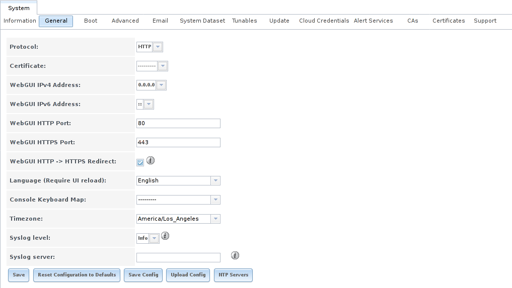
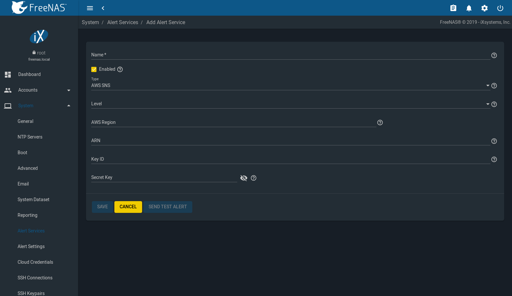

.. _System:

System
======

The System section of the administrative |web-ui| contains these entries:

#ifdef truenas
* :ref:`Information` provides general %brand% system information such as
  hostname, operating system version, platform, and uptime
#endif truenas

* :ref:`General` configures general settings such as HTTPS access, the
  language, and the timezone

* :ref:`NTP Servers` adds, edits, and deletes Network Time Protocol
  servers

* :ref:`Boot Environments` creates, renames, and deletes boot
  environments. It also shows the condition of the Boot Pool.

* :ref:`Advanced` configures advanced settings such as the serial
  console, swap space, and console messages

* :ref:`Email` configures the email address to receive notifications

* :ref:`System Dataset` configures the location where logs and
  reporting graphs are stored

* :ref:`Alert Services` configures services used to notify the
  administrator about system events.

#ifdef freenas
* :ref:`Alert Settings` lists the available :ref:`Alert` conditions and
  provides configuration of the notification frequency for each alert.
#endif freenas

* :ref:`Cloud Credentials` is used to enter connection credentials for
  remote cloud service providers

* :ref:`Tunables` provides a front-end for tuning in real-time and to
  load additional kernel modules at boot time

* :ref:`Update` performs upgrades and checks for system
  updates

* :ref:`CAs`: import or create internal or intermediate CAs
  (Certificate Authorities)

* :ref:`Certificates`: import existing certificates or create
  self-signed certificates

#ifdef freenas
* :ref:`Support`: report a bug or request a new feature.
#endif freenas
#ifdef truenas
* :ref:`Support`: view licensing information or create a support
  ticket.
#endif truenas

#ifdef truenas
* :ref:`Proactive Support`: enable and configure automatic proactive
  support (Silver or Gold support coverage only).
#endif truenas

#ifdef truenas
* :ref:`View Enclosure`: view status of disk enclosures.
#endif truenas

#ifdef truenas
* :ref:`Failover`: manage High Availability.
#endif truenas

Each of these is described in more detail in this section.

#ifdef truenas
.. _Information:

Information
-----------

:menuselection:`System --> Information`
displays general information about the %brand% system.
:numref:`Figure %s <system_info_fig>` shows an example.

The information includes hostname, build version, type of CPU
(platform), amount of memory, current system time,
system uptime, number of users connected at the console or by
serial, telnet, or SSH connections, and current load average. On
systems supplied or certified by iXsystems, an additional
:guilabel:`Serial Number` field showing the hardware serial number is
displayed.

To change the system hostname, click the :guilabel:`Edit` button,
type in the new hostname, and click :guilabel:`OK`. The hostname must
include the domain name. If the network does not use a domain name,
add *.local* after the hostname.

.. _system_info_fig:

.. figure:: images/truenas/system-information.png

   System Information Tab
#endif truenas

.. _General:

General
-------

:menuselection:`System --> General`
is shown in
:numref:`Figure %s <system_general_fig>`.

.. _system_general_fig:

#ifdef freenas

   General Screen
#endif freenas
#ifdef truenas
.. figure:: images/truenas/system-general.png

   General Screen
#endif truenas

:numref:`Table %s <system_general_tab>` summarizes the configurable
settings in the General tab:

.. tabularcolumns:: |>{\RaggedRight}p{\dimexpr 0.25\linewidth-2\tabcolsep}
                    |>{\RaggedRight}p{\dimexpr 0.12\linewidth-2\tabcolsep}
                    |>{\RaggedRight}p{\dimexpr 0.63\linewidth-2\tabcolsep}|

.. _system_general_tab:

.. table:: General Configuration Settings
   :class: longtable

   +----------------------+----------------+--------------------------------------------------------------------------------------------------------------------------+
   | Setting              | Value          | Description                                                                                                              |
   |                      |                |                                                                                                                          |
   +======================+================+==========================================================================================================================+
   | Protocol             | drop-down menu | Set the web protocol to use when connecting to the |web-ui| from a browser. To change the default *HTTP* to              |
   |                      |                | *HTTPS* or to                                                                                                            |
   |                      |                | *HTTP+HTTPS*, select a certificate in :guilabel:`GUI SSL Certificate`. If there are no certificates,                     |
   |                      |                | create a :ref:`CA <CAs>` then a :ref:`certificate <Certificates>`.                                                       |
   |                      |                |                                                                                                                          |
   +----------------------+----------------+--------------------------------------------------------------------------------------------------------------------------+
   | WebGUI IPv4 Address  | drop-down menu | Choose a recent IP addresses to limit the usage when accessing the |web-ui|. The                                         |
   |                      |                | built-in HTTP server binds to the wildcard address of *0.0.0.0* (any address) and issues an                              |
   |                      |                | alert if the specified address becomes unavailable.                                                                      |
   |                      |                |                                                                                                                          |
   +----------------------+----------------+--------------------------------------------------------------------------------------------------------------------------+
   | WebGUI IPv6 Address  | drop-down menu | Choose a recent IPv6 addresses to limit the usage when accessing the |web-ui|. The                                       |
   |                      |                | built-in HTTP server binds to any address and issues an alert                                                            |
   |                      |                | if the specified address becomes unavailable.                                                                            |
   |                      |                |                                                                                                                          |
   +----------------------+----------------+--------------------------------------------------------------------------------------------------------------------------+
   | WebGUI HTTP Port     | integer        | Allow configuring a non-standard port for accessing the |web-ui| over HTTP. Changing this setting                        |
   |                      |                | can also require changing a                                                                                              |
   |                      |                | `Firefox configuration setting                                                                                           |
   |                      |                | <https://www.redbrick.dcu.ie/~d_fens/articles/Firefox:_This_Address_is_Restricted>`__.                                   |
   |                      |                |                                                                                                                          |
   +----------------------+----------------+--------------------------------------------------------------------------------------------------------------------------+
   | WebGUI HTTPS Port    | integer        | Allow configuring a non-standard port for accessing the |web-ui| over HTTPS.                                             |
   |                      |                |                                                                                                                          |
   +----------------------+----------------+--------------------------------------------------------------------------------------------------------------------------+
   | GUI SSL Certificate  | drop-down menu | Required for *HTTPS*. :guilabel:`Browse` to the location of the certificate to use for encrypted connections.            |
   |                      |                |                                                                                                                          |
   +----------------------+----------------+--------------------------------------------------------------------------------------------------------------------------+
   | WebGUI HTTP ->       | checkbox       | Set to redirect *HTTP* connections to *HTTPS*.                                                                           |
   | HTTPS Redirect       |                | *HTTPS* must be selected in :guilabel:`Protocol`.                                                                        |
   |                      |                |                                                                                                                          |
   |                      |                |                                                                                                                          |
   |                      |                |                                                                                                                          |
   +----------------------+----------------+--------------------------------------------------------------------------------------------------------------------------+
   | Language             | drop-down menu | Select a language. View the status of a language in the                                                                  |
   |                      |                | `webui GitHub repository <https://github.com/freenas/webui/tree/master/src/assets/i18n>`__                               |
   |                      |                | Refer to :ref:`Contributing to FreeNAS` for more information about supported languages.                                  |
   |                      |                |                                                                                                                          |
   +----------------------+----------------+--------------------------------------------------------------------------------------------------------------------------+
   | Console Keyboard Map | drop-down menu | Select a keyboard layout.                                                                                                |
   |                      |                |                                                                                                                          |
   +----------------------+----------------+--------------------------------------------------------------------------------------------------------------------------+
   | Timezone             | drop-down menu | Select a timezone.                                                                                                       |
   |                      |                |                                                                                                                          |
   +----------------------+----------------+--------------------------------------------------------------------------------------------------------------------------+
   | Syslog level         | drop-down menu | When :guilabel:`Syslog server` is defined, only logs matching this level are sent.                                       |
   |                      |                |                                                                                                                          |
   +----------------------+----------------+--------------------------------------------------------------------------------------------------------------------------+
   | Syslog server        | string         | Select an *IP address_or_hostname:optional_port_number* to send logs to. Set to write log entries                        |
   |                      |                | to both the console and the remote server.                                                                               |
   |                      |                |                                                                                                                          |
   +----------------------+----------------+--------------------------------------------------------------------------------------------------------------------------+

After making any changes, click the :guilabel:`SAVE` button.

This screen also contains these buttons:

.. _save_config:

**Save Config:** save a backup copy of the current configuration
database in the format *hostname-version-architecture* to the computer
accessing the administrative interface. Saving the configuration after
making any configuration changes is highly recommended. %brand%
automatically backs up the configuration database to the system
dataset every morning at 3:45. However, this backup does not occur if
the system is shut down at that time. If the system dataset is stored
on the boot pool and the boot pool becomes unavailable, the backup
will also not be available. The location of the system dataset can be
viewed or set using
:menuselection:`System --> System Dataset`.

.. note:: :ref:`SSH` keys are not stored in the configuration database
   and must be backed up separately.

There are two types of passwords. User account passwords for the base
operating system are stored as hashed values, do not need to be
encrypted to be secure, and are saved in the system configuration
backup. Other passwords, like iSCSI CHAP passwords, Active Directory
bind credentials, and cloud credentials are stored in an encrypted form
to prevent them from being visible as plain text in the saved system
configuration. The key or *seed* for this encryption is normally stored
only on the boot device. When :guilabel:`SAVE CONFIG` is chosen, a new
screen gives the option to :guilabel:`Include Password Secret Seed` with
the saved configuration, allowing the configuration file to be restored
to a different boot device where the decryption seed is not already
present. Configuration backups containing the seed must be physically
secured to prevent decryption of passwords and unauthorized access.

.. warning:: The :guilabel:`Include Password Secret Seed` option is off
   by default and should only be used when making a configuration
   backup that will be stored securely. After moving a configuration
   to new hardware, media containing a configuration backup with a
   decryption seed should be securely erased before reuse.

**Upload Config:** allows browsing to the location of a previously
saved configuration file to restore that configuration.

**Reset Config:** reset the configuration database
to the default base version. This does not delete user SSH keys or any
other data stored in a user home directory. Since configuration
changes stored in the configuration database are erased, this option
is useful when a mistake has been made or to return a test system to
the original configuration.

.. index:: NTP Servers,
.. _NTP Servers:

NTP Servers
-----------

The network time protocol (NTP) is used to synchronize the time on the
computers in a network. Accurate time is necessary for the successful
operation of time sensitive applications such as Active Directory or
other directory services. By default, %brand% is pre-configured to use
three public NTP servers. If the network is using a directory service,
ensure that the %brand% system and the server running the directory
service have been configured to use the same NTP servers.

Available NTP servers can be found at
`<https://support.ntp.org/bin/view/Servers/NTPPoolServers>`__.
For time accuracy, choose NTP servers that are geographically close to
the physical location of the %brand% system.

Click :menuselection:`System --> NTP Servers` and |ui-add|
to add an NTP server. :numref:`Figure %s <ntp_server_fig>` shows the
configuration options.
:numref:`Table %s <ntp_server_conf_opts_tab>`
summarizes the options available when adding or editing an NTP server.
`ntp.conf(5) <https://www.freebsd.org/cgi/man.cgi?query=ntp.conf>`__
explains these options in more detail.

.. _ntp_server_fig:

.. figure:: images/system-ntp-servers-add.png

   Add an NTP Server

.. tabularcolumns:: |>{\RaggedRight}p{\dimexpr 0.25\linewidth-2\tabcolsep}
                    |>{\RaggedRight}p{\dimexpr 0.12\linewidth-2\tabcolsep}
                    |>{\RaggedRight}p{\dimexpr 0.63\linewidth-2\tabcolsep}|

.. _ntp_server_conf_opts_tab:

.. table:: NTP Servers Configuration Options
   :class: longtable

   +-------------+-----------+----------------------------------------------------------------------------------------------------+
   | Setting     | Value     | Description                                                                                        |
   |             |           |                                                                                                    |
   |             |           |                                                                                                    |
   +=============+===========+====================================================================================================+
   | Address     | string    | Enter the hostname or IP address of the NTP server.                                                |
   |             |           |                                                                                                    |
   +-------------+-----------+----------------------------------------------------------------------------------------------------+
   | Burst       | checkbox  | Recommended when :guilabel:`Max. Poll` is greater than *10*. Only use on personal servers.         |
   |             |           | **Do not** use with a public NTP server.                                                           |
   |             |           |                                                                                                    |
   +-------------+-----------+----------------------------------------------------------------------------------------------------+
   | IBurst      | checkbox  | Speed up the initial synchronization, taking seconds rather than minutes.                          |
   |             |           |                                                                                                    |
   +-------------+-----------+----------------------------------------------------------------------------------------------------+
   | Prefer      | checkbox  | This option is only recommended for highly accurate NTP servers, such as those with                |
   |             |           | time monitoring hardware.                                                                          |
   |             |           |                                                                                                    |
   +-------------+-----------+----------------------------------------------------------------------------------------------------+
   | Min. Poll   | integer   | Minimum polling time in seconds. Must be a power of 2, and cannot be lower than                    |
   |             |           | *4* or higher than :guilabel:`Max. Poll`.                                                          |
   |             |           |                                                                                                    |
   +-------------+-----------+----------------------------------------------------------------------------------------------------+
   | Max. Poll   | integer   | Maximum polling time in seconds. Must be a power of 2, and cannot be higher than                   |
   |             |           | *17* or lower than :guilabel:`Min. Poll`.                                                          |
   |             |           |                                                                                                    |
   +-------------+-----------+----------------------------------------------------------------------------------------------------+
   | Force       | checkbox  | Force the addition of the NTP server, even if it is currently unreachable.                         |
   |             |           |                                                                                                    |
   +-------------+-----------+----------------------------------------------------------------------------------------------------+

.. index:: Boot Environments, Multiple Boot Environments
.. _Boot Environments:

Boot Environments
-----------------

%brand% supports a ZFS feature known as multiple boot environments.
With multiple boot environments, the process of updating the operating
system becomes a low-risk operation. The updater automatically creates
a snapshot of the current boot environment and adds it to the boot
menu before applying the update.

#ifdef freenas
If an update fails, reboot the system and select the previous boot
environment, using the instructions in :ref:`If Something Goes Wrong`,
to instruct the system to go back to that system state.
#endif freenas

.. note:: Boot environments are separate from the configuration
   database. Boot environments are a snapshot of the
   *operating system* at a specified time. When a %brand% system
   boots, it loads the specified boot environment, or operating
   system, then reads the configuration database to load the
   current configuration values. If the intent is to make
   configuration changes rather than operating system changes, make a
   backup of the configuration database first using
   :menuselection:`System --> General --> SAVE CONFIG`.

As seen in :numref:`Figure %s <view_boot_env_fig>`, %brand% displays the
condition and statistics of the *Boot Pool*. It also shows the two boot
environments that are created when %brand% is installed. The system will
boot into the *default* boot environment and users can make their
changes and update from this version. The *Initial-Install* boot
environment can be booted into if the system needs to be returned to a
non-configured version of the installation.

.. _view_boot_env_fig:

#ifdef freenas
.. figure:: images/system-boot-environments.png

   Viewing Boot Environments
#endif freenas
#ifdef truenas
.. figure:: images/truenas/system-boot.png

   Viewing Boot Environments
#endif truenas

Each boot environment entry contains this information:

* **Name:** the name of the boot entry as it will appear in the boot
  menu.

* **Active:** indicates which entry will boot by default if the user
  does not select another entry in the boot menu.

* **Created:** indicates the date and time the boot entry was created.

* **Space:** displays the size of the boot environment.

* **Keep:** indicates whether or not this boot environment can be
  pruned if an update does not have enough space to proceed. Click
  |ui-options| and :guilabel:`Keep` for an entry if that boot
  environment should not be automatically pruned.

Click |ui-options| on an entry to see these configuration buttons:

* **Delete:** used to delete the highlighted entry, which also removes
  that entry from the boot menu. Since an activated entry
  cannot be deleted, this button does not appear for the active boot
  environment. To delete an entry that is currently
  activated, first activate another entry, which will clear the
  *On reboot* field of the currently activated entry. Note that this
  button does not appear for the *default* boot environment as
  this entry is needed to return the system to the original
  installation state.

* **Clone:** makes a new boot environment from the selected boot
  environment.

* **Rename:** used to change the name of the boot environment.

* **Activate:** only appears on entries which are not currently set to
  :guilabel:`Active`. Changes the selected entry to the default boot
  entry on next boot. The status changes to :guilabel:`Reboot` and
  the current :guilabel:`Active` entry changes from
  :guilabel:`Now/Reboot` to :guilabel:`Now`, indicating that it
  was used on the last boot but will not be used on the next boot.

* **Keep:** used to toggle whether or not the updater can prune
  (automatically delete) this boot environment if there is not enough
  space to proceed with the update.

There are also other options available.

* **Create:** makes a new boot environment from the active environment.
  The active boot environment contains the text :literal:`Now/Reboot`
  in the :guilabel:`Active` column. Only alphanumeric characters,
  underscores, and dashes are allowed in the name.

* **Scrub:** :guilabel:`Scrub Boot Pool` is used to perform a
  manual scrub of the boot devices. By default, the boot device is
  scrubbed every 7 days. To change the default interval, change the
  number in the :guilabel:`Automatic scrub interval (in days)` field of
  the :guilabel:`Boot Environments` screen. The date and results of the
  last scrub are also listed in this screen. The condition of the boot
  device should be listed as *HEALTHY*.

* **Status:** click :guilabel:`Boot Pool Status` to see the status of
  the boot devices. :numref:`Figure %s <status_boot_dev_fig>`,
  shows only one boot device, which is *ONLINE*.

.. note:: Using :guilabel:`Clone` to clone the active boot environment
   functions the same as using :guilabel:`Create`.

.. _status_boot_dev_fig:

#ifdef freenas
.. figure:: images/system-boot-environments-status.png

   Viewing the Status of the Boot Device
#endif freenas
#ifdef truenas
.. figure:: images/truenas/be2.png

   Viewing the Status of the Boot Device
#endif truenas

#ifdef freenas
If the system has a mirrored boot pool, there will be a
:guilabel:`Detach` option in addition to the :guilabel:`Replace` option.
To remove a device from the boot pool, click |ui-options| for the device
and click :guilabel:`Detach`. Alternately, if one of the boot devices
has an *OFFLINE* :guilabel:`Status`, click the device to replace, then
click :guilabel:`Replace` to rebuild the boot mirror.
#endif freenas
#ifdef truenas
If one of the boot devices has a :guilabel:`Status` of *OFFLINE*,
click the device to replace, select the new replacement device, and
click :guilabel:`Replace Disk` to rebuild the boot mirror.
#endif truenas

#ifdef freenas
Note that
**the boot device cannot be replaced if it is the only boot device**
because it contains the operating system itself.
#endif freenas

.. index:: Mirroring the Boot Device
.. _Mirroring the Boot Device:

Mirroring the Boot Device
~~~~~~~~~~~~~~~~~~~~~~~~~

If the system is currently booting from a device, another device can
be added to create a mirrored boot device. If one
device in a mirror fails, the remaining device can still be used to boot
the system.

.. note:: When adding another boot device for a mirror, the new device
   must have at least the same capacity as the existing boot device.
   Larger capacity devices can be added, but the mirror will only have
   the capacity of the smallest device. Different models of devices
   which advertise the same nominal size are not necessarily the same
   actual size. For this reason, adding another of the same model of
   boot device is recommended.

In the example shown in
:numref:`Figure %s <mirror_boot_dev_fig>`, the user has gone to
:menuselection:`System --> Boot Environments`,
and clicked the :guilabel:`BOOT POOL STATUS` button to display the
current status of the boot device. As shown in
:numref:`Figure %s <status_boot_dev_fig>`, the *freenas-boot* pool
is made of a single device, *ada0p2*. There is only one disk, indicated
by the word *stripe*. To create a mirrored boot device, click
|ui-options| then :guilabel:`attach`. If another device is available, it
appears in the :guilabel:`Member disk` drop-down menu. Select the
desired device.

The :guilabel:`Use all disk space` option gives control of how much
of the new device is made available to ZFS. The new device is
partitioned to the same size as the existing device by default. Select
:guilabel:`Use all disk space` to use all available space on the
new device. If either device in the mirror fails, it can be
replaced with another of the same size as the original boot device.

When :guilabel:`Use all disk space` is enabled, the entire capacity of
the new device is used. If the original boot device fails and is
removed, the boot mirror will consist of just the newer drive, and
will grow to whatever capacity it provides. However, new devices added
to this mirror must now be as large as the new capacity.

Click :guilabel:`SAVE` to attach the new disk to the mirror.

.. _mirror_boot_dev_fig:

.. figure:: images/system-boot-attach.png

   Mirroring a Boot Device

After the mirror is created, the :guilabel:`Boot Pool Status` screen
indicates that it is now a *mirror*. The number of devices in the mirror
are shown as in :numref:`Figure %s <mirror_boot_status_fig>`.

.. _mirror_boot_status_fig:

.. figure:: images/system-boot-mirror.png

   Viewing the Status of a Mirrored Boot Device
#endif freenas

.. _Advanced:

Advanced
--------

:menuselection:`System --> Advanced`
is shown in
:numref:`Figure %s <system_adv_fig>`.
The configurable settings are summarized in
:numref:`Table %s <adv_config_tab>`.

.. _system_adv_fig:

#ifdef freenas
.. figure:: images/system-advanced.png

   Advanced Screen
#endif freenas
#ifdef truenas
.. figure:: images/truenas/system-advanced.png

   Advanced Screen
#endif truenas

.. tabularcolumns:: |>{\RaggedRight}p{\dimexpr 0.25\linewidth-2\tabcolsep}
                    |>{\RaggedRight}p{\dimexpr 0.12\linewidth-2\tabcolsep}
                    |>{\RaggedRight}p{\dimexpr 0.63\linewidth-2\tabcolsep}|

.. _adv_config_tab:

.. table:: Advanced Configuration Settings
   :class: longtable

   +------------------------------------------+--------------------+--------------------------------------------------------------------------------------------------+
   | Setting                                  | Value              | Description                                                                                      |
   |                                          |                    |                                                                                                  |
   +==========================================+====================+==================================================================================================+
   | Show Text Console without Password       | checkbox           | Set for the system to immediately display the text console after booting. Unset to require       |
   | Prompt                                   |                    | logging into the system before the console menu is shown.                                        |
   |                                          |                    |                                                                                                  |
   +------------------------------------------+--------------------+--------------------------------------------------------------------------------------------------+
   | Enable Serial Console                    | checkbox           | **Do not** enable this option if the serial port is disabled. Adds the *Serial Port* and         |
   |                                          |                    | *Serial Speed* fields.                                                                           |
   +------------------------------------------+--------------------+--------------------------------------------------------------------------------------------------+
   | Serial Port                              | string             | Select the serial port address in hex.                                                           |
   |                                          |                    |                                                                                                  |
   +------------------------------------------+--------------------+--------------------------------------------------------------------------------------------------+
   | Serial Speed                             | drop-down menu     | Select the speed in bps used by the serial port.                                                 |
   |                                          |                    |                                                                                                  |
   #ifdef freenas
   +------------------------------------------+--------------------+--------------------------------------------------------------------------------------------------+
   | Swap size in GiB                         | non-zero number    | By default, all data disks are created with this amount of swap. This setting does not affect    |
   |                                          |                    | log or cache devices as they are created without swap. Setting to *0* disables swap creation     |
   |                                          |                    | completely. This is *strongly* discouraged.                                                      |
   |                                          |                    |                                                                                                  |
   #endif freenas
   +------------------------------------------+--------------------+--------------------------------------------------------------------------------------------------+
   | Enable autotune                          | checkbox           | Enable the :ref:`autotune` script which attempts to optimize the system based on                 |
   |                                          |                    | the installed  hardware. *Warning*: Autotuning is only used as a temporary measure and is        |
   |                                          |                    | not a permanent fix for system hardware issues.                                                  |
   |                                          |                    |                                                                                                  |
   +------------------------------------------+--------------------+--------------------------------------------------------------------------------------------------+
   | Enable Debug Kernel                      | checkbox           | Use a debug version of the kernel on the next boot.                                              |
   |                                          |                    |                                                                                                  |
   +------------------------------------------+--------------------+--------------------------------------------------------------------------------------------------+
   | Show console messages                    | checkbox           | Set to display console messages in real time at bottom of browser. Click the console to bring    |
   |                                          |                    | up a scrollable screen. Enable the :guilabel:`Stop refresh` option in the scrollable screen to   |
   |                                          |                    | pause updating and deselect the option to continue to watch the messages as they occur.          |
   |                                          |                    |                                                                                                  |
   +------------------------------------------+--------------------+--------------------------------------------------------------------------------------------------+
   | MOTD banner                              | string             | This message is shown when a user logs in with SSH.                                              |
   |                                          |                    |                                                                                                  |
   +------------------------------------------+--------------------+--------------------------------------------------------------------------------------------------+
   | Show tracebacks in case of fatal error   | checkbox           | Open a pop-up window of diagnostic information if a fatal error occurs.                          |
   |                                          |                    |                                                                                                  |
   +------------------------------------------+--------------------+--------------------------------------------------------------------------------------------------+
   | Show advanced fields by default          | checkbox           | Show :guilabel:`Advanced Mode` fields by default.                                                |
   |                                          |                    |                                                                                                  |
   +------------------------------------------+--------------------+--------------------------------------------------------------------------------------------------+
   | Periodic Notification User               | drop-down menu     | Choose a user to receive security output emails. This output runs nightly, but only sends        |
   |                                          |                    | email when the system reboots or encounters an error.                                            |
   |                                          |                    |                                                                                                  |
   +------------------------------------------+--------------------+--------------------------------------------------------------------------------------------------+
   | Remote Graphite Server Hostname          | string             | IP address or hostname of a remote server running                                                |
   |                                          |                    | `Graphite. <http://graphiteapp.org/>`__                                                          |
   |                                          |                    |                                                                                                  |
   +------------------------------------------+--------------------+--------------------------------------------------------------------------------------------------+
   | Use FQDN for logging                     | checkbox           | Include the Fully-Qualified Domain Name (FQDN) in logs to precisely identify systems             |
   |                                          |                    | with similar hostnames.                                                                          |
   |                                          |                    |                                                                                                  |
   +------------------------------------------+--------------------+--------------------------------------------------------------------------------------------------+
   | Report CPU usage in percentage           | checkbox           | Display CPU usage as percentages in :ref:`Reporting`.                                            |
   |                                          |                    |                                                                                                  |
   +------------------------------------------+--------------------+--------------------------------------------------------------------------------------------------+
   | ATA Security User                        | drop-down menu     | User passed to :command:`camcontrol security -u` for unlocking SEDs. Values are                  |
   |                                          |                    | *User* or *Master*.                                                                              |
   |                                          |                    |                                                                                                  |
   +------------------------------------------+--------------------+--------------------------------------------------------------------------------------------------+
   | SED Password                             | string             | Global password used to unlock :ref:`Self-Encrypting Drives`.                                    |
   |                                          |                    |                                                                                                  |
   +------------------------------------------+--------------------+--------------------------------------------------------------------------------------------------+
   | Reset SED Password                       | checkbox           | Select to clear the :guilabel:`Password for SED` column of                                       |
   |                                          |                    | :menuselection:`Storage --> Disks`.                                                              |
   |                                          |                    |                                                                                                  |
   +------------------------------------------+--------------------+--------------------------------------------------------------------------------------------------+

Click the :guilabel:`SAVE` button after making any changes.

This tab also contains this button:

:guilabel:`SAVE DEBUG`: used to generate text files that contain diagnostic
information. After the debug data is collected, the system prompts for
a location to save the compressed .tgz file.

.. index:: Autotune
.. _Autotune:

Autotune
~~~~~~~~

#ifdef freenas
%brand% provides an autotune script which optimizes the system
depending on the installed hardware. For example, if a pool exists on
a system with limited RAM, the autotune script automatically adjusts
some ZFS sysctl values in an attempt to minimize memory starvation
issues. It should only be used as a temporary measure on a system that
hangs until the underlying hardware issue is addressed by adding more
RAM. Autotune will always slow such a system, as it caps the ARC.

The :guilabel:`Enable autotune` option in
:menuselection:`System --> Advanced`
is off by default. Enable this option to run the autotuner at boot.
To run the script immediately, reboot the system.

If the autotune script adjusts any settings, the changed values appear
in
:menuselection:`System --> Tunables`.
These values can be modified and overridden. Note that deleting
tunables that were created by autotune only affects the current
session, as autotune-set tunables are recreated at boot.

When attempting to increase the performance of the %brand% system, and
particularly when the current hardware may be limiting performance,
try enabling autotune.

For those who wish to see which checks are performed, the autotune
script is located in :file:`/usr/local/bin/autotune`.
#endif freenas
#ifdef truenas
%brand% provides an autotune script which optimizes the system. The
:guilabel:`Enable autotune` option in
:menuselection:`System --> Advanced` is enabled by default, so this
script runs automatically. Leaving autotune enabled is recommended
unless advised otherwise by an iXsystems support engineer.

If the autotune script adjusts any settings, the changed values appear
in
:menuselection:`System --> Tunables`.
While these values can be modified and overridden, speak to a
support engineer first. Manual changes can have a negative
impact on system performance. Note that deleting tunables that
were created by autotune only affects the current session, as
autotune-set tunables are recreated at boot.

For those who wish to see which checks are performed, the autotune
script is located in :file:`/usr/local/bin/autotune`.
#endif truenas

.. index:: Self-Encrypting Drives
.. _Self-Encrypting Drives:

Self-Encrypting Drives
~~~~~~~~~~~~~~~~~~~~~~

%brand% version 11.1-U5 introduced Self-Encrypting Drive (SED) support.

Three types of SED devices are supported:

* Legacy interface for older ATA devices. **Not recommended for
  security-critical environments**

* TCG OPAL 2 standard for newer consumer-grade devices (HDD or SSD over
  PCIe or SATA)

* TCG Enterprise standard for newer enterprise-grade SAS devices

The %brand% middleware implements the security capabilities of
`camcontrol <https://www.freebsd.org/cgi/man.cgi?query=camcontrol>`__ (for
legacy devices) and `sedutil-cli <https://www.mankier.com/8/sedutil-cli>`__
(for TCG devices). When managing SED devices from the command line, it is
important to use :command:`sedutil-cli` rather than camcontrol
to access the full capabilities of the device. %brand% provides the
:command:`sedhelper` wrapper script to ease SED device administration from
the command line.

By default, SED devices are not locked until the administrator explicitly
configures a global or per-device password and initializes the devices.

Once configured, the system automatically unlocks all SEDs during the boot
process, without requiring manual intervention. This allows a pool to
contain a mix of SED and non-SED devices.

A password-protected SED device protects the data stored on the device
when the device is physically removed from the %brand% system. This allows
secure disposal of the device without having to first wipe its contents.
If the device is instead removed to be repurposed on another system, it
can only be unlocked if the password is known.

.. warning:: It is important to remember the password! Without it, the
   device is unlockable and its data remains unavailable. While it is
   possible to specify the PSID number on the label of the device with
   the :command:`sedutil-cli` command, doing so will erase the contents
   of the device rather than unlock it. Always record SED passwords
   whenever they are configured or modified and store them in a safe
   place!

When SED devices are detected during system boot, the middleware checks
for global and device-specific passwords. Devices with their own password
are unlocked with their password and any remaining devices, without a
device-specific password, are unlocked using the global password.

To configure a global password, go to :menuselection:`System -->
Advanced --> SED Password` and enter the
password. Recording the password and storing it in a safe place is
recommended.

To determine which devices support SED and their device names:

.. code-block:: none

 sedutil-cli --scan

In the results:

* **no** indicates a non-SED device
* **1** indicates a legacy TCG OPAL 1 device
* **2** indicates a modern TCG OPAL 2 device
* **E** indicates a TCG Enterprise device

To specify a password for a device, go to
:menuselection:`Storage --> Disks`. Click |ui-options| on the
confirmed SED device, then :guilabel:`Edit`. Enter and confirm the password
in the :guilabel:`SED Password` and
:guilabel:`Confirm SED Password` fields. Disks that have a configured
password show bullets in their row of the
:guilabel:`SED Password` column of :menuselection:`Storage --> Disks`.
Conversely, the rows in that column will be empty for disks that do
not support SED or which are unlocked using the global password.

Next, remember to initialize the devices:

.. code-block:: none

 sedhelper setup password

This command ensures that all detected SED disks are properly setup using
the specified password.

.. note:: Rerun :command:`sedhelper setup password` every time a new SED
   disk is placed in the system.

This command is used to unlock all available SED disks:

.. code-block:: none

 sedhelper unlock

.. index:: Email
.. _Email:

Email
-----

An automatic script sends a nightly email to the *root* user account
containing important information such as the health of the disks.
:ref:`Alert` events are also emailed to the *root* user account.
Problems with :ref:`Scrub Tasks` are reported separately in an email
sent at 03:00AM.

.. note:: :ref:`S.M.A.R.T.` reports are mailed separately to the
   address configured in that service.

The administrator typically does not read email directly on
the %brand% system. Instead, these emails are usually sent to an
external email address where they can be read more conveniently. It is
important to configure the system so it can send these emails to the
administrator's remote email account so they are aware of problems or
status changes.

The first step is to set the remote address where email will be sent.
Go to
:menuselection:`Accounts --> Users`,
click |ui-options| and :guilabel:`Edit` for the *root* user. In the
:guilabel:`Email` field, enter the email address on the remote system
where email is to be sent, like *admin@example.com*. Click
:guilabel:`SAVE` to save the settings.

Additional configuration is performed with
:menuselection:`System --> Email`,
shown in
:numref:`Figure %s <email_conf_fig>`.

.. _email_conf_fig:

#ifdef freenas
.. figure:: images/system-email.png

   Email Screen
#endif freenas
#ifdef truenas
.. figure:: images/truenas/system-email.png

   Email Screen
#endif truenas

.. tabularcolumns:: |p{1.2in}|p{1.2in}|p{3.6in}|
.. tabularcolumns:: |>{\RaggedRight}p{\dimexpr 0.20\linewidth-2\tabcolsep}
                    |>{\RaggedRight}p{\dimexpr 0.20\linewidth-2\tabcolsep}
                    |>{\RaggedRight}p{\dimexpr 0.60\linewidth-2\tabcolsep}|

.. _email_conf_tab:

.. table:: Email Configuration Settings
   :class: longtable

   +----------------------+----------------------+-------------------------------------------------------------------------------------------------+
   | Setting              | Value                | Description                                                                                     |
   |                      |                      |                                                                                                 |
   +======================+======================+=================================================================================================+
   | From E-mail          | string               | Setting a known *From* address can be helpful in filtering mail on the receiving system.        |
   |                      |                      |                                                                                                 |
   +----------------------+----------------------+-------------------------------------------------------------------------------------------------+
   | Outgoing Mail Server | string or IP address | Hostname or IP address of SMTP server used for sending this email.                              |
   |                      |                      |                                                                                                 |
   +----------------------+----------------------+-------------------------------------------------------------------------------------------------+
   | Mail Server Port     | integer              | SMTP port number. Typically *25*,                                                               |
   |                      |                      | *465* (secure SMTP), or                                                                         |
   |                      |                      | *587* (submission).                                                                             |
   |                      |                      |                                                                                                 |
   +----------------------+----------------------+-------------------------------------------------------------------------------------------------+
   | Security             | drop-down menu       | Choose an encryption type. Choices are *Plain*,                                                 |
   |                      |                      | *SSL*, or                                                                                       |
   |                      |                      | *TLS*.                                                                                          |
   |                      |                      |                                                                                                 |
   +----------------------+----------------------+-------------------------------------------------------------------------------------------------+
   | SMTP                 | checkbox             | Enable or disable                                                                               |
   | Authentication       |                      | `SMTP AUTH <https://en.wikipedia.org/wiki/SMTP_Authentication>`__                               |
   |                      |                      | using PLAIN SASL. If enabled, enter the required :guilabel:`Username` and                       |
   |                      |                      | :guilabel:`Password`.                                                                           |
   |                      |                      |                                                                                                 |
   +----------------------+----------------------+-------------------------------------------------------------------------------------------------+
   | Username             | string               | Enter the SMTP username if the SMTP server requires authentication.                             |
   |                      |                      |                                                                                                 |
   +----------------------+----------------------+-------------------------------------------------------------------------------------------------+
   | Password             | string               | Enter the SMTP password if the SMTP server requires authentication.                             |
   |                      |                      |                                                                                                 |
   +----------------------+----------------------+-------------------------------------------------------------------------------------------------+
   | Confirm Password     | string               | Confirm the SMTP previous password.                                                             |
   |                      |                      |                                                                                                 |
   +----------------------+----------------------+-------------------------------------------------------------------------------------------------+

Click the :guilabel:`SEND MAIL` button to verify that the
configured email settings are working. If the test email fails,
double-check that the :guilabel:`Email` field of the *root* user is
correctly configured by clicking the :guilabel:`Edit` button for
the *root* account in :menuselection:`Accounts --> Users`.

Configuring email for TLS/SSL email providers is described in
`Are you having trouble getting FreeNAS to email you in Gmail?
<https://forums.freenas.org/index.php?threads/are-you-having-trouble-getting-freenas-to-email-you-in-gmail.22517/>`__.

.. note:: The %brand% user who receives periodic email is set in the
   :guilabel:`Periodic Notification User` field in
   :menuselection:`System --> Advanced`.

.. index:: System Dataset
.. _System Dataset:

System Dataset
--------------

:menuselection:`System --> System Dataset`,
shown in
:numref:`Figure %s <system_dataset_fig>`,
is used to select the pool which contains the persistent system
dataset. The system dataset stores debugging core files and Samba4
metadata such as the user/group cache and share level permissions. If
the %brand% system is configured to be a Domain Controller, all of
the domain controller state is stored there as well, including domain
controller users and groups.

.. note:: When the system dataset is moved, a new dataset is created
   and set active. The old dataset is intentionally not deleted by
   the system because the move might be temporary or the information
   in the old dataset might be useful for later recovery.

.. _system_dataset_fig:

#ifdef freenas
.. figure:: images/system-system-dataset.png

   System Dataset Screen
#endif freenas
#ifdef truenas
.. figure:: images/truenas/system-system-dataset.png

   System Dataset Screen
#endif truenas

The system dataset can optionally be configured to also store the
system log and :ref:`Reporting` information. If there are lots of log
entries or reporting information, moving these to the system dataset
will prevent :file:`/var/` on the device holding the operating system
from filling up as :file:`/var/` has limited space.

Use the drop-down menu to select the pool to contain the system
dataset.

#ifdef truenas
.. note:: Storing the system dataset on the
   :file:`freenas-boot` pool is recommended.
#endif truenas

To store the system log on the system dataset, enable the
:guilabel:`Syslog` option.

To store the reporting information on the system dataset, enable the
:guilabel:`Reporting Database` option. When this option is not enabled,
a RAM disk is created to prevent reporting information from filling up
:file:`/var`.

Click the :guilabel:`SAVE` button to save changes.

If the pool storing the system dataset is changed at a later time,
%brand% migrates the existing data in the system dataset to the new
location.

.. note:: Depending on configuration, the system dataset can occupy a
   large amount of space and receive frequent writes. Do not put the
   system dataset on a flash drive or other media with limited space
   or write life.

.. index:: Alert Services
.. _Alert Services:

Alert Services
--------------

%brand% can use a number of methods to notify the administrator of
system events that require attention. These events are system
:ref:`Alerts <Alert>`.

Available alert services:

* `AWS-SNS <https://aws.amazon.com/sns/>`__

* E-mail

* `Hipchat <https://www.stride.com>`__

* `InfluxDB <https://www.influxdata.com/>`__

* `Mattermost <https://about.mattermost.com/>`__

* `OpsGenie <https://www.opsgenie.com/>`__

* `PagerDuty <https://www.pagerduty.com/>`__

* `Slack <https://slack.com/>`__

* `SNMP Trap <http://www.dpstele.com/snmp/trap-basics.php>`__

* `VictorOps <https://victorops.com/>`__

.. warning:: These alert services might use a third party commercial
   vendor not directly affiliated with iXsystems. Please investigate
   and fully understand that vendor's pricing policies and services
   before using their alert service. iXsystems is not responsible for
   any charges incurred from the use of third party vendors with the
   Alert Services feature.

Select
:menuselection:`System --> Alert Services` to show the Alert Services
screen, :numref:`Figure %s <alert_services_fig>`.

.. _alert_services_fig:

   Alert Services

Click |ui-add| to display the :guilabel:`Add Alert Service` form,
:numref:`Figure %s <alert_service_add_fig>`.

.. _alert_service_add_fig:

   Add Alert Service

Select the :guilabel:`Type` to choose an alert service to configure.
The configurable fields and required information differ for each alert
service. Set :guilabel:`Enabled` to activate the service. Enter any
other required information and click :guilabel:`SAVE`.

Configure which alerts are sent to the alert service by clicking
:guilabel:`SHOW SETTINGS`.

Click :guilabel:`SENDS TEST ALERT` to test the configured service.

All saved alert services are displayed in
:menuselection:`System --> Alert Services`.
To delete an alert service, click |ui-options| and :guilabel:`Delete`.
To disable an alert service
temporarily, click |ui-options| and :guilabel:`Edit`, then unset the
:guilabel:`Enabled` option.

#ifdef freenas
.. index:: Alert Settings

.. _Alert Settings:

Alert Settings
--------------

:menuselection:`System --> Alert Settings` displays the notification
frequency for each type of :ref:`Alert`. An example is shown in
:numref:`Figure %s <alert_settings_fig>`.

.. _alert_settings_fig:

.. figure:: images/system-alert-settings.png

   Configure Alert Notification Frequency

To change the notification frequency of an alert, click its drop-down
menu and select *IMMEDIATELY*, *HOURLY*, *DAILY*, or *NEVER*.

.. note:: To configure where alerts are sent, use
   :ref:`Alert Services`.
#endif freenas

.. index:: Cloud Credentials
.. _Cloud Credentials:

Cloud Credentials
-----------------

%brand% can use cloud services for features like :ref:`Cloud Sync Tasks`.
The credentials to provide secure connections with cloud services
are entered here. Amazon Cloud Drive, Amazon S3, Backblaze B2, Box,
Dropbox, FTP, Google Cloud Storage, Google Drive, HTTP, Hubic, Mega,
Microsoft Azure Blob Storage, Microsoft OneDrive, pCloud, SFTP,
WebDAV, and Yandex are supported.

Click
:menuselection:`System --> Cloud Credentials`
to see the screen shown in :numref:`Figure %s <cloud_creds_fig>`.

.. _cloud_creds_fig:

.. figure:: images/system-cloud-credentials.png

   Cloud Credentials List

The list shows the :guilabel:`Account Name` and :guilabel:`Provider`
for each credential. There are options to :guilabel:`Edit` and
:guilabel:`Delete` a credential after clicking |ui-options| for a
credential.

Click |ui-add| to add a new cloud credential. Choose a
:guilabel:`Provider` to display any specific options for that
provider. :numref:`Figure %s <cloud_creds_add_fig>` shows the form for
an *Amazon Cloud Drive* provider:

.. _cloud_creds_add_fig:

.. figure:: images/system-cloud-credentials-add-example.png

   Add Amazon Cloud Drive Credential

Enter a descriptive and unique name for the cloud credential in the
:guilabel:`Name` field. The remaining options vary by
:guilabel:`Provider`, and are shown in
:numref:`Table %s <cloud_cred_tab>`.

.. tabularcolumns:: |>{\RaggedRight}p{\dimexpr 0.16\linewidth-2\tabcolsep}
                    |>{\RaggedRight}p{\dimexpr 0.20\linewidth-2\tabcolsep}
                    |>{\RaggedRight}p{\dimexpr 0.64\linewidth-2\tabcolsep}|

.. _cloud_cred_tab:

.. table:: Cloud Credential Options
   :class: longtable

   +----------------------+----------------------+-----------------------------------------------------------------------------------------------------------------+
   | Provider             | Setting              | Description                                                                                                     |
   |                      |                      |                                                                                                                 |
   +======================+======================+=================================================================================================================+
   | Amazon Cloud Drive   | Application Client   | Enter the Amazon application client ID and application                                                          |
   |                      | ID, Application Key  | key.                                                                                                            |
   |                      |                      |                                                                                                                 |
   +----------------------+----------------------+-----------------------------------------------------------------------------------------------------------------+
   | Amazon S3            | Access Key ID,       | Enter the Amazon account access key and secret key.                                                             |
   |                      | Secret Key           |                                                                                                                 |
   |                      |                      |                                                                                                                 |
   +----------------------+----------------------+-----------------------------------------------------------------------------------------------------------------+
   | Amazon S3            | Endpoint URL         | `End point URL <https://docs.aws.amazon.com/AmazonS3/latest/dev/WebsiteEndpoints.html>`__                       |
   |                      |                      | for a bucket configured for website hosting.                                                                    |
   |                      |                      | Leave blank when using AWS. Enter endpoint URL if using custom S3 API. URL                                      |
   |                      |                      | general format: *bucket-name.s3-website-region.amazonaws.com*.                                                  |
   |                      |                      | Refer to the AWS Documentation for a list of `Simple Storage Service Websites Endpoints                         |
   |                      |                      | <https://docs.aws.amazon.com/general/latest/gr/rande.html#s3_website_region_endpoints>`__.                      |
   |                      |                      |                                                                                                                 |
   +----------------------+----------------------+-----------------------------------------------------------------------------------------------------------------+
   | Backblaze B2         | Account ID or        | Enter the `Account ID and Master Application Key                                                                |
   |                      | Application Key ID,  | <https://help.backblaze.com/hc/en-us/articles/224991568-Where-can-I-find-my-Account-ID-and-Application-Key->`__ |
   |                      | Master Application   | for the Backblaze B2 account. These are visible after logging into the account, clicking :guilabel:`Buckets`,   |
   |                      | Key or Application   | and clicking :guilabel:`Show Account ID and Application Key`. An *Application Key* with limited permissions can |
   |                      | Key                  | be used in place of the :guilabel:`Account ID` and :guilabel:`Master Application Key`. Create a new Application |
   |                      |                      | Key and enter the key string in place of the :guilabel:`Master Application Key` and replace the                 |
   |                      |                      | :guilabel:`Account ID` with the :guilabel:`keyID`.                                                              |
   |                      |                      |                                                                                                                 |
   +----------------------+----------------------+-----------------------------------------------------------------------------------------------------------------+
   | Box                  | Access Token         | Enter the Box access token.                                                                                     |
   |                      |                      |                                                                                                                 |
   +----------------------+----------------------+-----------------------------------------------------------------------------------------------------------------+
   | Dropbox              | Access Token         | Enter the Dropbox access token. The token is located on the                                                     |
   |                      |                      | `App Console <https://www.dropbox.com/developers/apps>`__.                                                      |
   |                      |                      | After creating an app, go to *Settings* and click the                                                           |
   |                      |                      | *Generate* button under the Generated access token field.                                                       |
   |                      |                      |                                                                                                                 |
   +----------------------+----------------------+-----------------------------------------------------------------------------------------------------------------+
   | FTP                  | Host, Port           | Enter the FTP host and port.                                                                                    |
   |                      |                      |                                                                                                                 |
   +----------------------+----------------------+-----------------------------------------------------------------------------------------------------------------+
   | FTP                  | Username, Password   | Enter the FTP username and password.                                                                            |
   |                      |                      |                                                                                                                 |
   +----------------------+----------------------+-----------------------------------------------------------------------------------------------------------------+
   | Google Cloud Storage | JSON Service Account | :guilabel:`Browse` to the location of the saved                                                                 |
   |                      | Key                  | Google Cloud Storage key and select it.                                                                         |
   |                      |                      |                                                                                                                 |
   +----------------------+----------------------+-----------------------------------------------------------------------------------------------------------------+
   | Google Drive         | Access Token,        | Enter the Google Drive Access Token. :guilabel:`Team Drive ID`                                                  |
   |                      | Team Drive ID        | is only used when connecting to a `Team Drive                                                                   |
   |                      |                      | <https://developers.google.com/drive/api/v3/reference/teamdrives>`__.                                           |
   |                      |                      | The ID is also the ID of the top level folder of the Team Drive.                                                |
   |                      |                      |                                                                                                                 |
   +----------------------+----------------------+-----------------------------------------------------------------------------------------------------------------+
   | HTTP                 | URL                  | Enter the URL.                                                                                                  |
   |                      |                      |                                                                                                                 |
   +----------------------+----------------------+-----------------------------------------------------------------------------------------------------------------+
   | Hubic                | Access Token         | Enter the access token.                                                                                         |
   |                      |                      |                                                                                                                 |
   +----------------------+----------------------+-----------------------------------------------------------------------------------------------------------------+
   | Mega                 | Username, Password   | Enter the `Mega <https://mega.nz/>`__ username and password.                                                    |
   |                      |                      |                                                                                                                 |
   +----------------------+----------------------+-----------------------------------------------------------------------------------------------------------------+
   | Microsoft Azure Blob | Account Name,        | Enter the Azure Blob Storage account name and key.                                                              |
   | Storage              | Account Key          |                                                                                                                 |
   |                      |                      |                                                                                                                 |
   +----------------------+----------------------+-----------------------------------------------------------------------------------------------------------------+
   | Microsoft OneDrive   | Access Token         | Enter the access token.                                                                                         |
   |                      |                      |                                                                                                                 |
   +----------------------+----------------------+-----------------------------------------------------------------------------------------------------------------+
   | pCloud               | Access Token         | Enter the access token.                                                                                         |
   |                      |                      |                                                                                                                 |
   +----------------------+----------------------+-----------------------------------------------------------------------------------------------------------------+
   | SFTP                 | Host, Port           | Enter the SFTP host and port.                                                                                   |
   |                      |                      |                                                                                                                 |
   +----------------------+----------------------+-----------------------------------------------------------------------------------------------------------------+
   | SFTP                 | Username, Password,  | Enter the SFTP username, password, and PEM-encoded                                                              |
   |                      | key file path        | private key file path.                                                                                          |
   |                      |                      |                                                                                                                 |
   +----------------------+----------------------+-----------------------------------------------------------------------------------------------------------------+
   | WebDAV               | URL, WebDAV service  | Enter the URL and use the dropdown to select the WebDAV service.                                                |
   |                      |                      |                                                                                                                 |
   +----------------------+----------------------+-----------------------------------------------------------------------------------------------------------------+
   | WebDAV               | Username, Password   | Enter the username and password.                                                                                |
   |                      |                      |                                                                                                                 |
   +----------------------+----------------------+-----------------------------------------------------------------------------------------------------------------+
   | Yandex               | Access Token         | Enter the access token.                                                                                         |
   |                      |                      |                                                                                                                 |
   +----------------------+----------------------+-----------------------------------------------------------------------------------------------------------------+

For Amazon S3, :guilabel:`Access Key` and
:guilabel:`Secret Key` values are found on the Amazon AWS
website by clicking on the account name, then
:guilabel:`My Security Credentials` and
:guilabel:`Access Keys (Access Key ID and Secret Access Key)`.
Copy the Access Key value to the %brand% Cloud Credential
:guilabel:`Access Key` field, then enter the :guilabel:`Secret Key`
value saved when the key pair was created. If the Secret Key value is
unknown, a new key pair can be created on the same Amazon screen.
The Google Cloud Storage :guilabel:`JSON Service Account Key` is found
on the
`Google Cloud Platform Console <https://console.cloud.google.com/apis/credentials>`__.

.. index:: Tunables
.. _Tunables:

Tunables
--------

:menuselection:`System --> Tunables`
can be used to manage:

#. **FreeBSD sysctls:** a
   `sysctl(8) <https://www.freebsd.org/cgi/man.cgi?query=sysctl>`__
   makes changes to the FreeBSD kernel running on a %brand% system
   and can be used to tune the system.

#. **FreeBSD loaders:** a loader is only loaded when a FreeBSD-based
   system boots and can be used to pass a parameter to the kernel or
   to load an additional kernel module such as a FreeBSD hardware
   driver.

#. **FreeBSD rc.conf options:**
   `rc.conf(5) <https://www.freebsd.org/cgi/man.cgi?query=rc.conf>`__
   is used to pass system configuration options to the system startup
   scripts as the system boots. Since %brand% has been optimized for
   storage, not all of the services mentioned in rc.conf(5) are
   available for configuration. Note that in %brand%, customized
   rc.conf options are stored in
   :file:`/tmp/rc.conf.freenas`.

.. warning:: Adding a sysctl, loader, or :file:`rc.conf` option is an
   advanced feature. A sysctl immediately affects the kernel running
   the %brand% system and a loader could adversely affect the ability
   of the %brand% system to successfully boot.
   **Do not create a tunable on a production system before
   testing the ramifications of that change.**

Since sysctl, loader, and rc.conf values are specific to the kernel
parameter to be tuned, the driver to be loaded, or the service to
configure, descriptions and suggested values can be found in the man
page for the specific driver and in many sections of the
`FreeBSD Handbook
<https://www.freebsd.org/doc/en_US.ISO8859-1/books/handbook/>`__.

To add a loader, sysctl, or :file:`rc.conf` option, go to
:menuselection:`System --> Tunables`
and click |ui-add| to access the screen shown in
:numref:`Figure %s <add_tunable_fig>`.

.. _add_tunable_fig:

.. figure:: images/system-tunables-add.png

   Adding a Tunable

:numref:`Table %s <add_tunable_tab>`
summarizes the options when adding a tunable.

.. tabularcolumns:: |>{\RaggedRight}p{\dimexpr 0.16\linewidth-2\tabcolsep}
                    |>{\RaggedRight}p{\dimexpr 0.20\linewidth-2\tabcolsep}
                    |>{\RaggedRight}p{\dimexpr 0.64\linewidth-2\tabcolsep}|

.. _add_tunable_tab:

.. table:: Adding a Tunable
   :class: longtable

   +-------------+-------------------+-------------------------------------------------------------------------------------+
   | Setting     | Value             | Description                                                                         |
   |             |                   |                                                                                     |
   |             |                   |                                                                                     |
   +=============+===================+=====================================================================================+
   | Variable    | string            | The name of the sysctl or driver to load.                                           |
   |             |                   |                                                                                     |
   +-------------+-------------------+-------------------------------------------------------------------------------------+
   | Value       | integer or string | Set a value for the :guilabel:`Variable`. Refer to the man page for the specific    |
   |             |                   | driver or the                                                                       |
   |             |                   | `FreeBSD Handbook <https://www.freebsd.org/doc/en_US.ISO08859-1/books/handbook/>`__ |
   |             |                   | for suggested values.                                                               |
   |             |                   |                                                                                     |
   +-------------+-------------------+-------------------------------------------------------------------------------------+
   | Type        | drop-down menu    | Choices are *Loader*, *rc.conf*, and *Sysctl*.                                      |
   |             |                   |                                                                                     |
   +-------------+-------------------+-------------------------------------------------------------------------------------+
   | Comment     | string            | Optional. Enter a description of this tunable.                                      |
   |             |                   |                                                                                     |
   +-------------+-------------------+-------------------------------------------------------------------------------------+
   | Enabled     | checkbox          | Deselect this option to disable the tunable without deleting it.                    |
   |             |                   |                                                                                     |
   +-------------+-------------------+-------------------------------------------------------------------------------------+

.. note:: As soon as a *Sysctl* is added or edited, the running kernel
   changes that variable to the value specified. However, when a
   *Loader* or *rc.conf* value is changed, it does not take effect
   until the system is rebooted. Regardless of the type of tunable,
   changes persist at each boot and across upgrades unless the tunable
   is deleted or the :guilabel:`Enabled` option is deselected.

Existing tunables are listed in
:menuselection:`System --> Tunables`.
To change the value of an existing tunable, click |ui-options| and
:guilabel:`Edit`. To remove a tunable, click |ui-options| and
:guilabel:`Delete`.

Restarting the %brand% system after making sysctl changes is
recommended. Some sysctls only take effect at system startup, and
restarting the system guarantees that the setting values correspond
with what is being used by the running system.

The |web-ui| does not display the sysctls that are pre-set when %brand% is
installed. %brand% |release| ships with the sysctls set:

#ifdef freenas
.. code-block:: none

   kern.metadelay=3
   kern.dirdelay=4
   kern.filedelay=5
   kern.coredump=1
   kern.sugid_coredump=1
   vfs.timestamp_precision=3
   net.link.lagg.lacp.default_strict_mode=0
   vfs.zfs.min_auto_ashift=12
#endif freenas
#ifdef truenas
.. code-block:: none

   kern.metadelay=3
   kern.dirdelay=4
   kern.filedelay=5
   kern.coredump=1
   net.inet.carp.preempt=1
   debug.ddb.textdump.pending=1
   vfs.nfsd.tcpcachetimeo=300
   vfs.nfsd.tcphighwater=150000
   vfs.zfs.vdev.larger_ashift_minimal=0
   net.inet.carp.senderr_demotion_factor=0
   net.inet.carp.ifdown_demotion_factor=0
#endif truenas

**Do not add or edit these default sysctls** as doing so may render
the system unusable.

The |web-ui| does not display the loaders that are pre-set when %brand% is
installed. %brand% |release| ships with these loaders set:

#ifdef freenas
.. code-block:: none

   autoboot_delay="2"
   loader_logo="freenas"
   loader_menu_title="Welcome to FreeNAS"
   loader_brand="freenas-brand"
   loader_version=" "
   kern.cam.boot_delay="30000"
   debug.debugger_on_panic=1
   debug.ddb.textdump.pending=1
   hw.hptrr.attach_generic=0
   vfs.mountroot.timeout="30"
   ispfw_load="YES"
   freenas_sysctl_load="YES"
   hint.isp.0.role=2
   hint.isp.1.role=2
   hint.isp.2.role=2
   hint.isp.3.role=2
   hint.isp.0.topology="nport-only"
   hint.isp.1.topology="nport-only"
   hint.isp.2.topology="nport-only"
   hint.isp.3.topology="nport-only"
   module_path="/boot/kernel;/boot/modules;/usr/local/modules"
   net.inet6.ip6.auto_linklocal="0"
   vfs.zfs.vol.mode=2
   kern.geom.label.disk_ident.enable="0"
   hint.ahciem.0.disabled="1"
   hint.ahciem.1.disabled="1"
   kern.msgbufsize="524288"
   hw.mfi.mrsas_enable="1"
   hw.usb.no_shutdown_wait=1
   hw.cxgbe.toecaps_allowed=0
   hw.cxgbe.rdmacaps_allowed=0
   hw.cxgbe.iscsicaps_allowed=0
   vfs.nfsd.fha.write=0
   vfs.nfsd.fha.max_nfsds_per_fh=32
#endif freenas
#ifdef truenas
.. code-block:: none

   autoboot_delay="2"
   loader_logo="truenas-logo"
   loader_menu_title="Welcome to TrueNAS"
   loader_brand="truenas-brand"
   loader_version=" "
   kern.cam.boot_delay="10000"
   debug.debugger_on_panic=1
   debug.ddb.textdump.pending=1
   hw.hptrr.attach_generic=0
   ispfw_load="YES"
   freenas_sysctl_load="YES"
   hint.isp.0.topology="nport-only"
   hint.isp.1.topology="nport-only"
   hint.isp.2.topology="nport-only"
   hint.isp.3.topology="nport-only"
   module_path="/boot/kernel;/boot/modules;/usr/local/modules"
   net.inet6.ip6.auto_linklocal="0"
   vfs.zfs.vol.mode=2
   kern.geom.label.disk_ident.enable="0"
   hint.ahciem.0.disabled="1"
   hint.ahciem.1.disabled="1"
   kern.msgbufsize="524288"
   hw.cxgbe.toecaps_allowed=0
   hw.cxgbe.rdmacaps_allowed=0
   hw.cxgbe.iscsicaps_allowed=0
   vfs.nfsd.fha.write=0
   vfs.nfsd.fha.max_nfsds_per_fh=32
   kern.ipc.nmbclusters="262144"
   kern.hwpmc.nbuffers="4096"
   kern.hwpmc.nsamples="4096"
   hw.memtest.tests="0"
   vfs.zfs.trim.enabled="0"
   kern.cam.ctl.ha_mode=2
   kern.geom.label.ufs.enable=0
   kern.geom.label.ufsid.enable=0
   hint.ntb_hw.0.config="ntb_pmem:1:4:0,ntb_transport"
   hint.ntb_transport.0.config=":3"
   hw.ntb.msix_mw_idx="-1"
#endif truenas

**Do not add or edit the default tunables.** Changing the default
tunables can make the system unusable.

The ZFS version used in |release| deprecates these tunables:

.. code-block:: none

   vfs.zfs.write_limit_override
   vfs.zfs.write_limit_inflated
   vfs.zfs.write_limit_max
   vfs.zfs.write_limit_min
   vfs.zfs.write_limit_shift
   vfs.zfs.no_write_throttle

After upgrading from an earlier version of %brand%, these tunables are
automatically deleted. Please do not manually add them back.

.. _Update:

Update
------

%brand% has an integrated update system to make it easy to keep up to
date.

.. _Preparing for Updates:

Preparing for Updates
~~~~~~~~~~~~~~~~~~~~~

#ifdef freenas
It is best to perform updates at times the %brand% system is idle,
with no clients connected and no scrubs or other disk activity going
on. A reboot is required after most updates, so they are often planned
for scheduled maintenance times to avoid disrupting user activities.

The update process will not proceed unless there is enough free space
in the boot pool for the new update files. If a space warning is
shown, use :ref:`Boot Environments` to remove unneeded boot environments.
#endif freenas

#ifdef truenas
An update usually takes between thirty minutes and an hour. A reboot
is required after the update, so it is recommended to schedule updates
during a maintenance window, allowing two to three hours to update,
test, and possibly roll back if difficulties are encountered. On very
large systems, a proportionally longer maintenance window is
recommended.

For individual support during an upgrade, please open a ticket at
https://support.ixsystems.com, or call 408-943-4100 to schedule
one. Scheduling at least two days in advance of a planned upgrade
gives time to make sure a specialist is available for assistance.

Updates from older versions of %brand% before 9.3 must be scheduled
with support.

The update process will not proceed unless there is enough free space
in the boot pool for the new update files. If a space warning is
shown, use :ref:`Boot <Boot Environments>` to remove unneeded boot
environments.

Operating system updates only modify the boot devices and do not
affect end-user data on storage drives.

Available ZFS version upgrades are indicated by an :ref:`Alert` in the
|web-ui|. However, upgrading the ZFS version on
storage drives is not recommended until after verifying that rolling
back to previous versions of the operating system will not be
necessary, and that interchanging the devices with some other system
using an older ZFS version is not needed. After a ZFS version upgrade,
the storage devices will not be accessible by older versions of
%brand%.
#endif truenas

.. _Updates and Trains:

Updates and Trains
~~~~~~~~~~~~~~~~~~

%brand% uses signed update files. This provides flexibility in deciding
when to upgrade the system with patches, new drivers, or new features.
It also allows "test driving" an upcoming release. Combined with boot
environments, new features or system patches can be tested while maintaining
the ability to revert to a previous version of the operating system, using
the instructions in :ref:`If Something Goes Wrong`. Digitally signed update
files eliminate the need to manually download both an upgrade file and the
associated checksum to verify file integrity.

%brand% defines software branches, known as *trains*. Several trains are
available for updates.

.. caution:: **Only Production trains are recommended for regular
   usage.** Other trains are made available for pre-production testing
   and updates to legacy versions. Pre-production testing trains are
   provided only to permit testing of new versions before switching to
   a new branch. Before using a non-production train, be prepared to
   experience bugs or problems. Testers are encouraged to submit bug
   reports at https://redmine.ixsystems.com/projects/freenas/issues.

These trains are available:

#ifdef freenas
**For Production Use**

* **FreeNAS-11-STABLE: Recommended.** After testing, new fixes and
  features are added to this train. Selecting this train and applying
  any pending updates is recommended.

* **FreeNAS-11.2-STABLE: Recommended for Jails/Plugins/VM users.**
  This train provides the latest updates to the new UI, the new iocage
  backend for Jails and Plugins, and the latest fixes for VMs. Users who
  rely on these features are encouraged to upgrade to this train and to
  use the :ref:`Support` to report any issues.

**For Pre-Production Testing**

* **FreeNAS-11-Nightlies: Do not use this train in production**. It
  is the experimental branch for future versions and is meant only for
  testers and developers.

* **FreeNAS-11-Nightlies-SDK: Do not use this train in production**.
  This train is meant only for developers. It is similar to
  *FreeNAS-11-Nightlies* but with extra development and debugging
  utilities added.

**Legacy Versions**

* **FreeNAS-9.10-STABLE**

  Maintenance-only updates to the older version of %brand%. Upgrading
  to FreeNAS-11-STABLE is recommended to ensure that the system
  receives bug fixes and new features.

#endif freenas
#ifdef truenas
**For Production Use**

* **TrueNAS-11-STABLE** (Recommended)

  After new fixes and features have been tested as production-ready,
  they are added to this train. Following this train and applying any
  pending updates from it is recommended.

**Legacy Versions**

* **TrueNAS-9.10-STABLE**

  Maintenance-only updates for the previous branch of %brand%.

* **TrueNAS-9.3-STABLE**

  Maintenance-only updates for the older 9.3 branch of %brand%. Use
  this train only at the recommendation of an iXsystems support engineer.
#endif truenas

.. _Checking for Updates:

Checking for Updates
~~~~~~~~~~~~~~~~~~~~

:numref:`Figure %s <update_options_fig>`
shows an example of the
:menuselection:`System --> Update`
screen.

.. _update_options_fig:

#ifdef freenas
.. figure:: images/system-update.png

   Update Options
#endif freenas
#ifdef truenas
.. figure:: images/truenas/system-update.png

   Update Options
#endif truenas

The system checks daily for updates and downloads an update if one
is available. An alert is issued when a new update becomes
available. The automatic check and download of updates is disabled by
unsetting :guilabel:`Check for Updates Daily and Download if Available`.

To change the train, use the drop-down menu to make a different
selection.

.. note:: The train selector does not allow downgrades. For example,
   the STABLE train cannot be selected while booted into a Nightly
   boot environment, or a 9.10 train cannot be selected while booted
   into a 11 boot environment. To go back to an earlier version
   after testing or running a more recent version, reboot and select a
   boot environment for that earlier version. This screen can then be
   used to check for updates that train.

In the example shown in
:numref:`Figure %s <review_updates_fig>`, information about the update
is displayed along with a link to the :guilabel:`release notes`. It is
important to read the release notes before updating to determine if any
of the changes in that release impact the use of the system.

.. _review_updates_fig:

.. figure:: images/system-update-review.png

   Reviewing Updates

Applying Updates
~~~~~~~~~~~~~~~~

Make sure the system is in a low-usage state as described above in
:ref:`Preparing for Updates`.

Click :guilabel:`FETCH AND INSTALL UPDATES` to immediately download and
install an update.

.. tip:: There is an option to view a prompt to save the system
   :ref:`save_config` configuration file before installing an update.
   Click |ui-settings| and :guilabel:`Preferences`. Unset the
   :guilabel:`Hide "Save Configuration" Dialog Before Upgrade` option
   and click :guilabel:`UPDATE SETTINGS` to enable this prompt.
   **WARNING:** Always secure the system configuration file! This file
   contains all passwords used on the %brand% system and can be used to
   exploit the system.

A confirmation window appears before the update is installed. Set
:guilabel:`Apply updates and reboot system after downloading` and click
:guilabel:`CONTINUE` to download and apply the update. Be aware that
updates automatically reboot the system after they are applied. Unset
:guilabel:`Apply updates and reboot system after downloading` and click
:guilabel:`CONTINUE` to download the update without installing it.

:guilabel:`APPLY PENDING UPDATE` is visible when an update is downloaded
and ready to install. Click the button to see a confirmation window. Set
:guilabel:`Confirm` and click :guilabel:`CONTINUE` to install the update
and reboot the system.

.. warning:: Each update creates a boot environment. If the update
   process needs more space, it attempts to remove old boot
   environments. Boot environments marked with the *Keep* attribute as
   shown in :ref:`Boot Environments` will not be removed. If space for
   a new boot environment is not available, the upgrade fails. Space on
   the boot device can be manually freed using
   :menuselection:`System --> Boot Environments`.
   Review the boot environments and remove the *Keep* attribute or
   delete any boot environments that are no longer needed.

During the update process a progress dialogue appears. **Do not**
interrupt the update until it completes.

Manual Updates
~~~~~~~~~~~~~~

Alternately, updates can be manually downloaded then applied using the
:guilabel:`INSTALL MANUAL UPDATE FILE` button. Selecting this option
prompts to choose a location to temporarily store the file on the %brand%
system, a :guilabel:`Browse` button to navigate to the downloaded file,
and an :guilabel:`APPLY UPDATE` button to initiate the manual update.

Manual update files can be identified by their filenames, which end in
:file:`-manual-update-unsigned.tar`.

Manual updates cannot be used to upgrade from older major versions.

There is also an option to back up the system configuration before
updating. Click :guilabel:`SAVE CONFIG` and select any options to export
in the configuration file. Click :guilabel:`SAVE` to open a popup window
to download the :file:`.db` file.

During the update process a progress dialogue appears. **Do not**
interrupt the update until it completes.

#ifdef truenas
.. _Updating from the CLI:

Updating from the Shell
~~~~~~~~~~~~~~~~~~~~~~~

Updates can also be performed from the :ref:`Shell` with an update
file. Make the update file available by copying it to the %brand%
system, then run the update program, giving it the path to the file:
:samp:`freenas-update {update_file}`.

.. _Updating an HA System:

Updating an HA System
~~~~~~~~~~~~~~~~~~~~~

If the %brand% array has been configured for High Availability
(HA), the update process must be started on the active node. Once
the update is complete, the standby node will automatically reboot.
Wait for it to come back up by monitoring the remote console or the
|web-ui| of the standby node.

After the standby node has finished booting, it is important to
perform a failover by rebooting the current active node. This action
tells the standby node to import the current configuration and restart
services.

Once the previously active node comes back up as a standby node, use
:menuselection:`System --> Update`
to apply the update on the current active node (which was
previously the passive node). Once complete, the now standby node
will reboot a second time.

.. _If Something Goes Wrong:

If Something Goes Wrong
~~~~~~~~~~~~~~~~~~~~~~~

If an update fails, an alert is issued and the details are written to
:file:`/data/update.failed`.

To return to a previous version of the operating system, physical or
IPMI access to the %brand% console is required. Reboot the system and
press the space bar when the boot menu appears, pausing the boot.
Select an entry with a date prior to the update, then press
:kbd:`Enter` to boot into that version of the operating system before
the update was applied.

#include snippets/upgradingazfspool.rst
#endif truenas

.. index:: CA, Certificate Authority
.. _CAs:

CAs
---

%brand% can act as a Certificate Authority (CA). When encrypting SSL
or TLS connections to the %brand% system, either import an existing
certificate, or create a CA on the %brand% system, then create a
certificate. This certificate will appear in the drop-down menus for
services that support SSL or TLS.

For secure LDAP, the public key of an existing CA can be imported with
:guilabel:`Import CA`, or a new CA created on the %brand% system and
used on the LDAP server also.

:numref:`Figure %s <cas_fig>`
shows the screen after clicking
:menuselection:`System --> CAs`.

.. _cas_fig:

#ifdef freenas
.. figure:: images/system-cas.png

   Initial CA Screen
#endif freenas
#ifdef truenas
.. figure:: images/truenas/system-ca.png

   Initial CA Screen
#endif truenas

If the organization already has a CA, the CA certificate and key
can be imported. Click |ui-add| and set the :guilabel:`Type` to
*Import CA* to see the configuration options shown in
:numref:`Figure %s <import_ca_fig>`.
The configurable options are summarized in
:numref:`Table %s <import_ca_opts_tab>`.

.. _import_ca_fig:

.. figure:: images/system-cas-add-import-ca.png

   Importing a CA

.. tabularcolumns:: |>{\RaggedRight}p{\dimexpr 0.16\linewidth-2\tabcolsep}
                    |>{\RaggedRight}p{\dimexpr 0.20\linewidth-2\tabcolsep}
                    |>{\RaggedRight}p{\dimexpr 0.64\linewidth-2\tabcolsep}|

.. _import_ca_opts_tab:

.. table:: Importing a CA Options
   :class: longtable

   +----------------------+--------------------+---------------------------------------------------------------------------------------------------+
   | Setting              | Value              | Description                                                                                       |
   |                      |                    |                                                                                                   |
   +======================+====================+===================================================================================================+
   | Identifier           | string             | Enter a descriptive name for the CA using only alphanumeric,                                      |
   |                      |                    | underscore (:literal:`_`), and dash (:literal:`-`) characters.                                    |
   |                      |                    |                                                                                                   |
   +----------------------+--------------------+---------------------------------------------------------------------------------------------------+
   | Type                 | drop-down menu     | Choose the type of CA. Choices are *Internal CA*, *Intermediate CA*, and *Import CA*.             |
   |                      |                    |                                                                                                   |
   +----------------------+--------------------+---------------------------------------------------------------------------------------------------+
   | Certificate          | string             | Mandatory. Paste in the certificate for the CA.                                                   |
   |                      |                    |                                                                                                   |
   +----------------------+--------------------+---------------------------------------------------------------------------------------------------+
   | Private Key          | string             | If there is a private key associated with the :guilabel:`Certificate`, paste it here.             |
   |                      |                    |                                                                                                   |
   +----------------------+--------------------+---------------------------------------------------------------------------------------------------+
   | Passphrase           | string             | If the :guilabel:`Private Key` is protected by a passphrase, enter it here and repeat             |
   |                      |                    | it in the "Confirm Passphrase" field.                                                             |
   |                      |                    |                                                                                                   |
   +----------------------+--------------------+---------------------------------------------------------------------------------------------------+

To create a new CA, first decide if it will be the only CA
which will sign certificates for internal use or if the CA will be
part of a
`certificate chain <https://en.wikipedia.org/wiki/Root_certificate>`__.

To create a CA for internal use only, click |ui-add| and set the
:guilabel:`Type` to *Internal CA*. :numref:`Figure %s <create_ca_fig>`
shows the available options.

.. _create_ca_fig:

.. figure:: images/system-cas-add-internal-ca.png

   Creating an Internal CA

The configurable options are described in
:numref:`Table %s <internal_ca_opts_tab>`.
When completing the fields for the certificate authority, supply the
information for the organization.

.. tabularcolumns:: |>{\RaggedRight}p{\dimexpr 0.16\linewidth-2\tabcolsep}
                    |>{\RaggedRight}p{\dimexpr 0.20\linewidth-2\tabcolsep}
                    |>{\RaggedRight}p{\dimexpr 0.64\linewidth-2\tabcolsep}|

.. _internal_ca_opts_tab:

.. table:: Internal CA Options
   :class: longtable

   +-------------------------+----------------------+-------------------------------------------------------------------------------------------------+
   | Setting                 | Value                | Description                                                                                     |
   |                         |                      |                                                                                                 |
   +=========================+======================+=================================================================================================+
   | Identifier              | string               | Enter a descriptive name for the CA using only alphanumeric,                                    |
   |                         |                      | underscore (:literal:`_`), and dash (:literal:`-`) characters.                                  |
   |                         |                      |                                                                                                 |
   +-------------------------+----------------------+-------------------------------------------------------------------------------------------------+
   | Type                    | drop-down menu       | Choose the type of CA. Choices are *Internal CA*, *Intermediate CA*, and *Import CA*.           |
   |                         |                      |                                                                                                 |
   +-------------------------+----------------------+-------------------------------------------------------------------------------------------------+
   | Key Length              | drop-down menu       | For security reasons, a minimum of *2048* is recommended.                                       |
   |                         |                      |                                                                                                 |
   +-------------------------+----------------------+-------------------------------------------------------------------------------------------------+
   | Digest Algorithm        | drop-down menu       | The default is acceptable unless the organization requires a different algorithm.               |
   |                         |                      |                                                                                                 |
   +-------------------------+----------------------+-------------------------------------------------------------------------------------------------+
   | Lifetime                | integer              | The lifetime of a CA is specified in days.                                                      |
   |                         |                      |                                                                                                 |
   +-------------------------+----------------------+-------------------------------------------------------------------------------------------------+
   | Country                 | drop-down menu       | Select the country for the organization.                                                        |
   |                         |                      |                                                                                                 |
   +-------------------------+----------------------+-------------------------------------------------------------------------------------------------+
   | State                   | string               | Enter the state or province of the organization.                                                |
   |                         |                      |                                                                                                 |
   +-------------------------+----------------------+-------------------------------------------------------------------------------------------------+
   | Locality                | string               | Enter the location of the organization.                                                         |
   |                         |                      |                                                                                                 |
   +-------------------------+----------------------+-------------------------------------------------------------------------------------------------+
   | Organization            | string               | Enter the name of the company or organization.                                                  |
   |                         |                      |                                                                                                 |
   +-------------------------+----------------------+-------------------------------------------------------------------------------------------------+
   | Email                   | string               | Enter the email address for the person responsible for the CA.                                  |
   |                         |                      |                                                                                                 |
   +-------------------------+----------------------+-------------------------------------------------------------------------------------------------+
   | Common Name             | string               | Enter the fully-qualified hostname (FQDN) of the system. The :guilabel:`Common Name`            |
   |                         |                      | **must** be unique within a certificate chain.                                                  |
   |                         |                      |                                                                                                 |
   +-------------------------+----------------------+-------------------------------------------------------------------------------------------------+
   | Subject Alternate Names | string               | Multi-domain support. Enter additional space separated domain names.                            |
   |                         |                      |                                                                                                 |
   |                         |                      |                                                                                                 |
   +-------------------------+----------------------+-------------------------------------------------------------------------------------------------+

To create an intermediate CA which is part of a certificate
chain, set the :guilabel:`Type` to *Intermediate CA*. This
screen adds one more option to the screen shown in
:numref:`Figure %s <create_ca_fig>`:

* **Signing Certificate Authority:** this drop-down menu is used to
  specify the root CA in the certificate chain. This CA must first be
  imported or created.

Imported or created CAs are added as entries in
:menuselection:`System --> CAs`.
The columns in this screen indicate the name of the CA, whether it is
an internal CA, whether the issuer is self-signed, the CA lifetime (in
days), the common name of the CA, the date and time the CA was created,
and the date and time the CA expires.

Click |ui-options| on an existing CA to access these configuration
buttons:

* **View:** use this option to view the contents of an existing
  :guilabel:`Certificate`, :guilabel:`Private Key`, or to edit the
  :guilabel:`Identifier`.

* **Sign CSR:** used to sign internal Certificate Signing Requests
  created using
  :menuselection:`System --> Certificates --> Create CSR`.

* **Export Certificate:** prompts to browse to the location to save a
  copy of the CA's X.509 certificate on the computer being used to
  access the %brand% system.

* **Export Private Key:** prompts to browse to the location to save a
  copy of the CA's private key on the computer being used to access
  the %brand% system. This option only appears if the CA has a private
  key.

* **Delete:** prompts for confirmation before deleting the CA.

.. index:: Certificates
.. _Certificates:

Certificates
------------

%brand% can import existing certificates, create new certificates,
and issue certificate signing requests so that created certificates
can be signed by the CA which was previously imported or created in
:ref:`CAs`.

:numref:`Figure %s <initial_cert_scr_fig>`
shows the initial screen after clicking
:menuselection:`System --> Certificates`.

.. _initial_cert_scr_fig:

#ifdef freenas
.. figure:: images/system-certificates.png

   Initial Certificates Screen
#endif freenas
#ifdef truenas
.. figure:: images/truenas/system-cert.png

   Initial Certificates Screen
#endif truenas

To import an existing certificate, click |ui-add| and set the
:guilabel:`Type` to *Import Certificate*.
:numref:`Figure %s <import_cert_fig>` shows the options.
When importing a certificate chain, paste the primary certificate,
followed by any intermediate certificates, followed by the root CA
certificate.

#ifdef truenas
On %brand% :ref:`High Availability (HA) <Failover>` systems, the
imported certificate must include the IP addresses or DNS hostnames of
both nodes and the CARP virtual IP address. These IP addresses or DNS
hostnames can be placed in the :guilabel:`Subject Alternative Name`
(SAN) x509 extension field.

#endif truenas
The configurable options are summarized in
:numref:`Table %s <cert_import_opt_tab>`.

.. _import_cert_fig:

.. figure:: images/system-certificates-add-import-certificate.png

   Importing a Certificate

.. tabularcolumns:: |>{\RaggedRight}p{\dimexpr 0.16\linewidth-2\tabcolsep}
                    |>{\RaggedRight}p{\dimexpr 0.20\linewidth-2\tabcolsep}
                    |>{\RaggedRight}p{\dimexpr 0.64\linewidth-2\tabcolsep}|

.. _cert_import_opt_tab:

.. table:: Certificate Import Options
   :class: longtable

   +----------------------+----------------------+-------------------------------------------------------------------------------------------------+
   | Setting              | Value                | Description                                                                                     |
   |                      |                      |                                                                                                 |
   +======================+======================+=================================================================================================+
   | Identifier           | string               | Enter a descriptive name for the certificate using only alphanumeric,                           |
   |                      |                      | underscore (:literal:`_`), and dash (:literal:`-`) characters.                                  |
   |                      |                      |                                                                                                 |
   +----------------------+----------------------+-------------------------------------------------------------------------------------------------+
   | Type                 | drop-down menu       | Choose the type of certificate. Choices are *Internal Certificate*,                             |
   |                      |                      | *Certificate Signing Request*, and *Import Certificate*.                                        |
   |                      |                      |                                                                                                 |
   +----------------------+----------------------+-------------------------------------------------------------------------------------------------+
   | Certificate          | string               | Paste the contents of the certificate.                                                          |
   |                      |                      |                                                                                                 |
   +----------------------+----------------------+-------------------------------------------------------------------------------------------------+
   | Private Key          | string               | Paste the private key associated with the certificate.                                          |
   |                      |                      |                                                                                                 |
   +----------------------+----------------------+-------------------------------------------------------------------------------------------------+
   | Passphrase           | string               | If the private key is protected by a passphrase, enter it here and repeat it in                 |
   |                      |                      | the :guilabel:`Confirm Passphrase` field.                                                       |
   |                      |                      |                                                                                                 |
   +----------------------+----------------------+-------------------------------------------------------------------------------------------------+

To create a new self-signed certificate, set the
:guilabel:`Type` to *Internal Certificate* to see the options shown in
:numref:`Figure %s <create_new_cert_fig>`.
The configurable options are summarized in
:numref:`Table %s <cert_create_opts_tab>`.
When completing the fields for the certificate authority, use the
information for the organization. Since this is a self-signed
certificate, use the CA that was imported or created with :ref:`CAs`
as the signing authority.

.. _create_new_cert_fig:

.. figure:: images/system-certificates-add-internal-certificate.png

   Creating a New Certificate

.. tabularcolumns:: |>{\RaggedRight}p{\dimexpr 0.20\linewidth-2\tabcolsep}
                    |>{\RaggedRight}p{\dimexpr 0.20\linewidth-2\tabcolsep}
                    |>{\RaggedRight}p{\dimexpr 0.60\linewidth-2\tabcolsep}|

.. _cert_create_opts_tab:

.. table:: Certificate Creation Options
   :class: longtable

   +-------------------------+----------------------+-------------------------------------------------------------------------------------------------+
   | Setting                 | Value                | Description                                                                                     |
   |                         |                      |                                                                                                 |
   +=========================+======================+=================================================================================================+
   | Identifier              | string               | Enter a descriptive name for the certificate using only alphanumeric,                           |
   |                         |                      | underscore (:literal:`_`), and dash (:literal:`-`) characters.                                  |
   |                         |                      |                                                                                                 |
   +-------------------------+----------------------+-------------------------------------------------------------------------------------------------+
   | Type                    | drop-down menu       | Choose the type of certificate. Choices are *Internal Certificate*,                             |
   |                         |                      | *Certificate Signing Request*, and *Import Certificate*.                                        |
   |                         |                      |                                                                                                 |
   +-------------------------+----------------------+-------------------------------------------------------------------------------------------------+
   | Signing Certificate     | drop-down menu       | Select the CA which was previously imported or created using :ref:`CAs`.                        |
   | Authority               |                      |                                                                                                 |
   +-------------------------+----------------------+-------------------------------------------------------------------------------------------------+
   | Key Length              | drop-down menu       | For security reasons, a minimum of *2048* is recommended.                                       |
   |                         |                      |                                                                                                 |
   +-------------------------+----------------------+-------------------------------------------------------------------------------------------------+
   | Digest Algorithm        | drop-down menu       | The default is acceptable unless the organization requires a different algorithm.               |
   |                         |                      |                                                                                                 |
   +-------------------------+----------------------+-------------------------------------------------------------------------------------------------+
   | Lifetime                | integer              | The lifetime of the certificate is specified in days.                                           |
   |                         |                      |                                                                                                 |
   +-------------------------+----------------------+-------------------------------------------------------------------------------------------------+
   | Country                 | drop-down menu       | Select the country for the organization.                                                        |
   |                         |                      |                                                                                                 |
   +-------------------------+----------------------+-------------------------------------------------------------------------------------------------+
   | State                   | string               | State or province of the organization.                                                          |
   |                         |                      |                                                                                                 |
   +-------------------------+----------------------+-------------------------------------------------------------------------------------------------+
   | Locality                | string               | Location of the organization.                                                                   |
   |                         |                      |                                                                                                 |
   +-------------------------+----------------------+-------------------------------------------------------------------------------------------------+
   | Organization            | string               | Name of the company or organization.                                                            |
   |                         |                      |                                                                                                 |
   +-------------------------+----------------------+-------------------------------------------------------------------------------------------------+
   | Email                   | string               | Enter the email address for the person responsible for the CA.                                  |
   |                         |                      |                                                                                                 |
   +-------------------------+----------------------+-------------------------------------------------------------------------------------------------+
   | Common Name             | string               | Enter the fully-qualified hostname (FQDN) of the system. The :guilabel:`Common Name`            |
   |                         |                      | **must** be unique within a certificate chain.                                                  |
   |                         |                      |                                                                                                 |
   +-------------------------+----------------------+-------------------------------------------------------------------------------------------------+
   | Subject Alternate Names | string               | Multi-domain support. Enter additional domain names and separate them with a space.             |
   |                         |                      |                                                                                                 |
   |                         |                      |                                                                                                 |
   +-------------------------+----------------------+-------------------------------------------------------------------------------------------------+

If the certificate is signed by an external CA,
such as Verisign, instead create a certificate signing request. To do
so, set the :guilabel:`Type` to *Certificate Signing Request*. The
options from :numref:`Figure %s <create_new_cert_fig>` display, but
without the :guilabel:`Signing Certificate Authority` field.

Certificates that are imported, self-signed, or for which a
certificate signing request is created are added as entries to
:menuselection:`System --> Certificates`.
In the example shown in
:numref:`Figure %s <manage_cert_fig>`,
a self-signed certificate and a certificate signing request have been
created for the fictional organization *My Company*. The self-signed
certificate was issued by the internal CA named *My Company* and the
administrator has not yet sent the certificate signing request to
Verisign so that it can be signed. Once that certificate is signed
and returned by the external CA, it should be imported with a new
certificate set to *Import Certificate*. This makes the certificate
available as a configurable option for encrypting connections.

.. _manage_cert_fig:

.. figure:: images/system-certificates-manage.png

   Managing Certificates

Clicking |ui-options| for an entry shows these configuration buttons:

* **View:** use this option to view the contents of an existing
  :guilabel:`Certificate`, :guilabel:`Private Key`, or to edit the
  :guilabel:`Identifier`.

* **Export Certificate** saves a copy of the certificate or
  certificate signing request to the system being used to access the
  %brand% system. For a certificate signing request, send the
  exported certificate to the external signing authority so that it
  can be signed.

* **Export Private Key** saves a copy of the private key associated
  with the certificate or certificate signing request to the system
  being used to access the %brand% system.

* **Delete** is used to delete a certificate or certificate signing
  request.

.. index:: Support
.. _Support:

Support
-------

#ifdef freenas
The %brand% :guilabel:`Support` option, shown in
:numref:`Figure %s <support_fig>`, provides a built-in ticketing system
for generating bug reports and feature requests.

.. _support_fig:

.. figure:: images/system-support.png

   Support Menu

This screen provides a built-in interface to the %brand% issue
tracker located at
https://redmine.ixsystems.com/projects/freenas/issues.
When using %brand% bug tracker for the first time, go
to that website, click the :guilabel:`Register` link, fill out the
form, and reply to the registration email. This will create a username
and password which can be used to create bug reports and receive
notifications as the reports are actioned.

Before creating a bug report or feature request, ensure that an
existing report does not already exist at
https://redmine.ixsystems.com/projects/freenas/issues.
If a similar issue is already present and has not been marked
*Closed* or *Resolved*, comment on that issue, adding new information
to help solve it. If similar issues have already been *Closed*
or *Resolved*, create a new issue and refer to the previous issue.

.. note:: Update the system to the latest version of STABLE
   and retest before reporting an issue. Newer versions of the software
   might have already fixed the problem.

To generate a report using the built-in :guilabel:`Support` screen,
complete these fields:

* **Username:** enter the login name created when registering at
  https://redmine.ixsystems.com/projects/freenas/issues.

* **Password:** enter the password associated with the registered
  login name.

* **Type:** select *Bug* when reporting an issue or *Feature* when
  requesting a new feature.

* **Category:** this drop-down menu is empty until a registered
  :guilabel:`Username` and :guilabel:`Password` are entered. The field
  remains empty if either value is incorrect. After the
  :guilabel:`Username` and :guilabel:`Password` are validated, possible
  categories are populated to the drop-down menu. Select the one that
  best describes the bug or feature being reported.

* **Attach Debug:** enabling this option is recommended so an
  overview of the system hardware, build string, and configuration is
  automatically generated and included with the ticket. Generating and
  attaching a debug to the ticket can take some time. An error will occur
  if the debug is more than the file size limit of 20 Mib.

* **Subject:** enter a descriptive title for the ticket. A good
  *Subject* makes it easy to find similar reports.

* **Description:** enter a one- to three-paragraph summary of the
  issue that describes the problem, and if applicable, what steps can
  be taken to reproduce it.

After completing the fields, click the :guilabel:`SUBMIT` button to
automatically generate and upload the report to
https://redmine.ixsystems.com/projects/freenas/issues. A pop-up menu
provides a URL so to view status or add additional information to the
report.
#endif freenas

#ifdef truenas
The %brand% :guilabel:`Support` tab, shown in
:numref:`Figure %s <tn_support1>`,
is used to view or update the system license information. It also
provides a built-in ticketing system for generating support
requests.

.. _tn_support1:

.. figure:: images/truenas/system-support.png

   Support Tab

In this example, the system has a valid license which indicates the
hardware model, system serial number, support contract type,
licensed period, customer name, licensed features, and additional
supported hardware.

If the license expires or additional hardware, features, or
contract type are required, contact an iXsystems support
engineer. After a new license string has been provided, click the
:guilabel:`Update License` button, paste in the new license, and click
:guilabel:`OK`. The new details will be displayed.

To generate a support ticket, fill in the fields:

* **Name** is the name of the person the iXsystems Support
  Representative should contact to assist with the issue.

* **E-mail** is the email address of the person to contact.

* **Phone** is the phone number of the person to contact.

* **Category** is a drop-down menu to select whether the ticket is to
  report a software bug, report a hardware failure, ask for assistance
  in installing or configuring the system, or request assistance in
  diagnosing a performance bottleneck.

* **Environment** is a drop-down menu to indicate the role of the
  affected system. Choices are *Production*, *Staging*, *Test*,
  *Prototyping*, or *Initial Deployment/Setup*.

* **Criticality** is a drop-down menu to indicate the criticality
  level. Choices are *Inquiry*, *Loss of Functionality*, or
  *Total Down*.

* **Attach Debug Info** leaving this option selected is recommended so
  that an overview of the system hardware, build string, and
  configuration is automatically generated and included with the ticket.
  Generating and attaching a debug to the ticket can take some time. An
  error will occur if the debug is more than the file size limit of 20M.

* **Subject** is a descriptive title for the ticket.

* **Description** is a one- to three-paragraph summary of the issue
  that describes the problem, and if applicable, steps to reproduce
  it.

* **Attachments** is an optional field where configuration files or
  screenshots of any errors or tracebacks can be included.

After completing the fields, click the :guilabel:`Submit` button to
generate and send the support ticket to iXsystems. A pop-up menu
provides a clickable URL to view the status of or add additional
information to that support ticket.
When not already logged into the
`iXsystems Support page <https://support.ixsystems.com/>`__, clicking
this URL prompts for a login, or to register a new login.

.. index:: Proactive Support
.. _Proactive Support:

Proactive Support
-----------------

The Proactive Support feature can notify iXsystems by email when
hardware conditions on the system require attention.

.. note:: The fields on this tab are only enabled for Silver and Gold
   support coverage level customers. Please contact iXsystems for
   information on upgrading from other support levels.

.. _tn_proactive_support:

.. figure:: images/truenas/system-proactive-support.png

   Proactive Support Tab

The Proactive Support fields are:

* **Enable automatic support alerts to iXsystems** allows enabling or
  disabling Proactive Support emails to iXsystems. It is recommended
  to enable this automatic reporting.

* **Name of Primary Contact** is the name of the first person to be
  contacted by iXsystems Support to assist with issues.

* **Title** is the title of the primary contact person.

* **E-mail** is the email address of the primary contact person.

* **Phone** is the phone number of the primary contact person.

* **Name of Secondary Contact** is the name of the person to be
  contacted when the primary contact person is not available.

* **Secondary Title** is the title of the secondary contact person.

* **SecondaryE-mail** is the email address of the secondary contact
  person.

* **Secondary Phone** is the phone number of the secondary contact
  person.

To enable Proactive Support, complete the fields, make sure the
:guilabel:`Enable automatic support alerts to iXsystems` option is
selected, then click :guilabel:`Save`.

.. _View Enclosure:

View Enclosure
--------------

Click
:menuselection:`Storage --> Pools --> View Enclosure`
to display a status summary of the connected disks and hardware. An
example is shown in
:numref:`Figure %s <tn_enclosure1>`.

.. _tn_enclosure1:

.. figure:: images/truenas/system-view-enclosure.png

   View Enclosure

The screen is divided into these sections:

**Array Device Slot:** has an entry for each slot in the storage
array, indicating the current disk status and FreeBSD device name.
To blink the status light for that disk as a visual indicator, click
the :guilabel:`Identify` button.

**Cooling:** has an entry for each fan with status and RPM.

**Enclosure:** shows the status of the enclosure.

**Power Supply:** shows the status of each power supply.

**SAS Expander:** shows the status of the expander.

**Temperature Sensor:** shows the current temperature of each expander
and the disk chassis.

**Voltage Sensor:** shows the current voltage for each sensor, VCCP,
and VCC.

.. index:: Failover

.. _Failover:

Failover
--------

If the %brand% array has been licensed for High Availability (HA),
a :guilabel:`Failover` tab is added to :guilabel:`System`.

%brand% uses an active/standby configuration of dual storage
controllers for HA. Dual-ported disk drives are connected to both
storage controllers simultaneously. One storage controller is active,
the other standby. The active controller sends periodic announcements
to the network. If a fault occurs and the active controller stops
sending the announcements, the standby controller detects this and
initiates a failover. Storage and cache devices are imported on the
standby controller, then I/O operations switch over to it. The standby
controller then becomes the active controller. This failover operation
can happen in seconds rather than the minutes of other configurations,
significantly reducing the chance of a client timeout.

The Common Address Redundancy Protocol
(`CARP <http://www.openbsd.org/faq/pf/carp.html>`__)
is used to provide high availability and failover. CARP was originally
developed by the OpenBSD project and provides an open source, non
patent-encumbered alternative to the VRRP and HSRP protocols.

.. warning:: Seamless failover is only available with iSCSI or NFSv4.
   Other protocols will failover, but connections will be disrupted
   by the failover event.

To configure HA, turn on both units in the array. Use the
instructions in the :ref:`Console Setup Menu` to log in to the
|web-ui| for one of the units (it does not matter which
one). If this is the first login, the :guilabel:`Upload License`
screen is automatically displayed. Otherwise, click
:menuselection:`System --> Support --> Upload License`.

Paste the HA license received from iXsystems and press :guilabel:`OK`
to activate it. The license contains the serial numbers for both units
in the chassis. After the license is activated, the
:guilabel:`Failover` tab is added to :guilabel:`System` and some
fields are modified in :guilabel:`Network` so that the peer IP
address, peer hostname, and virtual IP can be configured. An extra
:guilabel:`IPMI (Node A/B)` tab will also be added so that
:ref:`IPMI` can be configured for the other unit.

.. note:: The modified fields refer to this node as *This Node* and
   the other node as either *A* or *B*. The node value is hard-coded
   into each unit and the value that appears is automatically
   generated. For example, on node *A*, the fields refer to node *B*,
   and vice versa.

To configure HA networking, go to
:menuselection:`Network --> Global Configuration`.
The :guilabel:`Hostname` field is replaced by two fields:

* **Hostname (Node A/B):** enter the hostname to use for the other
  node.

* **Hostname (This Node):** enter the hostname to use for this
  node.

Next, go to
:menuselection:`Network --> Interfaces --> Add Interface`.
The HA license adds several fields to the usual :ref:`Interfaces`
screen:

* **IPv4 Address (Node A/B):** if the other node will use a static
  IP address, rather than DHCP, set it here.

* **IPv4 Address (This Node):** if this node will use a static IP
  address, rather than DHCP, set it here.

* **Virtual IP:** enter the IP address to use for administrative
  access to the array.

* **Virtual Host ID:** the Virtual Host ID (VHID) must be unique on
  the broadcast segment of the network. It can be any unused number
  between *1* and *255*.

* **Critical for Failover:** set this option if a failover should
  occur when this interface becomes unavailable. How many seconds
  it takes for that failover to occur depends upon the value of the
  :guilabel:`Timeout`, as described in
  :numref:`Table %s <failover_opts_tab>`.
  This option is interface-specific, allowing different
  settings for a management network and a data network. Note that
  setting this option requires the *Virtual IP* to be set and that at
  least one interface needs to be set as
  :guilabel:`Critical for Failover` to configure failover.

* **Group:** this drop-down menu is grayed out unless the
  :guilabel:`Critical for Failover` option is enabled. This option
  allows grouping multiple, critical-for-failover interfaces. In this
  case, all of the interfaces in a group must go down before
  failover occurs. This can be a useful configuration in a
  multipath scenario.

After the network configuration is complete, log out and log back in,
this time using the :guilabel:`Virtual IP` address. Pools and shares
can now be configured as usual and configuration automatically
synchronizes between the active and the standby node.

The passive or standby node indicates the virtual IP address that is
used for configuration management. The standby node also has a red
:guilabel:`Standby` icon and no longer accepts logins as all
configuration changes must occur on the active node.

.. note:: After the :guilabel:`Virtual IP` address is configured, all
   subsequent logins should use that address.

After HA is configured, an :guilabel:`HA Enabled` icon appears
to the right of the :guilabel:`Alert` icon on the active node.

When HA is disabled by the system administrator, the status icon
changes to :guilabel:`HA Disabled`. If the standby node is not
available because it is powered off, still starting up, or is
disconnected from the network, or if failover is not configured,
the status icon changes to :guilabel:`HA Unavailable`.

The icon is red when HA is starting up, disabled, or has encountered a
problem. When HA is functioning normally, the icon turns green.

The options available in
:menuselection:`System --> Failover`
are shown in
:numref:`Figure %s: <failover_fig>`
and described in
:numref:`Table %s <failover_opts_tab>`.

.. _failover_fig:

.. figure:: images/truenas/system-failover.png

   Example Failover Screen

.. tabularcolumns:: |>{\RaggedRight}p{\dimexpr 0.20\linewidth-2\tabcolsep}
                    |>{\RaggedRight}p{\dimexpr 0.16\linewidth-2\tabcolsep}
                    |>{\RaggedRight}p{\dimexpr 0.64\linewidth-2\tabcolsep}|

.. _failover_opts_tab:

.. table:: Failover Options
   :class: longtable

   +----------------+----------------+-------------------------------------------------------------------------------------------------------------------------------------------------------+
   | Setting        | Value          | Description                                                                                                                                           |
   |                |                |                                                                                                                                                       |
   +================+================+=======================================================================================================================================================+
   | Disabled       | checkbox       | Set to disable failover. The :guilabel:`HA Enabled` icon changes to :guilabel:`HA Disabled` and                                                       |
   |                |                | activates the :guilabel:`Master` field. An error message is generated if the standby node is not responding or failover is not                        |
   |                |                | configured.                                                                                                                                           |
   |                |                |                                                                                                                                                       |
   +----------------+----------------+-------------------------------------------------------------------------------------------------------------------------------------------------------+
   | Master         | checkbox       | Grayed out unless :guilabel:`Disabled` is selected. In that case, this option is automatically enabled on the master system, allowing the             |
   |                |                | master to automatically take over when the :guilabel:`Disabled` option is deselected.                                                                 |
   |                |                |                                                                                                                                                       |
   +----------------+----------------+-------------------------------------------------------------------------------------------------------------------------------------------------------+
   | Timeout        | integer        | Specify, in seconds, how quickly failover occurs after a network failure. The default of *0* indicates that failover either occurs immediately or,    |
   |                |                | if the system is using a link aggregation, after 2 seconds.                                                                                           |
   |                |                |                                                                                                                                                       |
   +----------------+----------------+-------------------------------------------------------------------------------------------------------------------------------------------------------+
   | Sync to Peer   | button         | Open a dialog window to force the %brand% configuration to sync from the active node to the standby node. After the sync, the                         |
   |                |                | standby node must be rebooted (enabled by default) to load the new configuration. *Do not use this unless requested by an iXsystems support engineer, |
   |                |                | the HA daemon normally handles configuration sync automatically.*                                                                                     |
   |                |                |                                                                                                                                                       |
   +----------------+----------------+-------------------------------------------------------------------------------------------------------------------------------------------------------+
   | Sync From Peer | button         | Open a dialog window to force the %brand% configuration to sync from the standby node to the active node.                                             |
   |                |                | *Do not use this unless requested by an iXsystems support engineer, the HA daemon normally handles configuration sync automatically.*                 |
   |                |                |                                                                                                                                                       |
   +----------------+----------------+-------------------------------------------------------------------------------------------------------------------------------------------------------+

.. warning:: Booting an HA pair with failover disabled causes both
   nodes to come up in standby mode. The |web-ui| shows an additional
   :guilabel:`Force Takeover` button which can be used to force that
   node to take control.

.. tip:: The %brand% version of the :command:`ifconfig` command adds
   two additional fields to the output to help with failover
   troubleshooting: :samp:`CriticalGroup{n}` and :samp:`Interlink`.

#endif truenas
