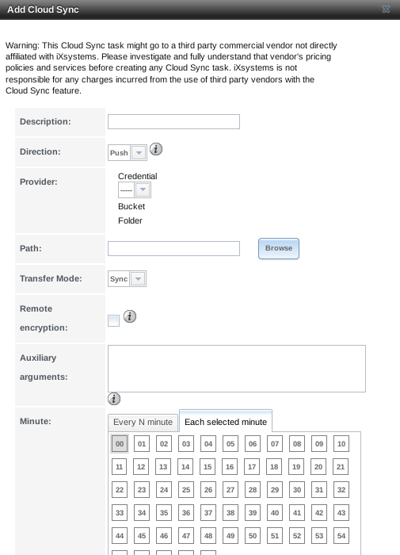
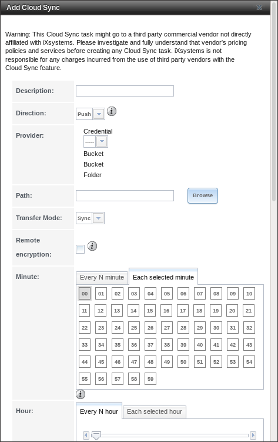
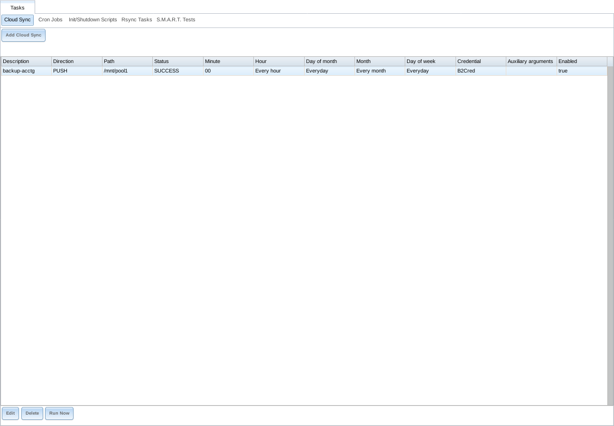
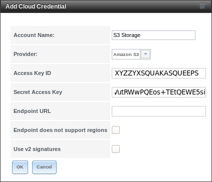
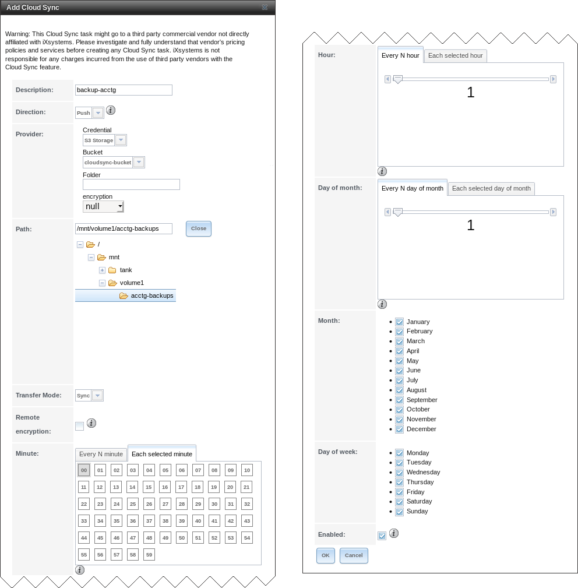
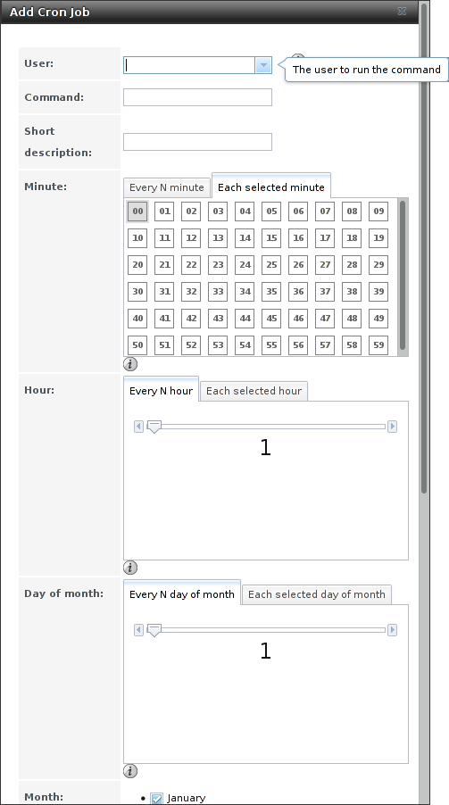
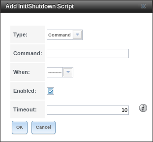
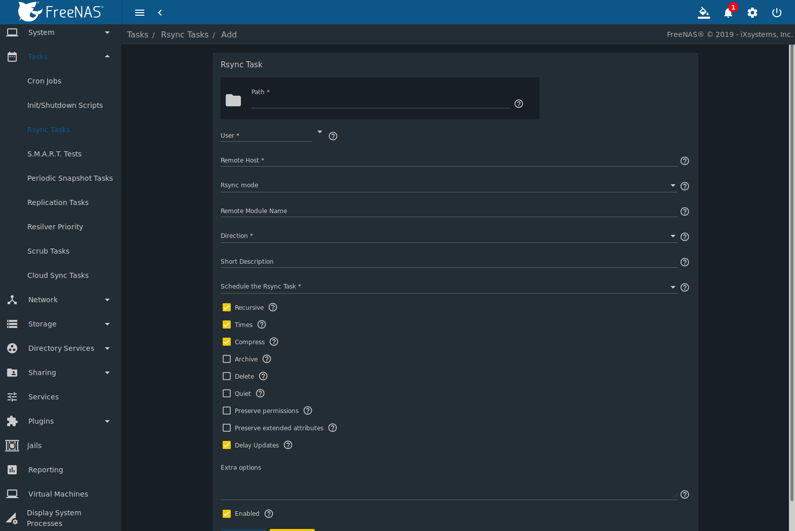
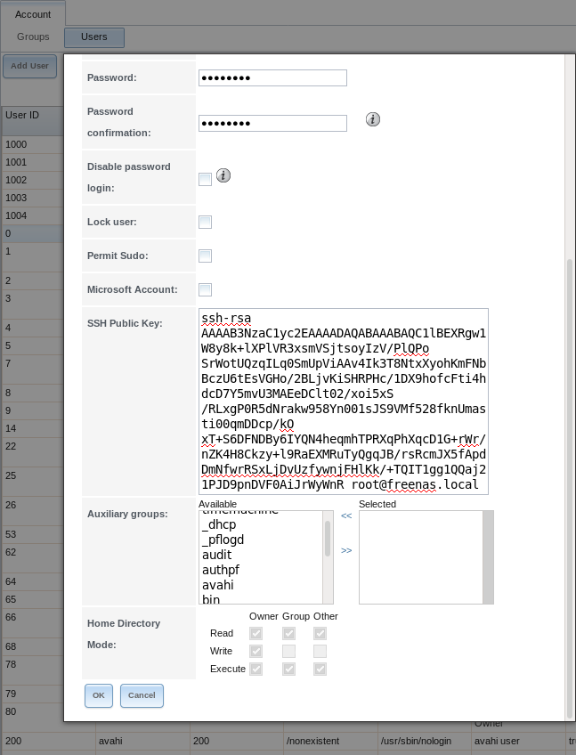
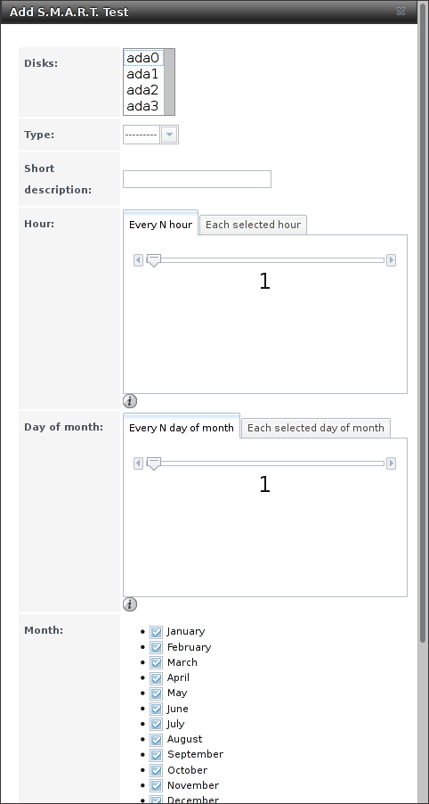

.. index:: Tasks
.. _Tasks:

Tasks
=====

The Tasks section of the administrative GUI is used to configure
repetitive tasks:

* :ref:`Cloud Sync` schedules data synchronization to cloud providers

* :ref:`Cron Jobs` schedules a command or script to automatically
  execute at a specified time

* :ref:`Init/Shutdown Scripts` configures a command or script to
  automatically execute during system startup or shutdown

* :ref:`Rsync Tasks` schedules data synchronization to another system

* :ref:`S.M.A.R.T. Tests` schedules disk tests

Each of these tasks is described in more detail in this section.

.. note:: By default, :ref:`Scrubs` are run once a month by an
   automatically-created task. :ref:`S.M.A.R.T. Tests` and
   :ref:`Periodic Snapshot Tasks` must be set up manually.

.. index:: Cloud Sync
.. _Cloud Sync:

Cloud Sync
----------

Files or directories can be synchronized to remote cloud storage
providers with the :guilabel:`Cloud Sync` feature.

.. warning:: This Cloud Sync task might go to a third party
   commercial vendor not directly affiliated with iXsystems. Please
   investigate and fully understand that vendor's pricing policies and
   services before creating any Cloud Sync task. iXsystems is not
   responsible for any charges incurred from the use of third party
   vendors with the Cloud Sync feature.

:ref:`Cloud Credentials` must be pre-defined before a cloud sync is
created. One set of credentials can be used for more than one cloud
sync. For example, a single set of credentials for Amazon S3 can be
used for separate cloud syncs that push different sets of files or
directories.

A cloud storage area must also exist. With Amazon S3, these are called
*buckets*. The bucket must be created before a sync task can be
created.

After the credentials and receiving bucket have been configured,
:menuselection:`Tasks --> Cloud Syncs --> Add Cloud Sync` is used to
define the schedule for running a cloud sync task. An example is shown in
:numref:`Figure %s <tasks_cloudsync_add_fig>`.

.. _tasks_cloudsync_add_fig:

#ifdef freenas

   Adding a Cloud Sync
#endif freenas
#ifdef truenas

   Adding a Cloud Sync
#endif truenas

:numref:`Table %s <tasks_cloudsync_opts_tab>`
shows the configuration options for Cloud Syncs.

.. tabularcolumns:: |>{\RaggedRight}p{\dimexpr 0.16\linewidth-2\tabcolsep}
                    |>{\RaggedRight}p{\dimexpr 0.20\linewidth-2\tabcolsep}
                    |>{\RaggedRight}p{\dimexpr 0.63\linewidth-2\tabcolsep}|

.. _tasks_cloudsync_opts_tab:

.. table:: Cloud Sync Options
   :class: longtable

   +------------------------+---------------------+--------------------------------------------------------------------------------------------------------+
   | Setting                | Value Type          | Description                                                                                            |
   |                        |                     |                                                                                                        |
   +========================+=====================+========================================================================================================+
   | Description            | string              | Enter a descriptive name for this Cloud Sync.                                                          |
   |                        |                     |                                                                                                        |
   +------------------------+---------------------+--------------------------------------------------------------------------------------------------------+
   | Direction              | string              | *Push* sends data to cloud storage.                                                                    |
   |                        |                     | *Pull* receives data from cloud storage.                                                               |
   +------------------------+---------------------+--------------------------------------------------------------------------------------------------------+
   | Provider               | drop-down           | Choose the cloud storage provider credentials from the list of entered :ref:`Cloud Credentials`.       |
   |                        | menu                | The UI tests the credential and displays an error if a connection cannot be made.                      |
   |                        |                     |                                                                                                        |
   +------------------------+---------------------+--------------------------------------------------------------------------------------------------------+
   | Amazon S3              | drop-down           | Only appears when an S3 credential is the *Provider*.                                                  |
   | Buckets                | menu                | Select the pre-defined S3 bucket to use.                                                               |
   +------------------------+---------------------+--------------------------------------------------------------------------------------------------------+
   | Folder                 | string              | Only appears when an S3 credential is the *Provider*.                                                  |
   |                        |                     | Optionally enter the name of the folder within the selected bucket.                                    |
   |                        |                     |                                                                                                        |
   +------------------------+---------------------+--------------------------------------------------------------------------------------------------------+
   | Server Side            | drop-down           | Only appears when an S3 credential is the *Provider*.                                                  |
   | Encryption             | menu                | Choices are *None* (no encryption) or *AES-256* (encrypted).                                           |
   |                        |                     |                                                                                                        |
   +------------------------+---------------------+--------------------------------------------------------------------------------------------------------+
   | Path                   | browse              | Select the directories or files to be sent to the cloud for *Push* syncs,                              |
   |                        | button              | or the destination to be written as the destinations for *Pull* syncs.                                 |
   |                        |                     | Be cautious about the destination of *Pull* jobs to avoid overwriting existing files.                  |
   |                        |                     |                                                                                                        |
   +------------------------+---------------------+--------------------------------------------------------------------------------------------------------+
   | Transfer Mode          | drop-down           | *Sync* (default) makes files on destination system identical to those on the source.                   |
   |                        | menu                | Files removed from the source are also removed from the destination,                                   |
   |                        |                     | similar to :command:`rsync --delete`.                                                                  |
   |                        |                     |                                                                                                        |
   |                        |                     | *Copy* copies files from the source to the destination and skips files that are identical,             |
   |                        |                     | similar to :command:`rsync`.                                                                           |
   |                        |                     |                                                                                                        |
   |                        |                     | *Move* copies files from the source to the destination and deletes the source files after the copy,    |
   |                        |                     | similar to :command:`mv`.                                                                              |
   |                        |                     |                                                                                                        |
   #ifdef freenas
   +------------------------+---------------------+--------------------------------------------------------------------------------------------------------+
   | Remote encryption      | checkbox            | Set to encrypt files before transfer and store the encrypted files on the remote system.               |
   |                        |                     | `rclone Crypt <https://rclone.org/crypt/>`__ is used.                                                  |
   |                        |                     |                                                                                                        |
   +------------------------+---------------------+--------------------------------------------------------------------------------------------------------+
   | Filename encryption    | checkbox            | Only appears when :guilabel:`Remote encryption` is enabled.                                            |
   |                        |                     | Set to encrypt the shared file names.                                                                  |
   |                        |                     |                                                                                                        |
   +------------------------+---------------------+--------------------------------------------------------------------------------------------------------+
   | Encryption password    | string              | Only appears when :guilabel:`Remote encryption` is enabled.                                            |
   |                        |                     | Enter the password for encrypting and decrypting remote data.                                          |
   |                        |                     | *Warning*: Always save and back up this password.                                                      |
   |                        |                     | Losing the encryption password can result in data loss.                                                |
   |                        |                     |                                                                                                        |
   +------------------------+---------------------+--------------------------------------------------------------------------------------------------------+
   | Encryption salt        | string              | Only appears when :guilabel:`Remote encryption` is enabled.                                            |
   |                        |                     | Enter a long string of random characters for use as `salt                                              |
   |                        |                     | <https://searchsecurity.techtarget.com/definition/salt>`__ for the encryption password.                |
   |                        |                     | *Warning*: Save and back up the encryption salt value.                                                 |
   |                        |                     | Losing the salt value can result in data loss.                                                         |
   |                        |                     |                                                                                                        |
   #endif freenas
   +------------------------+---------------------+--------------------------------------------------------------------------------------------------------+
   | Minute                 | slider or minute    | Select :guilabel:`Every N minutes` and use the slider to choose a value, or select                     |
   |                        | selections          | :guilabel:`Each selected minute` and choose specific minutes to run the task.                          |
   |                        |                     |                                                                                                        |
   +------------------------+---------------------+--------------------------------------------------------------------------------------------------------+
   | Hour                   | slider or hour      | Select :guilabel:`Every N hours` and use the slider to choose a value, or select                       |
   |                        | selections          | :guilabel:`Each selected hour` and choose specific hours to run the task.                              |
   |                        |                     |                                                                                                        |
   +------------------------+---------------------+--------------------------------------------------------------------------------------------------------+
   | Day of month           | slider or day of    | Select :guilabel:`Every N days of month` and use the slider to choose a value, or select               |
   |                        | month selections    | :guilabel:`Each selected day of month` and choose specific days to run the task.                       |
   |                        |                     |                                                                                                        |
   +------------------------+---------------------+--------------------------------------------------------------------------------------------------------+
   | Month                  | checkboxes          | Months when the task runs.                                                                             |
   |                        |                     |                                                                                                        |
   +------------------------+---------------------+--------------------------------------------------------------------------------------------------------+
   | Day of week            | checkboxes          | Days of the week to run the task.                                                                      |
   |                        |                     |                                                                                                        |
   +------------------------+---------------------+--------------------------------------------------------------------------------------------------------+
   | Enabled                | checkbox            | Unset to temporarily disable this Cloud Sync.                                                          |
   |                        |                     |                                                                                                        |
   +------------------------+---------------------+--------------------------------------------------------------------------------------------------------+

The time selected is when the Cloud Sync task is allowed to
begin. The cloud sync runs until finished, even after the time selected.

.. note:: If
   `rclone sync <https://rclone.org/commands/rclone_sync/>`__
   encounters any errors, files are not deleted in the destination.
   This includes a common error when the Dropbox
   `copy right detector <https://techcrunch.com/2014/03/30/how-dropbox-knows-when-youre-sharing-copyrighted-stuff-without-actually-looking-at-your-stuff/>`__
   flags a file as copyrighted.

:numref:`Figure %s <tasks_cloudsync_status_fig>` shows a cloud sync called
*backup-acctg* that "pushes" a file to cloud storage. The last run finished
with a status of *SUCCESS*.

.. _tasks_cloudsync_status_fig:

   Cloud Sync Status

To modify an existing cloud sync, click the entry to access the
:guilabel:`Edit`, and :guilabel:`Delete`, and :guilabel:`Run Now` buttons.

Click the :guilabel:`Status` column entry for a cloud sync that is
*RUNNING*, *FAILED*, or a *SUCCESS*. This opens the log in a pop-up
window to read any error messages or other details.

.. _Cloud Sync Example:

Cloud Sync Example
~~~~~~~~~~~~~~~~~~

This example shows a *Push* cloud sync which writes an accounting
department backup file from the %brand% system to Amazon S3 storage.

Before the new cloud sync was added, a bucket called
*cloudsync-bucket* was created with the Amazon S3 web console for
storing data from the %brand% system.

:menuselection:`System --> Cloud Credentials --> Add Cloud Credential`
is used to enter the credentials for storage on an Amazon AWS account.
The credential is given the name *S3 Storage*, as shown in
:numref:`Figure %s <tasks_cloudsync_example_cred_fig>`:

.. _tasks_cloudsync_example_cred_fig:

   Example: Adding Cloud Credentials

The local data to be sent to the cloud is a single file called
:file:`accounting-backup.bin` on the :file:`smb-storage` dataset. A
cloud sync job is created with
:menuselection:`Tasks --> Cloud Sync --> Add Cloud Sync`.
The :guilabel:`Description` is set to *backup-acctg* to describe the
job. This data is being sent to cloud storage, so this is a *Push*.
The provider comes from the cloud credentials defined in the previous
step, and the destination bucket *cloudsync-bucket* is selected.

The :guilabel:`Path` to the data file is selected.

The remaining fields are for setting a schedule. The default is to
send the data to cloud storage once an hour, every day. The options
provide great versatility in configuring when a cloud sync runs,
anywhere from once a minute to once a year.

The :guilabel:`Enabled` option is set by default, so this cloud
sync will run at the next scheduled time.

The completed dialog is shown in
:numref:`Figure %s <tasks_cloudsync_example_fig>`:

.. _tasks_cloudsync_example_fig:

   Example: Adding a Cloud Sync

.. index:: Cron Jobs
.. _Cron Jobs:

Cron Jobs
---------

`cron(8) <https://www.freebsd.org/cgi/man.cgi?query=cron>`__
is a daemon that runs a command or script on a regular schedule as a
specified user.

:numref:`Figure %s <tasks_create_cron_job_fig>`
shows the screen that opens after clicking
:menuselection:`Tasks --> Cron Jobs --> Add Cron Job`.

.. _tasks_create_cron_job_fig:

   Creating a Cron Job

:numref:`Table %s <tasks_cron_job_opts_tab>`
lists the configurable options for a cron job.

.. tabularcolumns:: |>{\RaggedRight}p{\dimexpr 0.16\linewidth-2\tabcolsep}
                    |>{\RaggedRight}p{\dimexpr 0.20\linewidth-2\tabcolsep}
                    |>{\RaggedRight}p{\dimexpr 0.63\linewidth-2\tabcolsep}|

.. _tasks_cron_job_opts_tab:

.. table:: Cron Job Options
   :class: longtable

   +----------------------+---------------------+---------------------------------------------------------------------------------+
   | Setting              | Value               | Description                                                                     |
   |                      |                     |                                                                                 |
   +======================+=====================+=================================================================================+
   | User                 | drop-down menu      | Choose a user account to run the command or script.                             |
   |                      |                     | The user must have permissions to run the command.                              |
   +----------------------+---------------------+---------------------------------------------------------------------------------+
   | Command              | string              | Enter the **full path** to the command or script to be run.                     |
   |                      |                     | Test a script at the command line first to make sure it works as expected.      |
   |                      |                     |                                                                                 |
   +----------------------+---------------------+---------------------------------------------------------------------------------+
   | Short description    | string              | Optional. Describe the new cron job.                                            |
   |                      |                     |                                                                                 |
   +----------------------+---------------------+---------------------------------------------------------------------------------+
   | Minute               | slider or minute    | With the slider, the cron job occurs every N minutes.                           |
   |                      | selections          | With minute selections, the cron job occurs at the highlighted minutes          |
   |                      |                     |                                                                                 |
   +----------------------+---------------------+---------------------------------------------------------------------------------+
   | Hour                 | slider or hour      | With the slider, the cron job occurs every N hours.                             |
   |                      | selections          | With hour selections, the cron job occurs at the highlighted hours.             |
   |                      |                     |                                                                                 |
   +----------------------+---------------------+---------------------------------------------------------------------------------+
   | Day of month         | slider or month     | With the slider, the cron job occurs every N days.                              |
   |                      | selections          | With day selections, the cron job occurs on the highlighted days each month.    |
   |                      |                     |                                                                                 |
   +----------------------+---------------------+---------------------------------------------------------------------------------+
   | Month                | checkboxes          | Cron job occurs on the selected months.                                         |
   |                      |                     |                                                                                 |
   +----------------------+---------------------+---------------------------------------------------------------------------------+
   | Day of week          | checkboxes          | Cron job occurs on the selected days.                                           |
   |                      |                     |                                                                                 |
   +----------------------+---------------------+---------------------------------------------------------------------------------+
   | Redirect Stdout      | checkbox            | Disables emailing standard output to the *root* user account.                   |
   |                      |                     |                                                                                 |
   +----------------------+---------------------+---------------------------------------------------------------------------------+
   | Redirect Stderr      | checkbox            | Disables emailing errors to the *root* user account.                            |
   |                      |                     |                                                                                 |
   +----------------------+---------------------+---------------------------------------------------------------------------------+
   | Enabled              | checkbox            | Deselect disable the cron job without deleting it.                              |
   |                      |                     |                                                                                 |
   +----------------------+---------------------+---------------------------------------------------------------------------------+

Cron jobs are shown in :guilabel:`View Cron Jobs`. Highlight a cron
job entry to display buttons to :guilabel:`Edit`, :guilabel:`Delete`,
or :guilabel:`Run Now`.

.. note:: :literal:`%` symbols are automatically escaped and should
   not be prefixed with backslashes. For example, use
   :samp:`date '+%Y-%m-%d'` in a cron job to generate a filename based
   on the date.

.. _Init/Shutdown Scripts:

Init/Shutdown Scripts
---------------------

%brand% provides the ability to schedule commands or scripts to run
at system startup or shutdown.

:numref:`Figure %s <tasks_init_script_fig>`
shows the screen that opens after clicking
:menuselection:`Tasks --> Init/Shutdown Scripts --> Add Init/Shutdown
Script`.
:numref:`Table %s <tasks_init_opt_tab>`
summarizes the options.

Scheduled commands must be in the default path. The full path to
the command can also be included in the entry. The path can be tested
by typing :samp:`which {commandname}`. If the command is not found, it
is not in the path.

When scheduling a script, make sure that the script is executable and
has been fully tested to ensure it achieves the desired results.

.. _tasks_init_script_fig:

   Add an Init/Shutdown Script

.. tabularcolumns:: |>{\RaggedRight}p{\dimexpr 0.16\linewidth-2\tabcolsep}
                    |>{\RaggedRight}p{\dimexpr 0.20\linewidth-2\tabcolsep}
                    |>{\RaggedRight}p{\dimexpr 0.63\linewidth-2\tabcolsep}|

.. _tasks_init_opt_tab:

.. table:: Options When Adding an Init/Shutdown Script
   :class: longtable

   +------------+--------------+-------------------------------------------------------------------------------+
   | Setting    | Value        | Description                                                                   |
   |            |              |                                                                               |
   +============+==============+===============================================================================+
   | Type       | drop-down    | Select *Command* for an executable or *Script* for an executable script.      |
   |            | menu         |                                                                               |
   |            |              |                                                                               |
   +------------+--------------+-------------------------------------------------------------------------------+
   | Command    | string       | If *Command* is selected, enter the command plus any desired options.         |
   |            |              | If *Script* is selected, :guilabel:`Browse` to the location of the script.    |
   |            |              |                                                                               |
   +------------+--------------+-------------------------------------------------------------------------------+
   | When       | drop-down    | Select when the command or script runs.                                       |
   |            | menu         | *Pre Init* is very early in boot process before mounting filesystems,         |
   |            |              | *Post Init* is towards end of boot process before FreeNAS services start,     |
   |            |              | or at *Shutdown*.                                                             |
   +------------+--------------+-------------------------------------------------------------------------------+
   | Enabled    | checkbox     | Unset to disable the task.                                                    |
   |            |              |                                                                               |
   +------------+--------------+-------------------------------------------------------------------------------+

.. index:: Rsync Tasks
.. _Rsync Tasks:

Rsync Tasks
-----------

`Rsync <https://www.samba.org/ftp/rsync/rsync.html>`__
is a utility that copies specified data from one system to another
over a network. Once the initial data is copied, rsync reduces the
amount of data sent over the network by sending only the differences
between the source and destination files. Rsync is used for backups,
mirroring data on multiple systems, or for copying files between systems.

Rsync is most effective when only a relatively small amount of the data
has changed. There are also
`some limitations when using Rsync with Windows files
<https://forums.freenas.org/index.php?threads/impaired-rsync-permissions-support-for-windows-datasets.43973/>`__.
For large amounts of data, data that has many changes from the
previous copy, or Windows files, :ref:`Replication Tasks` are often
the faster and better solution.

Rsync is single-threaded and gains little from multiple processor cores.
To see whether rsync is currently running, use :samp:`pgrep rsync` from
the :ref:`Shell`.

Both ends of an rsync connection must be configured:

* **the rsync server:** this system pulls (receives) the data. This
  system is referred to as *PULL* in the configuration examples.

* **the rsync client:** this system pushes (sends) the data. This
  system is referred to as *PUSH* in the configuration examples.

%brand% can be configured as either an *rsync client* or an
*rsync server*. The opposite end of the connection can be another
%brand% system or any other system running rsync. In %brand% terminology,
an *rsync task* defines which data is synchronized between the two
systems. To synchronize data between two %brand% systems, create the
*rsync task* on the *rsync client*.

%brand% supports two modes of rsync operation:

* **rsync module mode:** exports a directory tree, and the configured
  settings of the tree as a symbolic name over an unencrypted connection.
  This mode requires that at least one module be defined on the rsync
  server. It can be defined in the %brand% GUI under
  :menuselection:`Services --> Rsync --> Rsync Modules`.
  In other operating systems, the module is defined in
  `rsyncd.conf(5) <https://www.samba.org/ftp/rsync/rsyncd.conf.html>`__.

* **rsync over SSH:** synchronizes over an encrypted connection.
  Requires the configuration of SSH user and host public keys.

This section summarizes the options when creating an rsync task. It then
provides a configuration example between two %brand% systems for each
mode of rsync operation.

.. note:: If there is a firewall between the two systems or if the
   other system has a built-in firewall, make sure that TCP port 873
   is allowed.

:numref:`Figure %s <tasks_add_rsync_fig>`
shows the screen that appears after selecting
:menuselection:`Tasks --> Rsync Tasks --> Add Rsync Task`.
:numref:`Table %s <tasks_rsync_opts_tab>`
summarizes the options that can be configured when creating an rsync
task.

.. _tasks_add_rsync_fig:

   Adding an Rsync Task

.. tabularcolumns:: |>{\RaggedRight}p{\dimexpr 0.16\linewidth-2\tabcolsep}
                    |>{\RaggedRight}p{\dimexpr 0.20\linewidth-2\tabcolsep}
                    |>{\RaggedRight}p{\dimexpr 0.63\linewidth-2\tabcolsep}|

.. _tasks_rsync_opts_tab:

.. table:: Rsync Configuration Options
   :class: longtable

   +---------------------------------+---------------------+----------------------------------------------------------------------------------------------------------+
   | Setting                         | Value               | Description                                                                                              |
   |                                 |                     |                                                                                                          |
   +=================================+=====================+==========================================================================================================+
   | Path                            | browse button       | :guilabel:`Browse` to the path to be copied.                                                             |
   |                                 |                     | Path lengths cannot be greater than 255 characters.                                                      |
   |                                 |                     |                                                                                                          |
   +---------------------------------+---------------------+----------------------------------------------------------------------------------------------------------+
   | User                            | drop-down menu      | The chosen user must have write permissions for the specified remote directory.                          |
   |                                 |                     | The user name cannot contain spaces or exceed 17 characters.                                             |
   |                                 |                     |                                                                                                          |
   +---------------------------------+---------------------+----------------------------------------------------------------------------------------------------------+
   | Remote Host                     | string              | Enter the IP address or hostname of the remote system that will store the copy.                          |
   |                                 |                     | Use the format *username@remote_host* if the username differs on the remote host.                        |
   |                                 |                     |                                                                                                          |
   +---------------------------------+---------------------+----------------------------------------------------------------------------------------------------------+
   | Remote SSH Port                 | integer             | Only available in  *Rsync over SSH* mode.                                                                |
   |                                 |                     | Allows specifying an SSH port other than the default of *22*.                                            |
   |                                 |                     |                                                                                                          |
   +---------------------------------+---------------------+----------------------------------------------------------------------------------------------------------+
   | Rsync mode                      | drop-down menu      | Choices are *Rsync module* or *Rsync over SSH*.                                                          |
   |                                 |                     |                                                                                                          |
   +---------------------------------+---------------------+----------------------------------------------------------------------------------------------------------+
   | Remote Module Name              | string              | At least one module must be defined in `rsyncd.conf(5)                                                   |
   |                                 |                     | <https://www.samba.org/ftp/rsync/rsyncd.conf.html>`__  of the rsync server                               |
   |                                 |                     | or in the :guilabel:`Rsync Modules` of another system.                                                   |
   |                                 |                     |                                                                                                          |
   +---------------------------------+---------------------+----------------------------------------------------------------------------------------------------------+
   | Remote Path                     | string              | Only appears when using *Rsync over SSH* mode.                                                           |
   |                                 |                     | Enter the **existing** path on the remote host to sync with.                                             |
   |                                 |                     | Example: */mnt/volume*.                                                                                  |
   |                                 |                     | Note that maximum path length is 255 characters.                                                         |
   |                                 |                     |                                                                                                          |
   +---------------------------------+---------------------+----------------------------------------------------------------------------------------------------------+
   | Validate Remote Path            | checkbox            | Verifies the existence of the :guilabel:`Remote Path`.                                                   |
   |                                 |                     |                                                                                                          |
   +---------------------------------+---------------------+----------------------------------------------------------------------------------------------------------+
   | Direction                       | drop-down menu      | Direct the flow of the data to the remote host.                                                          |
   |                                 |                     | Choices are *Push* or *Pull*.                                                                            |
   |                                 |                     | Default is to *Push* to a remote host.                                                                   |
   |                                 |                     |                                                                                                          |
   +---------------------------------+---------------------+----------------------------------------------------------------------------------------------------------+
   | Short Description               | string              | Enter an optional description of the new rsync task.                                                     |
   |                                 |                     |                                                                                                          |
   +---------------------------------+---------------------+----------------------------------------------------------------------------------------------------------+
   | Minute                          | slider or minute    | When the slider is used the sync occurs every N minutes.                                                 |
   |                                 | selections          | Use :guilabel:`Each selected minute` for the sync to occur at the highlighted minutes.                   |
   |                                 |                     |                                                                                                          |
   +---------------------------------+---------------------+----------------------------------------------------------------------------------------------------------+
   | Hour                            | slider or hour      | When the slider is used the sync occurs every N hours.                                                   |
   |                                 | selections          | Use :guilabel:`Each selected hour` for the sync to occur at the highlighted hours.                       |
   |                                 |                     |                                                                                                          |
   +---------------------------------+---------------------+----------------------------------------------------------------------------------------------------------+
   | Day of month                    | slider or day       | When the slider is used the sync occurs every N days.                                                    |
   |                                 | selections          | Use :guilabel:`Each selected day of the month` for the sync to occur on the highlighted days.            |
   |                                 |                     |                                                                                                          |
   +---------------------------------+---------------------+----------------------------------------------------------------------------------------------------------+
   | Month                           | checkboxes          | Define which months to run the task.                                                                     |
   |                                 |                     |                                                                                                          |
   +---------------------------------+---------------------+----------------------------------------------------------------------------------------------------------+
   | Day of week                     | checkboxes          | Define which days of the week to run the task.                                                           |
   |                                 |                     |                                                                                                          |
   +---------------------------------+---------------------+----------------------------------------------------------------------------------------------------------+
   | Recursive                       | checkbox            | Set to include all subdirectories of the specified volume during the rsync task.                         |
   |                                 |                     |                                                                                                          |
   +---------------------------------+---------------------+----------------------------------------------------------------------------------------------------------+
   | Times                           | checkbox            | Set to preserve the modification times of the files.                                                     |
   |                                 |                     |                                                                                                          |
   +---------------------------------+---------------------+----------------------------------------------------------------------------------------------------------+
   | Compress                        | checkbox            | Set to reduce the size of data to transmit.                                                              |
   |                                 |                     | Recommended for slower connections.                                                                      |
   |                                 |                     |                                                                                                          |
   +---------------------------------+---------------------+----------------------------------------------------------------------------------------------------------+
   | Archive                         | checkbox            | Equivalent to :command:`-rlptgoD`.                                                                       |
   |                                 |                     | This will run the task as recursive, copy symlinks as symlinks, preserve permissions,                    |
   |                                 |                     | preserve modification times, preserve group, preserve owner (root only),                                 |
   |                                 |                     | and preserve device and special files.                                                                   |
   |                                 |                     |                                                                                                          |
   +---------------------------------+---------------------+----------------------------------------------------------------------------------------------------------+
   | Delete                          | checkbox            | Set to delete files in the destination directory that do not exist in the sending directory.             |
   |                                 |                     |                                                                                                          |
   +---------------------------------+---------------------+----------------------------------------------------------------------------------------------------------+
   | Quiet                           | checkbox            | Set to suppresses informational messages from the remote server.                                         |
   |                                 |                     |                                                                                                          |
   +---------------------------------+---------------------+----------------------------------------------------------------------------------------------------------+
   | Preserve permissions            | checkbox            | Set to preserve original file permissions.                                                               |
   |                                 |                     | Useful if User is set to *root*.                                                                         |
   |                                 |                     |                                                                                                          |
   +---------------------------------+---------------------+----------------------------------------------------------------------------------------------------------+
   | Preserve extended attributes    | checkbox            | Both systems must support `extended attributes. <https://en.wikipedia.org/wiki/Xattr>`__.                |
   |                                 |                     |                                                                                                          |
   +---------------------------------+---------------------+----------------------------------------------------------------------------------------------------------+
   | Delay Updates                   | checkbox            | Set to save the temporary file from each updated file to a holding directory.                            |
   |                                 |                     | At the end of the transfer, all transferred files are renamed into place and temporary files deleted.    |
   |                                 |                     |                                                                                                          |
   +---------------------------------+---------------------+----------------------------------------------------------------------------------------------------------+
   | Extra options                   | string              | Add any other `rsync(1) <http://rsync.samba.org/ftp/rsync/rsync.html>`__ options.                        |
   |                                 |                     | The :literal:`*` character must be escaped with a backslash (:literal:`\\*.txt`)                         |
   |                                 |                     | or used inside single quotes (:literal:`'*.txt'`).                                                       |
   |                                 |                     |                                                                                                          |
   +---------------------------------+---------------------+----------------------------------------------------------------------------------------------------------+
   | Enabled                         | checkbox            | Unset to disable the rsync task without deleting it.                                                     |
   |                                 |                     |                                                                                                          |
   +---------------------------------+---------------------+----------------------------------------------------------------------------------------------------------+

If the rysnc server requires password authentication, enter
:samp:`--password-file={/PATHTO/FILENAME}` in the
:guilabel:`Extra options` option, replacing :literal:`/PATHTO/FILENAME`
with the appropriate path to the file containing the password.

Created rsync tasks will be listed in :guilabel:`View Rsync Tasks`.
Highlight the entry for an rsync task to display buttons for
:guilabel:`Edit`, :guilabel:`Delete`, or :guilabel:`Run Now`.

.. _Rsync Module Mode:

Rsync Module Mode
~~~~~~~~~~~~~~~~~

This configuration example configures rsync module mode between
these two %brand% systems:

* *192.168.2.2* has existing data in :file:`/mnt/local/images`. It
  will be the rsync client, meaning that an rsync task needs to be
  defined. It will be referred to as *PUSH.*

* *192.168.2.6* has an existing volume named :file:`/mnt/remote`. It
  will be the rsync server, meaning that it will receive the contents
  of :file:`/mnt/local/images`. An rsync module needs to be defined on
  this system and the rsyncd service needs to be started. It will be
  referred to as *PULL.*

On *PUSH*, an rsync task is defined in
:menuselection:`Tasks --> Rsync Tasks --> Add Rsync Task`.
In this example:

* the :guilabel:`Path` points to :file:`/usr/local/images`, the
  directory to be copied

* the :guilabel:`Remote Host` points to *192.168.2.6*, the IP address
  of the rsync server

* the :guilabel:`Rsync Mode` is *Rsync module*

* the :guilabel:`Remote Module Name` is *backups*; this will need to
  be defined on the rsync server

* the :guilabel:`Direction` is *Push*

* the rsync is scheduled to occur every 15 minutes

* the :guilabel:`User` is set to *root* so it has permission to write
  anywhere

* the :guilabel:`Preserve Permissions` option is enabled so that the
  original permissions are not overwritten by the *root* user

On *PULL*, an rsync module is defined in
:menuselection:`Services --> Rsync Modules --> Add Rsync Module`.
In this example:

* the :guilabel:`Module Name` is *backups*; this needs to match the
  setting on the rsync client

* the :guilabel:`Path` is :file:`/mnt/remote`; a directory called
  :file:`images` will be created to hold the contents of
  :file:`/usr/local/images`

* the :guilabel:`User` is set to *root* so it has permission to write
  anywhere

* :guilabel:`Hosts allow` is set to *192.168.2.2*, the IP address of
  the rsync client

Descriptions of the configurable options can be found in
`Rsync Modules`.

To finish the configuration, start the rsync service on *PULL* in
:menuselection:`Services --> Control Services`.
If the rsync is successful, the contents of
:file:`/mnt/local/images/` will be mirrored to
:file:`/mnt/remote/images/`.

.. _Rsync over SSH Mode:

Rsync over SSH Mode
~~~~~~~~~~~~~~~~~~~

SSH replication mode does not require the creation of an rsync module
or for the rsync service to be running on the rsync server. It does
require SSH to be configured before creating the rsync task:

* a public/private key pair for the rsync user account (typically
  *root*) must be generated on *PUSH* and the public key copied to the
  same user account on *PULL*

* to mitigate the risk of man-in-the-middle attacks, the public host
  key of *PULL* must be copied to *PUSH*

* the SSH service must be running on *PULL*

To create the public/private key pair for the rsync user account, open
:ref:`Shell` on *PUSH* and run :command:`ssh-keygen`. This example
generates an RSA type public/private key pair for the *root* user.
When creating the key pair, do not enter the passphrase as the key is
meant to be used for an automated task.

.. code-block:: none

 ssh-keygen -t rsa
 Generating public/private rsa key pair.
 Enter file in which to save the key (/root/.ssh/id_rsa):
 Created directory '/root/.ssh'.
 Enter passphrase (empty for no passphrase):
 Enter same passphrase again:
 Your identification has been saved in /root/.ssh/id_rsa.
 Your public key has been saved in /root/.ssh/id_rsa.pub.
 The key fingerprint is:
 f5:b0:06:d1:33:e4:95:cf:04:aa:bb:6e:a4:b7:2b:df root@freenas.local
 The key's randomart image is:
 +--[ RSA 2048]----+
 |        .o. oo   |
 |         o+o. .  |
 |       . =o +    |
 |        + +   o  |
 |       S o .     |
 |       .o        |
 |      o.         |
 |    o oo         |
 |     **oE        |
 |-----------------|
 |                 |
 |-----------------|

%brand% supports RSA keys for SSH. When creating the key, use
:samp:`-t rsa` to specify this type of key. Refer to
`Key-based Authentication <https://www.freebsd.org/doc/en_US.ISO8859-1/books/handbook/openssh.html#security-ssh-keygen>`__
for more information.

.. note:: If a different user account is used for the rsync task, use
   the :command:`su -` command after mounting the filesystem but
   before generating the key. For example, if the rsync task is
   configured to use the *user1* user account, use this command to
   become that user:

   .. code-block:: none

    su - user1

Next, view and copy the contents of the generated public key:

.. code-block:: none

 more .ssh/id_rsa.pub
 ssh-rsa AAAAB3NzaC1yc2EAAAADAQABAAABAQC1lBEXRgw1W8y8k+lXPlVR3xsmVSjtsoyIzV/PlQPo
 SrWotUQzqILq0SmUpViAAv4Ik3T8NtxXyohKmFNbBczU6tEsVGHo/2BLjvKiSHRPHc/1DX9hofcFti4h
 dcD7Y5mvU3MAEeDClt02/xoi5xS/RLxgP0R5dNrakw958Yn001sJS9VMf528fknUmasti00qmDDcp/kO
 xT+S6DFNDBy6IYQN4heqmhTPRXqPhXqcD1G+rWr/nZK4H8Ckzy+l9RaEXMRuTyQgqJB/rsRcmJX5fApd
 DmNfwrRSxLjDvUzfywnjFHlKk/+TQIT1gg1QQaj21PJD9pnDVF0AiJrWyWnR root@freenas.local

Go to *PULL* and paste (or append) the copied key into the
:guilabel:`SSH Public Key` field of
:menuselection:`Account --> Users --> View Users --> root
--> Modify User`,
or the username of the specified rsync user account. The paste for the
above example is shown in
:numref:`Figure %s <tasks_pasting_sshkey_fig>`.
When pasting the key, ensure that it is pasted as one long line and,
if necessary, remove any extra spaces representing line breaks.

.. _tasks_pasting_sshkey_fig:

   Pasting the User SSH Public Key

While on *PULL*, verify that the SSH service is running in
:menuselection:`Services --> Control Services`
and start it if it is not.

Next, copy the host key of *PULL* using Shell on *PUSH*. The
command below copies the RSA host key of the *PULL* server used in our
previous example. Be sure to include the double bracket *>>* to
prevent overwriting any existing entries in the :file:`known_hosts`
file:

.. code-block:: none

 ssh-keyscan -t rsa 192.168.2.6 >> /root/.ssh/known_hosts

.. note:: If *PUSH* is a Linux system, use this command to copy the
   RSA key to the Linux system:

   .. code-block:: none

      cat ~/.ssh/id_rsa.pub | ssh user@192.168.2.6 'cat >> .ssh/authorized_keys'

The rsync task can now be created on *PUSH*. To configure rsync SSH
mode using the systems in the previous example, use this configuration:

* the :guilabel:`Path` points to :file:`/mnt/local/images`, the
  directory to be copied

* the :guilabel:`Remote Host` points to *192.168.2.6*, the IP address
  of the rsync server

* the :guilabel:`Rsync Mode` is *Rsync over SSH*

* the rsync is scheduled to occur every 15 minutes

* the :guilabel:`User` is set to *root* so it has permission to write
  anywhere; the public key for this user must be generated on *PUSH*
  and copied to *PULL*

* the :guilabel:`Preserve Permissions` option is enabled so that the
  original permissions are not overwritten by the *root* user

Save the rsync task and the rsync will automatically occur according
to the schedule. In this example, the contents of
:file:`/mnt/local/images/` will automatically appear in
:file:`/mnt/remote/images/` after 15 minutes. If the content does not
appear, use Shell on *PULL* to read :file:`/var/log/messages`. If the
message indicates a *\n* (newline character) in the key, remove the
space in the pasted key--it will be after the character that appears
just before the *\n* in the error message.

.. index:: S.M.A.R.T. Tests
.. _S.M.A.R.T. Tests:

S.M.A.R.T. Tests
----------------

`S.M.A.R.T. <https://en.wikipedia.org/wiki/S.M.A.R.T.>`__
(Self-Monitoring, Analysis and Reporting Technology) is a monitoring
system for computer hard disk drives to detect and report on various
indicators of reliability. Replace the drive when a failure is
anticipated by S.M.A.R.T. Most modern ATA, IDE, and
SCSI-3 hard drives support S.M.A.R.T. -- refer to the drive
documentation for confirmation.

:numref:`Figure %s <tasks_add_smart_test_fig>`
shows the configuration screen that appears after selecting
:menuselection:`Tasks --> S.M.A.R.T. Tests --> Add S.M.A.R.T. Test`.
Tests are listed under
:guilabel:`View S.M.A.R.T. Tests`. After creating tests, check the
configuration in
:menuselection:`Services --> S.M.A.R.T.`,
then click the slider to :guilabel:`ON` for the S.M.A.R.T. service in
:menuselection:`Services --> Control Services`.
The S.M.A.R.T. service will not start if there are no volumes.

.. note:: To prevent problems, do not enable the S.M.A.R.T. service if
   the disks are controlled by a RAID controller. It is the job of the
   controller to monitor S.M.A.R.T. and mark drives as Predictive
   Failure when they trip.

.. _tasks_add_smart_test_fig:

   Adding a S.M.A.R.T. Test

:numref:`Table %s <tasks_smart_opts_tab>`
summarizes the configurable options when creating a S.M.A.R.T. test.

.. tabularcolumns:: |>{\RaggedRight}p{\dimexpr 0.16\linewidth-2\tabcolsep}
                    |>{\RaggedRight}p{\dimexpr 0.20\linewidth-2\tabcolsep}
                    |>{\RaggedRight}p{\dimexpr 0.63\linewidth-2\tabcolsep}|

.. _tasks_smart_opts_tab:

.. table:: S.M.A.R.T. Test Options
   :class: longtable

   +----------------------+-------------------+--------------------------------------------------------------------------------------------------+
   | Setting              | Value             | Description                                                                                      |
   |                      |                   |                                                                                                  |
   +======================+===================+==================================================================================================+
   | Disks                | list              | Select the disks to monitor.                                                                     |
   |                      |                   |                                                                                                  |
   +----------------------+-------------------+--------------------------------------------------------------------------------------------------+
   | Type                 | drop-down menu    | Choose the test type.                                                                            |
   |                      |                   | See `smartctl(8) <https://www.smartmontools.org/browser/trunk/smartmontools/smartctl.8.in>`__    |
   |                      |                   | for descriptions of each type of test.                                                           |
   |                      |                   | Some test types will degrade performance or take disks offline.                                  |
   |                      |                   | Avoid scheduling S.M.A.R.T. tests simultaneously with scrub or resilver operations.              |
   |                      |                   |                                                                                                  |
   +----------------------+-------------------+--------------------------------------------------------------------------------------------------+
   | Short description    | string            | Optional. Enter a short description of this test.                                                |
   |                      |                   |                                                                                                  |
   +----------------------+-------------------+--------------------------------------------------------------------------------------------------+
   | Hour                 | slider or hour    | When the slider is used the sync occurs every N hours.                                           |
   |                      | selections        | Use :guilabel:`Each selected hour` for the test to occur at the highlighted hours.               |
   |                      |                   |                                                                                                  |
   +----------------------+-------------------+--------------------------------------------------------------------------------------------------+
   | Day of month         | slider or day     | When the slider is used the sync occurs every N days.                                            |
   |                      | selections        | Use :guilabel:`Each selected day of the month` for the sync to occur on the highlighted days.    |
   |                      |                   |                                                                                                  |
   +----------------------+-------------------+--------------------------------------------------------------------------------------------------+
   | Month                | checkboxes        | Select which months to run the test.                                                             |
   |                      |                   |                                                                                                  |
   +----------------------+-------------------+--------------------------------------------------------------------------------------------------+
   | Day of week          | checkboxes        | Select which days of the week to run the test.                                                   |
   |                      |                   |                                                                                                  |
   +----------------------+-------------------+--------------------------------------------------------------------------------------------------+

.. note:: Scrub tasks are run if and only if the threshhold is met or
   exceeded *and* the task is scheduled to run on the date marked.

An example configuration is to schedule a :guilabel:`Short Self-Test`
once a week and a :guilabel:`Long Self-Test` once a month. These tests
do not have a performance impact, as the disks prioritize normal
I/O over the tests. If a disk fails a test, even if the overall status
is *Passed*, start to think about replacing that disk.

.. warning:: Some S.M.A.R.T. tests cause heavy disk activity and
   can drastically reduce disk performance. Do not schedule S.M.A.R.T.
   tests to run at the same time as scrub or resilver operations or
   during other periods of intense disk activity.

Which tests will run and when can be verified by typing
:command:`smartd -q showtests` within :ref:`Shell`.

The results of a test can be checked from :ref:`Shell` by specifying
the name of the drive. For example, to see the results for disk
*ada0*, type:

.. code-block:: none

   smartctl -l selftest /dev/ada0

If an email address is entered in the :guilabel:`Email to report`
field of
:menuselection:`Services --> S.M.A.R.T.`,
the system will send an email to that address when a test fails. Logging
information for S.M.A.R.T. tests can be found in
:file:`/var/log/daemon.log`.
