.. index:: Tasks
.. _Tasks:

Tasks
=====

The Tasks section of the administrative GUI is used to configure
repetitive tasks:

* :ref:`Cron Jobs` schedules a command or script to automatically
  execute at a specified time

* :ref:`Init/Shutdown Scripts` configures a command or script to
  automatically execute during system startup or shutdown

* :ref:`Rsync Tasks` schedules data synchronization to another system

* :ref:`S.M.A.R.T. Tests` schedules disk tests

* :ref:`Periodic Snapshot Tasks` schedules automatic creation of
  filesystem snapshots

* :ref:`Replication Tasks` automate the replication of snapshots to
  a remote system

* :ref:`Resilver Priority` controls the priority of resilvers

* :ref:`Scrub Tasks` schedules scrubs as part of ongoing disk
  maintenance

* :ref:`Cloud Sync Tasks` schedules data synchronization to cloud
  providers

Each of these tasks is described in more detail in this section.

.. note:: By default, :ref:`Scrub Tasks` are run once a month by an
   automatically-created task. :ref:`S.M.A.R.T. Tests` and
   :ref:`Periodic Snapshot Tasks` must be set up manually.

.. index:: Cron Jobs
.. _Cron Jobs:

Cron Jobs
---------

`cron(8) <https://www.freebsd.org/cgi/man.cgi?query=cron>`__
is a daemon that runs a command or script on a regular schedule as a
specified user.

:numref:`Figure %s <tasks_create_cron_job_fig>`
shows the screen that opens after navigating
:menuselection:`Tasks --> Cron Jobs`
and clicking |ui-add|.

.. _tasks_create_cron_job_fig:

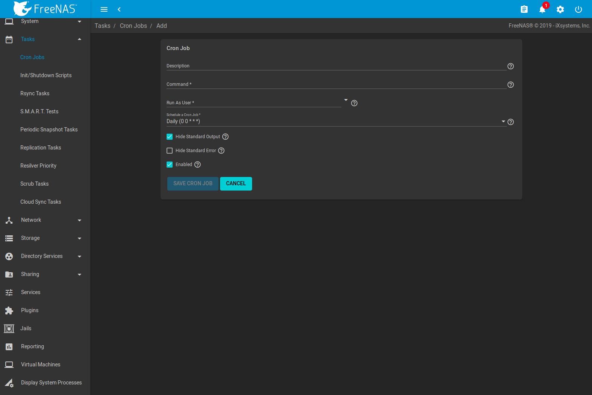

   Creating a Cron Job

:numref:`Table %s <tasks_cron_job_opts_tab>`
lists the configurable options for a cron job.

.. tabularcolumns:: |>{\RaggedRight}p{\dimexpr 0.16\linewidth-2\tabcolsep}
                    |>{\RaggedRight}p{\dimexpr 0.20\linewidth-2\tabcolsep}
                    |>{\RaggedRight}p{\dimexpr 0.63\linewidth-2\tabcolsep}|

.. _tasks_cron_job_opts_tab:

.. table:: Cron Job Options
   :class: longtable

   +-------------------+-----------------------------+---------------------------------------------------------------------------------------------------------+
   | Setting           | Value                       | Description                                                                                             |
   |                   |                             |                                                                                                         |
   +===================+=============================+=========================================================================================================+
   | Description       | string                      | notes or a name for the Cron job                                                                        |
   |                   |                             |                                                                                                         |
   +-------------------+-----------------------------+---------------------------------------------------------------------------------------------------------+
   | Command           | drop-down menu              | the **full path** to the command or script to be run; if it is a script, test it at the command line    |
   |                   |                             | to ensure it works                                                                                      |
   |                   |                             |                                                                                                         |
   +-------------------+-----------------------------+---------------------------------------------------------------------------------------------------------+
   | Run As User       | string                      | make sure the selected user has permission to run the specified command or script                       |
   |                   |                             |                                                                                                         |
   +-------------------+-----------------------------+---------------------------------------------------------------------------------------------------------+
   | Quick Schedule    | value                       | select a time frame for the job. Otherwise, do not select a time frame to customize the schedule        |
   |                   |                             |                                                                                                         |
   +-------------------+-----------------------------+---------------------------------------------------------------------------------------------------------+
   | Minute            | value                       | the cron job occurs at the specified minutes                                                            |
   |                   |                             |                                                                                                         |
   +-------------------+-----------------------------+---------------------------------------------------------------------------------------------------------+
   | Hour              | value                       | the cron job occurs at the specified hours                                                              |
   |                   |                             |                                                                                                         |
   +-------------------+-----------------------------+---------------------------------------------------------------------------------------------------------+
   | Day of month      | value                       | the cron job occurs on specified days of the month                                                      |
   |                   |                             |                                                                                                         |
   +-------------------+-----------------------------+---------------------------------------------------------------------------------------------------------+
   | Month             | drop-down menu              | the cron job occurs on the specified months                                                             |
   |                   |                             |                                                                                                         |
   +-------------------+-----------------------------+---------------------------------------------------------------------------------------------------------+
   | Day of week       | drop-down menu              | the cron job occurs on the selected days                                                                |
   |                   |                             |                                                                                                         |
   +-------------------+-----------------------------+---------------------------------------------------------------------------------------------------------+
   | Redirect Standard | checkbox                    | disables emailing standard output to the *root* user account                                            |
   | Output            |                             |                                                                                                         |
   |                   |                             |                                                                                                         |
   +-------------------+-----------------------------+---------------------------------------------------------------------------------------------------------+
   | Redirect Errors   | checkbox                    | disables emailing errors to the *root* user account                                                     |
   |                   |                             |                                                                                                         |
   +-------------------+-----------------------------+---------------------------------------------------------------------------------------------------------+
   | Enable            | checkbox                    | uncheck disable the cron job without deleting it                                                        |
   |                   |                             |                                                                                                         |
   +-------------------+-----------------------------+---------------------------------------------------------------------------------------------------------+

Cron jobs are shown in :menuselection:`Tasks --> Cron Jobs`.
Click |ui-options| to see the :guilabel:`Edit` and :guilabel:`Delete`
buttons.

.. note:: :literal:`%` symbols are automatically escaped and should
   not be prefixed with backslashes. For example, use
   :samp:`date '+%Y-%m-%d'` in a cron job to generate a filename based
   on the date.

.. _Init/Shutdown Scripts:

Init/Shutdown Scripts
---------------------

%brand% provides the ability to schedule commands or scripts to run
at system startup or shutdown.

:numref:`Figure %s <tasks_init_script_fig>`
shows the screen that opens after navigating
:menuselection:`Tasks --> Init/Shutdown Scripts`
and clicking |ui-add|.
:numref:`Table %s <tasks_init_opt_tab>`
summarizes the options.

Scheduled commands must be in the default path. The full path to
the command can also be included in the entry. The path can be tested
by typing :samp:`which {commandname}`. If the command is not found, it
is not in the path.

When scheduling a script, make sure that the script is executable and
has been fully tested to ensure it achieves the desired results.

.. _tasks_init_script_fig:

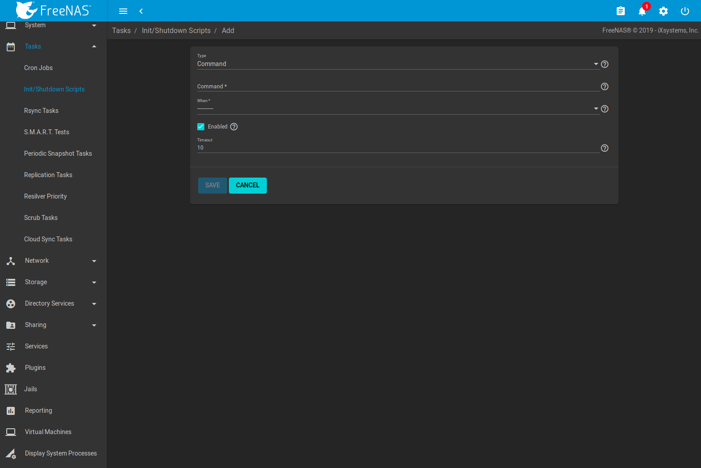

   Add an Init/Shutdown Script

.. tabularcolumns:: |>{\RaggedRight}p{\dimexpr 0.16\linewidth-2\tabcolsep}
                    |>{\RaggedRight}p{\dimexpr 0.20\linewidth-2\tabcolsep}
                    |>{\RaggedRight}p{\dimexpr 0.63\linewidth-2\tabcolsep}|

.. _tasks_init_opt_tab:

.. table:: Options When Adding an Init/Shutdown Script
   :class: longtable

   +-------------+----------------+-----------------------------------------------------------------------------------+
   | Setting     | Value          | Description                                                                       |
   |             |                |                                                                                   |
   |             |                |                                                                                   |
   +=============+================+===================================================================================+
   | Type        | drop-down menu | select from *Command* (for an executable) or                                      |
   |             |                | *Script* (for an executable script)                                               |
   |             |                |                                                                                   |
   +-------------+----------------+-----------------------------------------------------------------------------------+
   | Command /   | string         | if *Command* is selected, enter the command plus any desired options; if          |
   | Script      |                | *Script* is selected, :guilabel:`Browse` to the location of the script            |
   |             |                |                                                                                   |
   +-------------+----------------+-----------------------------------------------------------------------------------+
   | When        | drop-down menu | select when the command/script will run; choices are *Pre Init*                   |
   |             |                | (very early in boot process before filesystems are mounted), *Post Init*          |
   |             |                | (towards end of boot process before FreeNAS services are started), or *Shutdown*  |
   |             |                |                                                                                   |
   +-------------+----------------+-----------------------------------------------------------------------------------+
   | Enabled     | checkbox       | uncheck to disable the task                                                       |
   |             |                |                                                                                   |
   +-------------+----------------+-----------------------------------------------------------------------------------+

Init/Shutdown tasks are shown in
:menuselection:`Tasks --> Init/Shutdown Scripts`.
Click |ui-options| to see the :guilabel:`Edit` and :guilabel:`Delete`
buttons.

.. index:: Rsync Tasks
.. _Rsync Tasks:

Rsync Tasks
-----------

`Rsync <https://www.samba.org/ftp/rsync/rsync.html>`__
is a utility that copies specified data from one system to another
over a network. Once the initial data is copied, rsync reduces the
amount of data sent over the network by sending only the differences
between the source and destination files. rsync can be used for backups,
mirroring data on multiple systems, or for copying files between systems.

rsync is most effective when only a relatively small amount
of the data has changed. There are also
`some limitations when using Rsync with Windows files
<https://forums.freenas.org/index.php?threads/impaired-rsync-permissions-support-for-windows-datasets.43973/>`__.
For large amounts of data, data that has many changes from the
previous copy, or Windows files, :ref:`Replication Tasks` are often
the faster and better solution.

rsync is single-threaded and gains little from multiple processor cores.
To see whether rsync is currently running, use :samp:`pgrep rsync` from
the :ref:`Shell`.

Both ends of an rsync connection must be configured:

* **the rsync server:** this system pulls (receives) the data. This
  system is referred to as *PULL* in the configuration examples.

* **the rsync client:** this system pushes (sends) the data. This
  system is referred to as *PUSH* in the configuration examples.

%brand% can be configured as either an *rsync client* or an
*rsync server*. The opposite end of the connection can be another
%brand% system or any other system running rsync. In %brand% terminology,
an *rsync task* defines which data is synchronized between the two
systems. To synchronize data between two %brand% systems, create the
*rsync task* on the *rsync client*.

%brand% supports two modes of rsync operation:

* **rsync module mode:** exports a directory tree, and its configured
  settings, as a symbolic name over an unencrypted connection. This
  mode requires that at least one module be defined on the rsync
  server. It can be defined in the %brand% GUI under
  :menuselection:`Services --> Rsync Configure --> Rsync Module`.
  In other operating systems, the module is defined in
  `rsyncd.conf(5) <https://www.samba.org/ftp/rsync/rsyncd.conf.html>`__.

* **rsync over SSH:** synchronizes over an encrypted connection.
  Requires the configuration of SSH user and host public keys.

This section summarizes the options when creating an rsync task. It then
provides a configuration example between two %brand% systems for each
mode of rsync operation.

.. note:: If there is a firewall between the two systems or if the
   other system has a built-in firewall, make sure that TCP port 873
   is allowed.

:numref:`Figure %s <tasks_add_rsync_fig>`
shows the screen that appears after navigating
:menuselection:`Tasks --> Rsync Tasks`
and clicking |ui-add|.
:numref:`Table %s <tasks_rsync_opts_tab>`
summarizes the options that can be configured when creating an rsync
task.

.. _tasks_add_rsync_fig:

.. figure:: images/tasks-rsync-tasks-add.png

   Adding an Rsync Task

.. tabularcolumns:: |>{\RaggedRight}p{\dimexpr 0.16\linewidth-2\tabcolsep}
                    |>{\RaggedRight}p{\dimexpr 0.20\linewidth-2\tabcolsep}
                    |>{\RaggedRight}p{\dimexpr 0.63\linewidth-2\tabcolsep}|

.. _tasks_rsync_opts_tab:

.. table:: Rsync Configuration Options
   :class: longtable

   +----------------------------------+-----------------------------+-------------------------------------------------------------------------------------------+
   | Setting                          | Value                       | Description                                                                               |
   |                                  |                             |                                                                                           |
   |                                  |                             |                                                                                           |
   +==================================+=============================+===========================================================================================+
   | Path                             | browse button               | browse to the path that to be copied; note that a path length greater than 255            |
   |                                  |                             | characters will fail                                                                      |
   |                                  |                             |                                                                                           |
   +----------------------------------+-----------------------------+-------------------------------------------------------------------------------------------+
   | User                             | drop-down menu              | specified user must have permission to write to the specified directory on the remote     |
   |                                  |                             | system; due to a limitation in FreeBSD, the user name cannot contain spaces or exceed 17  |
   |                                  |                             | characters                                                                                |
   |                                  |                             |                                                                                           |
   +----------------------------------+-----------------------------+-------------------------------------------------------------------------------------------+
   | Remote Host                      | string                      | IP address or hostname of the remote system that will store the copy; use the format      |
   |                                  |                             | *username@remote_host* if the username differs on the remote host                         |
   |                                  |                             |                                                                                           |
   +----------------------------------+-----------------------------+-------------------------------------------------------------------------------------------+
   | Remote SSH Port                  | integer                     | only available in  *Rsync over SSH* mode; allows specifying an SSH port                   |
   |                                  |                             | other than the default of *22*                                                            |
   |                                  |                             |                                                                                           |
   +----------------------------------+-----------------------------+-------------------------------------------------------------------------------------------+
   | Rsync mode                       | drop-down menu              | choices are *Rsync module* or                                                             |
   |                                  |                             | *Rsync over SSH*                                                                          |
   |                                  |                             |                                                                                           |
   +----------------------------------+-----------------------------+-------------------------------------------------------------------------------------------+
   | Remote Module Name               | string                      | only appears when using *Rsync module* mode, at least one module must be defined in       |
   |                                  |                             | `rsyncd.conf(5) <https://www.samba.org/ftp/rsync/rsyncd.conf.html>`__                     |
   |                                  |                             | of rsync server or in the :guilabel:`Rsync Modules` of another                            |
   |                                  |                             | system                                                                                    |
   |                                  |                             |                                                                                           |
   +----------------------------------+-----------------------------+-------------------------------------------------------------------------------------------+
   | Remote Path                      | string                      | only appears when using *Rsync over SSH* mode, enter the **existing** path on the remote  |
   |                                  |                             | host to sync with (e.g. */mnt/pool*); note that maximum path length is 255 characters     |
   |                                  |                             |                                                                                           |
   +----------------------------------+-----------------------------+-------------------------------------------------------------------------------------------+
   | Validate Remote Path             | checkbox                    | if the :guilabel:`Remote Path` does not yet exist, check this box to have it              |
   |                                  |                             | automatically created                                                                     |
   +----------------------------------+-----------------------------+-------------------------------------------------------------------------------------------+
   | Direction                        | drop-down menu              | choices are *Push* or                                                                     |
   |                                  |                             | *Pull*; default is to push to a remote host                                               |
   |                                  |                             |                                                                                           |
   +----------------------------------+-----------------------------+-------------------------------------------------------------------------------------------+
   | Short Description                | string                      | optional                                                                                  |
   |                                  |                             |                                                                                           |
   +----------------------------------+-----------------------------+-------------------------------------------------------------------------------------------+
   | Quick Schedule                   | drop-down menu              | select a simple repeating schedule for this task                                          |
   |                                  |                             |                                                                                           |
   +----------------------------------+-----------------------------+-------------------------------------------------------------------------------------------+
   | Minute                           | integer                     | enter the minute of the hour for the sync to occur                                        |
   |                                  |                             |                                                                                           |
   +----------------------------------+-----------------------------+-------------------------------------------------------------------------------------------+
   | Hour                             | integer                     | enter the hour of the day for the sync to occur                                           |
   |                                  |                             |                                                                                           |
   +----------------------------------+-----------------------------+-------------------------------------------------------------------------------------------+
   | Day of month                     | inter                       | enter the day of the month for the sync to occur                                          |
   |                                  |                             |                                                                                           |
   +----------------------------------+-----------------------------+-------------------------------------------------------------------------------------------+
   | Month                            | checkboxes                  | task occurs on the selected months                                                        |
   |                                  |                             |                                                                                           |
   +----------------------------------+-----------------------------+-------------------------------------------------------------------------------------------+
   | Day of week                      | checkboxes                  | task occurs on the selected days of the week                                              |
   |                                  |                             |                                                                                           |
   +----------------------------------+-----------------------------+-------------------------------------------------------------------------------------------+
   | Recursive                        | checkbox                    | if checked, copy will include all subdirectories of the specified pool                    |
   |                                  |                             |                                                                                           |
   +----------------------------------+-----------------------------+-------------------------------------------------------------------------------------------+
   | Times                            | checkbox                    | preserve modification times of files                                                      |
   |                                  |                             |                                                                                           |
   +----------------------------------+-----------------------------+-------------------------------------------------------------------------------------------+
   | Compress                         | checkbox                    | recommended on slow connections as reduces size of data to be transmitted                 |
   |                                  |                             |                                                                                           |
   +----------------------------------+-----------------------------+-------------------------------------------------------------------------------------------+
   | Archive                          | checkbox                    | equivalent to :command:`-rlptgoD` (recursive, copy symlinks as symlinks, preserve         |
   |                                  |                             | permissions, preserve modification times, preserve group, preserve owner (super-user      |
   |                                  |                             | only), and preserve device files (super-user only) and special files)                     |
   |                                  |                             |                                                                                           |
   +----------------------------------+-----------------------------+-------------------------------------------------------------------------------------------+
   | Delete                           | checkbox                    | delete files in destination directory that do not exist in sending directory              |
   |                                  |                             |                                                                                           |
   +----------------------------------+-----------------------------+-------------------------------------------------------------------------------------------+
   | Quiet                            | checkbox                    | suppresses informational messages from the remote server                                  |
   |                                  |                             |                                                                                           |
   +----------------------------------+-----------------------------+-------------------------------------------------------------------------------------------+
   | Preserve permissions             | checkbox                    | preserves original file permissions; useful if User is set to *root*                      |
   |                                  |                             |                                                                                           |
   |                                  |                             |                                                                                           |
   +----------------------------------+-----------------------------+-------------------------------------------------------------------------------------------+
   | Preserve extended attributes     | checkbox                    | both systems must support                                                                 |
   |                                  |                             | `extended attributes <https://en.wikipedia.org/wiki/Xattr>`__                             |
   |                                  |                             |                                                                                           |
   +----------------------------------+-----------------------------+-------------------------------------------------------------------------------------------+
   | Delay Updates                    | checkbox                    | when checked, the temporary file from each updated file is saved to a holding directory   |
   |                                  |                             | until the end of the transfer, when all transferred files are renamed into place          |
   |                                  |                             |                                                                                           |
   +----------------------------------+-----------------------------+-------------------------------------------------------------------------------------------+
   | Extra options                    | string                      | `rsync(1) <http://rsync.samba.org/ftp/rsync/rsync.html>`__                                |
   |                                  |                             | options not covered by the GUI; if the :literal:`*` character is used, it                 |
   |                                  |                             | must be escaped with a backslash (:literal:`\\*.txt`)                                     |
   |                                  |                             | or used inside single quotes (:literal:`'*.txt'`)                                         |
   |                                  |                             |                                                                                           |
   +----------------------------------+-----------------------------+-------------------------------------------------------------------------------------------+
   | Enabled                          | checkbox                    | uncheck to disable the rsync task without deleting it; note that when the :ref:`Rsync`    |
   |                                  |                             | service is OFF, the rsync task will continue to look for the server unless this           |
   |                                  |                             | checkbox is unchecked                                                                     |
   |                                  |                             |                                                                                           |
   +----------------------------------+-----------------------------+-------------------------------------------------------------------------------------------+

If the rysnc server requires password authentication, enter
:samp:`--password-file={/PATHTO/FILENAME}` in the
:guilabel:`Extra options` field, replacing :literal:`/PATHTO/FILENAME`
with the appropriate path to the file containing the password.

Created rsync tasks will be listed in :guilabel:`Rsync Tasks`.
Click |ui-options| for an entry to display buttons for
:guilabel:`Edit`, :guilabel:`Delete`, or :guilabel:`Run Now`.

.. _Rsync Module Mode:

Rsync Module Mode
~~~~~~~~~~~~~~~~~

This configuration example configures rsync module mode between
the two following %brand% systems:

* *192.168.2.2* has existing data in :file:`/mnt/local/images`. It
  will be the rsync client, meaning that an rsync task needs to be
  defined. It will be referred to as *PUSH.*

* *192.168.2.6* has an existing pool named :file:`/mnt/remote`. It
  will be the rsync server, meaning that it will receive the contents
  of :file:`/mnt/local/images`. An rsync module needs to be defined on
  this system and the rsyncd service needs to be started. It will be
  referred to as *PULL.*

On *PUSH*, an rsync task is defined in
:menuselection:`Tasks --> Rsync Tasks`, |ui-add|.
In this example:

* the :guilabel:`Path` points to :file:`/usr/local/images`, the
  directory to be copied

* the :guilabel:`Remote Host` points to *192.168.2.6*, the IP address
  of the rsync server

* the :guilabel:`Rsync Mode` is *Rsync module*

* the :guilabel:`Remote Module Name` is *backups*; this will need to
  be defined on the rsync server

* the :guilabel:`Direction` is *Push*

* the rsync is scheduled to occur every 15 minutes

* the :guilabel:`User` is set to *root* so it has permission to write
  anywhere

* the :guilabel:`Preserve Permissions` checkbox is checked so that the
  original permissions are not overwritten by the *root* user

On *PULL*, an rsync module is defined in
:menuselection:`Services --> Rsync Configure --> Rsync Module`, |ui-add|.
In this example:

* the :guilabel:`Module Name` is *backups*; this needs to match the
  setting on the rsync client

* the :guilabel:`Path` is :file:`/mnt/remote`; a directory called
  :file:`images` will be created to hold the contents of
  :file:`/usr/local/images`

* the :guilabel:`User` is set to *root* so it has permission to write
  anywhere

* :guilabel:`Hosts allow` is set to *192.168.2.2*, the IP address of
  the rsync client

Descriptions of the configurable options can be found in
:ref:`Rsync Modules`.

To finish the configuration, start the rsync service on *PULL* in
:menuselection:`Services`.
If the rsync is successful, the contents of
:file:`/mnt/local/images/` will be mirrored to
:file:`/mnt/remote/images/`.

.. _Rsync over SSH Mode:

Rsync over SSH Mode
~~~~~~~~~~~~~~~~~~~

SSH replication mode does not require the creation of an rsync module
or for the rsync service to be running on the rsync server. It does
require SSH to be configured before creating the rsync task:

* a public/private key pair for the rsync user account (typically
  *root*) must be generated on *PUSH* and the public key copied to the
  same user account on *PULL*

* to mitigate the risk of man-in-the-middle attacks, the public host
  key of *PULL* must be copied to *PUSH*

* the SSH service must be running on *PULL*

To create the public/private key pair for the rsync user account, open
:ref:`Shell` on *PUSH* and run :command:`ssh-keygen`. This example
generates an RSA type public/private key pair for the *root* user.
When creating the key pair, do not enter the passphrase as the key is
meant to be used for an automated task.

.. code-block:: none

 ssh-keygen -t rsa
 Generating public/private rsa key pair.
 Enter file in which to save the key (/root/.ssh/id_rsa):
 Created directory '/root/.ssh'.
 Enter passphrase (empty for no passphrase):
 Enter same passphrase again:
 Your identification has been saved in /root/.ssh/id_rsa.
 Your public key has been saved in /root/.ssh/id_rsa.pub.
 The key fingerprint is:
 f5:b0:06:d1:33:e4:95:cf:04:aa:bb:6e:a4:b7:2b:df root@freenas.local
 The key's randomart image is:
 +--[ RSA 2048]----+
 |        .o. oo   |
 |         o+o. .  |
 |       . =o +    |
 |        + +   o  |
 |       S o .     |
 |       .o        |
 |      o.         |
 |    o oo         |
 |     **oE        |
 |-----------------|
 |                 |
 |-----------------|

%brand% supports RSA keys for SSH. When creating the key, use
:samp:`-t rsa` to specify this type of key.

.. note:: If a different user account is used for the rsync task, use
   the :command:`su -` command after mounting the filesystem but
   before generating the key. For example, if the rsync task is
   configured to use the *user1* user account, use this command to
   become that user:

   .. code-block:: none

    su - user1

Next, view and copy the contents of the generated public key:

.. code-block:: none

 more .ssh/id_rsa.pub
 ssh-rsa AAAAB3NzaC1yc2EAAAADAQABAAABAQC1lBEXRgw1W8y8k+lXPlVR3xsmVSjtsoyIzV/PlQPo
 SrWotUQzqILq0SmUpViAAv4Ik3T8NtxXyohKmFNbBczU6tEsVGHo/2BLjvKiSHRPHc/1DX9hofcFti4h
 dcD7Y5mvU3MAEeDClt02/xoi5xS/RLxgP0R5dNrakw958Yn001sJS9VMf528fknUmasti00qmDDcp/kO
 xT+S6DFNDBy6IYQN4heqmhTPRXqPhXqcD1G+rWr/nZK4H8Ckzy+l9RaEXMRuTyQgqJB/rsRcmJX5fApd
 DmNfwrRSxLjDvUzfywnjFHlKk/+TQIT1gg1QQaj21PJD9pnDVF0AiJrWyWnR root@freenas.local

Go to *PULL* and paste (or append) the copied key into the
:guilabel:`SSH Public Key` field of
:menuselection:`Account --> Users --> root -->`
|ui-options|
:menuselection:`--> Edit`,
or the username of the specified rsync user account. The paste for the
above example is shown in
:numref:`Figure %s <tasks_pasting_sshkey_fig>`.
When pasting the key, ensure that it is pasted as one long line and,
if necessary, remove any extra spaces representing line breaks.

.. _tasks_pasting_sshkey_fig:

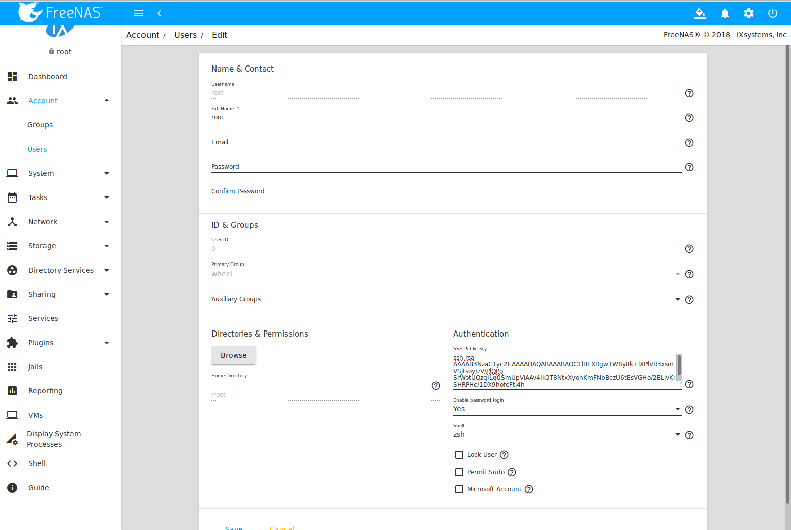

   Pasting the User's SSH Public Key

While on *PULL*, verify that the SSH service is running in
:menuselection:`Services`
and start it if it is not.

Next, copy the host key of *PULL* using Shell on *PUSH*. The following
command copies the RSA host key of the *PULL* server used in our
previous example. Be sure to include the double bracket *>>* to
prevent overwriting any existing entries in the :file:`known_hosts`
file:

.. code-block:: none

 ssh-keyscan -t rsa 192.168.2.6 >> /root/.ssh/known_hosts

.. note:: If *PUSH* is a Linux system, use this command to copy the
   RSA key to the Linux system:

   .. code-block:: none

      cat ~/.ssh/id_rsa.pub | ssh user@192.168.2.6 'cat >> .ssh/authorized_keys'

The rsync task can now be created on *PUSH*. To configure rsync SSH
mode using the systems in our previous example, the configuration is
as follows:

* the :guilabel:`Path` points to :file:`/mnt/local/images`, the
  directory to be copied

* the :guilabel:`Remote Host` points to *192.168.2.6*, the IP address
  of the rsync server

* the :guilabel:`Rsync Mode` is *Rsync over SSH*

* the rsync is scheduled to occur every 15 minutes

* the :guilabel:`User` is set to *root* so it has permission to write
  anywhere; the public key for this user must be generated on *PUSH*
  and copied to *PULL*

* the :guilabel:`Preserve Permissions` checkbox is checked so that the
  original permissions are not overwritten by the *root* user

Save the rsync task and the rsync will automatically occur according
to the schedule. In this example, the contents of
:file:`/mnt/local/images/` will automatically appear in
:file:`/mnt/remote/images/` after 15 minutes. If the content does not
appear, use Shell on *PULL* to read :file:`/var/log/messages`. If the
message indicates a *\n* (newline character) in the key, remove the
space in the pasted key--it will be after the character that appears
just before the *\n* in the error message.

.. index:: S.M.A.R.T. Tests
.. _S.M.A.R.T. Tests:

S.M.A.R.T. Tests
----------------

`S.M.A.R.T. <https://en.wikipedia.org/wiki/S.M.A.R.T.>`__
(Self-Monitoring, Analysis and Reporting Technology) is a monitoring
system for computer hard disk drives to detect and report on various
indicators of reliability. When a failure is anticipated by
S.M.A.R.T., the drive should be replaced. Most modern ATA, IDE, and
SCSI-3 hard drives support S.M.A.R.T. -- refer to the drive
documentation for confirmation.

:numref:`Figure %s <tasks_add_smart_test_fig>`
shows the configuration screen that appears after navigating
:menuselection:`Tasks --> S.M.A.R.T. Tests`
and clicking |ui-add|. Tests are listed under
:guilabel:`S.M.A.R.T. Tests`. After creating tests, check the
configuration in
:menuselection:`Services --> S.M.A.R.T.`,
then click the power button for the S.M.A.R.T. service in
:menuselection:`Services`
to activate the service. The S.M.A.R.T. service will not start if there
are no pools.

.. note:: To prevent problems, do not enable the S.M.A.R.T. service if
   the disks are controlled by a RAID controller. It is the job of the
   controller to monitor S.M.A.R.T. and mark drives as Predictive
   Failure when they trip.

.. _tasks_add_smart_test_fig:

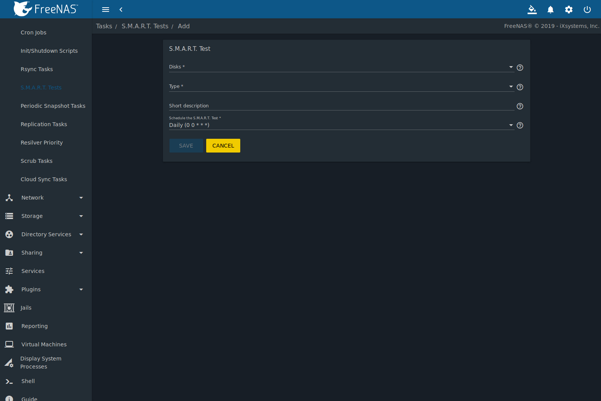

   Adding a S.M.A.R.T. Test

:numref:`Table %s <tasks_smart_opts_tab>`
summarizes the configurable options when creating a S.M.A.R.T. test.

.. tabularcolumns:: |>{\RaggedRight}p{\dimexpr 0.16\linewidth-2\tabcolsep}
                    |>{\RaggedRight}p{\dimexpr 0.20\linewidth-2\tabcolsep}
                    |>{\RaggedRight}p{\dimexpr 0.63\linewidth-2\tabcolsep}|

.. _tasks_smart_opts_tab:

.. table:: S.M.A.R.T. Test Options
   :class: longtable

   +-------------------+---------------------------+------------------------------------------------------------------------------------------------------------+
   | Setting           | Value                     | Description                                                                                                |
   |                   |                           |                                                                                                            |
   +===================+===========================+============================================================================================================+
   | Disks             | drop-down menu            | highlight disks to monitor                                                                                 |
   |                   |                           |                                                                                                            |
   +-------------------+---------------------------+------------------------------------------------------------------------------------------------------------+
   | Type              | drop-down menu            | select type of test to run; see                                                                            |
   |                   |                           | `smartctl(8) <https://www.smartmontools.org/browser/trunk/smartmontools/smartctl.8.in>`__                  |
   |                   |                           | for a description of each type of test (note that some test types will degrade performance or take disks   |
   |                   |                           | offline; do not schedule S.M.A.R.T. tests at the same time as a scrub or during a resilver operation)      |
   |                   |                           |                                                                                                            |
   +-------------------+---------------------------+------------------------------------------------------------------------------------------------------------+
   | Short description | string                    | optional                                                                                                   |
   |                   |                           |                                                                                                            |
   +-------------------+---------------------------+------------------------------------------------------------------------------------------------------------+
   | Quick Schedule    | drop-down menu            | selecting a :guilabel:`Quick Schedule` other than :guilabel:`-----` limits other scheduling options;       |
   |                   |                           | choose :guilabel:`-----`, :guilabel:`Daily`, :guilabel:`Weekly`, or :guilabel:`Monthly`                    |
   |                   |                           |                                                                                                            |
   +-------------------+---------------------------+------------------------------------------------------------------------------------------------------------+
   | Hour              | integer                   | test occurs at the listed hours                                                                            |
   |                   |                           |                                                                                                            |
   +-------------------+---------------------------+------------------------------------------------------------------------------------------------------------+
   | Day of month      | integer                   | test occurs on the listed days                                                                             |
   |                   |                           |                                                                                                            |
   +-------------------+---------------------------+------------------------------------------------------------------------------------------------------------+
   | Month             | checkboxes                | select the months for the test to occur                                                                    |
   |                   |                           |                                                                                                            |
   +-------------------+---------------------------+------------------------------------------------------------------------------------------------------------+
   | Day of week       | checkboxes                | select the days of the week for the test to occur                                                          |
   |                   |                           |                                                                                                            |
   +-------------------+---------------------------+------------------------------------------------------------------------------------------------------------+

An example configuration is to schedule a :guilabel:`Short Self-Test`
once a week and a :guilabel:`Long Self-Test` once a month. These tests
should not have a performance impact, as the disks prioritize normal
I/O over the tests. If a disk fails a test, even if the overall status
is *Passed*, start to think about replacing that disk.

.. warning:: Some S.M.A.R.T. tests cause heavy disk activity and
   can drastically reduce disk performance. Do not schedule S.M.A.R.T.
   tests to run at the same time as scrub or resilver operations or
   during other periods of intense disk activity.

Which tests will run and when can be verified by typing
:command:`smartd -q showtests` within :ref:`Shell`.

The results of a test can be checked from :ref:`Shell` by specifying
the name of the drive. For example, to see the results for disk
*ada0*, type:

.. code-block:: none

  smartctl -l selftest /dev/ada0

If an email address is entered in the :guilabel:`Email` field of
:menuselection:`Services --> S.M.A.R.T. --> Configure`,
the system will send an email to that address when a test fails. Logging
information for S.M.A.R.T. tests can be found in
:file:`/var/log/daemon.log`.

.. index:: Periodic Snapshot, Snapshot
.. _Periodic Snapshot Tasks:

Periodic Snapshot Tasks
-----------------------

A periodic snapshot task allows scheduling the creation of read-only
versions of pools and datasets at a given point in time. Snapshots can
be created quickly and, if little data changes, new snapshots take up
very little space. For example, a snapshot where no files have changed
takes 0 MB of storage, but as changes are made to files, the snapshot
size changes to reflect the size of the changes.

Snapshots provide a clever way of keeping a history of files,
providing a way to recover an older copy or even a deleted file. For
this reason, many administrators take snapshots often (perhaps every
fifteen minutes), store them for a period of time (possibly a month),
and store them on another system (typically using
:ref:`Replication Tasks`). Such a strategy allows the administrator to
roll the system back to a specific point in time. If there is a
catastrophic loss, an off-site snapshot can be used to restore the
system up to the time of the last snapshot.

A pool must exist before a snapshot can be created. Creating a pool is
described in :ref:`Pools`.

To create a periodic snapshot task, navigate
:menuselection:`Tasks --> Periodic Snapshot Tasks`
and click |ui-add|. This opens the screen shown in
:numref:`Figure %s <zfs_periodic_snapshot_fig>`.
:numref:`Table %s <zfs_periodic_snapshot_opts_tab>`
summarizes the fields in this screen.

.. _zfs_periodic_snapshot_fig:

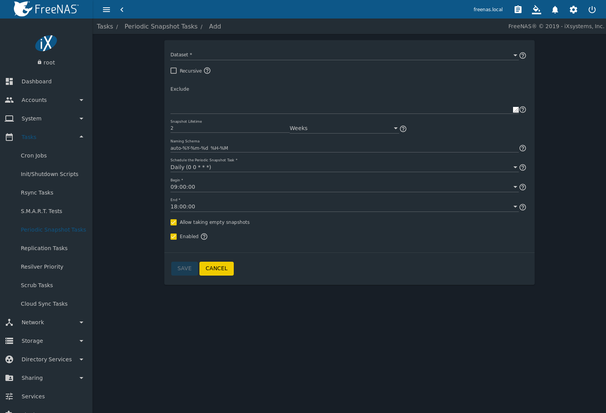

   Creating a Periodic Snapshot

.. tabularcolumns:: |>{\RaggedRight}p{\dimexpr 0.16\linewidth-2\tabcolsep}
                    |>{\RaggedRight}p{\dimexpr 0.20\linewidth-2\tabcolsep}
                    |>{\RaggedRight}p{\dimexpr 0.63\linewidth-2\tabcolsep}|

.. _zfs_periodic_snapshot_opts_tab:

.. table:: Options When Creating a Periodic Snapshot
   :class: longtable

   +--------------------+----------------------------+--------------------------------------------------------------------------------------------------------------+
   | Setting            | Value                      | Description                                                                                                  |
   |                    |                            |                                                                                                              |
   +====================+============================+==============================================================================================================+
   | Pool/Dataset       | drop-down menu             | select an existing pool, dataset, or zvol                                                                    |
   |                    |                            |                                                                                                              |
   +--------------------+----------------------------+--------------------------------------------------------------------------------------------------------------+
   | Recursive          | checkbox                   | select this box to take separate snapshots of the pool/dataset and each of its child datasets; if            |
   |                    |                            | unchecked, a single snapshot is taken of only the specified pool/dataset, but not any child                  |
   |                    |                            | datasets                                                                                                     |
   +--------------------+----------------------------+--------------------------------------------------------------------------------------------------------------+
   | Snapshot Lifetime  | integer and drop-down menu | length of time to retain the snapshot on this system; if the snapshot is replicated, it is not removed       |
   |                    |                            | from the receiving system when the lifetime expires                                                          |
   |                    |                            |                                                                                                              |
   +--------------------+----------------------------+--------------------------------------------------------------------------------------------------------------+
   | Begin              | drop-down menu             | do not create snapshots before this time of day                                                              |
   |                    |                            |                                                                                                              |
   +--------------------+----------------------------+--------------------------------------------------------------------------------------------------------------+
   | End                | drop-down menu             | do not create snapshots after this time of day                                                               |
   |                    |                            |                                                                                                              |
   +--------------------+----------------------------+--------------------------------------------------------------------------------------------------------------+
   | Interval           | drop-down menu             | how often to take snapshot between :guilabel:`Begin` and                                                     |
   |                    |                            | :guilabel:`End` times                                                                                        |
   |                    |                            |                                                                                                              |
   +--------------------+----------------------------+--------------------------------------------------------------------------------------------------------------+
   | Day of week        | checkboxes                 | which days of the week to take snapshots                                                                     |
   |                    |                            |                                                                                                              |
   +--------------------+----------------------------+--------------------------------------------------------------------------------------------------------------+
   | Enabled            | checkbox                   | uncheck to disable the scheduled snapshot task without deleting it                                           |
   |                    |                            |                                                                                                              |
   +--------------------+----------------------------+--------------------------------------------------------------------------------------------------------------+

If the :guilabel:`Recursive` box is checked, child datasets of this
dataset are included in the snapshot and there is no need to create
snapshots for each child dataset. The downside is that there is no way
to exclude particular child  datasets from a recursive snapshot.

Click :guilabel:`Save` when finished customizing the task. Entries for
each task are shown in :guilabel:`Periodic Snapshot Tasks`. Click
|ui-options| for an entry to display :guilabel:`Edit` and
:guilabel:`Delete` buttons for it.

.. index:: Replication
.. _Replication Tasks:

Replication Tasks
-----------------

*Replication* is the duplication of snapshots from one %brand% system
to another computer. When a new snapshot is created on the source
computer, it is automatically replicated to the destination computer.
Replication is typically used to keep a copy of files on a separate
system, with that system sometimes being at a different physical
location.

The basic configuration requires a source system with the original
data and a destination system where the data will be replicated.
The destination system is prepared to receive replicated data, a
:ref:`periodic snapshot <Periodic Snapshot Tasks>` of the data on the
source system is created, and then a replication task is created. As
snapshots are automatically created on the source computer, they are
automatically replicated to the destination computer.

.. note:: Replicated data is not visible on the receiving system until
   the replication task completes.

.. note:: The target dataset on the receiving system is automatically
   created in read-only mode to protect the data. To mount or browse
   the data on the receiving system, create a clone of the snapshot
   and use the clone. Clones are created in read/write mode, making it
   possible to browse or mount them. See :ref:`Snapshots` for more
   information on creating clones.

.. _replication_common_config:

Examples: Common Configuration
~~~~~~~~~~~~~~~~~~~~~~~~~~~~~~

The examples shown here use the same setup of source and destination
computers.

*Alpha* (Source)
^^^^^^^^^^^^^^^^

*Alpha* is the source computer with the data to be replicated. It is
at IP address *10.0.0.102*. A :ref:`pool <Pools>` named *alphapool*
has already been created, and a :ref:`dataset <Adding Datasets>` named
*alphadata* has been created on that pool. This dataset contains the
files which will be snapshotted and replicated onto *Beta*.

This new dataset has been created for this example, but a new dataset
is not required. Most users will already have datasets containing the
data they wish to replicate.

Create a periodic snapshot of the source dataset by navigating
:menuselection:`Tasks --> Periodic Snapshot Tasks`
and clicking |ui-add|. Add the *alphapool/alphadata* dataset to the
:guilabel:`Pool/Dataset` field.
:numref:`Figure %s <zfs_create_periodic_replication_fig>` shows the
configured periodic snapshot.

.. _zfs_create_periodic_replication_fig:

.. figure:: images/replication3a.png

   Create a Periodic Snapshot for Replication

This example creates a snapshot of the *alphapool/alphadata* dataset
every two hours from Monday through Friday between the hours of 9:00
and 18:00 (6:00 PM). Snapshots are automatically deleted after their
chosen lifetime of two weeks expires.

*Beta* (Destination)
^^^^^^^^^^^^^^^^^^^^

*Beta* is the destination computer where the replicated data will be
copied.  It is at IP address *10.0.0.118*. A :ref:`pool <Pools>`
named *betapool* has already been created.

Snapshots are transferred with :ref:`SSH`. To allow incoming
connections, this service is enabled on *Beta*. The service is not
required for outgoing connections, and so does not need to be enabled
on *Alpha*.

Example: %brand% to %brand% Semi-Automatic Setup
~~~~~~~~~~~~~~~~~~~~~~~~~~~~~~~~~~~~~~~~~~~~~~~~~~~~~~~~~~~~~~~~~~~~~~~~~~~~~~~~~~~~

%brand% offers a special semi-automatic setup mode that simplifies
setting up replication.  Create the replication task on *Alpha* by
clicking :guilabel:`Replication Tasks`, hovering |ui-menu| and clicking
:guilabel:`Replication`. *alphapool/alphadata* is selected as the
dataset to replicate. *betapool* is the destination pool where
*alphadata* snapshots are replicated. The :guilabel:`Setup mode`
dropdown is set to *Semi-Automatic* as shown in
:numref:`Figure %s <zfs_create_repl2_fig>`.
The IP address of *Beta* is entered in the :guilabel:`Remote Hostname`
field. A hostname can be entered here if local DNS resolves for that
hostname.

.. note:: If :guilabel:`WebGUI HTTP -> HTTPS Redirect` has been
   enabled in
   :menuselection:`System --> General`
   on the destination computer,
   :guilabel:`Remote HTTP/HTTPS Port` must be set to the HTTPS port
   (usually *443*) and :guilabel:`Remote HTTPS` must be enabled when
   creating the replication on the source computer.

.. _zfs_create_repl2_fig:

.. figure:: images/replication6.png

   Add Replication Dialog, Semi-Automatic

The :guilabel:`Remote Auth Token` field expects a special token from
the *Beta* computer. On *Beta*, navigate
:menuselection:`Tasks --> Replication Tasks`,
and click :guilabel:`Replication Token`. A dialog
showing the temporary authorization token is shown as in
:numref:`Figure %s <zfs_auth_token_fig>`.

Highlight the temporary authorization token string with the mouse and
copy it.

.. _zfs_auth_token_fig:

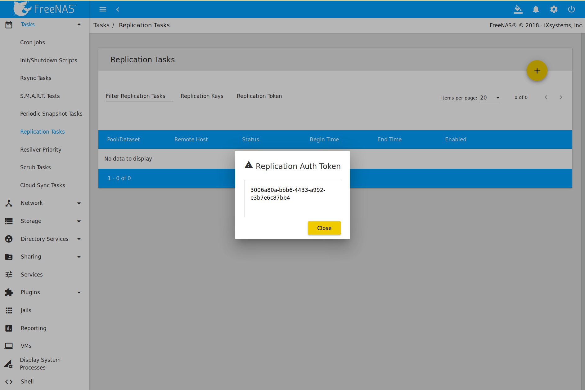

   Temporary Authentication Token on Destination

On the *Alpha* system, paste the copied temporary authorization token
string into the :guilabel:`Remote Auth Token` field as shown in
:numref:`Figure %s <zfs_auth_token_paste_fig>`.

.. _zfs_auth_token_paste_fig:

.. figure:: images/replication8.png

   Temporary Authentication Token Pasted to Source

Finally, click :guilabel:`Save` to create the replication task. After
each periodic snapshot is created, a replication task will copy it to
the destination system. See :ref:`Limiting Replication Times` for
information about restricting when replication is allowed to run.

.. note::  The temporary authorization token is only valid for a few
   minutes. If a *Token is invalid* message is shown, get a new
   temporary authorization token from the destination system, clear
   the :guilabel:`Remote Auth Token` field, and paste in the new one.

Example: %brand% to %brand% Dedicated User Replication
~~~~~~~~~~~~~~~~~~~~~~~~~~~~~~~~~~~~~~~~~~~~~~~~~~~~~~~~~~~~~~~~~~~~~~~~~~~~~~~~~~~~

A *dedicated user* can be used for replications rather than the root
user. This example shows the process using the semi-automatic
replication setup between two %brand% systems with a dedicated user
named *repluser*. SSH key authentication is used to allow the user to
log in remotely without a password.

In this example, the periodic snapshot task has not been created yet.
If the periodic snapshot shown in the
:ref:`example configuration <replication_common_config>` has already
been created, go to
:menuselection:`Tasks --> Periodic Snapshot Tasks`,
click |ui-options| for the task and :guilabel:`Delete` to remove it
before continuing.

On *Alpha*, select
:menuselection:`Account --> Users`.
Click |ui-add|. Enter *repluser* for :guilabel:`Username`,
enter */mnt/alphapool/repluser* in the :guilabel:`Home Directory` field,
enter *Replication Dedicated User* for the :guilabel:`Full Name`, and
set :guilabel:`Enable password login` to *No*. Leave the other fields at
their default values, but note the :guilabel:`User ID` number. Click
:guilabel:`Save` to create the user.

On *Beta*, the same dedicated user must be created as was created on
the sending computer. Select
:menuselection:`Account --> Users`.
Click the :guilabel:`Add User`. Enter the *User ID* number from
*Alpha*, *repluser* for :guilabel:`Username`, enter
*/mnt/betapool/repluser* in the :guilabel:`Home Directory` field, enter
*Replication Dedicated User* for the :guilabel:`Full Name`, and set
:guilabel:`Enable password login` to *No*. Leave the other fields at
their default values. Click :guilabel:`Save` to create the user.

A dataset with the same name as the original must be created on the
destination computer, *Beta*. Navigate
:menuselection:`Storage --> Pools`,
click on *betapool*, then click |ui-options| and :guilabel:`Add Dataset`.
Enter *alphadata* as the :guilabel:`Name`, then click :guilabel:`Save`.

The replication user must be given permissions to the destination
dataset. Still on *Beta*, open a :ref:`Shell` and enter this command:

.. code-block:: none

   zfs allow -ldu repluser create,destroy,diff,mount,readonly,receive,release,send,userprop betapool/alphadata

The destination dataset must also be set to read-only. Enter this
command in the :ref:`Shell`:

.. code-block:: none

   zfs set readonly=on betapool/alphadata

The replication user must also be able to mount datasets. Still on
*Beta*, go to
:menuselection:`System --> Tunables`.
Click |ui-add|. Enter *vfs.usermount* for the :guilabel:`Variable`,
*1* for the :guilabel:`Value`, and choose
*Sysctl* from the :guilabel:`Type` drop-down. Click :guilabel:`Save`.

Back on *Alpha*, create a
:ref:`periodic snapshot <Periodic Snapshot Tasks>` of the source dataset.
:numref:`Figure %s <zfs_create_periodic_replication_fig>` shows the
configuration.

Still on *Alpha*, create the replication task by clicking
:guilabel:`Replication Tasks`, hovering |ui-menu|, and clicking
:guilabel:`Replication`. *alphapool/alphadata* is selected as the
dataset to replicate. *betapool/alphadata* is the destination pool
and dataset where *alphadata* snapshots are replicated.

The :guilabel:`Setup mode` dropdown is set to *Semi-Automatic* as
shown in
:numref:`Figure %s <zfs_create_repl2_fig>`.
The IP address of *Beta* is entered in the :guilabel:`Remote hostname`
field. A hostname can be entered here if local DNS resolves for that
hostname.

.. note:: If :guilabel:`WebGUI HTTP -> HTTPS Redirect` has been
   enabled in
   :menuselection:`System --> General`
   on the destination computer,
   :guilabel:`Remote HTTP/HTTPS Port` must be set to the HTTPS port
   (usually *443*) and :guilabel:`Remote HTTPS` must be enabled when
   creating the replication on the source computer.

The :guilabel:`Remote Auth Token` field expects a special token from
the *Beta* computer. On *Beta*, navigate
:menuselection:`Tasks --> Replication Tasks`,
hover |ui-menu|, and click :guilabel:`Replication Token`. A dialog
showing the temporary authorization token is shown as in
:numref:`Figure %s <zfs_auth_token_fig>`.

Highlight the temporary authorization token string with the mouse and
copy it.

On the *Alpha* system, paste the copied temporary authorization token
string into the :guilabel:`Remote Auth Token` field as shown in
:numref:`Figure %s <zfs_auth_token_paste_fig>`.

Set the :guilabel:`Dedicated User Enabled` checkbox. Choose *repluser*
in the :guilabel:`Dedicated User` drop-down.

Click :guilabel:`Save` to create the replication task.

.. note::  The temporary authorization token is only valid for a few
   minutes. If a *Token is invalid* message is shown, get a new
   temporary authorization token from the destination system, clear
   the :guilabel:`Remote Auth Token` field, and paste in the new one.

#ifdef comment
Still on *Alpha*, hover |ui-menu| and click :guilabel:`Replication Keys`
Copy the key value with the mouse.

This might not be necessary with semi-auto replication
On *Beta*, select
:menuselection:`Account --> Users`. Click the *repluser* line to
select it, then click :guilabel:`Modify User`. Paste the value in the
:guilabel:`SSH Public Key` field. (overwrite existing if present?)\
#endif comment

Replication will begin when the periodic snapshot task runs.

Additional replications can use the same dedicated user that has
already been set up. The permissions and read only settings made
through the :ref:`Shell` must be set on each new destination dataset.

Example: %brand% to %brand% or Other Systems, Manual Setup
~~~~~~~~~~~~~~~~~~~~~~~~~~~~~~~~~~~~~~~~~~~~~~~~~~~~~~~~~~~~~~~~~~~~~~~~~~~~~~~~~~~~

This example uses the same basic configuration of source and
destination computers shown above, but the destination computer is not
required to be a %brand% system. Other operating systems can receive
the replication if they support SSH, ZFS, and the same features that
are in use on the source system. The details of creating pools and
datasets, enabling SSH, and copying encryption keys will vary when the
destination computer is not a %brand% system.

Encryption Keys
^^^^^^^^^^^^^^^

A public encryption key must be copied from *Alpha* to *Beta* to
allow a secure connection without a password prompt. On *Alpha*,
navigate
:menuselection:`Tasks --> Replication Tasks`,
and click :guilabel:`Replication Keys`. This produces
the window shown in :numref:`Figure %s <zfs_copy_replication_key_fig>`.
Use the mouse to highlight the key data shown in the window, then copy
it.

.. _zfs_copy_replication_key_fig:

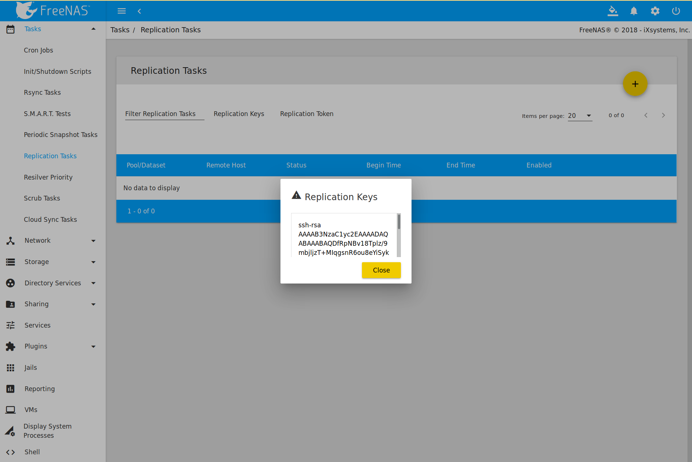

   Copy the Replication Key

On *Beta*, navigate
:menuselection:`Account --> Users`.
Click |ui-options| for the *root* account, then click :guilabel:`Edit`.
Paste the copied key into the :guilabel:`SSH Public Key` field and click
:guilabel:`Save` as shown in
:numref:`Figure %s <zfs_paste_replication_key_fig>`.

.. _zfs_paste_replication_key_fig:

.. figure:: images/replication4.png

   Paste the Replication Key

Back on *Alpha*, create the replication task by clicking
:guilabel:`Replication Tasks`, hovering |ui-menu|, and clicking
:guilabel:`Replication`. *alphapool/alphadata* is selected as the
dataset to replicate. The destination pool is *betapool*. The
*alphadata* dataset and snapshots are replicated there. The IP address
of *Beta* is entered in the
:guilabel:`Remote Hostname` field as shown in
:numref:`Figure %s <zfs_create_repl1_fig>`. A hostname can be entered
here if local DNS resolves for that hostname.

Click the :guilabel:`Scan SSH Key` button to retrieve the SSH host keys
from *Beta* and fill the :guilabel:`Remote Hostkey` field. Finally,
click :guilabel:`Save` to create the replication task. After each
periodic snapshot is created, a replication task will copy it to the
destination system. See :ref:`Limiting Replication Times` for
information about restricting when replication is allowed to run.

.. _zfs_create_repl1_fig:

.. figure:: images/replication5.png
   :width: 90%

   Add Replication Dialog

Replication Options
~~~~~~~~~~~~~~~~~~~

:numref:`Table %s <zfs_add_replication_task_opts_tab>` describes the
options in the replication task dialog.

.. tabularcolumns:: |>{\RaggedRight}p{\dimexpr 0.25\linewidth-2\tabcolsep}
                    |>{\RaggedRight}p{\dimexpr 0.12\linewidth-2\tabcolsep}
                    |>{\RaggedRight}p{\dimexpr 0.63\linewidth-2\tabcolsep}|

.. _zfs_add_replication_task_opts_tab:

.. table:: Replication Task Options
   :class: longtable

   +---------------------------+----------------+--------------------------------------------------------------------------------------------------------------+
   | Setting                   | Value          | Description                                                                                                  |
   |                           |                |                                                                                                              |
   |                           |                |                                                                                                              |
   +===========================+================+==============================================================================================================+
   | Pool/Dataset              | drop-down menu | pool or dataset on the source computer containing the snapshots to be replicated; the                        |
   |                           |                | drop-down menu is empty if a snapshot does not already exist                                                 |
   |                           |                |                                                                                                              |
   +---------------------------+----------------+--------------------------------------------------------------------------------------------------------------+
   | Remote ZFS Pool/Dataset   | string         | pool on the remote or destination computer which will store the snapshots; if the destination dataset        |
   |                           |                | is not present, it will be created; :file:`/mnt/` is assumed, do not include it in the path                  |
   |                           |                |                                                                                                              |
   +---------------------------+----------------+--------------------------------------------------------------------------------------------------------------+
   | Recursively Replicate     | checkbox       | when checked, also replicate snapshots of datasets that are children of the main dataset                     |
   | Child Dataset Snapshots   |                |                                                                                                              |
   |                           |                |                                                                                                              |
   +---------------------------+----------------+--------------------------------------------------------------------------------------------------------------+
   | Delete Stale Snapshots    | checkbox       | when checked, delete previous snapshots on the remote or destination computer which are no longer present    |
   | on Remote System          |                | on the source computer                                                                                       |
   |                           |                |                                                                                                              |
   +---------------------------+----------------+--------------------------------------------------------------------------------------------------------------+
   | Replication Stream        | drop-down menu | choices are *lz4 (fastest)*,                                                                                 |
   | Compression               |                | *pigz (all rounder)*,                                                                                        |
   |                           |                | *plzip (best compression)*, or                                                                               |
   |                           |                | *Off* (no compression); selecting a compression algorithm can reduce the size of the data being replicated   |
   |                           |                |                                                                                                              |
   +---------------------------+----------------+--------------------------------------------------------------------------------------------------------------+
   | Limit (KB/s)              | integer        | limit replication speed to the specified value in kilobytes/second; default of *0* is unlimited              |
   |                           |                |                                                                                                              |
   +---------------------------+----------------+--------------------------------------------------------------------------------------------------------------+
   | Begin Time                | drop-down menu | replication is not allowed to start before this time; times entered in the :guilabel:`Begin` and             |
   |                           |                | :guilabel:`End` fields set when replication can occur                                                        |
   |                           |                |                                                                                                              |
   +---------------------------+----------------+--------------------------------------------------------------------------------------------------------------+
   | End Time                  | drop-down menu | replication must start by this time; once started, replication will continue until it is finished            |
   |                           |                |                                                                                                              |
   |                           |                |                                                                                                              |
   +---------------------------+----------------+--------------------------------------------------------------------------------------------------------------+
   | Enabled                   | checkbox       | uncheck to disable the scheduled replication task without deleting it                                        |
   |                           |                |                                                                                                              |
   +---------------------------+----------------+--------------------------------------------------------------------------------------------------------------+
   | Setup Mode                | drop-down menu | *Manual* or                                                                                                  |
   |                           |                | *Semi-automatic*                                                                                             |
   |                           |                |                                                                                                              |
   +---------------------------+----------------+--------------------------------------------------------------------------------------------------------------+
   | Remote Hostname           | string         | IP address or DNS name of remote computer where replication is sent                                          |
   |                           |                |                                                                                                              |
   +---------------------------+----------------+--------------------------------------------------------------------------------------------------------------+
   | Remote Port               | string         | the port used by the SSH server on the remote or destination computer                                        |
   |                           |                |                                                                                                              |
   +---------------------------+----------------+--------------------------------------------------------------------------------------------------------------+
   | Encryption Cipher         | drop-down menu | *Standard*, *Fast*, or *Disabled*                                                                            |
   |                           |                |                                                                                                              |
   +---------------------------+----------------+--------------------------------------------------------------------------------------------------------------+
   | Dedicated User Enabled    | checkbox       | allow a user account other than root to be used for replication                                              |
   |                           |                |                                                                                                              |
   +---------------------------+----------------+--------------------------------------------------------------------------------------------------------------+
   | Dedicated User            | drop-down menu | only available if :guilabel:`Dedicated User Enabled` is checked; select the user account                     |
   |                           |                | to be used for replication                                                                                   |
   |                           |                |                                                                                                              |
   +---------------------------+----------------+--------------------------------------------------------------------------------------------------------------+
   | Remote Hostkey            | string         | use the :guilabel:`Scan SSH Key` button to retrieve the public host key of the remote or destination         |
   |                           |                | computer and populate this field with that key                                                               |
   +---------------------------+----------------+--------------------------------------------------------------------------------------------------------------+

The replication task runs after a new periodic snapshot is created.
The periodic snapshot and any new manual snapshots of the same dataset
are replicated onto the destination computer.

When multiple replications have been created, replication tasks run
serially, one after another. Completion time depends on the number and
size of snapshots and the bandwidth available between the source and
destination computers.

The first time a replication runs, it must duplicate data structures
from the source to the destination computer. This can take much longer
to complete than subsequent replications, which only send differences
in data.

.. warning:: Snapshots record incremental changes in data. If the
   receiving system does not have at least one snapshot that can be
   used as a basis for the incremental changes in the snapshots from
   the sending system, there is no way to identify only the data that
   has changed. In this situation, the snapshots in the receiving
   system target dataset are removed so a complete initial copy of the
   new replicated data can be created.

Navigating
:menuselection:`Tasks --> Replication Tasks` displays
:numref:`Figure %s <zfs_repl_task_list_fig>`, the list of
replication tasks. :guilabel:`Status` shows the current status of each
replication task. The display is updated periodically, always showing
the latest status.

.. _zfs_repl_task_list_fig:

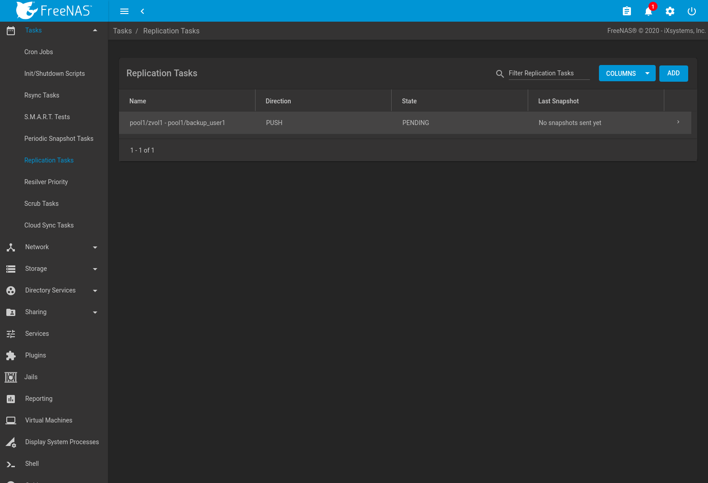

   Replication Task List

.. note:: The encryption key that was copied from the source computer
   (*Alpha*) to the destination computer (*Beta*) is an RSA public
   key located in the :file:`/data/ssh/replication.pub` file on the
   source computer. The host public key used to identify the
   destination computer (*Beta*) is from the
   :file:`/etc/ssh/ssh_host_rsa_key.pub` file on the destination
   computer.

.. _Replication Encryption:

Replication Encryption
~~~~~~~~~~~~~~~~~~~~~~

The default :guilabel:`Encryption Cipher` *Standard* setting provides
good security. *Fast* is less secure than *Standard* but can give
reasonable transfer rates for devices with limited cryptographic
speed. For networks where the entire path between source and
destination computers is trusted, the *Disabled* option can be chosen
to send replicated data without encryption.

.. _Limiting Replication Times:

Limiting Replication Times
~~~~~~~~~~~~~~~~~~~~~~~~~~

The :guilabel:`Begin` and :guilabel:`End` times in a replication task
make it possible to restrict when replication is allowed. These times
can be set to only allow replication after business hours, or at other
times when disk or network activity will not slow down other
operations like snapshots or :ref:`Scrub Tasks`. The default settings
allow replication to occur at any time.

These times control when replication task are allowed to start, but
will not stop a replication task that is already running. Once a
replication task has begun, it will run until finished.

#ifdef truenas
.. _Replication Topolgies and Scenarios:

Replication Topologies and Scenarios
~~~~~~~~~~~~~~~~~~~~~~~~~~~~~~~~~~~~

The replication examples shown above are known as *simple* or *A to B*
replication, where one machine replicates data to one other machine.
Replication can also be set up in more sophisticated topologies to
suit various purposes and needs.

.. _Star Replication:

Star Replication
^^^^^^^^^^^^^^^^

In a *star* topology, a single %brand% computer replicates data to
multiple destination computers. This can provide data redundancy with
the multiple copies of data, and geographical redundancy if the
destination computers are located at different sites.

An *Alpha* computer with three separate replication tasks to replicate
data to *Beta*, then *Gamma*, and finally *Delta* computers
demonstrates this arrangement. *A to B* replication is really just a
star arrangement with only one target computer.

The star topology is simple to configure and manage, but it can place
relatively high I/O and network loads on the source computer, which
must run an individual replication task for each target computer.

Tiered Replication
^^^^^^^^^^^^^^^^^^

In *tiered* replication, the data is replicated from the source
computer onto one or a few destination computers. The destination
computers then replicate the same data onto other computers. This
allows much of the network and I/O load to be shifted away from the
source computer.

For example, consider both *Alpha* and *Beta* computers to be located
inside the same data center. Replicating data from *Alpha* to *Beta*
does not protect that data from events that would involve the whole
data center, like flood, fire, or earthquake. Two more computers,
called *Gamma* and *Delta*, are set up. To provide geographic
redundancy, *Gamma* is in a data center on the other side of the
country, and *Delta* is in a data center on another continent. A
single periodic snapshot replicates data from *Alpha* to *Beta*.
*Beta* then replicates the data onto *Gamma*, and again onto *Delta*.

Tiered replication shifts most of the network and I/O overhead of
repeated replication off the source computer onto the target
computers. The source computer only replicates to the second-tier
computers, which then handle replication to the third tier, and so on.
In this example, *Alpha* only replicates data onto *Beta*. The I/O and
network load of repeated replications is shifted onto *Beta*.

N-way Replication
^^^^^^^^^^^^^^^^^

*N-way* replication topologies recognize that hardware is sometimes
idle, and computers can be used for more than a single dedicated
purpose. An individual computer can be used as both a source and
destination for replication. For example, the *Alpha* system can
replicate a dataset to *Beta*, while *Beta* can replicate datasets to
both *Alpha* and *Gamma*.

With careful setup, this topology can efficiently use I/O, network
bandwidth, and computers, but can quickly become complex to manage.

Disaster Recovery
^^^^^^^^^^^^^^^^^

*Disaster recovery* is the ability to recover complete datasets from a
replication destination computer. The replicated dataset is replicated
back to new hardware after an incident caused the source computer to
fail.

Recovering data onto a replacement computer can be done manually with
the :command:`zfs send` and :command:`zfs recv` commands, or a
replication task can be defined on the target computer containing the
backup data. This replication task would normally be disabled.
If a disaster damages the source computer, the target computer's
replication task is temporarily enabled, replicating the data onto the
replacement source computer. After the disaster recovery replication
completes, the replication task on the target computer is disabled
again.
#endif truenas

.. _Troubleshooting Replication:

Troubleshooting Replication
~~~~~~~~~~~~~~~~~~~~~~~~~~~

Replication depends on SSH, disks, network, compression, and
encryption to work. A failure or misconfiguration of any of these can
prevent successful replication.

SSH
^^^

:ref:`SSH` must be able to connect from the source system to the
destination system with an encryption key. This can be tested from
:ref:`Shell` by making an :ref:`SSH` connection from the source
system to the destination system. From the previous example, this is a
connection from *Alpha* to *Beta* at *10.0.0.118*.
Start the :ref:`Shell` on the source machine (*Alpha*), then enter
this command:

.. code-block:: none

   ssh -vv -i /data/ssh/replication 10.0.0.118

On the first connection, the system might say

.. code-block:: none

   No matching host key fingerprint found in DNS.
   Are you sure you want to continue connecting (yes/no)?

Verify that this is the correct destination computer from the
preceding information on the screen and type :literal:`yes`. At this
point, an :ref:`SSH` shell connection is open to the destination
system, *Beta*.

If a password is requested, SSH authentication is not working. See
:numref:`Figure %s <zfs_copy_replication_key_fig>` above. This key
value must be present in the :file:`/root/.ssh/authorized_keys` file
on *Beta*, the destination computer. The :file:`/var/log/auth.log`
file can show diagnostic errors for login problems on the destination
computer also.

Compression
^^^^^^^^^^^

Matching compression and decompression programs must be available on
both the source and destination computers. This is not a problem when
both computers are running %brand%, but other operating systems might
not have *lz4*, *pigz*, or *plzip* compression programs installed by
default. An easy way to diagnose the problem is to set
:guilabel:`Replication Stream Compression` to *Off*. If the
replication runs, select the preferred compression method and check
:file:`/var/log/debug.log` on the %brand% system for errors.

Manual Testing
^^^^^^^^^^^^^^

On *Alpha*, the source computer, the :file:`/var/log/messages` file
can also show helpful messages to locate the problem.

On the source computer, *Alpha*, open a :ref:`Shell` and manually send
a single snapshot to the destination computer, *Beta*. The snapshot
used in this example is named :file:`auto-20161206.1110-2w`. As
before, it is located in the *alphapool/alphadata* dataset. A
:literal:`@` symbol separates the name of the dataset from the name of
the snapshot in the command.

.. code-block:: none

   zfs send alphapool/alphadata@auto-20161206.1110-2w | ssh -i /data/ssh/replication 10.0.0.118 zfs recv betapool

If a snapshot of that name already exists on the destination computer,
the system will refuse to overwrite it with the new snapshot. The
existing snapshot on the destination computer can be deleted by
opening a :ref:`Shell` on *Beta* and running this command:

.. code-block:: none

   zfs destroy -R betapool/alphadata@auto-20161206.1110-2w

Then send the snapshot manually again. Snapshots on the destination
system, *Beta*, can be listed from the :ref:`Shell` with
:samp:`zfs list -t snapshot` or by going to
:menuselection:`Storage --> Snapshots`.

Error messages here can indicate any remaining problems.

.. index:: Resilver Priority
.. _Resilver Priority:

Resilver Priority
-----------------

Resilvering, or the process of copying data to a replacement disk, is
best completed as quickly as possible. Increasing the priority of
resilvers can help them to complete more quickly. The
:guilabel:`Resilver Priority` menu makes it possible to increase the
priority of resilvering at times where the additional I/O or CPU usage
will not affect normal usage. Select
:menuselection:`Tasks --> Resilver Priority`
to display the screen shown in
:numref:`Figure %s <storage_resilver_pri_fig>`.
:numref:`Table %s <storage_resilver_pri_opts_tab>`
describes the fields on this screen.

.. _storage_resilver_pri_fig:

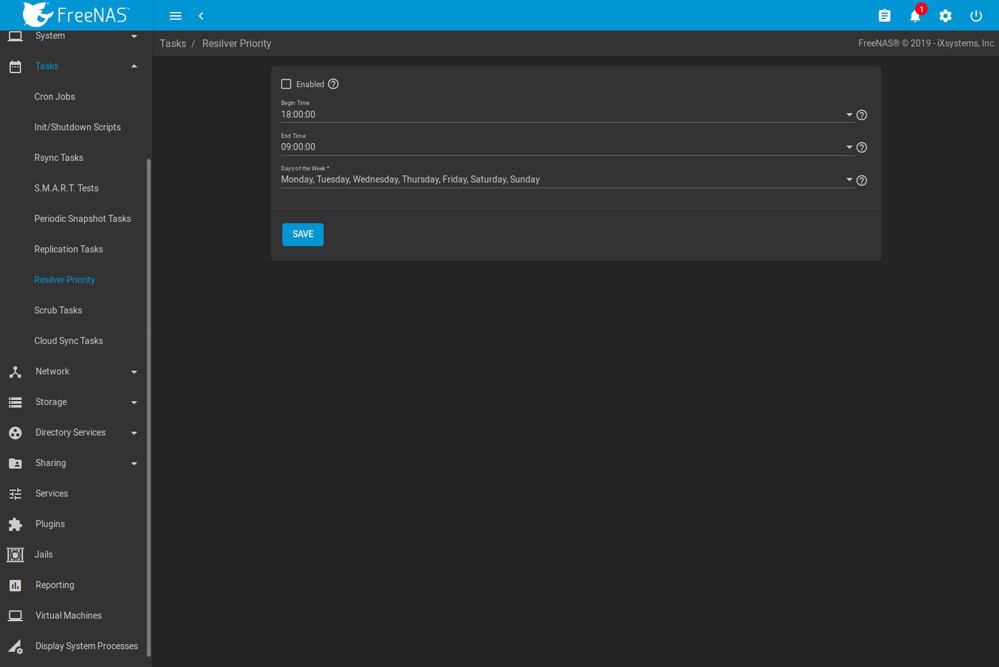

   Resilver Priority

.. tabularcolumns:: |>{\RaggedRight}p{\dimexpr 0.3\linewidth-2\tabcolsep}
                    |>{\RaggedRight}p{\dimexpr 0.2\linewidth-2\tabcolsep}
                    |>{\RaggedRight}p{\dimexpr 0.5\linewidth-2\tabcolsep}|

.. _storage_resilver_pri_opts_tab:

.. table:: Resilver Priority Options
   :class: longtable

   +----------------------+-------------+-------------------------------------------------------------+
   | Setting              | Value       | Description                                                 |
   |                      |             |                                                             |
   +======================+=============+=============================================================+
   | Enabled              | checkbox    | check to enable higher-priority resilvering                 |
   |                      |             |                                                             |
   +----------------------+-------------+-------------------------------------------------------------+
   | Begin                | drop-down   | start time to begin higher-priority resilvering             |
   |                      |             |                                                             |
   |                      |             |                                                             |
   +----------------------+-------------+-------------------------------------------------------------+
   | End                  | drop-down   | end time to begin higher-priority resilvering               |
   |                      |             |                                                             |
   |                      |             |                                                             |
   +----------------------+-------------+-------------------------------------------------------------+
   | Day of week          | checkboxes  | use higher-priority resilvering on these days of the week   |
   |                      |             |                                                             |
   +----------------------+-------------+-------------------------------------------------------------+

.. index:: Scrub
.. _Scrub Tasks:

Scrub Tasks
-----------

A scrub is the process of ZFS scanning through the data on a pool.
Scrubs help to identify data integrity problems, detect silent data
corruptions caused by transient hardware issues, and provide early
alerts of impending disk failures. %brand% makes it easy to schedule
periodic automatic scrubs.

Each pool should be scrubbed at least once a month. Bit errors in
critical data can be detected by ZFS, but only when that data is read.
Scheduled scrubs can find bit errors in rarely-read data. The amount
of time needed for a scrub is proportional to the quantity of data on
the pool. Typical scrubs take several hours or longer.

The scrub process is I/O intensive and can negatively impact
performance. Schedule scrubs for evenings or weekends to minimize
impact to users. Make certain that scrubs and other disk-intensive
activity like :ref:`S.M.A.R.T. Tests` are scheduled to run on
different days to avoid disk contention and extreme performance
impacts.

Scrubs only check used disk space. To check unused disk space,
schedule :ref:`S.M.A.R.T. Tests` of :guilabel:`Type` *Long Self-Test*
to run once or twice a month.

Scrubs are scheduled and managed with
:menuselection:`Tasks --> Scrub Tasks`.

When a pool is created, a scrub is automatically scheduled. An entry
with the same pool name is added to
:menuselection:`Tasks --> Scrub Tasks`.
A summary of this entry can be viewed with
:menuselection:`Tasks --> Scrub Tasks`.
:numref:`Figure %s <zfs_view_volume_scrub_fig>`
displays the default settings for the pool named :file:`pool1`. In
this example, |ui-options| and :guilabel:`Edit` for a pool is clicked to
display the :guilabel:`Edit` screen.
:numref:`Table %s <zfs_scrub_opts_tab>` summarizes the options in this
screen.

.. _zfs_view_volume_scrub_fig:

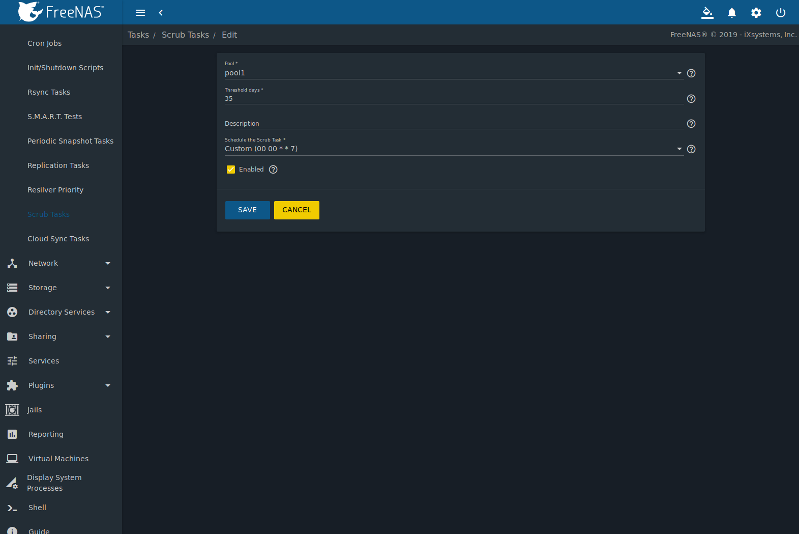

   Viewing Pool Default Scrub Settings

.. tabularcolumns:: |>{\RaggedRight}p{\dimexpr 0.16\linewidth-2\tabcolsep}
                    |>{\RaggedRight}p{\dimexpr 0.16\linewidth-2\tabcolsep}
                    |>{\RaggedRight}p{\dimexpr 0.66\linewidth-2\tabcolsep}|

.. _zfs_scrub_opts_tab:

.. table:: ZFS Scrub Options
   :class: longtable

   +----------------+-----------------------------+-------------------------------------------------------------------------------------------------------------+
   | Setting        | Value                       | Description                                                                                                 |
   |                |                             |                                                                                                             |
   |                |                             |                                                                                                             |
   +================+=============================+=============================================================================================================+
   | Pool           | drop-down menu              | pool to be scrubbed                                                                                         |
   |                |                             |                                                                                                             |
   +----------------+-----------------------------+-------------------------------------------------------------------------------------------------------------+
   | Threshold days | string                      | define the number of days to prevent a scrub from running after the last has completed; this ignores any    |
   |                |                             | other calendar schedule; the default is a multiple of 7 to ensure the scrub always occurs on the same       |
   |                |                             | weekday                                                                                                     |
   |                |                             |                                                                                                             |
   +----------------+-----------------------------+-------------------------------------------------------------------------------------------------------------+
   | Description    | string                      | optional text description of scrub                                                                          |
   |                |                             |                                                                                                             |
   +----------------+-----------------------------+-------------------------------------------------------------------------------------------------------------+
   | Quick Schedule | drop-down menu              | selecting a :guilabel:`Quick Schedule` other than :guilabel:`-----` limits other scheduling options;        |
   |                |                             | choose :guilabel:`-----`, :guilabel:`Hourly`, :guilabel:`Daily`, :guilabel:`Weekly`, or :guilabel:`Monthly` |
   |                |                             |                                                                                                             |
   +----------------+-----------------------------+-------------------------------------------------------------------------------------------------------------+
   | Minute         | integer                     | a scrub runs only at the defined minute value                                                               |
   |                |                             |                                                                                                             |
   +----------------+-----------------------------+-------------------------------------------------------------------------------------------------------------+
   | Hour           | integer                     | a scrub runs only at the defined hour value                                                                 |
   |                |                             |                                                                                                             |
   +----------------+-----------------------------+-------------------------------------------------------------------------------------------------------------+
   | Day of month   | integer                     | a scrub runs only on the defined days of the selected :guilabel:`Months`                                    |
   |                |                             |                                                                                                             |
   +----------------+-----------------------------+-------------------------------------------------------------------------------------------------------------+
   | Month          | checkboxes                  | a scrub occurs on selected months                                                                           |
   |                |                             |                                                                                                             |
   +----------------+-----------------------------+-------------------------------------------------------------------------------------------------------------+
   | Day of week    | checkboxes                  | a scrub occurs on the selected days; the default is *Sunday* to least impact users; note that this field    |
   |                |                             | and the :guilabel:`Day of Month` field are ORed together: setting :guilabel:`Day of Month` to *01,15* and   |
   |                |                             | :guilabel:`Day of week` to *Thursday* will cause scrubs to run on the 1st and 15th days of the month, but   |
   |                |                             | also on any Thursday                                                                                        |
   |                |                             |                                                                                                             |
   +----------------+-----------------------------+-------------------------------------------------------------------------------------------------------------+
   | Enabled        | checkbox                    | uncheck to disable the scheduled scrub without deleting it                                                  |
   |                |                             |                                                                                                             |
   +----------------+-----------------------------+-------------------------------------------------------------------------------------------------------------+

Review the default selections and, if necessary, modify them to meet
the needs of the environment. Note that the :guilabel:`Threshold days`
field is used to prevent scrubs from running too often, and overrides
the schedule chosen in the other fields. Also, if a pool is locked or
unmounted when a scrub is scheduled to occur, it will not be scrubbed.

Scheduled scrubs can be deleted with the :guilabel:`Delete` button,
but this is not recommended. **Scrubs can provide an early indication
of disk issues before a disk failure.** If a scrub is too intensive
for the hardware, consider temporarily unchecking the
:guilabel:`Enabled` button for the scrub until the hardware can be
upgraded.

.. index:: Cloud Sync
.. _Cloud Sync Tasks:

Cloud Sync Tasks
----------------

Files or directories can be synchronized to remote cloud storage
providers with the :guilabel:`Cloud Sync Tasks` feature.

.. warning:: This Cloud Sync task might go to a third party
   commercial vendor not directly affiliated with iXsystems. Please
   investigate and fully understand that vendor's pricing policies and
   services before creating any Cloud Sync task. iXsystems is not
   responsible for any charges incurred from the use of third party
   vendors with the Cloud Sync feature.

Selecting
:menuselection:`Tasks --> Cloud Sync Tasks`
shows the screen in
:numref:`Figure %s <tasks_cloudsync_status_fig>`.

Existing cloud syncs can be run manually, edited, or deleted with the
buttons that appear when a single cloud sync line is selected by
clicking with the mouse.

.. _tasks_cloudsync_status_fig:

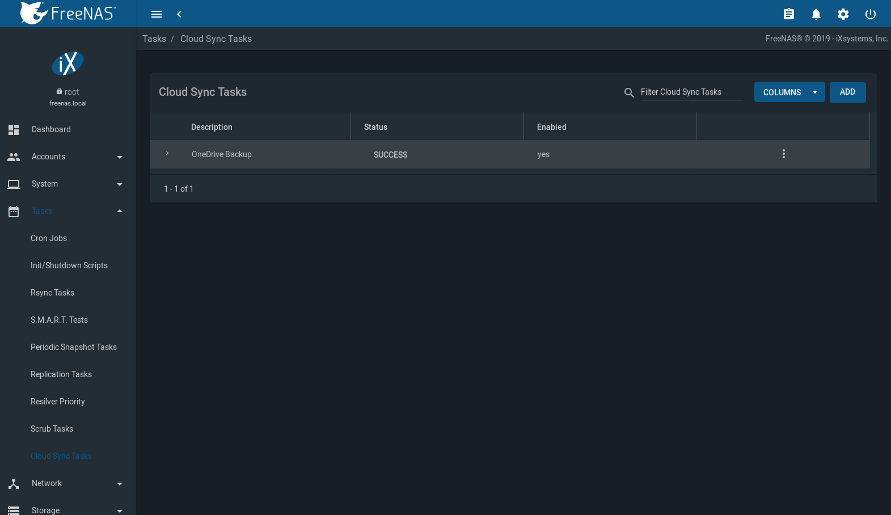

   Cloud Sync Status

:ref:`Cloud Credentials` must be pre-defined before a cloud sync is
created. One set of credentials can be used for more than one cloud
sync. For example, a single set of credentials for Amazon S3 can be
used for separate cloud syncs that push different sets of files or
directories.

A cloud storage area must also exist. With Amazon S3, these are called
*buckets*. The bucket must be created before a sync task can be
created.

After the cloud credentials have been configured,
:menuselection:`Tasks --> Cloud Sync Tasks` is used to define the
schedule for running a cloud sync task.

Click |ui-add| to display the :guilabel:`Add Cloud Sync` menu shown in
:numref:`Figure %s <tasks_cloudsync_add_fig>`.

.. _tasks_cloudsync_add_fig:

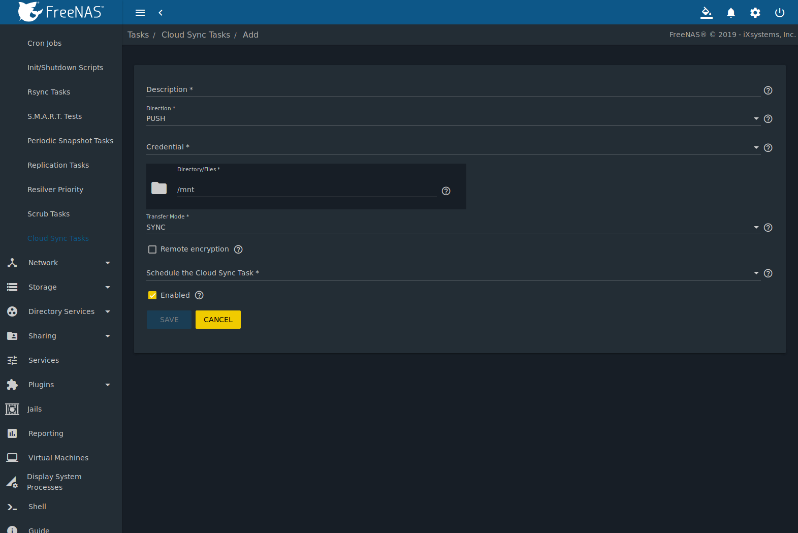

   Adding a Cloud Sync

:numref:`Table %s <tasks_cloudsync_opts_tab>`
shows the configuration options for Cloud Syncs.

.. tabularcolumns:: |>{\RaggedRight}p{\dimexpr 0.16\linewidth-2\tabcolsep}
                    |>{\RaggedRight}p{\dimexpr 0.20\linewidth-2\tabcolsep}
                    |>{\RaggedRight}p{\dimexpr 0.63\linewidth-2\tabcolsep}|

.. _tasks_cloudsync_opts_tab:

.. table:: Cloud Sync Options
   :class: longtable

   +---------------------+---------------------+---------------------------------------------------------------------------------------------------------+
   | Setting             | Value Type          | Description                                                                                             |
   |                     |                     |                                                                                                         |
   +=====================+=====================+=========================================================================================================+
   | Description         | string              | Enter a descriptive name of this task.                                                                  |
   |                     |                     |                                                                                                         |
   +---------------------+---------------------+---------------------------------------------------------------------------------------------------------+
   | Direction           | drop-down menu      | *Push* sends data to cloud storage. *Pull* receives data from cloud storage.                            |
   |                     |                     |                                                                                                         |
   +---------------------+---------------------+---------------------------------------------------------------------------------------------------------+
   | Credential          | drop-down menu      | Choose the cloud storage provider credentials from the list of entered :ref:`Cloud Credentials`.        |
   |                     |                     |                                                                                                         |
   +---------------------+---------------------+---------------------------------------------------------------------------------------------------------+
   | Bucket              | drop-down menu      | Only appears when an S3 credential is the *Provider*. Select the pre-defined S3 bucket to use.          |
   |                     |                     |                                                                                                         |
   +---------------------+---------------------+---------------------------------------------------------------------------------------------------------+
   | Folder              | string              | Only appears when an S3 credential is the *Provider*. Optionally enter the name of the pre-defined      |
   |                     |                     | folder within the selected bucket.                                                                      |
   +---------------------+---------------------+---------------------------------------------------------------------------------------------------------+
   | Server Side         | drop-down menu      | Only appears when an S3 credential is the *Provider*. Choices are *None* (no encryption) or             |
   | Encryption          |                     | *AES-256* (encrypted).                                                                                  |
   |                     |                     |                                                                                                         |
   +---------------------+---------------------+---------------------------------------------------------------------------------------------------------+
   | Directory/Files     | browse button       | Select the directories or files to be sent to the cloud for *Push* syncs, or the destination to be      |
   |                     |                     | written for *Pull* syncs. Be cautious about the destination of *Pull* jobs to avoid overwriting         |
   |                     |                     | existing files.                                                                                         |
   |                     |                     |                                                                                                         |
   +---------------------+---------------------+---------------------------------------------------------------------------------------------------------+
   | Transfer Mode       | drop-down menu      | *Sync* (default): make files on the destination system identical to those on the source. Files that     |
   |                     |                     | have been removed from the source are removed from the destination, similar to                          |
   |                     |                     | :command:`rsync --delete`.                                                                              |
   |                     |                     |                                                                                                         |
   |                     |                     | *Copy*: copy files from the source to the destination, skipping files that are identical, similar to    |
   |                     |                     | :command:`rsync`.                                                                                       |
   |                     |                     |                                                                                                         |
   |                     |                     | *Move*: copy files from the source to the destination, deleting files from the source after the copy,   |
   |                     |                     | similar to :command:`mv`.                                                                               |
   |                     |                     |                                                                                                         |
   +---------------------+---------------------+---------------------------------------------------------------------------------------------------------+
   | Remote encryption   | checkbox            | Set to encrypt files before transfer and store the encrypted files on the remote system.                |
   |                     |                     | `rclone Crypt <https://rclone.org/crypt/>`__ is used.                                                   |
   +---------------------+---------------------+---------------------------------------------------------------------------------------------------------+
   | Filename encryption | checkbox            | Only appears when :guilabel:`Remote encryption` is checked. Set to encrypt the shared file names.       |
   |                     |                     |                                                                                                         |
   +---------------------+---------------------+---------------------------------------------------------------------------------------------------------+
   | Encryption password | string              | Only appears when :guilabel:`Remote encryption` is checked. Enter the password for encrypting and       |
   |                     |                     | and decrypting remote data. *Warning*: Always save and back up this password. Losing the encryption     |
   |                     |                     | password can result in data loss.                                                                       |
   +---------------------+---------------------+---------------------------------------------------------------------------------------------------------+
   | Encryption salt     | string              | Only appears when :guilabel:`Remote encryption` is checked. Enter a long string of random characters    |
   |                     |                     | for use as `salt <https://searchsecurity.techtarget.com/definition/salt>`__ for the encryption          |
   |                     |                     | password. *Warning*: Save and back up the encryption salt value. Losing the salt value can result in    |
   |                     |                     | data loss.                                                                                              |
   +---------------------+---------------------+---------------------------------------------------------------------------------------------------------+
   | Quick Schedule      | drop-down menu      | Choose how often to run the task. An empty value allows defining a custom schedule.                     |
   |                     |                     |                                                                                                         |
   +---------------------+---------------------+---------------------------------------------------------------------------------------------------------+
   | Minute              | integer             | Minute to run the task.                                                                                 |
   |                     |                     |                                                                                                         |
   +---------------------+---------------------+---------------------------------------------------------------------------------------------------------+
   | Hour                | integer             | Hour to run the task.                                                                                   |
   |                     |                     |                                                                                                         |
   +---------------------+---------------------+---------------------------------------------------------------------------------------------------------+
   | Day of month        | integer             | Day of the month to run the task.                                                                       |
   |                     |                     |                                                                                                         |
   +---------------------+---------------------+---------------------------------------------------------------------------------------------------------+
   | Month               | checkboxes          | Months when the task runs.                                                                              |
   |                     |                     |                                                                                                         |
   +---------------------+---------------------+---------------------------------------------------------------------------------------------------------+
   | Day of week         | checkboxes          | Days of the week to run the task.                                                                       |
   |                     |                     |                                                                                                         |
   +---------------------+---------------------+---------------------------------------------------------------------------------------------------------+
   | Enabled             | checkbox            | Unset to temporarily disable this Cloud Sync task.                                                      |
   |                     |                     |                                                                                                         |
   +---------------------+---------------------+---------------------------------------------------------------------------------------------------------+

.. _Cloud Sync Example:

Cloud Sync Example
~~~~~~~~~~~~~~~~~~

This example shows a *Push* cloud sync which writes an accounting
department backup file from the %brand% system to Amazon S3 storage.

Before the new cloud sync was added, a bucket called
*cloudsync-bucket* was created with the Amazon S3 web console for
storing data from the %brand% system.

Navigate
:menuselection:`System --> Cloud Credentials`
and click |ui-add| to enter the credentials for storage on an Amazon AWS
account. The credential is given the name *S3 Storage*, as shown in
:numref:`Figure %s <tasks_cloudsync_example_cred_fig>`:

.. _tasks_cloudsync_example_cred_fig:

.. figure:: images/cloudsync-example-cred.png

   Example: Adding Cloud Credentials

The local data to be sent to the cloud is a single file called
:file:`accounting-backup.bin` on the :file:`smb-storage` dataset. A
cloud sync job is created by navigating
:menuselection:`Tasks --> Cloud Sync`
and clicking |ui-add|.

The :guilabel:`Description` is set to *backup-acctg* to describe the
job. This data is being sent to cloud storage, so this is a *Push*.
The provider comes from the cloud credentials defined in the previous
step, and the destination bucket *cloudsync-bucket* has been chosen.

The :guilabel:`Directory/Files` is adjusted to the data file.

The remaining fields are for setting a schedule. The default is to
send the data to cloud storage once an hour, every day. The options
provide great versatility in configuring when a cloud sync runs,
anywhere from once a minute to once a year.

The :guilabel:`Enabled` field is checked by default, so this cloud
sync will run at the next scheduled time.

The completed dialog is shown in
:numref:`Figure %s <tasks_cloudsync_example_fig>`:

.. _tasks_cloudsync_example_fig:

.. figure:: images/cloudsync-example-cropped.png

   Example: Adding a Cloud Sync
