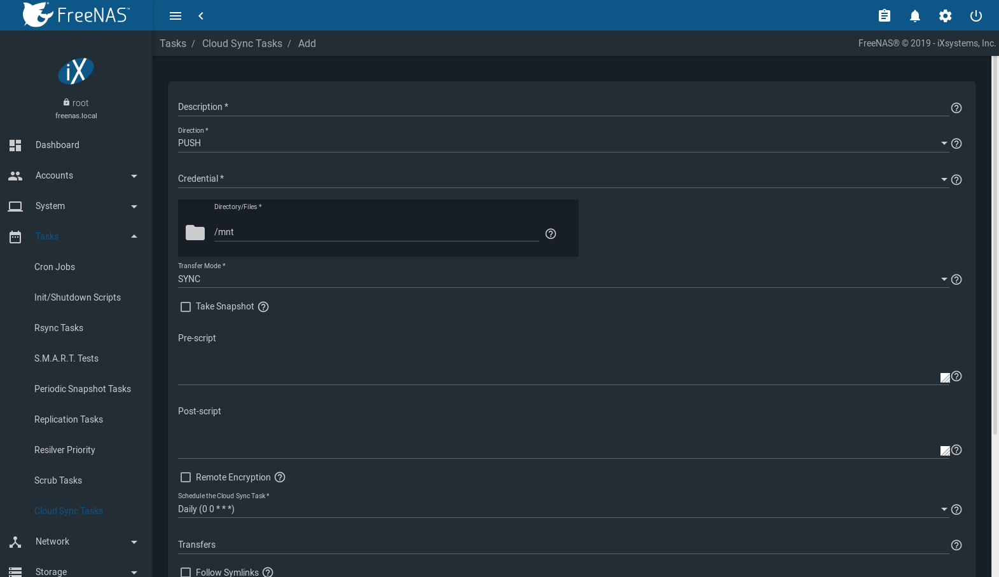
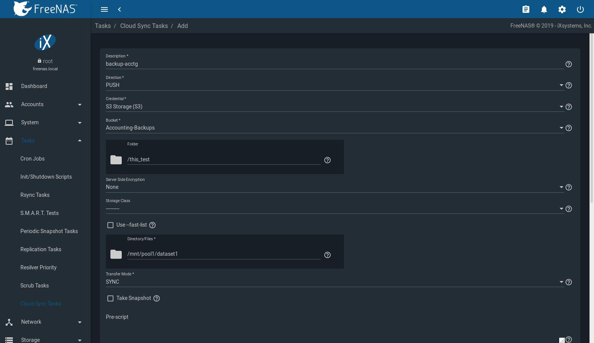

.. index:: Tasks
.. _Tasks:

Tasks
=====

The Tasks section of the |web-ui| is used to configure
repetitive tasks:

* :ref:`Cron Jobs` schedules a command or script to automatically
  execute at a specified time

* :ref:`Init/Shutdown Scripts` configures a command or script to
  automatically execute during system startup or shutdown

* :ref:`Rsync Tasks` schedules data synchronization to another system

* :ref:`S.M.A.R.T. Tests` schedules disk tests

* :ref:`Periodic Snapshot Tasks` schedules automatic creation of
  filesystem snapshots

* :ref:`Replication Tasks` automate the replication of snapshots to
  a remote system

* :ref:`Resilver Priority` controls the priority of resilvers

* :ref:`Scrub Tasks` schedules scrubs as part of ongoing disk
  maintenance

* :ref:`Cloud Sync Tasks` schedules data synchronization to cloud
  providers

Each of these tasks is described in more detail in this section.

.. note:: By default, :ref:`Scrub Tasks` are run once a month by an
   automatically-created task. :ref:`S.M.A.R.T. Tests` and
   :ref:`Periodic Snapshot Tasks` must be set up manually.

.. index:: Cron Jobs
.. _Cron Jobs:

Cron Jobs
---------

`cron(8) <https://www.freebsd.org/cgi/man.cgi?query=cron>`__
is a daemon that runs a command or script on a regular schedule as a
specified user.

Navigate to :menuselection:`Tasks --> Cron Jobs`
and click |ui-add| to create a cron job.
:numref:`Figure %s <tasks_create_cron_job_fig>` shows the
configuration screen that appears.

.. _tasks_create_cron_job_fig:

.. figure:: images/tasks-cron-jobs-add.png

   Creating a Cron Job

:numref:`Table %s <tasks_cron_job_opts_tab>`
lists the configurable options for a cron job.

.. tabularcolumns:: |>{\RaggedRight}p{\dimexpr 0.16\linewidth-2\tabcolsep}
                    |>{\RaggedRight}p{\dimexpr 0.20\linewidth-2\tabcolsep}
                    |>{\RaggedRight}p{\dimexpr 0.63\linewidth-2\tabcolsep}|

.. _tasks_cron_job_opts_tab:

.. table:: Cron Job Options
   :class: longtable

   +---------------------+-----------------------------+---------------------------------------------------------------------------------------------------------+
   | Setting             | Value                       | Description                                                                                             |
   |                     |                             |                                                                                                         |
   +=====================+=============================+=========================================================================================================+
   | Description         | string                      | Enter a description of the cron job.                                                                    |
   |                     |                             |                                                                                                         |
   +---------------------+-----------------------------+---------------------------------------------------------------------------------------------------------+
   | Command             | drop-down menu              | Enter the **full path** to the command or script to be run. If it is a script, testing it at the        |
   |                     |                             | command line is recommended to ensure it works.                                                         |
   |                     |                             |                                                                                                         |
   +---------------------+-----------------------------+---------------------------------------------------------------------------------------------------------+
   | Run As User         | string                      | Select a user account to run the command. The user must have permissions allowing them to run the       |
   |                     |                             | command or script.                                                                                      |
   |                     |                             |                                                                                                         |
   +---------------------+-----------------------------+---------------------------------------------------------------------------------------------------------+
   | Schedule a Cron Job | drop-down menu              | Select how often to run the cron job. Choices are *Hourly*, *Daily*, *Weekly*, *Monthly*, or *Custom*.  |
   |                     |                             | Select *Custom* to open the advanced scheduler.                                                         |
   |                     |                             |                                                                                                         |
   +---------------------+-----------------------------+---------------------------------------------------------------------------------------------------------+
   | Hide Standard       | checkbox                    | Hide standard output (stdout) from the command. When unset, any standard output is mailed to the user   |
   | Output              |                             | account cron used to run the command.                                                                   |
   |                     |                             |                                                                                                         |
   +---------------------+-----------------------------+---------------------------------------------------------------------------------------------------------+
   | Hide Standard       | checkbox                    | Hide error output (stderr) from the command. When unset, any error output is mailed to the user account |
   | Error               |                             | cron used to run the command.                                                                           |
   |                     |                             |                                                                                                         |
   +---------------------+-----------------------------+---------------------------------------------------------------------------------------------------------+
   | Enable              | checkbox                    | Enable this cron job. When unset, disable the cron job without deleting it.                             |
   |                     |                             |                                                                                                         |
   +---------------------+-----------------------------+---------------------------------------------------------------------------------------------------------+

Cron jobs are shown in
:menuselection:`Tasks --> Cron Jobs`.
This table displays the user, command, description, schedule, and
whether the job is enabled. This table is adjustable by setting the
different column checkboxes above it. Set :guilabel:`Toggle` to
display all options in the table. Click |ui-options| for to show the
:guilabel:`Run Now`, :guilabel:`Edit`, and :guilabel:`Delete` options.

.. note:: :literal:`%` symbols are automatically escaped and do not
   need to be prefixed with backslashes. For example, use
   :samp:`date '+%Y-%m-%d'` in a cron job to generate a filename based
   on the date.

.. _Init/Shutdown Scripts:

Init/Shutdown Scripts
---------------------

%brand% provides the ability to schedule commands or scripts to run
at system startup or shutdown.

:numref:`Figure %s <tasks_init_script_fig>`
shows the screen that opens after going to
:menuselection:`Tasks --> Init/Shutdown Scripts`
and clicking |ui-add|.
:numref:`Table %s <tasks_init_opt_tab>`
summarizes the options.

Scheduled commands must be in the default path. The full path to
the command can also be included in the entry. The path can be tested
by typing :samp:`which {commandname}`. If the command is not found, it
is not in the path.

When scheduling a script, make sure that the script is executable and
has been fully tested to ensure it achieves the desired results.

.. _tasks_init_script_fig:

.. figure:: images/tasks-init-shutdown-scripts-add.png

   Add an Init/Shutdown Script

.. tabularcolumns:: |>{\RaggedRight}p{\dimexpr 0.16\linewidth-2\tabcolsep}
                    |>{\RaggedRight}p{\dimexpr 0.20\linewidth-2\tabcolsep}
                    |>{\RaggedRight}p{\dimexpr 0.63\linewidth-2\tabcolsep}|

.. _tasks_init_opt_tab:

.. table:: Options When Adding an Init/Shutdown Script
   :class: longtable

   +-------------+----------------+-----------------------------------------------------------------------------------+
   | Setting     | Value          | Description                                                                       |
   |             |                |                                                                                   |
   |             |                |                                                                                   |
   +=============+================+===================================================================================+
   | Type        | drop-down menu | Select *Command* for an executable or                                             |
   |             |                | *Script* for an executable script.                                                |
   |             |                |                                                                                   |
   +-------------+----------------+-----------------------------------------------------------------------------------+
   | Command or  | string         | If *Command* is selected, enter the command plus any desired options. If          |
   | Script      |                | *Script* is selected, browse to the location of the script.                       |
   |             |                |                                                                                   |
   +-------------+----------------+-----------------------------------------------------------------------------------+
   | When        | drop-down menu | Select when the command or script runs. *Pre Init* is very early                  |
   |             |                | in boot process before mounting filesystems, *Post Init* is towards               |
   |             |                | the end of boot process before FreeNAS services start, or at *Shutdown*.          |
   |             |                |                                                                                   |
   +-------------+----------------+-----------------------------------------------------------------------------------+
   | Enabled     | checkbox       | Enable this task. Unset to disable the task without deleting it.                  |
   |             |                |                                                                                   |
   +-------------+----------------+-----------------------------------------------------------------------------------+

Init/Shutdown tasks are shown in
:menuselection:`Tasks --> Init/Shutdown Scripts`.
Click |ui-options| to see the :guilabel:`Edit` and :guilabel:`Delete`
buttons.

.. index:: Rsync Tasks
.. _Rsync Tasks:

Rsync Tasks
-----------

`Rsync <https://www.samba.org/ftp/rsync/rsync.html>`__
is a utility that copies specified data from one system to another
over a network. Once the initial data is copied, rsync reduces the
amount of data sent over the network by sending only the differences
between the source and destination files. Rsync is used for backups,
mirroring data on multiple systems, or for copying files between systems.

Rsync is most effective when only a relatively small amount
of the data has changed. There are also
`some limitations when using rsync with Windows files
<https://forums.freenas.org/index.php?threads/impaired-rsync-permissions-support-for-windows-datasets.43973/>`__.
For large amounts of data, data that has many changes from the
previous copy, or Windows files, :ref:`Replication Tasks` are often
the faster and better solution.

Rsync is single-threaded and gains little from multiple processor cores.
To see whether rsync is currently running, use :samp:`pgrep rsync` from
the :ref:`Shell`.

Both ends of an rsync connection must be configured:

* **the rsync server:** this system pulls (receives) the data. This
  system is referred to as *PULL* in the configuration examples.

* **the rsync client:** this system pushes (sends) the data. This
  system is referred to as *PUSH* in the configuration examples.

%brand% can be configured as either an *rsync client* or an
*rsync server*. The opposite end of the connection can be another
%brand% system or any other system running rsync. In %brand% terminology,
an *rsync task* defines which data is synchronized between the two
systems. To synchronize data between two %brand% systems, create the
*rsync task* on the *rsync client*.

%brand% supports two modes of rsync operation:

* **rsync module mode:** exports a directory tree, and the configured
  settings of the tree as a symbolic name over an unencrypted connection.
  This mode requires that at least one module be defined on the rsync
  server. It can be defined in the %brand% |web-ui| under
  :menuselection:`Services --> Rsync Configure --> Rsync Module`.
  In other operating systems, the module is defined in
  `rsyncd.conf(5) <https://www.samba.org/ftp/rsync/rsyncd.conf.html>`__.

* **rsync over SSH:** synchronizes over an encrypted connection.
  Requires the configuration of SSH user and host public keys.

This section summarizes the options when creating an rsync task. It then
provides a configuration example between two %brand% systems for each
mode of rsync operation.

.. note:: If there is a firewall between the two systems or if the
   other system has a built-in firewall, make sure that TCP port 873
   is allowed.

:numref:`Figure %s <tasks_add_rsync_fig>`
shows the screen that appears after navigating to
:menuselection:`Tasks --> Rsync Tasks`
and clicking |ui-add|.
:numref:`Table %s <tasks_rsync_opts_tab>`
summarizes the configuration options available when creating an rsync
task.

.. _tasks_add_rsync_fig:

.. figure:: images/tasks-rsync-tasks-add.png

   Adding an Rsync Task

.. tabularcolumns:: |>{\RaggedRight}p{\dimexpr 0.16\linewidth-2\tabcolsep}
                    |>{\RaggedRight}p{\dimexpr 0.20\linewidth-2\tabcolsep}
                    |>{\RaggedRight}p{\dimexpr 0.63\linewidth-2\tabcolsep}|

.. _tasks_rsync_opts_tab:

.. table:: Rsync Configuration Options
   :class: longtable

   +----------------------------------+-----------------------------+-------------------------------------------------------------------------------------------+
   | Setting                          | Value                       | Description                                                                               |
   |                                  |                             |                                                                                           |
   |                                  |                             |                                                                                           |
   +==================================+=============================+===========================================================================================+
   | Path                             | browse button               | :guilabel:`Browse` to the path to be copied. Path lengths cannot be greater               |
   |                                  |                             | than 255 characters.                                                                      |
   |                                  |                             |                                                                                           |
   +----------------------------------+-----------------------------+-------------------------------------------------------------------------------------------+
   | User                             | drop-down menu              | Select the user to run the rsync task. The user selected must have permissions to write   |
   |                                  |                             | to the specified directory on the remote host.                                            |
   |                                  |                             |                                                                                           |
   +----------------------------------+-----------------------------+-------------------------------------------------------------------------------------------+
   | Remote Host                      | string                      | Enter the IP address or hostname of the remote system that will store the copy. Use the   |
   |                                  |                             | format *username@remote_host* if the username differs on the remote host.                 |
   |                                  |                             |                                                                                           |
   +----------------------------------+-----------------------------+-------------------------------------------------------------------------------------------+
   | Remote SSH Port                  | integer                     | Only available in  *Rsync over SSH* mode. Allows specifying an SSH port                   |
   |                                  |                             | other than the default of *22*.                                                           |
   |                                  |                             |                                                                                           |
   +----------------------------------+-----------------------------+-------------------------------------------------------------------------------------------+
   | Rsync mode                       | drop-down menu              | The choices are *Rsync Module* mode or *Rsync over SSH* mode                              |
   |                                  |                             |                                                                                           |
   +----------------------------------+-----------------------------+-------------------------------------------------------------------------------------------+
   | Remote Module Name               | string                      | At least one module must be defined in                                                    |
   |                                  |                             | `rsyncd.conf(5) <https://www.samba.org/ftp/rsync/rsyncd.conf.html>`__                     |
   |                                  |                             | of the rsync server or in the :guilabel:`Rsync Modules` of another system.                |
   |                                  |                             |                                                                                           |
   +----------------------------------+-----------------------------+-------------------------------------------------------------------------------------------+
   | Remote Path                      | string                      | Only appears when using *Rsync over SSH* mode. Enter the **existing** path on the remote  |
   |                                  |                             | host to sync with, for example, */mnt/pool*. Note that the path length cannot             |
   |                                  |                             | be greater than 255 characters.                                                           |
   |                                  |                             |                                                                                           |
   +----------------------------------+-----------------------------+-------------------------------------------------------------------------------------------+
   | Validate Remote Path             | checkbox                    | Verifies the existence of the :guilabel:`Remote Path`.                                    |
   |                                  |                             |                                                                                           |
   +----------------------------------+-----------------------------+-------------------------------------------------------------------------------------------+
   | Direction                        | drop-down menu              | Direct the flow of the data to the remote host. Choices are *Push*                        |
   |                                  |                             | *Pull*. Default is to push to a remote host.                                              |
   |                                  |                             |                                                                                           |
   +----------------------------------+-----------------------------+-------------------------------------------------------------------------------------------+
   | Short Description                | string                      | Enter a description of the rsync task.                                                    |
   |                                  |                             |                                                                                           |
   +----------------------------------+-----------------------------+-------------------------------------------------------------------------------------------+
   | Schedule the Rsync Task          | drop-down menu              | Choose how often to run the task. Choices are *Hourly*, *Daily*, *Weekly*, *Monthly*, or  |
   |                                  |                             | *Custom*. Select *Custom* to open the advanced scheduler.                                 |
   |                                  |                             |                                                                                           |
   +----------------------------------+-----------------------------+-------------------------------------------------------------------------------------------+
   | Recursive                        | checkbox                    | Set to include all subdirectories of the specified directory. When unset, only the        |
   |                                  |                             | specified directory is included.                                                          |
   |                                  |                             |                                                                                           |
   +----------------------------------+-----------------------------+-------------------------------------------------------------------------------------------+
   | Times                            | checkbox                    | Set to preserve the modification times of files.                                          |
   |                                  |                             |                                                                                           |
   +----------------------------------+-----------------------------+-------------------------------------------------------------------------------------------+
   | Compress                         | checkbox                    | Set to reduce the size of the data to transmit. Recommended for slow connections.         |
   |                                  |                             |                                                                                           |
   +----------------------------------+-----------------------------+-------------------------------------------------------------------------------------------+
   | Archive                          | checkbox                    | When set, rsync is run recursively, preserving symlinks, permissions, modification times, |
   |                                  |                             | group, and special files. When run as root, owner, device files, and special files are    |
   |                                  |                             | also preserved. Equivalent to :samp:`rsync -rlptgoD`.                                     |
   |                                  |                             |                                                                                           |
   +----------------------------------+-----------------------------+-------------------------------------------------------------------------------------------+
   | Delete                           | checkbox                    | Set to delete files in the destination directory that do not exist in the source          |
   |                                  |                             | directory.                                                                                |
   |                                  |                             |                                                                                           |
   +----------------------------------+-----------------------------+-------------------------------------------------------------------------------------------+
   | Quiet                            | checkbox                    | Set to suppress informational messages from the remote server.                            |
   |                                  |                             |                                                                                           |
   +----------------------------------+-----------------------------+-------------------------------------------------------------------------------------------+
   | Preserve permissions             | checkbox                    | Set to preserve original file permissions. This is useful when the user is set to         |
   |                                  |                             | *root*.                                                                                   |
   |                                  |                             |                                                                                           |
   +----------------------------------+-----------------------------+-------------------------------------------------------------------------------------------+
   | Preserve extended attributes     | checkbox                    | `Extended attributes <https://en.wikipedia.org/wiki/Extended_file_attributes>`__ are      |
   |                                  |                             | preserved, but must be supported by both systems.                                         |
   |                                  |                             |                                                                                           |
   +----------------------------------+-----------------------------+-------------------------------------------------------------------------------------------+
   | Delay Updates                    | checkbox                    | Set to save the temporary file from each updated file to a holding directory              |
   |                                  |                             | until the end of the transfer when all transferred files are renamed into place.          |
   |                                  |                             |                                                                                           |
   +----------------------------------+-----------------------------+-------------------------------------------------------------------------------------------+
   | Extra options                    | string                      | Additional `rsync(1) <http://rsync.samba.org/ftp/rsync/rsync.html>`__ options to include. |
   |                                  |                             | Note: The :literal:`*` character                                                          |
   |                                  |                             | must be escaped with a backslash (:literal:`\\*.txt`)                                     |
   |                                  |                             | or used inside single quotes. (:literal:`'*.txt'`)                                        |
   |                                  |                             |                                                                                           |
   +----------------------------------+-----------------------------+-------------------------------------------------------------------------------------------+
   | Enabled                          | checkbox                    | Enable this rsync task. Unset to disable this rsync task without deleting it.             |
   |                                  |                             |                                                                                           |
   +----------------------------------+-----------------------------+-------------------------------------------------------------------------------------------+

If the rysnc server requires password authentication, enter
:samp:`--password-file={/PATHTO/FILENAME}` in the
:guilabel:`Extra options` field, replacing :literal:`/PATHTO/FILENAME`
with the appropriate path to the file containing the password.

Created rsync tasks are listed in :guilabel:`Rsync Tasks`.
Click |ui-options| for an entry to display buttons for
:guilabel:`Edit`, :guilabel:`Delete`, or :guilabel:`Run Now`.

.. _Rsync Module Mode:

Rsync Module Mode
~~~~~~~~~~~~~~~~~

This configuration example configures rsync module mode between
the two following %brand% systems:

* *192.168.2.2* has existing data in :file:`/mnt/local/images`. It
  will be the rsync client, meaning that an rsync task needs to be
  defined. It will be referred to as *PUSH.*

* *192.168.2.6* has an existing pool named :file:`/mnt/remote`. It
  will be the rsync server, meaning that it will receive the contents
  of :file:`/mnt/local/images`. An rsync module needs to be defined on
  this system and the rsyncd service needs to be started. It will be
  referred to as *PULL.*

On *PUSH*, an rsync task is defined in
:menuselection:`Tasks --> Rsync Tasks`, |ui-add|.
In this example:

* the :guilabel:`Path` points to :file:`/usr/local/images`, the
  directory to be copied

* the :guilabel:`Remote Host` points to *192.168.2.6*, the IP address
  of the rsync server

* the :guilabel:`Rsync Mode` is *Rsync module*

* the :guilabel:`Remote Module Name` is *backups*; this will need to
  be defined on the rsync server

* the :guilabel:`Direction` is *Push*

* the rsync is scheduled to occur every 15 minutes

* the :guilabel:`User` is set to *root* so it has permission to write
  anywhere

* the :guilabel:`Preserve Permissions` option is enabled so that the
  original permissions are not overwritten by the *root* user

On *PULL*, an rsync module is defined in
:menuselection:`Services --> Rsync Configure --> Rsync Module`,
|ui-add|. In this example:

* the :guilabel:`Module Name` is *backups*; this needs to match the
  setting on the rsync client

* the :guilabel:`Path` is :file:`/mnt/remote`; a directory called
  :file:`images` will be created to hold the contents of
  :file:`/usr/local/images`

* the :guilabel:`User` is set to *root* so it has permission to write
  anywhere

* :guilabel:`Hosts allow` is set to *192.168.2.2*, the IP address of
  the rsync client

Descriptions of the configurable options can be found in
:ref:`Rsync Modules`.

To finish the configuration, start the rsync service on *PULL* in
:menuselection:`Services`.
If the rsync is successful, the contents of
:file:`/mnt/local/images/` will be mirrored to
:file:`/mnt/remote/images/`.

.. _Rsync over SSH Mode:

Rsync over SSH Mode
~~~~~~~~~~~~~~~~~~~

SSH replication mode does not require the creation of an rsync module
or for the rsync service to be running on the rsync server. It does
require SSH to be configured before creating the rsync task:

* a public/private key pair for the rsync user account (typically
  *root*) must be generated on *PUSH* and the public key copied to the
  same user account on *PULL*

* to mitigate the risk of man-in-the-middle attacks, the public host
  key of *PULL* must be copied to *PUSH*

* the SSH service must be running on *PULL*

To create the public/private key pair for the rsync user account, open
:ref:`Shell` on *PUSH* and run :command:`ssh-keygen`. This example
generates an RSA type public/private key pair for the *root* user.
When creating the key pair, do not enter the passphrase as the key is
meant to be used for an automated task.

.. code-block:: none

 ssh-keygen -t rsa
 Generating public/private rsa key pair.
 Enter file in which to save the key (/root/.ssh/id_rsa):
 Created directory '/root/.ssh'.
 Enter passphrase (empty for no passphrase):
 Enter same passphrase again:
 Your identification has been saved in /root/.ssh/id_rsa.
 Your public key has been saved in /root/.ssh/id_rsa.pub.
 The key fingerprint is:
 f5:b0:06:d1:33:e4:95:cf:04:aa:bb:6e:a4:b7:2b:df root@freenas.local
 The key's randomart image is:
 +--[ RSA 2048]----+
 |        .o. oo   |
 |         o+o. .  |
 |       . =o +    |
 |        + +   o  |
 |       S o .     |
 |       .o        |
 |      o.         |
 |    o oo         |
 |     **oE        |
 |-----------------|
 |                 |
 |-----------------|

%brand% supports RSA keys for SSH. When creating the key, use
:samp:`-t rsa` to specify this type of key. Refer to
`Key-based Authentication <https://www.freebsd.org/doc/en_US.ISO8859-1/books/handbook/openssh.html#security-ssh-keygen>`__
for more information.

.. note:: If a different user account is used for the rsync task, use
   the :command:`su -` command after mounting the filesystem but
   before generating the key. For example, if the rsync task is
   configured to use the *user1* user account, use this command to
   become that user:

   .. code-block:: none

    su - user1

Next, view and copy the contents of the generated public key:

.. code-block:: none

 more .ssh/id_rsa.pub
 ssh-rsa AAAAB3NzaC1yc2EAAAADAQABAAABAQC1lBEXRgw1W8y8k+lXPlVR3xsmVSjtsoyIzV/PlQPo
 SrWotUQzqILq0SmUpViAAv4Ik3T8NtxXyohKmFNbBczU6tEsVGHo/2BLjvKiSHRPHc/1DX9hofcFti4h
 dcD7Y5mvU3MAEeDClt02/xoi5xS/RLxgP0R5dNrakw958Yn001sJS9VMf528fknUmasti00qmDDcp/kO
 xT+S6DFNDBy6IYQN4heqmhTPRXqPhXqcD1G+rWr/nZK4H8Ckzy+l9RaEXMRuTyQgqJB/rsRcmJX5fApd
 DmNfwrRSxLjDvUzfywnjFHlKk/+TQIT1gg1QQaj21PJD9pnDVF0AiJrWyWnR root@freenas.local

Go to *PULL* and paste (or append) the copied key into the
:guilabel:`SSH Public Key` field of
:menuselection:`Accounts --> Users --> root -->`
|ui-options|
:menuselection:`--> Edit`,
or the username of the specified rsync user account. The paste for the
above example is shown in
:numref:`Figure %s <tasks_pasting_sshkey_fig>`.
When pasting the key, ensure that it is pasted as one long line and,
if necessary, remove any extra spaces representing line breaks.

.. _tasks_pasting_sshkey_fig:

.. figure:: images/accounts-users-edit-ssh-key.png

   Pasting the User SSH Public Key

While on *PULL*, verify that the SSH service is running in
:menuselection:`Services` and start it if it is not.

Next, copy the host key of *PULL* using Shell on *PUSH*. The
command copies the RSA host key of the *PULL* server used in our
previous example. Be sure to include the double bracket *>>* to
prevent overwriting any existing entries in the :file:`known_hosts`
file:

.. code-block:: none

 ssh-keyscan -t rsa 192.168.2.6 >> /root/.ssh/known_hosts

.. note:: If *PUSH* is a Linux system, use this command to copy the
   RSA key to the Linux system:

   .. code-block:: none

      cat ~/.ssh/id_rsa.pub | ssh user@192.168.2.6 'cat >> .ssh/authorized_keys'

The rsync task can now be created on *PUSH*. To configure rsync SSH
mode using the systems in our previous example, the configuration is:

* the :guilabel:`Path` points to :file:`/mnt/local/images`, the
  directory to be copied

* the :guilabel:`Remote Host` points to *192.168.2.6*, the IP address
  of the rsync server

* the :guilabel:`Rsync Mode` is *Rsync over SSH*

* the rsync is scheduled to occur every 15 minutes

* the :guilabel:`User` is set to *root* so it has permission to write
  anywhere; the public key for this user must be generated on *PUSH*
  and copied to *PULL*

* the :guilabel:`Preserve Permissions` option is enabled so that the
  original permissions are not overwritten by the *root* user

Save the rsync task and the rsync will automatically occur according
to the schedule. In this example, the contents of
:file:`/mnt/local/images/` will automatically appear in
:file:`/mnt/remote/images/` after 15 minutes. If the content does not
appear, use Shell on *PULL* to read :file:`/var/log/messages`. If the
message indicates a *\n* (newline character) in the key, remove the
space in the pasted key--it will be after the character that appears
just before the *\n* in the error message.

.. index:: S.M.A.R.T. Tests
.. _S.M.A.R.T. Tests:

S.M.A.R.T. Tests
----------------

`S.M.A.R.T. <https://en.wikipedia.org/wiki/S.M.A.R.T.>`__
(Self-Monitoring, Analysis and Reporting Technology) is a monitoring
system for computer hard disk drives to detect and report on various
indicators of reliability. Replace the drive when a failure is
anticipated by S.M.A.R.T. Most modern ATA, IDE, and
SCSI-3 hard drives support S.M.A.R.T. -- refer to the drive
documentation for confirmation.

Click :menuselection:`Tasks --> S.M.A.R.T. Tests`
and |ui-add| to add a new scheduled S.M.A.R.T. test.
:numref:`Figure %s <tasks_add_smart_test_fig>`
shows the configuration screen that appears. Tests are listed under
:guilabel:`S.M.A.R.T. Tests`. After creating tests, check the
configuration in
:menuselection:`Services --> S.M.A.R.T.`,
then click the power button for the S.M.A.R.T. service in
:menuselection:`Services`
to activate the service. The S.M.A.R.T. service will not start if there
are no pools.

.. note:: To prevent problems, do not enable the S.M.A.R.T. service if
   the disks are controlled by a RAID controller. It is the job of the
   controller to monitor S.M.A.R.T. and mark drives as Predictive
   Failure when they trip.

.. _tasks_add_smart_test_fig:

.. figure:: images/tasks-smart-tests-add.png

   Adding a S.M.A.R.T. Test

:numref:`Table %s <tasks_smart_opts_tab>`
summarizes the configurable options when creating a S.M.A.R.T. test.

.. tabularcolumns:: |>{\RaggedRight}p{\dimexpr 0.16\linewidth-2\tabcolsep}
                    |>{\RaggedRight}p{\dimexpr 0.20\linewidth-2\tabcolsep}
                    |>{\RaggedRight}p{\dimexpr 0.63\linewidth-2\tabcolsep}|

.. _tasks_smart_opts_tab:

.. table:: S.M.A.R.T. Test Options
   :class: longtable

   +-------------------+---------------------------+------------------------------------------------------------------------------------------------------------+
   | Setting           | Value                     | Description                                                                                                |
   |                   |                           |                                                                                                            |
   +===================+===========================+============================================================================================================+
   | Disks             | drop-down menu            | Select the disks to monitor.                                                                               |
   |                   |                           |                                                                                                            |
   +-------------------+---------------------------+------------------------------------------------------------------------------------------------------------+
   | Type              | drop-down menu            | Choose the test type. See                                                                                  |
   |                   |                           | `smartctl(8) <https://www.smartmontools.org/browser/trunk/smartmontools/smartctl.8.in>`__                  |
   |                   |                           | for descriptions of each type. Some test types will degrade performance or take disks                      |
   |                   |                           | offline. Avoid scheduling S.M.A.R.T. tests simultaneously with scrub or resilver operations.               |
   |                   |                           |                                                                                                            |
   +-------------------+---------------------------+------------------------------------------------------------------------------------------------------------+
   | Short description | string                    | Optional. Enter a description of the S.M.A.R.T. test.                                                      |
   |                   |                           |                                                                                                            |
   +-------------------+---------------------------+------------------------------------------------------------------------------------------------------------+
   | Schedule  the     | drop-down menu            | Choose how often to run the task. Choices are *Hourly*, *Daily*, *Weekly*, *Monthly*, or *Custom*. Select  |
   | S.M.A.R.T. Test   |                           | *Custom* to open a visual scheduler for selecting minutes, hours, days, month, and days of week.           |
   |                   |                           |                                                                                                            |
   +-------------------+---------------------------+------------------------------------------------------------------------------------------------------------+

An example configuration is to schedule a :guilabel:`Short Self-Test`
once a week and a :guilabel:`Long Self-Test` once a month. These tests
do not have a performance impact, as the disks prioritize normal
I/O over the tests. If a disk fails a test, even if the overall status
is *Passed*, consider replacing that disk.

.. warning:: Some S.M.A.R.T. tests cause heavy disk activity and
   can drastically reduce disk performance. Do not schedule S.M.A.R.T.
   tests to run at the same time as scrub or resilver operations or
   during other periods of intense disk activity.

Which tests will run and when can be verified by typing
:command:`smartd -q showtests` within :ref:`Shell`.

The results of a test can be checked from :ref:`Shell` by specifying
the name of the drive. For example, to see the results for disk
*ada0*, type:

.. code-block:: none

  smartctl -l selftest /dev/ada0

When an email address is entered in the :guilabel:`Email` field of
:menuselection:`Services --> S.M.A.R.T. --> Configure`,
the system sends an email to that address when a test fails. Logging
information for S.M.A.R.T. tests can be found in
:file:`/var/log/daemon.log`.

.. index:: Periodic Snapshot, Snapshot
.. _Periodic Snapshot Tasks:

Periodic Snapshot Tasks
-----------------------

A periodic snapshot task allows scheduling the creation of read-only
versions of pools and datasets at a given point in time. Snapshots can
be created quickly and, if little data changes, new snapshots take up
very little space. For example, a snapshot where no files have changed
takes 0 MB of storage, but as changes are made to files, the snapshot
size changes to reflect the size of the changes.

Snapshots keep a history of files,
providing a way to recover an older copy or even a deleted file. For
this reason, many administrators take snapshots often,
store them for a period of time,
and store them on another system, typically using
:ref:`Replication Tasks`. Such a strategy allows the administrator to
roll the system back to a specific point in time. If there is a
catastrophic loss, an off-site snapshot can be used to restore the
system up to the time of the last snapshot.

A pool must exist before a snapshot can be created. Creating a pool is
described in :ref:`Pools`.

To create a periodic snapshot task, navigate to
:menuselection:`Tasks --> Periodic Snapshot Tasks`
and click |ui-add|. This opens the screen shown in
:numref:`Figure %s <zfs_periodic_snapshot_fig>`.
:numref:`Table %s <zfs_periodic_snapshot_opts_tab>`
describes the fields in this screen.

.. _zfs_periodic_snapshot_fig:

.. figure:: images/tasks-periodic-snapshot-tasks-add.png

   Creating a Periodic Snapshot

.. tabularcolumns:: |>{\RaggedRight}p{\dimexpr 0.16\linewidth-2\tabcolsep}
                    |>{\RaggedRight}p{\dimexpr 0.20\linewidth-2\tabcolsep}
                    |>{\RaggedRight}p{\dimexpr 0.63\linewidth-2\tabcolsep}|

.. _zfs_periodic_snapshot_opts_tab:

.. table:: Options When Creating a Periodic Snapshot
   :class: longtable

   +--------------------+----------------------------+--------------------------------------------------------------------------------------------------------------+
   | Setting            | Value                      | Description                                                                                                  |
   |                    |                            |                                                                                                              |
   +====================+============================+==============================================================================================================+
   | Pool/Dataset       | drop-down menu             | Select an existing pool, dataset, or zvol.                                                                   |
   |                    |                            |                                                                                                              |
   +--------------------+----------------------------+--------------------------------------------------------------------------------------------------------------+
   | Recursive          | checkbox                   | Set this option to take separate snapshots of the pool or dataset and each of the child datasets. Deselect   |
   |                    |                            | to take a single snapshot of the specified pool or dataset with no child datasets.                           |
   |                    |                            |                                                                                                              |
   +--------------------+----------------------------+--------------------------------------------------------------------------------------------------------------+
   | Snapshot Lifetime  | integer and drop-down menu | Define a length of time to retain the snapshot on this system. After the time expires, the snapshot is       |
   |                    |                            | removed. Snapshots replicated to other systems are not affected.                                             |
   |                    |                            |                                                                                                              |
   +--------------------+----------------------------+--------------------------------------------------------------------------------------------------------------+
   | Begin              | drop-down menu             | Choose the hour and minute when the system can begin taking snapshots.                                       |
   |                    |                            |                                                                                                              |
   +--------------------+----------------------------+--------------------------------------------------------------------------------------------------------------+
   | End                | drop-down menu             | Choose the hour and minute when the system must stop taking snapshots.                                       |
   |                    |                            |                                                                                                              |
   +--------------------+----------------------------+--------------------------------------------------------------------------------------------------------------+
   | Interval           | drop-down menu             | Define how often the system takes snapshots between :guilabel:`Begin` and                                    |
   |                    |                            | :guilabel:`End` times.                                                                                       |
   |                    |                            |                                                                                                              |
   +--------------------+----------------------------+--------------------------------------------------------------------------------------------------------------+
   | Day of week        | checkboxes                 | Choose the days of the week to take the snapshots.                                                           |
   |                    |                            |                                                                                                              |
   +--------------------+----------------------------+--------------------------------------------------------------------------------------------------------------+
   | Enabled            | checkbox                   | Unset to disable the task without deleting it.                                                               |
   |                    |                            |                                                                                                              |
   +--------------------+----------------------------+--------------------------------------------------------------------------------------------------------------+

If the :guilabel:`Recursive` option is enabled, child datasets of this
dataset are included in the snapshot and there is no need to create
snapshots for each child dataset. The downside is that there is no way
to exclude particular child  datasets from a recursive snapshot.

Click :guilabel:`SAVE` when finished customizing the task. Defined tasks
are listed alphabetically in :guilabel:`Periodic Snapshot Tasks`. Click
|ui-options| for an entry to display the :guilabel:`Edit` and
:guilabel:`Delete` buttons.

.. index:: Replication
.. _Replication Tasks:

Replication Tasks
-----------------

*Replication* is the duplication of snapshots from one %brand% system
to another computer. When a new snapshot is created on the source
computer, it is automatically replicated to the destination computer.
Replication is typically used to keep a copy of files on a separate
system, with that system sometimes being at a different physical
location.

The basic configuration requires a source system with the original
data and a destination system where the data will be replicated. The
destination system is prepared to receive replicated data when a
:ref:`periodic snapshot <Periodic Snapshot Tasks>` of the source system
data and a replication task are created.

When snapshots are automatically created on the source computer, they
are automatically replicated to the destination computer. First-time
replication tasks can take a long time to complete as the entire
snapshot must be copied to the destination system. Replicated data is
not visible on the receiving system until the replication task
completes. Later replications only send the snapshot changes to the
destination system. Interrupting a running replication requires
the replication task to restart from the beginning.

The target dataset on the receiving system is automatically created in
read-only mode to protect the data. To mount or browse the data on the
receiving system, create a clone of the snapshot and use the clone.
Clones are created in read/write mode, making it possible to browse or
mount them. See :ref:`Snapshots` for more information on creating clones.

.. _replication_common_config:

Examples: Common Configuration
~~~~~~~~~~~~~~~~~~~~~~~~~~~~~~

The examples shown here use the same setup of source and destination
computers.

*Alpha* (Source)
^^^^^^^^^^^^^^^^

*Alpha* is the source computer with the data to be replicated. It is
at IP address *10.0.0.102*. A :ref:`pool <Pools>` named *alphapool*
has already been created, and a :ref:`dataset <Adding Datasets>` named
*alphadata* has been created on that pool. This dataset contains the
files which will be snapshotted and replicated onto *Beta*.

This new dataset has been created for this example, but a new dataset
is not required. Most users will already have datasets containing the
data they wish to replicate.

Click :menuselection:`Tasks --> Periodic Snapshot Tasks`
and |ui-add| to create a periodic snapshot of the source dataset.
Add the *alphapool/alphadata* dataset to the :guilabel:`Pool/Dataset`
field. :numref:`Figure %s <zfs_create_periodic_replication_fig>` shows
the configured periodic snapshot.

.. _zfs_create_periodic_replication_fig:

.. figure:: images/tasks-replication-tasks-semiauto-snapshot.png

   Create a Periodic Snapshot for Replication

This example creates a snapshot of the *alphapool/alphadata* dataset
every two hours from Monday through Friday between the hours of 9:00
and 18:00 (6:00 PM). Snapshots are automatically deleted after their
chosen lifetime of two weeks expires.

*Beta* (Destination)
^^^^^^^^^^^^^^^^^^^^

*Beta* is the destination computer where the replicated data will be
copied.  It is at IP address *10.0.0.118*. A :ref:`pool <Pools>`
named *betapool* has already been created.

Snapshots are transferred with :ref:`SSH`. To allow incoming
connections, this service is enabled on *Beta*. The service is not
required for outgoing connections, and so does not need to be enabled
on *Alpha*.

Example: %brand% to %brand% Semi-Automatic Setup
~~~~~~~~~~~~~~~~~~~~~~~~~~~~~~~~~~~~~~~~~~~~~~~~~~~~~~~~~~~~~~~~~~~~~

%brand% offers a special semi-automatic setup mode that simplifies
setting up replication.  Create the replication task on *Alpha* by
clicking :guilabel:`Replication Tasks` and then |ui-add|.

Select *alphapool/alphadata* as the dataset to replicate.
*betapool* is the destination pool where *alphadata* snapshots are
replicated. The :guilabel:`Setup mode` dropdown is set to
*Semi-Automatic* as shown in
:numref:`Figure %s <zfs_create_repl2_fig>`.
The IP address of *Beta* is entered in the :guilabel:`Remote Hostname`
field. A hostname can be entered here if local DNS resolves for that
hostname.

.. note:: If :guilabel:`WebGUI HTTP -> HTTPS Redirect` is
   enabled in
   :menuselection:`System --> General`
   on the destination computer,
   set :guilabel:`Remote HTTP/HTTPS Port` to the HTTPS port
   and ensure :guilabel:`Remote HTTPS` is enabled when
   creating the replication on the source computer.

.. _zfs_create_repl2_fig:

.. figure:: images/tasks-replication-tasks-semiauto.png

   Add Replication Dialog, Semi-Automatic

The :guilabel:`Remote Auth Token` field expects a special token from
the *Beta* computer. On *Beta*, navigate to
:menuselection:`Tasks --> Replication Tasks`,
and click :guilabel:`REPLICATION TOKEN`. A dialog showing the temporary
authorization token is shown as in
:numref:`Figure %s <zfs_auth_token_fig>`.

Highlight the temporary authorization token string with the mouse and
copy it.

.. _zfs_auth_token_fig:

.. figure:: images/tasks-replication-tasks-semiauto-token.png

   Temporary Authentication Token on Destination

On the *Alpha* system, paste the copied temporary authorization token
string into the :guilabel:`Remote Auth Token` field as shown in
:numref:`Figure %s <zfs_auth_token_paste_fig>`.

.. _zfs_auth_token_paste_fig:

.. figure:: images/tasks-replication-tasks-semiauto-complete.png

   Temporary Authentication Token Pasted to Source

Finally, click :guilabel:`SAVE` to create the replication task. After
each periodic snapshot is created, a replication task will copy it to
the destination system. See :ref:`Limiting Replication Times` for
information about restricting when replication is allowed to run.

.. note::  The temporary authorization token is only valid for a few
   minutes. If a *Token is invalid* message is shown, get a new
   temporary authorization token from the destination system, clear
   the :guilabel:`Remote Auth Token` field, and paste in the new one.

Example: %brand% to %brand% Dedicated User Replication
~~~~~~~~~~~~~~~~~~~~~~~~~~~~~~~~~~~~~~~~~~~~~~~~~~~~~~~~~~~~~~~~~~~~~~~~~~~~~~~~~~~~

A *dedicated user* can be used for replications rather than the root
user. This example shows the process using the semi-automatic
replication setup between two %brand% systems with a dedicated user
named *repluser*. SSH key authentication is used to allow the user to
log in remotely without a password.

In this example, the periodic snapshot task has not been created yet.
If the periodic snapshot shown in the
:ref:`example configuration <replication_common_config>` has already
been created, go to
:menuselection:`Tasks --> Periodic Snapshot Tasks`,
click |ui-options| for the task and :guilabel:`Delete` to remove it
before continuing.

On *Alpha*, click
:menuselection:`Accounts --> Users` then |ui-add|.
Enter *repluser* for :guilabel:`Username`,
enter */mnt/alphapool/repluser* in the :guilabel:`Home Directory` field,
enter *Replication Dedicated User* for the :guilabel:`Full Name`, and
set :guilabel:`Enable password login` to *No*. Leave the other fields at
their default values, but note the :guilabel:`User ID` number. Click
:guilabel:`SAVE` to create the user.

On *Beta*, the same dedicated user must be created as was created on
the sending computer. Click
:menuselection:`Accounts --> Users` then |ui-add|. Enter the *User ID*
number from *Alpha*, *repluser* for :guilabel:`Username`, enter
:literal:`/mnt/betapool/repluser` in the :guilabel:`Home Directory`
field, enter :literal:`Replication Dedicated User` for the
:guilabel:`Full Name`, and set :guilabel:`Enable password login` to *No*.
Leave the other fields at their default values. Click :guilabel:`SAVE`
to create the user.

A dataset with the same name as the original must be created on the
destination computer, *Beta*. Navigate to
:menuselection:`Storage --> Pools`,
click *betapool*, then |ui-options| and :guilabel:`Add Dataset`.
Enter :literal:`alphadata` as the :guilabel:`Name`, then click
:guilabel:`SAVE`.

The replication user must be given permissions to the destination
dataset. On *Beta*, open a :ref:`Shell` and enter this command:

.. code-block:: none

   zfs allow -ldu repluser create,destroy,diff,mount,readonly,receive,release,send,userprop betapool/alphadata

The destination dataset must also be set to read-only. Enter this
command in the :ref:`Shell`:

.. code-block:: none

   zfs set readonly=on betapool/alphadata

The replication user must also be able to mount datasets. On
*Beta*, go to
:menuselection:`System --> Tunables` and click |ui-add|.
Enter *vfs.usermount* for the :guilabel:`Variable`,
*1* for the :guilabel:`Value`, and choose
*Sysctl* from the :guilabel:`Type` drop-down. Click :guilabel:`SAVE`.

Back on *Alpha*, create a
:ref:`periodic snapshot <Periodic Snapshot Tasks>` of the source dataset.
:numref:`Figure %s <zfs_create_periodic_replication_fig>` shows the
configuration.

On *Alpha*, create the replication task by clicking
:guilabel:`Replication Tasks` and click |ui-add|.
*alphapool/alphadata* is selected as the
dataset to replicate. *betapool/alphadata* is the destination pool
and dataset where *alphadata* snapshots are replicated.

The :guilabel:`Setup mode` dropdown is set to *Semi-Automatic* as
shown in
:numref:`Figure %s <zfs_create_repl2_fig>`.
The IP address of *Beta* is entered in the :guilabel:`Remote hostname`
field. A hostname can be entered here if local DNS resolves for that
hostname.

.. note:: If :guilabel:`WebGUI HTTP -> HTTPS Redirect` is
   enabled in
   :menuselection:`System --> General`
   on the destination computer, set the
   :guilabel:`Remote HTTP/HTTPS Port` to the HTTPS port and enable the
   :guilabel:`Remote HTTPS` when creating the replication on the source
   computer.

The :guilabel:`Remote Auth Token` field expects a special token from the
*Beta* computer. On *Beta*, click
:menuselection:`Tasks --> Replication Tasks`,
then :guilabel:`REPLICATION TOKEN`. A dialog showing the temporary
authorization token is shown as in
:numref:`Figure %s <zfs_auth_token_fig>`.

Highlight the temporary authorization token string with the mouse and
copy it.

On the *Alpha* system, paste the copied temporary authorization token
string into the :guilabel:`Remote Auth Token` field as shown in
:numref:`Figure %s <zfs_auth_token_paste_fig>`.

Set the :guilabel:`Dedicated User Enabled` option. Choose *repluser*
in the :guilabel:`Dedicated User` drop-down.

Click :guilabel:`SAVE` to create the replication task.

.. note::  The temporary authorization token is only valid for a few
   minutes. If a *Token is invalid* message is shown, get a new
   temporary authorization token from the destination system, clear
   the :guilabel:`Remote Auth Token` field, and paste in the new one.

#ifdef comment
Still on *Alpha*, hover |ui-menu| and click :guilabel:`REPLICATION KEYS`.
Copy the key value with the mouse.

This might not be necessary with semi-auto replication
On *Beta*, select
:menuselection:`Accounts --> Users`. Click the *repluser* line to
select it, then click :guilabel:`Modify User`. Paste the value in the
:guilabel:`SSH Public Key` field. (overwrite existing if present?)\
#endif comment

Replication will begin when the periodic snapshot task runs.

Additional replications can use the same dedicated user that has
already been set up. The permissions and read only settings made
through the :ref:`Shell` must be set on each new destination dataset.

Example: %brand% to %brand% or Other Systems, Manual Setup
~~~~~~~~~~~~~~~~~~~~~~~~~~~~~~~~~~~~~~~~~~~~~~~~~~~~~~~~~~~~~~~~~~~~~~~~~~~~~~~~~~~~

This example uses the same basic configuration of source and
destination computers shown above, but the destination computer is not
required to be a %brand% system. Other operating systems can receive
the replication if they support SSH, ZFS, and the same features that
are in use on the source system. The details of creating pools and
datasets, enabling SSH, and copying encryption keys will vary when the
destination computer is not a %brand% system.

Encryption Keys
^^^^^^^^^^^^^^^

A public encryption key must be copied from *Alpha* to *Beta* to
allow a secure connection without a password prompt. On *Alpha*,
navigate to
:menuselection:`Tasks --> Replication Tasks`
and click :guilabel:`REPLICATION KEYS`. This produces the window shown
in :numref:`Figure %s <zfs_copy_replication_key_fig>`. Use the mouse to
highlight the key data shown in the window, then copy it.

.. _zfs_copy_replication_key_fig:

.. figure:: images/tasks-replication-tasks-manual-key.png

   Copy the Replication Key

On *Beta*, go to
:menuselection:`Accounts --> Users`.
Click |ui-options| for the *root* account, then :guilabel:`Edit`.
Paste the copied key into the :guilabel:`SSH Public Key` field and click
:guilabel:`SAVE` as shown in
:numref:`Figure %s <zfs_paste_replication_key_fig>`.

.. _zfs_paste_replication_key_fig:

.. figure:: images/accounts-users-edit-ssh-key.png

   Paste the Replication Key

Back on *Alpha*, create the replication task by clicking
:guilabel:`Replication Tasks` and |ui-add|. *alphapool/alphadata* is
selected as the dataset to replicate. The destination pool is
*betapool*. The *alphadata* dataset and snapshots are replicated
there. The IP address of *Beta* is entered in the
:guilabel:`Remote Hostname` field as shown in
:numref:`Figure %s <zfs_create_repl1_fig>`. A hostname can be entered
here if local DNS resolves for that hostname.

Click the :guilabel:`SCAN SSH KEY` button to retrieve the SSH host keys
from *Beta* and fill the :guilabel:`Remote Hostkey` field. Finally,
click :guilabel:`SAVE` to create the replication task. After each
periodic snapshot is created, a replication task will copy it to the
destination system. See :ref:`Limiting Replication Times` for
information about restricting when replication is allowed to run.

.. _zfs_create_repl1_fig:

.. figure:: images/tasks-replication-tasks-manual-complete.png

   Add Replication Dialog

Replication Options
~~~~~~~~~~~~~~~~~~~

:numref:`Table %s <zfs_add_replication_task_opts_tab>` describes the
options in the replication task dialog.

.. tabularcolumns:: |>{\RaggedRight}p{\dimexpr 0.25\linewidth-2\tabcolsep}
                    |>{\RaggedRight}p{\dimexpr 0.12\linewidth-2\tabcolsep}
                    |>{\RaggedRight}p{\dimexpr 0.63\linewidth-2\tabcolsep}|

.. _zfs_add_replication_task_opts_tab:

.. table:: Replication Task Options
   :class: longtable

   +---------------------------+----------------+--------------------------------------------------------------------------------------------------------------+
   | Setting                   | Value          | Description                                                                                                  |
   |                           |                |                                                                                                              |
   |                           |                |                                                                                                              |
   +===========================+================+==============================================================================================================+
   | Pool/Dataset              | drop-down menu | On the source computer with snapshots to replicate, choose an existing pool or dataset with an active        |
   |                           |                | periodic snapshot task.                                                                                      |
   |                           |                |                                                                                                              |
   +---------------------------+----------------+--------------------------------------------------------------------------------------------------------------+
   | Remote ZFS Pool/Dataset   | string         | Enter the pool or dataset on the remote or destination computer that will store snapshots. Example:          |
   |                           |                | poolname/datasetname, not the mountpoint or filesystem path.                                                 |
   |                           |                |                                                                                                              |
   +---------------------------+----------------+--------------------------------------------------------------------------------------------------------------+
   | Recursively Replicate     | checkbox       | Set to include snapshots of child datasets from the primary dataset.                                         |
   | Child Dataset Snapshots   |                |                                                                                                              |
   |                           |                |                                                                                                              |
   +---------------------------+----------------+--------------------------------------------------------------------------------------------------------------+
   | Delete Stale Snapshots    | checkbox       | Set to delete snapshots from the remote system which are also no longer present                              |
   | on Remote System          |                | on the source computer.                                                                                      |
   |                           |                |                                                                                                              |
   +---------------------------+----------------+--------------------------------------------------------------------------------------------------------------+
   | Replication Stream        | drop-down menu | Select a compression algorithm to reduce the size of the data being replicated. Choices are                  |
   | Compression               |                | *lz4 (fastest)*, *pigz (all rounder)*,                                                                       |
   |                           |                | *plzip (best compression)*, or                                                                               |
   |                           |                | *Off* (no compression).                                                                                      |
   |                           |                |                                                                                                              |
   +---------------------------+----------------+--------------------------------------------------------------------------------------------------------------+
   | Limit (kbps)              | integer        | Limit replication speed to the specified value in kbps. Default of *0* is unlimited.                         |
   |                           |                |                                                                                                              |
   +---------------------------+----------------+--------------------------------------------------------------------------------------------------------------+
   | Begin Time                | drop-down menu | Set the time to start the replication task.                                                                  |
   |                           |                |                                                                                                              |
   |                           |                |                                                                                                              |
   +---------------------------+----------------+--------------------------------------------------------------------------------------------------------------+
   | End Time                  | drop-down menu | Define the time the replication must start. A started replication task continues until it is finished.       |
   |                           |                |                                                                                                              |
   |                           |                |                                                                                                              |
   +---------------------------+----------------+--------------------------------------------------------------------------------------------------------------+
   | Enabled                   | checkbox       | Unset to disable the scheduled replication task without deleting it.                                         |
   |                           |                |                                                                                                              |
   +---------------------------+----------------+--------------------------------------------------------------------------------------------------------------+
   | Setup Mode                | drop-down menu | Choose the configuration mode for the remote system. Choices are *Manual* or                                 |
   |                           |                | *Semi-Automatic*. Note *Semi-Automatic* only works with remote version 9.10.2 or later.                      |
   |                           |                |                                                                                                              |
   +---------------------------+----------------+--------------------------------------------------------------------------------------------------------------+
   | Remote Hostname           | string         | Enter the IP address or DNS name of the remote system to receive the replication data.                       |
   |                           |                |                                                                                                              |
   +---------------------------+----------------+--------------------------------------------------------------------------------------------------------------+
   | Remote Port               | string         | Enter the port used by the SSH server on the remote system.                                                  |
   |                           |                |                                                                                                              |
   +---------------------------+----------------+--------------------------------------------------------------------------------------------------------------+
   | Encryption Cipher         | drop-down menu | *Standard* provides the best security. *Fast* is less secure, but has better transfer rates for devices      |
   |                           |                | with limited cryptographic speed. *Disabled* is for networks where the entire path between                   |
   |                           |                | sources and destinations is trusted.                                                                         |
   |                           |                |                                                                                                              |
   +---------------------------+----------------+--------------------------------------------------------------------------------------------------------------+
   | Dedicated User Enabled    | checkbox       | Set to allow a user account other than root to be used for replication.                                      |
   |                           |                |                                                                                                              |
   +---------------------------+----------------+--------------------------------------------------------------------------------------------------------------+
   | Dedicated User            | drop-down menu | Select the user account to use for replication.                                                              |
   |                           |                | Only available if :guilabel:`Dedicated User Enabled` is enabled.                                             |
   |                           |                |                                                                                                              |
   +---------------------------+----------------+--------------------------------------------------------------------------------------------------------------+
   | Remote Hostkey            | string         | Paste the host key of the destination NAS configured for the Replication Task. Use the                       |
   |                           |                | :guilabel:`SCAN SSH KEY` button to automatically retrieve the public host key of the remote system.          |
   |                           |                |                                                                                                              |
   +---------------------------+----------------+--------------------------------------------------------------------------------------------------------------+

The replication task runs after a new periodic snapshot is created.
The periodic snapshot and any new manual snapshots of the same dataset
are replicated onto the destination computer.

When multiple replications have been created, replication tasks run
serially, one after another. Completion time depends on the number and
size of snapshots and the bandwidth available between the source and
destination computers.

The first time a replication runs, it must duplicate data structures
from the source to the destination computer. This can take much longer
to complete than subsequent replications, which only send differences
in data.

.. warning:: Snapshots record incremental changes in data. If the
   receiving system does not have at least one snapshot that can be
   used as a basis for the incremental changes in the snapshots from
   the sending system, there is no way to identify only the data that
   has changed. In this situation, the snapshots in the receiving
   system target dataset are removed so a complete initial copy of the
   new replicated data can be created.

Navigating to
:menuselection:`Tasks --> Replication Tasks` displays
:numref:`Figure %s <zfs_repl_task_list_fig>`, the list of
replication tasks. :guilabel:`Status` shows the current status of each
replication task. The display is updated periodically, always showing
the latest status.

.. _zfs_repl_task_list_fig:

.. figure:: images/tasks-replication-tasks.png
   :width: 90%

   Replication Task List

.. note:: The encryption key that was copied from the source computer
   (*Alpha*) to the destination computer (*Beta*) is an RSA public
   key located in the :file:`/data/ssh/replication.pub` file on the
   source computer. The host public key used to identify the
   destination computer (*Beta*) is from the
   :file:`/etc/ssh/ssh_host_rsa_key.pub` file on the destination
   computer.

.. _Replication Encryption:

Replication Encryption
~~~~~~~~~~~~~~~~~~~~~~

The default :guilabel:`Encryption Cipher` *Standard* setting provides
good security. *Fast* is less secure than *Standard* but can give
reasonable transfer rates for devices with limited cryptographic
speed. For networks where the entire path between source and
destination computers is trusted, the *Disabled* option can be chosen
to send replicated data without encryption.

.. _Limiting Replication Times:

Limiting Replication Times
~~~~~~~~~~~~~~~~~~~~~~~~~~

The :guilabel:`Begin` and :guilabel:`End` times in a replication task
make it possible to restrict when replication is allowed. These times
can be set to only allow replication after business hours, or at other
times when disk or network activity will not slow down other
operations like snapshots or :ref:`Scrub Tasks`. The default settings
allow replication to occur at any time.

These times control when replication task are allowed to start, but
will not stop a replication task that is already running. Once a
replication task has begun, it will run until finished.

#ifdef truenas
.. _Replication Topolgies and Scenarios:

Replication Topologies and Scenarios
~~~~~~~~~~~~~~~~~~~~~~~~~~~~~~~~~~~~

The replication examples shown above are known as *simple* or *A to B*
replication, where one machine replicates data to one other machine.
Replication can also be set up in more sophisticated topologies to
suit various purposes and needs.

.. _Star Replication:

Star Replication
^^^^^^^^^^^^^^^^

In a *star* topology, a single %brand% computer replicates data to
multiple destination computers. This provides data redundancy with
the multiple copies of data, and geographical redundancy if the
destination computers are located at different sites.

An *Alpha* computer with three separate replication tasks to replicate
data to *Beta*, then *Gamma*, and finally *Delta* computers
demonstrates this arrangement. *A to B* replication is really just a
star arrangement with only one target computer.

The star topology is simple to configure and manage, but it can place
relatively high I/O and network loads on the source computer, which
must run an individual replication task for each target computer.

Tiered Replication
^^^^^^^^^^^^^^^^^^

In *tiered* replication, the data is replicated from the source
computer onto one or a few destination computers. The destination
computers then replicate the same data onto other computers. This
allows much of the network and I/O load to be shifted away from the
source computer.

For example, consider both *Alpha* and *Beta* computers to be located
inside the same data center. Replicating data from *Alpha* to *Beta*
does not protect that data from events that would involve the whole
data center, like flood, fire, or earthquake. Two more computers,
called *Gamma* and *Delta*, are set up. To provide geographic
redundancy, *Gamma* is in a data center on the other side of the
country, and *Delta* is in a data center on another continent. A
single periodic snapshot replicates data from *Alpha* to *Beta*.
*Beta* then replicates the data onto *Gamma*, and again onto *Delta*.

Tiered replication shifts most of the network and I/O overhead of
repeated replication off the source computer onto the target
computers. The source computer only replicates to the second-tier
computers, which then handle replication to the third tier, and so on.
In this example, *Alpha* only replicates data onto *Beta*. The I/O and
network load of repeated replications is shifted onto *Beta*.

N-way Replication
^^^^^^^^^^^^^^^^^

*N-way* replication topologies recognize that hardware is sometimes
idle, and computers can be used for more than a single dedicated
purpose. An individual computer can be used as both a source and
destination for replication. For example, the *Alpha* system can
replicate a dataset to *Beta*, while *Beta* can replicate datasets to
both *Alpha* and *Gamma*.

With careful setup, this topology can efficiently use I/O, network
bandwidth, and computers, but can quickly become complex to manage.

Disaster Recovery
^^^^^^^^^^^^^^^^^

*Disaster recovery* is the ability to recover complete datasets from a
replication destination computer. The replicated dataset is replicated
back to new hardware after an incident caused the source computer to
fail.

Recovering data onto a replacement computer is done manually with
the :command:`zfs send` and :command:`zfs recv` commands, or a
replication task can be defined on the target computer containing the
backup data. This replication task would normally be disabled.
If a disaster damages the source computer, the target computer
replication task is temporarily enabled, replicating the data onto the
replacement source computer. After the disaster recovery replication
completes, the replication task on the target computer is disabled
again.
#endif truenas

.. _Troubleshooting Replication:

Troubleshooting Replication
~~~~~~~~~~~~~~~~~~~~~~~~~~~

Replication depends on SSH, disks, network, compression, and
encryption to work. A failure or misconfiguration of any of these can
prevent successful replication.

SSH
^^^

:ref:`SSH` must be able to connect from the source system to the
destination system with an encryption key. This is tested from
:ref:`Shell` by making an :ref:`SSH` connection from the source
system to the destination system. From the previous example, this is a
connection from *Alpha* to *Beta* at *10.0.0.118*.
Start the :ref:`Shell` on the source machine (*Alpha*), then enter
this command:

.. code-block:: none

   ssh -vv -i /data/ssh/replication 10.0.0.118

On the first connection, the system might say

.. code-block:: none

   No matching host key fingerprint found in DNS.
   Are you sure you want to continue connecting (yes/no)?

Verify that this is the correct destination computer from the
preceding information on the screen and type :literal:`yes`. At this
point, an :ref:`SSH` shell connection is open to the destination
system, *Beta*.

If a password is requested, SSH authentication is not working. See
:numref:`Figure %s <zfs_copy_replication_key_fig>` above. This key
value must be present in the :file:`/root/.ssh/authorized_keys` file
on *Beta*, the destination computer. The :file:`/var/log/auth.log`
file can show diagnostic errors for login problems on the destination
computer also.

Compression
^^^^^^^^^^^

Matching compression and decompression programs must be available on
both the source and destination computers. This is not a problem when
both computers are running %brand%, but other operating systems might
not have *lz4*, *pigz*, or *plzip* compression programs installed by
default. An easy way to diagnose the problem is to set
:guilabel:`Replication Stream Compression` to *Off*. If the
replication runs, select the preferred compression method and check
:file:`/var/log/debug.log` on the %brand% system for errors.

Manual Testing
^^^^^^^^^^^^^^

On *Alpha*, the source computer, the :file:`/var/log/messages` file
can also show helpful messages to locate the problem.

On the source computer, *Alpha*, open a :ref:`Shell` and manually send
a single snapshot to the destination computer, *Beta*. The snapshot
used in this example is named :file:`auto-20161206.1110-2w`. As
before, it is located in the *alphapool/alphadata* dataset. A
:literal:`@` symbol separates the name of the dataset from the name of
the snapshot in the command.

.. code-block:: none

   zfs send alphapool/alphadata@auto-20161206.1110-2w | ssh -i /data/ssh/replication 10.0.0.118 zfs recv betapool

If a snapshot of that name already exists on the destination computer,
the system will refuse to overwrite it with the new snapshot. The
existing snapshot on the destination computer can be deleted by
opening a :ref:`Shell` on *Beta* and running this command:

.. code-block:: none

   zfs destroy -R betapool/alphadata@auto-20161206.1110-2w

Then send the snapshot manually again. Snapshots on the destination
system, *Beta*, are listed from the :ref:`Shell` with
:samp:`zfs list -t snapshot` or from
:menuselection:`Storage --> Snapshots`.

Error messages here can indicate any remaining problems.

.. index:: Resilver Priority
.. _Resilver Priority:

Resilver Priority
-----------------

Resilvering, or the process of copying data to a replacement disk, is
best completed as quickly as possible. Increasing the priority of
resilvers can help them to complete more quickly. The
:guilabel:`Resilver Priority` menu makes it possible to increase the
priority of resilvering at times where the additional I/O or CPU usage
will not affect normal usage. Select
:menuselection:`Tasks --> Resilver Priority`
to display the screen shown in
:numref:`Figure %s <storage_resilver_pri_fig>`.
:numref:`Table %s <storage_resilver_pri_opts_tab>`
describes the fields on this screen.

.. _storage_resilver_pri_fig:

.. figure:: images/tasks-resilver-priority.png

   Resilver Priority

.. tabularcolumns:: |>{\RaggedRight}p{\dimexpr 0.3\linewidth-2\tabcolsep}
                    |>{\RaggedRight}p{\dimexpr 0.2\linewidth-2\tabcolsep}
                    |>{\RaggedRight}p{\dimexpr 0.5\linewidth-2\tabcolsep}|

.. _storage_resilver_pri_opts_tab:

.. table:: Resilver Priority Options
   :class: longtable

   +----------------------+-------------+-------------------------------------------------------------+
   | Setting              | Value       | Description                                                 |
   |                      |             |                                                             |
   +======================+=============+=============================================================+
   | Enabled              | checkbox    | Set to run resilver tasks between the configured times.     |
   |                      |             |                                                             |
   +----------------------+-------------+-------------------------------------------------------------+
   | Begin Time           | drop-down   | Choose the hour and minute when resilver tasks can be       |
   |                      |             | started.                                                    |
   |                      |             |                                                             |
   +----------------------+-------------+-------------------------------------------------------------+
   | End Time             | drop-down   | Choose the hour and minute when new resilver tasks can no   |
   |                      |             | longer be started. This does not affect active resilver     |
   |                      |             | tasks.                                                      |
   |                      |             |                                                             |
   +----------------------+-------------+-------------------------------------------------------------+
   | Days of the Week     | checkboxes  | Select the days to run resilver tasks.                      |
   |                      |             |                                                             |
   +----------------------+-------------+-------------------------------------------------------------+

.. index:: Scrub
.. _Scrub Tasks:

Scrub Tasks
-----------

A scrub is the process of ZFS scanning through the data on a pool.
Scrubs help to identify data integrity problems, detect silent data
corruptions caused by transient hardware issues, and provide early
alerts of impending disk failures. %brand% makes it easy to schedule
periodic automatic scrubs.

It is recommneded that each pool is scrubbed at least once a month. Bit
errors in critical data can be detected by ZFS, but only when that data
is read. Scheduled scrubs can find bit errors in rarely-read data. The
amount of time needed for a scrub is proportional to the quantity of
data on the pool. Typical scrubs take several hours or longer.

The scrub process is I/O intensive and can negatively impact
performance. Schedule scrubs for evenings or weekends to minimize
impact to users. Make certain that scrubs and other disk-intensive
activity like :ref:`S.M.A.R.T. Tests` are scheduled to run on
different days to avoid disk contention and extreme performance
impacts.

Scrubs only check used disk space. To check unused disk space,
schedule :ref:`S.M.A.R.T. Tests` of :guilabel:`Type` *Long Self-Test*
to run once or twice a month.

Scrubs are scheduled and managed with
:menuselection:`Tasks --> Scrub Tasks`.

When a pool is created, a scrub is automatically scheduled. An entry
with the same pool name is added to
:menuselection:`Tasks --> Scrub Tasks`.
A summary of this entry can be viewed with
:menuselection:`Tasks --> Scrub Tasks`.
:numref:`Figure %s <zfs_view_volume_scrub_fig>`
displays the default settings for the pool named :file:`pool1`. In
this example, |ui-options| and :guilabel:`Edit` for a pool is clicked to
display the :guilabel:`Edit` screen.
:numref:`Table %s <zfs_scrub_opts_tab>` summarizes the options in this
screen.

.. _zfs_view_volume_scrub_fig:

.. figure:: images/tasks-scrub-tasks-actions-edit.png

   Viewing Pool Default Scrub Settings

.. tabularcolumns:: |>{\RaggedRight}p{\dimexpr 0.16\linewidth-2\tabcolsep}
                    |>{\RaggedRight}p{\dimexpr 0.16\linewidth-2\tabcolsep}
                    |>{\RaggedRight}p{\dimexpr 0.66\linewidth-2\tabcolsep}|

.. _zfs_scrub_opts_tab:

.. table:: ZFS Scrub Options
   :class: longtable

   +----------------+-----------------------------+-------------------------------------------------------------------------------------------------------------+
   | Setting        | Value                       | Description                                                                                                 |
   |                |                             |                                                                                                             |
   |                |                             |                                                                                                             |
   +================+=============================+=============================================================================================================+
   | Pool           | drop-down menu              | Choose a pool to scrub.                                                                                     |
   |                |                             |                                                                                                             |
   +----------------+-----------------------------+-------------------------------------------------------------------------------------------------------------+
   | Threshold days | string                      | Define the number of days to prevent a scrub from running after the last has completed. This ignores any    |
   |                |                             | other calendar schedule. The default is a multiple of 7 to ensure the scrub always occurs on the same       |
   |                |                             | weekday.                                                                                                    |
   |                |                             |                                                                                                             |
   +----------------+-----------------------------+-------------------------------------------------------------------------------------------------------------+
   | Description    | string                      | Describe the scrub task.                                                                                    |
   |                |                             |                                                                                                             |
   +----------------+-----------------------------+-------------------------------------------------------------------------------------------------------------+
   | Schedule the   | drop-down menu              | Choose how often to run the scrub task. Choices are *Hourly*, *Daily*, *Weekly*, *Monthly*, or *Custom*.    |
   | Scrub Task     |                             | Select *Custom* to open a visual scheduler for selecting minutes, hours, days, month, and days of week.     |
   |                |                             |                                                                                                             |
   +----------------+-----------------------------+-------------------------------------------------------------------------------------------------------------+
   | Enabled        | checkbox                    | Unset to disable the scheduled scrub without deleting it.                                                   |
   |                |                             |                                                                                                             |
   +----------------+-----------------------------+-------------------------------------------------------------------------------------------------------------+

.. note:: Scrub tasks are run if and only if the threshhold is met or
   exceeded *and* the task is scheduled to run on the date marked.

Review the default selections and, if necessary, modify them to meet
the needs of the environment. Note that the :guilabel:`Threshold days`
field is used to prevent scrubs from running too often, and overrides
the schedule chosen in the other fields. Also, if a pool is locked or
unmounted when a scrub is scheduled to occur, it will not be scrubbed.

Scheduled scrubs can be deleted with the :guilabel:`Delete` button,
but this is not recommended. **Scrubs can provide an early indication
of disk issues before a disk failure.** If a scrub is too intensive
for the hardware, consider temporarily deselecting the
:guilabel:`Enabled` button for the scrub until the hardware can be
upgraded.

.. index:: Cloud Sync
.. _Cloud Sync Tasks:

Cloud Sync Tasks
----------------

Files or directories can be synchronized to remote cloud storage
providers with the :guilabel:`Cloud Sync Tasks` feature.

.. warning:: This Cloud Sync task might go to a third party
   commercial vendor not directly affiliated with iXsystems. Please
   investigate and fully understand that vendor's pricing policies and
   services before creating any Cloud Sync task. iXsystems is not
   responsible for any charges incurred from the use of third party
   vendors with the Cloud Sync feature.

:ref:`Cloud Credentials` must be defined before a cloud sync is
created. One set of credentials can be used for more than one cloud
sync. For example, a single set of credentials for Amazon S3 can be
used for separate cloud syncs that push different sets of files or
directories.

A cloud storage area must also exist. With Amazon S3, these are called
*buckets*. The bucket must be created before a sync task can be
created.

After the cloud credentials have been configured,
:menuselection:`Tasks --> Cloud Sync Tasks` is used to define the
schedule for running a cloud sync task. An example is shown in
:numref:`Figure %s <tasks_cloudsync_status_fig>`.

.. _tasks_cloudsync_status_fig:

   Cloud Sync Status

When an existing task has run, a :literal:`` or :literal:`x` is shown
to reflect the success or failure of the task. Click either symbol to
open the :guilabel:`Logs` window. This window displays logs related to
the task that ran. Click :guilabel:`DOWNLOAD LOGS` to open a popup
window to download the :file:`.log` file.

Click |ui-add| to display the :guilabel:`Add Cloud Sync` menu shown in
:numref:`Figure %s <tasks_cloudsync_add_fig>`.

.. _tasks_cloudsync_add_fig:

   Adding a Cloud Sync

:numref:`Table %s <tasks_cloudsync_opts_tab>`
shows the configuration options for Cloud Syncs.

.. tabularcolumns:: |>{\RaggedRight}p{\dimexpr 0.16\linewidth-2\tabcolsep}
                    |>{\RaggedRight}p{\dimexpr 0.20\linewidth-2\tabcolsep}
                    |>{\RaggedRight}p{\dimexpr 0.63\linewidth-2\tabcolsep}|

.. _tasks_cloudsync_opts_tab:

.. table:: Cloud Sync Options
   :class: longtable

   +---------------------+---------------------+---------------------------------------------------------------------------------------------------------+
   | Setting             | Value Type          | Description                                                                                             |
   |                     |                     |                                                                                                         |
   +=====================+=====================+=========================================================================================================+
   | Description         | string              | Enter a description of the Cloud Sync Task.                                                             |
   |                     |                     |                                                                                                         |
   +---------------------+---------------------+---------------------------------------------------------------------------------------------------------+
   | Direction           | drop-down menu      | *Push* sends data to cloud storage. *Pull* receives data from cloud storage.                            |
   |                     |                     |                                                                                                         |
   +---------------------+---------------------+---------------------------------------------------------------------------------------------------------+
   | Credential          | drop-down menu      | Select the cloud storage provider credentials from the list of available :ref:`Cloud Credentials`.      |
   |                     |                     | The credential is tested and an error is displayed if a connection cannot be made. :guilabel:`SAVE` is  |
   |                     |                     | disabled until a valid credential is entered.                                                           |
   |                     |                     |                                                                                                         |
   +---------------------+---------------------+---------------------------------------------------------------------------------------------------------+
   | Bucket/Container    | drop-down menu      | :guilabel:`Bucket`: Only appears when an S3 credential is the *Provider*. Select the predefined         |
   |                     |                     | S3 bucket to use.                                                                                       |
   |                     |                     |                                                                                                         |
   |                     |                     | :guilabel:`Container`: Only appears when a :literal:`AZUREBLOB` credential is selected for the          |
   |                     |                     | :guilabel:`Credential`. Enter the name of the pre-configured Microsoft Azure Blob container.            |
   +---------------------+---------------------+---------------------------------------------------------------------------------------------------------+
   | Folder              | browse button       | The name of the predefined folder within the selected bucket or container. Type the name or click       |
   |                     |                     | |ui-browse| to list the remote filesystem and choose the folder.                                        |
   |                     |                     |                                                                                                         |
   +---------------------+---------------------+---------------------------------------------------------------------------------------------------------+
   | Encryption          | drop-down menu      | Only appears when an S3 credential is the *Provider*. Choices are *None* (no encryption) or             |
   |                     |                     | *AES-256* (encrypted).                                                                                  |
   |                     |                     |                                                                                                         |
   +---------------------+---------------------+---------------------------------------------------------------------------------------------------------+
   | Directory/Files     | browse button       | Select the directories or files to be sent to the cloud for *Push* syncs, or the destination to be      |
   |                     |                     | written for *Pull* syncs. Be cautious about the destination of *Pull* jobs to avoid overwriting         |
   |                     |                     | existing files.                                                                                         |
   |                     |                     |                                                                                                         |
   +---------------------+---------------------+---------------------------------------------------------------------------------------------------------+
   | Transfer Mode       | drop-down menu      | *Sync* makes files on the destination system identical to those on the source. Files that               |
   |                     |                     | are removed from the source are also removed from the destination, similar to                           |
   |                     |                     | :command:`rsync --delete`.                                                                              |
   |                     |                     |                                                                                                         |
   |                     |                     | *Copy* copies files from the source to the destination, skipping files that are identical, similar to   |
   |                     |                     | :command:`rsync`.                                                                                       |
   |                     |                     |                                                                                                         |
   |                     |                     | *Move* copies files from the source to the destination, deleting files from the source after the copy,  |
   |                     |                     | similar to :command:`mv`.                                                                               |
   |                     |                     |                                                                                                         |
   +---------------------+---------------------+---------------------------------------------------------------------------------------------------------+
   | Remote encryption   | checkbox            | Set to encrypt files before transfer and store the encrypted files on the remote system.                |
   |                     |                     | `rclone Crypt <https://rclone.org/crypt/>`__ is used.                                                   |
   |                     |                     |                                                                                                         |
   +---------------------+---------------------+---------------------------------------------------------------------------------------------------------+
   | Filename encryption | checkbox            | Only appears when :guilabel:`Remote encryption` is enabled. Set to encrypt the shared file names.       |
   |                     |                     |                                                                                                         |
   +---------------------+---------------------+---------------------------------------------------------------------------------------------------------+
   | Encryption password | string              | Only appears when :guilabel:`Remote encryption` is enabled. Enter the password to encrypt and decrypt   |
   |                     |                     | remote data. *Warning:* Always save and back up this password. Losing the encryption password can       |
   |                     |                     | result in data loss.                                                                                    |
   |                     |                     |                                                                                                         |
   +---------------------+---------------------+---------------------------------------------------------------------------------------------------------+
   | Encryption salt     | string              | Only appears when :guilabel:`Remote encryption` is enabled. Enter a long string of random characters    |
   |                     |                     | for use as `salt <https://searchsecurity.techtarget.com/definition/salt>`__ for the encryption          |
   |                     |                     | password. *Warning:* Save and back up the encryption salt value. Losing the salt value can result in    |
   |                     |                     | data loss.                                                                                              |
   |                     |                     |                                                                                                         |
   +---------------------+---------------------+---------------------------------------------------------------------------------------------------------+
   | Schedule the Cloud  | drop-down menu      | Choose how often or at what time to start a sync. Choices are *Hourly*, *Daily*, *Weekly*, *Monthly*,   |
   | Sync Task           |                     | or *Custom*. Select *Custom* to open the advanced scheduler.                                            |
   |                     |                     |                                                                                                         |
   +---------------------+---------------------+---------------------------------------------------------------------------------------------------------+
   | Enabled             | checkbox            | Enable this Cloud Sync Task. Unset to disable this Cloud Sync Task without deleting it.                 |
   |                     |                     |                                                                                                         |
   +---------------------+---------------------+---------------------------------------------------------------------------------------------------------+

.. note:: If the selected credential is incorrect it prompts for a
   correction. Click the :guilabel:`Fix Credential` button to
   return to the
   :menuselection:`System --> Cloud Credentials --> Edit`
   page for the selected credential.

To modify an existing cloud sync, click |ui-options| to access the
:guilabel:`Run Now`, :guilabel:`Edit`, and :guilabel:`Delete` options.

.. _Cloud Sync Example:

Cloud Sync Example
~~~~~~~~~~~~~~~~~~

This example shows a *Push* cloud sync which writes an accounting
department backup file from the %brand% system to Amazon S3 storage.

Before the new cloud sync was added, a bucket called
*cloudsync-bucket* was created with the Amazon S3 web console for
storing data from the %brand% system.

Click
:menuselection:`System --> Cloud Credentials`
and |ui-add| to enter the credentials for storage on an Amazon AWS
account. The credential is given the name *S3 Storage*, as shown in
:numref:`Figure %s <tasks_cloudsync_example_cred_fig>`:

.. _tasks_cloudsync_example_cred_fig:

.. figure:: images/system-cloud-credentials-add-example.png

   Example: Adding Cloud Credentials

The local data to be sent to the cloud is a single file called
:file:`accounting-backup.bin` on the :file:`smb-storage` dataset.

Click :menuselection:`Tasks --> Cloud Sync` and |ui-add| to create
a cloud sync job. The :guilabel:`Description` is set to *backup-acctg*
to describe the job. This data is being sent to cloud storage,
so this is a *Push*. The provider comes from the cloud credentials
defined in the previous step, and the destination bucket
*cloudsync-bucket* has been chosen.

The :guilabel:`Directory/Files` is adjusted to the data file.

The remaining fields are for setting a schedule. The default is to
send the data to cloud storage once an hour, every day. The options
provide great versatility in configuring when a cloud sync runs,
anywhere from once a minute to once a year.

The :guilabel:`Enabled` field is enabled by default, so this cloud
sync will run at the next scheduled time.

The completed dialog is shown in
:numref:`Figure %s <tasks_cloudsync_example_fig>`:

.. _tasks_cloudsync_example_fig:

   Example: Adding a Cloud Sync
