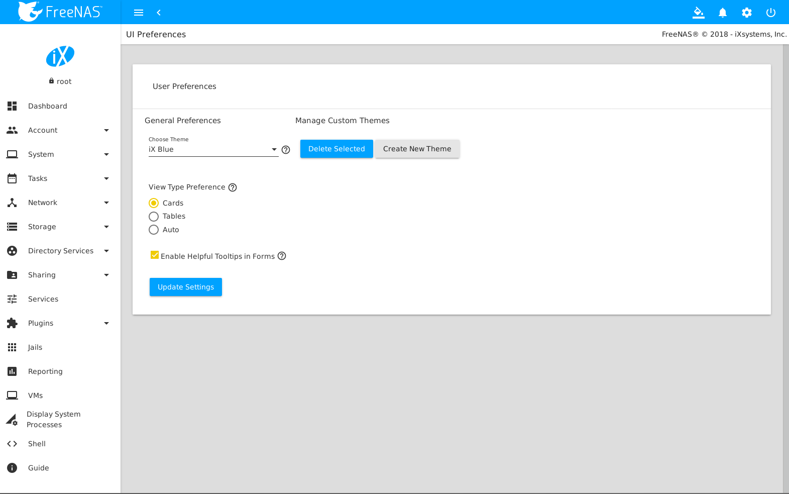
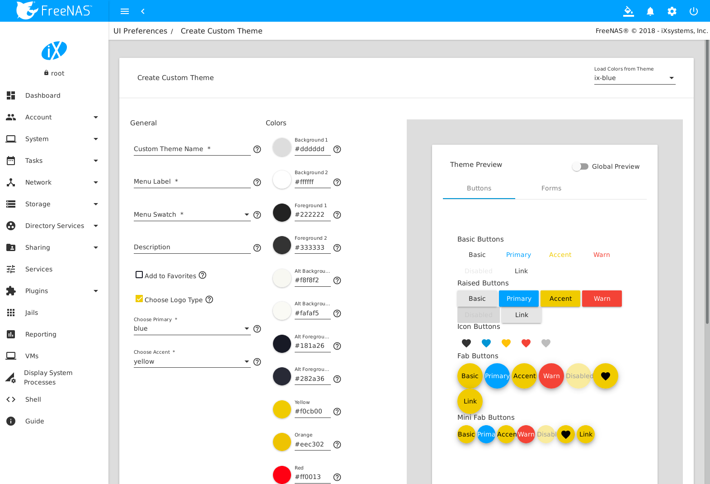

.. _Themes:

Themes
======

The %brand% User Interface can be adjusted to match the user
preferences.

The upper-right corner :guilabel:`Themes` menu, which appears as a
paint bucket icon, displays a list of different themes when selected.
:numref:`Figure %s <theme_select>` shows the default themes installed
with %brand% and any favorited :ref:`custom themes <Create New Themes>`.
Click a theme to activate it.

.. _theme_select:

.. figure:: images/themes-select-theme.png

   Changing the %brand% UI theme

Select :guilabel:`Manage Themes` to open the
:guilabel:`User Preferences` page. This page is also reached by opening
the |ui-settings| menu in the upper-right and clicking
:guilabel:`Preferences`.

.. index:: User Preferences
.. _User Preferences:

User Preferences
----------------

This page has options to adjust global settings in the UI, manage custom
themes, and create new themes.
:numref:`Figure %s <theme_preferences>` shows the different options:

.. _theme_preferences:

   User Preferences

**General Preferences**

These options are applied to the entire UI separately from the active
theme:

:guilabel:`Choose Theme`: Change the active theme. Custom themes can be
added to this list.

:guilabel:`View Type Preference` is used to select the default view for
many of the overview pages in the UI. Choose *Cards* to display each
item on a page in a self-contained "card". *Tables* condenses each item
into a simplified table. *Auto* dynamically adjusts the view according
to the number of items visible on the specific page.

:guilabel:`Enable Helpful Tooltips in Forms`: Set to add viewable help
text to each form in the UI.

Make any changes and click :guilabel:`Update Settings` to save the new
selections.

**Manage Custom Themes**

This column displays any created custom themes. Delete these themes by
setting the checkboxes and clicking :guilabel:`Delete Selected`.

Click :guilabel:`Create New Theme` to go to the
:guilabel:`Create Custom Theme` page.

.. index:: Create New Themes
.. _Create New Themes:

Create New Themes
-----------------

This page is used to create and preview custom %brand% themes.
:numref:`Figure %s <theme_custom>` shows many of the theming and
preview options:

.. _theme_custom:

   Create and Preview Custom Themes

Select an existing theme from the :guilabel:`Load Colors from Theme`
drop-down menu in the upper-right to use the colors from that theme as
the starting values for the new custom theme.
:numref:`Table %s <custom_theme__general_options>` describes each option:

.. tabularcolumns:: |>{\RaggedRight}p{\dimexpr 0.20\linewidth-2\tabcolsep}
                    |>{\RaggedRight}p{\dimexpr 0.11\linewidth-2\tabcolsep}
                    |>{\RaggedRight}p{\dimexpr 0.68\linewidth-2\tabcolsep}|

.. _custom_theme__general_options:

.. table:: General Options for a New Theme
   :class: longtable

   +-------------------+-----------+------------------------------------------------------------------------------------------+
   | Setting           | Value     | Description                                                                              |
   |                   |           |                                                                                          |
   +===================+===========+==========================================================================================+
   | Custom Theme Name | string    | Enter a name to identify the new theme.                                                  |
   |                   |           |                                                                                          |
   +-------------------+-----------+------------------------------------------------------------------------------------------+
   | Menu Label        | string    | Enter a short name to use for the %brand% menus.                                         |
   |                   |           |                                                                                          |
   +-------------------+-----------+------------------------------------------------------------------------------------------+
   | Menu Swatch       | drop-down | Choose a color from the theme to display next to the menu entry of the custom theme.     |
   |                   | menu      |                                                                                          |
   +-------------------+-----------+------------------------------------------------------------------------------------------+
   | Description       | string    | Enter a short description of the new theme.                                              |
   |                   |           |                                                                                          |
   +-------------------+-----------+------------------------------------------------------------------------------------------+
   | Add to Favorites  | checkbox  | Set to add this theme to the favorites list that displays under the                      |
   |                   |           | :guilabel:`Paint Bucket` icon.                                                           |
   |                   |           |                                                                                          |
   +-------------------+-----------+------------------------------------------------------------------------------------------+
   | Choose Logo Type  | checkbox  | Set to classify this as a "dark" theme.                                                  |
   |                   |           |                                                                                          |
   +-------------------+-----------+------------------------------------------------------------------------------------------+
   | Choose Primary    | drop-down | Choose from either a generic color or import a specific color setting to use as the      |
   |                   | menu      | primary theme color. The primary color changes the top bar of the UI and the color       |
   |                   |           | of many of the buttons.                                                                  |
   |                   |           |                                                                                          |
   +-------------------+-----------+------------------------------------------------------------------------------------------+
   | Choose Accent     | drop-down | Choose from either a generic color or import a specific color setting to use as the      |
   |                   | menu      | accent color for the theme. This color is used for many of the buttons and smaller       |
   |                   |           | elements in the UI.                                                                      |
   |                   |           |                                                                                          |
   +-------------------+-----------+------------------------------------------------------------------------------------------+

Choose the different :guilabel:`Colors` for this new theme after setting
these general options. Click the color swatch to open a small popup with
sliders to adjust the color. Color values can also be entered as a
hexadecimal value.

Changing any color value automatically updates the
:guilabel:`Theme Preview` column. This section is completely interactive
and shows how the custom theme is applied to all the different elements
in the UI.

Click :guilabel:`Save Custom Theme` when finished with all the
:guilabel:`General` and :guilabel:`Colors` options. The new theme will
be immediately added to the list of available themes in
:guilabel:`User Preferences`.

Click :guilabel:`Global Preview` to apply the unsaved custom theme to
the current session of the %brand% UI. Activating
:guilabel:`Global Preview` allows going to other pages in the UI and
live testing the new custom theme.

.. note:: Setting a custom theme as a :guilabel:`Global Preview` does
   **not** save that theme! Be sure to go back to
   :menuselection:`Preferences --> Create Custom Theme`
   , complete any remaining options, and click
   :guilabel:`Save Custom Theme` to save the current settings as a new
   theme.
