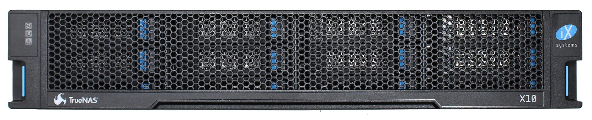
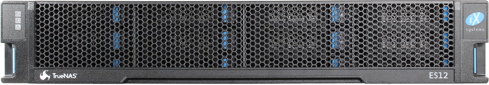
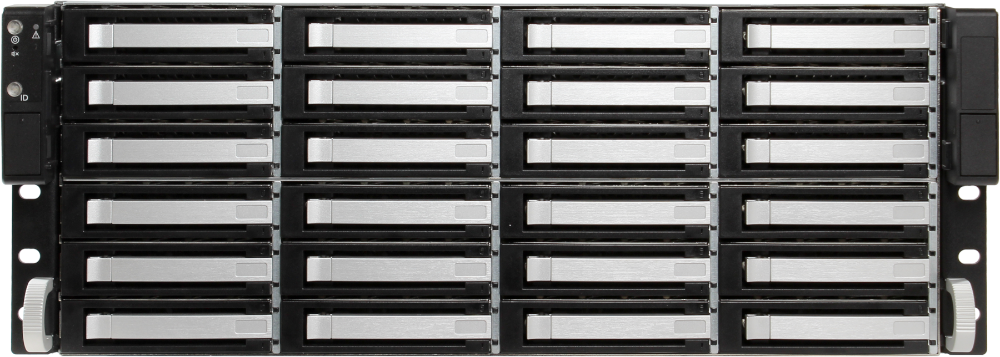
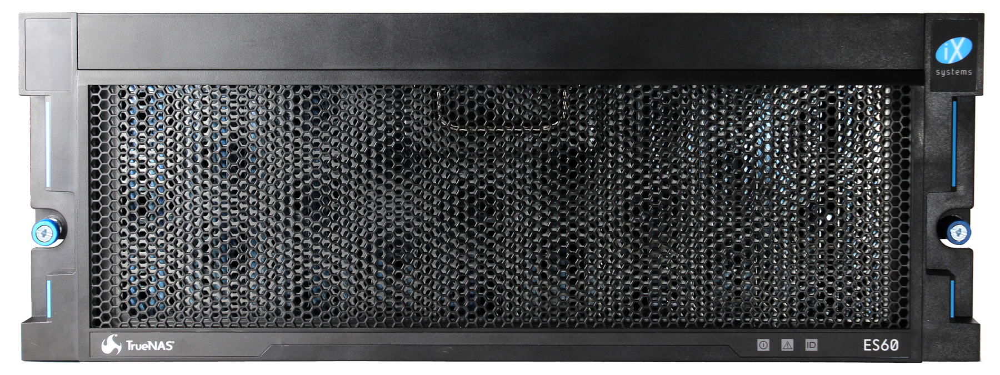

.. _Product Catalog:

Appendix B: %brand% Product Catalog
=============================================

iXsystems offers many storage products that are designed to fully use
the many features of %brand%. These products have enterprise features
like High Availability (HA), high-efficiency storage optimization, and
fast networking speeds for data transfer. Scalability and modularity are
also featured.

Each product makes full use of %brand% and have a variety of features at
different price points. To see hardware specifications or request a
quote, visit the
`iXsystems website <https://www.iXsystems.com/truenas>`__ or contact an
iX representative at :literal:`sales@ixsystems.com`.

%brand% Unified Storage Arrays
----------------------------------------

%brand% storage products are divided into two families, the X-Series and
M-Series. Each product supports High Availability (HA) hardware features
and all software features included with %brand%. The individual
specifications of each unit are tuned to maximize efficiency,
reliability, and affordability for different size IT environments.
iXsystems provides
`detailed specifications and comparisons <https://static.ixsystems.co/uploads/2019/07/StorageProductMatrix_Datasheet_WEB.pdf>`__
of each %brand% product.

X-Series
~~~~~~~~

The `X-Series <https://static.ixsystems.co/uploads/2019/07/BSG-X-Series-1.3_screen.pdf>`__
are 2U, 12-bay (front-loading), hybrid data storage arrays. They support
single or dual |ctrlr-term| configurations and can be connected with
expansion shelves to increase storage capacity. Physical dimensions are
21"L x 19"W x 3.5"H (531 x 447 x 89 mm). They weigh 44 lbs
(20 kg) and draw 138-200 W of power when fully loaded with drives.

M-Series
~~~~~~~~

.. figure:: images/truenas/m40.png

The `M-Series <https://static.ixsystems.co/uploads/2019/07/BSG-M-Series_screen.pdf>`__
are 4U, 24-bay (front-loading), hybrid data storage arrays. They support
single or dual |ctrlr-term| configurations and can be connected with
expansion shelves to increase storage capacity to a maximum of 2-10.4 PB.
Physical dimensions are 27"L x 19"W x 7"H (686 x 483 x 178 mm). They
weigh 114 lbs (52 kg) when fully loaded with drives. Maximum power draw
is determined by the total number of drives attached to the system.
Without drives, M-Series units draw 404-905 W of power, depending on
|ctrlr-term| configuration.

Expansion Shelves
-----------------

Expansion shelves are an easy way to expand %brand% capacity. All
%brand% expansion shelves feature redundant, hot-swappable,
high-efficiency power supplies, redundant cooling, and are
`RoHS 6/6 <https://www.rohsguide.com/rohs-faq.htm>`__ compliant.

ES12
~~~~

The %brand%
`ES12 <https://static.ixsystems.co/uploads/2019/07/BSG-ES12-1.3_screen.pdf>`__
is a 2U, 12-bay (front-loading), SAS3 (12 Gb/s) expansion shelf with
dual expansion controllers and redundant power supplies. Physical
dimensions are 21"L x 19"W x 3.5"H (531 x 447 x 89 mm). It weighs 44 lbs
(20 kg) and draws 112-180 W of power when fully loaded with drives.

ES24
~~~~

The %brand%
`ES24 <https://static.ixsystems.co/uploads/2019/08/BSG-ES24-1.4_screen.pdf>`__
is a 4U, 24-bay (front-loading), SAS3 (12 Gb/s) expansion shelf with
dual expansion controllers and redundant power supplies. Physical
dimensions are 20.5"L x 19"W x 7"H (521 x 483 x 178 mm). It weighs 76 lbs
(34.5 kg) and draws 231-288 W of power when fully loaded with drives.

ES60
~~~~

The %brand%
`ES60 <https://static.ixsystems.co/uploads/2019/07/BSG-ES60_screen.pdf>`__
is a 4U, 60-bay (top-loading), SAS3 (12 Gb/s) expansion shelf with dual
expansion controllers and redundant power supplies. Physical dimensions
are 33.38"L x 19"W x 6.9"H (848 x 483 x 176 mm). It weighs 175 lbs
(80 kg) and draws 479-821 W of power when fully loaded with drives.
