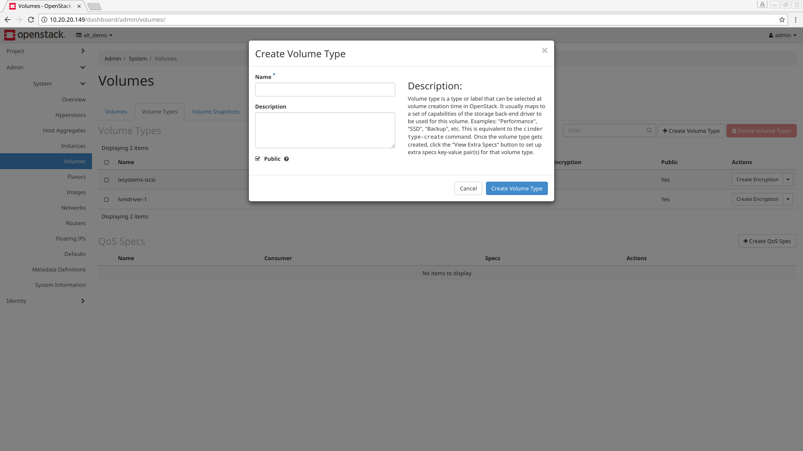
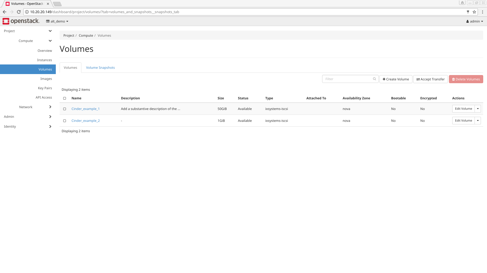
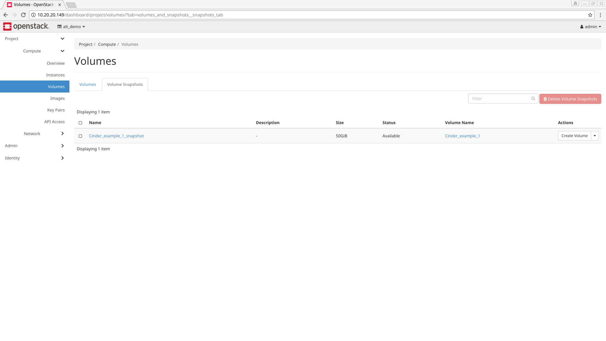
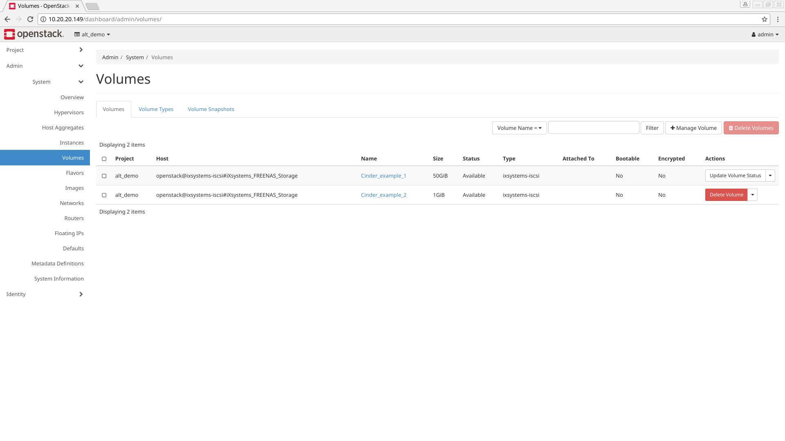
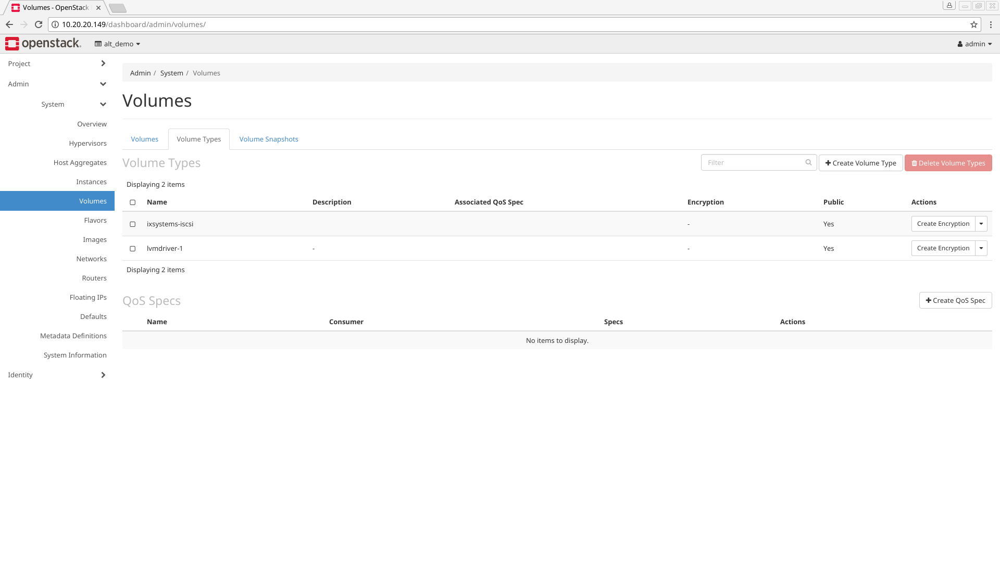
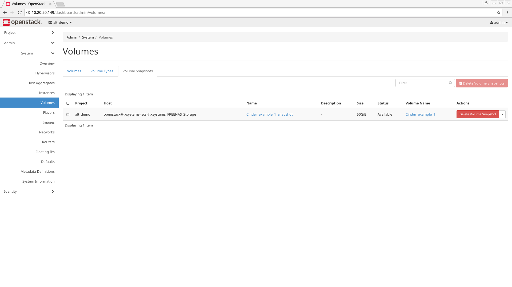

.. index:: OpenStack Cinder Driver
.. _OpenStack Cinder Driver:

OpenStack Cinder Driver
=======================

The iXsystems Cinder driver is an addon to OpenStack. It provides an
iSCSI (Block) Storage service. From its
`description <https://wiki.openstack.org/wiki/Cinder>`_:

    Cinder virtualizes the management of block storage devices and
    provides end users with a self service API to request and consume
    those resources without requiring any knowledge of where their
    storage is actually deployed or on what type of device.

After the driver is properly installed and configured it enhances
detection and management of the connected %brand% *iSCSI* resources
within the OpenStack web interface.

Requirements
------------

The iXsystems implementation of Cinder works only with %brand%. Two
systems are required to install and use Cinder:

 1. A system running %brand% with at least 8 Gb of memory and a minimum
    20 Gb storage disk.

 2. A system running
    `Devstack Newton Release <https://docs.openstack.org/newton/>`_ or
    newer. The minimum specifications are:

    * 4 Gb of RAM
    * 4 core CPU
    * 40 Gb storage disk.

Installation
------------

The iX Cinder driver is packaged as a :file:`.zip` file for simple
download and extraction. To obtain the driver :file:`.zip`, please
contact iXsystems Customer Support.

Log in to the system with Devstack Newton (or newer). Switch user
to **stack** with :command:`su - stack`. Extract the contents of the
iX Cinder :file:`.zip` file to
:file:`/opt/stack/cinder/cinder/volume/drivers/`.

.. note:: Be sure the **stack** user has ownership or permissions for
   all the extracted Cinder files.

Log in to the %brand% system and
:ref:`create a new dataset <Create Dataset>` called **cinder**. Also
note the system's IP address, root username and password, and the base
name of the iSCSI target, found by navigating
:menuselection:`Sharing --> Block(iSCSI) --> Target --> Global Configuration --> Base Name`.
All of this information is used to configure the iX Cinder driver before
it is functional in the OpenStack interface.

Configuration
-------------

Open :file:`/etc/cinder/cinder.conf` in an editor. Sections in this file
need to be **edited** and several user-defined parameters need to be
**added**.

**Edits** to :file:`cinder.conf`:

.. code-block:: none

   default_volume_type = ixsystems-iscsi
   enabled_backends = ixsystems-iscsi, lvmdriver-1

**Additions** to :file:`cinder.conf`:

:numref:`Table %s <tn-cinder-params>` explains the added
:file:`cinder.conf` parameters and their possible values:

.. tabularcolumns:: |>{\RaggedRight}p{\dimexpr 0.50\linewidth-2\tabcolsep}
                    |>{\RaggedRight}p{\dimexpr 0.50\linewidth-2\tabcolsep}|

.. _tn-cinder-params:

.. table:: Configuration parameters for :file:`cinder.conf`
   :class: longtable

   +---------------------------------+---------------------------------+
   | Parameter                       | Possible Values                 |
   |                                 |                                 |
   +=================================+=================================+
   | *iscsi_helper*                  | *tgtadm* (default), *lioadm*,   |
   |                                 | *scstadmin*, *iscsictl*,        |
   |                                 | *ietadm*, *fake* (testing only) |
   |                                 |                                 |
   +---------------------------------+---------------------------------+
   | *volume_dd_blocksize*           | Any string value: *1M*, *512*,  |
   |                                 | etc.                            |
   |                                 |                                 |
   |                                 |                                 |
   +---------------------------------+---------------------------------+
   | *volume_driver*:                | Default path for the iX driver: |
   |                                 | *cinder.volume.drivers.*        |
   |                                 | *ixsystems.iscsi.*              |
   |                                 | *FreeNASISCSIDriver*            |
   +---------------------------------+---------------------------------+
   | *ixsystems_login*               | Username of the connected       |
   |                                 | host. User defined.             |
   |                                 |                                 |
   +---------------------------------+---------------------------------+
   | *ixsystems_password*            | Password of the connected       |
   |                                 | host. User defined.             |
   |                                 |                                 |
   +---------------------------------+---------------------------------+
   | *ixsystems_server_hostname*     | IP address of the host.         |
   |                                 |                                 |
   +---------------------------------+---------------------------------+
   | *ixsystems_volume_backend_name* | A string value. The default     |
   |                                 | value is                        |
   |                                 | *iXsystems_FREENAS_Storage*     |
   |                                 |                                 |
   +---------------------------------+---------------------------------+
   | *ixsystems_iqn_prefix*:         | User defined. Found in the      |
   |                                 | web interface by navigating     |
   |                                 | **Sharing ->**                  |
   |                                 | **Block(iscsi) -> Target**      |
   |                                 | **Global Configuration ->**     |
   |                                 | **Base Name**                   |
   |                                 |                                 |
   +---------------------------------+---------------------------------+
   | *ixsystems_datastore_pool*:     | If the **cinder** dataset is    |
   |                                 | created, the value is           |
   |                                 | **cinder-tank**.                |
   |                                 |                                 |
   +---------------------------------+---------------------------------+
   | *ixsystems_vendor_name*         | *iXsystems*                     |
   |                                 |                                 |
   +---------------------------------+---------------------------------+
   | *ixsystems_storage_protocol*    | *iscsi*                         |
   |                                 |                                 |
   +---------------------------------+---------------------------------+

Here is an example of :file:`cinder.conf`'s additional parameters:

.. code-block:: none

   [ixsystems-iscsi]
   iscsi_helper = tgtadm
   volume_dd_blocksize = 512
   volume_driver = cinder.volume.drivers.ixsystems.iscsi.FreeNASISCSIDriver
   ixsystems_login = root
   ixsystems_password = thisisdummypassword
   ixsystems_server_hostname = 10.3.1.81
   ixsystems_volume_backend_name = iXsystems_FREENAS_Storage
   ixsystems_iqn_prefix = iqn.2005-10.org.freenas.ctl
   ixsystems_datastore_pool = cinder-tank
   ixsystems_vendor_name = iXsystems
   ixsystems_storage_protocol = iscsi

.. tip:: The
   `OpenStack documentation <https://docs.openstack.org/mitaka/config-reference/block-storage/block-storage-sample-configuration-files.html>`_
   also provides examples of configuring a generic :file:`cinder.conf`.

Restart the system to reload :file:`cinder.conf` and initialize the
*cinder service* properly. After this reboot, *cinder service* can be
rebooted manually with:

:samp:`# /usr/local/bin/cider-volume --config-file /etc/cinder/cinder.conf & echo $! >/opt/stack/status/stack/c-vol.pid; fg || echo "c-vol failed to start" | tee "/opt/stack/status/stack/c-vol.failure"`.

After the system is restarted, the iXsystems Cinder driver is now
functional within the OpenStack web interface. The **ixsystems-iscsi**
volume type may also need to be created in the interface in addition to
being set in :file:`cinder.conf`.

Open a browser and direct it to the IP address of the system with
Devstack Newton installed. A login screen similar to the one shown in
:numref:`Figure %s <tn_openstack_login>` displays.

.. _tn_openstack_login:

.. figure:: images/tn_openstack_login.png

   Log in screen for OpenStack

Enter the user name and password for the system and click
:guilabel:`Connect`. Navigate from
:menuselection:`Admin --> System --> Volumes --> Volume Types` and click
:guilabel:`Create Volume Type`. The window shown in
:numref:`Figure %s <tn_openstack_createvoltype>` appears.

.. _tn_openstack_createvoltype:

   Creating the *ixsystems-iscsi* volume type

Type :command:`ixsystems-iscsi` into the :guilabel:`Name` field and
ensure the :guilabel:`Public` box is checked. An optional
:guilabel:`Description` field is also available. When ready, click
:guilabel:`Create Volume Type` and the system begins creating the volume
type. The list is automatically refreshed when the task is finished.

Using the Cinder Driver
-----------------------

When fully configured, Cinder is used to manage volumes in the
:guilabel:`Project` and :guilabel:`Admin` sections of the interface.

Managing volumes with Cinder per-project
~~~~~~~~~~~~~~~~~~~~~~~~~~~~~~~~~~~~~~~~

The :menuselection:`Project --> Compute --> Volumes` section manages
volumes on a per-project basis. To change projects, click the
*project name* dropdown menu displayed in the upper left area of the
interface, next to the :guilabel:`openstack` logo.

:numref:`Figure %s <tn_proj_vol_tab>` shows an example of the
:guilabel:`Project/Compute/Volumes` interface with the
:guilabel:`Volumes` tab visible:

.. _tn_proj_vol_tab:

   Interface for managing a specific Project's Volumes

Every volume in the project displays in a reference list. The list is
sortable by any of the column titles. Users can also type custom filters
to track down specific items. Options to *Create*, *Accept Transfer* of
a volume from another project, and *Delete Volumes* are available.

There are also options to modify an existing volume. Check the box next
to the Volume's :guilabel:`Name`, then open the :guilabel:`Actions`
pulldown menu. :numref:`Table %s <tn_proj_vol_actions>` lists the
action, the equivalent :command:`cinder` CLI command (if any), and a
description of the configurables:

.. tabularcolumns:: |>{\RaggedRight}p{\dimexpr 0.20\linewidth-2\tabcolsep}
                    |>{\RaggedRight}p{\dimexpr 0.20\linewidth-2\tabcolsep}
                    |>{\RaggedRight}p{\dimexpr 0.60\linewidth-2\tabcolsep}|

.. _tn_proj_vol_actions:

.. table:: OpenStack Project/Compute/Volumes single volume actions
   :class: longtable

   +-------------+-----------------------------------+-----------------+
   | Action      | Cinder Command                    | Configurables   |
   +=============+===================================+=================+
   | Edit        | N/A                               | Adjust name and |
   | Volume      |                                   | description of  |
   |             |                                   | a volume. Also  |
   |             |                                   | choose to make  |
   |             |                                   | a volume        |
   |             |                                   | **Bootable**.   |
   |             |                                   |                 |
   +-------------+-----------------------------------+-----------------+
   | Extend      | N/A                               | Enter a new     |
   | Volume      |                                   | size in GiB.    |
   |             |                                   |                 |
   +-------------+-----------------------------------+-----------------+
   | Manage      | N/A                               | View and adjust |
   | Attachments |                                   | a volume's      |
   |             |                                   | attachment to   |
   |             |                                   | instances.      |
   |             |                                   |                 |
   +-------------+-----------------------------------+-----------------+
   | Create      | N/A                               | Type a snapshot |
   | Snapshot    |                                   | *name* and      |
   |             |                                   | *description*.  |
   |             |                                   | Snapshot limits |
   |             |                                   | are also shown. |
   |             |                                   |                 |
   +-------------+-----------------------------------+-----------------+
   | Change      | :command:`cinder retype`          | Choose a new    |
   | Volume Type |                                   | *type* and      |
   |             |                                   | *migration*     |
   |             |                                   | *policy*.       |
   |             |                                   |                 |
   +-------------+-----------------------------------+-----------------+
   | Upload to   | :command:`cinder upload-to-image` | Type an image   |
   | Image       |                                   | name and choose |
   |             |                                   | a disk format:  |
   |             |                                   | QCOW2, Raw, VDI |
   |             |                                   | , or VMDK.      |
   |             |                                   |                 |
   +-------------+-----------------------------------+-----------------+
   | Create      | :command:`cinder-transfer-create` | Type recipient  |
   | Transfer    |                                   | project's name. |
   |             |                                   |                 |
   +-------------+-----------------------------------+-----------------+
   | Update      | N/A                               | Move items into |
   | Metadata    |                                   | the existing    |
   |             |                                   | metadata column |
   |             |                                   | or create a     |
   |             |                                   | custom metadata |
   |             |                                   | key.            |
   |             |                                   |                 |
   +-------------+-----------------------------------+-----------------+

Project Volume Snapshots
^^^^^^^^^^^^^^^^^^^^^^^^

Any snapshot of a volume displays in the :guilabel:`Volume Snapshots`
tab, seen in
:numref:`Figure %s <tn_openstack_project_compute_vols_volsnaps>`:

.. _tn_openstack_project_compute_vols_volsnaps:

   Project Volume Snapshots tab

As with the other interface elements, the list can be sorted and
filtered. The :guilabel:`Actions` dropdown menu has options to create
a volume from an existing snapshot, edit a snapshot's name and
description, delete snapshots, and update a snapshot's metadata.

Administering all volumes with Cinder
~~~~~~~~~~~~~~~~~~~~~~~~~~~~~~~~~~~~~

Cinder functions within the :guilabel:`Admin` section to help manage
*Volumes*, *Volume Types*, and *Volume Snapshots* for all projects on
the system. Navigate from :menuselection:`Admin --> System --> Volumes`
to see these management tabs. Every created item displays in the master
list, regardless of project. This list can be sorted or filtered as
needed.

Managing Volumes
^^^^^^^^^^^^^^^^

:numref:`Figure %s <tn_openstack_admin_sys_vols>` shows the
:guilabel:`Volumes` tab:

.. _tn_openstack_admin_sys_vols:

   OpenStack Admin/System/Volumes "Volumes" tab

:numref:`Table %s <tn_openstack_admin_volumes>` shows the different
options, their :command:`cinder` CLI equivalents (if any), and a
description of the configurable elements.

.. tip:: Volumes can be managed or deleted in this section, but not
   created. Volume creation is handled in the
   :menuselection:`Project --> Compute --> Volumes` tab.

.. tabularcolumns:: |>{\RaggedRight}p{\dimexpr 0.20\linewidth-2\tabcolsep}
                    |>{\RaggedRight}p{\dimexpr 0.20\linewidth-2\tabcolsep}
                    |>{\RaggedRight}p{\dimexpr 0.60\linewidth-2\tabcolsep}|

.. _tn_openstack_admin_volumes:

.. table:: Cinder Volume Managment Options
   :class: longtable

   +----------+--------------------+-----------------------------------+
   | Action   | Cinder Command     | Configurables                     |
   +==========+====================+===================================+
   | Manage   | cinder manage      | Type the volume identifier, host, |
   | Volume   |                    | and volume name to make it        |
   |          |                    | visible in OpenStack. More        |
   |          |                    | elements to configure include     |
   |          |                    | *Volume Name*, *Description*,     |
   |          |                    | *Metadata*, *Volume Type*,        |
   |          |                    | *Availability Zone*, and          |
   |          |                    | *Bootable*.                       |
   +----------+--------------------+-----------------------------------+
   | Delete   | N/A                | Warning: any volumes deleted are  |
   | Volumes  |                    | unrecoverable.                    |
   |          |                    |                                   |
   +----------+--------------------+-----------------------------------+
   | Update   | cinder reset-state | Select a new status from the      |
   | Volume   |                    | dropdown menu. Note that Volume   |
   | Status   |                    | status is typically managed       |
   |          |                    | automatically.                    |
   |          |                    |                                   |
   +----------+--------------------+-----------------------------------+
   | Unmanage | cinder unmanage    | Note: Unmanaging a volume makes   |
   | Volume   |                    | it invisible in OpenStack, but    |
   |          |                    | does not delete it.               |
   |          |                    |                                   |
   +----------+--------------------+-----------------------------------+
   | Migrate  | N/A                | Choose a new Destination Host     |
   | Volume   |                    | from the dropdown menu. There is  |
   |          |                    | also an option to **Force Host**  |
   |          |                    | **Copy**, which bypasses driver   |
   |          |                    | optimizations.                    |
   |          |                    |                                   |
   +----------+--------------------+-----------------------------------+
   | Update   | N/A                | Choose items to move to the       |
   | Metadata |                    | **Existing Metadata** column.     |
   |          |                    | Custom "keys" can also be added.  |
   |          |                    |                                   |
   +----------+--------------------+-----------------------------------+

Manage Volume Types
^^^^^^^^^^^^^^^^^^^

:numref:`Figure %s <tn_openstack_admin_system_vols_voltypes>` shows how
all created Volume Types are listed in this tab. If the
:file:`cinder.conf` file was edited correctly during the Cinder
installation, two types are visible: :guilabel:`ixsystems-iscsi` and
:guilabel:`lvmdriver-1`.

.. _tn_openstack_admin_system_vols_voltypes:

   OpenStack Admin "Volume Types" tab

A number of actions can be applied to either volume type, as
:numref:`Table %s <tn_voltype_actions>` shows:

.. tabularcolumns:: |>{\RaggedRight}p{\dimexpr 0.20\linewidth-2\tabcolsep}
                    |>{\RaggedRight}p{\dimexpr 0.20\linewidth-2\tabcolsep}
                    |>{\RaggedRight}p{\dimexpr 0.60\linewidth-2\tabcolsep}|

.. _tn_voltype_actions:

.. table:: Volume Type Actions
   :class: longtable

   +-------------+------------------+----------------------------------+
   | Action      | Cinder Command   | Configurables                    |
   +=============+==================+==================================+
   | Create      | cinder           | Name, description, and visible   |
   | Volume      | type-create      | to "Public".                     |
   | Type        |                  |                                  |
   |             |                  |                                  |
   +-------------+------------------+----------------------------------+
   | Delete      | N/A              | Warning: action is permanent.    |
   | Volume      |                  |                                  |
   | Types       |                  |                                  |
   |             |                  |                                  |
   +-------------+------------------+----------------------------------+
   | Create      | cinder           | Provide a name and consumer for  |
   | QoS Spec    | qos-create       | the new Quality of Service spec. |
   |             |                  | Choose *back-end* to associate   |
   |             |                  | the policy with Cinder.          |
   |             |                  |                                  |
   +-------------+------------------+----------------------------------+
   | Create      | N/A              | Type a provider and control      |
   | Encryption  |                  | location. A custom cipher and    |
   |             |                  | key size can also be designated. |
   |             |                  |                                  |
   +-------------+------------------+----------------------------------+
   | View/Create | N/A              | Click *Create* to enter and save |
   | Extra Specs |                  | a new key/value pair.            |
   |             |                  |                                  |
   +-------------+------------------+----------------------------------+
   | Manage QoS  | cinder           | Select a QoS spec from the       |
   | Spec        | qos-associate,   | dropdown menu.                   |
   | Association | cinder           |                                  |
   |             | qos-disassociate |                                  |
   +-------------+------------------+----------------------------------+
   | Edit        | N/A              | Adjust the volume type's name,   |
   | Volume Type |                  | description, and public fields.  |
   |             |                  |                                  |
   +-------------+------------------+----------------------------------+
   | Update      | N/A              | Add new metadata items to the    |
   | Metadata    |                  | volume type. Custom keys can be  |
   |             |                  | created.                         |
   |             |                  |                                  |
   +-------------+------------------+----------------------------------+

Manage Volume Snapshots
^^^^^^^^^^^^^^^^^^^^^^^

This tab is very similar to managing snapshots of a single project, with
the only difference being snapshots from all projects are visible in the
list. :numref:`Figure %s <tn_openstack_admin_sys_vols_volsnaps>` shows
an example:

.. _tn_openstack_admin_sys_vols_volsnaps:

   Manage all Projects' Volume Snapshots

Options to *Delete*, *Update Status*, and *Update Metadata* for each
listed snapshot are available.
