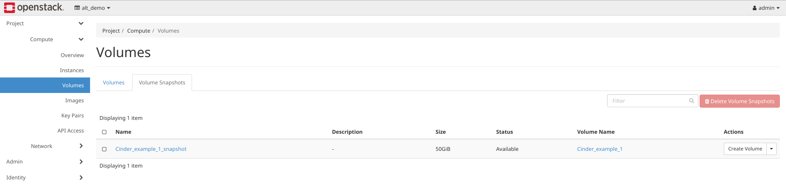
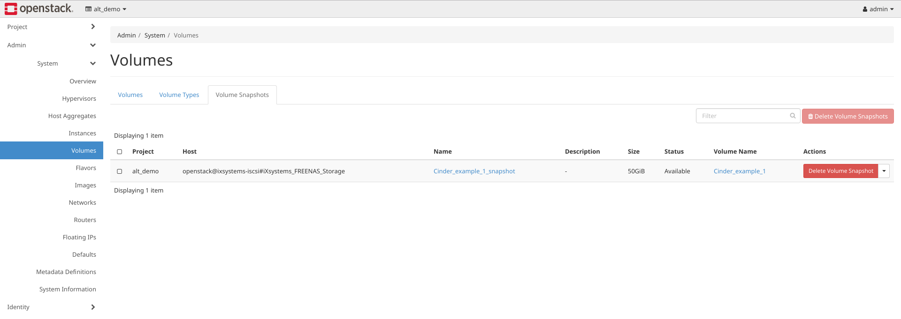

.. index:: OpenStack Cinder Driver
.. _OpenStack Cinder Driver:

OpenStack Cinder Driver
=======================

The %brand% Cinder driver for OpenStack provides an iSCSI (Block)
Storage service for OpenStack. Detection and management of connected
%brand% iSCSI resources is available from within the OpenStack web
interface.

Requirements
------------

1. A %brand% 11.0 or newer system to provide storage.

2. A computer running the
   `Newton release <https://docs.openstack.org/newton/>`_
   of OpenStack or newer, with these minimum hardware requirements:

   * 4 GiB of RAM
   * 4-core CPU
   * 40 GiB storage disk

Installation
------------

The Cinder driver is packaged as a :file:`.zip` file for simple
download and extraction. To obtain the driver, please contact
iXsystems Customer Support at
:literal:`truenas-support@ixsystems.com`.

Log in to a console on the OpenStack system. Switch user to *stack*
with :command:`su - stack`. Extract the contents of the Cinder driver
:file:`.zip` file to :file:`/opt/stack/cinder/cinder/volume/drivers/`.

.. note:: Be sure the *stack* user has ownership or permissions for
   all the extracted Cinder files.

Log in to the %brand% system and
:ref:`create a new dataset <Create Dataset>` named :literal:`cinder`.
Note the %brand% IP address, root username, and password. Locate the
base name of the iSCSI target by navigating to
:menuselection:`Sharing --> Block(iSCSI) --> Target --> Global Configuration --> Base Name`.
This information is needed to configure the Cinder driver before it
can be used in the OpenStack interface.

Configuration
-------------

On the OpenStack computer, edit :file:`/etc/cinder/cinder.conf`. Some
sections of this file must be edited and some user-defined parameters
must be added.

Modify the existing lines in :file:`cinder.conf` to these values:

.. code-block:: none

   default_volume_type = ixsystems-iscsi
   enabled_backends = ixsystems-iscsi, lvmdriver-1

:numref:`Table %s <tn-cinder-params>` explains the added parameters
and their possible values:

.. tabularcolumns:: |>{\RaggedRight}p{\dimexpr 0.32\linewidth-2\tabcolsep}
                    |>{\RaggedRight}p{\dimexpr 0.20\linewidth-2\tabcolsep}
                    |>{\RaggedRight}p{\dimexpr 0.48\linewidth-2\tabcolsep}|

.. _tn-cinder-params:

.. table:: Configuration Parameters for :file:`cinder.conf`
   :class: longtable

   +---------------------------------+-----------------------------------------------------------+-----------------------------------------------------------------------------------------+
   | Parameter                       | Description                                               | Possible Values                                                                         |
   +=================================+===========================================================+=========================================================================================+
   | *iscsi_helper*                  | iSCSI target user-land tool; the default is recommended   | *tgtadm* (default), *lioadm*, *scstadmin*, *iscsictl*, *ietadm*, *fake* (testing only)  |
   +---------------------------------+-----------------------------------------------------------+-----------------------------------------------------------------------------------------+
   | *volume_dd_blocksize*           | Default block size used when copying or clearing volumes  | Block size string value: *512*, *1M*                                                    |
   +---------------------------------+-----------------------------------------------------------+-----------------------------------------------------------------------------------------+
   | *volume_driver*                 | Driver used in volume creation; provide the path to the   | Default path for the iX driver:                                                         |
   |                                 | driver                                                    | *cinder.volume.drivers.ixsystems.iscsi.FreeNASISCSIDriver*                              |
   +---------------------------------+-----------------------------------------------------------+-----------------------------------------------------------------------------------------+
   | *ixsystems_login*               |                                                           | Username of the connected host                                                          |
   +---------------------------------+-----------------------------------------------------------+-----------------------------------------------------------------------------------------+
   | *ixsystems_password*            |                                                           | Password of the connected host                                                          |
   +---------------------------------+-----------------------------------------------------------+-----------------------------------------------------------------------------------------+
   | *ixsystems_server_hostname*     |                                                           | IP address of the host                                                                  |
   +---------------------------------+-----------------------------------------------------------+-----------------------------------------------------------------------------------------+
   | *ixsystems_volume_backend_name* | Backend name for a given driver implementation            | The default is *iXsystems_FREENAS_Storage*                                              |
   +---------------------------------+-----------------------------------------------------------+-----------------------------------------------------------------------------------------+
   | *ixsystems_iqn_prefix*          | Base name of the iSCSI target                             | User defined. Found in the web interface by navigating to                               |
   |                                 |                                                           | :menuselection:`Sharing -> Block(iscsi) -> Target Global Configuration -> Base Name`    |
   +---------------------------------+-----------------------------------------------------------+-----------------------------------------------------------------------------------------+
   | *ixsystems_datastore_pool*      | Name of the dataset on the connected system               | If the *cinder* dataset is created, the value is *cinder-tank*                          |
   +---------------------------------+-----------------------------------------------------------+-----------------------------------------------------------------------------------------+
   | *ixsystems_vendor_name*         |                                                           | *iXsystems*                                                                             |
   +---------------------------------+-----------------------------------------------------------+-----------------------------------------------------------------------------------------+
   | *ixsystems_storage_protocol*    |                                                           | *iscsi*                                                                                 |
   +---------------------------------+-----------------------------------------------------------+-----------------------------------------------------------------------------------------+

Here is an example of typical additional parameter settings for a
%brand% system at IP address :literal:`10.3.1.81`:

.. code-block:: none

   [ixsystems-iscsi]
   iscsi_helper = tgtadm
   volume_dd_blocksize = 512
   volume_driver = cinder.volume.drivers.ixsystems.iscsi.FreeNASISCSIDriver
   ixsystems_login = root
   ixsystems_password = thisisdummypassword
   ixsystems_server_hostname = 10.3.1.81
   ixsystems_volume_backend_name = iXsystems_FREENAS_Storage
   ixsystems_iqn_prefix = iqn.2005-10.org.freenas.ctl
   ixsystems_datastore_pool = cinder-tank
   ixsystems_vendor_name = iXsystems
   ixsystems_storage_protocol = iscsi

.. tip:: The
   `OpenStack documentation <https://docs.openstack.org/mitaka/config-reference/block-storage/block-storage-sample-configuration-files.html>`_
   also provides examples of :file:`cinder.conf` configurations.

Restart the OpenStack computer to reload :file:`cinder.conf` and
initialize the Cinder service properly. After this reboot, the Cinder
service can be restarted manually:

:samp:`# /usr/local/bin/cider-volume --config-file /etc/cinder/cinder.conf & echo $! >/opt/stack/status/stack/c-vol.pid; fg || echo "c-vol failed to start" | tee "/opt/stack/status/stack/c-vol.failure"`.

The Cinder driver is now available in the OpenStack web interface.

Open a web browser, go to the IP address of the OpenStack system, and
log in with the OpenStack user name and password. Click
:guilabel:`Connect`. Navigate from
:menuselection:`Admin --> System --> Volumes --> Volume Types`
and click :guilabel:`Create Volume Type`. The window shown in
:numref:`Figure %s <tn_openstack_createvoltype>` appears.

.. _tn_openstack_createvoltype:

.. figure:: images/tn_cinder-admin-voltypes-create.png

   Creating the *ixsystems-iscsi* Volume Type

Enter :command:`ixsystems-iscsi` in the :guilabel:`Name` field and
ensure the :guilabel:`Public` box is checked. An optional
:guilabel:`Description` field is also available. Click
:guilabel:`Create Volume Type` to create the volume
type. The list is automatically refreshed when the task is finished.

Using the Cinder Driver
-----------------------

Cinder is used to manage volumes in the :guilabel:`Project` and
:guilabel:`Admin` sections of the OpenStack interface.

Managing Volumes with Cinder by Project
~~~~~~~~~~~~~~~~~~~~~~~~~~~~~~~~~~~~~~~

The
:menuselection:`Project --> Compute --> Volumes`
section manages volumes on a per-project basis. To change projects,
click the *project name* dropdown menu displayed in the upper left
area of the interface, next to the :guilabel:`openstack` logo.

:numref:`Figure %s <tn_openstack_proj_vol_tab>`
shows an example of the :guilabel:`Project/Compute/Volumes` interface
with the :guilabel:`Volumes` tab visible:

.. _tn_openstack_proj_vol_tab:

.. figure:: images/tn_cinder_project_compute_vols.png

   Interface for Managing Project Volumes

Every volume in the project displays in a reference list. The list is
sortable by any of the column titles. Users can also type custom
filters to locate specific items. Options to :guilabel:`Create`,
:guilabel:`Accept Transfer` of a volume from another project, and
:guilabel:`Delete Volumes` are available.

An existing volume can be modified by checking the checkbox next
to the volume :guilabel:`Name`, then opening the :guilabel:`Actions`
pulldown menu.
:numref:`Table %s <tn_openstack_proj_vol_actions>`
lists the action, the equivalent :command:`cinder` CLI command,
and a description of the configurable settings:

.. tabularcolumns:: |>{\RaggedRight}p{\dimexpr 0.20\linewidth-2\tabcolsep}
                    |>{\RaggedRight}p{\dimexpr 0.30\linewidth-2\tabcolsep}
                    |>{\RaggedRight}p{\dimexpr 0.50\linewidth-2\tabcolsep}|

.. _tn_openstack_proj_vol_actions:

.. table:: OpenStack Single Volume Actions
   :class: longtable

   +--------------------+-----------------------------------+---------------------------------------------------------------------------------+
   | Action             | Cinder Command                    | Configurables                                                                   |
   +====================+===================================+=================================================================================+
   | Edit Volume        |                                   | Adjust name and description of a volume, or make a volume *Bootable*            |
   +--------------------+-----------------------------------+---------------------------------------------------------------------------------+
   | Extend Volume      |                                   | Enter a new size in GiB                                                         |
   +--------------------+-----------------------------------+---------------------------------------------------------------------------------+
   | Manage Attachments |                                   | View and adjust volume attachment to instances                                  |
   +--------------------+-----------------------------------+---------------------------------------------------------------------------------+
   | Create Snapshot    |                                   | Enter a snapshot *name* and *description*; snapshot limits are shown            |
   +--------------------+-----------------------------------+---------------------------------------------------------------------------------+
   | Change Volume Type | :command:`cinder retype`          | Choose a new *type* and *migration policy*                                      |
   +--------------------+-----------------------------------+---------------------------------------------------------------------------------+
   | Upload to Image    | :command:`cinder upload-to-image` | Enter an image name and choose a disk format: *QCOW2*, *Raw*, *VDI*, or *VMDK*  |
   +--------------------+-----------------------------------+---------------------------------------------------------------------------------+
   | Create Transfer    | :command:`cinder-transfer-create` | Enter recipient project name                                                    |
   +--------------------+-----------------------------------+---------------------------------------------------------------------------------+
   | Update Metadata    |                                   | Move items into the existing metadata column or create a custom metadata key    |
   +--------------------+-----------------------------------+---------------------------------------------------------------------------------+

Project Volume Snapshots
^^^^^^^^^^^^^^^^^^^^^^^^

Any snapshot of a volume displays in the :guilabel:`Volume Snapshots`
tab, seen in
:numref:`Figure %s <tn_openstack_project_compute_vols_volsnaps>`:

.. _tn_openstack_project_compute_vols_volsnaps:

   Project Volume Snapshots Tab

As with the other interface elements, the list can be sorted and
filtered. The :guilabel:`Actions` drop-down menu has options to create
a volume from an existing snapshot, edit a snapshot name and
description, delete snapshots, and update snapshot metadata.

Administering All Volumes with Cinder
~~~~~~~~~~~~~~~~~~~~~~~~~~~~~~~~~~~~~

Cinder functions within the :guilabel:`Admin` section manage
volumes, volume types, and volume snapshots for all projects on
the system. Navigate from
:menuselection:`Admin --> System --> Volumes`
to see these management tabs. Every created item is displayed in the
master list regardless of project. This list can be sorted or filtered
as needed.

Managing Volumes
^^^^^^^^^^^^^^^^

:numref:`Figure %s <tn_openstack_admin_sys_vols>` shows the
:guilabel:`Volumes` tab:

.. _tn_openstack_admin_sys_vols:

.. figure:: images/tn_cinder_admin_sys_vols.png

   OpenStack Volumes Tab

:numref:`Table %s <tn_openstack_admin_volumes>` shows the different
options, the :command:`cinder` CLI equivalents, and a description of
the configurable elements.

.. tip:: Volumes can be managed or deleted in this section, but not
   created. Volume creation is handled in the
   :menuselection:`Project --> Compute --> Volumes` tab.

.. tabularcolumns:: |>{\RaggedRight}p{\dimexpr 0.20\linewidth-2\tabcolsep}
                    |>{\RaggedRight}p{\dimexpr 0.28\linewidth-2\tabcolsep}
                    |>{\RaggedRight}p{\dimexpr 0.52\linewidth-2\tabcolsep}|

.. _tn_openstack_admin_volumes:

.. table:: Cinder Volume Management Options
   :class: longtable

   +-----------------+-------------------------------+------------------------------------------------------------------------------+
   | Action          | Cinder Command                | Configurables                                                                |
   +=================+===============================+==============================================================================+
   | Manage Volumes  | :command:`cinder manage`      | Type the volume identifier, host, and volume name to make it visible in      |
   |                 |                               | OpenStack; other configurable elements are *Volume Name*, *Description*,     |
   |                 |                               | *Metadata*, *Volume Type*, *Availability Zone*, and *Bootable*               |
   +-----------------+-------------------------------+------------------------------------------------------------------------------+
   | Delete Volumes  |                               | Warning: volumes deleted here cannot be recovered                            |
   +-----------------+-------------------------------+------------------------------------------------------------------------------+
   | Update Volume   | :command:`cinder reset-state` | Select a new status from the dropdown menu; volume status is normally set    |
   | Status          |                               | automatically                                                                |
   +-----------------+-------------------------------+------------------------------------------------------------------------------+
   | Unmanage Volume | :command:`cinder unmanage`    | Unmanaging a volume makes it invisible in OpenStack, but does not delete it  |
   +-----------------+-------------------------------+------------------------------------------------------------------------------+
   | Migrate Volume  |                               | Choose a new *Destination Host* from the dropdown menu; there is also an     |
   |                 |                               | option to *Force Host Copy*, which bypasses driver optimizations             |
   +-----------------+-------------------------------+------------------------------------------------------------------------------+
   | Update Metadata |                               | Choose items to move to the *Existing Metadata* column; custom keys can      |
   |                 |                               | also be added                                                                |
   +-----------------+-------------------------------+------------------------------------------------------------------------------+

Manage Volume Types
^^^^^^^^^^^^^^^^^^^

:numref:`Figure %s <tn_openstack_admin_system_vols_voltypes>`
shows how all created volume types are listed in this tab. If the
:file:`cinder.conf` file was edited as shown above in the Cinder
driver installation, two types are visible:
:guilabel:`ixsystems-iscsi` and :guilabel:`lvmdriver-1`.

.. _tn_openstack_admin_system_vols_voltypes:

.. figure:: images/tn_cinder-admin-voltypes.png

   OpenStack Volume Types Tab

A number of actions can be applied to either volume type, as
:numref:`Table %s <tn_openstack_voltype_actions>` shows:

.. tabularcolumns:: |>{\RaggedRight}p{\dimexpr 0.20\linewidth-2\tabcolsep}
                    |>{\RaggedRight}p{\dimexpr 0.30\linewidth-2\tabcolsep}
                    |>{\RaggedRight}p{\dimexpr 0.50\linewidth-2\tabcolsep}|

.. _tn_openstack_voltype_actions:

.. table:: Volume Type Actions
   :class: longtable

   +---------------------+------------------------------------+--------------------------------------------------------------+
   | Action              | Cinder Command                     | Configurables                                                |
   +=====================+====================================+==============================================================+
   | Create Volume Type  | :command:`cinder type-create`      | Name, description, and visible to "Public"                   |
   +---------------------+------------------------------------+--------------------------------------------------------------+
   | Delete Volume Types |                                    | Warning: action is permanent                                 |
   +---------------------+------------------------------------+--------------------------------------------------------------+
   | Create QoS Spec     | :command:`cinder qos-create`       | Provide a name and consumer for the new Quality of Service   |
   |                     |                                    | spec; choose *back-end* to associate the policy with Cinder  |
   +---------------------+------------------------------------+--------------------------------------------------------------+
   | Create Encryption   |                                    | Type a provider and control location; custom cipher and key  |
   |                     |                                    | size can also be designated                                  |
   +---------------------+------------------------------------+--------------------------------------------------------------+
   | View/Create Extra   |                                    | Click :guilabel:`Create` to enter and save a new key/value   |
   | Specs               |                                    | pair                                                         |
   +---------------------+------------------------------------+--------------------------------------------------------------+
   | Manage QoS Spec     | :command:`cinder qos-associate`,   | Select a QoS spec from the drop-down menu                    |
   | Association         | :command:`cinder qos-disassociate` |                                                              |
   +---------------------+------------------------------------+--------------------------------------------------------------+
   | Edit Volume Type    |                                    | Modify the volume type name, description, and public fields  |
   +---------------------+------------------------------------+--------------------------------------------------------------+
   | Update Metadata     |                                    | Add new metadata items to the volume type; custom keys       |
   |                     |                                    | can be created                                               |
   +---------------------+------------------------------------+--------------------------------------------------------------+

Manage Volume Snapshots
^^^^^^^^^^^^^^^^^^^^^^^

This tab is very similar to managing snapshots of a single project.
The only difference is that snapshots from all projects are visible
in the list.
:numref:`Figure %s <tn_openstack_admin_sys_vols_volsnaps>`
shows an example:

.. _tn_openstack_admin_sys_vols_volsnaps:

   Manage All Projects Volume Snapshots

Options to :guilabel:`Delete`, :guilabel:`Update Status`, and
:guilabel:`Update Metadata` for each listed snapshot are available.
