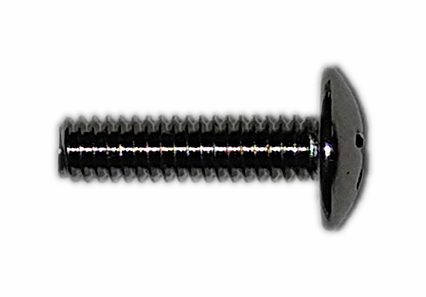
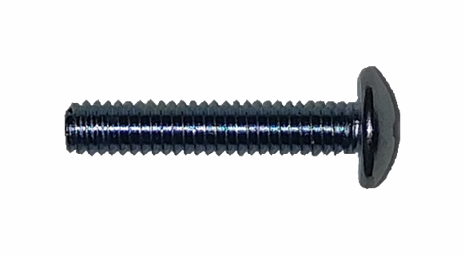
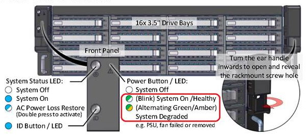

.. _Hardware Setup:

Hardware Setup
==============

%brand% hardware consists of one or two main *Unified Storage Array*
units.  Optional *Expansion Shelves* can be added to expand storage
capacity. Racking and connection of these units is described
individually below.

If the %brand% Storage Array does not arrive in perfect condition, or
if any parts are missing, please take photos and contact iXsystems
support immediately.

.. note:: Always perform the initial %brand% setup in consultation
   with your iXsystems Support Representative. iXsystems Support can
   be contacted at :literal:`truenas-support@ixsystems.com`. Have all
   %brand% hardware serial numbers available. These are located on the
   back of each chassis.

.. index:: %brand% Unified Storage Array

.. _%brand% Unified Storage Array:

%brand% Unified Storage Array
--------------------------------------------

The %brand% Storage Array is shipped with several accessories.
Please verify that the shipment includes these items:

* %brand% Storage Array

.. image:: images/truenas_appliance.png

* Up to 16 Populated 3.5" drive trays

.. image:: images/tn_drive_trays.jpg

* One pair of outer rails, left and right

.. image:: images/tn_rails.jpg

* Eight thumbscrews

.. image:: images/tn_thumbscrews1.png
   :width: 5%

* Two short screws

* Two long screws

* Two power cables

.. image:: images/tn_power_cable.jpg

* One serial to 3.5mm cable

.. image:: images/tn_serialcable.png

* One faceplate

.. image:: images/tn_bezel.png

* One printed guide

.. image:: images/tn_setupguide.png

Network cables are highly configuration-dependent. Please contact your
iXsystems Sales Representative for any questions about the included
cables.

Unused drive bays are populated with drive tray blanks to maintain
proper airflow.

Layout of the storage controller varies with configuration.
:numref:`Figure %s <appliance1>` provides an example of
the front view of the %brand% Storage Array.

.. _appliance1:

.. figure:: images/tn_appliance_front_view.jpg

   Front View

There are two control panels, one on each side of the front of the
array. The one on the left controls the primary storage controller,
and the one on the right controls the secondary storage controller
in High Availability models.

:numref:`Figure %s <appliance2>`
shows the layout of the front panel buttons and indicators.

.. _appliance2:

.. figure:: images/tn_appliance_front_panel.jpg

   Front Panel Buttons and Indicators

:numref:`Figure %s <appliance3>`
shows the rear view of the array. If the %brand% Storage Array is
configured for High Availability, both storage controller slots
are populated. In a single-controller model, the bottom slot is
covered with a blank panel.

.. _appliance3:

.. figure:: images/tn_appliance_rear_view.jpg

   Rear View

:numref:`Figure %s <appliance4>`
shows a drive tray and the LED color indications.

.. _appliance4:

.. figure:: images/tn_drive_tray.jpg

   Drive Tray

.. index:: Hardware Installation

.. _Hardware Installation:

Hardware Installation
---------------------

The %brand% Storage Array slide rails work on racks with either square
or circular hole types. Set the mounting brackets into the correct
position for the rack type by pressing the button on the mounting
bracket and rotating them, as shown in
:numref:`Figure %s <appliance5>`.
The square rack style brackets are the default. The circular hole
style has a flat surface and screw holes.

.. _appliance5:

.. figure:: images/tn_rotate_bracket.png

   Rotate Rackmount Bracket

.. index:: Install %brand% Outer Rail in Rack

Before installing, confirm that the rails included are long enough for
the rack. Examine each rail to find the sides labeled *Front* and
*Rear*.

For racks with square holes, snap the mounting brackets into the
holes at either end of the rail into the mouting holes. Make sure
to install the rails with the end labeled *Front* toward the front
of the rack. Refer to
:numref:`Figure %s <appliance6>`
for a detailed view.

.. _appliance6:

.. figure:: images/tn_rack_square_holes.png

   Installing Rails in Racks with Square Holes

For racks with round holes, secure the rails into the rack at the
desired position using the eight thumbscrews included. Make sure to
install the rails with the end labeled *Front* toward the front of the
rack. Refer to
:numref:`Figure %s <appliance7>`
for a detailed view.

.. _appliance7:

.. figure:: images/tn_rack_round_holes.png

   Installing Rails in Racks with Round Holes

.. index:: Install Array into Rack

The %brand% Storage Array can now be installed into the rack.

.. warning:: Two people are required to lift a %brand% Storage
   Array.

Carefully align the %brand% Storage Array inner rail with the
notches in the outer rail. When the rails are aligned, slide the
array toward the rack. When the array stops moving, move the
pin-lock laches to allow the array to slide the rest of the way
into the rack. Refer to
:numref:`Figure %s <appliance8>`
for a detailed view.

.. _appliance8:

.. figure:: images/tn_rack_and_release_locks.png

   Push Array into Rack and Release Pin-lock Latches

.. index:: Install Drive Trays into a TrueNAS Array

Install all of the populated drive trays into the front of the array.
Refer to
:numref:`Figure %s <appliance9>`
for a detailed view.

.. note:: To avoid personal injury, do not install drives into the
   %brand% Storage Array before racking.

.. _appliance9:

.. figure:: images/tn_install_drive_tray.jpg

   Drive Installation Instructions

Connect both network and storage cabling **before** turning on the
%brand% Storage Array for the first time.

Network cabling is highly dependent on the exact %brand% model and
environment. Please contact your iXsystems Support Representative if
assistance is needed to connect the %brand% Storage Array to the
network.

Using the :ref:`Out-of-Band Management` feature requires connecting
and configuring the out-of-band management port before turning on the
%brand% Storage Array. Refer to
:numref:`Figure %s <appliance11>`
or the sticker on the storage controller handle for the location of
the out-of-band management port.

.. _appliance11:

.. figure:: images/tn_appliance_back_panel_left.jpg

   Back Panel Layout

Storage cabling instructions are shown in the
:ref:`E16 Expansion Shelf` and :ref:`E24 Expansion Shelf` sections.

.. index:: Attach the %brand% Faceplate

If the optional faceplate was included, attach it to the %brand%
Storage Array by inserting the two tabs on the right side of the
faceplate into the holes in the right side handle section. Push the
left side of the faceplate down until it clicks into place.

.. index:: Plug in and Power on your %brand% array

After all of the previous hardware setup steps are complete, plug the
power cords into the AC receptacles on the back of the %brand%
Storage Array and secure them in place with the wire locks.

.. note:: Be sure to power on all %brand% storage expansion shelves
   before powering on the %brand% Storage Array.

Power on the %brand% Storage Array by pressing the top left button
on the control panel. Wait thirty seconds after turning on the first
storage controller before powering on the second storage controller.
This will determine which controller is the active controller in High
Availability configurations.

After the %brand% Storage Array is fully operational, the %brand%
logo acts as a global fault light. By default, it is backlit in white.
If there are any issues that need to be addressed, the light turns
red. Refer to the :ref:`Alert` section of the %brand% administrative
graphical interface for more details about the error condition.

.. index:: E16 Expansion Shelf

.. _E16 Expansion Shelf:

E16/E16F Expansion Shelf
------------------------

.. note:: This product is End Of Life (EOL). Support ends January 31,
   2020.

The %brand% E16 expansion shelf is a 3U, 16-bay storage expansion
unit designed specifically to work with the %brand% Storage Array.
This section will cover setting up an E16 expansion shelf and
connecting it to a %brand% Storage Array.

.. index:: E16 Expansion Shelf Contents

The E16 expansion shelf comes with a number of necessary
accessories. If anything is missing or your E16 expansion shelf
arrived in less than pristine condition, immediately take pictures
and contact iXsystems support.

* %brand% E16 expansion shelf

.. image:: images/tn_e16shelf.jpg

* Up to 16 populated 3.5" drive trays

.. image:: images/tn_drive_trays.jpg

* Two power cables

.. image:: images/tn_power_cable.jpg

* Two host expansion cables (SAS 8088)

.. image:: images/tn_host_expansion_cable.jpg

* Inner and outer rails, left and right

.. image:: /images/tn_rails.jpg

* Two sets of screws

* One printed guide

.. image:: images/tn_e16_guide.png

Unused drive bays are populated with drive tray blanks to
maintain proper airflow.

.. index:: E16 Expansion Shelf Layout

:numref:`Figure %s <appliance12>` shows the front view
of the %brand% E16 expansion shelf.

.. _appliance12:

   Front View

:numref:`Figure %s <appliance13>`
shows the rear view of the %brand% E16 expansion shelf.

.. _appliance13:

.. figure:: images/tn_e16_rear_view.jpg

   Rear View

:numref:`Figure %s <appliance14>`
provides a detailed view of a drive tray and the possible statuses
for the LED.

.. _appliance14:

.. figure:: images/tn_drive_tray.jpg

   Drive Tray

.. index:: Attach E16 Expansion Shelf Inner Rail to Chassis

To attach the E16 expansion shelf inner rail to the chassis, remove
the inner rail from both rails. Slide the inner and outer rails
apart, and then push the pin-lock latch outward to allow the rails
to separate completely, as shown in
:numref:`Figure %s <appliance15>`.

.. _appliance15:

.. figure:: images/tn_separate_rails.jpg

   Separate Inner and Outer Rails

Align the inner rail keyholes to the two hooks near the front of
the chassis, then slide the rails forward into place as shown in
:numref:`Figure %s <appliance16>`.

.. _appliance16:

.. figure:: images/tn_attach_inner_rail.jpg

   Attach Inner Rail to Chassis

Secure the inner rail in place with a small screw from the rail
kit. Refer to
:numref:`Figure %s <appliance17>`
for a detailed view.

.. _appliance17:

.. figure:: images/tn_secure_inner_rail.jpg

   Secure Inner Rail in Place

The %brand% E16 expansion shelf slide rails support racks with both
square and circular hole types. Set the mounting brackets into the
correct position for your rack type by pressing the button on the
mounting bracket and rotating them in place, as shown in
:numref:`Figure %s <appliance18>`.
The square rack style brackets are the default. The circular hole
style is the one with a flat surface and screw holes.

.. _appliance18:

.. figure:: images/tn_rotate_bracket.png

   Rotate Rackmount Bracket

Before installing, confirm that the rails included with the %brand%
E16 expansion shelf are long enough for your rack. Examine each
rail to find the sides labeled *Front* and *Rear*.

For racks with square holes, snap the mounting brackets into the
holes at either end of the rail into the mouting holes. Make sure
to install the rails with the end labeled *Front* toward the front
of the rack. Refer to
:numref:`Figure %s <appliance19>` for a detailed view.

.. _appliance19:

.. figure:: images/tn_rack_square_holes.png

   Installing Rails in Racks with Square Holes

For racks with round holes, secure the rails into the rack at the
desired position using the eight thumbscrews included with the
rails. Make sure to install the rails with the end labeled *Front*
toward the front of the rack. Refer to
:numref:`Figure %s <appliance20>`
for a detailed view.

.. _appliance20:

.. figure:: images/tn_rack_round_holes.png

   Installing Rails in Racks with Round Holes

You are now ready to install the E16 expansion shelf into the rack.

.. warning:: Two people are required to lift a %brand% E16
   expansion shelf.

Carefully align the %brand% E16 expansion shelf inner rail with the
notches in the outer rail. Once the rails are aligned, slide the
array toward the rack. When the array stops moving, move the
pin-lock laches to allow the array to slide the rest of the way
into the rack. Refer to
:numref:`Figure %s <appliance21>`
for a detailed view.

.. _appliance21:

.. figure:: images/tn_rack_and_release_locks.png

   Push Expansion Shelf into Rack and Release pin-lock Latches

Next, install all populated drive trays into the front of the
expansion shelf as shown in
:numref:`Figure %s <appliance22>`.

.. note:: to avoid personal injury, do not install drives into the
   E16 expansion shelf before racking.

.. _appliance22:

.. figure:: images/tn_install_drive_tray.jpg

   Drive Installation Instructions

.. index:: Connect E16 Expansion Shelf to TrueNAS Array

Note the labels on the SAS ports on the back of the %brand% Storage
Array and the letter label on the back of the expansion shelf.
Using the included SAS cables, connect the *In* SAS port of the top
expander on the E16 expansion shelf to the SAS port with the same
letter on the %brand% Storage Array's primary storage controller
(the one in the top slot). If you have a secondary storage
controller, connect the *In* SAS port of the bottom expander to the
port with the same letter on the secondary storage controller.
Refer to
:numref:`Figure %s <appliance24>` for a detailed view.

.. _appliance24:

.. figure:: images/tn_e16_connect_storage.png

   Connecting an E16 Expansion Shelf to a %brand% Storage Array

.. index:: Plug in and Power on E16 Expansion Shelf

Once all the other hardware setup steps are complete, plug the
power cords into the AC receptacles on the back of the E16
expansion shelf and secure them in place with the wire locks. Power
on the E16 expansion shelf by pressing the top left button on the
control panel.

If you are setting up a %brand% Storage Array for the first time,
wait two minutes after powering on all expansion shelves before
turning on the %brand% Storage Array.

.. index:: E24 Expansion Shelf

.. _E24 Expansion Shelf:

E24 Expansion Shelf
-------------------

The %brand% E24 expansion shelf is a 4U, 24-bay storage expansion
unit designed specifically for use with the %brand% Storage Array.
This section will cover setting up an E24 expansion shelf and
connecting it to a %brand% Storage Array.

.. index:: TrueNAS E24 Expansion Shelf Contents

The E24 expansion shelf comes with a number of necessary
accessories. If anything is missing or your E24 expansion shelf
arrived in less than pristine condition, immediately take pictures
and contact iXsystems support.

* %brand% E24 expansion shelf

.. image:: images/tn_e24shelf.jpg

* Up to 24 populated drive trays

.. image:: images/tn_drive_trays.jpg

* Two power cables

.. image:: images/tn_power_cable.jpg

* Two host expansion cables (SAS 8088)

.. image:: images/tn_host_expansion_cable.jpg

* One rail kit

.. image:: images/tn_e24_rail_kit.jpg

* One printed guide

.. image:: images/tn_e24_guide.png

Unused drive bays are populated with drive tray blanks to
maintain proper airflow.

.. index:: TrueNAS E24 Expansion Shelf Layout

:numref:`Figure %s <appliance25>`
shows the front of the %brand% E24 expansion shelf.

.. _appliance25:

.. figure:: images/tn_e24_front_view.png

   Front View

:numref:`Figure %s <appliance26>`
shows the rear view of the %brand% E24 expansion shelf.

.. _appliance26:

.. figure:: images/tn_e24_rear_view.jpg

   Rear View

:numref:`Figure %s <appliance27>`
provides a detailed view of a 3.5" drive tray.

.. _appliance27:

.. figure:: images/tn_e24_drive_tray.png

   Drive Tray

.. index:: Install E24 Expansion Shelf Rails

Two rails and three sets of screws are included in the rail kit.
Use only the screws labeled for use in the type of rack you have.
Take note of the engraved rails at either end of each rail
specifying whether they are for the Left (L) or Right (R) and which
end is the front and which is the back. With two people, attach
each rail to the rack using the topmost and bottommost screw holes.
The folded ends of the rails should be inside the corners of the
rack.
:numref:`Figure %s <appliance28>`
shows the front left attachments for an L-type rack.

.. _appliance28:

.. figure:: images/tn_e24_front_left_rail.png

   Front Left Rail

:numref:`Figure %s <appliance29>`
shows the rear right attachments for an L-type rack.

.. _appliance29:

.. figure:: images/tn_e24_right_rear_rail.png

   Rear Right Rail

.. index:: Install E24 Expansion Shelf into Rack

Next, install the E24 expansion shelf into the rack.

.. note:: To avoid personal injury, do not install drives into the
   E24 expansion shelf before racking.

With two people, place the back of the expansion shelf on the rack.
Gently push it backwards until the front panels of the expansion
shelf are pressed against the front of the rack.

Secure the expansion shelf to the rack by pushing down and
tightening the two built-in thumbscrews as indicated in
:numref:`Figure %s <appliance30>`.

.. _appliance30:

.. figure:: images/tn_attach_e24_expansion_shelf.png

   Secure E24 Expansion Shelf to the Rack

.. index:: Install Drives into the E24 Expansion Shelf

Once the E24 expansion shelf is secured into the rack, insert the
included hard drives. To insert a drive, release the handle with
the tab on the right side, push it into the drive bay until the
handle starts to be pulled back, and then push the handle the rest
of the way forward to secure the drive in place.

.. index:: Connect E24 Expansion Shelf to TrueNAS Array

To connect the E24 expansion shelf to the %brand% Storage Array,
note the labels on the SAS ports on the back of the %brand% Storage
Array and the letter label on the back of the expansion shelf.
Using the included SAS cables, connect the left *In* SAS port of
the left side expander on the E24 expansion shelf to the SAS port
with the same letter on the %brand% Storage Array's primary storage
controller (the one in the top slot). If you have a secondary
storage controller, connect the left *In* SAS port of the right
side expander to the port with the same letter on the secondary
storage controller. Refer to
:numref:`Figure %s <appliance32>`
for a detailed view.

.. _appliance32:

.. figure:: images/tn_e24_connect_storage.jpg

   Example connection between E24 Expansion Shelf and %brand% Storage Array

.. note:: If you only have one storage controller, retain your
   second SAS cable. If you later upgrade %brand% with a second
   storage controller, you will need it to connect to the E24
   expansion shelf.

.. index:: Plug in and Power on E24 Expansion Shelf

Before you plug in and power on the E24 expansion shelf, make sure
the power switches on both power supplies are set to the Off
(Circle) position shown in
:numref:`Figure %s <appliance33>`.
Using the power cables provided, connect both power supplies to
appropriate power sources. Secure the power cables in place with
the plastic locks.

.. _appliance33:

.. figure:: images/tn_e24_power_supply.jpg

   E24 Power Supply

Once all the power and storage connections are set up, turn on the
expansion shelf by moving the power switches on both power supplies
to the On (line) position.

When setting up a %brand% Storage Array for the first time, wait two
minutes after powering on all expansion shelves before turning on the
%brand% Storage Array.
