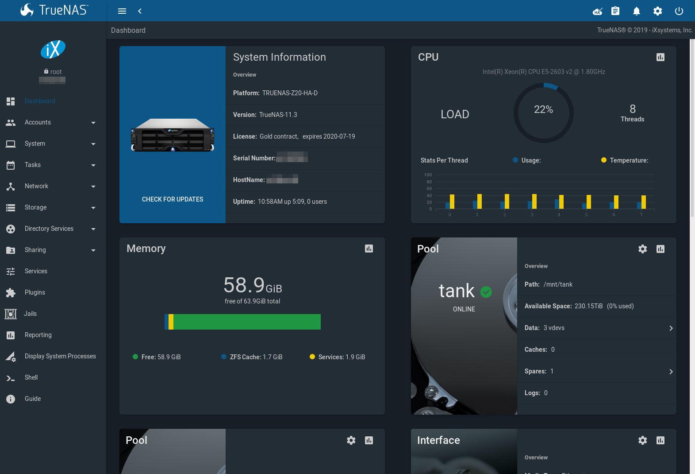

Initial Setup
=============

Before beginning software configuration, please see the
:ref:`Hardware Setup` section for specific racking and connection
information.

Depending on the degree of pre-configuration requested from iXsystems,
most of the initial %brand% setup might already be complete.

.. note:: Always perform the initial %brand% setup in consultation
   with your iXsystems Support Representative. iXsystems Support can
   be contacted at :literal:`truenas-support@ixsystems.com`. Be sure
   to have all %brand% hardware serial numbers on hand. They are
   located on the back of each chassis.

.. index:: Out-of-Band Management

.. _Out-of-Band Management:

Out-of-Band Management
----------------------

Before attempting to configure %brand% for out-of-band management,
ensure that the out-of-band management port is connected to an
appropriate network. Refer to the guide included with the %brand%
Storage Array for detailed instructions on how to connect to a
network.

Connect the out-of-band management port **before** powering on the
%brand% Storage Array.

In most cases, the out-of-band management interface will have been
pre-configured by iXsystems. This section contains instructions for
configuring it from the BIOS if needed. The same settings can be
configured using the instructions in :ref:`IPMI`.

.. note:: The %brand% X-Series Unified Storage Array uses different
   methods for out-of-band management. Refer to the X-Series
   :ref:`out-of-band management instructions <Discover Out-of-Band Management IP Address>`

Press :kbd:`F2` at the splash screen while the %brand% Storage Array
is booting to access the system BIOS. This opens the menu shown in
:numref:`Figure %s <appliance34>`.

.. _appliance34:

.. figure:: images/truenas/BIOS1.png

   Initial BIOS Screen

Navigate to the :guilabel:`Server Mgmt` menu and then
:guilabel:`BMC LAN Configuration`, as shown in
:numref:`Figure %s <appliance35>`.

.. _appliance35:

.. figure:: images/truenas/BIOS2.png

   Navigate to BMC LAN Configuration

When using DHCP to assign the out-of-band management IP address, leave
the :guilabel:`Configuration Source` set to
:guilabel:`Dynamic` in the screen shown in
:numref:`Figure %s <appliance36>`.
If an IP has been assigned by DHCP, it is displayed.

.. _appliance36:

.. figure:: images/truenas/BIOS3.png

   Configuring a Dynamic IP Address

To assign a static IP address for out-of-band management, set the
:guilabel:`Configuration Source` to *Static*, as shown in
:numref:`Figure %s <appliance37>`.
Enter the desired IP Address into the :guilabel:`IP Address` setting,
filling out all four octets completely.

.. _appliance37:

.. figure:: images/truenas/BIOS4.png

   Configuring a Static IP Address

Next, enter the :guilabel:`Subnet Mask` of the out-of-band management
network subnet. An example is shown in
:numref:`Figure %s <appliance38>`.

.. _appliance38:

.. figure:: images/truenas/BIOS5.png

   Entering the Subnet Mask

Finally, set the :guilabel:`Default Gateway Address` for the network
to which the out-of-band management port is connected. An example is
shown in
:numref:`Figure %s <appliance39>`.

.. _appliance39:

.. figure:: images/truenas/BIOS6.png

   Entering the Default Gateway Address

Save the changes, exit the BIOS, and allow the system to boot.

To connect to the %brand% Storage Array's out-of-band management port,
enter the IP address into a web browser from a computer that is either
within the same network or which is directly wired to the array. As
shown in
:numref:`Figure %s <appliance40>`,
a login prompt appears.

.. _appliance40:

.. figure:: images/truenas/IPMIlogin.png

   Connecting to the IPMI Graphical Interface

Log in using the default :guilabel:`Username` of *admin* and the
default :guilabel:`Password` of *password*.

The administrative password can be changed using the instructions in
:ref:`IPMI`.

After logging in, click the :guilabel:`vKVM and Media` button at the
top right to download the Java KVM Client. Run the client by clicking
the :guilabel:`Launch Java KVM Client` button shown in
:numref:`Figure %s <tn_IPMIdownload>`.

.. _tn_IPMIdownload:

.. figure:: images/truenas/IPMIdownload.png

   Launching the Java KVM Client

When prompted for a program to open the file with, select the Java
Web Start Launcher shown in
:numref:`Figure %s <appliance41>`.

.. _appliance41:

.. figure:: images/truenas/IPMIjava.png

   Configure the Launch Program

If asked to verify running a program from an unknown publisher, check
the box indicating that you understand the risks and press
:guilabel:`Run`. An example is shown in
:numref:`Figure %s <appliance42>`.

.. _appliance42:

.. figure:: images/truenas/IPMIaccept.png

   Respond to Warning

When prompted that the connection is untrusted, as shown in
:numref:`Figure %s <tn_IPMIcontinue>`,
press :guilabel:`Continue`.

.. _tn_IPMIcontinue:

.. figure:: images/truenas/IPMIcontinue.png

   Continue Through this Screen

With the out-of-band console open, the %brand% Storage Array can be
controlled as if using a directly-connected keyboard and monitor.

.. index:: Console Setup Menu
.. _Console Setup Menu:

Console Setup Menu
------------------

#include snippets/console_menu.rst

During boot, %brand% automatically attempts to connect to a DHCP
server from all live interfaces. If it successfully receives an IP
address, the address is displayed so it can be used to access the
graphical user interface. In the example seen in
:numref:`Figure %s <console_setup_menu_fig>`,
the %brand% system is accessible at *http://10.0.0.102*.

Some %brand% systems are set up without a monitor, making it
challenging to determine which IP address has been assigned. On
networks that support Multicast DNS (mDNS), the hostname and domain
can be entered into the address bar of a browser. By default, this
value is *truenas.local*.

If the %brand% server is not connected to a network with a DHCP
server, use the console network configuration menu to manually
configure the interface as shown here. In this example, the %brand%
system has one network interface, *em0*.

.. code-block:: none

   Enter an option from 1-12: 1
   1) em0
   Select an interface (q to quit): 1
   Remove the current settings of this interface? (This causes a momentary disconnec
   tion of the network.) (y/n) n
   Configure interface for DHCP? (y/n) n
   Configure IPv4? (y/n) y
   Interface name:     (press enter, the name can be blank)
   Several input formats are supported
   Example 1 CIDR Notation:
       192.168.1.1/24
   Example 2 IP and Netmask separate:
       IP: 192.168.1.1
       Netmask: 255.255.255.0, or /24 or 24
   IPv4 Address: 192.168.1.108/24
   Saving interface configuration: Ok
   Configure IPv6? (y/n) n
   Restarting network: ok

   ...

   The web user interface is at
   http://192.168.1.108

.. index:: GUI Access
.. _Accessing the Administrative GUI:

Accessing the Administrative GUI
--------------------------------

After the system has an IP address, enter that address into a
graphical web browser from a computer on the same network as the
%brand% system. A prompt appears to enter the password for the *root*
user, as shown in
:numref:`Figure %s <tn_login1>`.

.. _tn_login1:

.. figure:: images/truenas/login1c.png

   Enter the Root Password

Enter the default password of *abcd1234*.

.. note:: The default *root* password can be changed to a more
   secure value by going to
   :menuselection:`Accounts --> Users --> View Users`.
   Highlight the entry for *root*, click the :guilabel:`Modify User`
   button, enter the new password in the :guilabel:`Password` and
   :guilabel:`Password confirmation` fields, and click :guilabel:`OK`
   to save the new password to use on subsequent logins.

On the first login, the EULA found in :ref:`Appendix A` is displayed,
along with a box where the license key for the %brand% array can be
pasted. Read the EULA, paste in the license key, then click
:guilabel:`OK`. The administrative GUI appears, as shown in the
example in
:numref:`Figure %s <tn_initial>`.

.. note:: Entering the license key for a High Availability pair is
   not allowed unless both the active and standby computers are up.
   The key is entered on the active computer.

.. _tn_initial:

   %brand% Graphical Configuration Menu

.. note:: If the storage devices have been encrypted, a prompt appears
   for the passphrase. It must be correctly entered for the data on
   the disks to be accessible. If the system has also been licensed
   for High Availability (HA), the passphrase will be remembered as
   long as either node in the HA unit remains up. If both nodes are
   powered off, the passphrase must be re-entered when the first node
   powers back up.

If the user interface is not accessible by IP address from a browser,
check these things:

* Are proxy settings enabled in the browser configuration? If so,
  disable the settings and try connecting again.

* If the page does not load, make sure that a :command:`ping` reaches
  the %brand% system's IP address. If the address is in a private
  IP address range, it is only accessible from within that private
  network.

* If the user interface loads but is unresponsive or seems to be
  missing menu items, try a different web browser. IE9 has known
  issues and will not display the graphical administrative interface
  correctly if compatibility mode is turned on. If the GUI cannot
  be accessed with Internet Explorer, use
  `Firefox <https://www.mozilla.org/en-US/firefox/all/>`_
  instead.

* If "An error occurred!" messages are shown when attempting to
  configure an item in the GUI, make sure that the browser is set
  to allow cookies from the %brand% system.

This
`blog post <http://fortysomethinggeek.blogspot.com/2012/10/ipad-iphone-connect-with-freenas-or-any.html>`_
describes some applications which can be used to access the %brand%
system from an iPad or iPhone.

The rest of this Guide describes all of the configuration screens
available within the %brand% graphical administrative interface.
The screens are listed in the order that they appear within the
tree, or the left frame of the graphical interface.

.. note:: iXsystems recommends that you contact your iXsystems
   Support Representative for initial setup and configuration
   assistance.

Once the system has been configured and you are familiar with the
configuration workflow, the rest of this document can be used as a
reference guide to the features built into the %brand% Storage
Array.

.. note:: It is important to use the graphical interface (or the
   console setup menu) for all non-ZFS configuration changes.
   %brand% uses a configuration database to store its settings. If
   changes are made at the command line, they will not be written
   to the configuration database. This means that these changes
   will not persist after a reboot and will be overwritten by the
   values in the configuration database during an upgrade.
