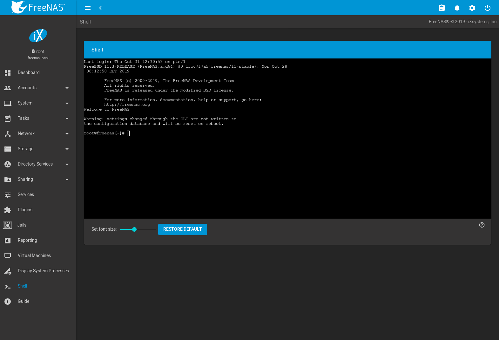
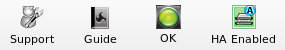

.. _Additional Options:

Additional Options
==================

This section covers the remaining miscellaneous options available from
the %brand% graphical administrative interface.

.. index:: Processes

.. _Display System Processes:

Display System Processes
------------------------

Clicking :guilabel:`Display System Processes` opens a screen showing
the output of
`top(1) <https://www.freebsd.org/cgi/man.cgi?query=top>`__.
An example is shown in
:numref:`Figure %s <process>`.

.. _process:

.. figure:: images/process.png

   System Processes Running on %brand%

The display automatically refreshes itself. Click the :guilabel:`X` in
the upper right corner to close the display when finished. This
display is read-only, so it is not possible to give a :command:`kill`
command in it.

.. index:: Shell

.. _Shell:

Shell
-----

The %brand% GUI provides a web shell, making it convenient to run
command line tools from the web browser as the *root* user. The link
to Shell is the fourth entry from the bottom of the menu tree. In
:numref:`Figure %s <web_shell_fig>`,
the link has been clicked and Shell is open.

.. _web_shell_fig:

   Web Shell

The prompt indicates that the current user is *root*, the hostname is
*truenas*, and the current working directory is :file:`~`
(*root*'s home directory).

To change the size of the shell, click the *80x25* drop-down menu and
select a different size.

To copy text from shell, highlight the text, right-click, and select
Copy from the right-click menu. To paste into the shell, click the
:guilabel:`Paste` button, paste the text into the box that opens, and
click the :guilabel:`OK` button to complete the paste operation.

While you are in Shell, you will not have access to any of the other
GUI menus. If you need to have access to a prompt while using the GUI
menus, use :command:`tmux` instead as it supports multiple shell
sessions and the detachment and reattachment of sessions.

Shell provides history (use your up arrow to see previously entered
commands and press :kbd:`Enter` to repeat the currently displayed
command) and tab completion (type a few letters and press tab to
complete a command name or filename in the current directory). When
you are finished using Shell, type
:command:`exit` to leave the session.

.. note:: Not all of Shell's features render correctly in Chrome.
   Firefox is the recommended browser for using Shell.

Most FreeBSD command line utilities are available in Shell.

.. index:: Log Out
.. _Log Out:

Log Out
-------

Click the :guilabel:`Log Out` entry in the tree to log out of the
%brand% GUI. This causes an immediate logout. A message is displayed
with a link to log back in.

.. index:: Reboot

.. _Reboot:

Reboot
------

Click :guilabel:`Reboot` shows the warning message in
:numref:`Figure %s <reboot1>`.
The browser window background color changes to red to indicate that
this option can negatively impact users of the %brand% system.

.. _reboot1:

.. figure:: images/reboot.png

   Reboot Warning Message

If a scrub or resilver is in progress when a reboot is requested, an
additional warning asks if you wish to proceed. In this case, it is
recommended to :guilabel:`Cancel` the reboot request and to
periodically run :command:`zpool status` from `Shell`_
until it is verified that the scrub or resilver process is complete.
Once complete, the reboot request can be re-issued.

Click the :guilabel:`Cancel` button to cancel the reboot request.
Otherwise, click the :guilabel:`Reboot` button to reboot the system.
Rebooting the system disconnects all clients, including the web
administration GUI. The URL in the web browser changes, adding
:literal:`/system/reboot/` to the end of the IP address. Wait a few
minutes for the system to boot, then use the browser's Back button to
return to the %brand% system's IP address and display the GUI login
screen. If the login screen does not appear, access the system using
IPMI to determine if a problem is preventing the system from resuming
normal operation.

.. index:: Shutdown

.. _Shutdown:

Shutdown
--------

Clicking :guilabel:`Shutdown` shows the warning message in
:numref:`Figure %s <shutdown1>`.
The browser window background color changes to red to indicate that
this is an option that will negatively impact users of the %brand%
system.

.. _shutdown1:

.. figure:: images/shutdown.png

   Shutdown Warning Message

If a scrub or resilver is in progress when a shutdown is requested, an
additional warning will ask for confirmation to proceed. In this case,
it is recommended to :guilabel:`Cancel` the shutdown request and to
periodically run :command:`zpool status` from `Shell`_ until it is
verified that the scrub or resilver process is complete. Once
complete, the shutdown request can be re-issued.

On High Availability (HA) systems with :ref:`Failover`, an additional
checkbox is provided to shut down the standby node.

Click the :guilabel:`Cancel` button to cancel the shutdown request.
Otherwise, click the :guilabel:`Shutdown` button to halt the system.
Shutting down the system will disconnect all clients, including the
web administration GUI, and will power off the %brand% system.

.. index:: Support

.. _Support Icon:

Support Icon
------------

The :guilabel:`Support` icon, the first icon on the right side of the
menubar, provides a shortcut to
:menuselection:`System --> Support`.
This screen can be used to verify the system license or to create a
support ticket. Refer to :ref:`Support` for detailed usage
instructions.

.. index:: Guide

.. _Guide:

Guide
-----

The :guilabel:`Guide` icon, the second icon in the top menubar,
links to the online version of the %brand% User
Guide (this documentation).

   User Guide Menu

#include snippets/alertevents.rst
