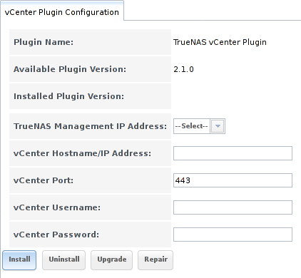

.. index:: vCenter Plugin
.. _vCenter Plugin:

vCenter Plugin
==============

The %brand% vCenter Plugin integrates the control and operation of
%brand% into
`VMware vCenter Server
<https://www.vmware.com/products/vcenter-server>`__.

New Features in 2.1.0
---------------------

* Advanced provisioning

* Datastore snapshot management

* LUN management

* ZFS pool management

* ZFS pool heath status

* Role base access control

.. note:: The current vCenter plugin works with versions of vCenter up
   to vCenter 6.

Configuration
-------------

Click :guilabel:`vCenter` to open the plugin configuration screen
shown in
:numref:`Figure %s <vcenter1>`.

.. _vcenter1:

   Configuring the vCenter Plugin

:numref:`Table %s <vcenter_options_tab>`
lists the options on this screen.

.. tabularcolumns:: |>{\RaggedRight}p{\dimexpr 0.25\linewidth-2\tabcolsep}
                    |>{\RaggedRight}p{\dimexpr 0.12\linewidth-2\tabcolsep}
                    |>{\RaggedRight}p{\dimexpr 0.63\linewidth-2\tabcolsep}|

.. _vcenter_options_tab:

.. table:: vCenter Plugin Options
   :class: longtable

   +-------------------------------+----------------+----------------------------------------------------------------------------------+
   | Setting                       | Value          | Description                                                                      |
   |                               |                |                                                                                  |
   +===============================+================+==================================================================================+
   | TrueNAS Management IP Address | drop-down menu | select the CARP address of the %brand% system                                    |
   |                               |                |                                                                                  |
   +-------------------------------+----------------+----------------------------------------------------------------------------------+
   | vCenter Hostname/IP Address   | string         | the IP address or resolveable hostname of the vCenter Server                     |
   |                               |                |                                                                                  |
   +-------------------------------+----------------+----------------------------------------------------------------------------------+
   | vCenter Port                  | integer        | the port number on which the vCenter Server is listening                         |
   |                               |                |                                                                                  |
   +-------------------------------+----------------+----------------------------------------------------------------------------------+
   | vCenter Username              | string         | the username for the vCenter Server                                              |
   |                               |                |                                                                                  |
   +-------------------------------+----------------+----------------------------------------------------------------------------------+
   | vCenter Password              | string         | the password associated with *vCenter Username*                                  |
   |                               |                |                                                                                  |
   +-------------------------------+----------------+----------------------------------------------------------------------------------+

Enter the information, then click the :guilabel:`Install` button to
add the %brand% system as an object in vCenter Server. From vCenter
Server, click the object to create its datastores.

In addition to the :guilabel:`Install` button, these buttons are
available:

**Uninstall:** click to remove the %brand% object from vCenter Server.

**Upgrade:** as more features are added to the vCenter plugin, the
:guilabel:`Available Plugin Version` number will be incremented. Click
this button to upgrade to the newer version and access its features.

**Repair:** click this button if your iXsystems support engineer
requests it. This reinstalls the %brand% object to repair a corrupted
object.

.. note:: In a HA-configured scenario, the :guilabel:`Upgrade` button
   can only be used from the system that originally installed the
   plugin. The :guilabel:`Upgrade` button is grayed out on the other
   system in the HA pair.

Secure Connections
------------------

The vCenter plugin can be configured for a secure connection by
clicking
:menuselection:`vCenter --> vCenter Auxiliary Settings`
in the left tree. In the screen shown in
:numref:`Figure %s <vcenter2>`, check the
:guilabel:`Enable vCenter Plugin over https` box.

.. _vcenter2:

.. figure:: images/vcenter2.png

   Securing the vCenter Plugin Connection

