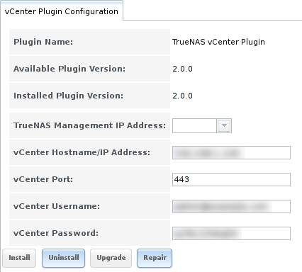

.. index:: vCenter
.. _vCenter:

vCenter
=======

Administrators who use
`VMware vCenter Server
<https://www.vmware.com/products/vcenter-server>`_
to administer their vSphere environments can use the %brand% vCenter
plugin to manage their %brand% array from vCenter Server.

.. note:: At this time, the vCenter plugin only supports the creation
   of iSCSI and NFS datastores from vCenter Server.

.. note:: The current vCenter plugin works with versions of vCenter up
   to vCenter 6.

To configure the vCenter plugin, click :guilabel:`vCenter`. This opens
the screen shown in
:numref:`Figure %s <vcenter1>`.

.. _vcenter1:

   Configuring the vCenter Plugin

:numref:`Table %s <vcenter_options_tab>`
summarizes the options in this screen.

.. tabularcolumns:: |>{\RaggedRight}p{\dimexpr 0.25\linewidth-2\tabcolsep}
                    |>{\RaggedRight}p{\dimexpr 0.12\linewidth-2\tabcolsep}
                    |>{\RaggedRight}p{\dimexpr 0.63\linewidth-2\tabcolsep}|

.. _vcenter_options_tab:

.. table:: vCenter Plugin Options
   :class: longtable

   +-------------------------------+----------------+---------------------------------------------------------------------------------------------------------------------------------------+
   | Setting                       | Value          | Description                                                                                                                           |
   |                               |                |                                                                                                                                       |
   +===============================+================+=======================================================================================================================================+
   | TrueNAS Management IP Address | drop-down menu | select the CARP address of the TrueNAS system                                                                                         |
   |                               |                |                                                                                                                                       |
   +-------------------------------+----------------+---------------------------------------------------------------------------------------------------------------------------------------+
   | vCenter Hostname/IP Address   | string         | input the IP address or resolveable hostname of the vCenter Server                                                                    |
   |                               |                |                                                                                                                                       |
   +-------------------------------+----------------+---------------------------------------------------------------------------------------------------------------------------------------+
   | vCenter Port                  | integer        | input the port number the vCenter Server is listening on                                                                              |
   |                               |                |                                                                                                                                       |
   +-------------------------------+----------------+---------------------------------------------------------------------------------------------------------------------------------------+
   | vCenter Username              | string         | input the username for the vCenter Server                                                                                             |
   |                               |                |                                                                                                                                       |
   +-------------------------------+----------------+---------------------------------------------------------------------------------------------------------------------------------------+
   | vCenter Password              | string         | input the password associated with *vCenter Username*                                                                                 |
   |                               |                |                                                                                                                                       |
   +-------------------------------+----------------+---------------------------------------------------------------------------------------------------------------------------------------+

Enter the information, then click the :guilabel:`Install` button to
add the %brand% system as an object in vCenter Server. From vCenter
Server, click the object to create its datastores.

In addition to the :guilabel:`Install` button, these buttons are
available:

**Uninstall:** click to remove the %brand% object from vCenter Server.

**Upgrade:** as more features are added to the vCenter plugin, the
:guilabel:`Available Plugin Version` number will be incremented. Click
this button to upgrade to the newer version and access its features.

**Repair:** click this button if your iXsystems support engineer
requests it. This reinstalls the %brand% object to repair a corrupted
object.

.. note:: In a HA-configured scenario, the :guilabel:`Upgrade` button
   can only be used from the system that originally installed the
   plugin. The :guilabel:`Upgrade` button is grayed out on the other
   system in the HA pair.

To configure the vCenter plugin for a secure connection, click
:menuselection:`vCenter --> vCenter Auxiliary Settings`
in the left tree. In the screen shown in
:numref:`Figure %s <vcenter2>`, check the
:guilabel:`Enable vCenter Plugin over https` box.

.. _vcenter2:

.. figure:: images/vcenter2.png

   Securing the vCenter Plugin Connection
