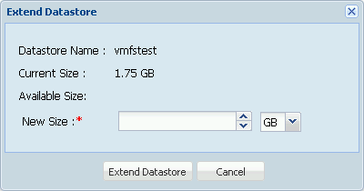

.. index:: vCenter Plugin
.. _vCenter Plugin:

vCenter Plugin
==============

The %brand% vCenter Plugin integrates the control and operation of
%brand% into
`VMware vCenter Server
<https://www.vmware.com/products/vcenter-server>`_.

New Features in 2.1.0
---------------------

* Advanced provisioning

* Datastore snapshot management

* LUN management

* ZFS pool management

* ZFS pool heath status

* Role base access control

.. note:: The current vCenter plugin works with versions of vCenter up
   to vCenter 6.

Configuration
-------------

Click :guilabel:`vCenter` to open the plugin configuration screen
shown in
:numref:`Figure %s <vcenter_plugin_config_fig>`.

.. _vcenter_plugin_config_fig:

.. figure:: images/tn_vcenter-plugin-config.png

   Configuring the vCenter Plugin

:numref:`Table %s <vcenter_options_tab>`
lists the options on this screen.

.. tabularcolumns:: |>{\RaggedRight}p{\dimexpr 0.25\linewidth-2\tabcolsep}
                    |>{\RaggedRight}p{\dimexpr 0.12\linewidth-2\tabcolsep}
                    |>{\RaggedRight}p{\dimexpr 0.63\linewidth-2\tabcolsep}|

.. _vcenter_options_tab:

.. table:: vCenter Plugin Options
   :class: longtable

   +---------------------+-----------+--------------------------------+
   | Setting             | Value     | Description                    |
   |                     |           |                                |
   +=====================+===========+================================+
   | TrueNAS Management  | drop-down | select the CARP address of the |
   | IP Address          | menu      | %brand% system                 |
   |                     |           |                                |
   +---------------------+-----------+--------------------------------+
   | vCenter             | string    | the IP address or resolveable  |
   | Hostname/IP Address |           | hostname of the vCenter Server |
   |                     |           |                                |
   +---------------------+-----------+--------------------------------+
   | vCenter Port        | integer   | the port number on which the   |
   |                     |           | vCenter Server is listening    |
   |                     |           |                                |
   +---------------------+-----------+--------------------------------+
   | vCenter Username    | string    | the username for the vCenter   |
   |                     |           | Server                         |
   |                     |           |                                |
   +---------------------+-----------+--------------------------------+
   | vCenter Password    | string    | the password associated with   |
   |                     |           | *vCenter Username*             |
   |                     |           |                                |
   +---------------------+-----------+--------------------------------+

Enter the information, then click the :guilabel:`Install` button to
add the %brand% system as an object in vCenter Server. From vCenter
Server, click the object to create its datastores.

In addition to the :guilabel:`Install` button, these buttons are
available:

**Uninstall:** click to remove the %brand% object from vCenter Server.

**Upgrade:** as more features are added to the vCenter plugin, the
:guilabel:`Available Plugin Version` number is incremented. Click this
button to upgrade to the newer version.

**Repair:** click this button at the request of an iXsystems support
engineer. This reinstalls the %brand% object to repair a corrupted
object.

.. note:: In an HA-configured scenario, the :guilabel:`Upgrade` button
   is only usable from the system that originally installed the
   plugin. The :guilabel:`Upgrade` button is disabled out on the HA
   paired system.

Secure Connections
------------------

The vCenter plugin can be configured for a secure connection by
clicking
:menuselection:`vCenter --> vCenter Auxiliary Settings`
in the left tree. In the secure connection screen shown in
:numref:`Figure %s <vcenter_secure_fig>`, check the
:guilabel:`Enable vCenter Plugin over https` box.

.. _vcenter_secure_fig:

.. figure:: images/tn_vcenter-plugin-secure.png

   Securing the vCenter Plugin Connection

Using the vCenter Plugin
------------------------

From the main vSphere window, click
:guilabel:`vCenter Inventory Lists`, then click
:guilabel:`TrueNAS Hosts` and :guilabel:`TrueNAS` to see the list of
defined %brand% hosts.

.. index:: vCenter Hosts
.. _vCenter Hosts:

Hosts
-----

The %brand% hosts are listed on this screen.  New hosts can be added
by clicking the :guilabel:`+` button. Enter the new %brand% host IP
address, username, and password of that host to add it to the list of
hosts managed by vCenter.
:numref:`Figure %s <vcenter_new_host_fig>`
shows the :guilabel:`Add New Host` window.

.. _vcenter_new_host_fig:

.. figure:: images/tn_vcenter-newhost.png

   Adding a New %brand% Host

After a %brand% host has been added, click its entry in the sidebar to
view :guilabel:`Summary` and :guilabel:`Manage` options.

Host Information
~~~~~~~~~~~~~~~~

Click the :guilabel:`Summary` tab to view basic information about the
connected %brand% host. *IP* address, *Version*, *Storage Sizes*, and
status of additional features like *NFS* and *HA* are provided.

Manage Host
~~~~~~~~~~~

Click the :guilabel:`Manage` tab to view a number of options to modify
a %brand% host. Each option displays related modification buttons and,
except for the :guilabel:`TrueNAS Configuration` option, a table that
shows existing configurations. Highlight a table header and click the
drop-down menu to sort the table or choose which columns to display.

.. index:: vCenter Datastores
.. _vCenter Datastores:

Datastores
----------

The vCenter plugin can create VMFS datastores on %brand% hosts for
iSCSI block-level access, or NFS datastores for file-level access.

VMFS Datastores
~~~~~~~~~~~~~~~

VMFS datastores provide block-level (iSCSI) storage for virtual
machines.

Creating VMFS Datastores
^^^^^^^^^^^^^^^^^^^^^^^^

Select the :guilabel:`Datastore` tab, then click the :guilabel:`+`
button to create a datastore. Select the ESXi host on which the
datastore is to be available, as shown in
:numref:`Figure %s <vcenter_datastore_host_select_fig>`, then click
:guilabel:`Next`.

.. _vcenter_datastore_host_select_fig:

.. figure:: images/tn_vcenter-datastore-create-hostselection.png

   Choosing an ESXi Host

Select :guilabel:`VMFS` as the datastore type and click
:guilabel:`Next`.
:numref:`Figure %s <vcenter_datastore_vmfs_config_fig>`
shows the configuration screen for the new datastore:

.. _vcenter_datastore_vmfs_config_fig:

.. figure:: images/tn_vcenter-datastore-vmfs-config.png

   Configuring a VMFS Datastore

Enter a name for the new datastore and the desired size. Enter the IP
address of the %brand% system in the :guilabel:`Data Path IP` box.
Select the desired :guilabel:`VMFS Version` from the drop-down. If a
:guilabel:`Sparse Volume` is desired, check the box.

Select the %brand% volume on which to create the datastore, then click
:guilabel:`Next`.
:numref:`Figure %s <vcenter_datastore_vmfs_confirm_fig>`
shows the final summary screen:

.. _vcenter_datastore_vmfs_confirm_fig:

.. figure:: images/tn_vcenter-datastore-confirm-vmfs.png

   Finish Creating the Datastore

Click :guilabel:`Finish` to create the datastore. The datastore may
not be immediately visible in the list of datastores. The
:guilabel:`Refresh` button refresh the list contents to show new
datastores.

Extending VMFS Datastores
^^^^^^^^^^^^^^^^^^^^^^^^^

Highlight a VMFS datastore from the list, then click the
:guilabel:`Edit` button to begin extending the datastore.
:numref:`Figure %s <vcenter_datastore_extend_fig>` shows the
:guilabel:`Extend Datastore` window.

.. _vcenter_datastore_extend_fig:

   Extending a Datastore

Choose a new size for the datastore, then click
:guilabel:`Extend Datastore`. A pop-up window appears, showing the
system is extending the datastore.

.. note:: A datastore uses some of the space internally, resulting
   in the available capacity being slightly less than the amount
   chosen.

NFS Datastores
~~~~~~~~~~~~~~

NFS datastores provide file-level storage access.

Creating NFS Datastores
^^^^^^^^^^^^^^^^^^^^^^^

Select the :guilabel:`Datastore` tab, then click the :guilabel:`+`
button to create a datastore. Select the
:ref:`ESXi host <vcenter_datastore_host_select_fig>` on which the
datastore is to be available. Click :guilabel:`Next`.

Select :guilabel:`NFS` as the datastore type, then click
:guilabel:`Next`.
:numref:`Figure %s <vcenter_datastore_config_nfs_fig>`
shows the configuration window for the new NFS datastore.

.. _vcenter_datastore_config_nfs_fig:

.. figure:: images/tn_vcenter-datastore-config-nfs.png

   Configuring an NFS Datastore

Enter a name for the new datastore.  Enter the IP address of the
%brand% system in the :guilabel:`Data Path IP` box. The path to
the NFS share on the %brand% system is entered in the
:guilabel:`Mount Share Path` box. Click :guilabel:`Next`.

.. _vcenter_datastore_confirm_nfs_fig:

.. figure:: images/tn_vcenter-datastore-confirm-nfs.png

   New NFS Datastore Summary

The summary screen in
:numref:`Figure %s <vcenter_datastore_confirm_nfs_fig>` is shown. Click
:guilabel:`Finish` to create the datastore. The datastore might not be
immediately visible in the list of datastores. Click the
:guilabel:`Refresh` button to refresh the list contents.

Cloning Datastores
~~~~~~~~~~~~~~~~~~

A datastore of either type can be cloned by selecting it in the list
of datastores, then clicking the :guilabel:`Clone` button. Select the
ESXi host on which the datastore is to be available. Click
:guilabel:`Next` to see the window shown in
:numref:`Figure %s <vcenter_datastore_clone_fig>`.

.. _vcenter_datastore_clone_fig:

.. figure:: images/tn_vcenter-datastore-clone.png

   Creating a Datastore Clone

Type a name for the clone datastore and click
:guilabel:`Clone Datastore`. A pop-up displays when cloning begins.
The new clone datastore may not be immediately visible. Click the
:guilabel:`Refresh` button to refresh the list contents.

Snapshotting a Datastore
~~~~~~~~~~~~~~~~~~~~~~~~

Highlight a datastore from the list and click the
:guilabel:`Create Snapshot` button to snapshot that datastore. Type a
name for the snapshot and click :guilabel:`Create` to create the new
snapshot. The new snapshot is added to the :guilabel:`Snapshot` tab,
separate from the :guilabel:`Datastore` tab.

.. index:: vCenter Snapshots
.. _vCenter Snapshots:

Snapshots
---------

See the :ref:`Snapshots` section for more details about creating and
managing snapshots directly on the %brand% system.

Available snapshots are listed in this tab.
:numref:`Figure %s <vcenter_snapshot_manage_fig>` shows an example.

.. _vcenter_snapshot_manage_fig:

.. figure:: images/tn_vcenter-snapshot-manage.png

   Managing Snapshots

Buttons to :guilabel:`Revert` and :guilabel:`Delete` snapshots are
available.

:guilabel:`Revert` returns a datastore to the state saved by the
selected snapshot. When choosing a snapshot, be sure it is associated
with the proper datastore. Click :guilabel:`Revert` and confirm this
is correct by clicking :guilabel:`Yes` in the window that appears. The
system then rolls the datastore back to the state saved in the
snapshot.

.. index:: vCenter Periodic Snapshots
.. _vCenter Periodic Snapshots:

Scheduling: Periodic Snapshots
~~~~~~~~~~~~~~~~~~~~~~~~~~~~~~

See the :ref:`Periodic Snapshot Tasks` section for more details about
native %brand% periodic snapshots.

The :guilabel:`Scheduling` tab is used to :guilabel:`Create`,
:guilabel:`Edit`, and :guilabel:`Delete` periodic snapshot schedules.

Click the :guilabel:`+` button to begin creating a new snapshot
schedule, as shown in
:numref:`Figure %s <vcenter_new_periodic_snapshot_fig>`.

.. _vcenter_new_periodic_snapshot_fig:

.. figure:: images/tn_vcenter-new-periodic-snapshot.png

   Creating a New Periodic Snapshot Task

The *Datastore*, *Lifetime*, *Begin*, *End*, *Interval*, and
*Weekdays* options must be configured before the schedule can be
saved.

.. note:: For detailed descriptions of each option, see the
   :ref:`Periodic Snapshot Options <zfs_periodic_snapshot_opts_tab>`
   table.

When satisfied with the configuration, click :guilabel:`OK` to save
the schedule and add it to the list. If the new schedule is not
immediately visible, click the :guilabel:`Refresh` button to
repopulate the list of saved schedules.

Select a schedule from the list and click :guilabel:`Edit` to open the
configuration window for that schedule. Make any needed adjustments,
then click :guilabel:`Save` to save the updated schedule.

.. index:: vCenter Replication
.. _vCenter Replication:

Replication
-----------

The :ref:`Replication Tasks` section shows examples of different
replication configurations. Refer to this section for more general
details about creating and modifying replications.

.. note:: A periodic snapshot task must be available before creating a
   new replication task.

Click the :guilabel:`+` button to open the
:guilabel:`Create Replication` window, as shown in
:numref:`Figure %s <vcenter_replication_create_fig>`.

.. _vcenter_replication_create_fig:

.. figure:: images/tn_vcenter-replication-create.png

   Create a new replication schedule

The *Datastore*, *Remote Datastore*, *Replication Stream Compression*,
*Limit (KB/s)*, *Begin*, *End*, *Remote Hostname*,
*Encryption Cipher*, and *Remote Host Key* options must be set to
create a replication.

.. note:: For detailed descriptions of each option, see
   :ref:`Replication Task Options
   <zfs_add_replication_task_opts_tab>`.

Instructions for obtaining the :guilabel:`Remote Host Key` are shown
in :ref:`Encryption Keys <zfs_copy_replication_key_fig>`.

Click :guilabel:`Ok` to save the new replication schedule and add it
to the list. If the task does not appear in the list, click the
:guilabel:`Refresh` button.

Select an existing replication from the list and click
:guilabel:`Edit` to modify the replication. Editing a replication
provides the same options as :ref:`creating a replication
<vcenter_replication_create_fig>`. Make any adjustments to the
replication configuration and click :guilabel:`OK` to save the new
settings.

.. index:: vCenter Zvols
.. _vCenter Zvols:

Zvols
-----

A :ref:`zvol <Create zvol>` is a raw block device over ZFS.

In the vCenter :guilabel:`ZVol` tab, click the :guilabel:`+` button
to begin creating a new zvol.
:numref:`Figure %s <vcenter_zvol_create_fig>`
shows the :guilabel:`Create ZVol` window.

.. _vcenter_zvol_create_fig:

.. figure:: images/tn_vcenter-zvol-create.png

   Create a new zvol

Select a volume from the drop-down menu. Type a name for the new zvol.
Adjust the size of the zvol with the :guilabel:`arrow` buttons and
:guilabel:`Size` drop menu. If desired, check :guilabel:`Sparse` to
activate thin provisioning.

.. warning:: Be careful when using :guilabel:`Sparse`. Thin
   provisioning can cause writes to fail when the pool is low on
   space.

Click :guilabel:`Ok` to save the configuration and begin creating the
new zvol. Click the :guilabel:`Refresh` button to repopulate the list
and see the new zvol.

Select a zvol from the list and click the :guilabel:`Edit` button to
change the size of an existing zvol. As
:numref:`Figure %s <vcenter_zvol_edit_fig>`
shows, the only parameter that can be modified for an existing zvol is
size.

.. _vcenter_zvol_edit_fig:

.. figure:: images/tn_vcenter-zvol-edit.png

   Edit a Zvol

Adjust the size of the ZVol and click :guilabel:`OK` to save any
changes.

.. index:: vCenter iSCSI Functions
.. _vCenter iSCSI Functions:

iSCSI Functions
---------------

iSCSI is a protocol standard for the consolidation of storage data.
Refer to :ref:`Block (iSCSI)` for more details about this standard.
This section describes configuring :ref:`Targets`, :ref:`Extents`, and
:ref:`Associated Targets <Target/Extents>` from the vCenter plugin.

Targets
~~~~~~~

Click the :guilabel:`+` button to begin creating a new
:ref:`target <Targets>`. The :guilabel:`Add Target` window opens,
as shown in
:numref:`Figure %s <vcenter_target_create_fig>`:

.. _vcenter_target_create_fig:

.. figure:: images/tn_vcenter-target-create.png

   Creating a Target

Type a target name. If desired, an alias for the target can also be
provided. Choose a :guilabel:`Portal Group ID` and
:guilabel:`Initiator Group ID` from the pulldown menus. Click
:guilabel:`OK` to save and add the new target to the list. If not
immediately visible, click the :guilabel:`Refresh` button to
repopulate the list of targets.

Highlight an existing target and click the :guilabel:`Edit` button to
open the :guilabel:`Edit Target` window, shown in
:numref:`Figure %s <vcenter_target_edit_fig>`.

.. _vcenter_target_edit_fig:

.. figure:: images/tn_vcenter-target-edit.png

   Editing a Target

The current settings are displayed. Modify the values as needed, then
click :guilabel:`OK` to save the new settings.

Extents
~~~~~~~

.. note:: The vCenter plugin only supports creating *device/disk*
   extents.

Click the :guilabel:`+` button to begin creating a new
:ref:`extent <Extents>`.
:numref:`Figure %s <vcenter_extent_create_fig>`
shows the :guilabel:`Create Extent` window.

.. _vcenter_extent_create_fig:

.. figure:: images/tn_vcenter-extent-create.png

   Creating a new extent

The *Extent Name*, *Extent Type*, *Serial*, *Device*, *Logical Block*
*Size*, *Available Space Threshold*, and *LUN RPM* options must be set
before the extent can be created.

.. note:: Detailed explanations of each option are available in
   :ref:`Extent Configuration Settings <iscsi_extent_conf_tab>`.

Click :guilabel:`OK` to save the settings and begin creating the
extent. Enter the data, then click the :guilabel:`Refresh` button to
repopulate the list of extents.

Highlight an extent in the list and click :guilabel:`Edit`. The
:guilabel:`Edit Extent` window opens, which is the same as
:ref:`Create Extent <vcenter_extent_create_fig>`, but populated with the
current extent settings. Make any changes to the options, then click
:guilabel:`OK` to save the new configuration.

Associated Targets
~~~~~~~~~~~~~~~~~~

The :ref:`Target/Extents` section details the process of associating
an extent with a target. vCenter requires previously created targets
and extents before a new associated target can be created.

Click the :guilabel:`+` button to open the
:guilabel:`Add Target/Extent` window. Using the drop-down menus,
choose a target and extent to associate. It is recommended to leave
the :guilabel:`LUN ID` set to *Auto*, but values from *0*-*24* are
available.

Click :guilabel:`OK` to save the new associated target. The system may
take some time to create the association. Click the
:guilabel:`Refresh` button after a few moments to verify the new
associated target.

Highlight an entry in the list and click the :guilabel:`Edit` button.
The :guilabel:`Target/Extent` window appears, which allows
modification of the *Target*, *Extent*, and *LUN ID*. Click
:guilabel:`OK` to save any changes.

.. index:: vCenter Role-Based Access Control (RBAC)
.. _vCenter Role-Based Access Control (RBAC):

Role-Based Access Control (RBAC)
--------------------------------

An administrator can grant vCenter users specific role-based access
to a %brand% system. The roles are listed in

.. tabularcolumns:: |>{\RaggedRight}p{\dimexpr 0.25\linewidth-2\tabcolsep}
                    |>{\RaggedRight}p{\dimexpr 0.75\linewidth-2\tabcolsep}|

.. _vcenter_roles_tab:

.. table:: Roles
   :class: longtable

   +---------------------+-------------------------------------------+
   | Role Name           | User is allowed to:                       |
   +=====================+===========================================+
   | Discovery           | Add storage systems                       |
   +---------------------+-------------------------------------------+
   | Create Clones       | Clone virtual machines                    |
   +---------------------+-------------------------------------------+
   | Create Storage      | Create and provision storage              |
   +---------------------+-------------------------------------------+
   | Modify Storage      | Modify storage                            |
   +---------------------+-------------------------------------------+
   | Destroy Storage     | Destroy storage                           |
   +---------------------+-------------------------------------------+

Each role gives the user the ability to perform the functions in not
just that role, but all of the roles that precede it in the list. For
example, a user with a *Create Storage* role can create storage, but
can also do *Discovery* and *Create Clones*. The vCenter administrator
can perform all of these operations by default.

.. note:: The vCenter plugin :guilabel:`RBAC` tab cannot create new
   vCenter users. That must be done from vCenter
   :guilabel:`Administration`. Hover over the
   :guilabel:`House + lines` icon on the top section of the window to
   view a drop-down menu of links. Click :guilabel:`Home`. From the
   :guilabel:`Home` menu, navigate from
   :menuselection:`Administration -->  Single Sign-On`
   and click :guilabel:`Users and Groups`. In the :guilabel:`Users`
   tab, click the :guilabel:`+` button to open the
   :guilabel:`New User` window. Enter a user name and password
   (twice) in the related fields. Optional fields can further describe
   the user, including first and last name and an email address for
   the account. Click :guilabel:`OK` to create the new user.

Add a Role to an Existing vCenter User
~~~~~~~~~~~~~~~~~~~~~~~~~~~~~~~~~~~~~~

Click the :guilabel:`+` button to open the
:guilabel:`Add Role Based Access Control` window. Type a user name
in the form :samp:`{DOMAIN.NAME}\\{username}`. Click the
:guilabel:`Assign Role` drop-down menu and choose a role for the user.
Click :guilabel:`Add` to add the associated user and role to the list.
If the entry does not appear immediately, click the
:guilabel:`Refresh` button to repopulate the list.

Highlight an entry in the list and click the :guilabel:`Edit` button.
The :guilabel:`Edit` window opens, and the entry can be edited. Click
the :guilabel:`Save` button to save any changes. Changes may take a
moment to redraw. Click the :guilabel:`Refresh` button to repopulate
the list.

.. index:: vCenter Configuration Duplication
.. _vCenter Configuration Duplication:

Configuration Duplication
-------------------------

The :guilabel:`TrueNAS Configuration` tab is used to duplicate some of
the current %brand% system's settings to another system.

.. note:: Currently, only iSCSI targets are duplicated on the
   destination system.

Type the IP address of the system to receive the current %brand%
systems's configuration. Provide a valid user name and password from
the destination system. Click :guilabel:`Submit` to begin duplicating
the %brand% configuration to the destination system. This process may
take some time. A popup window indicates when the task is complete.
