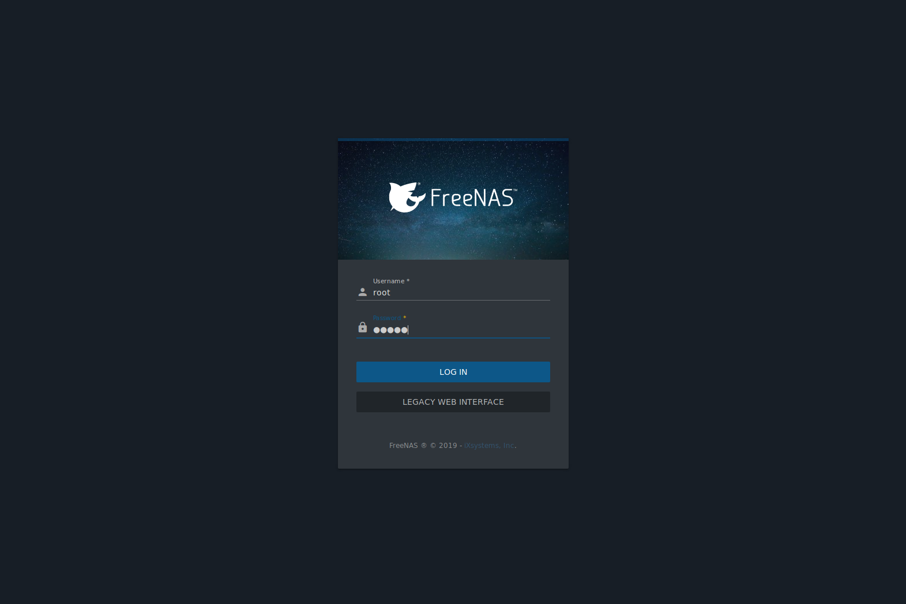
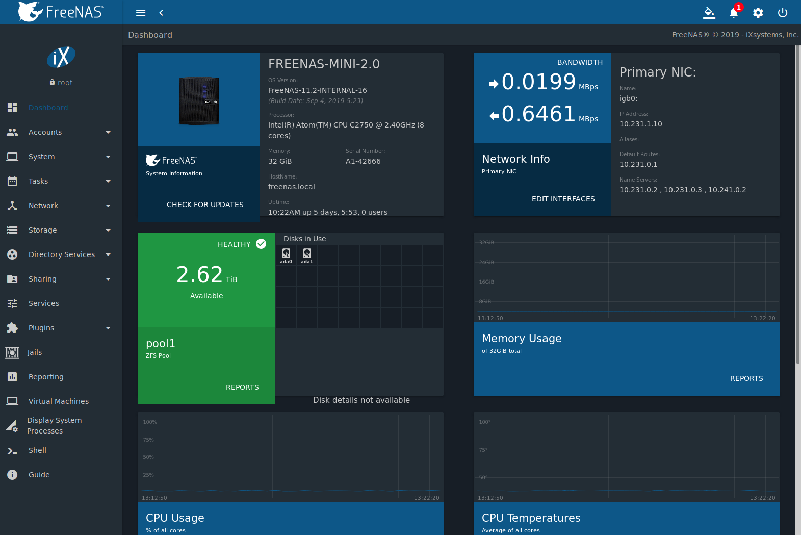

.. index:: GUI Access, Web Interface
.. _Accessing the Web Interface:

Accessing the |Web-UI|
======================

For |enterprise| Storage Array customers, the IP address of the
%brand% graphical |web-ui| is provided on the sales order or
configuration sheet. Please :ref:`contact iX Support
<Contacting iXsystems>` if the %brand% |web-ui| IP address has not
been provided with these documents or cannot be identified from the
%brand% system console.

On a computer that can access the same network as the %brand% system,
enter the IP address in a web browser to connect to the |web-ui|. The
password for the root user is requested.

.. _login_fig:

   Login Screen

Enter the password chosen during the |core| installation. A prompt is
shown to set a root password if it was not set during installation.

The |web-ui| is displayed after login:

|enterprise| :ref:`High Availability (HA) <Failover>` status and
information about the |ctrlr-term-active| is displayed on the login
screen. Log in with:

* :guilabel:`Username`: :samp:`root`

* :guilabel:`Password`: :samp:`{abcd1234}`

.. note:: The default *root* password can be changed to a more
   secure value by going to
   :menuselection:`Accounts --> Users`.
   Expand the entry for *root* and click |ui-edit|. Enter the new
   password in the :guilabel:`Password` and :guilabel:`Confirm Password`
   fields and click :guilabel:`SAVE`. The new password is used for
   subsequent logins.

On the first login, the EULA found in :ref:`Appendix A` is displayed,
along with a box where the license key for the %brand% array can be
pasted. Read the EULA and paste in the license key. High Availability
(HA) systems must have both |ctrlrs-term-both| running before the license
key for the HA %brand% system can be entered. The key is entered on the
|ctrlr-term-active|. Click :guilabel:`OK` to save the license key and
access the |web-ui|.

.. _login_dashboard_fig:

   Dashboard

The
:menuselection:`Dashboard`
shows details about the system. These details are grouped into
sections about the hardware components, networking,
storage, and other categories.

|Web-UI| Troubleshooting
^^^^^^^^^^^^^^^^^^^^^^^^^^^^^^^^^^^^^^^^^^

If the user interface is not accessible by IP address from a browser,
check these things:

* Are proxy settings enabled in the browser configuration? If so,
  disable the settings and try connecting again.

* If the page does not load, make sure that a :command:`ping` reaches
  the %brand% system's IP address. If the address is in a private
  IP address range, it is only accessible from within that private
  network.

If the UI becomes unresponsive after an upgrade or other system operation,
clear the site data and refresh the browser.

The rest of this User Guide describes the %brand% |web-ui| in
more detail. The layout of this User Guide follows the order of the menu
items in the tree located in the left frame of the |web-ui|.

Please :ref:`contact iXsystems Support <Contacting iXsystems>` for
|enterprise| initial setup and configuration assistance.

.. warning:: It is important to use the |web-ui| or the console setup
   menu for all |enterprise| configuration changes. Do not make changes
   from the command line unless directed by an iXsystems Support
   Engineer.
