.. index:: Virtual Machines,VMs
.. _VMs:

Virtual Machines
================

A Virtual Machine (*VM*) is an environment on a host computer that
can be used as if it were a separate physical computer. VMs can be
used to run multiple operating systems simultaneously on a single
computer. Operating systems running inside a VM see emulated virtual
hardware rather than the actual hardware of the host computer. This
provides more isolation than :ref:`Jails`, although there is
additional overhead. A portion of system RAM is assigned to each VM,
and each VM uses a :ref:`zvol <Adding Zvols>` for storage. While a VM
is running, these resources are not available to the host computer or
other VMs.

%brand% VMs use the
`bhyve(8) <https://www.freebsd.org/cgi/man.cgi?query=bhyve>`__
virtual machine software. This type of virtualization requires an
Intel processor with Extended Page Tables (EPT) or an AMD processor
with Rapid Virtualization Indexing (RVI) or Nested Page Tables (NPT).

To verify that an Intel processor has the required features, use
:ref:`Shell` to run :samp:`grep VT-x /var/run/dmesg.boot`. If the
*EPT* and *UG* features are shown, this processor can be used with
*bhyve*.

To verify that an AMD processor has the required features, use
:ref:`Shell` to run :command:`grep POPCNT /var/run/dmesg.boot`. If the
output shows the POPCNT feature, this processor can be used with
*bhyve*.

.. note:: AMD K10 "Kuma" processors include POPCNT but do not support
   NRIPS, which is required for use with bhyve. Production of these
   processors ceased in 2012 or 2013.

By default, new VMs have the
`bhyve(8) <https://www.freebsd.org/cgi/man.cgi?query=bhyve>`__
:literal:`-H` option set. This causes the virtual CPU thread to yield
when a HLT instruction is detected and prevents idle VMs from consuming
all of the host CPU.

:menuselection:`Virtual Machines`
shows a list of installed virtual machines.

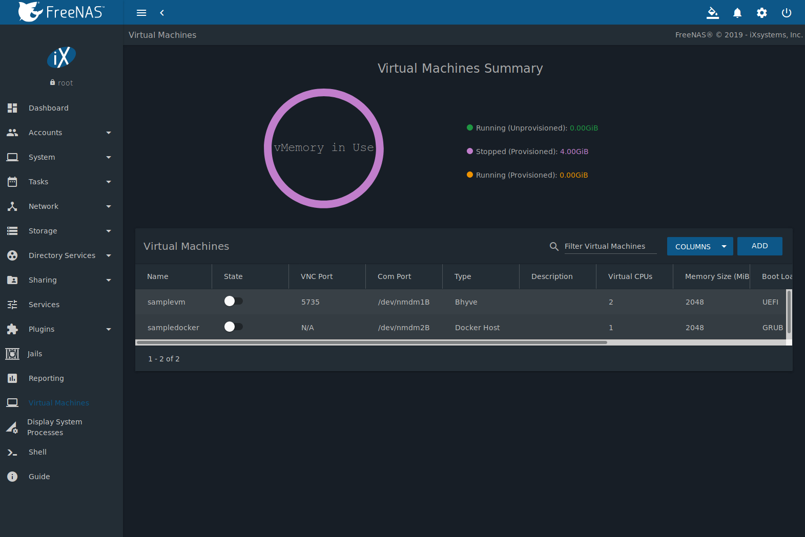

   Virtual Machines

The |ui-options| menu has options for controlling and modifying VMs:

* :guilabel:`Edit` changes VM settings.

* :guilabel:`Delete` removes the VM. :ref:`Zvols <Adding Zvols>` used in
  :ref:`disk devices <vms-disk-device>` and image files used in
  :ref:`raw file <vms-raw-file>` devices are *not* removed when a VM
  is deleted. These resources can be removed manually in
  :menuselection:`Storage --> Pools` after it is determined that the
  data in them has been backed up or is no longer needed.

* :guilabel:`Devices` is used to add, remove, or edit devices attached
  to a virtual machine.

* :guilabel:`Clone` copies the VM. The new clone has :samp:`_clone{N}`
  appended to the name, where :samp:`{N}` is the clone number.

:guilabel:`Start` boots a VM. An option is provided to
:guilabel:`Overcommit Memory`. Memory overcommitment allows multiple VMs
to be launched when there is not enough free memory for all of them to
run at the same time. This option should be used with caution. When
active, the VM :guilabel:`State` changes to :guilabel:`RUNNING`.

When a VM is :guilabel:`RUNNING`, more buttons in the |ui-options| menu
are available:

* :guilabel:`Power off` immediately halts the VM. This is equivalent
  to unplugging the power cord from a computer.

* :guilabel:`Stop` shuts down the VM.

* VMs with :guilabel:`Web Interface` enabled show a :guilabel:`VNC`
  button. VNC connections permit remote graphical access to the VM.

* :guilabel:`Serial` opens a connection to a virtual serial port on the
  VM. :file:`/dev/nmdm1B` is assigned to the first VM,
  :file:`/dev/nmdm2B` is assigned to the second VM, and so on. These
  virtual serial ports allow connections to the VM console from the
  :ref:`Shell`.

  .. tip:: The `nmdm <https://www.freebsd.org/cgi/man.cgi?query=nmdm>`__
     device is dynamically created. The actual :samp:`nmdm {XY}` name
     varies on each VM.

  To connect to the first VM, type :samp:`cu -l /dev/nmdm{1B} -s 9600`
  in the :ref:`Shell`. See
  `cu(1) <https://www.freebsd.org/cgi/man.cgi?query=cu>`__
  for more information.

.. index:: Creating VMs
.. _Creating VMs:

Creating VMs
------------

Click on :guilabel:`ACTIONS` and :guilabel:`Add VM` to open the wizard
in :numref:`Figure %s <vms_add_fig>`:

.. _vms_add_fig:

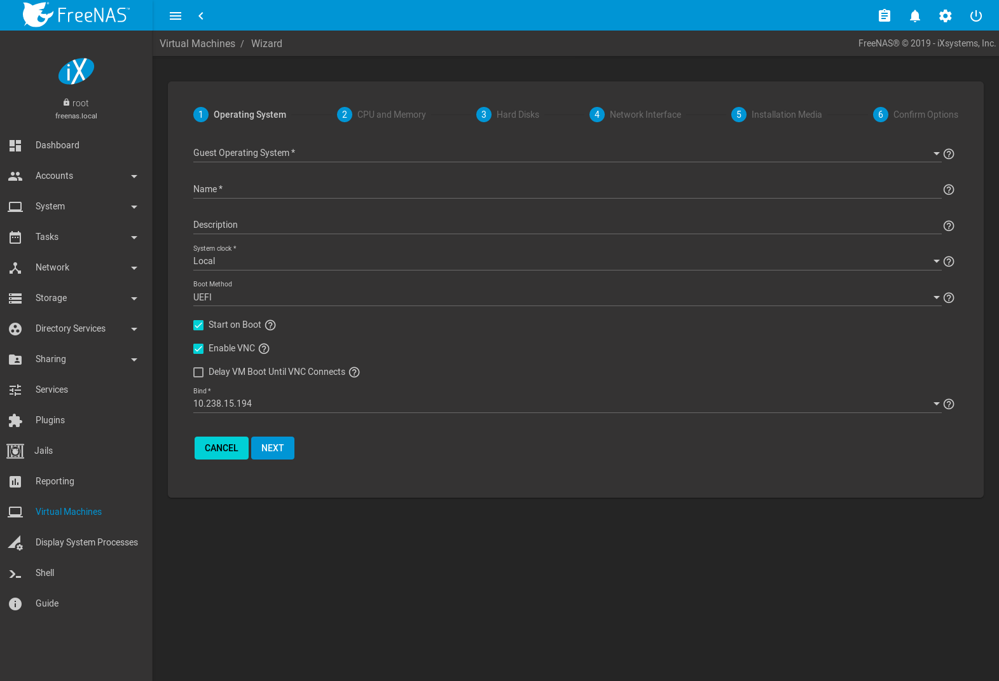

   Add VM

The configuration options are described in
:numref:`Table %s <vms_add_opts_tab>`.

.. tabularcolumns:: |>{\RaggedRight}p{\dimexpr 0.08\linewidth-2\tabcolsep}
                    |>{\RaggedRight}p{\dimexpr 0.20\linewidth-2\tabcolsep}
                    |>{\RaggedRight}p{\dimexpr 0.12\linewidth-2\tabcolsep}
                    |>{\RaggedRight}p{\dimexpr 0.60\linewidth-2\tabcolsep}|

.. _vms_add_opts_tab:

.. table:: VM Wizard Options
   :class: longtable

   +----------+--------------------+----------------+-----------------------------------------------------------------------------------------------+
   | Screen # | Setting            | Value          | Description                                                                                   |
   |          |                    |                |                                                                                               |
   +==========+====================+================+===============================================================================================+
   | 1        | Virtual Machine    | drop-down menu | Select a *Virtual Machine (VM)* or *Docker Host*.                                             |
   |          | (VM) Wizard type   |                |                                                                                               |
   +----------+--------------------+----------------+-----------------------------------------------------------------------------------------------+
   | 2        | Guest Operating    | drop-down menu | Choose the VM operating system type. Choices are: *Windows*, *Linux*, or *FreeBSD*. See       |
   |          | System             |                | `this guide <https://github.com/FreeBSD-UPB/freebsd/wiki/How-to-launch-different-guest-OS>`__ |
   |          |                    |                | for detailed instructions about using a different guest OS.                                   |
   |          |                    |                |                                                                                               |
   +----------+--------------------+----------------+-----------------------------------------------------------------------------------------------+
   | 2        | Name               | string         | Name of the VM. An error is shown if the name is already used by an existing VM.              |
   |          |                    |                |                                                                                               |
   +----------+--------------------+----------------+-----------------------------------------------------------------------------------------------+
   | 2        | Boot Method        | drop-down menu | Select *UEFI* for newer operating systems, or *UEFI-CSM* (Compatibility Support Mode) for     |
   |          |                    |                | older operating systems that only understand BIOS booting. VNC connections are only available |
   |          |                    |                | with *UEFI*.                                                                                  |
   +----------+--------------------+----------------+-----------------------------------------------------------------------------------------------+
   | 2        | Start on Boot      | checkbox       | Set to start the VM when the system boots.                                                    |
   |          |                    |                |                                                                                               |
   +----------+--------------------+----------------+-----------------------------------------------------------------------------------------------+
   | 2        | Enable VNC         | checkbox       | Add a VNC remote connection. Requires *UEFI* booting.                                         |
   |          |                    |                |                                                                                               |
   +----------+--------------------+----------------+-----------------------------------------------------------------------------------------------+
   | 3        | Virtual CPUs       | integer        | Number of virtual CPUs to allocate to the VM. The maximum is 16 unless limited by the host    |
   |          |                    |                | CPU. The VM operating system might also have operational or licensing restrictions on the     |
   |          |                    |                | number of CPUs.                                                                               |
   |          |                    |                |                                                                                               |
   +----------+--------------------+----------------+-----------------------------------------------------------------------------------------------+
   | 3        | Memory Size (MiB)  | integer        | Allocate the amount of RAM in                                                                 |
   |          |                    |                | `mebibytes <https://simple.wikipedia.org/wiki/Mebibyte>`__ for the VM.                        |
   +----------+--------------------+----------------+-----------------------------------------------------------------------------------------------+
   | 4        | Disk image         | check option   | Select :guilabel:`Create new disk image` to create a new zvol on an existing dataset.         |
   |          |                    | with custom    | This is used as a virtual hard drive for the VM. Select :guilabel:`Use existing disk image`   |
   |          |                    | fields         | and click |ui-browse| to select a zvol for the VM.                                            |
   |          |                    |                |                                                                                               |
   +----------+--------------------+----------------+-----------------------------------------------------------------------------------------------+
   | 4        | Define the size    | integer        | Allocate the amount of storage in GiB for the new zvol.                                       |
   |          | (GiB) for the zvol |                |                                                                                               |
   +----------+--------------------+----------------+-----------------------------------------------------------------------------------------------+
   | 4        | Select a zvol      | drop-down menu | Select a pool or dataset for the new zvol.                                                    |
   |          |                    |                |                                                                                               |
   +----------+--------------------+----------------+-----------------------------------------------------------------------------------------------+
   | 4        | Select desired     | drop-down menu | Select the disk type. Choices are *AHCI* and *VirtIO*. Refer to                               |
   |          | type of disk       |                | :ref:`Disk Devices <vms-disk-device>` for more information about these disk types.            |
   |          |                    |                |                                                                                               |
   +----------+--------------------+----------------+-----------------------------------------------------------------------------------------------+
   | 5        | Adapter Type       | drop-down menu | :guilabel:`Intel e82545 (e1000)` emulates the same Intel Ethernet card. This                  |
   |          |                    |                | provides compatibility with most operating systems. :guilabel:`VirtIO` provides               |
   |          |                    |                | better performance when the operating system installed in the VM supports VirtIO              |
   |          |                    |                | paravirtualized network drivers.                                                              |
   |          |                    |                |                                                                                               |
   +----------+--------------------+----------------+-----------------------------------------------------------------------------------------------+
   | 5        | MAC Address        | string         | Enter the desired MAC address to override the auto-generated                                  |
   |          |                    |                | randomized MAC address.                                                                       |
   |          |                    |                |                                                                                               |
   +----------+--------------------+----------------+-----------------------------------------------------------------------------------------------+
   | 5        | Attach NIC         | drop-down menu | Select the physical interface to associate with the VM.                                       |
   |          |                    |                |                                                                                               |
   |          |                    |                |                                                                                               |
   +----------+--------------------+----------------+-----------------------------------------------------------------------------------------------+
   | 6        | Choose             | browse button  | Click |ui-browse| to select the installation media stored on the %brand% system.              |
   |          | installation media |                |                                                                                               |
   |          | image              |                |                                                                                               |
   +----------+--------------------+----------------+-----------------------------------------------------------------------------------------------+
   | 6        | Upload ISO         | checkbox and   | Set to upload an installation media file to the %brand% system.                               |
   |          |                    | buttons        |                                                                                               |
   +----------+--------------------+----------------+-----------------------------------------------------------------------------------------------+

The final screen of the Wizard displays the chosen options for the new
VM. Click :guilabel:`SUBMIT` to create the VM or :guilabel:`BACK` to
change any settings.

This example creates a FreeBSD VM:

#. :guilabel:`Virtual Machine (VM) Wizard type` is set to
   *Virtual Machine (VM)*.

#. :guilabel:`Guest Operating System` is set to *FreeBSD*.
   :guilabel:`Name` is set to *samplevm*. Other options are left at
   defaults.

#. :guilabel:`Virtual CPUs` is set to *2* and
   :guilabel:`Memory Size (MiB)` is set to *2048*.

#. :guilabel:`Create new disk image` is selected. The zvol size is set
   to *20* GiB and stored on the pool named *pool1*.

#. Network settings are left at default values.

#. A FreeBSD ISO installation image has been selected and uploaded to
   the %brand% system. The :guilabel:`Choose installation media image`
   field is populated when the upload completes.

#. After verifying the :guilabel:`VM Summary` is correct,
   :guilabel:`SUBMIT` is clicked.

:numref:`Figure %s <vms_create_example>` shows the confirmation step
and basic settings for the new virtual machine:

.. _vms_create_example:

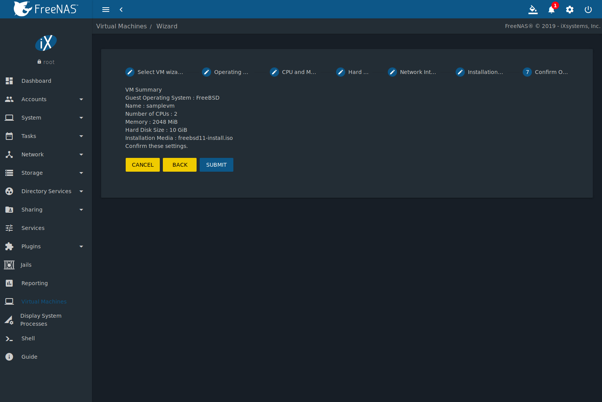

   Creating a Sample Virtual Machine

.. index:: Adding Devices to a VM
.. _Adding Devices to a VM:

Adding Devices to a VM
----------------------

Go to
:menuselection:`Virtual Machines`,
|ui-options| :menuselection:`--> Devices`,
and click |ui-add| to add a new VM device.

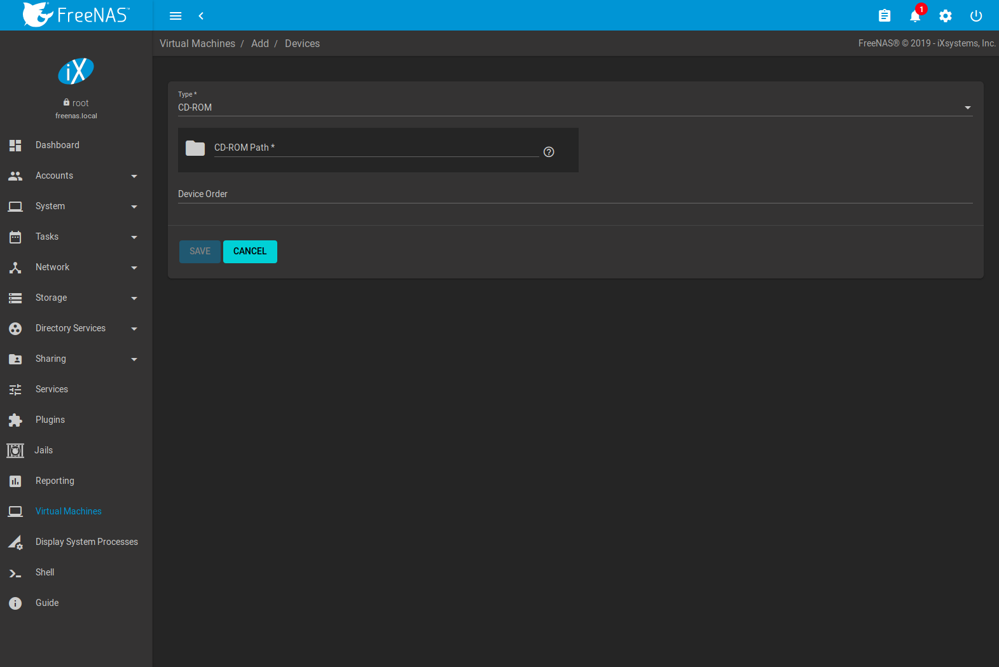

   VM Devices

Select the new device from the :guilabel:`Type` field. These devices are
available:

* :ref:`CD-ROM <vms-cd-rom>`

* :ref:`NIC (Network Interface Card) <vms-network-interface>`

* :ref:`Disk Device <vms-disk-device>`

* :ref:`Raw File <vms-raw-file>`

* :ref:`VNC Interface <vms-vnc>` (only available on virtual machines
  with :guilabel:`Boot Loader Type` set to *UEFI*)

:menuselection:`Virtual Machines -->` |ui-options| :menuselection:`--> Devices`
is also used to edit or delete existing devices. Click |ui-options| for
a device to display :guilabel:`Edit`, :guilabel:`Delete`,
:guilabel:`Change Device Order`, and :guilabel:`Details` options:

* :guilabel:`Edit` modifies a device.

* :guilabel:`Delete` removes the device from the VM.

* :guilabel:`Change Device Order` sets the priority number for booting
  this device. Smaller numbers are higher in boot priority.

* :guilabel:`Details` shows additional information about the specific
  device. This includes the physical interface and MAC address in a
  *NIC* device, the path to the zvol in a *DISK* device, and the path
  to an :file:`.iso` or other file for a *CDROM* device.

.. _vms-cd-rom:

CD-ROM Devices
~~~~~~~~~~~~~~

Adding a CD-ROM device makes it possible to boot the VM from a CD-ROM
image, typically an installation CD. The image must be present on an
accessible portion of the %brand% storage. In this example, a FreeBSD
installation image is shown:

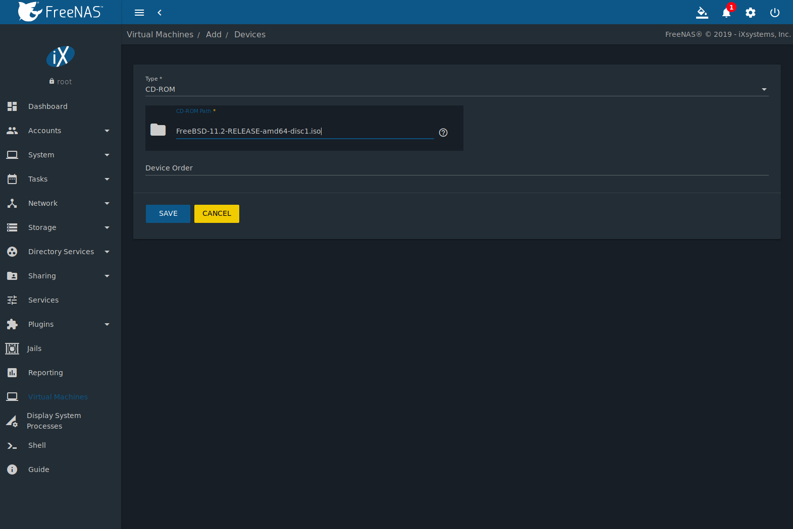

   CD-ROM Device

.. note:: VMs from other virtual machine systems can be recreated for
   use in %brand%. Back up the original VM, then create a new %brand%
   VM with virtual hardware as close as possible to the original VM.
   Binary-copy the disk image data into the :ref:`zvol <Adding Zvols>`
   created for the %brand% VM with a tool that operates at the level
   of disk blocks, like
   `dd(1) <https://www.freebsd.org/cgi/man.cgi?query=dd>`__.
   For some VM systems, it is best to back up data, install the
   operating system from scratch in a new %brand% VM, and restore the
   data into the new VM.

.. _vms-network-interface:

NIC (Network Interfaces)
~~~~~~~~~~~~~~~~~~~~~~~~

:numref:`Figure %s <vms-nic_fig>` shows the fields that appear after
going to
:menuselection:`Virtual Machines -->` |ui-options| :menuselection:`--> Devices`,
clicking |ui-add|, and selecting :guilabel:`NIC` as the
:guilabel:`Type`.

.. _vms-nic_fig:

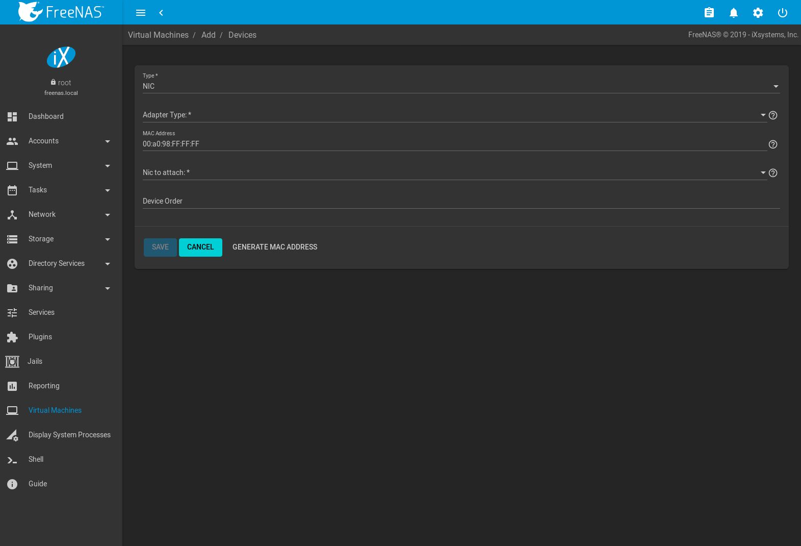

   Network Interface Device

The :guilabel:`Adapter Type` can emulate an Intel e82545 (e1000)
Ethernet card for compatibility with most operating systems. *VirtIO*
can provide better performance when the operating system installed in
the VM supports VirtIO paravirtualized network drivers.

By default, the VM receives an auto-generated random MAC address. To
override the default with a custom value, enter the desired address
in :guilabel:`MAC Address`. Click :guilabel:`GENERATE MAC ADDRESS` to
automatically populate :guilabel:`MAC Address` with a new randomized
MAC address.

If the system has multiple physical network interface cards, use the
:guilabel:`NIC to attach` drop-down menu to specify which
physical interface to associate with the VM.

Set a :guilabel:`Device Order` number to determine the boot order of
this device. A lower number means a higher boot priority.

.. tip:: To check which interface is attached to a VM, start the VM
   and go to the :ref:`Shell`. Type :command:`ifconfig` and find the
   `tap <https://en.wikipedia.org/wiki/TUN/TAP>`__ interface that shows
   the name of the VM in the description.

.. _vms-disk-device:

Disk Devices
~~~~~~~~~~~~

:ref:`Zvols <adding zvols>` are typically used as virtual hard drives.
After :ref:`creating a zvol <adding zvols>`, associate it with the VM
by clicking
:menuselection:`Virtual Machines -->` |ui-options| :menuselection:`--> Devices`,
clicking |ui-add|, and selecting :guilabel:`Disk` as the
:guilabel:`Type`.

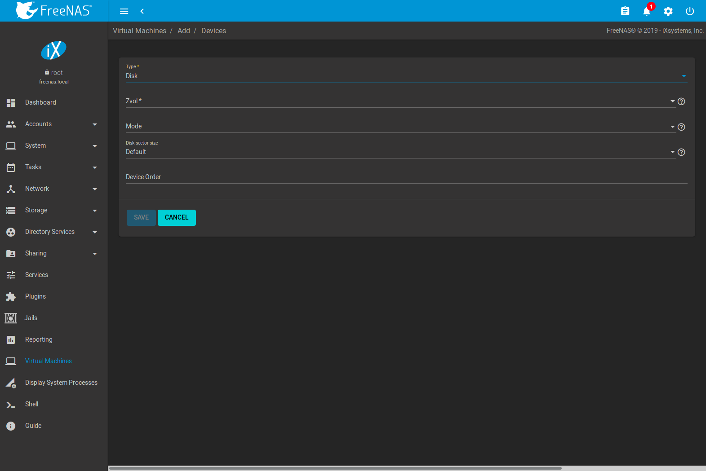

   Disk Device

Open the drop-down menu to select a created :guilabel:`Zvol`, then set
the disk :guilabel:`Mode`:

* *AHCI* emulates an AHCI hard disk for best software compatibility.
  This is recommended for Windows VMs.

* *VirtIO* uses paravirtualized drivers and can provide better
  performance, but requires the operating system installed in the VM to
  support VirtIO disk devices.

If a specific sector size is required, enter the number of bytes in
:guilabel:`Disk sector size`. The default of *0* uses an autotune script
to determine the best sector size for the zvol.

Set a :guilabel:`Device Order` number to determine the boot order of
this device. A lower number means a higher boot priority.

.. _vms-raw-file:

Raw Files
~~~~~~~~~

*Raw Files* are similar to :ref:`Zvol <Adding Zvols>` disk devices,
but the disk image comes from a file. These are typically used with
existing read-only binary images of drives, like an installer disk
image file meant to be copied onto a USB stick.

After obtaining and copying the image file to the %brand% system,
click
:menuselection:`Virtual Machines -->` |ui-options| :menuselection:`--> Devices`,
click |ui-add|, then set the :guilabel:`Type` to :guilabel:`Raw File`.

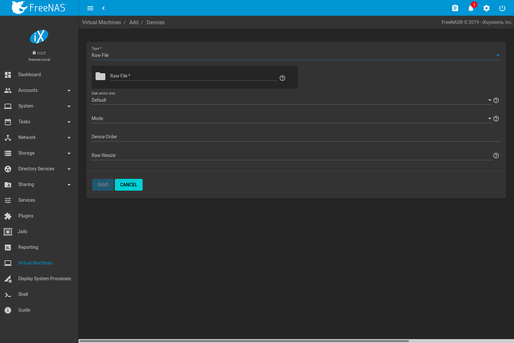

   Raw File Disk Device

Click |ui-browse| to select the image file. If a specific sector size
is required, choose it from :guilabel:`Disk sector size`. The *Default*
value automatically selects a preferred sector size for the file.

Setting disk :guilabel:`Mode` to *AHCI* emulates an AHCI hard disk
for best software compatibility. *VirtIO* uses paravirtualized drivers
and can provide better performance, but requires the operating system
installed in the VM to support VirtIO disk devices.

Set a :guilabel:`Device Order` number to determine the boot order of
this device. A lower number means a higher boot priority.

Set the size of the file in GiB.

.. _vms-VNC:

VNC Interface
~~~~~~~~~~~~~

VMs set to *UEFI* booting are also given a VNC (Virtual Network
Computing) remote connection. A standard
`VNC <https://en.wikipedia.org/wiki/Virtual_Network_Computing>`__
client can connect to the VM to provide screen output and keyboard and
mouse input.

Each VM can only have a single VNC device. An existing VNC interface can
be changed by clicking |ui-options| and :guilabel:`Edit`.

:ref:`Docker Hosts <Docker Hosts>` are not compatible with VNC
connections and cannot have a VNC interface.

.. note:: Using a non-US keyboard via VNC is not yet supported. As a
   workaround, select the US keymap on the system running the VNC client,
   then configure the operating system running in the VM to use a
   keymap that matches the physical keyboard. This will enable
   passthrough of all keys regardless of the keyboard layout.

:numref:`Figure %s <vms-vnc_fig>` shows the fields that appear
after going to
:menuselection:`Virtual Machines -->` |ui-options| :menuselection:`--> Devices`,
and clicking
|ui-options| :menuselection:`--> Edit`
for VNC.

.. _vms-vnc_fig:

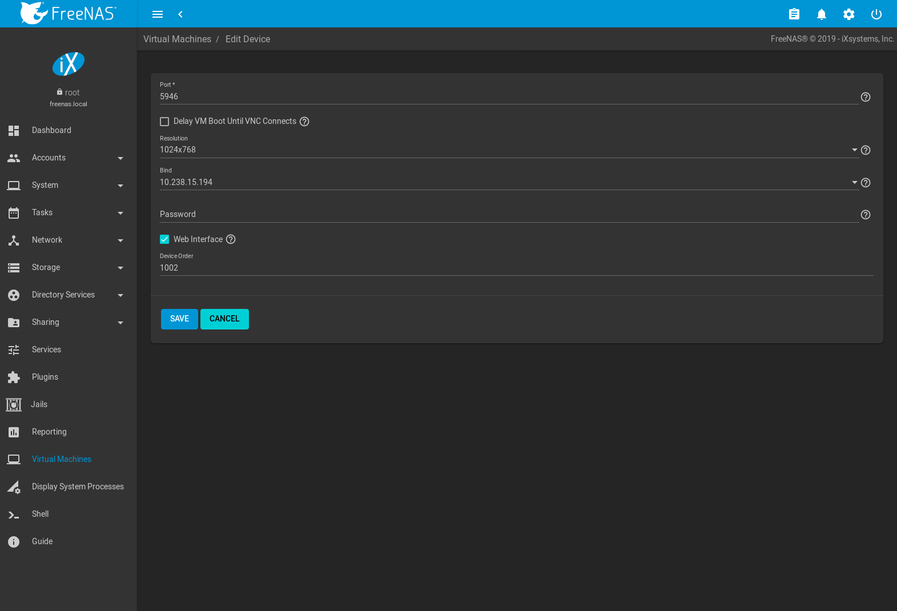

   VNC Device

Setting :guilabel:`Port` to *0* automatically assigns a port when the VM
is started. If a fixed, preferred port number is needed, enter it here.

Set :guilabel:`Delay VM Boot until VNC Connects` to wait to start the VM
until a VNC client connects.

:guilabel:`Resolution` sets the default screen resolution used for the
VNC session.

Select the IP address on which VNC listens with the :guilabel:`Bind`.

To automatically pass the VNC password, enter it into the
:guilabel:`Password` field. Note that the password is limited to 8
characters.

To use the VNC web interface, set :guilabel:`Web Interface`.

.. tip:: If a RealVNC 5.X Client shows the error
   :literal:`RFB protocol error: invalid message type`, disable the
   :guilabel:`Adapt to network speed` option and move the slider to
   :guilabel:`Best quality`. On later versions of RealVNC, select
   :menuselection:`File --> Preferences`,
   click :guilabel:`Expert`, :guilabel:`ProtocolVersion`, then
   select 4.1 from the drop-down menu.

Set a :guilabel:`Device Order` number to determine the boot order of
this device. A lower number means a higher boot priority.

.. index:: Docker Hosts
.. _Docker Hosts:

Docker Hosts
------------

`Docker <https://www.docker.com/what-docker>`__
is open source software for automating application deployment
inside containers. A container provides a complete filesystem,
runtime, system tools, and system libraries, so applications always
see the same environment.

`Rancher <https://rancher.com/>`__
is a |web-ui| tool for managing Docker containers.

%brand% runs the Rancher |web-ui| within the Docker Host.

.. index:: Docker Host Requirements
.. _Docker Host Requirements:

Docker Host Requirements
~~~~~~~~~~~~~~~~~~~~~~~~

The system BIOS **must** have virtualization support enabled for a
Docker Host to run properly after installation. On Intel systems this is
typically an option called *VT-x*. AMD systems generally have an *SVM*
option.

20 GiB of storage space is required for the Docker Host.

For setup, the :ref:`SSH` service must be enabled.

The Docker Host requires 2 GiB of RAM while running.

.. index:: Docker Host
.. _Creating Docker Host:

Creating Docker Host
~~~~~~~~~~~~~~~~~~~~

:numref:`Figure %s <vms_add_docker_fig>` shows the Wizard that appears
after going to
:menuselection:`Virtual Machines`,
clicking |ui-add|, and selecting :guilabel:`Docker Host` as the
:guilabel:`Virtual Machine (VM) Wizard type`.

.. _vms_add_docker_fig:

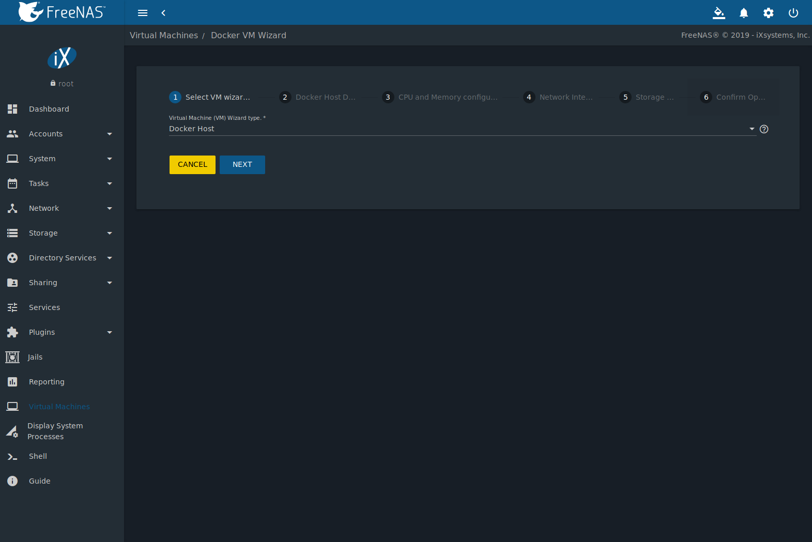

   Add Docker Host

Docker Host configuration options are described in
:numref:`Table %s <vms_add_docker_opts_tab>`.

.. tabularcolumns:: |>{\RaggedRight}p{\dimexpr 0.08\linewidth-2\tabcolsep}
                    |>{\RaggedRight}p{\dimexpr 0.20\linewidth-2\tabcolsep}
                    |>{\RaggedRight}p{\dimexpr 0.12\linewidth-2\tabcolsep}
                    |>{\RaggedRight}p{\dimexpr 0.60\linewidth-2\tabcolsep}|

.. _vms_add_docker_opts_tab:

.. table:: Docker Host Options
   :class: longtable

   +----------+--------------------+----------------+------------------------------------------------------------------------------------+
   | Screen # | Setting            | Value          | Description                                                                        |
   |          |                    |                |                                                                                    |
   +==========+====================+================+====================================================================================+
   | 1        | Virtual Machine    | drop-down menu | Choose to create either a standard *VM* or a *Docker Host*.                        |
   |          | (VM) Wizard type   |                |                                                                                    |
   |          |                    |                |                                                                                    |
   +----------+--------------------+----------------+------------------------------------------------------------------------------------+
   | 2        | Name               | string         | Enter a descriptive name for the Docker Host.                                      |
   |          |                    |                |                                                                                    |
   +----------+--------------------+----------------+------------------------------------------------------------------------------------+
   | 2        | Start on Boot      | checkbox       | Set to start this Docker Host when the %brand% system boots.                       |
   |          |                    |                |                                                                                    |
   +----------+--------------------+----------------+------------------------------------------------------------------------------------+
   | 3        | Virtual CPUs       | integer        | Enter the number of virtual CPUs to allocate to the Docker Host. The maximum is 16 |
   |          |                    |                | unless the host CPU also limits the maximum.                                       |
   |          |                    |                | The VM operating system can also have operational or licensing restrictions on     |
   |          |                    |                | the number of CPUs.                                                                |
   |          |                    |                |                                                                                    |
   +----------+--------------------+----------------+------------------------------------------------------------------------------------+
   | 3        | Memory Size (MiB)  | integer        | Allocate the amount of RAM in MiB for the Docker Host. A minimum *2048* MiB of RAM |
   |          |                    |                | is required.                                                                       |
   |          |                    |                |                                                                                    |
   +----------+--------------------+----------------+------------------------------------------------------------------------------------+
   | 4        | Adapter Type       | drop-down menu | :guilabel:`Intel e82545 (e1000)` emulates the same Intel Ethernet card. This       |
   |          |                    |                | provides compatibility with most operating systems. :guilabel:`VirtIO` provides    |
   |          |                    |                | better performance when the operating system installed in the VM supports VirtIO   |
   |          |                    |                | paravirtualized network drivers.                                                   |
   |          |                    |                |                                                                                    |
   +----------+--------------------+----------------+------------------------------------------------------------------------------------+
   | 4        | MAC Address        | string         | Enter the desired MAC address to override the auto-generated                       |
   |          |                    |                | randomized MAC address.                                                            |
   |          |                    |                |                                                                                    |
   +----------+--------------------+----------------+------------------------------------------------------------------------------------+
   | 4        | Attach NIC         | drop-down menu | Select the physical interface to associate with the VM.                            |
   |          |                    |                |                                                                                    |
   |          |                    |                |                                                                                    |
   +----------+--------------------+----------------+------------------------------------------------------------------------------------+
   | 5        | Raw filename       | string         | Enter a name for the new raw file.                                                 |
   |          |                    |                |                                                                                    |
   |          |                    |                |                                                                                    |
   +----------+--------------------+----------------+------------------------------------------------------------------------------------+
   | 5        | Raw file size      | integer        | Allocate storage size in GiB for the new raw file.                                 |
   |          |                    |                |                                                                                    |
   +----------+--------------------+----------------+------------------------------------------------------------------------------------+
   | 5        | Raw file location  | browse button  | Select a directory to store the new raw file.                                      |
   |          |                    |                |                                                                                    |
   +----------+--------------------+----------------+------------------------------------------------------------------------------------+
   | 5        | Disk sector size   | integer        | Define the disk sector size in bytes. *Default* leaves the sector size unset.      |
   |          |                    |                |                                                                                    |
   +----------+--------------------+----------------+------------------------------------------------------------------------------------+

Choose the base options for the VM at each step of the wizard.
:guilabel:`Virtual CPUs` is set to *1*. :guilabel:`Memory Size` must
be set to at least *2048 MiB*.

The :guilabel:`Network Interface` step is automatically populated with
system defaults. Customize these fields as necessary and press
:guilabel:`NEXT` to continue.

The :guilabel:`Storage Files` section of the wizard contains options
to create and store a raw file. Add a filename by typing an *.img*
name in the :guilabel:`Raw filename` field. Enter a number of
gigabytes for the :guilabel:`Raw file size`. Set the raw file location
with the folder button or by typing a directory in the field.

The final screen of the Wizard displays the chosen options for the new
Docker Host. Click :guilabel:`SUBMIT` to create the Host or
:guilabel:`BACK` to change any settings. Click :guilabel:`CANCEL` at any
time to return to the
:menuselection:`Virtual Machines`
page.

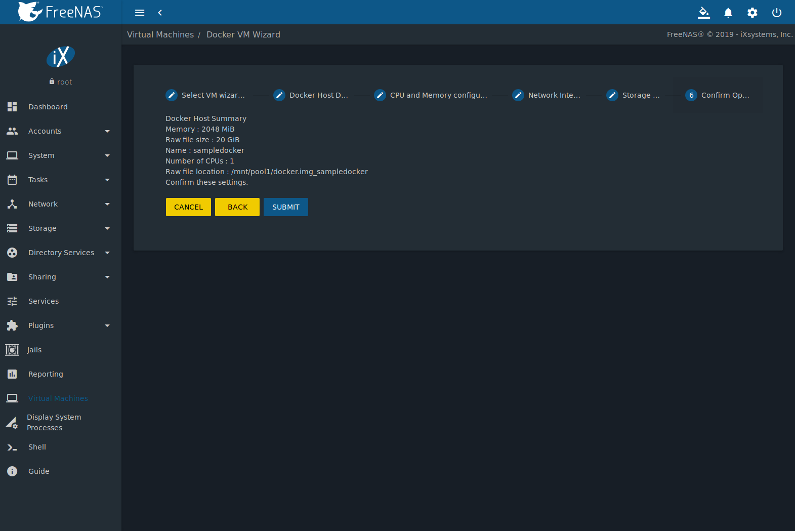

   Docker Host Configuration

Click |ui-power|, :guilabel:`CONNECT`, and :guilabel:`Serial` to
log in to the Docker Host. Enter :literal:`rancher` for the user name
and :literal:`docker` for the password.

The default password is changed in the :guilabel:`Devices` by powering off
the Docker Host, clicking |ui-options|, and :guilabel:`Devices`. Click
|ui-options| and :guilabel:`Edit` for the :guilabel:`RAW` device and
enter a new value in the :guilabel:`password` field. Passwords cannot
contain a space.

.. figure:: images/virtual-machines-docker-devices-rawfile.png

   Edit Rancher Password in Raw File Device

Start the Docker Host
~~~~~~~~~~~~~~~~~~~~~

Go to
:menuselection:`Virtual Machines`,
then click on the red |ui-power| button of the Docker Host to start it.

Starting a Docker Host can take some time. Connecting to the Serial
Shell is possible during the startup process to view the activity of the
Docker Host. When a message about :literal:`RancherOS` starting appears
and the shell stops posting new messages, press :kbd:`Enter` to see the
:literal:`ClientHost login:` text and continue to log in.

SSH into the Docker Host
~~~~~~~~~~~~~~~~~~~~~~~~

It is possible to SSH into a running Docker Host. Go
to the
:menuselection:`Virtual Machines` page and find the card for the Docker
Host. The card shows the :guilabel:`Com Port` for the Docker Host. In
this example, :literal:`/dev/nmdm12B` is used.

Use an SSH client to connect to the %brand% server. Remember this also
requires the :ref:`SSH` service to be running. Depending on the %brand%
system configuration, it might also require changes to the
:guilabel:`SSH` service settings, like setting
:guilabel:`Login as Root with Password`.

At the %brand% console prompt, connect to the Rancher Host with
`cu <https://www.freebsd.org/cgi/man.cgi?query=cu>`__, replacing
:samp:`{/dev/nmdm12B}` with the value from the Docker Host
:guilabel:`Com Port`:

.. code-block:: none

   cu -l /dev/nmdm12B -s 9600

If the terminal does not show a :literal:`rancher login:` prompt,
press :kbd:`Enter`. The Docker Host can take some time to start and
display the login prompt.

.. _Installing and Configuring the Rancher Server:

Installing and Configuring the Rancher Server
~~~~~~~~~~~~~~~~~~~~~~~~~~~~~~~~~~~~~~~~~~~~~

Go to
:menuselection:`Virtual Machines`
and locate the card for the Docker Host. Start the Host and click
:guilabel:`Connect` and :guilabel:`Serial` to open the Host Serial shell.

Continuing to set up the Rancher Host is done from the command line.
Enter *rancher* as the username, press :kbd:`Enter`, then enter either
the default password *docker* or the custom password created by editing
the raw file. Press :kbd:`Enter` again. After logging in, a
:literal:`[rancher@ClientHost ~]$` prompt is displayed.

Ensure Rancher has functional networking and can :command:`ping` an
outside website. Adjust the VM
:ref:`Network Interface <vms-network-interface>` and reboot the VM
if necessary.

Download and install the Rancher system with this command:

.. code-block:: none

   sudo docker run -d --restart=unless-stopped -p 8080:8080 rancher/server

.. note:: If the error :literal:`Cannot connect to the Docker daemon`
   is shown, run :command:`sudo dockerd`. Then give the
   :command:`sudo docker run` command above again.

Installation time varies with processor and network connection speed,
but typically takes a few minutes. After the process finishes and a
command prompt is shown, type this command:

.. code-block:: none

   ifconfig eth0 | grep 'inet addr'

The first value is the IP address of the Rancher server. Enter the IP
address and port :literal:`8080` as the URL in a web browser. For
example, if the IP address was :literal:`10.231.3.208`, enter
:literal:`10.231.3.208:8080` as the URL in the web browser.

The Rancher server takes a few minutes to start. The web browser might
show a connection error while the Rancher |web-ui| is still starting. If
the browser shows a :literal:`connection has timed out` or a similar
error, wait one minute and try again.

In the Rancher |web-ui|, click :guilabel:`Add a host`, ensure the radio
:guilabel:`This site's address` button is set, and click
:guilabel:`Save`. Follow the instructions that now display and run the
:command:`sudo docker run --rm --privileged -v` command in the Docker
Host Serial shell. After the command runs a message displays
:literal:`Launched Rancher Agent:`. Refresh or go to the
:guilabel:`Hosts` page of the Rancher |web-ui| to confirm the Docker
Host displays in the |web-ui|. Rancher is now configured and ready for
use.

For more information on using RancherOS, see the RancherOS
`documentation <https://rancher.com/docs/os/v1.x/en/>`__.

.. _Configure Rancher Containers with NFS Pass-through:

Configuring Persistent NFS-Shared Volumes
~~~~~~~~~~~~~~~~~~~~~~~~~~~~~~~~~~~~~~~~~~~~~~~~~~~~~~~~~~~~~~~~~

Rancher supports using a single persistent volume with multiple
containers. This volume can also be shared with %brand% using NFS.
%brand% must be configured with specific NFS permissions and a
`Rancher NFS server
<https://rancher.com/docs/rancher/v1.6/en/rancher-services/storage-service/rancher-nfs/>`__
must have a properly configured `stack scoped volume
<https://rancher.com/docs/rancher/v1.6/en/cattle/volumes/#volume-scopes>`__.

A stack scoped volume is data that is managed by a single Rancher stack.
The volume is shared by all services that reference it in the stack.

Configure NFS sharing for a stack scoped volume by setting specific
options in the command line of the Rancher NFS server and the %brand%
system:

* Log in to the Rancher NFS server and modify :file:`/etc/exports`. Add
  an entry for the NFS shared directory, typically :file:`/nfs`, with
  several permissions options:
  :samp:`/nfs	{IP}(rw,sync,no_root_squash,no_subtree_check)`.
  *IP* is the IP address of the client and can also be set to the
  wildcard :literal:`*`.

* In the %brand% |web-ui|, go to
  :menuselection:`Services --> NFS Configure`.
  Set :guilabel:`Enable NFSv4` and
  :guilabel:`NFSv3 ownership model for NFSv4`. Click :guilabel:`SAVE`
  and restart the :guilabel:`NFS` service.

* Add :literal:`:nocopy` to the end of the pool to be mounted:
  :samp:`mount -t nfs pool:{/mnt/pool1}:nocopy {~nfsmounts/pool1_mount}`
