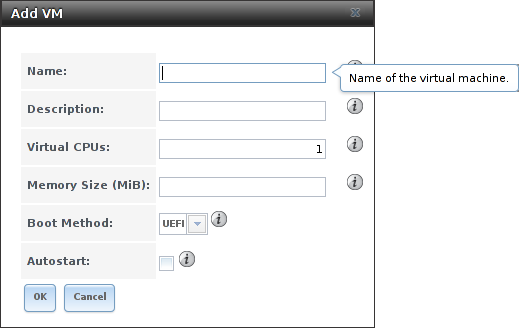
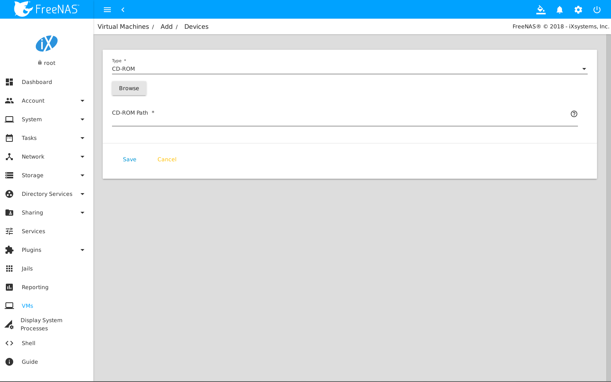
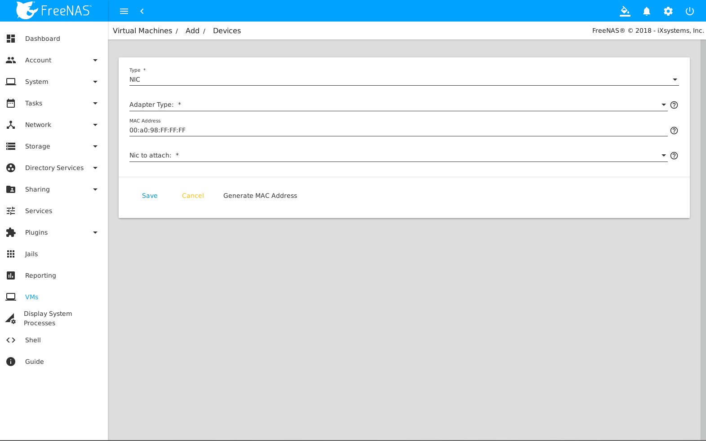
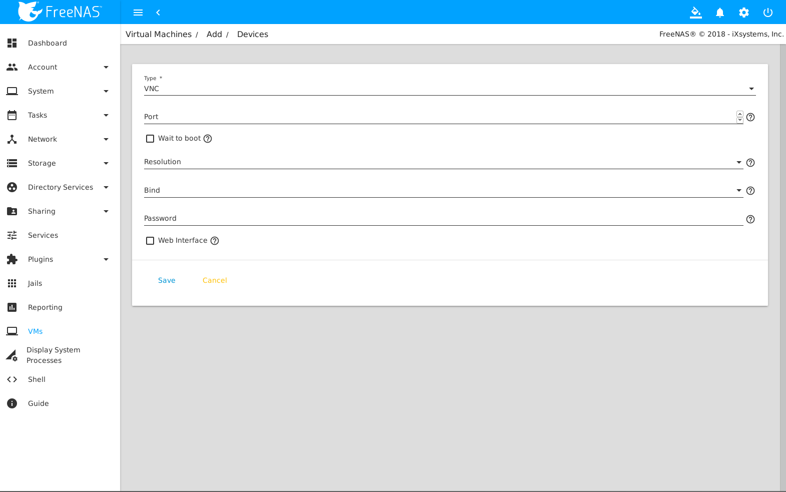
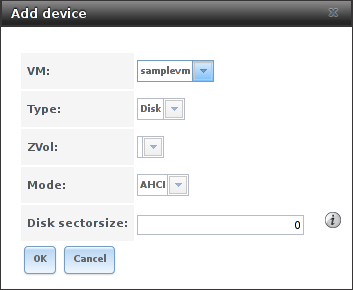
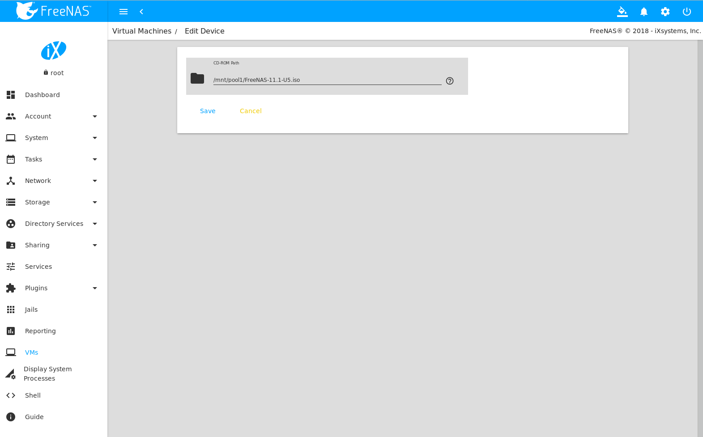
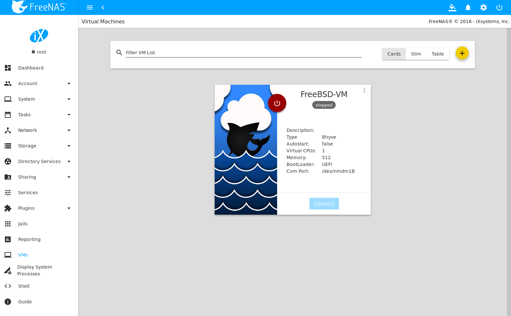
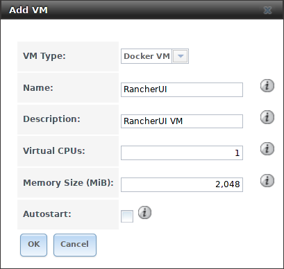
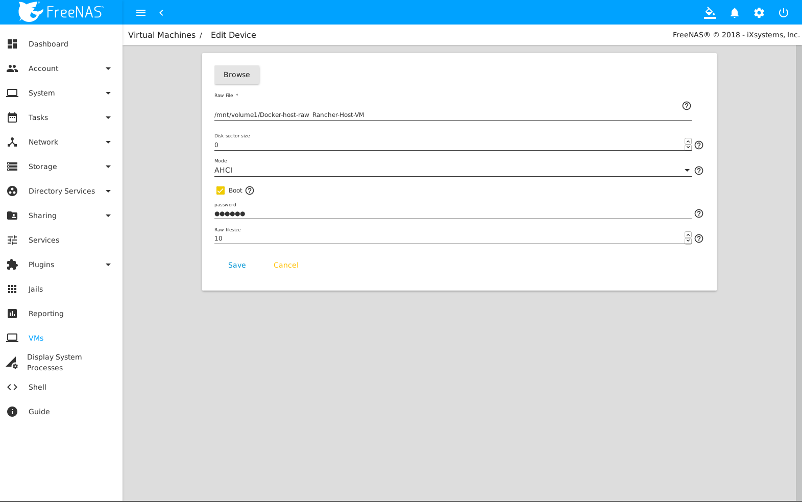

.. index:: VMs
.. _VMs:

VMs
===

A Virtual Machine (*VM*) is an environment on a host computer that
can be used as if it were a separate physical computer. VMs can be
used to run multiple operating systems simultaneously. Operating
systems running inside a VM see emulated virtual hardware rather than
the actual hardware of the host computer. This provides more isolation
than :ref:`Jails`, although there is additional overhead. A portion of
system RAM is assigned to each VM, and each VM uses a
:ref:`zvol <Create zvol>` for storage. While a VM is running, these
resources are not available to the host computer or other VMs.

%brand% VMs use the
`bhyve(8)
<https://www.freebsd.org/cgi/man.cgi?query=bhyve&manpath=FreeBSD+11.0-RELEASE+and+Ports>`_
virtual machine software. This type of virtualization requires an
Intel processor with Extended Page Tables (EPT) or an AMD processor
with Rapid Virtualization Indexing (RVI) or Nested Page Tables (NPT).

To verify that an Intel processor has the required features, use
:ref:`Shell` to run :samp:`grep VT-x /var/run/dmesg.boot`. If the
*EPT* and *UG* features are shown, this processor can be used with
*bhyve*.

To verify that an AMD processor has the required features, use
:ref:`Shell` to run :command:`grep POPCNT /var/run/dmesg.boot`. If the
output shows the POPCNT feature, this processor can be used with
*bhyve*.

.. note:: AMD K10 "Kuma" processors include POPCNT but do not support
   NRIPS, which is required for use with bhyve. Production of these
   processors ceased in 2012 or 2013.

.. index:: Creating VMs
.. _Creating VMs:

Creating VMs
------------

Select
:menuselection:`VMs --> Add VM` for the :guilabel:`Add VM` dialog
shown in
:numref:`Figure %s <vms_add_fig>`:

.. _vms_add_fig:

   Add VM

VM configuration options are described in
:numref:`Table %s <vms_add_opts_tab>`.

.. tabularcolumns:: |>{\RaggedRight}p{\dimexpr 0.25\linewidth-2\tabcolsep}
                    |>{\RaggedRight}p{\dimexpr 0.12\linewidth-2\tabcolsep}
                    |>{\RaggedRight}p{\dimexpr 0.63\linewidth-2\tabcolsep}|

.. _vms_add_opts_tab:

.. table:: VM Options
   :class: longtable

   +-------------------+----------------+------------------------------------------------------------------------------------+
   | Setting           | Value          | Description                                                                        |
   |                   |                |                                                                                    |
   +===================+================+====================================================================================+
   | Name              | string         | a name to identify the VM                                                          |
   |                   |                |                                                                                    |
   +-------------------+----------------+------------------------------------------------------------------------------------+
   | Description       | string         | a short description of the VM or its purpose                                       |
   |                   |                |                                                                                    |
   +-------------------+----------------+------------------------------------------------------------------------------------+
   | Virtual CPUs      | integer        | quantity of virtual CPUs allocated to the VM, up to 16; although these are         |
   |                   |                | virtual and not strictly related to host processor cores, the host CPU might       |
   |                   |                | limit the maximum number; the operating system used in the VM might also have      |
   |                   |                | operational or licensing restrictions on the number of CPUs allowed                |
   +-------------------+----------------+------------------------------------------------------------------------------------+
   | Memory Size (MiB) | integer        | megabytes of RAM allocated to the VM                                               |
   |                   |                |                                                                                    |
   +-------------------+----------------+------------------------------------------------------------------------------------+
   | Boot Method       | drop-down menu | *UEFI* for newer operating systems, or *UEFI-CSM* (Compatibility Support Mode) for |
   |                   |                | older operating systems that only understand BIOS booting                          |
   |                   |                |                                                                                    |
   +-------------------+----------------+------------------------------------------------------------------------------------+
   | Autostart         | checkbox       | when checked, start the VM automatically on boot                                   |
   |                   |                |                                                                                    |
   +-------------------+----------------+------------------------------------------------------------------------------------+

.. index:: Adding Devices to a VM
.. _Adding Devices to a VM:

Adding Devices to a VM
----------------------

After creating the VM, click it to select it, then click
:guilabel:`Devices` and :guilabel:`Add Device` to add virtual hardware
to it:

   Add Devices to a VM

Select the name of the VM from the :guilabel:`VM` drop-down menu, then
select the :guilabel:`Type` of device to add. The following types are
available:

* Network Interface

* Disk

* Raw File

* CD-ROM

* VNC

:numref:`Figure %s <vms-nic_fig>` shows the fields that appear when
:guilabel:`Network Interface` is the selected :guilabel:`Type`.

.. _vms-nic_fig:

   VM Network Interface Device

The default :guilabel:`Adapter Type` emulates an Intel E1000 (82545)
Ethernet card for compatibility with most operating systems. This can
be changed to *VirtIO* to provide better performance when the
operating system installed in the VM supports VirtIO paravirtualized
network drivers.

If the system has multiple physical network interface cards, the
:guilabel:`Nic to attach` drop-down menu can be used to specify which
physical interface to associate with the VM.

By default, the VM receives an auto-generated random MAC address. To
override the default with a custom value, enter the desired address
into the :guilabel:`MAC Address` field.

VMs set to *UEFI* booting are also given a VNC (Virtual Network
Computing) remote connection. A standard
`VNC <https://en.wikipedia.org/wiki/Virtual_Network_Computing>`__
client can connect to the VM to provide screen output and keyboard and
mouse input.

:numref:`Figure %s <vms-vnc_fig>` shows the fields that appear when
:guilabel:`VNC` is the selected :guilabel:`Type`.

.. _vms-vnc_fig:

   VM VNC Device

The :guilabel:`Resolution` drop-down menu can be used to
modify the default screen resolution used by the VNC session.

The :guilabel:`VNC port` can be set to *0*, left empty for
%brand% to assign a port when the VM is started, or set to a fixed,
preferred port number.

By default, VNC will bind to all available IP addresse (*0.0.0.0*). To
specify the IP address to use, select it from the :guilabel:`Bind to`
drop-down menu.

Check the :guilabel:`Wait to boot` checkbox to indicate that the VNC
client should wait until the VM has booted before attempting the
connection.

To automatically pass the VNC password, enter it into the
:guilabel:`Password` field. Note that the password is limited to 8
characters.

To use the VNC web interface, check the :guilabel:`VNC Web` checkbox.

.. tip:: If a RealVNC 5.X Client shows the error
   :literal:`RFB protocol error: invalid message type`, disable the
   :guilabel:`Adapt to network speed` option and move the slider to
   :guilabel:`Best quality`. On later versions of RealVNC, select
   :menuselection:`File --> Preferences`,
   click :guilabel:`Expert`, :guilabel:`ProtocolVersion`, then
   select 4.1 from the drop-down menu.

:ref:`Zvols <Create zvol>` are used as virtual hard drives. After
:ref:`creating a zvol <Create zvol>`, associate it with the VM by
selecting :guilabel:`Add device`, choose the *VM*, select a
:guilabel:`Type` of *Disk*, select the created zvol, then set the
:guilabel:`Mode`. If a specific sector size is required, enter the
number of bytes into :guilabel:`Disk sectorsize`. The default of *0*
leaves the sector size unset.

   VM Disk Device

*AHCI* emulates an AHCI hard disk for best software compatibility.
*VirtIO* uses paravirtualized drivers and can provide better
performance, but requires the operating system installed in the VM to
support VirtIO disk devices.

Adding a CD-ROM device makes it possible to boot the VM from a CD-ROM
image, typically an installation CD. The image must be present on an
accessible portion of the %brand% storage. In this example, a FreeBSD
installation image is shown:

   VM CD-ROM Device

.. note:: VMs from other virtual machine systems can be recreated for
   use in %brand%. Back up the original VM, then create a new %brand%
   VM with virtual hardware as close as possible to the original VM.
   Binary-copy the disk image data into the :ref:`zvol <Create zvol>`
   created for the %brand% VM with a tool that operates at the level
   of disk blocks, like
   `dd(1) <https://www.freebsd.org/cgi/man.cgi?query=dd>`__.
   For some VM systems, it is best to back up data, install the
   operating system from scratch in a new %brand% VM, and restore the
   data into the new VM.

.. index: Other VM Devices
.. _Other VM Devices:

Virtual Serial Ports
--------------------

VMs automatically include a virtual serial port.

* :file:`/dev/nmdm1B` is assigned to the first VM

* :file:`/dev/nmdm2B` is assigned to the second VM

And so on. These virtual serial ports allow connecting to the VM
console from the :ref:`Shell`. To connect to the first VM:

.. code-block:: none

   cu -s 9600 -l /dev/nmdm1B

See
`cu(1) <https://www.freebsd.org/cgi/man.cgi?query=cu>`__
for more information on operating :command:`cu`.

.. index:: Running VMs
.. _Running VMs:

Running VMs
-----------

Select
:menuselection:`VMs`
to see a list of configured VMs. Configuration and control buttons
appear at the bottom of the screen when an individual VM is selected
with a mouse click:

   VM Configuration and Control Buttons

The name, description, running state, VNC port (if present), and other
configuration values are shown. A :guilabel:`Start` button is shown
when the VM is not running. Click this to start the VM. If a VNC port
is present, use VNC client software to connect to that port for screen
output and keyboard and mouse input.

On running VMs, the button is shown as :guilabel:`Stop`, and used,
unsurprisingly, to stop them.

.. index: Docker/Rancher VM
.. _Docker/Rancher VM:

Docker/Rancher VM
-----------------

`Docker <https://www.docker.com/what-docker>`__
is open source software for automating application deployment
inside containers. A container provides a complete filesystem,
runtime, system tools, and system libraries, so applications always
see the same environment.

`Rancher <http://rancher.com/>`__
is a GUI tool for managing Docker containers.

%brand% runs the Rancher GUI as a separate VM.

.. index: Rancher VM Requirements
.. _Rancher VM Requirements:

Rancher VM Requirements
~~~~~~~~~~~~~~~~~~~~~~~

20 GiB of storage space is required for the Rancher VM. For setup, the
:ref:`SSH` service must be enabled.

The Rancher VM requires 2 GiB of RAM while running.

.. index: Create the Rancher VM
.. _Create the Rancher VM:

Create the Rancher VM
~~~~~~~~~~~~~~~~~~~~~

Click :guilabel:`VMs`, then the :guilabel:`Add VM` button. Set the
:guilabel:`VM Type` to *Docker VM*. Enter *RancherUI* for the name,
*Rancher UI VM* for the :guilabel:`Description`, leave the number of
:guilabel:`Virtual CPUs` at *1*, and enter *2048* for the
:guilabel:`Memory Size`. To have the Rancher VM start when the %brand%
system boots, check the :guilabel:`Autostart` checkbox. Click
:guilabel:`OK` to create the virtual machine.

   Rancher VM Configuration

A location to store the disk image must now be chosen. In this
example, a :ref:`dataset <Create Dataset>` called *vm-storage* has
already been created as a location to store VM data. Click
:guilabel:`VMs`, then click on the *RancherUI* line to select it.
Click on the :guilabel:`Devices` button to show the devices attached
to that VM. Click on the *RAW* device to select it, then click the
:guilabel:`Edit` button. In the :guilabel:`Raw File` field, browse to
the dataset and select it. Then add a filename by typing
*/rancherui.img* to the end of the path in the text box.

Set the :guilabel:`Disk boot` checkbox, enter a password for the
:literal:`rancher` user in the :guilabel:`Password` field, then enter
*20G* in the :guilabel:`Disk size` field. Click :guilabel:`OK` to save
the device.

   Rancher Image Storage

Start the Rancher VM
~~~~~~~~~~~~~~~~~~~~

Click :guilabel:`VMs`, then click on the *RancherUI* line to select
it. Click the :guilabel:`Start` button and then :guilabel:`Yes` to
start the VM.

The first time the Rancher VM is started, it downloads the Rancher
disk image file. How long this takes to complete depends on the speed
of the network connection. A status dialog reports the progress of the
download.

After the image is downloaded, the VM is started.

Installing the Rancher Server
~~~~~~~~~~~~~~~~~~~~~~~~~~~~~

Click :guilabel:`VMs` and locate the line for the RancherUI VM. The
:guilabel:`Info` column shows the :literal:`Com Port` for the
Rancher VM. In this example, :literal:`/dev/nmdm3B` is used.

Further setup of the Rancher VM is done from the command line. Use an
SSH client to connect to the %brand% server. Remember that this
requires the :ref:`SSH` service to be running. Depending on local
configuration, it might also require changes to the setting of the
service, like allowing root user login with a password.

At the %brand% console prompt, connect to the Rancher VM with
`cu <https://www.freebsd.org/cgi/man.cgi?query=cu>`__, replacing
:samp:`{/dev/nmdm3B}` with the value from the RancherUI
:guilabel:`Info` column:

.. code-block:: none

   cu -l /dev/nmdm3B

If the terminal does not show a :literal:`rancher login:` prompt,
press :kbd:`Enter`.

Enter *rancher* as the username, press :kbd:`Enter`, then type the
password that was entered when the raw file was created above and
press :kbd:`Enter` again. After logging in, a
:literal:`[rancher@rancher ~]$` prompt is displayed.

Download and install the Rancher system with this command:

.. code-block:: none

   sudo docker run -d --restart=unless-stopped -p 8080:8080 rancher/server

Installation time varies with processor and network connection speed,
but typically takes a few minutes. After the process finishes and a
command prompt is shown, type this command:

.. code-block:: none

   ifconfig eth0 | grep 'inet addr'

The first value is the IP address of the Rancher server. Enter the IP
address and port 8080 as the URL in a web browser. For example, if the
IP address was :literal:`10.231.3.208`, enter
:literal:`10.231.3.208:8080` as the URL in the web browser.

The Rancher server takes a few minutes to start. The web browser might
show a connection error while the Rancher GUI is still starting. If
the browser shows a :literal:`connection has timed out` or a similar
error, wait one minute and try again.

In the Rancher GUI, click :guilabel:`Add a host` and enter the same IP
address and port number. Click :guilabel:`Save` to save the
information.

For more information on using Rancher, see the Rancher
`Quick Start Guide
<https://rancher.com/docs/rancher/v1.6/en/quick-start-guide/>`__.
