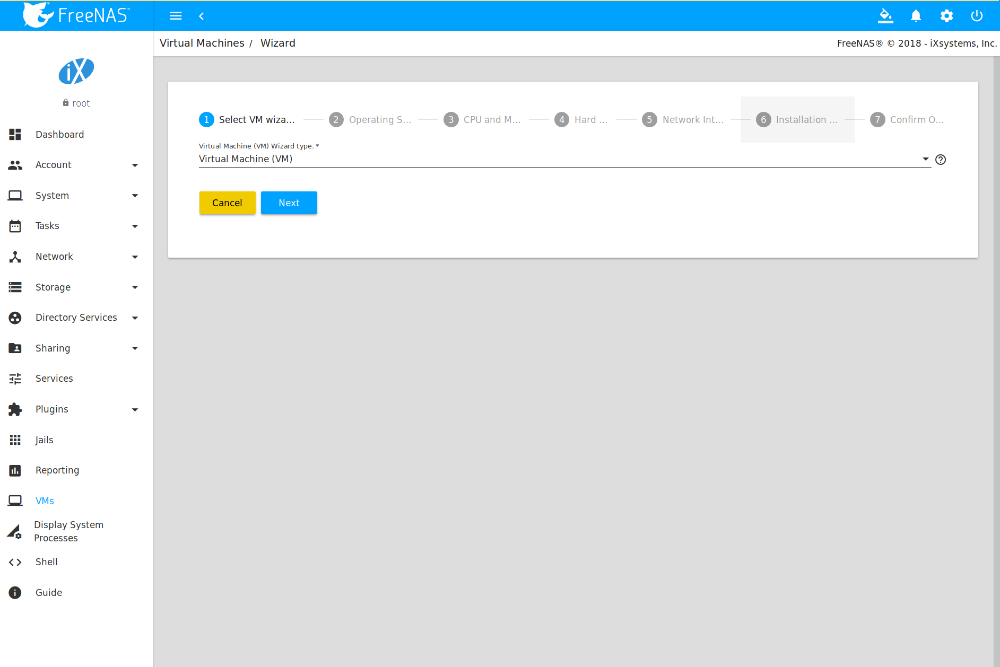
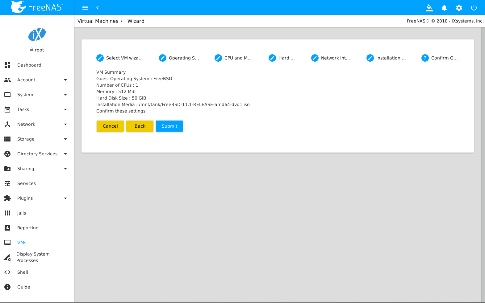
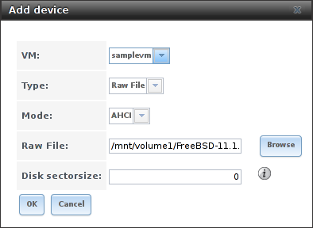
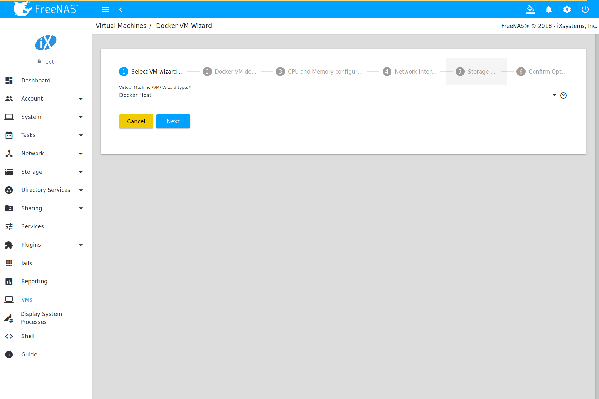
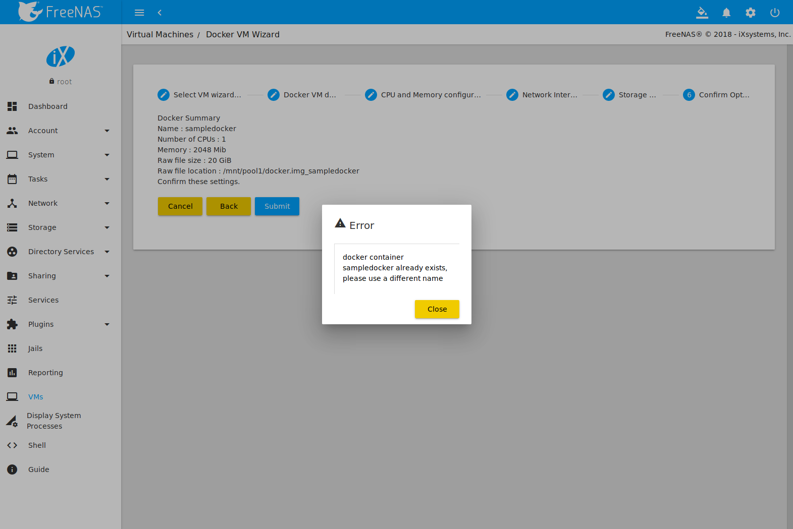

.. index:: VMs
.. _VMs:

Virtual Machines
================

A Virtual Machine (*VM*) is an environment on a host computer that
can be used as if it were a separate physical computer. VMs can be
used to run multiple operating systems simultaneously on a single
computer. Operating systems running inside a VM see emulated virtual
hardware rather than the actual hardware of the host computer. This
provides more isolation than :ref:`Jails`, although there is
additional overhead. A portion of system RAM is assigned to each VM,
and each VM uses a :ref:`zvol <Adding Zvols>` for storage. While a VM
is running, these resources are not available to the host computer or
other VMs.

%brand% VMs use the
`bhyve(8)
<https://www.freebsd.org/cgi/man.cgi?query=bhyve&manpath=FreeBSD+11.0-RELEASE+and+Ports>`__
virtual machine software. This type of virtualization requires an
Intel processor with Extended Page Tables (EPT) or an AMD processor
with Rapid Virtualization Indexing (RVI) or Nested Page Tables (NPT).

To verify that an Intel processor has the required features, use
:ref:`Shell` to run :samp:`grep VT-x /var/run/dmesg.boot`. If the
*EPT* and *UG* features are shown, this processor can be used with
*bhyve*.

To verify that an AMD processor has the required features, use
:ref:`Shell` to run :command:`grep POPCNT /var/run/dmesg.boot`. If the
output shows the POPCNT feature, this processor can be used with
*bhyve*.

.. note:: By default, new VMs have the
   `bhyve(8)
   <https://www.freebsd.org/cgi/man.cgi?query=bhyve&manpath=FreeBSD+11.0-RELEASE+and+Ports>`__
   :literal:`-H` option is set. This causes the virtual CPU thread to
   yield when a HLT instruction is detected, and prevents idle VMs
   from consuming all of the host's CPU.

.. note:: AMD K10 "Kuma" processors include POPCNT but do not support
   NRIPS, which is required for use with bhyve. Production of these
   processors ceased in 2012 or 2013.

.. index:: Creating VMs
.. _Creating VMs:

Creating VMs
------------

Navigate to :menuselection:`VMs`, and click |ui-add| to open the Wizard
shown in
:numref:`Figure %s <vms_add_fig>`:

.. _vms_add_fig:

   Add VM

VM configuration options are described in
:numref:`Table %s <vms_add_opts_tab>`.

.. tabularcolumns:: |>{\RaggedRight}p{\dimexpr 0.08\linewidth-2\tabcolsep}
                    |>{\RaggedRight}p{\dimexpr 0.20\linewidth-2\tabcolsep}
                    |>{\RaggedRight}p{\dimexpr 0.12\linewidth-2\tabcolsep}
                    |>{\RaggedRight}p{\dimexpr 0.60\linewidth-2\tabcolsep}|

.. _vms_add_opts_tab:

.. table:: VM Wizard Options
   :class: longtable

   +----------+--------------------+----------------+-----------------------------------------------------------------------------------------------+
   | Screen # | Setting            | Value          | Description                                                                                   |
   |          |                    |                |                                                                                               |
   +==========+====================+================+===============================================================================================+
   | 1        | Virtual Machine    | drop-down menu | Choose to create either a standard VM or a Docker Host.                                       |
   |          | (VM) Wizard type   |                |                                                                                               |
   |          |                    |                |                                                                                               |
   +----------+--------------------+----------------+-----------------------------------------------------------------------------------------------+
   | 2        | Guest Operating    | drop-down menu | Choose the VM operating system type. Choices are: *Windows*, *Linux*, or *FreeBSD*. See       |
   |          | System             |                | `this guide <https://github.com/FreeBSD-UPB/freebsd/wiki/How-to-launch-different-guest-OS>`__ |
   |          |                    |                | for detailed instructions about using a different guest OS.                                   |
   |          |                    |                |                                                                                               |
   +----------+--------------------+----------------+-----------------------------------------------------------------------------------------------+
   | 2        | VM Name            | string         | Enter an alphanumeric name to identify the VM. A popup error will occur if another VM is      |
   |          |                    |                | using that name.                                                                              |
   |          |                    |                |                                                                                               |
   +----------+--------------------+----------------+-----------------------------------------------------------------------------------------------+
   | 2        | Boot Method        | drop-down menu | Select *UEFI* for newer operating systems, or *UEFI-CSM* for (Compatibility Support Mode)     |
   |          |                    |                | older operating systems that only understand BIOS booting.                                    |
   |          |                    |                |                                                                                               |
   +----------+--------------------+----------------+-----------------------------------------------------------------------------------------------+
   | 2        | Start on Boot      | checkbox       | Set to start the VM when the system boots.                                                    |
   |          |                    |                |                                                                                               |
   +----------+--------------------+----------------+-----------------------------------------------------------------------------------------------+
   | 2        | Enable VNC         | checkbox       | Set to to activate a Virtual Network Computing (VNC) remote connection.                       |
   |          |                    |                | Requires *UEFI* booting.                                                                      |
   |          |                    |                |                                                                                               |
   +----------+--------------------+----------------+-----------------------------------------------------------------------------------------------+
   | 3        | Virtual CPUs       | integer        | Select the number of virtual CPUs to allocate to the VM. The maximum is 16 unless             |
   |          |                    |                | the host CPU limits the maximum. The VM operating system might also have                      |
   |          |                    |                | operational or licensing restrictions on the number of CPUs.                                  |
   |          |                    |                |                                                                                               |
   +----------+--------------------+----------------+-----------------------------------------------------------------------------------------------+
   | 3        | Memory Size (MiB)  | integer        | Allocate the amount of RAM in                                                                 |
   |          |                    |                | `mebibytes <https://simple.wikipedia.org/wiki/Mebibyte>`__ for the VM.                        |
   +----------+--------------------+----------------+-----------------------------------------------------------------------------------------------+
   | 4        | Disk image         | check option   | Select :guilabel:`Create new disk image` to create a new zvol on an existing dataset.         |
   |          |                    | with custom    | This is used as a virtual hard drive for the VM. Select :guilabel:`Use existing disk image`   |
   |          |                    | fields         | to :guilabel:`Browse` to an existing zvol or file for the VM.                                 |
   |          |                    |                |                                                                                               |
   +----------+--------------------+----------------+-----------------------------------------------------------------------------------------------+
   | 4        | Zvol size (GiB)    | integer        | Allocate the amount of storage in                                                             |
   |          |                    |                | `gibibytes <https://simple.wikipedia.org/wiki/Gibibyte>`__ for the new zvol.                  |
   |          |                    |                | Only appears if :guilabel:`Create new disk image` is selected.                                |
   +----------+--------------------+----------------+-----------------------------------------------------------------------------------------------+
   | 4        | Select datastore   | drop-down menu | Choose a datastore for the new zvol.                                                          |
   |          |                    |                |                                                                                               |
   +----------+--------------------+----------------+-----------------------------------------------------------------------------------------------+
   | 5        | Adapter Type       | drop-down menu | :guilabel:`Intel e82545 (e1000)` emulates the same Intel Ethernet card. This                  |
   |          |                    |                | provides compatibility with most operating systems. :guilabel:`VirtIO` provides               |
   |          |                    |                | better performance when the operating system installed in the VM supports VirtIO              |
   |          |                    |                | paravirtualized network drivers.                                                              |
   |          |                    |                |                                                                                               |
   +----------+--------------------+----------------+-----------------------------------------------------------------------------------------------+
   | 5        | MAC Address        | string         | Enter the desired MAC address to override the auto-generated                                  |
   |          |                    |                | randomized MAC address.                                                                       |
   |          |                    |                |                                                                                               |
   +----------+--------------------+----------------+-----------------------------------------------------------------------------------------------+
   | 5        | Attach NIC         | drop-down menu | Select the physical interface to associate with the VM.                                       |
   |          |                    |                |                                                                                               |
   |          |                    |                |                                                                                               |
   +----------+--------------------+----------------+-----------------------------------------------------------------------------------------------+
   | 6        | Choose an          | browse button  | :guilabel:`Browse` to the operating system installation media.                                |
   |          | installation media |                |                                                                                               |
   |          |                    |                |                                                                                               |
   +----------+--------------------+----------------+-----------------------------------------------------------------------------------------------+
   | 6        | Upload an ISO?     | checkbox and   | Set to display image upload options.                                                          |
   |          |                    | buttons        |                                                                                               |
   |          |                    |                |                                                                                               |
   +----------+--------------------+----------------+-----------------------------------------------------------------------------------------------+

The final screen of the Wizard displays the chosen options for the new
VM. Click :guilabel:`Submit` to create the VM or :guilabel:`Back` to
change any settings.

For example, a user is creating a FreeBSD VM. They click |ui-add| on the
:guilabel:`VMs` page and progress through the steps of the Wizard:

1. :guilabel:`Wizard type` is set to **Virtual Machine**.

2. :guilabel:`Guest Operating System` is set to **FreeBSD**.
   **freebsd-test** is entered as the :guilabel:`Name`. The other
   options are left at their defaults.

3. :guilabel:`Virtual CPUs` and :guilabel:`Memory Size` are left at
   their default values.

4. :guilabel:`Create new disk image` is selected. The zvol size is set
   to **50**. The user clicks :guilabel:`Browse` and stores the new disk
   image in the **tank** pool.

5. All networking settings are left at their default values.

6. The user sets :guilabel:`Upload an installer image file` and clicks
   :guilabel:`Browse` to set the save location for the :file:`iso` file.
   Now the user uploads an :file:`iso` by clicking :guilabel:`Browse`
   under :guilabel:`ISO upload location`, choosing a local FreeBSD
   :file:`iso` file, and clicking :guilabel:`Upload`. %brand% starts the
   upload and populates the :guilabel:`Choose installation media image`
   field when finished.

7. After verifying the :guilabel:`VM Summary` is correct, the user
   clicks :guilabel:`Submit`.

:numref:`Figure %s <vms_create_example>` shows the confirmation step
and basic settings for the FreeBSD VM *freebsd-test*:

.. _vms_create_example:

   Creating *freebsd-test*

.. _different_guest_os:

.. note:: It is possible to launch a different guest OS from the
   :ref:`Shell`. Refer to the
   `How to launch different guest OS
   <https://github.com/FreeBSD-UPB/freebsd/wiki/How-to-launch-different-guest-OS>`__
   guide for detailed instructions.

.. index:: Adding Devices to a VM
.. _Adding Devices to a VM:

Adding Devices to a VM
----------------------

To add a device to a VM, click :guilabel:`Devices` on the new VM card,
and |ui-add|.

.. figure:: images/vms-devices1.png

   VM Devices Page

Select the new device from the :guilabel:`Type` field.
These devices are available:

* :ref:`CD-ROMs <vms-cd-rom>`

* :ref:`NIC (Network Interfaces) <vms-network-interface>`

* :ref:`Disk Devices <vms-disk-device>`

* :ref:`Raw Files <vms-raw-file>`

* :ref:`VNC Interface <vms-vnc>`

.. note:: :ref:`Docker VMs <Docker/Rancher VMs>` are not compatible with
   VNC connections and cannot create a VNC Interface.

This menu is also used to :guilabel:`Edit` an existing device. Click
|ui-options| for an existing device shown in the table to see options to
:guilabel:`Edit` or :guilabel:`Delete` that device. Editing an existing
VM device offers the same options as creating the device.

.. _vms-cd-rom:

CD-ROM Devices
~~~~~~~~~~~~~~

Adding a CD-ROM device makes it possible to boot the VM from a CD-ROM
image, typically an installation CD. The image must be present on an
accessible portion of the %brand% storage. In this example, a FreeBSD
installation image is shown:

.. figure:: images/vms-cdrom.png

   VM CD-ROM Device

.. note:: VMs from other virtual machine systems can be recreated for
   use in %brand%. Back up the original VM, then create a new %brand%
   VM with virtual hardware as close as possible to the original VM.
   Binary-copy the disk image data into the :ref:`zvol <Adding Zvols>`
   created for the %brand% VM with a tool that operates at the level
   of disk blocks, like
   `dd(1) <https://www.freebsd.org/cgi/man.cgi?query=dd>`__.
   For some VM systems, it is best to back up data, install the
   operating system from scratch in a new %brand% VM, and restore the
   data into the new VM.

.. _vms-network-interface:

NIC (Network Interfaces)
~~~~~~~~~~~~~~~~~~~~~~~~

:numref:`Figure %s <vms-nic_fig>` shows the fields that appear after
navigating :menuselection:`VMs --> Devices`, clicking |ui-add|,
and selecting :guilabel:`NIC` as the :guilabel:`Type`.

.. _vms-nic_fig:

.. figure:: images/vms-nic1a.png

   VM Network Interface Device

The :guilabel:`Adapter Type` can emulate an Intel e82545 (e1000)
Ethernet card for compatibility with most operating systems. *VirtIO*
can provide better performance when the operating system installed in
the VM supports VirtIO paravirtualized network drivers.

By default, the VM receives an auto-generated random MAC address. To
override the default with a custom value, enter the desired address
in :guilabel:`MAC Address`. Click
:guilabel:`Generate MAC Address` to automatically populate
:guilabel:`MAC Address` with another randomized MAC address.

If the system has multiple physical network interface cards, use the
:guilabel:`NIC to attach` drop-down menu to specify which
physical interface to associate with the VM.

.. _vms-disk-device:

Disk Devices
~~~~~~~~~~~~

:ref:`Zvols <adding zvols>` are typically used as virtual hard drives.
After :ref:`creating a zvol <adding zvols>`, associate it with the VM
by navigating :menuselection:`VMs --> Devices`, clicking |ui-add|,
and selecting :guilabel:`Disk` as the :guilabel:`Type`.

.. figure:: images/vms-disk1.png

   VM Disk Device

:guilabel:`Browse` to the created ZVol, then set the :guilabel:`Mode`.

*AHCI* emulates an AHCI hard disk for best software compatibility.
*VirtIO* uses paravirtualized drivers and can provide better
performance, but requires the operating system installed in the VM to
support VirtIO disk devices.

If a specific sector size is required, enter the number of bytes into
:guilabel:`Disk sector size`. The default of *0* leaves the sector size
unset.

.. _vms-raw-file:

Raw Files
~~~~~~~~~

*Raw Files* are similar to :ref:`Zvol <Adding Zvols>` disk devices,
but the disk image comes from a file. These are typically used with
existing read-only binary images of drives, like an installer disk
image file meant to be copied onto a USB stick.

After obtaining and copying the image file to the %brand% system,
navigate
:menuselection:`VMs --> Devices`, click |ui-add|,
and select :guilabel:`Raw File` as the :guilabel:`Type`.

   VM Raw File Disk Device

:guilabel:`Browse` to the image file, then set the
:guilabel:`Disk sector size`. If a specific sector size is required,
enter the number of bytes into :guilabel:`Disk sector size`. The default
of *0* leaves the sector size unset.

Now set the :guilabel:`Mode`. *AHCI* emulates an AHCI hard disk for best
software compatibility. *VirtIO* uses paravirtualized drivers and can
provide better performance, but requires the operating system installed
in the VM to support VirtIO disk devices.

.. _vms-VNC:

VNC Interface
~~~~~~~~~~~~~

VMs set to *UEFI* booting are also given a VNC (Virtual Network
Computing) remote connection. A standard
`VNC <https://en.wikipedia.org/wiki/Virtual_Network_Computing>`__
client can connect to the VM to provide screen output and keyboard and
mouse input.

.. note:: Setting :guilabel:`Enable VNC` during
   :ref:`VM creation <Creating VMs>` disables adding another VNC device.
   Click |ui-options| and :guilabel:`Edit` for the existing VNC device
   to make any changes.

:numref:`Figure %s <vms-vnc_fig>` shows the fields that appear
after navigating
:menuselection:`VMs --> Devices`, clicking |ui-add|,
and selecting :guilabel:`VNC` as the :guilabel:`Type`.

.. _vms-vnc_fig:

.. figure:: images/vms-vnc1.png

   VM VNC Device

The :guilabel:`Port` can be set to *0*, left empty for %brand% to assign
a port when the VM is started, or set to a fixed, preferred port number.

Set :guilabel:`Wait to boot` to force the VNC client to wait
until the VM has booted before attempting the connection.

Use the :guilabel:`Resolution` drop-down menu to
choose the default screen resolution used by the VNC session.

Select the IP address for VNC to listen on with the
:guilabel:`Bind` drop-down menu.

To automatically pass the VNC password, enter it into the
:guilabel:`Password` field. Note that the password is limited to 8
characters.

To use the VNC web interface, set :guilabel:`Web Interface`.

.. tip:: If a RealVNC 5.X Client shows the error
   :literal:`RFB protocol error: invalid message type`, disable the
   :guilabel:`Adapt to network speed` option and move the slider to
   :guilabel:`Best quality`. On later versions of RealVNC, select
   :menuselection:`File --> Preferences`,
   click :guilabel:`Expert`, :guilabel:`ProtocolVersion`, then
   select 4.1 from the drop-down menu.

.. _vms-virtual-serial:

Virtual Serial Ports
~~~~~~~~~~~~~~~~~~~~

VMs automatically include a virtual serial port.

* :file:`/dev/nmdm1B` is assigned to the first VM

* :file:`/dev/nmdm2B` is assigned to the second VM

And so on. These virtual serial ports allow connecting to the VM
console from the :ref:`Shell`.

.. tip:: The `nmdm <https://www.freebsd.org/cgi/man.cgi?query=nmdm&manpath=FreeBSD+11.1-RELEASE+and+Ports>`__
   device is dynamically created. The actual :literal:`nmdm` name can
   differ on each system.

To connect to the first VM:

.. code-block:: none

   cu -s 9600 -l /dev/nmdm1B

See
`cu(1) <https://www.freebsd.org/cgi/man.cgi?query=cu>`__
for more information on operating :command:`cu`.

.. index:: Running VMs
.. _Running VMs:

Running VMs
-----------

Select
:menuselection:`VMs`
to see cards of installed VMs. There are also options to switch the
default view in this screen to *Slim* and *Table*. There is an option to
:guilabel:`Connect` to the VM across the bottom of the card.

.. figure:: images/vms-control1.png

   VM Cards

The name, description, running state, Com Port (if present), and other
configuration values are shown on the card. Click |ui-options| for the
:guilabel:`Start`, :guilabel:`Power Off`, :guilabel:`Delete`,
:guilabel:`Devices`, and :guilabel:`Edit` options.

.. note:: The UI will show an error message if a VM fails to start.

Some standard buttons are available for all VMs:

* :guilabel:`Delete` :ref:`removes the VM <Deleting VMs>`.

* :guilabel:`Devices` is used to add, remove, and edit the VM devices.

When a VM is not running, these buttons are available:

* :guilabel:`Power (Red)` starts the VM.

* :guilabel:`Edit` changes VM settings. This includes the option to
  :guilabel:`Clone` a VM. This copies the VM to a new VM. The new VM
  is given the same name as the original, with *_cloneN* appended,
  where *N* is the number of the clone.

When a VM is already running, these buttons are available:

* :guilabel:`Power (Green)` shuts down the VM.

* :guilabel:`Power off` immediately halts the VM, equivalent to
  disconnecting the power on a physical computer.

* :guilabel:`Connect` displays options to connect to the VM with either
  :guilabel:`VNC` or the :guilabel:`Serial` shell. For :guilabel:`VNC`,
  the VM must have a VNC device with :guilabel:`Web Interface` enabled.

.. index:: Deleting VMs
.. _Deleting VMs:

Deleting VMs
------------

A VM is deleted by clicking |ui-options| on the desired VM card,
then :guilabel:`Delete`. A dialog will prompt for
confirmation.

.. tip:: :ref:`Zvols <Adding Zvols>` used in
   :ref:`disk devices <vms-disk-device>` and image files used in
   :ref:`raw file <vms-raw-file>` devices are *not* removed when a VM
   is deleted. These resources can be removed manually after it is
   determined that the data in them has been backed up or is no longer
   needed.

.. index:: Docker/Rancher VM
.. _Docker/Rancher VMs:

Docker/Rancher VMs
------------------

`Docker <https://www.docker.com/what-docker>`__
is Open Source software for automating application deployment
inside containers. A container provides a complete filesystem,
runtime, system tools, and system libraries, so applications always
see the same environment.

`Rancher <https://rancher.com/>`__
is a GUI tool for managing Docker containers.

%brand% runs the Rancher GUI as a separate VM.

.. index:: Docker VM Requirements
.. _Docker VM Requirements:

Docker VM Requirements
~~~~~~~~~~~~~~~~~~~~~~

The system BIOS **must** have virtualization support enabled for a
Docker VM to run properly after installation. On Intel systems this is
typically an option called *VT-x*. AMD systems generally have an *SVM*
option.

20 GiB of storage space is required for the Docker VM.

For setup, the :ref:`SSH` service must be enabled.

The Docker VM requires 2 GiB of RAM while running.

.. index:: Docker VM
.. _Creating Docker VMs:

Creating Docker VMs
~~~~~~~~~~~~~~~~~~~

:numref:`Figure %s <vms_add_docker_fig>` shows the Wizard that appears
after navigating :menuselection:`VMs --> Devices`, clicking |ui-add|,
and selecting :guilabel:`Docker Host` as the
:guilabel:`Virtual Machine (VM) Wizard type`.

.. _vms_add_docker_fig:

   Add DockerVM

Docker VM configuration options are described in
:numref:`Table %s <vms_add_docker_opts_tab>`.

.. tabularcolumns:: |>{\RaggedRight}p{\dimexpr 0.08\linewidth-2\tabcolsep}
                    |>{\RaggedRight}p{\dimexpr 0.20\linewidth-2\tabcolsep}
                    |>{\RaggedRight}p{\dimexpr 0.12\linewidth-2\tabcolsep}
                    |>{\RaggedRight}p{\dimexpr 0.60\linewidth-2\tabcolsep}|

.. _vms_add_docker_opts_tab:

.. table:: Docker VM Options
   :class: longtable

   +----------+--------------------+----------------+------------------------------------------------------------------------------------+
   | Screen # | Setting            | Value          | Description                                                                        |
   |          |                    |                |                                                                                    |
   +==========+====================+================+====================================================================================+
   | 1        | Virtual Machine    | drop-down menu | Choose to create either a standard VM or a Docker Host.                            |
   |          | (VM) Wizard type   |                |                                                                                    |
   |          |                    |                |                                                                                    |
   +----------+--------------------+----------------+------------------------------------------------------------------------------------+
   | 2        | Name of the VM     | string         | Enter a descriptive name for the Docker VM.                                        |
   |          |                    |                |                                                                                    |
   +----------+--------------------+----------------+------------------------------------------------------------------------------------+
   | 2        | Start on Boot      | checkbox       | Set to start this VM when the %brand% system boots.                                |
   |          |                    |                |                                                                                    |
   +----------+--------------------+----------------+------------------------------------------------------------------------------------+
   | 3        | Virtual CPUs       | integer        | Enter the number of virtual CPUs to allocate to the Docker VM. The maximum is 16   |
   |          |                    |                | unless the host CPU also limits the maximum.                                       |
   |          |                    |                | The VM operating system can also have operational or licensing restrictions on     |
   |          |                    |                | the number of CPUs.                                                                |
   |          |                    |                |                                                                                    |
   +----------+--------------------+----------------+------------------------------------------------------------------------------------+
   | 3        | Memory Size (MiB)  | integer        | Allocate the amount of RAM in MiB for the Docker VM.                               |
   |          |                    |                |                                                                                    |
   +----------+--------------------+----------------+------------------------------------------------------------------------------------+
   | 4        | Adapter Type       | drop-down menu | :guilabel:`Intel e82545 (e1000)` emulates the same Intel Ethernet card. This       |
   |          |                    |                | provides compatibility with most operating systems. :guilabel:`VirtIO` provides    |
   |          |                    |                | better performance when the operating system installed in the VM supports VirtIO   |
   |          |                    |                | paravirtualized network drivers.                                                   |
   |          |                    |                |                                                                                    |
   +----------+--------------------+----------------+------------------------------------------------------------------------------------+
   | 4        | MAC Address        | string         | Enter the desired MAC address to override the auto-generated                       |
   |          |                    |                | randomized MAC address.                                                            |
   |          |                    |                |                                                                                    |
   +----------+--------------------+----------------+------------------------------------------------------------------------------------+
   | 4        | Attach NIC         | drop-down menu | Select the physical interface to associate with the VM.                            |
   |          |                    |                |                                                                                    |
   |          |                    |                |                                                                                    |
   +----------+--------------------+----------------+------------------------------------------------------------------------------------+
   | 5        | Raw filename       | string         | Enter a name for the new raw file.                                                 |
   |          |                    |                |                                                                                    |
   |          |                    |                |                                                                                    |
   +----------+--------------------+----------------+------------------------------------------------------------------------------------+
   | 5        | Raw file size      | integer        | Allocate storage size in GiB for the new raw file.                                 |
   |          |                    |                |                                                                                    |
   +----------+--------------------+----------------+------------------------------------------------------------------------------------+
   | 5        | Raw file location  | browse button  | Select a directory to store the new raw file.                                      |
   |          |                    |                |                                                                                    |
   +----------+--------------------+----------------+------------------------------------------------------------------------------------+
   | 5        | Disk sector size   | integer        | Define the disk sector size in bytes. Enter *0* to leave the sector size unset.    |
   |          |                    |                |                                                                                    |
   +----------+--------------------+----------------+------------------------------------------------------------------------------------+

Choose the base options for the VM at each step of the wizard. Make sure
:guilabel:`Virtual CPUs` is set to *1* and :guilabel:`Memory Size` is a
minimum of *2048*.

The :guilabel:`Network Interface` step is automatically populated with
system defaults. Customize these fields as necessary and press
:guilabel:`Next` to continue.

The :guilabel:`Storage Files` section of the wizard contains options to
create, size, and store a raw file. Add a filename by typing an *.img*
name in the :guilabel:`Raw filename` field. Enter a number of gigabytes
for the :guilabel:`Raw file size`. Set the :guilabel:`Disk sector size`
in bytes. Set the raw file save location by clicking the
:guilabel:`Folder` icon and selecting a directory for the
:guilabel:`Raw file location` field.

The final screen of the Wizard displays the chosen options for the new
Docker VM. Click :guilabel:`Submit` to create the VM or :guilabel:`Back`
to change any settings:

   Docker VM Configuration

Every Docker VM is created with an initial user :literal:`rancher` with
the password :literal:`docker`. This is used to log into RancherOS when
connecting with the :guilabel:`Serial` shell. The password
:literal:`docker` is changed by editing the raw device of the Docker VM.
Passwords cannot contain a space.

.. figure:: images/vms-rancher-storage.png

   Edit Rancher Raw File

Start the Docker VM
~~~~~~~~~~~~~~~~~~~

Click :guilabel:`VMs`, then click on the red :guilabel:`Power` button
to start the VM.

The first time the Docker VM is started, it downloads the Rancher
disk image file. How long this takes to complete depends on the speed
of the network connection. A status dialog reports the progress of the
download.

After the image is downloaded, the VM starts.

Installing the Rancher Server
~~~~~~~~~~~~~~~~~~~~~~~~~~~~~

Click :guilabel:`VMs` and locate the card for the Docker VM. The
:guilabel:`Description` shows the :guilabel:`Com Port` for the
Docker VM. In this example, :literal:`/dev/nmdm12B` is used.

Further setup of the Rancher VM is done from the command line. Use an
SSH client to connect to the %brand% server. Remember that this
requires the :ref:`SSH` service to be running. Depending on local
configuration, it might also require changes to service settings,
like allowing root user login with a password.

At the %brand% console prompt, connect to the Rancher VM with
`cu <https://www.freebsd.org/cgi/man.cgi?query=cu>`__, replacing
:samp:`{/dev/nmdm3B}` with the value from the Docker VM
:guilabel:`Com Port`:

.. code-block:: none

   cu -l /dev/nmdm12B

If the terminal does not show a :literal:`rancher login:` prompt,
press :kbd:`Enter`. The Docker VM can take some time to start and
display the login prompt.

Enter *rancher* as the username, press :kbd:`Enter`, then enter either
the default password *docker* or a custom password created by editing
the raw file. Press :kbd:`Enter` again. After logging in, a
:literal:`[rancher@rancher ~]$` prompt is displayed.

Ensure Rancher has functional networking and can :command:`ping` an
outside website. Adjust the VM
:ref:`Network Interface <vms-network-interface>` and reboot the VM
if necessary.

Download and install the Rancher system with this command:

.. code-block:: none

   sudo docker run -d --restart=unless-stopped -p 8080:8080 rancher/server

.. note:: If the error :literal:`Cannot connect to the Docker daemon`
   is shown, run :command:`sudo dockerd`. Then give the
   :command:`sudo docker run` command above again.

Installation time varies with processor and network connection speed,
but typically takes a few minutes. After the process finishes and a
command prompt is shown, type this command:

.. code-block:: none

   ifconfig eth0 | grep 'inet addr'

The first value is the IP address of the Rancher server. Enter the IP
address and port :literal:`8080` as the URL in a web browser. For
example, if the IP address was :literal:`10.231.3.208`, enter
:literal:`10.231.3.208:8080` as the URL in the web browser.

The Rancher server takes a few minutes to start. The web browser might
show a connection error while the Rancher GUI is still starting. If
the browser shows a :literal:`connection has timed out` or a similar
error, wait one minute and try again.

In the Rancher GUI, click :guilabel:`Add a host` and enter the same IP
address and port number. Click :guilabel:`Save` to save the
information.

For more information on using Rancher, see the Rancher
`Quick Start Guide
<https://rancher.com/docs/rancher/v1.6/en/quick-start-guide/>`__.
