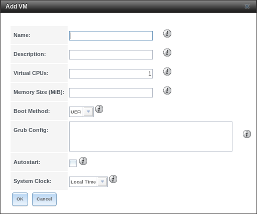

.. index:: VMs
.. _VMs:

Virtual Machines
================

A Virtual Machine (*VM*) is an environment on a host computer that
can be used as if it were a separate physical computer. VMs can be
used to run multiple operating systems simultaneously on a single
computer. Operating systems running inside a VM see emulated virtual
hardware rather than the actual hardware of the host computer. This
provides more isolation than :ref:`Jails`, although there is
additional overhead. A portion of system RAM is assigned to each VM,
and each VM uses a :ref:`zvol <Create zvol>` for storage. While a VM
is running, these resources are not available to the host computer or
other VMs.

%brand% VMs use the
`bhyve(8) <https://www.freebsd.org/cgi/man.cgi?query=bhyve>`__
virtual machine software. This type of virtualization requires an
Intel processor with Extended Page Tables (EPT) or an AMD processor
with Rapid Virtualization Indexing (RVI) or Nested Page Tables (NPT).
VMs cannot be created unless the host system supports these features.

To verify that an Intel processor has the required features, use
:ref:`Shell` to run :samp:`grep VT-x /var/run/dmesg.boot`. If the
*EPT* and *UG* features are shown, this processor can be used with
*bhyve*.

To verify that an AMD processor has the required features, use
:ref:`Shell` to run :command:`grep POPCNT /var/run/dmesg.boot`. If the
output shows the POPCNT feature, this processor can be used with
*bhyve*.

.. note:: By default, new VMs have the
   `bhyve(8) <https://www.freebsd.org/cgi/man.cgi?query=bhyve>`__
   :literal:`-H` option set. This causes the virtual CPU thread to
   yield when a HLT instruction is detected, and prevents idle VMs
   from consuming all of the host's CPU.

.. note:: AMD K10 "Kuma" processors include POPCNT but do not support
   NRIPS, which is required for use with bhyve. Production of these
   processors ceased in 2012 or 2013.

.. index:: Creating VMs
.. _Creating VMs:

Creating VMs
------------

Select
:menuselection:`VMs --> Add VM`
for the :guilabel:`Add VM` dialog shown in
:numref:`Figure %s <vms_add_fig>`:

.. _vms_add_fig:

   Add VM

VM configuration options are described in
:numref:`Table %s <vms_add_opts_tab>`.

.. tabularcolumns:: |>{\RaggedRight}p{\dimexpr 0.25\linewidth-2\tabcolsep}
                    |>{\RaggedRight}p{\dimexpr 0.12\linewidth-2\tabcolsep}
                    |>{\RaggedRight}p{\dimexpr 0.63\linewidth-2\tabcolsep}|

.. _vms_add_opts_tab:

.. table:: VM Options
   :class: longtable

   +----------------------+--------------+--------------------------------------------------------------------------------------------------------------+
   | Setting              | Value        | Description                                                                                                  |
   |                      |              |                                                                                                              |
   +======================+==============+==============================================================================================================+
   | VM Type              | drop-down    | Choose between a standard VM or a specialized |dockerhost| VM.                                               |
   |                      | menu         |                                                                                                              |
   +----------------------+--------------+--------------------------------------------------------------------------------------------------------------+
   | Name                 | string       | Enter a name to identify the VM.                                                                             |
   |                      |              |                                                                                                              |
   +----------------------+--------------+--------------------------------------------------------------------------------------------------------------+
   | Description          | string       | Enter a short description of the VM or its purpose.                                                          |
   |                      |              |                                                                                                              |
   +----------------------+--------------+--------------------------------------------------------------------------------------------------------------+
   | Virtual CPUs         | integer      | Select the number of virtual CPUs to allocate to the VM.                                                     |
   |                      |              | The maximum is 16 unless the host CPU limits the maximum.                                                    |
   |                      |              | The VM operating system might also have operational or licensing restrictions on the number of CPUs.         |
   |                      |              |                                                                                                              |
   +----------------------+--------------+--------------------------------------------------------------------------------------------------------------+
   | Memory Size (MiB)    | integer      | Allocate the amount of RAM in `mebibytes                                                                     |
   |                      |              | <https://simple.wikipedia.org/wiki/Mebibyte>`__ for the VM.                                                  |
   +----------------------+--------------+--------------------------------------------------------------------------------------------------------------+
   | Boot Method          | drop-down    | Select *UEFI* for newer operating systems,                                                                   |
   |                      | menu         | or *UEFI-CSM* for (Compatibility Support Mode) older operating systems that only understand BIOS booting.    |
   |                      |              |                                                                                                              |
   +----------------------+--------------+--------------------------------------------------------------------------------------------------------------+
   | Autostart            | checkbox     | Set to start the VM automatically when the system boots.                                                     |
   |                      |              |                                                                                                              |
   +----------------------+--------------+--------------------------------------------------------------------------------------------------------------+
   | System Clock         | drop-down    | VM system time. Choose between the host system *Local Time* or *UTC*.                                        |
   |                      | menu         |                                                                                                              |
   +----------------------+--------------+--------------------------------------------------------------------------------------------------------------+

.. index:: Adding Devices to a VM
.. _Adding Devices to a VM:

Adding Devices to a VM
----------------------

After creating the VM, click it to select it, then click
:guilabel:`Devices` and :guilabel:`Add Device` to add virtual hardware
to it:

.. figure:: images/vms-devices1.png

   Add Devices to a VM

Select the name of the VM from the :guilabel:`VM` drop-down menu, then
select the :guilabel:`Type` of device to add. These types are
available:

* :ref:`Network Interfaces <vms-network-interface>`

* :ref:`Disk Devices <vms-disk-device>`

* :ref:`Raw Files <vms-raw-file>`

* :ref:`CD-ROMs <vms-cd-rom>`

* :ref:`VNC Interface <vms-vnc>`

.. note:: A :ref:`|dockerhost|` does not support VNC connections.

:numref:`Figure %s <vms-nic_fig>` shows the fields that appear when
:guilabel:`Network Interface` is the selected :guilabel:`Type`.

.. _vms-network-interface:

Network Interfaces
~~~~~~~~~~~~~~~~~~

.. _vms-nic_fig:

.. figure:: images/vms-nic1a.png

   VM Network Interface Device

The default :guilabel:`Adapter Type` emulates an Intel e82545 (e1000)
Ethernet card for compatibility with most operating systems. *VirtIO*
can provide better performance when the operating system installed in
the VM supports VirtIO paravirtualized network drivers.

If the system has multiple physical network interface cards, use the
:guilabel:`Nic to attach` drop-down menu to specify which
physical interface to associate with the VM.

By default, the VM receives an auto-generated random MAC address. To
override the default with a custom value, enter the desired address
into the :guilabel:`MAC Address` field.

.. tip:: To check which interface is attached to a VM, start the VM
   and go to the :ref:`Shell`. Type :command:`ifconfig` and find the
   `tap <https://en.wikipedia.org/wiki/TUN/TAP>`__ interface that shows
   the name of the VM in the description.

.. _vms-disk-device:

Disk Devices
~~~~~~~~~~~~

:ref:`Zvols <Create zvol>` are typically used as virtual hard drives.
After :ref:`creating a zvol <Create zvol>`, associate it with the VM
by selecting :guilabel:`Add device`.

.. figure:: images/vms-disk1.png

   VM Disk Device

Choose the *VM*, select a :guilabel:`Type` of *Disk*, select the created
zvol, then set the :guilabel:`Mode`:

* *AHCI* emulates an AHCI hard disk for best software compatibility.
  This is recommended for Windows VMs.

* *VirtIO* uses paravirtualized drivers and can provide better
  performance, but requires the operating system installed in the VM to
  support VirtIO disk devices.

If a specific sector size is required, enter the number of bytes into
:guilabel:`Disk sector size`. The default of *0* uses an autotune script
to determine the best sector size for the zvol.

.. _vms-raw-file:

Raw Files
~~~~~~~~~

*Raw Files* are similar to :ref:`Zvol <Create zvol>` disk devices,
but the disk image comes from a file. These are typically used with
existing read-only binary images of drives, like an installer disk
image file meant to be copied onto a USB stick.

After obtaining and copying the image file to the %brand% system,
select :guilabel:`Add device`, choose the *VM*, select a
:guilabel:`Type` of *Raw File*, browse to the image file, then set the
:guilabel:`Mode`:

* *AHCI* emulates an AHCI hard disk for best software compatibility.

* *VirtIO* uses paravirtualized drivers and can provide better
  performance, but requires the operating system installed in the VM to
  support VirtIO disk devices.

A |dockerhost| also has a :guilabel:`password` field. This is the login
password for the |dockerhost|.

If a specific sector size is required, enter the number of bytes into
:guilabel:`Disk sectorsize`. The default of *0* uses an autotuner to
find and set the best sector size for the file.

.. figure:: images/vms-raw-file.png

   VM Raw File Disk Device

.. _vms-cd-rom:

CD-ROM Devices
~~~~~~~~~~~~~~

Adding a CD-ROM device makes it possible to boot the VM from a CD-ROM
image, typically an installation CD. The image must be present on an
accessible portion of the %brand% storage. In this example, a FreeBSD
installation image is shown:

.. figure:: images/vms-cdrom.png

   VM CD-ROM Device

.. note:: VMs from other virtual machine systems can be recreated for
   use in %brand%. Back up the original VM, then create a new %brand%
   VM with virtual hardware as close as possible to the original VM.
   Binary-copy the disk image data into the :ref:`zvol <Create zvol>`
   created for the %brand% VM with a tool that operates at the level
   of disk blocks, like
   `dd(1) <https://www.freebsd.org/cgi/man.cgi?query=dd>`__.
   For some VM systems, it is best to back up data, install the
   operating system from scratch in a new %brand% VM, and restore the
   data into the new VM.

.. _vms-VNC:

VNC Interface
~~~~~~~~~~~~~

VMs set to *UEFI* booting are also given a VNC (Virtual Network
Computing) remote connection. A standard
`VNC <https://en.wikipedia.org/wiki/Virtual_Network_Computing>`__
client can connect to the VM to provide screen output and keyboard and
mouse input. Each standard VM can have a single VNC device. A
|dockerhost| does not support VNC devices.

.. note:: Using a non-US keyboard with VNC is not yet supported. As a
   workaround, select the US keymap on the system running the VNC client,
   then configure the operating system running in the VM to use a
   keymap that matches the physical keyboard. This will enable
   passthrough of all keys regardless of the keyboard layout.

:numref:`Figure %s <vms-vnc_fig>` shows the fields that appear when
:guilabel:`VNC` is the selected :guilabel:`Type`.

.. _vms-vnc_fig:

.. figure:: images/vms-vnc1.png

   VM VNC Device

The :guilabel:`Resolution` drop-down menu can be used to
modify the default screen resolution used by the VNC session.

The :guilabel:`VNC port` can be set to *0*, left empty for
%brand% to assign a port when the VM is started, or set to a fixed,
preferred port number.

Select the IP address for VNC to listen on with the
:guilabel:`Bind to` drop-down menu.

Set :guilabel:`Wait to boot` to indicate that the VNC client should wait
until the VM has booted before attempting the connection.

To automatically pass the VNC password, enter it into the
:guilabel:`Password` field. Note that the password is limited to 8
characters.

To use the VNC web interface, set :guilabel:`VNC Web`.

.. tip:: If a RealVNC 5.X Client shows the error
   :literal:`RFB protocol error: invalid message type`, disable the
   :guilabel:`Adapt to network speed` option and move the slider to
   :guilabel:`Best quality`. On later versions of RealVNC, select
   :menuselection:`File --> Preferences`,
   click :guilabel:`Expert`, :guilabel:`ProtocolVersion`, then
   select 4.1 from the drop-down menu.

.. _vms-virtual-serial:

Virtual Serial Ports
~~~~~~~~~~~~~~~~~~~~

VMs automatically include a virtual serial port.

* :file:`/dev/nmdm1B` is assigned to the first VM

* :file:`/dev/nmdm2B` is assigned to the second VM

And so on. These virtual serial ports allow connecting to the VM
console from the :ref:`Shell`.

.. tip:: The `nmdm <https://www.freebsd.org/cgi/man.cgi?query=nmdm>`__
   device is dynamically created. The actual :literal:`nmdm` name can
   differ on each system.

To connect to the first VM:

.. code-block:: none

   cu -s 9600 -l /dev/nmdm1B

See
`cu(1) <https://www.freebsd.org/cgi/man.cgi?query=cu>`__
for more information on operating :command:`cu`.

.. index:: Running VMs
.. _Running VMs:

Running VMs
-----------

Select
:menuselection:`VMs`
to see a list of configured VMs. Configuration and control buttons
appear at the bottom of the screen when an individual VM is selected
with a mouse click:

.. figure:: images/vms-control1.png

   VM Configuration and Control Buttons

The name, description, running state, VNC port (if present), and other
configuration values are shown. Click on an individual VM for
additional options.

Some standard buttons are shown for all VMs:

* :guilabel:`Edit` changes VM settings.

* :guilabel:`Delete` :ref:`removes the VM <Deleting VMs>`.

* :guilabel:`Devices` is used to add and remove devices to this VM.

When a VM is not running, these buttons are available:

* :guilabel:`Start` starts the VM.

* :guilabel:`Clone` *clones* or copies the VM to a new VM. The new VM
  is given the same name as the original, with *_cloneN* appended.

When a VM is already running, these buttons are available:

* :guilabel:`Stop` shuts down the VM.

* :guilabel:`Power off` immediately halts the VM, equivalent to
  disconnecting the power on a physical computer.

* :guilabel:`Restart` restarts the VM.

* :guilabel:`Vnc via Web` starts a web VNC connection to the VM. The
  VM must have a VNC device and :guilabel:`VNC Web` enabled in that
  device.

.. index:: Deleting VMs
.. _Deleting VMs:

Deleting VMs
------------

A VM is deleted by clicking the
VM, then :guilabel:`Delete` at the bottom of the screen. A
dialog shows any related devices that will also be deleted and asks
for confirmation.

.. tip:: :ref:`Zvols <Create zvol>` used in
   :ref:`disk devices <vms-disk-device>` and image files used in
   :ref:`raw file <vms-raw-file>` devices are *not* removed when a VM
   is deleted. These resources can be removed manually after it is
   determined that the data in them has been backed up or is no longer
   needed.

.. index:: |dockerhost|
.. _|dockerhost|:

|dockerhost|
------------

`Docker <https://www.docker.com/what-docker>`__
is open source software for automating application deployment inside
containers. A container provides a complete filesystem, runtime, system
tools, and system libraries, so applications always see the same
environment.

`Rancher <https://rancher.com/>`__
is a web-based tool for managing Docker containers.

%brand% runs the Rancher web interface within the |dockerhost|.

.. index:: |dockerhost| Requirements
.. _|dockerhost| Requirements:

|dockerhost| Requirements
~~~~~~~~~~~~~~~~~~~~~~~~~

The system BIOS **must** have virtualization support enabled for a
|dockerhost| to work properly. On Intel systems this is typically an
option called *VT-x*. AMD systems generally have an *SVM* option.

20 GiB of storage space is required for the |dockerhost|. For setup, the
:ref:`SSH` service must be enabled.

The |dockerhost| requires 2 GiB of RAM while running.

.. index:: Create the |dockerhost|
.. _Create the |dockerhost|:

Create the |dockerhost|
~~~~~~~~~~~~~~~~~~~~~~~

:numref:`Figure %s <vms_add_docker_fig>` shows the window that appears
after going to the
:menuselection:`VMs`
page, clicking :guilabel:`Add VM`, and selecting |dockerhost| as the
:guilabel:`VM Type`.

.. _vms_add_docker_fig:

.. figure:: images/vms-add-rancher.png

   Docker VM Configuration

.. tabularcolumns:: |>{\RaggedRight}p{\dimexpr 0.08\linewidth-2\tabcolsep}
                    |>{\RaggedRight}p{\dimexpr 0.20\linewidth-2\tabcolsep}
                    |>{\RaggedRight}p{\dimexpr 0.12\linewidth-2\tabcolsep}
                    |>{\RaggedRight}p{\dimexpr 0.60\linewidth-2\tabcolsep}|

.. _vms_add_docker_opts_tab:

.. table:: Docker VM Options
   :class: longtable

   +--------------------------------+----------------+------------------------------------------------------------------------------------+
   | Setting                        | Value          | Description                                                                        |
   |                                |                |                                                                                    |
   +================================+================+====================================================================================+
   | VM Type                        | drop-down menu | Choose between a standard VM or a specialized |dockerhost| VM.                     |
   |                                |                |                                                                                    |
   +--------------------------------+----------------+------------------------------------------------------------------------------------+
   | Name                           | string         | A descriptive name for the |dockerhost|.                                           |
   |                                |                |                                                                                    |
   +--------------------------------+----------------+------------------------------------------------------------------------------------+
   | Description                    | string         | A description of this |dockerhost|.                                                |
   |                                |                |                                                                                    |
   +--------------------------------+----------------+------------------------------------------------------------------------------------+
   | Virtual CPUs                   | integer        | Number of virtual CPUs to allocate to the |dockerhost|. The maximum is             |
   |                                |                | *16* unless the host CPU also limits the maximum.                                  |
   |                                |                | The VM operating system can also have operational or licensing restrictions on     |
   |                                |                | the number of CPUs.                                                                |
   |                                |                |                                                                                    |
   +--------------------------------+----------------+------------------------------------------------------------------------------------+
   | Memory Size (MiB)              | integer        | Allocate this amount of RAM in MiB for the |dockerhost|. A minimum *2048* MiB of   |
   |                                |                | RAM is required.                                                                   |
   |                                |                |                                                                                    |
   +--------------------------------+----------------+------------------------------------------------------------------------------------+
   | Autostart                      | checkbox       | Set to start this |dockerhost| when the %brand% system boots.                      |
   |                                |                |                                                                                    |
   +--------------------------------+----------------+------------------------------------------------------------------------------------+
   | Root Password                  | string         | Enter a password to use with the |dockerhost| *root* account. The password cannot  |
   |                                |                | contain a space.                                                                   |
   |                                |                |                                                                                    |
   +--------------------------------+----------------+------------------------------------------------------------------------------------+
   | Docker Disk File               | string         | :guilabel:`Browse` to the location to store a new raw file. Add :literal:`/`, a    |
   |                                |                | unique name to the end of the path, and :literal:`.img` to create a new raw file   |
   |                                |                | with that name. Example: :samp:`/mnt/pool1/rancherui.img`                          |
   |                                |                |                                                                                    |
   +--------------------------------+----------------+------------------------------------------------------------------------------------+
   | Size of Docker Disk File (GiB) | integer        | Allocate storage size in GiB for the new raw file. *20* is the minimum             |
   |                                |                | recommendation.                                                                    |
   |                                |                |                                                                                    |
   +--------------------------------+----------------+------------------------------------------------------------------------------------+

Recommendations for the |dockerhost|:

* Enter *Rancher UI VM* for the :guilabel:`Description`.
* Leave the number of :guilabel:`Virtual CPUs` at *1*.
* Enter *2048* for the :guilabel:`Memory Size`.
* Leave *20* as the :guilabel:`Size of Docker Disk File (GiB)`.

Click :guilabel:`OK` to create the virtual machine.

To make any changes to the raw file after creating the Docker VM,
click on the :guilabel:`Devices` button for the VM to show the devices
attached to that VM. Click on the *RAW* device to select it, then click
:guilabel:`Edit`. :numref:`Figure %s <vms_rancher_storage_fig>` shows
the options for editing the |dockerhost| raw file options.

.. _vms_rancher_storage_fig:

.. figure:: images/vms-rancher-storage.png

   Changing the |dockerhost| Password

The :ref:`raw file options <vms-raw-file>` section describes the options
in this window.

Start the |dockerhost|
~~~~~~~~~~~~~~~~~~~~~~

Click :guilabel:`VMs`, then click on the |dockerhost| line to select it.
Click the :guilabel:`Start` button and :guilabel:`Yes` to start the VM.

SSH into the |dockerhost|
~~~~~~~~~~~~~~~~~~~~~~~~~

It is possible to SSH into a running |dockerhost|. Go to the
:menuselection:`VMs`
page and find the |dockerhost|. The :guilabel:`Info` column shows the
|dockerhost| :guilabel:`Com Port`. In this example,
:literal:`/dev/nmdm12B` is used.

Use an SSH client to connect to the %brand% server. Remember this also
requires the :ref:`SSH` service to be running. Depending on the %brand%
system configuration, it might also require changes to the
:guilabel:`SSH` service settings, like setting
:guilabel:`Login as Root with Password`.

At the %brand% console prompt, connect to the running |dockerhost| with
`cu <https://www.freebsd.org/cgi/man.cgi?query=cu>`__, replacing
:samp:`{/dev/nmdm12B}` with the value from the |dockerhost|
:guilabel:`Com Port`:

.. code-block:: none

   cu -l /dev/nmdm12B -s 9600

If the terminal does not show a :literal:`rancher login:` prompt,
press :kbd:`Enter`. The |dockerhost| can take several minutes to start
and display the login prompt.

.. _Installing and Configuring the Rancher Server:

Installing and Configuring the Rancher Server
~~~~~~~~~~~~~~~~~~~~~~~~~~~~~~~~~~~~~~~~~~~~~

Using the |dockerhost| to install and configure the Rancher Server is
done from the command line. Open the :ref:`Shell` and enter the command
:samp:`cu -l {/dev/nmdm12B} -s 9600`, where :samp:`{/dev/nmdm12B}` is
the :guilabel:`Com Port` value in the :guilabel:`Info` column for the
Docker VM.

If the terminal does not show a :literal:`rancher login:` prompt after
a few moments, press :kbd:`Enter`.

Enter *rancher* as the username, press :kbd:`Enter`, then type the
password that was entered when the raw file was created above and
press :kbd:`Enter` again. After logging in, a
:literal:`[rancher@rancher ~]$` prompt is displayed.

Ensure Rancher has functional networking and can :command:`ping` an
outside website.

.. code-block:: none

   [rancher]@ClientHost ~]$ ping -c 3 google.com
   PING google.com (172.217.0.78): 56 data bytes

   64 bytes from 172.217.0.78: seq=0 ttl=54 time=18.613 ms
   64 bytes from 172.217.0.78: seq=1 ttl=54 time=18.719 ms
   64 bytes from 172.217.0.78: seq=2 ttl=54 time=18.788 ms

   --- google.com ping statistics ---

   3 packets transmitted, 3 packets received, 0% packet loss
   round-trip min/avg/max = 18.613/18.706/18.788 ms

If :command:`ping` returns an error, adjust the VM
:ref:`Network Interface <vms-network-interface>` and reboot the
|dockerhost|.

Download and install the Rancher server with
:command:`sudo docker run -d --restart=unless-stopped -p 8080:8080 rancher/server`.

If a :literal:`Cannot connect to the Docker daemon` error is shown,
enter :command:`sudo dockerd` and try
:command:`sudo docker run -d --restart=unless-stopped -p 8080:8080 rancher/server`
again. Installation time varies with processor and network connection
speed. :literal:`[rancher@ClientHost ~]$` is shown when the installation
is finished.

Enter :command:`ifconfig eth0 | grep 'inet addr'` to view the Rancher
IP address. Enter the IP address followed by :literal:`:8080` into a web
browser to connect to the Rancher web interface. For example, if the IP
address is :literal:`10.231.3.208`, enter :literal:`10.231.3.208:8080`
in the browser.

The Rancher web interface takes a few minutes to start. The web browser
might show a connection error while the web interface starts. If a
:literal:`connection has timed out` error is shown, wait one minute and
refresh the page.

When the Rancher web interface loads, click :guilabel:`Add a host` from
the banner across the top of the screen. Verify that
:guilabel:`This site's address` is chosen and click :guilabel:`Save`.

Follow the steps shown in the Rancher web interface and copy the full
:samp:`sudo docker run` command from the text box. Paste it in the
|dockerhost| shell. The |dockerhost| will finish configuring Rancher. A
:literal:`[rancher@ClientHost ~]$` prompt is shown when the
configuration is complete.

Verify that the configuration is complete. Go to the Rancher web
interface and click
:menuselection:`INFRASTRUCTURE --> Hosts`.
When a host with the Rancher IP address is shown,
configuration is complete and Rancher is ready to use.

For more information on Rancher, see the Rancher
`documentation <https://rancher.com/docs/os/v1.x/en/>`__.

.. _Configure Rancher Containers with NFS Pass-through:

Configuring Persistent NFS-Shared Volumes
~~~~~~~~~~~~~~~~~~~~~~~~~~~~~~~~~~~~~~~~~~~~~~~~~~~~~~~~~~~~~~~~~

Rancher supports using a single persistent volume with multiple
containers. This volume can also be shared with %brand% using NFS.
%brand% must be configured with specific NFS permissions and a
`Rancher NFS server
<https://rancher.com/docs/rancher/v1.6/en/rancher-services/storage-service/rancher-nfs/>`__
must have a properly configured `stack scoped volume
<https://rancher.com/docs/rancher/v1.6/en/cattle/volumes/#volume-scopes>`__.

A stack scoped volume is data that is managed by a single Rancher stack.
The volume is shared by all services that reference it in the stack.

Configure NFS sharing for a stack scoped volume by setting specific
options in the command line of the Rancher NFS server and the %brand%
system:

* Log in to the Rancher NFS server and modify :file:`/etc/exports`. Add
  an entry for the NFS shared directory, typically :file:`/nfs`, with
  several permissions options:
  :samp:`/nfs	{IP}(rw,sync,no_root_squash,no_subtree_check)`.
  *IP* is the IP address of the client and can also be set to the
  wildcard :literal:`*`.

* In the %brand% |web-ui|, go to
  :menuselection:`Services --> NFS Settings`.
  Set :guilabel:`Enable NFSv4` and
  :guilabel:`NFSv3 ownership model for NFSv4`. Click :guilabel:`SAVE`
  and restart the :guilabel:`NFS` service.

* Add :literal:`:nocopy` to the end of the pool to be mounted:
  :samp:`mount -t nfs pool:{/mnt/pool1}:nocopy {~nfsmounts/pool1_mount}`
