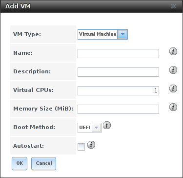

.. index:: VMs
.. _VMs:

VMs
===

A Virtual Machine (*VM*) is an environment on a host computer that
can be used as if it were a separate physical computer. VMs can be
used to run multiple operating systems simultaneously. Operating
systems running inside a VM see emulated virtual hardware rather than
the actual hardware of the host computer. This provides more isolation
than :ref:`Jails`, although there is additional overhead. A portion of
system RAM is assigned to each VM, and each VM uses a
:ref:`zvol <Create zvol>` for storage. While a VM is running, these
resources are not available to the host computer or other VMs.

%brand% VMs use the
`bhyve(8)
<https://www.freebsd.org/cgi/man.cgi?query=bhyve&manpath=FreeBSD+11.0-RELEASE+and+Ports>`_
virtual machine software. This type of virtualization requires an
Intel processor with Extended Page Tables (EPT) or an AMD processor
with Rapid Virtualization Indexing (RVI) or Nested Page Tables (NPT).

To verify that an Intel processor has the required features, use
:ref:`Shell` to run :samp:`grep VT-x /var/run/dmesg.boot`. If the
*EPT* and *UG* features are shown, this processor can be used with
*bhyve*.

To verify that an AMD processor has the required features, use
:ref:`Shell` to run :command:`grep POPCNT /var/run/dmesg.boot`. If the
output shows the POPCNT feature, this processor can be used with
*bhyve*.

.. index:: Creating VMs
.. _Creating VMs:

Creating VMs
------------

Select
:menuselection:`VMs --> Add VM` for the :guilabel:`Add VM` dialog
shown in
:numref:`Figure %s <vms_add_fig>`:

.. _vms_add_fig:

   Add VM

VM configuration options are described in
:numref:`Table %s <vms_add_opts_tab>`.

.. tabularcolumns:: |>{\RaggedRight}p{\dimexpr 0.25\linewidth-2\tabcolsep}
                    |>{\RaggedRight}p{\dimexpr 0.12\linewidth-2\tabcolsep}
                    |>{\RaggedRight}p{\dimexpr 0.63\linewidth-2\tabcolsep}|

.. _vms_add_opts_tab:

.. table:: Options When Adding a VM
   :class: longtable

   +-------------------+----------------+------------------------------------------------------------------------------------+
   | Setting           | Value          | Description                                                                        |
   |                   |                |                                                                                    |
   +===================+================+====================================================================================+
   | Name              | string         | a name to identify the VM                                                          |
   |                   |                |                                                                                    |
   +-------------------+----------------+------------------------------------------------------------------------------------+
   | Description       | string         | a short description of the VM or its purpose                                       |
   |                   |                |                                                                                    |
   +-------------------+----------------+------------------------------------------------------------------------------------+
   | Virtual CPUs      | integer        | quantity of virtual CPUs allocated to the VM                                       |
   |                   |                |                                                                                    |
   +-------------------+----------------+------------------------------------------------------------------------------------+
   | Memory Size (MiB) | integer        | megabytes of RAM allocated to the VM                                               |
   |                   |                |                                                                                    |
   +-------------------+----------------+------------------------------------------------------------------------------------+
   | Boot Method       | drop-down menu | *UEFI* for newer operating systems, or *UEFI-CSM* (Compatibility Support Mode) for |
   |                   |                | older operating systems that only understand BIOS booting                          |
   |                   |                |                                                                                    |
   +-------------------+----------------+------------------------------------------------------------------------------------+

.. index:: Adding Devices to a VM
.. _Adding Devices to a VM:

Adding Devices to a VM
----------------------

After creating the VM, click it to select it, then click the Devices
button at the bottom of the screen to add virtual hardware to it:

.. figure:: images/vms-devices.png

   Add Devices to a VM

VMs are given a NIC (Network Interface Card) by default. This
interface emulates an Intel E1000 (82545) Ethernet card for
compatibility with most operating systems:

.. figure:: images/vms-nic.png

   VM Network Interface Device

The :guilabel:`Adapter Type` can be changed to *VirtIO* to provide
better performance when the operating system installed in the VM
supports VirtIO paravirtualized network drivers.

VMs set to *UEFI* booting are also given a VNC (Virtual Network
Computing) remote connection:

.. figure:: images/vms-vnc.png

   VM VNC Device

A standard VNC client can connect to the VM to provide screen output
and keyboard and mouse input. The VNC port number can be set to *0* or
left empty for %brand% to assign a port when the VM is started, or set
to a fixed, preferred port number.

:ref:`Zvols <Create zvol>` are used as virtual hard drives. After
:ref:`creating a zvol <Create zvol>`, select :guilabel:`Add device`,
choose the *VM*, select a :guilabel:`Type` of *Disk*, select the zvol,
then set the :guilabel:`Mode`:

.. figure:: images/vms-disk.png

   VM Disk Device

*AHCI* emulates an AHCI hard disk for best software compatibility.
*VirtIO* uses paravirtualized drivers and can provide better
performance, but requires the operating system installed in the VM to
support VirtIO disk devices.

Adding a CD-ROM device makes it possible to boot the VM from a CD-ROM
image, typically an installation CD. The image must be present on an
accessible portion of the %brand% storage. In this example, a FreeBSD
installation image is shown:

.. figure:: images/vms-cdrom.png

   VM CD-ROM Device

.. index:: Running VMs
.. _Running VMs:

Running VMs
-----------

Select
:menuselection:`VMs`
to see a list of configured VMs. Configuration and control buttons
appear at the bottom of the screen when an individual VM is selected
with a mouse click:

.. figure:: images/vms-control.png

   VM Configuration and Control Buttons

The name, description, running state, VNC port (if present), and other
configuration values are shown. A :guilabel:`Start` button is shown
when the VM is not running. Click this to start the VM. If a VNC port
is present, use VNC client software to connect to that port for screen
output and keyboard and mouse input.

On running VMs, the button is shown as :guilabel:`Stop`, and used,
unsurprisingly, to stop them.
